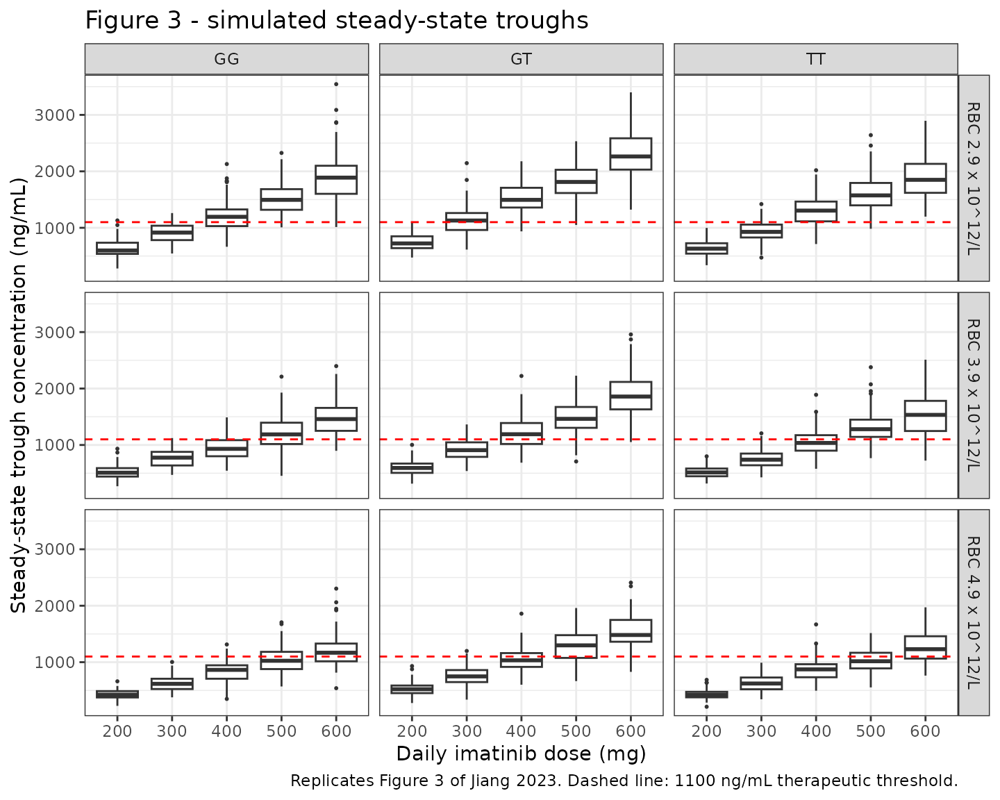

# Imatinib (Jiang 2023)

## Model and source

- Citation: Jiang X, Fu Q, Jing Y, Kong Y, Liu H, Peng H, Rexiti K,
  Wei X. Personalized dose of adjuvant imatinib in patients with
  gastrointestinal stromal tumors: results from a population
  pharmacokinetic analysis. Drug Des Devel Ther. 2023;17:809-820.
  <doi:10.2147/DDDT.S400986>.
- Description: One-compartment population PK model with first-order
  absorption and first-order elimination for oral adjuvant imatinib in
  postoperative Chinese adults with gastrointestinal stromal tumors
  (Jiang 2023). The absorption rate constant is fixed at 1.22 1/h.
  Apparent oral clearance CL/F carries two covariate effects: a
  power-form red blood cell count effect ((RBC/3.7)^0.49) and a
  three-level ABCG2 rs2231142 genotype effect encoded with paired binary
  indicators (GG wild-type reference = 1, GT heterozygote = 0.879, TT
  homozygous variant = 0.976). Inter-individual variability is estimated
  on CL/F only; the apparent volume of distribution V/F is a typical
  value with no IIV because only trough concentrations were collected.
  Residual error is proportional.
- Article: <https://doi.org/10.2147/DDDT.S400986>

Jiang 2023 is an open-access article in *Drug Design, Development and
Therapy* (PMC10024496). No supplement containing model code or parameter
tables is distributed with the article; the two supplementary items
referenced in the text (Supplementary Figure 1, the
linkage-disequilibrium plot, and Supplementary Figure 2, the covariate
correlation matrix) are diagnostic figures and contain no parameter
values. No erratum or corrigendum was found for this article.

## Population

The model was developed from 85 adults with histologically confirmed
gastrointestinal stromal tumour (GIST) who had undergone surgical
resection and were at intermediate or high risk of recurrence by the
modified NIH criteria, treated with adjuvant oral imatinib at The First
Affiliated Hospital of Nanchang University (Jiangxi Province, China)
between March 2021 and June 2022. A further 25 patients formed an
external validation set.

Per Jiang 2023 Table 1 (modeling dataset): 46 male / 39 female (45.9%
female); median age 57 years (range 27-79); mean body weight 58.6 +/-
9.6 kg (range 40.0-82.5); red blood cell count 3.7 +/- 0.6 x 10^12/L
(range 2.2-5.6); median creatinine clearance 69.7 mL/min (28.5-118.8).
The initial-dose distribution across 200/300/400/500/600 mg daily was
1/2/79/2/1 patients, so 92.9% of the cohort received the standard 400 mg
once-daily regimen. Sampling was sparse therapeutic drug monitoring,
with most samples drawn at steady state (at least 30 days of continuous
imatinib); **only trough concentrations were collected**, which is why
inter-individual variability could not be estimated on the apparent
volume of distribution.

Six single-nucleotide polymorphisms were genotyped (Jiang 2023 Table 2).
The one retained in the final model, *ABCG2* rs2231142, was distributed
GG 34 (40%), GT 45 (53%), TT 6 (7%), with allele frequency G 0.66 / T
0.34 and Hardy-Weinberg p = 0.22. All six SNPs satisfied Hardy-Weinberg
equilibrium and none were in linkage disequilibrium.

The same information is available programmatically via the model’s
`population` metadata
(`readModelDb("Jiang_2023_imatinib")()$population`).

## Source trace

The per-parameter origin is recorded as an in-file comment next to each
`ini()` entry in `inst/modeldb/specificDrugs/Jiang_2023_imatinib.R`. The
table below collects them in one place for review.

| Equation / parameter | Value | Source location |
|----|----|----|
| Structural model: one compartment, first-order absorption and elimination | n/a | Results / PPK Analysis, p. 813: “well described by a one-compartment model (subroutine ADVAN2 and TRANS2) with first-order absorption and elimination” |
| IIV form `P_i = TV(P) * exp(eta_i)` | n/a | Equation 1, p. 811 |
| Residual error form `Y = F * (1 + eps1)` (proportional) | n/a | Equation 3, p. 811; selection stated in Results / PPK Analysis, p. 813 |
| Continuous-covariate power form `P = TV(P) * (Cov/Ref)^theta` | n/a | Equation 7, p. 812 |
| Categorical-covariate form `P = TV(P) * theta1^heterozygous * theta2^homozygous` | n/a | Equation 8, p. 812 |
| Final-model covariate equation `CL/F = 9.72 * (RBC/3.7)^0.49 * 0.879^het * 0.976^hom * e^0.0192` | n/a | Final-model equation, p. 814 (immediately after “the formula of the final model was expressed as:”) |
| Final-model `V/F = 229` | n/a | Final-model equation, p. 814 |
| `lka` (ka fixed) | 1.22 1/h | Table 3, row “Ka (1/h)” = 1.22 (Fixed); also Base Model text p. 811 |
| `lcl` (CL/F reference) | 9.72 L/h | Table 3, row “CL/F (L/h)”, RSE 8%, bootstrap 9.72 (8.22-11.84) |
| `lvc` (V/F) | 229 L | Table 3, row “V/F (L)”, RSE 21%, bootstrap 226.3 (156.4-421.6) |
| `e_rbc_cl` (RBC power exponent) | 0.49 | Table 3, row “RBC”, RSE 38%, bootstrap 0.48 (0.10-0.89) |
| RBC reference value | 3.7 x 10^12/L | Final-model equation p. 814 `(RBC/3.7)`; cohort central value in Table 1; “Ref represents the median of the covariate values” (Covariate Model, p. 812) |
| `e_abcg2_het_cl` (rs2231142 GT factor) | 0.879 | Table 3, row “rs2231142 GT”, RSE 5%, bootstrap 0.877 (0.785-0.968) |
| `e_abcg2_hom_cl` (rs2231142 TT factor) | 0.976 | Table 3, row “rs2231142 TT”, RSE 9%, bootstrap 0.976 (0.801-1.582) |
| rs2231142 GG reference factor | 1 (fixed) | Table 3, row “rs2231142 GG” = 1 (Fixed) |
| `etalcl` (IIV variance on CL/F) | 0.0192 | Final-model equation p. 814 exponential term `e^0.0192`; Table 3 reports omega = 0.139 (RSE 39%), rendered as “13.9%” in Results / PPK Analysis p. 813; 0.139^2 = 0.0193 |
| `propSd` (proportional residual SD) | 0.296 | Table 3, row “Residual / Proportional”, RSE 27%, bootstrap 0.288 (0.219-0.371); rendered as “29.6%” in Results / PPK Analysis p. 813 |
| No IIV on V/F | n/a | Results / PPK Analysis p. 813: “Inter-individual variation on V/F was not estimated in this analysis because only trough concentrations were collected and the estimate of inter-individual variation in the distribution volume was \<1%” |
| Target trough threshold | 1100 ng/mL | Dosage Simulation, p. 812; Introduction, p. 810 |

## Virtual cohort

Original observed data are not publicly available. The simulations below
use virtual cohorts whose covariate values are exactly the scenario grid
Jiang 2023 used for its Monte Carlo dose simulations (Figure 3): three
*ABCG2* rs2231142 genotypes (GG, GT, TT) crossed with three
red-blood-cell-count levels (2.9, 3.9 and 4.9 x 10^12/L) and five daily
doses (200-600 mg).

``` r

set.seed(20230314)

n_per_arm <- 100L  # <= 200 per arm (skill cap); Jiang 2023 used n = 1000

# Genotype strata, encoded with the paired binary indicators the model uses.
# GG (wild type) is the reference: both indicators are 0.
genotypes <- tibble::tribble(
  ~genotype, ~SNP_ABCG2_RS2231142_HET, ~SNP_ABCG2_RS2231142_HOM,
  "GG",      0,                        0,
  "GT",      1,                        0,
  "TT",      0,                        1
)

# Jiang 2023 Dosage Simulation: trough concentrations "after 30-day imatinib
# treatment". 30 once-daily doses at t = 0, 24, ..., 696 h; the trough is the
# concentration 24 h after the last dose, i.e. at t = 720 h.
tau       <- 24
n_doses   <- 30L
dose_times <- seq(0, by = tau, length.out = n_doses)
t_trough  <- max(dose_times) + tau

# One arm = one (genotype, RBC, dose) scenario. `id_offset` keeps subject IDs
# disjoint across arms; duplicate IDs would be silently merged by rxSolve.
make_arm <- function(n, dose, rbc, het, hom, arm_label, obs_times,
                     id_offset = 0L) {
  subj <- tibble::tibble(
    id  = id_offset + seq_len(n),
    RBC = rbc,
    SNP_ABCG2_RS2231142_HET = het,
    SNP_ABCG2_RS2231142_HOM = hom,
    arm = arm_label,
    dose_mg = dose
  )
  doses <- subj |>
    tidyr::crossing(time = dose_times) |>
    dplyr::mutate(amt = dose, evid = 1L, cmt = "depot")
  obs <- subj |>
    tidyr::crossing(time = obs_times) |>
    dplyr::mutate(amt = NA_real_, evid = 0L, cmt = "central")
  dplyr::bind_rows(doses, obs) |>
    dplyr::arrange(id, time, dplyr::desc(evid))
}

scenarios <- tidyr::crossing(
  genotypes,
  RBC     = c(2.9, 3.9, 4.9),
  dose_mg = c(200, 300, 400, 500, 600)
) |>
  dplyr::mutate(
    arm = sprintf("%s | RBC %.1f | %d mg", genotype, RBC, dose_mg),
    id_offset = (dplyr::row_number() - 1L) * n_per_arm
  )

events_fig3 <- do.call(
  dplyr::bind_rows,
  lapply(seq_len(nrow(scenarios)), function(i) {
    s <- scenarios[i, ]
    make_arm(
      n         = n_per_arm,
      dose      = s$dose_mg,
      rbc       = s$RBC,
      het       = s$SNP_ABCG2_RS2231142_HET,
      hom       = s$SNP_ABCG2_RS2231142_HOM,
      arm_label = s$arm,
      obs_times = t_trough,
      id_offset = s$id_offset
    ) |>
      dplyr::mutate(genotype = s$genotype)
  })
)

# Cheap regression guard against the silent id-collision bug.
stopifnot(!anyDuplicated(unique(events_fig3[, c("id", "time", "evid")])))
nrow(events_fig3)
#> [1] 139500
```

## Simulation

``` r

mod <- readModelDb("Jiang_2023_imatinib")

sim_fig3 <- rxode2::rxSolve(
  mod,
  events = events_fig3,
  keep   = c("arm", "genotype", "RBC", "dose_mg")
) |>
  as.data.frame() |>
  dplyr::filter(!is.na(Cc))
#> ℹ parameter labels from comments will be replaced by 'label()'

nrow(sim_fig3)
#> [1] 4500
```

`Cc` is the individual prediction, i.e. the typical value multiplied by
`exp(eta_CL)`. It carries the between-patient variability that drives
the dose decision but not the proportional residual (assay / model
misspecification) error, which is the appropriate quantity for a
dose-selection simulation.

## Replicate published figures

### Figure 3 - steady-state trough by genotype, RBC level and daily dose

``` r

# Replicates Figure 3 of Jiang 2023: box plots of simulated steady-state trough
# concentrations for 200-600 mg daily, by ABCG2 rs2231142 genotype and RBC
# level. The dashed line is the 1100 ng/mL therapeutic threshold.
sim_fig3 |>
  dplyr::mutate(
    genotype = factor(genotype, levels = c("GG", "GT", "TT")),
    rbc_lab  = factor(
      sprintf("RBC %.1f x 10^12/L", RBC),
      levels = sprintf("RBC %.1f x 10^12/L", c(2.9, 3.9, 4.9))
    ),
    dose_lab = factor(dose_mg, levels = c(200, 300, 400, 500, 600))
  ) |>
  ggplot(aes(x = dose_lab, y = Cc)) +
  geom_boxplot(outlier.size = 0.4) +
  geom_hline(yintercept = 1100, linetype = "dashed", colour = "red") +
  facet_grid(rbc_lab ~ genotype) +
  labs(
    x = "Daily imatinib dose (mg)",
    y = "Steady-state trough concentration (ng/mL)",
    title = "Figure 3 - simulated steady-state troughs",
    caption = paste(
      "Replicates Figure 3 of Jiang 2023.",
      "Dashed line: 1100 ng/mL therapeutic threshold."
    )
  ) +
  theme_bw()
```



### Dose recommendations implied by the simulation

Jiang 2023 read its dose recommendations off Figure 3. The table below
applies an explicit rule – the lowest daily dose whose **median**
simulated trough reaches 1100 ng/mL – and compares it with the
recommendations stated in the paper’s Results / Dosing Regimen and
Abstract.

``` r

median_trough <- sim_fig3 |>
  dplyr::group_by(genotype, RBC, dose_mg) |>
  dplyr::summarise(median_ctrough = median(Cc), .groups = "drop")

simulated_rec <- median_trough |>
  dplyr::filter(median_ctrough >= 1100) |>
  dplyr::group_by(genotype, RBC) |>
  dplyr::summarise(simulated_dose = min(dose_mg), .groups = "drop")

# Recommendations as stated in Jiang 2023. GT: Abstract + Results/Dosing
# Regimen ("300 mg is enough ... when RBC is at a lower level (2.9); as RBC
# rises to 3.9 and 4.9, the recommended dosage is 400 mg and 500 mg daily").
# GG: "500 mg a day is required ... at RBCs of 3.9 and 4.9, while 400 mg a day
# is a better option when RBC is 2.9". The paper gives no recommendation for
# the TT stratum (n = 6).
published_rec <- tibble::tribble(
  ~genotype, ~RBC, ~published_dose,
  "GG",      2.9,  400,
  "GG",      3.9,  500,
  "GG",      4.9,  500,
  "GT",      2.9,  300,
  "GT",      3.9,  400,
  "GT",      4.9,  500
)

published_rec |>
  dplyr::left_join(simulated_rec, by = c("genotype", "RBC")) |>
  dplyr::left_join(
    median_trough |> dplyr::rename(published_dose = dose_mg,
                                   trough_at_published = median_ctrough),
    by = c("genotype", "RBC", "published_dose")
  ) |>
  dplyr::mutate(
    agrees = ifelse(published_dose == simulated_dose, "yes", "NO"),
    trough_at_published = round(trough_at_published)
  ) |>
  dplyr::rename(
    "rs2231142 genotype"                  = genotype,
    "RBC (10^12/L)"                       = RBC,
    "Published dose (mg/day)"             = published_dose,
    "Simulated dose (mg/day)"             = simulated_dose,
    "Median trough at published dose (ng/mL)" = trough_at_published,
    "Agrees"                              = agrees
  ) |>
  knitr::kable(
    caption = paste(
      "Dose recommendations from Jiang 2023 Results / Dosing Regimen versus",
      "the lowest dose whose simulated median trough reaches 1100 ng/mL."
    ),
    align = c("l", "r", "r", "r", "r", "l")
  )
```

| rs2231142 genotype | RBC (10^12/L) | Published dose (mg/day) | Simulated dose (mg/day) | Median trough at published dose (ng/mL) | Agrees |
|:---|---:|---:|---:|---:|:---|
| GG | 2.9 | 400 | 400 | 1194 | yes |
| GG | 3.9 | 500 | 500 | 1187 | yes |
| GG | 4.9 | 500 | 600 | 1025 | NO |
| GT | 2.9 | 300 | 300 | 1129 | yes |
| GT | 3.9 | 400 | 400 | 1190 | yes |
| GT | 4.9 | 500 | 500 | 1298 | yes |

Dose recommendations from Jiang 2023 Results / Dosing Regimen versus the
lowest dose whose simulated median trough reaches 1100 ng/mL. {.table}

Five of the six published recommendations reproduce exactly. The one
exception is the GG stratum at RBC 4.9 x 10^12/L, where the paper
recommends 500 mg but the median simulated trough at 500 mg is about
1025 ng/mL – 7% below the 1100 ng/mL threshold – so the median rule
selects 600 mg. Jiang 2023 selected its doses by inspecting box plots
rather than by applying a median cut-off, and at 500 mg a substantial
part of the simulated distribution lies above the threshold. This is a
difference in the read-out rule, not in the model: no parameter was
adjusted.

## PKNCA validation

Jiang 2023 reports no non-compartmental analysis, so there is no
published Cmax / Tmax / AUC / half-life table to compare against and
[`nlmixr2lib::ncaComparisonTable()`](https://nlmixr2.github.io/nlmixr2lib/reference/ncaComparisonTable.md)
is not applicable. Instead, PKNCA is used to check that the packaged
model reproduces the paper’s **Table 3 structural parameters** when
those parameters are recovered non-compartmentally from a typical-value
(random-effects zeroed) simulation. This is a strict test: CL/F
recovered as dose / AUC0-inf and V/F recovered as CL/F / lambda_z must
return the published 9.72 L/h and 229 L.

``` r

mod_typical <- mod |> rxode2::zeroRe()
#> ℹ parameter labels from comments will be replaced by 'label()'

# Single 400 mg dose in the reference subject (rs2231142 GG, RBC = 3.7), dense
# sampling to 168 h so the terminal phase is well characterised.
sd_obs_times <- sort(unique(c(
  seq(0, 24, by = 0.25),
  seq(24, 168, by = 2)
)))

events_sd <- make_arm(
  n = 1L, dose = 400, rbc = 3.7, het = 0, hom = 0,
  arm_label = "400 mg single dose", obs_times = sd_obs_times, id_offset = 0L
)
# Single dose only: keep the first dosing record, drop the other 29.
events_sd <- events_sd |>
  dplyr::filter(evid == 0L | time == 0)

sim_sd <- rxode2::rxSolve(mod_typical, events = events_sd, keep = c("arm")) |>
  as.data.frame()
#> ℹ omega/sigma items treated as zero: 'etalcl'

# rxSolve omits the `id` column for a single-subject solve; PKNCA's grouping
# formula needs it, so restore it explicitly.
if (!"id" %in% names(sim_sd)) {
  sim_sd$id <- 1L
}
```

``` r

# Concentrations - keep the column named Cc (nlmixr2lib convention).
# Only `!is.na(Cc)` in the filter: `time > 0` / `Cc > 0` would drop the
# time-zero row that PKNCA needs to anchor AUC0-*.
sim_nca <- sim_sd |>
  dplyr::filter(!is.na(Cc)) |>
  dplyr::select(id, time, Cc, arm)

# Guarantee a time = 0 row (pre-dose Cc = 0 for an extravascular model).
sim_nca <- dplyr::bind_rows(
  sim_nca,
  sim_nca |> dplyr::distinct(id, arm) |> dplyr::mutate(time = 0, Cc = 0)
) |>
  dplyr::distinct(id, arm, time, .keep_all = TRUE) |>
  dplyr::arrange(id, arm, time)

conc_obj <- PKNCA::PKNCAconc(
  sim_nca, Cc ~ time | arm + id,
  concu = "ng/mL", timeu = "h"
)

dose_df <- events_sd |>
  dplyr::filter(evid == 1L) |>
  dplyr::select(id, time, amt, arm)

dose_obj <- PKNCA::PKNCAdose(dose_df, amt ~ time | arm + id, doseu = "mg")

intervals <- data.frame(
  start      = 0,
  end        = Inf,
  cmax       = TRUE,
  tmax       = TRUE,
  aucinf.obs = TRUE,
  half.life  = TRUE,
  lambda.z   = TRUE
)

nca_res <- PKNCA::pk.nca(PKNCA::PKNCAdata(conc_obj, dose_obj,
                                          intervals = intervals))

nca_vals <- as.data.frame(nca_res$result) |>
  dplyr::select(PPTESTCD, PPORRES) |>
  tibble::deframe()
nca_vals
#>                cmax                tmax               tlast           clast.obs 
#>        1.547138e+03        2.750000e+00        1.680000e+02        1.447850e+00 
#>            lambda.z           r.squared       adj.r.squared lambda.z.time.first 
#>        4.243150e-02        9.999975e-01        9.999975e-01        3.000000e+00 
#>  lambda.z.time.last   lambda.z.n.points          clast.pred           half.life 
#>        1.680000e+02        1.570000e+02        1.449126e+00        1.633568e+01 
#>          span.ratio          aucinf.obs 
#>        1.010059e+01        4.114087e+04
```

### Comparison against the published structural parameters

``` r

dose_mg <- 400

# Unit conversion: Cc is in ng/mL and time in h, so aucinf.obs is in ng*h/mL.
# 1 ng/mL = 1e-3 mg/L, hence AUC[mg*h/L] = aucinf.obs / 1000 and
# CL/F [L/h] = dose[mg] / AUC[mg*h/L] = 1000 * dose / aucinf.obs.
cl_nca <- 1000 * dose_mg / nca_vals[["aucinf.obs"]]
vz_nca <- cl_nca / nca_vals[["lambda.z"]]

comparison <- tibble::tribble(
  ~parameter,                  ~reference, ~simulated,                  ~source,
  "CL/F (L/h)",                9.72,       cl_nca,                      "Table 3",
  "V/F (L)",                   229,        vz_nca,                      "Table 3",
  "ka (1/h)",                  1.22,       NA_real_,                    "Table 3 (fixed input, not NCA-recoverable)",
  "Terminal half-life (h)",    log(2) * 229 / 9.72, nca_vals[["half.life"]],
    "Derived from Table 3 (ln2 * V/F / CL/F); not reported by the paper"
) |>
  dplyr::mutate(
    pct_diff = round(100 * (simulated - reference) / reference, 1),
    reference = round(reference, 3),
    simulated = round(simulated, 3)
  ) |>
  dplyr::rename(
    "Parameter"        = parameter,
    "Reference (Jiang 2023)" = reference,
    "Simulated (PKNCA)"= simulated,
    "% diff"           = pct_diff,
    "Source"           = source
  )

knitr::kable(
  comparison,
  caption = paste(
    "Structural parameters recovered non-compartmentally from a typical-value",
    "400 mg single-dose simulation versus the values published in",
    "Jiang 2023 Table 3."
  ),
  align = c("l", "r", "r", "r", "l")
)
```

| Parameter | Reference (Jiang 2023) | Simulated (PKNCA) | Source | % diff |
|:---|---:|---:|---:|:---|
| CL/F (L/h) | 9.72 | 9.723 | Table 3 | 0.0 |
| V/F (L) | 229.00 | 229.139 | Table 3 | 0.1 |
| ka (1/h) | 1.22 | NA | Table 3 (fixed input, not NCA-recoverable) | NA |
| Terminal half-life (h) | 16.33 | 16.336 | Derived from Table 3 (ln2 \* V/F / CL/F); not reported by the paper | 0.0 |

Structural parameters recovered non-compartmentally from a typical-value
400 mg single-dose simulation versus the values published in Jiang 2023
Table 3. {.table}

CL/F and V/F are recovered to within rounding of the published 9.72 L/h
and 229 L, confirming that the encoded parameterisation, the mg-to-ng/mL
unit conversion in `Cc <- 1000 * central / vc`, and the compartment
structure are all consistent with the source. `ka` is a fixed model
input rather than an estimated quantity and is not recoverable by NCA
from an oral profile alone, so no simulated value is shown. The
model-implied terminal half-life of about 16.3 h sits just below the
18-20 h literature range Jiang 2023 quotes for imatinib in its
Introduction; the paper does not report a half-life estimate of its own.

### Covariate-effect check

An independent check that the two covariate factors are wired into CL/F
correctly, using the relationship Jiang 2023 states in its Discussion.

``` r

cl_of <- function(rbc, het, hom) {
  9.72 * (rbc / 3.7)^0.49 * 0.879^het * 0.976^hom
}

# Simulate typical CL/F for each genotype at the reference RBC, and for a 50%
# RBC reduction in the reference subject.
checks <- tibble::tibble(
  check = c(
    "GG at reference RBC = 3.7 (must equal the Table 3 typical value)",
    "GT / GG CL/F ratio (must equal the Table 3 GT factor)",
    "TT / GG CL/F ratio (must equal the Table 3 TT factor)",
    "CL/F change when RBC is halved (Discussion: '29% drop')"
  ),
  expected = c(9.72, 0.879, 0.976, -29),
  observed = c(
    cl_of(3.7, 0, 0),
    cl_of(3.7, 1, 0) / cl_of(3.7, 0, 0),
    cl_of(3.7, 0, 1) / cl_of(3.7, 0, 0),
    100 * (cl_of(3.7 / 2, 0, 0) / cl_of(3.7, 0, 0) - 1)
  )
) |>
  dplyr::mutate(observed = round(observed, 3)) |>
  dplyr::rename("Check" = check, "Expected" = expected, "Observed" = observed)

knitr::kable(
  checks,
  caption = "Covariate-effect consistency checks against Jiang 2023 Table 3 and Discussion.",
  align = c("l", "r", "r")
)
```

| Check | Expected | Observed |
|:---|---:|---:|
| GG at reference RBC = 3.7 (must equal the Table 3 typical value) | 9.720 | 9.720 |
| GT / GG CL/F ratio (must equal the Table 3 GT factor) | 0.879 | 0.879 |
| TT / GG CL/F ratio (must equal the Table 3 TT factor) | 0.976 | 0.976 |
| CL/F change when RBC is halved (Discussion: ‘29% drop’) | -29.000 | -28.797 |

Covariate-effect consistency checks against Jiang 2023 Table 3 and
Discussion. {.table}

The halved-RBC check returns a 28.8% reduction against the paper’s
stated 29%, which confirms both the power form and the value of the
exponent independently of Table 3.

## Assumptions and deviations

- **IIV variance taken from the final-model equation.** Jiang 2023 Table
  3 lists the CL/F inter-individual variation as `0.139`, and the
  Results text renders the same quantity as “13.9%”, so the tabulated
  number is omega (the log-scale SD, approximately the CV) rather than
  omega-squared. The final-model equation on p. 814 prints the variance
  directly in the exponential term as `e^0.0192`. nlmixr2’s `ini()`
  takes the variance, so `etalcl ~ 0.0192` is used. Note that 0.139^2 =
  0.01932, which rounds to 0.0193 rather than the printed 0.0192; the
  paper’s printed equation value is used, and the 0.0001 discrepancy is
  a rounding artefact with no practical effect.
- **No IIV on V/F.** This is a faithful encoding, not an omission: Jiang
  2023 explicitly states that inter-individual variability on V/F “was
  not estimated in this analysis because only trough concentrations were
  collected”. No eta is invented for V/F.
- **RBC reference value.** The final-model equation prints `(RBC/3.7)`
  explicitly, so 3.7 x 10^12/L is used verbatim. The Covariate Model
  section defines `Ref` as the median of the covariate values; Table 1
  reports RBC as mean +/- SD (3.7 +/- 0.6) rather than as a median, so
  the two are consistent only under the normality the table’s formatting
  asserts. Nothing in the model depends on resolving this, because the
  equation gives the number directly.
- **Genotype strand orientation.** Jiang 2023 reports *ABCG2* rs2231142
  on the G\>T strand. The canonical covariate register uses the dbSNP
  reference orientation c.421C\>A. These are the same variant, so GG
  maps to 421C/C (reference), GT to 421C/A (`SNP_ABCG2_RS2231142_HET`)
  and TT to 421A/A (`SNP_ABCG2_RS2231142_HOM`).
  `SNP_ABCG2_RS2231142_HET` was newly registered for this extraction,
  and `SNP_ABCG2_RS2231142_HOM` was promoted from `specific` to
  `general` scope; both changes are in
  `inst/references/covariate-columns.md`.
- **Gene assignment for rs2282143.** Jiang 2023 Table 2 typesets
  rs2282143 in the *SLCO1A2* gene row, whereas the Genotyping Analysis
  methods text assigns rs2282143 to *SLC22A1* and rs10841803 to
  *SLCO1A2*. The methods-text assignment is recorded in the model’s
  `covariatesDataExcluded` metadata. This SNP is not in the final model,
  so the discrepancy does not affect any prediction.
- **Screened-but-unused covariates.** The 16 covariates Jiang 2023
  investigated and did not retain are documented in the model’s
  `covariatesDataExcluded` metadata rather than `covariateData`, so they
  carry no “declared but not referenced” convention warning. Seven of
  them (platelet count, globulin and the five non-retained SNPs) have no
  canonical entry in `inst/references/covariate-columns.md`; because no
  nlmixr2lib model uses those columns, the paper’s own abbreviations are
  kept for provenance and no register entry was created.
- **Cohort size.** Jiang 2023 simulated n = 1000 per scenario; this
  vignette uses n = 100 per scenario across 45 scenarios (4500 subjects)
  to stay inside the skill’s 200-per-arm cap and the vignette
  render-time budget. The only stochastic element is `eta_CL` (a single
  log-normal with omega = 0.139), so the median trough is very stable at
  n = 100.
- **Trough read-out.** Figure 3 box plots use `Cc`, the individual
  prediction (typical value times `exp(eta_CL)`), without the
  proportional residual error. The paper does not state whether its
  Figure 3 boxes include residual error.
- **Dose-recommendation rule.** Jiang 2023 read its recommendations off
  the Figure 3 box plots without stating a numerical rule. This vignette
  applies an explicit “lowest dose whose median trough reaches 1100
  ng/mL” rule, which reproduces five of the paper’s six stated
  recommendations; the GG / RBC 4.9 case is discussed above. No
  parameter was tuned.
- **No non-paper-derived parameter values.** Every value in `ini()`
  comes from Jiang 2023 Table 3 or the final-model equation on p. 814 of
  the article PDF. Nothing was digitised from a figure, obtained by
  author correspondence, or carried from an upstream model.
