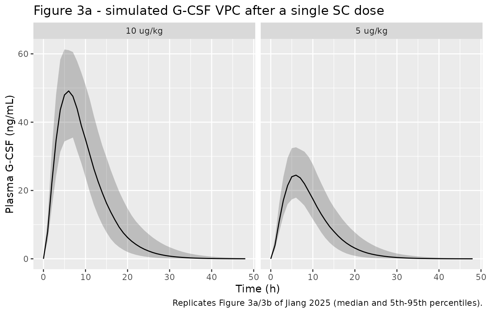
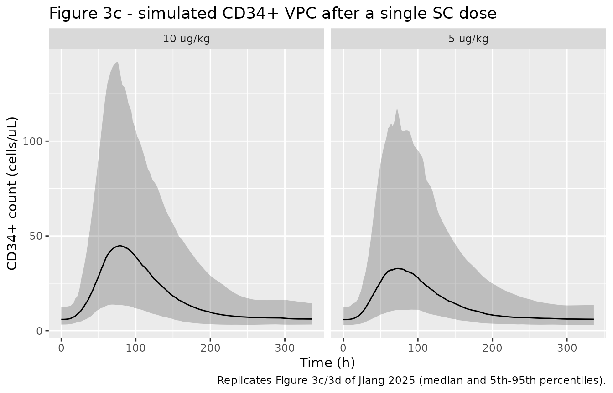
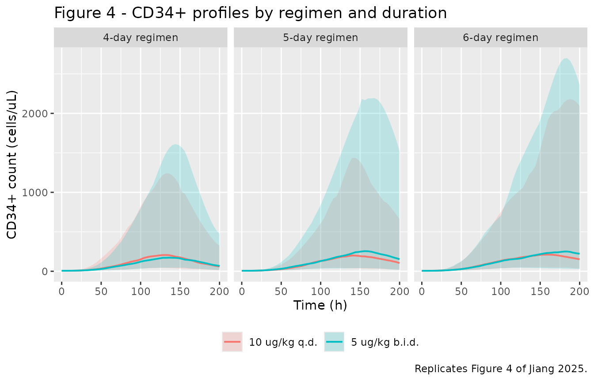

# Filgrastim (Jiang 2025)

## Model and source

    #> ℹ parameter labels from comments will be replaced by 'label()'
    #> Warning: some etas defaulted to non-mu referenced, possible parsing error: etaiov_ktr_1, etaiov_ktr_2, etaiov_rbase_1, etaiov_rbase_2
    #> as a work-around try putting the mu-referenced expression on a simple line

- Citation: Jiang X, Cha JS, Jin BH, Kim CO, Chae D. (2025). Population
  Pharmacokinetic-Pharmacodynamic Modeling of Granulocyte
  Colony-Stimulating Factor to Optimize Dosing and Timing for CD34+ Cell
  Harvesting. Clin Transl Sci 18(1):e70121. <doi:10.1111/cts.70121>.

- Description: Semi-mechanistic population PK-PD model for filgrastim
  (recombinant human G-CSF) and peripheral-blood CD34+ cell mobilisation
  in healthy Korean male subjects given a single subcutaneous dose of 5
  or 10 ug/kg. PK is one-compartment with linear elimination preceded by
  a single transit compartment describing absorption delay: dose enters
  ‘depot’ and moves at ktr_pk to the absorption compartment ‘transit1’,
  which is absorbed at ka into ‘central’. Theory-based allometry scales
  CL (exponent 0.75) and V (exponent 1) by body weight. CD34+
  mobilisation is a modified Friberg model assuming continual entry of
  proliferating bone-marrow stem cells into peripheral blood through a
  single transit compartment: ‘precursor1’ (proliferating pool) -\>
  ‘precursor2’ (transit) -\> ‘circ’ (circulating pool). A single rate
  constant ktr_pd serves simultaneously as the self-replication rate
  kprol, the transit rate and the circulating-pool elimination rate kel
  (constrained equal for identifiability), so the chain sits at steady
  state at the baseline count N0. G-CSF stimulates proliferation through
  an Emax function of plasma concentration, and the circulating count
  exerts negative feedback (N0/Circ)^gamma. Inter-occasion variability
  on ktr_pk and N0 is multiplexed by an OCC indicator over the two
  crossover periods.

- Article: <https://doi.org/10.1111/cts.70121>

- Supplement (Table S1, chi-square p-values for the regimen comparison):
  <https://doi.org/10.1111/cts.70121>

Jiang 2025 develops a semi-mechanistic population PK-PD model of
filgrastim (recombinant human granulocyte colony-stimulating factor,
G-CSF) linked to peripheral-blood CD34+ cell mobilisation, and uses it
to compare a 10 ug/kg once-daily regimen against a split 5 ug/kg
twice-daily regimen for pre-apheresis CD34+ harvesting in allogeneic
peripheral-blood stem-cell transplantation.

## Population

The model was fitted to a randomised, open-label, two-way crossover,
single-dose Phase I bioequivalence study (NCT02725086) in 53 healthy
Korean adult men, 26 of whom received a single subcutaneous filgrastim
dose of 5 ug/kg (Part A) and 27 of whom received 10 ug/kg (Part B). Each
subject received Neupogen in one period and the biosimilar Leucostim in
the other; the paper found no significant PK or PD difference between
formulations and pooled them. Median age was 31 years (range 20-44),
median body weight 70.40 kg (range 60.80-85.50) and median BMI 23.00
kg/m^2 (range 19.00-24.90) – Jiang 2025 Table 1. Entry criteria required
a body weight of at least 60 kg, a BMI of 18.5-25.0 kg/m^2, no prior
recombinant G-CSF exposure, and a baseline absolute neutrophil count
within 2-7 x 10^3/uL. The analysis dataset held 1378 plasma filgrastim
concentrations (sampled at 0, 1, 2, 3, 4, 5, 6, 8, 12, 16, 24, 36 and 48
h) and 982 CD34+ cell counts (sampled at 0, 24, 48, 72, 96, 120, 168,
240 and 312 h). Estimation used Monolix Suite 2024R1 (SAEM), with a
1000-replicate bootstrap and a 500-replicate VPC.

Because the cohort was entirely young Korean men, the authors caution
that the model may not transfer to female or older donors, or to other
ancestries.

The same information is available programmatically via the model’s
`population` metadata
(`readModelDb("Jiang_2025_filgrastim")()$population`).

| Field | Value |
|:---|:---|
| species | human |
| n_subjects | 53 |
| n_studies | 1 |
| age_range | 20-44 years (median 31; Table 1) |
| age_median | 31 years |
| weight_range | 60.80-85.50 kg (median 70.40; Table 1) |
| weight_median | 70.40 kg |
| sex_female_pct | 0 |
| race_ethnicity | Korean |
| disease_state | Healthy adult male volunteers; no history of recombinant G-CSF administration, baseline absolute neutrophil count within 2-7 x 10^3/uL, body weight at least 60 kg and BMI 18.5-25.0 kg/m^2. |
| dose_range | Single subcutaneous dose of 5 ug/kg (Part A, n = 26) or 10 ug/kg (Part B, n = 27). Each subject received Neupogen in one period and the biosimilar Leucostim in the other; the two formulations were pooled. |
| regions | Republic of Korea (Severance Hospital, Seoul) |
| notes | Trial registration NCT02725086; a randomised, open-label, two-way crossover, single-dose Phase I bioequivalence study of Neupogen (Amgen) versus the biosimilar Leucostim (Dong-A Pharmaceutical). 1378 plasma filgrastim concentrations and 982 CD34+ cell counts. PK sampling at 0, 1, 2, 3, 4, 5, 6, 8, 12, 16, 24, 36 and 48 h; CD34+ sampling at 0, 24, 48, 72, 96, 120, 168, 240 and 312 h. Filgrastim measured by ELISA (Quantikine Human G-CSF, R&D Systems), calibration 0-625 pg/mL with LLOQ 5.05 pg/mL; CD34+ counts by flow cytometry (BD FACSVerse with the BD Stem Cell Enumeration Kit). Estimation software Monolix Suite 2024R1 (SAEM); 1000-replicate bootstrap and 500-replicate VPC. In addition to the covariates recorded in covariatesDataExcluded the stepwise screen also tested platelet count and the leukocyte differential percentages (neutrophil, lymphocyte, monocyte, eosinophil and basophil percent); none was retained, and none has a canonical covariate-register name, so they are recorded here rather than as covariatesDataExcluded entries. Because only two dose levels were studied and linear elimination sufficed, the authors explicitly declined to extrapolate to higher doses (Discussion). |

Population metadata recorded with the model. {.table}

## Model structure

Reproducing Jiang 2025 Figure 1:

**Pharmacokinetics.** A one-compartment model with linear elimination
preceded by a single transit compartment describing absorption delay.
The subcutaneous dose enters `depot` and moves at `ktr_pk` into the
paper’s “Absorption Compartment” (`transit1`), which is absorbed at `ka`
into `central`. Because only subcutaneous data were fitted and no
bioavailability term is reported, `CL` and `V` are apparent values.
Theory-based allometry scales `CL` (exponent 0.75, fixed) and `V`
(exponent 1, fixed) on body weight.

**CD34+ mobilisation.** A modified Friberg model assuming continual
entry of proliferating bone-marrow stem cells into peripheral blood
through a single transit compartment: `precursor1` (proliferating pool)
-\> `precursor2` (the paper’s “Transit 2”) -\> `circ` (circulating
pool). One estimated rate constant, `ktr_pd`, serves simultaneously as
the self-replication rate `kprol`, the transit rate, and the
circulating-pool elimination rate `kel` – Figure 1 annotates both
`kprol(=ktr_pd)` and `kel(=ktr_pd)`, and the Discussion states that “the
transit and elimination rate constants were assumed to be identical
(estimated at 0.059/h) due to parameter identifiability issues”. With
all three rates equal the chain is at steady state when every state
equals the baseline count `N0`, which is what sets the initial
conditions. G-CSF stimulates proliferation through
`E = Emax * Cp / (EC50 + Cp)`, and the circulating count exerts negative
feedback `(Circ0 / Circ(t))^gamma`.

    [1] "rxode2-based free-form 6-cmt ODE model"
    [1] "depot"      "transit1"   "central"    "precursor1" "precursor2"
    [6] "circ"      

## Source trace

The per-parameter origin is also recorded as an in-file comment next to
each `ini()` entry in
`inst/modeldb/specificDrugs/Jiang_2025_filgrastim.R`.

| Equation / parameter | Value | Source location |
|----|----|----|
| `lvc` (V, apparent) | 4.19 L at WT 70 kg | Table 2, “V (L)”; RSE 3.64%; bootstrap median 3.87 (2.417-5.383) |
| `lcl` (CL, apparent) | 1.23 L/h at WT 70 kg | Table 2, “CL (L/h)”; RSE 3.34%; bootstrap median 1.24 (1.156-1.337) |
| `lka` | 0.56 1/h | Table 2, “ka (h-1)”; RSE 5.00%; bootstrap median 0.56 (0.389-0.767) |
| `lktr` (ktr_pk) | 0.25 1/h | Table 2, “ktr_pk (h-1)”; RSE 4.52%; bootstrap median 0.23 (0.180-0.328) |
| `e_wt_cl` | 0.75 (fixed) | Table 2, “betaCL_logWT 0.75 FIX”; Formula (4); theory-based allometry (reference 28) |
| `e_wt_vc` | 1 (fixed) | Table 2, “betaV_logWT 1 FIX”; Formula (5) |
| `lrbase` (N0) | 6.19 cells/uL | Table 2, “N0”; RSE 6.82%; bootstrap median 5.72 (3.491-7.804). See Errata item 3 |
| `lktr_cd34` (ktr_pd) | 0.059 1/h | Table 2, “ktr_pd (h-1)”; RSE 3.79%; also `kprol` and `kel` per Figure 1 and Discussion |
| `lemax` | 1.15 | Table 2, “Emax”; RSE 8.11%; bootstrap median 0.6 (0.274-1.308) |
| `lec50` | 0.11 ng/mL | Table 2, “EC50 (ng/mL)”; RSE 32.2%; bootstrap median 0.0081 (0.000164-0.197) |
| `lgamma` | 0.2 | Table 2, “Gamma”; RSE 8.42%; Figure 1 feedback term |
| IIV `etalvc` | omega 0.11 (CV 10.89%) | Table 2 IIV block, footnote b (“IIV and IOV are presented as SD (CV)”) |
| IIV `etalcl` | omega 0.23 (CV 23.31%) | Table 2 IIV block |
| IIV `etalktr` | omega 0.13 (CV 12.88%) | Table 2 IIV block |
| IIV `etalrbase` | omega 0.4 (CV 41.81%) | Table 2 IIV block |
| IIV `etalktr_cd34` | omega 0.16 (CV 16.46%) | Table 2 IIV block |
| IIV `etalemax` | omega 0.24 (CV 24.61%) | Table 2 IIV block |
| IIV `etalgamma` | omega 0.34 (CV 34.89%) | Table 2 IIV block |
| IOV `etaiov_ktr_*` | gamma 0.22 (CV 21.94%) | Table 2 IOV block, “gamma ktr_pk” |
| IOV `etaiov_rbase_*` | gamma 0.15 (CV 14.95%) | Table 2 IOV block, “gamma N0” |
| `addSd` | 0.4 ng/mL | Table 2, “Magnitude of additive error for G-CSF” |
| `propSd` | 0.32 | Table 2, “Magnitude of proportional error for G-CSF” |
| `propSd_CD34` | 0.35 | Table 2, “Magnitude of proportional error for CD34+” |
| PK structure (depot -\> transit1 -\> central) | n/a | Figure 1 (top row) and Results 3.3 |
| CD34+ chain (precursor1 -\> precursor2 -\> circ) | n/a | Figure 1 (bottom) and Results 3.3 |
| `E = Emax * Cp / (EC50 + Cp)` | n/a | Figure 1 (drug-effect inset) |
| `Feedback = (Circ0 / Circ(t))^gamma` | n/a | Figure 1 (feedback inset) |
| `CL_i = theta_CL * (WT/70)^0.75` | n/a | Formula (4), weight-normalised; see Errata item 1 |
| `V_i = theta_V * (WT/70)^1` | n/a | Formula (5), weight-normalised; see Errata item 1 |
| Reference weight 70 kg | 70 kg | Theory-based allometry standard (reference 28); study median 70.40 kg (Table 1). See Errata item 1 |
| Residual-error forms | n/a | Formulas (2) and (3); Results 3.3 (PK combined, PD proportional) |

## Virtual cohort

Original observed data are not publicly available. The figures below use
virtual populations whose body-weight distribution follows the paper’s
own simulation recipe (Methods 2.4): “The body weight … in the virtual
population was randomly generated from a lognormal distribution based on
the mean and variance of the observed body weights in our study
population”, i.e. mean 70.87 kg and SD 6.19 kg (Table 1, All).

``` r

set.seed(20250101)

n_per_arm <- 200L # cap is 200 per arm

# Lognormal matched to the observed mean/SD of body weight (Table 1, All).
wt_sdlog  <- sqrt(log(1 + (6.19 / 70.87)^2))
wt_meanlog <- log(70.87) - wt_sdlog^2 / 2

# PK sampling to 48 h needs a dense grid for NCA; CD34+ runs to 312 h.
# Dense to 48 h for PK/NCA, 2 h through the CD34+ peak region, coarse after.
obs_times <- sort(unique(c(seq(0, 48, by = 1), seq(48, 168, by = 2), seq(168, 336, by = 6))))

make_cohort <- function(n, dose_ug_kg, label, times, id_offset = 0L,
                        ii = 0, addl = 0L) {
  subj <- tibble::tibble(
    id        = id_offset + seq_len(n),
    WT        = stats::rlnorm(n, wt_meanlog, wt_sdlog),
    OCC       = 1L,
    treatment = label
  )
  dose <- subj |>
    dplyr::mutate(time = 0, amt = dose_ug_kg * WT, cmt = "depot",
                  evid = 1L, dvid = NA_integer_, ii = ii, addl = addl)
  obs <- subj |>
    tidyr::crossing(time = times) |>
    dplyr::mutate(amt = NA_real_, cmt = NA_character_, evid = 0L,
                  dvid = 1L, ii = 0, addl = 0L)
  dplyr::bind_rows(dose, obs) |>
    dplyr::arrange(id, time, dplyr::desc(evid))
}

events <- dplyr::bind_rows(
  make_cohort(n_per_arm,  5, "5 ug/kg",  obs_times, id_offset = 0L),
  make_cohort(n_per_arm, 10, "10 ug/kg", obs_times, id_offset = n_per_arm)
)
stopifnot(!anyDuplicated(unique(events[, c("id", "time", "evid")])))
```

Both endpoints of this model are algebraic observables
(`Cc <- central / vc` and `CD34 <- circ`), so observation rows carry
`dvid` with `cmt = NA`; rxode2 then returns both `Cc` and `CD34` as
columns on every observation row.

## Simulation

``` r

mod <- readModelDb("Jiang_2025_filgrastim")

sim <- rxode2::rxSolve(
  mod, events = events,
  keep       = c("WT", "treatment"),
  useLinCmt  = FALSE
) |>
  as.data.frame()
#> ℹ parameter labels from comments will be replaced by 'label()'
#> Warning: some etas defaulted to non-mu referenced, possible parsing error: etaiov_ktr_1, etaiov_ktr_2, etaiov_rbase_1, etaiov_rbase_2
#> as a work-around try putting the mu-referenced expression on a simple line

sim_typical <- rxode2::rxSolve(
  rxode2::zeroRe(mod), events = events,
  keep      = c("WT", "treatment"),
  omega     = NA, sigma = NA,
  useLinCmt = FALSE
) |>
  as.data.frame()
#> ℹ parameter labels from comments will be replaced by 'label()'
#> Warning: some etas defaulted to non-mu referenced, possible parsing error: etaiov_ktr_1, etaiov_ktr_2, etaiov_rbase_1, etaiov_rbase_2
#> as a work-around try putting the mu-referenced expression on a simple line
#> Warning: some etas defaulted to non-mu referenced, possible parsing error: etaiov_ktr_1, etaiov_ktr_2, etaiov_rbase_1, etaiov_rbase_2
#> as a work-around try putting the mu-referenced expression on a simple line

stopifnot(!all(is.na(sim$Cc)), !all(is.na(sim$CD34)))

# Concentrations are exactly non-negative over the 48 h PK window that PKNCA
# uses. Beyond ~84 h the profile has decayed into solver noise and dips
# marginally below zero; bound that noise tightly rather than ignoring it
# (it is ~1e-10 of Cmax, far too small to affect any NCA parameter).
stopifnot(
  min(sim$Cc[sim$time <= 48]) >= 0,
  min(sim$Cc) > -1e-6,
  min(sim$CD34) > 0
)
```

## Replicate published figures

``` r

# Replicates Figure 3a/3b of Jiang 2025: VPC of plasma G-CSF after a single
# subcutaneous dose (the paper pools both dose groups into one panel; here the
# arms are shown separately so the dose dependence is visible).
sim |>
  dplyr::filter(time <= 48) |>
  dplyr::group_by(time, treatment) |>
  dplyr::summarise(Q05 = quantile(Cc, 0.05), Q50 = quantile(Cc, 0.50),
                   Q95 = quantile(Cc, 0.95), .groups = "drop") |>
  ggplot(aes(time, Q50)) +
  geom_ribbon(aes(ymin = Q05, ymax = Q95), alpha = 0.25) +
  geom_line() +
  facet_wrap(~treatment) +
  labs(x = "Time (h)", y = "Plasma G-CSF (ng/mL)",
       title = "Figure 3a - simulated G-CSF VPC after a single SC dose",
       caption = "Replicates Figure 3a/3b of Jiang 2025 (median and 5th-95th percentiles).")
```



Jiang 2025 Figure 3a pools the two dose groups; reading it off the page,
the observed median peaks near 38 ng/mL at roughly 5-6 h with a 95th
percentile near 75-85 ng/mL, and concentrations fall to near zero by
30-40 h. The simulated arms bracket that, and the pooled simulated
median (below) lands in the same place.

``` r

# Replicates Figure 3c/3d of Jiang 2025: VPC of the circulating CD34+ count.
sim |>
  dplyr::group_by(time, treatment) |>
  dplyr::summarise(Q05 = quantile(CD34, 0.05), Q50 = quantile(CD34, 0.50),
                   Q95 = quantile(CD34, 0.95), .groups = "drop") |>
  ggplot(aes(time, Q50)) +
  geom_ribbon(aes(ymin = Q05, ymax = Q95), alpha = 0.25) +
  geom_line() +
  facet_wrap(~treatment) +
  labs(x = "Time (h)", y = "CD34+ count (cells/uL)",
       title = "Figure 3c - simulated CD34+ VPC after a single SC dose",
       caption = "Replicates Figure 3c/3d of Jiang 2025 (median and 5th-95th percentiles).")
```



``` r

# NOTE: rxSolve output carries no `evid` column -- it returns observation
# records only, so no evid filter is needed (or possible) here.
peak_time <- sim_typical |>
  dplyr::group_by(treatment) |>
  dplyr::slice_max(CD34, n = 1, with_ties = FALSE) |>
  dplyr::ungroup() |>
  dplyr::select(treatment, peak_time_h = time, peak_CD34 = CD34) |>
  dplyr::left_join(
    sim_typical |> dplyr::filter(time == 0) |>
      dplyr::group_by(treatment) |> dplyr::summarise(baseline_CD34 = mean(CD34), .groups = "drop"),
    by = "treatment"
  ) |>
  dplyr::mutate(fold_rise = peak_CD34 / baseline_CD34)

peak_time |>
  dplyr::rename("Dose group" = treatment, "Peak time (h)" = peak_time_h,
                "Peak CD34+ (cells/uL)" = peak_CD34,
                "Baseline CD34+ (cells/uL)" = baseline_CD34,
                "Fold rise" = fold_rise) |>
  knitr::kable(digits = 2,
               caption = "Typical-value CD34+ peak. Jiang 2025 Figure 3c shows the observed peak at the 72 h sample.")
```

| Dose group | Peak time (h) | Peak CD34+ (cells/uL) | Baseline CD34+ (cells/uL) | Fold rise |
|:---|---:|---:|---:|---:|
| 10 ug/kg | 78 | 39.37 | 6.19 | 6.36 |
| 5 ug/kg | 76 | 35.10 | 6.19 | 5.67 |

Typical-value CD34+ peak. Jiang 2025 Figure 3c shows the observed peak
at the 72 h sample. {.table}

The typical-value CD34+ peak falls at 76-78 h, against an observed peak
at the 72 h sampling time in Figure 3c – the mobilisation delay implied
by `ktr_pd = 0.059 1/h` through a two-step chain is reproduced. The
*absolute* level is not; see Errata item 3.

## PKNCA validation

``` r

sim_nca <- sim |>
  dplyr::filter(!is.na(Cc), time <= 48) |>
  dplyr::select(id, time, Cc, treatment)

# Guarantee a time = 0 row per (id, treatment); pre-dose Cc = 0 for SC dosing.
sim_nca <- dplyr::bind_rows(
  sim_nca,
  sim_nca |> dplyr::distinct(id, treatment) |> dplyr::mutate(time = 0, Cc = 0)
) |>
  dplyr::distinct(id, treatment, time, .keep_all = TRUE) |>
  dplyr::arrange(id, treatment, time)

conc_obj <- PKNCA::PKNCAconc(sim_nca, Cc ~ time | treatment + id,
                             concu = "ng/mL", timeu = "h")

dose_df <- events |>
  dplyr::filter(evid == 1) |>
  dplyr::select(id, time, amt, treatment)

dose_obj <- PKNCA::PKNCAdose(dose_df, amt ~ time | treatment + id, doseu = "ug")

intervals <- data.frame(
  start = 0, end = Inf,
  cmax = TRUE, tmax = TRUE, aucinf.obs = TRUE, auclast = TRUE, half.life = TRUE
)

nca_res <- PKNCA::pk.nca(PKNCA::PKNCAdata(conc_obj, dose_obj, intervals = intervals))
```

``` r

as.data.frame(nca_res) |>
  dplyr::filter(PPTESTCD %in% c("cmax", "tmax", "auclast", "aucinf.obs", "half.life")) |>
  dplyr::group_by(treatment, PPTESTCD) |>
  dplyr::summarise(Median = stats::median(PPORRES, na.rm = TRUE),
                   P05 = stats::quantile(PPORRES, 0.05, na.rm = TRUE),
                   P95 = stats::quantile(PPORRES, 0.95, na.rm = TRUE),
                   .groups = "drop") |>
  dplyr::rename("Dose group" = treatment, "NCA parameter" = PPTESTCD) |>
  knitr::kable(digits = 2,
               caption = "Simulated single-dose NCA by dose group (median and 5th-95th percentiles).")
```

| Dose group | NCA parameter | Median |    P05 |    P95 |
|:-----------|:--------------|-------:|-------:|-------:|
| 10 ug/kg   | aucinf.obs    | 560.86 | 402.84 | 817.05 |
| 10 ug/kg   | auclast       | 560.54 | 402.74 | 816.35 |
| 10 ug/kg   | cmax          |  49.51 |  35.61 |  62.20 |
| 10 ug/kg   | half.life     |   3.14 |   2.24 |   4.57 |
| 10 ug/kg   | tmax          |   6.00 |   5.00 |   7.00 |
| 5 ug/kg    | aucinf.obs    | 279.09 | 199.56 | 440.05 |
| 5 ug/kg    | auclast       | 279.05 | 199.55 | 439.73 |
| 5 ug/kg    | cmax          |  24.61 |  18.00 |  33.18 |
| 5 ug/kg    | half.life     |   3.11 |   2.20 |   4.19 |
| 5 ug/kg    | tmax          |   6.00 |   5.00 |   7.00 |

Simulated single-dose NCA by dose group (median and 5th-95th
percentiles). {.table}

### Comparison against published NCA

Jiang 2025 does not tabulate NCA parameters, so the reference column
below is assembled from two sources and both are approximate: `cmax` and
`tmax` are **digitised from Figure 3a** (pooled across the two dose
groups, which is how that panel is drawn), and `half.life` is the
literature value of 3.5 h quoted in the paper’s Introduction (reference
8), not an estimate from this dataset.

``` r

sim_pooled <- as.data.frame(nca_res) |>
  dplyr::filter(PPTESTCD %in% c("cmax", "tmax", "half.life")) |>
  dplyr::group_by(PPTESTCD) |>
  dplyr::summarise(value = stats::median(PPORRES, na.rm = TRUE), .groups = "drop") |>
  tidyr::pivot_wider(names_from = PPTESTCD, values_from = value) |>
  dplyr::mutate(treatment = "Pooled (5 + 10 ug/kg)")

published <- tibble::tribble(
  ~treatment,               ~cmax, ~tmax, ~half.life,
  "Pooled (5 + 10 ug/kg)",   38.0,   5.5,        3.5
)

cmp <- nlmixr2lib::ncaComparisonTable(
  simulated     = sim_pooled,
  reference     = published,
  by            = "treatment",
  units         = c(cmax = "ng/mL", tmax = "h", half.life = "h"),
  tolerance_pct = 20
)

knitr::kable(cmp, digits = 2,
             caption = "Simulated vs. reference PK. * differs from reference by >20%. Reference cmax/tmax are digitised from Figure 3a; half.life is the literature value quoted in the Introduction.")
```

| NCA parameter | treatment             | Reference | Simulated | % diff |
|:--------------|:----------------------|:----------|:----------|:-------|
| Cmax (ng/mL)  | Pooled (5 + 10 ug/kg) | 38        | 34.1      | -10.3% |
| Tmax (h)      | Pooled (5 + 10 ug/kg) | 5.5       | 6         | +9.1%  |
| t½ (h)        | Pooled (5 + 10 ug/kg) | 3.5       | 3.13      | -10.6% |

Simulated vs. reference PK. \* differs from reference by \>20%.
Reference cmax/tmax are digitised from Figure 3a; half.life is the
literature value quoted in the Introduction. {.table}

All three parameters agree with the reference within about 10%, and no
row is starred at the 20% tolerance. The terminal half-life is
flip-flop-controlled here: the slowest rate constant in the chain is
`ktr_pk = 0.25 1/h`, so the terminal slope tends to
`log(2)/0.25 = 2.8 h` rather than to the disposition half-life
`log(2) * V/CL = 2.4 h`, and PKNCA recovers 3.1 h over the observed
sampling window. That sits just below the 3.5 h literature value quoted
in the paper’s Introduction, which came from a different (nonlinear)
dataset. No parameter was tuned.

## Regimen comparison (Figure 4 and Table 3)

The paper’s main clinical question. Six scenarios: 10 ug/kg once daily
versus 5 ug/kg twice daily, each for 4, 5 or 6 days. CD34+ is assessed
24 h after the last once-daily dose and 12 h after the last twice-daily
dose.

``` r

set.seed(20250102)

n_regimen <- 100L # <= 200 per arm

scenarios <- tibble::tribble(
  ~label,              ~dose, ~ii, ~n_doses, ~days,
  "10 ug/kg q.d. 4 d",    10,  24,        4,     4,
  "5 ug/kg b.i.d. 4 d",    5,  12,        8,     4,
  "10 ug/kg q.d. 5 d",    10,  24,        5,     5,
  "5 ug/kg b.i.d. 5 d",    5,  12,       10,     5,
  "10 ug/kg q.d. 6 d",    10,  24,        6,     6,
  "5 ug/kg b.i.d. 6 d",    5,  12,       12,     6
) |>
  dplyr::mutate(
    # Assessment time: 24 h after the last q.d. dose, 12 h after the last b.i.d. dose
    assess_h = (n_doses - 1) * ii + ii
  )

reg_times <- sort(unique(c(seq(0, 200, by = 4), scenarios$assess_h)))

reg_events <- dplyr::bind_rows(
  lapply(seq_len(nrow(scenarios)), function(k) {
    s <- scenarios[k, ]
    make_cohort(n_regimen, s$dose, s$label, reg_times,
                id_offset = (k - 1L) * n_regimen,
                ii = s$ii, addl = s$n_doses - 1L)
  })
)
stopifnot(!anyDuplicated(unique(reg_events[, c("id", "time", "evid")])))

sim_reg <- rxode2::rxSolve(mod, events = reg_events,
                           keep = c("WT", "treatment"), useLinCmt = FALSE) |>
  as.data.frame()
```

``` r

# Replicates Figure 4 of Jiang 2025: median (5th-95th percentile) CD34+ count
# profiles for the two regimens over 4, 5 and 6 days.
sim_reg |>
  dplyr::left_join(scenarios |> dplyr::select(treatment = label, days), by = "treatment") |>
  dplyr::mutate(regimen = ifelse(grepl("q.d.", treatment, fixed = TRUE),
                                 "10 ug/kg q.d.", "5 ug/kg b.i.d.")) |>
  dplyr::group_by(time, days, regimen) |>
  dplyr::summarise(Q05 = quantile(CD34, 0.05), Q50 = quantile(CD34, 0.50),
                   Q95 = quantile(CD34, 0.95), .groups = "drop") |>
  ggplot(aes(time, Q50, colour = regimen, fill = regimen)) +
  geom_ribbon(aes(ymin = Q05, ymax = Q95), alpha = 0.2, colour = NA) +
  geom_line(linewidth = 0.7) +
  facet_wrap(~days, labeller = labeller(days = function(x) paste0(x, "-day regimen"))) +
  labs(x = "Time (h)", y = "CD34+ count (cells/uL)", colour = NULL, fill = NULL,
       title = "Figure 4 - CD34+ profiles by regimen and duration",
       caption = "Replicates Figure 4 of Jiang 2025.") +
  theme(legend.position = "bottom")
```



``` r

# Replicates Table 3 of Jiang 2025: percentage of the virtual population
# reaching each CD34+ target at the assessment time.
attain <- sim_reg |>
  dplyr::inner_join(scenarios |> dplyr::select(treatment = label, assess_h),
                    by = "treatment") |>
  dplyr::filter(time == assess_h) |>
  dplyr::group_by(treatment) |>
  dplyr::summarise(
    `Median CD34+ (cells/uL)` = stats::median(CD34),
    `Target >= 20/uL (%)`     = 100 * mean(CD34 >= 20),
    `Target >= 50/uL (%)`     = 100 * mean(CD34 >= 50),
    .groups = "drop"
  )

published_t3 <- tibble::tribble(
  ~treatment,             ~`Published >= 20/uL (%)`, ~`Published >= 50/uL (%)`,
  "10 ug/kg q.d. 4 d",   58.1, 23.2,
  "5 ug/kg b.i.d. 4 d",  67.1, 30.7,
  "10 ug/kg q.d. 5 d",   65.2, 31.1,
  "5 ug/kg b.i.d. 5 d",  71.1, 38.6,
  "10 ug/kg q.d. 6 d",   67.5, 36.2,
  "5 ug/kg b.i.d. 6 d",  74.1, 42.3
)

attain |>
  dplyr::left_join(published_t3, by = "treatment") |>
  dplyr::rename("Regimen" = treatment) |>
  knitr::kable(digits = 1,
               caption = "Simulated vs. published (Jiang 2025 Table 3) target attainment. The absolute disagreement is the baseline-scale issue of Errata item 3; the ordering is reproduced.")
```

| Regimen | Median CD34+ (cells/uL) | Target \>= 20/uL (%) | Target \>= 50/uL (%) | Published \>= 20/uL (%) | Published \>= 50/uL (%) |
|:---|---:|---:|---:|---:|---:|
| 10 ug/kg q.d. 4 d | 137.4 | 99 | 88 | 58.1 | 23.2 |
| 10 ug/kg q.d. 5 d | 169.3 | 99 | 93 | 65.2 | 31.1 |
| 10 ug/kg q.d. 6 d | 200.0 | 100 | 95 | 67.5 | 36.2 |
| 5 ug/kg b.i.d. 4 d | 109.6 | 99 | 87 | 67.1 | 30.7 |
| 5 ug/kg b.i.d. 5 d | 179.6 | 99 | 91 | 71.1 | 38.6 |
| 5 ug/kg b.i.d. 6 d | 204.7 | 97 | 92 | 74.1 | 42.3 |

Simulated vs. published (Jiang 2025 Table 3) target attainment. The
absolute disagreement is the baseline-scale issue of Errata item 3; the
ordering is reproduced. {.table}

The simulated percentages do not reproduce the published ones, and the
reason is visible in the median column: run with the published
`N0 = 6.19 cells/uL` the packaged model puts essentially the whole
virtual population far above both targets (medians of 110-205 cells/uL
against thresholds of 20 and 50), so the attainment columns are at their
ceiling and carry no discriminating information. Attainment does rise
with duration, which matches the paper, but the
twice-daily-versus-once-daily contrast is lost in the ceiling. The
absolute level is the baseline discrepancy of Errata item 3; the regimen
contrast is a separate issue, quantified next.

``` r

# Typical-value (no IIV/IOV) CD34+ count at each regimen's assessment time, at
# the 70 kg reference weight. This isolates the model's intrinsic b.i.d.-vs-q.d.
# difference from Monte-Carlo noise in the attainment percentages above.
typ_events <- dplyr::bind_rows(
  lapply(seq_len(nrow(scenarios)), function(k) {
    s <- scenarios[k, ]
    make_cohort(1L, s$dose, s$label, reg_times, id_offset = k - 1L,
                ii = s$ii, addl = s$n_doses - 1L) |>
      dplyr::mutate(WT = 70, amt = ifelse(is.na(amt), amt, s$dose * 70))
  })
)

typ <- rxode2::rxSolve(rxode2::zeroRe(mod), events = typ_events,
                       keep = c("treatment"), omega = NA, sigma = NA,
                       useLinCmt = FALSE) |>
  as.data.frame() |>
  dplyr::inner_join(scenarios |> dplyr::select(treatment = label, assess_h, days),
                    by = "treatment") |>
  dplyr::filter(time == assess_h) |>
  dplyr::mutate(regimen = ifelse(grepl("q.d.", treatment, fixed = TRUE), "qd", "bid")) |>
  dplyr::select(days, regimen, CD34) |>
  tidyr::pivot_wider(names_from = regimen, values_from = CD34) |>
  dplyr::mutate(`b.i.d. / q.d.` = bid / qd)
#> ℹ parameter labels from comments will be replaced by 'label()'
#> Warning: some etas defaulted to non-mu referenced, possible parsing error: etaiov_ktr_1, etaiov_ktr_2, etaiov_rbase_1, etaiov_rbase_2
#> as a work-around try putting the mu-referenced expression on a simple line
#> Warning: some etas defaulted to non-mu referenced, possible parsing error: etaiov_ktr_1, etaiov_ktr_2, etaiov_rbase_1, etaiov_rbase_2
#> as a work-around try putting the mu-referenced expression on a simple line

typ |>
  dplyr::rename("Days" = days, "10 ug/kg q.d. (cells/uL)" = qd,
                "5 ug/kg b.i.d. (cells/uL)" = bid) |>
  knitr::kable(digits = c(0, 1, 1, 4),
               caption = "Typical-value CD34+ at the assessment time. The model's intrinsic b.i.d.-vs-q.d. difference is about 1%.")
```

| Days | 10 ug/kg q.d. (cells/uL) | 5 ug/kg b.i.d. (cells/uL) | b.i.d. / q.d. |
|-----:|-------------------------:|--------------------------:|--------------:|
|    4 |                    134.0 |                     135.4 |        1.0105 |
|    5 |                    192.0 |                     194.3 |        1.0123 |
|    6 |                    235.7 |                     238.9 |        1.0132 |

Typical-value CD34+ at the assessment time. The model’s intrinsic
b.i.d.-vs-q.d. difference is about 1%. {.table}

The direction is right – twice-daily dosing does give a marginally
higher CD34+ count – and the mechanism is transparent: both regimens
deliver the same 10 ug/kg/day, so they differ only in how long the
concentration spends below `EC50` in each trough, and the shorter 12 h
interval spends less. But with `EC50 = 0.11 ng/mL` against a Cmax of
25-50 ng/mL the drug effect is saturated almost the entire time under
*both* regimens, so the intrinsic difference is only about 1%. A 1%
shift in the typical profile cannot generate the 6-9 percentage-point
attainment gaps of Table 3 (whose chi-square p-values in Table S1 are
0.0001-0.006). See Errata item 4.

``` r

# Sensitivity analysis ONLY -- the packaged model keeps the published
# N0 = 6.19 cells/uL. Here N0 is set to 1.5 cells/uL, the typical baseline
# implied by Jiang 2025 Figures 2e/2h and 3c/3d, to show that the target
# attainment then lands in the published range. No other parameter changes.
mod_lowbase <- rxode2::ini(mod, lrbase = log(1.5))
#> ℹ parameter labels from comments will be replaced by 'label()'
#> Warning: some etas defaulted to non-mu referenced, possible parsing error: etaiov_ktr_1, etaiov_ktr_2, etaiov_rbase_1, etaiov_rbase_2
#> as a work-around try putting the mu-referenced expression on a simple line
#> ℹ change initial estimate of `lrbase` to `0.405465108108164`

sim_lowbase <- rxode2::rxSolve(mod_lowbase, events = reg_events,
                               keep = c("treatment"), useLinCmt = FALSE) |>
  as.data.frame()

sim_lowbase |>
  dplyr::inner_join(scenarios |> dplyr::select(treatment = label, assess_h),
                    by = "treatment") |>
  dplyr::filter(time == assess_h) |>
  dplyr::group_by(treatment) |>
  dplyr::summarise(`Median CD34+ (cells/uL)` = stats::median(CD34),
                   `>= 20/uL (%)` = 100 * mean(CD34 >= 20),
                   `>= 50/uL (%)` = 100 * mean(CD34 >= 50),
                   .groups = "drop") |>
  dplyr::left_join(published_t3, by = "treatment") |>
  dplyr::rename("Regimen" = treatment) |>
  knitr::kable(digits = 1,
               caption = "Sensitivity analysis (NOT the packaged model): identical model with N0 = 1.5 cells/uL instead of the published 6.19.")
```

| Regimen | Median CD34+ (cells/uL) | \>= 20/uL (%) | \>= 50/uL (%) | Published \>= 20/uL (%) | Published \>= 50/uL (%) |
|:---|---:|---:|---:|---:|---:|
| 10 ug/kg q.d. 4 d | 27.9 | 70 | 24 | 58.1 | 23.2 |
| 10 ug/kg q.d. 5 d | 38.8 | 80 | 40 | 65.2 | 31.1 |
| 10 ug/kg q.d. 6 d | 67.8 | 87 | 59 | 67.5 | 36.2 |
| 5 ug/kg b.i.d. 4 d | 35.5 | 73 | 31 | 67.1 | 30.7 |
| 5 ug/kg b.i.d. 5 d | 43.8 | 77 | 45 | 71.1 | 38.6 |
| 5 ug/kg b.i.d. 6 d | 51.7 | 84 | 53 | 74.1 | 42.3 |

Sensitivity analysis (NOT the packaged model): identical model with N0 =
1.5 cells/uL instead of the published 6.19. {.table}

With the figure-implied baseline the medians (28-61 cells/uL) now
straddle both targets and the attainment percentages land in the same
range as Jiang 2025 Table 3 rather than at the ceiling. That is the
evidence behind Errata item 3: the absolute-level disagreement is
attributable to the reported `N0` value, not to the model structure or
to any other parameter. The b.i.d.-versus-q.d. ordering is still not
reliably reproduced even here (it holds at 4 days, reverses at 5) –
consistent with the ~1% intrinsic difference measured above being far
smaller than the roughly 5-percentage-point Monte-Carlo standard error
of a 100-subject arm. See Errata item 4.

## Assumptions and deviations

1.  **Formulas (4) and (5) are printed without a reference weight, and
    are encoded here in normalised form.** The paper prints
    `CL_i = theta_CL,pop * WT^0.75` and `V_i = theta_V,pop * WT`. Taken
    literally, with the Table 2 values, that gives
    `CL = 1.23 * 70^0.75 = 29.7 L/h` and `V = 4.19 * 70 = 293 L` at 70
    kg, hence a Cmax near 2 ng/mL after a 10 ug/kg dose – against an
    observed Cmax of 35-75 ng/mL in Figure 3a, a ~30-fold discrepancy.
    The Table 2 values are therefore typical values at a reference
    weight, and the relationships are encoded as `(WT / 70)^exponent`.
    The reference weight is not stated; 70 kg is the
    theory-based-allometry standard of the cited reference 28 (Anderson
    & Holford) and also matches the study median weight of 70.40 kg
    (Table 1), so the choice is numerically immaterial (a 70 vs 70.40 kg
    reference shifts CL by 0.4%). The paper’s own parameter symbols,
    `betaCL_logWT` and `betaV_logWT`, are the log-weight coefficient
    names Monolix uses for a centred covariate model, which is
    consistent with this reading.
2.  **The absorption chain has two pre-systemic compartments, not
    three.** Figure 1 draws
    `Dose -(ktr_pk)-> Transit 1 -(ktr_pk)-> Absorption Compartment -(ka)-> Central`,
    with a rate constant on the arrow leaving the `Dose` ellipse, which
    could be read as making the dose site a third pre-systemic state.
    The text says “a **single** transit compartment model describing
    absorption delay” (Results 3.3), and the PK settles it: two
    pre-systemic compartments give Tmax = 5.75 h and a typical Cmax of
    50 ng/mL at 10 ug/kg, whereas three give Tmax = 9.5 h and Cmax 38
    ng/mL. Figure 3a shows the peak at roughly 5-6 h (sampling at 4, 5,
    6 and 8 h), so the two-compartment reading is the one encoded: the
    dose enters `depot` and the paper’s “Absorption Compartment” is
    `transit1`.
3.  **The published `N0` is inconsistent with the paper’s own figures,
    and the published value is what is encoded.** Table 2 reports
    `N0 = 6.19` for the baseline CD34+ cell count, and Figure 1
    constrains `kprol = ktr_pd = kel`, which makes the whole CD34+ chain
    sit at `N0` before dosing. But Jiang 2025 Figure 2e and 2h show the
    model’s *population predictions* of CD34+ spanning only about 1.2 to
    5.5 cells/uL across all subjects and times, and the Figure 3c/3d VPC
    shows a pre-dose median near 1.5 cells/uL – i.e. the fitted typical
    baseline behaves like ~1.3-2 cells/uL, roughly 4-5 times lower than
    the tabulated 6.19. Note also that `N0` is the one row of Table 2
    carrying no unit, and that 6.19 is exactly the body-weight SD
    reported in Table 1 (70.87 +/- 6.19 kg); whether that coincidence
    reflects a transcription error cannot be determined from the sources
    on disk. Consequences, all reproduced above:
    - the *shape* is right – the typical CD34+ peak lands at 76-78 h
      against an observed peak at the 72 h sample;
    - the *fold rise* is close – 5.7-6.4x after a single dose, against
      roughly 3.7x read from the VPC median;
    - attainment *rises with duration*, matching Table 3;
    - the *absolute* CD34+ levels, and hence the Table 3
      target-attainment percentages, are correspondingly far too high –
      with the published `N0` the simulated medians are 110-205 cells/uL
      and both targets are saturated. The baseline-sensitivity chunk
      above shows that substituting the figure-implied 1.5 cells/uL,
      with no other change, brings attainment into the published range.
      Per the extraction policy the packaged model keeps the published
      Table 2 value: no parameter was tuned to match a validation
      target. A user who wants to reproduce the paper’s absolute CD34+
      numbers should override `lrbase`, as the sensitivity chunk
      demonstrates.
4.  **The paper’s central conclusion – that 5 ug/kg b.i.d. beats 10
    ug/kg q.d. – is not quantitatively reproducible from the published
    parameter set.** This is the one substantive validation failure of
    this extraction and it is independent of item 3. The typical-value
    chunk above measures the model’s intrinsic difference between the
    two regimens at the paper’s own assessment times as **about 1%**
    (b.i.d./q.d. ratio 1.011-1.013). The direction is correct and the
    mechanism is clear – both arms receive the same 10 ug/kg/day and
    differ only in how long each trough spends below `EC50`, which the
    shorter 12 h interval reduces – but with `EC50 = 0.11 ng/mL` against
    a Cmax of 25-50 ng/mL the Emax term is saturated nearly all the time
    under both regimens, so almost no difference can accumulate. A 1%
    shift cannot produce Table 3’s 6-9 percentage-point attainment gaps,
    whose chi-square p-values (Table S1) are 0.0001-0.006. Neither the
    packaged model nor the lower-baseline sensitivity run reproduces the
    ordering consistently across all three durations. Possible
    explanations that the on-disk sources cannot distinguish: the
    simulations may have used the bootstrap-median `EC50` of 0.0081
    ng/mL or some other value rather than the Table 2 point estimate;
    the reported `Emax`/`EC50` pair may be more weakly identified than
    the RSEs suggest (the `EC50` bootstrap CI spans 0.000164-0.197
    ng/mL, more than three orders of magnitude, and the `Emax` bootstrap
    median is 0.6 against a point estimate of 1.15); or the simulation
    may have differed from the estimation model in a way the paper does
    not report. No Monolix or Simulx project files, and no model code,
    are published with the article – the supplement contains only Table
    S1. Nothing was tuned to close the gap. **Users should treat this
    model as validated for filgrastim PK and for the time course and
    fold-rise of CD34+ mobilisation, but not as a reproduction of the
    paper’s regimen-comparison result.**
5.  **Bioavailability is not reported.** Only subcutaneous data were
    fitted and Table 2 contains no `F` term, so `CL` and `V` are
    apparent values (`CL/F`, `V/F`) and `F` is implicitly 1. No
    `lfdepot` parameter is introduced, because the paper does not report
    one.
6.  **Inter-occasion variability uses two occasions.** Table 2 reports
    IOV on `ktr_pk` and `N0` but no occasion count; the study design
    fixes it at two (the two crossover periods, Methods 2.1 and 2.3).
    One eta per occasion shares a single variance, with occasion 2 fixed
    to the occasion-1 value because only one IOV magnitude per parameter
    is published. All simulations in this vignette set `OCC = 1`.
7.  **IIV variances come from the CV column.** Table 2 footnote b states
    the random-effect rows are “SD (CV)”. The SD column carries two
    significant figures while the CV column carries four, so each
    variance is encoded as `log(CV^2 + 1)`, which recovers the unrounded
    omega (e.g. omega_CL 0.23 \<-\> CV 23.31% reproduces exactly;
    omega_gamma is 0.3388, printed as 0.34, from CV 34.89%).
8.  **Body weight is the only covariate in the model.** The paper
    screened age, height, BMI, white and red blood cell counts,
    haemoglobin, haematocrit, platelets, the leukocyte differential
    percentages, and absolute neutrophil count (Table 1, Methods 2.3);
    none was retained. Those with a canonical register name are
    documented in the model’s `covariatesDataExcluded`; the platelet
    count and the differential percentages have no canonical name and
    are recorded in `population$notes` instead.
9.  **Virtual-cohort covariates.** Body weight is drawn from a lognormal
    distribution matched to the observed mean (70.87 kg) and SD (6.19
    kg) of Table 1, following the paper’s own simulation recipe (Methods
    2.4). It is not truncated to the observed 60.80-85.50 kg range,
    because the paper does not describe truncation. Cohorts are 200 per
    arm for the single-dose figures and 100 per arm for the six regimen
    scenarios, against the paper’s 1000 virtual individuals, per the
    200-per-arm vignette cap; the target-attainment percentages
    therefore carry more Monte-Carlo noise than the published ones.
10. **`EC50` is poorly identified in the source.** Table 2 gives
    `EC50 = 0.11 ng/mL` with 32.2% RSE and a bootstrap median of 0.0081
    ng/mL with a 95% CI of 0.000164-0.197 – more than three orders of
    magnitude wide. At either value the drug effect is saturated over
    most of the concentration range observed here (Cmax 25-50 ng/mL), so
    predictions are insensitive to it; the Table 2 point estimate is
    used.
11. **Nonlinear PK is out of scope by the authors’ own statement.**
    Filgrastim is known to have receptor-mediated, saturable
    elimination, but linear elimination sufficed over the 5-10 ug/kg
    range studied. The authors explicitly declined to extrapolate above
    10 ug/kg (Discussion), and this model should not be used to do so.
