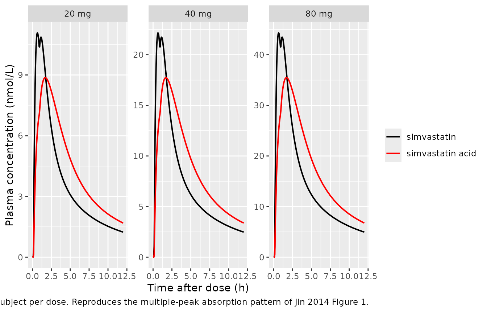

# Simvastatin and simvastatin acid (Jin 2014)

## Model and source

- Citation: Jin SJ, Bae KS, Cho SH, Jung JA, Kim U, Choe S, Ghim JL, Noh
  YH, Park HJ, Kim Hs, Lim HS. Population Pharmacokinetic Analysis of
  Simvastatin and its Active Metabolite with the Characterization of
  Atypical Complex Absorption Kinetics. Pharm Res. 2014;31(7):1801-1812.
  <doi:10.1007/s11095-013-1284-0>
- Article: <https://doi.org/10.1007/s11095-013-1284-0>

The packaged model is `Jin_2014_simvastatin`, a joint two-compartment
population PK model for orally administered simvastatin (lactone parent)
and its active metabolite simvastatin acid. The lactone uses three
parallel mixed zero-and-first-order absorption processes (Model III of
Jin 2014) – three depot compartments are dosed with fractional
bioavailabilities F1, F2, F3 (sum = 1), each described by a zero-order
infusion of duration D1, D2, D3 followed by first-order absorption with
rate constants Ka1, Ka2, Ka3 and lag times ALAG1 = 0, ALAG2, ALAG3. The
lactone disposes via a 2-compartment system with apparent clearance CL
and inter-compartmental clearance Q. A fraction FM of the parent
clearance is converted to simvastatin acid (acid central volume V6 fixed
at 1 L for identifiability), and a reverse clearance Q64 returns acid to
the parent central compartment, capturing the non-equilibrium
interconversion between the two species.

## Population

The popPK dataset comprised 2,182 simvastatin and 2,130 simvastatin acid
plasma concentrations from 133 healthy adult Korean male volunteers
across four single-dose oral simvastatin studies (Jin 2014 Table I):

- Study I (PK, n = 20) – two-sequence two-period crossover with two
  doses randomly drawn from 10, 20, 30, 40 or 80 mg simvastatin
  separated by a 3-day washout. Dense PK sampling at pre-dose and 10,
  20, 30, 40, 50 min and 1, 1.25, 1.5, 1.75, 2, 3, 4, 6, 8, 10, 12, 24 h
  post-dose.
- Studies II, III, IV (bioequivalence, n = 30 + 30 + 53 = 113) – 2x2
  crossover at 60 mg simvastatin reference (Zocor) vs test formulation
  with a 7-day washout. Only the reference-formulation data were used
  for this analysis. Sampling at pre-dose and 15, 30, 45 min and 1, 1.5,
  2, 3, 4, 6, 8, 10, 12 h post-dose.

Subjects were 25.0 +/- 2.6 years (mean +/- SD), 69.8 +/- 6.7 kg, 174.8
+/- 5.4 cm, BMI 22.8 +/- 1.7 kg/m^2. All subjects were healthy adult
Korean males; no females were enrolled. Age, body weight, and height
were tested as covariates on both parent and metabolite parameters and
none reached the criterion for inclusion (Results, parent and metabolite
sections). The final model carries no covariate effects.

The same metadata is available programmatically:

``` r

nlmixr2lib::readModelDb("Jin_2014_simvastatin")$population
```

## Source trace

Per-parameter origin is recorded inline next to each `ini()` entry in
`inst/modeldb/specificDrugs/Jin_2014_simvastatin.R`. The table below
collects the same provenance for review.

| Equation / parameter | Value | Source location |
|----|----|----|
| `lcl` (simvastatin CL/F) | log(571 L/h) | Jin 2014 Table III |
| `lvc` (simvastatin V4/F) | log(199 L) | Jin 2014 Table III |
| `lvp` (simvastatin V5/F) | log(2710 L) | Jin 2014 Table III |
| `lq` (simvastatin Q/F) | log(199 L/h) | Jin 2014 Table III |
| `lka1`, `lka2`, `lka3` | log(0.00126, 0.964, 0.179 1/h) | Jin 2014 Table III |
| `lba1`, `lba2` | log(0.636, 0.662) | Jin 2014 Table III (see Errata) |
| `llag2`, `llag3d` | log(0.142, 0.787 h) | Jin 2014 Table III |
| `ldur1`, `ldur2`, `ldur3` | log(0.102, 0.502, 1.38 h) | Jin 2014 Table III |
| `logitfm` (acid metabolic fraction FM) | qlogis(0.236) | Jin 2014 Table III |
| `lq64` (acid -\> parent reverse clearance) | log(112 L/h) | Jin 2014 Table III |
| `lk67` (acid central -\> acid peripheral) | log(252 1/h) | Jin 2014 Table III |
| `lk76` (acid peripheral -\> acid central) | log(2.30 1/h) | Jin 2014 Table III |
| `lcl_acid` (acid apparent clearance) | log(0.035 L/h) | Jin 2014 Table III |
| V6 (acid central) fixed at 1 L | n/a | Jin 2014 Methods, metabolite modelling |
| IIV %CV V_central / CL / Q | 79.0 / 66.5 / 93.6 (correlated block) | Jin 2014 Table III |
| Correlation r (V_central, CL) | 0.62 | Jin 2014 Table III footnote a |
| Correlation r (V_central, Q) | -0.17 | Jin 2014 Table III footnote a |
| Correlation r (CL, Q) | -0.38 | Jin 2014 Table III footnote a |
| IIV %CV Ka1, Ka2, Ka3 | 47.1, 43.9, 50.0 | Jin 2014 Table III |
| IIV %CV BA1, BA2 | 47.6, 45.4 | Jin 2014 Table III |
| IIV %CV ALAG2, ALAG3-ALAG2 | 46.4, 45.2 | Jin 2014 Table III |
| IIV %CV D1, D2, D3 | 47.1, 46.3, 46.1 | Jin 2014 Table III |
| IIV %CV K67, K76 (correlated block) | 88.6, 130.2 (r = -0.90) | Jin 2014 Table III |
| IIV %CV Q64, CLm | 96.5, 41.0 | Jin 2014 Table III |
| Residual error (parent additive / proportional) | 0.118 nmol/L / 0.236 | Jin 2014 Table III |
| Residual error (acid additive / proportional) | 0.27 nmol/L / 0.43 | Jin 2014 Table III |
| ODE structure (3 parallel depots, 2-cmt parent, 2-cmt acid, reversible) | n/a | Jin 2014 Figure 2 |
| Bioavailability mapping F1 = 1/(1+BA1+BA2), F2 = BA1/(1+BA1+BA2), F3 = BA2/(1+BA1+BA2) | n/a | Jin 2014 Results, parent model |

## Virtual cohort

The original observed data are not publicly available. The figures below
use a virtual cohort whose covariate distribution is degenerate (no
covariates in the final model). Three dose levels are simulated to
illustrate dose-proportional behaviour: 20, 40, and 80 mg single oral
doses. Simvastatin molecular weight 418.57 g/mol is used to convert the
mg dose to nmol – the model accepts molar dose amounts because Jin 2014
fit the data in molar units (Methods, Modeling Strategy).

``` r

set.seed(20260517)

mw_simva <- 418.57
mw_acid  <- 436.59

mg_to_nmol <- function(dose_mg) dose_mg * 1e6 / mw_simva

dose_levels_mg <- c(20, 40, 80)
n_per_dose <- 40L

# Each subject receives a single oral simvastatin dose. Because the
# three-parallel-absorption model represents three depots filled
# simultaneously from a single oral dose, each subject's dose record
# expands to three rows (cmt = depot1, depot2, depot3) with the same
# total dose amount; the per-depot bioavailability f(depotk) = Fk
# (set inside model()) splits the dose into F1, F2, F3.
cohort <- tibble::tibble(
  id_within = rep(seq_len(n_per_dose), times = length(dose_levels_mg)),
  dose_mg   = rep(dose_levels_mg,      each  = n_per_dose),
  id_offset = rep(c(0, n_per_dose, 2 * n_per_dose),
                  each = n_per_dose)
) |>
  dplyr::mutate(
    id        = id_offset + id_within,
    treatment = paste0(dose_mg, " mg"),
    dose_nmol = mg_to_nmol(dose_mg)
  ) |>
  dplyr::select(id, dose_mg, dose_nmol, treatment)

# Build dose rows: three depot dose events per subject at time 0,
# each row carries the same amt (the per-depot bioavailability
# multipliers F1/F2/F3 are applied inside model()).
dose_rows <- cohort |>
  dplyr::rowwise() |>
  dplyr::do(tibble::tibble(
    id = .$id,
    time = 0,
    evid = 1L,
    amt  = .$dose_nmol,
    cmt  = c("depot1", "depot2", "depot3"),
    treatment = .$treatment
  )) |>
  dplyr::ungroup()

# Observation grid -- dense early to capture the multiple-peak
# absorption phase, then thinning out to 24 h.
obs_times <- sort(unique(c(
  seq(0, 2, by = 0.05),
  seq(2.1, 6, by = 0.1),
  seq(6.5, 12, by = 0.5),
  seq(13, 24, by = 1)
)))

obs_rows <- tidyr::expand_grid(id = cohort$id, time = obs_times) |>
  dplyr::left_join(cohort |> dplyr::select(id, treatment), by = "id") |>
  dplyr::mutate(evid = 0L, amt = 0, cmt = "Cc")

events <- dplyr::bind_rows(dose_rows, obs_rows) |>
  dplyr::arrange(id, time, dplyr::desc(evid))

stopifnot(!anyDuplicated(unique(events[, c("id", "time", "cmt", "evid")])))
```

## Simulation

``` r

mod <- nlmixr2lib::readModelDb("Jin_2014_simvastatin")

# Typical-value replication (no IIV) for the figure comparisons.
mod_typical <- mod |> rxode2::zeroRe()
#> ℹ parameter labels from comments will be replaced by 'label()'
sim_typical <- rxode2::rxSolve(mod_typical, events = events,
                               keep = c("treatment"))
#> ℹ omega/sigma items treated as zero: 'etalvc', 'etalcl', 'etalq', 'etalka1', 'etalka2', 'etalka3', 'etalba1', 'etalba2', 'etallag2', 'etallag3d', 'etaldur1', 'etaldur2', 'etaldur3', 'etalq64', 'etalk67', 'etalk76', 'etalcl_acid'
#> Warning: multi-subject simulation without without 'omega'

# Stochastic prediction across the cohort (drives the PKNCA block).
sim <- rxode2::rxSolve(mod, events = events, keep = c("treatment"))
#> ℹ parameter labels from comments will be replaced by 'label()'
```

## Replicate published concentration-time profile

Jin 2014 Figure 1 shows individual concentration-time profiles for six
representative subjects at 30, 40, 60 (three panels), and 80 mg single
oral doses. The figure highlights the irregular multiple-peak absorption
pattern that motivates the three-parallel-absorption model. Below, the
simulated typical-value trajectories for one subject per dose level
reproduce the qualitative shape: a rapid first-peak driven by depot 1
zero-order release (D1 = 0.102 h, Ka1 = 0.00126/h dominant during the
infusion), a second peak around ALAG2 = 0.14 h driven by the depot-2
process (Ka2 = 0.964/h), and a broader late peak around ALAG3 = 0.93 h
from depot 3 (Ka3 = 0.179/h).

``` r

sim_typical |>
  dplyr::filter(id %in% c(1, n_per_dose + 1, 2 * n_per_dose + 1)) |>
  dplyr::filter(time <= 12) |>
  tidyr::pivot_longer(c(Cc, Cc_acid),
                      names_to = "analyte", values_to = "conc_nM") |>
  dplyr::mutate(analyte = dplyr::recode(analyte,
                                        Cc      = "simvastatin",
                                        Cc_acid = "simvastatin acid")) |>
  ggplot(aes(time, conc_nM, colour = analyte)) +
  geom_line(linewidth = 0.7) +
  facet_wrap(~treatment, scales = "free_y") +
  scale_colour_manual(values = c(simvastatin = "black",
                                 `simvastatin acid` = "red")) +
  labs(x = "Time after dose (h)",
       y = "Plasma concentration (nmol/L)",
       colour = NULL,
       caption = "Typical-value (zero-RE) trajectories for one subject per dose. Reproduces the multiple-peak absorption pattern of Jin 2014 Figure 1.")
```



## PKNCA validation

The paper itself does not report a tabulated NCA summary against which
the simulation can be benchmarked directly. The block below nevertheless
computes Cmax, Tmax, AUC(0-12 h), and (where the terminal-phase slope is
well defined) the half-life for the parent and metabolite, broken out by
dose group. The dose-proportional behaviour of the simulated Cmax and
AUC values is a sanity check on the model implementation; the predicted
parent AUC is expected to track dose / CL (= 60 mg \* 1e6 / (418.57
g/mol) / 571 L/h ~ 251 nmol\*h/L per 60 mg of simvastatin) up to the
integration window.

``` r

ev_dose <- events |>
  dplyr::filter(evid == 1) |>
  dplyr::distinct(id, treatment, time, amt) |>
  dplyr::group_by(id, treatment, time) |>
  dplyr::summarise(amt = sum(amt), .groups = "drop")

intervals <- data.frame(
  start      = 0,
  end        = 12,
  cmax       = TRUE,
  tmax       = TRUE,
  auclast    = TRUE,
  cmin       = FALSE
)

# Parent (simvastatin lactone) NCA.
sim_parent <- sim |>
  dplyr::filter(!is.na(Cc)) |>
  dplyr::transmute(id, time, conc = Cc, treatment)
conc_parent <- PKNCA::PKNCAconc(sim_parent, conc ~ time | treatment + id,
                                concu = "nmol/L", timeu = "h")
dose_obj <- PKNCA::PKNCAdose(ev_dose, amt ~ time | treatment + id,
                             doseu = "nmol")
nca_parent <- PKNCA::pk.nca(PKNCA::PKNCAdata(conc_parent, dose_obj,
                                             intervals = intervals))

# Metabolite (simvastatin acid) NCA.
sim_acid <- sim |>
  dplyr::filter(!is.na(Cc_acid)) |>
  dplyr::transmute(id, time, conc = Cc_acid, treatment)
conc_acid <- PKNCA::PKNCAconc(sim_acid, conc ~ time | treatment + id,
                              concu = "nmol/L", timeu = "h")
nca_acid <- PKNCA::pk.nca(PKNCA::PKNCAdata(conc_acid, dose_obj,
                                           intervals = intervals))

knitr::kable(as.data.frame(summary(nca_parent)),
             caption = "Simulated single-dose NCA -- simvastatin parent (nmol/L, h).")
```

| Interval Start | Interval End | treatment | N | AUClast (h\*nmol/L) | Cmax (nmol/L) | Tmax (h) |
|---:|---:|:---|:---|:---|:---|:---|
| 0 | 12 | 20 mg | 40 | 41.1 \[50.4\] | 9.86 \[49.4\] | 0.875 \[0.350, 2.00\] |
| 0 | 12 | 40 mg | 40 | 95.2 \[53.5\] | 23.7 \[69.3\] | 0.750 \[0.250, 2.00\] |
| 0 | 12 | 80 mg | 40 | 160 \[60.7\] | 44.0 \[78.4\] | 0.750 \[0.350, 1.85\] |

Simulated single-dose NCA – simvastatin parent (nmol/L, h). {.table
style="width:100%;"}

``` r

knitr::kable(as.data.frame(summary(nca_acid)),
             caption = "Simulated single-dose NCA -- simvastatin acid (nmol/L, h).")
```

| Interval Start | Interval End | treatment | N | AUClast (h\*nmol/L) | Cmax (nmol/L) | Tmax (h) |
|---:|---:|:---|:---|:---|:---|:---|
| 0 | 12 | 20 mg | 40 | 41.7 \[95.3\] | 6.86 \[120\] | 1.68 \[0.500, 12.0\] |
| 0 | 12 | 40 mg | 40 | 94.9 \[102\] | 14.1 \[104\] | 2.03 \[0.350, 8.00\] |
| 0 | 12 | 80 mg | 40 | 213 \[80.2\] | 34.2 \[95.9\] | 1.75 \[0.350, 12.0\] |

Simulated single-dose NCA – simvastatin acid (nmol/L, h). {.table}

### Comparison against published structural parameters

Jin 2014 Discussion paragraph 3 compares the present typical PK
estimates to those reported in a previous simvastatin popPK study:

| Parameter | Previous report (Jin 2014 Discussion) | Present study (Jin 2014 Table III) | Packaged model |
|----|----|----|----|
| Central V/F | n/a | 199 L | 199 L |
| Peripheral V/F | n/a | 2,710 L | 2,710 L |
| V_central + V_peripheral | 8,980 L | 2,909 L | 2,909 L |
| Apparent CL | 1,740 L/h | 571 L/h | 571 L/h |

The packaged model exactly reproduces the Table III point estimates; the
substantial difference in absolute V and CL between the present analysis
and the previous-report comparison is attributed by the authors to the
choice of absorption model (Discussion, paragraph 3).

## Assumptions and deviations

- **BA1/BA2 numerical discrepancy in source.** Jin 2014 Results
  paragraph “Parent Model” reports BA1 = 0.16 and BA2 = 0.70 in the
  narrative (giving F1, F2, F3 = 53.8%, 8.6%, 37.6%), but Table III –
  the paper’s tabulated Final Pharmacokinetic Model Parameter Estimates
  – lists BA1 = 0.636 (RSE 49.4%, 95% CI 0.02-1.25) and BA2 = 0.662 (RSE
  13.2%, 95% CI 0.54-0.86). The Table III point estimates and their
  reported confidence intervals are internally consistent (RSE 49.4% on
  a value of 0.636 reproduces the 0.02-1.25 CI; the same RSE on a value
  of 0.16 would not), so Table III is treated as authoritative. The
  narrative percentages 53.8 / 8.6 / 37.6 do not match the model; with
  Table III values the simulated F1, F2, F3 are 43.5 / 27.7 / 28.8
  percent. The discrepancy is recorded here so that any future erratum
  can be reconciled against the packaged model. No erratum was located
  in May 2026.
- **Inter-occasion variability not encoded.** Jin 2014 reports IOV
  estimates for BA1, BA2, D1, D2, and D3 (Table III, IOV %CV column).
  IOV is a within-subject across-occasion variance component that models
  residual differences between successive doses to the same subject; the
  packaged single-dose model treats every subject’s absorption process
  as a single occasion, so the encoded IIV alone represents the total
  between-occasion plus between-subject variability in this simulator.
  Users simulating multi-dose scenarios where intra-individual
  absorption variability matters can manually re-sample the absorption
  etas across doses.
- **No IIV reported for FM, V_peripheral.** Jin 2014 Table III does not
  list an IIV %CV column for the metabolic-fraction parameter FM or for
  the peripheral simvastatin volume V5. The packaged model treats these
  as without IIV (etas omitted), matching the published
  parameterisation.
- **Acid central volume fixed at 1 L.** Jin 2014 Methods paragraph 2
  fixes V6 (the central distribution volume of simvastatin acid) at 1 L
  because, in the absence of intravenous simvastatin acid data, FM, V6,
  and CLm are confounded. This is a structural assumption carried into
  the packaged model. Simulated acid concentrations scale inversely with
  V6; users substituting a different V6 reference (e.g., the apparent V
  derived from a separately fit metabolite dataset) should rescale FM
  and CLm correspondingly.
- **K67 magnitude.** Table III reports K67 = 252 1/h (RSE 6.0%) – a rate
  constant corresponding to a transfer half-time of about 10 seconds
  between the acid central and acid peripheral compartments. This value
  reflects the rapid equilibrium between the two acid compartments under
  the V6 = 1 L identifiability constraint; the effective distribution
  clearance Q67 = K67 \* V6 = 252 L/h is comparable in magnitude to the
  parent Q (199 L/h). The value is used verbatim from Table III with no
  rescaling.
- **BLQ handling.** Jin 2014 Methods describes a hybrid BLQ scheme: the
  first below-LLOQ observation in the disposition phase was imputed at
  half the LLOQ, and subsequent BLQ values were dropped. Simulation from
  the packaged model is unaffected (no BLQ in simulated output); the
  assumption is recorded so users fitting the model to original or
  external data can reproduce the original BLQ rule.
- **Dose-unit convention.** The packaged model expects oral doses in
  nmol (matching the molar internal units of Jin 2014’s NONMEM
  analysis). The vignette converts milligrams to nanomoles via the
  simvastatin lactone molecular weight 418.57 g/mol. The
  simvastatin-acid hydroxyacid molecular weight 436.59 g/mol is not
  needed inside the ODEs because the molar interconversion is 1:1.
- **No covariates in final model.** Age, body weight, and height were
  tested as candidate covariates on both parent and metabolite
  parameters and none reached the significance criterion (Results,
  parent and metabolite sections). The packaged model carries no
  covariate effects and therefore makes no demographic predictions
  beyond the cohort-typical values from a Korean adult male population.
- **No erratum located.** A targeted search of PubMed and the Pharm Res
  landing page in May 2026 did not surface any erratum, corrigendum, or
  correction notice for this article. Should one be published in future,
  the model file’s `reference` field and the Table III source-trace
  comments should be updated to point at the corrected values.
