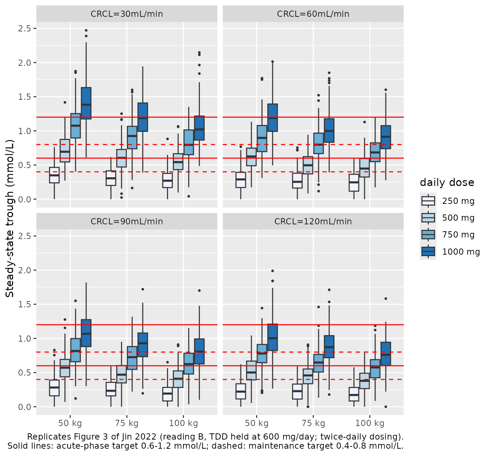

# Lithium (Jin 2022)

## Model and source

- Citation: Jin Z-b, Wu Z, Cui Y-f, Liu X-p, Liang H-b, You J-y, Wang
  C-y. Population Pharmacokinetics and Dosing Regimen of Lithium in
  Chinese Patients With Bipolar Disorder. Front Pharmacol.
  2022;13:913935. <doi:10.3389/fphar.2022.913935>. PMC9289112. Parameter
  estimates are in Table 2; the final covariate model is Results
  Equations 8-10.

- Description: One-compartment population pharmacokinetic model with
  first-order absorption (ka fixed) and first-order elimination for
  lithium in 268 Chinese patients with bipolar disorder on lithium
  carbonate maintenance therapy (trough therapeutic-drug-monitoring
  samples), from Jin 2022. Apparent clearance CL/F scales as a power of
  total daily lithium carbonate dose (centred on 600 mg/day), body
  weight (62 kg) and Cockcroft-Gault creatinine clearance (116 mL/min).
  Doses are in mmol of lithium ion (1 mg lithium carbonate = 2 / 73.89
  mmol Li) and concentrations in mmol/L.

- Article: <https://doi.org/10.3389/fphar.2022.913935> (PMC9289112, open
  access)

## Population

Jin 2022 pooled 476 trough serum lithium concentrations from 268 Chinese
patients with bipolar disorder on lithium carbonate maintenance
treatment at the Affiliated Xuzhou Eastern Hospital of Xuzhou Medical
University between September 2016 and August 2021 (Methods 2.1, Table
1). Two thirds were women (179, 66.8%); median age was 31.0 years (range
13.0-77.0), and 241 (89.9%) were adults older than 16 years. Median body
weight was 62.0 kg (35.0-110), the median total daily dose 600 mg
lithium carbonate (150-1500), and median Cockcroft-Gault creatinine
clearance 116 mL/min (61.7-226). 76.1% of patients took
sustained-release tablets and 23.9% ordinary tablets. Every sample was
drawn before the morning dose; patients taking diuretics,
renin-angiotensin-system antagonists or serotonergic drugs were
excluded.

The same information is available programmatically via
`rxode2::rxode(readModelDb("Jin_2022_lithium"))$population`.

## Source trace

Every `ini()` value carries an in-file comment in
`inst/modeldb/specificDrugs/Jin_2022_lithium.R`. The table collects
them.

| Equation / parameter | Value | Source location |
|----|----|----|
| Structure: depot -\> central, first-order absorption and elimination | n/a | Methods 2.2.1; Results 3.2 |
| `lka` | fixed(log(0.293 1/h)) | Table 2, Ka ‘\[fixed\]’; Equation 10; Methods 2.2.1 |
| `lcl` | log(0.909 L/h) | Table 2, CL; Equation 8 |
| `lvc` | log(10.9 L) | Table 2, V; Equation 9 |
| `e_dose_lithium_cl` | 0.354 | Table 2, ‘TDD on CL’; Equation 8 `(TDD/600)^0.354` |
| `e_wt_cl` | 0.33 | Table 2, ‘WT on CL’; Equation 8 `(WT/62)^0.33` |
| `e_crcl_cl` | 0.186 | Table 2, ‘CRCL on CL’; Equation 8 `(CRCL/116)^0.186` |
| `etalcl` | 0.027 (16.4%) | Equation 8 exponent; Table 2, BSV CL |
| `etalvc` | 0.162 (40.2%) | Equation 9 exponent; Table 2, BSV V |
| `addSd` | sqrt(0.0218) = 0.148 mmol/L | Table 2, additive error (read as a variance; see below) |
| `Cc ~ add(addSd)` | n/a | Table 2 (only an additive term is reported); Methods 2.2.1 |
| CRCL equation | Cockcroft-Gault, Scr in umol/L, divisor 0.818 | Table 1 footnote |

Equations 8 and 9 print the exponents `e^0.027` and `e^0.162`, which are
the raw omega^2 estimates: Table 2 reports the same BSV as 16.4% and
40.2%, and `sqrt(0.027) = 0.164`, `sqrt(0.162) = 0.402`. They are used
directly as the eta variances.

### Dose unit

Lithium carbonate (Li2CO3, 73.89 g/mol) carries two lithium ions, so 1
mg lithium carbonate = 2 / 73.89 = 0.02707 mmol Li. The paper reports
concentrations in mmol/L and clearance in L/h without printing the
conversion; the model doses in mmol of lithium ion. The covariate
`DOSE_LITHIUM_CARBONATE_MGD` keeps the clinical unit (mg of the salt per
day) because Equation 8 centres it on 600 mg.

``` r

mg_li2co3_to_mmol_li <- function(mg) mg * 2 / 73.89

# Typical CL/F (L/h) from Equation 8.
cl_eq8 <- function(tdd, wt, crcl) {
  0.909 * (tdd / 600)^0.354 * (wt / 62)^0.33 * (crcl / 116)^0.186
}

# Twice-daily oral dosing for `days` days, one trough (or a profile) after it.
# `tdd` is the value given to the CL/F covariate, which may differ from the
# simulated dose (see the Figure 3 section).
make_events <- function(cohort, obs_times, tau = 12, days = 7) {
  dose_times <- seq(0, days * 24 - tau, by = tau)
  doses <- tidyr::crossing(cohort, time = dose_times) |>
    mutate(evid = 1L, cmt = "depot", amt = mg_li2co3_to_mmol_li(dose_mgd * tau / 24))
  obs <- tidyr::crossing(cohort, time = obs_times) |>
    mutate(evid = 0L, cmt = "central", amt = 0)
  bind_rows(doses, obs) |>
    arrange(id, time, desc(evid)) |>
    relocate(id, time, evid, amt, cmt)
}
```

## Typical clearance claims in the text

The Results and Discussion state three typical-value consequences of
Equation 8. They follow in closed form from the printed parameters.

``` r

cl_ref <- cl_eq8(600, 62, 116)
cl_crcl_drop <- 1 - cl_eq8(600, 62, 30) / cl_eq8(600, 62, 120)
cl_50 <- cl_eq8(600, 50, 116)
cl_100 <- cl_eq8(600, 100, 116)

tibble(
  Claim = c(
    "CL/F, 62 kg, CRCL 116 mL/min, 600 mg/day (L/h)",
    "Fall in CL/F, CRCL 120 -> 30 mL/min (%)",
    "CL/F at 50 kg (L/h)",
    "CL/F at 100 kg (L/h)",
    "Rise in CL/F, 50 -> 100 kg (%)"
  ),
  Paper = c(0.909, 23, 0.83, 1.06, 28),
  Model = c(cl_ref, 100 * cl_crcl_drop, cl_50, cl_100, 100 * (cl_100 / cl_50 - 1))
) |>
  knitr::kable(digits = 3)
```

| Claim                                          |  Paper |  Model |
|:-----------------------------------------------|-------:|-------:|
| CL/F, 62 kg, CRCL 116 mL/min, 600 mg/day (L/h) |  0.909 |  0.909 |
| Fall in CL/F, CRCL 120 -\> 30 mL/min (%)       | 23.000 | 22.729 |
| CL/F at 50 kg (L/h)                            |  0.830 |  0.847 |
| CL/F at 100 kg (L/h)                           |  1.060 |  1.064 |
| Rise in CL/F, 50 -\> 100 kg (%)                | 28.000 | 25.701 |

``` r


# Closed form, no simulation noise. A mis-transcribed exponent moves these
# by far more than the tolerances.
stopifnot(
  abs(cl_ref - 0.909) < 1e-9,
  abs(100 * cl_crcl_drop - 23) < 0.5,
  abs(cl_100 - 1.06) < 0.01
)
```

The 23% fall with renal function and the 1.06 L/h at 100 kg reproduce
exactly. At 50 kg the model gives 0.847 L/h, not the 0.83 L/h quoted in
the Discussion, so the quoted 28% rise is 26% under Equation 8
(`2^0.33 = 1.257` for any doubling of weight). The dose and
renal-function factors cancel in the ratio, so 1.06 / 0.83 = 1.28 cannot
arise from Equation 8 under any covariate values; the 0.83 appears to be
a slip in the Discussion.

## Residual error scale

Table 2 prints the residual as ‘Additive error (mmol/L) 0.0218’, with
20% epsilon shrinkage. The unit suggests an SD, but the Equations print
the omegas as raw variances, so 0.0218 may equally be the NONMEM
`$SIGMA` variance (SD 0.148 mmol/L). The goodness-of-fit plot separates
the two: the spread of observations about the individual predictions is
roughly `sigma * (1 - shrinkage)`. The maintainers digitised Figure 1A
(observed vs individual predicted concentration) from the 300-dpi
article page by locating every marker pixel, calibrating the axes on the
identity line (fitted slope 0.998, intercept 0.001). The vertical
scatter about that line has an SD of 0.13-0.15 mmol/L across the
prediction range (marker size included).

``` r

ruv <- tibble(
  Reading = c("0.0218 is the SD", "0.0218 is the variance"),
  `Residual SD (mmol/L)` = c(0.0218, sqrt(0.0218)),
  `Expected IPRED scatter (mmol/L)` = c(0.0218, sqrt(0.0218)) * (1 - 0.20),
  `Figure 1A scatter (mmol/L)` = 0.14
)
knitr::kable(ruv, digits = 3)
```

| Reading | Residual SD (mmol/L) | Expected IPRED scatter (mmol/L) | Figure 1A scatter (mmol/L) |
|:---|---:|---:|---:|
| 0.0218 is the SD | 0.022 | 0.017 | 0.14 |
| 0.0218 is the variance | 0.148 | 0.118 | 0.14 |

Read as an SD, the observations in Figure 1A would lie within about
+/-0.04 mmol/L of the identity line; they spread over about +/-0.3
mmol/L. The variance reading is adopted and the model uses
`addSd = sqrt(0.0218)`. Figure 3 (below) gives independent support: its
250 mg boxes have lower whiskers at 0 mmol/L in every panel, which only
an additive error of this size produces.

## Steady-state troughs by weight, renal function and dose (Figure 3)

Jin 2022 simulated steady-state troughs after 7 days of dosing for daily
doses of 250-1000 mg lithium carbonate, body weights of 50, 75 and 100
kg and creatinine clearances of 30, 60, 90 and 120 mL/min (Methods 2.4,
Results 3.4, Figure 3). The paper does not state the dosing frequency;
twice-daily dosing is used here (the trough is taken 12 h after the 14th
dose, at 168 h).

The Figure 3 box medians were digitised by the maintainers from the
300-dpi article page by locating each box’s median bar; the axis
calibration was checked on the red target lines, which it places within
0.003 mmol/L of 0.4, 0.6, 0.8 and 1.2.

``` r

fig3 <- tidyr::expand_grid(
  CRCL = c(30, 60, 90, 120),
  WT = c(50, 75, 100),
  dose_mgd = c(250, 500, 750, 1000)
) |>
  mutate(fig_median = c(
    0.399, 0.768, 1.103, 1.365, 0.332, 0.665, 0.950, 1.210, 0.279, 0.599, 0.861, 1.094,
    0.328, 0.690, 0.961, 1.201, 0.279, 0.588, 0.816, 1.045, 0.239, 0.499, 0.748, 0.948,
    0.311, 0.615, 0.888, 1.108, 0.247, 0.515, 0.762, 0.964, 0.240, 0.480, 0.691, 0.891,
    0.286, 0.586, 0.833, 1.033, 0.240, 0.491, 0.722, 0.913, 0.224, 0.440, 0.660, 0.842
  ))
```

The Figure 3 medians rise in proportion to the dose: within each weight
and renal-function panel, the 1000 mg median is about 3.8 times the 250
mg median. Equation 8 makes CL/F rise as `TDD^0.354`, so the printed
model predicts troughs that rise only as `TDD^0.646`, a ratio of
`4^0.646 = 2.45`. Figure 3 therefore appears to have been simulated with
the total-daily-dose covariate held at the value in the original dataset
(“simulations were performed using the initial dataset”, Methods 2.4)
while the simulated doses changed. Both readings are simulated: (A) the
model as printed, with `DOSE_LITHIUM_CARBONATE_MGD` equal to the
simulated daily dose; and (B) `DOSE_LITHIUM_CARBONATE_MGD` held at the
600 mg/day reference. 200 virtual patients per scenario.

``` r

mod <- readModelDb("Jin_2022_lithium")
n_per <- 200
scen <- fig3 |>
  select(CRCL, WT, dose_mgd) |>
  mutate(scenario = row_number())
cohort_fig3 <- bind_rows(
  scen |> mutate(reading = "A: printed (TDD = dose)", DOSE_LITHIUM_CARBONATE_MGD = dose_mgd),
  scen |> mutate(reading = "B: TDD held at 600 mg/day", DOSE_LITHIUM_CARBONATE_MGD = 600)
) |>
  slice(rep(seq_len(n()), each = n_per)) |>
  mutate(id = row_number())
events_fig3 <- make_events(cohort_fig3, obs_times = 168)

rxode2::rxSetSeed(20220704)
sim_fig3 <- rxode2::rxSolve(
  mod,
  events = events_fig3,
  keep = c("reading", "scenario", "dose_mgd", "WT", "CRCL")
) |>
  as.data.frame() |>
  filter(time == 168) |>
  mutate(trough = pmax(sim, 0))
#> [====|====|====|====|====|====|====|====|====|====] 0:00:09
stopifnot(nrow(sim_fig3) == nrow(cohort_fig3))
```

``` r

sim_fig3 |>
  mutate(
    panel = factor(paste0("CRCL=", CRCL, "mL/min"), levels = paste0("CRCL=", c(30, 60, 90, 120), "mL/min")),
    `daily dose` = factor(paste(dose_mgd, "mg"), levels = paste(c(250, 500, 750, 1000), "mg"))
  ) |>
  filter(reading == "B: TDD held at 600 mg/day") |>
  ggplot(aes(factor(paste(WT, "kg"), levels = paste(c(50, 75, 100), "kg")), trough, fill = `daily dose`)) +
  geom_boxplot(outlier.size = 0.6) +
  geom_hline(yintercept = c(0.6, 1.2), colour = "red") +
  geom_hline(yintercept = c(0.4, 0.8), colour = "red", linetype = "dashed") +
  scale_fill_brewer(palette = "Blues") +
  facet_wrap(~panel) +
  labs(
    x = NULL, y = "Steady-state trough (mmol/L)",
    caption = paste(
      "Replicates Figure 3 of Jin 2022 (reading B, TDD held at 600 mg/day; twice-daily dosing).",
      "Solid lines: acute-phase target 0.6-1.2 mmol/L; dashed: maintenance target 0.4-0.8 mmol/L.",
      sep = "\n"
    )
  )
```



``` r

med_fig3 <- sim_fig3 |>
  group_by(reading, CRCL, WT, dose_mgd) |>
  summarise(sim_median = median(trough), .groups = "drop") |>
  inner_join(fig3, by = c("CRCL", "WT", "dose_mgd")) |>
  mutate(pct_diff = 100 * (sim_median / fig_median - 1))
stopifnot(nrow(med_fig3) == 2 * nrow(fig3))

dose_ratio <- med_fig3 |>
  group_by(reading, CRCL, WT) |>
  summarise(
    sim = sim_median[dose_mgd == 1000] / sim_median[dose_mgd == 250],
    fig = fig_median[dose_mgd == 1000] / fig_median[dose_mgd == 250],
    .groups = "drop"
  )

summary_fig3 <- med_fig3 |>
  group_by(reading) |>
  summarise(
    median_pct_diff = median(pct_diff),
    p90_abs_pct_diff = quantile(abs(pct_diff), 0.9),
    .groups = "drop"
  ) |>
  inner_join(
    dose_ratio |>
      group_by(reading) |>
      summarise(sim_ratio = median(sim), fig_ratio = median(fig), .groups = "drop"),
    by = "reading"
  )
summary_fig3 |>
  rename(
    "Reading" = reading,
    "Median % difference vs Figure 3" = median_pct_diff,
    "90th pct of |% difference|" = p90_abs_pct_diff,
    "Simulated 1000/250 mg ratio" = sim_ratio,
    "Figure 3 1000/250 mg ratio" = fig_ratio
  ) |>
  knitr::kable(digits = 2)
```

| Reading | Median % difference vs Figure 3 | 90th pct of \|% difference\| | Simulated 1000/250 mg ratio | Figure 3 1000/250 mg ratio |
|:---|---:|---:|---:|---:|
| A: printed (TDD = dose) | -10.91 | 37.36 | 2.10 | 3.73 |
| B: TDD held at 600 mg/day | -8.06 | 14.51 | 3.95 | 3.73 |

``` r


pct_b <- med_fig3$pct_diff[med_fig3$reading == "B: TDD held at 600 mg/day"]
ratio_a <- dose_ratio$sim[dose_ratio$reading == "A: printed (TDD = dose)"]
ratio_b <- dose_ratio$sim[dose_ratio$reading == "B: TDD held at 600 mg/day"]
stopifnot(
  # Figure 3 itself is dose-proportional (digitised, no simulation noise).
  median(dose_ratio$fig) > 3.4,
  # Reading B: the 48 medians are each from 200 subjects (sampling SE about
  # 3%). Closed-form typical troughs sit 8% below the figure on average; the
  # remaining offset is the unstated dosing frequency (three-times-daily
  # dosing would put them 5% above). A wrong CL, V, exponent or mg -> mmol
  # factor moves every cell by tens of percent.
  abs(median(pct_b)) < 15,
  quantile(abs(pct_b), 0.9) < 25,
  # The dose proportionality separates the readings: about 4.0 for B and
  # 2.1 for A (closed form), against 3.8 in the figure.
  abs(median(ratio_b) / median(dose_ratio$fig) - 1) < 0.15,
  median(ratio_a) < 2.7
)
```

Reading B reproduces the Figure 3 medians to within about 8% on average
(simulated slightly lower; the unstated dosing frequency accounts for an
offset of this size), including their proportionality to dose. Reading
A, the model as printed, gives troughs that are too high at 250 mg and
too low at 1000 mg relative to the figure:

``` r

med_fig3 |>
  filter(CRCL %in% c(30, 120)) |>
  select(reading, CRCL, WT, dose_mgd, fig_median, sim_median) |>
  pivot_wider(names_from = reading, values_from = sim_median) |>
  rename(
    "CRCL (mL/min)" = CRCL,
    "WT (kg)" = WT,
    "Daily dose (mg)" = dose_mgd,
    "Figure 3 median (mmol/L)" = fig_median
  ) |>
  knitr::kable(digits = 2, caption = "Median steady-state trough, CRCL 30 and 120 mL/min panels.")
```

| CRCL (mL/min) | WT (kg) | Daily dose (mg) | Figure 3 median (mmol/L) | A: printed (TDD = dose) | B: TDD held at 600 mg/day |
|---:|---:|---:|---:|---:|---:|
| 30 | 50 | 250 | 0.40 | 0.52 | 0.35 |
| 30 | 50 | 500 | 0.77 | 0.76 | 0.69 |
| 30 | 50 | 750 | 1.10 | 0.97 | 1.08 |
| 30 | 50 | 1000 | 1.36 | 1.10 | 1.38 |
| 30 | 75 | 250 | 0.33 | 0.42 | 0.31 |
| 30 | 75 | 500 | 0.66 | 0.66 | 0.60 |
| 30 | 75 | 750 | 0.95 | 0.78 | 0.92 |
| 30 | 75 | 1000 | 1.21 | 0.98 | 1.19 |
| 30 | 100 | 250 | 0.28 | 0.39 | 0.27 |
| 30 | 100 | 500 | 0.60 | 0.61 | 0.54 |
| 30 | 100 | 750 | 0.86 | 0.74 | 0.79 |
| 30 | 100 | 1000 | 1.09 | 0.87 | 1.02 |
| 120 | 50 | 250 | 0.29 | 0.38 | 0.22 |
| 120 | 50 | 500 | 0.59 | 0.56 | 0.50 |
| 120 | 50 | 750 | 0.83 | 0.73 | 0.78 |
| 120 | 50 | 1000 | 1.03 | 0.79 | 1.00 |
| 120 | 75 | 250 | 0.24 | 0.34 | 0.23 |
| 120 | 75 | 500 | 0.49 | 0.46 | 0.46 |
| 120 | 75 | 750 | 0.72 | 0.58 | 0.65 |
| 120 | 75 | 1000 | 0.91 | 0.67 | 0.87 |
| 120 | 100 | 250 | 0.22 | 0.31 | 0.17 |
| 120 | 100 | 500 | 0.44 | 0.42 | 0.38 |
| 120 | 100 | 750 | 0.66 | 0.53 | 0.58 |
| 120 | 100 | 1000 | 0.84 | 0.59 | 0.76 |

Median steady-state trough, CRCL 30 and 120 mL/min panels. {.table}

The shipped model keeps Equation 8 as printed (reading A): the dose
effect on CL/F is an estimated parameter with 12% RSE and a bootstrap
interval excluding zero, and the Discussion interprets it as nonlinear
renal excretion. Reading B describes only how Figure 3 and its dosing
recommendations were produced. To reproduce them, set
`DOSE_LITHIUM_CARBONATE_MGD = 600` while dosing the regimen of interest.

### Truncation at zero

Figure 3 shows lower whiskers at 0 mmol/L for every 250 mg box. With the
shipped residual SD (0.148 mmol/L), a share of simulated 250 mg troughs
falls below zero and is truncated; with an SD of 0.0218 almost none
would.

``` r

cohort_250 <- scen |>
  filter(dose_mgd == 250) |>
  mutate(DOSE_LITHIUM_CARBONATE_MGD = 600) |>
  slice(rep(seq_len(n()), each = n_per)) |>
  mutate(id = row_number())
events_250 <- make_events(cohort_250, obs_times = 168)
mod_sd_reading <- rxode2::rxode(mod) |> rxode2::ini(addSd = 0.0218)
#> ℹ change initial estimate of `addSd` to `0.0218`
rxode2::rxSetSeed(20220705)
sim_250 <- bind_rows(
  rxode2::rxSolve(mod, events = events_250) |>
    as.data.frame() |>
    mutate(reading = "addSd = sqrt(0.0218) (shipped)"),
  rxode2::rxSolve(mod_sd_reading, events = events_250) |>
    as.data.frame() |>
    mutate(reading = "addSd = 0.0218")
) |>
  filter(time == 168)
trunc_share <- sim_250 |>
  group_by(reading) |>
  summarise(pct_below_zero = 100 * mean(sim < 0), .groups = "drop")
knitr::kable(trunc_share, digits = 1)
```

| reading                        | pct_below_zero |
|:-------------------------------|---------------:|
| addSd = 0.0218                 |            0.0 |
| addSd = sqrt(0.0218) (shipped) |            5.5 |

``` r

stopifnot(
  # 2400 subjects per reading: a share of several percent against well under
  # 1%; the SE of either share is below 0.6 percentage points.
  trunc_share$pct_below_zero[trunc_share$reading == "addSd = sqrt(0.0218) (shipped)"] > 3,
  trunc_share$pct_below_zero[trunc_share$reading == "addSd = 0.0218"] < 1
)
```

## Steady-state NCA (model as printed)

A typical patient (62 kg, CRCL 116 mL/min) takes each daily dose twice
daily for 7 days, with `DOSE_LITHIUM_CARBONATE_MGD` equal to the dose.
The paper reports no NCA, so the check is that the steady-state AUC over
a dosing interval equals the dose divided by CL/F: CL/F is monotone in
its eta, so the median AUC equals the dose over the typical CL/F.

``` r

cohort_nca <- tibble(dose_mgd = c(250, 500, 750, 1000)) |>
  mutate(
    WT = 62, CRCL = 116, DOSE_LITHIUM_CARBONATE_MGD = dose_mgd,
    treatment = paste(dose_mgd, "mg/day")
  ) |>
  slice(rep(seq_len(n()), each = n_per)) |>
  mutate(id = row_number())
events_nca <- make_events(cohort_nca, obs_times = c(0, seq(156, 168, by = 0.25)))
rxode2::rxSetSeed(20220706)
sim_nca <- rxode2::rxSolve(mod, events = events_nca, keep = c("treatment", "dose_mgd")) |>
  as.data.frame()
```

``` r

conc_nca <- sim_nca |>
  filter(!is.na(Cc)) |>
  mutate(Cc = pmax(Cc, 0)) |>
  select(id, time, Cc, treatment)
dose_nca <- events_nca |>
  filter(evid == 1) |>
  select(id, time, amt, treatment)
nca <- PKNCA::pk.nca(
  PKNCA::PKNCAdata(
    PKNCA::PKNCAconc(conc_nca, Cc ~ time | treatment + id),
    PKNCA::PKNCAdose(dose_nca, amt ~ time | treatment + id),
    intervals = data.frame(
      start = 156, end = 168,
      cmax = TRUE, cmin = TRUE, cav = TRUE, auclast = TRUE
    )
  )
)
nca_df <- as.data.frame(nca)

nca_df |>
  filter(PPTESTCD %in% c("cmax", "cmin", "cav", "auclast")) |>
  group_by(treatment, PPTESTCD) |>
  summarise(median = median(PPORRES), .groups = "drop") |>
  pivot_wider(names_from = PPTESTCD, values_from = median) |>
  mutate(treatment = factor(treatment, levels = paste(c(250, 500, 750, 1000), "mg/day"))) |>
  arrange(treatment) |>
  rename(
    "Daily dose" = treatment,
    "Cmax (mmol/L)" = cmax,
    "Cmin (mmol/L)" = cmin,
    "Cav (mmol/L)" = cav,
    "AUCtau (mmol*h/L)" = auclast
  ) |>
  knitr::kable(digits = 3, caption = "Median steady-state exposure, 62 kg, CRCL 116 mL/min, twice daily.")
```

| Daily dose  | AUCtau (mmol\*h/L) | Cav (mmol/L) | Cmax (mmol/L) | Cmin (mmol/L) |
|:------------|-------------------:|-------------:|--------------:|--------------:|
| 250 mg/day  |              5.116 |        0.426 |         0.472 |         0.347 |
| 500 mg/day  |              7.877 |        0.656 |         0.754 |         0.501 |
| 750 mg/day  |             10.224 |        0.852 |         0.999 |         0.632 |
| 1000 mg/day |             12.351 |        1.029 |         1.225 |         0.737 |

Median steady-state exposure, 62 kg, CRCL 116 mL/min, twice daily.
{.table style="width:100%;"}

``` r

auc_chk <- nca_df |>
  filter(PPTESTCD == "auclast") |>
  inner_join(distinct(cohort_nca, id, dose_mgd), by = "id") |>
  group_by(dose_mgd) |>
  summarise(sim = median(PPORRES), .groups = "drop") |>
  mutate(
    expected = mg_li2co3_to_mmol_li(dose_mgd / 2) / cl_eq8(dose_mgd, 62, 116),
    pct_diff = 100 * (sim / expected - 1)
  )
knitr::kable(auc_chk, digits = 3)
```

| dose_mgd |    sim | expected | pct_diff |
|---------:|-------:|---------:|---------:|
|      250 |  5.116 |    5.074 |    0.824 |
|      500 |  7.877 |    7.941 |   -0.804 |
|      750 | 10.224 |   10.318 |   -0.910 |
|     1000 | 12.351 |   12.426 |   -0.598 |

``` r

# The median of 200 subjects carries a sampling SE of about 1.5% (CL IIV
# 16.4%); 7 days is more than 20 half-lives, and the 0.25-h trapezoid error
# is under 0.5%. A wrong dose unit or CL/F moves this by tens of percent.
stopifnot(nrow(auc_chk) == 4, max(abs(auc_chk$pct_diff)) < 6)
```

## Assumptions and deviations

- **Figure 3 simulation.** The Figure 3 medians, and the dosing
  recommendations drawn from them (Results 3.4, Discussion), are
  proportional to dose and are reproduced only with the total-daily-dose
  covariate held fixed (reading B, 600 mg/day). The model ships Equation
  8 as printed. Under the printed model the recommended regimens still
  mostly land in their windows (for 100 kg and CRCL 120 mL/min, 750
  mg/day given twice daily gives a median trough of about 0.53 mmol/L
  and 1000 mg/day about 0.59 mmol/L), but 1000 mg/day then sits at the
  lower edge of the 0.6-1.2 mmol/L acute range rather than inside it.
- **Dosing frequency.** Not stated for the simulations or the cohort;
  twice-daily dosing is assumed for Figure 3 and the NCA.
- **Residual error.** Table 2’s 0.0218 is read as the additive-error
  variance (SD 0.148 mmol/L), from the Figure 1A scatter and the Figure
  3 whiskers; see ‘Residual error scale’. The model has no proportional
  term because none is reported.
- **Dose unit.** Doses in mmol of lithium ion, 1 mg Li2CO3 = 2 / 73.89
  mmol; not printed in the paper but required by mmol/L concentrations
  and L/h clearance.
- **Absorption.** Ka was fixed at 0.293 1/h ‘based on published data’
  without a citation; the sensitivity analysis (0.146-0.586 1/h) moved
  CL/F between 0.825 and 0.959 L/h. The same ka applies to
  sustained-release and ordinary tablets; formulation was not a
  covariate.
- **50 kg clearance.** The Discussion’s 0.83 L/h at 50 kg is not
  reproduced (0.847 L/h under Equation 8); its 1.06 L/h at 100 kg and
  the 23% fall at CRCL 30 mL/min are.
- **Figure 2 (VPC).** Not replicated: it plots the observed troughs
  against time since the start of therapy in days, which needs the
  individual dosing histories.
- **Covariates not retained.** Sex was tested and not retained (no
  coefficient reported); it is recorded in `covariatesDataExcluded`.
- **Extrapolation.** Figure 3 uses CRCL down to 30 mL/min, below the
  observed minimum of 61.7 mL/min.
- No erratum or correction notice for this article was found in Europe
  PMC (PMID 35860024) as of 2026-10-02. The supplementary material is a
  Word copy of Tables 1 and 2 with the same values.
