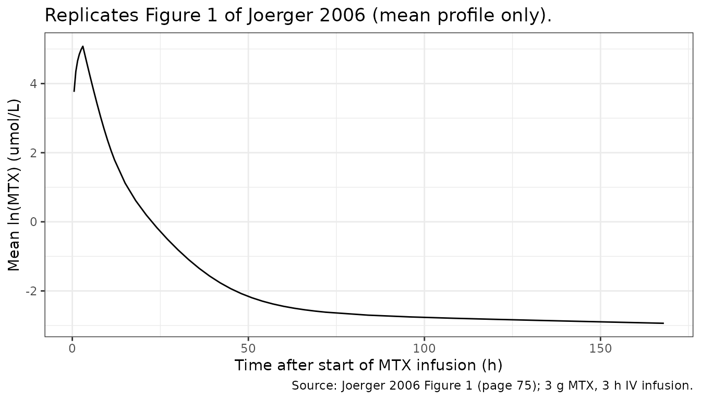

# Methotrexate (Joerger 2006)

## Model and source

    #> ℹ parameter labels from comments will be replaced by 'label()'

- Citation: Joerger M, Huitema ADR, van den Bongard HJGD, Baas P,
  Schornagel JH, Schellens JHM, Beijnen JH. Determinants of the
  elimination of methotrexate and 7-hydroxy-methotrexate following
  high-dose infusional therapy to cancer patients. Br J Clin Pharmacol.
  2006;62(1):71-80. <doi:10.1111/j.1365-2125.2005.02513.x>
- Description: Population PK model for methotrexate (MTX) and its
  principal circulating metabolite 7-hydroxy-methotrexate (7-OH-MTX) in
  adult cancer patients receiving high-dose intravenous MTX therapy
  (Joerger 2006). Joint parent + metabolite model: linear 3-compartment
  MTX (central + two peripheral compartments) with first-order
  elimination from the central compartment, feeding a linear
  2-compartment 7-OH-MTX disposition through a fixed metabolic fraction
  of 10 percent. Additive-linear covariate effects of baseline
  creatinine clearance (Cockcroft-Gault, raw mL/min, truncated at 140),
  concurrent benzimidazole-class proton-pump-inhibitor comedication, and
  prior NSAID administration on both MTX and 7-OH-MTX total clearance.
- Article: <https://doi.org/10.1111/j.1365-2125.2005.02513.x>

## Population

The model was fit to 76 adult cancer patients (62 male / 14 female; age
range 17.1-77.0 years, median 51.1 years; BSA 1.56-2.45 m^2, median 1.94
m^2) who received 304 cycles of high-dose intravenous methotrexate
(HDMTX) at The Netherlands Cancer Institute. Indications included
malignant pleural mesothelioma (n = 29), gastro-oesophageal cancer (n =
20), non-Hodgkin lymphoma (n = 12), head and neck cancer (n = 10),
choriocarcinoma (n = 2), and one patient each with acute lymphocytic
leukaemia, trophoblastic tumour, and osteosarcoma. Baseline raw
Cockcroft-Gault creatinine clearance ranged 40-140 mL/min (median 87.5
mL/min, values above 140 truncated). MTX doses ranged 300 mg/m^2 to 12
g/m^2 over a 1-24 h infusion; 80 percent of cycles were 1000-5000 mg/m^2
over a 1-6 h infusion. Supportive therapy was uniform across the cohort
(aggressive hydration, urine alkalinization, oral leucovorin rescue
starting 24 h post-MTX). Concurrent benzimidazole-class proton-pump
inhibitors (omeprazole 20-40 mg daily in 10 patients, lansoprazole 30 mg
daily in 3) and prior NSAIDs (diclofenac in 5, ibuprofen in 1) were the
retained covariates. See Joerger 2006 Table 1 (page 74) for baseline
demographics.

The same metadata is available programmatically via
`readModelDb("Joerger_2006_methotrexate")$population`.

## Source trace

The per-parameter origin is recorded as an in-file comment next to each
`ini()` entry in
`inst/modeldb/specificDrugs/Joerger_2006_methotrexate.R`. The table
below collects them in one place for review.

| Equation / parameter | Value | Source location |
|----|----|----|
| `lcl` (baseline CL_MTX at median CRCL) | 8.85 L/h | Table 2 (p. 76) “Full data set Estimate”; Eq 1 baseline at CRCL = 87, PPI = 0, NSAID = 0 |
| `lvc` (V_CENTRAL_MTX) | 23.0 L | Table 2 (p. 76) |
| `lvp` (V_PERIPHERAL-1_MTX) | 185 L | Table 2 (p. 76) |
| `lvp2` (V_PERIPHERAL-2_MTX) | 5.34 L | Table 2 (p. 76) |
| `lq` (Q1) | 0.444 L/h | Table 2 (p. 76) |
| `lq2` (Q2) | 0.716 L/h | Table 2 (p. 76) |
| `lcl_7ohmtx` (baseline CL_7-OH-MTX at median CRCL) | 2 L/h | Table 2 (p. 76); Eq 2 baseline |
| `lvc_7ohmtx` (V_CENTRAL_7-OH-MTX) | 21.6 L | Table 2 (p. 76) |
| `lvp_7ohmtx` (V_PERIPHERAL_7-OH-MTX) | 27.7 L | Table 2 (p. 76) |
| `lq_7ohmtx` (Q3) | 0.429 L/h | Table 2 (p. 76) |
| `lfm` (metabolic fraction MTX -\> 7-OH-MTX) | 0.10 (FIXED) | Results p. 75: assumed 10 percent per literature |
| `e_crcl_cl` (slope on CRCL) | 0.0423 L/h per mL/min | Eq 1 (p. 77); sign corrected (see Errata) |
| `e_ppi_cl` (PPI effect on CL_MTX) | -2.45 L/h | Eq 1 (p. 77) |
| `e_nsaid_cl` (NSAID effect on CL_MTX) | -1.46 L/h | Eq 1 (p. 77) |
| `e_crcl_cl_7ohmtx` (slope on CRCL) | 0.0123 L/h per mL/min | Eq 2 (p. 77); sign corrected (see Errata) |
| `e_ppi_cl_7ohmtx` (PPI effect on CL_7-OH-MTX) | -0.369 L/h | Eq 2 (p. 77) |
| `e_nsaid_cl_7ohmtx` (NSAID effect on CL_7-OH-MTX) | -0.357 L/h | Eq 2 (p. 77) |
| IIV CV percent (Table 2 p. 76) | CL_MTX 19.6, V_P-2_MTX 31.0, Q1 32.0, CL_7-OH-MTX 31.0, V_C_7-OH-MTX 8.22, V_P_7-OH-MTX 41.4, Q3 27.1 | Table 2; converted to log-normal variance via omega^2 = log(1 + CV^2) |
| Proportional residual MTX | 52.3 percent CV | Table 2 (p. 76); additive-on-log-scale = proportional in linear space |
| Proportional residual 7-OH-MTX | 57.1 percent CV | Table 2 (p. 76) |
| `d/dt(central)` (3-cmt parent disposition) | n/a | Figure 2 (p. 75): linear 3-compartment MTX |
| `d/dt(central_7ohmtx)` (2-cmt metabolite, fed by fm \* kel \* central) | n/a | Figure 2 (p. 75); 10 percent metabolic flux per Results p. 75 |

## Virtual cohort

Original observed data are not publicly available. The cohort simulated
here uses the most common HDMTX regimen in the source paper – 3000 mg of
methotrexate over a 3 h intravenous infusion – across four comedication
arms (no comedication / PPI only / NSAID only / both), with baseline
creatinine clearance drawn from a truncated normal centered at the
cohort median 87 mL/min.

``` r

set.seed(20260627L)

make_cohort <- function(n, ppi, nsaid, id_offset = 0L) {
  # Truncated normal for raw Cockcroft-Gault CRCL: median 87, SD chosen to
  # span the source range (40-140 mL/min). Truncate at 140 per the paper.
  crcl_draw <- pmin(pmax(rnorm(n, mean = 87, sd = 25), 40), 140)

  ids <- id_offset + seq_len(n)

  # Methotrexate MW 454.4 g/mol; 3000 mg = 6.603 mmol = 6603 umol.
  # Modelled dose units are umol (matching plasma concentration units).
  mtx_dose_umol <- 3000 / 454.4 * 1000
  dose_rows <- tibble(
    id     = ids,
    time   = 0,
    evid   = 1L,
    amt    = mtx_dose_umol,            # umol
    rate   = mtx_dose_umol / 3,        # umol/h => 3 h infusion
    cmt    = "central",
    CRCL   = crcl_draw,
    CONMED_PPI   = ppi,
    CONMED_NSAID = nsaid
  )

  # Dense observation grid: fine through end of infusion / distribution,
  # then logarithmic spacing for the long terminal phase to support Figure 1
  # replication and 24 h / 48 h NCA windows.
  obs_times <- sort(unique(c(
    seq(0, 6, by = 0.5),
    seq(7, 12, by = 1),
    seq(15, 72, by = 3),
    seq(84, 168, by = 12)
  )))

  obs_rows <- tibble(
    id     = rep(ids, each = length(obs_times)),
    time   = rep(obs_times, times = n),
    evid   = 0L,
    amt    = NA_real_,
    rate   = NA_real_,
    cmt    = "Cc",
    CRCL   = rep(crcl_draw, each = length(obs_times)),
    CONMED_PPI   = ppi,
    CONMED_NSAID = nsaid
  )

  bind_rows(dose_rows, obs_rows) |>
    arrange(id, time, desc(evid))
}

n_per_arm <- 100L
events <- bind_rows(
  make_cohort(n_per_arm, ppi = 0, nsaid = 0, id_offset =   0L) |>
    mutate(treatment = "Neither PPI nor NSAID"),
  make_cohort(n_per_arm, ppi = 1, nsaid = 0, id_offset = 100L) |>
    mutate(treatment = "PPI only"),
  make_cohort(n_per_arm, ppi = 0, nsaid = 1, id_offset = 200L) |>
    mutate(treatment = "Prior NSAID only"),
  make_cohort(n_per_arm, ppi = 1, nsaid = 1, id_offset = 300L) |>
    mutate(treatment = "PPI + prior NSAID")
)

stopifnot(!anyDuplicated(unique(events[, c("id", "time", "evid")])))
```

## Simulation

``` r

mod <- readModelDb("Joerger_2006_methotrexate")

sim <- rxode2::rxSolve(
  mod,
  events = events,
  keep   = c("treatment")
) |>
  as.data.frame() |>
  as_tibble()
#> ℹ parameter labels from comments will be replaced by 'label()'
```

## Replicate Figure 1: mean MTX concentration-time profile

Figure 1 of Joerger 2006 (page 75) plots `ln(MTX concentration)`
vs. time for the cohort mean and two outliers, both of whom received 3 g
of MTX as a 3 h infusion. The mean profile descends slowly out to
roughly 500 h, reflecting the deep MTX peripheral compartment
(V_PERIPHERAL-1_MTX = 185 L) which re-supplies the central compartment
via Q1 = 0.444 L/h after the rapid elimination clears the bolus. The
simulation below replicates that mean profile for the no-comedication
arm.

``` r

sim_mean <- sim |>
  filter(treatment == "Neither PPI nor NSAID", time > 0, !is.na(Cc)) |>
  group_by(time) |>
  summarise(
    mean_lnCc = mean(log(Cc), na.rm = TRUE),
    .groups   = "drop"
  )

ggplot(sim_mean, aes(time, mean_lnCc)) +
  geom_line() +
  labs(
    x       = "Time after start of MTX infusion (h)",
    y       = "Mean ln(MTX) (umol/L)",
    title   = "Replicates Figure 1 of Joerger 2006 (mean profile only).",
    caption = "Source: Joerger 2006 Figure 1 (page 75); 3 g MTX, 3 h IV infusion."
  ) +
  theme_bw()
```



## PKNCA validation

``` r

sim_nca <- sim |>
  filter(!is.na(Cc)) |>
  select(id, time, Cc, Cc_7ohmtx, treatment)

# Guarantee a time = 0 row per (id, treatment); MTX is administered IV so the
# pre-dose concentration is 0 for both analytes.
zero_rows <- sim_nca |>
  distinct(id, treatment) |>
  mutate(time = 0, Cc = 0, Cc_7ohmtx = 0)

sim_nca <- bind_rows(sim_nca, zero_rows) |>
  distinct(id, treatment, time, .keep_all = TRUE) |>
  arrange(id, treatment, time)

# MTX NCA
conc_mtx <- PKNCA::PKNCAconc(sim_nca, Cc ~ time | treatment + id)
# 7-OH-MTX NCA
conc_met <- PKNCA::PKNCAconc(sim_nca, Cc_7ohmtx ~ time | treatment + id)

dose_df <- events |>
  filter(evid == 1L) |>
  select(id, time, amt, treatment)

dose_obj <- PKNCA::PKNCAdose(dose_df, amt ~ time | treatment + id)

intervals <- data.frame(
  start       = 0,
  end         = Inf,
  cmax        = TRUE,
  tmax        = TRUE,
  aucinf.obs  = TRUE,
  half.life   = TRUE
)

nca_mtx <- PKNCA::pk.nca(PKNCA::PKNCAdata(conc_mtx, dose_obj, intervals = intervals))
nca_met <- PKNCA::pk.nca(PKNCA::PKNCAdata(conc_met, dose_obj, intervals = intervals))
```

``` r

nca_summary <- function(nca_res, analyte_label) {
  as.data.frame(nca_res$result) |>
    select(treatment, PPTESTCD, PPORRES) |>
    group_by(treatment, PPTESTCD) |>
    summarise(value = mean(PPORRES, na.rm = TRUE), .groups = "drop") |>
    pivot_wider(names_from = PPTESTCD, values_from = value) |>
    mutate(analyte = analyte_label) |>
    select(analyte, everything())
}

knitr::kable(
  bind_rows(
    nca_summary(nca_mtx, "MTX"),
    nca_summary(nca_met, "7-OH-MTX")
  ),
  caption = "Simulated NCA summary (cohort means) by comedication arm.",
  digits  = 3
)
```

| analyte | treatment | adj.r.squared | aucinf.obs | clast.obs | clast.pred | cmax | half.life | lambda.z | lambda.z.n.points | lambda.z.time.first | lambda.z.time.last | r.squared | span.ratio | tlast | tmax |
|:---|:---|---:|---:|---:|---:|---:|---:|---:|---:|---:|---:|---:|---:|---:|---:|
| MTX | Neither PPI nor NSAID | 1.000 | 769.201 | 0.067 | 0.067 | 161.447 | 327.992 | 0.002 | 6.64 | 103.74 | 168 | 1 | 0.221 | 168 | 3.000 |
| MTX | PPI + prior NSAID | 0.999 | 1430.129 | 0.245 | 0.245 | 198.586 | 315.653 | 0.002 | 5.37 | 116.10 | 168 | 1 | 0.179 | 168 | 3.000 |
| MTX | PPI only | 1.000 | 1042.173 | 0.135 | 0.135 | 180.447 | 311.398 | 0.002 | 5.94 | 110.25 | 168 | 1 | 0.209 | 168 | 3.000 |
| MTX | Prior NSAID only | 1.000 | 929.279 | 0.103 | 0.103 | 173.545 | 323.754 | 0.002 | 6.09 | 107.91 | 168 | 1 | 0.207 | 168 | 3.000 |
| 7-OH-MTX | Neither PPI nor NSAID | 1.000 | 333.929 | 0.156 | 0.156 | 16.477 | 73.635 | 0.011 | 4.81 | 122.91 | 168 | 1 | 0.689 | 168 | 6.095 |
| 7-OH-MTX | PPI + prior NSAID | 1.000 | 564.845 | 0.509 | 0.509 | 15.114 | 83.244 | 0.009 | 3.82 | 134.16 | 168 | 1 | 0.462 | 168 | 8.960 |
| 7-OH-MTX | PPI only | 1.000 | 411.834 | 0.274 | 0.273 | 15.563 | 79.979 | 0.010 | 4.14 | 130.32 | 168 | 1 | 0.521 | 168 | 7.240 |
| 7-OH-MTX | Prior NSAID only | 1.000 | 425.233 | 0.264 | 0.263 | 16.555 | 78.589 | 0.010 | 4.52 | 125.76 | 168 | 1 | 0.614 | 168 | 6.870 |

Simulated NCA summary (cohort means) by comedication arm. {.table}

### Comparison against published 24-h and 48-h plasma concentrations

Table 3 of Joerger 2006 (page 76) reports geometric mean plasma
concentrations of MTX and 7-OH-MTX at 24 h and 48 h in subgroups defined
by concurrent benzimidazole or prior-NSAID exposure. The cohort received
heterogeneous doses (300-12000 mg/m^2) and infusion durations (1-24 h),
so the *ratio* between subgroups (+/- comedication) is the most directly
comparable quantity; absolute concentrations are only approximately
comparable because the simulation uses a single 3 g / 3 h dose. The
table below pairs the simulated geometric-mean concentrations from the
comedication arms with the published values from Table 3.

``` r

gmean <- function(x) exp(mean(log(x[x > 0]), na.rm = TRUE))

sim_24_48 <- sim |>
  filter(time %in% c(24, 48)) |>
  group_by(treatment, time) |>
  summarise(
    sim_mtx      = gmean(Cc),
    sim_7ohmtx   = gmean(Cc_7ohmtx),
    .groups      = "drop"
  )

published <- tibble::tribble(
  ~treatment,              ~time,  ~pub_mtx, ~pub_7ohmtx,
  "Neither PPI nor NSAID",   24L,    0.66,        2.52,    # "No benzimidazoles" row of Table 3
  "Neither PPI nor NSAID",   48L,    0.12,        0.72,
  "PPI only",                24L,    2.01,        4.47,    # "+ Benzimidazoles" row
  "PPI only",                48L,    0.25,        1.11,
  "Prior NSAID only",        24L,    0.98,        1.74,    # "Prior NSAIDs" row
  "Prior NSAID only",        48L,    0.17,        1.61,
  "PPI + prior NSAID",       24L,    NA_real_,    NA_real_,
  "PPI + prior NSAID",       48L,    NA_real_,    NA_real_
)

compare_tab <- sim_24_48 |>
  mutate(time = as.integer(time)) |>
  left_join(published, by = c("treatment", "time")) |>
  arrange(treatment, time)

knitr::kable(
  compare_tab,
  caption = "Simulated vs. Joerger 2006 Table 3 geometric mean plasma concentrations (umol/L). 'PPI + NSAID' has no published value (no Table 3 subgroup with both).",
  digits  = 3,
  col.names = c("Treatment", "Time (h)", "Simulated MTX", "Simulated 7-OH-MTX",
                "Published MTX (Table 3)", "Published 7-OH-MTX (Table 3)")
)
```

| Treatment | Time (h) | Simulated MTX | Simulated 7-OH-MTX | Published MTX (Table 3) | Published 7-OH-MTX (Table 3) |
|:---|---:|---:|---:|---:|---:|
| Neither PPI nor NSAID | 24 | 0.846 | 3.540 | 0.66 | 2.52 |
| Neither PPI nor NSAID | 48 | 0.125 | 0.760 | 0.12 | 0.72 |
| PPI + prior NSAID | 24 | 4.186 | 7.446 | NA | NA |
| PPI + prior NSAID | 48 | 0.562 | 2.309 | NA | NA |
| PPI only | 24 | 1.883 | 4.792 | 2.01 | 4.47 |
| PPI only | 48 | 0.273 | 1.146 | 0.25 | 1.11 |
| Prior NSAID only | 24 | 1.414 | 5.061 | 0.98 | 1.74 |
| Prior NSAID only | 48 | 0.199 | 1.248 | 0.17 | 1.61 |

Simulated vs. Joerger 2006 Table 3 geometric mean plasma concentrations
(umol/L). ‘PPI + NSAID’ has no published value (no Table 3 subgroup with
both). {.table}

``` r

ratio_tab <- compare_tab |>
  filter(treatment %in% c("PPI only", "Prior NSAID only")) |>
  left_join(
    compare_tab |>
      filter(treatment == "Neither PPI nor NSAID") |>
      select(time, ref_sim_mtx = sim_mtx, ref_sim_7ohmtx = sim_7ohmtx,
             ref_pub_mtx = pub_mtx, ref_pub_7ohmtx = pub_7ohmtx),
    by = "time"
  ) |>
  mutate(
    sim_ratio_mtx     = sim_mtx    / ref_sim_mtx,
    pub_ratio_mtx     = pub_mtx    / ref_pub_mtx,
    sim_ratio_7ohmtx  = sim_7ohmtx / ref_sim_7ohmtx,
    pub_ratio_7ohmtx  = pub_7ohmtx / ref_pub_7ohmtx
  ) |>
  select(treatment, time, sim_ratio_mtx, pub_ratio_mtx,
         sim_ratio_7ohmtx, pub_ratio_7ohmtx)

knitr::kable(
  ratio_tab,
  caption = "Simulated vs. published ratios relative to the no-comedication subgroup (Joerger 2006 Table 3 'Ratio' row).",
  digits  = 2,
  col.names = c("Treatment", "Time (h)",
                "Sim ratio MTX", "Pub ratio MTX",
                "Sim ratio 7-OH-MTX", "Pub ratio 7-OH-MTX")
)
```

| Treatment | Time (h) | Sim ratio MTX | Pub ratio MTX | Sim ratio 7-OH-MTX | Pub ratio 7-OH-MTX |
|:---|---:|---:|---:|---:|---:|
| PPI only | 24 | 2.23 | 3.05 | 1.35 | 1.77 |
| PPI only | 48 | 2.18 | 2.08 | 1.51 | 1.54 |
| Prior NSAID only | 24 | 1.67 | 1.48 | 1.43 | 0.69 |
| Prior NSAID only | 48 | 1.59 | 1.42 | 1.64 | 2.24 |

Simulated vs. published ratios relative to the no-comedication subgroup
(Joerger 2006 Table 3 ‘Ratio’ row). {.table}

## Assumptions and deviations

- **Sign correction on the CRCL covariate effect (Equations 1 and 2).**
  The printed equations on page 77 of Joerger 2006 are
  `CL_MTX = 8.85 + 0.0423 * (87 - CL_CREA) - 2.45 * PPI - 1.46 * NSAID`
  and
  `CL_7-OH-MTX = 2 + 0.0123 * (87 - CL_CREA) - 0.369 * PPI - 0.357 * NSAID`.
  Taken literally those equations make clearance **decrease** with
  rising creatinine clearance, which contradicts both the abstract
  (“Baseline creatinine clearance correlated with CL_MTX and
  CL_7-OH-MTX”) and the Discussion (“CL_CREA correlated with
  model-predicted CL_MTX and CL_7-OH-MTX, internally validating the
  presented population model”). The same Methods section (page 73) shows
  the linear-centering convention as `(WT - 70)` for body weight,
  i.e. `(covariate - median)`, not `(median - covariate)`. The model
  implements the operationally consistent form `e_crcl_cl * (CRCL - 87)`
  with `e_crcl_cl = +0.0423` and analogous for the metabolite, so higher
  CRCL produces higher clearance.

- **Interoccasion variability on CL_MTX is not implemented.** Joerger
  2006 Table 2 reports IOV of 13.3 percent CV on CL_MTX (additive to the
  19.6 percent CV IIV). nlmixr2’s native IOV requires an occasion column
  in the event table and a separate eta block tagged by occasion; the
  simulation cohort here uses single-occasion subjects, so IOV would not
  contribute. Stochastic simulations of cycle-to-cycle MTX exposure
  variability will under-estimate the spread by the IOV component;
  deterministic typical-value predictions are unaffected.

- **Residual error reported on log-scale, encoded as proportional.**
  Joerger 2006 Methods (page 73) writes the residual model as
  `log(C_ij) = log(C_ij_pred) + eps_ij`, which is additive-on-log-scale.
  In the linear-space convention used by nlmixr2lib’s `prop()` family
  the equivalent is `y = ypred * (1 + eps)`; for sigma values at the 50
  percent level the small-eps approximation is a few percent loose, but
  the published CVs are reproduced.

- **Metabolic fraction fixed at 10 percent, not estimated.** Joerger
  2006 Results page 75 states “we assumed that 10 percent of MTX was
  metabolized to 7-OH-MTX, in accordance with literature data. Fixing
  the metabolic fraction to higher (up to 50 percent) or lower (down to
  2 percent) values resulted in a decreased fit with an increased OFV.”
  The model wraps `lfm` in `fixed()` to preserve this provenance.

- **Mole-equivalent stoichiometry.** Plasma MTX and 7-OH-MTX are both
  reported in umol/L throughout the paper. The metabolic flux
  `fm * kel * central` is in MTX mass-equivalent units; treating the
  metabolite compartment as a 1:1 mole carry-over assumes negligible
  molecular-weight difference (MTX 454.4 g/mol, 7-OH-MTX 470.4 g/mol;
  +3.5 percent change). This is the same convention used by the source
  paper, which does not apply an explicit MW correction.

- **Linear-additive covariate model on clearance.** The paper uses
  linear centred covariates added to the baseline CL on the natural
  scale (not the log scale typical of nlmixr2 popPK conventions). The
  model preserves this by computing
  `tvcl = exp(lcl) + e_crcl_cl * (CRCL - 87) + ...` and applying IIV
  multiplicatively around the linear-covariate-adjusted typical value:
  `cl = tvcl * exp(etalcl)`. Within the source cohort’s covariate ranges
  (CRCL 40-140, PPI in {0,1}, NSAID in {0,1}) `tvcl` stays well above
  zero (minimum approximately 0.7 L/h for the metabolite and 3 L/h for
  the parent); extrapolating beyond these ranges – e.g. simulating a
  virtual patient with CRCL = 20 and both PPI = 1 and NSAID = 1 – can
  drive `tvcl` toward zero or negative and should be avoided.

- **Subgroup absolute-concentration comparison is dose-confounded.**
  Joerger 2006 Table 3 pools heterogeneous doses (300-12000 mg/m^2) and
  infusion durations (1-24 h) within each comedication subgroup. The
  simulation uses a single 3000 mg / 3 h IV dose, so absolute 24-h and
  48-h concentrations are only approximately comparable to Table 3. The
  *ratio* between subgroups (`+/- PPI` and `+/- NSAID`) is the more
  directly comparable quantity and is reported separately.

- **No-Table-3 row for `PPI + prior NSAID`.** Joerger 2006 Table 3 does
  not report a subgroup with both PPI and NSAID, so the published-value
  column is blank for that arm.
