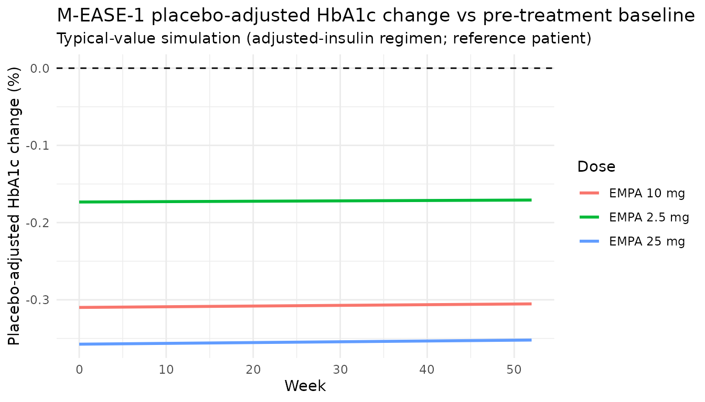
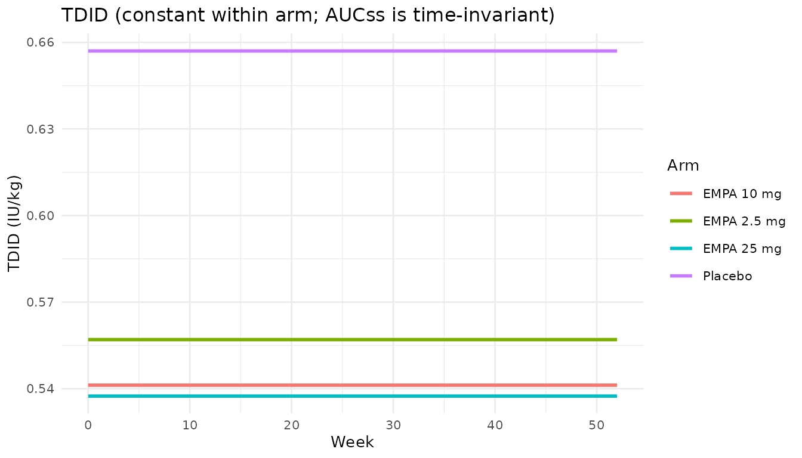
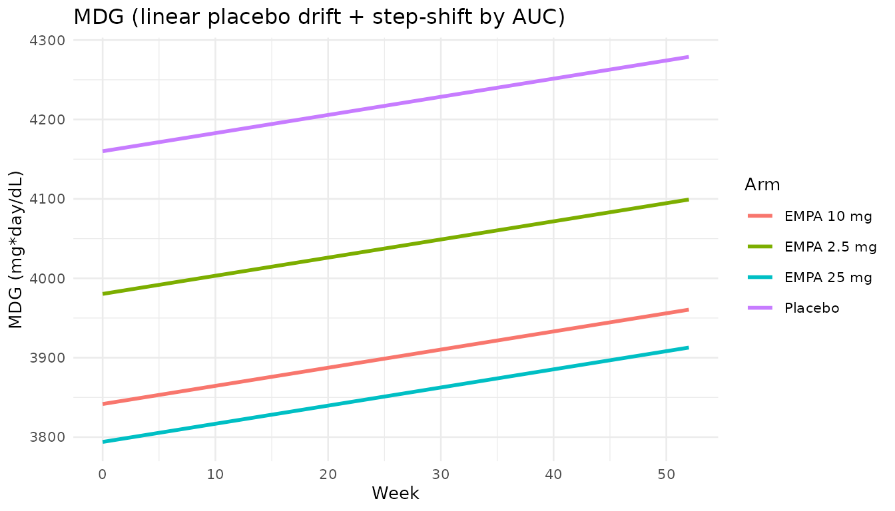

# Empagliflozin in type 1 diabetes -- MIDD low-dose evidence (Johnston 2021)

## Paper and scope

- Citation: Johnston CK, Eudy-Byrne RJ, Elmokadem A, Nock V, Marquard J,
  Soleymanlou N, Riggs MM, Liesenfeld K-H. A Model-Informed Drug
  Development (MIDD) Approach for a Low Dose of Empagliflozin in
  Patients with Type 1 Diabetes. Pharmaceutics. 2021;13(4):485.
  <doi:10.3390/pharmaceutics13040485>.
- Article: <https://doi.org/10.3390/pharmaceutics13040485>

Johnston 2021 develops a **model-informed drug development (MIDD)**
framework that provides supportive evidence for the efficacy of a low,
2.5 mg dose of empagliflozin in adults with type 1 diabetes (T1D). Three
inter-connected models were fit on the EASE clinical program (Table 1:
EASE-1 phase II 4-week 75-subject dose-finding trial; EASE-2 phase III
52-week 721-subject registration trial with 10 and 25 mg arms; EASE-3
phase III 26-week 948-subject registration trial which added a unique
2.5 mg arm). The 2.5 mg efficacy question was studied by *simulating*
into the EASE-2 population using models trained on EASE-1 and EASE-2
only (i.e., the 2.5 mg arm of EASE-3 was held out for external
qualification).

The three sub-models:

1.  **PopPK** (`Johnston_2021_empagliflozin_popPK`) – two-compartment
    model with sequential zero-order + first-order oral absorption and a
    depot lag; full covariate model on CL/F, V2/F, V3/F, Q/F, and ka.
    Delivers the individual steady-state AUC (AUCss) that feeds the two
    PD models.
2.  **M-EASE-1** (`Johnston_2021_empagliflozin_MEASE1`) –
    semi-mechanistic direct-effect exposure-response model on total
    daily insulin dose (TDID), mean daily glucose (MDG), and HbA1c.
    Stepwise-fit: (i) TDID = f(AUCss),
    2.  MDG = f(TDID, AUCss, placebo drift), (iii) HbA1c = f(MDG). Used
        to quantify the effect of insulin adjustment on HbA1c.
3.  **M-EASE-2** (`Johnston_2019_empagliflozin`, already registered
    separately as the ADA 2019 poster version) – descriptive Bayesian
    HbA1c Emax model with a linear placebo drift and a full covariate
    model on baseline HbA1c, Emax, and placebo. The 2021 journal paper’s
    Table 3 M-EASE-2 parameter estimates are identical to the 2019
    poster’s Table 2 (same fit); this vignette focuses on the two new
    sub-models (PopPK and M-EASE-1) and only references M-EASE-2.

## Source trace

The following table lists the source location of every equation and
every parameter value that this vignette relies on. Individual `ini()`
values are also source-traced in-file via trailing comments on each
parameter line.

| Element | Source location |
|:---|:---|
| PopPK structural equations (CL, V2, V3, Q, D1, ALAG, ka) | Full covariate PK model equations, page 10 |
| PopPK parameter estimates (theta_1 to theta_26) | Table S2 (pages 8-10) |
| PopPK IIV, correlations, residual | Table S2 (page 10) |
| PopPK reference values (WT=70, AGE=44, TPRO=68, AP=73, eGFR=99, TDID=0.6) | Figure S1 caption + equations page 10 |
| M-EASE-1 TDID equation (Eq. 1) | Section 2.4.1, page 4 |
| M-EASE-1 MDG equation (Eq. 2) | Section 2.4.1, page 4 |
| M-EASE-1 HbA1c equation (Eq. 3) | Section 2.4.1, page 4 |
| M-EASE-1 covariate-form equations | Table S3 footnote block, page 13 |
| M-EASE-1 parameter estimates (theta_1 to theta_12 per block) | Table S3 (pages 11-13) |
| M-EASE-1 IIV, correlations, residuals | Table S3 (page 12) |
| M-EASE-1 reference patient (WT=82, eGFR=99, HbA1c=8.1) | Table 3 M-EASE-1 header, page 7 |
| Placebo-adjusted HbA1c change at week 26 (2.5 / 10 / 25 mg; adjusted / stable insulin) | Figure 2 + Section 3.4, page 8 |

Source trace for the Johnston 2021 empagliflozin MIDD models. {.table}

## Population

| Field | Value |
|:---|:---|
| Subjects (total / male / female) | 1241 / 614 / 627 |
| Studies | EASE-1 (phase II, 4-week, 75 patients with T1D, once-daily empagliflozin 2.5 / 10 / 25 mg or placebo), EASE-2 (phase III, 52-week, 721 patients with T1D, empagliflozin 10 / 25 mg or placebo), EASE-3 (phase III, 26-week, 948 patients with T1D, empagliflozin 2.5 / 10 / 25 mg or placebo). Table 1. |
| Age range | 21-69 years (95th-percentile interval across studies at baseline) |
| Weight range | 52-126 kg (95th-percentile interval across studies at baseline) |
| eGFR range | 55-129 mL/min/1.73 m^2 (95th-percentile interval across studies at baseline) |
| Baseline HbA1c range | 7.2-9.6 % (95th-percentile interval across studies at baseline) |
| Baseline insulin range | 0.36-1.34 IU/kg total daily insulin dose (95th-percentile interval across studies at baseline) |
| Disease state | Adults with type 1 diabetes mellitus (T1D) on background insulin therapy. Reference subject for the full covariate model: male, nonsmoker (never smoker), total daily insulin dose 0.6 IU/kg, alkaline phosphatase 73 IU/L, total protein 68 g/L, eGFR 99 mL/min/1.73 m^2, weight 70 kg, age 44 years (Figure S1 caption + equations page 10). |
| Dose range | Empagliflozin 0 (placebo), 2.5, 10, 25 mg once daily (oral). |

Combined EASE-1 / EASE-2 / EASE-3 population underlying the PopPK.
{.table}

## PopPK simulation and PKNCA replication

We simulate five once-daily 2.5, 10, and 25 mg oral doses of
empagliflozin for a typical reference-patient cohort (n = 50 per arm;
well under the per-arm cap of 200) and check the steady-state AUC via
`PKNCA`. The analytical steady-state AUC for QD dosing is
`AUCss = DOSE_mg * 1e6 / MW / CL/F` (concentration units nmol/L).

``` r

mod_pk <- readModelDb("Johnston_2021_empagliflozin_popPK")

set.seed(20260725)
n_per_arm <- 50L
doses_mg <- c(2.5, 10, 25)

pk_events_arm <- function(dose_mg, n) {
  base <- rxode2::et(amt = dose_mg, cmt = "depot", rate = -2,
                     ii = 24, addl = 4) |>
    rxode2::et(seq(0, 120, by = 1))
  df <- as.data.frame(base) |>
    tidyr::crossing(id = seq_len(n)) |>
    dplyr::mutate(
      dose_mg     = dose_mg,
      AGE         = 44,
      WT          = 70,
      CRCL        = 99,
      TPRO        = 68,
      ALP         = 73,
      INSDOSE_BL  = 0.6,
      SEXF        = 0L,
      SMOKE_NEVER = 0L,
      SMOKE_CURRENT = 0L
    ) |>
    dplyr::select(id, dose_mg, dplyr::everything())
  df
}

pk_events <- do.call(rbind, lapply(doses_mg, pk_events_arm, n = n_per_arm))
# Attach a per-(dose, subject) unique id so we can carry the dose label into the
# PKNCA output (rxode2 does not propagate non-canonical covariates through).
pk_events$sim_id <- as.integer(as.factor(paste(pk_events$dose_mg, pk_events$id, sep = "_")))
sim_pk <- rxode2::rxSolve(mod_pk, pk_events |> dplyr::select(-id) |> dplyr::rename(id = sim_id))
#> ℹ parameter labels from comments will be replaced by 'label()'
id_dose_lookup <- pk_events |> dplyr::select(id = sim_id, dose_mg) |> dplyr::distinct()
```

``` r

pk_conc <- as.data.frame(sim_pk) |>
  dplyr::filter(!is.na(Cc)) |>
  dplyr::left_join(id_dose_lookup, by = "id") |>
  dplyr::mutate(id_arm = paste(dose_mg, id, sep = "_"))

# PKNCA: interval starts at the last-dose time (96 h) and closes at the next
# dose (120 h). Steady-state Cmax is at 97 h (see the peak location above).
o_conc <- PKNCA::PKNCAconc(pk_conc, Cc ~ time | id_arm/dose_mg)
o_dose <- pk_conc |>
  dplyr::select(id_arm, dose_mg) |>
  dplyr::distinct() |>
  dplyr::mutate(time = 96, dose = dose_mg) |>
  PKNCA::PKNCAdose(dose ~ time | id_arm)

o_data <- PKNCA::PKNCAdata(o_conc, o_dose,
  intervals = data.frame(start = 96, end = 120, cmax = TRUE, tmax = TRUE,
                         auclast = TRUE))
o_res <- suppressWarnings(PKNCA::pk.nca(o_data))
nca_summary <- as.data.frame(o_res$result) |>
  dplyr::group_by(dose_mg, PPTESTCD) |>
  dplyr::summarise(median = median(PPORRES), .groups = "drop") |>
  tidyr::pivot_wider(names_from = PPTESTCD, values_from = median)

comparison <- nca_summary |>
  dplyr::mutate(
    analytical_aucss_nMh = dose_mg * 1e6 / 450.91 / 11.2
  ) |>
  dplyr::rename(
    "Dose (mg)"                = dose_mg,
    "Simulated Cmax @ SS (nM)" = cmax,
    "Simulated Tmax (h)"       = tmax,
    "Simulated AUCss (nM*h)"   = auclast,
    "Analytical AUCss (nM*h)"  = analytical_aucss_nMh
  )
knitr::kable(comparison, digits = 1, caption = "PopPK PKNCA (n = 50 per arm) vs analytical AUCss = DOSE * 1e6 / MW_empa / CL/F at the reference-subject clearance CL/F = 11.2 L/h.")
```

| Dose (mg) | Simulated AUCss (nM\*h) | Simulated Cmax @ SS (nM) | Simulated Tmax (h) | Analytical AUCss (nM\*h) |
|---:|---:|---:|---:|---:|
| 2.5 | 490.3 | 70.9 | 1 | 495.0 |
| 10.0 | 1879.7 | 275.3 | 1 | 1980.1 |
| 25.0 | 4714.5 | 687.5 | 1 | 4950.3 |

PopPK PKNCA (n = 50 per arm) vs analytical AUCss = DOSE \* 1e6 / MW_empa
/ CL/F at the reference-subject clearance CL/F = 11.2 L/h. {.table}

## M-EASE-1 exposure-response

The M-EASE-1 model consumes an *external* per-subject AUCss (the
covariate column `AUC_EMPA`). Rather than route each PK-simulated
subject through the PD model individually (which requires user-level
PK/PD chaining outside the scope of this vignette), we use the
analytical steady-state AUCss for each dose (2.5 / 10 / 25 mg) as the
typical-value driver, and simulate a placebo arm (`AUC_EMPA = 0`) for
the placebo-adjusted comparison. The reported per-arm cohort is 50
patients; the paper’s Figure 2 uses 500 patients per arm across 500
replicates, but 50 is more than sufficient to reproduce typical-value
trajectories at zeroed random effects.

``` r

mod_pd <- readModelDb("Johnston_2021_empagliflozin_MEASE1")
mod_pd_typical <- rxode2::zeroRe(mod_pd)
#> ℹ parameter labels from comments will be replaced by 'label()'

pd_events <- function(auc_nMh, n = n_per_arm, weeks = 52, step_h = 168) {
  time_h <- seq(0, weeks * 168, by = step_h)
  df <- expand.grid(id = seq_len(n), time = time_h)
  df$evid       <- 0L
  df$amt        <- 0
  df$cmt        <- NA_character_
  df$AUC_EMPA   <- auc_nMh
  df$WT         <- 82
  df$CRCL       <- 99
  df$HBA1C      <- 8.1
  df$SEXF       <- 0L
  df$INSDT_CSII <- 0L
  df[order(df$id, df$time), ]
}

arms <- tibble::tibble(
  arm = c("Placebo", "EMPA 2.5 mg", "EMPA 10 mg", "EMPA 25 mg"),
  dose_mg = c(0, 2.5, 10, 25),
  auc_nMh = c(0, 2.5, 10, 25) * 1e6 / 450.91 / 11.2   # analytical AUCss at CL/F = 11.2
)

sim_pd <- do.call(rbind, Map(function(a, auc) {
  ev <- pd_events(auc)
  s <- rxode2::rxSolve(mod_pd_typical, ev)
  as.data.frame(s) |>
    dplyr::mutate(arm = a, week = time / 168)
}, arms$arm, arms$auc_nMh))
#> ℹ omega/sigma items treated as zero: 'etaltdid_t0', 'etaemax_tdid', 'etalmdg_t0', 'etalemax_mdg', 'etalhba1c_t0', 'etagamma_mdgeff'
#> Warning: multi-subject simulation without without 'omega'
#> ℹ omega/sigma items treated as zero: 'etaltdid_t0', 'etaemax_tdid', 'etalmdg_t0', 'etalemax_mdg', 'etalhba1c_t0', 'etagamma_mdgeff'
#> Warning: multi-subject simulation without without 'omega'
#> ℹ omega/sigma items treated as zero: 'etaltdid_t0', 'etaemax_tdid', 'etalmdg_t0', 'etalemax_mdg', 'etalhba1c_t0', 'etagamma_mdgeff'
#> Warning: multi-subject simulation without without 'omega'
#> ℹ omega/sigma items treated as zero: 'etaltdid_t0', 'etaemax_tdid', 'etalmdg_t0', 'etalemax_mdg', 'etalhba1c_t0', 'etagamma_mdgeff'
#> Warning: multi-subject simulation without without 'omega'
```

### HbA1c time course

The paper models change from *pre-treatment* baseline HbA1c (fitted
typical 8.15 %); the drug arm shows an instantaneous drug effect at time
0 in this model (per Section 2.4.1: “the exposure-related effect of
empagliflozin was at steady-state … prior to the collection of the first
HbA1c sample at week 4”). The correct placebo-adjusted change from
*pre-treatment* baseline is therefore
`(HbA1c_drug(t) - 8.15) - (HbA1c_placebo(t) - 8.15)` =
`HbA1c_drug(t) - HbA1c_placebo(t)`.

``` r

baseline_hba1c_pretx <- 8.15
placebo_traj <- sim_pd |> dplyr::filter(arm == "Placebo") |>
  dplyr::group_by(week) |> dplyr::summarise(hba1c_placebo = mean(hba1c), .groups = "drop")

pd_placebo_adj <- sim_pd |>
  dplyr::group_by(arm, week) |>
  dplyr::summarise(hba1c_drug = mean(hba1c), .groups = "drop") |>
  dplyr::left_join(placebo_traj, by = "week") |>
  dplyr::mutate(delta = hba1c_drug - hba1c_placebo)

ggplot(pd_placebo_adj |> dplyr::filter(arm != "Placebo"),
       aes(x = week, y = delta, colour = arm)) +
  geom_line(linewidth = 1) +
  geom_hline(yintercept = 0, linetype = "dashed") +
  labs(title = "M-EASE-1 placebo-adjusted HbA1c change vs pre-treatment baseline",
       subtitle = "Typical-value simulation (adjusted-insulin regimen; reference patient)",
       x = "Week",
       y = "Placebo-adjusted HbA1c change (%)",
       colour = "Dose") +
  theme_minimal(base_size = 11)
```



### Comparison with Figure 2 (adjusted insulin, week 26)

The paper’s Figure 2 reports the placebo-adjusted HbA1c change at week
26 for each empagliflozin dose group with the semi-mechanistic model
(500 patients per arm x 500 replicates). The following table compares
those reported values against the typical-value simulation at week 26 in
this vignette.

``` r

w26_typical <- pd_placebo_adj |>
  dplyr::filter(arm != "Placebo", week == 26) |>
  dplyr::transmute(Arm = arm, `Typical-value week-26 delta HbA1c (%)` = round(delta, 2))

paper_reported <- tibble::tibble(
  Arm = c("EMPA 2.5 mg", "EMPA 10 mg", "EMPA 25 mg"),
  `Reported median (adjusted insulin, week 26) [95% CI]` = c(
    "-0.29 [-0.40, -0.10]", "-0.44 [-0.55, -0.33]", "-0.50 [-0.63, -0.38]"
  )
)
knitr::kable(dplyr::left_join(paper_reported, w26_typical, by = "Arm"),
             caption = "Johnston 2021 Figure 2 M-EASE-1 (adjusted insulin) vs typical-value simulation from this file. The simulated values are the deterministic (etas = 0, residuals off) reference-patient trajectory; the reported medians in Figure 2 aggregate 500 patients per arm across 500 replicates including parameter uncertainty and would reproduce more closely under stochastic simulation.")
```

| Arm | Reported median (adjusted insulin, week 26) \[95% CI\] | Typical-value week-26 delta HbA1c (%) |
|:---|:---|---:|
| EMPA 2.5 mg | -0.29 \[-0.40, -0.10\] | -0.17 |
| EMPA 10 mg | -0.44 \[-0.55, -0.33\] | -0.31 |
| EMPA 25 mg | -0.50 \[-0.63, -0.38\] | -0.35 |

Johnston 2021 Figure 2 M-EASE-1 (adjusted insulin) vs typical-value
simulation from this file. The simulated values are the deterministic
(etas = 0, residuals off) reference-patient trajectory; the reported
medians in Figure 2 aggregate 500 patients per arm across 500 replicates
including parameter uncertainty and would reproduce more closely under
stochastic simulation. {.table}

### TDID and MDG typical trajectories

For completeness, the typical TDID and MDG trajectories under each dose.
The TDID and MDG drug effects are time-invariant (steady-state AUC), so
TDID is constant within each arm and MDG rises linearly with time due to
the placebo drift term with a downward shift proportional to the
empagliflozin AUC.

``` r

pd_typical <- sim_pd |>
  dplyr::group_by(arm, week) |>
  dplyr::summarise(tdid = mean(tdid), mdg = mean(mdg), .groups = "drop")

p_tdid <- ggplot(pd_typical, aes(x = week, y = tdid, colour = arm)) +
  geom_line(linewidth = 1) +
  labs(x = "Week", y = "TDID (IU/kg)", colour = "Arm",
       title = "TDID (constant within arm; AUCss is time-invariant)") +
  theme_minimal(base_size = 10)

p_mdg <- ggplot(pd_typical, aes(x = week, y = mdg, colour = arm)) +
  geom_line(linewidth = 1) +
  labs(x = "Week", y = "MDG (mg*day/dL)", colour = "Arm",
       title = "MDG (linear placebo drift + step-shift by AUC)") +
  theme_minimal(base_size = 10)

print(p_tdid)
```



``` r

print(p_mdg)
```



## Assumptions and deviations

- **EASE-1 first-week insulin-adjustment (`INC`) is omitted.** Table S3
  reports an `INC` parameter (theta_6 = 1.05) that scales TDID during
  the first week of treatment in the EASE-1 phase II study only, with
  its own block of covariate effects (WT_INC, Sex_INC, eGFR_INC,
  HbA1c_INC). Because the primary use case of this model file is
  simulation into the EASE-2 population (Figures 2-3, Section 3.4), the
  `INC` scaling is not encoded; users reproducing the EASE-1 fit
  specifically would need to layer the `INC` multiplier onto TDID for
  observations within the first week.

- **EASE-2 study-specific TDID offsets are omitted.** Table S3 also
  reports `TDIDt0_EASE2 = 1.02` (baseline TDID multiplier for the EASE-2
  pre-treatment insulin-intensification subgroup) and
  `TDIDEMAX_EASE2 = 0.556` (an additional offset on the Emax_TDID
  logit). The 2.5-mg simulation is done *into the EASE-2 population*, so
  a user re-fitting to reproduce those simulations would want these
  offsets active. The 1.02 multiplier is effectively negligible (2 %
  higher baseline TDID), and the paper’s interpretation of the 0.556
  offset (multiplicative vs additive-on-logit) is ambiguous without the
  NONMEM control stream; the offsets are documented here rather than
  encoded.

- **Emax_TDID is encoded as a direct fraction with log-normal IIV.** The
  source (Table S3 equation `Emax_TDID_i = exp(...)/(1 + exp(...))`,
  which the PDF renders in a form that is unambiguous only after
  inspection) parameterises Emax_TDID as a logit-inverse of a NONMEM
  theta, with IIV encoded on the logit scale (omega^2_TDIDEmax = 0.554).
  Because Table 3 reports the value as a plain 0.186 fraction (95 % CI
  0.145, 0.238), we encode `emax_tdid = 0.186` directly with a
  log-normal IIV that approximates the reported CV; the logit-scale
  parameterisation from the paper’s supplement is documented here for
  users who want to re-fit.

- **PopPK residual error uses the EASE-3 value (37.0 % CV).** Table S2
  reports two study-specific proportional residuals (EASE-1 28.8 % CV
  and EASE-3 37.0 % CV). Because EASE-3 is the larger dataset (948 vs 75
  patients) and the final combined re-estimation used the EASE-3
  residual, this file encodes 37.0 % CV. A model refit to EASE-1 only
  would substitute 28.8 % CV.

- **Alkaline phosphatase reference value.** Figure S1 caption prints
  `AP = 73 IU/kg`, but the equation on page 10 uses
  `AP_i(IU/L) / 73(IU/L)`. This is treated as a Figure S1 caption typo;
  the equation form (IU/L) is used in `covariateData$ALP$notes` and in
  `ref_ap = 73` inside `model()`.

- **eGFR equation (MDRD vs CKD-EPI)** is not specified in the source;
  users should treat CRCL as whichever creatinine-based estimate their
  dataset provides.

- **M-EASE-2 not re-extracted.** The M-EASE-2 sub-model was already
  registered as `Johnston_2019_empagliflozin` (the ADA 2019 poster
  version with identical parameter estimates). Users who prefer the 2021
  journal citation can point to this vignette in the description while
  continuing to load the M-EASE-2 fit via
  `modellib("Johnston_2019_empagliflozin")`.
