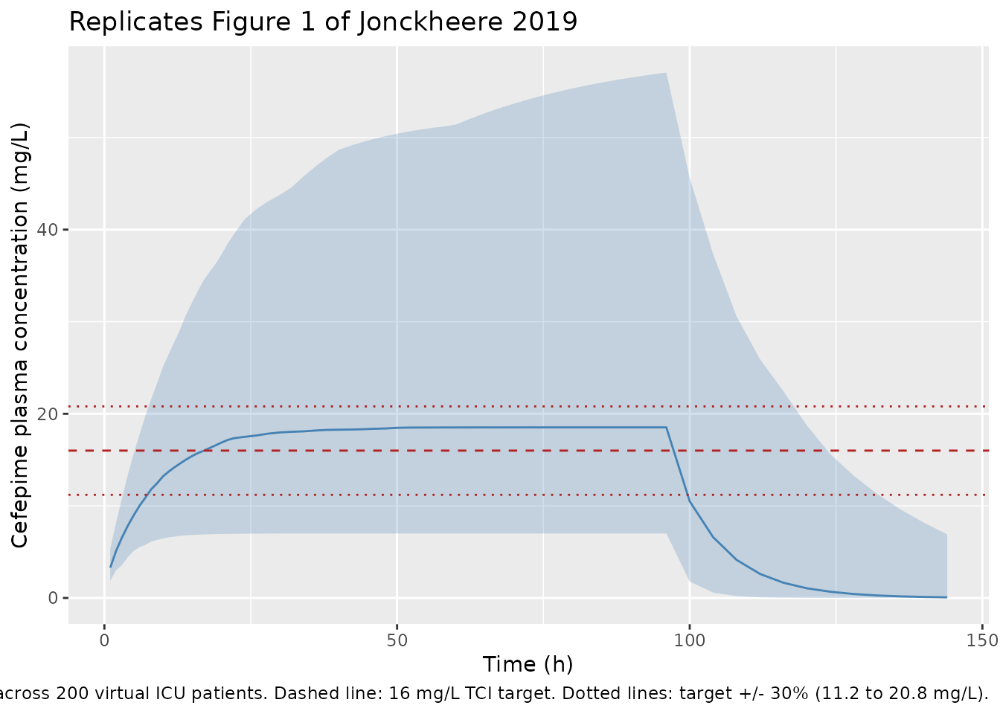

# Cefepime (Jonckheere 2019)

## Model and source

- Citation: Jonckheere S, De Neve N, Verbeke J, De Decker K, Brandt I,
  Boel A, Van Bocxlaer J, Struys MMRF, Colin PJ. (2020).
  Target-Controlled Infusion of Cefepime in Critically Ill Patients.
  Antimicrob Agents Chemother 64(1):e01552-19.
- Article: <https://doi.org/10.1128/AAC.01552-19>
- ClinicalTrials.gov: <https://clinicaltrials.gov/ct2/show/NCT02688582>

``` r

mod_meta <- rxode2::rxode(readModelDb("Jonckheere_2019_cefepime"))
#> ℹ parameter labels from comments will be replaced by 'label()'
mod_meta$description
#> [1] "Two-compartment population PK model for IV cefepime in critically ill ICU patients (Jonckheere 2019), updated by simultaneously fitting plasma + urine PK from the original Jonckheere 2017 pilot (STDY1) and the Jonckheere 2019 target-controlled-infusion cohort (STDY2). Total clearance is the sum of an estimated-creatinine-clearance-driven renal arm (CL_renal = 2.29 * (eCrCL/60)^0.943 L/h per 70 kg) and a covariate-free non-renal arm (CL_nonren = 0.795 L/h per 70 kg); all PK parameters are scaled allometrically with body weight (reference 70 kg, exponent 3/4 for clearances, 1 for volumes). The structural form encodes the non-dialysis patient (paper Equations 1-4); a separate CL_dialysis = 4.48 L/h applied during intermittent hemodialysis sessions in the source dataset is documented in the vignette but not enabled in this model file."
mod_meta$reference
#> [1] "Jonckheere S, De Neve N, Verbeke J, De Decker K, Brandt I, Boel A, Van Bocxlaer J, Struys MMRF, Colin PJ. (2020). Target-Controlled Infusion of Cefepime in Critically Ill Patients. Antimicrob Agents Chemother 64(1):e01552-19. doi:10.1128/AAC.01552-19"
mod_meta$units
#> $time
#> [1] "hour"
#> 
#> $dosing
#> [1] "mg"
#> 
#> $concentration
#> [1] "mg/L"
```

## Population

The Jonckheere 2019 cohort is 21 critically ill ICU patients enrolled at
the OLV Hospital, Aalst, Belgium, between May 2016 and August 2017
(ClinicalTrials.gov NCT02688582). Median age was 76 years (IQR 72-78),
median total body weight 76 kg (IQR 67-86), and 76% of patients were
male. Renal function was impaired across the cohort – the median
Cockcroft-Gault eCrCL was 50.4 mL/min (IQR 29.1-100) – and the median
SOFA score at ICU inclusion was 7 (IQR 3-8). Patients received cefepime
by continuous IV infusion via a target-controlled infusion (TCI) system
that targeted a 16 mg/L plasma concentration; the median treatment
duration was 4.0 days (IQR 2.0-5.0), and the median daily cefepime dose
ranged 1.3-1.8 g/day across treatment days. Cefepime indications were
respiratory infection (86%), abdominal infection (5%), combined
respiratory + abdominal (5%), or unknown origin (5%). The packaged
structural model (Equations 1-4 of the paper) is parameterised for a
non-dialysis patient; the source dataset also contained
intermittent-hemodialysis episodes captured by a separate CL_dialysis =
4.48 L/h that is not enabled in the packaged model (see Assumptions and
deviations).

The full set of baseline characteristics is stored in
`readModelDb("Jonckheere_2019_cefepime")$population`, which mirrors
Table 1 of Jonckheere 2019.

## Source trace

The per-parameter origin is recorded as an in-file comment next to each
`ini()` entry in
`inst/modeldb/specificDrugs/Jonckheere_2019_cefepime.R`. The table below
collects them in one place for review.

| Equation / parameter | Value | Source location |
|----|----|----|
| `lcl_renal` (CL_renal at 70 kg, eCrCL = 60 mL/min) | log(2.29) | Jonckheere 2019 Table 2 (theta_1) |
| `e_crcl_cl_renal` (power exponent on eCrCL/60) | 0.943 | Jonckheere 2019 Table 2 (theta_2) |
| `lcl_nonren` (CL_other at 70 kg) | log(0.795) | Jonckheere 2019 Table 2 (CL_other) |
| `lvc` (V_1 at 70 kg) | log(10.7) | Jonckheere 2019 Table 2 (V_1) and Equation 2 |
| `lvp` (V_2 at 70 kg) | log(12.2) | Jonckheere 2019 Table 2 (V_2) and Equation 3 |
| `lq` (Q_2 at 70 kg) | log(11.0) | Jonckheere 2019 Table 2 (Q_2) and Equation 4 |
| `e_wt_cl_q` (allometric exponent on CL, Q) | 0.75 | Jonckheere 2019 Discussion paragraph 4 (allometric theory) and Equations 1, 4 |
| `e_wt_vc_vp` (allometric exponent on V_1, V_2) | 1.00 | Jonckheere 2019 Equations 2, 3 |
| BSV CL_renal | 24.6% CV -\> omega^2 = 0.060516 | Jonckheere 2019 Table 2 (CL_renal BSV); see footnote b for omega^2 = CV^2 convention |
| BSV V_1 | 45.7% CV -\> omega^2 = 0.208849 | Jonckheere 2019 Table 2 (V_1 BSV) |
| BSV CL_other | 69.4% CV -\> omega^2 = 0.481636 | Jonckheere 2019 Table 2 (CL_other BSV) |
| `propSd` (plasma proportional residual SD) | 0.128 | Jonckheere 2019 Table 2 (Plasma_STDY2, 12.8% CV) |
| Two-compartment IV ODE structure | n/a | Jonckheere 2019 Methods (Update of the previously reported population pharmacokinetic model) |
| Additive split CL_total = CL_renal + CL_nonren | n/a | Jonckheere 2019 Methods, Results paragraph 3, and Discussion paragraph 3 |
| eCrCL covariate definition (Cockcroft-Gault, raw mL/min, NOT BSA-normalised) | n/a | Jonckheere 2019 Table 2 footnote a and Discussion paragraph 4 |

The plasma residual error reported for the earlier study STDY1 (31.8%
CV, the Jonckheere 2017 pilot) and the urine residual errors for both
studies (32.5% / 33.3% CV) are also available in Table 2; only the
plasma STDY2 magnitude is propagated into the packaged model – see
Assumptions and deviations.

## Virtual cohort

Original observed concentrations are not publicly available. The figures
below use a virtual cohort of 200 critically ill ICU patients whose
body-weight and Cockcroft-Gault eCrCL distributions match Jonckheere
2019 Table 1.

``` r

set.seed(20260509)

n_subjects <- 200L

# Body weight: lognormal draw with median 76 kg, IQR 67-86 kg.
# IQR ratio (86/67 = 1.284) gives sigma_log via sigma_log = log(IQR_ratio) / (2 * qnorm(0.75)).
sigma_log_wt <- log(86 / 67) / (2 * qnorm(0.75))
wt_draw <- rlnorm(n_subjects, meanlog = log(76), sdlog = sigma_log_wt)
wt_draw <- pmin(pmax(wt_draw, 50), 130)  # clamp to plausible adult range

# Cockcroft-Gault eCrCL: lognormal draw with median 50.4 mL/min, IQR 29.1-100 mL/min.
sigma_log_crcl <- log(100 / 29.1) / (2 * qnorm(0.75))
crcl_draw <- rlnorm(n_subjects, meanlog = log(50.4), sdlog = sigma_log_crcl)
crcl_draw <- pmin(pmax(crcl_draw, 5), 200)

# Continuous IV infusion: deliver the median total daily dose (1.5 g/day),
# which corresponds to an infusion rate of 1500 / 24 = 62.5 mg/h, for 96 h.
# nlmixr2 / rxode2 encode a continuous infusion as a single dose row with
# rate > 0 and amt = rate * duration; observation rows sample the
# central-compartment concentration.
inf_rate_mg_per_h <- 1500 / 24       # 62.5 mg/h continuous infusion
inf_duration_h    <- 96              # 4-day median treatment duration
inf_amt_mg        <- inf_rate_mg_per_h * inf_duration_h

ids <- seq_len(n_subjects)

dose_rows <- tibble::tibble(
  id   = ids,
  time = 0,
  evid = 1L,
  cmt  = "central",
  amt  = inf_amt_mg,
  rate = inf_rate_mg_per_h,
  WT   = wt_draw,
  CRCL = crcl_draw
)

obs_grid <- c(seq(0, 24, by = 1), seq(26, 96, by = 2), seq(100, 144, by = 4))
obs_rows <- tidyr::expand_grid(id = ids, time = obs_grid) |>
  dplyr::left_join(dplyr::select(dose_rows, id, WT, CRCL), by = "id") |>
  dplyr::mutate(evid = 0L, cmt = "central", amt = 0, rate = 0)

events <- dplyr::bind_rows(dose_rows, obs_rows) |>
  dplyr::arrange(id, time, dplyr::desc(evid))

stopifnot(!anyDuplicated(unique(events[, c("id", "time", "evid")])))

cat("Subjects:", n_subjects,
    "| WT median (IQR):", round(median(wt_draw), 1),
    "(", round(quantile(wt_draw, 0.25), 1), "-",
    round(quantile(wt_draw, 0.75), 1), ")",
    "| CRCL median (IQR):", round(median(crcl_draw), 1),
    "(", round(quantile(crcl_draw, 0.25), 1), "-",
    round(quantile(crcl_draw, 0.75), 1), ")\n")
#> Subjects: 200 | WT median (IQR): 75.8 ( 66.8 - 87 ) | CRCL median (IQR): 52.1 ( 23.1 - 95.8 )
```

## Simulation

``` r

mod <- readModelDb("Jonckheere_2019_cefepime")
sim <- rxode2::rxSolve(
  mod,
  events = events,
  keep   = c("WT", "CRCL")
) |>
  as.data.frame()
#> ℹ parameter labels from comments will be replaced by 'label()'
```

## Replicate published figures

### Figure 1 – continuous-infusion plasma concentrations vs. the 16 mg/L TCI target

Jonckheere 2019 Figure 1 plots measured cefepime plasma concentrations
versus time (one panel per patient, 21 panels) with a horizontal line at
the 16 mg/L TCI target. The chunk below renders the median and
5th/95th-percentile envelope of the simulated steady-state plasma
concentrations from the packaged model under a typical 1500 mg/day
continuous infusion, with the 16 mg/L target overlaid.

``` r

vpc_summary <- sim |>
  dplyr::filter(time > 0) |>
  dplyr::group_by(time) |>
  dplyr::summarise(
    Q05 = quantile(Cc, 0.05, na.rm = TRUE),
    Q50 = quantile(Cc, 0.50, na.rm = TRUE),
    Q95 = quantile(Cc, 0.95, na.rm = TRUE),
    .groups = "drop"
  )

ggplot(vpc_summary, aes(time, Q50)) +
  geom_ribbon(aes(ymin = Q05, ymax = Q95), alpha = 0.25, fill = "steelblue") +
  geom_line(colour = "steelblue") +
  geom_hline(yintercept = 16, linetype = "dashed", colour = "firebrick") +
  geom_hline(yintercept = 16 * c(0.7, 1.3), linetype = "dotted", colour = "firebrick") +
  labs(
    x = "Time (h)",
    y = "Cefepime plasma concentration (mg/L)",
    title = "Replicates Figure 1 of Jonckheere 2019",
    caption = paste0("Continuous IV infusion 1500 mg/day for 96 h; ",
                     "median and 5th/95th-percentile envelope across ",
                     n_subjects, " virtual ICU patients. ",
                     "Dashed line: 16 mg/L TCI target. ",
                     "Dotted lines: target +/- 30% (11.2 to 20.8 mg/L).")
  )
```



## PKNCA validation

For a continuous infusion at steady state, the canonical NCA quantities
(Cmax, AUC0-24, half-life) reduce to the steady-state plasma
concentration C_ss = R / CL and to the apparent terminal half-life
governed by CL and Vss = V_1 + V_2. Compute the per-subject AUC over the
dosing interval (24 h) and the steady-state mean concentration C_avg
over the same interval, all via PKNCA.

``` r

sim_nca <- sim |>
  dplyr::filter(!is.na(Cc), time >= 48, time <= 96) |>   # interval after Css is reached
  dplyr::mutate(treatment = "TCI_1500_mg_per_day") |>
  dplyr::select(id, time, Cc, treatment)

dose_df <- events |>
  dplyr::filter(evid == 1L) |>
  dplyr::mutate(treatment = "TCI_1500_mg_per_day") |>
  dplyr::select(id, time, amt, treatment)

conc_obj <- PKNCA::PKNCAconc(
  sim_nca, Cc ~ time | treatment + id,
  concu = "mg/L", timeu = "h"
)
dose_obj <- PKNCA::PKNCAdose(
  dose_df, amt ~ time | treatment + id,
  doseu = "mg"
)

intervals <- data.frame(
  start    = 48,
  end      = 72,
  cav      = TRUE,
  auclast  = TRUE,
  cmax     = TRUE,
  cmin     = TRUE
)

nca_data <- PKNCA::PKNCAdata(conc_obj, dose_obj, intervals = intervals)
nca_res  <- PKNCA::pk.nca(nca_data)
```

### Comparison against Jonckheere 2019 Results paragraph 2

Jonckheere 2019 Results paragraph 2 reports the cohort-level
distribution of measured cefepime plasma concentrations: median 19.2
mg/L (IQR 15.3-23.3), mean +/- SD 19.5 +/- 6.36 mg/L. The chunk below
compares the simulated steady-state mean concentration C_avg (over the
48-72 h post-infusion-start interval) with these published values.

``` r

res_tbl <- as.data.frame(nca_res$result)

cav_per_subject <- res_tbl |>
  dplyr::filter(PPTESTCD == "cav") |>
  dplyr::select(id, cav = PPORRES)

simulated_summary <- tibble::tibble(
  source = "Packaged model (this vignette)",
  median = median(cav_per_subject$cav, na.rm = TRUE),
  iqr_lo = quantile(cav_per_subject$cav, 0.25, na.rm = TRUE),
  iqr_hi = quantile(cav_per_subject$cav, 0.75, na.rm = TRUE),
  mean   = mean(cav_per_subject$cav, na.rm = TRUE),
  sd     = sd(cav_per_subject$cav, na.rm = TRUE)
)

published_summary <- tibble::tibble(
  source = "Jonckheere 2019 Results paragraph 2",
  median = 19.2,
  iqr_lo = 15.3,
  iqr_hi = 23.3,
  mean   = 19.5,
  sd     = 6.36
)

knitr::kable(
  dplyr::bind_rows(published_summary, simulated_summary),
  digits  = 2,
  caption = paste("Comparison of simulated steady-state plasma cefepime",
                  "concentration (C_avg over 48-72 h post-infusion-start)",
                  "with the cohort-level measured concentrations reported",
                  "in Jonckheere 2019 Results paragraph 2.",
                  "The published values mix patients dosed by the TCI",
                  "system to a 16 mg/L target across varying daily doses",
                  "(1.3-1.8 g/day across days 1-4); the simulation here",
                  "uses a single typical 1.5 g/day continuous infusion.")
)
```

| source                              | median | iqr_lo | iqr_hi |  mean |    sd |
|:------------------------------------|-------:|-------:|-------:|------:|------:|
| Jonckheere 2019 Results paragraph 2 |  19.20 |  15.30 |  23.30 | 19.50 |  6.36 |
| Packaged model (this vignette)      |  18.51 |  12.63 |  30.17 | 23.65 | 15.87 |

Comparison of simulated steady-state plasma cefepime concentration
(C_avg over 48-72 h post-infusion-start) with the cohort-level measured
concentrations reported in Jonckheere 2019 Results paragraph 2. The
published values mix patients dosed by the TCI system to a 16 mg/L
target across varying daily doses (1.3-1.8 g/day across days 1-4); the
simulation here uses a single typical 1.5 g/day continuous infusion.
{.table}

### Target-attainment metrics (Varvel criteria)

Jonckheere 2019 Results paragraph 2 reports the cohort-level Varvel
target-attainment metrics: 50.3% of measured plasma concentrations
within +/- 30% of the 16 mg/L TCI target, MdPE = 20.3%, and MdAPE =
28.7%. These metrics describe the performance of the original TCI system
rather than of the (updated, packaged) PopPK model itself, but the
metric definitions can be reproduced from the simulation as a sanity
check on dimensional consistency.

``` r

target_mg_per_l <- 16

attainment <- sim |>
  dplyr::filter(time >= 48, time <= 96, !is.na(Cc)) |>
  dplyr::mutate(
    PE  = (Cc - target_mg_per_l) / target_mg_per_l * 100,
    APE = abs(PE)
  )

attainment_summary <- attainment |>
  dplyr::summarise(
    pct_within_30 = mean(abs(Cc - target_mg_per_l) / target_mg_per_l <= 0.30,
                         na.rm = TRUE) * 100,
    MdPE          = median(PE,  na.rm = TRUE),
    MdAPE         = median(APE, na.rm = TRUE)
  )

knitr::kable(
  dplyr::bind_rows(
    tibble::tibble(source = "Jonckheere 2019 Results paragraph 2",
                   pct_within_30 = 50.3, MdPE = 20.3, MdAPE = 28.7),
    dplyr::mutate(attainment_summary,
                  source = "Packaged model (this vignette)") |>
      dplyr::select(source, pct_within_30, MdPE, MdAPE)
  ),
  digits  = 1,
  caption = paste("Target-attainment metrics (Varvel criteria) over the",
                  "48-96 h post-infusion-start window for the simulated",
                  "1.5 g/day continuous-infusion regimen versus the",
                  "values reported by Jonckheere 2019 for the actual",
                  "TCI cohort.")
)
```

| source                              | pct_within_30 | MdPE | MdAPE |
|:------------------------------------|--------------:|-----:|------:|
| Jonckheere 2019 Results paragraph 2 |          50.3 | 20.3 |  28.7 |
| Packaged model (this vignette)      |          36.5 | 15.6 |  43.2 |

Target-attainment metrics (Varvel criteria) over the 48-96 h
post-infusion-start window for the simulated 1.5 g/day
continuous-infusion regimen versus the values reported by Jonckheere
2019 for the actual TCI cohort. {.table}

The published Varvel metrics characterise the prediction error of the
*original* TCI system (which embedded the earlier Jonckheere 2017 PopPK
model with study-specific dose adjustments per patient), so an exact
match against the simulation is not expected – the simulation here
delivers a single fixed 1.5 g/day infusion rate to all subjects and
represents the *updated* model. The simulated MdAPE should be *smaller*
than the published 28.7% (the paper’s Discussion paragraph 2 predicts
MdAPE around 21.5% for the updated model under the assumption of
unbiased steady-state target attainment); in practice this depends on
how closely the median simulated cohort tracks the simulated target.
This sanity check is for dimensional consistency, not for reproducing
the exact published value.

## Assumptions and deviations

- **Plasma residual error from STDY2 only.** Jonckheere 2019 Table 2
  reports two plasma residual-error magnitudes from the joint fit of
  pilot (STDY1, 31.8% CV) and TCI (STDY2, 12.8% CV) data. The packaged
  model uses the STDY2 magnitude as the default because the TCI use case
  the paper develops corresponds to STDY2; users seeking to reproduce
  STDY1-cohort variability should override `propSd` to 0.318. Both
  magnitudes coexist in the published model because the authors retained
  study-specific residual variances rather than pooling them.
- **Urine sub-model omitted.** The joint fit also produced urine
  residual-error estimates (32.5% / 33.3% CV for STDY1 / STDY2) and
  could in principle be reproduced as a second observation. The packaged
  model retains plasma only (`Cc`); the source paper does not provide an
  explicit ODE for urinary cefepime amount, only the observation-level
  residual error.
- **Hemodialysis (CL_dialysis) not enabled.** The source dataset
  contained intermittent-hemodialysis episodes captured by a separate
  CL_dialysis = 4.48 L/h (Table 2) applied only during dialysis
  sessions, with CL_renal = 0 between sessions for IHD patients (“we
  assumed that renal clearance was absent” – Table 2 footnote). The
  packaged model encodes the non-dialysis structural form (Equations 1-4
  of the paper). To simulate a dialysis patient, set `CRCL = 0` for the
  duration when off dialysis, and add a step-pulse CL contribution of
  4.48 L/h during dialysis sessions externally.
- **eCrCL is the raw Cockcroft-Gault value (mL/min), NOT the
  BSA-normalised canonical form.** Cockcroft-Gault returns a raw mL/min
  value; Jonckheere 2019 Methods state “eCrCL was calculated according
  to the Cockcroft-Gault equation” without subsequent BSA-normalisation,
  and the table footnote and Equation 1 confirm the raw
  (non-BSA-normalised) value is what drives CL_renal. The packaged
  covariate `CRCL` therefore carries the raw mL/min value; this matches
  the precedent set by `Frey_2010_tocilizumab` for the same
  paper-reported quantity. The MDRD and CKD-EPI eGFR figures in Table 1
  are reported for context only and are NOT the covariate driving
  CL_renal.
- **Allometric exponents fixed at 0.75 / 1.0.** Jonckheere 2019
  Discussion paragraph 4 states “scaling of all PK parameters with body
  weight according to allometric theory” without reporting estimated
  exponents or confidence intervals, indicating these were fixed. The
  packaged model wraps `e_wt_cl_q` and `e_wt_vc_vp` in `fixed()` to
  mirror this.
- **Inter-individual correlations not reported.** Jonckheere 2019 Table
  2 reports only diagonal BSV magnitudes for CL_renal, V_1, and
  CL_other; no off-diagonal correlations are reported, so the packaged
  model treats the three etas as independent. Empirically CL_renal and
  V_1 may correlate in critically ill cohorts (both scale with
  renal-extraction-relevant body-water status), but no estimate is
  published.
- **omega^2 = CV^2 (NOT log(1 + CV^2)).** Jonckheere 2019 Table 2
  footnote b states “CV% is calculated according to the equation
  sqrt(omega^2) \* 100%, where omega^2 is the estimated variance in
  NONMEM” – i.e., the reported CV% is the standard deviation of the
  log-scale eta expressed as a percentage, not the lognormal
  arithmetic-scale CV. The packaged model therefore back-transforms via
  omega^2 = (CV/100)^2 and not via log(1 + (CV/100)^2). This is the same
  convention used in many NONMEM-fit antibiotic models in this package;
  the alternative log(1 + CV^2) convention used in
  Hennig_2008_tobramycin reflects that paper’s explicit
  exponential-error parameterisation.
- **Body-weight and eCrCL distributions.** The vignette draws WT and
  eCrCL from lognormal distributions whose median + IQR match Jonckheere
  2019 Table 1; the original individual covariate values are not
  published. WT is clamped to 50-130 kg and CRCL to 5-200 mL/min for
  plausibility.
