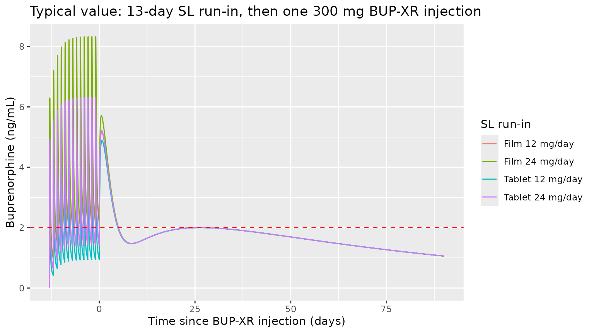
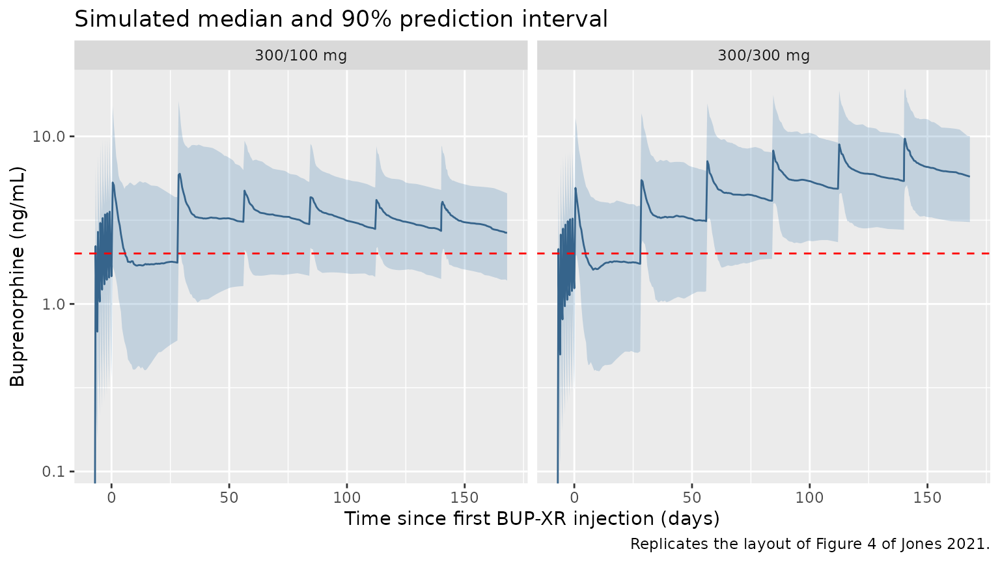
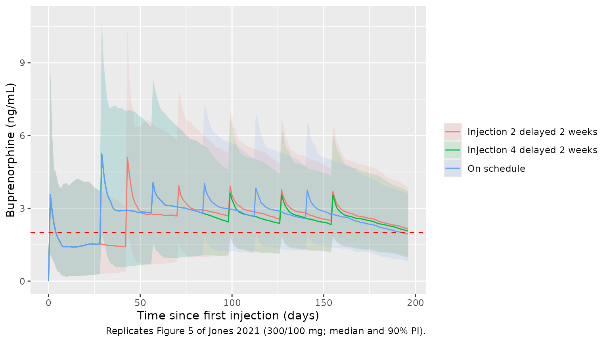
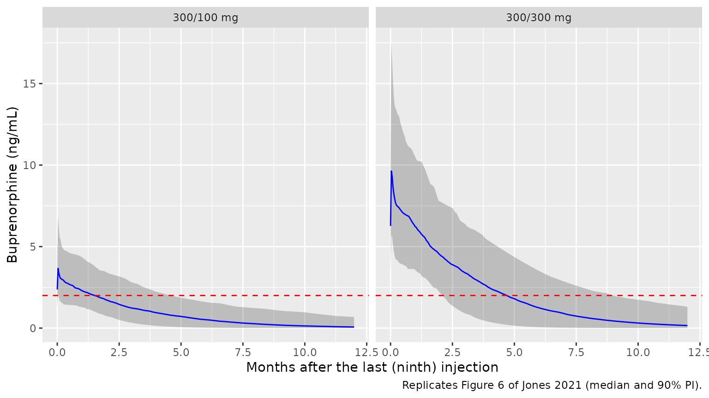

# Buprenorphine BUP-XR monthly depot (Jones 2021)

## Model and source

- Citation: Jones AK, Ngaimisi E, Gopalakrishnan M, Young MA, Laffont CM
  (2021). Population Pharmacokinetics of a Monthly Buprenorphine Depot
  Injection for the Treatment of Opioid Use Disorder: A Combined
  Analysis of Phase II and Phase III Trials. Clinical Pharmacokinetics
  60(4):527-540. <doi:10.1007/s40262-020-00957-0>.
- Description: Two-compartment population pharmacokinetic model for
  buprenorphine in adults with opioid use disorder receiving sublingual
  (SL) buprenorphine during a run-in period followed by up to 12 monthly
  subcutaneous (SC) injections of BUP-XR (RBP-6000, SUBLOCADE;
  buprenorphine in the ATRIGEL delivery system, 50-300 mg). SL
  buprenorphine is absorbed first-order (ka) from a single SL depot with
  a bioavailability fdepot relative to BUP-XR, modified by the SL
  formulation (buprenorphine/naloxone film vs tablet, on both ka and
  fdepot) and reduced for SL doses of 16 mg or more. The BUP-XR dose is
  split by a logit-normal fraction frel into a fast first-order pathway
  (ka_fast, the early ‘initial burst’ peak at about 24 h) and a slow
  pathway of one SC depot (ka_slow) and one transit compartment (ktr)
  that mimics slow release from the solidified depot. All clearances and
  volumes are apparent (relative to BUP-XR) and allometrically scaled by
  body weight (exponents 0.75 and 1, reference 70 kg); body mass index
  is a power covariate on CL/F and ka_fast (reference 24.8 kg/m^2).
  Combined proportional and additive residual error.
- Article: <https://doi.org/10.1007/s40262-020-00957-0> (open access)
- Supplement (Tables S1-S2, Figures S1-S2): Electronic Supplementary
  Material 1 of the article

BUP-XR (RBP-6000, SUBLOCADE) is buprenorphine formulated in the ATRIGEL
delivery system and injected subcutaneously (SC) into the abdomen once a
month. The model was fitted jointly to the sublingual (SL) buprenorphine
run-in data and the BUP-XR data, because the terminal phase after BUP-XR
is absorption-limited (“flip-flop”) and the SL data are needed to
identify distribution and elimination.

## Population

The analysis pooled 19,686 plasma concentrations from 570
treatment-seeking adults with opioid use disorder in three US studies
(Jones 2021 Tables 1-2): the phase IIa multiple-ascending-dose Study 1
(NCT01738503; 103 subjects; SL buprenorphine tablets 8-24 mg/day for 13
days, then 4-6 injections of 50-300 mg), the phase III double-blind
efficacy Study 2 (NCT02357901; 434 subjects including 16 placebo
subjects with run-in data; SL buprenorphine/naloxone film run-in, then 6
injections as 300/100 mg or 300/300 mg), and the phase III open-label
long-term safety Study 3 (NCT02510014; 287 subjects; up to 12
injections, 300 mg then flexible 100 or 300 mg). Across studies the mean
(SD) age was 38.8 (11.5) years (range 19-64), mean body weight 76.5
(15.5) kg (46.1-132.0), mean BMI 25.4 (4.2) kg/m^2 (18.0-35.0), 32.1%
female, and 69.5% White, 28.2% Black or African American and 2.3% other
races.

The same information is available programmatically via
`readModelDb("Jones_2021_buprenorphine")()$population`.

## Source trace

Every `ini()` value carries an in-file comment pointing to its source.
All final estimates are from Jones 2021 Table 3 (the final model
re-estimated on Studies 1-3 with the non-significant sex effect on k36
removed).

| Equation / parameter | Value | Source location |
|----|----|----|
| `lcl` (CL/F) | 52.2 L/h | Table 3 |
| `lvc` (V4/F) | 432 L | Table 3 |
| `lq` (Q/F) | 79.5 L/h, fixed | Table 3; Section 3.2 (fixed to the Study 1 estimate) |
| `lvp` (V5/F) | 1110 L, fixed | Table 3; Section 3.2 |
| `lka` (k14, SL tablet) | 1.17 1/h, fixed | Table 3; Section 3.2 |
| `lfdepot` (F1, SL tablet vs BUP-XR) | 0.185, fixed | Table 3; Section 3.2 |
| `e_form_film_ka` (FRK14) | 0.636 | Table 3 |
| `e_form_film_fdepot` (FRF1) | 1.47 | Table 3 |
| `e_dose_high_fdepot` (F1DOSE, SL dose \>= 16 mg) | 0.765, fixed | Table 3; Table S2 footnote b |
| `lka_fast` (k24) | 0.0277 1/h | Table 3 |
| `lka_slow` (k36) | 0.00392 1/h | Table 3 |
| `lktr` (k64) | 0.000507 1/h | Table 3 |
| `logitfrel` (F2) | logit(0.0680) | Table 3 (logit-normal) |
| `e_wt_cl_q`, `e_wt_vc_vp` | 0.75, 1 (fixed) | Methods 2.3.1; Table 3 footnote (reference 70 kg) |
| `e_bmi_cl` | -0.362 | Table 3 and footnote (reference BMI 24.8 kg/m^2) |
| `e_bmi_ka_fast` | -1.32 | Table 3 and footnote |
| IIV variances | CL 0.0909, V4 0.704, Q 0.334 (fixed), V5 0.941 (fixed), k14 0.190 (fixed), k24 0.643, k36 1.69, k64 0.384, F1 0.195 (fixed), F2 0.194 (logit scale) | Table 3 |
| `propSd`, `addSd` | 0.190, 0.0378 ng/mL | Table 3 |
| Structure (SL depot -\> central; SC dose split F2 / 1 - F2 into a fast depot -\> central and a slow depot -\> transit -\> central; 2-compartment disposition) | n/a | Figure 2; Section 3.1 |
| `TVCL = 52.2 (BMI/24.8)^-0.362 (WT/70)^0.75`, `TVk24 = 0.0277 (BMI/24.8)^-1.32` | n/a | Table 3 footnote |

## Virtual cohort

The observed data are not public. The cohort below draws sex (67.9%
male), height by sex, and BMI from a normal distribution truncated to
the enrolment range 18-35 kg/m^2 (mean 25.4, SD 4.2; Table 2), and
derives body weight as BMI x height^2 so that weight and BMI are
correlated as they were in the trials. Subjects whose derived weight
falls outside the observed 46.1-132 kg range are redrawn. Each regimen
arm has 200 subjects.

``` r

set.seed(2021)
rxode2::rxSetSeed(2021)

tau <- 28 * 24 # BUP-XR dosing interval (h)

draw_bmi <- function(n) {
  out <- numeric(0)
  while (length(out) < n) {
    x <- rnorm(2 * n, 25.4, 4.2)
    out <- c(out, x[x >= 18 & x <= 35])
  }
  out[seq_len(n)]
}

make_covariates <- function(n, id_offset = 0L) {
  out <- data.frame(id = integer(0), WT = numeric(0), BMI = numeric(0))
  while (nrow(out) < n) {
    male <- runif(n) < 0.679
    ht <- ifelse(male, rnorm(n, 1.765, 0.075), rnorm(n, 1.625, 0.070))
    bmi <- draw_bmi(n)
    wt <- bmi * ht^2
    keep <- wt >= 46.1 & wt <= 132
    out <- rbind(out, data.frame(id = 0L, WT = wt[keep], BMI = bmi[keep]))
  }
  out <- out[seq_len(n), ]
  out$id <- id_offset + seq_len(n)
  # SL run-in dose (mg/day) spans the 8-24 mg/day stabilisation range
  out$DOSE_BPN_SL_MG <- sample(c(8, 12, 16, 20, 24), n, replace = TRUE)
  out
}

# One BUP-XR injection = the same amount dosed into both SC depots; the
# model's f() statements split it into the fast (F2) and slow (1 - F2)
# pathways.
injection_rows <- function(times, amts) {
  data.frame(
    time = rep(times, each = 2),
    evid = 1L,
    amt = rep(amts, each = 2),
    cmt = rep(c("depot_fast1", "depot_slow1"), length(times))
  )
}

# Study 2 design: 7 days of SL buprenorphine/naloxone film, then six
# injections 28 days apart. Time 0 = first injection.
make_study2_arm <- function(cov, inj_amts, regimen) {
  sl <- data.frame(
    time = seq(-7 * 24, -24, by = 24), evid = 1L, amt = NA_real_, cmt = "depot"
  )
  inj <- injection_rows((seq_along(inj_amts) - 1) * tau, inj_amts)
  n_inj <- length(inj_amts)
  obs_times <- sort(unique(c(
    seq(-7 * 24, 0, by = 6),
    seq(0, (n_inj - 1) * tau, by = 12),
    seq((n_inj - 1) * tau, n_inj * tau, by = 2)
  )))
  obs <- data.frame(time = obs_times, evid = 0L, amt = NA_real_, cmt = "central")
  per_id <- bind_rows(sl, inj, obs)
  tidyr::crossing(cov, per_id) |>
    mutate(
      amt = ifelse(cmt == "depot" & evid == 1L, DOSE_BPN_SL_MG, amt),
      FORM_BPN_FILM = 1,
      regimen = regimen
    ) |>
    select(id, time, evid, amt, cmt, WT, BMI, DOSE_BPN_SL_MG, FORM_BPN_FILM, regimen) |>
    arrange(id, time, desc(evid))
}

cov_100 <- make_covariates(200, id_offset = 0L)
cov_300 <- make_covariates(200, id_offset = 200L)

events_s2 <- bind_rows(
  make_study2_arm(cov_100, c(300, 300, 100, 100, 100, 100), "300/100 mg"),
  make_study2_arm(cov_300, rep(300, 6), "300/300 mg")
)
stopifnot(!anyDuplicated(unique(events_s2[, c("id", "time", "evid", "cmt")])))

bind_rows(cov_100, cov_300) |>
  summarise(
    WT_mean = mean(WT), WT_sd = sd(WT), WT_min = min(WT), WT_max = max(WT),
    BMI_mean = mean(BMI), BMI_sd = sd(BMI)
  ) |>
  knitr::kable(digits = 1, caption = "Virtual cohort body size (compare Table 2: WT 76.5 (15.5) kg, BMI 25.4 (4.2) kg/m^2).")
```

| WT_mean | WT_sd | WT_min | WT_max | BMI_mean | BMI_sd |
|--------:|------:|-------:|-------:|---------:|-------:|
|    75.9 |  14.1 |   46.1 |  117.2 |     25.4 |    3.7 |

Virtual cohort body size (compare Table 2: WT 76.5 (15.5) kg, BMI 25.4
(4.2) kg/m^2). {.table}

## Simulation

``` r

mod <- readModelDb("Jones_2021_buprenorphine")
# rxode2 must solve the explicit ODEs (the model has a cl/vc pair, which can
# trigger an automatic linCmt() translation that would discard the dual
# absorption pathway).
stopifnot(is.null(rxode2::rxode2(mod)$linCmt))
#> ℹ parameter labels from comments will be replaced by 'label()'

sim_s2 <- rxode2::rxSolve(
  mod,
  events = events_s2,
  keep = "regimen",
  returnType = "data.frame"
)
#> ℹ parameter labels from comments will be replaced by 'label()'
#> Warning: 
#> with negative times, compartments initialize at first negative observed time
#> with positive times, compartments initialize at time zero
#> use 'rxSetIni0(FALSE)' to initialize at first observed time
#> this warning is displayed once per session
```

### Typical-value profiles (structure check)

A typical subject (70 kg, BMI 24.8 kg/m^2) takes SL buprenorphine for 13
days (the Study 1 run-in) as a tablet or as the film, at 12 mg/day
(below the 16 mg threshold) or 24 mg/day, then receives a single 300 mg
BUP-XR injection. The SL phase shows the film’s slower absorption and
higher exposure, and the 16 mg threshold on F1; the BUP-XR phase shows
the early “initial burst” peak near 24 h followed by the slow release.

``` r

mod_typ <- rxode2::zeroRe(mod)
#> ℹ parameter labels from comments will be replaced by 'label()'
make_typical <- function(id, sl_dose, film) {
  sl <- data.frame(time = seq(-13 * 24, -24, by = 24), evid = 1L, amt = sl_dose, cmt = "depot")
  inj <- injection_rows(0, 300)
  obs <- data.frame(
    time = sort(unique(c(seq(-13 * 24, 0, by = 0.5), seq(0, 90 * 24, by = 2)))),
    evid = 0L, amt = NA_real_, cmt = "central"
  )
  bind_rows(sl, inj, obs) |>
    mutate(
      id = id, WT = 70, BMI = 24.8, DOSE_BPN_SL_MG = sl_dose,
      FORM_BPN_FILM = film,
      scenario = sprintf("%s %g mg/day", ifelse(film == 1, "Film", "Tablet"), sl_dose)
    ) |>
    select(id, time, evid, amt, cmt, WT, BMI, DOSE_BPN_SL_MG, FORM_BPN_FILM, scenario) |>
    arrange(time, desc(evid))
}
events_typ <- bind_rows(
  make_typical(1, 12, 0), make_typical(2, 24, 0),
  make_typical(3, 12, 1), make_typical(4, 24, 1)
)
sim_typ <- rxode2::rxSolve(mod_typ, events = events_typ, keep = "scenario", returnType = "data.frame")
#> ℹ omega/sigma items treated as zero: 'etalcl', 'etalvc', 'etalq', 'etalvp', 'etalka', 'etalka_fast', 'etalka_slow', 'etalktr', 'etalfdepot', 'etalogitfrel'
#> Warning: multi-subject simulation without without 'omega'

ggplot(sim_typ, aes(time / 24, Cc, colour = scenario)) +
  geom_line() +
  geom_hline(yintercept = 2, linetype = "dashed", colour = "red") +
  labs(
    x = "Time since BUP-XR injection (days)", y = "Buprenorphine (ng/mL)",
    colour = "SL run-in",
    title = "Typical value: 13-day SL run-in, then one 300 mg BUP-XR injection"
  )
```



``` r


# SL steady-state peaks on the last run-in day
sl_peaks <- sim_typ |>
  filter(time >= -24, time <= 0) |>
  group_by(scenario) |>
  summarise(Cmax = max(Cc), Cmin = min(Cc), .groups = "drop") |>
  mutate(fluctuation_pct = 100 * (Cmax - Cmin) / ((Cmax + Cmin) / 2))
knitr::kable(sl_peaks, digits = 2, caption = "Typical-value SL steady-state peak and trough on the last run-in day.")
```

| scenario         | Cmax | Cmin | fluctuation_pct |
|:-----------------|-----:|-----:|----------------:|
| Film 12 mg/day   | 5.44 | 1.40 |          118.33 |
| Film 24 mg/day   | 8.33 | 2.14 |          118.33 |
| Tablet 12 mg/day | 4.12 | 0.94 |          125.87 |
| Tablet 24 mg/day | 6.31 | 1.44 |          125.87 |

Typical-value SL steady-state peak and trough on the last run-in day.
{.table}

``` r


# The F1DOSE factor applies from 16 mg upwards, so doubling the tablet dose
# from 12 to 24 mg raises SL exposure 2 x 0.765 = 1.53-fold, not 2-fold.
# Compare the mean concentration over the last SL day (before the BUP-XR
# injection at t = 0).
sl_mean <- sim_typ |>
  filter(time >= -24, time < 0) |>
  group_by(scenario) |>
  summarise(avg = mean(Cc), .groups = "drop")
ratio_tab <- sl_mean$avg[sl_mean$scenario == "Tablet 24 mg/day"] /
  sl_mean$avg[sl_mean$scenario == "Tablet 12 mg/day"]
ratio_film <- sl_mean$avg[sl_mean$scenario == "Film 12 mg/day"] /
  sl_mean$avg[sl_mean$scenario == "Tablet 12 mg/day"]
c(tablet_24_vs_12 = ratio_tab, film_vs_tablet_12mg = ratio_film)
#>     tablet_24_vs_12 film_vs_tablet_12mg 
#>            1.530000            1.471552
stopifnot(
  # Deterministic typical-value solve: dose-proportional kinetics except F1.
  abs(ratio_tab / (2 * 0.765) - 1) < 0.02,
  # FRF1 = 1.47 on the steady-state average (the absorption rate change
  # does not alter the average).
  abs(ratio_film / 1.47 - 1) < 0.02
)
```

The film’s higher SL bioavailability (+47%) matches the Discussion of
Jones 2021. The Discussion also quotes a mean SL tablet Cmax of 8.3
ng/mL at 24 mg/day, taken from the product label rather than from this
model. The typical-value tablet 24 mg/day peak above (6.3 ng/mL) is a
typical value, not a mean across subjects, and is not gated against that
figure.

### Mass balance: BUP-XR bioavailability

All parameters are apparent relative to BUP-XR, so the whole BUP-XR dose
is available: for a single injection, `CL/F x AUC(0-inf) = Dose`.

``` r

ev_mb <- bind_rows(
  injection_rows(0, 300),
  data.frame(
    time = sort(unique(c(seq(0, 240, by = 0.25), seq(240, 2500 * 24, by = 6)))),
    evid = 0L, amt = NA_real_, cmt = "central"
  )
) |>
  mutate(id = 1L, WT = 70, BMI = 24.8, DOSE_BPN_SL_MG = 0, FORM_BPN_FILM = 1) |>
  select(id, time, evid, amt, cmt, WT, BMI, DOSE_BPN_SL_MG, FORM_BPN_FILM)
sim_mb <- rxode2::rxSolve(mod_typ, events = ev_mb, returnType = "data.frame")
#> ℹ omega/sigma items treated as zero: 'etalcl', 'etalvc', 'etalq', 'etalvp', 'etalka', 'etalka_fast', 'etalka_slow', 'etalktr', 'etalfdepot', 'etalogitfrel'
auc_mb <- sum(diff(sim_mb$time) * (head(sim_mb$Cc, -1) + tail(sim_mb$Cc, -1)) / 2)
recovered <- 52.2 * auc_mb / 1000 / 300 # (L/h * ng*h/mL) / 1000 -> mg; / dose
recovered
#> [1] 0.9999978
# Same drawn (typical) parameters on both sides: pure numerical error.
stopifnot(abs(recovered - 1) < 0.01)
```

## Replicate published figures

### Figure 4: Study 2 profiles by regimen

``` r

# Replicates the layout of Jones 2021 Figure 4 (Study 2, SL run-in then BUP-XR)
# as a model-only prediction interval (the paper's figure is a
# prediction-corrected VPC against observed data).
vpc <- sim_s2 |>
  filter(!is.na(Cc)) |>
  group_by(regimen, time) |>
  summarise(
    Q05 = quantile(Cc, 0.05), Q50 = median(Cc), Q95 = quantile(Cc, 0.95),
    .groups = "drop"
  )
ggplot(vpc, aes(time / 24, Q50)) +
  geom_ribbon(aes(ymin = Q05, ymax = Q95), alpha = 0.25, fill = "steelblue") +
  geom_line(colour = "steelblue4") +
  geom_hline(yintercept = 2, linetype = "dashed", colour = "red") +
  facet_wrap(~regimen) +
  scale_y_log10() +
  labs(
    x = "Time since first BUP-XR injection (days)", y = "Buprenorphine (ng/mL)",
    title = "Simulated median and 90% prediction interval",
    caption = "Replicates the layout of Figure 4 of Jones 2021."
  )
#> Warning in scale_y_log10(): log-10 transformation introduced infinite values.
#> log-10 transformation introduced infinite values.
#> log-10 transformation introduced infinite values.
#> log-10 transformation introduced infinite values.
```



### Table 4: secondary PK parameters after the sixth injection

Table 4 of Jones 2021 reports the mean (CV%) Cavg, Cmax and Cmin of each
Study 2 regimen at “steady state”. The observation-based columns use
subjects who received all six Study 2 injections and have a full profile
for Injection 6, so the dosing interval compared here is the one after
the sixth injection (days 140-168). PKNCA computes the per-subject
values.

``` r

sim_nca <- sim_s2 |>
  filter(!is.na(Cc), time >= 5 * tau, time <= 6 * tau) |>
  select(id, time, Cc, regimen)

dose_df <- events_s2 |>
  filter(evid == 1, cmt == "depot_fast1") |>
  select(id, time, amt, regimen)

conc_obj <- PKNCA::PKNCAconc(sim_nca, Cc ~ time | regimen + id)
dose_obj <- PKNCA::PKNCAdose(dose_df, amt ~ time | regimen + id)
intervals <- data.frame(
  start = 5 * tau, end = 6 * tau,
  cmax = TRUE, cmin = TRUE, cav = TRUE
)
nca_res <- PKNCA::pk.nca(PKNCA::PKNCAdata(conc_obj, dose_obj, intervals = intervals))

nca_per_id <- as.data.frame(nca_res$result) |>
  filter(PPTESTCD %in% c("cav", "cmax", "cmin"))

# Table 4 reports arithmetic MEANS, so summarise by the mean (the comparison
# helper would otherwise take the median).
sim_mean <- nca_per_id |>
  group_by(regimen, PPTESTCD) |>
  summarise(PPORRES = mean(PPORRES), .groups = "drop")

published <- tibble::tribble(
  ~regimen,     ~cav, ~cmax, ~cmin,
  "300/100 mg", 3.00,  4.21,  2.62,
  "300/300 mg", 6.60,  9.90,  5.39
)

cmp <- nlmixr2lib::ncaComparisonTable(
  simulated = sim_mean,
  reference = published,
  by = "regimen",
  units = c(cav = "ng/mL", cmax = "ng/mL", cmin = "ng/mL"),
  tolerance_pct = 20
)
knitr::kable(
  cmp,
  caption = "Mean simulated vs. Jones 2021 Table 4 model-based means after Injection 6. * differs by >20%."
)
```

| NCA parameter | regimen    | Reference | Simulated | % diff |
|:--------------|:-----------|:----------|:----------|:-------|
| Cmax (ng/mL)  | 300/100 mg | 4.21      | 4.77      | +13.4% |
| Cmax (ng/mL)  | 300/300 mg | 9.9       | 11.3      | +13.9% |
| Cmin (ng/mL)  | 300/100 mg | 2.62      | 2.69      | +2.7%  |
| Cmin (ng/mL)  | 300/300 mg | 5.39      | 5.68      | +5.4%  |
| Cavg (ng/mL)  | 300/100 mg | 3         | 3.16      | +5.5%  |
| Cavg (ng/mL)  | 300/300 mg | 6.6       | 7.03      | +6.5%  |

Mean simulated vs. Jones 2021 Table 4 model-based means after Injection
6. \* differs by \>20%. {.table}

``` r


cv_tab <- nca_per_id |>
  group_by(regimen, PPTESTCD) |>
  summarise(cv_pct = 100 * sd(PPORRES) / mean(PPORRES), .groups = "drop") |>
  tidyr::pivot_wider(names_from = PPTESTCD, values_from = cv_pct)
cv_tab |>
  dplyr::rename(
    "Regimen" = regimen, "Cavg CV%" = cav, "Cmax CV%" = cmax, "Cmin CV%" = cmin
  ) |>
  knitr::kable(digits = 1, caption = "Simulated between-subject CV% (Table 4 model: Cavg 32.8/31.8, Cmax 33.1/35.4, Cmin 35.1/33.9).")
```

| Regimen    | Cavg CV% | Cmax CV% | Cmin CV% |
|:-----------|---------:|---------:|---------:|
| 300/100 mg |     33.6 |     47.5 |     35.0 |
| 300/300 mg |     38.4 |     50.9 |     39.8 |

Simulated between-subject CV% (Table 4 model: Cavg 32.8/31.8, Cmax
33.1/35.4, Cmin 35.1/33.9). {.table}

``` r


pct <- sim_mean |>
  left_join(
    tidyr::pivot_longer(published, -regimen, names_to = "PPTESTCD", values_to = "ref"),
    by = c("regimen", "PPTESTCD")
  ) |>
  mutate(pct_diff = 100 * (PPORRES - ref) / ref)
stopifnot(
  # Cavg is a dose / clearance quantity: a transcription error in CL/F, the
  # dose split or the allometry moves it by tens of percent. Across 12 seeds
  # x 1 and 4 solver threads the cohort-mean Cavg and Cmin differed from
  # Table 4 by -4.9 to +6.5% and -7.2 to +5.4%.
  all(abs(pct$pct_diff[pct$PPTESTCD == "cav"]) < 15),
  all(abs(pct$pct_diff[pct$PPTESTCD == "cmin"]) < 15),
  # Cmax depends on the tail of the highly variable absorption rates
  # (k24 CV 95%, k36 CV 210%); the same runs gave -0.1 to +15.3%.
  all(abs(pct$pct_diff[pct$PPTESTCD == "cmax"]) < 25)
)
```

Mean Cavg and Cmin agree with the Table 4 model predictions to within a
few percent. Mean Cmax is about 10-15% higher than the Table 4 model
mean, and the simulated between-subject CV of Cmax (about 50%) is larger
than the 33-35% in Table 4. Both are consistent with the diagonal OMEGA
used here: the paper’s correlations among the absorption random effects
are not reported (see Assumptions and deviations).

### Figure 5: occasional two-week delay (300/100 mg)

``` r

make_delay_arm <- function(cov, delayed_injection, label) {
  times <- (0:5) * tau
  if (!is.na(delayed_injection)) {
    idx <- delayed_injection:6
    times[idx] <- times[idx] + 14 * 24
  }
  inj <- injection_rows(times, c(300, 300, 100, 100, 100, 100))
  obs <- data.frame(time = seq(0, 7 * tau, by = 24), evid = 0L, amt = NA_real_, cmt = "central")
  tidyr::crossing(cov, bind_rows(inj, obs)) |>
    mutate(FORM_BPN_FILM = 1, scenario = label) |>
    select(id, time, evid, amt, cmt, WT, BMI, DOSE_BPN_SL_MG, FORM_BPN_FILM, scenario) |>
    arrange(id, time, desc(evid))
}
cov_delay <- make_covariates(200, id_offset = 1000L)
# Common covariates and random effects: same ids in every scenario, solved
# separately, so the only difference between scenarios is the dosing time.
delay_scenarios <- list(
  "On schedule" = NA_integer_,
  "Injection 2 delayed 2 weeks" = 2L,
  "Injection 4 delayed 2 weeks" = 4L
)
sim_delay <- bind_rows(lapply(names(delay_scenarios), function(nm) {
  rxode2::rxSetSeed(505)
  rxode2::rxSolve(
    mod,
    events = make_delay_arm(cov_delay, delay_scenarios[[nm]], nm),
    keep = "scenario", returnType = "data.frame"
  )
}))
sim_delay |>
  group_by(scenario, time) |>
  summarise(Q05 = quantile(Cc, 0.05), Q50 = median(Cc), Q95 = quantile(Cc, 0.95), .groups = "drop") |>
  ggplot(aes(time / 24, Q50, colour = scenario, fill = scenario)) +
  geom_ribbon(aes(ymin = Q05, ymax = Q95), alpha = 0.12, colour = NA) +
  geom_line() +
  geom_hline(yintercept = 2, linetype = "dashed", colour = "red") +
  labs(
    x = "Time since first injection (days)", y = "Buprenorphine (ng/mL)",
    colour = NULL, fill = NULL,
    caption = "Replicates Figure 5 of Jones 2021 (300/100 mg; median and 90% PI)."
  )
```



``` r


# Median concentration at the moment injection 2 (or 4) is given: at the
# scheduled time on schedule, two weeks later when delayed. Doses go into the
# SC depots, so the central concentration at the dose time is pre-dose.
median_delay <- sim_delay |>
  group_by(scenario, time) |>
  summarise(Q50 = median(Cc), .groups = "drop")
at_time <- function(sc, t) median_delay$Q50[median_delay$scenario == sc & median_delay$time == t]
predose_tab <- data.frame(
  injection = c("Injection 2", "Injection 4"),
  on_schedule = c(at_time("On schedule", tau), at_time("On schedule", 3 * tau)),
  delayed_2_weeks = c(
    at_time("Injection 2 delayed 2 weeks", tau + 14 * 24),
    at_time("Injection 4 delayed 2 weeks", 3 * tau + 14 * 24)
  )
)
predose_tab |>
  dplyr::rename(
    "Injection" = injection,
    "On schedule (ng/mL)" = on_schedule,
    "Delayed 2 weeks (ng/mL)" = delayed_2_weeks
  ) |>
  knitr::kable(digits = 2, caption = "Median pre-dose concentration at the time the injection is given.")
```

| Injection   | On schedule (ng/mL) | Delayed 2 weeks (ng/mL) |
|:------------|--------------------:|------------------------:|
| Injection 2 |                1.53 |                    1.43 |
| Injection 4 |                2.80 |                    2.44 |

Median pre-dose concentration at the time the injection is given.
{.table}

Delaying injection 2 by two weeks changes the median pre-dose
concentration at that injection from 1.53 to 1.43 ng/mL, and delaying
injection 4 changes it from 2.8 to 2.44 ng/mL. The paper concluded that
an occasional two-week delay has a low impact on buprenorphine
concentrations.

### Figure 6: decline after the last of nine injections

``` r

make_washout_arm <- function(cov, amts, label) {
  inj <- injection_rows((seq_along(amts) - 1) * tau, amts)
  last <- (length(amts) - 1) * tau
  obs <- data.frame(time = seq(last, last + 365 * 24, by = 24), evid = 0L, amt = NA_real_, cmt = "central")
  tidyr::crossing(cov, bind_rows(inj, obs)) |>
    mutate(FORM_BPN_FILM = 1, regimen = label, tlast = last) |>
    select(id, time, evid, amt, cmt, WT, BMI, DOSE_BPN_SL_MG, FORM_BPN_FILM, regimen, tlast) |>
    arrange(id, time, desc(evid))
}
events_wo <- bind_rows(
  make_washout_arm(cov_100, c(300, 300, rep(100, 7)), "300/100 mg"),
  make_washout_arm(cov_300, rep(300, 9), "300/300 mg")
)
sim_wo <- rxode2::rxSolve(mod, events = events_wo, keep = c("regimen", "tlast"), returnType = "data.frame") |>
  mutate(months = (time - tlast) / 24 / (365.25 / 12))

wo <- sim_wo |>
  group_by(regimen, months) |>
  summarise(Q05 = quantile(Cc, 0.05), Q50 = median(Cc), Q95 = quantile(Cc, 0.95), .groups = "drop")
ggplot(wo, aes(months, Q50)) +
  geom_ribbon(aes(ymin = Q05, ymax = Q95), alpha = 0.25) +
  geom_line(colour = "blue") +
  geom_hline(yintercept = 2, linetype = "dashed", colour = "red") +
  facet_wrap(~regimen) +
  labs(
    x = "Months after the last (ninth) injection", y = "Buprenorphine (ng/mL)",
    caption = "Replicates Figure 6 of Jones 2021 (median and 90% PI)."
  )
```



``` r


above2 <- wo |>
  group_by(regimen) |>
  summarise(months_above_2 = min(months[Q50 < 2]), .groups = "drop")
knitr::kable(above2, digits = 1, caption = "Months until the median falls below 2 ng/mL (paper: about 2 months for 300/100 mg, 5 months for 300/300 mg).")
```

| regimen    | months_above_2 |
|:-----------|---------------:|
| 300/100 mg |            1.5 |
| 300/300 mg |            4.7 |

Months until the median falls below 2 ng/mL (paper: about 2 months for
300/100 mg, 5 months for 300/300 mg). {.table}

``` r

stopifnot(
  # The median is the robust centre of the cohort; the bounds bracket the
  # paper's 'approximately 2 months' and '5 months' statements.
  above2$months_above_2[above2$regimen == "300/100 mg"] > 1,
  above2$months_above_2[above2$regimen == "300/100 mg"] < 3.5,
  above2$months_above_2[above2$regimen == "300/300 mg"] > 3.5,
  above2$months_above_2[above2$regimen == "300/300 mg"] < 7
)
```

The simulated median stays above 2 ng/mL for about 1.5 months after the
last 300/100 mg injection and 4.7 months after the last 300/300 mg
injection, against the paper’s “approximately 2 months” and “5 months”.

## Assumptions and deviations

- **Allometric scaling of Q/F and V5/F.** Methods 2.3.1 and the
  Discussion state that all clearances and volumes were scaled by body
  weight (exponents 0.75 and 1, reference 70 kg); the Table 3 footnote
  writes out only TVCL because it also carries the BMI effect. The model
  applies the weight scaling to CL/F, Q/F, V4/F and V5/F.
- **Off-diagonal IIV not reported.** Section 2.3.1 says a full
  variance-covariance matrix was estimated for the structural model, but
  neither Table 3 nor Table S2 reports covariances. The model uses a
  diagonal OMEGA with the Table 3 variances. The simulated mean Cmax is
  10-15% above, and its between-subject CV wider than, the Table 4 model
  values, while Cavg and Cmin agree closely; the unreported correlations
  among the absorption random effects are one possible explanation.
- **Residual error read as standard deviations.** Table 3 lists
  `PROP = 0.190` and `ADD = 0.0378 ng/mL` under “Residual variability”,
  separate from the columns explicitly labelled “Variance” for the
  random effects, so they are read as the proportional (fraction) and
  additive (ng/mL) standard deviations of a combined error model.
- **Fixed parameters.** Q/F, V5/F, k14, F1 and their IIV variances were
  fixed to the Study 1 estimates (Section 3.2) and F1DOSE was fixed in
  the final step because Study 3 had almost no SL data (Table S2
  footnote b); all are encoded with `fixed()`.
- **SL covariates.** `FORM_BPN_FILM` (1 = buprenorphine/naloxone SL
  film, 0 = buprenorphine SL tablet) and `DOSE_BPN_SL_MG` (daily SL
  dose, F1 multiplied by 0.765 at 16 mg or more) affect only the SL
  `depot`. The paper’s SL dose-threshold and formulation effects are
  encoded as data columns because rxode2 model code cannot read the
  `amt` of the dose record it is scaling.
- **Table 4 timing.** Table 4’s “steady-state” parameters are compared
  over the interval after the sixth Study 2 injection, the interval used
  for its observation-based columns; the 300/300 mg regimen is still
  accumulating at that point (a true steady state for 300 mg monthly
  would give a mean Cavg near 9 ng/mL).
- **Virtual cohort.** Heights by sex (1.765 m, SD 0.075 for men; 1.625
  m, SD 0.070 for women) are assumptions used only to correlate weight
  with BMI; the SL run-in dose is drawn uniformly from 8-24 mg/day. The
  paper resampled the observed covariates, which are not public.
- **Sex effect on k36 not included.** It was in the Step 2 model (+7.6%
  in women) but was removed from the final model (Section 3.3).
- No erratum or correction notice was found for this article (EuropePMC,
  checked 2026-09-28).
