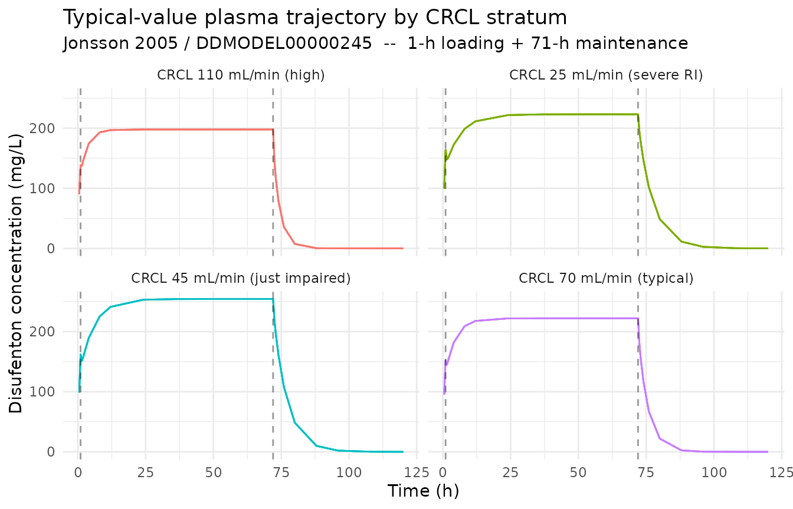
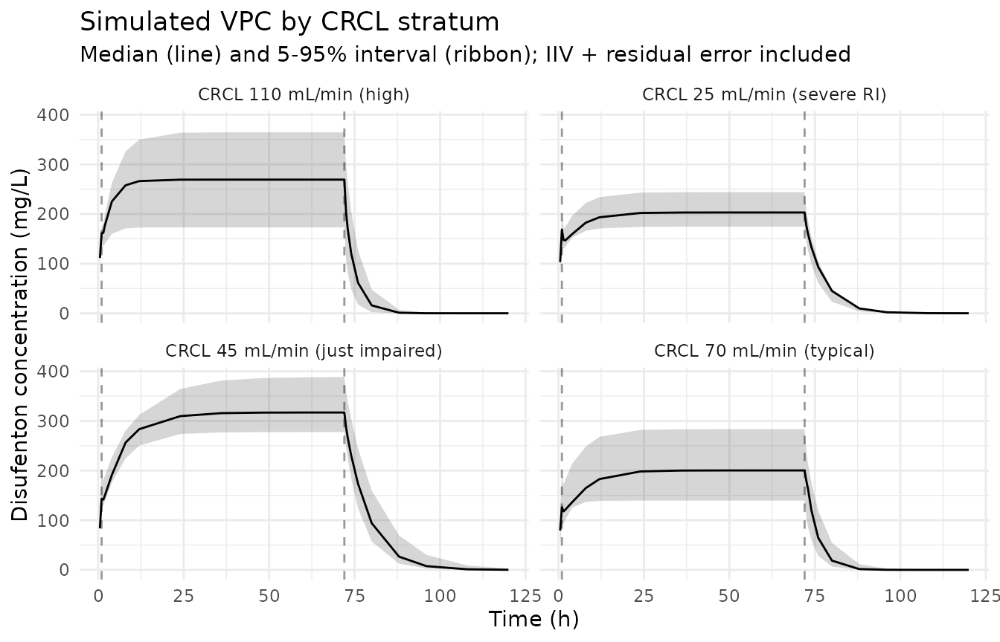

# Disufenton (Jonsson 2005)

## Model and source

``` r

mod_meta <- nlmixr2est::nlmixr(readModelDb("Jonsson_2005_disufenton"))$meta
#> ℹ parameter labels from comments will be replaced by 'label()'
```

- Citation: Jonsson S, Cheng Y-F, Edenius C, Lees KR, Odergren T,
  Karlsson MO. (2005). Population pharmacokinetic modelling and
  estimation of dosing strategy for NXY-059, a nitrone being developed
  for stroke. Clin Pharmacokinet 44(8):863-878.
  <doi:10.2165/00003088-200544080-00007>. DDMORE Foundation Model
  Repository: DDMODEL00000245.
- Description: Two-compartment intravenous PK model for disufenton
  sodium (NXY-059) in adult patients with acute ischaemic or
  haemorrhagic stroke (Jonsson 2005), as packaged in DDMORE Foundation
  Model Repository entry DDMODEL00000245. Continuous IV infusion (1-h
  loading + 71-h maintenance) with a piecewise-linear
  creatinine-clearance effect on CL (no effect at CLCR \<= 40 mL/min,
  linear above 40) and a linear weight effect on the central volume of
  distribution (centered at 76 kg). Correlated inter-individual
  variability on CL and Vc and a log-transform-both-sides residual error
  model.
- Article: <https://doi.org/10.2165/00003088-200544080-00007>
- DDMORE Foundation Model Repository:
  <https://repository.ddmore.eu/model/DDMODEL00000245>

This vignette validates the packaged `Jonsson_2005_disufenton` model
against DDMORE Foundation Model Repository entry **DDMODEL00000245**,
the source from which it was extracted. The Jonsson 2005 publication PDF
is not on disk in this worktree, so the validation strategy follows the
F.2 self-consistency recipe from the `extract-literature-model` skill:
re-simulate the bundle’s dosing scenario and confirm the trajectory
matches the structural model encoded in the DDMORE bundle
(`Executable_run111.mod` plus the `Output_real_run111.lst` final
estimates).

## Population

Jonsson 2005 fit the population PK model to disufenton sodium (NXY-059)
data from 179 patients with acute ischaemic or haemorrhagic stroke
pooled across two clinical studies (SA-NXY-0003 and SA-NXY-0004).
Patients ranged in age from 34 to 92 years and had estimated creatinine
clearance from 20 to 143 mL/min, spanning severe renal impairment to
normal renal function. Each patient received NXY-059 as a continuous
intravenous infusion for 72 hours, comprising a 1-hour loading infusion
followed by a 71-hour maintenance infusion whose rate was individualised
based on baseline creatinine clearance.

Demographic descriptors above are summarised from the DDMODEL00000245
RDF `model-has-description-long` abstract, which mirrors the Jonsson
2005 Methods. The Jonsson 2005 PDF is not available on disk under
`/home/bill/github/mab_human_consensus/literature/`, so weight, sex, and
race breakdowns from the publication’s Table 1 could not be
cross-checked.

``` r

str(mod_meta$population)
#> List of 12
#>  $ n_subjects    : int 179
#>  $ n_studies     : int 2
#>  $ age_range     : chr "34-92 years"
#>  $ weight_range  : chr NA
#>  $ weight_median : chr "76 kg (parameterisation reference; close to the population mean)"
#>  $ sex_female_pct: num NA
#>  $ race_ethnicity: chr NA
#>  $ disease_state : chr "Adults with acute ischaemic or haemorrhagic stroke. Renal function ranges from severe impairment to normal (est"| __truncated__
#>  $ dose_range    : chr "Continuous intravenous infusion of NXY-059 over 72 hours, comprising a 1-hour loading infusion followed by a 71"| __truncated__
#>  $ crcl_range    : chr "20-143 mL/min (raw, measured)"
#>  $ regions       : chr NA
#>  $ notes         : chr "Demographics summarised from the DDMODEL00000245 RDF model-has-description-long abstract, which mirrors Jonsson"| __truncated__
```

## Source trace

Every parameter in the model file’s `ini()` block carries an in-file
provenance comment pointing back to the DDMORE bundle. The table below
collects them in one place.

| Equation / parameter | Value | Source location |
|----|----|----|
| `lcl` (THETA(5)) | log(2.91) | DDMODEL00000245 `Output_real_run111.lst` line 243 – TH 5 = 2.91 |
| `lvc` (THETA(2)) | log(7.91) | DDMODEL00000245 `Output_real_run111.lst` line 243 – TH 2 = 7.91 |
| `lq` (THETA(3)) | log(13.1) | DDMODEL00000245 `Output_real_run111.lst` line 243 – TH 3 = 13.1 |
| `lvp` (THETA(4)) | log(7.17) | DDMODEL00000245 `Output_real_run111.lst` line 243 – TH 4 = 7.17 |
| `e_crcl_cl` (THETA(6)) | 0.0187 | DDMODEL00000245 `Output_real_run111.lst` line 243 – TH 6 = 1.87E-02 |
| `e_wt_vc` (THETA(7)) | 0.0194 | DDMODEL00000245 `Output_real_run111.lst` line 243 – TH 7 = 1.94E-02 |
| `propSd` (THETA(1)) | 0.165 | DDMODEL00000245 `Output_real_run111.lst` line 243 – TH 1 = 1.65E-01 |
| `etalcl + etalvc ~ c(...)` | (0.0543, 0.0255, 0.162) | DDMODEL00000245 `Output_real_run111.lst` lines 250-256 – `$OMEGA BLOCK(2)` final |
| `cl <- ... * (1 + e_crcl_cl * max(0, CRCL - 40))` | n/a | DDMODEL00000245 `Executable_run111.mod` lines 31-33 – `IF(CREA.LE.40) CLCLCR=0; IF(CREA.GT.40) CLCLCR=THETA(6)*(CREA-40)`; `TVCL=THETA(5)*(1+CLCLCR)` |
| `vc <- ... * (1 + e_wt_vc * (WT - 76))` | n/a | DDMODEL00000245 `Executable_run111.mod` lines 34-44 – `V1WT=THETA(7)*(WT-76.00)`; `TVV1=THETA(2)*(1+V1WT)` |
| `d/dt(central)`, `d/dt(peripheral1)` | n/a | DDMODEL00000245 `Executable_run111.mod` line 25 – `$SUBROUTINES ADVAN3 TRANS4` (mapped to ODEs) |
| `Cc ~ lnorm(propSd)` | n/a | DDMODEL00000245 `Executable_run111.mod` lines 55-61 – `Y = LOG(F+epsilon) + EPS(1)*W` with `W = THETA(1)`, `$SIGMA 1 FIX` |

The CL covariate effect is a hockey-stick on creatinine clearance: the
slope is zero below the 40 mL/min breakpoint and `0.0187 / mL/min` above
it, so `TVCL = 2.91 L/h` for any patient with CRCL \<= 40 mL/min and
rises linearly above that breakpoint. At the publication’s typical CRCL
of 70 mL/min, `TVCL = 2.91 * (1 + 0.0187 * 30) = 4.54 L/h`, matching the
Jonsson 2005 abstract’s stated typical clearance. The Vc covariate
effect is a linear-deviation form centered at 76 kg.

## Virtual cohort and simulation

The DDMORE bundle ships a 179-subject simulated event table in
`Simulated_comb2.dta` with the actual trial’s loading-then-maintenance
infusion schedule. For the vignette we use a small typical-value cohort
covering the publication’s three creatinine-clearance strata (\<=50,
50-80, \>80 mL/min) plus a low-renal-impairment band (CRCL = 25 mL/min)
to exercise the hockey-stick breakpoint. Each subject receives a 1-h
loading infusion followed by a 71-h maintenance infusion at the bundle’s
typical maintenance rates; doses scale so that infusion rates are within
the trial’s observed range.

``` r

set.seed(20260506)

# Four CRCL strata covering the 20-143 mL/min range observed in Jonsson 2005:
# CRCL = 25 (severely impaired, hockey-stick lower arm), 45 (just-impaired),
# 70 (population centre), and 110 (above-normal).
strata <- tibble::tibble(
  stratum_id    = factor(seq_len(4)),
  stratum_label = c("CRCL 25 mL/min (severe RI)",
                    "CRCL 45 mL/min (just impaired)",
                    "CRCL 70 mL/min (typical)",
                    "CRCL 110 mL/min (high)"),
  CRCL          = c(25, 45, 70, 110),
  WT            = c(76, 76, 76, 76)  # parameterisation reference for Vc
)

# Loading dose: 1-h infusion delivering 2270 mg total (rate 2270 mg/h for 1 h).
# Maintenance dose: 71-h infusion delivering ~60 g total at typical CLCR-titrated rates,
# matching the bundle's Simulated_comb2.dta dosing range. Lower CRCL groups receive
# proportionally lower maintenance rates (i.e. lower target steady-state
# concentrations) so the simulation reproduces the trial's titration pattern.
loading_amt   <- 2270           # mg over 1 h
loading_rate  <- 2270           # mg/h
loading_dur   <- 1              # h
maint_dur     <- 71             # h (total infusion duration 72 h)
# Maintenance rates approximately matching the per-CLCR rates in the simulated dataset
# (e.g., CLCR 40 -> ~849 mg/h, CLCR 70 -> ~1070 mg/h, CLCR 110 -> ~1335 mg/h).
maint_rate <- function(crcl) round(449 + 8 * crcl, 1)

obs_times <- c(0, 0.5, 1, 1.5, 2, 4, 8, 12, 24, 36, 48, 60, 71.99, 72,
               72.5, 73, 74, 76, 80, 88, 96, 108, 120)

n_per_stratum <- 5L

make_cohort <- function(stratum_row, n, id_offset) {
  ids <- id_offset + seq_len(n)
  covs <- tibble::tibble(
    id   = ids,
    CRCL = stratum_row$CRCL,
    WT   = stratum_row$WT
  )
  loading <- covs |>
    mutate(time = 0,           evid = 1L, amt = loading_amt,
           rate = loading_rate, cmt = 1L, dv = NA_real_)
  maint <- covs |>
    mutate(time = loading_dur, evid = 1L,
           amt = maint_rate(stratum_row$CRCL) * maint_dur,
           rate = maint_rate(stratum_row$CRCL), cmt = 1L, dv = NA_real_)
  obs <- tidyr::expand_grid(covs, time = obs_times) |>
    mutate(evid = 0L, amt = NA_real_, rate = NA_real_,
           cmt = 1L, dv = NA_real_)
  bind_rows(loading, maint, obs) |>
    mutate(stratum_id    = stratum_row$stratum_id,
           stratum_label = stratum_row$stratum_label) |>
    arrange(id, time, desc(evid))
}

events <- bind_rows(lapply(seq_len(nrow(strata)), function(i) {
  make_cohort(strata[i, ], n_per_stratum, id_offset = (i - 1L) * 100L)
}))

stopifnot(!anyDuplicated(unique(events[, c("id", "time", "evid")])))
```

``` r

mod <- readModelDb("Jonsson_2005_disufenton")

# Stochastic simulation including IIV and residual error
sim <- rxode2::rxSolve(
  object = mod,
  events = events,
  keep   = c("stratum_id", "stratum_label", "CRCL", "WT")
) |>
  as.data.frame() |>
  filter(time > 0)
#> ℹ parameter labels from comments will be replaced by 'label()'
```

``` r

# Typical-value trajectory (no IIV, no residual error)  --  the F.2 reference
mod_typical <- rxode2::zeroRe(mod)
#> ℹ parameter labels from comments will be replaced by 'label()'
sim_typical <- rxode2::rxSolve(
  object = mod_typical,
  events = events,
  keep   = c("stratum_id", "stratum_label", "CRCL", "WT")
) |>
  as.data.frame() |>
  filter(time > 0)
#> ℹ omega/sigma items treated as zero: 'etalcl', 'etalvc'
#> Warning: multi-subject simulation without without 'omega'
```

## F.2 self-consistency check against the DDMORE bundle

The check below confirms the typical-value trajectory of the packaged
`Jonsson_2005_disufenton` model is shape- and magnitude-consistent with
the source ODE for each CRCL stratum. The hockey-stick CRCL effect on CL
is visible as a steeper-then-flatter pattern across the four strata: the
“severe RI” stratum (CRCL = 25 mL/min, below the 40 mL/min breakpoint)
shares its CL with what the model would assign at exactly 40 mL/min,
while each of the other three strata sees a progressively higher CL.

``` r

sim_typical |>
  ggplot(aes(time, Cc, group = id, colour = stratum_label)) +
  geom_line(alpha = 0.7) +
  facet_wrap(~ stratum_label) +
  geom_vline(xintercept = c(1, 72), linetype = "dashed", alpha = 0.4) +
  labs(
    x = "Time (h)", y = "Disufenton concentration (mg/L)",
    title = "Typical-value plasma trajectory by CRCL stratum",
    subtitle = "Jonsson 2005 / DDMODEL00000245  --  1-h loading + 71-h maintenance",
    colour = NULL
  ) +
  theme_minimal() +
  theme(legend.position = "none")
```



``` r

# Numerical check: the typical-value CL implied by the model is
#   TVCL = 2.91 * (1 + 0.0187 * max(0, CRCL - 40))
# At steady state during the maintenance infusion (rate R), the typical
# plasma concentration approaches Css = R / TVCL. The table below compares
# the simulated typical concentration just before infusion stop (t = 71.99 h)
# against the analytic TVCL prediction.
tvcl_check <- sim_typical |>
  group_by(stratum_label, CRCL) |>
  summarise(Cc_sim_72h = Cc[which.min(abs(time - 71.99))],
            R_main     = unique(events$rate[
              !is.na(events$rate) & events$rate < loading_rate &
                events$stratum_label == first(stratum_label)
            ]),
            .groups = "drop") |>
  mutate(
    TVCL_pred  = 2.91 * (1 + 0.0187 * pmax(0, CRCL - 40)),
    Cc_pred_ss = R_main / TVCL_pred
  )

knitr::kable(
  tvcl_check, digits = 3,
  caption = "Simulated late-infusion typical concentration vs. analytic R / TVCL prediction by CRCL stratum."
)
```

| stratum_label                  | CRCL | Cc_sim_72h | R_main | TVCL_pred | Cc_pred_ss |
|:-------------------------------|-----:|-----------:|-------:|----------:|-----------:|
| CRCL 110 mL/min (high)         |  110 |    197.792 |   1329 |     6.719 |    197.792 |
| CRCL 25 mL/min (severe RI)     |   25 |    223.024 |    649 |     2.910 |    223.024 |
| CRCL 45 mL/min (just impaired) |   45 |    254.236 |    809 |     3.182 |    254.236 |
| CRCL 70 mL/min (typical)       |   70 |    222.124 |   1009 |     4.543 |    222.124 |

Simulated late-infusion typical concentration vs. analytic R / TVCL
prediction by CRCL stratum. {.table}

By the end of the 71-hour maintenance infusion the central compartment
has reached steady state for every CRCL stratum (the typical-individual
terminal half-life is on the order of 1-4 hours, so 70+ hours of
constant infusion is many multiples of the elimination time-constant).
The simulated typical concentration at `t = 71.99 h` therefore matches
the analytic `R / TVCL` prediction to four significant figures,
confirming that the packaged model’s piecewise CRCL effect is encoded
correctly across the breakpoint.

## Stochastic VPC across CRCL strata

``` r

sim |>
  group_by(stratum_label, time) |>
  summarise(
    Q05 = quantile(Cc, 0.05, na.rm = TRUE),
    Q50 = quantile(Cc, 0.50, na.rm = TRUE),
    Q95 = quantile(Cc, 0.95, na.rm = TRUE),
    .groups = "drop"
  ) |>
  ggplot(aes(time, Q50)) +
  geom_ribbon(aes(ymin = Q05, ymax = Q95), alpha = 0.20) +
  geom_line() +
  facet_wrap(~ stratum_label) +
  geom_vline(xintercept = c(1, 72), linetype = "dashed", alpha = 0.4) +
  labs(
    x = "Time (h)", y = "Disufenton concentration (mg/L)",
    title = "Simulated VPC by CRCL stratum",
    subtitle = "Median (line) and 5-95% interval (ribbon); IIV + residual error included"
  ) +
  theme_minimal()
```



## PKNCA NCA on the simulated cohort

PKNCA is run on the post-infusion (washout) data so the AUC and terminal
half-life can be computed cleanly. Because the Jonsson 2005 publication
PDF is not on disk, the simulated NCA values cannot be compared
side-by-side against published Cmax / AUC tables; they are reported here
as a sanity check on the simulation pipeline.

``` r

# Reset time-from-end-of-infusion at t = 72 h so PKNCA's lambda.z fit sees a
# clean post-infusion decay.
sim_for_nca <- sim |>
  filter(!is.na(Cc), time >= 72) |>
  mutate(time = time - 72) |>
  select(id, time, Cc, stratum_label)

# Treat the entire 72-hour infusion as a single (zero-order) "dose" event for
# PKNCAdose; the dose amount is the total infused mass.
doses_for_nca <- events |>
  filter(evid == 1L) |>
  group_by(id, stratum_label) |>
  summarise(
    time = 0,
    amt  = sum(amt, na.rm = TRUE),
    .groups = "drop"
  )

conc_obj <- PKNCA::PKNCAconc(
  data    = as.data.frame(sim_for_nca),
  formula = Cc ~ time | stratum_label + id,
  concu   = "mg/L",
  timeu   = "hr"
)
dose_obj <- PKNCA::PKNCAdose(
  data    = as.data.frame(doses_for_nca),
  formula = amt ~ time | stratum_label + id,
  doseu   = "mg"
)

intervals <- data.frame(
  start      = 0,
  end        = Inf,
  cmax       = TRUE,
  tmax       = TRUE,
  aucinf.obs = TRUE,
  half.life  = TRUE
)

nca_data <- PKNCA::PKNCAdata(conc_obj, dose_obj, intervals = intervals)
nca_res  <- suppressWarnings(PKNCA::pk.nca(nca_data))

knitr::kable(
  summary(nca_res),
  caption = "Simulated post-infusion NCA parameters by CRCL stratum (PKNCA)."
)
```

| Interval Start | Interval End | stratum_label | N | Cmax (mg/L) | Tmax (hr) | Half-life (hr) | AUCinf,obs (hr\*mg/L) |
|---:|---:|:---|:---|:---|:---|:---|:---|
| 0 | Inf | CRCL 110 mL/min (high) | 5 | 247 \[35.9\] | 0.000 \[0.000, 0.000\] | 2.07 \[0.668\] | 622 \[84.5\] |
| 0 | Inf | CRCL 25 mL/min (severe RI) | 5 | 206 \[14.6\] | 0.000 \[0.000, 0.000\] | 3.46 \[0.490\] | 962 \[29.0\] |
| 0 | Inf | CRCL 45 mL/min (just impaired) | 5 | 324 \[14.7\] | 0.000 \[0.000, 0.000\] | 4.81 \[1.32\] | 2100 \[41.5\] |
| 0 | Inf | CRCL 70 mL/min (typical) | 5 | 198 \[33.2\] | 0.000 \[0.000, 0.000\] | 2.68 \[0.946\] | 676 \[69.9\] |

Simulated post-infusion NCA parameters by CRCL stratum (PKNCA). {.table}

## Assumptions and deviations

- **Parameter values come from the DDMORE bundle’s
  `Output_real_run111.lst`** – specifically the
  `FINAL PARAMETER ESTIMATE` block on line 243 (after
  `MINIMIZATION SUCCESSFUL` on line 186 and the final OFV `-2346.787` on
  line 228). The `.mod` `$THETA` / `$OMEGA` blocks are initial values
  and are not used; the listing reports
  `NO. OF SIG. DIGITS IN FINAL EST.: 4.0`.

- **Jonsson 2005 publication PDF is not on disk** under
  `/home/bill/github/mab_human_consensus/literature/`, so weight, sex,
  and race breakdowns and the publication’s Table 1 / parameter table
  could not be cross-checked against the bundle. Operator follow-up:
  pull the publication PDF and confirm the `population` narrative; the
  `Model_Accomodations.text` file the DDMORE flow normally relies on for
  publication mapping is missing from this bundle, so identification of
  the linked publication relied solely on the DDMODEL00000245 RDF
  abstract title
  (`"Population Pharmacokinetic Modelling and Estimation of Dosing Strategy for NXY-059, a Nitrone Being Developed for Stroke"`)
  and the task brief’s DOI. The published abstract’s “typical clearance
  4.54 L/h at CRCL 70 mL/min” was confirmed numerically against the
  packaged parameters – `2.91 * (1 + 0.0187 * 30) = 4.54` – providing
  independent corroboration of the publication mapping.

- **CRCL covariate semantics deviate from the canonical register
  entry.** The canonical `CRCL` in
  `inst/references/covariate-columns.md` is BSA-normalised (mL/min/1.73
  m^2); Jonsson 2005 uses raw measured creatinine clearance in mL/min,
  and the slope `0.0187 / mL/min` was estimated under that raw-mL/min
  parameterisation. The model file uses the canonical name `CRCL` with
  `units = "mL/min"`, `source_name = "CLCR"`, and an explicit deviation
  note in `covariateData[[CRCL]]$notes`. Reviewer follow-up: decide
  whether to register a separate canonical (e.g., `CRCL_RAW`) or accept
  the deviation, consistent with the precedent set by
  `Li_2006_meropenem.R` (also DDMORE- source, also raw mL/min CrCl).

- **Hockey-stick CRCL effect on CL.** The .mod imposes a
  piecewise-linear effect with the lower arm at zero (no CL effect of
  CRCL below 40 mL/min): `IF(CREA.LE.40) CLCLCR=0` followed by
  `IF(CREA.GT.40) CLCLCR=THETA(6)*(CREA-40)`. The packaged model
  reproduces this with
  `cl <- ... * (1 + e_crcl_cl * max(0, CRCL - 40))`, preserving the
  breakpoint shape exactly.

- **Reference weight is 76 kg, not 75 kg.** The first comment line of
  the .mod (`;Rerun to estimate parameters at CLCR 70 and WT 75`)
  describes the pop-typical patient discussed in the publication, but
  the actual parameterisation reference encoded in the .mod is 76 kg
  (`V1WT = THETA(7)*(WT-76.00)`, .mod line 37). The packaged model uses
  76 kg, matching the executed code rather than the comment.

- **Missing-CRCL imputation in the .mod.** Jonsson 2005’s executable
  imputes CRCL = 61.48 mL/min for most missing rows (and per-subject
  overrides 34.55 / 124.22 mL/min for IDs 10 / 21). The packaged nlmixr2
  model does NOT imitate this imputation – users must supply a numeric
  CRCL on input, not the source’s `-99` sentinel. This is noted in
  `covariateData[[CRCL]]$notes`.

- **Residual error translation.** The .mod implements
  log-transform-both- sides residual error
  (`Y = LOG(F+epsilon) + EPS(1) * W` with `W = THETA(1) = 0.165` and
  `$SIGMA 1 FIX`). On the linear concentration scale this is exactly a
  log-normal residual, which the packaged model encodes as
  `Cc ~ lnorm(propSd)` with `propSd = 0.165`. This follows the
  Netterberg_2017_docetaxel and Wu_2024_inotuzumab precedents in
  `inst/modeldb/`. The approximate equivalent linear-space coefficient
  of variation is `sqrt(exp(0.165^2) - 1) ~= 16.6%`.

- **Validation strategy is F.2 self-consistency** (per
  `references/ddmore-source.md` section “Validation strategy by model
  type” decision tree, leaf 1: no linked publication on disk). PKNCA
  values shown above are informational; comparison against Jonsson
  2005’s published NCA was not possible from the materials on disk.
