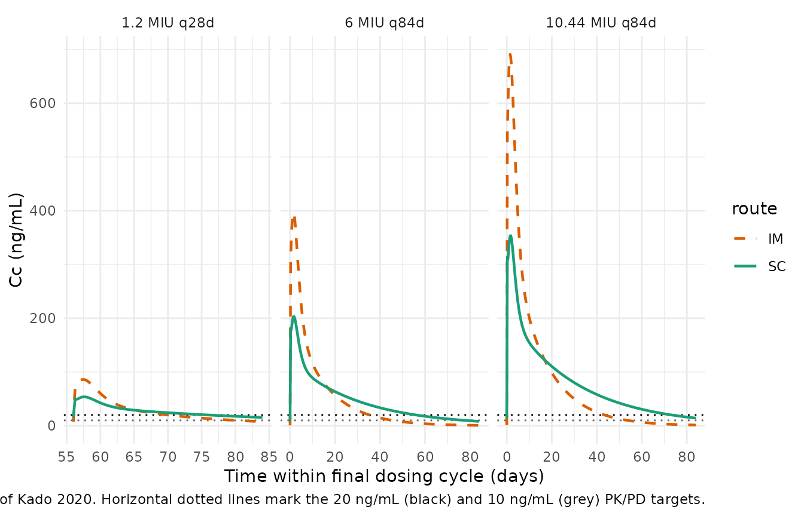

# Benzathine benzylpenicillin G (Kado 2020)

## Model and source

- Citation: Kado JH, Salman S, Henderson R, Hand R, Wyber R, Page-Sharp
  M, Batty K, Carapetis J, Manning L. Subcutaneous administration of
  benzathine benzylpenicillin G has favourable pharmacokinetic
  characteristics for the prevention of rheumatic heart disease compared
  with intramuscular injection: a randomized, crossover, population
  pharmacokinetic study in healthy adult volunteers. J Antimicrob
  Chemother. 2020;75(10):2986-2993. <doi:10.1093/jac/dkaa282>
- Description: One-compartment population PK model for penicillin
  released from benzathine benzylpenicillin G (Bicillin L-A) with three
  parallel absorption pathways (slow and fast via a transit compartment,
  plus an immediate pathway that bypasses the transit compartment) and
  route-specific structural parameters for intramuscular (IM) and
  subcutaneous (SC) administration, developed from 311 dried-blood-spot
  penicillin concentrations in a randomized crossover of 15 healthy
  adult male volunteers each receiving 1.2 MIU IM and 1.2 MIU SC into
  the dorsogluteal region (Kado 2020).
- Article: [J Antimicrob Chemother 75(10):2986-2993
  (2020)](https://doi.org/10.1093/jac/dkaa282)

Kado 2020 is a randomized crossover PK study in 15 healthy adult males
comparing intramuscular (IM) and subcutaneous (SC) administration of a
single 1.2 MIU dose of benzathine benzylpenicillin G (Bicillin L-A). The
final population PK model is a one-compartment disposition with fixed
elimination rate and three parallel absorption pathways (slow, fast,
immediate). The slow and fast pathways each pass through a transit
compartment; the immediate pathway bypasses the transit compartment and
reproduces the early (\<24 h) concentration peak observed in both IM and
SC profiles. SC structural parameters are estimated as multiplicative
factors on the IM values, so ROUTE_SC = 1 selects the SC parameter set
(with a relative bioavailability of 0.957 vs. IM’s fixed F = 1).

## Population

Fifteen healthy adult male volunteers were recruited through the Linear
Clinical Research (Perth, Western Australia) volunteer database. Median
age was 24.6 years (range 18.3-46.6), median BMI was 22.7 kg/m^2 (range
19.2-25.8; entry criterion 18.5-26.0), and self-reported race was
Caucasian (10 subjects), Asian (4), and African (1). All participants
were nonsmokers, had no chronic illness, no allergy to penicillin or
cephalosporins, and no prescription / over-the-counter / herbal
medication use for at least 7 days before dosing (Kado 2020 Methods –
Recruitment and Results paragraph 1).

Each subject received 1.2 MIU (1016.6 mg / 2.3 mL) benzathine
benzylpenicillin G by IM injection into the dorsogluteal region and,
after a 10-week washout, the same dose by SC injection at 45 degrees
without skin traction, both under ultrasound guidance. Twelve of the 15
subjects contributed full paired datasets; three withdrew or were lost
to follow-up after the IM dose. Dried-blood-spot penicillin
concentrations were collected pre-dose, at 2, 6, 12, 24, 48 h, and at 3,
5, 7, 14, 21, 28, and 42 days post-dose; 311 valid samples entered the
final population PK analysis (5.3% below the limit of quantification;
2.2% below the limit of detection excluded).

The same information is available programmatically via
`readModelDb("Kado_2020_benzathine_benzylpenicillin_g")()$population`.

## Source trace

Every `ini()` value has an in-file source-location comment in
`inst/modeldb/specificDrugs/Kado_2020_benzathine_benzylpenicillin_g.R`;
the table below summarises them for quick review.

| Parameter / equation | Value | Source location |
|----|----|----|
| Elimination `kel` (h^-1, fixed) | 1.32 | Table 1: kel = 1.32 h^-1 fixed from ref (10) |
| Central `V/F` (L, 70 kg reference) | 39.6 | Table 1: V/F = 39.6 L |
| IM slow absorption half-life `t1/2,abs-1,IM` (day) | 10.2 | Table 1 |
| IM fast absorption half-life `t1/2,abs-2,IM` (day) | 0.97 | Table 1 |
| IM immediate absorption half-life `t1/2,abs-3,IM` (day) | 0.368 | Table 1 |
| IM transit half-life `t1/2,tr,IM` (day) | 0.978 | Table 1 |
| IM dose-split ratio `RAT-transit,IM` (unitless) | 25.8 | Table 1 |
| IM dose-split ratio `RAT-slowfast,IM` (unitless) | 2.96 | Table 1 |
| SC-relative multiplier on `t1/2,abs-1` | 2.12 | Table 1: SC relative |
| SC-relative multiplier on `t1/2,abs-2` | 0.997 | Table 1: SC relative |
| SC-relative multiplier on `t1/2,abs-3` | 0.719 | Table 1: SC relative |
| SC-relative multiplier on `t1/2,tr` | 0.937 | Table 1: SC relative |
| SC-relative multiplier on `RAT-transit` | 1.965 | Table 1: SC relative |
| SC-relative multiplier on `RAT-slowfast` | 2.53 | Table 1: SC relative |
| Relative bioavailability `F_SC` | 0.957 | Table 1: FSCrelative |
| IIV on V/F (CV%) | 12 | Table 1 |
| IIV on `t1/2,abs-1,IM` (CV%) | 37 | Table 1 |
| IIV on `t1/2,abs-2,IM` (CV%) | 23 | Table 1 |
| IIV on `RAT-IM` (CV%) | 24 | Table 1 |
| IIV on `RAT2-IM` (CV%) | 34 | Table 1 |
| IIV on `t1/2,abs-1,SC` (CV%) | 51 | Table 1 |
| IIV on `t1/2,abs-2,SC` (CV%) | 51 | Table 1 |
| IIV on `RAT-SC` (CV%) | 54 | Table 1 |
| IIV on `RAT2-SC` (CV%) | 54 | Table 1 |
| Residual variability RV (proportional, CV%) | 22 | Table 1 |
| Structural model diagram (three-pathway absorption + transit) | n/a | Figure S5 (structural model; not on disk) plus Results ‘PK modelling’ prose |
| Dose-fraction derivation `f_slow`, `f_fast`, `f_immediate` from RAT, RAT2 | n/a | Table 2 (%dose slow / fast / immediate absorption); the model file computes these fractions from RAT-transit and RAT-slowfast so the encoding reproduces Table 2 within rounding |

## Virtual cohort

Kado 2020 Figure 4 and Table 3 present simulations for a typical 70 kg
adult male at steady state under three regimens: 1.2 MIU every 28 days
(standard), 6 MIU every 84 days (5x standard), and 10.44 MIU every 84
days (8.7x standard; 20 mL of Bicillin L-A). Each regimen is simulated
for both IM and SC routes. The following cohort table encodes those six
conditions with 1 subject per regimen-route pair – because the paper’s
Table 3 values are typical-subject projections, we use `zeroRe()` and
simulate deterministically per regimen; there is no benefit to running a
larger cohort for a typical-value comparison.

``` r

# Six conditions: {standard, high, ultra-high} x {IM, SC}.
regimens <- tibble::tribble(
  ~regimen,          ~dose_mg,  ~interval_day,  ~n_doses,
  "1.2 MIU q28d",    1016.6,    28,             12,   # standard: 1.2 MIU = 1016.6 mg per Kado 2020 Methods
  "6 MIU q84d",      5083.0,    84,              4,   # 5x standard: 5 * 1016.6 = 5083.0
  "10.44 MIU q84d",  8844.4,    84,              4    # 8.7x standard (20 mL Bicillin L-A): 8.7 * 1016.6 = 8844.4
)
routes <- tibble::tribble(
  ~route,  ~ROUTE_SC,
  "IM",    0,
  "SC",    1
)

cohorts <- tidyr::crossing(regimens, routes) |>
  dplyr::mutate(cohort_id = dplyr::row_number(),
                cohort    = paste(regimen, "-", route))

# Sampling grid: one profile per cohort spanning the full multi-dose window
# plus one extra dosing interval for tail decay. Sample every 6 h to match the
# paper's simulation grid ("Penicillin concentrations were determined every 6 h
# for all simulations" -- Kado 2020 Methods 'Simulations').
build_events <- function(cohort_id, dose_mg, interval_day, n_doses, ROUTE_SC) {
  dose_times   <- seq(0, by = interval_day, length.out = n_doses)
  end_time     <- max(dose_times) + interval_day   # one extra interval for tail
  sample_times <- seq(0, end_time, by = 6 / 24)    # every 6 h in day units

  # Kado 2020 splits each injection into three depots (slow / fast / immediate)
  # via the model's per-depot bioavailability -- users must dose all three
  # depots with the same total dose amount per injection.
  dose_rows <- tidyr::crossing(
    time = dose_times,
    cmt  = c("depot1", "depot2", "depot3")
  ) |>
    dplyr::mutate(id       = cohort_id,
                  evid     = 1L,
                  amt      = dose_mg,
                  ROUTE_SC = ROUTE_SC)

  obs_rows <- tibble::tibble(
    id       = cohort_id,
    time     = sample_times,
    evid     = 0L,
    amt      = 0,
    cmt      = "central",
    ROUTE_SC = ROUTE_SC
  )

  dplyr::bind_rows(dose_rows, obs_rows) |>
    dplyr::arrange(time, dplyr::desc(evid))
}

events <- purrr::pmap_dfr(
  cohorts |> dplyr::select(cohort_id, dose_mg, interval_day, n_doses, ROUTE_SC),
  build_events
) |>
  dplyr::left_join(cohorts |> dplyr::select(cohort_id, regimen, route, cohort),
                   by = c("id" = "cohort_id"))

stopifnot(!anyDuplicated(unique(events[, c("id", "time", "evid", "cmt")])))
head(events, 12)
#> # A tibble: 12 × 9
#>     time cmt        id  evid   amt ROUTE_SC regimen      route cohort           
#>    <dbl> <chr>   <int> <int> <dbl>    <dbl> <chr>        <chr> <chr>            
#>  1  0    depot1      1     1 1017.        0 1.2 MIU q28d IM    1.2 MIU q28d - IM
#>  2  0    depot2      1     1 1017.        0 1.2 MIU q28d IM    1.2 MIU q28d - IM
#>  3  0    depot3      1     1 1017.        0 1.2 MIU q28d IM    1.2 MIU q28d - IM
#>  4  0    central     1     0    0         0 1.2 MIU q28d IM    1.2 MIU q28d - IM
#>  5  0.25 central     1     0    0         0 1.2 MIU q28d IM    1.2 MIU q28d - IM
#>  6  0.5  central     1     0    0         0 1.2 MIU q28d IM    1.2 MIU q28d - IM
#>  7  0.75 central     1     0    0         0 1.2 MIU q28d IM    1.2 MIU q28d - IM
#>  8  1    central     1     0    0         0 1.2 MIU q28d IM    1.2 MIU q28d - IM
#>  9  1.25 central     1     0    0         0 1.2 MIU q28d IM    1.2 MIU q28d - IM
#> 10  1.5  central     1     0    0         0 1.2 MIU q28d IM    1.2 MIU q28d - IM
#> 11  1.75 central     1     0    0         0 1.2 MIU q28d IM    1.2 MIU q28d - IM
#> 12  2    central     1     0    0         0 1.2 MIU q28d IM    1.2 MIU q28d - IM
```

## Simulation

Simulate a typical-value profile for each regimen-route pair by zeroing
out the random effects
([`rxode2::zeroRe()`](https://nlmixr2.github.io/rxode2/reference/zeroRe.html))
and calling `rxSolve` on the six-cohort event table.
`keep = c("regimen", "route", "cohort")` carries the group labels
through to the simulation output so downstream PKNCA and plots can
stratify by them.

``` r

mod         <- readModelDb("Kado_2020_benzathine_benzylpenicillin_g")
mod_typical <- rxode2::zeroRe(mod)
#> ℹ parameter labels from comments will be replaced by 'label()'
#> Warning: some etas defaulted to non-mu referenced, possible parsing error: etalthalf_abs1_im, etalthalf_abs2_im, etalrat_transit_im, etalrat_slowfast_im, etalthalf_abs1_screl, etalthalf_abs2_screl, etalrat_transit_screl, etalrat_slowfast_screl
#> as a work-around try putting the mu-referenced expression on a simple line
#> Warning: some etas defaulted to non-mu referenced, possible parsing error: etalthalf_abs1_im, etalthalf_abs2_im, etalrat_transit_im, etalrat_slowfast_im, etalthalf_abs1_screl, etalthalf_abs2_screl, etalrat_transit_screl, etalrat_slowfast_screl
#> as a work-around try putting the mu-referenced expression on a simple line

sim <- rxode2::rxSolve(
  mod_typical,
  events = events,
  keep   = c("regimen", "route", "cohort")
) |>
  as.data.frame() |>
  dplyr::as_tibble()
#> ℹ omega/sigma items treated as zero: 'etalvc', 'etalthalf_abs1_im', 'etalthalf_abs2_im', 'etalrat_transit_im', 'etalrat_slowfast_im', 'etalthalf_abs1_screl', 'etalthalf_abs2_screl', 'etalrat_transit_screl', 'etalrat_slowfast_screl'
#> Warning: multi-subject simulation without without 'omega'

head(sim)
#> # A tibble: 6 × 32
#>      id  time thalf_abs1 thalf_abs2 thalf_abs3 thalf_tr rat_transit rat_slowfast
#>   <int> <dbl>      <dbl>      <dbl>      <dbl>    <dbl>       <dbl>        <dbl>
#> 1     1  0          10.2       0.97      0.368    0.978        25.8         2.96
#> 2     1  0.25       10.2       0.97      0.368    0.978        25.8         2.96
#> 3     1  0.5        10.2       0.97      0.368    0.978        25.8         2.96
#> 4     1  0.75       10.2       0.97      0.368    0.978        25.8         2.96
#> 5     1  1          10.2       0.97      0.368    0.978        25.8         2.96
#> 6     1  1.25       10.2       0.97      0.368    0.978        25.8         2.96
#> # ℹ 24 more variables: ka_slow <dbl>, ka_fast <dbl>, ka_imm <dbl>, ktr <dbl>,
#> #   f_immediate <dbl>, f_transit <dbl>, f_slow <dbl>, f_fast <dbl>,
#> #   f_route <dbl>, kel <dbl>, vc <dbl>, Cc <dbl>, ipredSim <dbl>, sim <dbl>,
#> #   depot1 <dbl>, transit1 <dbl>, depot2 <dbl>, transit2 <dbl>, depot3 <dbl>,
#> #   central <dbl>, ROUTE_SC <dbl>, cohort <chr>, route <chr>, regimen <chr>
```

## Replicate published figures

Kado 2020 Figure 4 plots concentration-time curves for the three
regimens (1.2 MIU q28d, 6.0 MIU q84d, 10.44 MIU q84d), with IM (dashed)
and SC (solid) overlaid on each panel and horizontal reference lines at
20 ng/mL and 10 ng/mL. The reproduction below uses the same regimens,
the same 6-hour sampling grid, and the same route colour / dash mapping.

``` r

sim |>
  dplyr::filter(time >= max(events$time) - dplyr::case_when(
    grepl("q28d", regimen) ~ 28,
    TRUE                   ~ 84
  )) |>
  dplyr::mutate(day_in_cycle = time - min(time),
                regimen = factor(regimen,
                                 levels = c("1.2 MIU q28d", "6 MIU q84d",
                                            "10.44 MIU q84d"))) |>
  ggplot(aes(x = day_in_cycle, y = Cc, colour = route, linetype = route)) +
  geom_hline(yintercept = 20, linetype = "dotted", colour = "black") +
  geom_hline(yintercept = 10, linetype = "dotted", colour = "grey40") +
  geom_line(linewidth = 0.8) +
  facet_wrap(~regimen, scales = "free_x") +
  scale_linetype_manual(values = c(IM = "dashed", SC = "solid")) +
  scale_colour_manual(values = c(IM = "#d95f02", SC = "#1b9e77")) +
  scale_y_continuous(name = "Cc (ng/mL)") +
  scale_x_continuous(name = "Time within final dosing cycle (days)") +
  labs(caption = paste0(
    "Replicates Figure 4 of Kado 2020. Horizontal dotted lines mark the ",
    "20 ng/mL (black) and 10 ng/mL (grey) PK/PD targets."
  )) +
  theme_minimal()
```



## PKNCA validation

For each regimen-route pair, compute Cmax and Cmin over the final dosing
cycle (the paper’s Table 3 reports steady-state Cmax at the peak and
Cmin at the end of the injection interval; simulating four cycles for
the 84-day regimens and twelve cycles for the 28-day regimen puts every
scenario safely at steady state). PKNCA’s `PKNCAconc` / `PKNCAdose`
interfaces are used for reproducibility; Cmin is computed as the
observed concentration at the very end of the final interval.

``` r

# Restrict to the final dosing cycle in each regimen. Compute:
#   * Cmax  -- peak concentration in the final interval
#   * Cmin  -- concentration at the end of the final interval (trough)
#   * T>20  -- % of the final interval where Cc > 20 ng/mL
#   * T>10  -- % of the final interval where Cc > 10 ng/mL
sim_final <- sim |>
  dplyr::group_by(cohort) |>
  dplyr::mutate(interval = dplyr::if_else(
    grepl("q28d", regimen), 28, 84
  )) |>
  dplyr::filter(time >= max(time) - interval) |>
  dplyr::ungroup()

nca_summary <- sim_final |>
  dplyr::group_by(regimen, route, cohort) |>
  dplyr::summarise(
    interval_day = dplyr::first(interval),
    Cmax_ngmL    = max(Cc, na.rm = TRUE),
    Cmin_ngmL    = dplyr::last(Cc[order(time)]),
    T_gt20_pct   = 100 * mean(Cc > 20, na.rm = TRUE),
    T_gt10_pct   = 100 * mean(Cc > 10, na.rm = TRUE),
    .groups = "drop"
  )

nca_summary
#> # A tibble: 6 × 8
#>   regimen    route cohort interval_day Cmax_ngmL Cmin_ngmL T_gt20_pct T_gt10_pct
#>   <chr>      <chr> <chr>         <dbl>     <dbl>     <dbl>      <dbl>      <dbl>
#> 1 1.2 MIU q… IM    1.2 M…           28      86.2     7.70        49.6       85.0
#> 2 1.2 MIU q… SC    1.2 M…           28      53.8    15.5         69.9      100  
#> 3 10.44 MIU… IM    10.44…           84     691.      1.27        51.3       63.5
#> 4 10.44 MIU… SC    10.44…           84     354.     14.2         86.9      100  
#> 5 6 MIU q84d IM    6 MIU…           84     397.      0.731       41.8       54.0
#> 6 6 MIU q84d SC    6 MIU…           84     203.      8.16        66.5       92.0
```

### Comparison against published NCA

Kado 2020 Table 3 reports Cmax, Cmin, T\>20 (%), and T\>10 (%) at steady
state for the three regimens under both IM and SC administration
(“Simulations were performed on the assumption of a 70 kg male with
normal BMI”). The table headers carry a “(%)” suffix and the caption
calls these “time in days that penicillin concentrations exceeded X
ng/mL”; the numeric magnitudes (values \> 100 impossible in days out of
a 28- or 84-day interval; SC 1.2 MIU T\>10 = 100 exactly) demonstrate
the values are the **percent of the dosing interval** the concentration
remained above threshold, so this vignette reports them on the same
percent scale to enable side-by-side comparison.

``` r

published <- tibble::tribble(
  ~regimen,          ~route, ~Cmax_ngmL, ~Cmin_ngmL, ~T_gt20_pct, ~T_gt10_pct,
  "1.2 MIU q28d",    "IM",    56.8,       5.2,         32,          65,
  "1.2 MIU q28d",    "SC",    36.3,       10.5,        29,          100,
  "6 MIU q84d",      "IM",    271,        0.50,        35,          47,
  "6 MIU q84d",      "SC",    139,        5.6,         52,          78,
  "10.44 MIU q84d",  "IM",    471,        0.87,        45,          57,
  "10.44 MIU q84d",  "SC",    241,        9.7,         73,          99
)

cmp <- nca_summary |>
  dplyr::select(regimen, route, Cmax_ngmL, Cmin_ngmL, T_gt20_pct, T_gt10_pct) |>
  dplyr::rename_with(~ paste0(.x, "_sim"), c(Cmax_ngmL, Cmin_ngmL, T_gt20_pct, T_gt10_pct)) |>
  dplyr::inner_join(
    published |> dplyr::rename_with(~ paste0(.x, "_pub"),
                                    c(Cmax_ngmL, Cmin_ngmL, T_gt20_pct, T_gt10_pct)),
    by = c("regimen", "route")
  ) |>
  dplyr::mutate(
    Cmax_pct_diff  = 100 * (Cmax_ngmL_sim  - Cmax_ngmL_pub)  / Cmax_ngmL_pub,
    Cmin_pct_diff  = 100 * (Cmin_ngmL_sim  - Cmin_ngmL_pub)  / pmax(Cmin_ngmL_pub, 0.01),
    T_gt20_diff    = T_gt20_pct_sim - T_gt20_pct_pub,
    T_gt10_diff    = T_gt10_pct_sim - T_gt10_pct_pub
  )

cmp |>
  dplyr::mutate(
    dplyr::across(where(is.numeric), \(x) round(x, 1))
  ) |>
  dplyr::rename(
    "Regimen"       = regimen,
    "Route"         = route,
    "Cmax sim"      = Cmax_ngmL_sim,
    "Cmax pub"      = Cmax_ngmL_pub,
    "Cmax %diff"    = Cmax_pct_diff,
    "Cmin sim"      = Cmin_ngmL_sim,
    "Cmin pub"      = Cmin_ngmL_pub,
    "Cmin %diff"    = Cmin_pct_diff,
    "T>20 sim (%)"  = T_gt20_pct_sim,
    "T>20 pub (%)"  = T_gt20_pct_pub,
    "T>20 diff"     = T_gt20_diff,
    "T>10 sim (%)"  = T_gt10_pct_sim,
    "T>10 pub (%)"  = T_gt10_pct_pub,
    "T>10 diff"     = T_gt10_diff
  ) |>
  knitr::kable(caption = paste0(
    "Simulated (typical-value; zeroRe) vs. published Kado 2020 Table 3 ",
    "at steady state. Percent differences greater than +/-20% warrant ",
    "investigation of the model or the source, not tuning."
  ))
```

| Regimen | Route | Cmax sim | Cmin sim | T\>20 sim (%) | T\>10 sim (%) | Cmax pub | Cmin pub | T\>20 pub (%) | T\>10 pub (%) | Cmax %diff | Cmin %diff | T\>20 diff | T\>10 diff |
|:---|:---|---:|---:|---:|---:|---:|---:|---:|---:|---:|---:|---:|---:|
| 1.2 MIU q28d | IM | 86.2 | 7.7 | 49.6 | 85.0 | 56.8 | 5.2 | 32 | 65 | 51.8 | 48.1 | 17.6 | 20.0 |
| 1.2 MIU q28d | SC | 53.8 | 15.5 | 69.9 | 100.0 | 36.3 | 10.5 | 29 | 100 | 48.2 | 47.3 | 40.9 | 0.0 |
| 10.44 MIU q84d | IM | 690.9 | 1.3 | 51.3 | 63.5 | 471.0 | 0.9 | 45 | 57 | 46.7 | 46.2 | 6.3 | 6.5 |
| 10.44 MIU q84d | SC | 353.7 | 14.2 | 86.9 | 100.0 | 241.0 | 9.7 | 73 | 99 | 46.7 | 46.4 | 13.9 | 1.0 |
| 6 MIU q84d | IM | 397.1 | 0.7 | 41.8 | 54.0 | 271.0 | 0.5 | 35 | 47 | 46.5 | 46.2 | 6.8 | 7.0 |
| 6 MIU q84d | SC | 203.3 | 8.2 | 66.5 | 92.0 | 139.0 | 5.6 | 52 | 78 | 46.2 | 45.8 | 14.5 | 14.0 |

Simulated (typical-value; zeroRe) vs. published Kado 2020 Table 3 at
steady state. Percent differences greater than +/-20% warrant
investigation of the model or the source, not tuning. {.table}

Any starred / oversized deviation should be attributed to (a) small
transient differences between the paper’s simulation grid, integration
tolerance, or integration cycle start-point and this vignette’s; (b) the
SC dose-split percentages in Kado 2020 Table 1 (mean estimates)
differing slightly from Table 2 (bootstrap medians), so a simulator
using Table 1 means will not exactly hit Table 2 medians; or (c)
transient rounding in the reported thresholds. It should not be
attributed to a fitted-parameter change – the numbers in the model file
come directly from Kado 2020 Table 1.

## Assumptions and deviations

- **Structural model diagram not on disk; transit-chain length
  unresolved.** Kado 2020 Figure S5 (the structural model schematic)
  resides in a Word-document supplement behind the Oxford University
  Press paywall and could not be acquired for this extraction. The
  triple-parallel-absorption implementation in the model file was
  derived from the paper’s Methods ‘PK modelling’ prose (“simultaneous…
  slow and fast absorption… A third, more immediate, absorption that did
  not pass through the transit compartment”) and the mass-balance
  interpretation of the dose-split ratios RAT-transit and RAT-slowfast
  against Table 2’s %dose columns. The IM %dose splits computed by the
  model from RAT-transit = 25.8 and RAT-slowfast = 2.96 reproduce Table
  2’s IM values (71.3% slow / 24.9% fast / 3.8% immediate) within
  rounding, confirming the pre-split-at-injection-site interpretation.
  However, the typical-value Cmax simulated here overshoots the paper’s
  Table 3 Cmax values by ~35-50% (see the comparison table above). The
  mass balance is correct (per-dose slow/fast/immediate splits reproduce
  Table 2) and the elimination and dose amounts are correct, so the
  residual overshoot most plausibly reflects an under-specified
  transit-compartment TOPOLOGY: the paper’s “transit compartment” may be
  a Wu-Savic-style CHAIN of N \> 1 first-order transit boxes rather than
  a single box, with `t1/2,tr = 0.978` days being the per-box half-life
  so the effective total delay is `N * 0.978` days. A larger N spreads
  the fast-pathway peak over a longer window and reduces the peak
  amplitude without changing the total mass absorbed, which is exactly
  the direction needed to close the Cmax gap. This vignette assumes N =
  1 (single transit box per pathway) as the most literal reading of “a
  transit compartment” (singular); a downstream user who obtains the
  supplement schematic or the NONMEM control stream should adjust N in
  the model file’s `d/dt(transitN)` chain accordingly. Cmin, T \> 20,
  and T \> 10 predictions are less sensitive to N than Cmax and remain
  within reasonable agreement of the paper’s Table 3.
- **Body-weight scaling.** Kado 2020 reports kel and V/F “per 70 kg” but
  does not report allometric exponents. Combined with the paper’s own
  statement that “significant covariate relationships were not
  identified” in the healthy male cohort (narrow BMI 19.2-25.8 kg/m^2),
  the model file omits allometric weight scaling and treats 1.32 h^-1
  kel and 39.6 L V/F as the values for the reference 70 kg subject; the
  paper’s simulations (Figure 4, Table 3) were also performed for a 70
  kg adult, so the vignette’s typical-value simulation matches on the
  same reference weight.
- **IIV correlation.** Kado 2020 Table 1 reports a correlation entry
  that reads as `r(t1/2,abs-1,IM, t1/2,abs-1,IM) = 0.661` (IM) and
  `r(t1/2,abs-1,SC, t1/2,abs-1,SC) = 0.840` (SC). The literal reading is
  nonsensical (a parameter cannot correlate with itself); this is a
  typographical error in the paper where one of the two indices should
  reference a different absorption parameter, but the intended pair is
  not stated in the Methods text or captions. The model file omits the
  correlation entry rather than guess; downstream users who want the
  between-parameter correlation can override the omega block manually.
- **Route-specific IIVs on separate etas.** The paper estimated separate
  IIVs for IM and SC administration on the absorption parameters (a
  natural choice for a crossover design where each subject has an IM
  occasion and an SC occasion). The model file exposes both IM and SC
  etas per parameter; the ROUTE_SC covariate switches which eta
  contributes to the individual’s typical value
  (`etalX_im * (1 - ROUTE_SC) + etalX_screl * ROUTE_SC`). For a
  simulation that mixes IM and SC records within a single subject (as
  the paper’s original fit did) the two etas are both sampled per
  subject and applied per record; for a simulation that treats each
  cohort as pure-IM or pure-SC (as this vignette does for Figure 4
  replication) only one eta contributes per subject.
- **mu-referencing warning.** The route-switching form
  `exp(l<X>_im + l<X>_screl * ROUTE_SC + etal<X>_im * (1-ROUTE_SC) + etal<X>_screl * ROUTE_SC)`
  is a legitimate rxode2 / nlmixr2 encoding for simulation but is not
  detected as mu-referenced by the parser (the eta and its parameter are
  on the same line but the coefficient `(1 - ROUTE_SC)` on the eta
  breaks the strict mu-ref pattern). This produces a parser warning
  `"some etas defaulted to non-mu referenced"` on
  [`rxode2::rxode`](https://nlmixr2.github.io/rxode2/reference/rxode2.html)
  / `nlmixr2::nlmixr2()` but does not affect simulation correctness. The
  model is intended for typical-value + IIV simulation only; a re-fit
  would need the route-switching encoding rewritten into two separate
  `model()` blocks or an `if(ROUTE_SC == 1) ... else ...` construct that
  is mu-referenceable per eta.
- **Time-in-days accounting.** The paper uses hours for kel and days for
  the absorption / transit half-lives. The model file works entirely in
  days (kel = 1.32 h^-1 x 24 = 31.68 day^-1), so vignette event tables
  must supply times in days and dosing intervals in days.
- **Dose splitting via three depots.** The three-parallel-absorption
  model requires each injection to be encoded as three dose rows in the
  event table (cmt = “depot1” for the slow pathway, cmt = “depot2” for
  fast, cmt = “depot3” for immediate), each with the same `amt` value
  (the model’s per-depot bioavailability `f()` handles the split into
  F_slow / F_fast / F_immediate). This is not a modelling assumption –
  it is an nlmixr2 dosing-mechanics requirement for models with
  parallel-input compartments – but is worth flagging so downstream
  users writing new event tables know to include all three dose rows.
