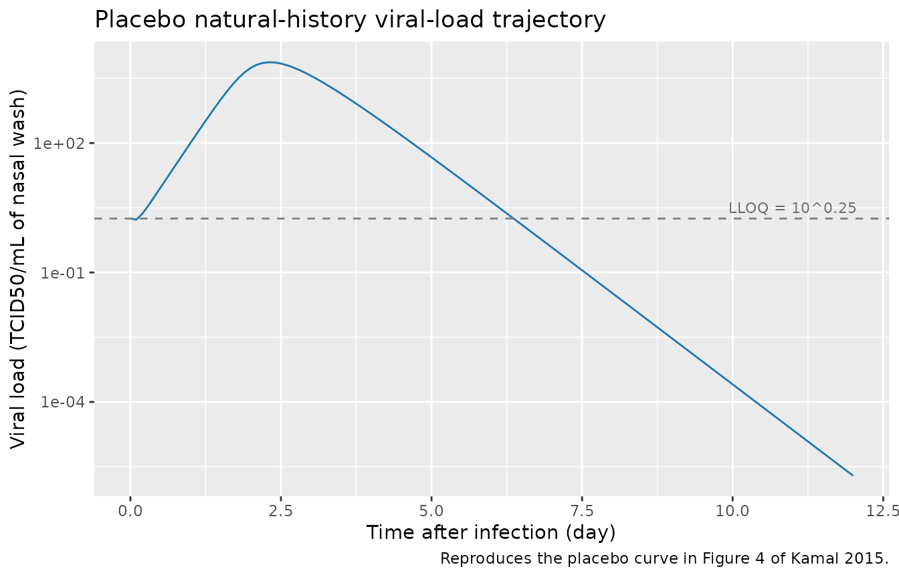
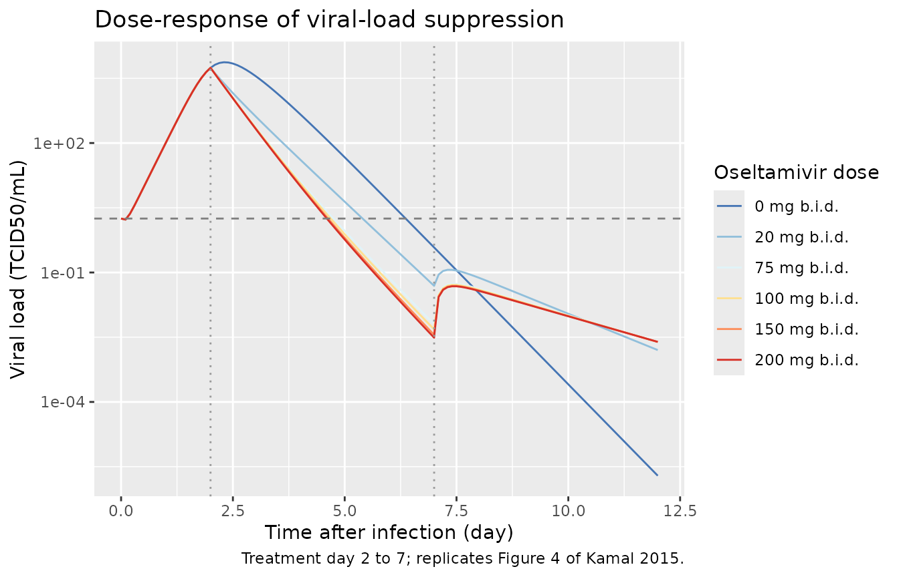
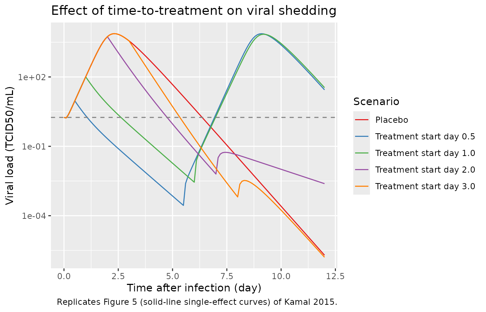
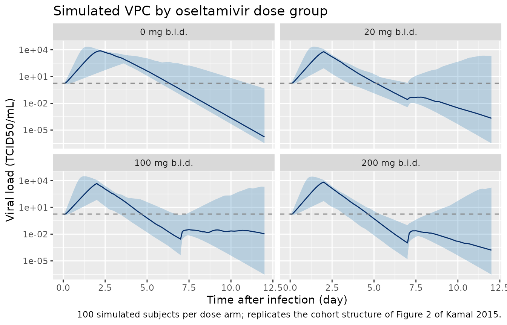

# Oseltamivir (Kamal 2015)

## Model and source

- Citation: Kamal MA, Gieschke R, Lemenuel-Diot A, Beauchemin CAA, Smith
  PF, Rayner CR. (2015). A drug-disease model describing the effect of
  oseltamivir neuraminidase inhibition on influenza virus progression.
  Antimicrob Agents Chemother 59(9):5388-5395.
  <doi:10.1128/AAC.00069-15>. PMID 26100711; PMCID PMC4538529.
- Description: Mechanistic drug-disease (viral-dynamics) model of
  influenza-virus progression and oseltamivir antiviral effect in adults
  with experimental and naturally-acquired influenza A (H1N1) virus
  infection (Kamal 2015). Builds on the Baccam et al. (2006)
  target-cell-limited viral-dynamics framework: uninfected target
  respiratory epithelial cells (target_cells) are infected by free virus
  (virus) at second-order rate beta_inf; infected cells (infected_cells)
  produce virus at rate p_prod per cell per day and die at rate
  delta_clr; free virus is cleared at rate c_clr. Oseltamivir inhibits
  viral production through an inhibitory Hill function acting on
  log10(p) (Equation 4 of Kamal 2015), parameterised so Emax is the
  maximum log10-fold reduction of p and ED50 is the dose producing a
  2-fold (50%) reduction of p on the linear scale. Dose enters via the
  per-record DOSE covariate (mg per administered oseltamivir dose; 0
  during placebo or outside the treatment window); no oseltamivir
  pharmacokinetics are modelled. Initial conditions are fixed per Baccam
  et al. (2006): target_cells(0) = 4e8 epithelial cells (from a 160 cm^2
  upper-respiratory-tract surface area and 2e-11 to 4e-11 m^2 per
  epithelial cell), infected_cells(0) = 0, and virus(0) = 10^0.25
  TCID50/mL (the viral-titer lower limit of quantification, used as the
  inoculation viral titer). The viral load viralLoad (TCID50/mL of nasal
  wash, canonical PD-output name) is the single observed output with
  proportional residual error, equivalent to the paper’s
  log10-transformed additive-error model. The three viral-dynamics
  compartments are declared paper-specific (see
  paper_specific_compartments).
- Article: <https://doi.org/10.1128/AAC.00069-15>

## Population

The packaged parameters come from a pooled analysis of four
influenza-virus studies totalling 208 subjects, summarised in Table 1 of
Kamal 2015: three experimental inoculation studies (Baccam (n = 6
placebo), PV15616 (13 placebo + 56 oseltamivir 20, 100, 200 mg b.i.d. or
200 mg q.d. for 5 days), PV15615 (n = 6 placebo)) and one phase III
study of naturally acquired influenza (WV15670, n = 127 placebo). All
viral-titer data were collected from nasal washings on MDCK cells and
reported as 50 percent tissue culture infective dose per mL (TCID50/mL).

The dose-ranging study PV15616 was the only source of
oseltamivir-treatment data considered appropriate for modelling because
it combined the widest dose range (20 to 200 mg) with dense viral-titer
sampling on days 1 to 8. Treatment in PV15616 began 28 h after
intranasal inoculation. The same information is available
programmatically via the model’s `population` metadata:

``` r

rxode2::rxode(readModelDb("Kamal_2015_oseltamivir"))$population
#> ℹ parameter labels from comments will be replaced by 'label()'
#> $species
#> [1] "human"
#> 
#> $n_subjects
#> [1] 208
#> 
#> $n_studies
#> [1] 4
#> 
#> $age_range
#> [1] "Adults (specific age range not tabulated in the source paper)."
#> 
#> $age_median
#> [1] "Not reported in the source paper."
#> 
#> $weight_range
#> [1] "Not reported in the source paper."
#> 
#> $weight_median
#> [1] "Not reported in the source paper."
#> 
#> $sex_female_pct
#> [1] NA
#> 
#> $race_ethnicity
#> NULL
#> 
#> $disease_state
#> [1] "Experimental human inoculation with influenza A virus (H1N1: A/Hong Kong/123/77 in study Baccam; A/Texas/36/91 in studies PV15616 and PV15615) or naturally-acquired influenza-virus infection (study WV15670). All subjects gave informed consent under each study's institutional-review-board approval."
#> 
#> $dose_range
#> [1] "Placebo (152 subjects across all four studies) and oral oseltamivir at 20, 100, or 200 mg b.i.d. or 200 mg q.d. for 5 days (56 subjects in PV15616). Simulation exercises in the paper also explored the 75 and 150 mg b.i.d. clinical doses."
#> 
#> $regions
#> [1] "Not reported in the source paper."
#> 
#> $notes
#> [1] "Pooled across four studies per Table 1 of Kamal 2015. Placebo data: 573 positive viral-titer time points across all four studies; oseltamivir treatment data: 298 positive viral-titer time points from PV15616 only (PV15616 was the sole dose-ranging study with the wide dose range and dense viral-titer sampling required for PD-parameter estimation). Viral titer was sampled in nasal washings as 50% tissue culture infective dose per mL (TCID50/mL) on MDCK cells and was assumed proportional to free-virus concentration at the site of infection."
```

## Source trace

The per-parameter origin is recorded as an in-file comment next to each
`ini()` entry in `inst/modeldb/specificDrugs/Kamal_2015_oseltamivir.R`.
The table below collects the entries in one place for review.

| Equation / parameter | Value | Source location |
|----|----|----|
| `lbeta_inf` (log target infection rate) | log(7.41e-4) | Table 2: beta = 7.41E-4 (TCID50/mL)^-1 day^-1, %SEM 10 |
| `lp_prod` (log viral production rate) | log(2.0e-4) | Table 2: p = 2.0E-4 (TCID50/mL) day^-1, %SEM 9 |
| `lc_clr` (log virus clearance) | log(3.33) | Table 2: c = 3.33 day^-1, %SEM 22 |
| `ldelta_clr` (log infected-cell clearance) | log(2.49) | Table 2: delta = 2.49 day^-1, %SEM 28 |
| `lemax` (log Emax on log10 p) | log(2.35) | Table 2: Emax = 2.35 log10 units, %SEM 25 |
| `led50` (log ED50 in mg) | log(3.2) | Table 2: ED50 = 3.2 mg, %SEM 69 (derived from ED50\* via Equation 4 footnote) |
| `etalp_prod` | log(0.65^2 + 1) | Table 2: IIV p = 65% CV |
| `etalemax` | log(0.82^2 + 1) | Table 2: IIV Emax = 82% CV |
| `propSd` | 0.14 | Table 2: sigma_error = 14% CV (proportional in linear space; additive on log10 fit scale) |
| ODE 1: `d/dt(target_cells) = -beta * T * V` | n/a | Equation 1 of Kamal 2015 |
| ODE 2: `d/dt(infected_cells) = beta * T * V - delta * I` | n/a | Equation 2 of Kamal 2015 |
| ODE 3: `d/dt(virus) = p_eff * I - c * V` | n/a | Equation 3 of Kamal 2015 |
| Hill inhibition `p_eff = p * 10^(-Emax * DOSE / (DOSE + ED50*))` | n/a | Equation 4 of Kamal 2015 |
| ED50 to ED50\* conversion `ED50* = ED50 * (Emax/log10(2) - 1)` | n/a | Equation 4 footnote of Kamal 2015 |
| Initial conditions `T0 = 4e8, I0 = 0, V0 = 10^0.25` | n/a | Methods, Influenza model section (carried from Baccam et al. 2006) |

## Virtual cohort

The original observed viral-titer records from study PV15616 are not
publicly available. The figures below use virtual cohorts that match the
paper’s simulation design (Figure 4 caption): treatment starts at day 2
after infection, oseltamivir is administered b.i.d. for 5 days at a
fixed mg level. The shared `make_cohort()` helper assembles a
per-subject event table covering the 0 to 12 day observation window. The
active treatment level is carried as a per-record `DOSE` covariate
matching the canonical entry’s use case (b): time-varying current
administered dose feeding a derived exposure term without an explicit PK
compartment.

``` r

set.seed(20150909)

obs_times <- sort(unique(c(seq(0, 12, by = 0.1),
                           seq(2 - 1e-3, 2 + 1e-3, length.out = 3),
                           seq(7 - 1e-3, 7 + 1e-3, length.out = 3))))

make_cohort <- function(n_subjects, dose_mg, treatment_start = 2, treatment_end = 7,
                        id_offset = 0L) {
  # Build the per-subject covariate / observation rows. DOSE = dose_mg during
  # the treatment window [treatment_start, treatment_end) and 0 otherwise.
  # treatment_start = 2 matches Figure 4 of Kamal 2015 (treatment 2 days
  # postinfection); treatment_end = treatment_start + 5 days matches the
  # b.i.d. for 5 days regimen.
  ids <- id_offset + seq_len(n_subjects)
  expand.grid(id = ids, time = obs_times) |>
    arrange(id, time) |>
    mutate(
      evid = 0L,
      amt  = 0,
      DOSE = ifelse(time >= treatment_start & time < treatment_end, dose_mg, 0)
    ) |>
    mutate(dose_label = sprintf("%d mg b.i.d.", as.integer(dose_mg)))
}
```

## Simulation

A few preliminary smoke tests: load the model, simulate the placebo
trajectory deterministically, and confirm the viral-load curve is
non-negative across the observation window. This is the endogenous /
mechanistic equivalent of the PKNCA round-trip used for popPK validation
vignettes – there is no dose and no absorption / clearance to integrate,
so the relevant checks are placebo trajectory plausibility,
dose-response monotonicity, and time-to-treatment sensitivity. The PKNCA
section is intentionally omitted (see Assumptions and deviations).

``` r

mod <- readModelDb("Kamal_2015_oseltamivir")
```

### Placebo viral-load trajectory (typical value)

The natural-history viral-titer curve (no oseltamivir) should rise from
the inoculation viral titer V0 = 10^0.25 TCID50/mL to a peak around day
2 to 3 and decline to below the limit of quantification (10^0.25
TCID50/mL) at approximately day 6.5 (Kamal 2015 Figure 4, captions;
Methods).

``` r

mod_typical <- rxode2::zeroRe(mod)
#> ℹ parameter labels from comments will be replaced by 'label()'
events_placebo <- make_cohort(n_subjects = 1, dose_mg = 0)
sim_placebo <- rxode2::rxSolve(mod_typical, events = events_placebo)
#> ℹ omega/sigma items treated as zero: 'etalp_prod', 'etalemax'

placebo_df <- as.data.frame(sim_placebo) |>
  dplyr::select(time, viralLoad)
peak_row <- placebo_df[which.max(placebo_df$viralLoad), ]

cat(sprintf("Placebo peak viralLoad = %.2f TCID50/mL at time = %.2f day\n",
            peak_row$viralLoad, peak_row$time))
#> Placebo peak viralLoad = 7448.94 TCID50/mL at time = 2.30 day

below_lloq <- placebo_df[placebo_df$time > peak_row$time &
                         placebo_df$viralLoad < 10^0.25, ]
if (nrow(below_lloq) > 0) {
  cat(sprintf("Placebo viralLoad first crosses LLOQ (10^0.25 = %.3f) at time = %.2f day\n",
              10^0.25, below_lloq$time[1]))
}
#> Placebo viralLoad first crosses LLOQ (10^0.25 = 1.778) at time = 6.40 day
```

``` r

ggplot(placebo_df, aes(time, viralLoad)) +
  geom_line(color = "#1f78b4") +
  geom_hline(yintercept = 10^0.25, linetype = "dashed", color = "grey50") +
  annotate("text", x = 11, y = 10^0.25, vjust = -0.5,
           label = "LLOQ = 10^0.25", color = "grey40", size = 3) +
  scale_y_log10() +
  labs(x = "Time after infection (day)",
       y = "Viral load (TCID50/mL of nasal wash)",
       title = "Placebo natural-history viral-load trajectory",
       caption = "Reproduces the placebo curve in Figure 4 of Kamal 2015.")
```



### Dose-response: oseltamivir at 20, 75, 100, 150, 200 mg b.i.d. for 5 days

Treatment starts at day 2 after infection and continues b.i.d. for 5
days (through day 7). The clinical 75 mg dose lies near the plateau of
the dose-response curve (Figure 4 of Kamal 2015); the 150 mg dose adds
only a small additional reduction in shedding duration.

``` r

dose_levels <- c(0, 20, 75, 100, 150, 200)
events_dr <- dplyr::bind_rows(
  lapply(seq_along(dose_levels), function(i) {
    make_cohort(n_subjects = 1, dose_mg = dose_levels[i], id_offset = (i - 1L) * 10L)
  })
)

sim_dr <- rxode2::rxSolve(mod_typical, events = events_dr, keep = c("DOSE", "dose_label"))
#> ℹ omega/sigma items treated as zero: 'etalp_prod', 'etalemax'
#> Warning: multi-subject simulation without without 'omega'
sim_dr_df <- as.data.frame(sim_dr) |>
  mutate(dose_label = factor(dose_label,
                             levels = sprintf("%d mg b.i.d.", as.integer(dose_levels))))

ggplot(sim_dr_df, aes(time, viralLoad, color = dose_label)) +
  geom_line() +
  geom_hline(yintercept = 10^0.25, linetype = "dashed", color = "grey50") +
  geom_vline(xintercept = c(2, 7), linetype = "dotted", color = "grey60") +
  scale_y_log10() +
  scale_color_brewer(palette = "RdYlBu", direction = -1) +
  labs(x = "Time after infection (day)",
       y = "Viral load (TCID50/mL)",
       color = "Oseltamivir dose",
       title = "Dose-response of viral-load suppression",
       caption = "Treatment day 2 to 7; replicates Figure 4 of Kamal 2015.")
```



### Time-to-treatment-initiation: clinical 75 mg b.i.d. for 5 days

Earlier treatment shortens viral shedding. Figure 5 of Kamal 2015
simulates 75 mg b.i.d. for 5 days started at 0.5, 1, 2, or 3 days
post-infection. The paper reports decreases in shedding duration of
approximately 5, 3.5, 1.5, and 1 day relative to the placebo’s ~6.5 day
duration.

``` r

tx_starts <- c(0.5, 1, 2, 3)
events_tx <- dplyr::bind_rows(
  lapply(seq_along(tx_starts), function(i) {
    ts <- tx_starts[i]
    make_cohort(n_subjects = 1, dose_mg = 75,
                treatment_start = ts, treatment_end = ts + 5,
                id_offset = (i - 1L) * 10L) |>
      mutate(tx_label = sprintf("Treatment start day %.1f", ts))
  })
)
events_placebo_tx <- make_cohort(n_subjects = 1, dose_mg = 0, id_offset = 100L) |>
  mutate(tx_label = "Placebo")
events_all <- dplyr::bind_rows(events_tx, events_placebo_tx)

sim_tx <- rxode2::rxSolve(mod_typical, events = events_all,
                          keep = c("DOSE", "tx_label"))
#> ℹ omega/sigma items treated as zero: 'etalp_prod', 'etalemax'
#> Warning: multi-subject simulation without without 'omega'
sim_tx_df <- as.data.frame(sim_tx) |>
  mutate(tx_label = factor(
    tx_label,
    levels = c("Placebo", sprintf("Treatment start day %.1f", tx_starts))
  ))

ggplot(sim_tx_df, aes(time, viralLoad, color = tx_label)) +
  geom_line() +
  geom_hline(yintercept = 10^0.25, linetype = "dashed", color = "grey50") +
  scale_y_log10() +
  scale_color_brewer(palette = "Set1") +
  labs(x = "Time after infection (day)",
       y = "Viral load (TCID50/mL)",
       color = "Scenario",
       title = "Effect of time-to-treatment on viral shedding",
       caption = "Replicates Figure 5 (solid-line single-effect curves) of Kamal 2015.")
```



``` r

# Approximate shedding-cessation time per scenario: first time after the
# initial rise at which viralLoad falls below the LLOQ.
shedding_end <- function(df) {
  ord <- df[order(df$time), ]
  peak_t <- ord$time[which.max(ord$viralLoad)]
  post_peak <- ord[ord$time > peak_t & ord$viralLoad < 10^0.25, ]
  if (nrow(post_peak) == 0) NA_real_ else post_peak$time[1]
}

shed_summary <- sim_tx_df |>
  dplyr::group_by(tx_label) |>
  dplyr::summarise(shedding_end_day = shedding_end(dplyr::cur_data()),
                   .groups = "drop")
#> Warning: There was 1 warning in `dplyr::summarise()`.
#> ℹ In argument: `shedding_end_day = shedding_end(dplyr::cur_data())`.
#> ℹ In group 1: `tx_label = Placebo`.
#> Caused by warning:
#> ! `cur_data()` was deprecated in dplyr 1.1.0.
#> ℹ Please use `pick()` instead.
knitr::kable(shed_summary,
             caption = "Predicted viral-shedding cessation time (first day post-peak below the LLOQ).")
```

| tx_label                | shedding_end_day |
|:------------------------|-----------------:|
| Placebo                 |              6.4 |
| Treatment start day 0.5 |               NA |
| Treatment start day 1.0 |               NA |
| Treatment start day 2.0 |              4.8 |
| Treatment start day 3.0 |              5.4 |

Predicted viral-shedding cessation time (first day post-peak below the
LLOQ). {.table}

### Stochastic VPC: PV15616 dose-ranging arms

To confirm the model’s IIV produces a credible spread of trajectories,
simulate 100 subjects per dose arm using the full random-effect
structure (IIV on p_prod 65% CV, IIV on Emax 82% CV) and plot the 5th,
50th, and 95th simulated percentiles per dose group across time. This
reproduces the cohort structure of Figure 2 (PV15616 phase II
dose-ranging study) of Kamal 2015 for the placebo, 20, 100, and 200 mg
arms.

``` r

set.seed(20150910)
vpc_doses <- c(0, 20, 100, 200)
n_per_arm <- 100L

events_vpc <- dplyr::bind_rows(
  lapply(seq_along(vpc_doses), function(i) {
    make_cohort(n_subjects = n_per_arm, dose_mg = vpc_doses[i],
                id_offset = (i - 1L) * 1000L)
  })
)
stopifnot(!anyDuplicated(unique(events_vpc[, c("id", "time", "evid")])))

sim_vpc <- rxode2::rxSolve(mod, events = events_vpc, keep = c("DOSE", "dose_label"))
#> ℹ parameter labels from comments will be replaced by 'label()'
sim_vpc_df <- as.data.frame(sim_vpc) |>
  mutate(dose_label = factor(dose_label,
                             levels = sprintf("%d mg b.i.d.", as.integer(vpc_doses))))

vpc_quantiles <- sim_vpc_df |>
  dplyr::group_by(dose_label, time) |>
  dplyr::summarise(
    Q05 = quantile(viralLoad, 0.05, na.rm = TRUE),
    Q50 = quantile(viralLoad, 0.50, na.rm = TRUE),
    Q95 = quantile(viralLoad, 0.95, na.rm = TRUE),
    .groups = "drop"
  )

ggplot(vpc_quantiles, aes(time, Q50)) +
  geom_ribbon(aes(ymin = Q05, ymax = Q95), alpha = 0.25, fill = "#1f78b4") +
  geom_line(color = "#08306b") +
  geom_hline(yintercept = 10^0.25, linetype = "dashed", color = "grey50") +
  facet_wrap(~ dose_label) +
  scale_y_log10() +
  labs(x = "Time after infection (day)",
       y = "Viral load (TCID50/mL)",
       title = "Simulated VPC by oseltamivir dose group",
       caption = "100 simulated subjects per dose arm; replicates the cohort structure of Figure 2 of Kamal 2015.")
```



## Assumptions and deviations

- **No PKNCA validation.** Kamal 2015 is a viral-dynamics drug-disease
  model without an oseltamivir PK compartment. There is no
  plasma-concentration curve to integrate, so the standard PKNCA Cmax /
  Tmax / AUC validation used by popPK vignettes does not apply. The
  PD-relevant checks are placebo trajectory plausibility, dose-response
  monotonicity, and time-to-treatment sensitivity – all reproduced
  above.
- **Dose enters as a time-varying covariate.** The packaged model
  carries the `DOSE` covariate (canonical entry, use case (b)) as the
  per-record oseltamivir per-dose level in mg. During the 5-day b.i.d.
  treatment window `DOSE` is set to the per-dose amount (e.g. 75 mg);
  during placebo or pre/post-treatment `DOSE = 0`. The original NONMEM
  model used the dose administration records in the dataset for the same
  purpose (Kamal 2015 Methods, Equation 4 footnote: “Dose here refers to
  the dose administration records in the NONMEM data set as per study
  PV15616 in Table 1”). The rxode2 / covariate encoding is
  mathematically equivalent within the paper’s simulation design (a
  constant per-dose level during a fixed treatment window) and produces
  the same Hill-inhibition profile.
- \*\*ED50 vs ED50\*.\*\* Table 2 reports ED50 = 3.2 mg (the dose
  producing 50% inhibition of viral production in linear space, i.e. p
  drops to p/2). The Hill function (Equation 4) uses the directly fit
  NONMEM parameter ED50*, which is derived from ED50 via ED50* = ED50 \*
  (Emax / log10(2) - 1). The model file stores ED50 (the clinically
  meaningful and reported value) and derives ED50\* inside `model()`;
  the derivation is mathematically identical to the NONMEM fit.
- **Population species.** Human adults pooled across four studies (208
  subjects); the source paper does not tabulate age / weight / sex /
  race distribution beyond “adults”. Demographic fields in `population`
  are set to “Not reported” where the source does not report them.
- **Initial conditions are fixed, not estimated.** T0 = 4e8 epithelial
  cells, I0 = 0, V0 = 10^0.25 TCID50/mL are carried from Baccam et
  al. (2006) (the upstream viral-dynamics framework). Kamal 2015 does
  not re-estimate these initial conditions; they are not represented as
  `ini()` entries because the source paper does not report uncertainty
  for them.
- **Eclipse compartment omitted.** Kamal 2015 tested but rejected an
  eclipse compartment (delayed viral production) – addition did not
  improve fit or meaningfully reduce the MOF and was excluded from the
  final model. The packaged model matches the published final structure.
- **Residual error sign convention.** The paper fit log10(V) with
  additive error which corresponds to a proportional error model on the
  untransformed viralLoad scale (Materials and Methods, last paragraph).
  The packaged `Cc ~ prop(propSd)` form with `propSd = 0.14` matches the
  reported 14% CV sigma_error.
- **No covariates retained in the final model.** Kamal 2015 also
  explored in vitro viral-growth-curve covariates (initial growth rate
  IGR, AUC of the viral growth curve, peak titer) as candidate
  covariates on the influenza model parameters; only IGR showed a
  moderate positive correlation with p (Figure 3) but did not reach
  statistical significance (n = 26, P = 0.084). These exploratory
  covariates are not retained in the final model and are not represented
  in `covariateData`.
