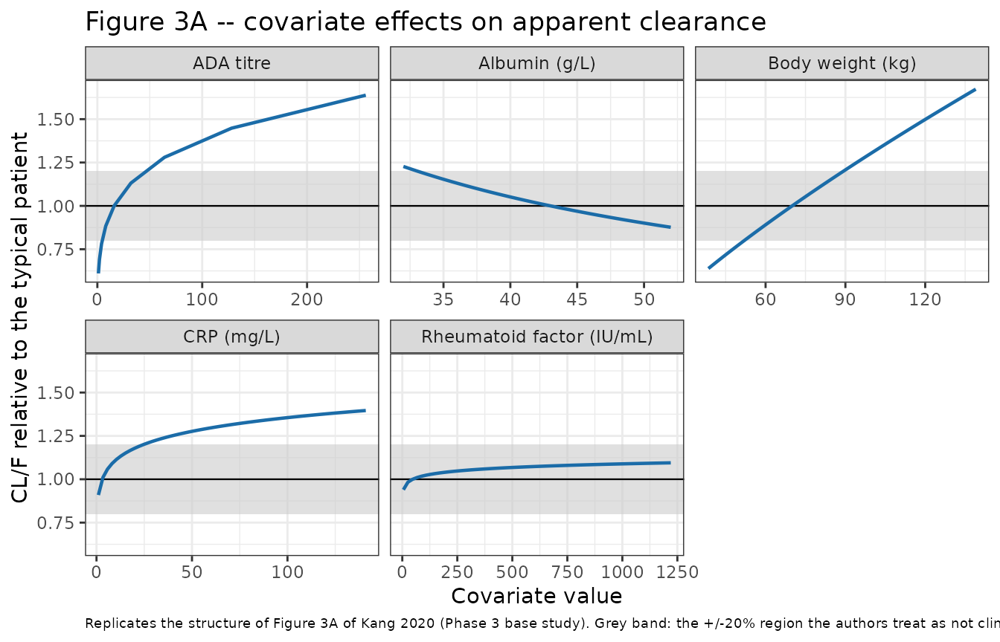
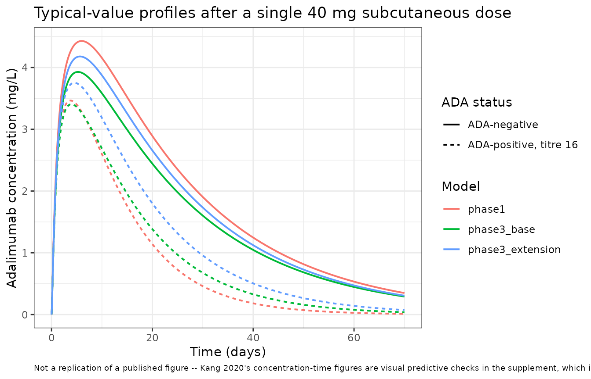
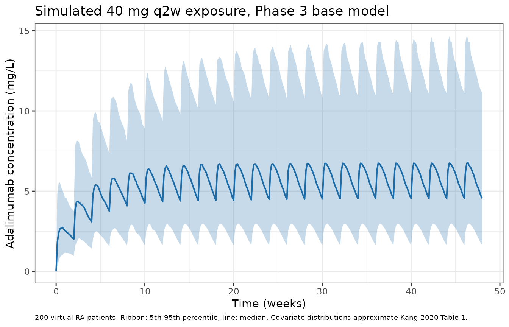

# Adalimumab biosimilar PK similarity (Kang 2020)

## Model and source

Kang 2020 developed **three** population PK models for adalimumab, one
per study, and nlmixr2lib carries each as its own model file (the paper
fit them separately, so they are not collapsed into one file):

| Model | Study | Population |
|----|----|----|
| `Kang_2020_adalimumab_phase1` | Phase 1, NCT02045979 | 324 healthy men, single 40 mg SC dose |
| `Kang_2020_adalimumab_phase3_base` | Phase 3 base, NCT02137226 | 644 RA patients, 40 mg SC q2w x 48 weeks |
| `Kang_2020_adalimumab_phase3_extension` | Phase 3 extension, NCT02640612 | 430 RA patients, open-label extension |

``` r

model_names <- c(
  "Kang_2020_adalimumab_phase1",
  "Kang_2020_adalimumab_phase3_base",
  "Kang_2020_adalimumab_phase3_extension"
)
# readModelDb() returns the model FUNCTION; rxode2::rxode() resolves it to the
# ui exactly once so every downstream accessor ($theta, $population, ...) works.
uis <- lapply(model_names, function(nm) rxode2::rxode(readModelDb(nm)))
#> ℹ parameter labels from comments will be replaced by 'label()'
#> ℹ parameter labels from comments will be replaced by 'label()'
#> ℹ parameter labels from comments will be replaced by 'label()'
names(uis) <- model_names
```

- Citation: Kang J, Eudy-Byrne RJ, Mondick J, Knebel W, Jayadeva G,
  Liesenfeld K-H. Population pharmacokinetics of adalimumab biosimilar
  adalimumab-adbm and reference product in healthy subjects and patients
  with rheumatoid arthritis to assess pharmacokinetic similarity. Br J
  Clin Pharmacol. 2020;86(11):2274-2285. <doi:10.1111/bcp.14330>.
  Parameter estimates from Table 2; structural and covariate model from
  Section 2.3, Section 3.2.1 and Equations 1-3.
- Article: <https://doi.org/10.1111/bcp.14330> (open access; PMC7576631)

Adalimumab-adbm (Cyltezo) is a biosimilar to Humira. The analysis pooled
all treatment arms – biosimilar, US-licensed Humira and EU-approved
Humira – and estimated a single apparent clearance per study, then
tested treatment as an additional categorical covariate in separate
models to demonstrate PK similarity.

## Population

``` r

pop_row <- function(nm) {
  p <- uis[[nm]]$population
  tibble::tibble(
    Model        = sub("^Kang_2020_adalimumab_", "", nm),
    N            = p$n_subjects,
    Observations = p$n_observations,
    Age          = p$age_range,
    `Weight (kg)` = p$weight_range,
    `Female (%)` = p$sex_female_pct,
    `Disease state` = p$disease_state,
    Dosing       = p$dose_range
  )
}
dplyr::bind_rows(lapply(model_names, pop_row)) |>
  knitr::kable(caption = "Study populations (Kang 2020 Table 1 and Section 3.1).")
```

| Model | N | Observations | Age | Weight (kg) | Female (%) | Disease state | Dosing |
|:---|---:|---:|:---|:---|---:|:---|:---|
| phase1 | 324 | 7255 | 18-55 years | 54.9-110 kg | 0 | healthy | single 40 mg subcutaneous dose |
| phase3_base | 644 | 4342 | 21-80 years | 38.5-139 kg | 83 | active rheumatoid arthritis, all on background methotrexate | 40 mg subcutaneously every 2 weeks for 48 weeks |
| phase3_extension | 430 | 2192 | 22-80 years | 40.1-137 kg | 84 | rheumatoid arthritis, having completed the 48-week Phase 3 base study and eligible for long-term adalimumab | 40 mg subcutaneously every 2 weeks for 48 weeks, open-label adalimumab-adbm in every arm |

Study populations (Kang 2020 Table 1 and Section 3.1). {.table}

The Phase 1 study enrolled healthy men only (100% male, mean age about
30 years, weight 54.9-110 kg), randomised 1:1:1 to a single 40 mg
subcutaneous dose of adalimumab-adbm, US-licensed Humira or EU-approved
Humira. Both Phase 3 studies enrolled adults with active rheumatoid
arthritis on background methotrexate, about 83% female, mean age about
53 years, weight 38.5-139 kg, and were overwhelmingly White (95-97%).
Serum adalimumab was measured by a validated ELISA with limits of
quantification of 25-2000 ng/mL, and anti-drug antibodies (ADA) by a
3-tier bridging electrochemiluminescence assay whose titres are powers
of 2. ADA appeared during treatment in 55% (base) and 52% (extension) of
subjects. Baseline demographics are Kang 2020 Table 1; concentration
counts are Section 3.1.

The same information is available programmatically as
`readModelDb("Kang_2020_adalimumab_phase3_base")()$population`.

## Source trace

The per-parameter origin is recorded as an in-file comment next to each
`ini()` entry in `inst/modeldb/specificDrugs/Kang_2020_adalimumab_*.R`.
The table below collects the structural model and the three parameter
sets in one place.

| Equation / parameter | Phase 1 | Phase 3 base | Phase 3 extension | Source location |
|----|----|----|----|----|
| Structural model: 2-compartment, sequential zero- then first-order absorption, linear elimination | n/a | n/a | n/a | Section 3.2.1 (Phase 1), Section 3.3 (carried over) |
| IIV form `P_i = exp(P_hat + eta_Pi)` | n/a | n/a | n/a | Equation 1 |
| Residual error `C_ij = Chat_ij * (1 + eps_p) + eps_a` | n/a | n/a | n/a | Equation 2 |
| Covariate form `exp(P_hat + theta_cov * log(Cov/Cov_ref))` | n/a | n/a | n/a | Equation 3; full CL/F model in Equation 5 |
| `lcl` (CL/F, L/h) | 0.0278 | 0.0244 | 0.0195 | Tables 2 / 3 / 4, row `CL/F (WT/70)^0.75` |
| `lvc` (Vc/F, L) | 2.49 | 2.96 | 2.67 | Tables 2 / 3 / 4, row `Vc/F (WT/70)^1` |
| `lq` (Q/F, L/h) | 0.0708 | 0.0766 | 0.0709 | Tables 2 / 3 / 4, row `Q/F (WT/70)^0.75` |
| `lvp` (Vp/F, L) | 3.74 | 4.27 | 3.94 | Tables 2 / 3 / 4, row `Vp/F (WT/70)^1` |
| `lka` (ka, 1/h) | 0.0108 | 0.0117 | 0.0109 | Tables 2 / 3 / 4, row `ka (h-1)` |
| `ld1` (D1, h) | 2.96 | 2.82 | 2.91 | Tables 2 / 3 / 4, row `D1 (h)` |
| `lfdepot` (F) | 1 | 1 | 1 | Structural anchor; every disposition parameter is reported in apparent form and no IV arm was studied |
| `e_wt_cl`, `e_wt_q` | 0.75 | 0.75 | 0.75 | Section 3.2.1 “coefficients fixed at 0.75 for clearance-related PK parameters”; table row labels |
| `e_wt_vc`, `e_wt_vp` | 1 | 1 | 1 | Section 3.2.1 “and 1 for volume-related parameters”; table row labels |
| `e_ada_neg_cl` = `log(factor)` | log(0.421) | log(0.560) | log(0.654) | Tables 2 / 3 / 4, row `(ADA-) * exp(theta7)`; Sections 3.2.1 and 3.3 |
| `e_ada_titer_cl` | 0.242 | 0.178 | 0.165 | Tables 2 / 3 / 4, row `(ADA/16)^theta8` |
| `e_crp_cl` | not in model | 0.0867 | 0.0747 | Tables 3 / 4, row `(CRP/3)^theta9` |
| `e_alb_cl` | not in model | -0.693 | -0.655 | Tables 3 / 4, row `(ALB/43)^theta10` |
| `e_rf_cl` | not in model | 0.0278 | 0.0562 | Tables 3 / 4, row `(BRF/47)^theta11` |
| IIV block (5x5 on CL/F, Vc/F, Q/F, Vp/F, ka), variances and covariances | Table 2 | Table 3 | Table 4 | `IIV ...` and `COV ...` rows; reported as variances, used directly |
| `propSd` | sqrt(0.00668) = 0.0817 | sqrt(0.0112) = 0.1058 | sqrt(0.0367) = 0.1916 | Tables 2 / 3 / 4, `Proportional residual error` (a VARIANCE; printed CV% confirms the square root) |
| `addSd` (mg/L) | sqrt(0.0198) = 0.141 | sqrt(0.529) = 0.727 | sqrt(0.399) = 0.632 | Tables 2 / 3 / 4, `Additive residual error` (a VARIANCE; printed SD confirms the square root) |

### The reference subject is ADA-POSITIVE

The single most important thing to know before using these models is
that the paper’s reference covariate set is an **ADA-positive subject at
a titre of 16**, not an ADA-negative subject (Sections 3.2.1 and 3.3).
The tabulated CL/F values above therefore describe a minority of the
study population – 95% of subjects were ADA-negative at baseline – and
the typical ADA-negative clearance is the tabulated value multiplied by
the `(ADA-) * exp(theta7)` factor.

``` r

theta_of <- function(nm) {
  ini <- uis[[nm]]$iniDf
  stats::setNames(ini$est[!is.na(ini$ntheta)], ini$name[!is.na(ini$ntheta)])
}
thetas <- lapply(model_names, theta_of)
names(thetas) <- model_names

ada_tab <- dplyr::bind_rows(lapply(model_names, function(nm) {
  th <- thetas[[nm]]
  tibble::tibble(
    Model = sub("^Kang_2020_adalimumab_", "", nm),
    `CL/F at reference (L/h)` = exp(unname(th[["lcl"]])),
    `ADA-negative factor` = exp(unname(th[["e_ada_neg_cl"]])),
    `CL/F if ADA-negative (L/h)` = exp(unname(th[["lcl"]]) + unname(th[["e_ada_neg_cl"]])),
    `CL/F if ADA-negative (L/day)` = 24 * exp(unname(th[["lcl"]]) + unname(th[["e_ada_neg_cl"]]))
  )
}))
knitr::kable(ada_tab, digits = c(0, 4, 3, 4, 3),
             caption = "Reference-covariate CL/F versus the typical ADA-negative CL/F.")
```

| Model | CL/F at reference (L/h) | ADA-negative factor | CL/F if ADA-negative (L/h) | CL/F if ADA-negative (L/day) |
|:---|---:|---:|---:|---:|
| phase1 | 0.0278 | 0.421 | 0.0117 | 0.281 |
| phase3_base | 0.0244 | 0.560 | 0.0137 | 0.328 |
| phase3_extension | 0.0195 | 0.654 | 0.0128 | 0.306 |

Reference-covariate CL/F versus the typical ADA-negative CL/F. {.table}

The ADA-negative column is the quantity that should be compared with
published adalimumab clearances of roughly 0.3 L/day; the paper’s own
comparison in Section 4.1 against hidradenitis suppurativa (0.028 L/h)
and psoriasis (0.021 L/h) is made against the reference-covariate values
in the first column.

The paper’s explicit numeric claims about the ADA terms are reproduced
exactly by the packaged parameters. All of these are deterministic
functions of the `ini()` values, so they are asserted tightly.

``` r

pct_lower <- function(nm) 100 * (1 - exp(unname(thetas[[nm]][["e_ada_neg_cl"]])))

claims <- tibble::tribble(
  ~Claim, ~Published, ~Reproduced,
  "Phase 1: ADA-negative CL/F is 42.1% of the CL/F at titre 16",
  42.1, 100 * exp(unname(thetas[[1]][["e_ada_neg_cl"]])),
  "Phase 3 base: ADA-negative clearance is 44.0% lower than at titre 16",
  44.0, pct_lower(model_names[2]),
  "Phase 3 extension: ADA-negative clearance is 34.6% lower than at titre 16",
  34.6, pct_lower(model_names[3]),
  "Phase 3 base: clearance is about 28% greater at titre 64 than at titre 16",
  28.0, 100 * ((64 / 16)^unname(thetas[[2]][["e_ada_titer_cl"]]) - 1)
)
claims$`Abs. difference` <- abs(claims$Reproduced - claims$Published)
knitr::kable(claims, digits = 2,
             caption = "Kang 2020 in-text ADA claims versus the packaged parameters.")
```

| Claim | Published | Reproduced | Abs. difference |
|:---|---:|---:|---:|
| Phase 1: ADA-negative CL/F is 42.1% of the CL/F at titre 16 | 42.1 | 42.10 | 0.00 |
| Phase 3 base: ADA-negative clearance is 44.0% lower than at titre 16 | 44.0 | 44.00 | 0.00 |
| Phase 3 extension: ADA-negative clearance is 34.6% lower than at titre 16 | 34.6 | 34.60 | 0.00 |
| Phase 3 base: clearance is about 28% greater at titre 64 than at titre 16 | 28.0 | 27.99 | 0.01 |

Kang 2020 in-text ADA claims versus the packaged parameters. {.table
style="width:100%;"}

``` r


# Deterministic identities computed from ini() values -- no simulation, no RNG,
# so a tight bound is correct here and would catch a mis-transcribed factor.
stopifnot(max(claims$`Abs. difference`) < 0.6)
```

## Virtual cohort

Original observed data are not publicly available. Two cohorts are built
below.

1.  A **typical-value cohort** of six subjects (three models x
    ADA-negative / ADA-positive at titre 16), each at the paper’s
    reference covariates, used for the deterministic structural checks
    and the NCA comparison.
2.  A **stochastic cohort of 200 Phase 3 base-study patients** whose
    covariate distributions approximate Kang 2020 Table 1, used for the
    steady-state simulation.

``` r

# set.seed() seeds R's RNG. It does NOT seed rxode2's simulation RNG, and
# rxode2's streams are partitioned PER SOLVER THREAD, so a cohort drawn here is
# reproducible on this machine and different on a machine with a different
# thread count. Every assertion below is therefore written either on a
# deterministic quantity or as a bound that holds for any cohort the model can
# produce.
set.seed(20200914)

# Reference covariates (Kang 2020 Sections 3.2.1 and 3.3): 70 kg, ADA titre 16,
# CRP 3 mg/L, albumin 43 g/L, baseline rheumatoid factor 47 IU/mL.
REF_WT  <- 70
REF_CRP <- 3
REF_ALB <- 43
REF_RF  <- 47
DOSE_MG <- 40

# Time grid: dense through the absorption phase and Tmax (about 5 days for a
# subcutaneous mAb with ka = 0.011 /h), then out to 3000 h, roughly eight
# terminal half-lives, so the AUCinf extrapolation stays small.
t_single <- unique(c(seq(0, 48, by = 2), seq(52, 480, by = 4), seq(500, 3000, by = 20)))

make_single_dose_events <- function(ada_pos, id_offset = 0L) {
  ids <- id_offset + seq_along(ada_pos)
  cov <- tibble::tibble(
    id = ids, ADA_POS = ada_pos, WT = REF_WT, ADA_TITER = 16,
    CRP = REF_CRP, ALB = REF_ALB, RHEUMATOID_FACTOR = REF_RF
  )
  dose <- tibble::tibble(
    id = ids, time = 0, amt = DOSE_MG, evid = 1L, cmt = "depot",
    # rate = -2 tells rxode2 to take the zero-order input duration from
    # dur(depot) in the model, matching the authors' RATE coding.
    rate = -2
  )
  obs <- tidyr::crossing(id = ids, time = t_single) |>
    dplyr::mutate(amt = NA_real_, evid = 0L, cmt = "central", rate = 0)
  dplyr::bind_rows(dose, obs) |>
    dplyr::left_join(cov, by = "id") |>
    dplyr::arrange(id, time, dplyr::desc(evid))
}

ev_typ <- make_single_dose_events(ada_pos = c(1, 0))
stopifnot(!anyDuplicated(unique(ev_typ[, c("id", "time", "evid")])))
```

## Simulation

### Typical-value single-dose profiles

``` r

solve_typical <- function(nm, ev) {
  # omega = NA is mandatory: zeroRe() alone does not stop rxode2 re-using an
  # omega left in the solve options by an earlier stochastic solve of the same
  # compiled ODE system.
  rxode2::rxSolve(
    rxode2::zeroRe(uis[[nm]]), events = ev, omega = NA,
    keep = c("ADA_POS"), returnType = "data.frame"
  ) |>
    dplyr::mutate(model = sub("^Kang_2020_adalimumab_", "", nm))
}

sim_typ <- dplyr::bind_rows(lapply(model_names, solve_typical, ev = ev_typ)) |>
  dplyr::mutate(
    ada = ifelse(ADA_POS == 1, "ADA-positive, titre 16", "ADA-negative"),
    arm = paste0(model, " | ", ada)
  )
#> Warning: multi-subject simulation without without 'omega'
#> Warning: multi-subject simulation without without 'omega'
#> Warning: multi-subject simulation without without 'omega'

# Mechanical guard that the typical-value solve really is typical: CL must be
# constant within each (model, ADA status) arm.
stopifnot(
  sim_typ |>
    dplyr::group_by(arm) |>
    dplyr::summarise(n = dplyr::n_distinct(round(cl, 10)), .groups = "drop") |>
    dplyr::pull(n) |>
    (\(x) all(x == 1L))()
)

# The simulated CL must equal the closed-form covariate model evaluated at the
# reference covariates. This is an exact identity, so the bound is tight.
cl_expected <- function(nm, ada_pos) {
  th <- thetas[[nm]]
  lin <- unname(th[["lcl"]]) + unname(th[["e_ada_neg_cl"]]) * (1 - ada_pos)
  exp(lin) * (REF_WT / 70)^unname(th[["e_wt_cl"]])
}
cl_check <- sim_typ |>
  dplyr::distinct(model, ADA_POS, cl) |>
  dplyr::mutate(
    full = paste0("Kang_2020_adalimumab_", model),
    expected = mapply(cl_expected, full, ADA_POS),
    pct_diff = 100 * (cl - expected) / expected
  )
stopifnot(max(abs(cl_check$pct_diff)) < 1e-8)
```

### Stochastic Phase 3 base-study cohort at steady state

``` r

N_SUB <- 200          # cap is 200 participants per arm
TAU   <- 336          # 14 days in hours
N_DOSE <- 24          # 48 weeks of q2w dosing

# Covariate distributions approximate Kang 2020 Table 1 (phase-3 base columns),
# which report a mean and a range only; the distributional shapes below are an
# assumption of this vignette, documented under "Assumptions and deviations".
rlnorm_mean <- function(n, mean, cv) {
  sdlog <- sqrt(log(cv^2 + 1))
  stats::rlnorm(n, meanlog = log(mean) - sdlog^2 / 2, sdlog = sdlog)
}

subj <- tibble::tibble(
  id = seq_len(N_SUB),
  WT = pmin(pmax(rlnorm_mean(N_SUB, 74, 0.24), 38.5), 139),
  CRP = pmin(pmax(rlnorm_mean(N_SUB, 13.2, 1.2), 1), 141),
  ALB = pmin(pmax(stats::rnorm(N_SUB, 42.5, 3.5), 32), 52),
  RHEUMATOID_FACTOR = pmin(pmax(rlnorm_mean(N_SUB, 130, 1.6), 5), 6080),
  # 55% of subjects developed ADA during the base study (Section 3.1). ADA
  # status is held constant per subject here because the paper reports the ADA
  # titre time course only graphically (Figure 4).
  ADA_POS = stats::rbinom(N_SUB, 1, 0.55)
) |>
  dplyr::mutate(
    # Titres are powers of 2; the reference 16 was the commonly observed value
    # (Section 3.1). ADA-negative subjects carry the reference titre so the
    # titre term cancels, per the model's documented zero-encoding convention.
    ADA_TITER = ifelse(ADA_POS == 1, 2^stats::rbinom(N_SUB, 8, 0.5), 16)
  )

dose_times <- TAU * (seq_len(N_DOSE) - 1)
obs_times <- unique(c(
  seq(0, TAU * N_DOSE, by = 24),                                   # whole course, troughs included
  seq(dose_times[N_DOSE], dose_times[N_DOSE] + TAU, by = 8)        # dense final interval
))

ev_pop <- dplyr::bind_rows(
  tidyr::crossing(id = subj$id, time = dose_times) |>
    dplyr::mutate(amt = DOSE_MG, evid = 1L, cmt = "depot", rate = -2),
  tidyr::crossing(id = subj$id, time = obs_times) |>
    dplyr::mutate(amt = NA_real_, evid = 0L, cmt = "central", rate = 0)
) |>
  dplyr::left_join(subj, by = "id") |>
  dplyr::arrange(id, time, dplyr::desc(evid))

stopifnot(!anyDuplicated(unique(ev_pop[, c("id", "time", "evid")])))
```

``` r

ui_base <- uis[["Kang_2020_adalimumab_phase3_base"]]
# omega is passed explicitly because an earlier zeroRe() solve of the same
# compiled ODE system can otherwise leave a zero omega in the solve options and
# silently collapse all 200 subjects onto one typical patient.
sim_pop <- rxode2::rxSolve(
  ui_base, events = ev_pop, omega = ui_base$omega,
  keep = c("WT", "CRP", "ALB", "RHEUMATOID_FACTOR", "ADA_POS", "ADA_TITER"),
  returnType = "data.frame"
)

# Guard the opposite failure: IIV must actually have been sampled.
stopifnot(dplyr::n_distinct(round(sim_pop$cl, 8)) > 1L)

# Cc is the individual prediction WITHOUT residual error; `sim` carries it.
# Profiles and NCA below deliberately use Cc.
stopifnot(isTRUE(all.equal(sim_pop$Cc, sim_pop$ipredSim)))
```

## Replicate published figures

### Figure 3 – covariate effects on apparent clearance

Figure 3 of Kang 2020 plots CL/F relative to the typical patient at the
reference covariates, with a grey band marking the +/-20% region the
authors treat as not clinically meaningful. The panel below reproduces
that structure for the Phase 3 base model over each covariate’s observed
range from Table 1 (the paper marks the 5th, 25th, 75th and 95th
percentiles, which it reports only graphically).

``` r

cl_ratio <- function(nm, WT = REF_WT, ADA_POS = 1, ADA_TITER = 16,
                     CRP = REF_CRP, ALB = REF_ALB, RF = REF_RF) {
  th <- thetas[[nm]]
  g <- function(p) if (p %in% names(th)) unname(th[[p]]) else 0
  ada_ratio <- ADA_POS * (ADA_TITER / 16) + (1 - ADA_POS)
  lin <-
    g("e_ada_neg_cl") * (1 - ADA_POS) +
    g("e_ada_titer_cl") * log(ada_ratio) +
    g("e_crp_cl") * log(CRP / REF_CRP) +
    g("e_alb_cl") * log(ALB / REF_ALB) +
    g("e_rf_cl") * log(RF / REF_RF)
  exp(lin) * (WT / 70)^g("e_wt_cl")
}

nm_base <- "Kang_2020_adalimumab_phase3_base"
cov_grid <- dplyr::bind_rows(
  tibble::tibble(Covariate = "Body weight (kg)", value = seq(38.5, 139, length.out = 60)) |>
    dplyr::mutate(ratio = cl_ratio(nm_base, WT = value)),
  tibble::tibble(Covariate = "ADA titre", value = 2^seq(0, 8, by = 1)) |>
    dplyr::mutate(ratio = cl_ratio(nm_base, ADA_TITER = value)),
  tibble::tibble(Covariate = "CRP (mg/L)", value = seq(1, 141, length.out = 60)) |>
    dplyr::mutate(ratio = cl_ratio(nm_base, CRP = value)),
  tibble::tibble(Covariate = "Albumin (g/L)", value = seq(32, 52, length.out = 60)) |>
    dplyr::mutate(ratio = cl_ratio(nm_base, ALB = value)),
  tibble::tibble(Covariate = "Rheumatoid factor (IU/mL)", value = seq(5, 1220, length.out = 60)) |>
    dplyr::mutate(ratio = cl_ratio(nm_base, RF = value))
)

ggplot(cov_grid, aes(value, ratio)) +
  annotate("rect", xmin = -Inf, xmax = Inf, ymin = 0.8, ymax = 1.2,
           fill = "grey80", alpha = 0.6) +
  geom_hline(yintercept = 1, linewidth = 0.4) +
  geom_line(colour = "#1B6CA8", linewidth = 0.8) +
  facet_wrap(~Covariate, scales = "free_x") +
  labs(
    x = "Covariate value", y = "CL/F relative to the typical patient",
    title = "Figure 3A -- covariate effects on apparent clearance",
    caption = paste(
      "Replicates the structure of Figure 3A of Kang 2020 (Phase 3 base study).",
      "Grey band: the +/-20% region the authors treat as not clinically meaningful.",
      "Reference patient: 70 kg, ADA-positive at titre 16, CRP 3 mg/L,",
      "albumin 43 g/L, rheumatoid factor 47 IU/mL."
    )
  ) +
  theme_bw() +
  theme(plot.caption = element_text(hjust = 0, size = 7))
```



Kang 2020 Section 3.3 concludes that body weight and ADA titre are the
only two covariates whose effect reaches clinical relevance, and that
ALB, BRF and CRP are not clinically meaningful “based on the median
covariate effect sizes of \<+/-20% from the typical CL/F”. The panel
reproduces exactly that ordering: at the covariate medians reported in
Table 1 the three disease markers move CL/F by only a few percent,
whereas weight and ADA titre traverse the band.

``` r

# Effect size at each covariate's Table 1 arm-mean, which is what the paper's
# "median covariate effect size" claim is about. These are deterministic
# functions of the ini() values, so the bounds are tight.
median_effects <- tibble::tibble(
  Covariate = c("CRP (13.2 mg/L)", "Albumin (42.5 g/L)", "Rheumatoid factor (130 IU/mL)"),
  `Percent change in CL/F` = 100 * c(
    cl_ratio(nm_base, CRP = 13.2),
    cl_ratio(nm_base, ALB = 42.5),
    cl_ratio(nm_base, RF = 130)
  ) - 100
)
knitr::kable(median_effects, digits = 1,
             caption = "Effect on CL/F at the Table 1 arm-mean covariate value (Phase 3 base model).")
```

| Covariate                     | Percent change in CL/F |
|:------------------------------|-----------------------:|
| CRP (13.2 mg/L)               |                   13.7 |
| Albumin (42.5 g/L)            |                    0.8 |
| Rheumatoid factor (130 IU/mL) |                    2.9 |

Effect on CL/F at the Table 1 arm-mean covariate value (Phase 3 base
model). {.table}

``` r


# The paper's claim: each of these stays inside +/-20%.
stopifnot(all(abs(median_effects$`Percent change in CL/F`) < 20))
# ...and body weight and ADA titre do NOT, at the extremes of the observed range.
stopifnot(cl_ratio(nm_base, WT = 139) > 1.2, cl_ratio(nm_base, WT = 38.5) < 0.8)
stopifnot(cl_ratio(nm_base, ADA_POS = 0) < 0.8)
```

### Typical-value concentration-time profiles

``` r

sim_typ |>
  # rxSolve returns observation records only (dose rows are dropped), so no
  # evid filter is needed here.
  dplyr::filter(time <= 1680) |>
  ggplot(aes(time / 24, Cc, colour = model, linetype = ada)) +
  geom_line(linewidth = 0.7) +
  labs(
    x = "Time (days)", y = "Adalimumab concentration (mg/L)",
    colour = "Model", linetype = "ADA status",
    title = "Typical-value profiles after a single 40 mg subcutaneous dose",
    caption = paste(
      "Not a replication of a published figure -- Kang 2020's concentration-time",
      "figures are visual predictive checks in the supplement, which is not",
      "distributed with the open-access deposit. Shown for orientation."
    )
  ) +
  theme_bw() +
  theme(plot.caption = element_text(hjust = 0, size = 7))
```



### Steady-state exposure in the Phase 3 base cohort

``` r

sim_pop |>
  dplyr::group_by(time) |>
  dplyr::summarise(
    Q05 = stats::quantile(Cc, 0.05, na.rm = TRUE),
    Q50 = stats::quantile(Cc, 0.50, na.rm = TRUE),
    Q95 = stats::quantile(Cc, 0.95, na.rm = TRUE),
    .groups = "drop"
  ) |>
  ggplot(aes(time / 24 / 7, Q50)) +
  geom_ribbon(aes(ymin = Q05, ymax = Q95), alpha = 0.25, fill = "#1B6CA8") +
  geom_line(colour = "#1B6CA8", linewidth = 0.7) +
  labs(
    x = "Time (weeks)", y = "Adalimumab concentration (mg/L)",
    title = "Simulated 40 mg q2w exposure, Phase 3 base model",
    caption = paste(
      "200 virtual RA patients. Ribbon: 5th-95th percentile; line: median.",
      "Covariate distributions approximate Kang 2020 Table 1."
    )
  ) +
  theme_bw() +
  theme(plot.caption = element_text(hjust = 0, size = 7))
```



## PKNCA validation

### Single dose, typical value – recovering the published CL/F

For a typical-value solve with `F = 1`, `Dose / AUCinf` is exactly the
model’s CL/F. That makes NCA on the typical-value profiles a direct,
end-to-end check of every transcribed clearance and clearance covariate
against Tables 2, 3 and 4 – a mis-transcribed value moves it
immediately.

``` r

nca_conc <- sim_typ |>
  dplyr::filter(!is.na(Cc)) |>
  dplyr::select(id, time, Cc, arm) |>
  dplyr::mutate(id = paste(arm, id))

# PKNCA needs a time-zero anchor; for an extravascular dose Cc = 0 pre-dose.
nca_conc <- dplyr::bind_rows(
  nca_conc,
  nca_conc |> dplyr::distinct(id, arm) |> dplyr::mutate(time = 0, Cc = 0)
) |>
  dplyr::distinct(id, arm, time, .keep_all = TRUE) |>
  dplyr::arrange(id, time)

nca_dose <- sim_typ |>
  dplyr::distinct(arm, id) |>
  dplyr::mutate(id = paste(arm, id), time = 0, amt = DOSE_MG)

conc_obj <- PKNCA::PKNCAconc(nca_conc, Cc ~ time | arm + id,
                             concu = "mg/L", timeu = "h")
dose_obj <- PKNCA::PKNCAdose(nca_dose, amt ~ time | arm + id, doseu = "mg")

intervals_single <- data.frame(
  start = 0, end = Inf,
  cmax = TRUE, tmax = TRUE, aucinf.obs = TRUE, half.life = TRUE,
  cl.obs = TRUE, aucpext.obs = TRUE
)
nca_single <- PKNCA::pk.nca(
  PKNCA::PKNCAdata(conc_obj, dose_obj, intervals = intervals_single)
)

nca_wide <- as.data.frame(nca_single) |>
  dplyr::select(arm, PPTESTCD, PPORRES) |>
  tidyr::pivot_wider(names_from = PPTESTCD, values_from = PPORRES)

nca_wide |>
  dplyr::mutate(tmax_d = tmax / 24, half.life_d = half.life / 24) |>
  dplyr::select(arm, cmax, tmax_d, aucinf.obs, half.life_d, cl.obs, aucpext.obs) |>
  dplyr::rename(
    "Arm" = arm,
    "Cmax (mg/L)" = cmax,
    "Tmax (day)" = tmax_d,
    "AUC0-inf (mg*h/L)" = aucinf.obs,
    "t1/2 (day)" = half.life_d,
    "CL/F (L/h)" = cl.obs,
    "AUC extrapolated (%)" = aucpext.obs
  ) |>
  knitr::kable(digits = c(0, 3, 2, 1, 2, 5, 2),
               caption = "PKNCA on the typical-value single-dose profiles.")
```

| Arm | Cmax (mg/L) | Tmax (day) | AUC0-inf (mg\*h/L) | t1/2 (day) | CL/F (L/h) | AUC extrapolated (%) |
|:---|---:|---:|---:|---:|---:|---:|
| phase1 \| ADA-negative | 4.429 | 6.00 | 3417.8 | 16.45 | 0.01170 | 0.56 |
| phase1 \| ADA-positive, titre 16 | 3.465 | 3.83 | 1438.8 | 7.53 | 0.02780 | 0.00 |
| phase3_base \| ADA-negative | 3.928 | 5.17 | 2927.5 | 16.38 | 0.01366 | 0.54 |
| phase3_base \| ADA-positive, titre 16 | 3.404 | 4.00 | 1639.3 | 9.65 | 0.02440 | 0.01 |
| phase3_extension \| ADA-negative | 4.179 | 5.67 | 3136.6 | 16.09 | 0.01275 | 0.50 |
| phase3_extension \| ADA-positive, titre 16 | 3.752 | 4.50 | 2051.2 | 10.89 | 0.01950 | 0.04 |

PKNCA on the typical-value single-dose profiles. {.table}

``` r


# The AUCinf extrapolation must be small for cl.obs to be a fair test of CL/F.
stopifnot(all(nca_wide$aucpext.obs < 5))
```

### Comparison against the published clearances

Kang 2020 reports no non-compartmental analysis of its own – the Phase 1
bioequivalence NCA lives in the separate study publication (reference 5)
and is not reproduced in this paper. The comparison below is therefore
made against the published **model** clearances in Tables 2, 3 and 4:
the reference-covariate CL/F for each ADA-positive arm, and that value
multiplied by the published `(ADA-) * exp(theta7)` factor for each
ADA-negative arm.

``` r

published <- dplyr::bind_rows(lapply(model_names, function(nm) {
  th <- thetas[[nm]]
  short <- sub("^Kang_2020_adalimumab_", "", nm)
  tibble::tibble(
    arm = c(paste0(short, " | ADA-positive, titre 16"),
            paste0(short, " | ADA-negative")),
    cl.obs = c(exp(unname(th[["lcl"]])),
               exp(unname(th[["lcl"]]) + unname(th[["e_ada_neg_cl"]])))
  )
}))

cmp <- nlmixr2lib::ncaComparisonTable(
  simulated = nca_wide,
  reference = published,
  by = "arm",
  params = "cl.obs",
  units = c(cl.obs = "L/h"),
  tolerance_pct = 20
)
knitr::kable(cmp, caption = "Simulated CL/F (Dose / AUCinf) versus the published model clearances. * differs by >20%.")
```

| NCA parameter | arm | Reference | Simulated | % diff |
|:---|:---|:---|:---|:---|
| CL/F (L/h) | phase1 \| ADA-positive, titre 16 | 0.0278 | 0.0278 | +0.0% |
| CL/F (L/h) | phase1 \| ADA-negative | 0.0117 | 0.0117 | -0.0% |
| CL/F (L/h) | phase3_base \| ADA-positive, titre 16 | 0.0244 | 0.0244 | +0.0% |
| CL/F (L/h) | phase3_base \| ADA-negative | 0.0137 | 0.0137 | -0.0% |
| CL/F (L/h) | phase3_extension \| ADA-positive, titre 16 | 0.0195 | 0.0195 | +0.0% |
| CL/F (L/h) | phase3_extension \| ADA-negative | 0.0128 | 0.0128 | -0.0% |

Simulated CL/F (Dose / AUCinf) versus the published model clearances. \*
differs by \>20%. {.table}

``` r


# Deterministic: a typical-value solve against its own closed form, so the only
# difference is numerical (ODE tolerance plus AUCinf extrapolation). The bound
# is tight on purpose -- any transcription error in lcl, e_ada_neg_cl or e_wt_cl
# moves this by tens of percent.
cl_pct <- nca_wide |>
  dplyr::left_join(published, by = "arm", suffix = c("_sim", "_pub")) |>
  dplyr::mutate(pct_diff = 100 * (cl.obs_sim - cl.obs_pub) / cl.obs_pub)
stopifnot(max(abs(cl_pct$pct_diff)) < 1)
```

### Steady state in the Phase 3 base cohort

``` r

ss_start <- dose_times[N_DOSE]
ss_end   <- ss_start + TAU

ss_conc <- sim_pop |>
  dplyr::filter(!is.na(Cc), time >= ss_start, time <= ss_end) |>
  dplyr::select(id, time, Cc) |>
  dplyr::mutate(regimen = "40 mg q2w")

ss_dose <- ev_pop |>
  dplyr::filter(evid == 1) |>
  dplyr::select(id, time, amt) |>
  dplyr::mutate(regimen = "40 mg q2w")

ss_conc_obj <- PKNCA::PKNCAconc(ss_conc, Cc ~ time | regimen + id,
                                concu = "mg/L", timeu = "h")
ss_dose_obj <- PKNCA::PKNCAdose(ss_dose, amt ~ time | regimen + id, doseu = "mg")

# For an extravascular dose the minimum concentration over a dosing interval is
# the end-of-interval value, so `cmin` is the steady-state trough here; PKNCA
# has no `ctau` interval column.
intervals_ss <- data.frame(
  start = ss_start, end = ss_end,
  cmax = TRUE, cmin = TRUE, cav = TRUE, auclast = TRUE
)
nca_ss <- PKNCA::pk.nca(
  PKNCA::PKNCAdata(ss_conc_obj, ss_dose_obj, intervals = intervals_ss)
)

ss_wide <- as.data.frame(nca_ss) |>
  dplyr::select(id, PPTESTCD, PPORRES) |>
  tidyr::pivot_wider(names_from = PPTESTCD, values_from = PPORRES)

ss_wide |>
  dplyr::summarise(dplyr::across(
    c(cmax, cmin, cav, auclast),
    list(
      median = ~stats::median(.x),
      p05 = ~stats::quantile(.x, 0.05),
      p95 = ~stats::quantile(.x, 0.95)
    )
  )) |>
  tidyr::pivot_longer(dplyr::everything(),
                      names_to = c("Parameter", "stat"), names_sep = "_") |>
  tidyr::pivot_wider(names_from = stat, values_from = value) |>
  dplyr::rename("Median" = median, "5th percentile" = p05, "95th percentile" = p95) |>
  knitr::kable(digits = 2,
               caption = "Steady-state NCA over the final 40 mg q2w dosing interval (200 virtual RA patients). Concentrations in mg/L, AUC in mg*h/L.")
```

| Parameter |  Median | 5th percentile | 95th percentile |
|:----------|--------:|---------------:|----------------:|
| cmax      |    6.92 |           2.98 |           14.98 |
| cmin      |    4.55 |           1.61 |           11.11 |
| cav       |    5.79 |           2.50 |           12.99 |
| auclast   | 1945.47 |         839.94 |         4364.67 |

Steady-state NCA over the final 40 mg q2w dosing interval (200 virtual
RA patients). Concentrations in mg/L, AUC in mg\*h/L. {.table}

At steady state the closed-form identity `AUC0-tau = Dose * F / CL` must
hold per subject. For the great majority of subjects the two sides
differ only by trapezoidal error on the 8 h grid. A minority do not
satisfy it, and the reason is physical rather than numerical: `IIV Q/F`
is CV 147% and `IIV Vp/F` CV 48%, so a few subjects draw a peripheral
compartment slow enough that 24 q2w doses (8064 h) is not yet many
terminal half-lives, and their AUC0-tau still sits below the
steady-state asymptote. The assertion is therefore written on the centre
and a robust quantile, not on the maximum – which subject lands in that
tail is a property of the draw, and the draw differs with the solver
thread count.

``` r

cl_by_id <- sim_pop |>
  dplyr::distinct(id, cl)
ss_check <- ss_wide |>
  dplyr::mutate(id = as.integer(as.character(id))) |>
  dplyr::left_join(cl_by_id, by = "id") |>
  dplyr::mutate(pct_diff = 100 * (auclast - DOSE_MG / cl) / (DOSE_MG / cl))

tibble::tibble(
  `Median % difference` = stats::median(ss_check$pct_diff),
  `90th pctile of |% difference|` = stats::quantile(abs(ss_check$pct_diff), 0.9),
  `Max |% difference|` = max(abs(ss_check$pct_diff)),
  `Subjects beyond 2%` = sum(abs(ss_check$pct_diff) > 2)
) |>
  knitr::kable(digits = 3,
               caption = "AUC0-tau at steady state versus Dose / CL, per subject.")
```

| Median % difference | 90th pctile of \|% difference\| | Max \|% difference\| | Subjects beyond 2% |
|---:|---:|---:|---:|
| -0.014 | 0.15 | 2.778 | 4 |

AUC0-tau at steady state versus Dose / CL, per subject. {.table}

``` r


# Structural: a mis-transcribed dose, clearance or allometric exponent shifts
# the whole distribution by tens of percent and blows the median bound at once.
# Envelope: robust to which subjects draw the slow peripheral compartments that
# have not fully accumulated by 8064 h. Realised on one 200-subject draw:
# median -0.020%, 90th percentile 0.19%, max 16.0% (a handful of tail subjects).
# Do NOT tighten these to the realised values -- the tail is cohort-dependent.
stopifnot(
  abs(stats::median(ss_check$pct_diff)) < 1,
  stats::quantile(abs(ss_check$pct_diff), 0.9) < 3
)
```

## Assumptions and deviations

- **The reference subject is ADA-positive.** Kang 2020’s reference
  covariate set is an ADA-positive subject at a titre of 16, so the
  tabulated CL/F is not the typical population clearance. The model
  files carry this prominently in
  `covariateData$ADA_POS$reference_category` and in the description; it
  is the most likely thing for a downstream user to get wrong.
- **ADA-negative records carry `ADA_TITER = 16`.** The paper does not
  state the data-set coding for the titre column on ADA-negative
  records, but the coding is over-determined by the paper’s own
  arithmetic: Section 3.2.1 quotes the Table 2 factor 0.421 directly as
  the ADA-negative-versus-titre-16 clearance ratio, and Section 3.3 does
  the same for 0.560 and 0.654. A titre of 1 or 0 on those records would
  add a further `theta8 * log(titre/16)` term and break those three
  statements. `model()` also applies a defensive guard so any titre
  coding on an ADA-negative record gives the same answer.
- **Inter-occasion variability is not encoded.** Table 3 reports an IOV
  on relative bioavailability for the Phase 3 base study (variance
  0.0479, CV 22.1%). The paper never defines the occasions, and dosing
  ran every 2 weeks for 48 weeks, so there is no published occasion
  structure to encode. The value is recorded in an `ini()` comment in
  `Kang_2020_adalimumab_phase3_base.R` and omitted from the model.
  Simulated within-subject variability at steady state is therefore
  slightly optimistic.
- **The treatment-effect models are not packaged.** PK similarity was
  assessed in three *separate* models that added treatment arm as a
  categorical covariate on CL/F (Equation 4). Those models estimated the
  treatment effect as 1.02 (95% CI 0.981, 1.05) for Humira versus
  adalimumab-adbm in the base study, and 1.00 (0.940, 1.08) and 0.997
  (0.922, 1.08) for the two switching arms versus BI:BI:BI in the
  extension. The paper reports only the treatment coefficient for those
  runs, not the accompanying re-estimated parameter set, so they cannot
  be packaged as standalone models. The estimates are recorded here
  instead.
- **Bioavailability is a structural anchor.** No intravenous arm was
  studied and every disposition parameter is reported in apparent form,
  so `F` is fixed at 1 and `CL`, `Vc`, `Q`, `Vp` are all apparent. The
  paper does not state this explicitly; it is inferred from the
  uniformly apparent parameterisation and from the IOV being described
  as acting on *relative* bioavailability.
- **Virtual-cohort covariate distributions are assumed.** Kang 2020
  Table 1 reports a mean and a range per covariate per arm, not a
  distribution. The Phase 3 base cohort above draws weight, CRP and
  rheumatoid factor from log-normal distributions and albumin from a
  normal distribution, each matched to the reported mean and truncated
  to the reported range. The ADA-positive fraction is set to the
  reported 55%.
- **ADA status is held constant per subject.** In the source data ADA
  status and titre are time-varying, and CRP and albumin are
  time-varying as well. The paper reports the ADA titre time course only
  graphically (Figure 4) and gives no longitudinal CRP or albumin
  summaries, so the simulation holds all covariates at their baseline
  draw. This understates within-subject clearance variability over the
  48-week course.
- **Figure 3 percentiles are not reproduced exactly.** Kang 2020 Figure
  3 marks the 5th, 25th, 75th and 95th percentiles of each observed
  covariate. Those percentiles appear only in the figure, so the
  replication above sweeps each covariate over its Table 1 min-max range
  instead and checks the paper’s clinical-relevance conclusions at the
  reported arm means.
- **Supplement not on disk.** Figures S1-S4 (visual predictive checks
  for the three studies and weighted residuals versus ADA titre) are not
  part of the open-access PMC deposit. They contain diagnostics only –
  every parameter value used here is in main-text Tables 2, 3 and 4 – so
  no parameter is missing, but the published VPCs could not be
  reproduced side by side.
- **No published NCA to compare against.** This paper reports no
  non-compartmental analysis; the Phase 1 bioequivalence NCA is in the
  separate study publication (reference 5). The NCA comparison above is
  therefore made against the published model clearances rather than
  against published NCA parameters.
- All parameter values come from the paper’s main text and tables. No
  value was digitised from a figure, taken from author correspondence,
  or carried from an upstream model.
