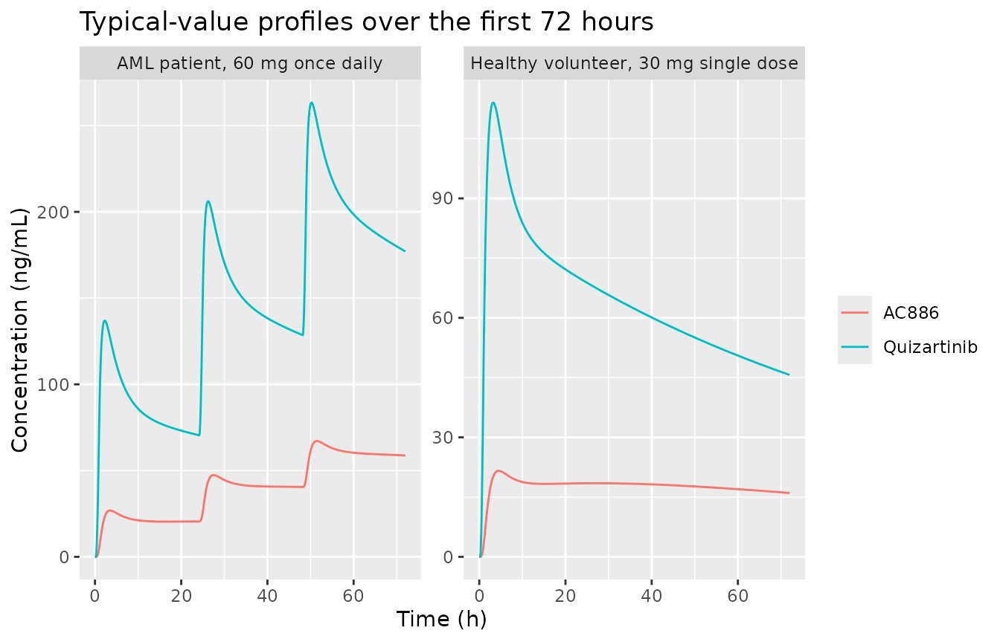
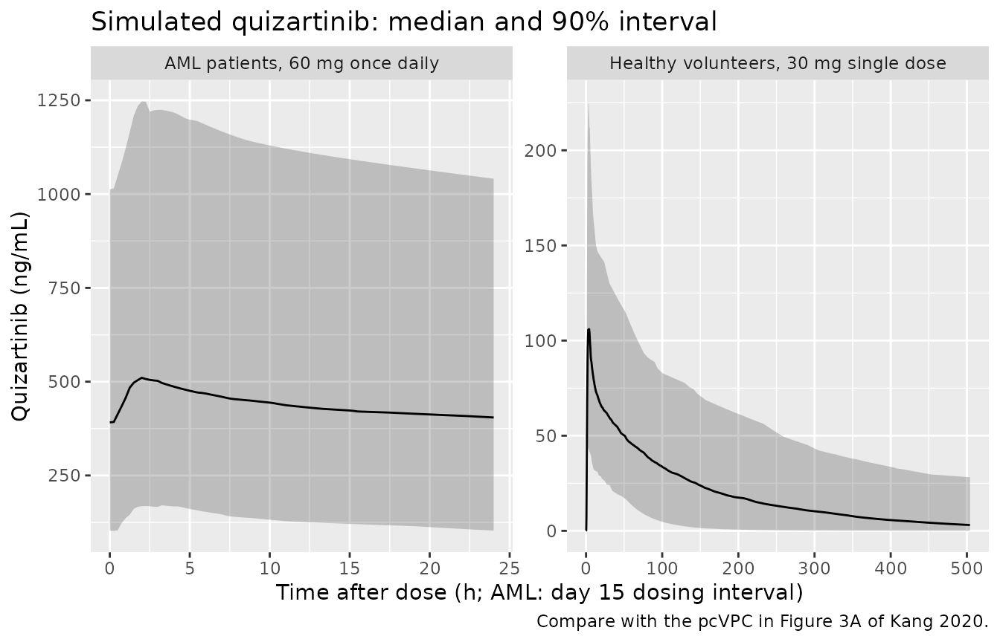

# Quizartinib and AC886 (Kang 2020)

## Model and source

``` r

mod <- readModelDb("Kang_2020_quizartinib")
ui <- rxode2::rxode(mod)
#> ℹ parameter labels from comments will be replaced by 'label()'
#> Warning: some etas defaulted to non-mu referenced, possible parsing error: etalcl_ac886_aml, etalcl_ac886_nonaml, etaiov_fdepot_1, etaiov_fdepot_3, etaiov_cl_1, etaiov_cl_2, etaiov_cl_3, etaiov_cl_4, etaiov_vc_1, etaiov_vc_2, etaiov_vc_3, etaiov_vc_4
#> as a work-around try putting the mu-referenced expression on a simple line
```

- Citation: Kang D, Ludwig E, Jaworowicz D, Huang H, Fiedler-Kelly J,
  Cortes J, Ganguly S, Khaled S, Kramer A, Levis M, Martinelli G, Perl
  A, Russell N, Abutarif M, Choi Y, Mendell J, Yin O. Population
  pharmacokinetic analysis of quizartinib in healthy volunteers and
  patients with relapsed/refractory acute myeloid leukemia. J Clin
  Pharmacol. 2020;60(12):1629-1641. <doi:10.1002/jcph.1680>
- Article: <https://doi.org/10.1002/jcph.1680> (open access, PMC7689835)
- Supplement: goodness-of-fit Figures S1-S4 only; all parameter values
  come from the main article (Tables 3 and 4, equations 1-9, Figure 2).

Parent-metabolite population PK model for oral quizartinib and its
active metabolite AC886 in adult healthy volunteers and adults with
relapsed/refractory FLT3-ITD acute myeloid leukemia (AML), pooled across
8 phase 1-3 studies including QuANTUM-R (Kang 2020). Quizartinib is
described by a three-compartment model with sequential zero-order
(duration D1) then first-order (ka) absorption from a depot and an
absorption lag time; AC886 is a two-compartment model fed by a fixed
fraction (fMET = 0.5) of quizartinib clearance. Covariates: AML patient
status on ka, CL and relative bioavailability; fed status on ka and
bioavailability (food-effect study AC220-019 only); strong CYP3A
inhibitor use on quizartinib CL and bioavailability and on AC886 CL and
central volume; albumin and body surface area on quizartinib Vc; body
surface area and age on Vp1; body surface area on Q1; body surface area
and Black race on AC886 CL. Interindividual variability on quizartinib
CL, Vc, Q1, Vp1, ka, D1, F1 and lag time, and on AC886 Vc and CL
(separate CL variances for AML patients and healthy volunteers);
interoccasion variability on quizartinib F1, CL and Vc. Residual error
is combined additive + proportional for quizartinib and additive on the
log scale for AC886, each with separate magnitudes for healthy
volunteers and AML patients.

A later analysis of the same drug in newly diagnosed AML (QuANTUM-First)
by the same sponsor is available as `Vaddady_2024_quizartinib`; it
re-estimated the model on a larger pooled dataset and uses body weight
rather than body surface area, so the two are separate models.

## Population

Kang 2020 pooled 649 participants from 8 studies (Table 1): 325 healthy
volunteers from five phase 1 single-dose studies (relative
bioavailability and dose proportionality AC220-014;
ketoconazole/fluconazole interaction AC220-015; hepatic impairment
AC220-016; lansoprazole interaction AC220-018; food effect AC220-019)
and 324 patients with relapsed/refractory AML from a phase 1 maintenance
study (2689-CL-0011), the phase 2b dose-ranging study (2689-CL-2004) and
the phase 3 QuANTUM-R study (239 patients). Healthy volunteers received
single doses of 30-90 mg; patients received once-daily doses of 20-90
mg. Median age was 33 years in healthy volunteers and 55 years in
patients; median body surface area was 1.9 m^2 in both; 42.1% were
female and 18.0% were Black or African American (mostly among the
healthy volunteers). Median albumin was 4.4 g/dL in healthy volunteers
and 3.7 g/dL in patients. Strong CYP3A inhibitors were used by 8.9% of
healthy volunteers (the ketoconazole arm) and 28.7% of patients (Table
2). The analysis used 11,770 quizartinib and 10,888 AC886
concentrations.

``` r

str(ui$population)
#> List of 17
#>  $ species       : chr "human"
#>  $ n_subjects    : int 649
#>  $ n_studies     : int 8
#>  $ age_range     : chr "18-81 years (median 44; healthy volunteers median 33, AML patients median 55)"
#>  $ age_median    : chr "44 years"
#>  $ weight_range  : chr "39.5-153 kg (median 74.4)"
#>  $ weight_median : chr "74.4 kg"
#>  $ bsa_median    : chr "1.9 m^2 (range 1.3-2.8)"
#>  $ sex_female_pct: num 42.1
#>  $ race_ethnicity: Named num [1:7] 68.7 18 4.8 1.1 0.2 2.8 4.5
#>   ..- attr(*, "names")= chr [1:7] "White" "Black" "Asian" "American Indian or Alaska Native" ...
#>  $ disease_state : chr "325 healthy volunteers (5 phase 1 single-dose studies) and 324 patients with relapsed/refractory AML (FLT3-ITD-"| __truncated__
#>  $ dose_range    : chr "Single oral doses of 30-90 mg (healthy volunteers) or once-daily doses of 20-90 mg (AML patients) of quizartini"| __truncated__
#>  $ regions       : chr "Multinational."
#>  $ albumin       : chr "Median 4.4 g/dL in healthy volunteers and 3.7 g/dL in AML patients (pooled 4.1, range 2.1-5.2)."
#>  $ co_medication : chr "Strong CYP3A inhibitors 122/649 (18.8%), moderate 136/649 (21.0%), weak or none 391/649 (60.2%)."
#>  $ n_observations: chr "11,770 quizartinib and 10,888 AC886 plasma concentrations; LLOQ 2 ng/mL (5 studies) or 0.5 ng/mL (3 studies)."
#>  $ notes         : chr "Demographics from Kang 2020 Table 2; study inventory from Table 1. Fitted in NONMEM 7.3 with FOCE. The AC886 mo"| __truncated__
```

## Source trace

| Element | Value | Source |
|----|----|----|
| Structure: 3-cmt quizartinib, zero-order input to depot over D1 then first-order ka, lag time | – | Results “Quizartinib Population PK Model”; Figure 2; Table 3 row ‘D1 (duration of zero-order input to depot compartment)’ |
| Structure: 2-cmt AC886 fed by fMET x CL | – | Figure 2; Results “AC886 Population PK Model” |
| `lcl` | 2.77 L/h | Table 3; eq 4 |
| `e_dis_aml_cl`, `e_cyp3a4_inh_strong_cl` | 0.0820, -0.441 (additive bracket) | Table 3; eq 4 |
| `lvc`, `e_alb_vc`, `e_bsa_vc` | 194 L; (ALB/4.1)^-0.725; (BSA/1.9)^1.46 | Table 3; eq 5 |
| `lq`, `e_bsa_q` | 27.9 L/h; (BSA/1.9)^0.970 | Table 3; eq 7 |
| `lvp`, `e_bsa_vp`, `e_age_vp` | 170 L; (BSA/1.9)^1.50; (AGE/44)^0.453 | Table 3; eq 6 |
| `lq2`, `lvp2` | 0.567 L/h, 39.3 L | Table 3 |
| `lka`, `lka_aml`, `e_fed_ka` | 0.874 1/h, 1.68 1/h, -0.512 | Table 3; eq 1 |
| `ld1`, `ltlag` | 0.708 h, 0.205 h | Table 3 |
| `lfdepot`, `e_dis_aml_fdepot`, `e_cyp3a4_inh_strong_fdepot` | 1 (fixed), 0.599, 0.136 | eq 2; Table 3 |
| `lfdepot_ac220019`, `e_fed_fdepot` | 0.913, 0.0509 | eq 3; Table 3 |
| `lcl_ac886`, `e_bsa_cl_ac886` | 4.09 L/h; (BSA/1.9)^1.60 | Table 4; eq 9 |
| `e_race_black_cl_ac886`, `e_cyp3a4_inh_strong_cl_ac886` | 0.586, 0.106 (additive bracket) | Table 4; eq 9 |
| `lvc_ac886`, `e_cyp3a4_inh_strong_vc_ac886` | 4.95 L; 1.92 | Table 4; eq 8 |
| `lvp_ac886`, `lq_ac886` | 70.6 L, 3.29 L/h | Table 4 |
| `fmet` | 0.5 (fixed) | Table 4; Results “Model Building” |
| IIV CL, Vc, Q1, Vp1, ka, D1, F1, ALAG1 | 55.1, 27.6, 24.8, 39.7, 38.5, 69.3, 34.8, 62.0% CV | Table 3 |
| IIV Vcm; CLm healthy / patients | 117% CV; 45.9% / 64.1% CV | Table 4 |
| IOV F1 (occasions 1, 3); CL, Vc (occasions 1-4) | 22.6, 40.9, 20.3% CV | Table 3 |
| Quizartinib residual: proportional variance healthy / patients; additive variance | 0.00563 / 0.0376; 0.956 | Table 3 and footnotes b, c |
| AC886 residual (log scale) healthy / patients | variance 0.0690 / 0.169 (SD 0.263 / 0.412) | Table 4 and footnote a |

## Helper functions

Two declared endpoints (`Cc` and `Cc_ac886`) place the endpoint slots
after the six ODE states, so observation rows carry `dvid = 1` with no
`cmt`; both concentrations are returned as columns on every row. Doses
carry `rate = -2` so the modelled zero-order duration D1 is applied.

``` r

make_events <- function(cohort, dose, n_doses, obs_times) {
  doses <- cohort |>
    dplyr::mutate(
      time = 0, amt = dose, evid = 1L, rate = -2, ii = 24,
      addl = as.integer(n_doses - 1), cmt = "depot", dvid = NA_integer_
    )
  obs <- tidyr::crossing(cohort, time = obs_times) |>
    dplyr::mutate(
      amt = NA_real_, evid = 0L, rate = NA_real_, ii = 0, addl = 0L,
      cmt = NA_character_, dvid = 1L
    )
  dplyr::bind_rows(doses, obs) |>
    dplyr::arrange(id, time, dplyr::desc(evid)) |>
    as.data.frame()
}

cov_cols <- c(
  "DIS_AML", "CONMED_CYP3A4_INH_STRONG", "ALB", "BSA", "AGE",
  "RACE_BLACK", "FED", "STUDY_AC220019", "OCC"
)

# Kang 2020 Figure 4 reference patient: AML, no strong CYP3A inhibitor,
# albumin 3.7 g/dL (37 g/L), BSA 1.9 m^2. Age does not affect AUC; the AML
# median age 55 years is used.
ref_patient <- data.frame(
  DIS_AML = 1, CONMED_CYP3A4_INH_STRONG = 0, ALB = 37, BSA = 1.9, AGE = 55,
  RACE_BLACK = 0, FED = 0, STUDY_AC220019 = 0, OCC = 1
)
```

## Covariate effects at steady state (replicates Figure 4)

Kang 2020 Figure 4 compares steady-state `AUC0-24,ss` and `Cmax,ss` for
AML patients on 60 mg once daily at the 5th/25th/75th/95th percentiles
of each continuous covariate, and for each categorical level, against
the reference patient. The figure shows medians of 1000 simulations with
parameter uncertainty; the typical-value ratios below correspond to
those medians. The paper does not state the simulation day. A 28-day
solve (one treatment cycle) is used here; the analytic steady state is
checked separately in the next section.

``` r

scen <- dplyr::bind_rows(
  ref_patient |> dplyr::mutate(scenario = "Reference"),
  ref_patient |> dplyr::mutate(scenario = "Strong CYP3A inhibitor", CONMED_CYP3A4_INH_STRONG = 1),
  ref_patient |> dplyr::mutate(scenario = "Black race", RACE_BLACK = 1),
  dplyr::bind_rows(lapply(c(2.7, 3.3, 4.0, 4.4), function(a) {
    ref_patient |> dplyr::mutate(scenario = sprintf("Albumin %.1f g/dL", a), ALB = a * 10)
  })),
  dplyr::bind_rows(lapply(c(1.5, 1.7, 2.0, 2.3), function(b) {
    ref_patient |> dplyr::mutate(scenario = sprintf("BSA %.1f m^2", b), BSA = b)
  })),
  dplyr::bind_rows(lapply(c(25, 45, 65, 74), function(a) {
    ref_patient |> dplyr::mutate(scenario = sprintf("Age %d y", a), AGE = a)
  }))
) |>
  dplyr::mutate(id = dplyr::row_number())

obs_forest <- sort(unique(c(seq(0, 24, by = 0.25), seq(27 * 24, 28 * 24, by = 0.1))))
ev_forest <- make_events(scen, dose = 60, n_doses = 28, obs_times = obs_forest)

sim_forest <- rxode2::rxSolve(
  rxode2::zeroRe(mod), ev_forest,
  keep = c("scenario"), returnType = "data.frame", useLinCmt = FALSE
)
#> ℹ parameter labels from comments will be replaced by 'label()'
#> Warning: some etas defaulted to non-mu referenced, possible parsing error: etalcl_ac886_aml, etalcl_ac886_nonaml, etaiov_fdepot_1, etaiov_fdepot_3, etaiov_cl_1, etaiov_cl_2, etaiov_cl_3, etaiov_cl_4, etaiov_vc_1, etaiov_vc_2, etaiov_vc_3, etaiov_vc_4
#> as a work-around try putting the mu-referenced expression on a simple line
#> Warning: some etas defaulted to non-mu referenced, possible parsing error: etalcl_ac886_aml, etalcl_ac886_nonaml, etaiov_fdepot_1, etaiov_fdepot_3, etaiov_cl_1, etaiov_cl_2, etaiov_cl_3, etaiov_cl_4, etaiov_vc_1, etaiov_vc_2, etaiov_vc_3, etaiov_vc_4
#> as a work-around try putting the mu-referenced expression on a simple line
#> ℹ omega/sigma items treated as zero: 'etalcl', 'etalvc', 'etalq', 'etalvp', 'etalka', 'etald1', 'etalfdepot', 'etaltlag', 'etalvc_ac886', 'etalcl_ac886_aml', 'etalcl_ac886_nonaml', 'etaiov_fdepot_1', 'etaiov_fdepot_3', 'etaiov_cl_1', 'etaiov_cl_2', 'etaiov_cl_3', 'etaiov_cl_4', 'etaiov_vc_1', 'etaiov_vc_2', 'etaiov_vc_3', 'etaiov_vc_4'
#> Warning: multi-subject simulation without without 'omega'
```

The exposure metrics are computed with PKNCA over the last dosing
interval (648-672 h).

``` r

nca_forest <- function(sim, conc_col) {
  conc <- sim |>
    dplyr::filter(!is.na(.data[[conc_col]])) |>
    dplyr::transmute(scenario, id, time, conc = .data[[conc_col]])
  dose <- ev_forest |>
    dplyr::filter(evid == 1) |>
    dplyr::select(scenario, id, time, amt)
  conc_obj <- PKNCA::PKNCAconc(conc, conc ~ time | scenario + id)
  dose_obj <- PKNCA::PKNCAdose(dose, amt ~ time | scenario + id)
  ints <- data.frame(start = 648, end = 672, auclast = TRUE, cmax = TRUE)
  res <- PKNCA::pk.nca(PKNCA::PKNCAdata(conc_obj, dose_obj, intervals = ints))
  as.data.frame(res$result) |>
    dplyr::select(scenario, PPTESTCD, PPORRES) |>
    tidyr::pivot_wider(names_from = PPTESTCD, values_from = PPORRES)
}

quiz <- nca_forest(sim_forest, "Cc")
ac886 <- nca_forest(sim_forest, "Cc_ac886")

ratios <- quiz |>
  dplyr::rename(auc_q = auclast, cmax_q = cmax) |>
  dplyr::left_join(ac886 |> dplyr::rename(auc_m = auclast, cmax_m = cmax), by = "scenario") |>
  dplyr::mutate(auc_sum = auc_q + auc_m)
ref_row <- ratios[ratios$scenario == "Reference", ]
ratios <- ratios |>
  dplyr::mutate(
    q_auc = auc_q / ref_row$auc_q, q_cmax = cmax_q / ref_row$cmax_q,
    m_auc = auc_m / ref_row$auc_m, m_cmax = cmax_m / ref_row$cmax_m,
    sum_auc = auc_sum / ref_row$auc_sum
  )

ratios |>
  dplyr::filter(scenario != "Reference") |>
  dplyr::select(scenario, q_auc, q_cmax, m_auc, m_cmax, sum_auc) |>
  dplyr::mutate(dplyr::across(-scenario, ~ round(.x, 3))) |>
  dplyr::rename(
    "Scenario" = scenario,
    "Quizartinib AUC0-24,ss ratio" = q_auc,
    "Quizartinib Cmax,ss ratio" = q_cmax,
    "AC886 AUC0-24,ss ratio" = m_auc,
    "AC886 Cmax,ss ratio" = m_cmax,
    "Quizartinib + AC886 AUC ratio" = sum_auc
  ) |>
  knitr::kable(caption = "Replicates Figure 4 of Kang 2020 (typical-value ratios vs the reference AML patient, day 28, 60 mg once daily).")
```

| Scenario | Quizartinib AUC0-24,ss ratio | Quizartinib Cmax,ss ratio | AC886 AUC0-24,ss ratio | AC886 Cmax,ss ratio | Quizartinib + AC886 AUC ratio |
|:---|---:|---:|---:|---:|---:|
| Age 25 y | 1.006 | 1.000 | 1.006 | 1.003 | 1.006 |
| Age 45 y | 1.002 | 1.000 | 1.002 | 1.001 | 1.002 |
| Age 65 y | 0.998 | 0.999 | 0.998 | 0.999 | 0.998 |
| Age 74 y | 0.997 | 0.999 | 0.996 | 0.997 | 0.996 |
| Albumin 2.7 g/dL | 0.993 | 0.964 | 0.992 | 0.978 | 0.993 |
| Albumin 3.3 g/dL | 0.998 | 0.987 | 0.998 | 0.992 | 0.998 |
| Albumin 4.0 g/dL | 1.001 | 1.010 | 1.001 | 1.005 | 1.001 |
| Albumin 4.4 g/dL | 1.003 | 1.022 | 1.003 | 1.012 | 1.003 |
| Black race | 1.000 | 1.000 | 0.631 | 0.643 | 0.901 |
| BSA 1.5 m^2 | 1.009 | 1.065 | 1.475 | 1.484 | 1.134 |
| BSA 1.7 m^2 | 1.006 | 1.030 | 1.202 | 1.206 | 1.058 |
| BSA 2.0 m^2 | 0.996 | 0.987 | 0.917 | 0.916 | 0.975 |
| BSA 2.3 m^2 | 0.980 | 0.949 | 0.722 | 0.717 | 0.911 |
| Strong CYP3A inhibitor | 1.807 | 1.709 | 0.964 | 0.926 | 1.582 |

Replicates Figure 4 of Kang 2020 (typical-value ratios vs the reference
AML patient, day 28, 60 mg once daily). {.table}

The text of Kang 2020 states the published values that can be compared
numerically: strong CYP3A inhibitors increase quizartinib `AUC0-24,ss`
by 82% and `Cmax,ss` by 72%; Black or African American participants have
approximately 35% lower AC886 exposure; every other covariate changes
quizartinib exposure by less than 20%; and the extreme BSA values move
AC886 exposure by more than 20% (Figure 4B shows about 1.48 at 1.5 m^2
and 0.72 at 2.3 m^2). For the quizartinib + AC886 sum (Figure 4C), only
the strong CYP3A inhibitor falls outside 0.8-1.25 (about 1.6 in the
figure).

``` r

get_r <- function(s, col) ratios[[col]][ratios$scenario == s]
cmp <- data.frame(
  Quantity = c(
    "Strong CYP3A inhibitor: quizartinib AUC ratio",
    "Strong CYP3A inhibitor: quizartinib Cmax ratio",
    "Black race: AC886 AUC ratio"
  ),
  Published = c(1.82, 1.72, 0.65),
  Simulated = c(
    get_r("Strong CYP3A inhibitor", "q_auc"),
    get_r("Strong CYP3A inhibitor", "q_cmax"),
    get_r("Black race", "m_auc")
  )
) |>
  dplyr::mutate(`Difference (%)` = round(100 * (Simulated / Published - 1), 1), Simulated = round(Simulated, 3))
knitr::kable(cmp, caption = "Published covariate effects (Kang 2020 Results and Conclusions) vs simulated.")
```

| Quantity | Published | Simulated | Difference (%) |
|:---|---:|---:|---:|
| Strong CYP3A inhibitor: quizartinib AUC ratio | 1.82 | 1.807 | -0.7 |
| Strong CYP3A inhibitor: quizartinib Cmax ratio | 1.72 | 1.709 | -0.6 |
| Black race: AC886 AUC ratio | 0.65 | 0.631 | -2.9 |

Published covariate effects (Kang 2020 Results and Conclusions) vs
simulated. {.table}

``` r


other_q <- ratios |>
  dplyr::filter(!scenario %in% c("Reference", "Strong CYP3A inhibitor"))
stopifnot(
  abs(get_r("Strong CYP3A inhibitor", "q_auc") / 1.82 - 1) < 0.05,
  abs(get_r("Strong CYP3A inhibitor", "q_cmax") / 1.72 - 1) < 0.05,
  abs(get_r("Black race", "m_auc") - 0.65) < 0.05,
  all(other_q$q_auc > 0.8 & other_q$q_auc < 1.25),
  all(other_q$q_cmax > 0.8 & other_q$q_cmax < 1.25),
  get_r("BSA 1.5 m^2", "m_auc") > 1.25,
  get_r("BSA 2.3 m^2", "m_auc") < 0.8,
  abs(get_r("Strong CYP3A inhibitor", "sum_auc") - 1.6) < 0.1,
  all(other_q$sum_auc > 0.8 & other_q$sum_auc < 1.25)
)
```

## Analytic steady state

At true steady state the dose-interval AUC of a linear model equals
`F * Dose / CL` for the parent and `fMET * F * Dose / CLm` for the
metabolite, independent of the absorption, distribution and lag
parameters. This checks the bioavailability equation, the clearance
brackets and the metabolite formation term exactly. Here the reference
patient and the strong CYP3A inhibitor patient are dosed for 150 days.

``` r

ss_cohort <- scen |>
  dplyr::filter(scenario %in% c("Reference", "Strong CYP3A inhibitor", "Black race"))
ev_ss <- make_events(ss_cohort, dose = 60, n_doses = 150, obs_times = seq(149 * 24, 150 * 24, by = 0.05))
# 150 days with no observations before the last one exceeds the default
# solver step budget, so maxsteps is raised.
sim_ss <- rxode2::rxSolve(
  rxode2::zeroRe(mod), ev_ss,
  keep = c("scenario"), returnType = "data.frame", useLinCmt = FALSE,
  maxsteps = 1e6
)
#> ℹ parameter labels from comments will be replaced by 'label()'
#> Warning: some etas defaulted to non-mu referenced, possible parsing error: etalcl_ac886_aml, etalcl_ac886_nonaml, etaiov_fdepot_1, etaiov_fdepot_3, etaiov_cl_1, etaiov_cl_2, etaiov_cl_3, etaiov_cl_4, etaiov_vc_1, etaiov_vc_2, etaiov_vc_3, etaiov_vc_4
#> as a work-around try putting the mu-referenced expression on a simple line
#> Warning: some etas defaulted to non-mu referenced, possible parsing error: etalcl_ac886_aml, etalcl_ac886_nonaml, etaiov_fdepot_1, etaiov_fdepot_3, etaiov_cl_1, etaiov_cl_2, etaiov_cl_3, etaiov_cl_4, etaiov_vc_1, etaiov_vc_2, etaiov_vc_3, etaiov_vc_4
#> as a work-around try putting the mu-referenced expression on a simple line
#> ℹ omega/sigma items treated as zero: 'etalcl', 'etalvc', 'etalq', 'etalvp', 'etalka', 'etald1', 'etalfdepot', 'etaltlag', 'etalvc_ac886', 'etalcl_ac886_aml', 'etalcl_ac886_nonaml', 'etaiov_fdepot_1', 'etaiov_fdepot_3', 'etaiov_cl_1', 'etaiov_cl_2', 'etaiov_cl_3', 'etaiov_cl_4', 'etaiov_vc_1', 'etaiov_vc_2', 'etaiov_vc_3', 'etaiov_vc_4'
#> Warning: multi-subject simulation without without 'omega'
stopifnot(!anyNA(sim_ss$Cc), !anyNA(sim_ss$Cc_ac886))
trap <- function(t, y) sum(diff(t) * (head(y, -1) + tail(y, -1)) / 2)
auc_ss <- sim_ss |>
  dplyr::group_by(scenario) |>
  dplyr::summarise(
    auc_q = trap(time, Cc), auc_m = trap(time, Cc_ac886),
    f = fdepot[1], cl = cl[1], cl_m = cl_ac886[1], .groups = "drop"
  ) |>
  dplyr::mutate(
    auc_q_expected = 1000 * f * 60 / cl,
    auc_m_expected = 1000 * 0.5 * f * 60 / cl_m,
    q_err_pct = 100 * (auc_q / auc_q_expected - 1),
    m_err_pct = 100 * (auc_m / auc_m_expected - 1)
  )
knitr::kable(auc_ss |> dplyr::select(scenario, auc_q, auc_q_expected, q_err_pct, auc_m, auc_m_expected, m_err_pct), digits = 2)
```

| scenario | auc_q | auc_q_expected | q_err_pct | auc_m | auc_m_expected | m_err_pct |
|:---|---:|---:|---:|---:|---:|---:|
| Black race | 11991.43 | 11991.43 | 0 | 2770.27 | 2770.27 | 0 |
| Reference | 11991.43 | 11991.43 | 0 | 4393.64 | 4393.64 | 0 |
| Strong CYP3A inhibitor | 22994.20 | 22994.22 | 0 | 4512.82 | 4512.82 | 0 |

``` r

stopifnot(all(abs(auc_ss$q_err_pct) < 0.5), all(abs(auc_ss$m_err_pct) < 0.5))
```

The analytic steady-state strong-CYP3A-inhibitor ratio for quizartinib
is `1.136 * 1.082 / 0.641 = 1.92`, higher than the published 1.82:
quizartinib accumulates slowly through its deep peripheral compartment,
and the slower clearance with an inhibitor lengthens the approach to
steady state further, so the ratio still rises between day 28 (1.81) and
full steady state. The day-28 value matches the published ratio, which
suggests the Figure 4 simulations were evaluated after one 28-day cycle.

## Typical profiles and accumulation

Kang 2020 reports observed Tmax of about 2 hours in patients and 4 hours
in healthy volunteers (Discussion), and median accumulation ratios of
4.8 for quizartinib and 8.4 for AC886 in QuANTUM-R patients (Results
“Data”).

``` r

tv_cohort <- dplyr::bind_rows(
  ref_patient |> dplyr::mutate(scenario = "AML patient, 60 mg once daily"),
  ref_patient |> dplyr::mutate(scenario = "Healthy volunteer, 30 mg single dose", DIS_AML = 0, ALB = 44, AGE = 33)
) |>
  dplyr::mutate(id = dplyr::row_number())
ev_tv <- dplyr::bind_rows(
  make_events(tv_cohort[1, ], dose = 60, n_doses = 15, obs_times = seq(0, 15 * 24, by = 0.1)),
  make_events(tv_cohort[2, ], dose = 30, n_doses = 1, obs_times = seq(0, 504, by = 0.1))
)
sim_tv <- rxode2::rxSolve(
  rxode2::zeroRe(mod), ev_tv,
  keep = c("scenario"), returnType = "data.frame", useLinCmt = FALSE
)
#> ℹ parameter labels from comments will be replaced by 'label()'
#> Warning: some etas defaulted to non-mu referenced, possible parsing error: etalcl_ac886_aml, etalcl_ac886_nonaml, etaiov_fdepot_1, etaiov_fdepot_3, etaiov_cl_1, etaiov_cl_2, etaiov_cl_3, etaiov_cl_4, etaiov_vc_1, etaiov_vc_2, etaiov_vc_3, etaiov_vc_4
#> as a work-around try putting the mu-referenced expression on a simple line
#> Warning: some etas defaulted to non-mu referenced, possible parsing error: etalcl_ac886_aml, etalcl_ac886_nonaml, etaiov_fdepot_1, etaiov_fdepot_3, etaiov_cl_1, etaiov_cl_2, etaiov_cl_3, etaiov_cl_4, etaiov_vc_1, etaiov_vc_2, etaiov_vc_3, etaiov_vc_4
#> as a work-around try putting the mu-referenced expression on a simple line
#> ℹ omega/sigma items treated as zero: 'etalcl', 'etalvc', 'etalq', 'etalvp', 'etalka', 'etald1', 'etalfdepot', 'etaltlag', 'etalvc_ac886', 'etalcl_ac886_aml', 'etalcl_ac886_nonaml', 'etaiov_fdepot_1', 'etaiov_fdepot_3', 'etaiov_cl_1', 'etaiov_cl_2', 'etaiov_cl_3', 'etaiov_cl_4', 'etaiov_vc_1', 'etaiov_vc_2', 'etaiov_vc_3', 'etaiov_vc_4'
#> Warning: multi-subject simulation without without 'omega'

sim_tv |>
  dplyr::filter(time <= 72) |>
  tidyr::pivot_longer(c(Cc, Cc_ac886), names_to = "analyte", values_to = "conc") |>
  dplyr::mutate(analyte = ifelse(analyte == "Cc", "Quizartinib", "AC886")) |>
  ggplot(aes(time, conc, colour = analyte)) +
  geom_line() +
  facet_wrap(~scenario, scales = "free_y") +
  labs(x = "Time (h)", y = "Concentration (ng/mL)", colour = NULL,
       title = "Typical-value profiles over the first 72 hours")
```



``` r


aml <- sim_tv |> dplyr::filter(id == 1)
hv <- sim_tv |> dplyr::filter(id == 2)
day_auc <- function(d, day, col) {
  x <- d[d$time >= (day - 1) * 24 & d$time <= day * 24, ]
  trap(x$time, x[[col]])
}
acc <- data.frame(
  Quantity = c("Tmax, AML day 1 (h)", "Tmax, healthy volunteer (h)",
               "Accumulation ratio quizartinib (day 15 / day 1 AUC0-24)",
               "Accumulation ratio AC886 (day 15 / day 1 AUC0-24)"),
  Published = c(2, 4, 4.8, 8.4),
  Simulated = c(
    aml$time[aml$time <= 24][which.max(aml$Cc[aml$time <= 24])],
    hv$time[which.max(hv$Cc)],
    day_auc(aml, 15, "Cc") / day_auc(aml, 1, "Cc"),
    day_auc(aml, 15, "Cc_ac886") / day_auc(aml, 1, "Cc_ac886")
  )
)
acc$Simulated <- round(acc$Simulated, 2)
knitr::kable(acc, caption = "Typical-value absorption and accumulation vs the observed values quoted by Kang 2020.")
```

| Quantity | Published | Simulated |
|:---|---:|---:|
| Tmax, AML day 1 (h) | 2.0 | 2.30 |
| Tmax, healthy volunteer (h) | 4.0 | 3.20 |
| Accumulation ratio quizartinib (day 15 / day 1 AUC0-24) | 4.8 | 5.26 |
| Accumulation ratio AC886 (day 15 / day 1 AUC0-24) | 8.4 | 7.96 |

Typical-value absorption and accumulation vs the observed values quoted
by Kang 2020. {.table style="width:100%;"}

``` r

stopifnot(
  acc$Simulated[1] >= 1.5 && acc$Simulated[1] <= 3,
  acc$Simulated[2] >= 2.5 && acc$Simulated[2] <= 5,
  abs(acc$Simulated[3] / 4.8 - 1) < 0.2,
  abs(acc$Simulated[4] / 8.4 - 1) < 0.2
)
```

The published Tmax values and accumulation ratios are observed medians
rather than model outputs, so only agreement within about 20% is
expected; the model reproduces the faster absorption in patients (ka
1.68 vs 0.874 1/h).

## Virtual cohorts and stochastic simulation

Two cohorts of 200 are simulated with full interindividual,
interoccasion (occasion 1 throughout) and residual variability: healthy
volunteers given a single fasted 30 mg dose (the design of
AC220-015/-016/-018) and AML patients given 60 mg once daily for 15 days
(the QuANTUM-R target dose). Covariates are drawn around the Table 2
medians, with out-of-range draws redrawn rather than truncated.

``` r

rxode2::rxSetSeed(20201201)
draw_in_range <- function(n, median, sdlog, lo, hi) {
  x <- rlnorm(n, log(median), sdlog)
  bad <- x < lo | x > hi
  while (any(bad)) {
    x[bad] <- rlnorm(sum(bad), log(median), sdlog)
    bad <- x < lo | x > hi
  }
  x
}
n <- 200
hv_cohort <- data.frame(
  id = seq_len(n), group = "Healthy volunteers, 30 mg single dose",
  DIS_AML = 0, CONMED_CYP3A4_INH_STRONG = 0,
  ALB = 10 * draw_in_range(n, 4.4, 0.07, 3.3, 5.2),
  BSA = draw_in_range(n, 1.9, 0.10, 1.4, 2.5),
  AGE = draw_in_range(n, 33, 0.30, 18, 66),
  RACE_BLACK = rbinom(n, 1, 0.323), FED = 0, STUDY_AC220019 = 0, OCC = 1
)
aml_cohort <- data.frame(
  id = n + seq_len(n), group = "AML patients, 60 mg once daily",
  DIS_AML = 1, CONMED_CYP3A4_INH_STRONG = 0,
  ALB = 10 * draw_in_range(n, 3.7, 0.12, 2.1, 4.8),
  BSA = draw_in_range(n, 1.9, 0.12, 1.3, 2.8),
  AGE = draw_in_range(n, 55, 0.25, 19, 81),
  RACE_BLACK = rbinom(n, 1, 0.037), FED = 0, STUDY_AC220019 = 0, OCC = 1
)
ev_hv <- make_events(hv_cohort, dose = 30, n_doses = 1,
                     obs_times = sort(unique(c(seq(0, 24, by = 0.25), seq(25, 504, by = 1)))))
ev_aml <- make_events(aml_cohort, dose = 60, n_doses = 15,
                      obs_times = c(seq(0, 24, by = 0.25), seq(14 * 24, 15 * 24, by = 0.25)))
sim_hv <- rxode2::rxSolve(mod, ev_hv, keep = c("group"), returnType = "data.frame", useLinCmt = FALSE)
#> ℹ parameter labels from comments will be replaced by 'label()'
#> Warning: some etas defaulted to non-mu referenced, possible parsing error: etalcl_ac886_aml, etalcl_ac886_nonaml, etaiov_fdepot_1, etaiov_fdepot_3, etaiov_cl_1, etaiov_cl_2, etaiov_cl_3, etaiov_cl_4, etaiov_vc_1, etaiov_vc_2, etaiov_vc_3, etaiov_vc_4
#> as a work-around try putting the mu-referenced expression on a simple line
sim_aml <- rxode2::rxSolve(mod, ev_aml, keep = c("group"), returnType = "data.frame", useLinCmt = FALSE)
```

``` r

pct <- function(d) {
  d |>
    dplyr::group_by(group, time) |>
    dplyr::summarise(
      p05 = quantile(Cc, 0.05), p50 = median(Cc), p95 = quantile(Cc, 0.95),
      .groups = "drop"
    )
}
dplyr::bind_rows(
  pct(sim_hv),
  pct(sim_aml |> dplyr::filter(time >= 14 * 24) |> dplyr::mutate(time = time - 14 * 24))
) |>
  ggplot(aes(time, p50)) +
  geom_ribbon(aes(ymin = p05, ymax = p95), alpha = 0.25) +
  geom_line() +
  facet_wrap(~group, scales = "free") +
  labs(x = "Time after dose (h; AML: day 15 dosing interval)",
       y = "Quizartinib (ng/mL)",
       title = "Simulated quizartinib: median and 90% interval",
       caption = "Compare with the pcVPC in Figure 3A of Kang 2020.")
```



## PKNCA

``` r

run_nca <- function(sim, events, conc_col, intervals) {
  conc <- sim |>
    dplyr::filter(!is.na(.data[[conc_col]])) |>
    dplyr::transmute(group, id, time, conc = .data[[conc_col]])
  dose <- events |>
    dplyr::filter(evid == 1) |>
    dplyr::select(group, id, time, amt)
  conc_obj <- PKNCA::PKNCAconc(conc, conc ~ time | group + id)
  dose_obj <- PKNCA::PKNCAdose(dose, amt ~ time | group + id)
  PKNCA::pk.nca(PKNCA::PKNCAdata(conc_obj, dose_obj, intervals = intervals))
}
int_hv <- data.frame(start = 0, end = 504, cmax = TRUE, tmax = TRUE, auclast = TRUE)
int_aml <- data.frame(
  start = c(0, 336), end = c(24, 360),
  cmax = TRUE, tmax = TRUE, auclast = TRUE
)
nca_q <- dplyr::bind_rows(
  as.data.frame(run_nca(sim_hv, ev_hv, "Cc", int_hv)$result),
  as.data.frame(run_nca(sim_aml, ev_aml, "Cc", int_aml)$result)
)
nca_m <- dplyr::bind_rows(
  as.data.frame(run_nca(sim_hv, ev_hv, "Cc_ac886", int_hv)$result),
  as.data.frame(run_nca(sim_aml, ev_aml, "Cc_ac886", int_aml)$result)
)
summ <- function(res, analyte) {
  res |>
    dplyr::group_by(group, start, end, PPTESTCD) |>
    dplyr::summarise(median = median(PPORRES, na.rm = TRUE), .groups = "drop") |>
    tidyr::pivot_wider(names_from = PPTESTCD, values_from = median) |>
    dplyr::mutate(analyte = analyte)
}
nca_tab <- dplyr::bind_rows(summ(nca_q, "Quizartinib"), summ(nca_m, "AC886"))
nca_tab |>
  dplyr::select(analyte, group, start, end, cmax, tmax, auclast) |>
  dplyr::mutate(dplyr::across(c(cmax, tmax, auclast), ~ signif(.x, 3))) |>
  dplyr::rename(
    "Analyte" = analyte, "Group" = group, "Interval start (h)" = start,
    "Interval end (h)" = end, "Median Cmax (ng/mL)" = cmax,
    "Median Tmax (h)" = tmax, "Median AUClast (ng*h/mL)" = auclast
  ) |>
  knitr::kable(caption = "Median simulated NCA parameters by group and interval.")
```

| Analyte | Group | Interval start (h) | Interval end (h) | Median Cmax (ng/mL) | Median Tmax (h) | Median AUClast (ng\*h/mL) |
|:---|:---|---:|---:|---:|---:|---:|
| Quizartinib | AML patients, 60 mg once daily | 0 | 24 | 129.0 | 2.50 | 1940 |
| Quizartinib | AML patients, 60 mg once daily | 336 | 360 | 515.0 | 2.25 | 10600 |
| Quizartinib | Healthy volunteers, 30 mg single dose | 0 | 504 | 110.0 | 3.25 | 10500 |
| AC886 | AML patients, 60 mg once daily | 0 | 24 | 21.3 | 4.25 | 408 |
| AC886 | AML patients, 60 mg once daily | 336 | 360 | 172.0 | 3.75 | 3800 |
| AC886 | Healthy volunteers, 30 mg single dose | 0 | 504 | 16.1 | 5.00 | 2440 |

Median simulated NCA parameters by group and interval. {.table}

``` r


tmax_q <- nca_q |>
  dplyr::filter(PPTESTCD == "tmax", start %in% c(0)) |>
  dplyr::group_by(group) |>
  dplyr::summarise(tmax = median(PPORRES), .groups = "drop")
stopifnot(
  tmax_q$tmax[tmax_q$group == "AML patients, 60 mg once daily"] < tmax_q$tmax[tmax_q$group == "Healthy volunteers, 30 mg single dose"]
)
```

Kang 2020 does not report NCA parameters for the simulated or observed
populations, so there is no published NCA table to compare against; the
covariate-ratio and analytic steady-state checks above serve as the
numeric validation, and the median Tmax values reproduce the faster
absorption in patients described in the Discussion.

## Assumptions and deviations

- **Dose amount.** Kang 2020 states every dose as mg of quizartinib
  dihydrochloride (20, 30, 60 and 90 mg, “equivalent to 17.7, 26.5, 53.0
  and 79.5 mg free base”) and does not say which amount entered the
  dataset. The model is used with the salt-form dose, the paper’s own
  dose nomenclature throughout; if the analysis dataset used the
  free-base amount, predicted concentrations would be 13% higher
  (30/26.5). The covariate ratios and accumulation checks above are
  independent of this choice.
- **IIV and IOV scale.** Tables 3 and 4 print each random effect as “%
  CV” without a formula. The paper converts its log-scale residual
  variances to %CV as 100 x sqrt(variance) (Table 4 footnote a: 0.0690
  -\> 26.3%, 0.169 -\> 41.2%), and other analyses by the same analysis
  group in this library use the same convention, so each variance is
  taken as (CV/100)^2. If the published %CV were instead exact
  log-normal CVs, the variances would be smaller (for example 0.862
  rather than 1.369 for the 117% CV on AC886 Vc).
- **Occasions.** Table 3 reports IOV on occasions 1-4 for CL and Vc and
  on occasions 1 and 3 only for F1, without defining the occasions. The
  model exposes an `OCC` column (1-4) and applies the F1 IOV only on
  occasions 1 and 3, as printed; `OCC = 1` is used throughout the
  simulations here.
- **F1 and ka variability.** The single F1 IIV (34.8% CV, printed on the
  “relative F1 for patients” row) and the single ka IIV (38.5%, printed
  on the healthy-volunteer ka row) are applied to all participants, as
  no separate variance is reported for the other population.
- **AC886 formation.** Figure 2 shows AC886 formed at `fMET * CL` from
  the quizartinib central compartment with no molecular-weight
  conversion, and the paper reports none; the model follows the figure.
  fMET is fixed at 0.5 and is not identifiable (only oral data), so
  AC886 CL and volumes are apparent values scaled by it.
- **AC886 central volume covariates.** The Results text says strong
  CYP3A inhibitor use “and patient status” were significant on the AC886
  central volume, but equation 8 and Table 4 contain only the
  strong-inhibitor effect, and the September 2020 correction to the
  abstract removed “patient status” from the AC886 covariates. The
  equation and table are followed.
- **Sequential fit.** The AC886 model was estimated with individual
  quizartinib parameters fixed at their post hoc values. This file
  expresses both moieties as one joint model so they can be simulated
  together.
- **Fed status.** The food effect was estimated only within study
  AC220-019; `FED` should be 0 for all other studies, and
  `STUDY_AC220019 = 1` switches the relative bioavailability to equation
  3.
- **Albumin units.** The canonical `ALB` column is in g/L; the model
  converts to g/dL internally so the published centring value (4.1 g/dL)
  applies.
- **Figure 4 simulation day.** Not stated in the paper; 28 days of
  dosing reproduces the published strong-CYP3A-inhibitor ratios, while
  the analytic steady state gives a higher quizartinib ratio (1.92).
- **Residual error.** Quizartinib uses the combined error
  `Var = F^2 * sigma_prop + sigma_add` with population-specific
  proportional variances and a shared additive variance, as in Table 3
  footnotes b and c. AC886 uses additive error on log-transformed
  concentrations with population-specific variances.
