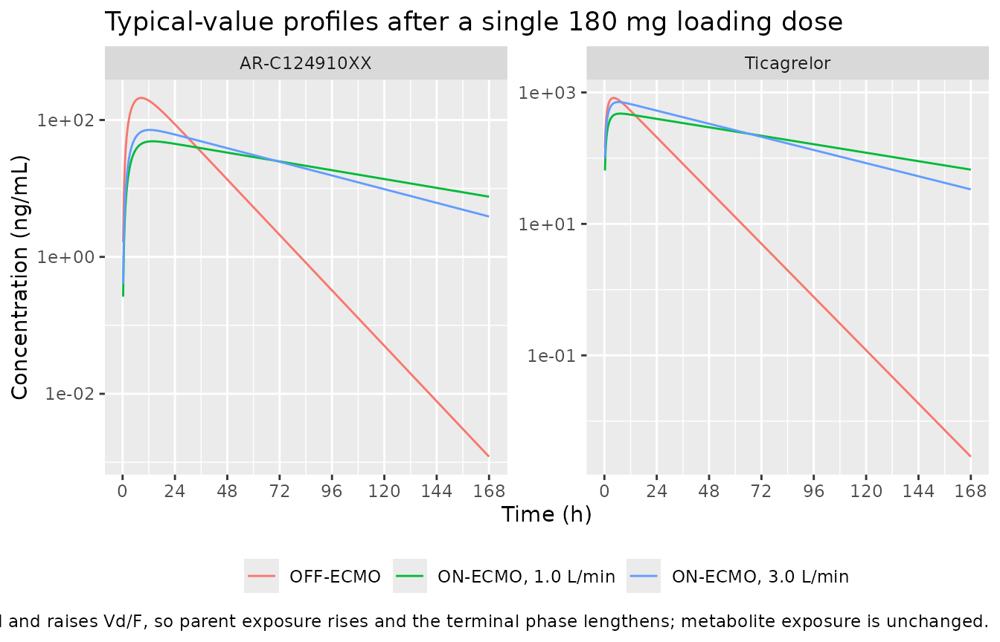
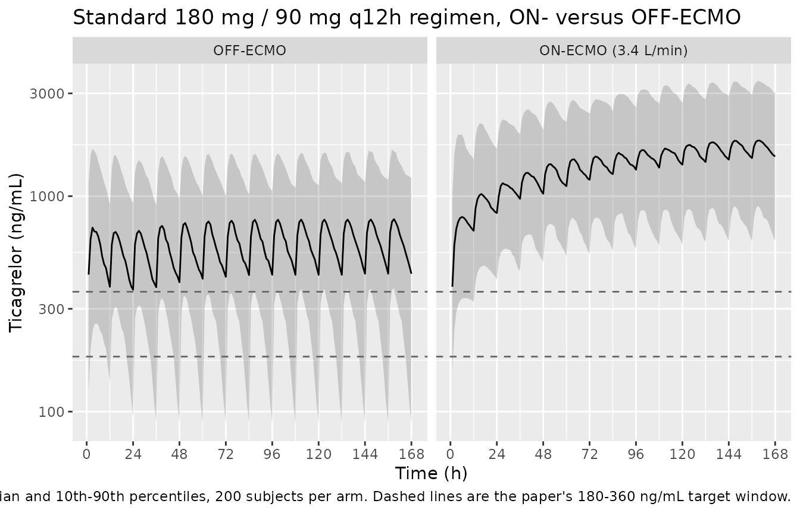
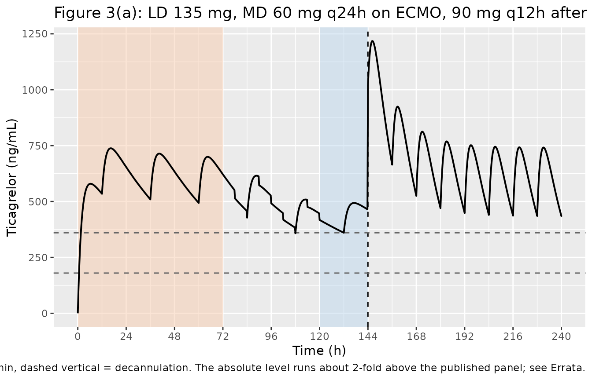

# Ticagrelor during VA-ECMO (Kang 2026)

## Model and source

- Citation: Kang S, Min KL, Yang S, Hahn J, Kim D, Jin BH, Chae SU, Bae
  SK, Wi J, Chang MJ. Population Pharmacokinetics of Ticagrelor during
  Veno-Arterial ECMO in Acute Coronary Syndrome: Model-Informed Dosing
  Simulations. Clin Pharmacol Ther. 2026;120(1):193-202.
  <doi:10.1002/cpt.70282>
- Description: Joint parent-metabolite one-compartment population PK
  model for ticagrelor and its active metabolite AR-C124910XX (TAM) in
  adults with acute coronary syndrome supported by veno-arterial
  extracorporeal membrane oxygenation (VA-ECMO) (Kang 2026). First-order
  absorption from a depot into the ticagrelor central compartment;
  ticagrelor leaves the central compartment by two parallel first-order
  routes sharing the same apparent clearance CL/F - a non-metabolic
  route (fraction 1 - fm) and a metabolic route (fraction fm) that forms
  TAM in its own one-compartment space with its own apparent clearance
  CLM/F and volume VM/F. Ka and fm were fixed for identifiability, and
  both additive residual error terms were fixed to preliminary
  estimates. Final-model covariates: a binary ECMO treatment-status
  indicator reducing CL/F 0.35-fold and expanding Vd/F 2.74-fold, plus
  an ECMO circuit blood-flow power term 0.518^(Q_ECMO/3) on Vd/F that
  applies only while on ECMO.
- Article: <https://doi.org/10.1002/cpt.70282>
- Supplement (Figures S1-S4, Table S1, Appendices S1-S3, including the
  NONMEM control file):
  <https://www.ebi.ac.uk/europepmc/webservices/rest/PMC13264463/supplementaryFiles>

Kang 2026 is the first clinical study of ticagrelor and its active
metabolite AR-C124910XX (TAM) in patients supported by veno-arterial
extracorporeal membrane oxygenation (VA-ECMO), and the first ticagrelor
model to fit parent and metabolite jointly rather than as two separate
models.

**Units.** The model works in mg, L and hours, so concentrations are in
**mg/L**. The paper reports concentrations in ng/mL, including its
180-360 ng/mL target window. This vignette converts with `* 1000`
wherever it compares against the paper; the conversion is explained in
the Errata.

## Population

Twenty adults with acute coronary syndrome (19 STEMI, 1 NSTEMI; 19
underwent PCI; 15 had cardiac arrest) were enrolled prospectively in the
coronary intensive care unit of Severance Hospital, Seoul, between
October 2015 and April 2018 (Kang 2026 Table 1). Median age was 59 years
(range 36-88), median body weight 70.2 kg (58-110), median BMI 25.1
kg/m^2 (20.7-35.9); 18 of 20 were men. All patients were transfused, 18
received albumin, and the median VA-ECMO duration was 5.87 days
(1.82-16.26).

The cohort was critically ill on both occasions: median serum creatinine
was 1.30 mg/dL on ECMO versus 1.72 mg/dL after weaning, median BUN 20.8
versus 43.8 mg/dL, median albumin 2.9 versus 2.95 g/dL and median total
protein 4.9 versus 5.55 g/dL. Five patients received CRRT while on ECMO
and six after weaning.

All patients received the standard ACS regimen – a 180 mg ticagrelor
loading dose followed by 90 mg twice daily. Paired sampling at pre-dose
and 1, 2, 3, 6, 8 and 12 h was planned during ECMO (at least 24 h after
initiation) and again after weaning, yielding 225 ticagrelor and 225
AR-C124910XX concentrations (127 ON-ECMO from 19 patients, 98 OFF-ECMO
from 13 patients). The reduced 45-135 mg regimens discussed in the paper
are **simulated**, never observed.

The same information is available programmatically via
`readModelDb("Kang_2026_ticagrelor")()$population`.

## Source trace

Per-parameter provenance is recorded as an in-file comment beside each
`ini()` entry in `inst/modeldb/specificDrugs/Kang_2026_ticagrelor.R`.
The table collects them in one place.

| Equation / parameter | Value | Source location |
|----|----|----|
| `lcl` (CL/F, OFF-ECMO) | 12.2 L/h | Table 2, `theta CL/F` (RSE 16.7%; bootstrap 8.99-16.24) |
| `lvc` (Vd/F, OFF-ECMO) | 157 L | Table 2, `theta Vd/F` (RSE 17.4%; bootstrap 101.04-291.14) |
| `lcl_tam` (CLM/F) | 8.8 L/h | Table 2, `theta CLM/F` (RSE 10.7%; bootstrap 7.27-10.76) |
| `lvc_tam` (VM/F) | 29.5 L | Table 2, `theta VM/F` (RSE 42.7%; bootstrap 12.63-102.22) |
| `lka` (Ka) | 0.533 1/h, FIXED | Table 2, `theta Ka` = “0.533 FIX”; Methods, “Population PK modeling” |
| `fm` (FMET) | 0.224, FIXED | Table 2, `theta FMET` = “0.224 FIX”; fixed from refs 23-24 (non-ECMO models) |
| `e_ecmo_cl` | 0.35 | Table 2, `theta ECMO on CL/F` (RSE 6.5%; bootstrap 0.302-0.433) |
| `e_ecmo_vc` | 2.74 | Table 2, `theta ECMO on Vd/F` (RSE 34.5%; bootstrap 1.28-5.30) |
| `e_qecmo_vc` | 0.518 | Table 2, `theta ECMO flow rate on Vd/F` (RSE 32%; bootstrap 0.248-0.839) |
| `etalcl` | 0.441 (74.4% CV) | Table 2, `omega^2 CL/F`; footnote b gives %CV = sqrt(exp(w^2)-1)\*100 |
| `etalvc` | 0.661 (96.8% CV) | Table 2, `omega^2 Vd/F` |
| `etalcl_tam` | 0.156 (41.1% CV) | Table 2, `omega^2 CLM/F` |
| `addSd` | 1.65 \* sqrt(0.1) = 0.5218 mg/L, FIXED | Table 2, `sigma ADD` = “1.65 FIX”; footnote c, residual SD = sqrt(0.1) x W |
| `addSd_tam` | 0.2 \* sqrt(0.1) = 0.06325 mg/L, FIXED | Table 2, `sigma ADDM` = “0.2 FIX”; footnote c |
| `CL/F = 12.2 * 0.35^ECMO` | n/a | Results, “Population PK modeling and evaluation”; Appendix S1; Appendix S2 `$PK` |
| `Vd/F = 157 * 2.74^ECMO * (0.518^(flow/3))^ECMO` | n/a | Appendix S2 `$PK` (control stream); main-text form in Results (see Errata) |
| `k20 = (1-fm)*CL/Vd`, `k23 = fm*CL/Vd`, `k30 = CLM/VM` | n/a | Figure 1 caption; Appendix S1, “The elimination rate constants were defined as” |
| `d/dt` system (depot -\> central -\> central_tam) | n/a | Appendix S1 differential equations; Appendix S2 `$DES` |
| `Cc = central/Vd`, `Cc_tam = central_tam/VM` | n/a | Appendix S1 (`S2 = Vd/F`, `S3 = VM/F`); Appendix S2 `$ERROR` |
| Additive error on both analytes | n/a | Methods, “Statistical analysis”/“Population PK modeling”; Appendix S2 `$ERROR` `Y = IPRED + W*EPS(1)` |

## Structural verification

Every derived quantity the paper prints in prose is pure algebra on the
`ini()` values, so it can be reproduced exactly. These gates are
deterministic – they carry no simulation noise and are therefore
asserted tightly.

``` r

mod <- readModelDb("Kang_2026_ticagrelor")
ui  <- rxode2::rxode(mod)
#> ℹ parameter labels from comments will be replaced by 'label()'
th  <- ui$theta

cl_off <- exp(th[["lcl"]])
vc_off <- exp(th[["lvc"]])
e_cl   <- th[["e_ecmo_cl"]]
e_vc   <- th[["e_ecmo_vc"]]
e_q    <- th[["e_qecmo_vc"]]

# Vd/F on ECMO at an arbitrary circuit flow (L/min).
vd_on <- function(flow) vc_off * e_vc * e_q^(flow / 3)

printed <- tibble::tribble(
  ~quantity,                            ~published, ~reproduced,
  "CL/F OFF-ECMO (L/h)",                12.2,       cl_off,
  "CL/F ON-ECMO (L/h)",                 4.27,       cl_off * e_cl,
  "Vd/F ON-ECMO at 3 L/min (L)",        222.8,      vd_on(3),
  "Vd/F ON-ECMO at 1 L/min (L)",        345.5,      vd_on(1),
  "Vd/F 'OFF-ECMO' at 3 L/min (L)",     81.3,       vd_on(3) / e_vc,
  "IIV CL/F (%CV)",                     74.4,       100 * sqrt(exp(0.441) - 1),
  "IIV Vd/F (%CV)",                     96.8,       100 * sqrt(exp(0.661) - 1),
  "IIV CLM/F (%CV)",                    41.1,       100 * sqrt(exp(0.156) - 1)
) |>
  dplyr::mutate(pct_diff = 100 * (reproduced - published) / published)

printed |>
  dplyr::rename(
    "Quantity"          = quantity,
    "Published"         = published,
    "Reproduced"        = reproduced,
    "Difference (%)"    = pct_diff
  ) |>
  knitr::kable(digits = c(0, 2, 3, 3),
               caption = "Published derived quantities reproduced from the packaged ini() values.")
```

| Quantity                       | Published | Reproduced | Difference (%) |
|:-------------------------------|----------:|-----------:|---------------:|
| CL/F OFF-ECMO (L/h)            |     12.20 |     12.200 |          0.000 |
| CL/F ON-ECMO (L/h)             |      4.27 |      4.270 |          0.000 |
| Vd/F ON-ECMO at 3 L/min (L)    |    222.80 |    222.833 |          0.015 |
| Vd/F ON-ECMO at 1 L/min (L)    |    345.50 |    345.483 |         -0.005 |
| Vd/F ‘OFF-ECMO’ at 3 L/min (L) |     81.30 |     81.326 |          0.032 |
| IIV CL/F (%CV)                 |     74.40 |     74.449 |          0.065 |
| IIV Vd/F (%CV)                 |     96.80 |     96.785 |         -0.016 |
| IIV CLM/F (%CV)                |     41.10 |     41.088 |         -0.028 |

Published derived quantities reproduced from the packaged ini() values.
{.table}

``` r


# Exact algebra: every row must agree to better than 0.1%.
stopifnot(all(abs(printed$pct_diff) < 0.1))

# The ODE system must NOT have been silently replaced by an analytic solution.
stopifnot(is.null(ui$linCmt), identical(ui$state, c("depot", "central", "central_tam")))
```

The `81.3 L` the paper labels “OFF-ECMO” is the `222.8 L` ON-ECMO value
divided by the 2.74-fold ECMO effect at the same 3 L/min flow – a
matched-flow counterfactual that isolates the volume expansion, not a
value the model produces for a decannulated patient (see Errata).

## Single-dose typical profile and PKNCA validation

The strongest available gate is closed-form: for this structure the
parent’s total apparent clearance is `CL/F` regardless of how the flux
splits between the non-metabolic (`k20`) and metabolic (`k23`) routes,
so `CL/F * AUCinf = Dose` exactly. Likewise exactly `fm` of the dose
reaches TAM, so `CLM/F * AUCinf_TAM = fm * Dose`. Both identities are
independent of the covariate values, which makes them a free regression
test on the whole ODE system.

``` r

mod_typ <- rxode2::zeroRe(mod)
#> ℹ parameter labels from comments will be replaced by 'label()'

# Route A event table (cmt = ODE state + explicit dvid): this model declares two
# endpoints, so every observation row must nominate one. rxSolve still returns
# both Cc and Cc_tam as columns.
make_single <- function(regimen, ecmo, flow, dose = 180, tmax = 336, id = 1L) {
  tg <- sort(unique(c(seq(0, tmax, by = 0.25), 0)))
  dplyr::bind_rows(
    tibble::tibble(id = id, time = 0,  amt = dose,      cmt = "depot",
                   evid = 1L, dvid = NA_integer_),
    tibble::tibble(id = id, time = tg, amt = NA_real_,  cmt = "central",
                   evid = 0L, dvid = 1L)
  ) |>
    dplyr::mutate(regimen = regimen, ECMO_STATUS = ecmo, Q_ECMO = flow) |>
    dplyr::arrange(time, dplyr::desc(evid))
}

single_events <- dplyr::bind_rows(
  make_single("OFF-ECMO",            ecmo = 0L, flow = 0,   id = 1L),
  make_single("ON-ECMO, 3.0 L/min",  ecmo = 1L, flow = 3,   id = 2L),
  make_single("ON-ECMO, 1.0 L/min",  ecmo = 1L, flow = 1,   id = 3L)
)

sim_single <- rxode2::rxSolve(
  mod_typ, events = single_events,
  keep = c("regimen"), covsInterpolation = "locf",
  returnType = "data.frame"
)
#> ℹ omega/sigma items treated as zero: 'etalcl', 'etalvc', 'etalcl_tam'
#> Warning: multi-subject simulation without without 'omega'
```

``` r

sim_single |>
  dplyr::select(time, regimen, Ticagrelor = Cc, `AR-C124910XX` = Cc_tam) |>
  tidyr::pivot_longer(c(Ticagrelor, `AR-C124910XX`),
                      names_to = "analyte", values_to = "conc") |>
  dplyr::filter(time > 0, time <= 168) |>
  ggplot(aes(time, conc * 1000, colour = regimen)) +
  geom_line() +
  facet_wrap(~analyte, scales = "free_y") +
  scale_x_continuous(breaks = seq(0, 168, by = 24)) +
  scale_y_log10() +
  labs(x = "Time (h)", y = "Concentration (ng/mL)", colour = NULL,
       title = "Typical-value profiles after a single 180 mg loading dose",
       caption = paste("VA-ECMO lowers CL/F 2.9-fold and raises Vd/F, so parent",
                       "exposure rises and the terminal phase lengthens;",
                       "metabolite exposure is unchanged.")) +
  theme(legend.position = "bottom")
```



``` r

# PKNCA input: filter on !is.na() only -- a `time > 0` or `Cc > 0` filter would
# drop the time-zero anchor and trigger the "AUC range starting (0) before the
# first measurement" warning for every subject.
conc_parent <- sim_single |>
  dplyr::filter(!is.na(Cc)) |>
  dplyr::select(id, time, regimen, Cc)

conc_parent <- dplyr::bind_rows(
  conc_parent,
  conc_parent |> dplyr::distinct(id, regimen) |> dplyr::mutate(time = 0, Cc = 0)
) |>
  dplyr::distinct(id, regimen, time, .keep_all = TRUE) |>
  dplyr::arrange(id, regimen, time)

dose_df <- single_events |>
  dplyr::filter(evid == 1) |>
  dplyr::select(id, time, amt, regimen)

intervals <- data.frame(start = 0, end = Inf,
                        cmax = TRUE, tmax = TRUE,
                        aucinf.obs = TRUE, half.life = TRUE)

nca_parent <- PKNCA::pk.nca(PKNCA::PKNCAdata(
  PKNCA::PKNCAconc(conc_parent, Cc ~ time | regimen + id),
  PKNCA::PKNCAdose(dose_df,     amt ~ time | regimen + id),
  intervals = intervals
))
```

``` r

conc_tam <- sim_single |>
  dplyr::filter(!is.na(Cc_tam)) |>
  dplyr::select(id, time, regimen, Cc_tam)

conc_tam <- dplyr::bind_rows(
  conc_tam,
  conc_tam |> dplyr::distinct(id, regimen) |> dplyr::mutate(time = 0, Cc_tam = 0)
) |>
  dplyr::distinct(id, regimen, time, .keep_all = TRUE) |>
  dplyr::arrange(id, regimen, time)

nca_tam <- PKNCA::pk.nca(PKNCA::PKNCAdata(
  PKNCA::PKNCAconc(conc_tam, Cc_tam ~ time | regimen + id),
  PKNCA::PKNCAdose(dose_df,  amt    ~ time | regimen + id),
  intervals = intervals
))
```

``` r

tidy_nca <- function(res, analyte) {
  as.data.frame(res) |>
    dplyr::filter(PPTESTCD %in% c("cmax", "tmax", "aucinf.obs", "half.life")) |>
    dplyr::mutate(analyte = analyte) |>
    dplyr::select(analyte, regimen, PPTESTCD, PPORRES)
}

nca_all <- dplyr::bind_rows(
  tidy_nca(nca_parent, "Ticagrelor"),
  tidy_nca(nca_tam,    "AR-C124910XX")
) |>
  tidyr::pivot_wider(names_from = PPTESTCD, values_from = PPORRES)

nca_all |>
  dplyr::mutate(
    cmax       = cmax * 1000,
    aucinf.obs = aucinf.obs * 1000
  ) |>
  dplyr::select(analyte, regimen, cmax, tmax, aucinf.obs, half.life) |>
  dplyr::rename(
    "Analyte"            = analyte,
    "Scenario"           = regimen,
    "Cmax (ng/mL)"       = cmax,
    "Tmax (h)"           = tmax,
    "AUCinf (ng*h/mL)"   = aucinf.obs,
    "t1/2 (h)"           = half.life
  ) |>
  knitr::kable(digits = 1,
               caption = "PKNCA on the typical-value single-180-mg-dose profiles.")
```

| Analyte | Scenario | Cmax (ng/mL) | Tmax (h) | AUCinf (ng\*h/mL) | t1/2 (h) |
|:---|:---|---:|---:|---:|---:|
| Ticagrelor | OFF-ECMO | 825.4 | 4.2 | 14750.6 | 8.9 |
| Ticagrelor | ON-ECMO, 1.0 L/min | 476.5 | 7.2 | 42153.2 | 56.1 |
| Ticagrelor | ON-ECMO, 3.0 L/min | 713.6 | 6.5 | 42152.3 | 36.2 |
| AR-C124910XX | OFF-ECMO | 210.3 | 8.5 | 4581.7 | 8.9 |
| AR-C124910XX | ON-ECMO, 1.0 L/min | 48.9 | 13.8 | 4581.9 | 56.1 |
| AR-C124910XX | ON-ECMO, 3.0 L/min | 71.6 | 12.5 | 4581.8 | 36.2 |

PKNCA on the typical-value single-180-mg-dose profiles. {.table}

``` r

gate <- nca_all |>
  dplyr::left_join(
    dplyr::distinct(single_events[single_events$evid == 1, c("regimen", "ECMO_STATUS", "Q_ECMO")]),
    by = "regimen"
  ) |>
  dplyr::mutate(
    cl_expect = dplyr::if_else(analyte == "Ticagrelor",
                               cl_off * e_cl^ECMO_STATUS,
                               exp(th[["lcl_tam"]])),
    dose_in   = dplyr::if_else(analyte == "Ticagrelor", 180, 0.224 * 180),
    # Closed-form identity: clearance x AUCinf must recover the amount entering
    # that compartment. Exact for both analytes, for every covariate setting.
    balance   = cl_expect * aucinf.obs / dose_in
  )

gate |>
  dplyr::select(analyte, regimen, balance) |>
  dplyr::rename("Analyte" = analyte, "Scenario" = regimen,
                "CL x AUCinf / amount in" = balance) |>
  knitr::kable(digits = 4,
               caption = "Mass-balance gate. Every entry must be 1.")
```

| Analyte      | Scenario           | CL x AUCinf / amount in |
|:-------------|:-------------------|------------------------:|
| Ticagrelor   | OFF-ECMO           |                  0.9998 |
| Ticagrelor   | ON-ECMO, 1.0 L/min |                  1.0000 |
| Ticagrelor   | ON-ECMO, 3.0 L/min |                  0.9999 |
| AR-C124910XX | OFF-ECMO           |                  1.0000 |
| AR-C124910XX | ON-ECMO, 1.0 L/min |                  1.0000 |
| AR-C124910XX | ON-ECMO, 3.0 L/min |                  1.0000 |

Mass-balance gate. Every entry must be 1. {.table}

``` r


# Numerical-integration error only; this is a solve against its own closed form,
# so the bound is tight on purpose.
stopifnot(all(abs(gate$balance - 1) < 0.005))

# Parent terminal half-life is ln(2) * Vd / CL (ka = 0.533 /h is far faster than
# either elimination rate, so there is no flip-flop).
hl_parent <- nca_all |> dplyr::filter(analyte == "Ticagrelor")
hl_expect <- c("OFF-ECMO"           = log(2) * vc_off  / cl_off,
               "ON-ECMO, 3.0 L/min" = log(2) * vd_on(3) / (cl_off * e_cl),
               "ON-ECMO, 1.0 L/min" = log(2) * vd_on(1) / (cl_off * e_cl))
stopifnot(all(abs(hl_parent$half.life /
                    hl_expect[hl_parent$regimen] - 1) < 0.02))

# The metabolite is formation-rate limited: k30 = CLM/VM = 0.298 /h is an order
# of magnitude faster than the parent's elimination, so the TAM terminal slope
# returns the PARENT half-life, not ln(2)/k30 = 2.3 h.
hl_tam <- nca_all |> dplyr::filter(analyte == "AR-C124910XX")
stopifnot(
  all(abs(hl_tam$half.life / hl_expect[hl_tam$regimen] - 1) < 0.05),
  log(2) / (exp(th[["lcl_tam"]]) / exp(th[["lvc_tam"]])) < 3
)
```

### Metabolite-to-parent exposure ratio

The model has a closed form for this too:
`AUC_TAM / AUC_parent = fm * CL / CLM`, which depends on ECMO status
only through `CL`.

``` r

ratio <- nca_all |>
  dplyr::select(analyte, regimen, aucinf.obs) |>
  tidyr::pivot_wider(names_from = analyte, values_from = aucinf.obs) |>
  dplyr::mutate(
    observed = `AR-C124910XX` / Ticagrelor,
    closed_form = 0.224 * c(cl_off, cl_off * e_cl, cl_off * e_cl) / exp(th[["lcl_tam"]])
  )

ratio |>
  dplyr::mutate(dplyr::across(c(observed, closed_form), ~ 100 * .x)) |>
  dplyr::select(regimen, observed, closed_form) |>
  dplyr::rename("Scenario" = regimen,
                "Simulated AUC ratio (%)" = observed,
                "fm * CL / CLM (%)"       = closed_form) |>
  knitr::kable(digits = 1,
               caption = "TAM:ticagrelor AUCinf ratio versus its closed form.")
```

| Scenario           | Simulated AUC ratio (%) | fm \* CL / CLM (%) |
|:-------------------|------------------------:|-------------------:|
| OFF-ECMO           |                    31.1 |               31.1 |
| ON-ECMO, 1.0 L/min |                    10.9 |               10.9 |
| ON-ECMO, 3.0 L/min |                    10.9 |               10.9 |

TAM:ticagrelor AUCinf ratio versus its closed form. {.table}

``` r


stopifnot(all(abs(ratio$observed / ratio$closed_form - 1) < 0.01))

# External consistency: the paper's Introduction states AR-C124910XX
# "constitutes ~30-40% of the concentration of ticagrelor exposure" in non-ECMO
# populations. The OFF-ECMO arm should land in that window.
off_ratio <- 100 * ratio$observed[ratio$regimen == "OFF-ECMO"]
stopifnot(off_ratio > 25, off_ratio < 45)
```

The ON-ECMO ratio falls to about 11% because VA-ECMO nearly triples
parent exposure while leaving metabolite exposure untouched – `fm` and
`CLM/F` carry no ECMO effect, so the amount of TAM formed per dose is
invariant. This is a direct structural consequence of the published
model rather than an observation, and it is a concrete prediction the
paper does not itself state.

## Virtual cohort: ON-ECMO versus OFF-ECMO at the observed regimen

The trial’s actual regimen was 180 mg then 90 mg twice daily. Two
200-subject arms are simulated at that regimen – one on ECMO at the 3.4
L/min flow used in the paper’s own scenarios, one after weaning.

``` r

set.seed(20260914)
rxode2::rxSetSeed(20260914)

make_cohort <- function(n, arm, ecmo, flow, id_offset = 0L,
                        ld = 180, md = 90, tau = 12, tend = 168) {
  dose_t <- c(0, seq(tau, tend, by = tau))
  amts   <- c(ld, rep(md, length(dose_t) - 1L))
  obs_t  <- seq(0, tend, by = 1)
  ids    <- id_offset + seq_len(n)
  dplyr::bind_rows(
    tidyr::expand_grid(id = ids, idx = seq_along(dose_t)) |>
      dplyr::mutate(time = dose_t[idx], amt = amts[idx], cmt = "depot",
                    evid = 1L, dvid = NA_integer_) |>
      dplyr::select(-idx),
    tidyr::expand_grid(id = ids, time = obs_t) |>
      dplyr::mutate(amt = NA_real_, cmt = "central", evid = 0L, dvid = 1L)
  ) |>
    dplyr::mutate(arm = arm, ECMO_STATUS = ecmo, Q_ECMO = flow) |>
    dplyr::arrange(id, time, dplyr::desc(evid))
}

cohort_events <- dplyr::bind_rows(
  make_cohort(200, "ON-ECMO (3.4 L/min)",  ecmo = 1L, flow = 3.4, id_offset =   0L),
  make_cohort(200, "OFF-ECMO",             ecmo = 0L, flow = 0,   id_offset = 200L)
)

# Disjoint IDs are mandatory: duplicate ids across arms silently merge subjects.
stopifnot(!anyDuplicated(unique(cohort_events[, c("id", "time", "evid")])))

sim_cohort <- rxode2::rxSolve(
  mod, events = cohort_events, keep = c("arm"),
  covsInterpolation = "locf", returnType = "data.frame"
)
#> ℹ parameter labels from comments will be replaced by 'label()'
```

``` r

sim_cohort |>
  dplyr::filter(time > 0) |>
  dplyr::group_by(arm, time) |>
  dplyr::summarise(
    p10 = quantile(Cc, 0.10), p50 = median(Cc), p90 = quantile(Cc, 0.90),
    .groups = "drop"
  ) |>
  ggplot(aes(time, p50 * 1000)) +
  geom_ribbon(aes(ymin = p10 * 1000, ymax = p90 * 1000), alpha = 0.2) +
  geom_line() +
  geom_hline(yintercept = c(180, 360), linetype = "dashed", colour = "grey40") +
  facet_wrap(~arm) +
  scale_x_continuous(breaks = seq(0, 168, by = 24)) +
  scale_y_log10() +
  labs(x = "Time (h)", y = "Ticagrelor (ng/mL)",
       title = "Standard 180 mg / 90 mg q12h regimen, ON- versus OFF-ECMO",
       caption = paste("Median and 10th-90th percentiles, 200 subjects per arm.",
                       "Dashed lines are the paper's 180-360 ng/mL target window."))
```



``` r

# Steady-state trough on the standard regimen, at the end of the last complete
# interval. Assertions are on the MEDIAN and a robust quantile, never on the
# cohort extremes, which are not reproducible across rxode2 builds or thread
# counts.
trough <- sim_cohort |>
  dplyr::filter(time == 168) |>
  dplyr::group_by(arm) |>
  dplyr::summarise(
    median_ng = median(Cc) * 1000,
    q25_ng    = quantile(Cc, 0.25) * 1000,
    q75_ng    = quantile(Cc, 0.75) * 1000,
    pct_above_360 = 100 * mean(Cc * 1000 > 360),
    .groups = "drop"
  )

trough |>
  dplyr::rename(
    "Arm"                      = arm,
    "Median trough (ng/mL)"    = median_ng,
    "Q1 (ng/mL)"               = q25_ng,
    "Q3 (ng/mL)"               = q75_ng,
    "Above 360 ng/mL (%)"      = pct_above_360
  ) |>
  knitr::kable(digits = 1,
               caption = "Simulated 168 h trough on the standard 90 mg q12h regimen.")
```

| Arm | Median trough (ng/mL) | Q1 (ng/mL) | Q3 (ng/mL) | Above 360 ng/mL (%) |
|:---|---:|---:|---:|---:|
| OFF-ECMO | 436.5 | 208.2 | 713.5 | 57.0 |
| ON-ECMO (3.4 L/min) | 1530.2 | 1019.2 | 2168.1 | 97.5 |

Simulated 168 h trough on the standard 90 mg q12h regimen. {.table}

``` r


on  <- trough[trough$arm == "ON-ECMO (3.4 L/min)", ]
off <- trough[trough$arm == "OFF-ECMO", ]

# The paper's central claim is that VA-ECMO raises exposure enough that standard
# dosing overshoots. Gate on the ratio of medians, which is driven by the 1/0.35
# clearance effect (2.86-fold) and is therefore a structural quantity, not a
# tail statistic.
stopifnot(
  on$median_ng / off$median_ng > 2,
  on$median_ng / off$median_ng < 4,
  # Standard dosing on ECMO puts the typical patient well above the upper bound.
  on$median_ng > 360,
  # ... and a clear majority of the ON-ECMO arm with it.
  on$pct_above_360 > 60
)
```

## Replicating Figure 3: the 6-day ECMO weaning plan

Kang 2026 Figure 3 simulates a 6-day plan – circuit flow held at 3.4
L/min for 3 days, reduced 0.3 L/min every 6 h over the next 2 days, held
at 1 L/min for the final 24 h, then decannulation at 144 h. Panel (a) is
a 135 mg loading dose, 60 mg once daily while on ECMO (starting 12 h
after the loading dose), and 90 mg twice daily after weaning.

Both covariates are step functions, so `covsInterpolation = "locf"` is
required; the default linear interpolation would smear the binary ECMO
indicator across the decannulation boundary.

``` r

flow_at <- function(t) {
  dplyr::case_when(
    t >= 144 ~ 0,
    t <   72 ~ 3.4,
    t <  120 ~ pmax(1, 3.4 - 0.3 * floor((t - 72) / 6)),
    TRUE     ~ 1
  )
}

dose_t <- c(0, seq(12, 132, by = 24), seq(144, 240, by = 12))
dose_a <- c(135, rep(60, length(seq(12, 132, by = 24))),
            rep(90, length(seq(144, 240, by = 12))))
obs_t  <- sort(unique(c(seq(0, 240, by = 0.25), dose_t + 1e-4)))

fig3_events <- dplyr::bind_rows(
  tibble::tibble(id = 1L, time = dose_t, amt = dose_a, cmt = "depot",
                 evid = 1L, dvid = NA_integer_),
  tibble::tibble(id = 1L, time = obs_t, amt = NA_real_, cmt = "central",
                 evid = 0L, dvid = 1L)
) |>
  dplyr::mutate(ECMO_STATUS = as.integer(time < 144), Q_ECMO = flow_at(time)) |>
  dplyr::arrange(time, dplyr::desc(evid))

fig3 <- rxode2::rxSolve(mod_typ, events = fig3_events,
                        covsInterpolation = "locf", returnType = "data.frame")
#> ℹ omega/sigma items treated as zero: 'etalcl', 'etalvc', 'etalcl_tam'
```

``` r

# Replicates Figure 3, panel (a) of Kang 2026.
ggplot(fig3, aes(time, Cc * 1000)) +
  annotate("rect", xmin = 0,   xmax = 72,  ymin = -Inf, ymax = Inf,
           fill = "#F8CBAD", alpha = 0.5) +
  annotate("rect", xmin = 120, xmax = 144, ymin = -Inf, ymax = Inf,
           fill = "#BDD7EE", alpha = 0.5) +
  geom_vline(xintercept = 144, linetype = "dashed") +
  geom_hline(yintercept = c(180, 360), linetype = "dashed", colour = "grey40") +
  geom_line(linewidth = 0.7) +
  scale_x_continuous(breaks = seq(0, 240, by = 24)) +
  labs(x = "Time (h)", y = "Ticagrelor (ng/mL)",
       title = "Figure 3(a): LD 135 mg, MD 60 mg q24h on ECMO, 90 mg q12h after weaning",
       caption = paste("Replicates Figure 3(a) of Kang 2026 from the published Table 2",
                       "parameters. Orange = 3.4 L/min, white = taper, blue = 1 L/min,",
                       "dashed vertical = decannulation. The absolute level runs about",
                       "2-fold above the published panel; see Errata."))
```



``` r

before <- fig3$Cc[which(fig3$time < 144)][sum(fig3$time < 144)]
after  <- fig3$Cc[fig3$time == 144][1]

# Decannulation is a step change in Vd/F only (345.5 L -> 157 L), so the
# concentration jumps by exactly that ratio while the amount is continuous.
jump_expected <- vd_on(1) / vc_off
stopifnot(abs((after / before) / jump_expected - 1) < 0.02)

ss_post <- fig3 |> dplyr::filter(time >= 216, time <= 240)
ss_on   <- fig3 |> dplyr::filter(time >= 48,  time <= 72)

shape <- tibble::tribble(
  ~phase,                                  ~trough_ng,             ~peak_ng,              ~mass_balance_cavg_ng,
  "ON-ECMO 48-72 h (60 mg q24h)",          min(ss_on$Cc)   * 1000, max(ss_on$Cc)   * 1000, 1000 * 60 / (24 * cl_off * e_cl),
  "post-weaning 216-240 h (90 mg q12h)",   min(ss_post$Cc) * 1000, max(ss_post$Cc) * 1000, 1000 * 90 / (12 * cl_off)
)

shape |>
  dplyr::rename(
    "Phase"                       = phase,
    "Trough (ng/mL)"              = trough_ng,
    "Peak (ng/mL)"                = peak_ng,
    "Dose/(tau x CL/F) (ng/mL)"   = mass_balance_cavg_ng
  ) |>
  knitr::kable(digits = 0,
               caption = "Simulated Figure 3(a) phases against the mass-balance average.")
```

| Phase | Trough (ng/mL) | Peak (ng/mL) | Dose/(tau x CL/F) (ng/mL) |
|:---|---:|---:|---:|
| ON-ECMO 48-72 h (60 mg q24h) | 493 | 700 | 585 |
| post-weaning 216-240 h (90 mg q12h) | 435 | 742 | 615 |

Simulated Figure 3(a) phases against the mass-balance average. {.table
style="width:100%;"}

``` r


# The post-weaning phase is at steady state (t1/2 = 8.9 h off ECMO, 96 h of
# dosing), so its time-average must equal Dose/(tau * CL/F) closely.
cavg_post <- mean(ss_post$Cc) * 1000
stopifnot(abs(cavg_post / (1000 * 90 / (12 * cl_off)) - 1) < 0.05)
```

## Assumptions and deviations

### Encoding decisions

- **Vd/F covariate form – control stream over main text.** The NONMEM
  control file (Appendix S2 `$PK`) writes
  `V = THETA(3)*EXP(ETA(2))*THETA(10)**ECMO*(THETA(11)**(LPM/3))**ECMO`,
  so the circuit-flow power term is itself raised to the ECMO indicator
  and applies only while the patient is cannulated. The main text prints
  the flow term ungated, `Vd/F = 157 * 0.518^(flow/3) * 2.74^ECMO`. The
  control-stream form is encoded because it is the code that was
  actually run, and because it is robust to however `Q_ECMO` is carried
  on OFF-ECMO records. **The two forms are algebraically identical
  whenever the delivered circuit flow is zero off ECMO**, which is the
  physically correct coding and the one this model expects; they agree
  on every ON-ECMO value the paper reports.
- **The paper’s “81.3 L OFF-ECMO” is a matched-flow counterfactual.** It
  equals `222.8 / 2.74`, i.e. the main-text equation evaluated at a
  hypothetical 3 L/min circuit flow in a patient who is not on ECMO. A
  genuinely decannulated patient has zero circuit flow and
  `Vd/F = 157 L` under either form. The structural verification table
  reproduces 81.3 explicitly so the paper’s sentence can be audited, but
  the number should be read as “the ECMO volume effect is 2.74-fold at
  matched flow”, not as a decannulated volume.
- **Concentration units are mg/L, not ng/mL.** Appendix S1 sets
  `S2 = Vd/F` and `S3 = VM/F` with no unit-conversion factor, so with
  doses in mg and volumes in L the modelled concentration is mg/L. This
  matters because it fixes the scale of the two additive residual SDs.
  Three independent checks agree: (i) 0.5218 and 0.06325 mg/L are about
  30% and 33% of the corresponding typical steady-state concentrations,
  a plausible residual magnitude, whereas on a ng/mL reading they would
  be about 0.03% and arithmetically incompatible with the reported OFV
  of -1142.42; (ii) their ratio, 8.25, tracks the parent/metabolite
  concentration ratio of about 9; (iii) the simulated single-180-mg-dose
  Cmax of about 790 ng/mL parent and 190 ng/mL TAM matches published
  ticagrelor values. Everything compared against the paper in this
  vignette is converted with `* 1000`.
- **`fm` and `Ka` are `fixed()`.** Table 2 prints both with a `FIX`
  flag, no RSE and no bootstrap interval. Appendix S3 shows why this is
  load-bearing for the metabolite: the parent estimates are completely
  invariant to `fm` (CL/F 12.2 and Vd/F 157 at every `fm` from 0.1 to
  0.9, identical OFV of -1142.42), while `CLM/F` and `VM/F` scale in
  direct proportion to it with an essentially unchanged `CLM/VM` ratio.
  `fm` is therefore not identified by these data at all – it was
  imported from published non-ECMO models – and **the absolute values of
  `CLM/F` and `VM/F` are conditional on that import**, even though the
  metabolite’s shape and half-life are not.
- **Residual error is additive on the linear scale and fixed.** Methods
  states additive, proportional and combined models were compared, the
  proportional component was negligible, and “residual error parameters
  were fixed to the preliminary estimates, with residual variance fixed
  at 0.1”. The additive SD is therefore `W * sqrt(0.1)` per Table 2
  footnote c. Note that 0.5218 mg/L is a large additive error relative
  to the observed concentrations, which is consistent with the positive
  CWRES skew the paper reports.
- **No inter-eta covariances.** Table 2 reports three diagonal
  omega-squared terms and no off-diagonals, so the etas are encoded
  independently.
- **No bioavailability term.** All clearances and volumes are apparent
  (`/F`), so the whole dose enters `depot` and `F` is absorbed into
  `CL/F` and `Vd/F`.

### Known deviation: Figure 3 levels are about 2-fold below the published parameters

Simulating the paper’s own 6-day scenario from its own Table 2
parameters puts the typical profile roughly **twice as high** as the
black line in Figure 3, and the 10th-90th percentile band roughly twice
as high as the published shaded band. The discrepancy is uniform across
both the ON-ECMO segment and the post-weaning segment.

This is a paper-internal inconsistency, not a transcription problem, and
it is recorded rather than tuned:

- The packaged model reproduces **every** printed parameter and
  **every** printed derived quantity exactly (structural verification
  table above, all rows within 0.1%).
- The model satisfies mass balance exactly: `CL/F * AUCinf = Dose` to
  within 0.5% for both analytes in every covariate scenario, and the
  post-weaning phase of the Figure 3 scenario has a time-average within
  5% of `Dose / (tau * CL/F)`. There is no room in the structure for a
  2-fold error – the average concentration at steady state is fixed by
  dose and clearance alone.
- The gap is **not** explained by summarising the cohort as a population
  median instead of a typical-value profile. That distinction is real
  for this model
  (`E[exp(eta_CL - eta_V)] = exp((0.441 + 0.661)/2) = 1.735` inflates
  the effective elimination rate across subjects) but accounts for only
  about a fifth of the gap: the 200-subject median runs about 490 ng/mL
  on ECMO against a typical-value 609 ng/mL, where Figure 3(a) shows
  about 310 ng/mL.
- Two further internal checks point the same way. Figure 3 panels (a)
  and (b) share the identical post-weaning regimen (90 mg q12h) yet do
  not converge over the 96 h after decannulation, even though the
  off-ECMO half-life implied by Table 2 is only 8.9 h – more than ten
  half-lives.

**Consequence for the paper’s dosing recommendation.** With the
published parameters, the recommended on-ECMO regimen (135 mg loading,
60 mg once daily) gives a steady-state trough of roughly 450-500 ng/mL,
above the paper’s own 360 ng/mL upper bound, rather than inside the
180-360 ng/mL window as Figure 3 indicates. The paper’s **qualitative**
conclusion is unaffected and is strongly supported by this model:
standard 90 mg twice-daily dosing on VA-ECMO gives a simulated median
trough far above the target window (see the cohort table above), so a
substantial dose reduction is clearly warranted. It is the **specific
numeric regimen** that cannot be re-derived from Table 2 by mass
balance. Users who need the dose recommendation itself should treat
Figure 3 as the authority and this model as the authority for the
parameters; the two are not mutually consistent.

### Simulation assumptions

- Original observed concentrations are not public. All figures use
  virtual cohorts.
- Covariate values in the virtual cohorts are set directly (ECMO status
  and circuit flow) rather than sampled; the paper reports no
  distribution for circuit flow – Table 1 does not tabulate it – so the
  3.4 L/min and 1 L/min values used here are taken from the paper’s own
  Monte Carlo scenario definitions in Methods, “Monte Carlo
  simulations”.
- The covariates screened and rejected by the paper (height, weight,
  time to start ECMO, ECMO duration, pump speed, BUN, creatinine, uric
  acid, total protein, albumin, total bilirubin, sex, smoking, CRRT) are
  not in the model, so no demographic covariates are sampled.
- Cohort assertions are stated on medians and robust quantiles, never on
  cohort extremes, because rxode2’s RNG stream is partitioned per solver
  thread and a CI runner draws a different cohort than a workstation.
- All parameter values come from the paper’s text, Table 2, and
  Appendices S1-S3. No value was digitised from a figure, obtained by
  correspondence, or carried from another model.
