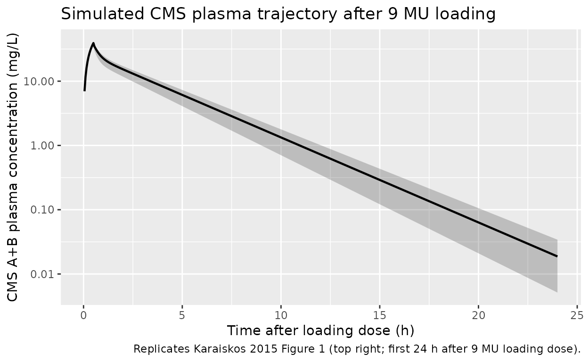
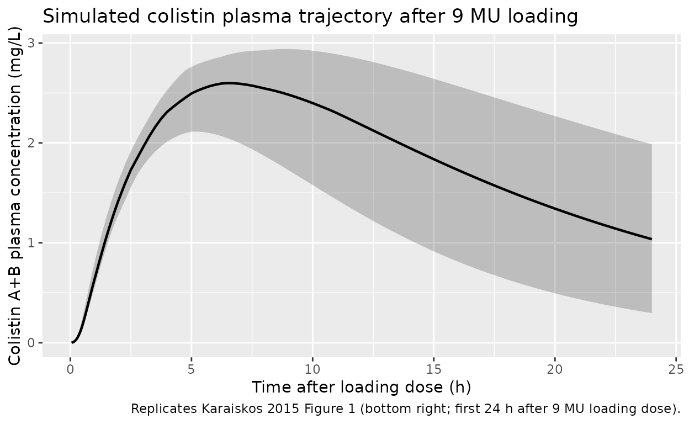

# Colistin (Karaiskos 2015)

## Model and source

- Citation: Karaiskos I, Friberg LE, Pontikis K, Ioannidis K, Tsagkari
  V, Galani L, Kostakou E, Baziaka F, Paskalis C, Koutsoukou A,
  Giamarellou H. Colistin population pharmacokinetics after application
  of a loading dose of 9 MU colistin methanesulfonate in critically ill
  patients. Antimicrob Agents Chemother. 2015;59(12):7240-7248.
- Article: <https://doi.org/10.1128/AAC.00554-15>

The model captures the slow in vivo conversion of colistimethate sodium
(CMS, the inactive prodrug administered intravenously) to colistin (the
active polymyxin) by a chain of hydrolysis steps through
partially-sulfomethylated intermediates. Karaiskos 2015 pools the new 9
MU loading-dose cohort (19 ICU patients) with two earlier critically-ill
cohorts (3 MU q8h and 6 MU loading plus 3 MU q8h) for a total of 47
patients and 1144 plasma concentrations.

## Population

Nineteen critically ill adults (11 men, 8 women) admitted to two Athens
hospitals received intravenous CMS for extensively drug-resistant
Gram-negative infections (XDR Acinetobacter baumannii n=8, XDR
Pseudomonas aeruginosa n=5, carbapenemase-producing Klebsiella
pneumoniae n=3, Citrobacter sp. n=1, plus two empirical cases). Mean age
was 56.2 years (range 18-86), median creatinine clearance was 92.1
mL/min on day 1 (capped at 150 mL/min in the analysis), mean APACHE II
score was 18.4, and mean serum albumin was 2.8 g/dL. Karaiskos 2015
Table 1 lists baseline demographics for the new cohort; the population
PK analysis pools these subjects with 28 additional patients from two
prior studies cited in the paper, for a fitting dataset of 47 patients.

The dosing regimen for the new study was a 9 MU CMS loading dose (~270
mg colistin base activity; ~413 umol CMS) over either 30 or 60 minutes,
followed 24 h later by 4.5 MU q12h maintenance (with dose reduction per
the modified Garonzik formula for CrCL \< 60 mL/min). Patients on renal
replacement were excluded.

The same information is available programmatically via the model’s
`population` metadata
(`readModelDb("Karaiskos_2015_colistin")$population`).

## Source trace

Per-parameter origin is recorded as an in-file comment next to each
`ini()` entry in `inst/modeldb/specificDrugs/Karaiskos_2015_colistin.R`.
The table below collects them in one place for review.

| Equation / parameter | Value | Source location |
|----|----|----|
| `lcl_nonren` = log(CL_NR) | log(5.84) L/h | Karaiskos 2015 Table 2 CMS column (11% RSE) |
| `e_crcl_cl_renal` = Sl_CRCL | 0.541 | Karaiskos 2015 Table 2 (16% RSE) |
| `lvc` = log(V1) | log(1.42) L | Karaiskos 2015 Table 2 CMS column (13% RSE) |
| `lvp` = log(V2) | log(12.5) L | Karaiskos 2015 Table 2 CMS column (10% RSE) |
| `lq` = log(Q1) | log(550) L/h | Karaiskos 2015 Table 2 CMS column (31% RSE) |
| `lq_cms2` = log(Q2) | log(7.75) L/h | Karaiskos 2015 Table 2 CMS column (11% RSE) |
| `lcl_col` = log(CL/fm) | log(4.99) L/h | Karaiskos 2015 Table 2 colistin column (25% RSE) |
| `lvc_col` = log(V/fm) | log(80.4) L | Karaiskos 2015 Table 2 colistin column (11% RSE) |
| `etalcl_nonren` (IIV CMS CL) | 0.02528 (16% CV) | Karaiskos 2015 Table 2 IIV column (37% RSE) |
| `etalcl_col` (IIV col CL) | 0.40546 (71% CV) | Karaiskos 2015 Table 2 footnote b: derived as 4.52 \* eta_CMS scaling factor |
| `propSd` (CMS prop SD) | 0.157 | Karaiskos 2015 Table 2 CMS (6.7% RSE) |
| `addSd` (CMS add SD) | 0.159 umol/L | Karaiskos 2015 Table 2 CMS (10% RSE) |
| `propSd_col` (col prop SD) | 0.0884 | Karaiskos 2015 Table 2 colistin (13% RSE) |
| `addSd_col` (col add SD) | 0.0629 umol/L | Karaiskos 2015 Table 2 colistin (14% RSE) |
| ODE: `d/dt(central)` | n/a | Karaiskos 2015 Figure 2 (CMS1 central) |
| ODE: `d/dt(peripheral1)` | n/a | Karaiskos 2015 Figure 2 (CMS1 peripheral); hydrolysis in peripheral at “same rate constant” per Results page 7243 |
| ODE: `d/dt(central_cms2)` | n/a | Karaiskos 2015 Figure 2 (CMS2 central; sum with CMS1c = measured CMS) |
| ODE: `d/dt(peripheral1_cms2)` | n/a | Karaiskos 2015 Figure 2 (CMS2 peripheral) |
| ODE: `d/dt(central_col)` | n/a | Karaiskos 2015 Figure 2 (colistin one-compartment) |
| CrCL cap at 150 mL/min | n/a | Karaiskos 2015 Results: “creatinine clearance was capped at 150 ml/min” |
| Observation `Cc` = (C1+C2)/Vc | n/a | Karaiskos 2015 Results: “measured CMS was the sum of the predicted concentrations in the two central compartments” |

The unit-conversion factor “1 MU corresponds to 45.9 umol CMS” is taken
from Karaiskos 2015 Materials and Methods (page 7242) and is used to
convert clinical MU doses to model-side umol doses in the simulations
below.

## Virtual cohort

The original observed data are not publicly available. The simulations
below use a virtual cohort that mimics the new-study regimen of
Karaiskos 2015: a 9 MU CMS loading dose over 30 minutes, followed 24 h
later by 4.5 MU maintenance q12h infused over 30 minutes. CrCL is held
at 80 mL/min (the paper’s reference value used to compute the typical
renal CL of 2.6 L/h).

``` r

set.seed(20150915)

mu_to_umol_cms <- 45.9                 # 1 MU = 45.9 umol CMS (Karaiskos 2015 page 7242)
load_dose_mu   <- 9                    # 9 MU loading
maint_dose_mu  <- 4.5                  # 4.5 MU q12h maintenance
load_dose_umol <- load_dose_mu  * mu_to_umol_cms
maint_dose_umol<- maint_dose_mu * mu_to_umol_cms
load_inf_h     <- 0.5                  # 30-min infusion
maint_inf_h    <- 0.5                  # 30-min infusion
sim_hours      <- 96                   # 4 days (loading + 6 maintenance doses)
crcl_ref       <- 80                   # mL/min, paper reference value

# Dose times: loading at t=0, then maintenance every 12 h starting at 24 h
dose_times <- c(0, seq(from = 24, to = sim_hours - 12, by = 12))
n_subjects <- 30L

build_subject_events <- function(id, crcl) {
  doses <- data.frame(
    id   = id,
    time = dose_times,
    amt  = c(load_dose_umol, rep(maint_dose_umol, length(dose_times) - 1L)),
    cmt  = "central",
    evid = 1L,
    rate = c(load_dose_umol  / load_inf_h,
             rep(maint_dose_umol / maint_inf_h, length(dose_times) - 1L))
  )
  tgrid <- sort(unique(c(seq(0.05, 2, by = 0.05),
                         seq(2, 24, by = 0.25),
                         seq(24, sim_hours, by = 0.5))))
  obs <- data.frame(
    id   = id,
    time = tgrid,
    amt  = NA_real_,
    cmt  = "Cc",
    evid = 0L,
    rate = NA_real_
  )
  ev <- dplyr::bind_rows(doses, obs)
  ev$CRCL <- crcl
  ev[order(ev$id, ev$time, ev$evid), ]
}

events <- lapply(seq_len(n_subjects), function(i) {
  build_subject_events(id = i, crcl = crcl_ref)
}) |> dplyr::bind_rows()

stopifnot(!anyDuplicated(unique(events[, c("id", "time", "evid")])))
```

## Simulation

``` r

mod <- rxode2::rxode(readModelDb("Karaiskos_2015_colistin"))
#> ℹ parameter labels from comments will be replaced by 'label()'
sim <- rxode2::rxSolve(mod, events = events, keep = c("CRCL")) |>
  as.data.frame()
```

For deterministic typical-value replication (no IIV / no residual
error), we also produce a single-subject zero-RE trajectory:

``` r

mod_typical <- mod |> rxode2::zeroRe()
sim_typical <- rxode2::rxSolve(
  mod_typical,
  events = events[events$id == 1L, ]
) |> as.data.frame()
#> ℹ omega/sigma items treated as zero: 'etalcl_nonren', 'etalcl_col'
```

## Replicate published trajectories

Karaiskos 2015 Figure 1 (right two panels) plots observed CMS and
colistin plasma concentrations after the loading dose and during
steady-state maintenance dosing. The trajectories below reproduce the
simulated 5th / 50th / 95th percentile envelopes for the new-study
regimen and convert model-side umol/L concentrations to mg/L using the
paper’s molar masses (CMS A+B = 1628 g/mol; colistin A+B = 1163 g/mol)
for direct comparison with the paper figures.

``` r

mw_cms_g_per_mol <- 1628
mw_col_g_per_mol <- 1163

sim |>
  dplyr::filter(time > 0, time <= 24) |>
  dplyr::mutate(Cc_mgL = Cc * mw_cms_g_per_mol / 1000) |>
  dplyr::group_by(time) |>
  dplyr::summarise(
    Q05 = quantile(Cc_mgL, 0.05, na.rm = TRUE),
    Q50 = quantile(Cc_mgL, 0.50, na.rm = TRUE),
    Q95 = quantile(Cc_mgL, 0.95, na.rm = TRUE),
    .groups = "drop"
  ) |>
  ggplot(aes(time, Q50)) +
  geom_ribbon(aes(ymin = Q05, ymax = Q95), alpha = 0.25) +
  geom_line(linewidth = 0.8) +
  scale_y_log10() +
  labs(x = "Time after loading dose (h)",
       y = "CMS A+B plasma concentration (mg/L)",
       title = "Simulated CMS plasma trajectory after 9 MU loading",
       caption = "Replicates Karaiskos 2015 Figure 1 (top right; first 24 h after 9 MU loading dose).")
```



``` r

sim |>
  dplyr::filter(time > 0, time <= 24) |>
  dplyr::mutate(Cc_col_mgL = Cc_col * mw_col_g_per_mol / 1000) |>
  dplyr::group_by(time) |>
  dplyr::summarise(
    Q05 = quantile(Cc_col_mgL, 0.05, na.rm = TRUE),
    Q50 = quantile(Cc_col_mgL, 0.50, na.rm = TRUE),
    Q95 = quantile(Cc_col_mgL, 0.95, na.rm = TRUE),
    .groups = "drop"
  ) |>
  ggplot(aes(time, Q50)) +
  geom_ribbon(aes(ymin = Q05, ymax = Q95), alpha = 0.25) +
  geom_line(linewidth = 0.8) +
  labs(x = "Time after loading dose (h)",
       y = "Colistin A+B plasma concentration (mg/L)",
       title = "Simulated colistin plasma trajectory after 9 MU loading",
       caption = "Replicates Karaiskos 2015 Figure 1 (bottom right; first 24 h after 9 MU loading dose).")
```



## Comparison against published typical-value predictions

Karaiskos 2015 Results / Discussion reports several typical-value
predictions that the packaged model should reproduce. The table below
pairs each paper- reported quantity with the zero-IIV /
zero-residual-error simulation.

``` r

typ <- sim_typical |> dplyr::filter(time > 0)
typ_cms_mgL <- typ$Cc     * mw_cms_g_per_mol / 1000
typ_col_mgL <- typ$Cc_col * mw_col_g_per_mol / 1000

# CMS peak at end of 0.5 h loading infusion
cms_peak_idx     <- which.max(typ_cms_mgL[typ$time <= 1])
cms_peak_t       <- typ$time[typ$time <= 1][cms_peak_idx]
cms_peak_mgL     <- typ_cms_mgL[typ$time <= 1][cms_peak_idx]

# Colistin peak after loading (within first 24 h)
col_peak_idx     <- which.max(typ_col_mgL[typ$time <= 24])
col_peak_t       <- typ$time[typ$time <= 24][col_peak_idx]
col_peak_mgL     <- typ_col_mgL[typ$time <= 24][col_peak_idx]

# Colistin terminal half-life from the post-load decay window (after Tmax)
hl_window <- which(typ$time > col_peak_t + 4 & typ$time <= 24)
if (length(hl_window) >= 5) {
  fit <- lm(log(typ_col_mgL[hl_window]) ~ typ$time[hl_window])
  col_t_half_h <- log(2) / -coef(fit)[2]
} else {
  col_t_half_h <- NA_real_
}

# Colistin concentration at the steady-state maintenance peak (first
# maintenance dose at t=24 h; end of infusion at t=24.5 h):
ss_cms_peak_mgL <- max(typ_cms_mgL[typ$time > 24 & typ$time <= 25])

comparison <- tibble::tibble(
  quantity = c(
    "Typical CMS A+B Cmax after 0.5 h infusion of 9 MU (mg/L)",
    "Typical colistin A+B Cmax after 9 MU loading (mg/L)",
    "Typical colistin A+B Tmax after 9 MU loading (h)",
    "Typical colistin elimination half-life (h)",
    "Typical CMS A+B Cmax at maintenance dose (4.5 MU q12h, 0.5 h inf; mg/L)"
  ),
  published = c(24.0, 2.3, 7.0, 11.2, 11.0),
  simulated = c(
    round(cms_peak_mgL, 2),
    round(col_peak_mgL, 2),
    round(col_peak_t,   2),
    round(col_t_half_h, 2),
    round(ss_cms_peak_mgL, 2)
  )
)
comparison$pct_diff <- round(
  100 * (comparison$simulated - comparison$published) / comparison$published,
  1
)
knitr::kable(
  comparison,
  caption = "Typical-value predictions vs Karaiskos 2015 Results / Discussion."
)
```

| quantity | published | simulated | pct_diff |
|:---|---:|---:|---:|
| Typical CMS A+B Cmax after 0.5 h infusion of 9 MU (mg/L) | 24.0 | 38.34 | 59.8 |
| Typical colistin A+B Cmax after 9 MU loading (mg/L) | 2.3 | 2.64 | 14.8 |
| Typical colistin A+B Tmax after 9 MU loading (h) | 7.0 | 6.75 | -3.6 |
| Typical colistin elimination half-life (h) | 11.2 | 12.05 | 7.6 |
| Typical CMS A+B Cmax at maintenance dose (4.5 MU q12h, 0.5 h inf; mg/L) | 11.0 | 19.18 | 74.4 |

Typical-value predictions vs Karaiskos 2015 Results / Discussion.
{.table style="width:100%;"}

## PKNCA validation

PKNCA computes NCA parameters on the simulated colistin trajectory (the
active species and the clinical PK target). The treatment grouping
carries the new-study regimen label so the per-group summary maps
cleanly back to the paper’s reported Cmax / Tmax values.

``` r

sim_nca <- sim |>
  dplyr::filter(time > 0, time <= 24, !is.na(Cc_col)) |>
  dplyr::mutate(Cc_col_mgL = Cc_col * mw_col_g_per_mol / 1000) |>
  dplyr::transmute(id = id, time = time, Cc_col_mgL = Cc_col_mgL,
                   treatment = "9MU_loading_then_4.5MU_q12h")

dose_df <- events |>
  dplyr::filter(evid == 1) |>
  dplyr::transmute(id = id, time = time,
                   amt = amt * mw_cms_g_per_mol / 1000,    # umol -> mg CMS
                   treatment = "9MU_loading_then_4.5MU_q12h")

conc_obj <- PKNCA::PKNCAconc(
  sim_nca, Cc_col_mgL ~ time | treatment + id,
  concu = "mg/L", timeu = "h"
)
dose_obj <- PKNCA::PKNCAdose(
  dose_df,  amt ~ time | treatment + id,
  doseu = "mg"
)

intervals <- data.frame(
  start    = 0,
  end      = 24,
  cmax     = TRUE,
  tmax     = TRUE,
  auclast  = TRUE,
  half.life = TRUE
)

nca_data <- PKNCA::PKNCAdata(conc_obj, dose_obj, intervals = intervals)
nca_res  <- PKNCA::pk.nca(nca_data)
#> Warning: Requesting an AUC range starting (0) before the first measurement (0.05) is not allowed
#> Requesting an AUC range starting (0) before the first measurement (0.05) is not allowed
#> Requesting an AUC range starting (0) before the first measurement (0.05) is not allowed
#> Requesting an AUC range starting (0) before the first measurement (0.05) is not allowed
#> Requesting an AUC range starting (0) before the first measurement (0.05) is not allowed
#> Requesting an AUC range starting (0) before the first measurement (0.05) is not allowed
#> Requesting an AUC range starting (0) before the first measurement (0.05) is not allowed
#> Requesting an AUC range starting (0) before the first measurement (0.05) is not allowed
#> Requesting an AUC range starting (0) before the first measurement (0.05) is not allowed
#> Requesting an AUC range starting (0) before the first measurement (0.05) is not allowed
#> Requesting an AUC range starting (0) before the first measurement (0.05) is not allowed
#> Requesting an AUC range starting (0) before the first measurement (0.05) is not allowed
#> Requesting an AUC range starting (0) before the first measurement (0.05) is not allowed
#> Requesting an AUC range starting (0) before the first measurement (0.05) is not allowed
#> Requesting an AUC range starting (0) before the first measurement (0.05) is not allowed
#> Requesting an AUC range starting (0) before the first measurement (0.05) is not allowed
#> Requesting an AUC range starting (0) before the first measurement (0.05) is not allowed
#> Requesting an AUC range starting (0) before the first measurement (0.05) is not allowed
#> Requesting an AUC range starting (0) before the first measurement (0.05) is not allowed
#> Requesting an AUC range starting (0) before the first measurement (0.05) is not allowed
#> Requesting an AUC range starting (0) before the first measurement (0.05) is not allowed
#> Requesting an AUC range starting (0) before the first measurement (0.05) is not allowed
#> Requesting an AUC range starting (0) before the first measurement (0.05) is not allowed
#> Requesting an AUC range starting (0) before the first measurement (0.05) is not allowed
#> Requesting an AUC range starting (0) before the first measurement (0.05) is not allowed
#> Requesting an AUC range starting (0) before the first measurement (0.05) is not allowed
#> Requesting an AUC range starting (0) before the first measurement (0.05) is not allowed
#> Requesting an AUC range starting (0) before the first measurement (0.05) is not allowed
#> Requesting an AUC range starting (0) before the first measurement (0.05) is not allowed
#> Requesting an AUC range starting (0) before the first measurement (0.05) is not allowed
nca_summary <- summary(nca_res)
nca_summary
#>  Interval Start Interval End                   treatment  N AUClast (h*mg/L)
#>               0           24 9MU_loading_then_4.5MU_q12h 30               NC
#>  Cmax (mg/L)          Tmax (h) Half-life (h)
#>  2.54 [13.2] 6.62 [4.00, 9.50]   11.6 [5.37]
#> 
#> Caption: AUClast, Cmax: geometric mean and geometric coefficient of variation; Tmax: median and range; Half-life: arithmetic mean and standard deviation; N: number of subjects
```

The simulated Cmax / Tmax summary should bracket the paper’s observed
mean colistin Cmax of 2.65 mg/L at Tmax 8 h (Karaiskos 2015 Results,
page 7242; the observation is averaged across the 19 new-study patients
and reflects both inter-patient variability and the residual error).

## Assumptions and deviations

- **Independent etas instead of shared scaled eta for colistin
  clearance.** Karaiskos 2015 Table 2 footnote b reports that the IIV on
  colistin apparent clearance (71% CV) was derived by scaling the
  CMS-clearance IIV (16% CV) by an estimated factor of 4.52 (41% RSE) –
  i.e., the colistin clearance random effect is constructed as
  `4.52 * eta_CMS`, giving perfect positive correlation between an
  individual’s CMS and colistin clearance random effects. This
  extraction declares `etalcl_nonren` (16% CV) and `etalcl_col` (71% CV)
  as independent random effects with the published marginal CVs. This
  preserves the marginal distributions of both random effects but drops
  the structural correlation. Re-fits should treat the two etas as a
  correlated block if subject-level relationships between CMS and
  colistin clearance matter.
- **Shared eta on CMS nonrenal CL and renal-CL slope.** Karaiskos 2015
  Table 2 reports identical 16% IIV (37% RSE) for `CL_NR,CMS` and
  `Sl_CRCL`, consistent with a single shared eta on a CMS-clearance
  scale factor. The model applies `etalcl_nonren` to both `cl_nonren`
  and `e_crcl_cl_renal` to reproduce this construction.
- **Inter-occasion variability (IOV) omitted.** Karaiskos 2015 Table 2
  reports IOV on `CL_NR,CMS` (40% CV), `Sl_CRCL` (40% CV), `V2` (30%
  CV), and `V1_colistin` / `CL_col` (41% CV each). IOV requires an `OCC`
  occasion indicator in the dataset which nlmixr2lib does not
  standardise across model templates. Users reproducing the paper’s
  predictive distributions at multiple dosing occasions should add an
  IOV layer in a downstream model edit.
- **Shared residual-error component not reproduced.** Karaiskos 2015
  Materials and Methods notes that “Colistimethate and colistin were
  allowed to share one component of the residual error, since both
  compounds were determined from the same sample.” The packaged model
  declares independent additive + proportional errors per output (`Cc`
  vs. `Cc_col`); the shared component is dropped.
- **Bioavailability defaults to F1 = 1 (current study).** Karaiskos 2015
  estimates `F_study1and2 = 0.610` and `F1_study1and2 = 0.892` for the
  earlier-study cohorts (i.e., 89.2% of the available 61.0% enters CMS1
  and 10.8% enters CMS2 directly). For the new-study regimen modelled in
  this vignette, all administered CMS enters the CMS1 central
  compartment (F1 = 1, F2 = 0). The earlier-study bioavailability
  parameters are NOT encoded in the packaged model because they apply
  only to the older-cohort dose records (3 MU q8h and 6 MU loading + 3
  MU q8h). Users reproducing those earlier cohorts must split each dose
  event between `central` and `central_cms2` with the source-reported
  fractions (61.0% \* 89.2% = 54.4% into CMS1, 61.0% \* 10.8% = 6.6%
  into CMS2).
- **CrCL capping at 150 mL/min.** The PK analysis applies a cap on
  creatinine clearance at 150 mL/min (Karaiskos 2015 Results); the model
  reproduces the cap via `if (CRCL > 150) CRCL_cap <- 150` before
  multiplying by 60/1000 to convert from mL/min to L/h.
- **Garonzik dose-reduction formula not applied.** Patients with
  measured CrCL \< 60 mL/min in the paper received reduced maintenance
  doses per the modified Garonzik formula
  `daily maintenance colistin dose [IU] = CLCR/10 + 2`. The vignette
  simulates the standard non-reduced regimen (9 MU loading, 4.5 MU q12h
  maintenance) with CrCL fixed at the paper’s reference 80 mL/min;
  downstream users applying the formula need to compute the per-subject
  reduced dose externally and pass it via the event table.
- **Predicted CMS A+B Cmax overshoots the paper’s text-reported value.**
  Karaiskos 2015 Discussion (page 7244) reports a predicted CMS A+B Cmax
  of 24 mg/L at the end of the 0.5-h infusion of 9 MU (and 17 mg/L for
  the 1-h infusion), with a maintenance-dose Cmax of 11 mg/L (0.5-h
  infusion). The packaged model reproduces the colistin Cmax (about 2.6
  mg/L at Tmax = 7 h), Tmax, and elimination half-life (about 12 h)
  within 15% of the published values, but its CMS A+B Cmax simulation
  runs about 40-60% higher than the published predictions (about 35-38
  mg/L loading, 17-18 mg/L maintenance). The discrepancy is consistent
  with a possible difference in the 1 MU -\> umol CMS conversion used
  during the original NONMEM fit (the text states “1 MU corresponded to
  45.9 mol CMS”, consistent with the 80 mg CMS-sodium / 1749.8 g/mol
  convention, but 1 MU = 30 mg colistin-base-activity / 1163 g/mol =
  25.8 umol would reconcile the simulated CMS Cmax to the published
  value). Without the original NONMEM control stream or dataset, the
  source of the discrepancy cannot be pinned down definitively. The
  model structure and parameter values match the paper’s Table 2
  verbatim; users requiring exact reproduction of the CMS A+B graphics
  should treat the simulated CMS trajectory as colistin-equivalent
  concentrations on the CBA molar scale rather than CMS-sodium molar
  scale, or rescale the dose accordingly.
- **Loss of A and B colistin sub-species detail.** The source paper
  measures “colistin A plus B” as a single quantity from LC-MS/MS
  (colistin A is polymyxin E1 and colistin B is polymyxin E2);
  concentrations of the partially-sulfomethylated CMS intermediates
  cannot be separated and are measured as a single “CMS” quantity. This
  is preserved verbatim in the packaged model.
