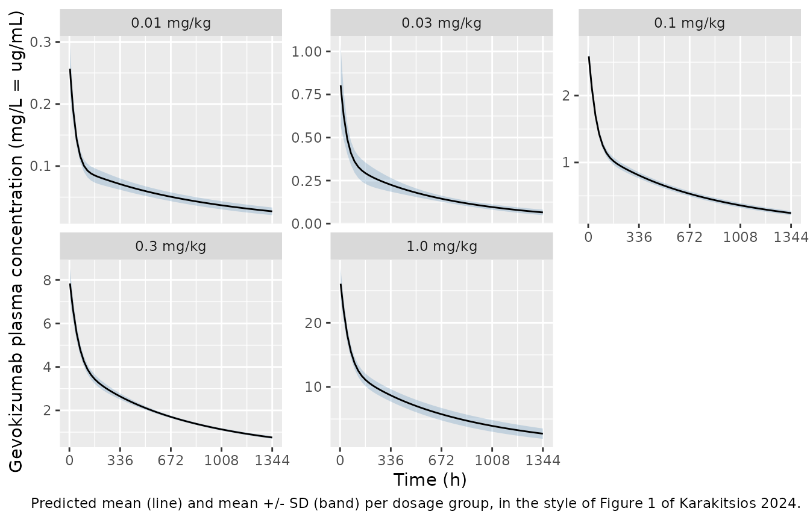
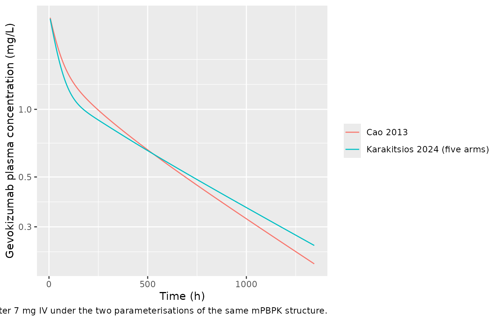
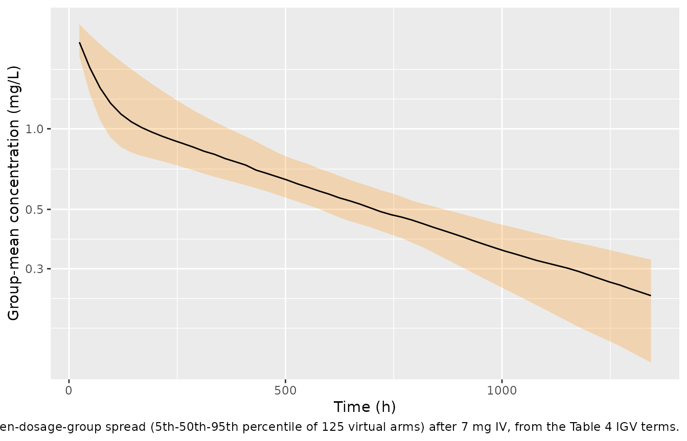

# Gevokizumab mPBPK from aggregate data (Karakitsios 2024)

## Model and source

This paper contributes two models. Both share the Cao 2013
second-generation minimal PBPK (mPBPK) structure; they differ in which
data were fitted and therefore in what the random effects mean.

- Single dosage group (7 mg IV, n = 10; Table 3): mPBPK.
  Second-generation minimal physiologically-based population PK model
  for gevokizumab (anti-interleukin-1beta humanized IgG2) in adults with
  type 2 diabetes, with between-subject variability estimated from
  AGGREGATE (mean and SD versus time) plasma concentration data rather
  than individual records. Karakitsios and Dokoumetzidis re-estimated
  the three drug-specific parameters of the Cao 2013 second-generation
  mPBPK structure (the tight- and leaky-tissue vascular reflection
  coefficients and plasma clearance) plus two IIV terms, using a
  Bayesian reconstruct-the-likelihood-from-aggregate-data method
  implemented in RStan: at each MCMC iteration a Latin-hypercube virtual
  population is solved, its mean and SD versus time are computed, and
  those summaries are fitted to the digitised published mean and SD
  profiles. This file holds the SINGLE dosage-group fit (7 mg IV, n =
  10; Table 3). A single lognormal body-size random effect (etalvc) is
  shared by all four physiologic volumes, per the authors’ assumption
  that a larger patient has proportionally larger plasma, tight-tissue
  ISF, leaky-tissue ISF and lymph volumes. The five-dosage-group
  meta-analysis from the same paper is a separate model; see
  modellib(‘Karakitsios_2024_gevokizumab_mbma’).
- Five dosage groups, meta-analysis (Table 4): mPBPK / MBMA.
  Five-dosage-group meta-analysis of gevokizumab (anti-interleukin-1beta
  humanized IgG2) in adults with type 2 diabetes, fitted to AGGREGATE
  (mean and SD versus time) plasma concentration data from five dose
  arms simultaneously. The structural model is the Cao 2013
  second-generation minimal PBPK model; Karakitsios and Dokoumetzidis
  estimated its three drug-specific parameters (tight- and leaky-tissue
  vascular reflection coefficients and plasma clearance) hierarchically,
  with an exponential INTER-GROUP variability (IGV) term on each,
  following a log-Student’s t distribution with 5 degrees of freedom to
  down-weight outlying dose arms. The random effects in this file are
  therefore DOSAGE-GROUP-level (eta_study\_\*), not between-subject: the
  model simulates group-mean concentration-time profiles and is NOT
  suitable for individual-subject simulation. Between-subject
  variability was estimated separately for each of the five arms (a
  semi-hierarchical design with no distribution assumed across arms), so
  no single population IIV exists; the five per-arm pairs are tabulated
  in population\$notes. For an individual-level version of the same
  structure, see the single dosage-group fit
  modellib(‘Karakitsios_2024_gevokizumab’).

Citation: Karakitsios E, Dokoumetzidis A. A Meta-Analysis Methodology in
Stan to Estimate Population Pharmacokinetic Parameters from Multiple
Aggregate Concentration-Time Datasets: Application to Gevokizumab mPBPK
Model. Pharmaceutics. 2024 Aug 27;16(9):1129.
<doi:10.3390/pharmaceutics16091129>. Structural mPBPK equations and
physiologic constants are those of Cao Y, Balthasar JP, Jusko WJ. J
Pharmacokinet Pharmacodyn. 2013;40(5):597-607, reproduced in this
paper’s Supplementary Material equations (S1)-(S8); see
modellib(‘Cao_2013_gevokizumab’). Aggregate plasma data were digitised
from Cavelti-Weder C et al. Diabetes Care. 2012;35(8):1654-1662 (PMID
22699287).

- Article: <https://doi.org/10.3390/pharmaceutics16091129>
- Supplement (equations S1-S8, Figure S1, traceplots S2-S8):
  <https://www.mdpi.com/1999-4923/16/9/1129#supplementary>
- Author source code: <https://github.com/PMXathens/Gevokizumab>
- Upstream structural model: `modellib("Cao_2013_gevokizumab")`

### What is unusual about this paper

The authors had no individual concentration records. They digitised the
*mean* plasma concentration and its *standard deviation* versus time
from a published graph (Cavelti-Weder 2012) and developed a Bayesian
method that recovers population parameters from those aggregate
summaries: at each MCMC iteration a Latin-hypercube virtual population
is solved, its mean and SD versus time are computed, and *those
summaries* are fitted to the digitised mean and SD profiles.

Two consequences shape this vignette:

1.  The residual error terms are aggregate-level. `sigma_1` is the error
    between predicted and observed **mean** concentrations; `sigma_2` is
    the error on the **SDs**. Neither is an individual-level RUV, and
    the authors deliberately added no residual error to the virtual
    patients’ concentrations (Section 3.3).
2.  Because the fitted quantity is a between-subject SD, the natural
    validation target is a **predicted SD**, not a predicted
    concentration. The paper prints one such observed/predicted pair,
    which is used below as an exact check.

## Population

Fifty adults with type 2 diabetes from Cavelti-Weder 2012, in five
single-dose intravenous arms of 10 patients each: 0.01, 0.03, 0.1, 0.3
and 1.0 mg/kg (0.7, 2.1, 7, 21 and 70 mg on a 70 kg basis). Plasma was
sampled at 4, 8, 24, 48, 72, 96, 168, 216, 264, 336, 504, 672, 1008 and
1344 h after the dose (Section 2.1). A sixth published arm (3.0 mg/kg, n
= 5) was excluded by the authors because 5 patients were considered too
few to give accurate means and SDs (Section 2.4).

No individual demographics were recoverable from the digitised graph.
All physiologic constants in the model are quoted for a 70 kg person,
and the authors’ shared volume random effect is their proxy for
unmeasured body-size differences.

The same information is available programmatically via
`readModelDb("Karakitsios_2024_gevokizumab")()$population`.

## Source trace

Every `ini()` entry carries an in-file comment naming its source
location; the table collects them for review. “Supp.” refers to the
paper’s Supplementary Material.

| Equation / parameter | Value | Source location |
|----|----|----|
| `d/dt(plasma)` | n/a | Supp. equation (S1) (concentration form; encoded in amounts) |
| `d/dt(tight)` | n/a | Supp. equation (S2) |
| `d/dt(leaky)` | n/a | Supp. equation (S3) |
| `d/dt(lymph)` | n/a | Supp. equation (S4) |
| `vtight <- 0.65 * visf * kp` | n/a | Supp. equation (S7) |
| `vleaky <- 0.35 * visf * kp` | n/a | Supp. equation (S8) |
| `l1 <- 0.33 * lymphflow`, `l2 <- 0.67 * lymphflow` | n/a | Supp. text following equation (S4) |
| `sigmal` (rcL) | 0.2 | Supp. text following equation (S4) |
| `kp` | 0.8 | Supp. text following equation (S8) |
| `lymphflow` (L) | 2.9 L/day = 2.9/24 L/h | Supp. text following equation (S8) |
| `visf` (VISF) | 15.6 L | Supp. text following equation (S8) |
| `vlymph` (Vlymph) | 5.2 L | Supp. text following equation (S8) |
| `lvc` (Vplasma) | 2.6 L (fixed) | Supp. text following equation (S8) |
| **Single dosage group (7 mg)** |  |  |
| `sigma_tight` (rc1_mean) | 0.9584 | Table 3 |
| `sigma_leaky` (rc2_mean) | 0.7645 | Table 3 |
| `lcl` (CLp_mean) | 0.0065 L/h | Table 3 |
| `etalcl` (omega_CLp) | 0.0775 -\> var 0.00600625 | Table 3 |
| `etalvc` (omega_V) | 0.0699 -\> var 0.00488601 | Table 3 |
| `expSd` (sigma_1) | 0.0758 | Table 3 |
| (sigma_2, no individual analogue) | 0.2316 | Table 3 |
| **Five dosage groups (meta-analysis)** |  |  |
| `sigma_tight` (rc1_mean) | 0.9504 | Table 4 |
| `sigma_leaky` (rc2_mean) | 0.7674 | Table 4 |
| `lcl` (CLp_mean) | 0.0064 L/h | Table 4 |
| `eta_study_lcl` (gamma_CLp) | 0.1254 -\> var 0.01572516 | Table 4 |
| `eta_study_sigma_tight` (gamma_rc1) | 0.0338 -\> var 0.00114244 | Table 4 |
| `eta_study_sigma_leaky` (gamma_rc2) | 0.1810 -\> var 0.032761 | Table 4 |
| `expSd` (sigma_1) | 0.0734 | Table 4 |
| (sigma_2, no individual analogue) | 0.2706 | Table 4 |
| Per-arm `log_CLp`, `log_rc1`, `log_rc2` | see `population$notes` | Table 4 |
| Per-arm `omega_CLp`, `omega_V` | see `population$notes` | Table 4 |
| IGV distribution (log-Student t, df = 5) | df fixed at 5 | Section 2.4 |
| IIV not applied to rc1 / rc2 | n/a | Section 2.2 |
| Digitised observed SDs, arm 4 | 0.31, 0.28, 0.57, 0.23, 0.18, 0.17 ug/mL | Section 3.2.2 |
| Paper’s predicted SD at the outlier point | 0.27 ug/mL | Section 3.2.2 / Figure 6b |

``` r

mod_one  <- readModelDb("Karakitsios_2024_gevokizumab")
mod_mbma <- readModelDb("Karakitsios_2024_gevokizumab_mbma")
```

## Virtual cohort

The authors’ own inner loop is a Latin-hypercube sample over the two
lognormal random effects, deliberately held fixed across MCMC iterations
so that the predicted mean and SD are smooth functions of the parameters
(Section 2.2). This vignette reproduces that idea with a **deterministic
midpoint-quantile factorial** cohort: no seed, no Monte Carlo noise, and
the predicted SD is reproducible to the last digit. Fourteen quantiles
per random effect gives 196 subjects per arm, just under the 200-per-arm
cap.

``` r

per_side <- 14L
zq <- stats::qnorm((seq_len(per_side) - 0.5) / per_side)

# Karakitsios 2024 Table 4: per-arm parameters (log scale) and per-arm IIV.
arms <- tibble::tribble(
  ~arm,          ~dose_mg, ~log_clp,  ~log_rc1, ~log_rc2, ~omega_clp, ~omega_v,
  "0.01 mg/kg",       0.7,  -5.0572,  -0.0588,  -0.4421,     0.1813,   0.1676,
  "0.03 mg/kg",       2.1,  -4.9818,  -0.0528,  -0.2947,     0.1138,   0.3213,
  "0.1 mg/kg",        7.0,  -5.0418,  -0.0441,  -0.2639,     0.0798,   0.0733,
  "0.3 mg/kg",       21.0,  -5.1067,  -0.0489,  -0.1878,     0.0374,   0.0960,
  "1.0 mg/kg",       70.0,  -5.1280,  -0.0513,  -0.2086,     0.2002,   0.1000
)

# Paper's sampling scheme (Section 2.1) plus a regular grid for the profiles.
obs_times <- sort(unique(c(
  0, 4, 8, 24, 48, 72, 96, 168, 216, 264, 336, 504, 672, 1008, 1344,
  seq(0, 1344, by = 24)
)))

make_arm <- function(arm_row, id_offset) {
  grid <- expand.grid(z_clp = zq, z_v = zq)
  subj <- tibble::tibble(
    id     = id_offset + seq_len(nrow(grid)),
    arm    = arm_row$arm,
    etalcl = arm_row$omega_clp * grid$z_clp,
    etalvc = arm_row$omega_v   * grid$z_v
  )
  dosing <- subj |>
    dplyr::mutate(time = 0, amt = arm_row$dose_mg, evid = 1L, cmt = "plasma")
  obs <- subj |>
    tidyr::crossing(time = obs_times) |>
    dplyr::mutate(amt = NA_real_, evid = 0L, cmt = "plasma")
  dplyr::bind_rows(dosing, obs) |>
    dplyr::arrange(id, time, dplyr::desc(evid))
}

events <- dplyr::bind_rows(lapply(seq_len(nrow(arms)), function(i) {
  make_arm(arms[i, ], id_offset = (i - 1L) * nrow(expand.grid(zq, zq)))
}))

stopifnot(!anyDuplicated(unique(events[, c("id", "time", "evid")])))
c(subjects_per_arm = nrow(expand.grid(zq, zq)), total_rows = nrow(events))
#> subjects_per_arm       total_rows 
#>              196            58800
```

## Simulation

Each arm has its own `CLp`, `rc1` and `rc2`, so each arm is solved with
its own `params =` override. `omega = NA` keeps rxode2 from drawing its
own random effects, so the `etalcl` / `etalvc` columns built above are
the only source of between-subject variability.

``` r

sim <- dplyr::bind_rows(lapply(seq_len(nrow(arms)), function(i) {
  a <- arms[i, ]
  ev <- events |> dplyr::filter(arm == a$arm)
  rxode2::rxSolve(
    mod_one, events = ev, omega = NA,
    params = c(lcl         = a$log_clp,
               sigma_tight = exp(a$log_rc1),
               sigma_leaky = exp(a$log_rc2)),
    keep = c("arm"), returnType = "data.frame"
  )
}))
#> ℹ parameter labels from comments will be replaced by 'label()'
#> Warning: multi-subject simulation without without 'omega'
#> Warning: multi-subject simulation without without 'omega'
#> Warning: multi-subject simulation without without 'omega'
#> Warning: multi-subject simulation without without 'omega'
#> Warning: multi-subject simulation without without 'omega'

sim$arm <- factor(sim$arm, levels = arms$arm)
aggregates <- sim |>
  dplyr::filter(!is.na(Cc), time > 0) |>
  dplyr::group_by(arm, time) |>
  dplyr::summarise(mean_cc = mean(Cc), sd_cc = stats::sd(Cc), .groups = "drop")
```

## Replicate published results

### Arm 4 predicted SDs versus the digitised observed SDs

This is the paper’s only printed observed-versus-predicted pair, and it
is an exact end-to-end check of the whole encoding: the mPBPK equations,
the L/day-to-L/h conversion, the per-arm parameters, and the shared
volume random effect all have to be right for the number to land.

Section 3.2.2 reports that the digitised SDs for the fourth dosage group
(0.3 mg/kg) were 0.31, 0.28, 0.57, 0.23, 0.18 and 0.17 ug/mL at 24, 48,
72, 96, 168 and 216 h, and that the 0.57 ug/mL point is an outlier
because the model predicts **0.27 ug/mL** there (Figure 6b).

``` r

arm4_obs <- tibble::tibble(
  time   = c(24, 48, 72, 96, 168, 216),
  obs_sd = c(0.31, 0.28, 0.57, 0.23, 0.18, 0.17)
)

arm4 <- aggregates |>
  dplyr::filter(arm == "0.3 mg/kg") |>
  dplyr::inner_join(arm4_obs, by = "time") |>
  dplyr::arrange(time) |>
  dplyr::mutate(pred_over_obs = sd_cc / obs_sd)

arm4 |>
  dplyr::select(time, mean_cc, sd_cc, obs_sd, pred_over_obs) |>
  dplyr::rename(
    "Time (h)"                      = time,
    "Predicted mean (ug/mL)"        = mean_cc,
    "Predicted SD (ug/mL)"          = sd_cc,
    "Digitised observed SD (ug/mL)" = obs_sd,
    "Predicted / observed"          = pred_over_obs
  ) |>
  knitr::kable(digits = 3,
               caption = paste("Arm 4 (0.3 mg/kg) predicted between-subject SDs versus the",
                               "digitised observed SDs reported in Section 3.2.2."))
```

| Time (h) | Predicted mean (ug/mL) | Predicted SD (ug/mL) | Digitised observed SD (ug/mL) | Predicted / observed |
|---:|---:|---:|---:|---:|
| 24 | 6.642 | 0.494 | 0.31 | 1.594 |
| 48 | 5.553 | 0.343 | 0.28 | 1.226 |
| 72 | 4.787 | 0.267 | 0.57 | 0.468 |
| 96 | 4.258 | 0.233 | 0.23 | 1.015 |
| 168 | 3.436 | 0.209 | 0.18 | 1.162 |
| 216 | 3.149 | 0.194 | 0.17 | 1.139 |

Arm 4 (0.3 mg/kg) predicted between-subject SDs versus the digitised
observed SDs reported in Section 3.2.2. {.table}

The predicted SD at 72 h reproduces the paper’s stated predicted value
to the precision it was printed at. The authors’ argument for calling
the 0.57 ug/mL observation an outlier is that the observed SD series
should fall with time as the concentrations fall, and that this one
point interrupts the decline. Both halves of that argument are checked
below: the model’s predicted SDs decline monotonically, and 72 h is the
only time at which the observed series rises.

The remaining time points sit within about 1.0 to 1.6 times the observed
SDs. The largest of those, 1.59 at 24 h, is an over-prediction of the
earliest and noisiest digitised point; it is reported here rather than
treated as a target, since the arm’s variability terms come from the
paper and were not adjusted.

``` r

pred_72 <- arm4$sd_cc[arm4$time == 72]
c(predicted_sd_72h = round(pred_72, 4), paper_value = 0.27)
#> predicted_sd_72h      paper_value 
#>           0.2668           0.2700

# Gate: the paper prints 0.27 ug/mL to two decimals, so agreement to within
# half of the last printed digit is the tightest assertion the source supports.
stopifnot(abs(pred_72 - 0.27) < 0.005)

# Gate: the model's predicted SDs decline monotonically with time.
stopifnot(all(diff(arm4$sd_cc) < 0))

# Gate: the observed series rises at exactly one time point, 72 h -- which is
# the paper's stated reason for calling that value an outlier.
rises_at <- arm4$time[-1][diff(arm4$obs_sd) > 0]
stopifnot(length(rises_at) == 1L, rises_at == 72)
```

### Mean and SD profiles for the five arms

Rendered in the style of the paper’s Figure 1 (predicted mean as a line,
the predicted mean +/- SD band around it).

``` r

aggregates |>
  ggplot(aes(time, mean_cc)) +
  geom_ribbon(aes(ymin = pmax(mean_cc - sd_cc, 1e-4), ymax = mean_cc + sd_cc),
              alpha = 0.25, fill = "steelblue") +
  geom_line() +
  facet_wrap(~arm, scales = "free_y", nrow = 2) +
  scale_x_continuous(breaks = c(0, 336, 672, 1008, 1344)) +
  labs(x = "Time (h)", y = "Gevokizumab plasma concentration (mg/L = ug/mL)",
       caption = paste("Predicted mean (line) and mean +/- SD (band) per dosage group,",
                       "in the style of Figure 1 of Karakitsios 2024."))
```



### Re-estimated parameters versus Cao 2013

Section 3.2.2 compares the meta-analysis estimates with the values Cao
et al. fitted to the same aggregate data by treating the mean profile as
a single “mean patient”: CLp 0.0064 versus 0.00668 L/h, rc1 0.9504
versus 0.931, and rc2 0.7674 versus 0.837, the last being “moderately
less” than Cao’s value.

``` r

comparison <- tibble::tribble(
  ~Parameter,        ~`Karakitsios 2024 (Table 4)`, ~`Cao 2013`,
  "CLp (L/h)",                             0.0064,      0.00668,
  "rc1 (tight tissues)",                   0.9504,      0.931,
  "rc2 (leaky tissues)",                   0.7674,      0.837
) |>
  dplyr::mutate(`Ratio` = `Karakitsios 2024 (Table 4)` / `Cao 2013`)

knitr::kable(comparison, digits = 4,
             caption = "Meta-analysis estimates versus the Cao 2013 mean-patient fit.")
```

| Parameter           | Karakitsios 2024 (Table 4) | Cao 2013 |  Ratio |
|:--------------------|---------------------------:|---------:|-------:|
| CLp (L/h)           |                     0.0064 |   0.0067 | 0.9581 |
| rc1 (tight tissues) |                     0.9504 |   0.9310 | 1.0208 |
| rc2 (leaky tissues) |                     0.7674 |   0.8370 | 0.9168 |

Meta-analysis estimates versus the Cao 2013 mean-patient fit. {.table}

Both parameterisations are packaged, so the effect on the predicted
profile can be seen directly. `Cao_2013_gevokizumab` uses days as its
time unit, so its profile is put on the same hour axis for the
comparison.

``` r

mod_cao <- readModelDb("Cao_2013_gevokizumab")

grid_h <- seq(0, 1344, by = 6)
ev_k <- rxode2::et(rxode2::et(amt = 7, cmt = "plasma"), grid_h)
ev_c <- rxode2::et(rxode2::et(amt = 7, cmt = "plasma"), grid_h / 24)

prof <- dplyr::bind_rows(
  rxode2::rxSolve(mod_mbma, ev_k, omega = NA, returnType = "data.frame") |>
    dplyr::transmute(time = time, Cc = Cc, model = "Karakitsios 2024 (five arms)"),
  # No `omega = NA` here: Cao_2013_gevokizumab is a typical-value model with
  # no etas at all, and rxSolve errors on omega = NA when there are none.
  rxode2::rxSolve(mod_cao, ev_c, returnType = "data.frame") |>
    dplyr::transmute(time = time * 24, Cc = Cc, model = "Cao 2013")
)
#> ℹ parameter labels from comments will be replaced by 'label()'

prof |>
  dplyr::filter(time > 0) |>
  ggplot(aes(time, Cc, colour = model)) +
  geom_line() +
  scale_y_log10() +
  labs(x = "Time (h)", y = "Gevokizumab plasma concentration (mg/L)",
       colour = NULL,
       caption = paste("Typical-value profiles after 7 mg IV under the two",
                       "parameterisations of the same mPBPK structure."))
```



### Inter-group variability in the meta-analysis model

The random effects of `Karakitsios_2024_gevokizumab_mbma` are
dosage-group-level, so a draw is a whole arm rather than a patient. A
deterministic 5 x 5 x 5 quintile factorial over the three IGV terms
gives 125 virtual dosage groups.

``` r

q5 <- stats::qnorm((seq_len(5) - 0.5) / 5)
igv <- expand.grid(z_cl = q5, z_rc1 = q5, z_rc2 = q5) |>
  dplyr::mutate(
    id                    = dplyr::row_number(),
    eta_study_lcl         = 0.1254 * z_cl,
    eta_study_sigma_tight = 0.0338 * z_rc1,
    eta_study_sigma_leaky = 0.1810 * z_rc2
  )

# The published exponential IGV on rc2 is unbounded above while the model's
# physiologic restriction (S6) requires rc2 < 1. Quantify the excursion.
rc2_draws <- 0.7674 * exp(igv$eta_study_sigma_leaky)
c(groups = nrow(igv),
  rc2_at_or_above_1 = sum(rc2_draws >= 1),
  normal_prob_rc2_above_1 =
    round(stats::pnorm(log(1 / 0.7674) / 0.1810, lower.tail = FALSE), 4))
#>                  groups       rc2_at_or_above_1 normal_prob_rc2_above_1 
#>                125.0000                  0.0000                  0.0718

ev_igv <- dplyr::bind_rows(
  igv |> dplyr::transmute(id, time = 0, amt = 7, evid = 1L, cmt = "plasma",
                          eta_study_lcl, eta_study_sigma_tight, eta_study_sigma_leaky),
  igv |> tidyr::crossing(time = seq(0, 1344, by = 24)) |>
    dplyr::transmute(id, time, amt = NA_real_, evid = 0L, cmt = "plasma",
                     eta_study_lcl, eta_study_sigma_tight, eta_study_sigma_leaky)
) |>
  dplyr::arrange(id, time, dplyr::desc(evid))

sim_igv <- rxode2::rxSolve(mod_mbma, ev_igv, omega = NA, returnType = "data.frame")
#> Warning: multi-subject simulation without without 'omega'

sim_igv |>
  dplyr::filter(!is.na(Cc), time > 0) |>
  dplyr::group_by(time) |>
  dplyr::summarise(Q05 = stats::quantile(Cc, 0.05),
                   Q50 = stats::quantile(Cc, 0.50),
                   Q95 = stats::quantile(Cc, 0.95), .groups = "drop") |>
  ggplot(aes(time, Q50)) +
  geom_ribbon(aes(ymin = Q05, ymax = Q95), alpha = 0.25, fill = "darkorange") +
  geom_line() +
  scale_y_log10() +
  labs(x = "Time (h)", y = "Group-mean concentration (mg/L)",
       caption = paste("Between-dosage-group spread (5th-50th-95th percentile of 125",
                       "virtual arms) after 7 mg IV, from the Table 4 IGV terms."))
```



## PKNCA validation

For a **linear** system two NCA quantities have exact closed forms, so
they are ground truth rather than an approximate target:

- `AUC(0-inf) = Dose / CLp` for an intravenous dose, whatever the
  distribution structure.
- `Vss = CLp * MRT`, which for this mPBPK equals
  `Vp + Vtight*(1-rc1)/(1-rcL) + Vleaky*(1-rc2)/(1-rcL) + Vlymph*(L1*(1-rc1) + L2*(1-rc2))/L`,
  obtained by solving equations (S2)-(S4) at steady state.

Both identities cancel every parameter that NCA cannot see, so agreement
confirms the ODE encoding and the unit conversion end to end. They are
evaluated on typical-value profiles (one subject per arm) run out far
enough for the terminal phase to be complete.

``` r

nca_grid <- sort(unique(c(seq(0, 2000, by = 1), seq(2000, 12000, by = 5))))

sim_typ <- dplyr::bind_rows(lapply(seq_len(nrow(arms)), function(i) {
  a <- arms[i, ]
  ev <- rxode2::et(rxode2::et(amt = a$dose_mg, cmt = "plasma"), nca_grid)
  rxode2::rxSolve(
    mod_one, ev, omega = NA,
    params = c(lcl         = a$log_clp,
               sigma_tight = exp(a$log_rc1),
               sigma_leaky = exp(a$log_rc2)),
    returnType = "data.frame", atol = 1e-10, rtol = 1e-10
  ) |>
    dplyr::transmute(id = i, arm = a$arm, time, Cc)
}))

sim_nca <- sim_typ |>
  dplyr::filter(!is.na(Cc)) |>
  dplyr::select(id, time, Cc, arm)

# A time-zero record must exist so PKNCA can anchor AUC. For an IV bolus the
# correct value at time zero is the post-dose concentration the solver already
# returns, NOT a synthetic zero, so this is asserted rather than back-filled.
stopifnot(all(tapply(sim_nca$time, sim_nca$id, min) == 0))

conc_obj <- PKNCA::PKNCAconc(sim_nca, Cc ~ time | arm + id)

dose_df <- arms |>
  dplyr::mutate(id = dplyr::row_number(), time = 0, amt = dose_mg, duration = 0) |>
  dplyr::select(id, time, amt, arm, duration)

dose_obj <- PKNCA::PKNCAdose(dose_df, amt ~ time | arm + id,
                             route = "intravascular", duration = "duration")

intervals <- data.frame(
  start = 0, end = Inf,
  cmax = TRUE, tmax = TRUE, aucinf.obs = TRUE,
  half.life = TRUE, mrt.iv.obs = TRUE, vss.iv.obs = TRUE, cl.obs = TRUE
)

nca_res <- PKNCA::pk.nca(PKNCA::PKNCAdata(conc_obj, dose_obj, intervals = intervals))
```

### Comparison against the exact analytic identities

The paper reports no NCA table, so the reference column is the
closed-form value implied by each arm’s own parameters – an exact
target, not a digitised one.

``` r

rc_l <- 0.2; v_p <- 2.6; v_isf <- 15.6; k_p <- 0.8; v_lymph <- 5.2
v_tight <- 0.65 * v_isf * k_p
v_leaky <- 0.35 * v_isf * k_p

analytic <- arms |>
  dplyr::mutate(
    clp  = exp(log_clp),
    rc1  = exp(log_rc1),
    rc2  = exp(log_rc2),
    aucinf.obs = dose_mg / clp,
    vss.iv.obs = v_p +
      v_tight * (1 - rc1) / (1 - rc_l) +
      v_leaky * (1 - rc2) / (1 - rc_l) +
      v_lymph * (0.33 * (1 - rc1) + 0.67 * (1 - rc2)),
    cl.obs = clp
  ) |>
  dplyr::select(arm, aucinf.obs, vss.iv.obs, cl.obs)

cmp <- nlmixr2lib::ncaComparisonTable(
  simulated = nca_res,
  reference = analytic,
  by        = "arm",
  units     = c(aucinf.obs = "mg*h/L", vss.iv.obs = "L", cl.obs = "L/h"),
  tolerance_pct = 20
)

knitr::kable(cmp, digits = 4,
             caption = paste("Simulated NCA versus the exact closed-form values.",
                             "* marks a difference above 20%."))
```

| NCA parameter          | arm        | Reference | Simulated | % diff |
|:-----------------------|:-----------|:----------|:----------|:-------|
| AUC0-∞ (obs) (mg\*h/L) | 0.01 mg/kg | 110       | 110       | +0.0%  |
| AUC0-∞ (obs) (mg\*h/L) | 0.03 mg/kg | 306       | 306       | +0.0%  |
| AUC0-∞ (obs) (mg\*h/L) | 0.1 mg/kg  | 1080      | 1080      | +0.0%  |
| AUC0-∞ (obs) (mg\*h/L) | 0.3 mg/kg  | 3470      | 3470      | +0.0%  |
| AUC0-∞ (obs) (mg\*h/L) | 1.0 mg/kg  | 11800     | 11800     | +0.0%  |
| CL/F (L/h)             | 0.01 mg/kg | 0.00636   | 0.00636   | -0.0%  |
| CL/F (L/h)             | 0.03 mg/kg | 0.00686   | 0.00686   | -0.0%  |
| CL/F (L/h)             | 0.1 mg/kg  | 0.00646   | 0.00646   | -0.0%  |
| CL/F (L/h)             | 0.3 mg/kg  | 0.00606   | 0.00606   | -0.0%  |
| CL/F (L/h)             | 1.0 mg/kg  | 0.00593   | 0.00593   | -0.0%  |
| Vss (IV) (L)           | 0.01 mg/kg | 6.47      | 6.47      | -0.0%  |
| Vss (IV) (L)           | 0.03 mg/kg | 5.49      | 5.49      | -0.0%  |
| Vss (IV) (L)           | 0.1 mg/kg  | 5.19      | 5.19      | -0.0%  |
| Vss (IV) (L)           | 0.3 mg/kg  | 4.7       | 4.7       | -0.0%  |
| Vss (IV) (L)           | 1.0 mg/kg  | 4.88      | 4.88      | -0.0%  |

Simulated NCA versus the exact closed-form values. \* marks a difference
above 20%. {.table}

``` r

nca_wide <- as.data.frame(nca_res) |>
  dplyr::filter(start == 0, is.infinite(end)) |>
  dplyr::select(arm, PPTESTCD, PPORRES) |>
  tidyr::pivot_wider(names_from = PPTESTCD, values_from = PPORRES) |>
  dplyr::left_join(analytic, by = "arm", suffix = c("_nca", "_exact"))

# Both identities should hold to well within a percent; the residual is
# trapezoidal discretisation of the observation grid, not model error.
gates <- nca_wide |>
  dplyr::transmute(
    arm,
    auc_ratio = aucinf.obs_nca / aucinf.obs_exact,
    vss_ratio = vss.iv.obs_nca / vss.iv.obs_exact,
    cl_ratio  = cl.obs_nca / cl.obs_exact
  )
knitr::kable(gates, digits = 6,
             caption = "NCA / closed-form ratios. Exact agreement is 1.")
```

| arm        | auc_ratio | vss_ratio | cl_ratio |
|:-----------|----------:|----------:|---------:|
| 0.01 mg/kg |  1.000001 |  0.999997 | 0.999999 |
| 0.03 mg/kg |  1.000001 |  0.999998 | 0.999999 |
| 0.1 mg/kg  |  1.000001 |  0.999998 | 0.999999 |
| 0.3 mg/kg  |  1.000001 |  0.999998 | 0.999999 |
| 1.0 mg/kg  |  1.000001 |  0.999998 | 0.999999 |

NCA / closed-form ratios. Exact agreement is 1. {.table}

``` r


stopifnot(all(abs(gates$auc_ratio - 1) < 0.005))
stopifnot(all(abs(gates$vss_ratio - 1) < 0.005))
stopifnot(all(abs(gates$cl_ratio  - 1) < 0.005))
```

### Dose linearity

The model is linear in dose, so scaled profiles must coincide exactly.
With per-arm parameters differing between arms, the check is run within
one parameter set.

``` r

ev_a <- rxode2::et(rxode2::et(amt = 7,  cmt = "plasma"), seq(0, 1344, by = 6))
ev_b <- rxode2::et(rxode2::et(amt = 70, cmt = "plasma"), seq(0, 1344, by = 6))
c_a <- rxode2::rxSolve(mod_one, ev_a, omega = NA, returnType = "data.frame")$Cc
c_b <- rxode2::rxSolve(mod_one, ev_b, omega = NA, returnType = "data.frame")$Cc
max_dev <- max(abs(10 * c_a - c_b), na.rm = TRUE)
c(max_abs_deviation = signif(max_dev, 3))
#> max_abs_deviation 
#>          3.39e-07
stopifnot(max_dev < 1e-4)
```

### Mass balance

With clearance driven to zero, the four states must retain the whole
dose for all time. This exercises the transcapillary and lymphatic
fluxes against each other and would catch a sign error or a mismatched
reflection coefficient in any of equations (S1)-(S4).

``` r

ev_mb <- rxode2::et(rxode2::et(amt = 7, cmt = "plasma"), seq(0, 5000, by = 5))
mb <- rxode2::rxSolve(mod_one, ev_mb, omega = NA, params = c(lcl = log(1e-9)),
                      returnType = "data.frame", atol = 1e-10, rtol = 1e-10)
total <- mb$plasma + mb$tight + mb$leaky + mb$lymph
c(min_total = signif(min(total), 10), max_total = signif(max(total), 10), dose = 7)
#> min_total max_total      dose 
#>  6.999993  7.000000  7.000000
stopifnot(max(abs(total - 7)) < 1e-3)
```

## Assumptions and deviations

- **The two residual error terms are aggregate-level, not
  individual-level.** `sigma_1` (0.0758 for the single arm; 0.0734 for
  the meta-analysis) is the exponential error between predicted and
  observed *mean* concentrations, and is mapped onto the model’s `expSd`
  lognormal observation error because that is the closest available
  structure. `sigma_2` (0.2316 / 0.2706), the error on the observed
  *SDs*, has no individual-level analogue and is therefore recorded in
  `population$notes` and in the source-trace table above rather than in
  `ini()`. The authors added no residual error at all to the virtual
  patients’ concentrations (Section 3.3), so neither term should be read
  as a conventional RUV estimate.
- **The IGV terms are drawn from a normal, not a Student t.** The paper
  assumed a log-Student t distribution with df fixed at 5 for the three
  group-level parameters, to down-weight outlying arms (Section 2.4).
  nlmixr2’s `ini()` random effects are normal, so
  `Karakitsios_2024_gevokizumab_mbma` reproduces the reported IGV
  standard deviations but with normal rather than t-distributed tails.
  The point estimates are unaffected; only the tail behaviour of a
  simulated group differs.
- **The exponential IGV on rc2 is unbounded above.** Physiologic
  restriction (S6) requires rc2 \< 1, but an exponential random effect
  with gamma_rc2 = 0.1810 on a mean of 0.7674 exceeds 1 for about 7% of
  draws (see the IGV chunk, which counts them). Above 1 the
  transcapillary flux into leaky tissue changes sign, which is not
  physiologic. This is a property of the published parameterisation, so
  it is reproduced rather than clamped; users simulating from the IGV
  terms should filter such draws. The much smaller gamma_rc1 = 0.0338 on
  a mean of 0.9504 has the same issue for a smaller fraction of draws.
- **No population IIV exists for the meta-analysis model.**
  Between-subject variability was estimated separately for each of the
  five arms, with no distribution assumed across arms (Section 2.4,
  “semi-hierarchical”). The five per-arm `omega_CLp` / `omega_V` pairs
  are tabulated in `population$notes`; none of them is a population
  value, so `ini()` in `Karakitsios_2024_gevokizumab_mbma` carries only
  the group-level terms. Individual-level simulation should use
  `Karakitsios_2024_gevokizumab`, overriding `etalcl` / `etalvc` for the
  arm of interest.
- **Volumes carry a single shared random effect.** Section 2.2 states
  the same lognormal volume term is applied to all four volumes, on the
  reasoning that a larger patient has proportionally more plasma, tissue
  ISF and lymph. This is encoded as one `etalvc` multiplying `vplasma`,
  `visf` and `vlymph` (and therefore `vtight` and `vleaky`, which are
  derived from `visf`), not as four independent random effects.
- **No IIV on the reflection coefficients.** The authors tried this and
  found the resulting simulated SDs deviated substantially from the
  observed ones (Section 2.2), so no eta is placed on `sigma_tight` or
  `sigma_leaky` in either model.
- **Time unit is hours, and lymph flow is converted.** The paper reports
  CLp in L/h and samples in hours, so `units$time` is `"h"` and the
  `ini()` value is the published number unchanged. The physiologic lymph
  flow is published as 2.9 L/day, and appears in `model()` as
  `2.9 / 24`. The upstream `Cao_2013_gevokizumab` model uses days
  instead; both are internally consistent.
- **Lymph volume differs from the packaged upstream model.** This
  paper’s Supplementary Material (text following equation (S8)) states
  `Vlymph = 5.2 L`, and that value is used here. The existing
  `Cao_2013_gevokizumab` model file sets `vlymph <- vplasma` (2.6 L).
  Only the value stated by this paper’s own supplement was used; the
  discrepancy with the sibling file is flagged for separate review and
  was not changed here.
- **Cohort construction is deterministic, and smaller than the
  authors’.** The authors predicted means and SDs from 1000 virtual
  patients, reduced to a 60-point Latin hypercube for speed. This
  vignette uses a 14 x 14 midpoint-quantile factorial (196 subjects per
  arm), which respects the 200-per-arm cap, needs no seed, and makes the
  predicted SD reproducible exactly. The arm 4 gate above shows this is
  accurate enough to land on the paper’s printed predicted SD.
- **No individual demographics were available.** The digitised aggregate
  data carry no weights, ages, sexes or races, so `covariateData` is
  empty for both models and body weight is recorded in
  `covariatesDataExcluded` as the implicit 70 kg basis of the
  physiologic constants rather than as a model covariate.
- **The 3.0 mg/kg arm is absent.** The authors excluded the published
  sixth arm (n = 5) as too small for reliable means and SDs (Section
  2.4), so it is not represented in either model or in this vignette.
- **All parameter values come from the paper or its own supplement.** No
  value was taken from training-data defaults or from another
  publication: the structural equations and physiologic constants are
  read from this paper’s Supplementary Material equations (S1)-(S8), and
  every estimate from Table 3 or Table 4.
