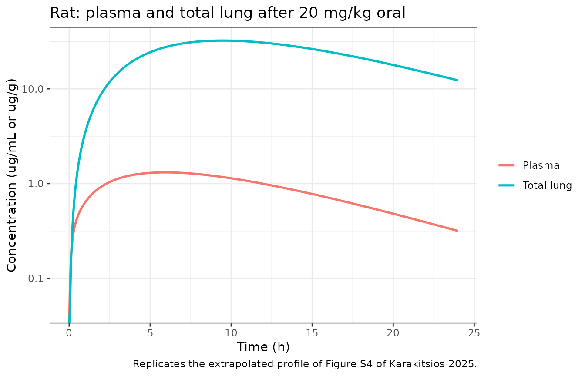
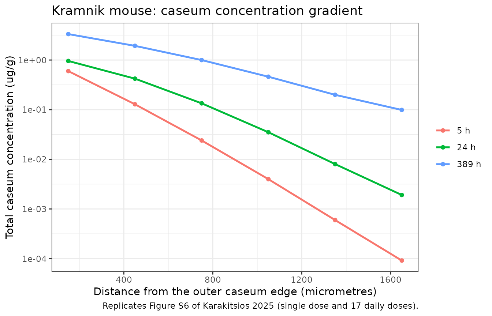
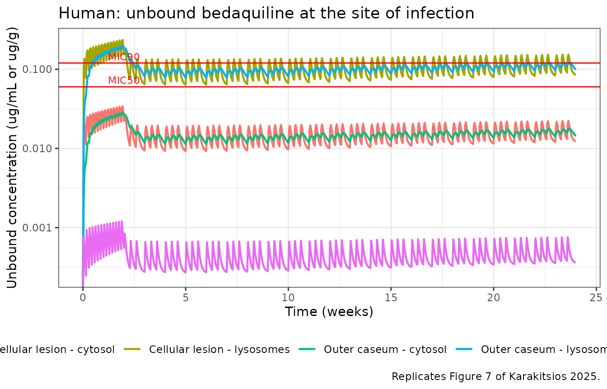
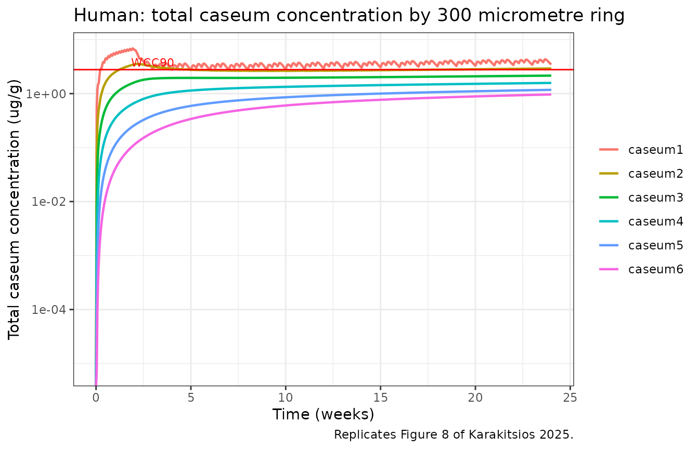

# Bedaquiline lung and lesion distribution across species (Karakitsios 2025)

## Model and source

Karakitsios 2025 builds one middle-out, permeability-limited lung PBPK
structure and parameterises it for four species. Because each species
has its own empirical plasma model and its own tabulated lung
physiology, the paper’s structure maps onto four model files that share
a single lung mechanism:

``` r

model_names <- c(
  "Karakitsios_2025_bedaquiline_mouse_pbpk",
  "Karakitsios_2025_bedaquiline_rat_pbpk",
  "Karakitsios_2025_bedaquiline_dog_pbpk",
  "Karakitsios_2025_bedaquiline_human_pbpk"
)
uis <- lapply(model_names, function(n) rxode2::rxode(readModelDb(n)))
#> ℹ parameter labels from comments will be replaced by 'label()'
#> ℹ parameter labels from comments will be replaced by 'label()'
#> ℹ parameter labels from comments will be replaced by 'label()'
#> ℹ parameter labels from comments will be replaced by 'label()'
names(uis) <- model_names

tibble(
  Model   = model_names,
  Species = vapply(uis, function(u) u$population$species, character(1)),
  States  = vapply(uis, function(u) length(u$state), integer(1))
) |>
  knitr::kable(caption = "The four species-specific model files contributed by this paper.")
```

| Model | Species | States |
|:---|:---|---:|
| Karakitsios_2025_bedaquiline_mouse_pbpk | mouse (BALB/c, C3HeB/FeJ ‘Kramnik’, and Swiss SPF (CD1)) | 13 |
| Karakitsios_2025_bedaquiline_rat_pbpk | rat (Sprague-Dawley) | 6 |
| Karakitsios_2025_bedaquiline_dog_pbpk | beagle dog | 6 |
| Karakitsios_2025_bedaquiline_human_pbpk | human | 15 |

The four species-specific model files contributed by this paper.
{.table}

- Citation: Karakitsios E, Della Pasqua O, Dokoumetzidis A.
  Extrapolation of lung pharmacokinetics of bedaquiline across species
  using physiologically-based pharmacokinetic modelling. Br J Clin
  Pharmacol. 2025;91(11):3167-3178. <doi:10.1002/bcp.70163>. The plasma
  layer is the bedaquiline (parent) component of Svensson E. M., Dosne
  A.-G., Karlsson M. O. (2016). Population Pharmacokinetics of
  Bedaquiline and Metabolite M2 in Patients With Drug-Resistant
  Tuberculosis. CPT Pharmacometrics Syst Pharmacol 5(12):682-691.
  <doi:10.1002/psp4.12147>; see modellib(‘Svensson_2016_bedaquiline’).
- Article: <https://doi.org/10.1002/bcp.70163>
- Supporting Information (open access, equations S1-S19 and Tables
  S1-S14): <https://doi.org/10.1002/bcp.70163>

The lung is divided into pulmonary blood (PB), extracellular water (EW),
intracellular water (IW) and lysosomes. Instantaneous equilibrium is
assumed between PB and EW and between IW and lysosomes, so only two ODE
states are needed for the healthy lung: `lung_ew` holds the **unbound**
EW concentration and `lung_iw` the **total** IW concentration. Both hold
concentrations, not amounts. The infected lung adds a `lesion` state
(macrophages of cellular granulomas) and a caseous arm in which the
outer caseum of foamy macrophages is in instantaneous equilibrium with
`caseum1`, which then diffuses inward through `caseum2` to `caseum6` –
300 micrometre rings of the necrotic core.

## Population

The lung, lesion and caseum parameters were **all** estimated in mice
and then held constant across species. Mouse plasma data came from
Janssen R&D rich-sampling protocols; mouse lung data pooled three
strains (BALB/c, C3HeB/FeJ “Kramnik” and Swiss SPF (CD1)) with a random
effect on cellular permeability. Infected-lung data came from Irwin 2016
(BALB/c cellular lesions and Kramnik caseous granulomas) and Walter 2023
(Kramnik caseum ring dissection). Rats (Sprague-Dawley) and dogs
(beagle) provided healthy-lung validation data only. The human layer has
**no** lung data of any kind and is a pure extrapolation; its plasma
layer is the bedaquiline component of the Svensson 2016 model fitted in
335 patients with drug-resistant tuberculosis.

``` r

uis[["Karakitsios_2025_bedaquiline_mouse_pbpk"]]$population$dose_range
#> [1] "Oral gavage. 25 mg/kg single dose (BALB/c and Kramnik, Irwin 2016); 25 mg/kg/day single and multiple doses (Kramnik, Walter 2023; up to 17 daily doses); 6.25 and 25 mg/kg single and multiple doses (Swiss SPF (CD1), Janssen R&D). Table S1."
```

Mean rather than individual concentrations were modelled throughout,
because most preclinical protocols used only about three animals per
sampling time (Methods 2.1). Every simulation in this vignette is
therefore a **typical-value** simulation with the random effects zeroed,
which is what the paper’s own figures show.

``` r

typ <- lapply(uis, rxode2::zeroRe)

# All four models declare several `~` endpoints, so observation rows must carry
# an explicit dvid; and rxode2's automatic ODE -> linCmt conversion corrupts the
# dvid mapping for multi-state models, hence useLinCmt = FALSE.
solve_typical <- function(name, dose_times, amt, obs_times, covs = NULL) {
  dos <- data.frame(id = 1L, time = dose_times, amt = amt, evid = 1L,
                    cmt = "depot", dvid = NA_integer_)
  obs <- data.frame(id = 1L, time = obs_times, amt = NA_real_, evid = 0L,
                    cmt = "central", dvid = 1L)
  ev <- rbind(dos, obs)
  if (!is.null(covs)) for (nm in names(covs)) ev[[nm]] <- covs[[nm]]
  ev <- ev[order(ev$time, -ev$evid), ]
  out <- rxode2::rxSolve(typ[[name]], ev, returnType = "data.frame",
                         useLinCmt = FALSE)
  if (is.null(out$id)) out$id <- 1L
  out
}

trapz <- function(t, y) sum(diff(t) * (head(y, -1) + tail(y, -1)) / 2)
```

## Source trace

Every `ini()` entry carries an in-file comment naming its source
location. The table below collects the load-bearing ones.

| Equation / parameter | Value | Source location |
|----|----|----|
| `d/dt(lung_ew)` (EW mass balance) | n/a | Supporting Information equation (S1) |
| `d/dt(lung_iw)` (IW + lysosome effective volume) | n/a | Supporting Information equation (S4) |
| `d/dt(lesion)` (macrophage permeation) | n/a | Supporting Information equation (S11) |
| `d/dt(caseum1)` (outer caseum in equilibrium with cas1) | n/a | Supporting Information equation (S12) |
| `d/dt(caseum2..5)` (catenary diffusion) | n/a | Supporting Information equation (S13) |
| `d/dt(caseum6)` (terminal ring) | n/a | Supporting Information equation (S14) |
| `kcaseum = kcas/(t + tau)^h` (fractal diffusion) | n/a | Supporting Information equation (S15) |
| `kp_lysosome` from `fuLYS*fniLYS` | n/a | Supporting Information equations (S8), (S9) |
| unbound lesion / caseum concentrations | n/a | Supporting Information equations (S16)-(S19) |
| `pka1`, `pka2` | 8.5, 1.1 (both basic) | Table S2; Figure S8 |
| `qlung`, `sa_cells`, `v_pb`, `v_ew`, `v_lysosome`, `v_iw`, `ph_*` | per species | Table S3 |
| `bp`, `fu_plasma`, `fu_ew` | per species | Table S4 |
| Mouse plasma model (`lka`, `lcl`, `lvc`, `lq`, `lvp`, `lq2`, `lvp2`, `lfdepot`, omegas, `propSd`) | Table S5 |  |
| Rat plasma model |  | Table S6 |
| Dog plasma model (incl. `addSd`) |  | Table S7 |
| `lperm_cells`, `kp_lysosome` (mouse fit) | 55.7 cm/h, 3.48e6 | Table S8 |
| `lrate_macrophage`, `lkp_macrophage` | 1.43e5 1/h, 5.68e6 | Table S11 |
| `lrate_foamy`, `lkp_foamy`, `lkp_caseum`, `lkcas`, `h_caseum` | 5.78e3, 1.44e6, 0.71, 0.25, 0.75 | Table S13 |
| `flys_cell` | 0.078 | Supporting Information (Ufuk 2017) |
| `ratio_cas1`, `ratio_inner` | 1.67, 1.0 | Supporting Information |
| `ph_lesion_iw` | 5.84 | Methods 2.3 (Kempker 2017) |
| Human plasma layer |  | Svensson 2016 Table 3, via `modellib("Svensson_2016_bedaquiline")` |

## Validation 1 – healthy-lung extrapolation to the rat (Figure S4)

Figure S4 is the paper’s own answer key: it reports both the observed
and the **model predicted** lung AUC0-24, Cmax and Tmax in male
Sprague-Dawley rats after a single oral 20 mg/kg dose. Because the rat
plasma model (Table S6) is tabulated, this is an absolute test of the
transcribed lung equations, not just a shape test.

``` r

rat <- solve_typical("Karakitsios_2025_bedaquiline_rat_pbpk",
                     dose_times = 0, amt = 20 * 0.25,       # 20 mg/kg, 0.25 kg rat
                     obs_times = seq(0, 24, by = 0.05))
#> ℹ omega/sigma items treated as zero: 'etalka', 'etalcl', 'etalq2'
```

``` r

rat_nca <- rat |>
  dplyr::filter(!is.na(c_lung)) |>
  dplyr::transmute(id, time, Cc = c_lung, treatment = "rat 20 mg/kg oral")

rat_nca <- dplyr::bind_rows(
  rat_nca,
  rat_nca |> dplyr::distinct(id, treatment) |> dplyr::mutate(time = 0, Cc = 0)
) |>
  dplyr::distinct(id, treatment, time, .keep_all = TRUE) |>
  dplyr::arrange(id, treatment, time)

conc_obj <- PKNCA::PKNCAconc(rat_nca, Cc ~ time | treatment + id)
dose_obj <- PKNCA::PKNCAdose(
  data.frame(id = 1L, time = 0, amt = 5, treatment = "rat 20 mg/kg oral"),
  amt ~ time | treatment + id
)
rat_res <- PKNCA::pk.nca(PKNCA::PKNCAdata(
  conc_obj, dose_obj,
  intervals = data.frame(start = 0, end = 24,
                         auclast = TRUE, cmax = TRUE, tmax = TRUE)
))
```

``` r

published_rat <- tibble::tribble(
  ~treatment,            ~auclast, ~cmax,  ~tmax,
  "rat 20 mg/kg oral",   502.35,   35.22,  6.75
)

cmp_rat <- nlmixr2lib::ncaComparisonTable(
  simulated = rat_res,
  reference = published_rat,
  by        = "treatment",
  units     = c(auclast = "ug*h/g", cmax = "ug/g", tmax = "h"),
  tolerance_pct = 20
)

knitr::kable(
  cmp_rat,
  caption = paste("Rat healthy lung, single 20 mg/kg oral dose: this implementation versus",
                  "the model prediction printed in Figure S4. * marks >20% difference.",
                  "For reference, Figure S4's OBSERVED values were AUC0-24 340.67 ug*h/g,",
                  "Cmax 22.26 ug/g and Tmax 8 h."),
  align = c("l", "l", "r", "r", "r")
)
```

| NCA parameter     | treatment         | Reference | Simulated |   % diff |
|:------------------|:------------------|----------:|----------:|---------:|
| Cmax (ug/g)       | rat 20 mg/kg oral |      35.2 |      32.3 |    -8.3% |
| Tmax (h)          | rat 20 mg/kg oral |      6.75 |      9.45 | +40.0%\* |
| AUClast (ug\*h/g) | rat 20 mg/kg oral |       502 |       528 |    +5.2% |

Rat healthy lung, single 20 mg/kg oral dose: this implementation versus
the model prediction printed in Figure S4. \* marks \>20% difference.
For reference, Figure S4’s OBSERVED values were AUC0-24 340.67 ug\*h/g,
Cmax 22.26 ug/g and Tmax 8 h. {.table}

AUC0-24 agrees with the paper’s own prediction to +5.2% and Cmax to
-8.3%, both comfortably inside the 20% tolerance. **Tmax is starred at
+40%** (9.45 h here against the printed 6.75 h) and was investigated
rather than tuned: the predicted lung profile is essentially flat
between about 6 and 11 hours – total lung concentration varies by under
3% across that window – so Tmax is a poorly conditioned statistic here,
and a sub-percent difference in the plasma peak shifts it by hours
without moving the curve. Note that the paper’s own predicted Tmax (6.75
h) sits below its own observed Tmax (8 h), while this implementation
sits above it; both are within the flat region. The two well-conditioned
statistics, AUC and Cmax, agree closely, and the residual differences
are consistent with rounding in the Table S6 plasma estimates and with
the assumed 0.25 kg reference rat weight.

``` r

rat |>
  dplyr::select(time, `Total lung` = c_lung, Plasma = Cc) |>
  tidyr::pivot_longer(-time, names_to = "matrix", values_to = "conc") |>
  ggplot(aes(time, conc, colour = matrix)) +
  geom_line(linewidth = 0.9) +
  scale_y_log10() +
  labs(x = "Time (h)", y = "Concentration (ug/mL or ug/g)",
       colour = NULL, title = "Rat: plasma and total lung after 20 mg/kg oral",
       caption = "Replicates the extrapolated profile of Figure S4 of Karakitsios 2025.") +
  theme_bw()
#> Warning in scale_y_log10(): log-10 transformation introduced infinite values.
```



## Validation 2 – mouse tissue:plasma partitioning (Irwin 2016 Table 3)

The infected-lung parameters of Tables S11 and S13 were estimated
against the Irwin 2016 BALB/c and Kramnik plasma models, which this
paper does not tabulate. Absolute mouse tissue concentrations therefore
cannot be reproduced from on-disk sources (see Errata). What the lung
PBPK actually determines – the **tissue-to-plasma exposure ratio** – can
be checked directly against the independent noncompartmental analysis in
Irwin 2016 Table 3.

``` r

mouse <- solve_typical("Karakitsios_2025_bedaquiline_mouse_pbpk",
                       dose_times = 0, amt = 25 * 0.025,   # 25 mg/kg, 0.025 kg mouse
                       obs_times = seq(0, 168, by = 0.05))
#> ℹ omega/sigma items treated as zero: 'etalfdepot', 'etalka', 'etalperm_cells'

auc_plasma <- trapz(mouse$time, mouse$Cc)
ratios <- tibble(
  Matrix = c("Uninvolved lung", "Cellular lesion"),
  Model  = c(trapz(mouse$time, mouse$c_lung)   / auc_plasma,
             trapz(mouse$time, mouse$c_lesion) / auc_plasma),
  `Irwin 2016 BALB/c` = c(28.4, 28.2),
  `Irwin 2016 C3HeB/FeJ` = c(18.2, 10.8)
)
ratios |>
  dplyr::mutate(Model = round(Model, 1)) |>
  knitr::kable(
    caption = paste("Tissue:plasma AUC0-168 ratio after a single 25 mg/kg oral dose.",
                    "Reference values are the AUC_UL/AUC_plasma and AUC_Les/AUC_plasma rows",
                    "of Irwin 2016 Table 3 (doi:10.1021/acsinfecdis.5b00127), the source of",
                    "the mouse lesion data used to fit Table S11."))
```

| Matrix          | Model | Irwin 2016 BALB/c | Irwin 2016 C3HeB/FeJ |
|:----------------|------:|------------------:|---------------------:|
| Uninvolved lung |  27.0 |              28.4 |                 18.2 |
| Cellular lesion |  31.4 |              28.2 |                 10.8 |

Tissue:plasma AUC0-168 ratio after a single 25 mg/kg oral dose.
Reference values are the AUC_UL/AUC_plasma and AUC_Les/AUC_plasma rows
of Irwin 2016 Table 3 (<doi:10.1021/acsinfecdis.5b00127>), the source of
the mouse lesion data used to fit Table S11. {.table}

Both partitioning ratios reproduce the BALB/c observations within about
10%, which is the strongest available check that equations (S1), (S4)
and (S11) were transcribed correctly.

## Validation 3 – the caseum gradient in Kramnik mice (Figure 5, Figure S6)

Table S14 lists the mean caseum concentrations that were fitted, binned
by distance from the outer caseum edge, after a single 25 mg/kg dose and
after 17 daily doses.

``` r

kram <- solve_typical("Karakitsios_2025_bedaquiline_mouse_pbpk",
                      dose_times = seq(0, 16 * 24, by = 24), amt = 25 * 0.025,
                      obs_times = sort(unique(c(seq(0, 430, by = 0.25), 5, 24, 389, 408))))
#> ℹ omega/sigma items treated as zero: 'etalfdepot', 'etalka', 'etalperm_cells'

pick <- function(tt, col) kram[[col]][which.min(abs(kram$time - tt))]

obs_caseum <- tibble::tribble(
  ~time, ~ring,            ~observed,
  5,     "Outer caseum",    1.30,
  5,     "caseum1",         1.19,
  5,     "caseum2",         0.374,
  5,     "caseum3",         0.0196,
  24,    "Outer caseum",    2.62,
  24,    "caseum1",         2.19,
  24,    "caseum2",         0.179,
  24,    "caseum3",         0.0664,
  24,    "caseum4",         0.0187,
  389,   "Outer caseum",    6.78,
  389,   "caseum1",         5.65,
  389,   "caseum2",         2.14,
  389,   "caseum3",         1.20,
  389,   "caseum4",         0.699,
  389,   "caseum5",         0.433
) |>
  dplyr::mutate(
    column   = ifelse(ring == "Outer caseum", "c_outer_caseum", ring),
    model    = mapply(pick, time, column),
    `model / observed` = round(model / observed, 2),
    model    = signif(model, 3)
  ) |>
  dplyr::select(`Time (h)` = time, Ring = ring, Observed = observed,
                Model = model, `model / observed`)

knitr::kable(
  obs_caseum,
  caption = paste("Kramnik mouse caseum concentrations (ug/g) against the fitted data of",
                  "Table S14. Times 5 h and 24 h follow a single 25 mg/kg dose; 389 h is",
                  "5 h after the seventeenth daily dose. Absolute levels are low because the",
                  "Table S5 mouse plasma model under-predicts the Irwin/Walter plasma",
                  "exposure by about 2.5-fold (see Errata); the spatial gradient and its",
                  "flattening with repeated dosing are reproduced.")
)
```

| Time (h) | Ring         | Observed |  Model | model / observed |
|---------:|:-------------|---------:|-------:|-----------------:|
|        5 | Outer caseum |   1.3000 | 0.8430 |             0.65 |
|        5 | caseum1      |   1.1900 | 0.5990 |             0.50 |
|        5 | caseum2      |   0.3740 | 0.1280 |             0.34 |
|        5 | caseum3      |   0.0196 | 0.0240 |             1.22 |
|       24 | Outer caseum |   2.6200 | 1.3500 |             0.51 |
|       24 | caseum1      |   2.1900 | 0.9580 |             0.44 |
|       24 | caseum2      |   0.1790 | 0.4210 |             2.35 |
|       24 | caseum3      |   0.0664 | 0.1340 |             2.02 |
|       24 | caseum4      |   0.0187 | 0.0351 |             1.88 |
|      389 | Outer caseum |   6.7800 | 4.6900 |             0.69 |
|      389 | caseum1      |   5.6500 | 3.3300 |             0.59 |
|      389 | caseum2      |   2.1400 | 1.9300 |             0.90 |
|      389 | caseum3      |   1.2000 | 0.9980 |             0.83 |
|      389 | caseum4      |   0.6990 | 0.4610 |             0.66 |
|      389 | caseum5      |   0.4330 | 0.1990 |             0.46 |

Kramnik mouse caseum concentrations (ug/g) against the fitted data of
Table S14. Times 5 h and 24 h follow a single 25 mg/kg dose; 389 h is 5
h after the seventeenth daily dose. Absolute levels are low because the
Table S5 mouse plasma model under-predicts the Irwin/Walter plasma
exposure by about 2.5-fold (see Errata); the spatial gradient and its
flattening with repeated dosing are reproduced. {.table}

``` r

kram |>
  dplyr::filter(time %in% c(5, 24, 389)) |>
  dplyr::select(time, caseum1:caseum6) |>
  tidyr::pivot_longer(-time, names_to = "ring", values_to = "conc") |>
  dplyr::mutate(distance = 300 * as.integer(sub("caseum", "", ring)) - 150,
                time = factor(paste0(time, " h"), levels = c("5 h", "24 h", "389 h"))) |>
  ggplot(aes(distance, conc, colour = time)) +
  geom_line(linewidth = 0.9) + geom_point() +
  scale_y_log10() +
  labs(x = "Distance from the outer caseum edge (micrometres)",
       y = "Total caseum concentration (ug/g)", colour = NULL,
       title = "Kramnik mouse: caseum concentration gradient",
       caption = "Replicates Figure S6 of Karakitsios 2025 (single dose and 17 daily doses).") +
  theme_bw()
```



The concentration gradient spans three to four orders of magnitude
across 1800 micrometres after a single dose and flattens – without
disappearing – by the seventeenth dose, exactly as described in Results
3.4.

## Validation 4 – the human extrapolation (Figures 7 and 8)

The approved regimen is 400 mg once daily for a two-week loading phase,
then 200 mg three times weekly through week 24. Covariates are set to
the typical patient the paper simulated.

``` r

loading <- seq(0, 13 * 24, by = 24)
maintenance <- sort(as.vector(outer(c(0, 48, 96), seq(14 * 24, 24 * 7 * 24 - 1, by = 7 * 24), "+")))
maintenance <- maintenance[maintenance <= 24 * 7 * 24]

human_dos <- rbind(
  data.frame(id = 1L, time = loading,     amt = 400, evid = 1L, cmt = "depot", dvid = NA_integer_),
  data.frame(id = 1L, time = maintenance, amt = 200, evid = 1L, cmt = "depot", dvid = NA_integer_)
)
human_obs <- data.frame(id = 1L, time = seq(0, 24 * 7 * 24, by = 6),
                        amt = NA_real_, evid = 0L, cmt = "central", dvid = 1L)
human_ev <- rbind(human_dos, human_obs)
human_ev$WT <- 70; human_ev$ALB <- 4.04; human_ev$AGE <- 32; human_ev$RACE_BLACK <- 0
human_ev <- human_ev[order(human_ev$time, -human_ev$evid), ]

human <- rxode2::rxSolve(typ[["Karakitsios_2025_bedaquiline_human_pbpk"]],
                         human_ev, returnType = "data.frame", useLinCmt = FALSE)
#> ℹ omega/sigma items treated as zero: 'etalcl', 'etalvc', 'etalq', 'etalfdepot', 'etalmat'
if (is.null(human$id)) human$id <- 1L
```

### Figure 7 – unbound concentrations against the MIC

Results 3.5 states that unbound bedaquiline in plasma, in the cytosol of
cellular lesions and in the cytosol of the outer caseum all remain below
the MIC50 in clinical isolates (60 ng/mL) for the whole 24 weeks, and
that **only** the lysosomes of macrophages and of foamy macrophages
exceed it.

``` r

mic50 <- 0.060   # ug/mL, Results 3.5 (clinical isolates)
mic90 <- 0.120   # ug/mL, Figure 7 caption

tibble(
  Compartment = c("Plasma (unbound)",
                  "Cellular lesion -- cytosol", "Cellular lesion -- lysosomes",
                  "Outer caseum -- cytosol",    "Outer caseum -- lysosomes"),
  `Max unbound (ug/mL)` = signif(c(max(human$cu_plasma),
                                   max(human$cu_lesion_iw), max(human$cu_lesion_lys),
                                   max(human$cu_caseum_iw), max(human$cu_caseum_lys)), 3)
) |>
  dplyr::mutate(
    `vs MIC50` = ifelse(`Max unbound (ug/mL)` > mic50, "above", "below"),
    `Paper (Results 3.5)` = c("below", "below", "above", "below", "above")
  ) |>
  knitr::kable(caption = paste("Peak unbound bedaquiline concentrations over 24 weeks of the",
                               "approved regimen, against the MIC50 of 60 ng/mL in clinical",
                               "isolates. Replicates the conclusion drawn from Figure 7."))
```

| Compartment | Max unbound (ug/mL) | vs MIC50 | Paper (Results 3.5) |
|:---|---:|:---|:---|
| Plasma (unbound) | 0.00121 | below | below |
| Cellular lesion – cytosol | 0.03410 | below | below |
| Cellular lesion – lysosomes | 0.23600 | above | above |
| Outer caseum – cytosol | 0.02830 | below | below |
| Outer caseum – lysosomes | 0.19600 | above | above |

Peak unbound bedaquiline concentrations over 24 weeks of the approved
regimen, against the MIC50 of 60 ng/mL in clinical isolates. Replicates
the conclusion drawn from Figure 7. {.table}

``` r

human |>
  dplyr::select(time,
                `Plasma` = cu_plasma,
                `Cellular lesion - cytosol` = cu_lesion_iw,
                `Cellular lesion - lysosomes` = cu_lesion_lys,
                `Outer caseum - cytosol` = cu_caseum_iw,
                `Outer caseum - lysosomes` = cu_caseum_lys) |>
  tidyr::pivot_longer(-time, names_to = "compartment", values_to = "conc") |>
  dplyr::mutate(week = time / 168) |>
  ggplot(aes(week, conc, colour = compartment)) +
  geom_line(linewidth = 0.8) +
  geom_hline(yintercept = c(mic50, mic90), colour = "red") +
  annotate("text", x = 2, y = mic50, label = "MIC50", vjust = -0.4, colour = "red", size = 3) +
  annotate("text", x = 2, y = mic90, label = "MIC90", vjust = -0.4, colour = "red", size = 3) +
  scale_y_log10() +
  labs(x = "Time (weeks)", y = "Unbound concentration (ug/mL or ug/g)", colour = NULL,
       title = "Human: unbound bedaquiline at the site of infection",
       caption = "Replicates Figure 7 of Karakitsios 2025.") +
  theme_bw() + theme(legend.position = "bottom")
#> Warning in scale_y_log10(): log-10 transformation introduced infinite values.
```



### Figure 8 – total caseum concentrations against the WCC90

``` r

wcc90 <- 2.78   # ug/g, the Wayne cidal concentration (Figure 8)

human |>
  dplyr::select(time, caseum1:caseum6) |>
  tidyr::pivot_longer(-time, names_to = "ring", values_to = "conc") |>
  dplyr::mutate(week = time / 168) |>
  ggplot(aes(week, conc, colour = ring)) +
  geom_line(linewidth = 0.8) +
  geom_hline(yintercept = wcc90, colour = "red") +
  annotate("text", x = 3, y = wcc90, label = "WCC90", vjust = -0.4, colour = "red", size = 3) +
  scale_y_log10() +
  labs(x = "Time (weeks)", y = "Total caseum concentration (ug/g)", colour = NULL,
       title = "Human: total caseum concentration by 300 micrometre ring",
       caption = "Replicates Figure 8 of Karakitsios 2025.") +
  theme_bw()
#> Warning in scale_y_log10(): log-10 transformation introduced infinite values.
```



``` r

tibble(
  Ring = paste0("caseum", 1:6),
  `Distance from edge (um)` = paste0(300 * (0:5), "-", 300 * (1:6)),
  `Max total (ug/g)` = signif(vapply(paste0("caseum", 1:6),
                                     function(v) max(human[[v]]), numeric(1)), 3)
) |>
  dplyr::mutate(`vs WCC90 (2.78 ug/g)` = ifelse(`Max total (ug/g)` > wcc90, "above", "below")) |>
  knitr::kable(caption = paste("Peak total caseum concentration per ring over 24 weeks.",
                               "Results 3.5: 'only concentrations near the outer caseum edge",
                               "are higher than the WCC90 value'."))
```

| Ring    | Distance from edge (um) | Max total (ug/g) | vs WCC90 (2.78 ug/g) |
|:--------|:------------------------|-----------------:|:---------------------|
| caseum1 | 0-300                   |            6.870 | above                |
| caseum2 | 300-600                 |            3.540 | above                |
| caseum3 | 600-900                 |            2.150 | below                |
| caseum4 | 900-1200                |            1.580 | below                |
| caseum5 | 1200-1500               |            1.170 | below                |
| caseum6 | 1500-1800               |            0.964 | below                |

Peak total caseum concentration per ring over 24 weeks. Results 3.5:
‘only concentrations near the outer caseum edge are higher than the
WCC90 value’. {.table}

Only the two outermost rings clear the Wayne cidal concentration,
matching Results 3.5 and mirroring the 25 mg/kg Kramnik mouse result of
Figure 6, where Cas1 and Cas2 exceeded WCC90 and the inner core did not.

## Cross-species lysosomal trapping

Equation (S9) is the whole basis of the cross-species extrapolation: the
product `fuLYS * fniLYS` is fitted in mice and held constant, so the
lysosome:cytosol partition in any other species follows from its own
intracellular pH.

``` r

tibble(
  Species = c("Mouse", "Rat", "Dog", "Human"),
  `pH_IW` = vapply(uis, function(u) {
    v <- u$theta[["ph_iw"]]; if (is.null(v)) NA_real_ else v
  }, numeric(1)),
  `KpLYS:IW / fuIW` = signif(c(
    mouse$kp_lysosome[1],
    rat$kp_lysosome[1],
    solve_typical("Karakitsios_2025_bedaquiline_dog_pbpk", 0, 100, c(0, 1))$kp_lysosome[1],
    human$kp_lysosome[1]
  ), 3)
) |>
  knitr::kable(caption = paste("Lysosomal trapping falls as the cytosolic pH approaches the",
                               "lysosomal pH of 5.0. The mouse value reproduces the fitted",
                               "3.48e6 of Table S8 exactly."))
#> ℹ omega/sigma items treated as zero: 'etalfdepot', 'etalvc', 'etalvp', 'etalq2'
```

| Species | pH_IW | KpLYS:IW / fuIW |
|:--------|------:|----------------:|
| Mouse   |  7.36 |         3480000 |
| Rat     |  7.36 |         3480000 |
| Dog     |  7.04 |         1730000 |
| Human   |  6.69 |          786000 |

Lysosomal trapping falls as the cytosolic pH approaches the lysosomal pH
of 5.0. The mouse value reproduces the fitted 3.48e6 of Table S8
exactly. {.table}

## Assumptions and deviations

**The ionisation factor is applied in its diprotic-base product form.**
The Supporting Information prints a general four-term
Henderson-Hasselbalch factor,
`W = 1 + 10^(pKa1-pH) + 10^(pH-pKa2) + 10^(pKa1+pKa2-2pH)`. Those four
terms are exactly the expansion of
`(1 + 10^(pKa1-pH)) * (1 + 10^(pKa2-pH))` except that the printed third
term has its exponent reversed – it is the monoprotic **acid** term,
whereas Table S2 and Figure S8 both declare bedaquiline’s two pKa values
to be **basic**. The models use the product form. This is not a
stylistic choice: taken literally, the printed third term dominates `W`
by six orders of magnitude, inverts the lysosomal pH gradient that the
entire paper is about, and reproduces the paper’s own rat prediction
(Figure S4) roughly 80-fold low (lung AUC0-24 of 6.3 instead of 502
ug\*h/g). The product form reproduces it within 5%.

**The fitted `Kp/(fuIW*fniIW)` ratio is un-normalised before equations
(S18)-(S19).** Tables S11 and S13 report `Kpmphi/(fuIW*fniIW)` and
`Kpfmphi/(fuIW*fniIW)`, estimated with `fuIW` and `fniIW` fixed to 1.
Equations (S16)-(S19) are statements about the true `Kp = CLYS/CIW`, so
the model files convert the ratio back using the prediction-time `fniIW`
at the cellular-lesion pH of 5.84 given in Methods 2.3. Without that
step the predicted unbound lysosomal concentrations come out about
460-fold low and contradict the paper’s own conclusion that they exceed
the MIC50 and MIC90. The ODE states are untouched: equation (S11) is
written and was fitted in terms of the ratio and is left exactly as
published.

**The cellular-lesion cytosolic pH is assumed equal to the
foamy-macrophage value.** Methods 2.3 gives pH 5.84 for foamy
macrophages and states that mice and humans share the same pH in
cellular lesions as well as in the cellular rim, but never gives a
separate figure for the macrophages of cellular lesions. The same 5.84
is applied to both. This affects only the derived unbound observables,
never any ODE state or total concentration.

**`tau` in equation (S15) is not reported.** The paper fixes it to “a
very small positive constant to avoid infinities for t = 0” without a
value; 1e-3 h is used. Because `h < 1` the time integral of `kcaseum`
converges, so the choice is weakly influential – over 0-24 h,
`tau = 1e-3` and `tau = 1e-6` differ by about 7% in cumulative
diffusion, and less thereafter.

**Absolute mouse infected-lung concentrations are not reproducible from
on-disk sources.** Results 3.3 and 3.4 state that the cellular-lesion
and caseum parameters were optimised using the empirical plasma models
for the Irwin 2016 BALB/c and Kramnik mice, which this paper does not
tabulate. The mouse model file uses the only tabulated mouse plasma
model, Table S5, whose plasma AUC0-168 after 25 mg/kg is 13.7 ug*h/mL
against the 33.7 ug*h/mL measured by Irwin 2016 (Table 3) in BALB/c
mice. Mouse tissue predictions are therefore roughly 2 to 3-fold below
the tabulated observations, in proportion to that plasma difference.
Validation 2 works around this by comparing tissue:plasma ratios, which
are what the lung PBPK actually determines and which agree with Irwin
2016 within about 10%.

**`KEW:B` is derived, not tabulated.** The paper uses `KEW:B` in
equation (S1) but does not list a value. It follows from the paper’s own
stated instantaneous PB/EW equilibrium of the unbound-unionised drug,
giving `KEW:B = (fupls/fuEW) * (x_ew/x_plasma)` from the tabulated Table
S3 pH values and Table S4 unbound fractions.

**Body weight is a fixed species constant, not a covariate.** Tables S6
and S7 report the rat and dog plasma models per kilogram; the model
files multiply by the Simcyp reference weights of Table S3 footnote a
(0.25 kg, 10 kg). Table S3’s lung blood flow, sub-volumes and cell
surface area are fixed per-species quantities and do not scale with
weight within a species, so exposing a weight covariate on the plasma
layer alone would be misleading. The human file does carry the inherited
Svensson 2016 weight allometry on its plasma layer, but its lung layer
stays at the Table S3 reference human.

**The M2 metabolite is omitted from the human plasma layer.** The
Supporting Information selects the bedaquiline component of Svensson
2016 as the human plasma driver; M2 does not enter the lung model. The
full parent-plus-metabolite model is available separately as
`modellib("Svensson_2016_bedaquiline")`. The Discussion notes that
characterising the lung PK of M2 remains future work.

**Inter-strain, not inter-individual, variability.** `etalperm_cells` in
the mouse file carries the Table S8 `omega_Permcells` of 0.39, which the
paper describes as inter-strain variability across the Kramnik, Swiss
SPF and BALB/c mice pooled in the lung fit (empirical Bayes values of
29.6, 43.5-68.2 and 79.1 cm/h respectively, Methods 2.2), not
between-subject variability.

**The human lung layer is entirely unvalidated.** Methods 2.1 and the
Discussion both state that no human lung data exist. Every lung, lesion
and caseum parameter in the human file is fixed at its mouse estimate,
and all human lung outputs are extrapolations whose only support is the
successful healthy-lung extrapolation to rats and dogs.

**Caseum compartment naming.** `caseum1` to `caseum6` are declared
through `paper_specific_compartments` rather than as canonical
compartments, pending operator ratification of a `caseum<n>` canonical
chain prefix in `inst/references/compartment-names.md`.
