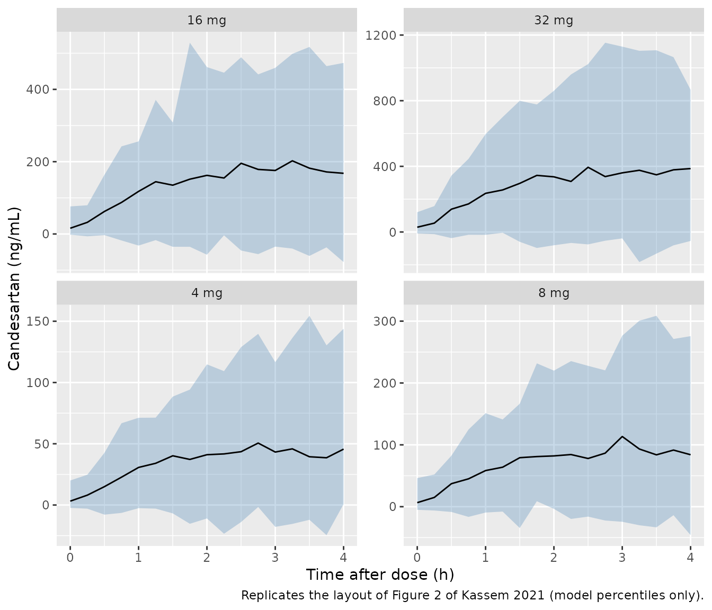

# Candesartan (Kassem 2021)

## Model and source

- Citation: Kassem I, Sanche S, Li J, Bonnefois G, Dube MP, Rouleau JL,
  Tardif JC, White M, Turgeon J, Nekka F, de Denus S. Population
  pharmacokinetics of candesartan in patients with chronic heart
  failure. Clin Transl Sci. 2021 Jan;14(1):194-203.
  <doi:10.1111/cts.12842>. PMCID: PMC7877833.
- Description: One-compartment population PK model for oral candesartan
  (dosed as the prodrug candesartan cilexetil) in white adults with
  chronic heart failure and reduced ejection fraction (Kassem 2021).
  First-order absorption with a lag time feeds a one-compartment
  disposition model. Apparent clearance carries median-normalised power
  effects of body weight and eGFR and a multiplicative effect of
  diabetes; interindividual variability is estimated on apparent
  clearance only. Combined additive + proportional residual error.
- Article: <https://doi.org/10.1111/cts.12842>

Candesartan is an angiotensin II receptor blocker given orally as the
prodrug candesartan cilexetil, which is completely hydrolysed to
candesartan during absorption. Kassem 2021 characterised candesartan
population PK in patients with chronic heart failure (HF) with reduced
ejection fraction who were titrated from 4 mg to a 32 mg once-daily
target, and identified body weight, estimated glomerular filtration rate
(eGFR) and diabetes as determinants of apparent oral clearance (CL/F).

## Population

The analysis used 1,455 plasma concentrations from 281 white patients
enrolled at 16 Canadian centres in a prospective, open-label
pharmacogenomic study (Results; Table 1). Patients had symptomatic HF
with left ventricular ejection fraction at most 40% (mean 29.2%) and
NYHA class II (78.3%) or III-IV (21.7%). Mean (SD) age was 65.6 (10.0)
years and weight 84.0 (19.1) kg; 17% were women. Mean eGFR was 74.2
(22.3) mL/min/1.73 m^2, and 32.7% had diabetes. The candesartan
cilexetil dose was escalated at each titration visit (4, 8, 16 and 32 mg
once daily) when tolerated. The first sample was drawn 2 h after the
first 4 mg dose; later samples were taken at whatever time after the
previous dose the visit fell, and most were within 0-4 h post-dose
(Figure S2).

The same information is available programmatically via
`readModelDb("Kassem_2021_candesartan")()$population`.

## Source trace

Every value comes from Table 2 (final model) and the final-model CL/F
equation in Results; the in-file comments in
`inst/modeldb/specificDrugs/Kassem_2021_candesartan.R` carry the same
trace.

| Equation / parameter | Value | Source location |
|----|----|----|
| `lcl` (CL/F, non-diabetic, 82.45 kg, eGFR 74) | 8.63 L/h (RSE 4%) | Table 2, `CL/F - theta1` |
| `lvc` (Vd/F) | 12.5 L (RSE 10%) | Table 2, `Vd/F - theta2` |
| `lka` | 0.131 1/h (RSE 6%) | Table 2, `Ka - theta3` |
| `ltlag` | 0.165 h (RSE 3%) | Table 2, `TLAG - theta4` |
| `e_wt_cl` | 0.963 (RSE 15%) | Table 2, `Weight effect on CL/F - theta5` |
| `e_crcl_cl` | 0.56 (RSE 18%) | Table 2, `eGFR effect on CL/F - theta6` |
| `e_diab_cl` | 0.682 (RSE 8%) | Table 2, `Diabetes effect on CL/F - theta7` |
| `etalcl` | variance 0.138 (RSE 7%) | Table 2, `omega2 CL/F` |
| `addSd` | sqrt(5.5) = 2.345 ng/mL | Table 2, `sigma2 (additive)` = 5.5 |
| `propSd` | sqrt(0.418) = 0.6465 | Table 2, `sigma2 (proportional)` = 0.418 |
| CL/F = 8.63 (WT/82.45)^0.963 (eGFR/74)^0.56 0.682^Diabetes exp(eta) | n/a | Results, final-model equation |
| Reference weight 82.45 kg, eGFR 74 | n/a | Table 2 footnote (cohort medians) |
| Diabetes coding 0 = no, 1 = yes | n/a | Supplementary Table S1 footnote |
| One compartment, first-order absorption, lag, mixed error, diagonal omega | n/a | Results, model-development paragraph |

Bootstrap means and 95% CIs (Table 3) contain every Table 2 estimate.

## Structural checks

``` r

mod <- rxode2::rxode(readModelDb("Kassem_2021_candesartan"))

# The explicit d/dt() system must be solved as written, not auto-replaced by a
# closed-form linear compartment solution.
stopifnot(is.null(mod$linCmt))

typ_grid <- seq(0.05, 120, by = 0.05)
typ_events <- data.frame(
  id = 1L,
  time = c(0, typ_grid),
  amt = c(4, rep(NA_real_, length(typ_grid))),
  evid = c(1L, rep(0L, length(typ_grid))),
  cmt = c("depot", rep("central", length(typ_grid))),
  WT = 82.45,
  CRCL = 74,
  DIS_DIAB = 0L
)

typ <- rxode2::rxSolve(rxode2::zeroRe(mod), events = typ_events, omega = NA) |>
  as.data.frame()

cl_typ <- unique(round(typ$cl, 6))
vc_typ <- unique(round(typ$vc, 6))
tmax_typ <- typ$time[which.max(typ$Cc)]
c2h_typ <- typ$Cc[abs(typ$time - 2) < 1e-8]

round(c(
  CL_L_per_h = cl_typ, V_L = vc_typ, tmax_h = tmax_typ,
  Cmax_ng_per_mL = max(typ$Cc), C2h_ng_per_mL = c2h_typ
), 3)
#>     CL_L_per_h            V_L         tmax_h Cmax_ng_per_mL  C2h_ng_per_mL 
#>          8.630         12.500          3.150         41.141         37.815
```

With ka = 0.131 1/h and kel = CL/V = 0.69 1/h the model is flip-flop:
the terminal slope is set by absorption, so the terminal half-life of a
typical patient is ln(2)/ka = 5.3 h and the typical peak falls about 3.2
h after the dose – consistent with the 3-4 h tmax usually reported for
candesartan.

``` r

# Check 1 -- the typical CL/F and V/F are the Table 2 values.
stopifnot(abs(cl_typ - 8.63) < 1e-4, abs(vc_typ - 12.5) < 1e-4)

# Check 2 -- dose recovery. F is absorbed into CL/F and V/F, so
# CL/F * AUC(0-inf) must return the 4 mg dose (AUC in ng.h/mL -> mg.h/L).
auc_trap <- sum(diff(c(0, typ$time)) * (c(0, utils::head(typ$Cc, -1)) + typ$Cc) / 2)
lz <- -diff(log(utils::tail(typ$Cc, 2))) / 0.05
auc_inf <- (auc_trap + utils::tail(typ$Cc, 1) / lz) / 1000
stopifnot(
  abs(cl_typ * auc_inf / 4 - 1) < 0.005,
  # Mutation control: a 20% wrong clearance must not recover the dose.
  abs(cl_typ * 1.2 * auc_inf / 4 - 1) > 0.05,
  # Terminal slope is the absorption rate constant (flip-flop).
  abs(lz - 0.131) < 0.001
)
round(c(auc_inf_mg_h_per_L = auc_inf, dose_recovered_mg = cl_typ * auc_inf), 3)
#> auc_inf_mg_h_per_L  dose_recovered_mg 
#>              0.464              4.000
```

## Figure 3: covariate effects on CL/F

Figure 3 of Kassem 2021 gives, for single covariate values, the
probability that CL/F falls more than 25% below the population typical
value. Those probabilities are reproduced to within one percentage point
when the covariate effect is drawn from the parameter **uncertainty**
(normal, SE = RSE x estimate from Table 2) rather than from
interindividual variability. For a power effect `(x/ref)^theta` the
event “CL/F ratio \< 0.75” is `theta > log(0.75)/log(x/ref)` when
`x < ref`; for the diabetes factor it is `theta7 < 0.75`.

``` r

th <- c(wt = 0.963, gfr = 0.56, diab = 0.682)
se <- c(wt = 0.15 * 0.963, gfr = 0.18 * 0.56, diab = 0.08 * 0.682)

p_power_drop <- function(x, ref, est, sd) {
  1 - stats::pnorm(log(0.75) / log(x / ref), mean = est, sd = sd)
}

fig3 <- tibble::tribble(
  ~scenario, ~typical_ratio, ~p_drop_gt25, ~published,
  "Diabetes",
  th[["diab"]], stats::pnorm(0.75, th[["diab"]], se[["diab"]]), 0.90,
  "Weight = 60 kg",
  (60 / 82.45)^th[["wt"]], p_power_drop(60, 82.45, th[["wt"]], se[["wt"]]), 0.65,
  "eGFR = 45",
  (45 / 74)^th[["gfr"]], p_power_drop(45, 74, th[["gfr"]], se[["gfr"]]), 0.42
)

fig3 |>
  mutate(
    typical_change_pct = 100 * (typical_ratio - 1),
    p_drop_gt25 = 100 * p_drop_gt25,
    published = 100 * published
  ) |>
  select(scenario, typical_change_pct, p_drop_gt25, published) |>
  dplyr::rename(
    "Scenario" = scenario,
    "Typical CL/F change (%)" = typical_change_pct,
    "P(decrease > 25%), model (%)" = p_drop_gt25,
    "P(decrease > 25%), Figure 3 (%)" = published
  ) |>
  knitr::kable(digits = 1, caption = "Replicates the single-covariate probabilities of Figure 3 of Kassem 2021.")
```

| Scenario | Typical CL/F change (%) | P(decrease \> 25%), model (%) | P(decrease \> 25%), Figure 3 (%) |
|:---|---:|---:|---:|
| Diabetes | -31.8 | 89.4 | 90 |
| Weight = 60 kg | -26.4 | 65.6 | 65 |
| eGFR = 45 | -24.3 | 42.8 | 42 |

Replicates the single-covariate probabilities of Figure 3 of Kassem
2021. {.table}

``` r


# Deterministic gate: every probability within 2 percentage points.
stopifnot(all(abs(fig3$p_drop_gt25 - fig3$published) < 0.02))

# Mutation control: the same probability for diabetes computed from the IIV
# (omega2 = 0.138) instead of parameter uncertainty is about 60%, far from the
# published 90%, so the gate discriminates between the two readings.
p_iiv <- stats::pnorm((log(0.75) - log(0.682)) / sqrt(0.138))
stopifnot(abs(p_iiv - 0.90) > 0.2)
round(p_iiv, 3)
#> [1] 0.601
```

This confirms the transcription of the three covariate coefficients, the
two normalising medians (82.45 kg and 74 mL/min/1.73 m^2) and the power
/ multiplicative forms together.

## Virtual cohort

Observed data are not public. The cohort draws weight and eGFR
independently from normal distributions with the Table 1 means and SDs,
and diabetes as a Bernoulli variable with the Table 1 prevalence. Weight
and eGFR outside plausible ranges are rejected and redrawn (not
clamped).

``` r

set.seed(20210101)
n_sub <- 200L

draw_trunc <- function(n, mean, sd, lo, hi) {
  out <- numeric(0)
  while (length(out) < n) {
    x <- stats::rnorm(n, mean, sd)
    out <- c(out, x[x >= lo & x <= hi])
  }
  out[seq_len(n)]
}

subjects <- tibble(
  id = seq_len(n_sub),
  WT = draw_trunc(n_sub, 84.0, 19.1, 40, 160),
  CRCL = draw_trunc(n_sub, 74.2, 22.3, 15, 150),
  DIS_DIAB = stats::rbinom(n_sub, 1, 0.327)
) |>
  mutate(
    # Kassem 2021 'predicted low-clearance population' (Table 4 footnote).
    low_cl = (DIS_DIAB == 1 & CRCL <= 60) | (WT <= 70 & CRCL <= 45)
  )

round(c(
  WT_mean = mean(subjects$WT), CRCL_mean = mean(subjects$CRCL),
  diabetes_pct = 100 * mean(subjects$DIS_DIAB),
  low_cl_pct = 100 * mean(subjects$low_cl)
), 1)
#>      WT_mean    CRCL_mean diabetes_pct   low_cl_pct 
#>         85.9         74.2         33.0         11.0
```

## Table 4: concentration 2 h after the first 4 mg dose

At week 0 every patient received 4 mg candesartan cilexetil and was
sampled 2 h later. Table 4 reports a mean (SD) of 44 (34) ng/mL in 208
patients outside the predicted low-clearance group and 52 (33.3) ng/mL
in 38 inside it. The simulation below includes residual error, since the
table summarises observations.

``` r

ev_2h <- bind_rows(
  subjects |> mutate(time = 0, amt = 4, evid = 1L, cmt = "depot"),
  subjects |> mutate(time = 2, amt = NA_real_, evid = 0L, cmt = "central")
) |>
  arrange(id, time, desc(evid))

rxode2::rxSetSeed(20210102)
sim_2h <- rxode2::rxSolve(
  mod,
  events = ev_2h,
  omega = mod$omega,
  keep = c("low_cl"),
  addDosing = FALSE
) |>
  as.data.frame()

stopifnot(dplyr::n_distinct(round(sim_2h$cl, 8)) > 1L)

tab4 <- sim_2h |>
  group_by(low_cl) |>
  summarise(n = dplyr::n(), mean_sim = mean(sim), sd_sim = sd(sim), .groups = "drop") |>
  mutate(
    mean_obs = ifelse(low_cl, 52, 44),
    sd_obs = ifelse(low_cl, 33.3, 34)
  )

tab4 |>
  dplyr::rename(
    "Predicted low clearance" = low_cl,
    "N simulated" = n,
    "Simulated mean (ng/mL)" = mean_sim,
    "Simulated SD (ng/mL)" = sd_sim,
    "Table 4 mean (ng/mL)" = mean_obs,
    "Table 4 SD (ng/mL)" = sd_obs
  ) |>
  knitr::kable(digits = 1, caption = "Replicates the week-0 rows of Table 4 of Kassem 2021.")
```

| Predicted low clearance | N simulated | Simulated mean (ng/mL) | Simulated SD (ng/mL) | Table 4 mean (ng/mL) | Table 4 SD (ng/mL) |
|:---|---:|---:|---:|---:|---:|
| FALSE | 178 | 38.7 | 27.0 | 44 | 34.0 |
| TRUE | 22 | 45.0 | 28.9 | 52 | 33.3 |

Replicates the week-0 rows of Table 4 of Kassem 2021. {.table}

``` r


# Pooled centre: Table 4 week-0 pooled mean is (208 * 44 + 38 * 52) / 246 = 45.2.
# The centre is gated on the residual-free individual prediction (`ipredSim`):
# the proportional error is mean-zero, so it moves the expected mean not at all
# but adds most of the sampling noise, and dropping it keeps the gate stable
# across random-number streams.
pooled_obs <- (208 * 44 + 38 * 52) / 246
pooled_sd_obs <- 34
mean_ipred <- mean(sim_2h$ipredSim)

# Alternative readings, each checked against the same observations:
# (a) doses in candesartan free-acid equivalents (x 440.5 / 610.7);
mw_ratio <- 440.5 / 610.7
# (b) the Table 2 proportional sigma read as an SD rather than a variance.
mod_sd_reading <- suppressMessages(mod |> rxode2::ini(propSd = 0.418))
rxode2::rxSetSeed(20210102)
sim_2h_alt <- rxode2::rxSolve(
  mod_sd_reading,
  events = ev_2h,
  omega = mod$omega,
  addDosing = FALSE
) |>
  as.data.frame()

round(c(
  pooled_mean_obs = pooled_obs,
  mean_ipred = mean_ipred,
  mean_ipred_free_acid_dose = mw_ratio * mean_ipred,
  sd_obs = pooled_sd_obs,
  sd_sim = sd(sim_2h$sim),
  sd_sim_sigma_as_sd = sd(sim_2h_alt$sim)
), 1)
#>           pooled_mean_obs                mean_ipred mean_ipred_free_acid_dose 
#>                      45.2                      40.5                      29.2 
#>                    sd_obs                    sd_sim        sd_sim_sigma_as_sd 
#>                      34.0                      27.2                      18.6

stopifnot(
  abs(mean_ipred / pooled_obs - 1) < 0.2,
  abs(mw_ratio * mean_ipred / pooled_obs - 1) > 0.25,
  abs(sd(sim_2h$sim) - pooled_sd_obs) < abs(sd(sim_2h_alt$sim) - pooled_sd_obs)
)
```

The simulated mean 2-h concentration lies within 20% of the observed
pooled mean (-10%), and the simulated SD is of the same order as the
observed 34 ng/mL; the observed spread also carries the imprecision of
the recorded sampling times, which the simulation does not. The check
rules out two other readings of the paper. Dosing in candesartan (free
acid) equivalents rather than milligrams of candesartan cilexetil would
scale every concentration by 440.5/610.7 = 0.72 and put the mean more
than 25% below the observed one. Reading the Table 2 proportional sigma
as an SD (0.418) instead of a variance gives a simulated SD further from
the observed 34 ng/mL than the variance reading does.

## Figure 2: concentrations 0-4 h after a steady-state dose

Figure 2 of Kassem 2021 is a VPC between 0 and 4 h post-dose stratified
by dose. The observed percentiles are not tabulated, so the panel below
shows the model-predicted 2.5th, 50th and 97.5th percentiles (with
residual error) for each dose at steady state, for visual comparison
with the published figure.

``` r

vpc_subj <- subjects |> slice_head(n = 100)
doses <- c(4, 8, 16, 32)
ss_time <- 24 * 9 # 10 daily doses; the terminal half-life is about 5-10 h
obs_grid <- ss_time + seq(0, 4, by = 0.25)

ev_vpc <- bind_rows(lapply(seq_along(doses), function(i) {
  s <- vpc_subj |> mutate(id = id + (i - 1L) * 1000L, dose_mg = doses[i])
  bind_rows(
    tidyr::expand_grid(s, time = seq(0, ss_time, by = 24)) |>
      mutate(amt = dose_mg, evid = 1L, cmt = "depot"),
    tidyr::expand_grid(s, time = obs_grid) |>
      mutate(amt = NA_real_, evid = 0L, cmt = "central")
  )
})) |>
  arrange(id, time, desc(evid))

rxode2::rxSetSeed(20210103)
sim_vpc <- rxode2::rxSolve(
  mod,
  events = ev_vpc,
  omega = mod$omega,
  keep = c("dose_mg"),
  addDosing = FALSE
) |>
  as.data.frame() |>
  mutate(tad = time - ss_time)

sim_vpc |>
  group_by(dose_mg, tad) |>
  summarise(
    lo = quantile(sim, 0.025), med = median(sim), hi = quantile(sim, 0.975),
    .groups = "drop"
  ) |>
  ggplot(aes(tad, med)) +
  geom_ribbon(aes(ymin = lo, ymax = hi), fill = "steelblue", alpha = 0.3) +
  geom_line() +
  facet_wrap(~ paste(dose_mg, "mg"), scales = "free_y") +
  labs(
    x = "Time after dose (h)", y = "Candesartan (ng/mL)",
    caption = "Replicates the layout of Figure 2 of Kassem 2021 (model percentiles only)."
  )
```



## PKNCA validation

The paper simulated each patient for 72 h after a dose and estimated the
terminal half-life by log-linear regression, reporting 6.2 h (range 4-18
h). The same analysis is run here with PKNCA after a single 4 mg or 32
mg dose.

``` r

nca_grid <- c(0, 0.25, 0.5, 1, 1.5, 2, 3, 4, 5, 6, 8, 10, 12, 16, 24, 36, 48, 60, 72)
nca_subj <- subjects |> slice_head(n = 100)

ev_nca <- bind_rows(lapply(c(4, 32), function(d) {
  s <- nca_subj |>
    mutate(id = id + ifelse(d == 4, 0L, 1000L), treatment = paste(d, "mg"), dose_mg = d)
  bind_rows(
    s |> mutate(time = 0, amt = dose_mg, evid = 1L, cmt = "depot"),
    tidyr::expand_grid(s, time = nca_grid) |>
      mutate(amt = NA_real_, evid = 0L, cmt = "central")
  )
})) |>
  arrange(id, time, desc(evid))

sim_nca <- rxode2::rxSolve(
  mod,
  events = ev_nca,
  omega = mod$omega,
  keep = c("treatment"),
  addDosing = FALSE
) |>
  as.data.frame() |>
  dplyr::filter(!is.na(Cc)) |>
  select(id, time, Cc, treatment)

stopifnot(all(sim_nca$time[!duplicated(sim_nca$id)] == 0))

dose_nca <- ev_nca |>
  dplyr::filter(evid == 1) |>
  select(id, time, amt, treatment)

conc_obj <- PKNCA::PKNCAconc(sim_nca, Cc ~ time | treatment + id, concu = "ng/mL", timeu = "h")
dose_obj <- PKNCA::PKNCAdose(dose_nca, amt ~ time | treatment + id, doseu = "mg")
intervals <- data.frame(
  start = 0, end = Inf,
  cmax = TRUE, tmax = TRUE, aucinf.obs = TRUE, half.life = TRUE
)
nca_res <- PKNCA::pk.nca(PKNCA::PKNCAdata(conc_obj, dose_obj, intervals = intervals))

nca_tbl <- as.data.frame(nca_res$result) |>
  dplyr::filter(PPTESTCD %in% c("cmax", "tmax", "aucinf.obs", "half.life")) |>
  group_by(treatment, PPTESTCD) |>
  summarise(median = median(PPORRES, na.rm = TRUE), .groups = "drop") |>
  tidyr::pivot_wider(names_from = PPTESTCD, values_from = median)

nca_tbl |>
  dplyr::rename(
    "Treatment" = treatment,
    "Cmax (ng/mL)" = cmax,
    "Tmax (h)" = tmax,
    "AUC0-inf (ng.h/mL)" = aucinf.obs,
    "Terminal t1/2 (h)" = half.life
  ) |>
  knitr::kable(digits = 2, caption = "Median simulated single-dose NCA (100 virtual patients per dose).")
```

| Treatment | AUC0-inf (ng.h/mL) | Cmax (ng/mL) | Terminal t1/2 (h) | Tmax (h) |
|:----------|-------------------:|-------------:|------------------:|---------:|
| 32 mg     |            4432.51 |        373.4 |              5.31 |        4 |
| 4 mg      |             563.28 |         47.3 |              5.32 |        4 |

Median simulated single-dose NCA (100 virtual patients per dose).
{.table}

``` r

hl_sim <- as.data.frame(nca_res$result) |>
  dplyr::filter(PPTESTCD == "half.life") |>
  group_by(treatment) |>
  summarise(PPTESTCD = "half.life", PPORRES = mean(PPORRES, na.rm = TRUE), .groups = "drop")

cmp <- nlmixr2lib::ncaComparisonTable(
  simulated = hl_sim,
  reference = data.frame(treatment = c("4 mg", "32 mg"), half.life = 6.2),
  by = "treatment",
  units = c(half.life = "h"),
  tolerance_pct = 20
)
knitr::kable(
  cmp,
  digits = 2,
  caption = "Mean simulated terminal half-life vs the 6.2 h reported in Kassem 2021 Results. * differs by more than 20%."
)
```

| NCA parameter | treatment | Reference | Simulated | % diff |
|:--------------|:----------|:----------|:----------|:-------|
| t½ (h)        | 4 mg      | 6.2       | 5.32      | -14.2% |
| t½ (h)        | 32 mg     | 6.2       | 5.32      | -14.2% |

Mean simulated terminal half-life vs the 6.2 h reported in Kassem 2021
Results. \* differs by more than 20%. {.table}

``` r


# The model is linear, so the half-life does not depend on dose; its centre
# must sit near the published 6.2 h and at or above ln(2)/ka = 5.3 h.
hl_all <- as.data.frame(nca_res$result) |>
  dplyr::filter(PPTESTCD == "half.life") |>
  dplyr::pull(PPORRES)
stopifnot(
  abs(mean(hl_all, na.rm = TRUE) / 6.2 - 1) < 0.2,
  median(hl_all, na.rm = TRUE) > 5.0
)
```

The simulated mean terminal half-life sits about 14% below the published
6.2 h. Because ka carries no IIV, the terminal phase of most patients is
the absorption half-life (5.3 h); only patients whose CL/F falls below
ka x V/F = 1.6 L/h show a longer, elimination-limited terminal phase.
The paper’s 6.2 h mean and 18 h upper range came from empirical Bayes
estimates of each observed patient and from its own choice of regression
window, neither of which is reproducible from the published tables.

## Assumptions and deviations

- **Dose unit.** Doses are milligrams of candesartan cilexetil, as
  administered and as reported in the paper; no molecular-weight
  conversion to candesartan is applied. The week-0 2-h concentrations of
  Table 4 support this reading (see above).
- **Residual error scale.** Table 2 reports the residual error as
  variances (`sigma2`); the model uses their square roots (additive SD
  2.345 ng/mL, proportional SD 0.6465). The additive term is in ng/mL,
  the assay unit. The mixed error model is NONMEM’s
  `Y = F + eps1 + F * eps2` with independent epsilons, which is
  nlmixr2’s `add() + prop()` default (combined2).
- **Interindividual variability** was estimated on CL/F only (Table 2);
  Vd/F, ka and the lag time have none.
- **eGFR method.** The eGFR estimating equation is not stated; values
  are in mL/min/1.73 m^2 (Table 1) and map to the `CRCL` column.
- **Virtual cohort.** Weight and eGFR are drawn independently from the
  Table 1 means and SDs; their correlation in the real cohort is not
  reported. Diabetes is drawn independently of weight, although the
  paper notes that patients with diabetes were usually overweight.
- **Covariates screened but not retained** (age, NT-proBNP, furosemide,
  sex) are documented in the model’s `covariatesDataExcluded` list with
  their Supplementary Table S1 objective-function changes.
- **Scope.** The paper’s separate men-only and women-only clearance
  analyses (structural model, no estimates beyond CL/F 7.96 vs 5.9 L/h)
  and its pharmacodynamic comparisons (Supplementary Tables S3-S4,
  statistical models of potassium, blood pressure and eGFR change) are
  not population PK/PD models and are not encoded.
