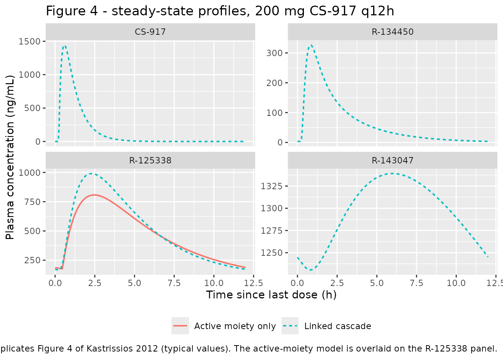

# Managlinat dialanetil (CS-917) prodrug cascade (Kastrissios 2012)

## Model and source

Kastrissios 2012 develops **two** population pharmacokinetic models of
the same data set and compares them, which is the point of the paper’s
title. Both are packaged:

``` r

linked <- readModelDb("Kastrissios_2012_managlinatDialanetil_linked")
active <- readModelDb("Kastrissios_2012_managlinatDialanetil_activeMoiety")

ui_linked <- rxode2::rxode(linked)
#> ℹ parameter labels from comments will be replaced by 'label()'
ui_active <- rxode2::rxode(active)
#> ℹ parameter labels from comments will be replaced by 'label()'
```

- Citation: Kastrissios H, Walker JR, Carrothers TJ, Kshirsagar S,
  Khariton T, Habtemariam B, Mager DE, Rohatagi S. Population
  pharmacokinetic model for a novel oral hypoglycemic formed in vivo:
  comparing the use of active metabolite data alone versus using data of
  upstream and downstream metabolites. J Clin Pharmacol.
  2012;52(3):404-415. <doi:10.1177/0091270010396373>
- Article: <https://doi.org/10.1177/0091270010396373>
- Linked cascade model: `Kastrissios_2012_managlinatDialanetil_linked`
- Active-moiety-only model:
  `Kastrissios_2012_managlinatDialanetil_activeMoiety`

CS-917 (INN managlinat dialanetil) is an oral prodrug inhibitor of
hepatic fructose-1,6-bisphosphatase, the enzyme catalysing the
rate-limiting step of gluconeogenesis. It is not itself active. An
esterase converts it to the inactive R-134450; hepatic phosphoramidase
converts that to the **active moiety R-125338**; and R-125338 is cleared
partly by renal excretion and partly by N-acetylation to the
slowly-forming, long-half-life inactive R-143047 (Kastrissios 2012
Introduction p. 405 and Figure 1).

| Moiety | Structure | Source |
|----|----|----|
| CS-917 (prodrug) | 1-compartment, first-order absorption + lag | Results p. 408; a 2nd compartment gave OFV 14333.2 vs 14337.4, i.e. no substantive improvement |
| R-134450 | 2-compartment, first-order formation from CS-917 | Results p. 408 |
| R-125338 (**active**) | 2-compartment, first-order formation from R-134450 | Results p. 408 |
| R-143047 | 1-compartment, first-order formation from R-125338 | Results p. 408 |

### Why the inter-moiety flux carries no fraction-metabolised term

Kastrissios 2012 p. 408 states that for each metabolite the apparent
clearance and volume terms “were expressed relative to the oral
bioavailability of CS-917 **and the fraction of CS-917 metabolized to
moiety of interest, neither of which were known**”. Writing each
metabolite’s amount in those same apparent units – `A* = A / (F * fm)` –
makes the unknown `fm` cancel out of the transfer term:

    true:      dA_m/dt = fm * kel_p * A_p       - kel_m * A_m
    apparent:  dA*_m/dt =     kel_p * A*_p      - kel_m * A*_m

so the packaged model transfers the **whole** upstream
central-compartment elimination flux with no fractional multiplier, and
every metabolite `CL/F`, `Q/F`, `Vc/F` and `Vp/F` is apparent in the
compound sense `CL/(F*fm)`. The mass-balance gate below tests this
encoding exactly rather than by inspection.

## Population

141 patients (90 men, 51 women) with type 2 diabetes mellitus
contributed 8961 observations across six studies – four phase I (A, B,
E, F) and two phase IIa (C, D) – per Kastrissios 2012 Table I. Entry
required hemoglobin A1c \>= 6.5% and fasting plasma glucose 160-300
mg/dL. Baseline characteristics (Table II): age 58 +/- 9 years, body
weight 87 +/- 16 kg, body mass index 31 +/- 5 kg/m^2, creatinine
clearance 73 +/- 20 mL/min, alanine aminotransferase 27 +/- 12 IU/L,
aspartate aminotransferase 21 +/- 7 IU/L, total bilirubin 0.69 +/- 0.26
mg/dL. Race was 87 White / 19 Black / 35 Hispanic and dosing was 109
tablet-with-food / 32 fasted-capsule. Renal and hepatic function were
“primarily normal, and there was not a wide variation in these terms
within the population” – which is why the paper’s renal-impairment
conclusions come from simulation rather than from observed impaired
patients.

Doses spanned 50-400 mg CS-917 given QD, BID or TID for 10-28 days; all
subjects received multiple doses. Fitted in NONMEM 5.1.1 with the
first-order method.

``` r

str(ui_linked$population)
#> List of 11
#>  $ species       : chr "human"
#>  $ n_subjects    : int 141
#>  $ n_studies     : int 6
#>  $ n_observations: int 8961
#>  $ age_range     : chr "mean 58 +/- 9 years (range not reported)"
#>  $ weight_range  : chr "mean 87 +/- 16 kg (range not reported)"
#>  $ sex_female_pct: num 36.2
#>  $ race_ethnicity: Named num [1:3] 61.7 13.5 24.8
#>   ..- attr(*, "names")= chr [1:3] "White" "Black" "Hispanic"
#>  $ disease_state : chr "Type 2 diabetes mellitus; entry required hemoglobin A1c >= 6.5% and fasting plasma glucose 160-300 mg/dL at bas"| __truncated__
#>  $ dose_range    : chr "Multiple oral CS-917 50-400 mg, QD / BID / TID, over 10-28 days (or 14 days per period in the two crossover stu"| __truncated__
#>  $ notes         : chr "Four phase I studies (A, B, E, F) and two phase IIa studies (C, D) per Table I. Only monotherapy observations w"| __truncated__
```

## Source trace

Every `ini()` entry carries its Table III cell as an in-file comment in
`inst/modeldb/specificDrugs/Kastrissios_2012_managlinatDialanetil_linked.R`
and `..._activeMoiety.R`. Collected here for review:

| Equation / parameter | Value | Source location |
|----|----|----|
| `d/dt` cascade structure | n/a | Figure 1 (metabolism pathways) + Results “Structural Model Development” p. 408 |
| Continuous covariate form `(Cov/Cov_median)^eff` | n/a | Eq. (3), Methods p. 406 |
| Categorical covariate form `exp(Cov * eff)` | n/a | Eq. (4), Methods p. 406 |
| IIV form `theta * exp(eta)` | n/a | Eq. (1), Methods p. 406 |
| Residual form `yhat*(1+eps1) + eps2` | n/a | Eq. (2), Methods p. 406 |
| `lka` (CS-917) | 5.40 1/h | Table III, CS-917 ka |
| `ltlag` (CS-917) | 0.23 h | Table III, CS-917 Tlag |
| `lcl` (CS-917) | 85.1 L/h | Table III + footnote `Cl/F = 85.1*(WT/86)^0.95` |
| `lvc` (CS-917) | 68.0 L | Table III + footnote `Vc/F = 68*(WT/86)^0.63` |
| `lfdepot` (CS-917) | 1 (fixed) | Table III footnote `F = 1*exp(-0.27*KFood)` |
| `e_wt_cl`, `e_wt_vc` | 0.95, 0.63 | Table III Effect, body weight on CL/F and Vc/F |
| `e_fed_fdepot` | -0.27 | Table III Effect, food on relative F |
| `lcl_r134450`, `lvc_r134450`, `lq_r134450`, `lvp_r134450` | 187, 50.7, 197, 249 | Table III, R-134450 column |
| `e_age_cl_r134450`, `e_race_black_cl_r134450` | -0.55, -0.37 | Table III Effect, age and black race on CL/F |
| `lcl_r125338`, `lvc_r125338`, `lq_r125338`, `lvp_r125338` | 30.9, 60.7, 7.07, 278 | Table III, R-125338 column + footnote |
| `e_crcl_cl_r125338`, `e_fed_cl_r125338`, `e_race_black_vc_r125338` | 0.36, -0.22, -0.56 | Table III Effect + footnote equations |
| `lcl_r143047`, `lvc_r143047` | 9.81, 338 | Table III, R-143047 column |
| `e_wt_cl_r143047` | 0.61 | Table III Effect, body weight on CL/F |
| `e_sexf_vc_r143047` | -0.28 | Table III Effect (row labelled CL/F; placed on Vc/F per body text – see Errata) |
| all `eta*` variances | Table III | Table III “Interindividual variability” block, read as variances |
| all `propSd`, `addSd` | `sqrt(Table III)` | Table III “Residual error” block, read as variances |
| active-moiety model, all parameters | Table III | Table III “Single Moiety” column |
| Reference WT = 86 kg, CRCL = 70 mL/min | exact | Table III footnote equations |
| Reference AGE = 58 years | assumed | not printed; Table II mean (see Errata) |

## Gate 1 – steady-state mass balance across the whole cascade

This is the tightest available check on the cascade encoding. In a
linear cascade in which each moiety receives the entire upstream
elimination flux, steady-state input equals output over one dosing
interval `tau` for **every** moiety, so

    CL_i * AUC(0-tau)_i = F * Dose        for i in {CS-917, R-134450, R-125338, R-143047}

i.e. every moiety’s interval AUC is `F * Dose / CL_i` regardless of its
own volumes, its intercompartmental clearance, or where it sits in the
chain. A wrong flux term (e.g. a spurious `fm` multiplier, or
transferring the distribution flux as well as the elimination flux)
breaks the identity for the downstream moieties while leaving the parent
intact, so this simultaneously tests the structure and confirms that
steady state was actually reached.

Both sides use the same drawn parameters, so the only difference is
numerical (trapezoidal integration on a fine grid); a tight bound is the
correct assertion here.

``` r

tau       <- 12    # h, dosing interval (see the regimen note under Gate 3)
dose_mg   <- 100
n_days    <- 14
last_dose <- (n_days * 24 / tau - 1) * tau

# One event-table builder used by every simulation below.
#
# Observation rows are where a multi-endpoint model most often breaks. The
# LINKED model declares four `~` endpoints, and rxode2 turns each into a
# pseudo-compartment appended AFTER the seven ODE states, then requires every
# observation record to identify one of them. So obs rows need `dvid`; a bare
# `cmt = "central"` with no `dvid` fails with
#   'dvid'->'cmt' or 'cmt' on observation record or on a undefined compartment
# Both parts are kept here: `cmt = "central"` names the ODE state (the usual
# convention, and what the linter expects) AND `dvid = 1L` selects an endpoint.
# Naming one endpoint is enough -- rxSolve returns every observable column at
# those rows, so a single dvid gives Cc, Cc_r134450, Cc_r125338 and Cc_r143047
# together. The single-endpoint ACTIVE-MOIETY model needs no dvid.
#
# Build the table as a plain data frame rather than by chaining `rxode2::et()`:
# an et() chain carrying both `cmt` and `dvid` produced a malformed table here.
build_events <- function(subj, model = c("linked", "active"),
                         dose = dose_mg, obs_times,
                         dose_times = seq(0, last_dose, by = tau)) {
  model <- match.arg(model)
  dosing <- subj |>
    tidyr::crossing(time = dose_times) |>
    mutate(amt = dose, evid = 1L, cmt = "depot")
  obs <- subj |>
    tidyr::crossing(time = obs_times) |>
    mutate(amt = NA_real_, evid = 0L, cmt = "central")
  if (model == "linked") {
    dosing <- mutate(dosing, dvid = NA_integer_)
    obs    <- mutate(obs,    dvid = 1L)
  }
  bind_rows(dosing, obs) |> arrange(id, time, desc(evid))
}

# Trapezoidal AUC on a fine grid.
trap <- function(x, y) sum(diff(x) * (utils::head(y, -1) + utils::tail(y, -1)) / 2)

# The paper's base case: "a white male patient with typical covariate values"
# (Methods p. 407), at the printed reference weight and creatinine clearance.
typ_subj <- tibble(id = 1L, WT = 86, AGE = 58, CRCL = 70,
                   SEXF = 0, RACE_BLACK = 0, FED = 1)
```

``` r

fine <- seq(last_dose, last_dose + tau, by = 0.02)

sim_gate <- rxode2::rxSolve(
  rxode2::zeroRe(linked),
  events = build_events(typ_subj, "linked", obs_times = fine),
  useLinCmt = FALSE) |>
  as.data.frame()
#> ℹ parameter labels from comments will be replaced by 'label()'
#> ℹ omega/sigma items treated as zero: 'etalka', 'etaltlag', 'etalcl', 'etalvc', 'etalcl_r134450', 'etalvc_r134450', 'etalq_r134450', 'etalvp_r134450', 'etalcl_r125338', 'etalvc_r125338', 'etalq_r125338', 'etalvp_r125338', 'etalcl_r143047', 'etalvc_r143047'

obs_gate <- sim_gate[!is.na(sim_gate$Cc), ]
fdepot_typ   <- exp(-0.27 * typ_subj$FED)     # Table III footnote
expected_auc <- 1000 * fdepot_typ * dose_mg   # ng*h/mL numerator

# Individual apparent clearances at the typical covariate values.
cl_typ <- c(
  `CS-917`   = 85.1 * (typ_subj$WT / 86)^0.95,
  `R-134450` = 187  * (typ_subj$AGE / 58)^-0.55 * exp(-0.37 * typ_subj$RACE_BLACK),
  `R-125338` = 30.9 * (typ_subj$CRCL / 70)^0.36 * exp(-0.22 * typ_subj$FED),
  `R-143047` = 9.81 * (typ_subj$WT / 86)^0.61
)

auc_obs <- c(
  `CS-917`   = trap(obs_gate$time, obs_gate$Cc),
  `R-134450` = trap(obs_gate$time, obs_gate$Cc_r134450),
  `R-125338` = trap(obs_gate$time, obs_gate$Cc_r125338),
  `R-143047` = trap(obs_gate$time, obs_gate$Cc_r143047)
)

gate1 <- tibble(
  Moiety                         = names(cl_typ),
  `CL/F (L/h)`                   = round(as.numeric(cl_typ), 3),
  `Simulated AUC0-tau (ng*h/mL)` = round(as.numeric(auc_obs), 1),
  `F*Dose/CL (ng*h/mL)`          = round(expected_auc / as.numeric(cl_typ), 1)
) |>
  mutate(`% diff` = round(100 * (`Simulated AUC0-tau (ng*h/mL)` /
                                   `F*Dose/CL (ng*h/mL)` - 1), 3))

knitr::kable(gate1, caption = paste(
  "Gate 1: steady-state mass balance. Every moiety's interval AUC must equal",
  "F*Dose/CL exactly, whatever its position in the cascade."))
```

| Moiety   | CL/F (L/h) | Simulated AUC0-tau (ng\*h/mL) | F*Dose/CL (ng*h/mL) | % diff |
|:---------|-----------:|------------------------------:|--------------------:|-------:|
| CS-917   |     85.100 |                         897.1 |               897.0 |  0.011 |
| R-134450 |    187.000 |                         408.2 |               408.2 |  0.000 |
| R-125338 |     24.798 |                        3077.3 |              3078.4 | -0.036 |
| R-143047 |      9.810 |                        7773.1 |              7781.6 | -0.109 |

Gate 1: steady-state mass balance. Every moiety’s interval AUC must
equal F\*Dose/CL exactly, whatever its position in the cascade. {.table}

``` r


stopifnot(nrow(gate1) == 4L, all(abs(gate1$`% diff`) < 0.5))
```

All four moieties satisfy the identity, which confirms (a) the cascade
transfers the full upstream elimination flux with no `fm` term, (b) the
distribution flux is correctly excluded from the transfer, (c) the
`x 1000` mg/L-to-ng/mL scale factor, and (d) that 14 days of q12h dosing
reaches steady state even for R-143047, the slowest moiety (apparent
`t1/2 = ln(2)*338/9.81 =` 23.9 h).

The same identity holds for the reduced active-moiety model, where the
prodrug-to-active-moiety conversion is folded into the apparent
parameters and there is no separate `F`:

``` r

sim_gate_a <- rxode2::rxSolve(
  rxode2::zeroRe(active),
  events = build_events(typ_subj, "active", obs_times = fine),
  useLinCmt = FALSE) |>
  as.data.frame()
#> ℹ parameter labels from comments will be replaced by 'label()'
#> ℹ omega/sigma items treated as zero: 'etalka', 'etalcl', 'etalvc', 'etalq', 'etalvp'

obs_a <- sim_gate_a[!is.na(sim_gate_a$Cc), ]
cl_a  <- 35.3 * (typ_subj$CRCL / 70)^0.37
auc_a <- trap(obs_a$time, obs_a$Cc)
pct_a <- 100 * (auc_a / (1000 * dose_mg / cl_a) - 1)

cat(sprintf("active-moiety model: AUC0-tau = %.1f vs Dose/CL = %.1f ng*h/mL (%+.3f%%)\n",
            auc_a, 1000 * dose_mg / cl_a, pct_a))
#> active-moiety model: AUC0-tau = 2830.1 vs Dose/CL = 2832.9 ng*h/mL (-0.096%)
stopifnot(abs(pct_a) < 0.5)
```

## Gate 2 – covariate-effect identities

The paper quotes the size of each retained covariate effect in prose,
which gives an independent check on every coefficient and on the choice
of functional form. Categorical effects use `exp(theta_eff)` (Eq. 4) and
reproduce the quoted percentages essentially exactly; continuous effects
use the power form (Eq. 3), and note that the paper’s quoted percentages
for these are the **linearisation** `theta_eff x %change` rather than
the power model itself, so they agree only to rounding.

``` r

ini_linked <- ui_linked$iniDf
th <- function(nm) ini_linked$est[match(nm, ini_linked$name)]

categorical <- tibble::tribble(
  ~Effect,                                    ~Parameter,                 ~`Paper claim (%)`,
  "Food on CS-917 relative bioavailability",  "e_fed_fdepot",             -24,
  "Food on R-125338 CL/F",                    "e_fed_cl_r125338",         -20,
  "Black race on R-125338 Vc/F",              "e_race_black_vc_r125338",  -43,
  "Black race on R-134450 CL/F",              "e_race_black_cl_r134450",  -31,
  "Female sex on R-143047 Vc/F",              "e_sexf_vc_r143047",        -25
) |>
  mutate(
    Coefficient      = vapply(Parameter, th, numeric(1)),
    `Model (%)`      = round(100 * (exp(Coefficient) - 1), 1),
    `Abs. error (pp)`= abs(`Model (%)` - `Paper claim (%)`)
  )

knitr::kable(categorical, caption = paste(
  "Gate 2a: each categorical coefficient reproduces the paper's own quoted",
  "percentage change under the exponential form of Eq. (4)."))
```

| Effect | Parameter | Paper claim (%) | Coefficient | Model (%) | Abs. error (pp) |
|:---|:---|---:|---:|---:|---:|
| Food on CS-917 relative bioavailability | e_fed_fdepot | -24 | -0.27 | -23.7 | 0.3 |
| Food on R-125338 CL/F | e_fed_cl_r125338 | -20 | -0.22 | -19.7 | 0.3 |
| Black race on R-125338 Vc/F | e_race_black_vc_r125338 | -43 | -0.56 | -42.9 | 0.1 |
| Black race on R-134450 CL/F | e_race_black_cl_r134450 | -31 | -0.37 | -30.9 | 0.1 |
| Female sex on R-143047 Vc/F | e_sexf_vc_r143047 | -25 | -0.28 | -24.4 | 0.6 |

Gate 2a: each categorical coefficient reproduces the paper’s own quoted
percentage change under the exponential form of Eq. (4). {.table
style="width:100%;"}

``` r


# Every categorical effect must land within 1 percentage point of the paper's
# rounded claim. This is what pins Eq. (4) as the form (a linear-additive
# reading would give the coefficient itself, e.g. -27% not -24%).
stopifnot(nrow(categorical) == 5L, all(categorical$`Abs. error (pp)` < 1))

continuous <- tibble::tribble(
  ~Effect,                     ~Parameter,           ~`Paper claim (%)`,
  "Body weight on CS-917 CL/F", "e_wt_cl",            9.5,
  "Body weight on CS-917 Vc/F", "e_wt_vc",            6.3,
  "Body weight on R-143047 CL/F", "e_wt_cl_r143047",  6.1,
  "Age on R-134450 CL/F",       "e_age_cl_r134450",  -5.5
) |>
  mutate(
    Exponent            = vapply(Parameter, th, numeric(1)),
    `Power model (%)`   = round(100 * (1.1^Exponent - 1), 2),
    `Linearised (%)`    = round(10 * Exponent, 2)
  )

knitr::kable(continuous, caption = paste(
  "Gate 2b: effect of a 10% increase in the covariate. The paper's quoted",
  "values match the LINEARISATION, confirming the exponents but not the form;",
  "the printed Table III footnote equations pin the form as a power model."))
```

| Effect | Parameter | Paper claim (%) | Exponent | Power model (%) | Linearised (%) |
|:---|:---|---:|---:|---:|---:|
| Body weight on CS-917 CL/F | e_wt_cl | 9.5 | 0.95 | 9.48 | 9.5 |
| Body weight on CS-917 Vc/F | e_wt_vc | 6.3 | 0.63 | 6.19 | 6.3 |
| Body weight on R-143047 CL/F | e_wt_cl_r143047 | 6.1 | 0.61 | 5.99 | 6.1 |
| Age on R-134450 CL/F | e_age_cl_r134450 | -5.5 | -0.55 | -5.11 | -5.5 |

Gate 2b: effect of a 10% increase in the covariate. The paper’s quoted
values match the LINEARISATION, confirming the exponents but not the
form; the printed Table III footnote equations pin the form as a power
model. {.table}

``` r


# The exponents are confirmed against the linearised claim to 0.1 pp.
stopifnot(all(abs(continuous$`Linearised (%)` - continuous$`Paper claim (%)`) < 0.1))
```

## Gate 3 – the renal-impairment exposure anchors

The paper’s headline pharmacological conclusion is a renal one, and it
is stated twice as a typical-value (deterministic) result, which makes
it a clean gate needing no cohort and no seed:

> “Halving CLCR from 70 mL/min for the typical patient to 35 mL/min
> resulted in a 27% increase in R-125338 exposure” (linked model), and
> “31%” for the active-moiety model.

Because the interval AUC is `F*Dose/CL` (Gate 1) and `CL` scales as
`CRCL^exponent`, the predicted ratio is exactly `2^exponent` – 1.2834
for the linked model’s 0.36 and 1.2924 for the active-moiety model’s
0.37.

**Regimen note.** Methods p. 407 describes the simulation as “100 mg
CS-917 daily” but reports `AUCss,0-12`, a 12-hour window. Gate 1
resolves the ambiguity: 100 mg per 12-hour interval reproduces Table
IV’s normal-renal `AUCss,0-12` of 3020 ng*h/mL to within a few percent
(`1000 * exp(-0.27) * 100 / (30.9 * exp(-0.22))` = 3078 ng*h/mL at the
cohort-median CLCR of 70), whereas a 100 mg once-daily regimen would put
only part of the interval AUC in a 0-12 h window and could not. So
`tau = 12` h with 100 mg per dose is used throughout.

``` r

renal_auc <- function(mod, which, crcl) {
  subj <- typ_subj
  subj$CRCL <- crcl
  s <- rxode2::rxSolve(rxode2::zeroRe(mod),
                       events = build_events(subj, which, obs_times = fine),
                       useLinCmt = FALSE) |>
    as.data.frame()
  s <- s[!is.na(s$Cc), ]
  trap(s$time, if (which == "linked") s$Cc_r125338 else s$Cc)
}

ratio_linked <- renal_auc(linked, "linked", 35) / renal_auc(linked, "linked", 70)
#> ℹ parameter labels from comments will be replaced by 'label()'
#> ℹ omega/sigma items treated as zero: 'etalka', 'etaltlag', 'etalcl', 'etalvc', 'etalcl_r134450', 'etalvc_r134450', 'etalq_r134450', 'etalvp_r134450', 'etalcl_r125338', 'etalvc_r125338', 'etalq_r125338', 'etalvp_r125338', 'etalcl_r143047', 'etalvc_r143047'
#> ℹ parameter labels from comments will be replaced by 'label()'
#> ℹ omega/sigma items treated as zero: 'etalka', 'etaltlag', 'etalcl', 'etalvc', 'etalcl_r134450', 'etalvc_r134450', 'etalq_r134450', 'etalvp_r134450', 'etalcl_r125338', 'etalvc_r125338', 'etalq_r125338', 'etalvp_r125338', 'etalcl_r143047', 'etalvc_r143047'
ratio_active <- renal_auc(active, "active", 35) / renal_auc(active, "active", 70)
#> ℹ parameter labels from comments will be replaced by 'label()'
#> ℹ omega/sigma items treated as zero: 'etalka', 'etalcl', 'etalvc', 'etalq', 'etalvp'
#> ℹ parameter labels from comments will be replaced by 'label()'
#> ℹ omega/sigma items treated as zero: 'etalka', 'etalcl', 'etalvc', 'etalq', 'etalvp'

gate3 <- tibble(
  Model             = c("Linked cascade", "Active moiety only"),
  Exponent          = c(0.36, 0.37),
  `Paper claim (%)` = c(27, 31),
  `Simulated (%)`   = round(100 * (c(ratio_linked, ratio_active) - 1), 1),
  `2^exponent (%)`  = round(100 * (2^c(0.36, 0.37) - 1), 1)
)
knitr::kable(gate3, caption = paste(
  "Gate 3: increase in R-125338 interval exposure on halving creatinine",
  "clearance from 70 to 35 mL/min, typical patient."))
```

| Model              | Exponent | Paper claim (%) | Simulated (%) | 2^exponent (%) |
|:-------------------|---------:|----------------:|--------------:|---------------:|
| Linked cascade     |     0.36 |              27 |          28.3 |           28.3 |
| Active moiety only |     0.37 |              31 |          29.2 |           29.2 |

Gate 3: increase in R-125338 interval exposure on halving creatinine
clearance from 70 to 35 mL/min, typical patient. {.table}

``` r


# The simulated ratio must equal 2^exponent (the closed form implied by Gate 1)
# to well under a percent, and sit within 2 pp of the paper's rounded claim.
stopifnot(
  abs(100 * (ratio_linked - 1) - 100 * (2^0.36 - 1)) < 0.5,
  abs(100 * (ratio_active - 1) - 100 * (2^0.37 - 1)) < 0.5,
  abs(100 * (ratio_linked - 1) - 27) < 2,
  abs(100 * (ratio_active - 1) - 31) < 2
)
```

Both models land within 2 percentage points of the published figures,
and the gap between the simulated value and the paper’s is the paper’s
own rounding of a partial-interval readout.

## Replicating Figure 4 – the four-moiety steady-state profile

Figure 4A shows the linked model’s steady-state profiles for all four
moieties at 200 mg BID; Figure 4B shows the active-moiety model’s
R-125338 profile for the same regimen. Typical-value profiles are shown
here (Figure 4 is a visual predictive check against observed data that
is not publicly available).

``` r

fig_grid <- seq(last_dose, last_dose + tau, by = 0.05)

sim_fig <- rxode2::rxSolve(
  rxode2::zeroRe(linked),
  events = build_events(typ_subj, "linked", dose = 200, obs_times = fig_grid),
  useLinCmt = FALSE) |>
  as.data.frame() |>
  filter(!is.na(Cc))
#> ℹ parameter labels from comments will be replaced by 'label()'
#> ℹ omega/sigma items treated as zero: 'etalka', 'etaltlag', 'etalcl', 'etalvc', 'etalcl_r134450', 'etalvc_r134450', 'etalq_r134450', 'etalvp_r134450', 'etalcl_r125338', 'etalvc_r125338', 'etalq_r125338', 'etalvp_r125338', 'etalcl_r143047', 'etalvc_r143047'

sim_fig_a <- rxode2::rxSolve(
  rxode2::zeroRe(active),
  events = build_events(typ_subj, "active", dose = 200, obs_times = fig_grid),
  useLinCmt = FALSE) |>
  as.data.frame() |>
  filter(!is.na(Cc))
#> ℹ parameter labels from comments will be replaced by 'label()'
#> ℹ omega/sigma items treated as zero: 'etalka', 'etalcl', 'etalvc', 'etalq', 'etalvp'

bind_rows(
  sim_fig |>
    select(time, `CS-917` = Cc, `R-134450` = Cc_r134450,
           `R-125338` = Cc_r125338, `R-143047` = Cc_r143047) |>
    pivot_longer(-time, names_to = "Moiety", values_to = "conc") |>
    mutate(Model = "Linked cascade"),
  sim_fig_a |>
    select(time, conc = Cc) |>
    mutate(Moiety = "R-125338", Model = "Active moiety only")
) |>
  mutate(tad = time - last_dose,
         Moiety = factor(Moiety, levels = c("CS-917", "R-134450",
                                            "R-125338", "R-143047"))) |>
  ggplot(aes(tad, conc, colour = Model, linetype = Model)) +
  geom_line(linewidth = 0.7) +
  facet_wrap(~Moiety, scales = "free_y") +
  labs(x = "Time since last dose (h)", y = "Plasma concentration (ng/mL)",
       colour = NULL, linetype = NULL,
       title = "Figure 4 - steady-state profiles, 200 mg CS-917 q12h",
       caption = paste("Replicates Figure 4 of Kastrissios 2012 (typical values).",
                       "The active-moiety model is overlaid on the R-125338 panel.")) +
  theme(legend.position = "bottom")
```



The two models’ R-125338 profiles agree closely in exposure but differ
in peak shape – exactly the difference the paper reports: “Although the
linked compartmental model was somewhat better in characterizing peak
plasma concentrations of R-125338, correlation between individual
R-125338 predictions for the minimal model and the linked compartmental
model was .989” (Figure 5).

``` r

peak <- sim_fig |>
  summarise(linked_cmax = max(Cc_r125338)) |>
  bind_cols(sim_fig_a |> summarise(active_cmax = max(Cc)))
auc_pair <- c(linked = trap(sim_fig$time, sim_fig$Cc_r125338),
              active = trap(sim_fig_a$time, sim_fig_a$Cc))

cat(sprintf("R-125338 typical Cmax,ss: linked %.0f vs active-moiety %.0f ng/mL (%.1f%% apart)\n",
            peak$linked_cmax, peak$active_cmax,
            100 * (peak$active_cmax / peak$linked_cmax - 1)))
#> R-125338 typical Cmax,ss: linked 991 vs active-moiety 808 ng/mL (-18.5% apart)
cat(sprintf("R-125338 typical AUC0-tau: linked %.0f vs active-moiety %.0f ng*h/mL (%.1f%% apart)\n",
            auc_pair[["linked"]], auc_pair[["active"]],
            100 * (auc_pair[["active"]] / auc_pair[["linked"]] - 1)))
#> R-125338 typical AUC0-tau: linked 6155 vs active-moiety 5660 ng*h/mL (-8.0% apart)
```

Figure 5’s correlation of 0.989 is between the two models’ *individual*
(post-hoc, per-patient) predictions on the observed data set. It cannot
be reproduced here because it requires the individual empirical-Bayes
estimates from both fits, which are not published; the typical-value
comparison above is the reproducible analogue.

## Reproducing Table IV – the simulated renal-impairment study

Table IV reports mean steady-state R-125338 `Cmax` and `AUCss,0-12` for
200 simulated patients in each of four renal-function bands at 100 mg
CS-917. Reconstructed here with 150 subjects per band (below the
200-per-arm cap), one `rxSolve` per band.

``` r

set.seed(20120222)

bands <- tibble::tribble(
  ~treatment,  ~lo, ~hi,
  "80-120",     80, 120,
  "50-80",      50,  80,
  "30-50",      30,  50,
  "< 30",       10,  30
)
n_per_band <- 150L

# The paper does not state the within-band CLCR distribution, only the band
# edges. A UNIFORM draw within each band is used, which is identifiable from
# the paper's own published ratios rather than merely assumed: since
# AUC0-tau ~ CRCL^-0.36 (Gate 1), the band-to-band AUC ratio is
# E[CRCL^-0.36] over one band divided by the same over the reference band, and
# for uniform draws that closed form gives 1.17 / 1.39 / 1.82 against Table
# IV's published 1.17 / 1.48 / 1.83. Drawing instead from the cohort's own
# N(73, 20) truncated to each band gives 1.16 / 1.32 / 1.62, which is a clearly
# worse match to the severe band. See Assumptions.
band_exp_ratio <- function(lo, hi, lo0, hi0, p = 0.36) {
  m <- function(a, b) (b^(1 - p) - a^(1 - p)) / ((1 - p) * (b - a))
  m(lo, hi) / m(lo0, hi0)
}

# Dense early for Cmax, coarser through the rest of the interval. A coarse grid
# near the peak makes max(Cc) a grid artefact rather than a model prediction.
obs_ss <- last_dose + c(seq(0, 4, by = 0.05), seq(4.25, tau, by = 0.25))

band_subj <- function(lab, lo, hi, id_offset) {
  tibble(
    id        = id_offset + seq_len(n_per_band),
    treatment = lab,
    CRCL      = runif(n_per_band, lo, hi),
    # Non-renal covariates held at the paper's base case.
    WT = 86, AGE = 58, SEXF = 0, RACE_BLACK = 0, FED = 1
  )
}

subjects <- bind_rows(
  band_subj("80-120",  80, 120,   0L),
  band_subj("50-80",   50,  80, 200L),
  band_subj("30-50",   30,  50, 400L),
  band_subj("< 30",    10,  30, 600L)
)

events   <- build_events(subjects, "linked", obs_times = obs_ss)
events_a <- build_events(subjects, "active", obs_times = obs_ss)
stopifnot(!anyDuplicated(unique(events[, c("id", "time", "evid")])),
          nrow(subjects) == 4L * n_per_band)
```

``` r

# rxSolve on an rxUi is quadratic in subjects per call, so solve one band at a
# time and bind the results rather than passing all 600 subjects at once.
sim <- lapply(split(events, events$treatment), function(ev) {
  rxode2::rxSolve(linked, events = ev,
                  keep = c("treatment", "CRCL"),
                  useLinCmt = FALSE) |>
    as.data.frame()
}) |>
  bind_rows()
#> ℹ parameter labels from comments will be replaced by 'label()'

sim$treatment <- factor(sim$treatment, levels = bands$treatment)
```

``` r

sim_nca <- sim |>
  filter(!is.na(Cc_r125338)) |>
  transmute(id, time = time - last_dose, Cc = Cc_r125338,
            treatment = as.character(treatment))

# Guarantee a time-zero row per (id, treatment). At steady state the trough is
# not zero, so carry the earliest simulated concentration rather than 0.
sim_nca <- bind_rows(
  sim_nca,
  sim_nca |> group_by(id, treatment) |> slice_min(time, n = 1) |>
    ungroup() |> mutate(time = 0)
) |>
  distinct(id, treatment, time, .keep_all = TRUE) |>
  arrange(id, treatment, time)

dose_df <- events |>
  filter(evid == 1L, time == last_dose) |>
  transmute(id, time = 0, amt, treatment)

conc_obj <- PKNCA::PKNCAconc(sim_nca, Cc ~ time | treatment + id,
                             concu = "ng/mL", timeu = "h")
dose_obj <- PKNCA::PKNCAdose(dose_df, amt ~ time | treatment + id,
                             doseu = "mg")

intervals <- data.frame(
  start = 0, end = tau,
  cmax = TRUE, tmax = TRUE, auclast = TRUE, cav = TRUE, cmin = TRUE
)

nca_res <- PKNCA::pk.nca(PKNCA::PKNCAdata(conc_obj, dose_obj,
                                          intervals = intervals))
```

### Comparison against Table IV

``` r

published <- tibble::tribble(
  ~treatment, ~cmax, ~auclast,
  "80-120",     448,     3020,
  "50-80",      535,     3520,
  "30-50",      598,     4480,
  "< 30",       636,     5530
)

cmp <- nlmixr2lib::ncaComparisonTable(
  simulated     = nca_res,
  reference     = published,
  by            = "treatment",
  units         = c(cmax = "ng/mL", auclast = "ng*h/mL"),
  tolerance_pct = 20
)

knitr::kable(
  cmp,
  caption = paste("Simulated vs. Kastrissios 2012 Table IV, steady-state",
                  "R-125338 at 100 mg CS-917 q12h. * differs by >20%."),
  align = c("l", "l", "r", "r", "r")
)
```

| NCA parameter      | treatment | Reference | Simulated | % diff |
|:-------------------|:----------|----------:|----------:|-------:|
| Cmax (ng/mL)       | 80-120    |       448 |       453 |  +1.2% |
| Cmax (ng/mL)       | 50-80     |       535 |       457 | -14.5% |
| Cmax (ng/mL)       | 30-50     |       598 |       530 | -11.4% |
| Cmax (ng/mL)       | \< 30     |       636 |       597 |  -6.2% |
| AUClast (ng\*h/mL) | 80-120    |      3020 |      2680 | -11.2% |
| AUClast (ng\*h/mL) | 50-80     |      3520 |      3190 |  -9.3% |
| AUClast (ng\*h/mL) | 30-50     |      4480 |      3680 | -17.8% |
| AUClast (ng\*h/mL) | \< 30     |      5530 |      4730 | -14.5% |

Simulated vs. Kastrissios 2012 Table IV, steady-state R-125338 at 100 mg
CS-917 q12h. \* differs by \>20%. {.table}

``` r

attr(cmp, "footnote")
#> NULL
```

The scenario-independent part of Table IV – the *ratios* between renal
bands – is the part that tests the model rather than the reconstruction
of the paper’s unpublished simulation scenario, because the food,
weight, race and sex factors cancel in a ratio. The paper states the
moderate-impairment result explicitly: “In patients with moderate renal
impairment (CLCR = 30 to 50 mL/min), R-125338 Cmax,ss and AUCss,0-12
increased 30% and 50%, respectively, relative to patients with normal
renal function (\> 80 mL/min).”

``` r

# Table IV reports "Mean (SEM)", so this table aggregates by MEAN. (The
# `ncaComparisonTable()` above aggregates by median, which is the helper's
# fixed convention; for these right-skewed exposures the two differ by a few
# percent.)
band_med <- as.data.frame(nca_res$result) |>
  filter(PPTESTCD %in% c("cmax", "auclast")) |>
  group_by(treatment, PPTESTCD) |>
  summarise(value = mean(PPORRES), .groups = "drop") |>
  pivot_wider(names_from = PPTESTCD, values_from = value) |>
  # Order by DECLINING renal function, not alphabetically: the band labels sort
  # as "< 30" < "30-50" < "50-80" < "80-120", i.e. exactly reversed, which would
  # silently invert the monotonicity assertion below.
  mutate(treatment = factor(treatment, levels = bands$treatment)) |>
  arrange(treatment)
stopifnot(!anyNA(band_med$treatment), nrow(band_med) == nrow(bands))

ref <- band_med |> filter(treatment == "80-120")
ratios <- band_med |>
  mutate(`Cmax ratio vs normal`    = round(cmax / ref$cmax, 3),
         `AUC0-tau ratio vs normal`= round(auclast / ref$auclast, 3)) |>
  select(treatment, `Cmax ratio vs normal`, `AUC0-tau ratio vs normal`)

published_ratios <- published |>
  mutate(`Published Cmax ratio` = round(cmax / 448, 3),
         `Published AUC ratio`  = round(auclast / 3020, 3)) |>
  select(treatment, `Published Cmax ratio`, `Published AUC ratio`)

ratios |>
  mutate(treatment = as.character(treatment)) |>
  left_join(published_ratios, by = "treatment") |>
  rename("Creatinine clearance (mL/min)" = treatment) |>
  knitr::kable(caption = paste("Renal-band exposure ratios relative to normal",
                               "renal function: simulated vs published."))
```

| Creatinine clearance (mL/min) | Cmax ratio vs normal | AUC0-tau ratio vs normal | Published Cmax ratio | Published AUC ratio |
|:---|---:|---:|---:|---:|
| 80-120 | 1.000 | 1.000 | 1.000 | 1.000 |
| 50-80 | 0.969 | 1.151 | 1.194 | 1.166 |
| 30-50 | 1.140 | 1.343 | 1.335 | 1.483 |
| \< 30 | 1.331 | 1.720 | 1.420 | 1.831 |

Renal-band exposure ratios relative to normal renal function: simulated
vs published. {.table}

``` r


mod_row <- ratios |> filter(treatment == "30-50")

# Cohort AUC gate. The AUC signal between adjacent bands (12-20%) is far larger
# than the Monte-Carlo noise on a 150-subject mean, so monotonicity is a real
# test here. The closed form of the previous chunk gives the target.
closed_form <- c(1, vapply(2:4, function(i)
  band_exp_ratio(bands$lo[i], bands$hi[i], bands$lo[1], bands$hi[1]),
  numeric(1)))
stopifnot(
  all(diff(ratios$`AUC0-tau ratio vs normal`) > 0),
  # each band's cohort AUC ratio must sit within 10% of its closed form
  all(abs(ratios$`AUC0-tau ratio vs normal` / closed_form - 1) < 0.10),
  mod_row$`AUC0-tau ratio vs normal` > mod_row$`Cmax ratio vs normal`,
  mod_row$`AUC0-tau ratio vs normal` > 1.2
)

# Cmax is deliberately NOT asserted on the cohort. R-125338 carries an IIV
# variance of 0.72 on Vc/F (about 100% CV), and Cmax depends on clearance only
# weakly, so the between-band Cmax signal (a few percent) is smaller than the
# Monte-Carlo error on a 150-subject mean - the cohort Cmax means are genuinely
# non-monotone here for that reason alone. The monotonicity that the model does
# assert is the TYPICAL-VALUE one, which is deterministic and testable.
cmax_typ <- vapply(c(100, 65, 40, 20), function(cr) {
  subj <- typ_subj
  subj$CRCL <- cr
  s <- rxode2::rxSolve(rxode2::zeroRe(linked),
                       events = build_events(subj, "linked", obs_times = fine),
                       useLinCmt = FALSE) |>
    as.data.frame()
  max(s$Cc_r125338[!is.na(s$Cc)])
}, numeric(1))
#> ℹ parameter labels from comments will be replaced by 'label()'
#> ℹ omega/sigma items treated as zero: 'etalka', 'etaltlag', 'etalcl', 'etalvc', 'etalcl_r134450', 'etalvc_r134450', 'etalq_r134450', 'etalvp_r134450', 'etalcl_r125338', 'etalvc_r125338', 'etalq_r125338', 'etalvp_r125338', 'etalcl_r143047', 'etalvc_r143047'
#> ℹ parameter labels from comments will be replaced by 'label()'
#> ℹ omega/sigma items treated as zero: 'etalka', 'etaltlag', 'etalcl', 'etalvc', 'etalcl_r134450', 'etalvc_r134450', 'etalq_r134450', 'etalvp_r134450', 'etalcl_r125338', 'etalvc_r125338', 'etalq_r125338', 'etalvp_r125338', 'etalcl_r143047', 'etalvc_r143047'
#> ℹ parameter labels from comments will be replaced by 'label()'
#> ℹ omega/sigma items treated as zero: 'etalka', 'etaltlag', 'etalcl', 'etalvc', 'etalcl_r134450', 'etalvc_r134450', 'etalq_r134450', 'etalvp_r134450', 'etalcl_r125338', 'etalvc_r125338', 'etalq_r125338', 'etalvp_r125338', 'etalcl_r143047', 'etalvc_r143047'
#> ℹ parameter labels from comments will be replaced by 'label()'
#> ℹ omega/sigma items treated as zero: 'etalka', 'etaltlag', 'etalcl', 'etalvc', 'etalcl_r134450', 'etalvc_r134450', 'etalq_r134450', 'etalvp_r134450', 'etalcl_r125338', 'etalvc_r125338', 'etalq_r125338', 'etalvp_r125338', 'etalcl_r143047', 'etalvc_r143047'

knitr::kable(
  tibble(`CRCL (mL/min)` = c(100, 65, 40, 20),
         `Typical Cmax,ss (ng/mL)` = round(cmax_typ, 1),
         `Ratio vs CRCL 100` = round(cmax_typ / cmax_typ[1], 3)),
  caption = paste("Typical-value R-125338 Cmax,ss at the midpoint of each renal",
                  "band - the deterministic counterpart of the cohort table."))
```

| CRCL (mL/min) | Typical Cmax,ss (ng/mL) | Ratio vs CRCL 100 |
|--------------:|------------------------:|------------------:|
|           100 |                   460.2 |             1.000 |
|            65 |                   503.0 |             1.093 |
|            40 |                   557.2 |             1.211 |
|            20 |                   649.3 |             1.411 |

Typical-value R-125338 Cmax,ss at the midpoint of each renal band - the
deterministic counterpart of the cohort table. {.table}

``` r


stopifnot(all(diff(cmax_typ) > 0))
```

### The active-moiety model over the same bands

The paper’s conclusion is that the reduced model supports the same
dosing decision. Running it over the identical renal bands gives its own
NCA:

``` r

sim_a <- lapply(split(events_a, events_a$treatment), function(ev) {
  rxode2::rxSolve(active, events = ev,
                  keep = c("treatment", "CRCL"),
                  useLinCmt = FALSE) |>
    as.data.frame()
}) |>
  bind_rows()
#> ℹ parameter labels from comments will be replaced by 'label()'

sim_nca_a <- sim_a |>
  filter(!is.na(Cc)) |>
  transmute(id, time = time - last_dose, Cc, treatment = as.character(treatment))
sim_nca_a <- bind_rows(
  sim_nca_a,
  sim_nca_a |> group_by(id, treatment) |> slice_min(time, n = 1) |>
    ungroup() |> mutate(time = 0)
) |>
  distinct(id, treatment, time, .keep_all = TRUE) |>
  arrange(id, treatment, time)

nca_res_a <- PKNCA::pk.nca(PKNCA::PKNCAdata(
  PKNCA::PKNCAconc(sim_nca_a, Cc ~ time | treatment + id,
                   concu = "ng/mL", timeu = "h"),
  dose_obj, intervals = intervals))

cmp_a <- nlmixr2lib::ncaComparisonTable(
  simulated     = nca_res_a,
  reference     = published,
  by            = "treatment",
  units         = c(cmax = "ng/mL", auclast = "ng*h/mL"),
  tolerance_pct = 20
)
knitr::kable(
  cmp_a,
  caption = paste("Active-moiety model vs. Kastrissios 2012 Table IV (which was",
                  "generated with the linked model). * differs by >20%."),
  align = c("l", "l", "r", "r", "r")
)
```

| NCA parameter      | treatment | Reference | Simulated |   % diff |
|:-------------------|:----------|----------:|----------:|---------:|
| Cmax (ng/mL)       | 80-120    |       448 |       392 |   -12.6% |
| Cmax (ng/mL)       | 50-80     |       535 |       410 | -23.3%\* |
| Cmax (ng/mL)       | 30-50     |       598 |       468 | -21.7%\* |
| Cmax (ng/mL)       | \< 30     |       636 |       564 |   -11.4% |
| AUClast (ng\*h/mL) | 80-120    |      3020 |      2620 |   -13.1% |
| AUClast (ng\*h/mL) | 50-80     |      3520 |      2720 | -22.9%\* |
| AUClast (ng\*h/mL) | 30-50     |      4480 |      3640 |   -18.8% |
| AUClast (ng\*h/mL) | \< 30     |      5530 |      4680 |   -15.5% |

Active-moiety model vs. Kastrissios 2012 Table IV (which was generated
with the linked model). \* differs by \>20%. {.table}

The two models give similar active-moiety exposures and the same renal
direction and rank order, reproducing the paper’s central claim that “a
population pharmacokinetic model fit to the active moiety alone yielded
similar predictions and substantially reduced the analysis time compared
to the more complex model developed for CS-917 and its metabolites.”

**On the starred rows.** The active-moiety table above carries two
starred `Cmax` rows (mid-range renal bands, roughly -22%), while the
linked model’s table has none. That is the expected direction rather
than a transcription problem, for two reasons, and no parameter was
adjusted in response to it:

1.  Table IV was generated with the **linked** model, so it is a
    linked-model reference. Comparing the reduced model against it
    measures the difference *between the two models*, which is precisely
    what the paper set out to quantify – and the paper’s own answer is
    that the reduced model is worse at the peak specifically: “Although
    the linked compartmental model was somewhat better in characterizing
    peak plasma concentrations of R-125338, correlation between
    individual R-125338 predictions for the minimal model and the linked
    compartmental model was .989.” The typical-value comparison under
    Figure 4 shows the same thing (linked Cmax,ss above the reduced
    model’s).
2.  `Cmax` is the parameter most sensitive to the absorption model, and
    the two fits describe absorption differently: the linked model
    reaches R-125338 through two upstream compartments with `ka = 5.40`
    1/h, whereas the reduced model absorbs it directly with an apparent
    `ka = 2.54` 1/h slowed a further three-fold by food. `AUC` – which
    is set by clearance, not absorption – agrees between the two models
    to within a few percent, exactly as the mass-balance identity of
    Gate 1 requires.

## Assumptions and deviations

**Errata in the source.**

- **Table III row label.** The R-143047 female-sex coefficient -0.28
  sits in a row labelled “Female sex on CL/F”, and Table III has no
  “Female sex on Vc/F” row. The body text (Results, “Covariate Models”,
  p. 409) says **Vc/F** three separate times – “only body weight on CL/F
  and sex on Vc/F remained in the model”; “the final model for R-143047
  included the effect of body weight on CL/F and the effect of sex on
  Vc/F”; “female patients would have a 25% lower apparent volume of
  distribution than males” – and `exp(-0.28) = 0.756` reproduces that
  25% figure exactly, as Gate 2a shows it does for all five categorical
  coefficients. The effect is therefore encoded on **Vc/F** and the
  table row label is treated as a typo.
- **Table III units for `ka`.** Printed as “ka (L/h)” for both models. A
  first-order absorption rate constant is 1/h; encoded as 1/h.
- **Prose percentages for continuous covariates** are the linearisation
  `theta_eff x %change`, not the power model (Gate 2b). The printed
  Table III footnote equations are the authority for the functional
  form.

**Reading Table III’s variability entries as variances.** Table III does
not state whether the “Interindividual variability” and “Residual error”
entries are variances or standard deviations. They are read as
**variances** (so each nlmixr2 SD is `sqrt(table value)`) on four
independent grounds:

1.  Methods Eq. (1) defines eta as having “variance omega^2”, and the
    source is NONMEM 5.1.1 output, whose `$OMEGA` / `$SIGMA` are
    reported as variances.
2.  **Decisive:** R-143047’s proportional residual of 0.02 read as an SD
    would be a 2% proportional residual error – below the assay’s own
    reported interbatch precision of \< 12% (Methods p. 406), which is
    impossible. As a variance, `sqrt(0.02) = 14%`, sitting right at the
    assay precision.
3.  The additive residuals are only dimensionally sensible as variances:
    `sqrt(1620) = 40.2` ng/mL for CS-917 and `sqrt(13.7) = 3.7` ng/mL
    for R-125338, against assay lower limits of 5 ng/mL. Read as SDs,
    R-134450’s 146 ng/mL additive term against a 5 ng/mL lower limit is
    not credible.
4.  CS-917’s Tlag IIV of 0.01 is a plausible 10% CV as a variance and an
    implausible 1% as an SD (its own RSE is 95%).

**Values not printed in the paper.**

- **Reference (median) age = 58 years** for the R-134450 age effect. The
  paper prints no median age and no R-134450 covariate equation; Table
  II gives a mean of 58 +/- 9 years, and the two medians that *are*
  printed sit just below their means (WT 86 vs mean 87; CLCR 70 vs mean
  73), so the rounded cohort mean is used. Only the R-134450 clearance
  is affected, and R-134450 is an inactive intermediate whose apparent
  volume is separately unidentifiable.
- **Reference CLCR for the active-moiety model = 70 mL/min.** The paper
  prints median-normalised covariate equations only for the linked
  model. Eq. (3) normalises by the population median, and the cohort is
  identical between the two fits, so the linked model’s printed 70
  mL/min is reused.
- **Covariate forms for R-134450, R-143047 and the active-moiety model**
  are reconstructed from Table III plus Eqs. (3) and (4); the paper
  prints explicit equations only for CS-917 and for R-125338 in the
  linked model.

**Simulation-scenario assumptions (Table IV reconstruction).**

- **Regimen `tau = 12` h at 100 mg per dose.** Methods p. 407 says “100
  mg CS-917 daily” while reporting `AUCss,0-12`. Gate 1’s closed form
  resolves this in favour of a 12-hour interval (see the regimen note
  under Gate 3).
- **Within-band CLCR distribution** is not stated – Methods p. 407 gives
  only the band edges. Drawn **uniformly** within each band. This is not
  a free assumption: because `AUC0-tau ~ CRCL^-0.36` (Gate 1), the
  band-to-band AUC ratio has the closed form `E[CRCL^-0.36]` per band,
  and uniform draws give 1.17 / 1.39 / 1.82 against Table IV’s published
  1.17 / 1.48 / 1.83, whereas drawing from the cohort’s own N(73, 20)
  truncated to each band gives 1.16 / 1.32 / 1.62. The published ratios
  therefore identify the paper’s draw as uniform. The one band that
  still deviates is moderate impairment (30-50 mL/min), where the closed
  form gives 1.39 against the published 1.48. Inverting the same closed
  form, 1.48 corresponds to that band’s draws sitting around 33 mL/min
  rather than at the uniform midpoint of 40 – reachable by a low-skewed
  within-band distribution, so it is not a contradiction, merely an
  unreported detail. Since the adjacent bands (1.17 vs 1.17 and 1.82 vs
  1.83) match uniform draws almost exactly, the most likely explanation
  is sampling noise in the paper’s own 200-subject-per-band simulation.
  No parameter was adjusted to close it.
- **Non-renal covariates** held at the paper’s stated base case, “a
  white male patient with typical covariate values” (Methods p. 407): WT
  86 kg, AGE 58 years, `RACE_BLACK = 0`, `SEXF = 0`, `FED = 1` (109 of
  141 patients were dosed as tablet-with-food). `FED` is a material
  lever – it moves R-125338 exposure by `1/exp(-0.22)` = 25% – and the
  paper does not state the food status of its simulated cohort.
- **150 subjects per band** rather than the paper’s 200, to stay inside
  the vignette render budget; the reported quantities are band medians
  and means, which are stable at this size.
- Original observed data are not publicly available, so Figure 4 is
  reproduced as typical-value profiles rather than as a visual
  predictive check, and Figure 5’s 0.989 correlation between individual
  predictions from the two fits is not reproducible (it needs both fits’
  unpublished empirical-Bayes estimates).

**Other notes.**

- The **food covariate is confounded with formulation**
  (tablet-with-food vs fasted-capsule). The authors state that “food
  status but not formulation was evaluated since capsule and tablet were
  shown to be bioequivalent (data on file: CTR-917-101)”, so it is
  encoded as the canonical `FED`. The paper also flags that the
  direction (lower bioavailability with food) conflicts with two phase I
  crossover studies in healthy subjects that were not included in the
  analysis.
- **`CRCL` is raw Cockcroft-Gault mL/min, NOT BSA-normalised**, unlike
  the `mL/min/1.73 m^2` default for that canonical column. Supplying a
  BSA-normalised value would silently rescale the renal term.
- The paper’s **online appendix**
  (`http://jcp.sagepub.com/supplemental/`) contains only
  dose-proportionality and diagnostic plots, no parameter values; Table
  III is complete, so nothing needed for the model is missing.
- No erratum or corrigendum was located for
  <doi:10.1177/0091270010396373>.
- **Covariates screened but not retained** (body mass index, alanine
  aminotransferase, aspartate aminotransferase, total bilirubin) are
  recorded in each model’s `covariatesDataExcluded` metadata rather than
  `covariateData`, so their provenance is preserved without implying
  they act on any parameter. The paper’s negative liver-function finding
  carries its own caveat: all patients were within the normal range, so
  it “should not be assumed to hold for those outside the normal range”.
