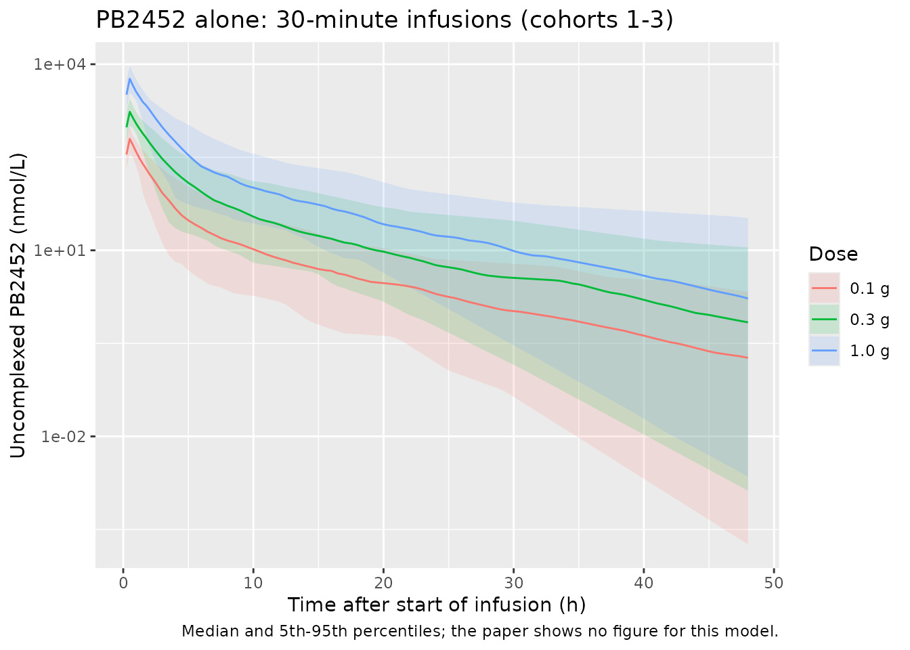
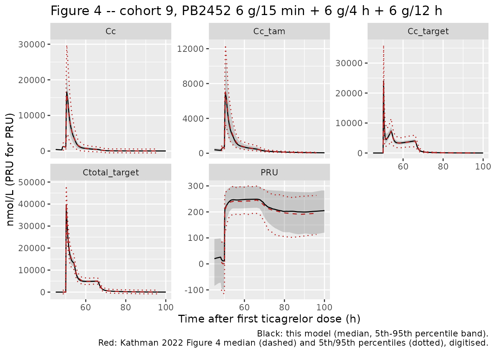
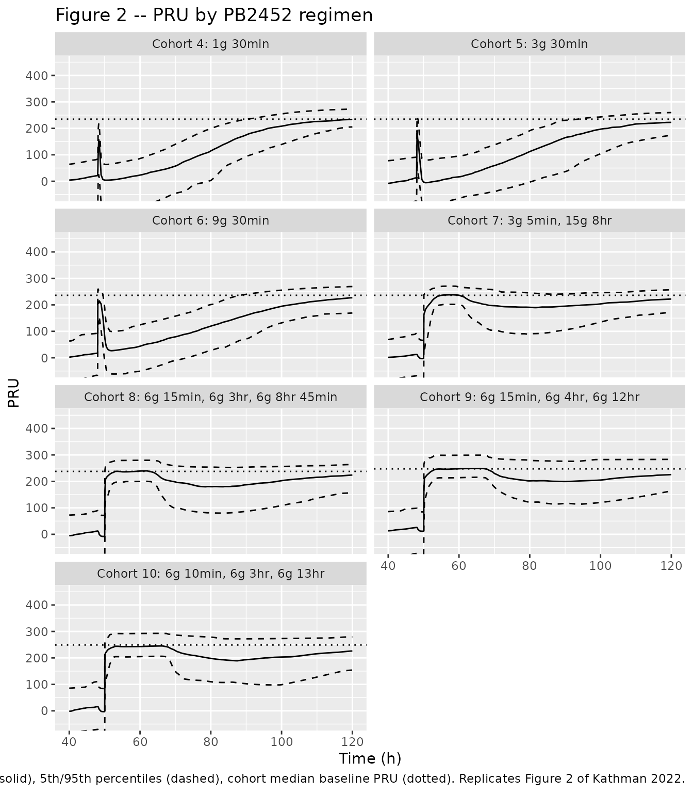

# Ticagrelor reversal by bentracimab (PB2452) (Kathman 2022)

## Model and source

- Citation: Kathman SJ, Wheeler JJ, Bhatt DL, Arnold SE, Lee JS.
  Population pharmacokinetic-pharmacodynamic modeling of PB2452, a
  monoclonal antibody fragment being developed as a ticagrelor reversal
  agent, in healthy volunteers. CPT Pharmacometrics Syst Pharmacol.
  2022;11(1):68-81. <doi:10.1002/psp4.12734>
- Article: <https://doi.org/10.1002/psp4.12734> (open access; the NONMEM
  control stream is Supplementary Material S1)

Kathman 2022 reports two models, both packaged here:

- `Kathman_2022_bentracimab_pk` – Two-compartment population PK model
  for uncomplexed bentracimab (PB2452, the ticagrelor-neutralising
  monoclonal antibody Fab fragment) given alone as a 30-minute IV
  infusion to healthy volunteers who did not receive ticagrelor (Kathman
  2022, first-in-human cohorts 1-3). Its typical values were carried,
  fixed, into the PB2452 arm of the joint ticagrelor / active-metabolite
  / PB2452 PK-PD model Kathman_2022_bentracimab.
- `Kathman_2022_bentracimab` – Semi-mechanistic population PK-PD model
  of ticagrelor reversal by bentracimab (PB2452, a
  ticagrelor-neutralising monoclonal antibody Fab fragment) in healthy
  volunteers pretreated with oral ticagrelor (Kathman 2022). Ticagrelor:
  two transit compartments into a two-compartment disposition; its
  active metabolite (TAM, AR-C124910XX): two-compartment disposition fed
  by a metabolic flux whose fraction rises with the uncomplexed PB2452
  concentration; PB2452: two-compartment disposition. PB2452 binds
  ticagrelor and TAM (second-order association) to form complexes
  cleared with PB2452; complexes also pass at a weight-dependent rate
  ktr into delayed complex pools from which ticagrelor and TAM return to
  plasma. Platelet reactivity (VerifyNow PRU) falls from each subject’s
  observed pre-ticagrelor baseline through two additive sigmoid Emax
  terms on uncomplexed ticagrelor and TAM.

Both models work in molar units: time in hours, doses in nmol,
concentrations in nmol/L (the authors converted every analyte to nmol/L
before modelling). The joint model has five outputs: total ticagrelor
(`Cc`, free plus the plasma PB2452-ticagrelor complex), total TAM
(`Cc_tam`), uncomplexed PB2452 (`Cc_target`), total PB2452
(`Ctotal_target`) and platelet reactivity in P2Y12 reaction units
(`PRU`). PB2452 is dosed into the `target` compartment and ticagrelor
into `depot`. The `target` name follows the preclinical precursor model
`Almquist_2016_ticagrelor` (Kathman 2022 reference 11), which treats the
antidote the same way.

## Population

The data come from a single-centre, randomised, double-blind,
placebo-controlled, single-ascending-dose phase I study in healthy
volunteers aged 18-50 years (Kathman 2022 Table 1). Ten cohorts enrolled
61 subjects, 48 on PB2452 and 13 on placebo. Cohorts 1-3 (0.1, 0.3 and
1.0 g PB2452 over 30 min) received no ticagrelor. Their data define the
PB2452-alone model. Cohorts 4-10 took oral ticagrelor, 180 mg and then
90 mg twice daily, for five doses over 48 h. PB2452 started immediately
after the fifth dose (48 h; cohorts 4-6, 1-9 g over 30 min) or 2 h after
it (50 h, the ticagrelor peak; cohorts 7-10, 18 g as a bolus followed by
one or two prolonged infusions). Time zero is the first ticagrelor dose.
eGFR ranged from 74.75 to 162.80 mL/min/1.73 m^2. The paper does not
report the distributions of weight, sex or race.

``` r

str(rxode2::rxode(readModelDb("Kathman_2022_bentracimab"))$population)
#> ℹ parameter labels from comments will be replaced by 'label()'
#> List of 10
#>  $ species       : chr "human"
#>  $ n_subjects    : num 61
#>  $ n_studies     : num 1
#>  $ age_range     : chr "18-50 years"
#>  $ weight_range  : chr "not reported"
#>  $ sex_female_pct: num NA
#>  $ disease_state : chr "Healthy volunteers; cohorts 4-10 pretreated with oral ticagrelor to steady state"
#>  $ dose_range    : chr "Ticagrelor 180 mg oral loading dose then 90 mg twice daily (5 doses over 48 h). PB2452 0.1-18 g IV: single 30-m"| __truncated__
#>  $ regions       : chr "United States (single centre)"
#>  $ notes         : chr "Phase I randomised, double-blind, placebo-controlled single-ascending-dose trial (10 cohorts; Kathman 2022 Tabl"| __truncated__
```

## Source trace

Every `ini()` value carries an in-file comment that points to its
source. The table below collects them. S1 is the deposited NONMEM
control stream, which fixes the structure (compartments, fluxes, error
model) in cases where the printed prose is ambiguous.

| Parameter / equation | Value | Source |
|----|----|----|
| PB2452-alone `lcl`, `lvc`, `lq`, `lvp` | 0.632, 1.05, -0.770, 1.24 (log scale) | Table 2 |
| PB2452-alone IIV (CV%) | 37.8, 40.4, 42.8, 62.9 | Table 2 |
| PB2452-alone `propSd` | 0.0711 | Table 2 (‘CV = 7.11%’) |
| TICA `lka`, `lcl`, `lvc`, `lvp`, `lq` (all fixed) | 2.3, 2.81, 5.04, 4.02, 2.34 | Table 3 (from reference 14) |
| `fm` (fixed) | 0.3 | Table 3 |
| TAM `lcl_tam`, `e_wt_cl_tam` | 1.93, 1.31 | Table 3 THETA11, THETA10 |
| TAM `lvc_tam`, `lvp_tam`, `lq_tam` (fixed) | 1.95, 3.74, 1.48 | Table 3 |
| PB2452 `lcl_target`, `lvc_target`, `lqp`, `lvp_target` (fixed) | 0.631, 1.05, -0.765, 1.28 | Table 3; S1 `$PK` |
| `lk1` (Kon), `lk1_tam` (Kon2) | -5.56, -3.74 | Table 3 THETA2, THETA5 |
| `lkd` (fixed), `lkd2` | -4, 2.04 | Table 3; THETA3 |
| `lktr`, `e_wt_ktr` | -1.22, 1.46 | Table 3 THETA4, THETA13 |
| `lemax_fm`, `lec50_fm`, `hill_fm` (fixed) | 2.98, 9.36, 2 | Table 3 THETA6, THETA7; Results (Hill = 2) |
| `lec50`, `lemax` (fixed) | 10.6, -0.1 | Table 3 THETA1; Emax = EXP(-0.1) |
| `lec50_tam`, `e_wt_ec50_tam`, `lemax_tam` | 4.59, -0.965, 0.0181 | Table 3 THETA8, THETA12, THETA9 |
| `hill` (fixed) | 2 | Results; S1 `**2` |
| Estimated IIV (CV%) | 23.3, 43.6, 25.9, 25.0, 30.4, 23.6, 59.8, 25.3, 20.7, 23.9 | Table 3 |
| Fixed IIV | 10% (KA, CL/F, Q1/F, Base, VM2); 5% (four PB2452 parameters) | Table 3; S1 `$OMEGA` FIX |
| Residual error | PRU add 20.3; free PB2452 28.2%; total PB2452 13.7% + 504; total TICA 42.4% + 332; total TAM 23.1% | Table 3 |
| Transit absorption, TICA / TAM / PB2452 two-compartment disposition | – | Methods ‘Development of the PK model’; Figure 1; S1 `DADT(1)`-`DADT(11)` |
| Binding `kon * A_PB * A_TICA / V1`; `koff = Kon*Kd`, `koff2 = Kon*Kd2` (both use Kon) | – | S1 `DADT(4)`, `DADT(8)`-`DADT(10)`; Table 3 |
| Delayed complex pools (`ktr` in, `koff2` release to plasma) | – | Results ‘Final model structure’; S1 `DADT(12)`, `DADT(13)` |
| `fm = 0.3 * (1 + Emaxf * C_PB^2 / (ECf^2 + C_PB^2))`, metabolism = `fm * CL/V1` on top of CL/F | – | Results; S1 `$DES` |
| `PRU = Base * (1 - Emax * TICA^2/(EC50^2 + TICA^2) - Emax2 * TAM^2/(EC502^2 + TAM^2))` | – | Methods ‘PD model’; S1 `$ERROR` |
| Outputs (total TICA and TAM include the plasma complex only) | – | S1 `$ERROR` |

Two printed identities check the transcription directly. The Discussion
gives the TAM EC50 as 98.5 nmol/L and the ticagrelor EC50 as above
20,000 nmol/L. Table 2’s text gives PB2452 CL 1.88 L/h and V1 2.86 L,
with distribution and elimination half-lives of 0.81 h and 6.68 h.

``` r

pk_ui <- rxode2::rxode(readModelDb("Kathman_2022_bentracimab_pk"))
#> ℹ parameter labels from comments will be replaced by 'label()'
ui <- rxode2::rxode(readModelDb("Kathman_2022_bentracimab"))
#> ℹ parameter labels from comments will be replaced by 'label()'
th_pk <- pk_ui$theta
th <- ui$theta

cl1 <- exp(th_pk[["lcl"]])
v1 <- exp(th_pk[["lvc"]])
q1 <- exp(th_pk[["lq"]])
v2 <- exp(th_pk[["lvp"]])
k10 <- cl1 / v1
k12 <- q1 / v1
k21 <- q1 / v2
disc <- sqrt((k10 + k12 + k21)^2 - 4 * k10 * k21)
lambda <- c((k10 + k12 + k21 + disc) / 2, (k10 + k12 + k21 - disc) / 2)
thalf <- log(2) / lambda

identities <- data.frame(
  quantity = c("PB2452 CL (L/h)", "PB2452 V1 (L)", "alpha t1/2 (h)", "beta t1/2 (h)",
               "TAM EC50 (nmol/L)", "TICA EC50 (nmol/L)"),
  model = c(cl1, v1, thalf, exp(th[["lec50_tam"]]), exp(th[["lec50"]])),
  published = c(1.88, 2.86, 0.81, 6.68, 98.5, NA)
)
knitr::kable(identities, digits = 3, caption = "Closed-form identities against printed values.")
```

| quantity           |     model | published |
|:-------------------|----------:|----------:|
| PB2452 CL (L/h)    |     1.881 |      1.88 |
| PB2452 V1 (L)      |     2.858 |      2.86 |
| alpha t1/2 (h)     |     0.815 |      0.81 |
| beta t1/2 (h)      |     6.684 |      6.68 |
| TAM EC50 (nmol/L)  |    98.494 |     98.50 |
| TICA EC50 (nmol/L) | 40134.837 |        NA |

Closed-form identities against printed values. {.table}

``` r


stopifnot(
  abs(cl1 / 1.88 - 1) < 0.005,
  abs(v1 / 2.86 - 1) < 0.005,
  abs(thalf[1] / 0.81 - 1) < 0.01,
  abs(thalf[2] / 6.68 - 1) < 0.005,
  abs(exp(th[["lec50_tam"]]) / 98.5 - 1) < 0.005,
  exp(th[["lec50"]]) > 20000,
  # the ODE is integrated as written, not auto-converted to a linear
  # compartment solution
  is.null(ui$linCmt)
)
```

## Unit conversion: molecular weights

The models take doses in nmol. Ticagrelor’s molecular weight is 522.57
g/mol (PubChem CID 9871419). The paper does not report the molecular
weight of PB2452, which it used to convert concentrations to nmol/L. The
maintainers back-solved it from Figure 4, whose curves are vector
graphics and so digitise exactly. The typical-value total PB2452 for the
Figure 4 regimen matches the published median at 48,000 g/mol, which is
consistent with a Fab fragment of about 50 kDa. That calibration touches
only the gram-to-nmol conversion of the PB2452 dose, not any model
parameter. The total-PB2452 comparison below is therefore calibrated.
Ticagrelor, TAM, uncomplexed PB2452 and PRU remain independent checks.

``` r

mw_tica <- 522.57
mw_pb2452 <- 48000
g_to_nmol <- function(g, mw) g / mw * 1e9
mg_to_nmol <- function(mg, mw) mg * 1e-3 / mw * 1e9
```

The Figure 4 table below was spliced from the digitised vector paths. It
holds the simulated median and 5th / 95th percentiles for cohort 9 (6 g
over 15 min + 6 g over 4 h + 6 g over 12 h).

``` r

fig4 <- tibble::tribble(
  ~output, ~time, ~median, ~p05, ~p95,
  "PRU", 48.5, 7.3, -99.5, 83.6,
  "PRU", 49, 1.0, -111.3, 83.9,
  "PRU", 50, 0.6, -115.4, 80.2,
  "PRU", 50.04, 27.2, -70.9, 115.7,
  "PRU", 50.1, 162.4, 33.3, 243.9,
  "PRU", 50.25, 208.5, 125.5, 270.1,
  "PRU", 50.5, 211.6, 121.8, 272.7,
  "PRU", 51, 222.6, 147.8, 280.2,
  "PRU", 52, 232.2, 174.9, 284.8,
  "PRU", 53, 238.2, 186.1, 291.2,
  "PRU", 54, 239.8, 189.1, 297.1,
  "PRU", 55, 242.8, 190.3, 300.2,
  "PRU", 56, 240.9, 190.9, 293.1,
  "PRU", 58, 240.4, 189.7, 296.9,
  "PRU", 59, 240.1, 192.4, 295.5,
  "PRU", 60, 241.4, 193.0, 295.3,
  "PRU", 62, 242.2, 190.4, 299.8,
  "PRU", 64, 241.6, 194.2, 297.4,
  "PRU", 66, 246.0, 194.3, 299.5,
  "PRU", 68, 238.9, 187.4, 292.0,
  "PRU", 70, 223.9, 161.6, 284.9,
  "PRU", 72, 213.0, 130.8, 274.6,
  "PRU", 74, 206.6, 120.6, 267.5,
  "PRU", 76, 203.5, 108.3, 265.0,
  "PRU", 78, 199.9, 108.1, 266.3,
  "PRU", 80, 196.3, 105.0, 260.2,
  "PRU", 84, 193.2, 101.9, 255.2,
  "PRU", 88, 190.6, 105.5, 259.7,
  "PRU", 96, 194.8, 113.3, 263.4,
  "Cc", 48.5, 1257.0, 237.6, 2246.0,
  "Cc", 49, 1270.8, 243.1, 2290.2,
  "Cc", 50, 1060.8, 127.1, 2005.6,
  "Cc", 50.04, 1478.0, 254.2, 2862.0,
  "Cc", 50.1, 3246.0, 1008.3, 6862.2,
  "Cc", 50.25, 10887.2, 3138.3, 22164.0,
  "Cc", 50.5, 16047.7, 4660.4, 29783.1,
  "Cc", 51, 14000.6, 4630.0, 25595.0,
  "Cc", 52, 8389.9, 2417.2, 16136.1,
  "Cc", 53, 5619.0, 1674.1, 10627.5,
  "Cc", 54, 3804.0, 983.5, 7508.6,
  "Cc", 55, 2583.0, 743.1, 5052.7,
  "Cc", 56, 1618.9, 215.5, 3317.8,
  "Cc", 58, 944.8, 13.8, 2060.9,
  "Cc", 59, 817.7, -5.5, 1776.3,
  "Cc", 60, 773.5, -30.4, 1649.2,
  "Cc", 62, 635.4, -143.7, 1403.4,
  "Cc", 64, 533.2, -176.8, 1251.4,
  "Cc", 66, 433.7, -232.1, 1179.6,
  "Cc", 68, 254.2, -295.6, 850.9,
  "Cc", 70, 102.2, -461.3, 668.5,
  "Cc", 72, 82.9, -513.8, 627.1,
  "Cc", 74, 44.2, -511.1, 558.0,
  "Cc", 76, 44.2, -475.2, 621.6,
  "Cc", 78, 33.2, -486.2, 605.0,
  "Cc", 80, 58.0, -500.0, 580.1,
  "Cc", 84, 19.3, -549.7, 580.1,
  "Cc", 88, 33.2, -519.4, 552.5,
  "Cc", 96, 33.2, -535.9, 585.7,
  "Cc_tam", 48.5, 468.1, 254.8, 765.3,
  "Cc_tam", 49, 642.1, 384.2, 993.1,
  "Cc_tam", 50, 691.8, 387.3, 1116.4,
  "Cc_tam", 50.04, 1423.9, 789.1, 2250.3,
  "Cc_tam", 50.1, 2537.2, 1286.2, 4327.7,
  "Cc_tam", 50.25, 5114.8, 2630.4, 9274.8,
  "Cc_tam", 50.5, 7042.0, 3289.0, 12427.1,
  "Cc_tam", 51, 6223.9, 2989.8, 10841.6,
  "Cc_tam", 52, 3975.6, 1956.2, 7196.3,
  "Cc_tam", 53, 2854.1, 1340.1, 5271.2,
  "Cc_tam", 54, 2202.7, 1029.4, 3928.0,
  "Cc_tam", 55, 1670.4, 772.6, 2946.3,
  "Cc_tam", 56, 1237.5, 633.8, 2110.5,
  "Cc_tam", 58, 867.8, 501.2, 1422.9,
  "Cc_tam", 59, 800.5, 448.4, 1347.3,
  "Cc_tam", 60, 732.2, 422.5, 1270.7,
  "Cc_tam", 62, 644.1, 352.1, 1092.5,
  "Cc_tam", 64, 554.0, 315.9, 993.1,
  "Cc_tam", 66, 496.0, 273.4, 867.8,
  "Cc_tam", 68, 375.9, 209.2, 646.2,
  "Cc_tam", 70, 287.9, 157.4, 466.0,
  "Cc_tam", 72, 244.4, 133.6, 372.8,
  "Cc_tam", 74, 206.1, 108.7, 328.3,
  "Cc_tam", 76, 182.3, 102.5, 282.7,
  "Cc_tam", 78, 152.2, 88.0, 242.3,
  "Cc_tam", 80, 135.7, 76.6, 227.8,
  "Cc_tam", 84, 108.7, 61.1, 183.3,
  "Cc_tam", 88, 88.0, 47.6, 145.0,
  "Cc_tam", 96, 61.1, 29.0, 108.7,
  "Ctotal_target", 48.5, -8.3, -816.0, 894.8,
  "Ctotal_target", 49, 29.0, -770.5, 845.0,
  "Ctotal_target", 50, 37.3, -762.2, 836.8,
  "Ctotal_target", 50.04, 6938.5, 5095.1, 8810.8,
  "Ctotal_target", 50.1, 16722.7, 12833.0, 20844.4,
  "Ctotal_target", 50.25, 39924.1, 30363.5, 48262.7,
  "Ctotal_target", 50.5, 33822.4, 26179.7, 42479.9,
  "Ctotal_target", 51, 25827.6, 20218.9, 32472.0,
  "Ctotal_target", 52, 17567.8, 13193.4, 22339.8,
  "Ctotal_target", 53, 14494.1, 10695.6, 18470.8,
  "Ctotal_target", 54, 13632.5, 10343.5, 17186.7,
  "Ctotal_target", 55, 9204.3, 6921.9, 11988.0,
  "Ctotal_target", 56, 6594.6, 4689.2, 8661.7,
  "Ctotal_target", 58, 5178.0, 3632.9, 6747.9,
  "Ctotal_target", 59, 4941.8, 3566.6, 6594.6,
  "Ctotal_target", 60, 4904.6, 3405.0, 6433.1,
  "Ctotal_target", 62, 4875.6, 3479.6, 6329.5,
  "Ctotal_target", 64, 4979.1, 3591.4, 6445.5,
  "Ctotal_target", 66, 4987.4, 3583.1, 6379.2,
  "Ctotal_target", 68, 1594.8, 712.5, 2584.8,
  "Ctotal_target", 70, 741.5, -116.0, 1541.0,
  "Ctotal_target", 72, 476.4, -434.9, 1284.1,
  "Ctotal_target", 74, 377.0, -513.7, 1188.9,
  "Ctotal_target", 76, 285.8, -579.9, 1072.9,
  "Ctotal_target", 78, 248.5, -600.6, 1035.6,
  "Ctotal_target", 80, 190.5, -617.2, 1048.0,
  "Ctotal_target", 84, 116.0, -704.2, 940.3,
  "Ctotal_target", 88, 103.6, -778.8, 903.0,
  "Ctotal_target", 96, 20.7, -807.8, 890.6,
  "Cc_target", 50, 0.0, 0.0, 0.0,
  "Cc_target", 50.04, 5088.9, 2591.0, 7833.2,
  "Cc_target", 50.1, 11586.2, 6215.6, 18166.3,
  "Cc_target", 50.25, 23547.3, 11397.7, 36036.5,
  "Cc_target", 50.5, 9709.7, 4196.2, 18967.9,
  "Cc_target", 51, 4908.7, 2081.5, 9844.3,
  "Cc_target", 52, 4772.0, 2427.4, 8197.7,
  "Cc_target", 53, 5880.1, 2903.8, 9301.7,
  "Cc_target", 54, 7238.8, 3935.2, 11455.7,
  "Cc_target", 55, 4871.4, 2508.2, 7771.1,
  "Cc_target", 56, 3659.8, 1862.0, 5726.8,
  "Cc_target", 58, 3284.9, 1725.3, 5095.1,
  "Cc_target", 59, 3340.8, 1748.1, 5109.6,
  "Cc_target", 60, 3465.1, 1820.6, 5217.3,
  "Cc_target", 62, 3612.1, 2023.5, 5571.5,
  "Cc_target", 64, 3788.2, 2019.4, 5702.0,
  "Cc_target", 66, 3960.1, 2091.9, 5987.8,
  "Cc_target", 68, 988.0, 437.0, 1700.4,
  "Cc_target", 70, 356.2, 132.6, 702.1,
  "Cc_target", 72, 213.3, 76.6, 414.2,
  "Cc_target", 74, 155.3, 58.0, 333.5,
  "Cc_target", 76, 122.2, 41.4, 261.0,
  "Cc_target", 78, 89.1, 29.0, 198.8,
  "Cc_target", 80, 66.3, 22.8, 157.4,
  "Cc_target", 84, 41.4, 14.5, 99.4,
  "Cc_target", 88, 26.9, 8.3, 66.3,
  "Cc_target", 96, 10.4, 4.1, 26.9
)
```

## PB2452 alone (cohorts 1-3)

``` r

rxode2::rxSetSeed(20220101)
pk_doses <- c("0.1 g" = 0.1, "0.3 g" = 0.3, "1.0 g" = 1.0)
n_pk <- 100
obs_pk <- sort(unique(c(0, seq(0.25, 2, by = 0.25), seq(2.5, 48, by = 0.5))))
ev_pk <- bind_rows(lapply(seq_along(pk_doses), function(i) {
  ids <- (i - 1) * n_pk + seq_len(n_pk)
  bind_rows(
    tibble(id = ids, time = 0, amt = g_to_nmol(pk_doses[[i]], mw_pb2452), dur = 0.5,
           evid = 1, cmt = "central"),
    tidyr::expand_grid(id = ids, time = obs_pk) |>
      mutate(amt = 0, dur = NA_real_, evid = 0, cmt = "central")
  ) |>
    mutate(dose_group = names(pk_doses)[i])
})) |>
  arrange(id, time, desc(evid))
stopifnot(!anyDuplicated(ev_pk[ev_pk$evid == 1, "id"]))

sim_pk <- rxode2::rxSolve(pk_ui, events = ev_pk, keep = "dose_group",
                          returnType = "data.frame")
```

``` r

sim_pk |>
  filter(time > 0) |>
  group_by(dose_group, time) |>
  summarise(Q05 = quantile(Cc, 0.05), Q50 = median(Cc), Q95 = quantile(Cc, 0.95),
            .groups = "drop") |>
  ggplot(aes(time, Q50, colour = dose_group, fill = dose_group)) +
  geom_ribbon(aes(ymin = Q05, ymax = Q95), alpha = 0.15, colour = NA) +
  geom_line() +
  scale_y_log10() +
  labs(x = "Time after start of infusion (h)", y = "Uncomplexed PB2452 (nmol/L)",
       colour = "Dose", fill = "Dose",
       title = "PB2452 alone: 30-minute infusions (cohorts 1-3)",
       caption = "Median and 5th-95th percentiles; the paper shows no figure for this model.")
```



### PKNCA validation

The paper prints no NCA table. Its Table 2 text gives the half-lives,
and the elimination half-life is the reference for the terminal-phase
NCA estimate.

``` r

conc_pk <- sim_pk |>
  filter(!is.na(Cc)) |>
  select(id, time, Cc, dose_group)
conc_pk <- bind_rows(conc_pk, conc_pk |> distinct(id, dose_group) |> mutate(time = 0, Cc = 0)) |>
  distinct(id, dose_group, time, .keep_all = TRUE) |>
  arrange(id, dose_group, time)
dose_pk <- ev_pk |> filter(evid == 1) |> select(id, time, amt, dose_group)

nca_pk <- PKNCA::pk.nca(PKNCA::PKNCAdata(
  PKNCA::PKNCAconc(conc_pk, Cc ~ time | dose_group + id),
  PKNCA::PKNCAdose(dose_pk, amt ~ time | dose_group + id),
  intervals = data.frame(start = 0, end = Inf, cmax = TRUE, tmax = TRUE,
                         aucinf.obs = TRUE, half.life = TRUE)
))

published_pk <- tibble::tibble(dose_group = names(pk_doses), half.life = 6.68)
cmp_pk <- nlmixr2lib::ncaComparisonTable(
  simulated = nca_pk, reference = published_pk, by = "dose_group",
  units = c(cmax = "nmol/L", tmax = "h", aucinf.obs = "h*nmol/L", half.life = "h"),
  tolerance_pct = 20
)
knitr::kable(cmp_pk, caption = "PB2452 alone: simulated NCA (median) vs. the Table 2 elimination half-life. * differs by >20%.")
```

| NCA parameter | dose_group | Reference | Simulated | % diff |
|:--------------|:-----------|:----------|:----------|:-------|
| t½ (h)        | 0.1 g      | 6.68      | 6.23      | -6.8%  |
| t½ (h)        | 0.3 g      | 6.68      | 6.78      | +1.4%  |
| t½ (h)        | 1.0 g      | 6.68      | 6.35      | -5.0%  |

PB2452 alone: simulated NCA (median) vs. the Table 2 elimination
half-life. \* differs by \>20%. {.table}

``` r


nca_pk_df <- as.data.frame(nca_pk)
hl_pk <- nca_pk_df |> filter(PPTESTCD == "half.life") |> group_by(dose_group) |>
  summarise(med = median(PPORRES, na.rm = TRUE))
auc_pk <- nca_pk_df |> filter(PPTESTCD == "aucinf.obs") |> group_by(dose_group) |>
  summarise(med = median(PPORRES, na.rm = TRUE))
stopifnot(
  # median terminal half-life within 15% of the printed 6.68 h in every group
  all(abs(hl_pk$med / 6.68 - 1) < 0.15),
  # linear model: dose-normalised AUC is dose-independent (median of a
  # 100-subject cohort; the medians differ only by sampling)
  max(auc_pk$med / pk_doses[auc_pk$dose_group]) / min(auc_pk$med / pk_doses[auc_pk$dose_group]) < 1.25
)
```

## Joint ticagrelor / TAM / PB2452 model

### Virtual cohorts

Cohort regimens follow Table 1. The paper does not report the
distributions of weight or baseline PRU. Weight is drawn log-normally
around the model’s centring weight of 77.5 kg (CV 15%), redrawing any
value outside 50-110 kg. Each subject’s baseline PRU is set to the
cohort’s median pre-ticagrelor PRU, digitised from the dotted lines of
Figure 2. The model’s fixed 10% IIV on the baseline supplies the spread
between subjects.

``` r

rxode2::rxSetSeed(20220102)
set.seed(20220102)

draw_wt <- function(n) {
  wt <- numeric(0)
  while (length(wt) < n) {
    x <- exp(rnorm(n, log(77.5), 0.15))
    wt <- c(wt, x[x >= 50 & x <= 110])
  }
  wt[seq_len(n)]
}

# PB2452 infusion legs: grams and durations (h), started back-to-back.
regimens <- list(
  "Cohort 4: 1g 30min" = list(start = 48, g = 1, dur = 0.5, bl = 234.8),
  "Cohort 5: 3g 30min" = list(start = 48, g = 3, dur = 0.5, bl = 234.8),
  "Cohort 6: 9g 30min" = list(start = 48, g = 9, dur = 0.5, bl = 236.2),
  "Cohort 7: 3g 5min, 15g 8hr" = list(start = 50, g = c(3, 15), dur = c(5 / 60, 8), bl = 236.2),
  "Cohort 8: 6g 15min, 6g 3hr, 6g 8hr 45min" = list(start = 50, g = c(6, 6, 6), dur = c(0.25, 3, 8.75), bl = 237.8),
  "Cohort 9: 6g 15min, 6g 4hr, 6g 12hr" = list(start = 50, g = c(6, 6, 6), dur = c(0.25, 4, 12), bl = 247.2),
  "Cohort 10: 6g 10min, 6g 3hr, 6g 13hr" = list(start = 50, g = c(6, 6, 6), dur = c(10 / 60, 3, 13), bl = 248.8)
)

obs_times <- sort(unique(c(seq(0, 120, by = 0.5), 48 + c(1, 2.5, 5, 10, 20) / 60,
                           50 + c(1, 2.5, 5, 10, 20) / 60, unique(fig4$time))))

make_cohort <- function(label, reg, n, id_offset) {
  ids <- id_offset + seq_len(n)
  tica <- tidyr::expand_grid(id = ids, time = c(0, 12, 24, 36, 48)) |>
    mutate(amt = mg_to_nmol(ifelse(time == 0, 180, 90), mw_tica), dur = NA_real_,
           evid = 1, cmt = "depot")
  starts <- reg$start + c(0, cumsum(reg$dur))[seq_along(reg$dur)]
  pb <- tidyr::expand_grid(id = ids, leg = seq_along(reg$g)) |>
    mutate(time = starts[leg], amt = g_to_nmol(reg$g[leg], mw_pb2452), dur = reg$dur[leg],
           evid = 1, cmt = "target") |>
    select(-leg)
  # Five declared endpoints: observation rows nominate one endpoint by name;
  # every output is still returned as a column.
  obs <- tidyr::expand_grid(id = ids, time = obs_times) |>
    mutate(amt = 0, dur = NA_real_, evid = 0, cmt = "Cc")
  covs <- tibble(id = ids, WT = draw_wt(n), BL_PRU = reg$bl)
  bind_rows(tica, pb, obs) |>
    left_join(covs, by = "id") |>
    mutate(cohort = label) |>
    arrange(id, time, desc(evid))
}

n_per_cohort <- 100
events <- bind_rows(lapply(seq_along(regimens), function(i) {
  make_cohort(names(regimens)[i], regimens[[i]], n_per_cohort, (i - 1) * n_per_cohort)
}))
stopifnot(!anyDuplicated(unique(events[, c("id", "time", "evid", "cmt")])))
```

### Simulation

``` r

sim <- rxode2::rxSolve(ui, events = events, keep = c("cohort", "WT", "BL_PRU"),
                       returnType = "data.frame")
# the ticagrelor dose landed in the depot, the PB2452 dose in `target`
stopifnot(all(ui$state[c(1, 8)] == c("depot", "target")),
          all(c("Cc", "Cc_tam", "Cc_target", "Ctotal_target", "PRU") %in% names(sim)))
```

### Ticagrelor alone before PB2452

Before PB2452 the system is ordinary oral ticagrelor. At 50 h, Figure 4
shows a median total ticagrelor of 1061 nmol/L. The Discussion puts
uncomplexed ticagrelor below 2000 nmol/L. Neither statement depends on
the PB2452 molecular weight.

``` r

pre <- sim |>
  filter(cohort == names(regimens)[6], time == 50) |>
  summarise(tica = median(Cc), tam = median(Cc_tam), pru = median(PRU))
knitr::kable(
  data.frame(
    quantity = c("Total TICA at 50 h (nmol/L)", "Total TAM at 50 h (nmol/L)", "PRU at 50 h"),
    simulated_median = c(pre$tica, pre$tam, pre$pru),
    figure4_median = c(1060.8, 691.8, 0.6)
  ),
  digits = 1, caption = "Cohort 9, just before PB2452 (Figure 4, digitised)."
)
```

| quantity                    | simulated_median | figure4_median |
|:----------------------------|-----------------:|---------------:|
| Total TICA at 50 h (nmol/L) |           1064.2 |         1060.8 |
| Total TAM at 50 h (nmol/L)  |            673.9 |          691.8 |
| PRU at 50 h                 |             11.7 |            0.6 |

Cohort 9, just before PB2452 (Figure 4, digitised). {.table}

``` r

stopifnot(
  abs(log(pre$tica / 1060.8)) < log(1.15),
  abs(log(pre$tam / 691.8)) < log(1.25),
  pre$pru < 40,
  quantile(sim$Cc[sim$time <= 48], 0.95) < 2000
)
```

### Figure 4: all five outputs for cohort 9

``` r

fig4_sim <- sim |>
  filter(cohort == names(regimens)[6], time >= 45, time <= 100) |>
  select(id, time, Cc, Cc_tam, Cc_target, Ctotal_target, PRU) |>
  pivot_longer(-c(id, time), names_to = "output") |>
  group_by(output, time) |>
  summarise(median = median(value), p05 = quantile(value, 0.05), p95 = quantile(value, 0.95),
            .groups = "drop")

ggplot(fig4_sim, aes(time, median)) +
  geom_ribbon(aes(ymin = p05, ymax = p95), alpha = 0.2) +
  geom_line() +
  geom_line(data = fig4, colour = "firebrick", linetype = "dashed") +
  geom_line(data = fig4, aes(y = p05), colour = "firebrick", linetype = "dotted") +
  geom_line(data = fig4, aes(y = p95), colour = "firebrick", linetype = "dotted") +
  facet_wrap(~output, scales = "free_y") +
  labs(x = "Time after first ticagrelor dose (h)", y = "nmol/L (PRU for PRU)",
       title = "Figure 4 -- cohort 9, PB2452 6 g/15 min + 6 g/4 h + 6 g/12 h",
       caption = paste0("Black: this model (median, 5th-95th percentile band).\n",
                        "Red: Kathman 2022 Figure 4 median (dashed) and 5th/95th percentiles (dotted), digitised."))
```



``` r

fig4_cmp <- fig4 |>
  inner_join(fig4_sim |> mutate(time = round(time, 2)), by = c("output", "time"),
             suffix = c("_pub", "_sim")) |>
  filter(time > 50, time <= 70, median_pub > 0)
fig4_summary <- fig4_cmp |>
  group_by(output) |>
  summarise(n = n(), median_abs_log_ratio = median(abs(log(median_sim / median_pub))),
            .groups = "drop")
knitr::kable(fig4_summary, digits = 3,
             caption = "Simulated vs. published medians, 50-70 h (while PB2452 is infused and just after).")
```

| output        |   n | median_abs_log_ratio |
|:--------------|----:|---------------------:|
| Cc            |  19 |                0.027 |
| Cc_tam        |  19 |                0.042 |
| Cc_target     |  19 |                0.018 |
| Ctotal_target |  19 |                0.013 |
| PRU           |  19 |                0.026 |

Simulated vs. published medians, 50-70 h (while PB2452 is infused and
just after). {.table}

``` r

gate4 <- setNames(fig4_summary$median_abs_log_ratio, fig4_summary$output)
stopifnot(
  nrow(fig4_summary) == 5,
  all(fig4_summary$n >= 15),
  # Measured when written (100 subjects): Cc 0.027, Cc_tam 0.042, Cc_target
  # 0.018, Ctotal_target 0.013 (calibrated through the molecular weight), PRU
  # 0.026. The sampling SE of a 100-subject median is about 0.05 on the log
  # scale for the ~40% CV parameters, so each bound sits >= 2 SE above the
  # measured value while still failing on any structural error.
  gate4[["Cc"]] < log(1.15),
  gate4[["Cc_tam"]] < log(1.15),
  gate4[["Cc_target"]] < log(1.20),
  gate4[["Ctotal_target"]] < log(1.10),
  gate4[["PRU"]] < log(1.10)
)
```

Figure 4 is a stochastic simulation by the authors, so its median
carries the full model IIV. Their virtual-cohort covariates are not
reported, which leaves some room for disagreement in both directions.

### Figure 2: PRU by cohort

``` r

bl_lines <- tibble(cohort = names(regimens), bl = vapply(regimens, `[[`, numeric(1), "bl"))
sim |>
  filter(time >= 40) |>
  group_by(cohort, time) |>
  summarise(Q05 = quantile(PRU, 0.05), Q50 = median(PRU), Q95 = quantile(PRU, 0.95),
            .groups = "drop") |>
  mutate(cohort = factor(cohort, levels = names(regimens))) |>
  ggplot(aes(time, Q50)) +
  geom_line() +
  geom_line(aes(y = Q05), linetype = "dashed") +
  geom_line(aes(y = Q95), linetype = "dashed") +
  geom_hline(data = bl_lines |> mutate(cohort = factor(cohort, levels = names(regimens))),
             aes(yintercept = bl), linetype = "dotted") +
  facet_wrap(~cohort, ncol = 2) +
  coord_cartesian(ylim = c(-50, 450)) +
  labs(x = "Time (h)", y = "PRU",
       title = "Figure 2 -- PRU by PB2452 regimen",
       caption = "Median (solid), 5th/95th percentiles (dashed), cohort median baseline PRU (dotted). Replicates Figure 2 of Kathman 2022.")
```



Figure 2 and the Results make three qualitative claims that can be
checked. In cohorts 4-6, PRU recovers close to baseline and then falls
back to the ticagrelor level within about 2 h. The 18 g regimens hold
PRU near baseline throughout the infusion, and in cohort 9 PRU is back
to most of its baseline within 15 minutes of the start. Once the
infusion stops, a partial loss of effect follows.

``` r

med_pru <- sim |>
  group_by(cohort, time) |>
  summarise(pru = median(PRU), bl = first(BL_PRU), .groups = "drop")
at <- function(coh, t) med_pru$pru[med_pru$cohort == coh & abs(med_pru$time - t) < 1e-6]
c4 <- names(regimens)[1]; c6 <- names(regimens)[3]; c9 <- names(regimens)[6]
checks <- data.frame(
  check = c("Cohort 4: PRU at 51 h (1 h after a 30-min 1 g infusion ends)",
            "Cohort 6: PRU at end of 9 g infusion (48.5 h)",
            "Cohort 6: PRU at 52 h",
            "Cohort 9: PRU 15 min after PB2452 start",
            "Cohort 9: PRU at 60 h (during infusion)",
            "Cohort 9: PRU at 80 h (after infusion)"),
  value = c(at(c4, 51), at(c6, 48.5), at(c6, 52), at(c9, 50.25), at(c9, 60), at(c9, 80))
)
knitr::kable(checks, digits = 1)
```

| check                                                        | value |
|:-------------------------------------------------------------|------:|
| Cohort 4: PRU at 51 h (1 h after a 30-min 1 g infusion ends) |   4.2 |
| Cohort 6: PRU at end of 9 g infusion (48.5 h)                | 214.9 |
| Cohort 6: PRU at 52 h                                        |  26.8 |
| Cohort 9: PRU 15 min after PB2452 start                      | 214.7 |
| Cohort 9: PRU at 60 h (during infusion)                      | 247.7 |
| Cohort 9: PRU at 80 h (after infusion)                       | 201.9 |

``` r

stopifnot(
  at(c4, 51) < 100,
  at(c6, 48.5) > 150,
  at(c6, 52) < at(c6, 48.5) - 50,
  # measured when written: 4.2, 214.9, 26.8, about 205, 247.7, 201.9
  at(c9, 50.25) > 0.7 * 247.2,
  at(c9, 60) > 0.85 * 247.2,
  at(c9, 80) < at(c9, 60) - 20
)
```

### PKNCA: total PB2452 by cohort

The paper prints no NCA for the joint model. The block below summarises
total PB2452 exposure from the start of PB2452 dosing. For a fixed 18 g
dose, AUC varies little across the four infusion schedules, so it is
reported as a cross-cohort comparison.

``` r

# Time is re-based to the start of PB2452 dosing (48 h or 50 h by cohort), so
# one 0-70 h interval serves every cohort. Total PB2452 is exactly zero before
# the first PB2452 dose, so the re-based time-zero row exists for every subject.
pb_start <- events |>
  filter(evid == 1, cmt == "target") |>
  group_by(id, cohort) |>
  summarise(start = min(time), amt = sum(amt), .groups = "drop")
conc_j <- sim |>
  filter(!is.na(Ctotal_target)) |>
  select(id, time, Ctotal_target, cohort) |>
  inner_join(pb_start |> select(id, start), by = "id") |>
  mutate(time = time - start, Cc = Ctotal_target) |>
  filter(time >= 0, time <= 70) |>
  select(id, time, Cc, cohort)
# LSODA leaves undershoot/overshoot of order 1e-11 nmol/L where the exact
# value is zero; assert it is noise relative to the peak, then floor it.
stopifnot(all(abs(conc_j$Cc[conc_j$time == 0]) < 1e-6 * max(conc_j$Cc)),
          all(conc_j$Cc >= -1e-6 * max(conc_j$Cc)),
          nrow(distinct(conc_j[conc_j$time == 0, ], id)) == nrow(pb_start))
conc_j <- conc_j |> mutate(Cc = ifelse(time == 0, 0, pmax(Cc, 0)))
dose_j <- pb_start |> mutate(time = 0) |> select(id, time, amt, cohort)
nca_j <- PKNCA::pk.nca(PKNCA::PKNCAdata(
  PKNCA::PKNCAconc(conc_j, Cc ~ time | cohort + id),
  PKNCA::PKNCAdose(dose_j, amt ~ time | cohort + id),
  intervals = data.frame(start = 0, end = 70, cmax = TRUE, tmax = TRUE, auclast = TRUE)
))
nca_j_sum <- as.data.frame(nca_j) |>
  filter(PPTESTCD %in% c("cmax", "auclast")) |>
  group_by(cohort, PPTESTCD) |>
  summarise(median = median(PPORRES, na.rm = TRUE), .groups = "drop") |>
  filter(!is.na(median)) |>
  pivot_wider(names_from = PPTESTCD, values_from = median) |>
  mutate(cohort = factor(cohort, levels = names(regimens))) |>
  arrange(cohort)
nca_j_sum |>
  rename("Cohort" = cohort, "Cmax (nmol/L)" = cmax, "AUClast (h*nmol/L)" = auclast) |>
  knitr::kable(digits = 0, caption = "Total PB2452 over the 70 h after PB2452 dosing starts (median).")
```

| Cohort                                   | AUClast (h\*nmol/L) | Cmax (nmol/L) |
|:-----------------------------------------|--------------------:|--------------:|
| Cohort 4: 1g 30min                       |                7851 |          5873 |
| Cohort 5: 3g 30min                       |               24434 |         17802 |
| Cohort 6: 9g 30min                       |               73317 |         52560 |
| Cohort 7: 3g 5min, 15g 8hr               |              165228 |         21080 |
| Cohort 8: 6g 15min, 6g 3hr, 6g 8hr 45min |              165566 |         39708 |
| Cohort 9: 6g 15min, 6g 4hr, 6g 12hr      |              162132 |         39396 |
| Cohort 10: 6g 10min, 6g 3hr, 6g 13hr     |              161481 |         40796 |

Total PB2452 over the 70 h after PB2452 dosing starts (median). {.table}

``` r

auc18 <- nca_j_sum$auclast[as.integer(nca_j_sum$cohort) >= 4]
stopifnot(length(auc18) == 4, max(auc18) / min(auc18) < 1.3)
```

## Assumptions and deviations

- **PB2452 molecular weight.** The paper does not report it. The
  maintainers back-solved 48,000 g/mol from the vector-digitised Figure
  4 total-PB2452 median, as described above. This constant sets only the
  gram-to-nmol conversion of PB2452 doses. The companion preclinical
  article (`Almquist_2016_ticagrelor`) used a nominal 50,000 g/mol for
  the same antibody (MEDI2452).
- **IIV scale.** Table 3 prints the fixed OMEGA 0.01 as “10%” and 0.0025
  as “5%”, i.e. CV = sqrt(OMEGA). The estimated CVs of Tables 2 and 3
  are converted to variances the same way (CV^2).
- **IIV correlations.** The control stream estimates ETA1-ETA10 as a
  full `$OMEGA BLOCK(10)`, but the paper reports only the diagonal CVs.
  The ten estimated etas are encoded as uncorrelated.
- **As-run PB2452 PK values.** In the joint model, Table 3 and the
  control stream fix PB2452 Q at EXP(-0.765) and the peripheral volume
  at EXP(1.28). Table 2 prints the PB2452-alone estimates as -0.770 and
  1.24. The joint model uses the as-run Table 3 values, and the
  PB2452-alone model uses Table 2.
- **As-run control-stream details kept verbatim.** The TAM complex
  dissociates at `koff = Kon * Kd` (Kon, not Kon2), and the release from
  both delayed complex pools uses `Kon * Kd2`. TICA metabolism to TAM is
  an additional loss on top of CL/F. Total TICA and total TAM include
  only the plasma complex, not the delayed pools. The printed estimate
  of the TAM Emax, EXP(0.0181) = 1.018, exceeds 1, so the typical PRU
  can dip slightly below zero at high TAM concentrations. The paper’s
  Figure 4 5th percentile is also negative.
- **Endpoints not reported.** LTA and VASP were modelled with “the same
  structural model”, and the paper says only that their parameters are
  “similar”. Only the PRU model is packaged.
- **Covariate distributions.** Weight (not reported) is drawn around the
  77.5 kg centring value. Baseline PRU is the cohort median read from
  the Figure 2 dotted lines (234.8-248.8 PRU; read from the text
  position of the axis labels, so accurate to about 5 PRU).
- **Cohort sizes.** 100 simulated subjects per cohort. The trial
  enrolled 4-8 per cohort.
- No correction notice for this article was found in Europe PMC as of
  2026-09-30.
