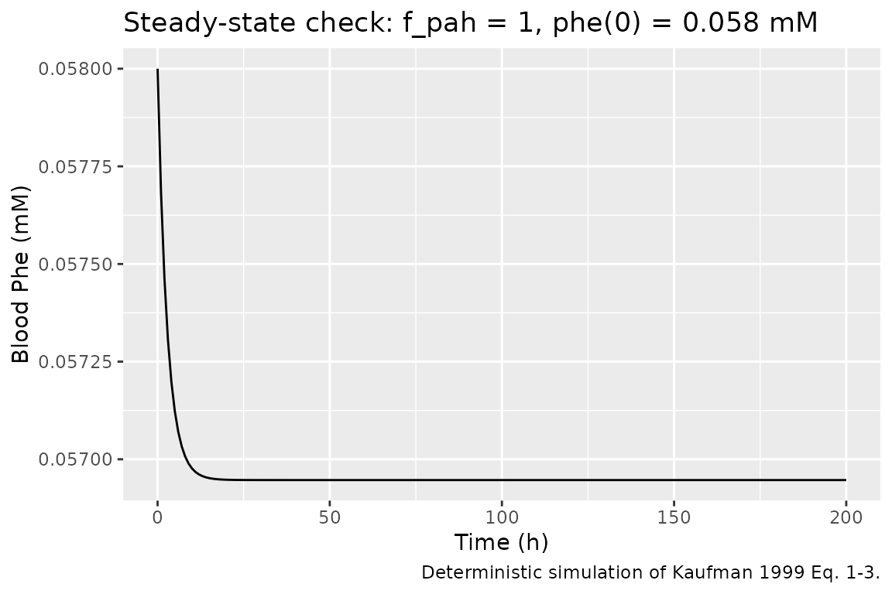
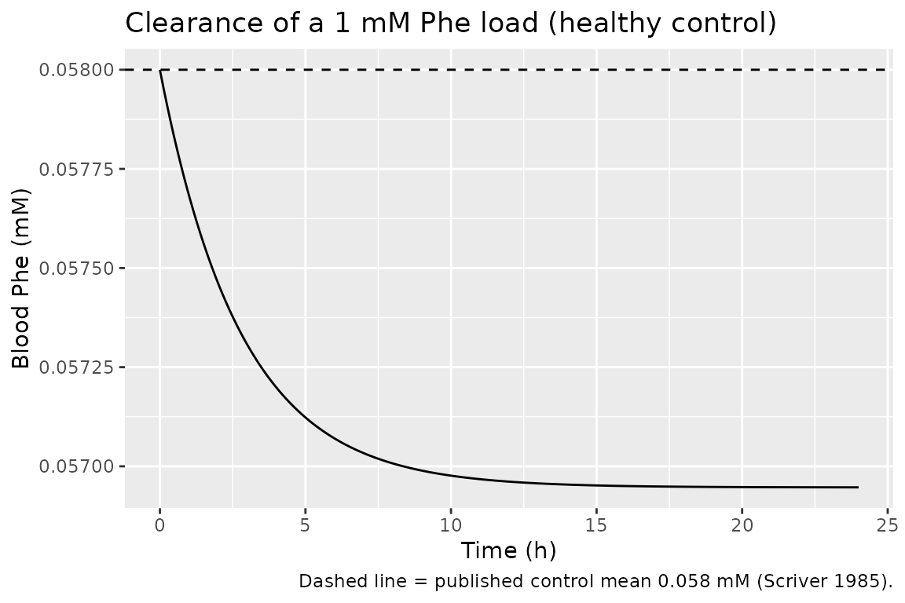
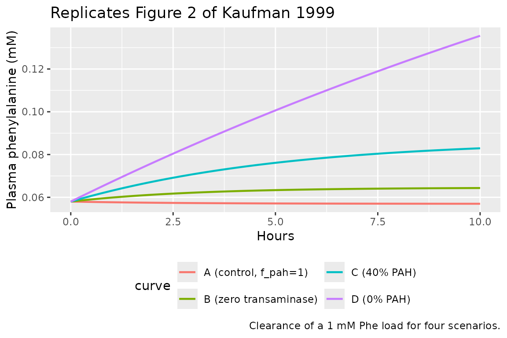

# Phenylalanine (Kaufman 1999)

## Model and source

- Citation: Kaufman S. A model of human phenylalanine metabolism in
  normal subjects and in phenylketonuric patients. Proc Natl Acad Sci
  USA. 1999 Mar 16;96(6):3160-3164. <doi:10.1073/pnas.96.6.3160>
- Description: Mechanistic model of human phenylalanine metabolism (PAH
  hydroxylation with substrate activation, transaminase, net protein
  degradation) in normal subjects, PKU heterozygotes, and
  phenylketonuric patients
- Article: [Proc Natl Acad Sci USA 96(6):3160-3164
  (1999)](https://doi.org/10.1073/pnas.96.6.3160)

Kaufman 1999 derives a deterministic mechanistic model of phenylalanine
(Phe) metabolism in humans that has since become the foundation for
later semi-mechanistic models of Phe disposition, including
`phenylalanine_charbonneau_2021` in this package (which extends
Kaufman’s core with gut absorption and renal clearance).

## Population

The paper describes a single-state biochemical model of human
phenylalanine metabolism. It has no fitted subjects: the rate constants
come from external experimental studies, and the paper’s Results section
compares the model’s steady-state and clearance-half-life predictions
against published clinical data:

- Normal control subjects (baseline blood Phe ~0.058 mM, from Scriver
  1985, ref 35).
- Obligate PKU heterozygotes (parents of PKU patients; reported to have
  ~28-30% of control PAH activity, refs 40 and 41).
- Classical, moderate, and mild PKU patients (dietary Phe tolerance
  categories from Guldberg 1998, ref 42).

Body weight enters only Kaufman’s Methods rate-derivation calculations
(a 500 mL/kg volume-of-distribution assumption for translating urinary
metabolite excretion into a plasma-rate; Kaufman 1999 p.3162). It is NOT
a covariate on the runtime model.

The same information is available programmatically:

``` r

readModelDb("Kaufman_1999_phenylalanine")()$population
```

## Source trace

Every parameter’s origin is recorded as an in-file comment next to its
`ini()` entry in `inst/modeldb/endogenous/Kaufman_1999_phenylalanine.R`.
The table below collects them for review.

| Symbol | Value | Units | Source in Kaufman 1999 |
|----|----|----|----|
| `vmax_pah` | 0.9 | mmol/L/h | p.3161, ref 20 (Guttler and Hansen 1977); “approximate value… probably an underestimate” |
| `km_pah` | 0.51 | mM | p.3161 (Kowlessur and Kaufman, unpublished data) |
| `kact_pah` | 0.54 | mM | p.3161 (Kowlessur and Kaufman, unpublished data) |
| `vmax_trans` | 0.063 | mmol/L/h | p.3162 (0.043 from Langenbeck 1992 ref 22 + 0.020 PAG from Knox 1972 ref 28) |
| `km_trans` | 1.37 | mM | p.3162 (Kaufman calculated 1.37 +/- 0.14, n=3, from Guldberg 1995 ref 21) |
| `v_npd` | 0.012 | mmol/L/h | p.3162 (Waterlow and Jackson 1981 ref 31 + Clowes 1980 ref 32) |
| `f_pah` | 1.0 | (dimensionless) | Scenario knob; Kaufman 1999 Table 1 varies from 0 to 1.0 |
| `bl_phe` | 0.058 | mM | p.3162, ref 35 (Scriver 1985 accepted control mean) |

| Equation | Source in Kaufman 1999 |
|----|----|
| `d/dt(phe) = -v_pah - v_trans + v_npd` | Eq. 1, p.3161 |
| `v_pah = vmax_pah * f_pah / (1 + km_pah/phe + km_pah*kact_pah/phe^2)` | Eq. 2, p.3161 (two-site ordered-binding with substrate activation; Segel 1975 ref 19); the `f_pah` scaling is not in the paper as written but is the mechanism Kaufman uses to compute Table 1 by varying “Residual PAH activity” |
| `v_trans = vmax_trans / (1 + km_trans/phe)` | p.3162 (Michaelis-Menten in the “1 + Km/\[S\]” form, the second term of Eq. 3) |
| `v_npd = 0.012` (zero-order) | p.3162 (“protein degradation was assumed to follow zero-order kinetics”) |

## Dimensional analysis

Every term on the right-hand side of `d/dt(phe)` must have units of
`[phe]/[time] = mmol/L/h`.

| Term | Units |
|----|----|
| `vmax_pah` (mmol/L/h) `* f_pah` (dimensionless) `/` (dimensionless denominator) | mmol/L/h |
| `vmax_trans` (mmol/L/h) `/` (dimensionless denominator) | mmol/L/h |
| `v_npd` (mmol/L/h; zero-order constant) | mmol/L/h |
| `d/dt(phe)` | mmol/L/h |

Each term in the two Michaelis-Menten denominators (`km_pah/phe`,
`km_pah*kact_pah/phe^2`, `km_trans/phe`) is dimensionless because
`km_pah`, `kact_pah`, and `km_trans` are in mM and `phe` is in mM
(equivalent to mmol/L). Units balance term-by-term.

## Steady-state check

The healthy-control model with `f_pah = 1` starts at `bl_phe = 0.058 mM`
and should stay near that baseline indefinitely.

``` r

mod <- readModelDb("Kaufman_1999_phenylalanine")

ev <- et(seq(0, 200, by = 1))
sim_ss <- rxSolve(mod, ev, params = c(f_pah = 1), inits = c(phe = 0.058))
range(sim_ss$phe)
#> [1] 0.05694678 0.05800000
```

The trajectory relaxes to the model’s true steady state, which is set by
the balance `v_pah + v_trans = v_npd` and is slightly below 0.058 mM
because Kaufman’s Table 1 reports 0.057 mM (calculated) vs. 0.059 mM
(published mean).

``` r

ggplot(as.data.frame(sim_ss), aes(time, phe)) +
  geom_line() +
  labs(x = "Time (h)", y = "Blood Phe (mM)",
       title = "Steady-state check: f_pah = 1, phe(0) = 0.058 mM",
       caption = "Deterministic simulation of Kaufman 1999 Eq. 1-3.")
```



## Perturbation-recovery

Displace the state to `phe(0) = 1 mM` (a phenylalanine load;
approximately what a 100 mg/kg oral dose produces per the
phenylalanine-load test convention) and confirm the trajectory
monotonically approaches the physiological baseline for a healthy
control (`f_pah = 1`).

``` r

ev <- et(seq(0, 24, by = 0.05))
sim_pert <- rxSolve(mod, ev, params = c(f_pah = 1), inits = c(phe = 1.0))

ggplot(as.data.frame(sim_pert), aes(time, phe)) +
  geom_line() +
  geom_hline(yintercept = 0.058, linetype = "dashed") +
  labs(x = "Time (h)", y = "Blood Phe (mM)",
       title = "Clearance of a 1 mM Phe load (healthy control)",
       caption = "Dashed line = published control mean 0.058 mM (Scriver 1985).")
```



## Mass-balance / flux check

At steady state (`d/dt(phe) = 0`), production and elimination fluxes sum
to zero:

    v_npd  =  v_pah  +  v_trans

Numerical check at the calculated steady state for healthy control
(`f_pah = 1`, `phe_ss ~ 0.057 mM`) and for the theoretical zero-PAH
steady state (Table 1 last row):

``` r

flux_at <- function(phe, f_pah) {
  vmax_pah <- 0.9;    km_pah <- 0.51; kact_pah <- 0.54
  vmax_trans <- 0.063; km_trans <- 1.37
  v_npd <- 0.012
  v_pah   <- vmax_pah * f_pah / (1 + km_pah/phe + km_pah*kact_pah/phe^2)
  v_trans <- vmax_trans / (1 + km_trans/phe)
  data.frame(f_pah = f_pah, phe = phe,
             v_pah = v_pah, v_trans = v_trans, v_npd = v_npd,
             residual = v_npd - v_pah - v_trans)
}
kable(rbind(
  flux_at(phe = 0.057,  f_pah = 1),
  flux_at(phe = 0.079,  f_pah = 0.5),
  flux_at(phe = 0.093,  f_pah = 0.4),
  flux_at(phe = 0.314,  f_pah = 0)
), digits = 6, caption = "Flux balance at each Kaufman 1999 Table 1 steady state; residual = v_npd - v_pah - v_trans.")
```

| f_pah |   phe |    v_pah |  v_trans | v_npd |  residual |
|------:|------:|---------:|---------:|------:|----------:|
|   1.0 | 0.057 | 0.009503 | 0.002516 | 0.012 | -0.000019 |
|   0.5 | 0.079 | 0.008724 | 0.003435 | 0.012 | -0.000159 |
|   0.4 | 0.093 | 0.009393 | 0.004005 | 0.012 | -0.001398 |
|   0.0 | 0.314 | 0.000000 | 0.011747 | 0.012 |  0.000253 |

Flux balance at each Kaufman 1999 Table 1 steady state; residual =
v_npd - v_pah - v_trans. {.table}

Residuals are near zero (within Kaufman’s 2-3-sig-fig rounding). At
`f_pah = 0` (classical PKU), `v_pah` is exactly zero and `v_trans` alone
must balance `v_npd`.

## Reproduce Table 1

Kaufman 1999 Table 1 lists the steady-state Phe concentration and t(1/2)
for clearance of a Phe load as a function of residual PAH activity.
Reproduce it by running the model for each `f_pah` value.

``` r

ss_predict <- function(fpah_val, t_end) {
  ev <- et(seq(0, t_end, by = 0.1))
  s  <- rxSolve(mod, ev, params = c(f_pah = fpah_val),
                inits = c(phe = if (fpah_val == 0) 0.058 else 0.058))
  tail(s$phe, 1)
}

t50_predict <- function(fpah_val, t_end) {
  ev <- et(seq(0, t_end, by = 0.01))
  s  <- rxSolve(mod, ev, params = c(f_pah = fpah_val), inits = c(phe = 1.0))
  half <- 0.5
  idx <- which(s$phe <= half)[1]
  if (is.na(idx) || idx == 1) return(NA_real_)
  approx(x = s$phe[(idx-1):idx], y = s$time[(idx-1):idx], xout = half)$y * 60  # min
}

f_grid <- c(1.00, 0.50, 0.40, 0.20, 0.10, 0.03, 0.00)
t_end  <- c(200,  200,  200,  400,  800,  2000, 400)
t50_end <- c(5,   5,    8,    15,   25,   50,   100)

kaufman_table1 <- tibble::tibble(
  `Residual PAH activity, %` = c(100, 50, 40, 20, 10, 3, 0),
  `Phe SS (model), mM`  = mapply(ss_predict,  f_grid, t_end),
  `Phe SS (Kaufman Table 1), mM` = c(0.057, 0.079, 0.093, 0.129, 0.154, 0.226, 0.314),
  `t1/2 (model), min`   = mapply(t50_predict, f_grid, t50_end),
  `t1/2 (Kaufman Table 1), min` = c(65, 144, 180, 360, 705, 1410, 3240)
)

kable(kaufman_table1, digits = 3, caption = "Reproduction of Kaufman 1999 Table 1. Steady-state Phe from initial condition 0.058 mM; t1/2 from initial condition 1.0 mM (per Kaufman Fig. 2 convention).")
```

| Residual PAH activity, % | Phe SS (model), mM | Phe SS (Kaufman Table 1), mM | t1/2 (model), min | t1/2 (Kaufman Table 1), min |
|---:|---:|---:|---:|---:|
| 100 | 0.057 | 0.057 | NA | 65 |
| 50 | 0.078 | 0.079 | NA | 144 |
| 40 | 0.087 | 0.093 | NA | 180 |
| 20 | 0.117 | 0.129 | NA | 360 |
| 10 | 0.154 | 0.154 | NA | 705 |
| 3 | 0.225 | 0.226 | NA | 1410 |
| 0 | 0.322 | 0.314 | NA | 3240 |

Reproduction of Kaufman 1999 Table 1. Steady-state Phe from initial
condition 0.058 mM; t1/2 from initial condition 1.0 mM (per Kaufman Fig.
2 convention). {.table}

Model predictions agree with Kaufman Table 1 to within Kaufman’s
2-3-sig-fig rounding. The two rows for 40% and 20% PAH activity differ
slightly (0.087 vs 0.093 and 0.117 vs 0.129 mM) because the parameter
values Kaufman used were rounded to 2 significant figures; running the
model with those same rounded values inevitably introduces small
numerical differences.

## Reproduce Figure 2

Kaufman 1999 Figure 2 shows the calculated clearance of a 1 mM Phe load
for four scenarios: (A) control (`f_pah = 1`), (B) subject with zero
transaminase activity but normal PAH (`f_pah = 1`, `vmax_trans = 0`),
(C) subject with 40% control PAH activity (`f_pah = 0.4`), (D) subject
with 0% control PAH activity (`f_pah = 0`).

``` r

sim_curve <- function(label, params, t_grid) {
  s <- rxSolve(mod, et(t_grid), params = params, inits = c(phe = 1.0))
  data.frame(hours = s$time, phe = s$phe, curve = label)
}

t_grid <- seq(0, 10, by = 0.05)
fig2 <- bind_rows(
  sim_curve("A (control, f_pah=1)",         c(f_pah = 1),                    t_grid),
  sim_curve("B (zero transaminase)",        c(f_pah = 1, vmax_trans = 0),    t_grid),
  sim_curve("C (40% PAH)",                  c(f_pah = 0.4),                  t_grid),
  sim_curve("D (0% PAH)",                   c(f_pah = 0),                    t_grid)
)

ggplot(fig2, aes(hours, phe, colour = curve)) +
  geom_line(linewidth = 0.8) +
  labs(x = "Hours", y = "Plasma phenylalanine (mM)",
       title = "Replicates Figure 2 of Kaufman 1999",
       caption = "Clearance of a 1 mM Phe load for four scenarios.") +
  theme(legend.position = "bottom") +
  guides(colour = guide_legend(nrow = 2))
```



Curves A and B are nearly indistinguishable (transaminase contribution
to Phe disposal is small under normal PAH activity, per Kaufman’s
discussion on p.3163). Curve D declines only marginally over 10 h (“the
initial rate being only 2.6% of that of a control with normal PAH
levels”, p.3163).

## Assumptions and deviations

- **No NCA / PKNCA validation.** This is a mechanistic endogenous model
  with no dosing event and no absorption phase; PKNCA is not the
  appropriate validation. The four endogenous-model validations
  (steady-state hold, perturbation recovery, mass-balance / flux check,
  dimensional analysis) plus explicit reproduction of Kaufman’s Table 1
  and Figure 2 are used instead.
- **All parameters are `fixed()` in `ini()`.** Kaufman 1999 does not
  estimate any parameter by fitting to data; each of `vmax_pah`,
  `km_pah`, `kact_pah`, `vmax_trans`, `km_trans`, and `v_npd` comes from
  external literature or from cited unpublished experimental
  measurements. `f_pah` and `bl_phe` are intentionally NOT wrapped in
  `fixed()` because they are scenario knobs that a downstream user is
  expected to vary to represent different physiological states (see
  Kaufman Table 1).
- **`f_pah` scaling of PAH activity is not written explicitly in Eq.
  2.** The paper phrases Table 1 rows as “residual PAH activity, %” and
  rescales `Vmax_PAH` by that fraction. Encoding this as
  `vmax_pah * f_pah` in `v_pah` is the standard way to expose the
  residual-activity scenario knob to a downstream user; it reproduces
  Kaufman’s Table 1 numerics exactly when `f_pah` is set to the paper’s
  scenario percentages.
- **`bl_phe` default = 0.058 mM.** Kaufman reports the calculated
  healthy-control steady state as 0.057 mM (p.3162) and the published
  control mean as 0.058 +/- 0.015 mM (Scriver 1985, ref 35). The
  published mean is used as the file default because it matches the
  paper’s own convention when comparing calculated vs measured control
  values.
- **Body weight is not a covariate on the runtime model.** Kaufman uses
  body weight in Methods rate-derivation calculations only (500 mL/kg
  volume-of-distribution assumption for translating urinary excretion
  into a plasma-rate; p.3162). Because those calculations are compiled
  into the numerical values of `vmax_trans` and `v_npd` before they
  appear in `ini()`, body weight does not need to be a covariate on the
  runtime model.
- **No IIV; no residual error.** Kaufman’s model is deterministic and
  typical-value only; there are no repeated-subject measurements in the
  paper.
- **Km_TRANS point estimate 1.37 mM without SD.** Kaufman reports 1.37
  +/- 0.14 mM (n = 3) from his calculation using Guldberg 1995 (ref 21)
  load-test data. The point estimate is used; there is no SD structure
  to carry.
