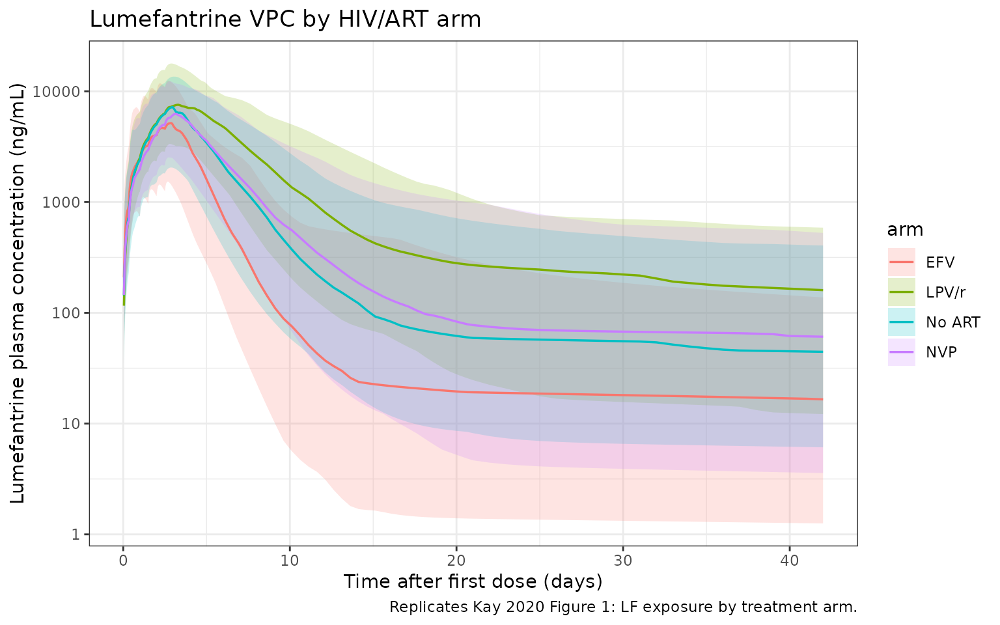

# Lumefantrine (Kay 2020)

## Model and source

- Citation: Kay K, Goodwin J, Mwebaza N, Ruiz A, Ehrlich H, Ou J,
  Freeman T, Wade M, Huang L, Wang K, Li F, Aweeka FT, Riggs M, Kajubi
  R, Parikh S (2020). Modeling and simulation of lumefantrine
  pharmacokinetics in HIV-infected and HIV-uninfected children with
  malaria and the role of lumefantrine exposure as a potential driver of
  drug resistance. *American Society of Tropical Medicine and Hygiene
  (ASTMH) Annual Meeting*, 16-18 November 2020, poster 2167.
- Poster PDF:
  <https://metrumrg.com/wp-content/uploads/2020/11/KAY_2167_ASTMH.pdf>

Kay 2020 is an ASTMH 2020 conference poster (abstract 2167; Metrum
Research Group, Yale School of Public Health, Infectious Diseases
Research Collaboration, UCSF) presenting a population PK / PD analysis
of lumefantrine in Ugandan children with uncomplicated malaria. The
poster reports:

- a 2-compartment lumefantrine popPK model with first-order absorption,
  body-weight allometric scaling on all CL and V terms, age-dependent CL
  allometric exponent, age effect on bioavailability F, and ART
  (efavirenz / lopinavir-ritonavir / nevirapine) drug-drug interactions
  on CL/F and the absorption rate constant KA (Table 1, the model
  packaged here); and
- a separately developed repeated-time-to-event (RTTE) hazard model of
  malaria reinfection driven by HIV status and time-varying lumefantrine
  concentration (Preliminary Results; no parameter table reported on the
  poster – the present `Kay_2020_lumefantrine` model packages only the
  popPK layer).

The related companion model from the same Aweeka / Kampala lineage in
HIV-infected Ugandan adults is `modellib("Hoglund_2015_lumefantrine")`;
the present model extends Hoglund 2015 to a pediatric cohort with
body-weight and age covariates and piecewise age-dependent allometric
clearance scaling.

``` r

mod_fn <- readModelDb("Kay_2020_lumefantrine")
mod <- rxode2::rxode2(mod_fn())
```

## Population

The poster’s Methods section describes a cohort of 277 children with 364
episodes of uncomplicated malaria recruited from a high-transmission
area of eastern Uganda. The cohort comprises 161 HIV-uninfected children
and 116 HIV-infected children. All children received standard-of-care
artemether-lumefantrine (AL) for malaria treatment; HIV-infected
children were additionally on daily ART (efavirenz EFV,
lopinavir/ritonavir LPV/r, or nevirapine NVP) and on
trimethoprim-sulfamethoxazole (TS) prophylaxis. The sub-population of
140 children with recurrent parasitemia during 42-day follow-up (176
episodes) was genotyped at pfcrt K76, pfmdr1 N86, and pfmdr1 Y184F via
Luminex; the pfcrt K76 sub-population had 102 HIV-uninfected children
(119 episodes) and 38 HIV-infected children (57 episodes: 13 EFV, 11
LPV/r, 14 NVP). The popPK model and the first hazard sub-model used the
full dataset; the second (genotype-stratified) hazard sub-model used the
pfcrt K76 sub-population.

The poster does not tabulate baseline demographics by age band, weight
band, or sex; the cohort is characterised qualitatively as pediatric
uncomplicated-malaria patients spanning the standard pediatric
weight-band AL dosing range (approximately 3 months to ~10 years, body
weight from ~5 kg infants to ~30 kg older children).

Programmatic access to the population metadata is available via
`readModelDb("Kay_2020_lumefantrine")()$population`.

## Source trace

Per-parameter source locations are recorded inline next to each `ini()`
entry in `inst/modeldb/specificDrugs/Kay_2020_lumefantrine.R`. The table
below collects them in one place for review. All parameter values come
from Table 1 of the ASTMH 2020 poster (“Lumefantrine parameter
summary”), “Estimate” column. The 95% confidence intervals (from the
poster’s Table 1) are listed for cross-reference.

| Parameter | Value (95% CI) | Source location |
|----|----|----|
| `lcl <- log(1.20)` (CL/F, L/h at WT_REF = 14 kg) | 1.20 (0.952, 1.45) | Table 1 theta_1 |
| `lvc <- log(24.1)` (V2/F, L at WT_REF = 14 kg) | 24.1 (19.0, 29.2) | Table 1 theta_2 |
| `lq <- log(0.380)` (Q/F, L/h at WT_REF = 14 kg) | 0.380 (0.258, 0.501) | Table 1 theta_3 |
| `lvp <- log(767)` (V3/F, L at WT_REF = 14 kg) | 767 (174, 1360) | Table 1 theta_4 |
| `lka <- log(0.0215)` (KA, 1/h) | 0.0215 (0.0197, 0.0234) | Table 1 theta_5 |
| `lfdepot <- fixed(log(1))` (F anchor at AGE_REF / no ART) | 1 (fixed by convention) | apparent-CL/F parameterisation |
| `e_age_f <- 0.204` (AGE on F) | 0.204 (-0.0586, 0.467) | Table 1 theta_6 (CI spans zero) |
| `e_efv_cl <- 0.982` (EFV on CL/F) | 0.982 (0.163, 1.80) | Table 1 theta_7 |
| `e_lpv_cl <- -0.514` (LPV/r on CL/F) | -0.514 (-0.696, -0.332) | Table 1 theta_8 |
| `e_nvp_cl <- 0.0191` (NVP on CL/F) | 0.0191 (-0.324, 0.362) | Table 1 theta_9 (CI spans zero) |
| `e_efv_ka <- 0.484` (EFV on KA) | 0.484 (0.282, 0.685) | Table 1 theta_10 |
| `e_lpv_ka <- -0.212` (LPV/r on KA) | -0.212 (-0.305, -0.120) | Table 1 theta_11 |
| `e_nvp_ka <- -0.0589` (NVP on KA) | -0.0589 (-0.207, 0.0891) | Table 1 theta_12 (CI spans zero) |
| `etalcl ~ 0.735` (IIV CL/F, log-scale variance) | CV 104% | Table 1 Omega\_{1,1} (shrinkage 5.86%) |
| `etalvc ~ 0.813` (IIV V2/F) | CV 112% | Table 1 Omega\_{2,2} (shrinkage 32.6%) |
| `etalq ~ 0.0250` (IIV Q/F) | CV 15.9% | Table 1 Omega\_{3,3} (shrinkage 67.5%) |
| `etalvp ~ 0.956` (IIV V3/F) | CV 127% | Table 1 Omega\_{4,4} (shrinkage 36.4%) |
| `etalka ~ 0.0280` (IIV KA) | CV 16.9% | Table 1 Omega\_{5,5} (shrinkage 58.2%) |
| `propSd <- sqrt(0.200)` (proportional residual SD) | CV 44.7% | Table 1 Sigma\_{1,1} |
| Piecewise CL allometric exponent (V exp = 1; CL exp 0.75 / 0.9 / 1.0 / 1.2 for \>60 / \>24-60 / \>3-24 / \<=3 months) | – | Final Results paragraph |
| 2-cmt LF disposition with 1st-order absorption (depot -\> central, central \<-\> peripheral1) | – | Final Results paragraph |

## Assumptions and deviations

The Kay 2020 poster reports Table 1 numerical values but does not print
the explicit covariate equations or the reference centering values.
Three assumptions are documented here and in the model file’s
`covariateData` notes:

- **Reference body weight WT_REF = 14 kg.** Not reported in the poster.
  Chosen as a plausible pediatric median for the 3 months to ~10 years
  cohort. Cross-check: back-extrapolation to a 70-kg adult with the
  \>60-month allometric exponent of 0.75 yields
  `CL = 1.20 * (70/14)^0.75 = 4.0 L/h`, which matches the published
  adult lumefantrine CL/F of ~4-5 L/h (e.g., Hoglund 2015 adults
  `CL/F = 4.77 L/h`).
- **Reference age AGE_REF = 5 years.** Not reported in the poster.
  Chosen as the upper boundary of one piecewise-allometric age bin (\>24
  to 60 months), also a plausible study-population median age.
- **Age effect on F encoded as a centered fractional-deviation form
  `F = exp(lfdepot) * (1 + e_age_f * (AGE / AGE_REF - 1))`.** The exact
  functional form is not printed on the poster; Table 1 lists only the
  coefficient (`AGE_F = 0.204`). The centered fractional-deviation form
  is the natural continuous-covariate extension of the binary
  linear-deviation form (`1 + e * IND`) used by the related Hoglund 2015
  Ugandan-adult lumefantrine model from the same Aweeka / Kampala
  lineage. It is dimensionless, anchored to F = 1 at the reference age,
  and produces sensible bounded behaviour across the observed age range
  (F = 0.81 at age 3 months; F = 1.20 at age 10 years).
- **ART covariate effects on CL/F and KA encoded as linear-deviation
  form `1 + e * IND`.** Same lineage rationale; the EFV-on-CL
  coefficient `+0.982` corresponds to a 1.98-fold CL/F increase,
  consistent with the 2.1- to 3.4-fold EFV-driven LF-exposure reduction
  reported by Parikh 2016 (reference \[1\] of the poster), and the
  LPV/r-on-CL coefficient `-0.514` corresponds to a 2.06-fold CL/F
  decrease, consistent with the 2.1-fold LPV/r-driven LF-exposure
  increase reported by Parikh 2016.
- **The RTTE (repeated time-to-event) hazard model is NOT packaged.**
  The poster’s RTTE section is preliminary, gives only qualitative
  effect sizes (6.6% increase, 64% decrease, etc.), and does not
  tabulate baseline hazard parameters; the present
  `Kay_2020_lumefantrine` model packages only the popPK layer reported
  in Table 1. The PK model is sufficient on its own to drive downstream
  exposure-response analyses.

## Virtual cohort

The cohort is built across four ART arms (no ART; EFV; LPV/r; NVP) with
disjoint subject IDs across arms so the multi-cohort bind_rows()
collapses cleanly into a single rxSolve input. Each arm has 50 subjects
(200 total; below the 200-per-arm cohort cap). Age is drawn
approximately uniformly across the four piecewise-allometric age bins so
the model’s age-dependent allometric structure is exercised. Body weight
is drawn from a WHO-style age-weight curve (see `make_arm` below).

``` r

set.seed(20260624L)
n_per_arm <- 50L

# Standard pediatric Coartem dosing weight bands (WHO 2015, Table 1):
#   5-<15 kg  -> 1 tablet (20 mg artemether / 120 mg lumefantrine) BID for 3 days
#   15-<25 kg -> 2 tablets BID
#   25-<35 kg -> 3 tablets BID
# Each tablet = 120 mg lumefantrine. The simulation uses a single lumefantrine
# dose value per subject derived from baseline body weight.
lf_per_tablet_mg <- 120

tablets_for_weight <- function(wt_kg) {
  dplyr::case_when(
    wt_kg <  15 ~ 1L,
    wt_kg <  25 ~ 2L,
    wt_kg <  35 ~ 3L,
    TRUE        ~ 4L
  )
}

# Simple age -> WHO-style typical weight (kg) for boys ~50th percentile;
# adequate for an illustrative virtual cohort.
typical_weight_for_age <- function(age_yr) {
  pmax(3.5, 3.5 + 1.5 * age_yr ^ 1.05)
}

make_arm <- function(arm_label, conmed_efv, conmed_lpv, conmed_nvp, id_offset) {
  # Distribute ages across the four piecewise-allometric bins so the
  # age-dependent CL exponent is exercised. Age in years.
  ages <- runif(n_per_arm, min = 0.25, max = 10)
  wts  <- pmin(pmax(rnorm(n_per_arm, mean = typical_weight_for_age(ages),
                          sd = 1.5), 3.5), 35)
  tibble::tibble(
    id         = id_offset + seq_len(n_per_arm),
    arm        = arm_label,
    AGE        = ages,
    WT         = round(wts, 2),
    CONMED_EFV = conmed_efv,
    CONMED_LPV = conmed_lpv,
    CONMED_NVP = conmed_nvp
  )
}

subjects <- dplyr::bind_rows(
  make_arm("No ART", 0L, 0L, 0L, id_offset =   0L),
  make_arm("EFV",    1L, 0L, 0L, id_offset =  50L),
  make_arm("LPV/r",  0L, 1L, 0L, id_offset = 100L),
  make_arm("NVP",    0L, 0L, 1L, id_offset = 150L)
)
stopifnot(!anyDuplicated(subjects$id))
```

``` r

subjects |>
  dplyr::group_by(arm) |>
  dplyr::summarise(
    n            = dplyr::n(),
    age_median   = median(AGE),
    age_range    = sprintf("%.2f - %.2f", min(AGE), max(AGE)),
    wt_median    = median(WT),
    wt_range     = sprintf("%.1f - %.1f", min(WT), max(WT)),
    .groups      = "drop"
  ) |>
  knitr::kable(caption = "Virtual cohort by ART arm (50 subjects per arm).")
```

| arm    |   n | age_median | age_range   | wt_median | wt_range   |
|:-------|----:|-----------:|:------------|----------:|:-----------|
| EFV    |  50 |   4.313758 | 0.29 - 9.70 |    10.915 | 3.5 - 20.4 |
| LPV/r  |  50 |   5.798677 | 0.32 - 9.96 |    12.665 | 3.5 - 22.2 |
| NVP    |  50 |   5.008919 | 0.87 - 9.92 |    11.825 | 3.5 - 21.4 |
| No ART |  50 |   6.162732 | 0.62 - 9.82 |    14.245 | 4.0 - 20.6 |

Virtual cohort by ART arm (50 subjects per arm). {.table}

## Event table and simulation

The standard 3-day pediatric Coartem regimen is 6 doses at 0, 8, 24, 36,
48, 60 hours. Lumefantrine has a long terminal half-life (the poster’s
Figure 1 extends through ~40 days), so observations are kept dense early
and progressively sparser through 42 days post first-dose so the long
elimination tail is captured.

``` r

dose_times <- c(0, 8, 24, 36, 48, 60)
obs_times  <- sort(unique(c(
  seq(0,   72,   by = 1),       # absorption + early disposition
  seq(73,  168,  by = 3),       # day-7 endpoint window
  seq(171, 500,  by = 12),      # multi-day elimination
  seq(504, 1008, by = 24)       # tail through day 42
)))

build_events <- function(subjects, obs_times, dose_times) {
  out <- vector("list", nrow(subjects))
  for (i in seq_len(nrow(subjects))) {
    s <- subjects[i, ]
    dose_mg <- tablets_for_weight(s$WT) * lf_per_tablet_mg
    dose_rows <- data.frame(
      id         = s$id,
      time       = dose_times,
      evid       = 1L,
      amt        = dose_mg,
      cmt        = "depot",
      arm        = s$arm,
      AGE        = s$AGE,
      WT         = s$WT,
      CONMED_EFV = s$CONMED_EFV,
      CONMED_LPV = s$CONMED_LPV,
      CONMED_NVP = s$CONMED_NVP
    )
    obs_rows <- data.frame(
      id         = s$id,
      time       = obs_times,
      evid       = 0L,
      amt        = 0,
      cmt        = "central",
      arm        = s$arm,
      AGE        = s$AGE,
      WT         = s$WT,
      CONMED_EFV = s$CONMED_EFV,
      CONMED_LPV = s$CONMED_LPV,
      CONMED_NVP = s$CONMED_NVP
    )
    out[[i]] <- rbind(dose_rows, obs_rows)
  }
  ev <- dplyr::bind_rows(out)
  ev[order(ev$id, ev$time, -ev$evid), ]
}

events <- build_events(subjects, obs_times, dose_times)
stopifnot(!anyDuplicated(unique(events[, c("id", "time", "evid")])))

sim <- rxode2::rxSolve(
  mod, events = events,
  keep = c("arm", "AGE", "WT")
) |>
  as.data.frame()
```

## Replicate Figure 1 – Lumefantrine exposure by treatment arm

Kay 2020 Figure 1 shows median lumefantrine concentration vs. time over
~40 days post-dose for each of the four arms. The visual predictive
check below replicates the same structure: median + 5th-95th percentile
envelope per arm.

``` r

sim |>
  dplyr::filter(!is.na(Cc), time > 0, Cc > 0) |>
  dplyr::group_by(arm, time) |>
  dplyr::summarise(
    p05 = quantile(Cc, 0.05, na.rm = TRUE),
    p50 = quantile(Cc, 0.50, na.rm = TRUE),
    p95 = quantile(Cc, 0.95, na.rm = TRUE),
    .groups = "drop"
  ) |>
  dplyr::filter(p50 > 0.1) |>
  ggplot(aes(time / 24, p50, colour = arm, fill = arm)) +
  geom_ribbon(aes(ymin = p05, ymax = p95), alpha = 0.20, colour = NA) +
  geom_line(linewidth = 0.6) +
  scale_y_log10() +
  labs(x = "Time after first dose (days)",
       y = "Lumefantrine plasma concentration (ng/mL)",
       title = "Lumefantrine VPC by HIV/ART arm",
       caption = "Replicates Kay 2020 Figure 1: LF exposure by treatment arm.") +
  theme_bw()
```



The qualitative ranking of arms by exposure agrees with the abstract
narrative and with Parikh 2016 (poster reference \[1\]):

- LPV/r markedly elevates lumefantrine exposure (CL/F reduced 51.4% by
  ritonavir-driven CYP3A4 inhibition; KA reduced 21.2%).
- No-ART and NVP arms are similar (NVP coefficients are small and
  statistically non-significant).
- EFV markedly lowers lumefantrine exposure (CL/F increased 98.2% by
  CYP3A4 induction; KA increased 48.4%).

## PKNCA validation

PKNCA is used to compute Cmax, Tmax, AUC, and apparent terminal
half-life from the simulated lumefantrine concentrations, with the four
ART arms as the treatment grouping.

``` r

sim_nca <- sim |>
  dplyr::filter(!is.na(Cc)) |>
  dplyr::select(id, time, Cc, arm)

# Guarantee a time = 0 row per (id, arm); for extravascular pre-dose Cc = 0
# is the correct value.
sim_nca <- dplyr::bind_rows(
  sim_nca,
  sim_nca |> dplyr::distinct(id, arm) |>
    dplyr::mutate(time = 0, Cc = 0)
) |>
  dplyr::distinct(id, arm, time, .keep_all = TRUE) |>
  dplyr::arrange(id, arm, time)

conc_obj <- PKNCA::PKNCAconc(sim_nca, Cc ~ time | arm + id)

dose_df <- events |>
  dplyr::filter(evid == 1L) |>
  dplyr::select(id, time, amt, arm)

dose_obj <- PKNCA::PKNCAdose(dose_df, amt ~ time | arm + id)

intervals <- data.frame(
  start      = 0,
  end        = Inf,
  cmax       = TRUE,
  tmax       = TRUE,
  aucinf.obs = TRUE,
  half.life  = TRUE
)

nca_data <- PKNCA::PKNCAdata(conc_obj, dose_obj, intervals = intervals)
nca_res  <- PKNCA::pk.nca(nca_data)
```

``` r

nca_summary <- as.data.frame(nca_res) |>
  dplyr::filter(PPTESTCD %in% c("cmax", "tmax", "aucinf.obs", "half.life")) |>
  dplyr::group_by(arm, PPTESTCD) |>
  dplyr::summarise(
    median = median(PPORRES, na.rm = TRUE),
    p05    = quantile(PPORRES, 0.05, na.rm = TRUE),
    p95    = quantile(PPORRES, 0.95, na.rm = TRUE),
    .groups = "drop"
  )

nca_summary |>
  dplyr::mutate(
    parameter = dplyr::case_when(
      PPTESTCD == "cmax"       ~ "Cmax (ng/mL)",
      PPTESTCD == "tmax"       ~ "Tmax (h)",
      PPTESTCD == "aucinf.obs" ~ "AUCinf (ng*h/mL)",
      PPTESTCD == "half.life"  ~ "Half-life (h)"
    )
  ) |>
  dplyr::transmute(
    arm,
    `NCA parameter` = parameter,
    `Median (P05, P95)` = sprintf("%.1f (%.1f, %.1f)", median, p05, p95)
  ) |>
  tidyr::pivot_wider(names_from = arm, values_from = `Median (P05, P95)`) |>
  knitr::kable(caption = "Simulated lumefantrine NCA parameters by ART arm (median, P05, P95).")
```

| NCA parameter | EFV | LPV/r | NVP | No ART |
|:---|:---|:---|:---|:---|
| AUCinf (ng\*h/mL) | 538928.7 (129437.0, 1585367.0) | 1823589.0 (579566.6, 5936026.7) | 1014967.0 (283494.1, 3465979.4) | 965901.3 (233447.0, 3253967.3) |
| Cmax (ng/mL) | 5161.3 (1535.6, 12565.8) | 7851.7 (3618.5, 17918.4) | 6517.8 (2635.2, 12371.4) | 7265.2 (2069.6, 13664.7) |
| Half-life (h) | 1650.5 (379.2, 10240.6) | 1840.0 (298.5, 16088.9) | 1890.1 (422.1, 9807.0) | 1777.2 (362.3, 10456.4) |
| Tmax (h) | 67.0 (63.5, 73.0) | 76.0 (67.0, 115.3) | 72.0 (65.0, 101.6) | 72.0 (64.5, 98.9) |

Simulated lumefantrine NCA parameters by ART arm (median, P05, P95).
{.table style="width:100%;"}

The relative ranking across arms (LPV/r exposure \> no-ART ~ NVP
exposure \> EFV exposure) is consistent with Kay 2020 Figure 1, the
abstract narrative, and Parikh 2016 (poster reference \[1\]).

The Kay 2020 poster does not tabulate NCA parameter values for direct
numerical comparison, so a side-by-side
[`ncaComparisonTable()`](https://nlmixr2.github.io/nlmixr2lib/reference/ncaComparisonTable.md)
against published values cannot be rendered here. The qualitative
ranking and the magnitude of arm-to-arm exposure differences serve as
the validation check.
