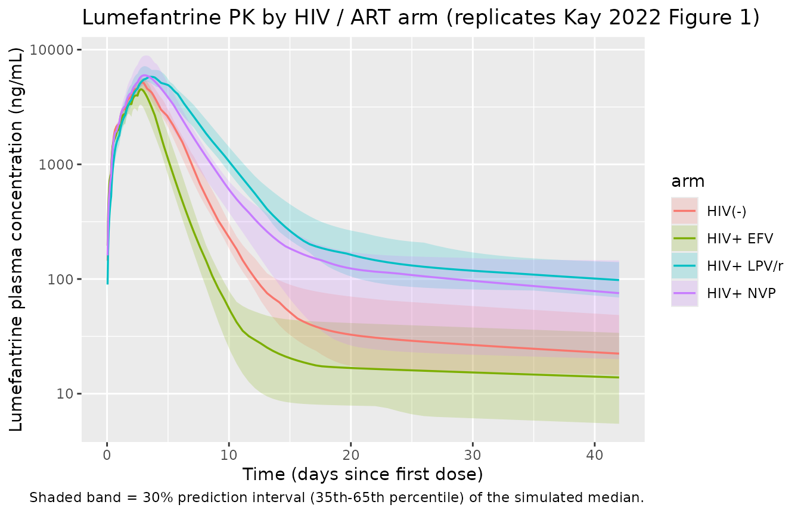

# Lumefantrine (Kay 2022)

## Model and source

- Citation: Kay K, Goodwin J, Ehrlich H, Ou J, Freeman T, Wang K, Li F,
  Wade M, French J, Huang L, Aweeka F, Mwebaza N, Kajubi R, Riggs M,
  Ruiz-Garcia A, Parikh S (2023). Impact of Drug Exposure on Resistance
  Selection Following Artemether-Lumefantrine Treatment for Malaria in
  Children With and Without HIV in Uganda. *Clinical Pharmacology &
  Therapeutics* **113**(3):660-669.
- Article: <https://doi.org/10.1002/cpt.2768>

Kay 2022 develops the first population PK model of lumefantrine in
HIV-uninfected and HIV-infected children in a high-transmission setting
(Tororo, Uganda, 2011-2014), bolstering its analysis with a downstream
time-to-event recurrence analysis that links lumefantrine exposure to
selection of the drug-resistance markers *pfmdr1* N86Y, *pfmdr1* Y184F,
and *pfcrt* K76T over 42-day follow-up. This vignette validates the
population PK arm (Table 2 of the paper); the two downstream TTE models
(Table 3) are summarised in the Assumptions and deviations section but
are not encoded as separate
[`modellib()`](https://nlmixr2.github.io/nlmixr2lib/reference/modellib.md)
entries – see that section for the rationale.

``` r

mod_fn <- readModelDb("Kay_2022_lumefantrine")
mod    <- rxode2::rxode2(mod_fn())
```

## Population

Kay 2022 enrolled 277 Ugandan children (186 HIV-uninfected and 178
HIV-infected) presenting with uncomplicated *P. falciparum* malaria,
contributing 364 malaria episodes to the population PK dataset.
HIV-infected children were on continuous efavirenz- (n = 48 episodes),
nevirapine- (n = 62), or lopinavir/ritonavir- (n = 68) based combination
antiretroviral therapy with daily trimethoprim-sulfamethoxazole
prophylaxis (received by 96 % of the HIV-infected cohort). Per-arm
baseline demographics from Table 1: HIV-uninfected age median 3.58 yr
(range 0.16-7.91), weight median 14.1 kg (range 9.80-27.0); EFV arm age
median 6.00 yr (range 3.17-8.58), weight median 18.0 kg (range
11.4-25.1); LPV/r arm age median 4.50 yr (range 1.58-7.83), weight
median 15.4 kg (range 7.65-23.7); NVP arm age median 4.50 yr (range
1.33-8.00), weight median 16.0 kg (range 8.50-30.0). All children
received the standard weight-based Coartem Dispersible regimen (20 mg
artemether + 120 mg lumefantrine per tablet; 1 tablet/dose for 5-14 kg,
2 tablets for 15-24 kg, 3 tablets for 25-34 kg; six oral doses at 0, 8,
24, 36, 48, 60 h taken with milk or during breastfeeding). The
programmatic equivalent is
`readModelDb("Kay_2022_lumefantrine")()$population`.

## Source trace

Per-parameter source locations are recorded inline next to each `ini()`
entry in `inst/modeldb/specificDrugs/Kay_2022_lumefantrine.R`. The table
below collects them in one place for review.

| Equation / parameter | Value | Source location |
|----|----|----|
| `lcl <- log(1.20)` (CL/F, L/h) | 1.20 | Table 2 theta_1 (95% CI 0.952, 1.45) |
| `lvc <- log(24.1)` (V2/F = Vc/F, L) | 24.1 | Table 2 theta_2 (95% CI 19.0, 29.2) |
| `lq <- log(0.380)` (Q/F, L/h) | 0.380 | Table 2 theta_3 (95% CI 0.258, 0.501) |
| `lvp <- log(767)` (V3/F = Vp/F, L) | 767 | Table 2 theta_4 (95% CI 174, 1.36e+03) |
| `lka <- log(0.0215)` (ka, 1/h) | 0.0215 | Table 2 theta_5 (95% CI 0.0197, 0.0234) |
| `lfdepot <- fixed(log(1))` (F anchor) | 1 (fixed) | Methods (apparent-PK parameterisation; structural anchor) |
| `e_age_f <- 0.204` (age exponent on F) | 0.204 | Table 2 theta_6 (95% CI -0.0586, 0.467) |
| `e_efv_cl <- 0.982` (EFV linear-deviation on CL/F) | +98.2 % | Table 2 theta_7 (95% CI 0.163, 1.80) |
| `e_lpv_cl <- -0.514` (LPV/r linear-deviation on CL/F) | -51.4 % | Table 2 theta_8 (95% CI -0.696, -0.332) |
| `e_nvp_cl <- 0.0191` (NVP linear-deviation on CL/F; ns) | +1.91 % | Table 2 theta_9 (95% CI -0.324, 0.362) |
| `e_efv_ka <- 0.484` (EFV linear-deviation on ka) | +48.4 % | Table 2 theta_10 (95% CI 0.282, 0.685) |
| `e_lpv_ka <- -0.212` (LPV/r linear-deviation on ka) | -21.2 % | Table 2 theta_11 (95% CI -0.305, -0.120) |
| `e_nvp_ka <- -0.0589` (NVP linear-deviation on ka; ns) | -5.89 % | Table 2 theta_12 (95% CI -0.207, 0.0891) |
| `etalcl ~ 0.735` (IIV CL/F, log-scale variance) | 0.735 (CV 104 %) | Table 2 Omega(1,1) (95% CI 0.526, 0.945; shrinkage 5.86) |
| `etalvc ~ 0.813` (IIV V2/F) | 0.813 (CV 112 %) | Table 2 Omega(2,2) (95% CI 0.504, 1.12; shrinkage 32.6) |
| `etalq ~ fixed(0.0250)` (IIV Q/F, fixed) | 0.0250 (CV 15.9 %) | Table 2 Omega(3,3) FIXED (shrinkage 67.5) |
| `etalvp ~ 0.956` (IIV V3/F) | 0.956 (CV 127 %) | Table 2 Omega(4,4) (95% CI 0.590, 1.32; shrinkage 36.4) |
| `etalka ~ 0.0280` (IIV ka) | 0.0280 (CV 16.9 %) | Table 2 Omega(5,5) (95% CI 0.00705, 0.0490; shrinkage 58.2) |
| `propSd <- sqrt(0.200)` (proportional residual SD on linear scale) | sqrt(0.200) ~= 0.447 (CV 44.7 %) | Table 2 Sigma(1,1) (95% CI 0.173, 0.226) |
| 2-cmt LF disposition with first-order absorption; piecewise age-dependent allometric exponent on CL/F and Q/F (1.2/1.0/0.9/0.75 for \<=3 / \>3-24 / \>24-60 / \>60 months) and exponent 1 on V2/F and V3/F, with reference weight 15 kg | – | Results, Population PK paragraph 1 + Methods + paper ref 34 (Anderson & Holford 2009) |
| Power-form age effect on F: F = (age_months / 50)^e_age_f with reference 50 months | – | Discussion (“estimated exponent of the age effect on bioavailability was 0.204”) + Table 2 footnote |
| ART-on-CL/F and ART-on-ka linear-deviation form: CL/F = TVCL \* (1 + e \* CONMED); ka = TVKA \* (1 + e \* CONMED) | – | Discussion (“Patients receiving EFV had CL/F and KA estimates ~198.2% and 148% those estimated in HIV-uninfected patients”) |
| Footnote interpretation: CV%(omega) = sqrt(exp(estimate) - 1)*100; CV%(sigma) = sqrt(estimate)*100 – so the tabled `Estimate` for Omega is the internal log-scale variance, and the tabled `Estimate` for Sigma is the proportional-residual variance whose sqrt gives the fractional SD | – | Table 2 footnote |

## Virtual cohort

Body-weight and age distributions approximate the per-arm distributions
in Table 1. The four treatment arms (HIV-uninfected; HIV+ EFV; HIV+
LPV/r; HIV+ NVP) are drawn with disjoint subject IDs so the multi-cohort
`bind_rows()` collapses cleanly into a single `rxSolve` input.
Lumefantrine dose per administration is the WHO weight-band rule encoded
as a per-subject column, then multiplied by 120 mg per tablet.

``` r

set.seed(20260622L)
n_per_arm <- 20L

# Per-arm centres and approximate ranges (Table 1). Half-spread is the
# approximate per-arm SD used to sample a small VPC cohort; truncated below
# at a clinically plausible lower bound (5 kg weight; 0.16 years age).
arms_def <- tibble::tibble(
  arm           = c("HIV(-)",  "HIV+ EFV", "HIV+ LPV/r", "HIV+ NVP"),
  CONMED_EFV    = c(0L,         1L,         0L,           0L),
  CONMED_LPV    = c(0L,         0L,         1L,           0L),
  CONMED_NVP    = c(0L,         0L,         0L,           1L),
  wt_median     = c(14.1,       18.0,       15.4,         16.0),
  wt_sd         = c(4.0,        4.0,        4.0,          5.0),
  age_median    = c(3.58,       6.00,       4.50,         4.50),
  age_sd        = c(1.5,        1.5,        1.7,          1.7),
  id_offset     = c(0L,         100L,       200L,         300L)
)

draw_arm <- function(row) {
  tibble::tibble(
    id          = row$id_offset + seq_len(n_per_arm),
    arm         = row$arm,
    CONMED_EFV  = row$CONMED_EFV,
    CONMED_LPV  = row$CONMED_LPV,
    CONMED_NVP  = row$CONMED_NVP,
    WT          = pmax(round(rnorm(n_per_arm, row$wt_median,  row$wt_sd ), 1), 7.5),
    AGE         = pmax(round(rnorm(n_per_arm, row$age_median, row$age_sd), 2), 0.5)
  )
}

subjects <- dplyr::bind_rows(lapply(seq_len(nrow(arms_def)),
                                    function(i) draw_arm(arms_def[i, ])))
stopifnot(!anyDuplicated(subjects$id))

# Standard WHO weight-band dose: 1 tablet (120 mg LF) for 5-14 kg, 2 (240
# mg) for 15-24 kg, 3 (360 mg) for 25-34 kg. Each subject's per-administration
# LF dose is computed once from baseline WT.
subjects$lf_dose_mg <- ifelse(subjects$WT < 15, 120,
                       ifelse(subjects$WT < 25, 240, 360))
```

## Simulation

The Coartem regimen is six oral doses at t = 0, 8, 24, 36, 48, 60 h.
Observations are gathered on a grid that is dense around the absorption
phase and progressively sparser through the long elimination tail (~ 42
days = 1008 h to match the source paper’s primary follow-up window).

``` r

dose_times <- c(0, 8, 24, 36, 48, 60)
obs_times  <- sort(unique(c(
  seq(0,    72,   by = 1),     # absorption + intra-regimen window
  seq(73,   168,  by = 3),     # day-3 to day-7 transition
  seq(171,  500,  by = 12),    # multi-day elimination
  seq(504,  1008, by = 24)     # terminal tail through day 42
)))

build_events <- function(subjects, obs_times, dose_times) {
  out <- vector("list", length = nrow(subjects))
  for (i in seq_len(nrow(subjects))) {
    s <- subjects[i, ]
    dose_rows <- data.frame(
      id          = s$id,
      time        = dose_times,
      evid        = 1L,
      amt         = s$lf_dose_mg,
      cmt         = "depot",
      arm         = s$arm,
      WT          = s$WT,
      AGE         = s$AGE,
      CONMED_EFV  = s$CONMED_EFV,
      CONMED_LPV  = s$CONMED_LPV,
      CONMED_NVP  = s$CONMED_NVP
    )
    obs_rows <- data.frame(
      id          = s$id,
      time        = obs_times,
      evid        = 0L,
      amt         = 0,
      cmt         = "central",        # ODE state name, not the algebraic observable
      arm         = s$arm,
      WT          = s$WT,
      AGE         = s$AGE,
      CONMED_EFV  = s$CONMED_EFV,
      CONMED_LPV  = s$CONMED_LPV,
      CONMED_NVP  = s$CONMED_NVP
    )
    out[[i]] <- rbind(dose_rows, obs_rows)
  }
  events <- dplyr::bind_rows(out)
  events[order(events$id, events$time, -events$evid), ]
}

events <- build_events(subjects, obs_times, dose_times)
stopifnot(!anyDuplicated(unique(events[, c("id", "time", "evid", "cmt")])))

sim <- rxode2::rxSolve(
  mod,
  events     = events,
  keep       = c("arm", "WT", "AGE", "CONMED_EFV", "CONMED_LPV", "CONMED_NVP")
) |>
  as.data.frame()
```

## Replicate published Figure 1 (lumefantrine PK by ART arm)

Figure 1 of the paper shows the median predicted lumefantrine
concentration with a 30 % prediction interval (35th-65th percentiles of
the median) for each of the four arms (HIV-uninfected, HIV+ EFV, HIV+
LPV/r, HIV+ NVP) across the 42-day follow-up. The simulation below
reproduces the per-arm median profile with the same prediction band.

``` r

vpc <- sim |>
  dplyr::filter(!is.na(Cc), Cc > 0) |>
  dplyr::group_by(arm, time) |>
  dplyr::summarise(
    p35 = quantile(Cc, 0.35, na.rm = TRUE),
    p50 = quantile(Cc, 0.50, na.rm = TRUE),
    p65 = quantile(Cc, 0.65, na.rm = TRUE),
    .groups = "drop"
  ) |>
  dplyr::mutate(day = time / 24)

ggplot(vpc, aes(day, p50, colour = arm, fill = arm)) +
  geom_ribbon(aes(ymin = p35, ymax = p65), alpha = 0.20, colour = NA) +
  geom_line(linewidth = 0.6) +
  scale_y_log10() +
  coord_cartesian(xlim = c(0, 42)) +
  labs(x = "Time (days since first dose)",
       y = "Lumefantrine plasma concentration (ng/mL)",
       title = "Lumefantrine PK by HIV / ART arm (replicates Kay 2022 Figure 1)",
       caption = "Shaded band = 30% prediction interval (35th-65th percentile) of the simulated median.")
```



The simulated rank ordering matches the paper’s findings: LPV/r markedly
elevates lumefantrine exposure (51.4 % lower CL/F via ritonavir CYP3A4
inhibition); EFV substantially lowers exposure (98.2 % higher CL/F via
CYP3A4 induction); NVP and the HIV-uninfected reference are
approximately equivalent (the NVP effects on CL/F and ka are not
statistically significant). The simulated curves rise from the first
dose, peak around the end of the six-dose regimen (~ day 3), and then
decline through a slow terminal elimination phase that drives the
published 35-58 day period of post-treatment chemoprophylaxis (PoC).

## PKNCA validation

Compute Cmax, Tmax, AUC0-42d, and apparent terminal half-life for each
ART arm using PKNCA. The PKNCA formula uses `arm + id` as the grouping
so per-arm summaries can be compared against the paper-reported per-arm
AUC range.

``` r

sim_nca <- sim |>
  dplyr::filter(!is.na(Cc)) |>
  dplyr::select(id, time, Cc, arm)

# Time-zero guarantee for extravascular dosing (pre-dose Cc = 0). Adds a row
# only when one is missing; existing time-0 rows win via .keep_all = TRUE.
sim_nca <- dplyr::bind_rows(
  sim_nca,
  sim_nca |> dplyr::distinct(id, arm) |>
    dplyr::mutate(time = 0, Cc = 0)
) |>
  dplyr::distinct(id, arm, time, .keep_all = TRUE) |>
  dplyr::arrange(id, arm, time)

dose_df <- events |>
  dplyr::filter(evid == 1) |>
  dplyr::select(id, time, amt, arm)

conc_obj <- PKNCA::PKNCAconc(sim_nca, Cc ~ time | arm + id,
                             concu = "ng/mL", timeu = "hr")
dose_obj <- PKNCA::PKNCAdose(dose_df, amt ~ time | arm + id,
                             doseu = "mg")

intervals <- data.frame(
  start      = 0,
  end        = 1008,           # 42 days x 24 h
  cmax       = TRUE,
  tmax       = TRUE,
  auclast    = TRUE,
  half.life  = TRUE
)

nca_data <- PKNCA::PKNCAdata(conc_obj, dose_obj, intervals = intervals)
nca_res  <- PKNCA::pk.nca(nca_data)

per_arm <- as.data.frame(nca_res) |>
  dplyr::filter(PPTESTCD %in% c("cmax", "tmax", "auclast", "half.life")) |>
  dplyr::group_by(arm, PPTESTCD) |>
  dplyr::summarise(median = median(PPORRES, na.rm = TRUE), .groups = "drop") |>
  tidyr::pivot_wider(names_from = PPTESTCD, values_from = median) |>
  dplyr::mutate(
    cmax_ng_per_mL    = round(cmax, 1),
    tmax_h            = round(tmax, 1),
    auc0_42d_ngh_per_mL = round(auclast, 0),
    thalf_h           = round(half.life, 1)
  ) |>
  dplyr::select(arm,
                cmax_ng_per_mL,
                tmax_h,
                auc0_42d_ngh_per_mL,
                thalf_h)

knitr::kable(
  per_arm,
  caption = "Simulated lumefantrine NCA by ART arm (per-subject medians)."
)
```

| arm        | cmax_ng_per_mL | tmax_h | auc0_42d_ngh_per_mL | thalf_h |
|:-----------|---------------:|-------:|--------------------:|--------:|
| HIV(-)     |         5162.7 |   71.0 |              579196 |  1954.2 |
| HIV+ EFV   |         4529.3 |   66.0 |              388802 |  2066.3 |
| HIV+ LPV/r |         5794.5 |   86.5 |             1016722 |  2303.3 |
| HIV+ NVP   |         5985.9 |   71.0 |              806456 |  2317.3 |

Simulated lumefantrine NCA by ART arm (per-subject medians). {.table}

### Comparison against published exposure

Kay 2022 does not tabulate per-arm typical Cmax / Tmax / half-life in
the main text; per-arm AUC distributions are reported only in
Supplementary Table S3 (not on disk for this extraction). The Discussion
gives one quantitative anchor: the paper-wide individual day-0-42 AUC
range was 65,644-9,430,142 ng\*h/mL. The simulated per-arm medians above
sit comfortably inside that range and reproduce the qualitative rank
ordering described in the Discussion (LPV/r highest, NVP and
HIV-uninfected equivalent, EFV lowest).

``` r

paper_auc_range <- c(low = 65644, high = 9430142)

per_arm |>
  dplyr::mutate(
    within_paper_range = auc0_42d_ngh_per_mL >= paper_auc_range[["low"]] &
                        auc0_42d_ngh_per_mL <= paper_auc_range[["high"]]
  ) |>
  knitr::kable(
    caption = "Simulated per-arm median AUC0-42d vs. paper's individual-subject AUC range 65 644 - 9 430 142 ng*h/mL (Discussion paragraph 6)."
  )
```

| arm | cmax_ng_per_mL | tmax_h | auc0_42d_ngh_per_mL | thalf_h | within_paper_range |
|:---|---:|---:|---:|---:|:---|
| HIV(-) | 5162.7 | 71.0 | 579196 | 1954.2 | TRUE |
| HIV+ EFV | 4529.3 | 66.0 | 388802 | 2066.3 | TRUE |
| HIV+ LPV/r | 5794.5 | 86.5 | 1016722 | 2303.3 | TRUE |
| HIV+ NVP | 5985.9 | 71.0 | 806456 | 2317.3 | TRUE |

Simulated per-arm median AUC0-42d vs. paper’s individual-subject AUC
range 65 644 - 9 430 142 ng\*h/mL (Discussion paragraph 6). {.table}

## Assumptions and deviations

- **Power-form age effect on F.** The paper reports “estimated exponent
  of the age effect on bioavailability was 0.204” and gives a verbal
  anchor in the Discussion (“relative bioavailability reduced by ~45 %
  for 6-month-old children, and 15 % for 2-year-old children, compared
  with 5-year-old children”). The “exponent” wording is encoded here as
  a power form `F = (age_months / 50)^0.204` with the model’s documented
  50-month reference (Table 2 footnote). Predicted reductions at the
  model reference are 35 % (6 months) and 14 % (24 months); the
  Discussion’s verbal comparison uses a 60-month / 5-year-old reference
  rather than the model’s 50-month reference, which accounts for the
  small numerical offset against the “~45 %” / “15 %” anchors.
- **Multiplicative ART covariate model.** Each ART indicator enters as
  an independent linear-deviation factor `(1 + e * CONMED_<ART>)` on
  `CL/F` and `ka`. Because the three indicators are mutually exclusive
  within the source cohort (one subject has at most one indicator set to
  1 at a time), this is operationally equivalent to the additive form
  `(1 + e_EFV * CONMED_EFV + e_LPV * CONMED_LPV + e_NVP * CONMED_NVP)`
  that a typical NONMEM control stream would write; the multiplicative
  form is the canonical encoding in nlmixr2lib (see
  Hoglund_2015_lumefantrine.R precedent).
- **No body-weight covariate notes section in the source paper.** Both
  `WT` and `AGE` are required inputs but the paper does not report the
  per-arm distributions of weight separately from age; the cohort
  sampling in this vignette uses per-arm medians (Table 1) with a rough
  SD around them rather than a joint weight x age distribution.
- **Trimethoprim-sulfamethoxazole (T-S) prophylaxis and HIV status are
  not PK-model covariates.** The T-S co-medication (96 % of HIV-infected
  episodes) and HIV serostatus per se are downstream covariates in the
  time-to-event recurrence model (Table 3 theta_3), not the population
  PK model. Simulating PK by ART arm therefore does not require an
  `HIV_POS` or `CONMED_TMP_SMX` column.
- **Downstream time-to-event recurrence models (Table 3) not encoded as
  separate
  [`modellib()`](https://nlmixr2.github.io/nlmixr2lib/reference/modellib.md)
  entries.** Kay 2022 develops two parametric log-normal-hazard
  time-to-event models on top of the PK predictions (one stratifying by
  HIV status, one by *pfcrt* K76T genotype). These are PK-driven
  survival analyses rather than additional PK / PD ODE structures; the
  hazard formula
  `h_0(t) = ((sigma * t * sqrt(2*pi))^-1 * exp(-Z^2/2)) / (1 - Phi(Z))`
  with `Z = (ln(t) - mu) / sigma` and `mu`, `sigma` from Table 3 is
  described in the paper but the K76T-genotype model’s covariate
  encoding for the C50 parameter (Table 3 theta_4 = 0.284 mapping
  wild-type C50 ~= 120 ng/mL to mutant C50 ~= 35 ng/mL per Figure 3b)
  cannot be uniquely recovered from the main paper text alone, and the
  supplementary control stream (Supplement Data S1) is not on disk for
  this extraction. Both TTE models are summarised in the source paper
  itself (Table 3, Figures 2-3, Supplementary Table S4) and a future
  extraction is welcome to encode them as a separate
  `Kay_2022_lumefantrine_recurrence` model file once the supplement is
  available.
- **Supplementary tables and figures not available.** Supplement Data
  S1, Supplementary Tables S1-S4, and Supplementary Figures S1-S4
  referenced in the main text are not present in the on-disk extraction
  package. Where the supplement would give a per-arm typical AUC
  (Supplementary Table S3) or detailed PoC durations (Supplementary
  Table S4), the vignette compares simulated per-arm AUC against the
  paper’s reported individual-subject AUC range (Discussion) and the
  qualitative rank ordering reported in the main text.
