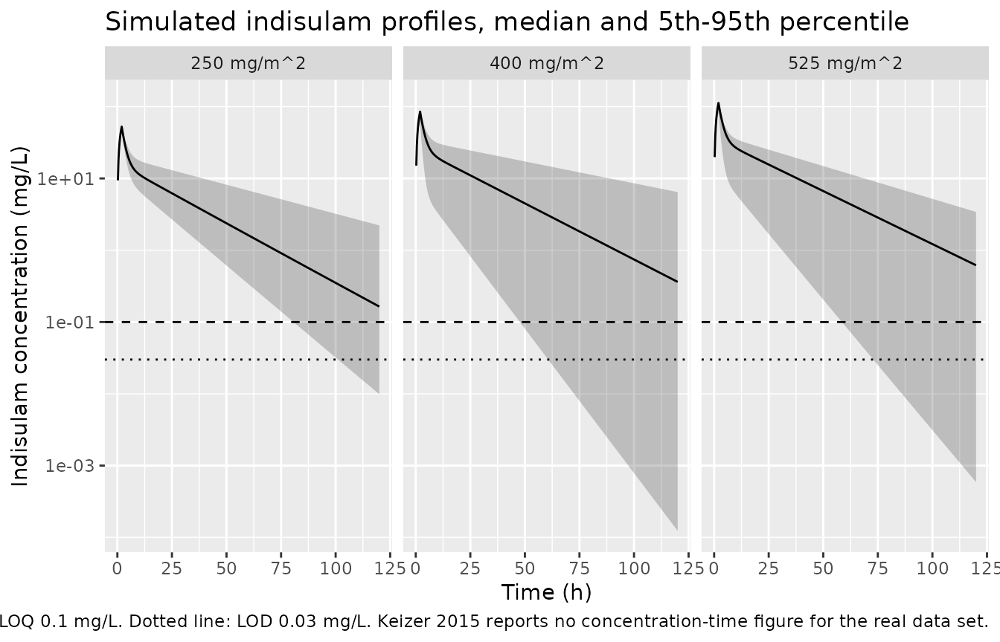

# Indisulam (Keizer 2015)

## Model and source

- Citation: Keizer RJ, Jansen RS, Rosing H, Thijssen B, Beijnen JH,
  Schellens JHM, Huitema ADR. Incorporation of concentration data below
  the limit of quantification in population pharmacokinetic analyses.
  Pharmacol Res Perspect. 2015;3(2):e00131. <doi:10.1002/prp2.131>.
- Description: Two-compartment linear IV population PK model for
  indisulam (E7070) in 34 adult solid-tumour patients receiving 250-525
  mg/m2 as a 2-hour infusion in combination with irinotecan (Keizer
  2015, Table 3, ‘All data’ column). This is the real-data model from a
  methodological study comparing four ways of handling concentrations
  below the limit of quantification; the ‘All data’ column is the
  paper’s advocated method, in which extrapolated concentrations between
  the limit of detection and the LLOQ are used as continuous
  observations. Interindividual variability is on clearance only; no
  covariates were investigated. Indisulam is known to have nonlinear
  (saturable) disposition, but nonlinearity was not supported by this
  limited data set and the fitted model is linear.
- Article: <https://doi.org/10.1002/prp2.131> (open access, PMC4448983)

## What this paper is, and which table was extracted

Keizer 2015 is primarily a *methodological* paper: it compares four ways
of handling concentrations below the lower limit of quantification
(LLOQ) in population PK analyses. It contains **two** parameter tables,
and only one of them is a fitted model.

- **Table 1 is NOT extracted.** It lists the structural models and round
  parameter values (CL 5 L/h, V 50 L, Q2 10 L/h, V2 100 L, ka 0.5 /h)
  used to *generate* synthetic data sets for the
  simulation-and-reestimation study. These are simulation inputs that
  describe no drug, so they are not a pharmacometric model of anything
  and are deliberately not packaged.
- **Table 3 IS extracted, and is what this vignette validates.** The
  paper’s final section (“Real PopPK data set”) fits an original
  two-compartment linear population PK model to real clinical trial data
  for the anticancer agent indisulam (development code E7070), from a
  phase I dose-escalation study of indisulam combined with irinotecan
  (Ryan et al. 2005). Table 3 reports the complete final parameter set
  (structural, interindividual, residual) under each of the four
  BLQ-handling methods, and Figure 7 shows the corresponding bootstrap
  distributions.

The packaged model takes the **“All data”** column of Table 3. That is
the method the paper advocates (extrapolated concentrations between the
limit of detection and the LLOQ are used as ordinary continuous
observations) and the one with by far the best estimation stability in
this data set: 91.5% successful minimization and 85.7% successful
covariance step, against 66.7% / 11.4% for the likelihood-based “LIKE”
(Beal M3) method. The other three columns are reproduced below as a
sensitivity comparison.

A separate, more elaborate semiphysiological model of indisulam’s
nonlinear disposition exists (Zandvliet et al. 2006). It is **not** the
model encoded here; Keizer 2015 states that nonlinearity was not
supported by this limited data set.

## Population

PK data came from 34 adult patients with advanced solid tumours
receiving indisulam 250-525 mg/m^2 as a 2-hour intravenous infusion, in
a phase I dose-escalation trial of indisulam plus irinotecan (Ryan et
al. 2005). One PK curve per patient was available, sampled over 120 h.
Excluding pre-first-dose samples, 231 PK samples were available, of
which 17 (7.4%) were below the LLOQ. Plasma indisulam was assayed by a
validated LC-MS/MS method over 0.1-20 microg/mL (Beumer et al. 2004);
the limit of detection was taken as 30% of the LLOQ, i.e. 0.03
microg/mL.

Keizer 2015 reports no demographic table for this cohort (age, sex,
weight and race are in the primary trial report, Ryan et al. 2005) and
explicitly did not investigate covariates: “we only performed basic
compartmental PK modeling on this limited data set, and, for example,
the influence of covariates was not investigated.” The packaged model
therefore carries no covariates.

The same information is available programmatically via the model’s
`population` metadata
(`readModelDb("Keizer_2015_indisulam")()$population`).

## Source trace

Every value below is the “All data” column of Table 3 (page 9 of the
article). The per-parameter origin is also recorded as an in-file
comment next to each `ini()` entry in
`inst/modeldb/specificDrugs/Keizer_2015_indisulam.R`.

| Equation / parameter | Value | Source location |
|----|----|----|
| `lcl` | `log(0.828)` | Table 3, row `CL (L/h)`, “All data” column |
| `lvc` | `log(5.63)` | Table 3, row `V (L)`, “All data” column |
| `lq` | `log(1.88)` | Table 3, row `Q (L/h)`, “All data” column |
| `lvp` | `log(12.6)` | Table 3, row `Vper (L)`, “All data” column |
| `etalcl` | `0.367236` | Table 3, row `eta_CL`, “All data” column = 60.6%; `0.606^2` |
| `propSd` | `0.267` | Table 3, row `sigma_prop`, “All data” column = 26.7% |
| `addSd` | `0.0364` | Table 3, row `sigma_add (mg/L)`, “All data” column |
| Two-compartment linear IV structure | n/a | “Real data sets”: “a two-compartment linear model showed a better fit than a linear one-compartment model” |
| IIV on CL only | n/a | Table 3 reports `eta_CL` and no other random effect |
| Combined additive + proportional residual | n/a | Table 3 reports both `sigma_add` and `sigma_prop`; Methods: “A combined proportional and additive error model was used” |
| No covariates | n/a | Methods, “Real PopPK data set”: covariates “not investigated” |

### Note on the interindividual-variability scale

Table 3 labels the random-effect row `eta_CL` and reports it as a
percentage (60.6%), in exactly the same percentage style as the
`sigma_prop` row directly beneath it (26.7%). `sigma_prop` is
unambiguously the proportional residual *standard deviation* itself, so
by parallel construction `eta_CL` is read as the standard deviation of
the log-scale random effect: omega = 0.606, hence
`etalcl ~ 0.606^2 = 0.367236`. The paper’s own simulation section uses
the same convention, defining the simulated between-subject variability
as “25%” (i.e. omega = 0.25). Reading 60.6% instead as an exact
log-normal CV would give `log(1 + 0.606^2) = 0.3127`, i.e. omega =
0.559, which is inconsistent with the `sigma_prop` row.

## Virtual cohort

The original observed data are not publicly available. The cohort below
spans the paper’s reported dose range (250, 400 and 525 mg/m^2), with 34
subjects per dose level to match the paper’s total N of 34 at each arm.
Body surface area is not reported in Keizer 2015, so a standard adult
1.8 m^2 is assumed to convert mg/m^2 to the absolute mg doses the model
consumes. The sampling grid covers the paper’s 120 h window; the real
trial’s sampling times are not reported.

``` r

# `set.seed()` seeds R's RNG; `rxSetSeed()` seeds rxode2's, but only for a
# given solver-thread count. Every assertion below is therefore written either
# on a deterministic quantity (a solve against its own closed form) or with
# headroom that admits any cohort this model can produce.
set.seed(20150320)
rxode2::rxSetSeed(20150320)

BSA         <- 1.8    # m^2, assumed standard adult (not reported in the paper)
LLOQ        <- 0.1    # mg/L, assay LLOQ (Beumer 2004, cited by Keizer 2015)
LOD         <- 0.03   # mg/L, 30% of the LLOQ (Keizer 2015 Methods)
dose_levels <- c(250, 400, 525)   # mg/m^2, the paper's reported dose range

make_cohort <- function(n, dose_m2, id_offset = 0L) {
  obs <- c(
    seq(0, 4, by = 0.25), seq(4.5, 12, by = 0.5), seq(13, 24, by = 1),
    seq(28, 48, by = 4), seq(56, 120, by = 8)
  )
  rxode2::et(amt = dose_m2 * BSA, dur = 2, cmt = "central", id = seq_len(n)) |>
    rxode2::et(obs, cmt = "central") |>
    as.data.frame() |>
    dplyr::mutate(
      id         = id + id_offset,
      dose_group = sprintf("%d mg/m^2", dose_m2)
    )
}

events <- dplyr::bind_rows(
  make_cohort(34, dose_levels[1], id_offset =  0L),
  make_cohort(34, dose_levels[2], id_offset = 34L),
  make_cohort(34, dose_levels[3], id_offset = 68L)
)
stopifnot(!anyDuplicated(unique(events[, c("id", "time", "evid")])))
```

## Simulation

``` r

mod <- readModelDb("Keizer_2015_indisulam")
sim <- rxode2::rxSolve(mod, events = events, keep = "dose_group")
```

`Cc` is the individual prediction (no residual error); `sim` adds the
combined additive plus proportional residual error. With a 26.7%
proportional residual term the simulated observations go slightly
negative in the far tail, so `Cc` is used for the NCA and `sim` only
where the residual error is the point (the BLQ-fraction check).

``` r

sim |>
  dplyr::group_by(time, dose_group) |>
  dplyr::summarise(
    Q05 = quantile(Cc, 0.05), Q50 = median(Cc), Q95 = quantile(Cc, 0.95),
    .groups = "drop"
  ) |>
  dplyr::filter(time > 0) |>
  ggplot(aes(time, Q50)) +
  geom_ribbon(aes(ymin = Q05, ymax = Q95), alpha = 0.25) +
  geom_line() +
  geom_hline(yintercept = LLOQ, linetype = "dashed") +
  geom_hline(yintercept = LOD, linetype = "dotted") +
  facet_wrap(~dose_group) +
  scale_y_log10() +
  labs(
    x = "Time (h)", y = "Indisulam concentration (mg/L)",
    title = "Simulated indisulam profiles, median and 5th-95th percentile",
    caption = paste(
      "Dashed line: assay LLOQ 0.1 mg/L. Dotted line: LOD 0.03 mg/L.",
      "Keizer 2015 reports no concentration-time figure for the real data set."
    )
  )
```



## Cross-check against Figure 7 (bootstrap distributions)

Keizer 2015 Figure 7 plots the bootstrap distributions of the four
structural parameters, one panel per parameter, with all four BLQ
methods overlaid. The panel axis ranges are printed on the figure and
give an independent check that the Table 3 point estimates were
transcribed correctly: every one of the 16 Table 3 structural values
must fall inside its panel’s axis range.

``` r

tab3 <- tibble::tribble(
  ~method,    ~CL,   ~V,   ~Q,   ~Vper, ~etaCL, ~sigma_add, ~sigma_prop,
  "Discard",  0.823, 5.61, 1.90, 12.4,  0.623,  0.071,      0.258,
  "LLOQ/2",   0.819, 5.65, 1.89, 12.5,  0.615,  0.0344,     0.266,
  "LIKE",     0.822, 5.61, 1.90, 12.4,  0.618,  0.055,      0.261,
  "All data", 0.828, 5.63, 1.88, 12.6,  0.606,  0.0364,     0.267
)

# Axis ranges read off the four panels of Keizer 2015 Figure 7.
fig7_axes <- list(CL = c(0.4, 1.4), Q = c(1.2, 2.6), V = c(2, 9), Vper = c(8, 16))

inside <- vapply(names(fig7_axes), function(p) {
  rng <- fig7_axes[[p]]
  all(tab3[[p]] >= rng[1] & tab3[[p]] <= rng[2])
}, logical(1))

stopifnot(length(inside) == 4L, all(inside))
knitr::kable(
  tab3 |>
    dplyr::rename(
      "BLQ method"            = method,
      "CL (L/h)"              = CL,
      "V (L)"                 = V,
      "Q (L/h)"               = Q,
      "Vper (L)"              = Vper,
      "eta_CL"                = etaCL,
      "sigma_add (mg/L)"      = sigma_add,
      "sigma_prop"            = sigma_prop
    ),
  caption = paste(
    "Keizer 2015 Table 3, all four columns. The packaged model is the",
    "'All data' row. Every structural value lies inside its Figure 7 panel",
    "axis range."
  )
)
```

| BLQ method | CL (L/h) | V (L) | Q (L/h) | Vper (L) | eta_CL | sigma_add (mg/L) | sigma_prop |
|:-----------|---------:|------:|--------:|---------:|-------:|-----------------:|-----------:|
| Discard    |    0.823 |  5.61 |    1.90 |     12.4 |  0.623 |           0.0710 |      0.258 |
| LLOQ/2     |    0.819 |  5.65 |    1.89 |     12.5 |  0.615 |           0.0344 |      0.266 |
| LIKE       |    0.822 |  5.61 |    1.90 |     12.4 |  0.618 |           0.0550 |      0.261 |
| All data   |    0.828 |  5.63 |    1.88 |     12.6 |  0.606 |           0.0364 |      0.267 |

Keizer 2015 Table 3, all four columns. The packaged model is the ‘All
data’ row. Every structural value lies inside its Figure 7 panel axis
range. {.table}

## PKNCA validation

For a linear model the NCA output has exact closed forms, so these are
strict identity checks rather than tolerance comparisons: both sides use
the *same* drawn parameters, and the only difference is trapezoidal and
extrapolation error. Keizer 2015 reports no NCA parameters for the real
data set, so there is no published NCA table to compare against.

``` r

sim_nca <- sim |>
  dplyr::filter(!is.na(Cc)) |>
  dplyr::select(id, time, Cc, dose_group)

# Guarantee a time = 0 anchor per subject (Cc = 0 pre-dose for an IV infusion).
sim_nca <- dplyr::bind_rows(
  sim_nca,
  sim_nca |> dplyr::distinct(id, dose_group) |> dplyr::mutate(time = 0, Cc = 0)
) |>
  dplyr::distinct(id, dose_group, time, .keep_all = TRUE) |>
  dplyr::arrange(id, dose_group, time)

dose_df <- events |>
  dplyr::filter(evid == 1) |>
  dplyr::select(id, time, amt, dose_group)

nca_res <- PKNCA::pk.nca(PKNCA::PKNCAdata(
  PKNCA::PKNCAconc(sim_nca, Cc ~ time | dose_group + id),
  PKNCA::PKNCAdose(dose_df, amt ~ time | dose_group + id),
  intervals = data.frame(
    start = 0, end = Inf,
    cmax = TRUE, tmax = TRUE, aucinf.obs = TRUE, half.life = TRUE
  )
))

nca_wide <- as.data.frame(nca_res) |>
  dplyr::select(id, dose_group, PPTESTCD, PPORRES) |>
  tidyr::pivot_wider(names_from = PPTESTCD, values_from = PPORRES)
stopifnot(nrow(nca_wide) == 102L, !anyNA(nca_wide$aucinf.obs))
```

### Gate 1: AUC(0-inf) equals Dose / CL for every subject

Total exposure after a single IV dose of a linear model is exactly
`Dose / CL`, with no dependence on V, Q or Vper. This catches a
mis-transcribed clearance, a dose-unit error, or an infusion that failed
to deliver its full amount.

``` r

subj <- sim |> dplyr::distinct(id, cl, kel, k12, k21)

chk <- nca_wide |>
  dplyr::left_join(dose_df |> dplyr::distinct(id, amt), by = "id") |>
  dplyr::left_join(subj, by = "id") |>
  dplyr::mutate(
    auc_closed_form = amt / cl,
    auc_pct_diff    = 100 * (aucinf.obs - auc_closed_form) / auc_closed_form
  )

stopifnot(nrow(chk) == 102L, all(abs(chk$auc_pct_diff) < 0.5))
sprintf("AUCinf vs Dose/CL: max |%% difference| = %.4f%% over %d subjects",
        max(abs(chk$auc_pct_diff)), nrow(chk))
#> [1] "AUCinf vs Dose/CL: max |% difference| = 0.1154% over 102 subjects"
```

### Gate 2: terminal half-life equals the closed-form beta half-life

Because interindividual variability sits on CL only, each subject has a
*different* terminal half-life. The check is therefore per subject,
against that subject’s own micro-constants:
`beta = 0.5 * (k10 + k12 + k21 - sqrt((k10 + k12 + k21)^2 - 4 * k10 * k21))`.

``` r

chk <- chk |>
  dplyr::mutate(
    ksum        = kel + k12 + k21,
    beta        = 0.5 * (ksum - sqrt(ksum^2 - 4 * kel * k21)),
    thalf_cf    = log(2) / beta,
    hl_pct_diff = 100 * (half.life - thalf_cf) / thalf_cf
  )

stopifnot(all(abs(chk$hl_pct_diff) < 2))
sprintf(paste("Terminal t1/2 vs closed form: max |%% difference| = %.4f%%;",
              "per-subject t1/2 spans %.1f to %.1f h"),
        max(abs(chk$hl_pct_diff)), min(chk$thalf_cf), max(chk$thalf_cf))
#> [1] "Terminal t1/2 vs closed form: max |% difference| = 0.4530%; per-subject t1/2 spans 6.9 to 75.9 h"
```

The typical-subject terminal half-life is 18.7 h. The wide per-subject
spread is a direct consequence of the large reported interindividual
variability on clearance (omega = 0.606).

### Summary of simulated NCA by dose group

``` r

nca_wide |>
  dplyr::group_by(dose_group) |>
  dplyr::summarise(
    n           = dplyr::n(),
    cmax_med    = median(cmax),
    tmax_med    = median(tmax),
    aucinf_med  = median(aucinf.obs),
    thalf_med   = median(half.life),
    .groups = "drop"
  ) |>
  dplyr::rename(
    "Dose group"            = dose_group,
    "N"                     = n,
    "Cmax (mg/L)"           = cmax_med,
    "Tmax (h)"              = tmax_med,
    "AUC0-inf (mg*h/L)"     = aucinf_med,
    "t1/2 (h)"              = thalf_med
  ) |>
  knitr::kable(
    digits  = c(0, 0, 1, 2, 0, 1),
    caption = paste(
      "Median simulated NCA parameters by dose group. Keizer 2015 reports no",
      "NCA values for the real data set, so there is no published reference",
      "column."
    )
  )
```

| Dose group |   N | Cmax (mg/L) | Tmax (h) | AUC0-inf (mg\*h/L) | t1/2 (h) |
|:-----------|----:|------------:|---------:|-------------------:|---------:|
| 250 mg/m^2 |  34 |        52.5 |        2 |                514 |     17.9 |
| 400 mg/m^2 |  34 |        85.0 |        2 |                900 |     19.2 |
| 525 mg/m^2 |  34 |       112.4 |        2 |               1265 |     20.3 |

Median simulated NCA parameters by dose group. Keizer 2015 reports no
NCA values for the real data set, so there is no published reference
column. {.table}

## Reproducing the paper’s central real-data claim

Keizer 2015 concludes of the real indisulam data set (7.4% BLQ): “For
all four BLOQ methods that were evaluated, the parameter estimates for
this model were very similar”, and the Figure 7 bootstrap distributions
“showed no sign of differences in mean parameter estimates or precision
between the evaluated BLOQ methods.”

Running the packaged model with each of the four Table 3 parameter
columns turns that qualitative claim into exposure numbers. The
typical-value profiles are compared at 400 mg/m^2 (the middle of the
reported dose range).

``` r

DOSE_MG <- 400 * BSA
ev_typ  <- rxode2::et(amt = DOSE_MG, dur = 2, cmt = "central") |>
  rxode2::et(seq(0, 240, by = 0.05), cmt = "central")

blq_cmp <- lapply(seq_len(nrow(tab3)), function(i) {
  r <- tab3[i, ]
  m <- mod |>
    rxode2::ini(
      lcl = log(r$CL), lvc = log(r$V), lq = log(r$Q), lvp = log(r$Vper)
    ) |>
    rxode2::zeroRe()
  s    <- rxode2::rxSolve(m, ev_typ, returnType = "data.frame")
  ksum <- r$CL / r$V + r$Q / r$V + r$Q / r$Vper
  beta <- 0.5 * (ksum - sqrt(ksum^2 - 4 * (r$CL / r$V) * (r$Q / r$Vper)))
  tibble::tibble(
    method = r$method,
    Cmax   = max(s$Cc),
    AUCinf = DOSE_MG / r$CL,
    thalf  = log(2) / beta,
    t_LLOQ = max(s$time[s$Cc >= LLOQ]),
    t_LOD  = max(s$time[s$Cc >= LOD])
  )
}) |> dplyr::bind_rows()

spread <- function(x) 100 * diff(range(x)) / mean(x)
stopifnot(
  nrow(blq_cmp) == 4L,
  # The paper's claim is that the four methods agree. At 7.4% BLQ censoring
  # they agree to ~1% on every exposure metric; 5% leaves ample headroom
  # while still going red if a column were mis-transcribed.
  spread(blq_cmp$Cmax)   < 5,
  spread(blq_cmp$AUCinf) < 5,
  spread(blq_cmp$thalf)  < 5
)

blq_cmp |>
  dplyr::rename(
    "BLQ method"            = method,
    "Cmax (mg/L)"           = Cmax,
    "AUC0-inf (mg*h/L)"     = AUCinf,
    "t1/2 (h)"              = thalf,
    "Time to LLOQ (h)"      = t_LLOQ,
    "Time to LOD (h)"       = t_LOD
  ) |>
  knitr::kable(
    digits  = c(0, 2, 1, 2, 1, 1),
    caption = paste(
      "Typical-value exposure at 400 mg/m^2 under each of the four Table 3",
      "parameter columns. Agreement to about 1% reproduces the paper's",
      "conclusion that at 7.4% BLQ censoring the handling method does not",
      "matter."
    )
  )
```

| BLQ method | Cmax (mg/L) | AUC0-inf (mg\*h/L) | t1/2 (h) | Time to LLOQ (h) | Time to LOD (h) |
|:---|---:|---:|---:|---:|---:|
| Discard | 84.73 | 874.8 | 18.54 | 150.1 | 182.3 |
| LLOQ/2 | 84.49 | 879.1 | 18.78 | 151.8 | 184.4 |
| LIKE | 84.74 | 875.9 | 18.56 | 150.2 | 182.5 |
| All data | 84.64 | 869.6 | 18.74 | 151.1 | 183.7 |

Typical-value exposure at 400 mg/m^2 under each of the four Table 3
parameter columns. Agreement to about 1% reproduces the paper’s
conclusion that at 7.4% BLQ censoring the handling method does not
matter. {.table}

``` r


sprintf(paste("Spread across the four BLQ methods: Cmax %.2f%%,",
              "AUC0-inf %.2f%%, t1/2 %.2f%%"),
        spread(blq_cmp$Cmax), spread(blq_cmp$AUCinf), spread(blq_cmp$thalf))
#> [1] "Spread across the four BLQ methods: Cmax 0.30%, AUC0-inf 1.09%, t1/2 1.28%"
```

## What the “All data” method buys, in hours of observable curve

The paper’s premise is that concentrations between the LOD and the LLOQ
are real measurements that should not be discarded. With the packaged
model the value of that window is exactly computable: in the terminal
phase the concentration decays as `exp(-beta * t)`, so extending the
usable range from the LLOQ down to the LOD (30% of the LLOQ) adds
`log(LLOQ / LOD) / beta` hours of observable curve, independent of dose.

``` r

beta_typ <- {
  ksum <- 0.828 / 5.63 + 1.88 / 5.63 + 1.88 / 12.6
  0.5 * (ksum - sqrt(ksum^2 - 4 * (0.828 / 5.63) * (1.88 / 12.6)))
}
window_closed_form <- log(LLOQ / LOD) / beta_typ
window_simulated   <- blq_cmp$t_LOD[blq_cmp$method == "All data"] -
                      blq_cmp$t_LLOQ[blq_cmp$method == "All data"]

# Identity check: the simulated window extension must match the closed form
# to within the 0.05 h resolution of the observation grid.
stopifnot(abs(window_simulated - window_closed_form) < 0.1)
sprintf(paste("Extending observations from the LLOQ (%.2f mg/L) down to the",
              "LOD (%.2f mg/L) adds %.1f h of observable curve",
              "(closed form %.1f h)"),
        LLOQ, LOD, window_simulated, window_closed_form)
#> [1] "Extending observations from the LLOQ (0.10 mg/L) down to the LOD (0.03 mg/L) adds 32.6 h of observable curve (closed form 32.5 h)"
```

For a 120 h sampling window that is a substantial fraction of the study
duration, which is why the method matters most when censoring is heavy.
In this particular data set censoring was light (7.4%), and
correspondingly the four methods agreed.

## Corroborating the reported 7.4% BLQ fraction

This is an order-of-magnitude corroboration rather than a strict gate:
the real trial’s sampling times are not reported, and the BLQ fraction
depends strongly on how late and how densely samples were drawn. It is
nevertheless sensitive to a concentration-unit error or a badly wrong
clearance, either of which would move it by orders of magnitude.

``` r

blq_obs <- sim |>
  dplyr::mutate(obs = pmax(sim, 0)) |>
  dplyr::filter(time > 0) |>
  dplyr::summarise(
    n_samples = dplyr::n(),
    pct_blq   = 100 * mean(obs < LLOQ),
    pct_lod   = 100 * mean(obs < LOD)
  )

stopifnot(blq_obs$pct_blq > 0.2, blq_obs$pct_blq < 25)
sprintf(paste("Simulated: %.1f%% of samples below the LLOQ and %.1f%% below",
              "the LOD, against 17/231 = 7.4%% BLQ reported for the real",
              "data set"),
        blq_obs$pct_blq, blq_obs$pct_lod)
#> [1] "Simulated: 2.5% of samples below the LLOQ and 1.1% below the LOD, against 17/231 = 7.4% BLQ reported for the real data set"
```

## Assumptions and deviations

- **Only the “All data” column of Table 3 is packaged.** The four
  columns are the same structural model refitted under four BLQ-handling
  methods. “All data” is the paper’s advocated method and had the best
  estimation stability (91.5% successful minimization, 85.7% successful
  covariance step). The other three columns are carried in this vignette
  as a sensitivity comparison, not as separate model files, because they
  are not distinct models.
- **Table 1 is deliberately not extracted.** Its values (CL 5 L/h, V 50
  L, Q2 10 L/h, V2 100 L, ka 0.5 /h) are inputs used to generate
  synthetic data for the simulation study and correspond to no real
  drug.
- **Interindividual-variability scale.** `eta_CL = 60.6%` in Table 3 is
  read as the log-scale standard deviation (omega = 0.606, variance
  0.367236) rather than as an exact log-normal CV (which would give
  omega = 0.559). The reasoning is in “Note on the
  interindividual-variability scale” above: the row sits in the same
  percentage style as `sigma_prop`, which is unambiguously a standard
  deviation, and the paper’s simulation section uses the same
  convention.
- **No interindividual variability on V, Q or Vper.** Table 3 reports
  only `eta_CL`, so the other three structural parameters have no random
  effect. This is faithful to the source, not a simplification.
- **No covariates.** The paper states explicitly that covariate effects
  were not investigated for this data set.
- **Body surface area 1.8 m^2 is assumed** to convert the paper’s mg/m^2
  doses into the absolute mg the model consumes. Keizer 2015 reports no
  BSA distribution for this cohort. Nothing validated here depends on
  the choice: the closed-form gates are dose-normalised identities and
  the BLQ-method comparison is run at a single dose.
- **The sampling grid is invented.** The paper reports only that one PK
  curve per patient was obtained over 120 h. The grid used here is dense
  in the distribution phase and sparse in the terminal phase, which is
  why the simulated BLQ fraction (about 2.5%) sits below the reported
  7.4%.
- **Cohort size.** 34 subjects per dose level at three dose levels (102
  total). The paper’s 34 patients were distributed across the escalation
  levels rather than replicated at each.
- **Demographics are not reproduced.** Age, sex, weight and race for
  this cohort are in the primary trial report (Ryan et al. 2005), not in
  Keizer 2015, and no model parameter depends on them.
- **Linear disposition.** Indisulam is known to have saturable,
  nonlinear pharmacokinetics (Zandvliet et al. 2006), but nonlinearity
  and additional peripheral compartments were not supported by this data
  set, so the packaged model is linear as fitted. It should not be
  extrapolated far outside the 250-525 mg/m^2 range studied here.
- **All parameter values come from the paper’s own Table 3.** No value
  was taken from a figure, from correspondence, or from an upstream
  model.
