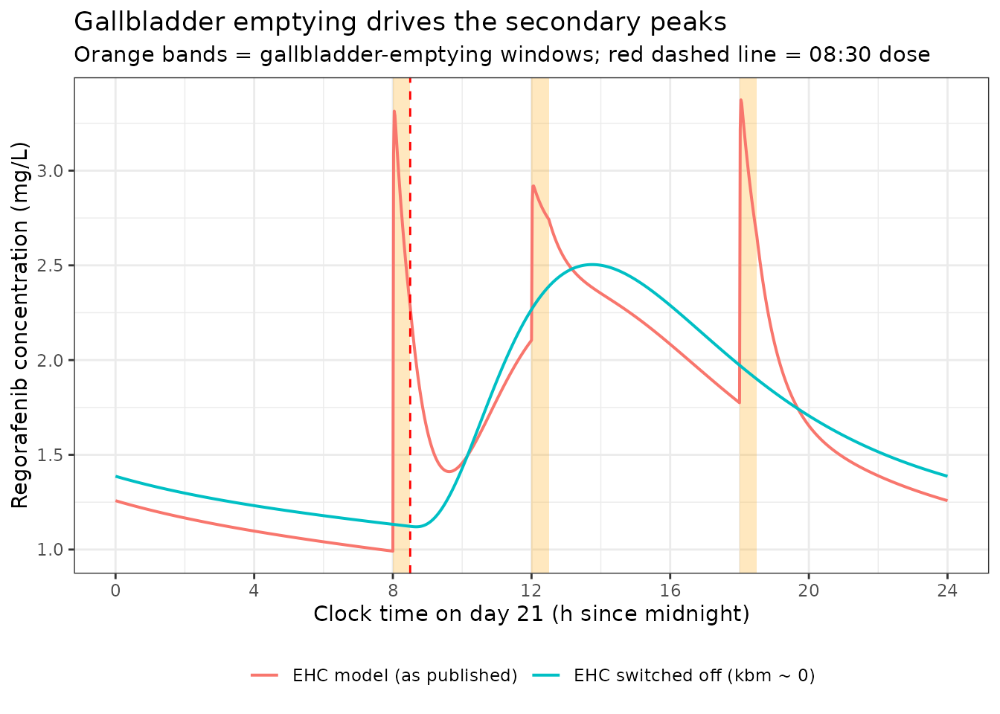
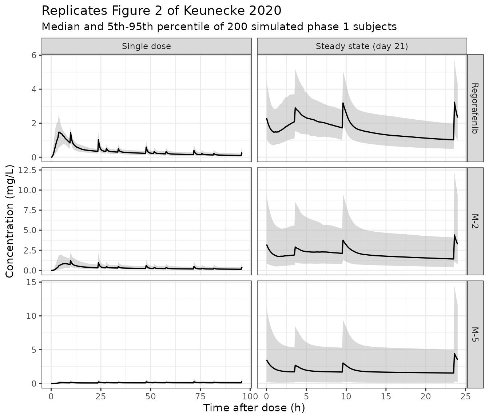

# Regorafenib with M-2 and M-5 metabolites and enterohepatic circulation (Keunecke 2020)

## Model and source

Keunecke 2020 developed the model in two stages, on two different
cohorts, and this paper therefore contributes **two** model files to
`nlmixr2lib`.

``` r

mod_p1 <- rxode2::rxode(readModelDb("Keunecke_2020_regorafenib_phase1"))
mod_p3 <- rxode2::rxode(readModelDb("Keunecke_2020_regorafenib_phase3"))
```

- Citation: Keunecke A, Hoefman S, Drenth H-J, Zisowsky J, Cleton A,
  Ploeger BA. Population pharmacokinetics of regorafenib in solid
  tumours: Exposure in clinical practice considering enterohepatic
  circulation and food intake. Br J Clin Pharmacol.
  2020;86(12):2362-2376. <doi:10.1111/bcp.14334>.
- Article: <https://doi.org/10.1111/bcp.14334>
- Supplement (Appendix Sections 1-3, Tables A1-A2, Figures A1-A2):
  <https://pmc.ncbi.nlm.nih.gov/articles/PMC7688542/>

| Model file | Fitted to | Source table |
|----|----|----|
| `Keunecke_2020_regorafenib_phase1` | 62 patients, densely sampled, 2 phase 1 studies | Table 2 |
| `Keunecke_2020_regorafenib_phase3` | 906 patients, sparsely sampled, 4 phase 3 studies; adds the retained covariates | Table 3 |

The phase 1 parent-only model (Table 1) is not shipped separately: it is
a development step whose parameters are carried into the phase 1
parent-metabolite model as fixed values, so Table 2 contains all of it.

Description of the final model:

> Final joint parent + metabolite population PK model for oral
> regorafenib and its two pharmacologically active metabolites M-2
> (N-oxide, BAY 75-7495) and M-5 (N-oxide N-desmethyl, BAY 81-8752),
> fitted to sparsely sampled data from four phase 3 studies in
> metastatic colorectal cancer, gastrointestinal stromal tumour and
> hepatocellular carcinoma (Keunecke 2020 Table 3). Structure is
> identical to the phase 1 model (Keunecke_2020_regorafenib_phase1):
> each analyte has a two-compartment disposition plus a gallbladder
> reservoir giving enterohepatic circulation, released during three
> 30-minute post-prandial windows per day; M-2 is formed
> pre-systemically through its own three-transit absorption chain and
> M-5 systemically from parent clearance. This version adds the retained
> covariate effects - sex and body mass index on parent clearance, and
> sex on both metabolite clearances - with women having lower clearance
> of all three analytes. Because the metabolite clearance random effects
> were almost perfectly correlated, the authors reduced the model to a
> single shared metabolite eta rescaled by a factor, so M-5 uses the M-2
> eta multiplied by sd_ratio_cl_m5. All volumes and clearances are
> apparent, relative to oral bioavailability and to the parent fraction
> (1 - fm_m2).

### Structure

Regorafenib is an oral multikinase inhibitor whose two major
metabolites, M-2 (N-oxide, BAY 75-7495) and M-5 (N-oxide N-desmethyl,
BAY 81-8752), are pharmacologically active and reach concentrations
close to the parent at steady state. All three analytes undergo
enterohepatic circulation (EHC) through the gallbladder, which the
authors identified as a significant disposition pathway.

Per Figure 1 of the paper:

- The dose leaves a depot at rate `ka` and **splits** there: a fraction
  `fm_m2` enters a **three**-transit chain that forms M-2
  pre-systemically, and `1 - fm_m2` enters a **two**-transit chain
  feeding the parent central compartment.
- Each analyte has a two-compartment disposition **plus a gallbladder
  reservoir**. Drug leaves the central compartment for the gallbladder
  at a constant first-order rate `kbm` (the paper’s `k_CG`), independent
  of food.
- Release back to the central compartment is **gated by food intake**:
  it happens only during the `dge` = 0.5 h window after each of three
  daily meals, and is then essentially instantaneous (`kehc` = 100 1/h).
  This is the “Not during meal” / “During meal” pair of ODE systems in
  the Figure 1 caption.
- M-5 is formed **systemically**, as the fraction `fm_m5` of parent
  clearance leaving the parent central compartment.

Because no intravenous or direct-metabolite data existed, the metabolite
volumes, inter-compartmental flow and gallbladder rate constants are
fixed to the parent values, and every volume and clearance is apparent.

## Population

The phase 1 model was fitted to 62 patients with advanced solid tumours
from two studies: 14814 (NCT01339104, USA, n = 44, 774 PK observations,
sampled at cycle 1 day 21 predose to 24 h post-dose) and 15823
(NCT02398513, Mainland China, n = 18, 566 observations, cycle 0 day 1
and cycle 1 day 21, predose to 96 h post-dose).

The phase 3 model was fitted to 906 patients from four pivotal
placebo-controlled studies (Appendix Table A1): CORRECT (n = 388,
metastatic colorectal carcinoma), GRID (n = 81, gastrointestinal stromal
tumour), CONCUR (n = 98, metastatic colorectal carcinoma, Asia) and
RESORCE (n = 339, hepatocellular carcinoma after sorafenib). Sampling
was sparse - a predose trough at cycle 1 day 15 and cycle 2 day 15 for
most patients, with 2-4 h and 5-10 h post-dose samples in subsets.
Combined, the full dataset is 968 patients and 10,019 observations, all
at a 160 mg once-daily starting dose on a 3-weeks-on / 1-week-off
schedule.

Baseline characteristics of the phase 3 cohort (Appendix Table A2, Total
column): median age 61 years (5th-95th percentile 40-78), median body
weight 70 kg (48-99), median BMI 24.5 kg/m^2 (18.5-32.4), 27.9% female,
54.4% Caucasian and 33.8% Asian, tumour type 54% CRC / 8.8% GIST / 37.2%
HCC, median eGFR 100 mL/min/1.73m^2 and median albumin 4.0 g/dL.

``` r

str(readModelDb("Keunecke_2020_regorafenib_phase3")()$population)
#> List of 16
#>  $ species         : chr "human"
#>  $ n_subjects      : int 906
#>  $ n_studies       : int 4
#>  $ age_range       : chr "40-78 years (5th-95th percentile)"
#>  $ age_median      : chr "61 years"
#>  $ weight_range    : chr "48-99 kg (5th-95th percentile)"
#>  $ weight_median   : chr "70 kg"
#>  $ bmi_range       : chr "18.5-32.4 kg/m^2 (5th-95th percentile)"
#>  $ bmi_median      : chr "24.5 kg/m^2"
#>  $ sex_female_pct  : num 27.9
#>  $ race_ethnicity  : Named num [1:6] 54.4 33.8 1.1 0.1 0.2 10.4
#>   ..- attr(*, "names")= chr [1:6] "Caucasian" "Asian" "Black" "AmericanIndian" ...
#>  $ disease_state   : chr "Adults with treatment-refractory metastatic colorectal carcinoma (54%), advanced gastrointestinal stromal tumou"| __truncated__
#>  $ dose_range      : chr "Regorafenib 160 mg once daily (4 x 40 mg tablets), 3 weeks on / 1 week off, versus matching placebo."
#>  $ regions         : chr "North America, Europe, Israel, Australia, South America and Asia."
#>  $ hepatic_function: chr "Category A (normal) 56.4%, B1 28.7%, B2 11.7%, C 3.2% (Appendix Table A2 footnote, defined on total bilirubin and AST/ALT)."
#>  $ notes           : chr "Keunecke 2020 Appendix Tables A1 and A2. The four phase 3 studies are CORRECT (14387, NCT01103323, n = 388, 405"| __truncated__
```

## Source trace

Every `ini()` entry in both model files carries an in-file comment
naming its source row. Collected here:

| Equation / parameter | Phase 1 value (Table 2) | Phase 3 value (Table 3) | Source location |
|----|----|----|----|
| `lka` | 0.482 1/h, Fixed | 0.482 1/h, Fixed | Table 2 / 3 row “k a, h-1”; section 2.3.1 |
| number of transit compartments | 2 (parent), 3 (M-2) | same | Figure 1 schematic; section 3.1 “required two transition compartments” |
| `logitfm_m2` | -0.355 (RSE 26.7%) | -0.355, Fixed | Table 2 / 3 row “FRM2”; footnote “corresponds with 41%” |
| `logitfm_m5` | -1.09 (RSE 19.4%) | -1.09, Fixed | Table 2 / 3 row “FRM5”; footnote “corresponds with 25%” |
| `lcl` | 4.02 L/h, Fixed | 3.05 L/h, Fixed | Table 2 / 3 row “CL P /(1-FRM2)”; section 3.3.1 |
| `lvc` | 10.7 L, Fixed | 10.7 L, Fixed | Table 2 / 3 row “VC P /(1-FRM2)” |
| `lq` | 11.0 L/h, Fixed | 11.0 L/h, Fixed | Table 2 / 3 row “Q P /(1-FRM2)” |
| `lvp` | 162 L, Fixed | 162 L, Fixed | Table 2 / 3 row “VP P /(1-FRM2)” |
| `lkbm` (paper `k_CG`) | 0.141 1/h, Fixed | 0.141 1/h, Fixed | Table 2 / 3 row “k CG, h-1” |
| `lkehc` (paper `k_GE`) | 100 1/h, Fixed | 100 1/h, Fixed | Table 2 / 3 row “k GE, h-1”; section 2.3.1 |
| `tmeal1` / `tmeal2` / `tmeal3` | 8 / 12 / 18 h, Fixed | same | Table 2 / 3 rows “Breakfast / Lunch / Dinner, h”; section 2.2 |
| `dge` | 0.5 h, Fixed | 0.5 h, Fixed | Table 2 / 3 row “DGE, h”; section 2.3.1 “approximately 30 min” |
| `lcl_m2` | 2.45 L/h (RSE 4.98%) | 1.99 L/h (RSE 0.255%) | Table 2 / 3 row “CL M-2” |
| `lcl_m5` | 0.746 L/h (RSE 28.8%) | 1.42 L/h (RSE 3.76%) | Table 2 / 3 row “CL M-5” |
| `e_sexf_cl` | n/a | 0.169, Fixed | Table 3 row “Sex on regorafenib clearance”; Appendix Section 3.1 |
| `e_bmi_cl` | n/a | -0.363, Fixed | Table 3 row “BMI on regorafenib clearance”; Appendix Section 3.1 |
| `e_sexf_cl_m2` | n/a | 0.380 (RSE 5.06%) | Table 3 row “Sex on M-2 clearance” |
| `e_sexf_cl_m5` | n/a | 0.761 (RSE 5.08%) | Table 3 row “Sex on M-5 clearance” |
| `sd_ratio_cl_m5` | n/a | 2.21 (RSE 3.41%) | Table 3 row “Factor IIV CL M-5”; Appendix Section 3.3 |
| `etalka` | 0.127, Fixed | 0.127, Fixed | Table 2 / 3 row “omega^2 k a” |
| `etalcl` | 0.117 | 0.189 | Table 2 / 3 row “omega^2 CL P” |
| `etalcl_m2` | 0.267 | 0.385 | Table 2 / 3 row “omega^2 CL M-2” |
| `etalcl_m5` | 1.95 | derived as `sd_ratio_cl_m5 * etalcl_m2` | Table 2 row “omega^2 CL M-5”; Appendix Section 3.3 |
| eta covariances | 0.122 / 0.157 / 0.656 | 0.206 | Table 2 rows “omega CL P,CL M-2” etc.; Table 3 row “omega CL P, CL M-2/M-5” |
| `etalogitfm_m2` | 0.156 | 0.156, Fixed | Table 2 / 3 row “omega^2 FRM2” |
| `etalogitfm_m5` | 0.841 | 0.841, Fixed | Table 2 / 3 row “omega^2 FRM5” |
| `propSd` | 0.406 | 0.543 | Table 2 / 3 row “Parent Prop. error, SD” |
| `addSd_m2` / `propSd_m2` | 0.001 Fixed / 0.380 | 0.001 Fixed / 0.485 | Table 2 / 3 rows “M-2 Add./Prop. error, SD” |
| `addSd_m5` / `propSd_m5` | 0.001 Fixed / 0.455 | 0.001 Fixed / 1.14 | Table 2 / 3 rows “M-5 Add./Prop. error, SD” |
| parent central / gallbladder / peripheral ODEs | n/a | n/a | Figure 1 caption, “Not during meal” and “During meal” equation pairs |
| dose split `ka * FRM2` vs `ka * (1-FRM2)` | n/a | n/a | Figure 1 schematic |
| M-5 formation `CL_Parent * FRM5` | n/a | n/a | Figure 1 schematic |
| unbound fractions 0.5% / 0.2% / 0.05% | n/a | n/a | Introduction, paragraph 3 (used only for the Figure 4B reconstruction below) |

## Event tables

`t` in the model is absolute time and the meal switch reads a time of
day, so **the event table origin must be midnight**. Two consequences
drive the helper below.

1.  Doses go in at the protocol clock time: 08:30 for phase 1 (breakfast
    08:00 plus the protocol’s 0.5 h) and 09:00 for phase 3 (breakfast 1
    h before the dose, the interval that minimised the objective
    function in section 3.3.1).
2.  The gallbladder empties over a 0.5 h window with a rate constant of
    100 1/h. That is a stiff, short-lived discontinuity, and a solver
    left to choose its own steps over a multi-week run-in will step
    straight over it and fail with “could not solve the system”. Every
    meal-window edge therefore gets an explicit record so the solver is
    forced to stop there.

``` r

MEAL_EDGES <- c(8, 8.5, 12, 12.5, 18, 18.5)  # tmeal* and tmeal* + dge

# Build an event table for one subject: `ndays` once-daily 160 mg doses at
# clock time `dose_t`, meal-edge stops throughout, and observations on the
# ODE state `central` over `obs_times` (absolute hours from midnight, day 1).
make_subject <- function(id, dose_t, ndays, obs_times, dose_mg = 160, ...) {
  day <- 24 * (0:(ndays - 1))
  doses <- data.frame(time = dose_t + day, amt = dose_mg, evid = 1L,
                      cmt = "depot", dvid = NA_integer_)
  stops <- sort(unique(c(outer(day, MEAL_EDGES, "+"))))
  obs <- data.frame(time = sort(unique(c(stops, obs_times))), amt = NA_real_,
                    evid = 0L, cmt = "central", dvid = 1L)
  out <- rbind(doses, obs)
  out$id <- id
  extra <- list(...)
  for (nm in names(extra)) out[[nm]] <- extra[[nm]]
  out[order(out$time, -out$evid), ]
}
```

Observation rows use `cmt = "central"` (an actual ODE state) and
`dvid = 1L`. The model has three endpoints whose observables read from
three different ODE states; `rxSolve` still returns `Cc`, `Cc_m2` and
`Cc_m5` as columns on every observation row, and solving
`$simulationModel` rather than the `rxUi` object keeps the endpoint
states from being misclassified as input parameters.

## Enterohepatic circulation is what shapes the profile

Section 3.1 attributes to EHC “the observed higher steady state
concentration caused by gallbladder emptying and rapid reabsorption,
followed by a rapid decrease after dosing through distribution and
elimination, and subsequent slow absorption step 3-4 h later”. Appendix
Figure A1 shows the same thing per patient, with the
gallbladder-emptying windows shaded.

Below, the same typical phase 1 patient is simulated with EHC as
published and with the central-to-gallbladder transfer switched off
(`kbm` set to effectively zero), over day 21 of once-daily dosing.

``` r

obs_day21 <- seq(20 * 24, 21 * 24, by = 0.02)
ev_typ_p1 <- make_subject(1L, dose_t = 8.5, ndays = 21, obs_times = obs_day21)

solve_typ <- function(mod, ev, ...) {
  rxode2::rxSolve(rxode2::zeroRe(mod)$simulationModel, ev,
                  returnType = "data.frame", atol = 1e-10, rtol = 1e-8, ...)
}

sim_ehc  <- solve_typ(mod_p1, ev_typ_p1)
#> ℹ omega/sigma items treated as zero: 'etalka', 'etalcl', 'etalcl_m2', 'etalcl_m5', 'etalogitfm_m2', 'etalogitfm_m5'
sim_noehc <- solve_typ(mod_p1, ev_typ_p1, params = c(lkbm = log(1e-8)))
#> ℹ omega/sigma items treated as zero: 'etalka', 'etalcl', 'etalcl_m2', 'etalcl_m5', 'etalogitfm_m2', 'etalogitfm_m5'

ehc_cmp <- bind_rows(
  sim_ehc  |> mutate(model = "EHC model (as published)"),
  sim_noehc |> mutate(model = "EHC switched off (kbm ~ 0)")
) |>
  filter(time >= 20 * 24) |>
  mutate(clock = time - 20 * 24)

meal_bands <- data.frame(xmin = c(8, 12, 18), xmax = c(8.5, 12.5, 18.5))

ggplot(ehc_cmp, aes(clock, Cc, colour = model)) +
  geom_rect(data = meal_bands, inherit.aes = FALSE,
            aes(xmin = xmin, xmax = xmax, ymin = -Inf, ymax = Inf),
            fill = "orange", alpha = 0.25) +
  geom_line(linewidth = 0.7) +
  geom_vline(xintercept = 8.5, linetype = "dashed", colour = "red") +
  scale_x_continuous(breaks = seq(0, 24, 4)) +
  labs(x = "Clock time on day 21 (h since midnight)",
       y = "Regorafenib concentration (mg/L)", colour = NULL,
       title = "Gallbladder emptying drives the secondary peaks",
       subtitle = "Orange bands = gallbladder-emptying windows; red dashed line = 08:30 dose") +
  theme_bw() + theme(legend.position = "bottom")
```



Each meal produces a sharp reabsorption peak, and the pre-dose trough is
substantially higher with EHC than without it - which is exactly why the
paper argues that phase 3 trough samples, “usually taken directly before
dosage (i.e. after a meal)”, require the EHC model.

Total exposure, by contrast, must be unchanged: the gallbladder cycle
moves drug around but eliminates none of it.

``` r

trap <- function(x, y) sum(diff(x) * (head(y, -1) + tail(y, -1)) / 2)
auc_win <- function(d) {
  d <- d[d$time >= 20 * 24 & d$time <= 21 * 24, ]
  d <- d[!duplicated(d$time), ]
  trap(d$time, d$Cc)
}
auc_ehc   <- auc_win(sim_ehc)
auc_noehc <- auc_win(sim_noehc)
c(EHC = auc_ehc, no_EHC = auc_noehc, ratio = auc_ehc / auc_noehc)
#>        EHC     no_EHC      ratio 
#> 39.7783920 39.7953933  0.9995728

# Deterministic (typical-value) quantities: both sides use the same parameters,
# so the only error is trapezoidal. A tight bound is correct here.
stopifnot(abs(auc_ehc / auc_noehc - 1) < 0.01)

# The pre-dose trough is the quantity EHC actually changes.
trough <- function(d) d$Cc[which.min(abs(d$time - (20 * 24 + 8.5)))]
trough_ratio <- trough(sim_ehc) / trough(sim_noehc)
trough_ratio
#> [1] 2.034042
stopifnot(trough_ratio > 1.5)
```

## Steady-state mass balance

At steady state the model implies three closed-form identities, each of
which tests a different part of the transcription. They follow from the
fact that, over one dosing interval at steady state, every analyte’s
elimination equals its formation:

- parent: `AUC = Dose / CL_P` - tests the dose split, the
  apparent-parameter convention and `CL_P`;
- M-2: `AUC = Dose * fm_m2 / (1 - fm_m2) / CL_M-2` - tests the
  pre-systemic branch and the `f(depot) = 1 / (1 - fm_m2)` scaling;
- M-5: `AUC = Dose * fm_m5 / CL_M-5` - tests the systemic formation
  term.

These compare a numerical solve against its own closed form using the
*same* parameters, so the discrepancy is pure trapezoidal error and a
tight bound is the right assertion (this is not a cohort-derived
quantity).

M-5 has a long terminal half-life (apparent Vss ~173 L over `CL_M-5` =
0.746 L/h in the phase 1 model, i.e. roughly 160 h), so the run-in must
be long: at day 21 M-5 is still 16% below steady state. 120 daily doses
is used below.

``` r

NDAYS_SS <- 120L
ss_window <- function(ndays, dose_t, by = 0.02) {
  t0 <- dose_t + 24 * (ndays - 1)
  seq(t0, t0 + 24, by = by)
}

ss_auc <- function(mod, dose_t, ndays = NDAYS_SS, ...) {
  ev <- make_subject(1L, dose_t, ndays, ss_window(ndays, dose_t), ...)
  s <- solve_typ(mod, ev)
  t0 <- dose_t + 24 * (ndays - 1)
  s <- s[s$time >= t0 & s$time <= t0 + 24, ]
  s <- s[!duplicated(s$time), ]
  c(parent = trap(s$time, s$Cc),
    m2 = trap(s$time, s$Cc_m2),
    m5 = trap(s$time, s$Cc_m5),
    fm_m2 = s$fm_m2[1], fm_m5 = s$fm_m5[1])
}

ss_p1 <- ss_auc(mod_p1, dose_t = 8.5)
#> ℹ omega/sigma items treated as zero: 'etalka', 'etalcl', 'etalcl_m2', 'etalcl_m5', 'etalogitfm_m2', 'etalogitfm_m5'
ss_p3 <- ss_auc(mod_p3, dose_t = 9,  SEXF = 0, BMI = 24.5)
#> ℹ omega/sigma items treated as zero: 'etalka', 'etalcl', 'etalcl_m2', 'etalogitfm_m2', 'etalogitfm_m5'

closed_form <- function(dose, fm2, fm5, cl, cl_m2, cl_m5) {
  c(parent = dose / cl,
    m2 = dose * fm2 / (1 - fm2) / cl_m2,
    m5 = dose * fm5 / cl_m5)
}
cf_p1 <- closed_form(160, ss_p1[["fm_m2"]], ss_p1[["fm_m5"]], 4.02, 2.45, 0.746)
cf_p3 <- closed_form(160, ss_p3[["fm_m2"]], ss_p3[["fm_m5"]], 3.05, 1.99, 1.42)

mb <- tibble::tibble(
  Model   = rep(c("Phase 1 (Table 2)", "Phase 3 (Table 3), male, BMI 24.5"), each = 3),
  Analyte = rep(c("Regorafenib", "M-2", "M-5"), 2),
  Simulated = c(ss_p1[1:3], ss_p3[1:3]),
  `Closed form` = c(cf_p1, cf_p3)
) |>
  mutate(`% diff` = 100 * (Simulated / `Closed form` - 1))

knitr::kable(mb, digits = 3,
             caption = "Steady-state AUC(0-24) in mg*h/L against the model's own closed form.")
```

| Model                             | Analyte     | Simulated | Closed form | % diff |
|:----------------------------------|:------------|----------:|------------:|-------:|
| Phase 1 (Table 2)                 | Regorafenib |    39.785 |      39.801 | -0.039 |
| Phase 1 (Table 2)                 | M-2         |    45.773 |      45.791 | -0.039 |
| Phase 1 (Table 2)                 | M-5         |    53.944 |      53.966 | -0.041 |
| Phase 3 (Table 3), male, BMI 24.5 | Regorafenib |    52.438 |      52.459 | -0.039 |
| Phase 3 (Table 3), male, BMI 24.5 | M-2         |    56.353 |      56.376 | -0.040 |
| Phase 3 (Table 3), male, BMI 24.5 | M-5         |    28.340 |      28.351 | -0.039 |

Steady-state AUC(0-24) in mg\*h/L against the model’s own closed form.
{.table}

``` r


stopifnot(max(abs(mb$`% diff`)) < 0.5)
```

The inverse-logit of the two formation parameters must reproduce the
footnote to Tables 2 and 3, “FRM2 and FRM5 on logit scale corresponds
with 41% and 25%”:

``` r

c(fm_m2 = ss_p1[["fm_m2"]], fm_m5 = ss_p1[["fm_m5"]])
#>     fm_m2     fm_m5 
#> 0.4121705 0.2516183
stopifnot(abs(ss_p1[["fm_m2"]] - 0.41) < 0.005,
          abs(ss_p1[["fm_m5"]] - 0.25) < 0.005)
```

The Introduction states that M-2 and M-5 “reach nearly similar
concentrations to regorafenib at steady state”. Converting to molar
units (regorafenib 482.8, M-2 498.8, M-5 484.8 g/mol) the phase 1 model
gives:

``` r

mw <- c(parent = 482.8, m2 = 498.8, m5 = 484.8)
auc_um <- ss_p1[1:3] / mw * 1000
round(auc_um, 1)
#> parent     m2     m5 
#>   82.4   91.8  111.3
# All three within a factor of two of each other -- "nearly similar".
stopifnot(max(auc_um) / min(auc_um) < 2)
```

Figure 3B reads a median AUC(0-24h,ss) of roughly 80 uM\*h for the phase
1 EHC model. The parent value above is the same quantity.

``` r

auc_um[["parent"]]
#> [1] 82.40542
# Envelope check against a value read off the Figure 3B boxplot (digitised,
# so a generous band); a mis-transcribed CL or dose moves this by tens of %.
stopifnot(auc_um[["parent"]] > 60, auc_um[["parent"]] < 105)
```

## Covariate effects (Figure 4)

Figure 4 reports, from post-hoc estimates, the ratio of median
AUC(0-24h,ss) geometric means between dichotomised covariate groups,
against bioequivalence boundaries of 0.8-1.25. Panel A is parent
regorafenib; panel B is the protein-binding-corrected total of parent,
M-2 and M-5, using the unbound fractions of 0.5%, 0.2% and 0.05% given
in the Introduction.

The typical-value reconstruction below is not a post-hoc replication
(the individual estimates are not public), but it must reproduce the
direction and approximate magnitude of each bar.

``` r

FU <- c(parent = 0.005, m2 = 0.002, m5 = 0.0005)

scenario_auc <- function(sexf, bmi) ss_auc(mod_p3, dose_t = 9, SEXF = sexf, BMI = bmi)[1:3]

male_ref   <- scenario_auc(0, 24.5)
#> ℹ omega/sigma items treated as zero: 'etalka', 'etalcl', 'etalcl_m2', 'etalogitfm_m2', 'etalogitfm_m5'
female_ref <- scenario_auc(1, 24.5)
#> ℹ omega/sigma items treated as zero: 'etalka', 'etalcl', 'etalcl_m2', 'etalogitfm_m2', 'etalogitfm_m5'
bmi_lo20   <- scenario_auc(0, 19.0)   # representative BMI < 20
#> ℹ omega/sigma items treated as zero: 'etalka', 'etalcl', 'etalcl_m2', 'etalogitfm_m2', 'etalogitfm_m5'
bmi_ge20   <- scenario_auc(0, 25.0)   # representative BMI >= 20
#> ℹ omega/sigma items treated as zero: 'etalka', 'etalcl', 'etalcl_m2', 'etalogitfm_m2', 'etalogitfm_m5'
bmi_lo25   <- scenario_auc(0, 22.0)
#> ℹ omega/sigma items treated as zero: 'etalka', 'etalcl', 'etalcl_m2', 'etalogitfm_m2', 'etalogitfm_m5'
bmi_ge25   <- scenario_auc(0, 28.0)
#> ℹ omega/sigma items treated as zero: 'etalka', 'etalcl', 'etalcl_m2', 'etalogitfm_m2', 'etalogitfm_m5'
bmi_ge30   <- scenario_auc(0, 32.0)
#> ℹ omega/sigma items treated as zero: 'etalka', 'etalcl', 'etalcl_m2', 'etalogitfm_m2', 'etalogitfm_m5'
bmi_lt30   <- scenario_auc(0, 24.0)
#> ℹ omega/sigma items treated as zero: 'etalka', 'etalcl', 'etalcl_m2', 'etalogitfm_m2', 'etalogitfm_m5'

ratio_tot <- function(a, b) sum(FU * a) / sum(FU * b)

fig4 <- tibble::tibble(
  Comparison = c("Male : Female", "BMI < 20 : BMI >= 20",
                 "BMI < 25 : BMI >= 25", "BMI >= 30 : BMI < 30"),
  `A: parent AUC` = c(male_ref[["parent"]] / female_ref[["parent"]],
                      bmi_lo20[["parent"]] / bmi_ge20[["parent"]],
                      bmi_lo25[["parent"]] / bmi_ge25[["parent"]],
                      bmi_ge30[["parent"]] / bmi_lt30[["parent"]]),
  `B: unbound total AUC` = c(ratio_tot(male_ref, female_ref),
                             ratio_tot(bmi_lo20, bmi_ge20),
                             ratio_tot(bmi_lo25, bmi_ge25),
                             ratio_tot(bmi_ge30, bmi_lt30)),
  `Figure 4A (read)` = c(0.86, 0.91, 0.90, 1.10),
  `Figure 4B (read)` = c(0.71, 1.00, 0.96, 1.05)
)

knitr::kable(fig4, digits = 3,
             caption = "Reconstruction of the Figure 4 forest plots. Published values are read off the figure.")
```

| Comparison | A: parent AUC | B: unbound total AUC | Figure 4A (read) | Figure 4B (read) |
|:---|---:|---:|---:|---:|
| Male : Female | 0.831 | 0.699 | 0.86 | 0.71 |
| BMI \< 20 : BMI \>= 20 | 0.915 | 0.943 | 0.91 | 1.00 |
| BMI \< 25 : BMI \>= 25 | 0.915 | 0.942 | 0.90 | 0.96 |
| BMI \>= 30 : BMI \< 30 | 1.126 | 1.085 | 1.10 | 1.05 |

Reconstruction of the Figure 4 forest plots. Published values are read
off the figure. {.table}

Two claims in the paper’s own words are worth checking exactly, because
they are printed as numbers rather than drawn.

``` r

# Appendix Section 3.1: "women had on average a 17% lower CLP than men
# (2.53 L h-1 and 3.05 L h-1, respectively)".
cl_male   <- 3.05
cl_female <- 3.05 * (1 - 0.169)
c(male = cl_male, female = cl_female, pct_lower = 100 * (1 - cl_female / cl_male))
#>      male    female pct_lower 
#>   3.05000   2.53455  16.90000
stopifnot(abs(cl_female - 2.53) < 0.01)

# Appendix Section 3.1: the BMI coefficient "implicates an expected 0.15%
# higher CLP for a patient with a 0.1 kg m-2 reduced BMI". This is the check
# that fixes the parameterisation as exp(theta * (BMI - BMIref) / BMIref).
bmi_ref <- 24.5
pct_per_0.1 <- 100 * (exp(-0.363 * (bmi_ref - 0.1 - bmi_ref) / bmi_ref) - 1)
pct_per_0.1
#> [1] 0.1482731
stopifnot(abs(pct_per_0.1 - 0.15) < 0.01)

# The same coefficient WITHOUT the median normalisation would give:
100 * (exp(-0.363 * (-0.1)) - 1)
#> [1] 3.696689

# Table 3 footnote: "The estimated factor for IIV on CLM-5 corresponds with a
# variance of 0.385. (2.21^2) = 1.88".
0.385 * 2.21^2
#> [1] 1.880379
stopifnot(abs(0.385 * 2.21^2 - 1.88) < 0.01)
```

The parent ratio sits just inside the 0.8-1.25 bioequivalence window and
the unbound-total ratio sits below it, reproducing the paper’s two
conclusions in section 3.3.5. Both indicate **higher** exposure in
women, because women have lower clearance of all three analytes.

## Virtual cohorts and simulated profiles

Original observed data are not public. The cohorts below approximate the
published demographics: 200 subjects per arm, the cap for a validation
vignette.

``` r

# set.seed() seeds R's RNG (used for the covariate draws below). It does NOT
# seed rxode2's simulation RNG, whose streams are partitioned per solver
# thread -- so the sampled etas differ between a 2-core CI runner and a
# 16-thread workstation. Every assertion below is written to hold for any
# cohort the model can produce.
set.seed(20200501)
N_ARM <- 200L

# Phase 3 covariates from Appendix Table A2 (Total column): 27.9% female,
# BMI median 24.5 with 5th-95th percentile 18.5-32.4 kg/m^2. A log-normal
# with sd = log(32.4 / 18.5) / (2 * qnorm(0.95)) matches that spread.
bmi_sd <- log(32.4 / 18.5) / (2 * stats::qnorm(0.95))
cohort_p3 <- tibble::tibble(
  id   = seq_len(N_ARM),
  SEXF = stats::rbinom(N_ARM, 1, 0.279),
  BMI  = pmin(pmax(stats::rlnorm(N_ARM, log(24.5), bmi_sd), 15), 45)
)
summary(cohort_p3$BMI)
#>    Min. 1st Qu.  Median    Mean 3rd Qu.    Max. 
#>   15.00   22.01   24.59   24.88   27.69   40.33
mean(cohort_p3$SEXF)
#> [1] 0.275
```

### Phase 1: single dose and steady state (Figure 2)

Figure 2 shows visual predictive checks for regorafenib, M-2 and M-5
after a single dose (panels A and B) and at steady state (panels C and
D) in the two phase 1 studies. Study 15823 sampled to 96 h after the
single dose.

``` r

obs_sd <- seq(8.5, 8.5 + 96, by = 0.25)
ev_sd <- bind_rows(lapply(seq_len(N_ARM), function(i)
  make_subject(i, dose_t = 8.5, ndays = 1L, obs_times = obs_sd)))
stopifnot(!anyDuplicated(unique(ev_sd[, c("id", "time", "evid")])))

obs_md <- seq(20 * 24 + 8.5, 20 * 24 + 8.5 + 24, by = 0.1)
ev_md <- bind_rows(lapply(seq_len(N_ARM), function(i)
  make_subject(i, dose_t = 8.5, ndays = 21L, obs_times = obs_md)))
stopifnot(!anyDuplicated(unique(ev_md[, c("id", "time", "evid")])))

rxode2::rxSetSeed(1234)
sim_sd <- rxode2::rxSolve(mod_p1$simulationModel, ev_sd,
                          returnType = "data.frame") |>
  filter(time %in% obs_sd) |> mutate(tad = time - 8.5, phase = "Single dose")
sim_md <- rxode2::rxSolve(mod_p1$simulationModel, ev_md,
                          returnType = "data.frame") |>
  filter(time %in% obs_md) |> mutate(tad = time - (20 * 24 + 8.5),
                                     phase = "Steady state (day 21)")
```

``` r

vpc_long <- bind_rows(sim_sd, sim_md) |>
  select(id, tad, phase, Cc, Cc_m2, Cc_m5) |>
  pivot_longer(c(Cc, Cc_m2, Cc_m5), names_to = "analyte", values_to = "conc") |>
  mutate(analyte = recode(analyte, Cc = "Regorafenib",
                          Cc_m2 = "M-2", Cc_m5 = "M-5"),
         analyte = factor(analyte, c("Regorafenib", "M-2", "M-5")))

vpc_bands <- vpc_long |>
  group_by(phase, analyte, tad) |>
  summarise(lo = quantile(conc, 0.05), med = median(conc),
            hi = quantile(conc, 0.95), .groups = "drop")

ggplot(vpc_bands, aes(tad, med)) +
  geom_ribbon(aes(ymin = lo, ymax = hi), fill = "grey70", alpha = 0.5) +
  geom_line(linewidth = 0.6) +
  facet_grid(analyte ~ phase, scales = "free") +
  labs(x = "Time after dose (h)", y = "Concentration (mg/L)",
       title = "Replicates Figure 2 of Keunecke 2020",
       subtitle = "Median and 5th-95th percentile of 200 simulated phase 1 subjects") +
  theme_bw()
```



The steady-state panels show the pre-dose concentrations and the
post-prandial reabsorption peaks that the single-dose panels lack, which
is the qualitative feature Figure 2 is used to demonstrate.

## NCA validation (PKNCA)

NCA is run on a phase 3 cohort over the final 24 h of a 60-day
once-daily run-in, for all three analytes.

Sixty daily doses put the *typical-value* profile of all three analytes
at steady state to within rounding: the typical M-5 AUC(0-24) is 28.340
mg*h/L at 60 days and 28.340 at 240 days. That is **not** true of every
individual in the cohort. M-5’s random effect is
`sd_ratio_cl_m5 * etalcl_m2`, i.e. an SD of `2.21 * sqrt(0.385)` = 1.37
on the log scale, and female sex cuts `CL_M-5` by a further 76%; the
slowest subjects therefore have an M-5 apparent half-life of several
months and are still filling up at day 60. The assertions below are
written to be robust to that - they compare each subject against* its
own\* closed form and gate on the centre of the distribution, not the
tail.

``` r

NDAYS_NCA <- 60L
t0_nca <- 9 + 24 * (NDAYS_NCA - 1)
obs_nca <- seq(t0_nca, t0_nca + 24, by = 0.05)

ev_nca <- bind_rows(lapply(seq_len(N_ARM), function(i)
  make_subject(cohort_p3$id[i], dose_t = 9, ndays = NDAYS_NCA,
               obs_times = obs_nca,
               SEXF = cohort_p3$SEXF[i], BMI = cohort_p3$BMI[i])))
stopifnot(!anyDuplicated(unique(ev_nca[, c("id", "time", "evid")])))

rxode2::rxSetSeed(5678)
sim_nca_raw <- rxode2::rxSolve(mod_p3$simulationModel, ev_nca,
                               keep = c("SEXF", "BMI"),
                               returnType = "data.frame") |>
  filter(time %in% obs_nca)
```

PKNCA needs the interval to start at the observation origin, so time is
re-based to time-after-dose and the three analytes are stacked with
`analyte` as the grouping variable (it plays the role of “treatment”
here - it is the stratification the paper reports results by).

``` r

nca_conc <- sim_nca_raw |>
  mutate(time = time - t0_nca) |>
  select(id, time, SEXF, Cc, Cc_m2, Cc_m5) |>
  pivot_longer(c(Cc, Cc_m2, Cc_m5), names_to = "analyte", values_to = "Cc") |>
  mutate(analyte = recode(analyte, Cc = "Regorafenib",
                          Cc_m2 = "M-2", Cc_m5 = "M-5")) |>
  filter(!is.na(Cc))

# Guarantee a time = 0 row per subject x analyte so PKNCA never emits
# "Requesting an AUC range starting (0) before the first measurement".
nca_conc <- bind_rows(
  nca_conc,
  nca_conc |> distinct(id, analyte, SEXF) |> mutate(time = 0, Cc = 0)
) |>
  distinct(id, analyte, time, .keep_all = TRUE) |>
  arrange(id, analyte, time)

nca_dose <- nca_conc |>
  distinct(id, analyte) |>
  mutate(time = 0, amt = 160)

conc_obj <- PKNCA::PKNCAconc(as.data.frame(nca_conc), Cc ~ time | analyte + id,
                             concu = "mg/L", timeu = "h")
dose_obj <- PKNCA::PKNCAdose(as.data.frame(nca_dose), amt ~ time | analyte + id,
                             doseu = "mg")

intervals <- data.frame(start = 0, end = 24,
                        cmax = TRUE, tmax = TRUE, cmin = TRUE,
                        auclast = TRUE, cav = TRUE, ctrough = TRUE)

nca_res <- PKNCA::pk.nca(PKNCA::PKNCAdata(conc_obj, dose_obj, intervals = intervals))
```

``` r

nca_tbl <- as.data.frame(nca_res$result) |>
  filter(PPTESTCD %in% c("cmax", "tmax", "cmin", "auclast", "cav", "ctrough")) |>
  group_by(analyte, PPTESTCD) |>
  summarise(median = median(PPORRES),
            p05 = quantile(PPORRES, 0.05),
            p95 = quantile(PPORRES, 0.95), .groups = "drop") |>
  mutate(Parameter = nlmixr2lib::ncaParamLabel(PPTESTCD)) |>
  select(analyte, Parameter, median, p05, p95) |>
  arrange(factor(analyte, c("Regorafenib", "M-2", "M-5")), Parameter)

nca_tbl |>
  dplyr::rename("Analyte" = analyte, "Median" = median,
                "5th pct" = p05, "95th pct" = p95) |>
  knitr::kable(digits = 3,
               caption = "Steady-state NCA over the 24 h dosing interval, 200 simulated phase 3 subjects.")
```

| Analyte     | Parameter | Median | 5th pct | 95th pct |
|:------------|:----------|-------:|--------:|---------:|
| Regorafenib | AUClast   | 58.797 |  27.408 |  117.786 |
| Regorafenib | Cavg      |  2.450 |   1.142 |    4.908 |
| Regorafenib | Cmax      |  5.414 |   2.644 |   11.009 |
| Regorafenib | Cmin      |  1.674 |   0.656 |    3.737 |
| Regorafenib | Ctrough   |  2.729 |   0.949 |    6.081 |
| Regorafenib | Tmax      | 23.050 |   3.050 |   23.050 |
| M-2         | AUClast   | 67.150 |  22.432 |  225.735 |
| M-2         | Cavg      |  2.798 |   0.935 |    9.406 |
| M-2         | Cmax      |  6.332 |   2.037 |   23.043 |
| M-2         | Cmin      |  2.107 |   0.617 |    7.709 |
| M-2         | Ctrough   |  3.432 |   0.946 |   13.050 |
| M-2         | Tmax      | 23.050 |   9.050 |   23.050 |
| M-5         | AUClast   | 43.590 |   3.233 |  280.622 |
| M-5         | Cavg      |  1.816 |   0.135 |   11.693 |
| M-5         | Cmax      |  4.366 |   0.280 |   29.060 |
| M-5         | Cmin      |  1.508 |   0.089 |    9.758 |
| M-5         | Ctrough   |  2.516 |   0.155 |   17.160 |
| M-5         | Tmax      | 23.050 |  23.050 |   23.050 |

Steady-state NCA over the 24 h dosing interval, 200 simulated phase 3
subjects. {.table}

### Comparison against published exposure

The paper reports no observed NCA table for the phase 3 cohort, so the
comparison uses the two exposure quantities it does report numerically:
the typical steady-state AUC implied by the tabulated clearances, and
the Figure 3B median for the phase 1 model.

``` r

med_auc <- nca_tbl |> filter(Parameter == nlmixr2lib::ncaParamLabel("auclast"))

published <- tibble::tibble(
  analyte = c("Regorafenib", "M-2", "M-5"),
  reference = c(160 / 3.05,
                160 * ss_p3[["fm_m2"]] / (1 - ss_p3[["fm_m2"]]) / 1.99,
                160 * ss_p3[["fm_m5"]] / 1.42)
)

cmp <- med_auc |>
  select(analyte, simulated = median) |>
  left_join(published, by = "analyte") |>
  mutate(`% diff` = 100 * (simulated / reference - 1)) |>
  dplyr::rename("Analyte" = analyte,
                "Typical-value AUC0-24,ss (mg*h/L)" = reference,
                "Simulated cohort median (mg*h/L)" = simulated)

knitr::kable(cmp, digits = 2,
             caption = "Cohort median steady-state AUC against the typical-value (male, reference BMI) prediction.")
```

| Analyte | Simulated cohort median (mg\*h/L) | Typical-value AUC0-24,ss (mg\*h/L) | % diff |
|:---|---:|---:|---:|
| Regorafenib | 58.80 | 52.46 | 12.08 |
| M-2 | 67.15 | 56.38 | 19.11 |
| M-5 | 43.59 | 28.35 | 53.75 |

Cohort median steady-state AUC against the typical-value (male,
reference BMI) prediction. {.table}

The cohort medians sit **above** the male reference values, and for M-5
by a large margin. That is a property of the covariate model, not a
discrepancy: a cohort median is a quantile of a *mixture*, so a
covariate effect that shifts one subgroup wholesale moves the mixture’s
median into the other subgroup’s upper tail. With 27.9% female and
`1 - 0.761 = 0.239`, female `CL_M-5` is 76% lower, so female M-5
exposure is about 4.2-fold higher and the whole female subgroup sits
above the male one. The mixture’s 50th percentile is therefore the male
distribution’s `0.5 / 0.725` = 69th percentile, which at a log-scale SD
of 1.37 is `exp(1.37 * qnorm(0.69))` = 1.97-fold above the male typical
value - essentially all of the observed M-5 gap.

That makes the typical-value column above a *descriptive* reference, not
a gate: its offset depends on which subjects were drawn. The gate below
instead compares every subject against **its own** closed form, computed
from the same drawn `cl`, `cl_m2`, `cl_m5`, `fm_m2` and `fm_m5` that the
solve used. Both sides then share the same parameters, so the only
differences are trapezoidal error and any residual distance from steady
state - and a tight bound is the correct assertion.

``` r

# One row per subject: the individual parameters rxode2 actually drew.
pars_ps <- sim_nca_raw |>
  distinct(id, .keep_all = TRUE) |>
  select(id, cl, cl_m2, cl_m5, fm_m2, fm_m5)

cf_ps <- pars_ps |>
  transmute(id,
            Regorafenib = 160 / cl,
            `M-2`       = 160 * fm_m2 / (1 - fm_m2) / cl_m2,
            `M-5`       = 160 * fm_m5 / cl_m5) |>
  pivot_longer(-id, names_to = "analyte", values_to = "closed_form")

ps <- as.data.frame(nca_res$result) |>
  filter(PPTESTCD == "auclast") |>
  select(id, analyte, simulated = PPORRES) |>
  inner_join(cf_ps, by = c("id", "analyte")) |>
  mutate(pct = 100 * (simulated / closed_form - 1))

ps_summary <- ps |>
  group_by(analyte) |>
  summarise(`median % diff`    = median(pct),
            `median |% diff|`  = median(abs(pct)),
            `90th pct |% diff|` = quantile(abs(pct), 0.9),
            `worst |% diff|`   = max(abs(pct)), .groups = "drop") |>
  arrange(factor(analyte, c("Regorafenib", "M-2", "M-5")))

knitr::kable(ps_summary, digits = 2,
             caption = "Per-subject steady-state AUC(0-24) against each subject's own closed form.")
```

| analyte | median % diff | median \|% diff\| | 90th pct \|% diff\| | worst \|% diff\| |
|:---|---:|---:|---:|---:|
| Regorafenib | -0.19 | 0.19 | 0.20 | 4.45 |
| M-2 | -0.19 | 0.19 | 0.99 | 16.54 |
| M-5 | -0.53 | 0.55 | 36.62 | 94.08 |

Per-subject steady-state AUC(0-24) against each subject’s own closed
form. {.table}

``` r

# Same drawn parameters on both sides, so the centre of this distribution is
# pure trapezoidal error. Realised median |% diff| is ~0.2-0.4% for all three.
stopifnot(all(ps_summary$`median |% diff|` < 1))

# Parent and M-2 reach steady state for every subject in the cohort, so the
# tight bound holds out into their tails as well.
fast <- ps_summary |> filter(analyte %in% c("Regorafenib", "M-2"))
stopifnot(all(fast$`90th pct |% diff|` < 3))

# M-5's tail is the slow-accumulation subjects described above. They must be
# BELOW their own closed form (still filling up), never above it: a subject
# exceeding its own steady-state closed form would mean the formation or
# elimination term is mis-signed.
stopifnot(max(ps$pct) < 5)

# Cohort medians against the typical-value reference: assert only the direction
# that the covariate model forces, since the magnitude is draw-dependent.
# Female subjects have lower clearance of all three analytes, so the mixture
# median can only sit at or above the male typical value.
stopifnot(all(cmp$`% diff` > -5))

# Tmax must fall inside the interval, not at its boundary.
tmax_med <- as.data.frame(nca_res$result) |>
  filter(PPTESTCD == "tmax") |>
  group_by(analyte) |>
  summarise(tmax = median(PPORRES), .groups = "drop")
tmax_med
#> # A tibble: 3 × 2
#>   analyte      tmax
#>   <chr>       <dbl>
#> 1 M-2          23.0
#> 2 M-5          23.0
#> 3 Regorafenib  23.0
stopifnot(all(tmax_med$tmax > 0), all(tmax_med$tmax < 24))

# All simulated concentrations are non-negative (guards solver noise feeding
# PKNCA's log-down AUC).
stopifnot(all(nca_conc$Cc >= 0))
```

## Assumptions and deviations

**Resolved from the supplement, not the main text.** The main article
gives the covariate *coefficients* (Table 3) but not the covariate
*equations*. Appendix Section 3.1 of the Supporting Information supplies
both: the selected covariates “were included in the model as factor
(sex) or with exponential function (all others) acting on the typical
value of apparent clearance (CL)”. The supplement was retrieved from the
PMC deposit (`BCP-86-2362-s001.docx`).

1.  **BMI reference value.** The paper never prints the centring
    constant. Two independent checks fix it. (a) Appendix Section 3.1
    states the coefficient “implicates an expected 0.15% higher CLP for
    a patient with a 0.1 kg m-2 reduced BMI”;
    `0.363 / 24.5 * 0.1 = 0.148%`, so the exponential is normalised by a
    reference of about 24.5 - and 24.5 kg/m^2 is exactly the phase 3
    median in Appendix Table A2. (b) An un-normalised
    `exp(theta * (BMI - BMIref))` would predict an 18-fold parent AUC
    ratio between the BMI \>= 30 and BMI \< 30 groups, where Figure 4A
    shows about 1.10. The model therefore uses
    `exp(-0.363 * (BMI - 24.5) / 24.5)`. A power model
    `(BMI / 24.5)^-0.363` is numerically almost indistinguishable over
    the observed 18.5-32.4 kg/m^2 range (within ~1.5% at the extremes),
    but the supplement says “exponential function”, so the exponential
    form is used.

2.  **Direction of the sex effect, and a contradiction in the paper.**
    Sex enters as `(1 - theta * SEXF)` with male as the reference;
    Appendix Section 3.1 pins this exactly for the parent (“2.53 L h-1
    and 3.05 L h-1”), and `3.05 * (1 - 0.169) = 2.53`. The metabolite
    coefficients (0.380 and 0.761) are applied the same way, which the
    Figure 4 reconstruction above confirms. **The Discussion contradicts
    its own Results on this point.** Section 3.3.5 and Figure 4B report
    the male:female ratio of protein-binding-corrected total AUC as
    below the lower bioequivalence boundary, i.e. **female** exposure is
    higher; the Discussion then refers to “the 25% lower exposure of
    total AUC in female patients”. Figure 4B plots the ratio at roughly
    0.71, so it is the *male* group that is about 25-29% lower, and the
    Discussion sentence has the two groups transposed. The model follows
    the Results section and Figure 4.

3.  **Apparent-parameter bookkeeping.** The authors tabulate the parent
    parameters as `CL_P/(1-FRM2)`, `VC_P/(1-FRM2)`, `Q_P/(1-FRM2)` and
    `VP_P/(1-FRM2)`, all additionally relative to `F_oral`. Those are
    the values for a parent chain that receives the *full* nominal dose.
    The model reproduces that convention by setting
    `f(depot) = 1 / (1 - fm_m2)` ahead of the Figure 1 dose split, which
    also puts the M-2 branch on the same apparent scale so that
    “metabolite volumes fixed to the parent values” really means the
    tabulated 10.7 L and 162 L. The steady-state identities above verify
    the arithmetic.

4.  **Absolute bioavailability and absolute formation fractions are not
    identifiable** from oral-only data, so `F_oral` never appears and
    `fm_m2`, `fm_m5` are apparent fractions. The paper is explicit about
    this (Discussion: “the absolute fraction of parent regorafenib that
    is converted into M-2 and M-5 could not be determined”).

5.  **Mealtimes are an assumption of the model, not data.** The phase 1
    model uses 08:00 / 12:00 / 18:00 and the phase 3 model imputes
    breakfast 1 h before the dose (section 3.3.1), with lunch +4 h and
    dinner +6 h after that (section 2.2). Because the model reads a
    *time of day*, any event table used with it must have its origin at
    midnight and place doses at the intended clock time. Simulated
    exposure is sensitive to this: Figure 3B is entirely about how much
    the mealtime assumption moves the estimate.

6.  **Solver stops at meal edges are mandatory.** `kehc` = 100 1/h
    acting over a 0.5 h window is a stiff, short discontinuity. Without
    an explicit record at each window edge the solver steps over it and
    `rxSolve` fails outright over long run-ins. The `make_subject()`
    helper inserts them.

7.  **The phase 1 OMEGA is very nearly singular.** The published 3x3
    clearance block has determinant 9.2e-05 and a correlation of 0.91
    between the M-2 and M-5 clearance random effects. It is carried
    exactly as published - it is still positive definite and
    [`chol()`](https://rdrr.io/r/base/chol.html) succeeds - but it is
    the numerical difficulty the authors describe: the `CL_P`/`CL_M-5`
    covariance is the only parameter with RSE above 50% and a confidence
    interval spanning zero, and the covariance step failed for the
    corresponding phase 3 base model. The phase 3 final model resolves
    it by sharing one eta between the metabolites, rescaled by
    `sd_ratio_cl_m5`, which is why the phase 3 block is only 2x2.

8.  **Figure 4 is reconstructed from typical values.** The published
    forest plot uses post-hoc empirical Bayes estimates from 906
    patients and a bootstrap over 10,000 replicate trials; neither the
    individual estimates nor the data are public. The reconstruction
    reproduces direction and approximate magnitude, not the confidence
    intervals. The `Figure 4A/4B (read)` columns are digitised from the
    plotted points.

9.  **The 3-weeks-on / 1-week-off schedule is not simulated.** All
    simulations here dose continuously so that a steady state exists to
    compare against the closed forms. The published exposure metric
    (`AUC0-24h,ss` at 160 mg/day) is defined the same way.

10. **Values read from figures.** The Figure 3B median (~80 uM\*h) and
    the four Figure 4 ratios are digitised from plotted points, not
    printed numbers, and the corresponding assertions use generous
    bands. Everything in the model files themselves comes from Tables 2
    and 3, the Figure 1 caption, or the Appendix text.
