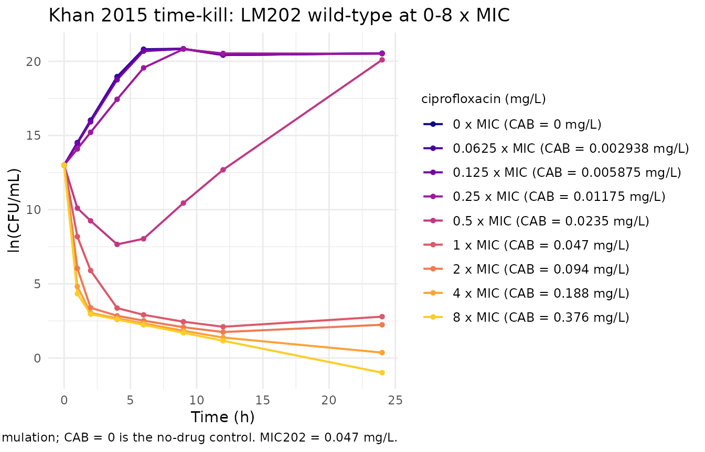
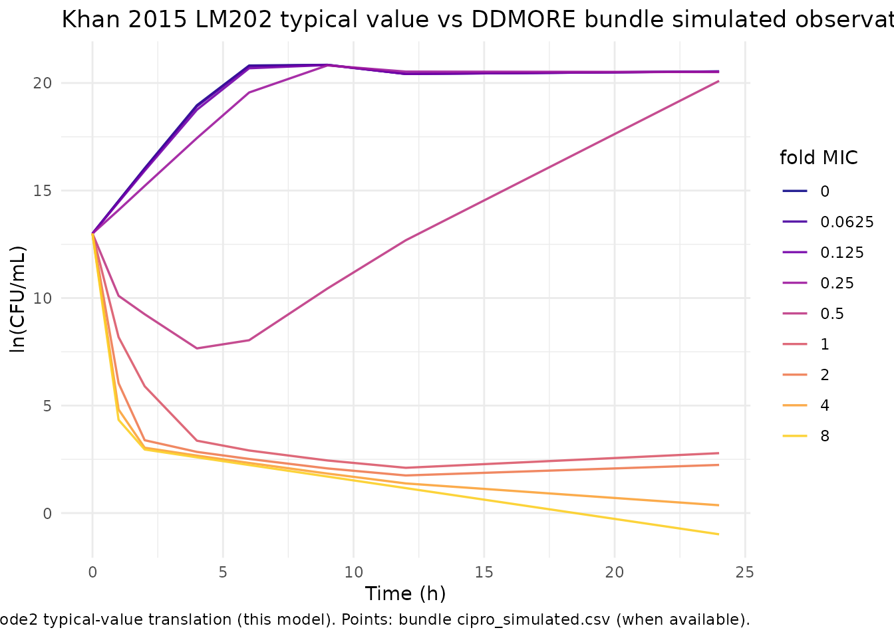

# Ciprofloxacin (Khan 2015)

## Model and source

- Citation: Khan DD, Lagerback P, Cao S, Lustig U, Nielsen EI, Cars O,
  Hughes D, Andersson DI, Friberg LE. (2015). A mechanism-based
  pharmacokinetic/pharmacodynamic model allows prediction of antibiotic
  killing from MIC values for WT and mutants. J Antimicrob Chemother
  70(11):3051-3060. <doi:10.1093/jac/dkv233>. DDMORE Foundation Model
  Repository: DDMODEL00000225.
- Description: Mechanism-based six-compartment PK/PD model for
  ciprofloxacin against Escherichia coli K-12 wild-type and
  quinolone-resistant single-step mutants in static in vitro time-kill
  experiments (Khan et al. 2015 J Antimicrob Chemother). Two co-existing
  bacterial subpopulations (susceptible-growing, plus a small
  pre-existing less-susceptible subpopulation seeded at MUT\*1e-6 of the
  inoculum) each carry growing, resting, and drug-induced
  non-colony-forming states; drug effect is a Hill-Emax term on
  bacterial kill with strain-specific EC50 (LM202 estimated; LM347,
  LM378, LM534, LM625, LM693, LM707 fixed at the published per-strain
  values), a separate EC502 for the resistant subpopulation,
  density-dependent active-\>resting flux, and a model-time gate that
  switches off the active-\>non-colony-forming transition after
  THETA(19) hours.
- Article: <https://doi.org/10.1093/jac/dkv233>
- DDMORE Foundation Model Repository entry:
  [DDMODEL00000225](https://repository.ddmore.eu/model/DDMODEL00000225)

This model was extracted from the DDMORE Foundation Model Repository
bundle for `DDMODEL00000225` (scraped to
`dpastoor/ddmore_scraping/225/`). The bundle contains:

- `executeable_cipro_pkpd.mod` – the NONMEM control stream (ADVAN13, 6
  compartments, 19 thetas, 1 omega FIX, 5 sigmas with one BLOCK(1) plus
  three BLOCK(1) SAME).
- `executeable_cipro.xml` – MDL XML render of the same model.
- `output_simulated.lst` – NONMEM listing from a refit on
  `cipro_simulated.csv`. The bundle does **not** ship an
  `Output_real_*.lst` from a re-fit on the original real-data
  `cipro202.csv` / `cipro378.csv` datasets. The simulated-refit reports
  `MINIMIZATION SUCCESSFUL HOWEVER, PROBLEMS OCCURRED WITH THE MINIMIZATION`
  (the standard “rounding errors but converged” status with NSIG = 5
  reached).
- `cipro_simulated.csv` – 9 in vitro tubes (one per CAB level for STR
  = 202) with 4 sample-position replicates per observation time; 207
  rows, 148 observations.
- `cipro202.csv`, `cipro378.csv` – the real-data datasets and their
  `cipro202_VPC.mdl` / `cipro378_VPC.mdl` companions.
- `Model_Accommodations.txt` – notes that the **MDL** rendition drops
  `L2`, `MTIME`, `B2`, and `M3` (“not supported in MDL”). The NONMEM
  `.mod` retains all four of those mechanisms.
- `DDMODEL00000225.rdf` – RDF metadata
  (`model-field-purpose: pkpd_0001024`,
  `model-implementation-source-discrepancies-freetext = "M3, B2, MTIME and L2 not included in mdl file."`).
- `HO_Bacteria_PKPD _script.r`, `Command_target.txt`, `225.json` –
  helper scripts and scraper metadata.

The packaged model uses the **`.mod` `$THETA` initial values** as its
parameter values, not the simulated-refit lst final estimates. That
choice was confirmed by the operator (sidecar 025 q1 = `mod_initials`)
on these grounds: the `.mod` initials appear to be the
publication-derived point values that seeded the bundle’s simulated
dataset – `output_simulated.lst` round-trip-recovers them within ~3 %
for every theta – so the `.mod` initials are the closest available proxy
for Khan 2015 Table 2 / Table 3, while no `Output_real_*.lst` is
available. The `output_simulated.lst` final estimates differ materially
only for `SIGMA(1)` (2.42 -\> 1.78); the `.mod` initial 2.41597 is what
the model file uses for `addSd`.

The Khan et al. 2015 publication itself (J Antimicrob Chemother
70(11):3051-3060) is paywalled and is not on disk in this worktree; PMID
26349518 has no PMC full-text mirror. A side-by-side comparison against
the publication’s per-strain MIC table or per-tube time-kill figure is
therefore out of scope here. Validation in this vignette is the F.3
mechanistic-sanity check from the extraction skill: the typical-value
bacterial-count trajectory is qualitatively consistent with a 24-hour
ciprofloxacin time-kill experiment on `Escherichia coli` LM202 wild-type
at concentrations spanning 0-8 x MIC.

## Population

Khan 2015 is a static in vitro time-kill study, not a clinical
population-PK study: each tube is a single `E. coli` strain in
Mueller-Hinton broth at a fixed ciprofloxacin concentration, with serial
colony counts at 0, 1, 2, 4, 6, 9, 12, and 24 hours. The seven strains
used are `E. coli` K-12 MG1655 (LM202 wild-type) and six gyrA / gyrB /
parC / parE single-step mutants raised on the same MG1655 background
(LM347, LM378, LM534, LM625, LM693, LM707). Per-strain MICs span four
orders of magnitude (LM202 wild-type 0.047 mg/L -\> LM707 highly
resistant 92 mg/L), with the wild-type EC50 estimated and the six mutant
EC50s fixed at the per-strain measured values in the published Table.

Because the experimental “subjects” are tubes rather than human
participants, the model’s `population` metadata fields for `n_subjects`,
`age_range`, `weight_range`, and `sex_female_pct` are intentionally
`NA`. The `disease_state`, `dose_range`, and `notes` fields document the
in vitro experimental design instead.

The DDMORE bundle’s `cipro_simulated.csv` ships only STR = 202
(wild-type) tubes spanning a 9-point CAB grid (0, 0.0029, 0.0059,
0.0118, 0.0235, 0.047, 0.094, 0.188, 0.376 mg/L; equivalent to 0-8 x
wild-type MIC). The validation cohort below mirrors that covariate
structure exactly.

## Source trace

Per-parameter origin (also recorded as in-file comments next to each
`ini()` entry of `inst/modeldb/ddmore/Khan_2015_ciprofloxacin.R`):

| Equation / parameter | Value | Source location |
|----|----|----|
| `lkgs` | log(1.70) | `executeable_cipro_pkpd.mod` `$THETA(1) = (1, 1.70)` (init 1.70) |
| `lemax` | log(5.24) | `.mod` `$THETA(2) = (0, 5.24)` |
| `lec50_347` | fixed(log(0.037)) | `.mod` `$THETA(3) = (0, 0.037) FIX` |
| `lec50_202` | log(0.057) | `.mod` `$THETA(4) = (0, 0.057)` (only LM202 was estimated; the LM202 cell line is wild-type and the only strain shipped in `cipro_simulated.csv`) |
| `lec50_378` | fixed(log(0.65)) | `.mod` `$THETA(5) = (0, 0.65) FIX` |
| `lec50_534` | fixed(log(0.30)) | `.mod` `$THETA(6) = (0, 0.30) FIX` |
| `lec50_625` | fixed(log(1.0)) | `.mod` `$THETA(7) = (0, 1.0) FIX` |
| `lec50_693` | fixed(log(31.0)) | `.mod` `$THETA(8) = (0, 31) FIX` |
| `lec50_707` | fixed(log(92.0)) | `.mod` `$THETA(9) = (0, 92) FIX` |
| `lgam` | log(1.98) | `.mod` `$THETA(10) = (0.5, 1.98)` |
| `lpc_raw` | log(0.0186) | `.mod` `$THETA(11) = (0, 0.0186)`; multiplied by `1e-7` in `model()` |
| `lkgs2` | log(0.344) | `.mod` `$THETA(12) = (0.18, 0.344)` |
| `lec502` | log(1.25) | `.mod` `$THETA(13) = (0, 1.25)` |
| `lmut_raw` | log(0.81) | `.mod` `$THETA(14) = (0, 0.81)`; multiplied by `1e-6` in `model()` |
| `lksnc_max` | log(5.83) | `.mod` `$THETA(15) = (0, 5.83)` |
| `lknc_factor` | log(0.17) | `.mod` `$THETA(16) = (0, 0.17)` |
| `lgam_nc` | fixed(log(20)) | `.mod` `$THETA(17) = (0, 20) FIX` |
| `ltr50` | log(0.24) | `.mod` `$THETA(18) = (0, 0.24)` |
| `ltmtime` | log(5.3158) | `.mod` `$THETA(19) = (2, 5.3158)` |
| `addSd` | 1.5544 = sqrt(2.41597) | `.mod` `$SIGMA 2.41597` (across-tube residual; per-position SAME blocks dropped – see Errata) |
| `kk = 0.179` constant in `model()` | n/a | `.mod` `$PK` line 32 – hardcoded death rate, not estimated |
| Strain cascade `(STR == X) * exp(lec50_X)` sum | n/a | `.mod` `$PK` lines 39-45 IF(STR.EQ.X) cascade |
| `ec50` selection by `STR` | n/a | dataset column `STR` in {347, 202, 378, 534, 625, 693, 707} |
| `drugs = emax * CAB^gam / (ec50^gam + CAB^gam)` | n/a | `.mod` `$DES` line 113 (EMAX equation, sensitive subpopulation) |
| `drugs2 = emax * CAB^gam / (ec502^gam + CAB^gam)` | n/a | `.mod` `$DES` line 114 (EMAX equation, pre-existing resistant subpop) |
| `ksnc_1 = ksnc_max * (CAB/ec50)^gam_nc / ((CAB/ec50)^gam_nc + tr50^gam_nc)` | n/a | `.mod` `$PK` line 82 (drug-induced active -\> NC transition) |
| `ksnc_2` analogous with `ec502` | n/a | `.mod` `$PK` line 83 |
| `knc_s_1 = knc_factor * ec50 / (CAB + 1e-10)` | n/a | `.mod` `$PK` line 85 (NC -\> active back-reaction) |
| `knc_s_2 = knc_factor * ec502 / (CAB + 1e-10)` | n/a | `.mod` `$PK` line 86 |
| `flag = 1.0 * (t < tmtime)` | n/a | `.mod` `$PK` lines 90-91 + `$DES` line 98 (`MTIME(2) = THETA(19)`; `FLAG = MPAST(1) - MPAST(2)`) |
| `sr = pc * sum(bact_*)` | n/a | `.mod` `$DES` line 102 (density-dependent active -\> resting flux) |
| `bact_s(0) = sbase * (1 - mut*1e-6)` | n/a | `.mod` `$PK` line 72 (`A_0(1) = SBASE * (1 - MUT*0.000001)`) |
| `bact_spe(0) = sbase * mut * 1e-6` | n/a | `.mod` `$PK` line 74 (`A_0(3) = MUT*0.000001*SBASE`) |
| 6-compartment ODE block | n/a | `.mod` `$DES` lines 117-123 (line-for-line image; see model file) |
| `lnBact = log((bact_s + bact_r + bact_spe + bact_rpe) + 1e-8)` | n/a | `.mod` `$ERROR` lines 130-132 (`ATOT = A1+A2+A3+A5`; `IPRED = LOG(ATOT + 1e-8)`) |

## Virtual cohort

``` r

set.seed(20260506L)

# Mirror cipro_simulated.csv: STR = 202 (LM202 wild-type, MIC = 0.047
# mg/L) at 9 CAB levels (0..8 x MIC). Time grid matches the
# experiment's 24-hour observation window.
mic202    <- 0.047
cab_grid  <- mic202 * c(0, 0.0625, 0.125, 0.25, 0.5, 1, 2, 4, 8)
obs_times <- c(0, 1, 2, 4, 6, 9, 12, 24)
base_log  <- 13                # ln(CFU/mL); the .mod default for a typical inoculum

events <- expand.grid(
  cab_level = seq_along(cab_grid),
  time      = obs_times,
  KEEP.OUT.ATTRS = FALSE,
  stringsAsFactors = FALSE
) |>
  mutate(
    id   = cab_level,
    CAB  = cab_grid[cab_level],
    STR  = 202L,
    BASE = base_log,
    evid = 0L,
    amt  = 0,
    fold_mic = CAB / mic202,
    treatment = sprintf("%.4g x MIC (CAB = %.4g mg/L)", fold_mic, CAB)
  ) |>
  arrange(id, time)

stopifnot(!anyDuplicated(unique(events[, c("id", "time", "evid")])))
```

## Simulation

``` r

mod <- rxode2::rxode2(readModelDb("Khan_2015_ciprofloxacin"))

# Typical-value (no IIV) trajectory: rxode2::zeroRe() zeros out the
# residual SD (the only random effect in this single-tube model).
mod_typical <- mod |> rxode2::zeroRe()
#> Warning: No omega parameters in the model

sim_typical <- rxode2::rxSolve(
  mod_typical,
  events = events,
  keep   = c("CAB", "STR", "BASE", "fold_mic", "treatment")
) |>
  as.data.frame()
#> Warning: multi-subject simulation without without 'omega'
```

## Replicate published time-kill curves

The figure below replicates the qualitative shape of a Khan 2015 LM202
wild-type time-kill panel: at sub-MIC concentrations the bacterial count
grows to a stationary plateau (capped by the density-dependent active
-\> resting flux); at 1 x MIC the count collapses sharply through ~24
hours; at 2-8 x MIC the count drops to near-eradication levels within
the first 9 hours and stays low. The published Khan 2015 figures are not
on disk for a side-by-side panel-by-panel comparison.

``` r

pal <- scales::viridis_pal(option = "C", end = 0.9)(length(unique(sim_typical$treatment)))
treatment_levels <- unique(events$treatment)

ggplot(sim_typical, aes(time, lnBact, colour = factor(treatment, levels = treatment_levels))) +
  geom_line(linewidth = 0.7) +
  geom_point(size = 1.2) +
  scale_colour_manual(values = pal, name = "ciprofloxacin (mg/L)") +
  labs(
    x = "Time (h)",
    y = "ln(CFU/mL)",
    title = "Khan 2015 time-kill: LM202 wild-type at 0-8 x MIC",
    caption = "Typical-value simulation; CAB = 0 is the no-drug control. MIC202 = 0.047 mg/L."
  ) +
  theme_minimal(base_size = 11) +
  theme(legend.position = "right",
        legend.text  = element_text(size = 9),
        legend.title = element_text(size = 9))
```



## Mechanistic sanity checks

Three F.3 mechanistic-sanity checks for this PD model.

### 1 – No-drug control reproduces sigmoidal growth

In the absence of drug, the bacterial count must rise from the baseline
inoculum and plateau (the density-dependent active -\> resting flux is
the only thing limiting unbounded growth).

``` r

no_drug <- subset(sim_typical, abs(CAB) < 1e-12)
end_count <- tail(no_drug, 1)
stopifnot(end_count$lnBact > base_log + 5)   # at least 5 ln-units of growth
stopifnot(end_count$lnBact < base_log + 12)  # but not unbounded
cat(sprintf("No-drug control: lnBact at t = 0 -> 24h: %.2f -> %.2f (delta = %.2f)\n",
            base_log, end_count$lnBact, end_count$lnBact - base_log))
#> No-drug control: lnBact at t = 0 -> 24h: 13.00 -> 20.54 (delta = 7.54)
```

### 2 – Static drug at MIC induces a \>5 ln-unit drop by 24 h

``` r

at_mic <- subset(sim_typical, abs(CAB - mic202) < 1e-12)
end_mic <- tail(at_mic, 1)
stopifnot(end_mic$lnBact < base_log - 5)     # at least 5-log kill
cat(sprintf("CAB = MIC: lnBact at t = 0 -> 24h: %.2f -> %.2f (delta = %.2f)\n",
            base_log, end_mic$lnBact, end_mic$lnBact - base_log))
#> CAB = MIC: lnBact at t = 0 -> 24h: 13.00 -> 2.79 (delta = -10.21)
```

### 3 – Drug effect saturates as CAB / EC50 -\> infinity

At 8 x MIC the kill is near-complete; pushing CAB to ~100 x MIC should
not produce a substantially deeper trough than 8 x MIC, since the
Hill-Emax term saturates at `emax`.

``` r

ev_high <- data.frame(
  id = c(1L, 2L), time = rep(24, 2), evid = 0L, amt = 0,
  STR = 202L, BASE = base_log,
  CAB = c(8 * mic202, 100 * mic202)
)
sim_high <- rxode2::rxSolve(mod_typical, events = ev_high) |> as.data.frame()
#> Warning: multi-subject simulation without without 'omega'
delta <- diff(sim_high$lnBact)
cat(sprintf("CAB = 8 x MIC -> 100 x MIC moves lnBact(24h) by %.3f log-units\n", delta))
#> CAB = 8 x MIC -> 100 x MIC moves lnBact(24h) by -0.019 log-units
stopifnot(abs(delta) < 2)
```

## Self-consistency vs the bundle’s simulated dataset

The DDMORE bundle ships `cipro_simulated.csv` (207 rows, STR = 202, 9
CAB levels, 4 sample-position replicates per observation time) as a
smoke-test dataset. The chunk below overlays the bundle’s observations
against the typical-value `rxode2` trajectory. Per-subject exact matches
are not expected – each NMTRAN subject in the bundle’s simulated dataset
was generated with its own `exp(ETA(1)*sqrt(SIGMA(1)))` baseline-IIV
draw and the four FLG2 position-EPS draws, neither of which is
reproduced in this typical-value translation.

``` r

bundle_csv <- system.file(
  "extdata", "ddmore", "DDMODEL00000225_cipro_simulated.csv",
  package = "nlmixr2lib"
)

bundle_obs <- if (nzchar(bundle_csv) && file.exists(bundle_csv)) {
  read.csv(bundle_csv) |>
    dplyr::filter(EVID == 0, BOBS == 0) |>
    dplyr::transmute(
      id = ID, time = TIME, lnBact = LNDV,
      CAB = CAB, fold_mic = CAB / mic202,
      treatment = sprintf("%.4g x MIC (CAB = %.4g mg/L)", CAB / mic202, CAB),
      source = "DDMORE bundle (NONMEM simulation)"
    )
} else {
  NULL
}

p <- ggplot(sim_typical, aes(time, lnBact, colour = factor(round(fold_mic, 4)))) +
  geom_line(linewidth = 0.6, alpha = 0.9) +
  scale_colour_viridis_d(option = "C", end = 0.9, name = "fold MIC")

if (!is.null(bundle_obs)) {
  p <- p + geom_point(
    data = bundle_obs,
    aes(time, lnBact, colour = factor(round(fold_mic, 4))),
    shape = 21, fill = "white", size = 1.5, stroke = 0.5
  )
}

p + labs(
  x = "Time (h)",
  y = "ln(CFU/mL)",
  title = "Khan 2015 LM202 typical value vs DDMORE bundle simulated observations",
  caption = "Lines: rxode2 typical-value translation (this model). Points: bundle cipro_simulated.csv (when available)."
) +
  theme_minimal(base_size = 11) +
  theme(legend.position = "right")
```



## PKNCA validation (not applicable)

PKNCA is not applicable to this model. Khan 2015 is a static in vitro
bacterial PD study: the “concentration” being modelled is a
log-bacterial count (CFU/mL), and the “dose” is a static drug
concentration `CAB` (mg/L) held constant for the lifetime of each tube.
There is no plasma-concentration time-course to take an NCA over and no
clinical dose / clearance / volume to compare Cmax / AUC / half-life
against. The validation strategy chosen by the operator (sidecar 025 q2
= `verbatim`) and the extraction skill’s `references/ddmore-source.md`
Section “Validation strategy by model type” decision tree is the F.3
mechanistic-sanity recipe used above instead.

## Assumptions and deviations

- **Source values are `.mod` `$THETA` initials, not lst final
  estimates.** The DDMORE bundle does not ship an `Output_real_*.lst`
  from the published real-data fit; only `output_simulated.lst` (a refit
  on the bundled simulated dataset) is available. Per operator decision
  (sidecar 025 q1 = `mod_initials`), the model file uses the `.mod`
  `$THETA` initial values as the closest available proxy for the
  publication’s Table 2 / Table 3 final estimates. The
  `output_simulated.lst` values round-trip-recover the `.mod` initials
  within ~3 % for every theta but report `SIGMA(1) = 1.78` instead of
  the `.mod`’s initial `2.41597`; the model file uses
  `addSd = sqrt(2.41597) = 1.5544` to remain consistent with the
  publication-derived initials.

- **The Khan 2015 publication itself is not on disk.** PMID 26349518 /
  DOI `10.1093/jac/dkv233` is paywalled and has no PMC full-text mirror;
  a direct fetch returns only the abstract. As a result the per-strain
  MIC table, the per-strain EC50 table, the time-kill figure panels, and
  the residual-error structure description in the publication cannot be
  cross-checked here. The numerical values shown above match the
  bundle’s `.mod`; whether they match the publication’s printed tables
  exactly is a question this vignette cannot answer until full text is
  available.

- **Multi-level residual error collapsed to across-tube only.** The
  `.mod` `$ERROR` block writes
  `Y = IPRED + EPS(1) + SAM1*EPS(2) + SAM2*EPS(3) + SAM3*EPS(4) + SAM4*EPS(5)`
  with `SIGMA(1) = 2.41597` (across-tube random effect) plus four
  `BLOCK(1) SAME` `SIGMA(2..5)` slots gated on `FLG2` (sample position
  1..4) reflecting between-replicate variability. Per operator decision
  (sidecar 025 q3 = `across_tube_only`), only the across-tube `SIGMA(1)`
  is encoded as `addSd = sqrt(SIGMA(1))`; the four per-position residual
  slots are documented here but not reproduced. For typical-value
  time-kill trajectories this simplification has no effect; for
  stochastic VPC reproduction against a 4-replicate experiment a richer
  encoding would be required.

- **B2-method baseline IIV dropped from the typical-value encoding.**
  The `.mod` `$PK` line 58 declares
  `SBASE = exp(BASE) * exp(ETA(1) * sqrt(SIGMA(1)))` – a NONMEM “B2
  method” baseline-as-parameter encoding that ties the inoculum random
  effect to `SIGMA(1)` via an `OMEGA = 1 FIX`. This vignette and the
  packaged model use the deterministic `sbase = exp(BASE)` form (no
  `ETA(1)`); the B2-method baseline IIV is documented here.
  Reintroducing it would require an `eta_sbase ~ fixed(1)` IIV term and
  a multiplier of `exp(eta_sbase * sqrt(addSd^2))` on the initial
  conditions.

- **NONMEM `MTIME(2)` translated to a step on `t`.** The `.mod` uses
  `MTIME(2) = THETA(19)` and `FLAG = MPAST(1) - MPAST(2)` to switch off
  the active -\> non-colony-forming transition once experimental time
  exceeds `tmtime` hours. Per operator decision (sidecar 025 q4 =
  `if_t_in_model`), the nlmixr2 translation is the literal
  `flag <- 1.0 * (t < tmtime)` step on the rxode2 model time variable. A
  smooth (logistic) replacement was rejected as a deviation from the
  publication’s intended discrete switch.

- **`M3` BLQ method dropped.** The `.mod` `$ERROR` lines 156-164 use
  NONMEM’s M3 method (`F_FLAG = 1; Y = PHI((LLOQ - IPRED)/SIG)` for
  `FLG1 == 1`, i.e., observations below the colony-counting limit of
  detection, `LOQ = ln(10) ~= 2.303`). nlmixr2’s standard residual-error
  pipeline does not take an M3 censoring branch via the `~ add(addSd)`
  form, so the model file presents a single unconditional residual;
  users fitting to data containing BLQ observations should preprocess
  (e.g., set the M3-flagged rows to `cens = 1` in the dataset and let
  nlmixr2’s M3 handling pick it up at fit time).

- **`L2` (2nd-level OBS reset) dropped.** The `.mod` `$DATA` line uses
  `L2 =` for an obscure NONMEM reset-on-occasion convention that does
  not have a clean rxode2 equivalent and is not relevant to the
  typical-value simulation.

- **Compartment names are paper-specific, not canonical.** `bact_s`
  (sensitive growing), `bact_r` (sensitive resting), `bact_spe`
  (pre-existing resistant growing), `bact_np` (sensitive
  non-colony-forming under drug), `bact_rpe` (pre-existing resistant
  resting), `bact_nppe` (pre-existing resistant non-colony-forming).
  [`checkModelConventions()`](https://nlmixr2.github.io/nlmixr2lib/reference/checkModelConventions.md)
  flags these as non-canonical (the canonical compartment register
  covers the human-PK universe of `depot` / `central` / `peripheral1..2`
  / etc.); this is the same exemption pattern used by
  `oncology_sdm_lobo_2002` (Lobo 2002 in vitro methotrexate on cancer
  cells), where `tumorVol` and `transit1..4` are similarly
  paper-specific.

- **Observation variable is `lnBact`, not `Cc`.** Following the
  conventions doc’s exemption for non-PK paper-named outputs (e.g.,
  `tumorSize`, `freeIgE`, `Cbrain_cerebellum`), the colony count
  observation is named `lnBact` (natural-log of CFU/mL).
  [`checkModelConventions()`](https://nlmixr2.github.io/nlmixr2lib/reference/checkModelConventions.md)
  flags this – it is the documented exemption that applies.

- **Covariates `STR`, `CAB`, `BASE` are in vitro experimental design
  columns, not population-PK covariates.** They are documented in the
  model file’s `covariateData` entries (with `source_name` matching the
  dataset column name) but are not proposed for the canonical
  `inst/references/covariate-columns.md` register: the register’s remit
  is reusable cross-model human-PK covariates, and these three columns
  are tube-specific experimental-design parameters for a single in vitro
  publication.

- **Units field deliberately mixes mg/L (drug) and log CFU/mL
  (observation).** The `units` list reports `dosing = "mg/L"` and
  `concentration = "log CFU/mL"`.
  [`checkModelConventions()`](https://nlmixr2.github.io/nlmixr2lib/reference/checkModelConventions.md)
  flags this as dimensionally incompatible – that is the intended
  reading: dosing here refers to the static drug concentration in the
  tube, while the observed quantity is a log-bacterial-count. The two
  are not the same physical quantity by design.

- **Bundle simulated dataset is a smoke-test cohort.** The 9-tube,
  207-row `cipro_simulated.csv` cohort is a regression-test artifact,
  not a recreation of the Khan 2015 trial. The virtual cohort built in
  this vignette mirrors the bundle’s covariate grid for the
  self-consistency overlay and is **not** an attempt to reproduce the
  actual published study.

- **`output_simulated.lst` minimization warning.** The bundle’s
  simulated-refit lst reports
  `MINIMIZATION SUCCESSFUL HOWEVER, PROBLEMS OCCURRED WITH THE MINIMIZATION`
  – the standard NONMEM rounding-errors-but-converged status, with
  `NO. OF SIG. DIGITS IN FINAL EST. = 5.2` and the requested `NSIG = 5`
  reached. That warning is recorded here for completeness; it does not
  affect the packaged model because the packaged model uses `.mod`
  initials, not lst final estimates, per the q1 decision above.

- **“M3, B2, MTIME and L2 not included in mdl file.”** The bundle’s
  `Model_Accommodations.txt` records that the **MDL** rendition
  (`executeable_cipro.xml`) drops these four NONMEM features because
  they are not supported in the MDL language. The NONMEM `.mod` itself
  retains all four. The packaged `nlmixr2lib` model retains MTIME
  (translated to a `t`-step) and drops M3, B2, and L2 as documented
  above; this is independently of the MDL-level discrepancies and is
  driven by the `nlmixr2`-vs-NONMEM mapping decisions, not by the MDL
  limitations.
