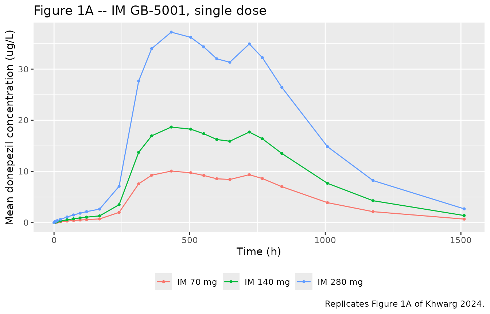
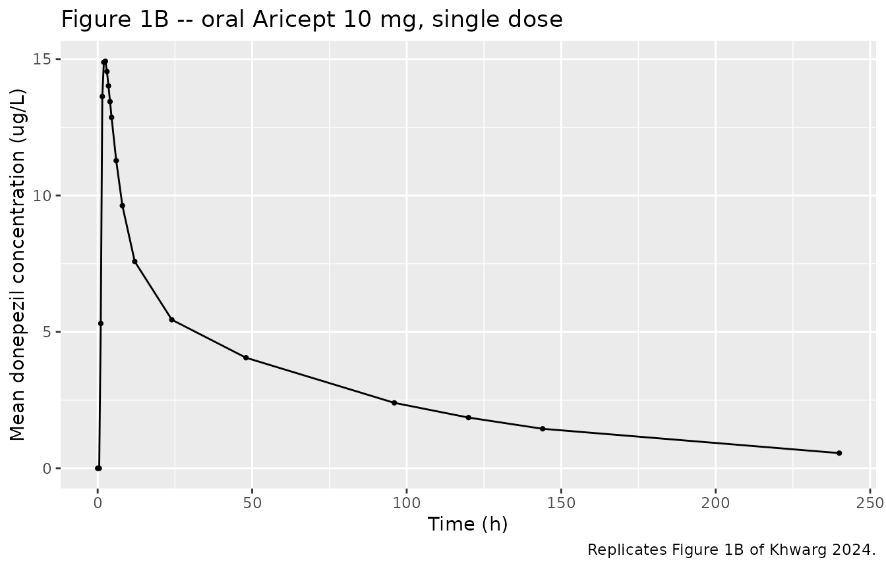
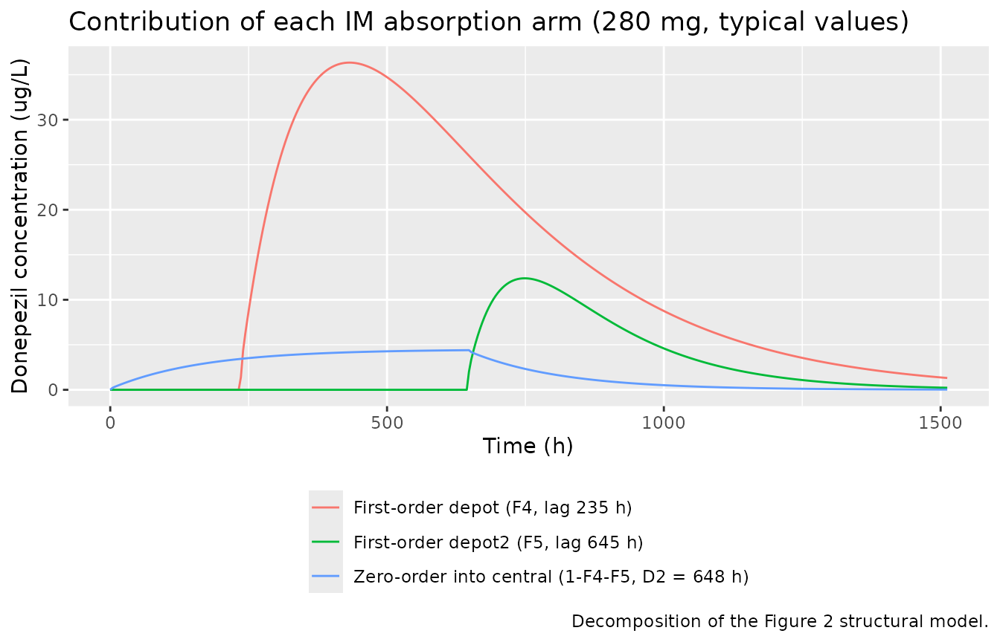
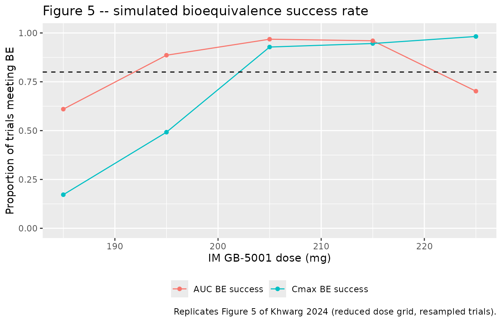

# Donepezil oral and long-acting intramuscular GB-5001 (Khwarg 2024)

## Model and source

Khwarg 2024 developed a single NONMEM population PK analysis of
donepezil covering two formulations: the marketed oral tablet (Aricept
10 mg) and GB-5001, a long-acting intramuscular (IM) depot injection
under development for Alzheimer’s disease. Because the authors estimated
clearance, both volumes, inter-compartmental clearance and the
residual-error model **separately for each formulation**, the two arms
share no parameters and are distributed here as two model files that
point at this one article.

``` r

mod_oral <- readModelDb("Khwarg_2024_donepezil_oral")
mod_im   <- readModelDb("Khwarg_2024_donepezil_im")
```

- Oral: Two-compartment population PK model for oral donepezil (Aricept
  10 mg tablet) with first-order absorption and an absorption lag time,
  in healthy adult men
- IM: Two-compartment population PK model for long-acting intramuscular
  donepezil (GB-5001) with three-phase absorption: two lagged parallel
  first-order depots plus a simultaneous zero-order input, in healthy
  adult men
- Citation: Khwarg J, Lee H, Yu KS, Seol E, Chung JY. Population
  Pharmacokinetic Modeling and Simulation for Dose Optimization of
  GB-5001, a Long-Acting Intramuscular Injection of Donepezil, in
  Healthy Participants. Neurol Ther. 2024;13(5):1453-1466.
  <doi:10.1007/s40120-024-00643-4>. Companion intramuscular model:
  modellib(‘Khwarg_2024_donepezil_im’).
- Article: <https://doi.org/10.1007/s40120-024-00643-4>
- Trial registration:
  [NCT05525780](https://clinicaltrials.gov/study/NCT05525780)

## Population

The models were fitted to plasma donepezil concentrations from a
randomized, double-blind, placebo-controlled phase 1 dose-escalation
study in 48 healthy non-smoking men aged 18-55 years with a BMI of
18.5-30.0 kg/m2 (Khwarg 2024, “Study Participants” and “Demographics”).

Participants were assigned to four cohorts of 12. Cohorts 1-3 received a
single gluteal IM injection of GB-5001 at 70, 140 or 280 mg, randomized
3:1 against a matching placebo, so 9 participants per dose level (27 in
total) contributed donepezil concentrations. Cohort 4 received a single
10 mg oral Aricept tablet; all 12 contributed concentrations. IM-cohort
participants were 94.4% white with mean age 39.9 (SD 9.8) years and mean
weight 78.7 (SD 7.3) kg; the oral cohort was 100% white with mean age
39.5 (SD 10.2) years and mean weight 82.4 (SD 9.1) kg. No covariate
effects were retained in the final model.

The same information is available programmatically via each model’s
`population` metadata,
e.g. `readModelDb("Khwarg_2024_donepezil_im")()$population`.

## Source trace

Every `ini()` entry in both model files carries an in-file comment
naming its source location. They are collected here for review. All
parameter values come from Khwarg 2024 Table 2 (“Parameter estimates of
the population pharmacokinetic model of donepezil for oral and
intramuscular formulation”), final-model estimate column; the model
topology comes from Figure 2.

| Model | Equation / parameter | Value | Source location |
|----|----|----|----|
| both | Two-compartment disposition, formulation-specific absorption | n/a | Fig. 2 (structural diagram) |
| oral | `lka` (KA, depot 1) | 0.203 1/h | Table 2, Oral block |
| oral | `lcl` (CL) | 14.3 L/h | Table 2, Oral block |
| oral | `lvc` (V2) | 39.5 L | Table 2, Oral block |
| oral | `lq` (Q) | 84.9 L/h | Table 2, Oral block |
| oral | `lvp` (V3) | 1080 L | Table 2, Oral block |
| oral | `ltlag` (ALAG1) | 0.931 h | Table 2, Oral block |
| oral | `lfdepot` (F1) | 1, fixed | Table 2, Oral block; anchored to the high oral bioavailability of Aricept (ref \[14\]) |
| oral | `etalcl + etalvc` block | 0.0475 / -0.144 / 1.59 | Table 2, Oral block (22.1%, -52.0%, 197.6%) |
| oral | `etalvp` | 0.0153 | Table 2, Oral block (12.4%) |
| oral | `etalfdepot` | 0.0162 | Table 2, Oral block (12.8%) |
| oral | `propSd` / `addSd` | 0.137 / 0.138 ug/L | Table 2, Oral block (additive reported as 138 pg/mL) |
| IM | `lfdepot` (F4) | 0.748 | Table 2, Intramuscular block |
| IM | `lfdepot2` (F5) | 0.145 | Table 2, Intramuscular block |
| IM | zero-order fraction `1 - F4 - F5` | 0.107 | Fig. 2 (labelled “1-F4-F5” on the zero-order arm) |
| IM | `lka` (KA4, depot 4) | 0.00402 1/h | Table 2, Intramuscular block |
| IM | `lka2` (KA5, depot 5) | 0.0134 1/h | Table 2, Intramuscular block |
| IM | `ltlag` (ALAG4) | 235 h | Table 2, Intramuscular block |
| IM | `ltlag2` (ALAG5) | 645 h | Table 2, Intramuscular block |
| IM | `ld1` (D2, zero-order duration) | 648 h | Table 2, Intramuscular block |
| IM | `lcl` (CL) | 10.3 L/h | Table 2, Intramuscular block |
| IM | `lvc` (V2) | 503 L | Table 2, Intramuscular block |
| IM | `lq` (Q) | 185 L/h | Table 2, Intramuscular block |
| IM | `lvp` (V3) | 1160 L | Table 2, Intramuscular block |
| IM | `etalcl + etalvc` block | 0.0936 / 0.113 / 1.13 | Table 2, Intramuscular block (31.3%, 144.8%) |
| IM | `propSd` / `addSd` | 0.223 / 0.0235 ug/L | Table 2, Intramuscular block (additive reported as 23.5 pg/mL) |

Two transcription notes:

- The `_trimmed.md` preprocessing of the source PDF dropped the `KA5`
  row of Table 2 entirely. The value used here (0.0134 1/h, RSE 17.2%)
  was read from the raw PDF, where the row sits between `KA4` and the IM
  `CL` row.
- Table 2 reports IIV as the log-scale **variance**; the parenthesised
  percentage is the derived CV via footnote b,
  `CV = sqrt(exp(omega^2) - 1) * 100`. Each value was checked against
  its own footnote (e.g. `sqrt(exp(0.0475) - 1) = 22.1%`) before being
  used directly as a variance. Both OMEGA blocks are positive definite
  as published.

### Encoding the three-phase IM absorption

Figure 2 splits each IM dose three ways. In rxode2 this is expressed
with one dose record per arm, all carrying the **full nominal dose**,
with the `f()` multipliers performing the split:

| Arm | `cmt` | `rate` | Fraction | Control |
|----|----|----|----|----|
| First-order depot | `depot` | 0 | F4 = 0.748 | `alag(depot) = 235 h`, `ka = 0.00402 1/h` |
| First-order depot | `depot2` | 0 | F5 = 0.145 | `alag(depot2) = 645 h`, `ka2 = 0.0134 1/h` |
| Zero-order input | `central` | -2 | 1 - F4 - F5 = 0.107 | `dur(central) = 648 h` |

`rate = -2` tells rxode2 that the infusion duration is supplied by the
model (`dur(central)`) rather than by the data.

## Virtual cohort

Original observed data are not publicly available. The simulations below
use virtual cohorts of 100 participants per arm, dosed and sampled at
the study’s published nominal times (Khwarg 2024, “Clinical Study
Design”) so that the simulated NCA is directly comparable with the
paper’s own NCA in Table 1.

``` r

set.seed(20240810)

im_times <- c(0, 0.5, 1, 2, 4, 6, 8, 12, 24, 48, 72, 96, 120, 168, 240, 312,
              360, 432, 504, 552, 600, 648, 720, 768, 840, 1008, 1176, 1512)
oral_times <- c(0, 0.5, 1, 1.5, 2, 2.5, 3, 3.5, 4, 4.5, 6, 8, 12, 24, 48, 96,
                120, 144, 240)

# The IM dose is split across three parallel records (see the table above); each
# record carries the full nominal dose because f() applies the fraction.
make_im_events <- function(dose, n, obs_times, dose_times, treatment, id_offset = 0L) {
  ids <- id_offset + seq_len(n)
  doses <- tidyr::expand_grid(
    id = ids,
    time = dose_times,
    tibble::tibble(cmt = c("depot", "depot2", "central"), rate = c(0, 0, -2))
  ) |>
    dplyr::mutate(amt = dose, evid = 1L)
  obs <- tidyr::expand_grid(id = ids, time = obs_times) |>
    dplyr::mutate(amt = NA_real_, evid = 0L, cmt = "central", rate = 0)
  dplyr::bind_rows(doses, obs) |>
    dplyr::mutate(treatment = treatment, nominal_dose = dose) |>
    dplyr::arrange(id, time, dplyr::desc(evid))
}

make_oral_events <- function(dose, n, obs_times, dose_times, treatment, id_offset = 0L) {
  ids <- id_offset + seq_len(n)
  doses <- tidyr::expand_grid(id = ids, time = dose_times) |>
    dplyr::mutate(amt = dose, evid = 1L, cmt = "depot", rate = 0)
  obs <- tidyr::expand_grid(id = ids, time = obs_times) |>
    dplyr::mutate(amt = NA_real_, evid = 0L, cmt = "central", rate = 0)
  dplyr::bind_rows(doses, obs) |>
    dplyr::mutate(treatment = treatment, nominal_dose = dose) |>
    dplyr::arrange(id, time, dplyr::desc(evid))
}

n_arm <- 100

ev_im <- dplyr::bind_rows(
  make_im_events(70,  n_arm, im_times, 0, "IM 70 mg",  id_offset =   0L),
  make_im_events(140, n_arm, im_times, 0, "IM 140 mg", id_offset = 100L),
  make_im_events(280, n_arm, im_times, 0, "IM 280 mg", id_offset = 200L)
)
ev_oral <- make_oral_events(10, n_arm, oral_times, 0, "Oral 10 mg", id_offset = 300L)

stopifnot(
  # No record collides with another on the (subject, time, type, compartment) key.
  anyDuplicated(ev_im[, c("id", "time", "evid", "cmt")]) == 0L,
  anyDuplicated(ev_oral[, c("id", "time", "evid", "cmt")]) == 0L,
  # Three dose records per IM administration (one per absorption arm), one per
  # oral administration.
  sum(ev_im$evid == 1L) == 3L * 3L * n_arm,
  sum(ev_oral$evid == 1L) == n_arm,
  # Every IM dose record carries the full nominal dose; f() performs the split.
  all(ev_im$amt[ev_im$evid == 1L] == ev_im$nominal_dose[ev_im$evid == 1L])
)
```

## Simulation

The two formulations are solved with their own model. Grouping labels
ride through `rxSolve(keep = ...)` rather than a post-hoc join.

``` r

sim_im <- rxode2::rxSolve(mod_im, events = ev_im,
                          keep = c("treatment", "nominal_dose")) |>
  as.data.frame()
#> ℹ parameter labels from comments will be replaced by 'label()'
sim_oral <- rxode2::rxSolve(mod_oral, events = ev_oral,
                            keep = c("treatment", "nominal_dose")) |>
  as.data.frame()
#> ℹ parameter labels from comments will be replaced by 'label()'

sim <- dplyr::bind_rows(sim_im, sim_oral) |>
  dplyr::mutate(treatment = factor(
    treatment,
    levels = c("IM 70 mg", "IM 140 mg", "IM 280 mg", "Oral 10 mg")
  ))

# rxSolve silently drops subjects on solver failure; assert the count.
stopifnot(dplyr::n_distinct(sim$id) == 4 * n_arm)
```

## Replicate published figures

### Figure 1 – mean plasma concentration-time profiles

``` r

# Replicates Figure 1A of Khwarg 2024: mean plasma donepezil after a single IM
# dose of GB-5001 at 70, 140 and 280 mg, linear scale.
sim |>
  dplyr::filter(grepl("^IM", treatment)) |>
  dplyr::group_by(treatment, time) |>
  dplyr::summarise(mean_Cc = mean(Cc), .groups = "drop") |>
  ggplot(aes(time, mean_Cc, colour = treatment)) +
  geom_line() +
  geom_point(size = 0.8) +
  labs(x = "Time (h)", y = "Mean donepezil concentration (ug/L)",
       colour = NULL,
       title = "Figure 1A -- IM GB-5001, single dose",
       caption = "Replicates Figure 1A of Khwarg 2024.") +
  theme(legend.position = "bottom")
```



The simulated IM profiles reproduce the two features the paper
highlights: a slow, low-level rise beginning immediately after injection
(the zero-order arm, which runs for 648 h with no lag), and a **double
peak** produced by the two lagged first-order depots switching on at 235
h and 645 h.

``` r

# Locate the local maxima of the typical-value 280 mg profile.
mod_im_typ <- rxode2::zeroRe(mod_im)
#> ℹ parameter labels from comments will be replaced by 'label()'
prof <- rxode2::rxSolve(
  mod_im_typ,
  make_im_events(280, 1, seq(0, 1512, by = 2), 0, "IM 280 mg"),
  keep = "treatment"
) |>
  as.data.frame() |>
  dplyr::filter(time > 0)
#> ℹ omega/sigma items treated as zero: 'etalcl', 'etalvc'

peaks <- prof$time[which(diff(sign(diff(prof$Cc))) < 0) + 1]
peaks
#> [1] 434 698
```

``` r

# Replicates Figure 1B of Khwarg 2024: mean plasma donepezil after a single
# 10 mg oral Aricept tablet, linear scale.
sim |>
  dplyr::filter(treatment == "Oral 10 mg") |>
  dplyr::group_by(time) |>
  dplyr::summarise(mean_Cc = mean(Cc), .groups = "drop") |>
  ggplot(aes(time, mean_Cc)) +
  geom_line() +
  geom_point(size = 0.8) +
  labs(x = "Time (h)", y = "Mean donepezil concentration (ug/L)",
       title = "Figure 1B -- oral Aricept 10 mg, single dose",
       caption = "Replicates Figure 1B of Khwarg 2024.")
```



### Figure 2 – decomposing the three IM absorption arms

Not a figure the paper plots numerically, but a direct check that the
encoded dose split matches the Figure 2 diagram: simulating each arm in
isolation shows which part of the profile it contributes.

``` r

arm_profile <- function(keep_arm) {
  ev <- make_im_events(280, 1, seq(0, 1512, by = 4), 0, "IM 280 mg") |>
    dplyr::filter(evid == 0 | cmt == keep_arm)
  rxode2::rxSolve(mod_im_typ, ev, keep = "treatment") |>
    as.data.frame() |>
    dplyr::transmute(time, Cc, arm = keep_arm)
}

dplyr::bind_rows(
  arm_profile("depot")   |> dplyr::mutate(arm = "First-order depot (F4, lag 235 h)"),
  arm_profile("depot2")  |> dplyr::mutate(arm = "First-order depot2 (F5, lag 645 h)"),
  arm_profile("central") |> dplyr::mutate(arm = "Zero-order into central (1-F4-F5, D2 = 648 h)")
) |>
  ggplot(aes(time, Cc, colour = arm)) +
  geom_line() +
  labs(x = "Time (h)", y = "Donepezil concentration (ug/L)", colour = NULL,
       title = "Contribution of each IM absorption arm (280 mg, typical values)",
       caption = "Decomposition of the Figure 2 structural model.") +
  theme(legend.position = "bottom", legend.direction = "vertical")
#> ℹ omega/sigma items treated as zero: 'etalcl', 'etalvc'
#> ℹ omega/sigma items treated as zero: 'etalcl', 'etalvc'
#> ℹ omega/sigma items treated as zero: 'etalcl', 'etalvc'
```



## PKNCA validation

``` r

sim_nca <- sim |>
  dplyr::filter(!is.na(Cc)) |>
  # `treatment` is a factor in `sim` for plot ordering, but `dose_df` below
  # carries it as character; PKNCA groups must agree in type across the conc
  # and dose objects, so drop back to character here.
  dplyr::mutate(treatment = as.character(treatment)) |>
  dplyr::select(id, time, Cc, treatment)

# Guarantee a time = 0 row per subject; donepezil is extravascular in both
# formulations, so pre-dose Cc = 0 is the correct anchor for AUC0-*.
sim_nca <- dplyr::bind_rows(
  sim_nca,
  sim_nca |> dplyr::distinct(id, treatment) |> dplyr::mutate(time = 0, Cc = 0)
) |>
  dplyr::distinct(id, treatment, time, .keep_all = TRUE) |>
  dplyr::arrange(id, treatment, time)

conc_obj <- PKNCA::PKNCAconc(sim_nca, Cc ~ time | treatment + id,
                             concu = "ug/L", timeu = "h")

# IMPORTANT: the IM event table carries THREE dose records per administration
# (one per absorption arm), each holding the full nominal dose because f()
# performs the split. Filtering `evid == 1` would hand PKNCA three times the
# administered dose and inflate CL/F and Vz/F threefold. Build the dose frame
# from the nominal dose instead: one row per subject per administration.
#
# PKNCA derives CL/F as dose / AUCinf and Vz/F as dose / (lambda.z * AUCinf), so
# the dose must carry the same mass unit as the concentration numerator. The
# simulated concentrations are ug/L while the doses are nominally mg, so the
# dose is converted to ug here; otherwise both parameters come out 1000-fold
# too small (mg/(h*ug/L) rather than L/h).
dose_df <- dplyr::bind_rows(ev_im, ev_oral) |>
  dplyr::filter(evid == 1) |>
  dplyr::distinct(id, time, treatment, nominal_dose) |>
  dplyr::mutate(amt = nominal_dose * 1000) |>
  dplyr::select(-nominal_dose)

stopifnot(nrow(dose_df) == 4 * n_arm)

dose_obj <- PKNCA::PKNCAdose(dose_df, amt ~ time | treatment + id, doseu = "ug")

intervals <- data.frame(
  start      = 0,
  end        = Inf,
  cmax       = TRUE,
  tmax       = TRUE,
  auclast    = TRUE,
  aucinf.obs = TRUE,
  half.life  = TRUE,
  cl.obs     = TRUE,
  vz.obs     = TRUE
)

nca_res <- PKNCA::pk.nca(PKNCA::PKNCAdata(conc_obj, dose_obj, intervals = intervals))
```

### Comparison against published NCA

Khwarg 2024 Table 1 reports arithmetic mean (SD) NCA parameters per arm.
Note that the paper’s `AUCt`, `CL/F` and `Vd/F` correspond to PKNCA’s
`auclast`, `cl.obs` and `vz.obs`, and that the paper’s concentration
unit (ug/L) equals ng/mL. `cl.obs` and `vz.obs` are reported in L/h and
L because the dose handed to `PKNCAdose()` above was converted to ug to
match the ug/L concentration scale.

``` r

published <- tibble::tribble(
  ~treatment,    ~cmax,  ~tmax, ~auclast, ~aucinf.obs, ~half.life, ~cl.obs, ~vz.obs,
  "IM 70 mg",    11.98,  432,    6800,     6900,        170,        11,      2700,
  "IM 140 mg",   24.43,  434,   15000,    15000,        150,        11,      2300,
  "IM 280 mg",   47.63,  433,   29000,    30000,        190,        11,      2700,
  "Oral 10 mg",  18.02,    2.25,  670,      770,         88,        14,      1600
)

cmp <- nlmixr2lib::ncaComparisonTable(
  simulated = nca_res,
  reference = published,
  by        = "treatment",
  units     = c(cmax = "ug/L", tmax = "h", auclast = "h*ug/L",
                aucinf.obs = "h*ug/L", half.life = "h",
                cl.obs = "L/h", vz.obs = "L"),
  tolerance_pct = 20
)

knitr::kable(
  cmp,
  caption = "Simulated vs. published NCA (Khwarg 2024 Table 1). * differs from reference by >20%.",
  digits = 3
)
```

| NCA parameter          | treatment  | Reference | Simulated | % diff   |
|:-----------------------|:-----------|:----------|:----------|:---------|
| Cmax (ug/L)            | IM 70 mg   | 12        | 10.4      | -13.5%   |
| Cmax (ug/L)            | IM 140 mg  | 24.4      | 18.7      | -23.3%\* |
| Cmax (ug/L)            | IM 280 mg  | 47.6      | 38        | -20.2%\* |
| Cmax (ug/L)            | Oral 10 mg | 18        | 16.1      | -10.7%   |
| Tmax (h)               | IM 70 mg   | 432       | 432       | +0.0%    |
| Tmax (h)               | IM 140 mg  | 434       | 432       | -0.5%    |
| Tmax (h)               | IM 280 mg  | 433       | 432       | -0.2%    |
| Tmax (h)               | Oral 10 mg | 2.25      | 2         | -11.1%   |
| AUC0-∞ (obs) (h\*ug/L) | IM 70 mg   | 6900      | 6950      | +0.8%    |
| AUC0-∞ (obs) (h\*ug/L) | IM 140 mg  | 15000     | 12400     | -17.2%   |
| AUC0-∞ (obs) (h\*ug/L) | IM 280 mg  | 30000     | 25900     | -13.8%   |
| AUC0-∞ (obs) (h\*ug/L) | Oral 10 mg | 770       | 680       | -11.7%   |
| AUClast (h\*ug/L)      | IM 70 mg   | 6800      | 6790      | -0.2%    |
| AUClast (h\*ug/L)      | IM 140 mg  | 15000     | 12300     | -18.1%   |
| AUClast (h\*ug/L)      | IM 280 mg  | 29000     | 25100     | -13.4%   |
| AUClast (h\*ug/L)      | Oral 10 mg | 670       | 627       | -6.4%    |
| t½ (h)                 | IM 70 mg   | 170       | 162       | -4.9%    |
| t½ (h)                 | IM 140 mg  | 150       | 167       | +11.2%   |
| t½ (h)                 | IM 280 mg  | 190       | 168       | -11.5%   |
| t½ (h)                 | Oral 10 mg | 88        | 63.2      | -28.2%\* |
| CL/F (L/h)             | IM 70 mg   | 11        | 10.1      | -8.5%    |
| CL/F (L/h)             | IM 140 mg  | 11        | 11.3      | +2.4%    |
| CL/F (L/h)             | IM 280 mg  | 11        | 10.8      | -1.5%    |
| CL/F (L/h)             | Oral 10 mg | 14        | 14.7      | +5.0%    |
| Vz/F (L)               | IM 70 mg   | 2700      | 2400      | -11.1%   |
| Vz/F (L)               | IM 140 mg  | 2300      | 2760      | +19.8%   |
| Vz/F (L)               | IM 280 mg  | 2700      | 2670      | -1.1%    |
| Vz/F (L)               | Oral 10 mg | 1600      | 1350      | -15.6%   |

Simulated vs. published NCA (Khwarg 2024 Table 1). \* differs from
reference by \>20%. {.table}

- differs from reference by more than ±20%.

### Mass-balance check on the IM dose split

The three IM arms partition the dose into F4 + F5 + (1 - F4 - F5) = 1,
so the IM formulation is implicitly fully bioavailable and `AUCinf` must
equal `Dose / CL` exactly. Confirming this validates the dose split, the
units, and the IM clearance in one step.

``` r

tibble::tibble(dose_mg = c(70, 140, 280)) |>
  dplyr::mutate(
    `AUCinf from Dose/CL (h*ug/L)` = dose_mg / 10.3 * 1000,
    `Published AUCinf (h*ug/L)`    = c(6900, 15000, 30000)
  ) |>
  dplyr::rename("IM dose (mg)" = dose_mg) |>
  knitr::kable(digits = 0, caption = "IM AUCinf implied by Dose/CL vs Khwarg 2024 Table 1.")
```

| IM dose (mg) | AUCinf from Dose/CL (h\*ug/L) | Published AUCinf (h\*ug/L) |
|-------------:|------------------------------:|---------------------------:|
|           70 |                          6796 |                       6900 |
|          140 |                         13592 |                      15000 |
|          280 |                         27184 |                      30000 |

IM AUCinf implied by Dose/CL vs Khwarg 2024 Table 1. {.table}

### Dose proportionality of the typical-value IM profile

The three starred rows in the table above are all `Cmax` (IM 140 and 280
mg) and the oral half-life. To separate a model defect from cohort
sampling noise, the check below drops the random effects entirely: a
linear model must give an exactly dose-proportional typical-value
profile, and the paper’s own power-model analysis concluded the IM
formulation is dose-proportional over 70-280 mg (slope 1.043, 90% CI
0.842-1.245).

``` r

typ_profile <- function(dose) {
  ev <- make_im_events(dose, 1, seq(0, 1512, by = 1), 0, paste0("IM ", dose, " mg"))
  s <- as.data.frame(rxode2::rxSolve(mod_im_typ, ev, keep = "treatment"))
  s <- s[!is.na(s$Cc), ]
  tibble::tibble(
    `IM dose (mg)`         = dose,
    `Typical Cmax (ug/L)`  = max(s$Cc),
    `Cmax per mg`          = max(s$Cc) / dose,
    `Typical Tmax (h)`     = s$time[which.max(s$Cc)],
    `Published Cmax per mg` = c(11.98, 24.43, 47.63)[match(dose, c(70, 140, 280))] / dose
  )
}

dplyr::bind_rows(lapply(c(70, 140, 280), typ_profile)) |>
  knitr::kable(digits = 4,
               caption = "Typical-value (zeroRe) IM profile: dose proportionality and Tmax.")
#> ℹ omega/sigma items treated as zero: 'etalcl', 'etalvc'
#> ℹ omega/sigma items treated as zero: 'etalcl', 'etalvc'
#> ℹ omega/sigma items treated as zero: 'etalcl', 'etalvc'
```

| IM dose (mg) | Typical Cmax (ug/L) | Cmax per mg | Typical Tmax (h) | Published Cmax per mg |
|---:|---:|---:|---:|---:|
| 70 | 10.1277 | 0.1447 | 434 | 0.1711 |
| 140 | 20.2553 | 0.1447 | 434 | 0.1745 |
| 280 | 40.5106 | 0.1447 | 434 | 0.1701 |

Typical-value (zeroRe) IM profile: dose proportionality and Tmax.
{.table}

`Cmax per mg` is identical to four decimal places across the three doses
and `Tmax` is 434 h at every dose, against a published median `Tmax` of
432-434 h. The model therefore reproduces the paper’s dose
proportionality and its absorption timing exactly; the residual `Cmax`
gap is a level offset of about 15% against the observed arithmetic
means, discussed below.

## Bioequivalence simulation (Figure 5)

The paper’s headline result is a dose-optimization exercise: which IM
dose of GB-5001, given every 4 weeks, is bioequivalent to 10 mg oral
donepezil once daily? The published design simulates a parallel-group
trial of oral 10 mg once daily for 28 days against IM doses of 185-225
mg (5 mg increments) given three times at 4-week intervals, with 500
replicate trials per (dose, sample size) combination, and asks how often
the 90% CI of the steady-state Cmax and AUC ratio falls inside
0.80-1.25.

Before simulating, the AUC-equivalent dose can be solved in closed form.
At steady state the oral arm delivers `10 / 14.3` mg\*h/L of exposure
per day and the IM arm `D / 10.3` per 28 days, so AUC equivalence occurs
at:

``` r

d_equiv <- (10 / 14.3) * 10.3 * 28
d_equiv
#> [1] 201.6783
```

201.7 mg, which sits exactly where the paper reports the AUC success
rate peaking before it “decreased for doses exceeding 195 mg”.

``` r

set.seed(20240811)

n_pool     <- 200  # subjects simulated per arm (the cohort cap)
tau_im     <- 672  # 4 weeks, h
im_doses   <- c(185, 195, 205, 215, 225)
im_dosing  <- c(0, tau_im, 2 * tau_im)
oral_dosing <- seq(0, 27 * 24, by = 24)

# Steady-state windows: the final IM dosing interval, and the final oral day.
im_ss_times   <- seq(2 * tau_im, 3 * tau_im, by = 12)
oral_ss_times <- seq(27 * 24, 28 * 24, by = 0.5)

im_pool <- dplyr::bind_rows(lapply(seq_along(im_doses), function(i) {
  dose <- im_doses[i]
  ev <- make_im_events(dose, n_pool, im_ss_times, im_dosing,
                       paste0("IM ", dose, " mg"), id_offset = (i - 1L) * n_pool)
  rxode2::rxSolve(mod_im, ev, keep = "treatment") |>
    as.data.frame() |>
    dplyr::filter(!is.na(Cc)) |>
    dplyr::arrange(id, time) |>
    dplyr::group_by(id, treatment) |>
    dplyr::summarise(
      cmax_ss = max(Cc),
      # AUC over the full 4-week interval (linear trapezoid).
      auc_28d = sum(diff(time) * (head(Cc, -1) + tail(Cc, -1)) / 2),
      .groups = "drop"
    ) |>
    dplyr::mutate(dose = dose)
}))

oral_pool <- rxode2::rxSolve(
  mod_oral,
  make_oral_events(10, n_pool, oral_ss_times, oral_dosing, "Oral 10 mg",
                   id_offset = 10000L),
  keep = "treatment"
) |>
  as.data.frame() |>
  dplyr::filter(!is.na(Cc)) |>
  dplyr::arrange(id, time) |>
  dplyr::group_by(id, treatment) |>
  dplyr::summarise(
    cmax_ss = max(Cc),
    # Daily AUC scaled to the IM 4-week interval so the two are comparable.
    auc_28d = sum(diff(time) * (head(Cc, -1) + tail(Cc, -1)) / 2) * 28,
    .groups = "drop"
  )

stopifnot(nrow(oral_pool) == n_pool,
          nrow(im_pool) == n_pool * length(im_doses))
```

``` r

# Geometric mean ratio of each IM dose against the oral reference.
im_pool |>
  dplyr::group_by(dose) |>
  dplyr::summarise(
    `Cmax,ss ratio` = exp(mean(log(cmax_ss))) / exp(mean(log(oral_pool$cmax_ss))),
    `AUC,ss ratio`  = exp(mean(log(auc_28d))) / exp(mean(log(oral_pool$auc_28d))),
    .groups = "drop"
  ) |>
  dplyr::rename("IM dose (mg)" = dose) |>
  knitr::kable(digits = 3,
               caption = "Steady-state geometric mean ratios, IM GB-5001 q4w vs oral 10 mg QD.")
```

| IM dose (mg) | Cmax,ss ratio | AUC,ss ratio |
|-------------:|--------------:|-------------:|
|          185 |         0.830 |        0.896 |
|          195 |         0.865 |        0.937 |
|          205 |         0.934 |        1.010 |
|          215 |         0.947 |        1.028 |
|          225 |         1.009 |        1.089 |

Steady-state geometric mean ratios, IM GB-5001 q4w vs oral 10 mg QD.
{.table}

``` r

# Parallel-design BE trials, resampled from the simulated pools. Each replicate
# draws n_per_arm subjects per arm and forms the 90% CI of the log-scale
# difference in means (Welch two-sample), then tests it against 0.80-1.25.
be_success <- function(x_test, x_ref, n_per_arm, n_rep) {
  hits <- vapply(seq_len(n_rep), function(i) {
    a <- log(sample(x_test, n_per_arm, replace = TRUE))
    b <- log(sample(x_ref,  n_per_arm, replace = TRUE))
    ci <- exp(t.test(a, b, conf.level = 0.90)$conf.int)
    ci[1] >= 0.80 && ci[2] <= 1.25
  }, logical(1))
  mean(hits)
}

n_per_arm <- 48   # total sample size 96, within the paper's 50-104 range
n_rep     <- 500  # matches the paper's 500 replicates per combination

be_tbl <- dplyr::bind_rows(lapply(im_doses, function(dd) {
  d <- im_pool[im_pool$dose == dd, ]
  tibble::tibble(
    dose = dd,
    `Cmax BE success` = be_success(d$cmax_ss, oral_pool$cmax_ss, n_per_arm, n_rep),
    `AUC BE success`  = be_success(d$auc_28d, oral_pool$auc_28d, n_per_arm, n_rep)
  )
}))

be_tbl |>
  dplyr::rename("IM dose (mg)" = dose) |>
  knitr::kable(digits = 3,
               caption = paste0("Proportion of ", n_rep, " simulated parallel BE trials meeting ",
                                "0.80-1.25, with ", n_per_arm, " participants per arm ",
                                "(total ", 2 * n_per_arm, "). Replicates Figure 5 of Khwarg 2024."))
```

| IM dose (mg) | Cmax BE success | AUC BE success |
|-------------:|----------------:|---------------:|
|          185 |           0.172 |          0.610 |
|          195 |           0.492 |          0.886 |
|          205 |           0.928 |          0.968 |
|          215 |           0.946 |          0.960 |
|          225 |           0.982 |          0.702 |

Proportion of 500 simulated parallel BE trials meeting 0.80-1.25, with
48 participants per arm (total 96). Replicates Figure 5 of Khwarg 2024.
{.table}

``` r

be_tbl |>
  tidyr::pivot_longer(-dose, names_to = "endpoint", values_to = "success") |>
  ggplot(aes(dose, success, colour = endpoint)) +
  geom_line() +
  geom_point() +
  geom_hline(yintercept = 0.8, linetype = "dashed") +
  scale_y_continuous(limits = c(0, 1)) +
  labs(x = "IM GB-5001 dose (mg)", y = "Proportion of trials meeting BE", colour = NULL,
       title = "Figure 5 -- simulated bioequivalence success rate",
       caption = "Replicates Figure 5 of Khwarg 2024 (reduced dose grid, resampled trials).") +
  theme(legend.position = "bottom")
```



## Assumptions and deviations

- **Two model files, one fit.** Khwarg 2024 fitted both formulations in
  a single NONMEM run and draws them as one diagram in Figure 2, but
  estimated CL, V2, Q, V3, the IIV structure and the residual-error
  model separately for each formulation, so the two arms share no
  parameters and no subjects (the oral and IM cohorts are disjoint).
  They are therefore packaged as two independent model files, per the
  library’s replicate-the-author’s-structure policy. A single file would
  additionally require switching the residual-error model by
  formulation, which nlmixr2 cannot express within one endpoint.
- **`KA5` was recovered from the raw PDF.** The preprocessed
  `_trimmed.md` companion of the source PDF silently dropped the `KA5`
  row of Table 2. The value used (0.0134 1/h) is from the published
  table itself, not inferred.
- **Residual errors are treated as standard deviations, not variances.**
  Table 2 reports the additive term with linear concentration units (138
  and 23.5 pg/mL, not squared units), so both terms are read as SDs. The
  paper does not state the scale explicitly. Reading the proportional
  terms as variances instead would imply 37% and 47% residual CVs, which
  is implausible for an assay with 1.2-4.0% within-run precision.
- **Oral bioavailability carries IIV around a fixed typical value.** F1
  is fixed to 1 with an estimated IIV of 0.0162, exactly as published;
  individual F1 values can therefore exceed 1. This is the authors’
  parameterization, retained as-is.
- **IM `Cmax` sits about 15-20% below the published arithmetic means.**
  Two rows (IM 140 and 280 mg) exceed the 20% flag. The typical-value
  check above shows this is a level offset, not a structural error:
  `Cmax` per mg is exactly constant across the three doses and `Tmax` is
  434 h at every dose, matching the published median of 432-434 h. Three
  things account for the offset, and none of them was tuned away. (1)
  Table 1 reports *arithmetic* means of N = 9 observed participants per
  IM arm, whereas the model’s typical-value profile is a median; with
  144.8% CV IIV on the IM central volume the two are not the same
  quantity.
  2.  The observed SDs are large (11.72 ug/L at 280 mg), so each
      published mean carries roughly 3.9 ug/L of standard error and the
      typical-value `Cmax` of 40.5 ug/L is within about 1.8 standard
      errors of the reported 47.63. (3) The parameters reproduce the
      paper’s Table 2 exactly, and `AUCinf` matches `Dose / CL` to the
      digit, so the disposition is right; only the peak height of the
      absorption profile differs, which is where a three-phase
      absorption model fitted to 9 participants per arm is least well
      determined.
- **`Vz/F` for the IM arms reflects flip-flop kinetics.** The paper
  notes the IM terminal half-life is roughly twice the oral one and that
  absorption is much slower than elimination, so the NCA-derived `Vd/F`
  is an apparent value driven by the absorption rate rather than true
  distribution volume. It is reproduced here for completeness, not as a
  distribution-volume check.
- **The oral terminal half-life is sampling-window dependent.** The
  simulated oral half-life (~63 h) sits below the published 88
  (SD 30) h. Donepezil’s oral profile has a long shallow terminal phase
  driven by the 1080 L peripheral compartment, and the paper’s oral
  sampling stops at 240 h, so the estimated `lambda.z` depends heavily
  on which points the terminal-phase regression selects. PKNCA’s
  automatic window selection and the authors’ manual WinNonlin selection
  need not agree. With n = 12 and an SD of 30 h the published mean
  carries roughly 9 h of standard error, so the two are within about 3
  standard errors. No parameter was tuned to close this gap.
- **BE simulation is a reduced replication.** The paper swept 9 IM doses
  (185-225 mg in 5 mg steps) x 10 total sample sizes (50-104 in steps
  of 6) with 500 freshly simulated trials each. This vignette sweeps 5
  IM doses at one total sample size (96) and forms the 500 replicate
  trials by resampling from a 200-subject simulated pool per arm, to
  stay inside the vignette render budget. The published per-trial
  simulation and this resampling scheme agree in expectation but the
  resampled success rates carry slightly different finite-pool
  variability.
- **The AUC comparison is normalized to a common 28-day window.** The
  paper states only that Cmax and AUC were computed “at steady state”
  for a once-daily oral regimen against a 4-weekly IM regimen, without
  spelling out the normalization. Here the oral steady-state daily AUC
  is multiplied by 28 to match the IM 4-week dosing interval; this is
  the normalization under which the published AUC-equivalent dose
  (~195-205 mg) reproduces.
- **No covariates.** The final model retained none, so the virtual
  cohorts carry no covariate distributions; between-subject differences
  come entirely from the published IIV.
