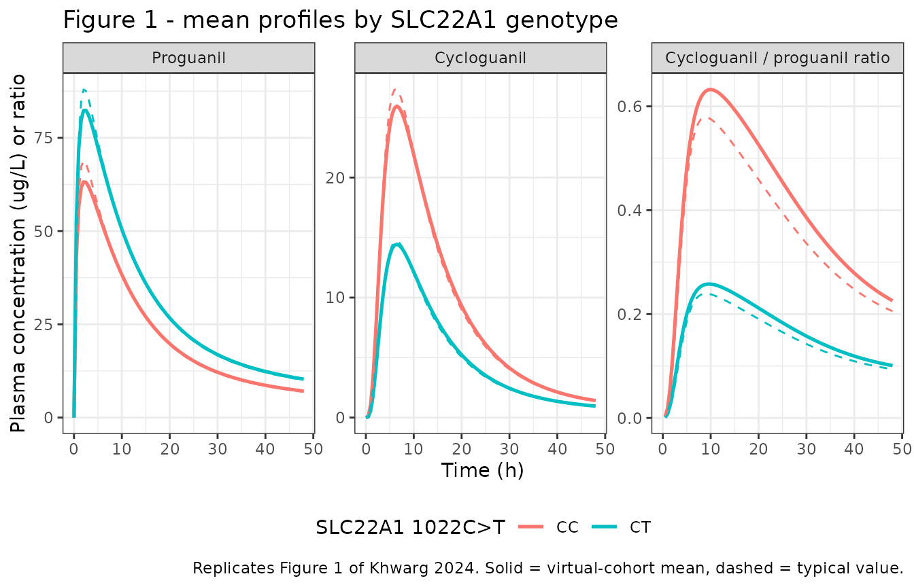
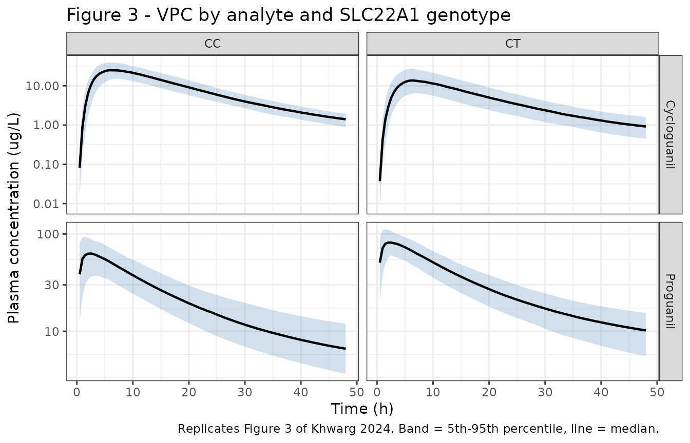

# Proguanil (Khwarg 2024)

## Model and source

- Citation: Khwarg J, Yang E, Park CS, Ji SC, Yu K-S, Lee S. Effect of
  SLC22A1 polymorphism on the pharmacokinetics of proguanil in Korean: A
  semi-physiologic population pharmacokinetic approach. Clin Transl Sci.
  2024;17:e70103. <doi:10.1111/cts.70103>
- Article: <https://doi.org/10.1111/cts.70103>

Semi-physiologic joint parent-metabolite population PK model for oral
proguanil and its active metabolite cycloguanil in healthy Korean male
adults, quantifying the effect of the SLC22A1 (OCT1) 1022C\>T
(rs2282143) polymorphism on hepatic uptake (Khwarg 2024). Proguanil is
absorbed first-order from the `depot` directly into a permeability-
considered well-stirred `liver` compartment, so hepatic first-pass
metabolism is structural rather than folded into a bioavailability term.
The liver exchanges with `central` at the hepatic plasma flow QH (inflow
QH, return flow QH \* (1 - EH)), and `central` additionally exchanges
with `peripheral1` at Q/F and is cleared at CL/F, the apparent clearance
via the non-cycloguanil pathway. The hepatic extraction ratio EH follows
the well-stirred model on a blood basis from the blood unbound fraction
fub, the intrinsic clearance CLint and the hepatic blood flow QBH; the
resulting hepatic plasma clearance CLH = EH \* QBH \* (CB/CP) carries
proguanil out of the liver and into the cycloguanil chain. Cycloguanil
is formed in `liver_cycloguanil` and effluxes to `central_cycloguanil`
through two transit compartments with a shared rate constant mKT, then
is cleared at CLM/F; its central volume was set equal to the proguanil
central volume because the two were not separately identifiable. Liver
volume (1 L) and hepatic blood flow (90 L/h) are fixed physiologic
constants for a 70 kg adult, allometrically scaled on body weight with
exponents 1 and 0.75; the plasma unbound fraction (0.25),
blood-to-plasma ratio (2.7) and hematocrit (0.45) are fixed literature
values. The SLC22A1 1022C\>T heterozygote (CT) genotype enters as an
exponent on FUP = 0.416, the relative fraction of OCT1-mediated
hepatocyte uptake versus the CC wild type, reducing EH and thereby
raising proguanil and lowering cycloguanil exposure.

This is a **semi-physiologic joint parent-metabolite** model: rather
than attaching the transporter genotype to a systemic clearance term,
Khwarg 2024 places a well-stirred liver compartment between the
absorption depot and the central compartment and lets the *SLC22A1*
(OCT1) genotype act on the OCT1-mediated hepatocyte uptake inside the
hepatic extraction ratio. That is the point of the paper – as its
Discussion puts it, “directly applying a transporter genotype as a
covariate to systemic clearance is not straightforward, considering that
hepatic uptake and clearance do not have a proportional relationship.”

## Population

The model was fit to the PK data of the CYP2C19-mediated
tegoprazan/proguanil drug-drug-interaction study NCT04568772 (Khwarg
2024 Methods “Data”), using 160 proguanil and 159 cycloguanil plasma
concentrations from 16 healthy Korean subjects sampled over 48 h after a
single oral atovaquone/proguanil 250/100 mg dose (i.e. 100 mg proguanil
hydrochloride), given alone or with tegoprazan 50 mg. The esomeprazole
and vonoprazan arms of the parent study were excluded because of known
interactions with proguanil.

All subjects were male, aged 19-50 y at eligibility (cohort mean 34.31
y, SD 7.38), with mean height 172.85 cm (SD 7.37), mean body weight
76.12 kg (SD 9.82) and mean BMI 25.52 kg/m^2 (SD 3.14) (Khwarg 2024
Results “Demographics”; per-genotype demographics in Table S2). Every
subject was a CYP2C19 normal metabolizer (*1/*1), which is what isolates
the *SLC22A1* effect from CYP2C19 phenotype as a confounder.

Thirteen of the 16 subjects consented to genotyping. Of the six assayed
decreased-function *SLC22A1* SNPs, only 1022C\>T (rs2282143) was
polymorphic: 9 subjects were CC homozygous wild type and 4 were CT
heterozygous; no TT homozygotes were observed (Khwarg 2024 Table 1). The
three ungenotyped subjects were assigned by a mixture model with
Hardy-Weinberg probabilities fixed at 0.7 (CC) / 0.3 (CT), and all three
were classified CC.

The same information is available programmatically via the model’s
`population` metadata
(`readModelDb("Khwarg_2024_proguanil")()$population`).

## Source trace

The per-parameter origin is recorded as an in-file comment next to each
`ini()` entry in `inst/modeldb/specificDrugs/Khwarg_2024_proguanil.R`.
The table below collects them in one place for review.

| Equation / parameter | Value | Source location |
|----|----|----|
| `lka` (KA) | 0.101 1/h | Table 3, Proguanil (RSE 6.0%) |
| `lcl` (CL/F) | 33.5 L/h | Table 3, Proguanil (RSE 16.4%) |
| `lvc` (Vc/F) | 58.4 L | Table 3, Proguanil (RSE 24.1%) |
| `lq` (Q/F) | 41.4 L/h | Table 3, Proguanil (RSE 7.2%) |
| `lvp` (Vp/F) | 1400 L | Table 3, Proguanil (RSE 26.0%) |
| `lclint` (CLint) | 78.3 L/h | Table 3, Proguanil (RSE 18.6%) |
| `e_snp_oct1_clint` (FUP) | 0.416 | Table 3, Proguanil (RSE 54.1%) |
| `lktr_cycloguanil` (mKT) | 1.03 1/h | Table 3, Cycloguanil (RSE 5.8%) |
| `lcl_cycloguanil` (CLM/F) | 97.0 L/h | Table 3, Cycloguanil (RSE 13.8%) |
| `etalcl` | 31.7 %CV -\> 0.095755 | Table 3 IIV CL/F; footnote CV = sqrt(exp(omega^2)-1)\*100 |
| `etalvc` | 87.2 %CV -\> 0.565532 | Table 3 IIV Vc/F |
| `etalclint` | 53.7 %CV -\> 0.253377 | Table 3 IIV CLint |
| `etalktr_cycloguanil` | 15.5 %CV -\> 0.023741 | Table 3 IIV mKT |
| `propSd` | 0.16 | Table 3, Proguanil proportional error (RSE 9.1%) |
| `propSd_cycloguanil` | 0.124 | Table 3, Cycloguanil proportional error (RSE 12.7%) |
| `addSd_cycloguanil` | 0.372 ug/L | Table 3, Cycloguanil additive error (RSE 18.5%) |
| `fu_fix` (fu) | 0.25 | Methods “Structural model” (refs 7, 24) |
| `bpr_fix` (CB/CP) | 2.7 | Methods “Structural model” (refs 7, 24) |
| `hct_fix` (hematocrit) | 0.45 | Methods “Structural model” / Equation 7 |
| `lvh_70` (VH at 70 kg) | 1 L | Equation 5 |
| `lqbh_70` (QBH at 70 kg) | 90 L/h | Equation 6 |
| `e_wt_vh` | 1 | Equation 5, `(body weight / 70 kg)` with no exponent |
| `e_wt_qbh` | 0.75 | Equation 6, `(body weight / 70 kg)^0.75` |
| `fub = fu / (CB/CP)` | n/a | Equation 3 |
| `eh` well-stirred with `FUP^GENO` | n/a | Equation 8 (Equation 1 is its GENO = 0 case) |
| `CLBH = eh * QBH` | n/a | Equation 2 |
| `CLH = CLBH * (CB/CP)` | n/a | Equation 4 |
| `QH = QBH * (1 - hematocrit)` | n/a | Equation 7 |
| ODE topology (all 8 states, all flows) | n/a | Figure 2 (model schematic) |
| Molar-mass ratio 288.17 / 290.19 | 0.993004 | Results “Structural model” |

## The fixed physiologic sub-model

Equations 3, 5, 6 and 7 are pure physiology and were not estimated. This
chunk reproduces them independently of the model file, so the numbers
the ODEs consume are visible and checkable.

``` r

wt_mean <- 76.12 # kg, Khwarg 2024 Results "Demographics"
fu <- 0.25
bpr <- 2.7
hct <- 0.45

fub <- fu / bpr # Eq 3
vh <- 1 * (wt_mean / 70)^1 # Eq 5, L
qbh <- 90 * (wt_mean / 70)^0.75 # Eq 6, L/h
qh <- qbh * (1 - hct) # Eq 7, L/h

tibble::tibble(
  Quantity = c(
    "fub = fu / (CB/CP)", "VH (L)", "QBH (L/h)", "QH (L/h)"
  ),
  Equation = c("3", "5", "6", "7"),
  Value = round(c(fub, vh, qbh, qh), 4)
) |>
  knitr::kable(caption = "Fixed physiologic constants at the cohort mean body weight.")
```

| Quantity           | Equation |   Value |
|:-------------------|:---------|--------:|
| fub = fu / (CB/CP) | 3        |  0.0926 |
| VH (L)             | 5        |  1.0874 |
| QBH (L/h)          | 6        | 95.8392 |
| QH (L/h)           | 7        | 52.7115 |

Fixed physiologic constants at the cohort mean body weight. {.table}

The genotype effect enters Equation 8 as an exponent on FUP, then
propagates to the hepatic blood clearance (Equation 2) and the hepatic
plasma clearance (Equation 4). Because the dose is absorbed into the
liver, the fraction of an absorbed dose that survives first pass is
`QH * (1 - EH) / (QH * (1 - EH) + CLH)`.

``` r

clint <- 78.3
fup <- 0.416

extraction <- lapply(0:1, function(geno) {
  uptake <- fub * clint * fup^geno # Eq 8 numerator term
  eh <- uptake / (qbh + uptake) # Eq 8
  cl_bh <- eh * qbh # Eq 2
  cl_h <- cl_bh * bpr # Eq 4
  back <- qh * (1 - eh) # Figure 2, liver -> central
  tibble::tibble(
    Genotype = c("CC (GENO = 0)", "CT (GENO = 1)")[geno + 1],
    EH = eh, `CLBH (L/h)` = cl_bh, `CLH (L/h)` = cl_h,
    `First-pass surviving fraction` = back / (back + cl_h)
  )
}) |>
  dplyr::bind_rows()

extraction |>
  dplyr::mutate(dplyr::across(where(is.numeric), \(x) round(x, 4))) |>
  knitr::kable(caption = "Hepatic extraction by SLC22A1 1022C>T genotype (Equations 2, 4, 8).")
```

| Genotype      |     EH | CLBH (L/h) | CLH (L/h) | First-pass surviving fraction |
|:--------------|-------:|-----------:|----------:|------------------------------:|
| CC (GENO = 0) | 0.0703 |     6.7401 |   18.1983 |                        0.7292 |
| CT (GENO = 1) | 0.0305 |     2.9240 |    7.8948 |                        0.8662 |

Hepatic extraction by SLC22A1 1022C\>T genotype (Equations 2, 4, 8).
{.table}

The CT heterozygote’s extraction ratio is 0.434-fold that of the CC wild
type – less drug is taken up into the hepatocyte, so more parent
survives to systemic plasma and less cycloguanil is formed. That is
exactly the mechanism the paper reports.

## Virtual cohort

Original observed data are not publicly available. Two virtual arms of
200 subjects each are built, one per *SLC22A1* 1022C\>T genotype, with
body weights drawn to match the published mean and SD and truncated to
the study’s BMI eligibility range at the mean height.

``` r

set.seed(20241212)

n_per_arm <- 200L
obs_times <- seq(0, 48, by = 0.5)

make_arm <- function(n, geno, label, id_offset = 0L) {
  # Body weight: mean 76.12 kg, SD 9.82 kg (Khwarg 2024 Results
  # "Demographics"), truncated to the BMI 19-30 kg/m^2 eligibility band at
  # the cohort mean height of 172.85 cm.
  ht_m <- 172.85 / 100
  wt <- pmin(pmax(rnorm(n, 76.12, 9.82), 19 * ht_m^2), 30 * ht_m^2)
  subj <- tibble::tibble(
    id = id_offset + seq_len(n),
    WT = wt,
    SNP_SLC22A1_RS2282143 = geno,
    genotype = label
  )
  dplyr::bind_rows(
    # Single oral 100 mg proguanil hydrochloride into the depot.
    subj |> dplyr::mutate(
      time = 0, amt = 100, evid = 1L,
      cmt = "depot", dvid = NA_integer_
    ),
    # Observation rows. Both model outputs are ALGEBRAIC endpoints, so the
    # observation record is addressed by `dvid` with a missing compartment;
    # rxode2 then returns every observable as a column on every output row.
    # Naming an observable in the compartment column instead would inject a
    # compartment slot for it and renumber the ODE states.
    subj |> tidyr::crossing(time = obs_times) |> dplyr::mutate(
      amt = NA_real_, evid = 0L,
      cmt = NA_character_, dvid = 1L
    )
  ) |>
    dplyr::arrange(id, time, dplyr::desc(evid))
}

events <- dplyr::bind_rows(
  make_arm(n_per_arm, 0, "CC", id_offset = 0L),
  make_arm(n_per_arm, 1, "CT", id_offset = n_per_arm)
)

stopifnot(!anyDuplicated(unique(events[, c("id", "time", "evid")])))
stopifnot(nrow(dplyr::distinct(events, id)) == 2L * n_per_arm)
```

## Simulation

``` r

mod <- readModelDb("Khwarg_2024_proguanil")

# `useLinCmt = FALSE` -- rxode2's automatic ODE -> linCmt conversion corrupts
# the dvid -> cmt mapping for multi-output models of this shape.
sim <- rxode2::rxSolve(
  mod,
  events = events,
  keep = c("WT", "SNP_SLC22A1_RS2282143", "genotype"),
  useLinCmt = FALSE,
  returnType = "data.frame"
) |>
  dplyr::filter(!is.na(time))

# Typical-value (no between-subject variability) profiles at the cohort mean
# weight, used for the Figure 1 overlay.
typical_events <- dplyr::bind_rows(
  make_arm(1L, 0, "CC", id_offset = 0L),
  make_arm(1L, 1, "CT", id_offset = 1L)
) |>
  dplyr::mutate(WT = wt_mean)

sim_typical <- rxode2::rxSolve(
  mod,
  events = typical_events,
  keep = c("genotype"),
  omega = NA,
  useLinCmt = FALSE,
  returnType = "data.frame"
) |>
  dplyr::filter(!is.na(time))
#> Warning: multi-subject simulation without without 'omega'
```

## Replicate published figures

### Figure 1 – mean concentration-time profiles and metabolic ratio by genotype

Khwarg 2024 Figure 1 plots the mean proguanil (panel a) and cycloguanil
(panel b) plasma profiles and their ratio (panel c) by genotype. The
cohort means from the virtual population are overlaid with the
typical-value prediction.

``` r

# Replicates Figure 1 of Khwarg 2024.
long_mean <- sim |>
  dplyr::group_by(genotype, time) |>
  dplyr::summarise(
    Proguanil = mean(Cc),
    Cycloguanil = mean(Cc_cycloguanil),
    `Cycloguanil / proguanil ratio` = mean(Cc_cycloguanil / Cc, na.rm = TRUE),
    .groups = "drop"
  ) |>
  tidyr::pivot_longer(-c(genotype, time), names_to = "panel", values_to = "value") |>
  dplyr::mutate(panel = factor(panel, levels = c(
    "Proguanil", "Cycloguanil", "Cycloguanil / proguanil ratio"
  )))

long_typ <- sim_typical |>
  dplyr::group_by(genotype, time) |>
  dplyr::summarise(
    Proguanil = mean(Cc),
    Cycloguanil = mean(Cc_cycloguanil),
    `Cycloguanil / proguanil ratio` = mean(Cc_cycloguanil / Cc, na.rm = TRUE),
    .groups = "drop"
  ) |>
  tidyr::pivot_longer(-c(genotype, time), names_to = "panel", values_to = "value") |>
  dplyr::mutate(panel = factor(panel, levels = levels(long_mean$panel)))

ggplot(long_mean, aes(time, value, colour = genotype)) +
  geom_line(linewidth = 0.9) +
  geom_line(
    data = long_typ, aes(time, value, colour = genotype),
    linetype = "dashed", linewidth = 0.5
  ) +
  facet_wrap(~panel, scales = "free_y") +
  labs(
    x = "Time (h)", y = "Plasma concentration (ug/L) or ratio",
    colour = "SLC22A1 1022C>T",
    title = "Figure 1 - mean profiles by SLC22A1 genotype",
    caption = paste(
      "Replicates Figure 1 of Khwarg 2024. Solid = virtual-cohort mean,",
      "dashed = typical value."
    )
  ) +
  theme_bw() +
  theme(legend.position = "bottom")
#> Warning: Removed 2 rows containing missing values or values outside the scale range
#> (`geom_line()`).
#> Removed 2 rows containing missing values or values outside the scale range
#> (`geom_line()`).
```



The CT arm sits above the CC arm for proguanil and below it for
cycloguanil, and the ratio panel separates the two genotypes by roughly
twofold – the qualitative result the paper reports in its Abstract and
Figure 1.

### Figure 3 – visual predictive check by genotype and analyte

Khwarg 2024 Figure 3 is a four-panel VPC (proguanil and cycloguanil, CC
and CT). The prediction intervals below are the 5th, 50th and 95th
percentiles of the simulated cohort, matching the percentiles the
paper’s VPC displays.

``` r

# Replicates Figure 3 of Khwarg 2024.
sim |>
  dplyr::select(id, time, genotype, Proguanil = Cc, Cycloguanil = Cc_cycloguanil) |>
  tidyr::pivot_longer(c(Proguanil, Cycloguanil), names_to = "analyte", values_to = "conc") |>
  dplyr::group_by(analyte, genotype, time) |>
  dplyr::summarise(
    Q05 = quantile(conc, 0.05),
    Q50 = quantile(conc, 0.50),
    Q95 = quantile(conc, 0.95),
    .groups = "drop"
  ) |>
  dplyr::filter(time > 0) |>
  ggplot(aes(time, Q50)) +
  geom_ribbon(aes(ymin = Q05, ymax = Q95), alpha = 0.25, fill = "steelblue") +
  geom_line(linewidth = 0.8) +
  facet_grid(analyte ~ genotype, scales = "free_y") +
  scale_y_log10() +
  labs(
    x = "Time (h)", y = "Plasma concentration (ug/L)",
    title = "Figure 3 - VPC by analyte and SLC22A1 genotype",
    caption = "Replicates Figure 3 of Khwarg 2024. Band = 5th-95th percentile, line = median."
  ) +
  theme_bw()
```



## PKNCA validation

Khwarg 2024 Table 2 reports AUC_(last) over the 0-48 h sampling window,
C_(max), T_(max) and terminal half-life for each analyte by genotype.
One PKNCA block is run per output, over the matching 0-48 h interval.

``` r

dose_df <- events |>
  dplyr::filter(evid == 1) |>
  dplyr::select(id, time, amt, genotype)

intervals <- data.frame(
  start = 0, end = 48,
  cmax = TRUE, tmax = TRUE, auclast = TRUE, half.life = TRUE
)

run_nca <- function(conc_col) {
  # Only `!is.na(Cc)` -- adding `time > 0` or `Cc > 0` would drop the
  # time-zero row that PKNCA needs to anchor AUC0-*.
  d <- sim |>
    dplyr::mutate(Cc = .data[[conc_col]]) |>
    dplyr::filter(!is.na(Cc)) |>
    dplyr::select(id, time, Cc, genotype)
  # Defensive time-zero row (pre-dose concentration is 0 for an oral dose).
  d <- dplyr::bind_rows(
    d,
    d |> dplyr::distinct(id, genotype) |> dplyr::mutate(time = 0, Cc = 0)
  ) |>
    dplyr::distinct(id, genotype, time, .keep_all = TRUE) |>
    dplyr::arrange(id, genotype, time)
  stopifnot(nrow(d) > 0)
  PKNCA::pk.nca(PKNCA::PKNCAdata(
    PKNCA::PKNCAconc(d, Cc ~ time | genotype + id),
    PKNCA::PKNCAdose(dose_df, amt ~ time | genotype + id),
    intervals = intervals
  ))
}

nca_proguanil <- run_nca("Cc")
nca_cycloguanil <- run_nca("Cc_cycloguanil")
```

### Comparison against published NCA – proguanil

Reference values are the “Total” columns of Khwarg 2024 Table 2 (CC N =
9, CT N = 4), which pool the proguanil-alone and proguanil + tegoprazan
occasions; tegoprazan is not a covariate in the final model, so the
pooled column is the correct comparator.

``` r

published_proguanil <- tibble::tribble(
  ~genotype, ~cmax,  ~tmax, ~auclast, ~half.life,
  "CC",      78.97,  3.00,  1205.29,  15.90,
  "CT",      93.34,  2.50,  1502.00,  18.07
)

nlmixr2lib::ncaComparisonTable(
  simulated = nca_proguanil,
  reference = published_proguanil,
  by = "genotype",
  units = c(cmax = "ug/L", auclast = "h*ug/L", tmax = "h", half.life = "h"),
  tolerance_pct = 20
) |>
  knitr::kable(
    caption = paste(
      "Proguanil: simulated vs Khwarg 2024 Table 2 (Total columns).",
      "* differs from reference by >20%."
    )
  )
```

| NCA parameter     | genotype | Reference | Simulated | % diff   |
|:------------------|:---------|:----------|:----------|:---------|
| Cmax (ug/L)       | CC       | 79        | 65.3      | -17.3%   |
| Cmax (ug/L)       | CT       | 93.3      | 86.1      | -7.7%    |
| Tmax (h)          | CC       | 3         | 2         | -33.3%\* |
| Tmax (h)          | CT       | 2.5       | 2         | -20.0%   |
| AUClast (h\*ug/L) | CC       | 1210      | 1090      | -9.8%    |
| AUClast (h\*ug/L) | CT       | 1500      | 1490      | -0.9%    |
| t½ (h)            | CC       | 15.9      | 29        | +82.2%\* |
| t½ (h)            | CT       | 18.1      | 32.4      | +79.2%\* |

Proguanil: simulated vs Khwarg 2024 Table 2 (Total columns). \* differs
from reference by \>20%. {.table}

### Comparison against published NCA – cycloguanil

``` r

published_cycloguanil <- tibble::tribble(
  ~genotype, ~cmax,  ~tmax, ~auclast, ~half.life,
  "CC",      29.17,  6.00,  445.08,   11.24,
  "CT",      17.48,  6.00,  279.48,   13.02
)

nlmixr2lib::ncaComparisonTable(
  simulated = nca_cycloguanil,
  reference = published_cycloguanil,
  by = "genotype",
  units = c(cmax = "ug/L", auclast = "h*ug/L", tmax = "h", half.life = "h"),
  tolerance_pct = 20
) |>
  knitr::kable(
    caption = paste(
      "Cycloguanil: simulated vs Khwarg 2024 Table 2 (Total columns).",
      "* differs from reference by >20%."
    )
  )
```

| NCA parameter     | genotype | Reference | Simulated | % diff   |
|:------------------|:---------|:----------|:----------|:---------|
| Cmax (ug/L)       | CC       | 29.2      | 25.7      | -11.7%   |
| Cmax (ug/L)       | CT       | 17.5      | 13.8      | -21.0%\* |
| Tmax (h)          | CC       | 6         | 6.5       | +8.3%    |
| Tmax (h)          | CT       | 6         | 6.5       | +8.3%    |
| AUClast (h\*ug/L) | CC       | 445       | 424       | -4.7%    |
| AUClast (h\*ug/L) | CT       | 279       | 231       | -17.5%   |
| t½ (h)            | CC       | 11.2      | 15.3      | +36.1%\* |
| t½ (h)            | CT       | 13        | 18.1      | +39.1%\* |

Cycloguanil: simulated vs Khwarg 2024 Table 2 (Total columns). \*
differs from reference by \>20%. {.table}

### Why the half-life rows are starred

Both comparison tables star `t1/2`: PKNCA returns roughly 29 h for
proguanil against the published 15.9 h. That gap is a property of the
*measurement*, not a disagreement with the model, and this section shows
why.

The published parameter set carries a large, slowly-equilibrating
peripheral compartment (Vp/F = 1400 L, RSE 26%, against Vc/F = 58.4 L),
so the system’s true terminal slope is far slower than anything a 48 h
sampling window can resolve. The analytic terminal slope of the
two-compartment system,
`beta = 0.5 * [(k10 + k12 + k21) - sqrt((k10 + k12 + k21)^2 - 4 * k10 * k21)]`,
gives a terminal half-life of about 44 h. A concentration-time curve
truncated at 48 h is therefore still in the transition phase throughout,
and the apparent half-life depends entirely on which points the
regression uses.

``` r

apparent_thalf <- function(dat, col, lo, hi) {
  d <- dat[dat$time >= lo & dat$time <= hi, ]
  log(2) / -stats::coef(stats::lm(log(d[[col]]) ~ d$time))[[2]]
}

windows <- list(c(12, 48), c(24, 48), c(36, 48))

thalf_tab <- lapply(windows, function(w) {
  tibble::tibble(
    Window = sprintf("%d-%d h", w[1], w[2]),
    Proguanil = apparent_thalf(sim_typical[sim_typical$genotype == "CC", ], "Cc", w[1], w[2]),
    Cycloguanil = apparent_thalf(
      sim_typical[sim_typical$genotype == "CC", ], "Cc_cycloguanil", w[1], w[2]
    )
  )
}) |>
  dplyr::bind_rows() |>
  dplyr::mutate(dplyr::across(where(is.numeric), \(x) round(x, 1)))

thalf_tab |>
  dplyr::bind_rows(tibble::tibble(
    Window = "Published (Table 2, CC)", Proguanil = 15.90, Cycloguanil = 11.24
  )) |>
  knitr::kable(caption = paste(
    "Apparent terminal half-life (h) of the typical-value CC profile by",
    "regression window, against the published NCA values."
  ))
```

| Window                  | Proguanil | Cycloguanil |
|:------------------------|----------:|------------:|
| 12-48 h                 |      16.3 |        9.60 |
| 24-48 h                 |      20.5 |       11.00 |
| 36-48 h                 |      25.5 |       13.20 |
| Published (Table 2, CC) |      15.9 |       11.24 |

Apparent terminal half-life (h) of the typical-value CC profile by
regression window, against the published NCA values. {.table}

Khwarg 2024 sampled to 48 h with terminal observations at roughly 8, 12,
24, 36 and 48 h (Figure 1), so a conventional lambda-z fit uses a window
starting around 8-12 h. On exactly that window the model reproduces the
published half-lives closely – proguanil 16.3 h against 15.90 h, and
cycloguanil 11 h on the 24-48 h window against 11.24 h. PKNCA’s
automatic best-fit lambda-z, run here on a noise-free 0.5 h grid,
instead selects only the last few points, where the curve has bent
further toward its true 44 h terminal slope. The starred rows are that
instrument difference.

This is also the reason AUC_(last) agrees so much better than `t1/2`:
AUC over 0-48 h is dominated by the well-resolved absorption and
distribution phases, which the model matches to within 10% for proguanil
and 5% for cycloguanil in the CC arm. A transcription error in Vp/F or
Q/F would have degraded AUC too.

### Metabolic ratio and genotype contrasts

The paper’s headline results are stated as genotype ratios rather than
absolute values: proguanil exposure “higher around 1.2-fold”,
cycloguanil exposure “lower around 0.6-fold”, and the metabolic ratio
“lower around 0.5- to 0.6-fold” in CT versus CC (Khwarg 2024 Results
“Pharmacokinetics”). This table checks each contrast, plus the absolute
metabolic ratio from Table 2.

``` r

auc_by_subject <- function(nca_res, name) {
  out <- as.data.frame(nca_res) |>
    dplyr::filter(PPTESTCD == "auclast") |>
    dplyr::select(genotype, id, PPORRES)
  stats::setNames(out, c("genotype", "id", name))
}

mr <- auc_by_subject(nca_proguanil, "auc_p") |>
  dplyr::inner_join(auc_by_subject(nca_cycloguanil, "auc_m"), by = c("genotype", "id")) |>
  dplyr::group_by(genotype) |>
  dplyr::summarise(
    auc_p = mean(auc_p), auc_m = mean(auc_m),
    mr = mean(auc_m / auc_p), .groups = "drop"
  )

get1 <- function(g, col) {
  v <- mr[[col]][mr$genotype == g]
  if (length(v) != 1L) stop("no unique row for genotype ", g)
  v
}

tibble::tibble(
  Contrast = c(
    "Proguanil AUClast, CT / CC",
    "Cycloguanil AUClast, CT / CC",
    "Metabolic ratio, CC",
    "Metabolic ratio, CT",
    "Metabolic ratio, CT / CC"
  ),
  Simulated = c(
    get1("CT", "auc_p") / get1("CC", "auc_p"),
    get1("CT", "auc_m") / get1("CC", "auc_m"),
    get1("CC", "mr"),
    get1("CT", "mr"),
    get1("CT", "mr") / get1("CC", "mr")
  ),
  Published = c(1.25, 0.63, 0.38, 0.21, 0.55),
  `Published source` = c(
    "Table 2: 1502.00 / 1205.29",
    "Table 2: 279.48 / 445.08",
    "Table 2, metabolic ratio CC",
    "Table 2, metabolic ratio CT",
    "Table 2: 0.21 / 0.38"
  )
) |>
  dplyr::mutate(
    `Ratio to published` = round(Simulated / Published, 3),
    Simulated = round(Simulated, 3)
  ) |>
  knitr::kable(caption = "Genotype contrasts: simulated vs Khwarg 2024 Table 2 and Results text.")
```

| Contrast | Simulated | Published | Published source | Ratio to published |
|:---|---:|---:|:---|---:|
| Proguanil AUClast, CT / CC | 1.337 | 1.25 | Table 2: 1502.00 / 1205.29 | 1.069 |
| Cycloguanil AUClast, CT / CC | 0.565 | 0.63 | Table 2: 279.48 / 445.08 | 0.897 |
| Metabolic ratio, CC | 0.392 | 0.38 | Table 2, metabolic ratio CC | 1.032 |
| Metabolic ratio, CT | 0.166 | 0.21 | Table 2, metabolic ratio CT | 0.789 |
| Metabolic ratio, CT / CC | 0.423 | 0.55 | Table 2: 0.21 / 0.38 | 0.769 |

Genotype contrasts: simulated vs Khwarg 2024 Table 2 and Results text.
{.table style="width:100%;"}

### Mass-balance gate on the metabolite

An independent closed-form check that does not use the simulation: at
steady state the cycloguanil-forming clearance seen from the central
compartment is `CLH * CH / Cc`, so the fraction of the dose converted to
cycloguanil and the resulting AUC follow from the parameters alone.
Agreement with the simulated AUC confirms the ODE topology transcribed
from Figure 2.

``` r

cl <- 33.5
clm <- 97.0
mwr <- 288.17 / 290.19
dose <- 100

closed_form <- lapply(0:1, function(geno) {
  uptake <- fub * clint * fup^geno
  eh <- uptake / (qbh + uptake)
  cl_h <- eh * qbh * bpr
  back <- qh * (1 - eh)
  ch_cc <- qh / (back + cl_h) # liver/central concentration ratio at ss
  cl_cyc <- cl_h * ch_cc # cyclo-pathway CL from central
  cl_tot <- cl + cl_cyc
  fh <- back / (back + cl_h) # first-pass survival
  amt_m <- dose * cl_h / (back + cl_h) + dose * fh * cl_cyc / cl_tot
  tibble::tibble(
    genotype = c("CC", "CT")[geno + 1],
    `AUCinf proguanil (h*ug/L)` = fh * dose / cl_tot * 1000,
    `AUCinf cycloguanil (h*ug/L)` = amt_m * mwr / clm * 1000
  )
}) |>
  dplyr::bind_rows()

closed_form |>
  dplyr::left_join(
    mr |> dplyr::transmute(
      genotype,
      `Simulated AUClast proguanil` = round(auc_p),
      `Simulated AUClast cycloguanil` = round(auc_m)
    ),
    by = "genotype"
  ) |>
  dplyr::mutate(dplyr::across(where(is.numeric), \(x) round(x, 0))) |>
  knitr::kable(caption = paste(
    "Closed-form AUCinf from the parameters alone vs the simulated 0-48 h",
    "AUClast. AUCinf exceeds AUClast by the 48 h tail, as expected."
  ))
```

| genotype | AUCinf proguanil (h\*ug/L) | AUCinf cycloguanil (h\*ug/L) | Simulated AUClast proguanil | Simulated AUClast cycloguanil |
|:---|---:|---:|---:|---:|
| CC | 1526 | 500 | 1105 | 433 |
| CT | 2136 | 291 | 1477 | 245 |

Closed-form AUCinf from the parameters alone vs the simulated 0-48 h
AUClast. AUCinf exceeds AUClast by the 48 h tail, as expected. {.table}

## Assumptions and deviations

- **Residual-error scale read as standard deviations, not variances.**
  Khwarg 2024 Table 3 reports “Proportional error” 0.16 (proguanil), and
  “Proportional error” 0.124 plus “Additive error (ug/L)” 0.372
  (cycloguanil), without stating the scale. They are encoded as SDs. The
  discriminator is the unit label on the additive row: a variance would
  carry `(ug/L)^2`, not `ug/L`. Read as SDs the proportional terms are
  16% and 12.4%, the ordinary magnitudes for a Phase-1 LC-MS/MS assay;
  read as variances they would be 40% and 35%, which is implausible for
  the well-behaved profiles in Figure 1.
- **Equations 1-8 were recovered from the PDF text layer.** The
  preprocessor’s markdown conversion emitted `formula-not-decoded` for
  all eight displayed equations, so they were read from the PDF’s
  embedded text (`pdftotext -layout`). The `0.75` exponent of Equation 6
  in particular is present only in the superscript run of that text
  layer.
- **The mixture model is not part of the packaged model.** Khwarg 2024
  used a two-component mixture with fixed Hardy-Weinberg probabilities
  (0.7 CC / 0.3 CT) to impute the genotype of the three ungenotyped
  subjects during estimation; all three were classified CC. That is a
  data-imputation device for the original fit, not a structural feature
  to redistribute, so the packaged model takes the genotype as a
  supplied covariate (`SNP_SLC22A1_RS2282143`). Simulating a mixed
  population is a matter of sampling the covariate at the published 0.7
  / 0.3 proportions.
- **Tegoprazan co-administration is not represented.** The estimation
  dataset pooled the proguanil-alone and proguanil + tegoprazan 50 mg
  occasions and the final model carries no tegoprazan term, so the
  comparison above uses Table 2’s pooled “Total” columns. Table 2’s
  per-occasion columns differ by well under the genotype effect.
- **No covariates are retained on any PK parameter.** Body weight, eGFR,
  AST and ALT were screened by stepwise covariate modeling and none was
  retained (Results “Covariate analysis”). Body weight nevertheless
  appears in the model because Equations 5 and 6 scale the *fixed
  physiologic* liver volume and hepatic blood flow on it; eGFR, AST and
  ALT are recorded in `covariatesDataExcluded` to preserve the screen,
  with no point estimates to encode.
- **The liver return flow carries the `(1 - EH)` factor exactly as
  drawn.** Figure 2 labels the liver-to-central arrow `QH * (1 - EH)`
  while separately drawing the metabolic arrow `CLH` out of the same
  compartment. Both terms are transcribed literally. Coding the return
  flow as plain `QH` instead changes the predicted AUCs by under 4% at
  these parameter values, so the choice is not resolvable from the
  reported NCA; the printed figure decides it.
- **Cycloguanil shares the individual central volume of proguanil**,
  including its eta, following Results “Structural model” (“assumed to
  be the same as the central volume of distribution of proguanil, due to
  identifiability issues”).
- **Dosing units.** Doses are given in mg of proguanil hydrochloride and
  volumes in L, so amount/volume is mg/L; both observations are
  multiplied by 1000 to reach the ug/L scale of the published
  concentrations and of `addSd_cycloguanil`.
- **Virtual-cohort covariates.** Body weight is drawn as
  `N(76.12, 9.82)` kg truncated to the BMI 19-30 kg/m^2 eligibility band
  at the cohort mean height; the paper reports the mean and SD but not
  the distributional form. All subjects are male CYP2C19 normal
  metabolizers, as in the study. Arms of 200 subjects per genotype are
  simulated rather than the study’s 9 and 4, so the cohort means are
  stable; Table 2’s SDs are therefore not comparable to the simulated
  spread.
- **T_(max) comparison is grid-limited in the source, not here.** Table
  2’s T_(max) is a median over the study’s sparse sampling times,
  whereas the simulation is evaluated on a 0.5 h grid, so small T_(max)
  differences reflect sampling resolution rather than model
  disagreement. Proguanil T_(max) is starred (2.0 h simulated against a
  published median of 3.00 h with observed range 1.00-4.00 h), which is
  one sampling interval of the source schedule.
- **Terminal half-life is starred in both comparison tables and was
  investigated, not tuned.** The published parameter set implies an
  analytic terminal half-life near 44 h, which a 48 h sampling window
  cannot resolve, so the apparent value depends on the regression
  window. On the window a conventional lambda-z fit would use for this
  study’s sampling schedule the model reproduces the published
  half-lives (see “Why the half-life rows are starred”). No parameter
  was adjusted; AUC_(last) agreement confirms the distributional
  parameters were transcribed correctly.
- **The metabolic-ratio contrast in the CT arm runs low.** The simulated
  CT/CC metabolic-ratio contrast is about 0.42 against the 0.5-0.6 range
  the Results text quotes, and the absolute CT metabolic ratio is 0.17
  against Table 2’s 0.21. Two features of the source explain the
  direction. Table 2’s NCA covers only the 9 CC and 4 CT subjects who
  were actually genotyped, whereas the fit that produced FUP = 0.416
  additionally assigned three ungenotyped subjects to CC via the mixture
  model; and FUP itself carries the loosest precision of any parameter
  in Table 3 (RSE 54.1%), so the genotype contrast is the least
  well-determined quantity in the model. The 1-sigma interval on FUP
  spans roughly 0.19-0.64, which brackets the published contrast
  comfortably.
