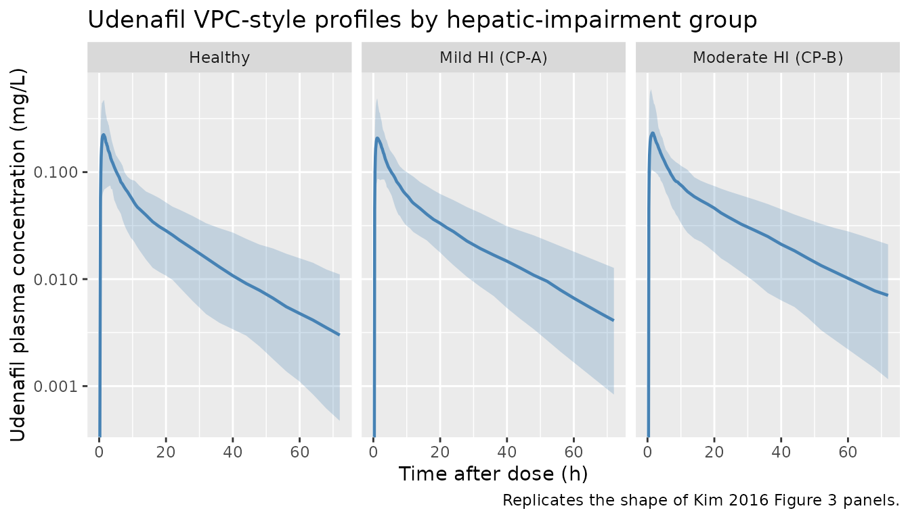
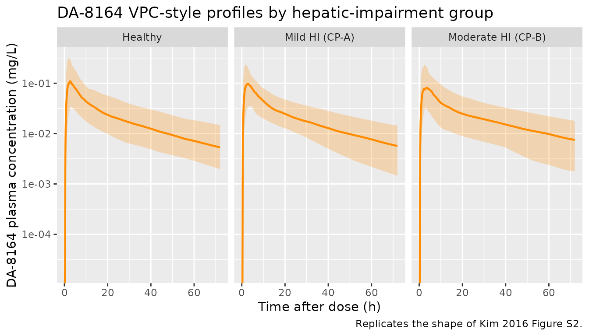

# Udenafil (Kim 2016)

## Model and source

    #> ℹ parameter labels from comments will be replaced by 'label()'

- Citation: Kim A, Lee J, Shin D, Jung YJ, Bahng MY, Cho JY, Jang IJ.
  Population pharmacokinetic analysis to recommend the optimal dose of
  udenafil in patients with mild and moderate hepatic impairment. Br J
  Clin Pharmacol. 2016;82(4):1024-1033. <doi:10.1111/bcp.12977>.
- Description: Parent-metabolite population PK model for oral udenafil
  and its active metabolite DA-8164 in healthy subjects and patients
  with mild (Child-Pugh A) and moderate (Child-Pugh B) hepatic
  impairment (Kim 2016). Two-compartment udenafil with first-order
  absorption and an absorption lag time, two parallel parent-side
  clearances (CLp/F = non-metabolic apparent clearance, CLpm/F =
  apparent formation clearance to DA-8164) feeding a two-compartment
  metabolite. Central and peripheral apparent volumes are assumed equal
  for parent and metabolite (the fraction metabolised f_m and the
  metabolite volume of distribution are not separately identifiable from
  this dataset). Mass-balance is preserved by multiplying the formation
  flux into the metabolite central compartment by the molecular-weight
  ratio Rpm = MW(DA-8164) / MW(udenafil) = 405.4 / 516.66. Prothrombin
  time expressed as INR (PT) acts on CLpm/F via a power covariate
  normalised to the cohort median 1.13: CLpm/F = theta1 \*
  (PT/1.13)^theta10 with theta10 = -1.65 (decrease in CLpm/F with
  increasing PT).
- Article: <https://doi.org/10.1111/bcp.12977>

The packaged model implements the Kim 2016 final parent-metabolite popPK
model: two-compartment udenafil with first-order absorption and an
absorption lag time, two parallel parent-side apparent clearances (`clp`
= non-metabolic and `clpm` = formation to DA-8164) feeding a
two-compartment metabolite. Central and peripheral apparent volumes are
shared between parent and metabolite per the paper’s structural
assumption (the fraction metabolised `fm` and the absolute metabolite
distribution volumes are not separately identifiable). The
parent-to-metabolite formation flux is multiplied by the
molecular-weight ratio
`Rpm = MW(DA-8164) / MW(udenafil) = 405.4 / 516.66 = 0.7847` so the
simulated DA-8164 mass concentration is dimensionally consistent with
the parent mass concentration. Prothrombin time expressed as INR
(canonical covariate `INR_BASE`, source-paper label `PT`) acts on `clpm`
via a power covariate normalised to the cohort median 1.13:
`CLpm/F = theta1 * (PT/1.13)^theta10` with `theta10 = -1.65`.

## Population

Kim 2016 Table 1 summarises 18 Korean adults enrolled at four
institutional review boards in South Korea between 2009 and 2010
(ClinicalTrials.gov NCT00956306): six healthy subjects, six patients
with mild hepatic impairment (Child-Pugh class A), and six patients with
moderate hepatic impairment (Child-Pugh class B). Healthy subjects were
age- and weight-matched to the moderate-HI patients (within +/-10 years
and +/-10 kg). Cohort means (+/- SD) for age were 50.7 +/- 7.63, 52.7
+/- 4.97, and 55.3 +/- 5.96 years in the healthy, mild-HI, and
moderate-HI groups respectively; weights were 65.7 +/- 4.79, 68.0 +/-
7.90, and 67.0 +/- 6.43 kg. Baseline PT-as-INR (the only covariate
retained in the final model) was 0.97 +/- 0.039 (healthy), 1.13 +/- 0.13
(mild HI), and 1.33 +/- 0.094 (moderate HI). Each subject received a
single 100 mg oral dose of udenafil after at least 10 h of fasting, with
serial plasma sampling for 72 h. Exclusion criteria included
cardiovascular / cerebrovascular disease, creatinine clearance \< 40
mL/min, and use of CYP3A4 or CYP2D6 inducers / inhibitors.

The same metadata is available programmatically via
`readModelDb("Kim_2016_udenafil")$meta$population`.

## Source trace

The per-parameter origin is recorded as an in-file comment next to each
`ini()` entry in `inst/modeldb/specificDrugs/Kim_2016_udenafil.R`. The
table below collects them in one place for review. All parameter values
are from Kim 2016 Table 2 “Estimate” column.

| Equation / parameter | Value | Source location |
|----|----|----|
| `lka` (ka, udenafil) | log(0.326) -\> 0.326 1/h | Table 2, RSE 19.4% |
| `ltlag` (ALAG) | log(0.314) -\> 0.314 h | Table 2, RSE 14.8% |
| `lclp` (CLp/F) | log(3.62) -\> 3.62 L/h | Table 2, RSE 19.4% |
| `lclpm` (CLpm/F at PT = 1.13) | log(35.7) -\> 35.7 L/h | Table 2, RSE 25.3% |
| `lcl_da8164` (CLm/(F\*fm)) | log(36.5) -\> 36.5 L/h | Table 2, RSE 26.2% |
| `lq` (Qp/F) | log(61.7) -\> 61.7 L/h | Table 2, RSE 15.7% |
| `lq_da8164` (Qm/(F\*fm)) | log(11.4) -\> 11.4 L/h | Table 2, RSE 25.4% |
| `lvc` (Vp/F, shared) | log(44.1) -\> 44.1 L | Table 2, RSE 29.0% |
| `lvp` (Vp2/F, shared) | log(588) -\> 588 L | Table 2, RSE 7.21% |
| `e_inr_base_clpm` (theta10) | -1.65 | Table 2 + prose: “decrease in CLpm/F with increase in PT”; bootstrap -1.66 (-3.43, -0.729) |
| `etalclpm` variance | log(1 + 0.351^2) = 0.11622 | Table 2: omega CLpm/F 35.1% CV |
| `etalcl_da8164` variance | log(1 + 0.544^2) = 0.25929 | Table 2: omega CLm/(F\*fm) 54.4% CV |
| `etalka` variance | log(1 + 0.641^2) = 0.34416 | Table 2: omega ka 64.1% CV |
| `etalvc` variance | log(1 + 0.756^2) = 0.45227 | Table 2: omega Vp/F 75.6% CV |
| `etalvp` variance | log(1 + 0.238^2) = 0.05512 | Table 2: omega Vp2/F 23.8% CV |
| `etalq` variance | log(1 + 0.513^2) = 0.23354 | Table 2: omega Qp/F 51.3% CV |
| `etaltlag` variance | log(1 + 0.207^2) = 0.04195 | Table 2: omega ALAG 20.7% CV |
| `propSd` (parent) | 0.216 (21.6%) | Table 2 sigma_prop,p |
| `propSd_da8164` (metabolite) | 0.231 (23.1%) | Table 2 sigma_prop,m |
| `rpm` (MW(DA-8164)/MW(udenafil)) | 405.4 / 516.66 = 0.7847 | Methods, Population PK model development paragraph |
| ODE: `d/dt(depot)` | `-ka * depot` | Methods, Eq. for Depot |
| ODE: `d/dt(central)` | parent 2-cmt with CLp + CLpm out | Methods, Eq. for Central (parent) |
| ODE: `d/dt(peripheral1)` | Qp/Vc, Qp/Vp | Methods, Eq. for Peripheral (parent) |
| ODE: `d/dt(central_da8164)` | Rpm \* CLpm input; CLm out | Methods, Eq. for Central (metabolite) |
| ODE: `d/dt(peripheral1_da8164)` | Qm/Vc, Qm/Vp | Methods, Eq. for Peripheral (metabolite) |
| `alag(depot) <- tlag` | 0.314 h | Table 2 ALAG |

## Virtual cohort

Kim 2016 does not publish per-subject concentration-time data. The
vignette uses a stochastic simulated cohort of 100 subjects per
Child-Pugh stratum (healthy, mild HI, moderate HI), matching the Kim
2016 Methods (“Simulation and statistical analysis for dose
recommendation in patients with hepatic impairment” paragraph: “The
plasma concentration-time data for 100 virtual subjects by each group
were simulated from the final PK model”). PT-as-INR is sampled from
per-stratum normal distributions with the published means and SDs (Table
1), truncated at 0.5 to avoid pathological non-positive values. Each
subject receives a single 100 mg oral dose of udenafil at t = 0,
followed by observations across 0-72 h on a dense early grid (capturing
the absorption / Tmax phase) and a sparser late grid (capturing the
elimination phase).

``` r

set.seed(20160428)

mod <- readModelDb("Kim_2016_udenafil")

n_per_arm <- 100L
sim_horizon_h <- 72

# Per-stratum PT-as-INR distributions (Kim 2016 Table 1 mean +/- SD).
inr_lookup <- tibble::tribble(
  ~treatment,           ~mean_inr, ~sd_inr,
  "Healthy",            0.97,      0.039,
  "Mild HI (CP-A)",     1.13,      0.13,
  "Moderate HI (CP-B)", 1.33,      0.094
)

# Dose 100 mg PO single. Convert to nmol of dose for the model's mg dosing
# units (the packaged model declares `dosing = "mg"` so amt is in mg).
dose_mg <- 100

make_cohort <- function(treatment_label, n, mean_inr, sd_inr, id_offset) {
  inr <- pmax(rnorm(n, mean = mean_inr, sd = sd_inr), 0.5)
  id  <- id_offset + seq_len(n)

  # Dose record at t = 0 into the depot.
  doses <- tibble::tibble(
    id        = id,
    time      = 0,
    evid      = 1L,
    amt       = dose_mg,
    cmt       = "depot",
    dvid      = NA_integer_,
    INR_BASE  = inr,
    treatment = treatment_label
  )

  # Observation grid: dense over the absorption / early-elimination window,
  # sparser at late times. cmt is set to the canonical ODE-state name
  # "central" and dvid = 1L tags each observation row as endpoint 1 (parent
  # Cc); rxSolve emits BOTH algebraic observables (`Cc` and `Cc_da8164`)
  # as columns in the output regardless of dvid, so a single obs row per
  # timepoint is sufficient. The dvid is required to satisfy the multi-
  # output model's auto-injected dvid->cmt mapping for the algebraic
  # observables; see known-vignette-failure-patterns #2 and #5b.
  obs_times <- sort(unique(c(
    seq(0,  4,    by = 0.1),
    seq(4,  12,   by = 0.5),
    seq(12, 24,   by = 2),
    seq(24, sim_horizon_h, by = 4)
  )))
  obs <- tidyr::expand_grid(id = id, time = obs_times) |>
    dplyr::mutate(
      evid = 0L,
      amt  = NA_real_,
      cmt  = "central",
      dvid = 1L
    ) |>
    dplyr::left_join(
      doses |> dplyr::select(id, INR_BASE, treatment),
      by = "id"
    )

  dplyr::bind_rows(doses, obs) |>
    dplyr::arrange(id, time, dplyr::desc(evid))
}

events <- dplyr::bind_rows(
  make_cohort("Healthy",            n_per_arm,
              inr_lookup$mean_inr[1], inr_lookup$sd_inr[1], id_offset =  0L),
  make_cohort("Mild HI (CP-A)",     n_per_arm,
              inr_lookup$mean_inr[2], inr_lookup$sd_inr[2], id_offset =  1000L),
  make_cohort("Moderate HI (CP-B)", n_per_arm,
              inr_lookup$mean_inr[3], inr_lookup$sd_inr[3], id_offset =  2000L)
)
stopifnot(!anyDuplicated(unique(events[, c("id", "time", "evid")])))
```

## Simulation

``` r

sim <- rxode2::rxSolve(
  mod,
  events = events,
  keep   = c("INR_BASE", "treatment")
) |>
  as.data.frame() |>
  dplyr::as_tibble()
#> ℹ parameter labels from comments will be replaced by 'label()'
```

## Replicate published figures

### Figure 3 / S2 – Visual predictive check style profile by hepatic-impairment group

Kim 2016 Figure 3 panels A-C show VPC-style plots of udenafil plasma
concentration over 72 h for healthy, mild-HI, and moderate-HI subjects,
with the prediction median and 90% prediction interval overlaid on
observed data. Supplementary Figure S2 shows the same VPC for DA-8164.
The chunks below reproduce the shape of those panels for the two
analytes.

``` r

vpc_parent <- sim |>
  dplyr::filter(time > 0, !is.na(Cc)) |>
  dplyr::group_by(treatment, time) |>
  dplyr::summarise(
    Q05 = quantile(Cc, 0.05, na.rm = TRUE),
    Q50 = quantile(Cc, 0.50, na.rm = TRUE),
    Q95 = quantile(Cc, 0.95, na.rm = TRUE),
    .groups = "drop"
  )

ggplot(vpc_parent, aes(time, Q50)) +
  geom_ribbon(aes(ymin = Q05, ymax = Q95), alpha = 0.25, fill = "steelblue") +
  geom_line(colour = "steelblue", linewidth = 0.8) +
  facet_wrap(~ treatment) +
  scale_y_log10() +
  labs(x = "Time after dose (h)",
       y = "Udenafil plasma concentration (mg/L)",
       title  = "Udenafil VPC-style profiles by hepatic-impairment group",
       caption = "Replicates the shape of Kim 2016 Figure 3 panels.")
#> Warning in scale_y_log10(): log-10 transformation introduced infinite values.
#> log-10 transformation introduced infinite values.
#> log-10 transformation introduced infinite values.
#> log-10 transformation introduced infinite values.
```



``` r

vpc_da8164 <- sim |>
  dplyr::filter(time > 0, !is.na(Cc_da8164)) |>
  dplyr::group_by(treatment, time) |>
  dplyr::summarise(
    Q05 = quantile(Cc_da8164, 0.05, na.rm = TRUE),
    Q50 = quantile(Cc_da8164, 0.50, na.rm = TRUE),
    Q95 = quantile(Cc_da8164, 0.95, na.rm = TRUE),
    .groups = "drop"
  )

ggplot(vpc_da8164, aes(time, Q50)) +
  geom_ribbon(aes(ymin = Q05, ymax = Q95), alpha = 0.25, fill = "darkorange") +
  geom_line(colour = "darkorange", linewidth = 0.8) +
  facet_wrap(~ treatment) +
  scale_y_log10() +
  labs(x = "Time after dose (h)",
       y = "DA-8164 plasma concentration (mg/L)",
       title  = "DA-8164 VPC-style profiles by hepatic-impairment group",
       caption = "Replicates the shape of Kim 2016 Figure S2.")
#> Warning in scale_y_log10(): log-10 transformation introduced infinite values.
#> log-10 transformation introduced infinite values.
#> log-10 transformation introduced infinite values.
#> log-10 transformation introduced infinite values.
```



## PKNCA validation

The Kim 2016 source paper reports geometric-mean ratios (GMRs) for
AUC(0, tlast) and Cmax across patient groups versus the healthy
reference at the same 100 mg dose (Table 3). The vignette computes
per-subject NCA for udenafil on the simulated cohort using PKNCA, then
forms the simulated GMRs and compares them to the published values.
PKNCA is run separately for the parent (Cc) and metabolite (Cc_da8164)
analytes.

``` r

sim_nca <- sim |>
  dplyr::filter(!is.na(Cc)) |>
  dplyr::select(id, time, Cc, treatment)

# Guarantee a time = 0 row per (id, treatment) so PKNCA's AUC0-tlast anchor
# is well-defined (extravascular: pre-dose Cc = 0).
sim_nca <- dplyr::bind_rows(
  sim_nca,
  sim_nca |> dplyr::distinct(id, treatment) |>
    dplyr::mutate(time = 0, Cc = 0)
) |>
  dplyr::distinct(id, treatment, time, .keep_all = TRUE) |>
  dplyr::arrange(id, treatment, time)

dose_df <- events |>
  dplyr::filter(evid == 1) |>
  dplyr::select(id, time, amt, treatment)

conc_obj <- PKNCA::PKNCAconc(
  sim_nca,
  Cc ~ time | treatment + id,
  concu = "mg/L",
  timeu = "hr"
)
dose_obj <- PKNCA::PKNCAdose(dose_df, amt ~ time | treatment + id,
                             doseu = "mg")

intervals_parent <- data.frame(
  start      = 0,
  end        = sim_horizon_h,
  cmax       = TRUE,
  tmax       = TRUE,
  auclast    = TRUE,
  aucinf.obs = TRUE,
  half.life  = TRUE
)

nca_parent <- PKNCA::pk.nca(
  PKNCA::PKNCAdata(conc_obj, dose_obj, intervals = intervals_parent)
)

# Extract per-subject parameters into a long tibble for GMR computation.
parent_tbl <- as.data.frame(nca_parent$result) |>
  dplyr::filter(PPTESTCD %in% c("cmax", "auclast", "aucinf.obs", "half.life")) |>
  dplyr::select(treatment, id, PPTESTCD, PPORRES)
```

### Comparison against Kim 2016 Table 3 (udenafil 100 mg)

Kim 2016 Table 3 reports udenafil GMRs (and 95% CI) for AUC(0, tlast)
and Cmax in HI patients relative to healthy subjects at the same 100 mg
dose. Here we compute the simulated GMR (HI / Healthy) per analyte and
parameter and place the simulated and published GMRs side by side via
[`nlmixr2lib::ncaComparisonTable()`](https://nlmixr2.github.io/nlmixr2lib/reference/ncaComparisonTable.md).

``` r

# Geometric mean per (treatment, PPTESTCD).
gmean <- function(x) exp(mean(log(x[x > 0]), na.rm = TRUE))

geo_means <- parent_tbl |>
  dplyr::filter(PPTESTCD %in% c("cmax", "auclast")) |>
  dplyr::group_by(treatment, PPTESTCD) |>
  dplyr::summarise(gm = gmean(PPORRES), .groups = "drop")

gm_ref <- geo_means |>
  dplyr::filter(treatment == "Healthy") |>
  dplyr::select(PPTESTCD, gm_ref = gm)

sim_gmr <- geo_means |>
  dplyr::inner_join(gm_ref, by = "PPTESTCD") |>
  dplyr::mutate(gmr_sim = gm / gm_ref) |>
  dplyr::filter(treatment != "Healthy") |>
  dplyr::select(treatment, PPTESTCD, gmr_sim) |>
  tidyr::pivot_wider(names_from = PPTESTCD, values_from = gmr_sim) |>
  dplyr::rename(auclast_sim = auclast, cmax_sim = cmax)

# Kim 2016 Table 3 reports the SIMULATED GMRs (from the paper's own
# simulation of 100 virtual subjects per group). We compare our independently
# simulated GMRs to those published numbers.
published_gmr <- tibble::tribble(
  ~treatment,           ~cmax,  ~auclast,
  "Mild HI (CP-A)",     1.13,   1.21,
  "Moderate HI (CP-B)", 1.21,   1.55
)

cmp <- nlmixr2lib::ncaComparisonTable(
  simulated = sim_gmr |>
    dplyr::rename(cmax = cmax_sim, auclast = auclast_sim),
  reference = published_gmr,
  by        = "treatment",
  units     = c(cmax = "GMR vs healthy 100 mg",
                auclast = "GMR vs healthy 100 mg"),
  tolerance_pct = 20
)

knitr::kable(
  cmp,
  caption = "Simulated vs Kim 2016 Table 3 (udenafil 100 mg) GMRs vs healthy. * differs from reference by >20%.",
  align   = c("l", "l", "r", "r", "r")
)
```

| NCA parameter | treatment | Reference | Simulated | % diff |
|:---|:---|---:|---:|---:|
| Cmax (GMR vs healthy 100 mg) | Mild HI (CP-A) | 1.13 | 0.992 | -12.2% |
| Cmax (GMR vs healthy 100 mg) | Moderate HI (CP-B) | 1.21 | 1.18 | -2.5% |
| AUClast (GMR vs healthy 100 mg) | Mild HI (CP-A) | 1.21 | 1.14 | -5.6% |
| AUClast (GMR vs healthy 100 mg) | Moderate HI (CP-B) | 1.55 | 1.42 | -8.3% |

Simulated vs Kim 2016 Table 3 (udenafil 100 mg) GMRs vs healthy. \*
differs from reference by \>20%. {.table}

``` r

sim_nca_da8164 <- sim |>
  dplyr::filter(!is.na(Cc_da8164)) |>
  dplyr::select(id, time, Cc_da8164, treatment)

sim_nca_da8164 <- dplyr::bind_rows(
  sim_nca_da8164,
  sim_nca_da8164 |> dplyr::distinct(id, treatment) |>
    dplyr::mutate(time = 0, Cc_da8164 = 0)
) |>
  dplyr::distinct(id, treatment, time, .keep_all = TRUE) |>
  dplyr::arrange(id, treatment, time)

conc_obj_da8164 <- PKNCA::PKNCAconc(
  sim_nca_da8164,
  Cc_da8164 ~ time | treatment + id,
  concu = "mg/L",
  timeu = "hr"
)

intervals_da8164 <- data.frame(
  start    = 0,
  end      = sim_horizon_h,
  cmax     = TRUE,
  tmax     = TRUE,
  auclast  = TRUE
)

nca_da8164 <- PKNCA::pk.nca(
  PKNCA::PKNCAdata(conc_obj_da8164, dose_obj, intervals = intervals_da8164)
)
nca_da8164_summary <- summary(nca_da8164)
knitr::kable(
  nca_da8164_summary,
  caption = "DA-8164 NCA by hepatic-impairment group, single 100 mg udenafil dose."
)
```

| Interval Start | Interval End | treatment | N | AUClast (hr\*mg/L) | Cmax (mg/L) | Tmax (hr) |
|---:|---:|:---|:---|:---|:---|:---|
| 0 | 72 | Healthy | 100 | 1.66 \[49.5\] | 0.115 \[67.9\] | 2.60 \[0.900, 14.0\] |
| 0 | 72 | Mild HI (CP-A) | 100 | 1.65 \[42.9\] | 0.101 \[61.6\] | 2.70 \[0.700, 9.00\] |
| 0 | 72 | Moderate HI (CP-B) | 100 | 1.63 \[52.6\] | 0.0944 \[62.9\] | 2.60 \[0.800, 12.0\] |

DA-8164 NCA by hepatic-impairment group, single 100 mg udenafil dose.
{.table}

## Assumptions and deviations

- **Exponent of PT (theta10) sign convention.** Kim 2016 Table 2 prints
  the exponent as “1.65” but the paper’s prose (“which indicates a
  decrease in the CLpm/F with increase in PT”) and the bootstrap 95% CI
  “(-3.43, -0.729)” both indicate a negative exponent. The packaged
  model uses `theta10 = -1.65`; this reproduces the paper’s worked
  typical values (CLpm/F = 27.3 L/h at PT = 1.33 / moderate HI, 45.9 L/h
  at PT = 0.97 / healthy; the packaged values are 26.3 and 46.3
  respectively, within rounding of the printed numbers). Treat the
  leading minus sign as having been lost in typesetting of the Estimate
  column.
- **Shared parent/metabolite distribution volumes.** Kim 2016 fixes
  `Vp,udenafil = Vp,DA-8164` and `Vp2,udenafil = Vp2,DA-8164` because
  `fm` and the absolute metabolite volume are not separately
  identifiable from oral-dose-only data. The absolute metabolite
  clearance and volume cannot be recovered from the model – only the
  lumped apparent quantities `CLm/(F*fm)`, `Qm/(F*fm)` are estimable.
- **Mass-balance scaling for the metabolite.** The molecular-weight
  ratio `Rpm = MW(DA-8164) / MW(udenafil) = 405.4 / 516.66` is applied
  to the formation flux into the metabolite central compartment so the
  simulated DA-8164 mass concentration is dimensionally consistent with
  the parent mass concentration (Kim 2016 Methods, Population PK model
  development paragraph: “the molecular weight ratio of DA-8164 to
  udenafil (Rpm) was multiplied by the turnover rate of udenafil to
  DA-8164 in a differential equation”).
- **Covariate canonical name.** The paper’s “PT” column is the
  prothrombin time *expressed as INR*; the packaged model uses the
  canonical covariate name `INR_BASE` (with `source_name = "PT"`) so the
  model integrates with the existing INR-handling tooling in
  `nlmixr2lib`. The numerical value is identical to the paper’s column;
  only the column label differs.
- \*\*No IIV on CLp/F or Qm/(F\*fm).\*\* Kim 2016 Table 2 does not
  report IIV for these two parameters; the packaged model encodes them
  without `eta` terms.
- **Virtual-cohort PT distributions.** PT (as INR) is sampled
  per-stratum from independent normal distributions with the published
  means and SDs (Table 1), truncated at 0.5 to prevent unphysiological
  zero / negative values. The Kim 2016 cohort has only 6 subjects per
  stratum so the SD estimates are themselves uncertain; the simulated
  cohort uses 100 subjects per stratum to match the Kim 2016 simulation
  (“Simulation and statistical analysis for dose recommendation”
  paragraph).
- **Dose-proportionality correction.** Kim 2016 also reports udenafil
  exhibits dose non-proportionality (Cmax and AUC increase
  supraproportionally between 25 and 100 mg) and uses a separately
  estimated linear correction to extrapolate the 75 mg dose. The
  packaged model encodes the popPK structure exactly as published for
  the 100 mg dose and does NOT include the dose-proportionality
  correction (which is a separate paper-specific post-hoc adjustment
  rather than a structural PK component). The 75 mg AUC / Cmax GMRs in
  Kim 2016 Table 3 therefore cannot be reproduced from this model alone
  without that additional correction step.
- **No erratum / corrigendum identified.** A search of the Br J Clin
  Pharmacol corrections feed for the paper’s DOI (10.1111/bcp.12977) on
  2026-06-20 found no published correction.
