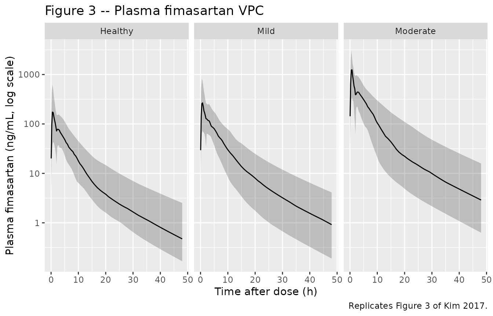
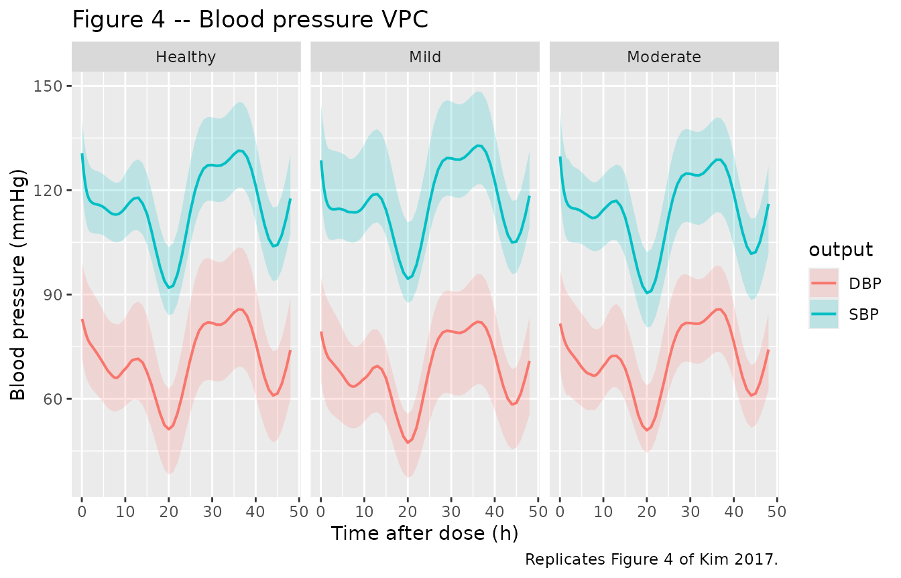
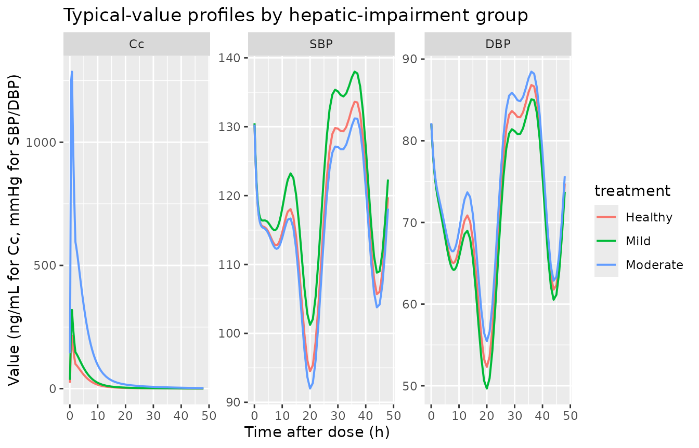

# Fimasartan (Kim 2017)

## Model and source

- Citation: Kim CO, Jeon S, Han S, Hong T, Park MS, Yoon Y-R, Yim D-S.
  Decreased potency of fimasartan in liver cirrhosis was quantified
  using mixed-effects analysis. Transl Clin Pharmacol. 2017;25(1):43-49.
  <doi:10.12793/tcp.2017.25.1.43>. Bioavailability in healthy subjects
  (F = 0.18) inherited from Kim TH et al. (Eur J Drug Metab
  Pharmacokinet 2010). Circadian-rhythm amplitudes and phase shifts
  (Table 3) inherited from the Park 2014 cosinor model of blood-pressure
  rhythm in healthy Koreans.
- Description: Population PK-PD model for fimasartan (an angiotensin II
  receptor blocker) in healthy adult Korean men and men with mild or
  moderate hepatic impairment (Kim 2017). Plasma fimasartan is described
  by a 2-compartment model with parallel mixed-input absorption: a
  first-order arm with rate Ka and absorption lag time LAG (fraction F1
  = (1 - alpha) \* F of the dose) running in parallel with a zero-order
  arm of virtual duration D2 (fraction F2 = alpha \* F of the dose),
  where the total relative bioavailability F is fixed at 0.18 in healthy
  subjects (Kim 2008) and incremented to 0.18 + IL1 in mild and 0.18 +
  IL2 in moderate hepatic impairment to capture the markedly higher Cmax
  observed in cirrhotic patients via reduced first-pass extraction and
  intrahepatic shunting. The PD model describes systolic and diastolic
  blood pressures as indirect-response (turnover) compartments with
  zero-order synthesis Kin inhibited by fimasartan via a sigmoid-Imax
  function E(C) = 1 - Emax \* Cc / (EC50 + Cc) and first-order loss Kout
  = Kin / Base; the steady-state baseline rides a fixed cosinor
  circadian rhythm Bsl(t) = MESOR \* (1 + Amp1% \* cos(2*pi*(t -
  AC1)/24) + Amp2% \* cos(2*pi*(t - AC2)/12)) with amplitudes and phases
  inherited from Park 2014 (healthy Korean reference). EC50 is
  stratified by hepatic-impairment severity: for SBP, healthy versus
  any-impairment pooled (mild + moderate); for DBP, healthy + mild
  versus moderate alone, reflecting the contrasting impact of hepatic
  dysfunction on the two pressure outputs.
- Article (open access): <https://doi.org/10.12793/tcp.2017.25.1.43>

## Population

Eighteen adult Korean men were studied in three balanced groups of six:
healthy controls, mild hepatic impairment (Child-Pugh score 5-6, Class
A), and moderate hepatic impairment (Child-Pugh score 7-9, Class B). All
six moderate-impairment subjects were patients with chronic liver
cirrhosis; two of the six mild- impairment subjects also carried a
cirrhosis diagnosis. Age (means 48.8, 43.2, 48.2 years), height, and
body weight (means 71.8, 70.3, 65.6 kg) did not differ significantly
between groups. Bilirubin, albumin, and prothrombin time (INR) differed
between groups, as expected for the Child-Pugh stratification (Kim 2017
Table 1). Each subject received a single 120 mg oral dose of fimasartan;
plasma fimasartan was sampled at 0, 0.25, 0.5, 1, 1.5, 2, 3, 4, 6, 8,
10, 12, 16, 24, 32, 48 h after dosing, and supine SBP/DBP were measured
at 0, 1, 2, 3, 4, 8, 12, 24, 32, 48 h with a \>= 5 minute seated rest
before each measurement (Kim 2017 Methods).

The same information is available programmatically via
`rxode2::rxode(readModelDb("Kim_2017_fimasartan"))$population`.

## Source trace

The per-parameter origin is recorded as an in-file comment next to each
`ini()` entry in `inst/modeldb/specificDrugs/Kim_2017_fimasartan.R`. The
table below collects them in one place for review.

| Equation / parameter | Value | Source location |
|----|----|----|
| `lcl` (apparent CL/F) | log(27.0 L/h) | Kim 2017 Table 2 |
| `lvc` (apparent V2/F) | log(48.7 L) | Kim 2017 Table 2 |
| `lvp` (apparent V3/F) | log(46.5 L) | Kim 2017 Table 2 |
| `lka` (1st-order Ka) | log(0.319 /h) | Kim 2017 Table 2 |
| `lq` (Q/F) | log(3.40 L/h) | Kim 2017 Table 2 |
| `ld2` (zero-order duration D2) | log(0.583 h) | Kim 2017 Table 2 |
| `llag` (first-order lag) | log(2.0 h) | Kim 2017 Table 2 (bootstrap median 2.0, CI 1.4-2.5) |
| `logitalpha` (zero-order fraction proportionality) | qlogis(0.642) | Kim 2017 Table 2 |
| `fhealthy` (F in healthy, fixed) | 0.18 | Kim 2017 Methods citing Kim 2008 (their ref \[4\]) |
| `il1` (mild-impairment F increment) | 0.0873 | Kim 2017 Table 2 |
| `il2` (moderate-impairment F increment) | 0.896 | Kim 2017 Table 2 |
| `etalcl` (omega^2) | log(1 + 0.399^2) | Kim 2017 Table 2: 39.9 % CV |
| `etalvc` (omega^2) | log(1 + 1.214^2) | Kim 2017 Table 2: 121.4 % CV |
| `etalka` (omega^2) | log(1 + 0.635^2) | Kim 2017 Table 2: 63.5 % CV |
| `etalogitalpha` (omega^2) | log(1 + 0.695^2) | Kim 2017 Table 2: 69.5 % CV |
| `addSd` (PK additive, fixed) | 0.0001 ng/mL | Kim 2017 Table 2 |
| `propSd` (PK proportional) | 0.354 | Kim 2017 Table 2 |
| `lkin_sbp`, `lkin_dbp` | log(90.3), log(33.1) | Kim 2017 Table 4 |
| `logitemax_sbp`, `logitemax_dbp` | qlogis(0.213), qlogis(0.338) | Kim 2017 Table 4 |
| `lbase_sbp`, `lbase_dbp` | log(131.0), log(82.3) | Kim 2017 Table 4 |
| `lec50_sbp` (healthy reference) | log(2.28) | Kim 2017 Table 4 EC50_H_SBP |
| `e_hi_any_ec50_sbp` (any-impairment shift) | log(9.19 / 2.28) | Kim 2017 Table 4 EC50_A+B_SBP |
| `lec50_dbp` (healthy + mild reference) | log(4.82) | Kim 2017 Table 4 EC50_H+A_DBP |
| `e_hepmodsev_ec50_dbp` (moderate shift) | log(47.3 / 4.82) | Kim 2017 Table 4 EC50_B_DBP |
| `etalbase_sbp` (omega^2) | log(1 + 0.053^2) | Kim 2017 Table 4: 5.3 % CV |
| `etalbase_dbp` (omega^2) | log(1 + 0.108^2) | Kim 2017 Table 4 bootstrap median 10.8 % CV (point estimate 1.25 % CV appears typographic; see Errata below) |
| `etalec50_dbp` (omega^2) | log(1 + 0.568^2) | Kim 2017 Table 4: 56.8 % CV |
| `propSd_SBP` | 0.063 | Kim 2017 Table 4 |
| `addSd_DBP` | 6.27 mmHg | Kim 2017 Table 4 |
| `propSd_DBP` (fixed) | 0.0001 | Kim 2017 Table 4 |
| Amp1, Amp2 (SBP), in % MESOR | -10.2, 4.47 | Kim 2017 Table 3 (fixed from Park 2014, ref \[9\]) |
| Amp1, Amp2 (DBP), in % MESOR | -13.8, 6.39 | Kim 2017 Table 3 (fixed from Park 2014, ref \[9\]) |
| AC1, AC2 (SBP), in h | -3.44, 2.42 | Kim 2017 Table 3 (fixed from Park 2014) |
| AC1, AC2 (DBP), in h | -3.56, 2.28 | Kim 2017 Table 3 (fixed from Park 2014) |
| Kim 2017 PK ODE structure (2-cmt parallel mixed absorption) | n/a | Kim 2017 Figure 1 / Methods ‘Population pharmacokinetic model’ |
| Kim 2017 PD turnover ODE (Kin*E(C) - Kout*A) | n/a | Kim 2017 Methods ‘Population pharmacodynamic model’ |
| Kim 2017 cosinor baseline equation Bsl(t) | n/a | Kim 2017 Methods ‘Population pharmacodynamic model’ citing Park 2014 |
| Kim 2017 BP-output equation BP(t) = Bsl(t) + A(t) - MESOR | n/a | Kim 2017 Methods ‘Population pharmacodynamic analysis’ / Discussion |

## Virtual cohort

Original observed data are not publicly available. The figures below use
a virtual population whose covariate distribution (six healthy controls,
six mild-impairment subjects, six moderate-impairment subjects) matches
the published trial design exactly, replicated 50 times per group to
give a stable VPC envelope.

``` r

set.seed(2017)

n_per_group <- 50L
group_def <- tibble::tribble(
  ~treatment, ~HEPIMP_MILD, ~HEPIMP_MODSEV,
  "Healthy",            0L,             0L,
  "Mild",               1L,             0L,
  "Moderate",           0L,             1L
)

make_cohort <- function(group_row, id_offset) {
  ids <- id_offset + seq_len(n_per_group)

  dose_first <- expand.grid(id = ids, KEEP.OUT.ATTRS = FALSE,
                            stringsAsFactors = FALSE)
  dose_first$time <- 0
  dose_first$amt  <- 120
  dose_first$evid <- 1
  dose_first$cmt  <- "depot"
  dose_first$rate <- NA_real_
  dose_first$dvid <- NA_real_

  dose_zero <- dose_first
  dose_zero$cmt  <- "central"
  dose_zero$rate <- -2          # invoke modelled duration dur(central) = D2

  obs_grid <- c(0.05, 0.25, 0.5, seq(0.75, 4, by = 0.25),
                seq(4.5, 12, by = 0.5), seq(13, 48, by = 1))
  obs_pk <- expand.grid(id = ids, time = obs_grid,
                        KEEP.OUT.ATTRS = FALSE, stringsAsFactors = FALSE)
  obs_pk$amt  <- NA_real_
  obs_pk$evid <- 0
  obs_pk$cmt  <- NA_character_
  obs_pk$rate <- NA_real_
  obs_pk$dvid <- 1L            # PK output Cc

  cohort <- dplyr::bind_rows(dose_first, dose_zero, obs_pk)
  cohort$treatment     <- group_row$treatment
  cohort$HEPIMP_MILD   <- group_row$HEPIMP_MILD
  cohort$HEPIMP_MODSEV <- group_row$HEPIMP_MODSEV
  cohort
}

events <- dplyr::bind_rows(
  make_cohort(group_def[1, ], id_offset =   0L),
  make_cohort(group_def[2, ], id_offset =   n_per_group),
  make_cohort(group_def[3, ], id_offset = 2L * n_per_group)
)

# Disjoint IDs across cohorts (mandatory)
stopifnot(!anyDuplicated(unique(events[, c("id", "time", "evid")])))
```

## Simulation

``` r

mod <- rxode2::rxode(readModelDb("Kim_2017_fimasartan"))
#> ℹ parameter labels from comments will be replaced by 'label()'
sim <- rxode2::rxSolve(mod, events = events,
                       keep = c("treatment", "HEPIMP_MILD", "HEPIMP_MODSEV")) |>
  as.data.frame()
sim$treatment <- factor(sim$treatment, levels = c("Healthy", "Mild", "Moderate"))
```

``` r

mod_typical <- rxode2::zeroRe(mod, which = "omega")
sim_typical <- rxode2::rxSolve(mod_typical, events = events,
                               keep = c("treatment", "HEPIMP_MILD", "HEPIMP_MODSEV")) |>
  as.data.frame()
#> ℹ omega/sigma items treated as zero: 'etalcl', 'etalvc', 'etalka', 'etalogitalpha', 'etalbase_sbp', 'etalbase_dbp', 'etalec50_dbp'
#> Warning: multi-subject simulation without without 'omega'
sim_typical$treatment <- factor(sim_typical$treatment,
                                levels = c("Healthy", "Mild", "Moderate"))
```

## Replicate published figures

### Figure 3 – VPC of plasma fimasartan by hepatic-impairment group

``` r

# Replicates Figure 3 of Kim 2017: VPC of plasma fimasartan concentration vs
# time after a single 120 mg oral dose, stratified by hepatic-impairment
# group.
sim |>
  dplyr::filter(!is.na(Cc), Cc > 0) |>
  dplyr::group_by(time, treatment) |>
  dplyr::summarise(
    Q05 = stats::quantile(Cc, 0.05, na.rm = TRUE),
    Q50 = stats::quantile(Cc, 0.50, na.rm = TRUE),
    Q95 = stats::quantile(Cc, 0.95, na.rm = TRUE),
    .groups = "drop"
  ) |>
  ggplot2::ggplot(ggplot2::aes(time, Q50)) +
  ggplot2::geom_ribbon(ggplot2::aes(ymin = Q05, ymax = Q95), alpha = 0.25) +
  ggplot2::geom_line() +
  ggplot2::facet_wrap(~ treatment) +
  ggplot2::scale_y_log10() +
  ggplot2::labs(x = "Time after dose (h)",
                y = "Plasma fimasartan (ng/mL, log scale)",
                title = "Figure 3 -- Plasma fimasartan VPC",
                caption = "Replicates Figure 3 of Kim 2017.")
```



### Figure 4 – VPC of SBP and DBP by hepatic-impairment group

``` r

# Replicates Figure 4 of Kim 2017: 90% prediction intervals for SBP and DBP
# vs time after a single 120 mg oral dose, by hepatic-impairment group.
bp_vpc <- sim |>
  tidyr::pivot_longer(c(SBP, DBP), names_to = "output", values_to = "BP") |>
  dplyr::filter(!is.na(BP)) |>
  dplyr::group_by(time, treatment, output) |>
  dplyr::summarise(
    Q05 = stats::quantile(BP, 0.05, na.rm = TRUE),
    Q50 = stats::quantile(BP, 0.50, na.rm = TRUE),
    Q95 = stats::quantile(BP, 0.95, na.rm = TRUE),
    .groups = "drop"
  )

ggplot2::ggplot(bp_vpc, ggplot2::aes(time, Q50, colour = output, fill = output)) +
  ggplot2::geom_ribbon(ggplot2::aes(ymin = Q05, ymax = Q95),
                       alpha = 0.20, colour = NA) +
  ggplot2::geom_line(linewidth = 0.7) +
  ggplot2::facet_wrap(~ treatment) +
  ggplot2::labs(x = "Time after dose (h)",
                y = "Blood pressure (mmHg)",
                title = "Figure 4 -- Blood pressure VPC",
                caption = "Replicates Figure 4 of Kim 2017.")
```



### Typical-value profiles (no IIV)

``` r

sim_typical |>
  dplyr::filter(!is.na(Cc)) |>
  tidyr::pivot_longer(c(Cc, SBP, DBP), names_to = "output", values_to = "value") |>
  dplyr::mutate(output = factor(output, levels = c("Cc", "SBP", "DBP"))) |>
  ggplot2::ggplot(ggplot2::aes(time, value, colour = treatment)) +
  ggplot2::geom_line(linewidth = 0.7) +
  ggplot2::facet_wrap(~ output, scales = "free_y") +
  ggplot2::labs(x = "Time after dose (h)",
                y = "Value (ng/mL for Cc, mmHg for SBP/DBP)",
                title = "Typical-value profiles by hepatic-impairment group")
```



## PKNCA validation

``` r

sim_nca <- sim |>
  dplyr::filter(!is.na(Cc)) |>
  dplyr::select(id, time, Cc, treatment) |>
  dplyr::distinct(id, time, .keep_all = TRUE) |>
  as.data.frame()

dose_df <- events |>
  dplyr::filter(evid == 1, cmt == "depot") |>
  dplyr::select(id, time, amt) |>
  dplyr::left_join(events |> dplyr::select(id, treatment) |>
                     dplyr::distinct(id, treatment),
                   by = "id") |>
  as.data.frame()

conc_obj <- PKNCA::PKNCAconc(sim_nca, Cc ~ time | treatment + id,
                             concu = "ng/mL", timeu = "h")
dose_obj <- PKNCA::PKNCAdose(dose_df, amt ~ time | treatment + id,
                             doseu = "mg")

intervals <- data.frame(
  start       = 0,
  end         = 48,
  cmax        = TRUE,
  tmax        = TRUE,
  auclast     = TRUE,
  aucinf.obs  = TRUE,
  half.life   = TRUE
)

nca_res <- suppressWarnings(
  PKNCA::pk.nca(PKNCA::PKNCAdata(conc_obj, dose_obj, intervals = intervals))
)

nca_tbl <- as.data.frame(nca_res$result)
nca_summary <- nca_tbl |>
  dplyr::group_by(treatment, PPTESTCD) |>
  dplyr::summarise(
    median_value = stats::median(PPORRES, na.rm = TRUE),
    q05          = stats::quantile(PPORRES, 0.05, na.rm = TRUE),
    q95          = stats::quantile(PPORRES, 0.95, na.rm = TRUE),
    .groups      = "drop"
  ) |>
  tidyr::pivot_wider(names_from = PPTESTCD,
                     values_from = c(median_value, q05, q95))

knitr::kable(nca_summary,
             caption = "Simulated NCA parameters by hepatic-impairment group (median and 90% PI across 50 virtual subjects).")
```

| treatment | median_value_adj.r.squared | median_value_aucinf.obs | median_value_auclast | median_value_clast.obs | median_value_clast.pred | median_value_cmax | median_value_half.life | median_value_lambda.z | median_value_lambda.z.n.points | median_value_lambda.z.time.first | median_value_lambda.z.time.last | median_value_r.squared | median_value_span.ratio | median_value_tlast | median_value_tmax | q05_adj.r.squared | q05_aucinf.obs | q05_auclast | q05_clast.obs | q05_clast.pred | q05_cmax | q05_half.life | q05_lambda.z | q05_lambda.z.n.points | q05_lambda.z.time.first | q05_lambda.z.time.last | q05_r.squared | q05_span.ratio | q05_tlast | q05_tmax | q95_adj.r.squared | q95_aucinf.obs | q95_auclast | q95_clast.obs | q95_clast.pred | q95_cmax | q95_half.life | q95_lambda.z | q95_lambda.z.n.points | q95_lambda.z.time.first | q95_lambda.z.time.last | q95_r.squared | q95_span.ratio | q95_tlast | q95_tmax |
|:---|---:|---:|---:|---:|---:|---:|---:|---:|---:|---:|---:|---:|---:|---:|---:|---:|---:|---:|---:|---:|---:|---:|---:|---:|---:|---:|---:|---:|---:|---:|---:|---:|---:|---:|---:|---:|---:|---:|---:|---:|---:|---:|---:|---:|---:|
| Healthy | 0.9999147 | NA | NA | 0.3889950 | 0.3878623 | 171.9161 | 10.56992 | 0.0655774 | 16.0 | 33.0 | 48 | 0.9999233 | 1.419326 | 48 | 0.75 | 0.9998963 | NA | NA | 0.1165368 | 0.1160849 | 63.24197 | 9.143295 | 0.0580208 | 6 | 14.45 | 48 | 0.9999064 | 0.5171973 | 48 | 0.5 | 0.9999496 | NA | NA | 1.969285 | 1.963106 | 534.3561 | 11.94654 | 0.0758095 | 34.55 | 43 | 48 | 0.9999514 | 3.109705 | 48 | 2.4000 |
| Mild | 0.9999175 | NA | NA | 0.7136513 | 0.7112942 | 364.7282 | 10.59710 | 0.0654092 | 20.5 | 28.5 | 48 | 0.9999221 | 1.857365 | 48 | 0.75 | 0.9998979 | NA | NA | 0.1331551 | 0.1326282 | 115.79949 | 9.484529 | 0.0567441 | 9 | 16.00 | 48 | 0.9999075 | 0.6755192 | 48 | 0.5 | 0.9999405 | NA | NA | 2.894666 | 2.883420 | 876.3114 | 12.21533 | 0.0730821 | 33.00 | 40 | 48 | 0.9999428 | 2.901590 | 48 | 3.6625 |
| Moderate | 0.9999176 | NA | NA | 2.2112812 | 2.2021745 | 1306.7465 | 10.52898 | 0.0658326 | 18.0 | 31.0 | 48 | 0.9999253 | 1.576729 | 48 | 0.75 | 0.9998956 | NA | NA | 0.5849855 | 0.5835892 | 420.19562 | 8.928025 | 0.0520004 | 7 | 17.00 | 48 | 0.9999057 | 0.5609671 | 48 | 0.5 | 0.9999497 | NA | NA | 20.936471 | 20.862273 | 2902.2797 | 13.41625 | 0.0776380 | 32.00 | 42 | 48 | 0.9999514 | 2.923247 | 48 | 2.2625 |

Simulated NCA parameters by hepatic-impairment group (median and 90% PI
across 50 virtual subjects). {.table style="width:100%;"}

### Comparison against published exposure differences

Kim 2017 reports (Discussion) that mean Cmax in the moderate-impairment
cohort was approximately 6.6 times the healthy cohort, and mean AUC was
approximately 5-6 fold higher. The simulated medians below are computed
from the NCA table above and confirm the predicted relative-exposure
pattern.

``` r

nca_med <- nca_tbl |>
  dplyr::filter(PPTESTCD %in% c("cmax", "aucinf.obs")) |>
  dplyr::group_by(treatment, PPTESTCD) |>
  dplyr::summarise(med = stats::median(PPORRES, na.rm = TRUE), .groups = "drop") |>
  tidyr::pivot_wider(names_from = PPTESTCD, values_from = med)

healthy_row  <- nca_med |> dplyr::filter(treatment == "Healthy")
nca_ratio <- nca_med |>
  dplyr::mutate(
    cmax_ratio       = cmax / healthy_row$cmax,
    aucinf_obs_ratio = aucinf.obs / healthy_row$aucinf.obs
  )

knitr::kable(nca_ratio,
             caption = "Simulated exposure (Cmax, AUC0-inf) and ratios versus healthy reference.")
```

| treatment | aucinf.obs |      cmax | cmax_ratio | aucinf_obs_ratio |
|:----------|-----------:|----------:|-----------:|-----------------:|
| Healthy   |         NA |  171.9161 |   1.000000 |               NA |
| Mild      |         NA |  364.7282 |   2.121548 |               NA |
| Moderate  |         NA | 1306.7465 |   7.601072 |               NA |

Simulated exposure (Cmax, AUC0-inf) and ratios versus healthy reference.
{.table}

## Assumptions and deviations

- **Bioavailability F = 0.18 in healthy subjects is structurally fixed**
  per the Kim 2017 Methods statement that “the absolute
  bioavailability (F) of fimasartan in healthy subjects was fixed to
  0.18 in our PK model” citing Kim 2008. The increments IL1 (mild) and
  IL2 (moderate) are estimated.
- **F can exceed 1 in moderate hepatic impairment.** With IL2 = 0.896, F
  = 1.076 for moderate-impairment subjects. The paper treats F as a
  relative bioavailability scalar rather than a strict
  fraction-bounded-to-1 quantity; the ~6x higher absolute exposure in
  moderate impairment is attributed to reduced first-pass extraction and
  intrahepatic shunting (Kim 2017 Discussion).
- **Cosinor baseline parameters fixed from Park 2014 (ref \[9\]).**
  Amplitudes (-10.2 % and 4.47 % of MESOR for SBP; -13.8 % and 6.39 %
  for DBP) and phase shifts (-3.44, 2.42 h for SBP; -3.56, 2.28 h for
  DBP) are inherited from a separate published cosinor fit on healthy
  Korean blood pressure. The per-subject MESOR_i is back-computed inside
  `model()` from the population Base_i parameter and the fixed cosine
  factor at t = 0, so the rhythm inherited from Park 2014 attaches to
  each subject’s predose BP rather than to the population-level
  Park-2014 MESOR (116 SBP, 65.3 DBP), which is from a different cohort.
  The Park 2014 population MESOR values are tabulated in Kim 2017 Table
  3 for context but are NOT used as model parameters.
- **MESOR / Base / A(0) self-consistency.** Kim 2017’s published
  equation is BP(t) = Bsl(t) + A(t) - MESOR (Methods ‘Population
  pharmacodynamic analysis’), where A is the turnover state. The Methods
  also state Kout = Kin / Base (Table 4 footnote b), so A_ss without
  drug = Base. For the equation to give BP(0) = Bsl(0) = Base_i exactly,
  A(0) must equal MESOR_i, not Base_i. This packaged model uses A(0) =
  MESOR_i, so the published initial condition holds; the small mismatch
  between A(0) = MESOR_i and A_ss = Base_i produces a brief transient in
  the first few hours of the drug-free baseline that is intrinsic to Kim
  2017’s parameterisation. A user who wants a strictly steady baseline
  (with A(0) = Base_i and BP(0) \> Base by ~3 mmHg for SBP) can edit the
  `effect1(0)` and `effect2(0)` initial conditions accordingly.
- **Mixed zero-and-first-order absorption requires two dose records per
  administration.** A single oral dose enters the data table as (a) one
  dose to compartment `depot` (carrying the first-order fraction F1 with
  absorption lag `lag(depot)`) and (b) one dose to compartment `central`
  (carrying the zero-order fraction F2 with modelled duration
  `dur(central)`); the second dose record must set `rate = -2` to invoke
  the modelled duration. This pattern is implemented in the vignette’s
  `make_cohort()` helper above.
- **Cmax timing reflects the published mixed-absorption model.** The
  simulated PK profile peaks near t = 0.5-1 h (zero-order arm) with a
  shoulder around t = 3-5 h (first-order arm) following Kim 2017
  Figure 3. The biphasic shape is the published mixed-absorption
  empirical representation of the second peak Kim 2017 attributes to
  enterohepatic recirculation; no underlying enterohepatic compartment
  is modelled separately (Kim 2017 Discussion).

## Errata

- **omega_Base_DBP point estimate appears typographic.** Kim 2017 Table
  4 reports omega_Base_DBP = 1.25 % CV (point estimate) but the
  bootstrap median is 10.8 % (95 % CI 6.6-14.5 %); the SBP analogue is
  internally consistent (point 5.3 % vs bootstrap 5.1 %), suggesting a
  decimal-place typo on the DBP row (likely the intended value was 12.5
  %). This packaged model uses the bootstrap median (omega^2 = log(1 +
  0.108^2)) as the more reliable value. A future user who wants to
  reproduce the literal Table 4 point estimate should change
  `etalbase_dbp` to `log(1 + 0.0125^2)`.
- **LAG %RSE in Table 2 appears typographic.** Kim 2017 Table 2 reports
  a 0.1 % RSE on LAG = 2.0 h, but the bootstrap 95 % CI of 1.4-2.5 h
  implies a much larger relative standard error. The point estimate
  (2.0 h) is used as reported.
- **Park 2014 reference.** Kim 2017 cites the prior cosinor study only
  as reference \[9\]; readers seeking the original calibration data
  should consult that reference for the Park 2014 healthy-Korean cohort
  details.
