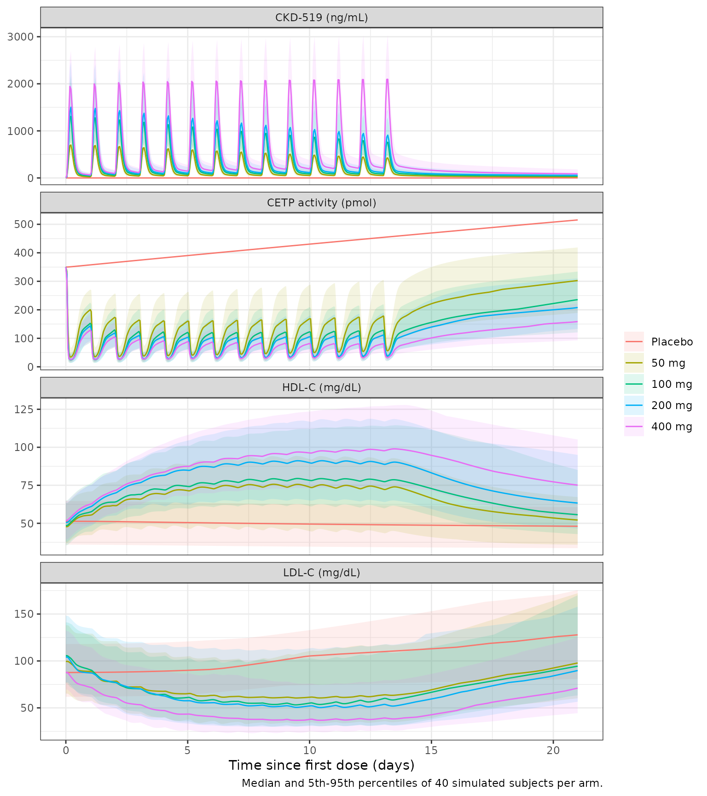
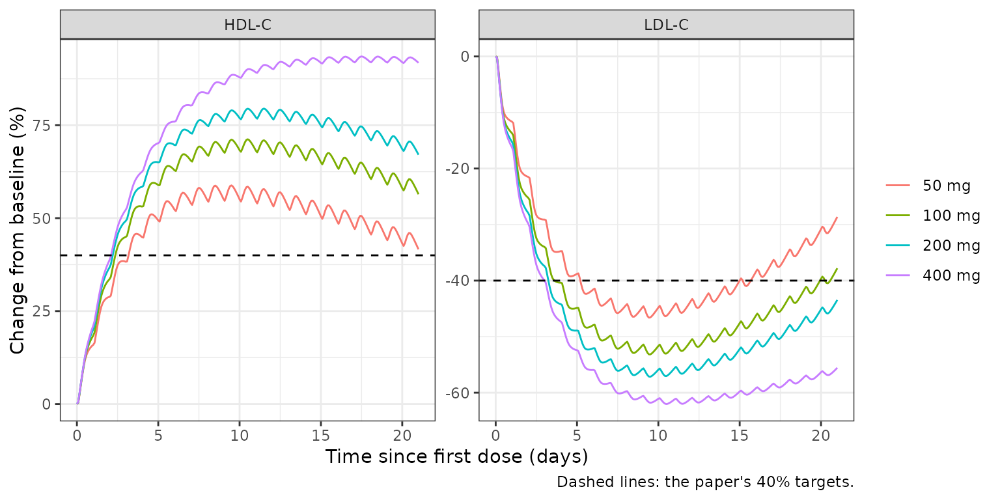

# CKD-519, CETP activity, HDL-C and LDL-C (Kim 2020)

## Model and source

- Citation: Kim CO, Jeon S, Han S, Park MS, Yim DS. A Population
  Pharmacokinetic and Pharmacodynamic Model of CKD-519. Pharmaceutics.
  2020;12(6):573. <doi:10.3390/pharmaceutics12060573>. PK: Table 2 and
  Equations 1-3; CETP activity: Table 3 and Equations 4-6; HDL-C and
  LDL-C: Table 4 and Equations 7-10; model structure: Figure 1.
- Description: Sequential population PK/PD model for the cholesteryl
  ester transfer protein (CETP) inhibitor CKD-519 in healthy adult men
  given 50-400 mg once daily with a standard meal for 14 days (Kim
  2020). PK: three-compartment disposition with an Erlang absorption
  chain (dose into four transit compartments at Ktr, then an absorption
  compartment draining to central at Ka) and a relative bioavailability
  that falls with dose (Bmax \* (1 - DOSE / (BA50 + DOSE))) and, for the
  50-200 mg cohorts only, decays exponentially with time since the first
  dose. CETP activity is a turnover state whose first-order loss is
  stimulated by an Emax function of plasma CKD-519 and whose production
  rises with time on study (placebo Emax-in-time effect). HDL-C and
  LDL-C are turnover states whose first-order elimination is
  respectively stimulated (HDL-C) and inhibited (LDL-C) by a sigmoid
  function of CETP activity; LDL-C production also rises linearly with
  time (placebo).
- Article: <https://doi.org/10.3390/pharmaceutics12060573> (open access;
  PMC7356970)

CKD-519 is an oral inhibitor of cholesteryl ester transfer protein
(CETP) that was developed for dyslipidaemia. Its exposure is highly
variable: it depends on food, it rises less than dose-proportionally,
and in the 50-200 mg cohorts it falls on repeated dosing. Kim et
al. fitted a sequential population PK/PD model to a two-week
multiple-ascending-dose study in healthy men. The chain has three links:

1.  **PK.** Three-compartment disposition. Absorption runs through five
    sequential compartments: four transit compartments at `Ktr`, then an
    absorption compartment that drains to central at `Ka`. The relative
    bioavailability falls with dose and, below 400 mg, decays with time
    since the first dose.
2.  **CETP activity.** A turnover model. Plasma CKD-519 stimulates the
    first-order loss of CETP activity through an Emax function. CETP
    production rises with time on study, a placebo effect that is also
    seen in the placebo group.
3.  **HDL-C and LDL-C.** Turnover models driven by CETP activity through
    a sigmoid Emax function. CETP activity stimulates HDL-C elimination
    and inhibits LDL-C elimination, so inhibiting CETP raises HDL-C and
    lowers LDL-C. LDL-C production also rises linearly with time
    (placebo effect).

The paper fitted the three stages one after another, each using the
individual parameters of the previous stage. The packaged model joins
them into one ODE system with four outputs: `Cc` (ng/mL), `cetp` (pmol),
`hdl` and `ldl` (mg/dL).

## Population

Thirty-two healthy Korean men took part: six on CKD-519 and two on
placebo in each of four cohorts (50, 100, 200 and 400 mg). Their mean
age was 32.2 years (19-47) and their mean weight 68.7 kg (58.3-79.5)
(Table 1). CKD-519 or placebo was given once daily with a standard
breakfast (700-800 kcal, 5-25% fat) for 14 days. Subjects stayed in
hospital from day 1 to day 21. The data were 1392 plasma CKD-519
concentrations, 2064 CETP activity values and 656 HDL-C and LDL-C
values. Age, weight, BMI, MDRD creatinine clearance and ALT were
screened as covariates, and none was retained in any final model.

The same information is available programmatically via
`readModelDb("Kim_2020_CKD_519")()$population`.

## Source trace

Every `ini()` value carries an in-file comment in
`inst/modeldb/specificDrugs/Kim_2020_CKD_519.R`. The table collects
them.

| Equation / parameter | Value | Source location |
|----|----|----|
| Absorption chain: 5 sequential compartments, 4 at `Ktr` then 1 at `Ka` | n/a | Figure 1; Section 3.2 |
| 3-compartment disposition | n/a | Figure 1; Table 2 |
| `F = BA * FT` | n/a | Equation 1 |
| `BA = Bmax * (1 - DOSE / (BA50 + DOSE))` | n/a | Equation 2; Table 2 |
| `FT = exp(-alpha * TIME)` | n/a | Equation 3; Table 2 |
| `lcl` (CL/F) | 6.4 L/h | Table 2 |
| `lvc` (V/F) | 11.4 L | Table 2 |
| `lvp` (V2/F) | 45.4 L | Table 2 |
| `lvp2` (V3/F) | 1006 L | Table 2 |
| `lq` (Q2/F) | 2.6 L/h | Table 2 |
| `lq2` (Q3/F) | 3.3 L/h | Table 2 |
| `lka` (Ka) | 1.09 1/h | Table 2 |
| `lktr` (Ktr) | 1.10 1/h | Table 2 |
| `lfdepot_max` (Bmax) | 1.6 | Table 2 |
| `ld50_fdepot` (BA50) | 90.1 mg | Table 2 |
| `alpha_fdepot` (alpha1, 50-200 mg) | 0.002 1/h | Table 2 |
| `alpha_fdepot_high` (alpha2, 400 mg) | 0 (fixed) | Table 2; Section 3.2 |
| `etalcl`, `etalvp2`, `etalfdepot_max`, `etalktr` | 15.6, 58.1, 28.2, 14.1 %CV | Table 2 |
| `propSd` / `addSd` (CKD-519) | 0.30 / 0.0001 (fixed) | Table 2 |
| `dCETP/dt = Kin,base (1 + Placebo) - Kout (1 + Drug) CETP` | n/a | Equation 4; Figure 1 |
| `Placebo = Kmax T / (K50 + T)` | n/a | Equation 5; Table 3 |
| `Drug = Emax Cp / (EC50 + Cp)` | n/a | Equation 6; Table 3 |
| `lrbase_cetp` (CETPbase) | 350 pmol | Table 3 |
| `lkin_cetp` (Kin,base) | 164 pmol/h | Table 3 |
| `lpbo_emax_cetp` (Kmax) | 9.6 | Table 3 |
| `lpbo_t50_cetp` (K50) | 9700 h | Table 3 |
| `lemax` (Emax) | 18.2 | Table 3 |
| `lec50` (EC50) | 587 ng/mL | Table 3 |
| `etalkin_cetp`, `etalemax` | 19.7, 39.5 %CV | Table 3 |
| `addSd_cetp` / `propSd_cetp` | 40.4 pmol / 0.112 | Table 3 |
| `dHDL/dt = Ksyn - Kdeg HDL (1 + RES)` | n/a | Equation 7 |
| `dLDL/dt = Ksyn (1 + PLA) - Kdeg LDL (1 - RES)` | n/a | Equation 8; Table 4; Figure 1 |
| `RES = CETP^gamma Rmax / (CETP^gamma + R50^gamma)` | n/a | Equation 9; Table 4 |
| `PLA = beta * time` | n/a | Equation 10; Table 4 |
| `lrbase_hdl` (RB) | 50.0 mg/dL | Table 4, HDL-C |
| `lksyn_hdl` (Ksyn) | 1.26 mg/dL/h | Table 4, HDL-C |
| `lhill_hdl` (gamma) | 2.1 | Table 4, HDL-C |
| `lemax_hdl` (Rmax) | 1.5 | Table 4, HDL-C |
| `lec50_hdl` (R50) | 185 pmol | Table 4, HDL-C |
| `etalrbase_hdl` | 17.2 %CV | Table 4, HDL-C |
| `addSd_hdl` / `propSd_hdl` | 4.6 mg/dL / 0.0001 (fixed) | Table 4, HDL-C |
| `lrbase_ldl` (RB) | 97.4 mg/dL | Table 4, LDL-C |
| `lksyn_ldl` (Ksyn) | 0.435 mg/dL/h | Table 4, LDL-C |
| `lpbo_slope_ldl` (beta) | 0.0009 1/h | Table 4, LDL-C |
| `lhill_ldl` (gamma) | 2.2 | Table 4, LDL-C |
| `lemax_ldl` (Rmax) | 0.8 | Table 4, LDL-C |
| `lec50_ldl` (R50) | 80.7 pmol | Table 4, LDL-C |
| `etalrbase_ldl`, `etalpbo_slope_ldl`, `etalhill_ldl` | 23.6, 97.4, 50.9 %CV | Table 4, LDL-C |
| `propSd_ldl` | 0.07 (additive 0 fixed, omitted) | Table 4, LDL-C |
| `kout_cetp`, `kdeg_hdl`, `kdeg_ldl` | derived | Pre-dose steady state (see Assumptions) |

The IIV rows are reported as CV%. They are converted to log-normal
variances with `omega^2 = log(CV^2 + 1)`.

## Virtual cohort

The study had five arms: 50, 100, 200 and 400 mg once daily for 14 days,
and placebo. Each arm below has 40 virtual subjects. The model has no
demographic covariates, so each subject needs only the dose (`DOSE`) and
the 400 mg indicator (`DOSE_HIGH`). Observations run hourly to day 21
(504 h). They sit on the `cetp` state, which is one of the declared
endpoints, and rxode2 returns `Cc`, `hdl` and `ldl` at the same rows.

``` r

arms <- tibble::tribble(
  ~arm,      ~dose,
  "Placebo",     0,
  "50 mg",      50,
  "100 mg",    100,
  "200 mg",    200,
  "400 mg",    400
) |>
  mutate(arm = factor(arm, levels = arm))

n_per_arm <- 40L
dose_times <- seq(0, 13 * 24, by = 24)
obs_times <- sort(unique(c(seq(0, 504, by = 1), 312 + c(0.25, 0.5, 0.75))))

make_arm <- function(arm, dose, ids) {
  subj <- tibble(id = ids, arm = arm, dose_mg = dose, DOSE = dose, DOSE_HIGH = as.integer(dose == 400))
  obs <- tidyr::crossing(subj, time = obs_times) |>
    mutate(evid = 0L, amt = NA_real_, cmt = "cetp")
  if (dose == 0) {
    return(obs)
  }
  doses <- tidyr::crossing(subj, time = dose_times) |>
    mutate(evid = 1L, amt = dose, cmt = "transit1")
  bind_rows(doses, obs)
}

events <- bind_rows(lapply(seq_len(nrow(arms)), function(i) {
  make_arm(
    as.character(arms$arm[i]), arms$dose[i],
    ids = (i - 1L) * n_per_arm + seq_len(n_per_arm)
  )
})) |>
  arrange(id, time, desc(evid)) |>
  # rxode2 reads a column named DOSE as the dose amount unless the standard
  # event columns come first, so put them first.
  select(id, time, evid, amt, cmt, everything())

stopifnot(!anyDuplicated(unique(events[, c("id", "time", "evid")])))
```

## Simulation

``` r

mod <- readModelDb("Kim_2020_CKD_519")

rxode2::rxSetSeed(519)
sim <- rxode2::rxSolve(
  mod,
  events = events,
  keep = c("arm", "dose_mg"),
  useLinCmt = FALSE
) |>
  as.data.frame() |>
  mutate(arm = factor(arm, levels = levels(arms$arm)))
#> ℹ parameter labels from comments will be replaced by 'label()'

# Typical-value solve (no IIV, no residual error). The paper's Figure 4 is a
# typical-value simulation. `omega = NA, sigma = NA` is used instead of
# zeroRe(), which is not safe on multi-endpoint models.
events_typ <- events |>
  group_by(arm) |>
  filter(id == min(id)) |>
  ungroup()
sim_typ <- rxode2::rxSolve(
  mod,
  events = events_typ,
  keep = c("arm", "dose_mg"),
  omega = NA,
  sigma = NA,
  useLinCmt = FALSE
) |>
  as.data.frame() |>
  mutate(arm = factor(arm, levels = levels(arms$arm)))
```

## Replicate published figures

### Figure 3: visual predictive checks

``` r

# Replicates the layout of Figure 3 of Kim 2020 (VPC of CKD-519, CETP
# activity, HDL-C and LDL-C). `Cc`, `cetp`, `hdl` and `ldl` are the individual
# predictions without residual error.
vpc <- sim |>
  select(arm, time, Cc, cetp, hdl, ldl) |>
  tidyr::pivot_longer(c(Cc, cetp, hdl, ldl), names_to = "output") |>
  group_by(arm, output, time) |>
  summarise(
    q05 = quantile(value, 0.05),
    q50 = median(value),
    q95 = quantile(value, 0.95),
    .groups = "drop"
  ) |>
  mutate(output = factor(
    output,
    levels = c("Cc", "cetp", "hdl", "ldl"),
    labels = c("CKD-519 (ng/mL)", "CETP activity (pmol)", "HDL-C (mg/dL)", "LDL-C (mg/dL)")
  ))

ggplot(vpc, aes(time / 24, q50, colour = arm, fill = arm)) +
  geom_ribbon(aes(ymin = q05, ymax = q95), alpha = 0.12, colour = NA) +
  geom_line() +
  facet_wrap(~output, scales = "free_y", ncol = 1) +
  labs(
    x = "Time since first dose (days)", y = NULL, colour = NULL, fill = NULL,
    caption = "Median and 5th-95th percentiles of 40 simulated subjects per arm."
  ) +
  theme_bw()
```



### Figure 4: HDL-C and LDL-C change from baseline

The paper simulated the typical HDL-C and LDL-C response to 21 days of
daily dosing and marked a target of a 40% change from baseline. It
reports that the responses peak after about ten days of dosing, that
they then decline slowly at 50-200 mg but not at 400 mg, and that the
40% targets are reached at 200 and 400 mg.

``` r

# Replicates Figure 4 of Kim 2020 (typical-value simulation, 21 days of
# once-daily dosing, IIV and residual error excluded as in Section 2.5).
events_fig4 <- bind_rows(lapply(seq_len(nrow(arms))[-1], function(i) {
  d <- arms$dose[i]
  subj <- tibble(id = i, arm = as.character(arms$arm[i]), DOSE = d, DOSE_HIGH = as.integer(d == 400))
  bind_rows(
    tidyr::crossing(subj, time = seq(0, 20 * 24, by = 24)) |>
      mutate(evid = 1L, amt = d, cmt = "transit1"),
    tidyr::crossing(subj, time = seq(0, 21 * 24, by = 2)) |>
      mutate(evid = 0L, amt = NA_real_, cmt = "cetp")
  )
})) |>
  arrange(id, time, desc(evid)) |>
  select(id, time, evid, amt, cmt, everything())

fig4 <- rxode2::rxSolve(
  mod,
  events = events_fig4,
  keep = c("arm"),
  omega = NA,
  sigma = NA,
  useLinCmt = FALSE
) |>
  as.data.frame() |>
  mutate(arm = factor(arm, levels = levels(arms$arm))) |>
  group_by(arm) |>
  mutate(
    `HDL-C` = 100 * (hdl / first(hdl) - 1),
    `LDL-C` = 100 * (ldl / first(ldl) - 1)
  ) |>
  ungroup()

fig4 |>
  select(arm, time, `HDL-C`, `LDL-C`) |>
  tidyr::pivot_longer(c(`HDL-C`, `LDL-C`), names_to = "lipid", values_to = "pct") |>
  ggplot(aes(time / 24, pct, colour = arm)) +
  geom_line() +
  geom_hline(
    data = data.frame(lipid = c("HDL-C", "LDL-C"), target = c(40, -40)),
    aes(yintercept = target), linetype = "dashed"
  ) +
  facet_wrap(~lipid, scales = "free_y") +
  labs(
    x = "Time since first dose (days)", y = "Change from baseline (%)",
    colour = NULL, caption = "Dashed lines: the paper's 40% targets."
  ) +
  theme_bw()
```



``` r


fig4_summary <- fig4 |>
  group_by(arm) |>
  summarise(
    hdl_peak_pct = max(`HDL-C`),
    hdl_peak_day = time[which.max(`HDL-C`)] / 24,
    hdl_day21_pct = `HDL-C`[time == 504],
    ldl_nadir_pct = min(`LDL-C`),
    ldl_nadir_day = time[which.min(`LDL-C`)] / 24,
    ldl_day21_pct = `LDL-C`[time == 504],
    .groups = "drop"
  )

fig4_summary |>
  dplyr::rename(
    "Arm" = arm,
    "HDL-C peak (%)" = hdl_peak_pct,
    "HDL-C peak day" = hdl_peak_day,
    "HDL-C day 21 (%)" = hdl_day21_pct,
    "LDL-C nadir (%)" = ldl_nadir_pct,
    "LDL-C nadir day" = ldl_nadir_day,
    "LDL-C day 21 (%)" = ldl_day21_pct
  ) |>
  knitr::kable(digits = 1, caption = "Typical-value lipid response to 21 days of dosing.")
```

| Arm | HDL-C peak (%) | HDL-C peak day | HDL-C day 21 (%) | LDL-C nadir (%) | LDL-C nadir day | LDL-C day 21 (%) |
|:---|---:|---:|---:|---:|---:|---:|
| 50 mg | 58.8 | 9.5 | 41.6 | -46.6 | 9.4 | -28.6 |
| 100 mg | 71.2 | 10.5 | 56.4 | -53.2 | 9.5 | -37.8 |
| 200 mg | 79.5 | 11.5 | 67.1 | -57.2 | 9.5 | -43.5 |
| 400 mg | 93.5 | 17.5 | 91.8 | -62.0 | 10.5 | -55.6 |

Typical-value lipid response to 21 days of dosing. {.table
style="width:100%;"}

The maintainers digitised the Figure 4 curves at their peak (HDL-C) and
nadir (LDL-C). The HDL-C panel is reproduced. The Discussion also states
the maximal responses: HDL-C rises to 160-190% of baseline and LDL-C
falls by 47-66%.

``` r

fig4_digitised <- tibble::tribble(
  ~arm,     ~hdl_peak_fig4, ~ldl_nadir_fig4,
  "50 mg",              80,              72,
  "100 mg",             86,              64,
  "200 mg",             90,              58,
  "400 mg",             97,              51
)

fig4_cmp <- fig4_summary |>
  mutate(arm = as.character(arm)) |>
  inner_join(fig4_digitised, by = "arm") |>
  mutate(
    hdl_peak_sim = 50 * (1 + hdl_peak_pct / 100),
    ldl_nadir_sim = 97.4 * (1 + ldl_nadir_pct / 100),
    hdl_pct_diff = 100 * (hdl_peak_sim / hdl_peak_fig4 - 1),
    ldl_pct_diff = 100 * (ldl_nadir_sim / ldl_nadir_fig4 - 1)
  )

fig4_cmp |>
  select(arm, hdl_peak_sim, hdl_peak_fig4, hdl_pct_diff, ldl_nadir_sim, ldl_nadir_fig4, ldl_pct_diff) |>
  dplyr::rename(
    "Arm" = arm,
    "HDL-C peak, model (mg/dL)" = hdl_peak_sim,
    "HDL-C peak, Figure 4 (mg/dL)" = hdl_peak_fig4,
    "HDL-C difference (%)" = hdl_pct_diff,
    "LDL-C nadir, model (mg/dL)" = ldl_nadir_sim,
    "LDL-C nadir, Figure 4 (mg/dL)" = ldl_nadir_fig4,
    "LDL-C difference (%)" = ldl_pct_diff
  ) |>
  knitr::kable(digits = 1, caption = "Typical-value peaks and nadirs against Figure 4 (digitised).")
```

| Arm | HDL-C peak, model (mg/dL) | HDL-C peak, Figure 4 (mg/dL) | HDL-C difference (%) | LDL-C nadir, model (mg/dL) | LDL-C nadir, Figure 4 (mg/dL) | LDL-C difference (%) |
|:---|---:|---:|---:|---:|---:|---:|
| 50 mg | 79.4 | 80 | -0.7 | 52.0 | 72 | -27.8 |
| 100 mg | 85.6 | 86 | -0.5 | 45.6 | 64 | -28.7 |
| 200 mg | 89.7 | 90 | -0.3 | 41.7 | 58 | -28.1 |
| 400 mg | 96.7 | 97 | -0.3 | 37.0 | 51 | -27.5 |

Typical-value peaks and nadirs against Figure 4 (digitised). {.table}

``` r


stopifnot(
  # HDL-C peak reproduces Figure 4 (digitised to about +/-2 mg/dL); realised
  # differences are within 1-5%.
  all(abs(fig4_cmp$hdl_pct_diff) < 10),
  # Discussion: maximal HDL-C increase 160-190% of baseline (realised 159-194%).
  all(fig4_cmp$hdl_peak_sim / 50 > 1.50 & fig4_cmp$hdl_peak_sim / 50 < 2.05),
  # Discussion: maximal LDL-C decrease 47-66% (realised 47-62%).
  all(-fig4_cmp$ldl_nadir_pct > 40 & -fig4_cmp$ldl_nadir_pct < 70),
  # Section 3.5: 40% HDL-C increase and 40% LDL-C decrease reached at 200 and 400 mg.
  all(fig4_summary$hdl_peak_pct[fig4_summary$arm %in% c("200 mg", "400 mg")] > 40),
  all(fig4_summary$ldl_nadir_pct[fig4_summary$arm %in% c("200 mg", "400 mg")] < -40),
  # Section 3.5: responses peak after about ten days of dosing at 50-200 mg and
  # then decline, while the 400 mg response is sustained to day 21.
  all(fig4_summary$hdl_peak_day[fig4_summary$arm %in% c("50 mg", "100 mg", "200 mg")] > 6),
  all(fig4_summary$hdl_peak_day[fig4_summary$arm %in% c("50 mg", "100 mg", "200 mg")] < 15),
  with(fig4_summary[fig4_summary$arm == "400 mg", ], hdl_peak_pct - hdl_day21_pct < 2)
)
```

The LDL-C panel of Figure 4 is **not** reproduced: its curves sit about
38% above the model’s in every arm, from the nadir to day 20, while
starting at the same baseline. The discrepancy is in the source, not the
implementation. Figure 4’s LDL-C curves (a 26-47% maximal decrease)
contradict the paper’s own Discussion (47-66%), which the model matches.
They also contradict the observed LDL-C medians in the Figure 3 VPC
(next section), which the model also matches. The HDL-C panel of Figure
4 is driven by the same CETP trajectory and is reproduced. The
maintainers tested two alternative readings, and neither recovers the
LDL-C panel. Applying the time term `(1 + beta T)` twice (Table 4 and
Equation 8 read literally together) raises the late curve but not the
nadir. Replacing the final estimates with the bootstrap medians changes
the curves by less than 3 mg/dL.

### Figure 3: observed medians

The Figure 3 VPC plots the observed data. The maintainers read the
median line of each panel at three landmarks: the HDL-C peak, the LDL-C
nadir, and CETP activity at 480 h, a week after the last dose. The
typical-value solve of the 14-day study design is compared against them.

``` r

fig3_digitised <- tibble::tribble(
  ~arm,     ~hdl_peak, ~ldl_nadir, ~cetp_480,
  "50 mg",         80,         55,       270,
  "100 mg",        82,         55,       230,
  "200 mg",        92,         42,       190,
  "400 mg",        95,         42,       150
)

fig3_sim <- sim_typ |>
  filter(dose_mg > 0) |>
  group_by(arm) |>
  summarise(
    hdl_peak = max(hdl),
    ldl_nadir = min(ldl),
    cetp_480 = cetp[time == 480],
    .groups = "drop"
  ) |>
  mutate(arm = as.character(arm))

fig3_cmp <- fig3_sim |>
  tidyr::pivot_longer(-arm, names_to = "landmark", values_to = "model") |>
  inner_join(
    fig3_digitised |> tidyr::pivot_longer(-arm, names_to = "landmark", values_to = "figure_3"),
    by = c("arm", "landmark")
  ) |>
  mutate(pct_diff = 100 * (model / figure_3 - 1))

fig3_cmp |>
  dplyr::rename(
    "Arm" = arm, "Landmark" = landmark, "Model" = model,
    "Figure 3 median" = figure_3, "Difference (%)" = pct_diff
  ) |>
  knitr::kable(digits = 1, caption = "Typical-value landmarks against the observed medians of Figure 3 (digitised).")
```

| Arm    | Landmark  | Model | Figure 3 median | Difference (%) |
|:-------|:----------|------:|----------------:|---------------:|
| 50 mg  | hdl_peak  |  79.4 |              80 |           -0.7 |
| 50 mg  | ldl_nadir |  52.0 |              55 |           -5.5 |
| 50 mg  | cetp_480  | 264.8 |             270 |           -1.9 |
| 100 mg | hdl_peak  |  85.6 |              82 |            4.4 |
| 100 mg | ldl_nadir |  45.6 |              55 |          -17.1 |
| 100 mg | cetp_480  | 218.8 |             230 |           -4.9 |
| 200 mg | hdl_peak  |  89.7 |              92 |           -2.5 |
| 200 mg | ldl_nadir |  41.7 |              42 |           -0.7 |
| 200 mg | cetp_480  | 188.6 |             190 |           -0.7 |
| 400 mg | hdl_peak  |  96.3 |              95 |            1.4 |
| 400 mg | ldl_nadir |  37.0 |              42 |          -11.9 |
| 400 mg | cetp_480  | 139.7 |             150 |           -6.9 |

Typical-value landmarks against the observed medians of Figure 3
(digitised). {.table}

``` r


stopifnot(
  # Figure 3 medians are read off a small panel (about +/-5 units); realised
  # differences are within 17%. A mis-transcribed EC50, R50 or Kin moves
  # these landmarks by far more.
  all(abs(fig3_cmp$pct_diff) < 25),
  abs(median(fig3_cmp$pct_diff)) < 10
)
```

## PKNCA validation

The paper reports no NCA table for this study. Its Discussion quotes the
observed apparent clearance by dose group (11.98 L/h at 50 mg, 30.04 L/h
at 200 mg and 23.98 L/h at 400 mg) and a terminal half-life of
145.4-166.2 h. It also states that at 400 mg the AUC after repeated
dosing was three times the AUC after the first dose. The NCA below
computes the day-1 and day-14 dosing intervals and the terminal
half-life after the last dose.

``` r

sim_nca <- sim |>
  filter(!is.na(Cc), dose_mg > 0) |>
  select(id, time, Cc, arm) |>
  mutate(arm = droplevels(arm))

dose_df <- events |>
  filter(evid == 1) |>
  select(id, time, amt, arm) |>
  mutate(arm = factor(arm, levels = levels(sim_nca$arm)))

conc_obj <- PKNCA::PKNCAconc(sim_nca, Cc ~ time | arm + id)
dose_obj <- PKNCA::PKNCAdose(dose_df, amt ~ time | arm + id)

intervals <- data.frame(
  start = c(0, 312, 312),
  end = c(24, 336, 504),
  cmax = c(TRUE, TRUE, FALSE),
  tmax = c(TRUE, TRUE, FALSE),
  auclast = c(TRUE, TRUE, FALSE),
  cl.last = c(FALSE, TRUE, FALSE),
  half.life = c(FALSE, FALSE, TRUE)
)

nca_res <- PKNCA::pk.nca(PKNCA::PKNCAdata(conc_obj, dose_obj, intervals = intervals))

nca_tab <- as.data.frame(nca_res) |>
  filter(PPTESTCD %in% c("cmax", "tmax", "auclast", "cl.last", "half.life")) |>
  mutate(period = case_when(
    start == 0 ~ "day 1",
    end == 336 ~ "day 14",
    TRUE ~ "after last dose"
  )) |>
  # cl.last is Dose / AUC in mg / (ng*h/mL); x 1000 gives L/h.
  mutate(PPORRES = ifelse(PPTESTCD == "cl.last", 1000 * PPORRES, PPORRES)) |>
  group_by(arm, period, PPTESTCD) |>
  summarise(median = median(PPORRES, na.rm = TRUE), .groups = "drop")

nca_tab |>
  mutate(parameter = paste(PPTESTCD, period, sep = ", ")) |>
  select(arm, parameter, median) |>
  tidyr::pivot_wider(names_from = parameter, values_from = median) |>
  dplyr::rename("Arm" = arm) |>
  knitr::kable(digits = 1, caption = "Median simulated NCA parameters (Cc in ng/mL, time in h, AUC in ng*h/mL, CL in L/h).")
```

| Arm | half.life, after last dose | tmax, after last dose | auclast, day 1 | cmax, day 1 | tmax, day 1 | auclast, day 14 | cl.last, day 14 | cmax, day 14 | tmax, day 14 |
|:---|---:|---:|---:|---:|---:|---:|---:|---:|---:|
| 50 mg | 331.3 | 5 | 4420.0 | 729.4 | 5 | 3510.5 | 14.2 | 438.4 | 5 |
| 100 mg | 371.1 | 5 | 7903.7 | 1323.0 | 5 | 5750.7 | 17.4 | 775.3 | 5 |
| 200 mg | 332.1 | 5 | 9299.1 | 1515.7 | 5 | 7328.6 | 27.3 | 918.3 | 5 |
| 400 mg | 288.5 | 5 | 11466.8 | 1992.3 | 5 | 15989.6 | 25.0 | 2143.6 | 5 |

Median simulated NCA parameters (Cc in ng/mL, time in h, AUC in
ng\*h/mL, CL in L/h). {.table}

### Comparison against published values

``` r

day14 <- as.data.frame(nca_res) |>
  filter(start == 312, end == 336, PPTESTCD == "cl.last")
hl <- as.data.frame(nca_res) |>
  filter(start == 312, end == 504, PPTESTCD == "half.life")

# PKNCA's cl.last uses the day-14 AUC over the dosing interval, so it is the
# steady-state apparent clearance Dose / AUCtau (reported in L/h after the
# unit conversion below: mg / (ng*h/mL) = 1000 L/h).
day14 <- day14 |> mutate(PPORRES = PPORRES * 1000)

published <- tibble::tribble(
  ~arm,     ~cl.last,
  "50 mg",     11.98,
  "200 mg",    30.04,
  "400 mg",    23.98
)

cmp <- nlmixr2lib::ncaComparisonTable(
  simulated = day14 |> filter(arm %in% published$arm),
  reference = published,
  by = "arm",
  units = c(cl.last = "L/h"),
  tolerance_pct = 20
)
#> Warning: ncaParamLabel(): unknown PKNCA code(s) returned as-is: 'cl.last'
knitr::kable(cmp, caption = "Day-14 apparent clearance, simulated vs. Kim 2020 Discussion. * differs by >20%.")
```

| NCA parameter | arm    | Reference | Simulated | % diff |
|:--------------|:-------|:----------|:----------|:-------|
| cl.last (L/h) | 50 mg  | 12        | 14.2      | +18.9% |
| cl.last (L/h) | 200 mg | 30        | 27.3      | -9.1%  |
| cl.last (L/h) | 400 mg | 24        | 25        | +4.3%  |

Day-14 apparent clearance, simulated vs. Kim 2020 Discussion. \* differs
by \>20%. {.table}

``` r

# Typical-value day-1 AUC0-24 and day-14 AUCtau by the trapezoidal rule on the
# hourly grid, and the steady-state CL/F = Dose / AUCtau (L/h).
auc_typ <- function(time, conc, from) {
  i <- time >= from & time <= from + 24
  sum(diff(time[i]) * (head(conc[i], -1) + tail(conc[i], -1)) / 2)
}
typ <- sim_typ |>
  filter(dose_mg > 0) |>
  group_by(arm) |>
  summarise(
    dose = first(dose_mg),
    auc_d1 = auc_typ(time, Cc, 0),
    auc_d14 = auc_typ(time, Cc, 312),
    .groups = "drop"
  ) |>
  mutate(
    arm = as.character(arm),
    cl_ss = 1000 * dose / auc_d14,
    ratio = auc_d14 / auc_d1
  )

cl_typ <- typ |>
  inner_join(published, by = "arm") |>
  mutate(pct_diff = 100 * (cl_ss / cl.last - 1))

typ |>
  select(arm, cl_ss, ratio) |>
  dplyr::rename(
    "Arm" = arm,
    "Day-14 CL/F, typical (L/h)" = cl_ss,
    "AUC ratio, day 14 / day 1" = ratio
  ) |>
  knitr::kable(digits = 2, caption = "Typical-value steady-state CL/F and accumulation ratio.")
```

| Arm    | Day-14 CL/F, typical (L/h) | AUC ratio, day 14 / day 1 |
|:-------|---------------------------:|--------------------------:|
| 50 mg  |                      12.99 |                      0.79 |
| 100 mg |                      17.62 |                      0.79 |
| 200 mg |                      26.89 |                      0.79 |
| 400 mg |                      26.28 |                      1.37 |

Typical-value steady-state CL/F and accumulation ratio. {.table}

``` r


stopifnot(
  # Day-14 CL/F by dose group (typical value, deterministic); realised
  # -10% to +10%. A mis-transcribed CL/F, Bmax, BA50 or alpha1 moves it by far
  # more.
  all(abs(cl_typ$pct_diff) < 25),
  # Section 3.2: exposure falls on repeated dosing at 50-200 mg (realised
  # ratio 0.79) but not at 400 mg (realised 1.37).
  all(typ$ratio[typ$arm != "400 mg"] < 0.9),
  typ$ratio[typ$arm == "400 mg"] > 1.2
)

hl |>
  group_by(arm) |>
  summarise(half_life_h = median(PPORRES, na.rm = TRUE)) |>
  dplyr::rename("Arm" = arm, "Median terminal half-life (h)" = half_life_h) |>
  knitr::kable(digits = 0, caption = "Terminal half-life after the last dose (Discussion: 145.4-166.2 h).")
```

| Arm    | Median terminal half-life (h) |
|:-------|------------------------------:|
| 50 mg  |                           331 |
| 100 mg |                           371 |
| 200 mg |                           332 |
| 400 mg |                           288 |

Terminal half-life after the last dose (Discussion: 145.4-166.2 h).
{.table}

Day-14 apparent clearance reproduces the Discussion values. Three
exposure figures do not, and the maintainers did not find a reading of
the model that explains them:

- **Accumulation at 400 mg.** Section 3.2 states that the 400 mg AUC
  after repeated dosing was three times the first-dose AUC. The final
  model gives a typical ratio of about 1.4. It does reproduce the
  direction: exposure falls on repeated dosing at 50-200 mg and rises at
  400 mg.
- **Half-life.** The simulated terminal half-life after the last dose is
  about 290-370 h, twice the observed 145.4-166.2 h, over a similar 192
  h window. It is set by the slow third compartment (`V3/F = 1006 L`,
  `Q3/F = 3.3 L/h`). The paper does not say how its half-life was
  estimated.
- **Tmax.** The Discussion describes absorption as delayed, with a Tmax
  of about 1 h. Five sequential compartments at `Ktr = 1.10` and
  `Ka = 1.09 1/h` give a mean absorption time of about 4.6 h, and the
  simulated Tmax is 5 h.

## Assumptions and deviations

- **Kout, Kdeg(HDL-C) and Kdeg(LDL-C) are derived.** The paper does not
  tabulate the first-order loss constants. They are set so that each
  turnover state starts at steady state at its tabulated baseline:
  `Kout = Kin,base / CETPbase`, `Kdeg,HDL = Ksyn / (RB (1 + RES0))` and
  `Kdeg,LDL = Ksyn / (RB (1 - RES0))`, where `RES0` is the CETP-activity
  effect (Equation 9) at the baseline CETP activity of 350 pmol. The
  effect is not zero at baseline, so it has to enter the steady-state
  balance.
- **The CETP loss term includes the state.** Printed Equation 4 writes
  the loss as `Kout x (1 + Drug)` without the CETP activity. The text
  defines `Kout` as a first-order rate constant and Figure 1 draws it as
  a loss from the CETP state, so the loss is `Kout x (1 + Drug) x CETP`.
- **The LDL-C time effect enters once.** Table 4 writes
  `Ksy = Ksyn x (1 + beta T)` and Equation 8 writes `Ksy x (1 + PLA)`
  with `PLA = beta x time`. Read literally together, the time term would
  enter twice. Figure 1 labels the LDL-C input
  `Ksyn,base x (1 + beta x T)`, so the model applies `(1 + beta t)` once
  to the tabulated `Ksyn`.
- **Ksyn units.** Table 4 prints the unit of both Ksyn values as ‘h-1’.
  Both enter Equations 7 and 8 as zero-order production rates, so the
  model treats them as mg/dL/h.
- **HDL-C proportional error.** Table 4 prints the HDL-C proportional
  residual error as ‘0.0.0001 FIX’. It is read as 0.0001 fixed, the same
  placeholder as the fixed CKD-519 additive error in Table 2. The LDL-C
  additive error is 0 fixed and is omitted.
- **Residual error as standard deviations.** The sigma rows are read as
  standard deviations. The paper does not state whether they are
  variances or SDs. The values (30% proportional for CKD-519, 40.4 pmol
  additive for CETP activity against a baseline of 350 pmol) are
  plausible as SDs.
- **Time.** `TIME` in Equation 3 and `T` in the placebo terms are time
  since the first dose, so the simulation starts dosing at `t = 0`. The
  400 mg indicator `DOSE_HIGH` switches `alpha` to its fixed value of 0,
  as in Table 2. The paper defines the switch by dose group, so the
  model is not defined for doses between 200 and 400 mg.
- **Placebo subjects** receive no dose. Their `DOSE` value does not
  matter because bioavailability never acts; 0 is used.
- **No correction notice** for this article was found on the journal
  page as of 2026-09-26.
