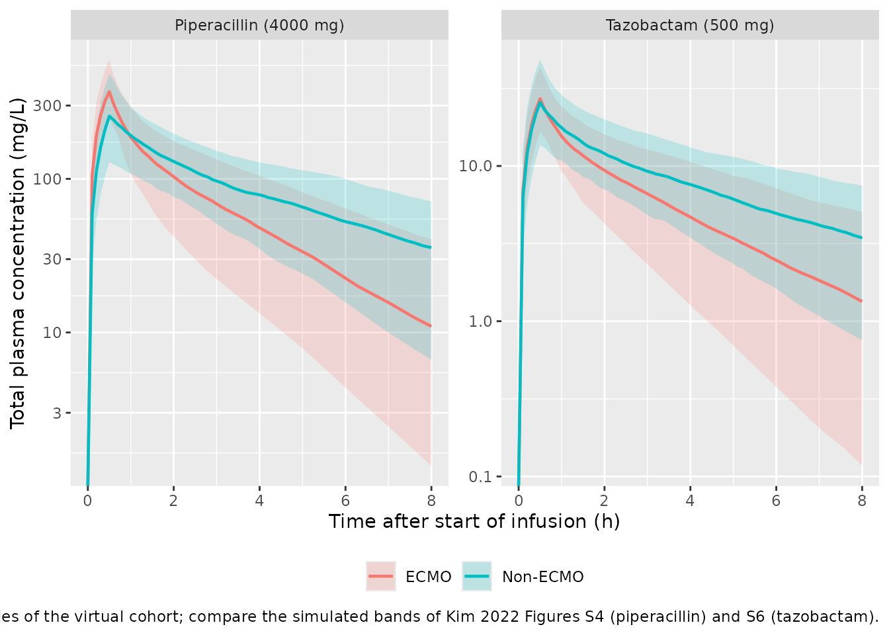
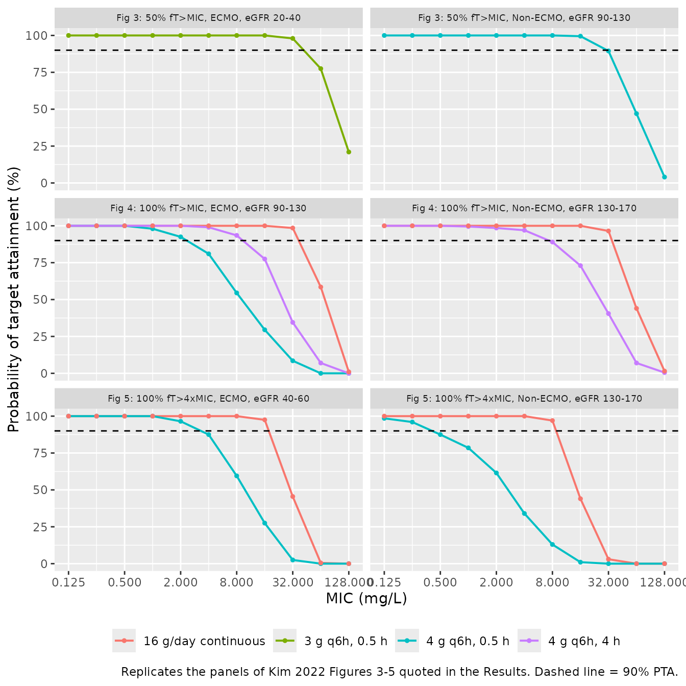

# Piperacillin + tazobactam in critically ill adults with and without ECMO (Kim 2022)

## Model and source

Kim 2022 fitted piperacillin and tazobactam in **two separate** NONMEM
runs (Tables 2 and 3; the Discussion lists the lack of an integrated
piperacillin-tazobactam model as a limitation). Both share the same
structure – a two-compartment model with fixed allometric weight
scaling, an exponential effect of the cystatin-C CKD-EPI eGFR on
clearance, and separate typical central volumes with separate IIV for
patients on and off extracorporeal membrane oxygenation (ECMO) – but
every estimate is drug-specific. The paper therefore contributes two
model files, validated side by side here.

``` r

pip <- rxode2::rxode(readModelDb("Kim_2022_piperacillin"))
#> ℹ parameter labels from comments will be replaced by 'label()'
taz <- rxode2::rxode(readModelDb("Kim_2022_tazobactam"))
#> ℹ parameter labels from comments will be replaced by 'label()'
```

- Citation: Kim YK, Kim HS, Park S, Kim HI, Lee SH, Lee DH. Population
  pharmacokinetics of piperacillin/tazobactam in critically ill Korean
  patients and the effects of extracorporeal membrane oxygenation. J
  Antimicrob Chemother. 2022;77(5):1353-1364. <doi:10.1093/jac/dkac059>.
  Parameter estimates: Table 2. Structural equations: NONMEM control
  stream in the Supplementary data (ADVAN3 TRANS4).
- Piperacillin model: Two-compartment population PK model for
  piperacillin in 38 critically ill Korean adults (19 on extracorporeal
  membrane oxygenation, ECMO) given piperacillin/tazobactam as 30-min IV
  infusions every 6 or 8 h (Kim 2022); zero-order IV input into the
  central compartment, first-order elimination, fixed allometric weight
  scaling (exponent 0.75 on CL and Q, 1 on VC and VP, reference 70 kg),
  an exponential effect of cystatin-C CKD-EPI eGFR on CL, and separate
  typical central volumes (each with its own IIV) for patients on and
  off ECMO.
- Tazobactam model: Two-compartment population PK model for tazobactam
  in 38 critically ill Korean adults (19 on extracorporeal membrane
  oxygenation, ECMO) given piperacillin/tazobactam as 30-min IV
  infusions every 6 or 8 h (Kim 2022); zero-order IV input into the
  central compartment, first-order elimination, fixed allometric weight
  scaling (exponent 0.75 on CL and Q, 1 on VC and VP, reference 70 kg),
  an exponential effect of cystatin-C CKD-EPI eGFR on CL, and separate
  typical central volumes (each with its own IIV) for patients on and
  off ECMO.
- Article: <https://doi.org/10.1093/jac/dkac059>

## Population

Kim 2022 prospectively enrolled 38 critically ill adults at Hallym
University Sacred Heart Hospital (Anyang, Korea) between September 2020
and April 2021: 19 on ECMO (18 veno-arterial, 1 veno-venous) and 19 not
on ECMO. Patients received piperacillin/tazobactam 2000/250, 3000/375 or
4000/500 mg as 30-minute infusions every 6 or 8 hours, and six plasma
samples were drawn over the first dosing interval after enrolment (226
samples in total, LC-MS/MS).

Table 1 of the paper reports medians (IQR). ECMO patients were younger
(58 vs 79 years), heavier (70 vs 54 kg) and sicker (APACHE II 24 vs 17;
SOFA 9 vs 5) than non-ECMO patients. The cystatin-C CKD-EPI eGFR that
enters the final models was 52.8 (38.7-81.0) mL/min/1.73 m^2 overall,
72.5 (43.4-81.7) on ECMO and 46.8 (34.1-73.2) off ECMO. Eight patients
received continuous renal replacement therapy.

``` r

str(pip$population)
#> List of 13
#>  $ species       : chr "human"
#>  $ n_subjects    : num 38
#>  $ n_studies     : num 1
#>  $ n_observations: num 226
#>  $ age_range     : chr "Median 66.5 years (IQR 53.3-78.8); ECMO 58 (46.5-64.5), non-ECMO 79 (67.5-83)"
#>  $ weight_range  : chr "Median 60 kg (IQR 50-70); ECMO 70 (55-72.4), non-ECMO 54 (46-61)"
#>  $ sex_female_pct: num 34.2
#>  $ race_ethnicity: chr "Korean (all participants)"
#>  $ disease_state : chr "Critically ill adults in the ICU receiving piperacillin/tazobactam for nosocomial infection, empirical manageme"| __truncated__
#>  $ dose_range    : chr "Piperacillin/tazobactam 2000/250, 3000/375 or 4000/500 mg as 30-min IV infusions every 6 or 8 h"
#>  $ regions       : chr "Republic of Korea (Hallym University Sacred Heart Hospital, Anyang)"
#>  $ renal_function: chr "CKD-EPI cystatin C eGFR median 52.8 mL/min/1.73 m^2 (IQR 38.7-81.0); 8 patients on CRRT"
#>  $ notes         : chr "Prospective study, September 2020 to April 2021. Six samples per patient over the first dosing interval after e"| __truncated__
```

## Source trace

The structural equations come from the NONMEM control stream printed in
the Supplementary data (`ADVAN3 TRANS4`):

    CL = THETA(1) * (WT/70)**0.75 * EXP(THETA(7) * (CECYS - 52.77)) * EXP(ETA(1))
    V1 = ECMO * THETA(2) * (WT/70) * EXP(ETA(2)) + (1 - ECMO) * THETA(6) * (WT/70) * EXP(ETA(3))
    Q  = THETA(3) * (WT/70)**0.75
    V2 = THETA(4) * (WT/70)
    W  = SQRT(THETA(5)**2 * IPRED**2)   ($SIGMA 1 FIX)

| Equation / parameter | Piperacillin (Table 2) | Tazobactam (Table 3) | Source location |
|----|----|----|----|
| `lcl` (theta1, L/h) | 5.05 (RSE 6.67%) | 6.33 (RSE 8.13%) | Tables 2/3, theta1 |
| `e_crcl_cl` (theta2, per mL/min/1.73 m^2) | 0.00932 (RSE 13.5%) | 0.0113 (RSE 13.9%) | Tables 2/3, theta2 |
| CRCL centring value | 52.77 | 52.77 | Tables 2/3 equation; control stream |
| `lvc_ecmo` (L) | 7.38 (RSE 15.0%) | 13.3 (RSE 11.3%) | Tables 2/3, VC_ECMO |
| `lvc_nonecmo` (L) | 16.5 (RSE 18.0%) | 20.2 (RSE 19.1%) | Tables 2/3, VC_nonECMO |
| `lq` (L/h) | 6.28 (RSE 23.9%) | 10.5 (RSE 24.3%) | Tables 2/3, Q |
| `lvp` (L) | 6.27 (RSE 16.2%) | 8.96 (RSE 11.6%) | Tables 2/3, VP |
| `e_wt_cl_q` | 0.75, fixed | 0.75, fixed | Results (allometric `k`); control stream |
| `e_wt_vc_vp` | 1, fixed | 1, fixed | Results (allometric `k`); control stream |
| `etalcl` | 33.7% -\> 0.107570 | 37.9% -\> 0.134217 | Tables 2/3, IIV CL |
| `etalvc_ecmo` | 45.9% -\> 0.191183 | 38.6% -\> 0.138889 | Tables 2/3, IIV VC_ECMO |
| `etalvc_nonecmo` | 65.3% -\> 0.355160 | 64.8% -\> 0.350589 | Tables 2/3, IIV VC_nonECMO |
| `propSd` | 0.269 | 0.229 | Tables 2/3, proportional error |
| Reference weight | 70 kg | 70 kg | Results (allometric equation); control stream |

Each IIV percentage is converted with `omega^2 = log(1 + CV^2)`. The
proportional error is the estimated `THETA(5)` (an SD, since `$SIGMA` is
fixed to 1).

## Typical-value checks against Table 4

Table 4 of the paper converts the typical estimates to weight-normalised
values for comparison with earlier piperacillin studies. It lists the
ECMO patient at 70 kg with renal function 72.5 mL/min/1.73 m^2, and the
non-ECMO patient at 54 kg with renal function 53.1. The half-life column
is the elimination half-life `log(2) * VC / CL`, not the terminal
half-life.

``` r

typical_pk <- function(ui, wt, crcl, ecmo, allometry = TRUE) {
  th <- ui$theta
  a_cl <- if (allometry) (wt / 70)^0.75 else 1
  a_v <- if (allometry) wt / 70 else 1
  cl <- exp(th[["lcl"]]) * a_cl * exp(th[["e_crcl_cl"]] * (crcl - 52.77))
  vc <- exp(if (ecmo == 1) th[["lvc_ecmo"]] else th[["lvc_nonecmo"]]) * a_v
  q <- exp(th[["lq"]]) * a_cl
  vp <- exp(th[["lvp"]]) * a_v
  c(
    CL = cl / wt, VC = vc / wt, Q = q / wt, VP = vp / wt,
    VSS = (vc + vp) / wt, thalf = log(2) * vc / cl
  )
}

table4 <- rbind(
  "Published, ECMO" = c(0.0867, 0.105, 0.0897, 0.090, 0.195, 0.840),
  "Model, ECMO (70 kg)" = typical_pk(pip, 70, 72.5, 1),
  "Published, non-ECMO" = c(0.0940, 0.306, 0.116, 0.116, 0.422, 2.26),
  "Model, non-ECMO (54 kg, with allometry)" = typical_pk(pip, 54, 53.1, 0),
  "Model, non-ECMO (54 kg, no allometry)" =
    typical_pk(pip, 54, 53.1, 0, allometry = FALSE)
)
colnames(table4) <- c(
  "CL (L/h/kg)", "VC (L/kg)", "Q (L/h/kg)", "VP (L/kg)", "VSS (L/kg)", "Half-life (h)"
)
knitr::kable(
  table4,
  digits = 4,
  caption = "Replicates the two 'This study' rows of Kim 2022 Table 4 (piperacillin)."
)
```

|  | CL (L/h/kg) | VC (L/kg) | Q (L/h/kg) | VP (L/kg) | VSS (L/kg) | Half-life (h) |
|:---|---:|---:|---:|---:|---:|---:|
| Published, ECMO | 0.0867 | 0.1050 | 0.0897 | 0.0900 | 0.1950 | 0.8400 |
| Model, ECMO (70 kg) | 0.0867 | 0.1054 | 0.0897 | 0.0896 | 0.1950 | 0.8428 |
| Published, non-ECMO | 0.0940 | 0.3060 | 0.1160 | 0.1160 | 0.4220 | 2.2600 |
| Model, non-ECMO (54 kg, with allometry) | 0.0772 | 0.2357 | 0.0957 | 0.0896 | 0.3253 | 2.1160 |
| Model, non-ECMO (54 kg, no allometry) | 0.0938 | 0.3056 | 0.1163 | 0.1161 | 0.4217 | 2.2578 |

Replicates the two ‘This study’ rows of Kim 2022 Table 4 (piperacillin).
{.table}

``` r


# The ECMO row is reproduced by the model as coded (the patient is at the 70 kg
# reference weight, so allometry is inert). Rounding of the published values
# to three significant figures is the only difference.
rel_ecmo <- table4["Model, ECMO (70 kg)", ] / table4["Published, ECMO", ] - 1
stopifnot(all(abs(rel_ecmo) < 0.01))

# The published non-ECMO row is reproduced only when the allometric factor is
# left out (see the Errata section below).
rel_non <- table4["Model, non-ECMO (54 kg, no allometry)", ] /
  table4["Published, non-ECMO", ] - 1
stopifnot(all(abs(rel_non) < 0.01))
```

The ECMO row agrees to within rounding. The published non-ECMO row is
matched exactly by `theta / 54` without the `(WT/70)` scaling, so Table
4 seems to have divided the 70-kg typical values by 54 kg without first
scaling them to a 54-kg patient. The model files follow the control
stream, which applies allometry to all four parameters.

## Virtual cohort

Weight and eGFR are drawn per ECMO group as log-normal variates centred
on the Table 1 group medians, with a log-scale SD back-calculated from
each IQR. There are 200 subjects per group.

``` r

set.seed(20220205)
rxode2::rxSetSeed(20220205)
n_arm <- 200

iqr_sd <- function(lo, hi) log(hi / lo) / (2 * qnorm(0.75))

cohort <- bind_rows(
  tibble(
    ECMO_STATUS = 1L,
    WT = exp(rnorm(n_arm, log(70), iqr_sd(55, 72.4))),
    CRCL = exp(rnorm(n_arm, log(72.5), iqr_sd(43.4, 81.7)))
  ),
  tibble(
    ECMO_STATUS = 0L,
    WT = exp(rnorm(n_arm, log(54), iqr_sd(46, 61))),
    CRCL = exp(rnorm(n_arm, log(46.8), iqr_sd(34.1, 73.2)))
  )
) |>
  mutate(
    id = row_number(),
    group = ifelse(ECMO_STATUS == 1L, "ECMO", "Non-ECMO")
  )

cohort |>
  group_by(group) |>
  summarise(
    N = n(),
    `Median WT (kg)` = median(WT),
    `Median eGFR (mL/min/1.73 m^2)` = median(CRCL),
    .groups = "drop"
  ) |>
  rename(Group = group) |>
  knitr::kable(digits = 1, caption = "Virtual cohort covariates.")
```

| Group    |   N | Median WT (kg) | Median eGFR (mL/min/1.73 m^2) |
|:---------|----:|---------------:|------------------------------:|
| ECMO     | 200 |           68.5 |                          75.3 |
| Non-ECMO | 200 |           54.8 |                          47.7 |

Virtual cohort covariates. {.table}

## Simulation

Each subject receives a single 4000/500 mg piperacillin/tazobactam dose
infused over 30 minutes and is observed on the central compartment for
24 hours.

``` r

dose_dur <- 0.5
make_events <- function(subjects, amt, t_end = 24, by = 0.1) {
  dosing <- subjects |>
    mutate(time = 0, amt = amt, rate = amt / dose_dur, evid = 1L, cmt = "central")
  obs <- subjects |>
    tidyr::crossing(time = seq(0, t_end, by = by)) |>
    mutate(amt = NA_real_, rate = NA_real_, evid = 0L, cmt = "central")
  bind_rows(dosing, obs) |> arrange(id, time, desc(evid))
}

subjects <- cohort |> select(id, group, WT, CRCL, ECMO_STATUS)
ev_pip <- make_events(subjects, 4000)
ev_taz <- make_events(subjects, 500)

solve_with_group <- function(ui, events) {
  rxode2::rxSolve(ui, select(events, -group)) |>
    as.data.frame() |>
    left_join(distinct(events, id, group), by = "id")
}
sim_pip <- solve_with_group(pip, ev_pip)
sim_taz <- solve_with_group(taz, ev_taz)
stopifnot(
  n_distinct(sim_pip$id) == 2 * n_arm,
  n_distinct(sim_taz$id) == 2 * n_arm,
  !anyNA(sim_pip$Cc), !anyNA(sim_taz$Cc)
)
```

## Concentration-time profiles

``` r

bind_rows(
  sim_pip |> mutate(drug = "Piperacillin (4000 mg)"),
  sim_taz |> mutate(drug = "Tazobactam (500 mg)")
) |>
  filter(time <= 8) |>
  group_by(drug, group, time) |>
  summarise(
    p10 = quantile(Cc, 0.1), p50 = median(Cc), p90 = quantile(Cc, 0.9),
    .groups = "drop"
  ) |>
  ggplot(aes(time, p50, colour = group, fill = group)) +
  geom_ribbon(aes(ymin = p10, ymax = p90), alpha = 0.2, colour = NA) +
  geom_line(linewidth = 0.8) +
  facet_wrap(~drug, scales = "free_y") +
  scale_y_log10() +
  labs(
    x = "Time after start of infusion (h)", y = "Total plasma concentration (mg/L)",
    colour = NULL, fill = NULL,
    caption = paste(
      "Median and 10th-90th percentiles of the virtual cohort; compare the",
      "simulated bands of Kim 2022 Figures S4 (piperacillin) and S6 (tazobactam)."
    )
  ) +
  theme(legend.position = "bottom")
#> Warning in scale_y_log10(): log-10 transformation introduced infinite values.
#> log-10 transformation introduced infinite values.
#> log-10 transformation introduced infinite values.
#> log-10 transformation introduced infinite values.
```



The smaller central volume on ECMO gives a higher, earlier peak for both
drugs. The paper reports the same finding: ECMO use reduced the central
volume.

## PKNCA validation

``` r

nca_for <- function(sim, events, drug) {
  conc <- sim |>
    filter(!is.na(Cc)) |>
    transmute(id, time, Cc = pmax(Cc, 0), treatment = paste(drug, group, sep = ", "))
  conc <- bind_rows(
    conc,
    conc |> distinct(id, treatment) |> mutate(time = 0, Cc = 0)
  ) |>
    distinct(id, treatment, time, .keep_all = TRUE) |>
    arrange(id, treatment, time)

  dose_df <- events |>
    filter(evid == 1) |>
    transmute(id, time, amt, treatment = paste(drug, group, sep = ", "), duration = dose_dur)

  conc_obj <- PKNCA::PKNCAconc(conc, Cc ~ time | treatment + id, concu = "mg/L", timeu = "h")
  dose_obj <- PKNCA::PKNCAdose(
    dose_df, amt ~ time | treatment + id,
    doseu = "mg", route = "intravascular", duration = "duration"
  )
  intervals <- data.frame(
    start = 0, end = Inf,
    cmax = TRUE, aucinf.obs = TRUE, half.life = TRUE, cl.obs = TRUE, vss.iv.obs = TRUE
  )
  PKNCA::pk.nca(PKNCA::PKNCAdata(conc_obj, dose_obj, intervals = intervals))
}

nca_cohort <- bind_rows(
  as.data.frame(nca_for(sim_pip, ev_pip, "Piperacillin")$result),
  as.data.frame(nca_for(sim_taz, ev_taz, "Tazobactam")$result)
)

nca_units <- c(
  cmax = "mg/L", aucinf.obs = "mg*h/L", half.life = "h", cl.obs = "L/h", vss.iv.obs = "L"
)
nca_cohort |>
  filter(!is.na(PPORRES), PPTESTCD %in% names(nca_units)) |>
  group_by(treatment, PPTESTCD) |>
  summarise(
    Median = median(PPORRES),
    P5 = quantile(PPORRES, 0.05),
    P95 = quantile(PPORRES, 0.95),
    .groups = "drop"
  ) |>
  mutate(PPTESTCD = nlmixr2lib::ncaParamLabel(PPTESTCD, units = nca_units)) |>
  rename(
    Treatment = treatment, `NCA parameter` = PPTESTCD,
    `5th percentile` = P5, `95th percentile` = P95
  ) |>
  knitr::kable(
    digits = 2,
    caption = "Simulated NCA parameters (single 4000/500 mg dose, 0.5 h infusion)."
  )
```

| Treatment | NCA parameter | Median | 5th percentile | 95th percentile |
|:---|:---|---:|---:|---:|
| Piperacillin, ECMO | AUC0-∞ (obs) (mg\*h/L) | 671.11 | 291.86 | 1593.17 |
| Piperacillin, ECMO | CL/F (L/h) | 5.96 | 2.51 | 13.71 |
| Piperacillin, ECMO | Cmax (mg/L) | 369.69 | 228.33 | 665.65 |
| Piperacillin, ECMO | t½ (h) | 1.94 | 1.07 | 3.68 |
| Piperacillin, ECMO | Vss (IV) (L) | 13.32 | 8.38 | 21.29 |
| Piperacillin, Non-ECMO | AUC0-∞ (obs) (mg\*h/L) | 971.07 | 355.09 | 2098.99 |
| Piperacillin, Non-ECMO | CL/F (L/h) | 4.12 | 1.91 | 11.26 |
| Piperacillin, Non-ECMO | Cmax (mg/L) | 256.05 | 116.10 | 559.61 |
| Piperacillin, Non-ECMO | t½ (h) | 3.20 | 1.49 | 8.55 |
| Piperacillin, Non-ECMO | Vss (IV) (L) | 17.84 | 9.50 | 37.71 |
| Tazobactam, ECMO | AUC0-∞ (obs) (mg\*h/L) | 60.35 | 23.73 | 153.39 |
| Tazobactam, ECMO | CL/F (L/h) | 8.28 | 3.26 | 21.07 |
| Tazobactam, ECMO | Cmax (mg/L) | 27.13 | 14.11 | 48.15 |
| Tazobactam, ECMO | t½ (h) | 2.11 | 1.07 | 4.64 |
| Tazobactam, ECMO | Vss (IV) (L) | 22.11 | 13.25 | 38.25 |
| Tazobactam, Non-ECMO | AUC0-∞ (obs) (mg\*h/L) | 95.05 | 40.04 | 208.11 |
| Tazobactam, Non-ECMO | CL/F (L/h) | 5.26 | 2.40 | 12.49 |
| Tazobactam, Non-ECMO | Cmax (mg/L) | 25.73 | 10.19 | 58.21 |
| Tazobactam, Non-ECMO | t½ (h) | 3.08 | 1.45 | 9.97 |
| Tazobactam, Non-ECMO | Vss (IV) (L) | 22.41 | 11.84 | 52.91 |

Simulated NCA parameters (single 4000/500 mg dose, 0.5 h infusion).
{.table}

### Comparison against published values

Kim 2022 reports no NCA. The reference values below come from the
published typical estimates for the patient profiles used in Table 4
(ECMO: 70 kg, eGFR 72.5; non-ECMO: 54 kg, eGFR 53.1): `CL` from the
clearance equation, `AUCinf = Dose / CL`, and `Vss = VC + VP`. The
simulation is a typical-value (`zeroRe()`) solve for those two patients,
so this is an identity check on the transcription and on the covariate
equations.

``` r

typ_subjects <- tibble(
  id = 1:2, group = c("ECMO", "Non-ECMO"),
  WT = c(70, 54), CRCL = c(72.5, 53.1), ECMO_STATUS = c(1L, 0L)
)
ev_typ_pip <- make_events(typ_subjects, 4000, t_end = 48, by = 0.02)
ev_typ_taz <- make_events(typ_subjects, 500, t_end = 48, by = 0.02)
typ_pip <- solve_with_group(rxode2::zeroRe(pip), ev_typ_pip)
#> ℹ omega/sigma items treated as zero: 'etalcl', 'etalvc_ecmo', 'etalvc_nonecmo'
#> Warning: multi-subject simulation without without 'omega'
typ_taz <- solve_with_group(rxode2::zeroRe(taz), ev_typ_taz)
#> ℹ omega/sigma items treated as zero: 'etalcl', 'etalvc_ecmo', 'etalvc_nonecmo'
#> Warning: multi-subject simulation without without 'omega'

nca_typ <- bind_rows(
  as.data.frame(nca_for(typ_pip, ev_typ_pip, "Piperacillin")$result),
  as.data.frame(nca_for(typ_taz, ev_typ_taz, "Tazobactam")$result)
)

reference <- bind_rows(lapply(seq_len(nrow(typ_subjects)), function(i) {
  s <- typ_subjects[i, ]
  bind_rows(lapply(list(Piperacillin = list(pip, 4000), Tazobactam = list(taz, 500)), function(x) {
    th <- x[[1]]$theta
    cl <- exp(th[["lcl"]]) * (s$WT / 70)^0.75 * exp(th[["e_crcl_cl"]] * (s$CRCL - 52.77))
    vc <- exp(if (s$ECMO_STATUS == 1L) th[["lvc_ecmo"]] else th[["lvc_nonecmo"]]) * s$WT / 70
    vp <- exp(th[["lvp"]]) * s$WT / 70
    tibble(aucinf.obs = x[[2]] / cl, cl.obs = cl, vss.iv.obs = vc + vp)
  }), .id = "drug") |>
    mutate(treatment = paste(drug, s$group, sep = ", ")) |>
    select(-drug)
}))

cmp <- nlmixr2lib::ncaComparisonTable(
  simulated = nca_typ,
  reference = reference,
  by = "treatment",
  units = c(aucinf.obs = "mg*h/L", cl.obs = "L/h", vss.iv.obs = "L"),
  tolerance_pct = 20
)
knitr::kable(
  cmp,
  caption = "Simulated (typical patient) vs. published-parameter NCA. * differs from reference by >20%."
)
```

| NCA parameter          | treatment              | Reference | Simulated | % diff |
|:-----------------------|:-----------------------|:----------|:----------|:-------|
| AUC0-∞ (obs) (mg\*h/L) | Piperacillin, ECMO     | 659       | 659       | -0.0%  |
| AUC0-∞ (obs) (mg\*h/L) | Tazobactam, ECMO       | 63.2      | 63.2      | -0.0%  |
| AUC0-∞ (obs) (mg\*h/L) | Piperacillin, Non-ECMO | 959       | 959       | -0.0%  |
| AUC0-∞ (obs) (mg\*h/L) | Tazobactam, Non-ECMO   | 95.6      | 95.6      | -0.0%  |
| CL/F (L/h)             | Piperacillin, ECMO     | 6.07      | 6.07      | +0.0%  |
| CL/F (L/h)             | Tazobactam, ECMO       | 7.91      | 7.91      | +0.0%  |
| CL/F (L/h)             | Piperacillin, Non-ECMO | 4.17      | 4.17      | +0.0%  |
| CL/F (L/h)             | Tazobactam, Non-ECMO   | 5.23      | 5.23      | +0.0%  |
| Vss (IV) (L)           | Piperacillin, ECMO     | 13.6      | 13.7      | +0.0%  |
| Vss (IV) (L)           | Tazobactam, ECMO       | 22.3      | 22.3      | +0.0%  |
| Vss (IV) (L)           | Piperacillin, Non-ECMO | 17.6      | 17.6      | +0.0%  |
| Vss (IV) (L)           | Tazobactam, Non-ECMO   | 22.5      | 22.5      | +0.0%  |

Simulated (typical patient) vs. published-parameter NCA. \* differs from
reference by \>20%. {.table style="width:100%;"}

``` r


stopifnot(nrow(cmp) == 12L, !any(grepl("\\*", cmp$`% diff`)))

sim_value <- function(trt, code) {
  v <- nca_typ$PPORRES[nca_typ$treatment == trt & nca_typ$PPTESTCD == code]
  if (length(v) != 1L) stop("no unique NCA row for '", trt, "' / ", code)
  v
}
for (i in seq_len(nrow(reference))) {
  for (code in c("aucinf.obs", "cl.obs", "vss.iv.obs")) {
    ref <- reference[[code]][[i]]
    stopifnot(abs(sim_value(reference$treatment[[i]], code) / ref - 1) < 0.01)
  }
}
```

Every row matches its reference to within 1%. The small remaining
difference comes from extrapolating the 48-hour profile to infinity and
from the trapezoidal integration.

## Probability of target attainment (Figures 3-5)

The paper’s second simulation drew 1,000 virtual patients per scenario.
It used log-normal IIV on the PK parameters, eGFR drawn uniformly within
each renal function band, and a fixed unbound piperacillin fraction of
0.91. Target attainment is the fraction of patients whose free
piperacillin stays above the target at steady state for the required
share of the dosing interval. The paper does not say what body weight
the virtual patients had, so the ECMO and non-ECMO group medians (70 and
54 kg) are used here (see Assumptions). Each scenario simulates 200
patients. The doses are numbered as in the paper: “4 g” is 4000 mg
piperacillin (4.5 g piperacillin/tazobactam), and continuous infusion
gives the same 16 g/day.

``` r

fu <- 0.91
tau <- 6
n_pta <- 200

pta_sim <- function(ecmo, crcl_lo, crcl_hi, amt, dur, continuous = FALSE) {
  subj <- tibble(
    id = seq_len(n_pta), WT = if (ecmo == 1L) 70 else 54,
    CRCL = runif(n_pta, crcl_lo, crcl_hi), ECMO_STATUS = ecmo
  )
  if (continuous) {
    dosing <- subj |> mutate(time = 0, amt = 16000 * 3, rate = 16000 / 24)
  } else {
    dosing <- subj |>
      tidyr::crossing(time = seq(0, 42, by = tau)) |>
      mutate(amt = amt, rate = amt / dur)
  }
  dosing <- dosing |> mutate(evid = 1L, cmt = "central")
  # The 8th dosing interval (42-48 h) is at steady state for every eGFR band.
  obs <- subj |>
    tidyr::crossing(time = seq(42, 48, by = 0.05)) |>
    mutate(amt = NA_real_, rate = NA_real_, evid = 0L, cmt = "central")
  ev <- bind_rows(dosing, obs) |> arrange(id, time, desc(evid))
  sim <- rxode2::rxSolve(pip, ev) |> as.data.frame()
  stopifnot(n_distinct(sim$id) == n_pta, !anyNA(sim$Cc))
  sim
}

pta_value <- function(sim, mic, frac, mult) {
  ft <- tapply(fu * sim$Cc > mult * mic, sim$id, mean)
  100 * mean(ft >= frac - 1e-9)
}

scenarios <- tibble::tribble(
  ~figure, ~target, ~frac, ~mult, ~group, ~ecmo, ~lo, ~hi, ~regimen, ~amt, ~dur, ~cont,
  "3", "50% fT>MIC", 0.5, 1, "ECMO", 1L, 20, 40, "3 g q6h, 0.5 h", 3000, 0.5, FALSE,
  "3", "50% fT>MIC", 0.5, 1, "Non-ECMO", 0L, 90, 130, "4 g q6h, 0.5 h", 4000, 0.5, FALSE,
  "4", "100% fT>MIC", 1, 1, "ECMO", 1L, 90, 130, "4 g q6h, 0.5 h", 4000, 0.5, FALSE,
  "4", "100% fT>MIC", 1, 1, "ECMO", 1L, 90, 130, "4 g q6h, 4 h", 4000, 4, FALSE,
  "4", "100% fT>MIC", 1, 1, "ECMO", 1L, 90, 130, "16 g/day continuous", NA, NA, TRUE,
  "4", "100% fT>MIC", 1, 1, "Non-ECMO", 0L, 130, 170, "4 g q6h, 4 h", 4000, 4, FALSE,
  "4", "100% fT>MIC", 1, 1, "Non-ECMO", 0L, 130, 170, "16 g/day continuous", NA, NA, TRUE,
  "5", "100% fT>4xMIC", 1, 4, "ECMO", 1L, 40, 60, "4 g q6h, 0.5 h", 4000, 0.5, FALSE,
  "5", "100% fT>4xMIC", 1, 4, "ECMO", 1L, 40, 60, "16 g/day continuous", NA, NA, TRUE,
  "5", "100% fT>4xMIC", 1, 4, "Non-ECMO", 0L, 130, 170, "4 g q6h, 0.5 h", 4000, 0.5, FALSE,
  "5", "100% fT>4xMIC", 1, 4, "Non-ECMO", 0L, 130, 170, "16 g/day continuous", NA, NA, TRUE
) |>
  mutate(scenario = row_number())

pta_sims <- lapply(seq_len(nrow(scenarios)), function(i) {
  s <- scenarios[i, ]
  pta_sim(s$ecmo, s$lo, s$hi, s$amt, s$dur, s$cont)
})

mic_grid <- 2^(-3:7)
pta_curves <- bind_rows(lapply(seq_len(nrow(scenarios)), function(i) {
  s <- scenarios[i, ]
  tibble(
    scenario = i, MIC = mic_grid,
    PTA = vapply(mic_grid, function(m) pta_value(pta_sims[[i]], m, s$frac, s$mult), numeric(1))
  )
})) |>
  left_join(scenarios, by = "scenario") |>
  mutate(panel = sprintf("Fig %s: %s, %s, eGFR %g-%g", figure, target, group, lo, hi))
```

``` r

ggplot(pta_curves, aes(MIC, PTA, colour = regimen)) +
  geom_line(linewidth = 0.7) +
  geom_point(size = 1) +
  geom_hline(yintercept = 90, linetype = "dashed") +
  facet_wrap(~panel, ncol = 2) +
  scale_x_log10(breaks = c(0.125, 0.5, 2, 8, 32, 128)) +
  labs(
    x = "MIC (mg/L)", y = "Probability of target attainment (%)", colour = NULL,
    caption = paste(
      "Replicates the panels of Kim 2022 Figures 3-5 quoted in the Results.",
      "Dashed line = 90% PTA."
    )
  ) +
  theme(legend.position = "bottom", strip.text = element_text(size = 7))
```



The Results section states, for each panel, the highest MIC at which a
regimen reaches 90% PTA. Each statement is a pair of claims: at least
90% at the stated MIC, and below 90% one dilution higher. The table
checks every claim. Only claims whose model-predicted PTA is at least 3
binomial standard errors from 90% at `n = 200` are gated with
[`stopifnot()`](https://rdrr.io/r/base/stopifnot.html). The others sit
within sampling noise of the threshold. The model-predicted values below
come from a 2,000-patient run made while writing this article.

``` r

claim <- function(scen, mic, expect_ge90, model_true) {
  v <- pta_curves$PTA[pta_curves$scenario == scen & pta_curves$MIC == mic]
  if (length(v) != 1L) stop("no unique PTA row for scenario ", scen, " at MIC ", mic)
  se <- 100 * sqrt(model_true / 100 * (1 - model_true / 100) / n_pta)
  tibble(
    scenario = scen, MIC = mic,
    Claim = if (expect_ge90) ">= 90%" else "< 90%",
    `PTA (n = 200)` = v,
    `PTA (n = 2000)` = model_true,
    Gated = abs(model_true - 90) >= 3 * max(se, 0.5),
    Agrees = if (expect_ge90) v >= 90 else v < 90
  )
}

claims <- bind_rows(
  claim(1, 32, TRUE, 97.9), claim(1, 64, FALSE, 77.0),
  claim(2, 16, TRUE, 97.5), claim(2, 32, FALSE, 87.9),
  claim(3, 2, TRUE, 94.7), claim(3, 4, FALSE, 81.5),
  claim(4, 8, TRUE, 92.5), claim(4, 16, FALSE, 75.3),
  claim(5, 32, TRUE, 99.1), claim(5, 64, FALSE, 62.5),
  claim(6, 4, TRUE, 97.2), claim(6, 8, FALSE, 88.8),
  claim(7, 32, TRUE, 96.2), claim(7, 64, FALSE, 42.0),
  claim(8, 1, TRUE, 99.2), claim(8, 2, FALSE, 96.2),
  claim(9, 16, TRUE, 97.9), claim(9, 32, FALSE, 45.1),
  claim(10, 0.25, TRUE, 95.8), claim(10, 0.5, FALSE, 87.9),
  claim(11, 8, TRUE, 96.2), claim(11, 16, FALSE, 39.4)
) |>
  left_join(select(scenarios, scenario, figure, group, lo, hi, regimen), by = "scenario") |>
  mutate(
    # Figure 5, ECMO, eGFR 40-60: the paper says 4 g q6h over 0.5 h misses the
    # target from MIC 2 mg/L; the model gives about 96% there (see Errata).
    Deviation = scenario == 8 & MIC == 2,
    `eGFR band` = sprintf("%g-%g", lo, hi),
    MIC = vapply(MIC, format, character(1), trim = TRUE)
  )

claims |>
  select(
    Figure = figure, Group = group, `eGFR band`, Regimen = regimen, `MIC (mg/L)` = MIC,
    Claim, `PTA (n = 200)`, `PTA (n = 2000)`, Gated, Agrees, Deviation
  ) |>
  knitr::kable(digits = 1, caption = "Target-attainment breakpoints stated in the Kim 2022 Results.")
```

| Figure | Group | eGFR band | Regimen | MIC (mg/L) | Claim | PTA (n = 200) | PTA (n = 2000) | Gated | Agrees | Deviation |
|:---|:---|:---|:---|:---|:---|---:|---:|:---|:---|:---|
| 3 | ECMO | 20-40 | 3 g q6h, 0.5 h | 32 | \>= 90% | 98.0 | 97.9 | TRUE | TRUE | FALSE |
| 3 | ECMO | 20-40 | 3 g q6h, 0.5 h | 64 | \< 90% | 77.5 | 77.0 | TRUE | TRUE | FALSE |
| 3 | Non-ECMO | 90-130 | 4 g q6h, 0.5 h | 16 | \>= 90% | 99.5 | 97.5 | TRUE | TRUE | FALSE |
| 3 | Non-ECMO | 90-130 | 4 g q6h, 0.5 h | 32 | \< 90% | 89.5 | 87.9 | FALSE | TRUE | FALSE |
| 4 | ECMO | 90-130 | 4 g q6h, 0.5 h | 2 | \>= 90% | 92.5 | 94.7 | FALSE | TRUE | FALSE |
| 4 | ECMO | 90-130 | 4 g q6h, 0.5 h | 4 | \< 90% | 81.0 | 81.5 | TRUE | TRUE | FALSE |
| 4 | ECMO | 90-130 | 4 g q6h, 4 h | 8 | \>= 90% | 93.5 | 92.5 | FALSE | TRUE | FALSE |
| 4 | ECMO | 90-130 | 4 g q6h, 4 h | 16 | \< 90% | 77.5 | 75.3 | TRUE | TRUE | FALSE |
| 4 | ECMO | 90-130 | 16 g/day continuous | 32 | \>= 90% | 98.5 | 99.1 | TRUE | TRUE | FALSE |
| 4 | ECMO | 90-130 | 16 g/day continuous | 64 | \< 90% | 58.5 | 62.5 | TRUE | TRUE | FALSE |
| 4 | Non-ECMO | 130-170 | 4 g q6h, 4 h | 4 | \>= 90% | 97.0 | 97.2 | TRUE | TRUE | FALSE |
| 4 | Non-ECMO | 130-170 | 4 g q6h, 4 h | 8 | \< 90% | 89.0 | 88.8 | FALSE | TRUE | FALSE |
| 4 | Non-ECMO | 130-170 | 16 g/day continuous | 32 | \>= 90% | 96.5 | 96.2 | TRUE | TRUE | FALSE |
| 4 | Non-ECMO | 130-170 | 16 g/day continuous | 64 | \< 90% | 44.0 | 42.0 | TRUE | TRUE | FALSE |
| 5 | ECMO | 40-60 | 4 g q6h, 0.5 h | 1 | \>= 90% | 100.0 | 99.2 | TRUE | TRUE | FALSE |
| 5 | ECMO | 40-60 | 4 g q6h, 0.5 h | 2 | \< 90% | 96.5 | 96.2 | TRUE | FALSE | TRUE |
| 5 | ECMO | 40-60 | 16 g/day continuous | 16 | \>= 90% | 97.5 | 97.9 | TRUE | TRUE | FALSE |
| 5 | ECMO | 40-60 | 16 g/day continuous | 32 | \< 90% | 45.5 | 45.1 | TRUE | TRUE | FALSE |
| 5 | Non-ECMO | 130-170 | 4 g q6h, 0.5 h | 0.25 | \>= 90% | 96.0 | 95.8 | TRUE | TRUE | FALSE |
| 5 | Non-ECMO | 130-170 | 4 g q6h, 0.5 h | 0.5 | \< 90% | 87.5 | 87.9 | FALSE | TRUE | FALSE |
| 5 | Non-ECMO | 130-170 | 16 g/day continuous | 8 | \>= 90% | 97.0 | 96.2 | TRUE | TRUE | FALSE |
| 5 | Non-ECMO | 130-170 | 16 g/day continuous | 16 | \< 90% | 44.0 | 39.4 | TRUE | TRUE | FALSE |

Target-attainment breakpoints stated in the Kim 2022 Results. {.table}

``` r


gated <- claims |> filter(Gated, !Deviation)
stopifnot(nrow(gated) >= 14L, all(gated$Agrees))
```

All 21 of the 22 claims reproduce with the 2,000-patient run (column
`PTA (n = 2000)`). The gated subset reproduces with 200 patients. The
one claim that does not reproduce is flagged in the `Deviation` column
and discussed under Errata. The paper’s main dosing conclusion also
holds. For ECMO patients with an eGFR of 90-130 mL/min/1.73 m^2, the
100% *f*T\>MIC breakpoint of 4 g q6h is 2 mg/L with a 30-minute
infusion. The same daily dose raises it to 8 mg/L as a 4-hour infusion
and to 32 mg/L as a continuous infusion, a gain of two and four doubling
dilutions.

## Assumptions and deviations

- **The IIV column of Tables 2 and 3 is read as a CV on the log-normal
  scale** and converted with `omega^2 = log(1 + CV^2)`. The paper prints
  only the percentage, and the supplementary control stream leaves
  `$OMEGA` empty. If the column were `100 * sqrt(omega^2)`, the
  variances would be 6-20% larger. The largest gap is on the non-ECMO
  central volume (0.426 vs 0.355).
- **Weight in the target-attainment simulations.** The paper says only
  that PK parameters were drawn log-normally and eGFR uniformly within
  each band. The ECMO and non-ECMO group median weights (70 and 54 kg)
  reproduce every stated breakpoint except one. Holding every patient at
  the 70-kg reference instead breaks two non-ECMO claims (continuous
  infusion at eGFR 130-170, Figures 4 and 5).
- **Virtual-cohort covariates** are drawn independently as log-normal
  variates matched to the Table 1 group medians and IQRs. No covariate
  correlations are reported.
- **CRRT** (8 patients, all on ECMO per Table 1) was not among the
  tested covariates and is not in the model. Renal function enters only
  through the cystatin-C eGFR.
- **Tazobactam target attainment** was not simulated in the paper and is
  not simulated here.

## Errata and internal inconsistencies in the source

- **Table 4, non-ECMO row.** The weight-normalised values (CL 0.0940
  L/h/kg, VC 0.306 L/kg, Q 0.116, VP 0.116, VSS 0.422, half-life 2.26 h)
  equal the 70-kg typical estimates divided by 54 kg, with no `(WT/70)`
  allometric scaling. The check above reproduces them to within
  rounding. With the allometric scaling that the control stream applies,
  a 54-kg non-ECMO patient has CL 0.0773 L/h/kg and VC 0.236 L/kg (the
  “with allometry” row of the table). The model files follow the control
  stream. Table 4 also uses different renal-function measures for its
  two rows: 72.5 is the ECMO median of the cystatin-C eGFR, but 53.1 is
  the non-ECMO median of the Cockcroft-Gault creatinine clearance (Table
  1).
- **CRRT counts.** The Results text says 1 of the 19 non-ECMO patients
  received CRRT, but Table 1 lists 0 of 19 (and 8 in total).
- **Figure 5, ECMO, eGFR 40-60 mL/min/1.73 m^2.** The Results state that
  4 g q6h over 0.5 h does not reach 90% PTA for 100% *f*T\>4xMIC once
  the MIC is at least 2 mg/L. The model gives about 96% at MIC 2 mg/L
  under either weight assumption. The paper does not report the weights
  of its virtual patients, so the cause cannot be settled. Every other
  breakpoint reproduces.
- No erratum or correction notice for Kim 2022 was found in Europe PMC
  (checked 2026-10-01).
