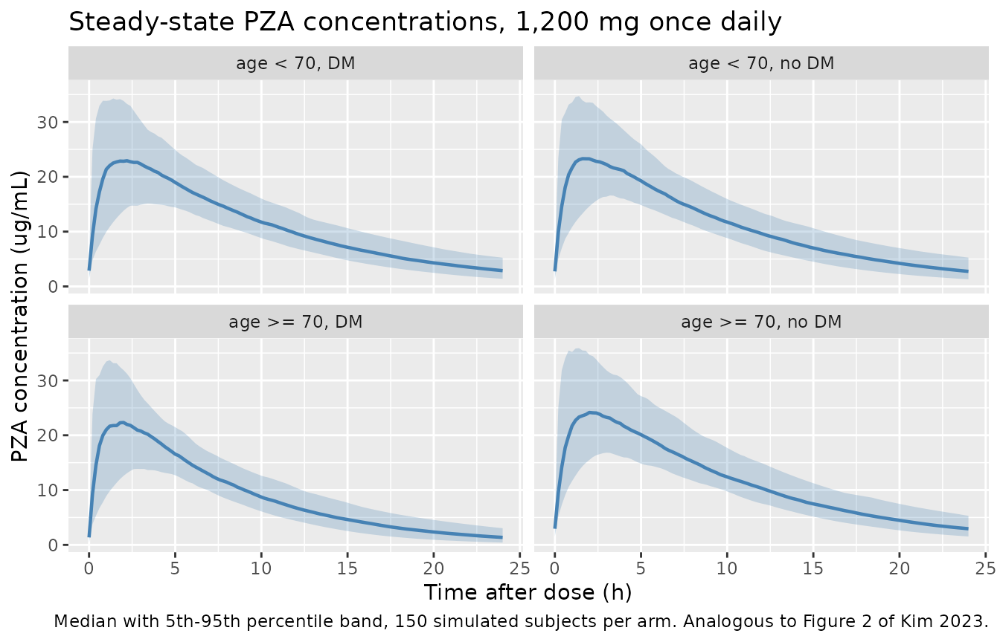
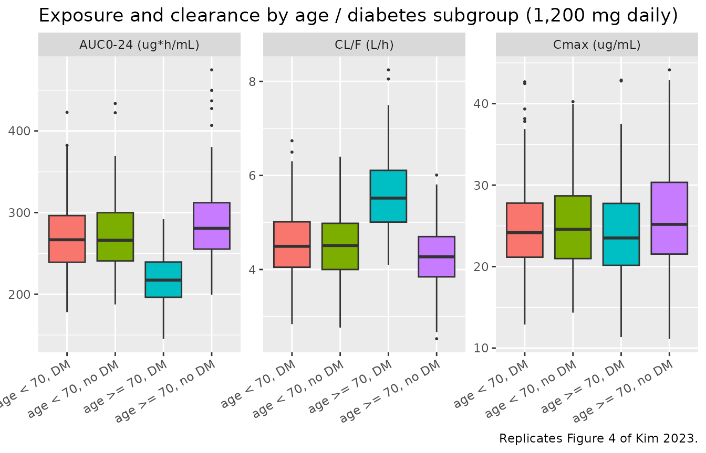

# Pyrazinamide (Kim 2023)

## Model and source

- Citation: Kim R, Jayanti RP, Lee H, Kim H-K, Kang J, Park I-N, Kim J,
  Oh JY, Kim HW, Lee H, Ghim J-L, Ahn S, Long NP, Cho Y-S, Shin J-G; on
  behalf of the cPMTb. Development of a population pharmacokinetic model
  of pyrazinamide to guide personalized therapy: impacts of geriatric
  and diabetes mellitus on clearance. Front Pharmacol. 2023;14:1116226.
  <doi:10.3389/fphar.2023.1116226>
- Description: One-compartment population pharmacokinetic model with
  first-order absorption and first-order elimination for oral
  pyrazinamide in Korean adults with drug-susceptible tuberculosis (Kim
  2023); lean body mass is an allometric covariate on CL/F and V/F
  (fixed exponents 0.75 and 1) and geriatric diabetes mellitus (age \>=
  70 years with diabetes mellitus) increases CL/F by 32%
- Article: <https://doi.org/10.3389/fphar.2023.1116226>
- Supplement (NONMEM control stream, subgroup sizes):
  <https://www.frontiersin.org/articles/10.3389/fphar.2023.1116226/full#supplementary-material>

Kim 2023 developed a one-compartment population PK model for oral
pyrazinamide (PZA) in Korean tuberculosis patients, with the specific
aim of testing whether advanced age interacts with comorbidities to
alter PZA disposition. The headline finding is that patients who are
*simultaneously* aged 70 years or older **and** diabetic have a 32%
higher apparent oral clearance than everyone else – an interaction
effect, since neither advanced age alone nor diabetes alone improved the
fit.

## Population

Kim 2023 enrolled 613 adults (\> 18 years) with bacteriologically
confirmed drug-susceptible tuberculosis from 18 hospitals in the
Republic of Korea (cPMTb prospective cohort). Patients received a
PZA-containing regimen – chiefly RHZE (85.8%) – for at least 2 weeks,
dosed once daily at 20-30 mg/kg rounded to the nearest tablet size
(500-2,000 mg; 67.2% of the training set received 1,500 mg).
Non-adherent and non-steady-state patients were excluded.

The 613 patients were split at random 4:1 into a **488-patient training
set** (model development, the population the packaged model describes)
and a 125-patient test set (external validation). Training-set baseline
characteristics (Kim 2023 Table 1): median age 54.5 years (19-96),
median total body weight 60.8 kg (28.8-95.3), median lean body weight
48.1 kg (23.1-63.79), 33.4% female, 11.27% with diabetes mellitus, and
3.9% with renal disease (eGFR \<= 60 mL/min/1.73 m^2). Of the 613
enrolled, 110 were older than 70 years (median lean body weight 44.5 kg,
range 23.14-58.77), of whom 23 were diabetic.

Sampling was deliberately sparse and randomised: blood was drawn at a
random time 0-24 h after the last observed dose, typically one sample
per outpatient and at least two samples per inpatient. PZA was
quantified by validated HPLC-ESI-MS/MS over 2.0-80.0 ug/mL (LLOQ 2.0
ug/mL), with below-LLOQ values imputed as 1 ug/mL per Beal’s M5 method.

The same information is available programmatically via the model’s
`population` metadata
(`readModelDb("Kim_2023_pyrazinamide")()$population`).

## Source trace

Every `ini()` entry in
`inst/modeldb/specificDrugs/Kim_2023_pyrazinamide.R` carries an in-file
comment naming its origin. They are collected here for review. “Suppl.
S1” is the NONMEM control stream reproduced in Supplementary File S1 of
the paper.

Note that **Table 2 and Supplementary File S1 use different theta
indices for the same quantities.** Table 2 numbers them `theta1` = CL/F,
`theta2` = geriatric-DM effect, `theta3` = Vd/F, `theta4` = Ka; the
control stream numbers them `THETA(1)` = CL, `THETA(2)` = V, `THETA(3)`
= KA, `THETA(4)` = additive SD, `THETA(5)` = proportional SD (fixed 0),
`THETA(6)`/`THETA(7)` = allometric exponents, `THETA(8)` = geriatric-DM
effect. The table below and the model file’s comments always name which
scheme they are quoting.

| Equation / parameter | Value | Source location |
|----|----|----|
| Structural model (1-cmt, first-order absorption and elimination) | n/a | Kim 2023 Results, “Development of a population PK model”; Suppl. S1 `$SUBR ADVAN2 TRANS2` |
| `lka` (Ka) | 1.49 1/h | Kim 2023 Table 2, `Ka (1/h) = theta4` |
| `lcl` (CL/F) | 4.49 L/h | Kim 2023 Table 2, `CL/F (L/h) = theta1` |
| `lvc` (V/F) | 44.2 L | Kim 2023 Table 2, `Vd/F (L) = theta3` |
| `e_lbm_cl` | 0.75 (fixed) | Kim 2023 Methods (“fixed exponents of 0.75 and 1”); Suppl. S1 `$THETA (0.75 FIX)` |
| `e_lbm_vc` | 1.0 (fixed) | Kim 2023 Methods; Suppl. S1 `$THETA (1 FIX)` |
| `e_age_ge70_diab_cl` | 0.32 | Kim 2023 Table 2, `CL/F; elder patient (>= 70 years old) with DM = theta1 x (1 + theta2), theta2` |
| Lean-body-weight reference | 48 kg | Suppl. S1 `$PK`: `TVCL = THETA (1) * (LBW/48)**(THETA(6))`; rounded median of the training set (48.1 kg, Kim 2023 Table 1) |
| Geriatric-diabetes indicator | `AGE_GE70 * DIS_DIAB` | Suppl. S1 `$PK`: `OLDDM1 = 0` / `IF (OLDDM.EQ.1) OLDDM1 = 1` |
| `etalcl` | 0.01 | Kim 2023 Table 2, `omega^2; CL/F (%)` = 1 |
| `etalvc` | 0.03 (fixed) | Kim 2023 Table 2, `omega^2; Vd/F (%)` = 3 (FIX); Suppl. S1 `$OMEGA (0.03 FIX)` |
| `etalka` | 1.00 | Kim 2023 Table 2, `omega^2; Ka (%)` = 100 |
| `addSd` | 3.41 ug/mL | Kim 2023 Table 2, `Residual variability / Additive`; Suppl. S1 `THETA (4)` |
| `propSd` | 0 (fixed) | Suppl. S1 `$THETA (0 FIX)` = `THETA(5)`, the proportional term of `W = SQRT (THETA (4)**2 + THETA(5)**2 * IPRED**2)` |

### Reading the IIV scale

Kim 2023 Table 2 labels its variability rows `omega^2; <parameter> (%)`,
which is ambiguous on its own – it could mean a variance, a CV%, or a
variance expressed as a percentage. The fixed V/F row settles it: Table
2 prints `3 (FIX)` where Suppl. S1 `$OMEGA` carries the literal
`(0.03 FIX)`. The table therefore reports `100 * omega^2`, so the three
IIV entries are `omega^2 = 0.01` (CL/F), `0.03` (V/F, fixed) and `1.00`
(Ka). The Ka variance of 1.00 and its 32.7% shrinkage are consistent
with the paper’s own explanation that absorption-phase sampling was
sparse.

## Virtual cohort

Original observed data are not publicly available. The cohort below
mirrors the four subgroups Kim 2023 used for its Bayesian exposure
comparison (Figure 4 and the “Bayesian estimation of PZA PK parameters”
section): age \< 70 vs \>= 70 years, crossed with diabetes vs no
diabetes. Doses are normalised to 1,200 mg once daily, as in the paper’s
Figure 4.

Lean body weight is sampled per arm from a log-normal centred on the
medians the paper reports – 48.1 kg for the training set as a whole
(used for the age \< 70 arms) and 44.5 kg for the \> 70 year subgroup –
and truncated to the observed range. This matters: because lean body
weight scales CL/F allometrically, the lighter elderly patients have a
*lower* CL/F, which is exactly the direction Kim 2023 reports for
elderly non-diabetic patients.

``` r

set.seed(20230526)

dose_mg    <- 1200      # Kim 2023 Figure 4 normalises exposures to 1,200 mg
tau        <- 24        # once-daily dosing
n_dose     <- 7         # 7 daily doses reaches steady state (t1/2 ~ 6.8 h)
t_ss       <- tau * (n_dose - 1)   # start of the final (steady-state) interval
n_per_arm  <- 150       # <= 200 per arm

# Lean body weight: log-normal, truncated to the training-set range
# (23.1-63.79 kg, Kim 2023 Table 1).
lbm_sd_log <- 0.18
lbm_lo     <- 23.1
lbm_hi     <- 63.79

# `lbm_sd` is the log-scale SD of the lean-body-weight draw; pass 0 to pin every
# subject at `lbm_median` (used for the typical-value solve below).
make_arm <- function(n, arm, age_ge70, dis_diab, lbm_median, id_offset,
                     lbm_sd = lbm_sd_log) {
  subj <- tibble(
    id       = id_offset + seq_len(n),
    arm      = arm,
    AGE_GE70 = age_ge70,
    DIS_DIAB = dis_diab,
    LBM      = pmin(pmax(lbm_median * exp(rnorm(n, 0, lbm_sd)), lbm_lo), lbm_hi)
  )
  doses <- subj |>
    crossing(time = seq(0, tau * (n_dose - 1), by = tau)) |>
    mutate(amt = dose_mg, evid = 1L, cmt = "depot")
  obs <- subj |>
    crossing(time = seq(t_ss, t_ss + tau, by = 0.2)) |>
    mutate(amt = NA_real_, evid = 0L, cmt = "central")
  bind_rows(doses, obs) |> arrange(id, time, desc(evid))
}

events <- bind_rows(
  make_arm(n_per_arm, "age < 70, no DM",  0, 0, 48.1, id_offset =   0L),
  make_arm(n_per_arm, "age < 70, DM",     0, 1, 48.1, id_offset = 150L),
  make_arm(n_per_arm, "age >= 70, no DM", 1, 0, 44.5, id_offset = 300L),
  make_arm(n_per_arm, "age >= 70, DM",    1, 1, 44.5, id_offset = 450L)
)

# Disjoint IDs across arms are mandatory -- duplicate IDs silently merge.
stopifnot(!anyDuplicated(unique(events[, c("id", "time", "evid")])))

events |> count(arm, name = "rows")
#> # A tibble: 4 × 2
#>   arm               rows
#>   <chr>            <int>
#> 1 age < 70, DM     19200
#> 2 age < 70, no DM  19200
#> 3 age >= 70, DM    19200
#> 4 age >= 70, no DM 19200
```

## Simulation

``` r

mod <- readModelDb("Kim_2023_pyrazinamide")

sim <- rxode2::rxSolve(
  mod,
  events = events,
  keep   = c("arm", "LBM", "AGE_GE70", "DIS_DIAB")
) |>
  as.data.frame() |>
  mutate(tad = time - t_ss)
#> ℹ parameter labels from comments will be replaced by 'label()'
```

A typical-value (no between-subject variability) solve is used to
confirm the structural parameters reproduce Kim 2023 Table 2 exactly.

``` r

# lbm_sd = 0 pins every typical subject at the model's 48 kg lean-body-weight
# reference, so CL/F and V/F must come back as Kim 2023 Table 2's theta values.
typ_events <- bind_rows(
  make_arm(1, "age < 70, no DM",  0, 0, 48, id_offset = 1000L, lbm_sd = 0),
  make_arm(1, "age < 70, DM",     0, 1, 48, id_offset = 1001L, lbm_sd = 0),
  make_arm(1, "age >= 70, no DM", 1, 0, 48, id_offset = 1002L, lbm_sd = 0),
  make_arm(1, "age >= 70, DM",    1, 1, 48, id_offset = 1003L, lbm_sd = 0)
)

sim_typ <- rxode2::rxSolve(
  mod, events = typ_events, omega = NA, sigma = NA,
  keep = c("arm", "LBM")
) |>
  as.data.frame()

sim_typ |>
  group_by(arm) |>
  summarise(
    LBM     = first(LBM),
    `CL/F`  = first(cl),
    `V/F`   = first(vc),
    Ka      = first(ka),
    .groups = "drop"
  ) |>
  rename("Subgroup" = arm, "Lean body weight (kg)" = LBM,
         "CL/F (L/h)" = `CL/F`, "V/F (L)" = `V/F`, "Ka (1/h)" = Ka) |>
  knitr::kable(
    digits  = 3,
    caption = paste(
      "Typical-value parameters at the 48 kg lean-body-weight reference.",
      "Kim 2023 Table 2 gives CL/F = 4.49 L/h, V/F = 44.2 L, Ka = 1.49 1/h,",
      "and the Results text quotes CL/F = 5.9 L/h for geriatric diabetic",
      "patients (4.49 x 1.32 = 5.93)."
    )
  )
```

| Subgroup          | Lean body weight (kg) | CL/F (L/h) | V/F (L) | Ka (1/h) |
|:------------------|----------------------:|-----------:|--------:|---------:|
| age \< 70, DM     |                    48 |      4.490 |    44.2 |     1.49 |
| age \< 70, no DM  |                    48 |      4.490 |    44.2 |     1.49 |
| age \>= 70, DM    |                    48 |      5.927 |    44.2 |     1.49 |
| age \>= 70, no DM |                    48 |      4.490 |    44.2 |     1.49 |

Typical-value parameters at the 48 kg lean-body-weight reference. Kim
2023 Table 2 gives CL/F = 4.49 L/h, V/F = 44.2 L, Ka = 1.49 1/h, and the
Results text quotes CL/F = 5.9 L/h for geriatric diabetic patients (4.49
x 1.32 = 5.93). {.table}

## Replicate published figures

``` r

# Replicates Figure 2 of Kim 2023 (prediction-corrected VPC): the distribution
# of PZA concentrations across one steady-state dosing interval. Kim 2023
# plots the 5th, 50th and 95th percentiles.
sim |>
  filter(!is.na(Cc)) |>
  group_by(arm, tad) |>
  summarise(
    Q05 = quantile(Cc, 0.05), Q50 = quantile(Cc, 0.50),
    Q95 = quantile(Cc, 0.95), .groups = "drop"
  ) |>
  ggplot(aes(tad, Q50)) +
  geom_ribbon(aes(ymin = Q05, ymax = Q95), alpha = 0.25, fill = "steelblue") +
  geom_line(colour = "steelblue", linewidth = 0.8) +
  facet_wrap(~arm) +
  labs(
    x = "Time after dose (h)", y = "PZA concentration (ug/mL)",
    title = "Steady-state PZA concentrations, 1,200 mg once daily",
    caption = paste(
      "Median with 5th-95th percentile band, 150 simulated subjects per arm.",
      "Analogous to Figure 2 of Kim 2023."
    )
  )
```



``` r

# Replicates Figure 4 of Kim 2023: AUC0-24, Cmax and CL/F by age / diabetes
# subgroup.
sim |>
  filter(!is.na(Cc)) |>
  group_by(arm, id) |>
  summarise(
    Cmax    = max(Cc),
    `CL/F`  = first(cl),
    AUC024  = sum(diff(tad) * (head(Cc, -1) + tail(Cc, -1)) / 2),
    .groups = "drop"
  ) |>
  pivot_longer(c(AUC024, Cmax, `CL/F`), names_to = "metric", values_to = "value") |>
  mutate(metric = recode(metric,
    AUC024 = "AUC0-24 (ug*h/mL)", Cmax = "Cmax (ug/mL)", `CL/F` = "CL/F (L/h)"
  )) |>
  ggplot(aes(arm, value, fill = arm)) +
  geom_boxplot(outlier.size = 0.4, show.legend = FALSE) +
  facet_wrap(~metric, scales = "free_y") +
  labs(
    x = NULL, y = NULL,
    title = "Exposure and clearance by age / diabetes subgroup (1,200 mg daily)",
    caption = "Replicates Figure 4 of Kim 2023."
  ) +
  theme(axis.text.x = element_text(angle = 30, hjust = 1))
```



The model reproduces Kim 2023’s qualitative ordering: the geriatric
diabetic arm has the highest CL/F and the lowest exposure, and among
non-diabetic patients the elderly have *higher* exposure than the young
because their lower lean body weight reduces CL/F allometrically. Note
that the final covariate model assigns the same CL/F to all three
non-geriatric-diabetic groups at equal lean body weight – the smaller
differences Kim 2023 shows between those groups in Figure 4 come from
individual Bayesian random effects, not from the covariate model.

## PKNCA validation

Steady-state NCA over the final dosing interval (Recipe 3: AUC0-tau,
Cmax, Cmin, Cavg).

``` r

sim_nca <- sim |>
  filter(!is.na(Cc)) |>
  select(id, time, Cc, arm)

conc_obj <- PKNCA::PKNCAconc(
  sim_nca, Cc ~ time | arm + id,
  concu = "ug/mL", timeu = "h"
)

dose_df <- events |>
  filter(evid == 1) |>
  select(id, time, amt, arm)

dose_obj <- PKNCA::PKNCAdose(
  dose_df, amt ~ time | arm + id,
  route = "extravascular", doseu = "mg"
)

intervals <- data.frame(
  start   = t_ss,
  end     = t_ss + tau,
  cmax    = TRUE,
  tmax    = TRUE,
  cmin    = TRUE,
  auclast = TRUE,
  cav     = TRUE
)

nca_res <- PKNCA::pk.nca(
  PKNCA::PKNCAdata(conc_obj, dose_obj, intervals = intervals)
)
```

``` r

as.data.frame(nca_res) |>
  filter(PPTESTCD %in% c("cmax", "tmax", "cmin", "auclast", "cav")) |>
  group_by(arm, PPTESTCD) |>
  summarise(median = median(PPORRES), .groups = "drop") |>
  pivot_wider(names_from = PPTESTCD, values_from = median) |>
  rename(
    "Subgroup"           = arm,
    "AUC0-24 (ug*h/mL)"  = auclast,
    "Cavg (ug/mL)"       = cav,
    "Cmax (ug/mL)"       = cmax,
    "Cmin (ug/mL)"       = cmin,
    "Tmax (h)"           = tmax
  ) |>
  knitr::kable(digits = 2, caption = "Simulated steady-state NCA (medians of 150 subjects per arm), 1,200 mg once daily.")
```

| Subgroup | AUC0-24 (ug\*h/mL) | Cavg (ug/mL) | Cmax (ug/mL) | Cmin (ug/mL) | Tmax (h) |
|:---|---:|---:|---:|---:|---:|
| age \< 70, DM | 266.68 | 11.11 | 24.17 | 2.88 | 1.8 |
| age \< 70, no DM | 266.05 | 11.09 | 24.57 | 2.74 | 1.8 |
| age \>= 70, DM | 217.21 | 9.05 | 23.52 | 1.36 | 1.6 |
| age \>= 70, no DM | 280.68 | 11.69 | 25.18 | 2.95 | 2.0 |

Simulated steady-state NCA (medians of 150 subjects per arm), 1,200 mg
once daily. {.table}

### Mass-balance check

At steady state under linear one-compartment kinetics, AUC over one
dosing interval must equal `Dose / (CL/F)` exactly, whatever the
absorption model. This is an internal consistency check on the packaged
model that requires no published number.

``` r

sim_typ |>
  filter(!is.na(Cc)) |>
  mutate(tad = time - t_ss) |>
  group_by(arm) |>
  summarise(
    `AUC0-24 (trapezoid)` = sum(diff(tad) * (head(Cc, -1) + tail(Cc, -1)) / 2),
    `Dose / (CL/F)`       = dose_mg / first(cl),
    .groups = "drop"
  ) |>
  mutate(`Ratio` = `AUC0-24 (trapezoid)` / `Dose / (CL/F)`) |>
  rename("Subgroup" = arm) |>
  knitr::kable(digits = 3, caption = "Steady-state AUC0-24 equals Dose/(CL/F) for the typical subject in every subgroup.")
```

| Subgroup          | AUC0-24 (trapezoid) | Dose / (CL/F) | Ratio |
|:------------------|--------------------:|--------------:|------:|
| age \< 70, DM     |             267.126 |       267.261 | 0.999 |
| age \< 70, no DM  |             267.126 |       267.261 | 0.999 |
| age \>= 70, DM    |             202.336 |       202.470 | 0.999 |
| age \>= 70, no DM |             267.126 |       267.261 | 0.999 |

Steady-state AUC0-24 equals Dose/(CL/F) for the typical subject in every
subgroup. {.table}

### Comparison against published NCA

Kim 2023 reports median Bayesian-estimated AUC0-24 and Cmax per
subgroup, normalised to a 1,200 mg dose, in the “Bayesian estimation of
PZA PK parameters” section (visualised in Figure 4).

``` r

published <- tibble::tribble(
  ~arm,                ~cmax,  ~auclast,
  "age < 70, no DM",    23.88,   131.1,
  "age < 70, DM",       21.86,   123.2,
  "age >= 70, no DM",   25.92,   138.4,
  "age >= 70, DM",      21.28,    99.87
)

cmp <- nlmixr2lib::ncaComparisonTable(
  simulated     = nca_res,
  reference     = published,
  by            = "arm",
  params        = c("cmax", "auclast"),
  units         = c(cmax = "ug/mL", auclast = "ug*h/mL"),
  tolerance_pct = 20
)

knitr::kable(
  cmp,
  caption = "Simulated vs. published steady-state NCA at 1,200 mg once daily. * differs from reference by >20%.",
  align   = c("l", "l", "r", "r", "r")
)
```

| NCA parameter      | arm               | Reference | Simulated |    % diff |
|:-------------------|:------------------|----------:|----------:|----------:|
| Cmax (ug/mL)       | age \< 70, no DM  |      23.9 |      24.6 |     +2.9% |
| Cmax (ug/mL)       | age \< 70, DM     |      21.9 |      24.2 |    +10.6% |
| Cmax (ug/mL)       | age \>= 70, no DM |      25.9 |      25.2 |     -2.8% |
| Cmax (ug/mL)       | age \>= 70, DM    |      21.3 |      23.5 |    +10.5% |
| AUClast (ug\*h/mL) | age \< 70, no DM  |       131 |       266 | +102.9%\* |
| AUClast (ug\*h/mL) | age \< 70, DM     |       123 |       267 | +116.5%\* |
| AUClast (ug\*h/mL) | age \>= 70, no DM |       138 |       281 | +102.8%\* |
| AUClast (ug\*h/mL) | age \>= 70, DM    |      99.9 |       217 | +117.5%\* |

Simulated vs. published steady-state NCA at 1,200 mg once daily. \*
differs from reference by \>20%. {.table}

**Cmax agrees; AUC0-24 does not, and the discrepancy is in the paper.**
Every simulated Cmax is within about 11% of Kim 2023’s published median
(within 3% for the two non-diabetic arms), so no Cmax row is starred.
The simulated AUC0-24 values, however, are uniformly about 2.0-2.2x
*higher* than the published ones, so all four AUC rows are starred.

This is an internal inconsistency in the source paper rather than a
transcription error, and three independent arguments identify the
published AUC0-24 column as the anomaly:

1.  **AUC0-24 = Dose/(CL/F) is an identity**, not a fitted quantity.
    With Table 2’s `CL/F = 4.49 L/h`, a 1,200 mg daily dose gives
    `1200 / 4.49 = 267 ug*h/mL`. No absorption model, sampling scheme or
    Bayesian shrinkage can move that number to 131 ug\*h/mL; only a CL/F
    near 9.2 L/h could, which is double what Table 2 reports.
2.  **The paper’s own Cmax values corroborate CL/F = 4.49 L/h.** Solving
    the one-compartment oral model with Table 2’s parameters gives Cmax
    ~ 24.6 ug/mL at 1,200 mg, matching the published 23.88 ug/mL. A CL/F
    of 9.2 L/h would give Cmax ~ 19.7 ug/mL, which does *not* match the
    paper’s own Cmax.
3.  **CL/F = 4.49 L/h agrees with the literature and with the paper’s
    Discussion**, which compares its estimate against Rockwood 2016
    (4.17 L/h), Mugabo 2019 (4.28 L/h) and Alsultan 2017 (5.06 L/h) –
    all near 4-5 L/h, none near 9 L/h.

The *relative* pattern across subgroups is nonetheless reproduced well.
Taking the covariate model at its two lean-body-weight medians, it
implies an elderly-non-diabetic / young-non-diabetic exposure ratio of
`(48 / 44.5)^0.75 = 1.058` against the published 138.4 / 131.1 = 1.056,
and a geriatric-diabetic / young-non-diabetic ratio of
`(48 / 44.5)^0.75 / 1.32 = 0.802` against the published 99.87 / 131.1 =
0.762. Only the absolute level of the published AUC0-24 column is
inconsistent. No parameter was tuned to close the gap.

## Assumptions and deviations

- **Lean body weight distribution.** Kim 2023 reports only the median
  and range of lean body weight, not its distribution. Lean body weight
  is sampled here from a log-normal (`sdlog = 0.18`) truncated to the
  reported training-set range (23.1-63.79 kg), centred at 48.1 kg for
  the age \< 70 arms and at the reported 44.5 kg elderly median for the
  age \>= 70 arms. The paper does not report the lean-body-weight
  distribution separately for its diabetic strata, so diabetic and
  non-diabetic arms of the same age band share a distribution.
- **Subgroup sizes.** Simulated arms are equal-sized (150 each) for a
  readable VPC. The real subgroups were very unequal (346 / 32 / 87 / 23
  for young-non-DM / young-DM / elderly-non-DM / elderly-DM), so the
  published medians for the small diabetic strata carry much wider
  uncertainty than the simulated ones.
- **Bayesian post-hoc vs prior-predictive.** Kim 2023’s Figure 4 values
  are medians of *individual Bayesian post-hoc* estimates, each informed
  by that patient’s own observed concentration. The simulation here is a
  prior-predictive draw from the population model, so it cannot
  reproduce eta-driven differences between subgroups that the covariate
  model does not contain – notably the small young-DM vs young-non-DM
  difference, since diabetes alone is not a covariate in the final
  model.
- **Steady state and dose.** Doses are normalised to 1,200 mg once daily
  to match Figure 4; the actual cohort received 500-2,000 mg (67.2% at
  1,500 mg). Seven daily doses are simulated and NCA is taken over the
  seventh interval, which is well past steady state for a ~6.8 h
  half-life.
- **Proportional residual error.** Kept as `propSd = fixed(0)` to
  preserve the provenance of Suppl. S1’s combined-error scaffold whose
  proportional coefficient `THETA(5)` is declared `(0 FIX)`. The active
  residual model is additive only, matching Kim 2023 Table 2.
- **Covariates screened but not retained** (total body weight,
  continuous age, height, sex, feeding status, albumin, total bilirubin,
  AST, ALT, eGFR-defined renal disease, liver disease, and the \>= 60 /
  \>= 65 year age thresholds) are recorded in the model file’s
  `covariatesDataExcluded` metadata rather than `covariateData`, since
  none is referenced in `model()`.
- **All parameter values come from the paper’s Table 2 and Supplementary
  File S1.** No value was taken from author correspondence, figure
  digitisation, or an upstream model.

### Errata and internal inconsistencies in the source

- **Published AUC0-24 values are about 2.0-2.2x lower than
  `Dose/(CL/F)`** for every subgroup. See the comparison section above;
  the model follows Table 2 and Supplementary File S1, not the Figure 4
  AUC values.
- **Patient count.** The Abstract says “Data obtained from 610 TB
  patients”, but the Results and Table 1 say 613 (488 training + 125
  test = 613). The 613 figure is used here.
- **Geriatric-diabetic CL/F.** The Abstract quotes 5.73 L/h (geriatric
  DM) and 4.50 L/h (others), whereas Table 2 gives `theta1 = 4.49` with
  `theta2 = 0.32`, i.e. 4.49 and 4.49 x 1.32 = 5.93 L/h – the values the
  Results text quotes as 4.49 and 5.9 L/h. The model uses the Table 2 /
  Supplementary File S1 parameterisation, per the standing rule that the
  printed equation takes precedence over prose.
- **Young non-diabetic subgroup size.** The Results text says 344
  patients; Supplementary File S2 says 346, which is the value that
  makes the subgroups sum to the 488-patient training set (32 + 346 +
  23 + 87 = 488). The supplement’s 346 is used here.
- **Table 2 `%RSE` for the Ka variance** is printed as `(1)`, an
  implausibly small relative standard error for a variance whose point
  estimate is 1.00 and whose bootstrap interval is degenerate. Only the
  point estimate is needed for the model file, so this does not affect
  the implementation.
