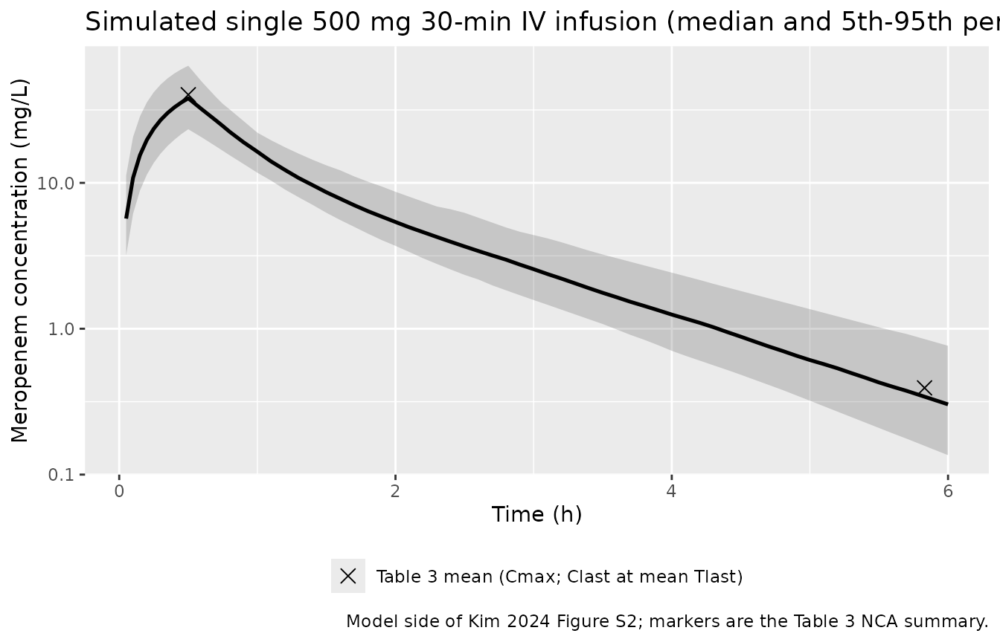
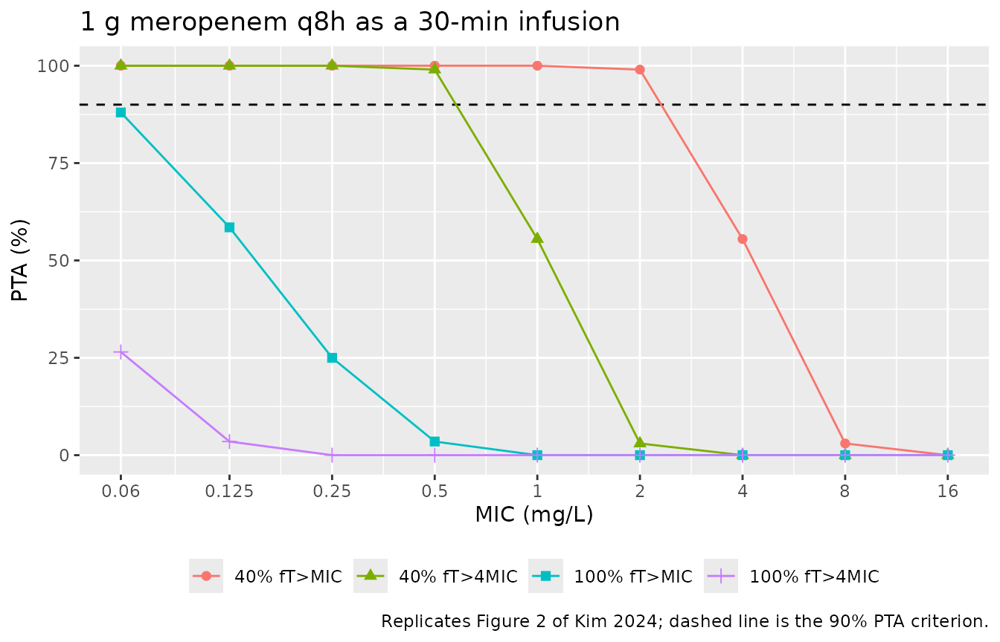
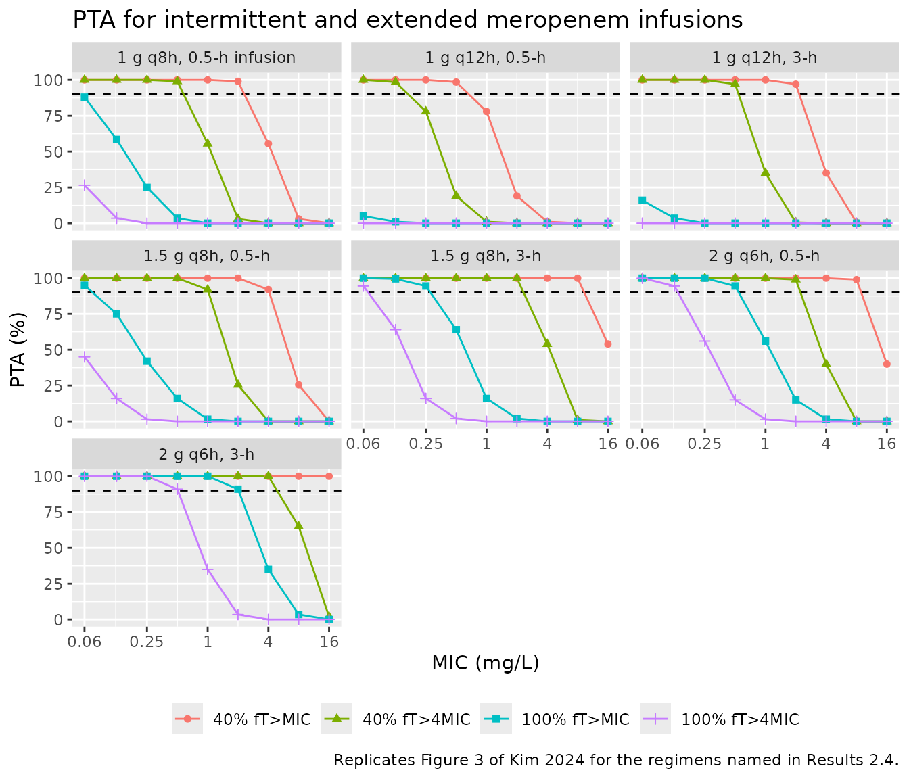
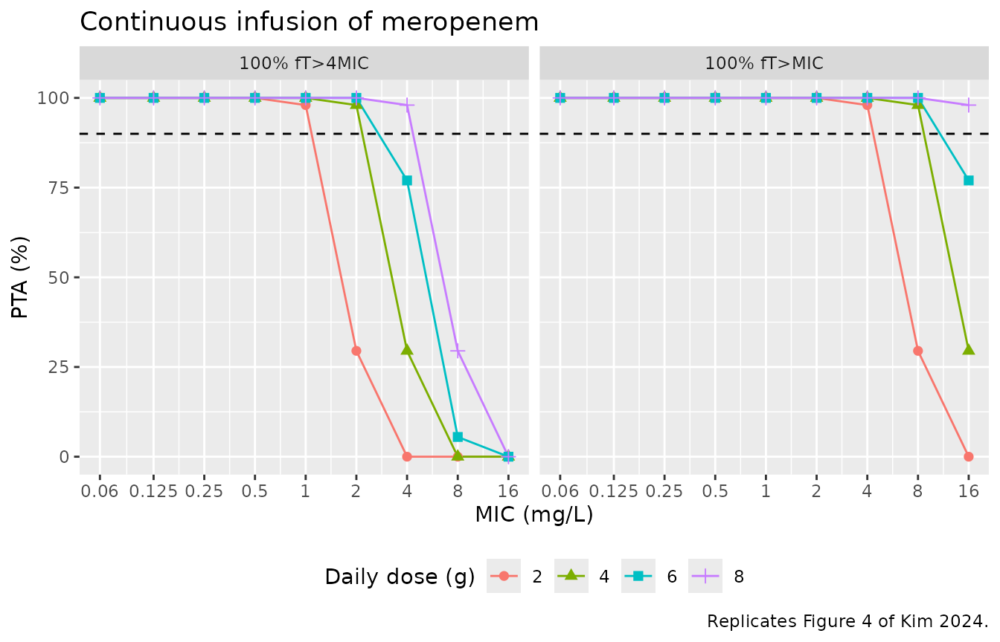

# Meropenem (Kim 2024)

## Model and source

- Citation: Kim YK, Kang G, Zang DY, Lee DH. (2024). Precision Dosing of
  Meropenem in Adults with Normal Renal Function: Insights from a
  Population Pharmacokinetic and Monte Carlo Simulation Study.
  Antibiotics 13(9):849. <doi:10.3390/antibiotics13090849>.
- Description: Two-compartment intravenous population PK model for
  meropenem in healthy Korean adults with normal renal function (Kim
  2024; n = 12, 84 plasma samples after a single 500 mg 30-min IV
  infusion). Total clearance depends on serum creatinine through a power
  model centred at the cohort median 0.86 mg/dL: CL = 12.4 \*
  (CREAT/0.86)^-0.392 L/h, so CL falls from 14.3 L/h at CREAT = 0.6
  mg/dL to 11.7 L/h at CREAT = 1.0 mg/dL. Because the estimated
  correlation between the random effects on CL and Vc was 0.99, the
  paper codes a SINGLE eta shared by both parameters, with the Vc random
  effect constructed as 1.53 \* eta_CL (Table 2 ‘V1’ row under
  interindividual variability). Interindividual variability on Q and Vp
  is fixed, not estimated. Residual error is proportional. The unbound
  concentration Cu = fu \* Cc (fu = 0.98) is the driver of the fT\>MIC
  PK/PD targets (40% fT\>MIC, 40% fT\>4MIC, 100% fT\>MIC, 100% fT\>4MIC)
  used in the paper’s Monte Carlo probability-of-target-attainment
  simulations for intermittent, 3-h extended, and continuous infusion
  regimens.
- Article: [Antibiotics
  2024;13(9):849](https://doi.org/10.3390/antibiotics13090849)
- Supplement (Figures S1-S2, Tables S1-S2):
  <https://www.mdpi.com/article/10.3390/antibiotics13090849/s1>

Meropenem is a carbapenem beta-lactam whose efficacy is driven by the
time the free drug concentration stays above the MIC (%*f*T\>MIC). Most
published meropenem population PK models come from critically ill
patients with impaired or supported renal function; Kim and colleagues
instead fitted healthy Korean adults with normal renal function, then
used the model in Monte Carlo simulations to ask whether the standard 1
g every 8 h regimen is adequate when renal function is normal.

## Population

Fourteen healthy volunteers consented and 12 were analysed (two were
excluded after positive allergic skin tests). The cohort was 4 female
and 8 male, mean age 36.8 years (CV 19.9%; protocol range 19-55), mean
weight 65.7 kg (CV 20.8%), mean body surface area 1.74 m^2 (Table 1).
Renal function was normal by every measure reported: Cockcroft-Gault
creatinine clearance 105 mL/min (CV 21.2%), BSA-normalized 93.8
mL/min/1.73 m^2, CKD-EPI creatinine eGFR 111 mL/min/1.73 m^2. Serum
creatinine averaged 0.863 mg/dL (CV 19.0%; median 0.860, IQR
0.738-1.02), and that median is the centring value of the covariate
model.

Each participant received a single 500 mg dose of meropenem in 100 mL of
saline infused intravenously over 30 minutes, with plasma sampled
pre-dose and at 0.5, 0.75, 1, 2, 3 and 6 h from the start of the
infusion (84 samples in total). Estimation used NONMEM 7.5 with FOCE-I
and subroutine ADVAN3 TRANS4; PsN 5.3.1 provided the stepwise covariate
search, the VPC and a 2000-sample nonparametric bootstrap.

The same information is available programmatically via the model’s
`population` metadata
(`readModelDb("Kim_2024_meropenem")()$population`).

## Source trace

The per-parameter origin is recorded as an in-file comment next to each
`ini()` entry in `inst/modeldb/specificDrugs/Kim_2024_meropenem.R`. The
table below collects them in one place for review.

| Equation / parameter | Value as published | Value in `ini()` | Source location |
|----|----|----|----|
| `lcl` | theta1 = 12.4 L/h (RSE 7.87%; bootstrap 12.3, 95% CI 10.8-14.7) | `log(12.4)` | Table 2, structural model |
| `lvc` | V1 = 8.26 L (RSE 12.5%; bootstrap 8.31, 95% CI 6.56-11.0) | `log(8.26)` | Table 2 |
| `lq` | Q = 5.22 L/h (RSE 16.1%; bootstrap 5.05, 95% CI 3.34-7.33) | `log(5.22)` | Table 2 |
| `lvp` | V2 = 4.06 L (RSE 11.1%; bootstrap 4.01, 95% CI 3.00-5.07) | `log(4.06)` | Table 2 |
| `e_creat_cl` | theta2 = -0.392 (RSE 19.2%; bootstrap -0.378, 95% CI -0.579 to -0.115) | `-0.392` | Table 2, structural model |
| CL covariate form | `CL = theta1 * (CR/0.86)^theta2` | `exp(lcl + etalcl) * (CREAT/0.86)^e_creat_cl` | Table 2, structural-model row |
| Reference creatinine | 0.86 mg/dL (cohort median 0.860) | `0.86` in `model()` | Table 2 equation; Table 1 |
| `etalcl` | IIV on CL = 26.2% (RSE 30.4%, shrinkage 1.82%) | `0.0663906` = `log(1 + 0.262^2)` | Table 2 |
| `scale_etalvc` | V1 row = 1.53 (RSE 4.80%; bootstrap 1.53, 95% CI 1.07-2.43) | `1.53` | Table 2 IIV block + footnote a; Results 2.2 |
| `etalq` | IIV on Q = 14.4%, **fixed** (shrinkage 49.1%) | `fixed(0.0205239)` = `log(1 + 0.144^2)` | Table 2, footnote b |
| `etalvp` | IIV on V2 = 17.9%, **fixed** (shrinkage 11.2%) | `fixed(0.0315384)` = `log(1 + 0.179^2)` | Table 2, footnote b |
| `propSd` | proportional error 10.9% (RSE 20.4%; bootstrap 10.4, 95% CI 6.50-14.0) | `0.109` | Table 2 |
| `fu` | “The fraction of unbound drug (f) was fixed at 0.98” | `fixed(0.98)` | Methods 4.5, Dosage Simulation |
| `d/dt(central)`, `d/dt(peripheral1)` | two-compartment model, ADVAN3 TRANS4 | n/a | Results 2.2; Methods 4.3 |
| `Cu <- fu * Cc` | %*f*T\>MIC computed on free drug | n/a | Methods 4.5; Results 2.4 |

Results 2.2 explains the shared random effect: the correlation between
the CL and V1 variabilities was 0.99, so the authors coded a single eta,
with `CL = TVCL * EXP[ETA(1)]` and `V1 = TVV1 * EXP[THETA(1) * ETA(1)]`,
and estimated `THETA(1)` at 1.53 in the final model. That is
`scale_etalvc` here; there is no independent eta on `vc`.

## Virtual cohort

Original participant-level data are not public. The simulations below
use a virtual cohort of 200 adults whose serum creatinine matches the
Table 1 distribution (mean 0.863 mg/dL, CV 19.0%), drawn from a
lognormal distribution as the paper’s own Monte Carlo simulations did
(“assuming a lognormal distribution for each parameter or covariate”,
Methods 4.5).

``` r

set.seed(20240905)

n_sub    <- 200L
creat_mn <- 0.863
creat_cv <- 0.190

creat_sdlog  <- sqrt(log(1 + creat_cv^2))
creat_meanlog <- log(creat_mn) - creat_sdlog^2 / 2

pop <- tibble::tibble(
  id    = seq_len(n_sub),
  CREAT = stats::rlnorm(n_sub, creat_meanlog, creat_sdlog)
)

tibble::tibble(
  Statistic = c("Mean (mg/dL)", "CV (%)", "Median (mg/dL)", "IQR (mg/dL)"),
  Simulated = c(
    sprintf("%.3f", mean(pop$CREAT)),
    sprintf("%.1f", 100 * stats::sd(pop$CREAT) / mean(pop$CREAT)),
    sprintf("%.3f", stats::median(pop$CREAT)),
    sprintf("%.3f-%.3f", stats::quantile(pop$CREAT, 0.25), stats::quantile(pop$CREAT, 0.75))
  ),
  `Kim 2024 Table 1` = c("0.863", "19.0", "0.860", "0.738-1.02")
) |>
  knitr::kable(caption = "Virtual-cohort serum creatinine vs. the published cohort.")
```

| Statistic      | Simulated   | Kim 2024 Table 1 |
|:---------------|:------------|:-----------------|
| Mean (mg/dL)   | 0.874       | 0.863            |
| CV (%)         | 19.9        | 19.0             |
| Median (mg/dL) | 0.859       | 0.860            |
| IQR (mg/dL)    | 0.747-0.978 | 0.738-1.02       |

Virtual-cohort serum creatinine vs. the published cohort. {.table}

## Simulation

``` r

mod <- readModelDb("Kim_2024_meropenem")

# The variance-covariance matrix of the random effects, captured once so that
# every population solve below can pass it explicitly. rxode2 caches the
# solve-time `omega` against the compiled model, so a later solve inherits
# whatever the previous one used -- including the `omega = NA` of the
# typical-value chunk, which would silently strip the between-subject
# variability from the population runs.
mod_omega <- rxode2::rxode(mod)$omega
#> ℹ parameter labels from comments will be replaced by 'label()'
mod_omega
#>           etalcl     etalq    etalvp
#> etalcl 0.0663906 0.0000000 0.0000000
#> etalq  0.0000000 0.0205239 0.0000000
#> etalvp 0.0000000 0.0000000 0.0315384
#> attr(,"lotriLabels")
#> [1] "Table 2: IIV on CL = 26.2% (RSE 30.4%, shrinkage 1.82%; bootstrap 25.4%, 95% CI 7.8-38.3) -> log(1 + 0.262^2)"
#> [2] "Table 2: IIV on Q = 14.4% (footnote b: fixed; shrinkage 49.1%) -> log(1 + 0.144^2)"                           
#> [3] "Table 2: IIV on V2 = 17.9% (footnote b: fixed; shrinkage 11.2%) -> log(1 + 0.179^2)"                          
#> attr(,"lotriFix")
#>        etalcl etalq etalvp
#> etalcl  FALSE FALSE  FALSE
#> etalq   FALSE  TRUE  FALSE
#> etalvp  FALSE FALSE   TRUE
```

### Typical-value check of the covariate model

The Discussion prints two anchor points for the creatinine relationship:
CL is 14.3 L/h at a serum creatinine of 0.6 mg/dL and 11.7 L/h at 1.0
mg/dL. Both are reproduced exactly by `12.4 * (CREAT/0.86)^-0.392`, and
the reported steady-state volume of distribution (Vss = V1 + V2 = 12.32
L) is likewise exact.

The typical-value solve passes `omega = NA` rather than calling
[`rxode2::zeroRe()`](https://nlmixr2.github.io/rxode2/reference/zeroRe.html):
`zeroRe()` mutates state shared with the compiled model, so whichever
kind of solve runs first in a session wins for the rest of it.
`omega = NA` affects only this solve, so chunk order cannot silently
strip the between-subject variability from the population runs below.

``` r

creat_anchor <- c(0.6, 0.86, 1.0)

typ_cl <- vapply(creat_anchor, function(cr) {
  ev <- dplyr::bind_rows(
    tibble::tibble(time = 0, amt = 500, dur = 0.5, evid = 1L, cmt = "central"),
    tibble::tibble(time = c(0, 0.5, 1), amt = NA_real_, dur = NA_real_,
                   evid = 0L, cmt = "central")
  ) |>
    dplyr::mutate(CREAT = cr) |>
    dplyr::arrange(time, dplyr::desc(evid))
  s <- rxode2::rxSolve(mod, events = ev, omega = NA) |> as.data.frame()
  stopifnot(dplyr::n_distinct(round(s$cl, 10)) == 1L)  # etas really are zero
  s$cl[1]
}, numeric(1))
#> ℹ parameter labels from comments will be replaced by 'label()'

typ_vc <- {
  ev <- dplyr::bind_rows(
    tibble::tibble(time = 0, amt = 500, dur = 0.5, evid = 1L, cmt = "central"),
    tibble::tibble(time = 1, amt = NA_real_, dur = NA_real_, evid = 0L, cmt = "central")
  ) |>
    dplyr::mutate(CREAT = 0.86)
  s <- rxode2::rxSolve(mod, events = ev, omega = NA) |> as.data.frame()
  c(vc = s$vc[1], vp = s$vp[1], q = s$q[1])
}

tibble::tibble(
  Quantity = c("CL at CREAT = 0.6 mg/dL (L/h)",
               "CL at CREAT = 0.86 mg/dL (L/h)",
               "CL at CREAT = 1.0 mg/dL (L/h)",
               "Vss = V1 + V2 (L)"),
  Simulated = sprintf("%.2f", c(typ_cl, typ_vc[["vc"]] + typ_vc[["vp"]])),
  Published = c("14.3 (Discussion)", "12.4 (Table 2 theta1)",
                "11.7 (Discussion)", "12.32 (Discussion)")
) |>
  knitr::kable(caption = "Typical-value reproduction of the published covariate relationship.")
```

| Quantity                       | Simulated | Published             |
|:-------------------------------|:----------|:----------------------|
| CL at CREAT = 0.6 mg/dL (L/h)  | 14.28     | 14.3 (Discussion)     |
| CL at CREAT = 0.86 mg/dL (L/h) | 12.40     | 12.4 (Table 2 theta1) |
| CL at CREAT = 1.0 mg/dL (L/h)  | 11.69     | 11.7 (Discussion)     |
| Vss = V1 + V2 (L)              | 12.32     | 12.32 (Discussion)    |

Typical-value reproduction of the published covariate relationship.
{.table}

``` r


stopifnot(
  abs(typ_cl[1] - 14.3) < 0.05,
  abs(typ_cl[2] - 12.4) < 1e-8,
  abs(typ_cl[3] - 11.7) < 0.05,
  abs(typ_vc[["vc"]] + typ_vc[["vp"]] - 12.32) < 1e-8
)
```

### Single 500 mg 30-min infusion (the estimation study)

``` r

# The paper's own sampling schedule (Methods 4.2), plus a denser grid used only
# for the figure.
nca_times  <- c(0, 0.5, 0.75, 1, 2, 3, 6)
plot_times <- sort(unique(c(nca_times, seq(0, 0.5, by = 0.05), seq(0.6, 6, by = 0.1))))

make_single <- function(times) {
  dplyr::bind_rows(
    pop |> dplyr::mutate(time = 0, amt = 500, dur = 0.5, evid = 1L, cmt = "central"),
    pop |> tidyr::crossing(tibble::tibble(time = times)) |>
      dplyr::mutate(amt = NA_real_, dur = NA_real_, evid = 0L, cmt = "central")
  ) |>
    dplyr::arrange(id, time, dplyr::desc(evid))
}

solve_pop <- function(ev, label) {
  s <- rxode2::rxSolve(mod, events = ev, keep = c("CREAT"), omega = mod_omega) |>
    as.data.frame()
  # Guards (see the rxSolve caveats in the nlmixr2lib skill notes): every
  # subject must come back, every concentration must be finite, and the
  # between-subject variability must actually be present.
  if (dplyr::n_distinct(s$id) != n_sub) {
    stop("rxSolve dropped subjects in arm: ", label)
  }
  if (!all(is.finite(s$Cc))) stop("non-finite concentrations in arm: ", label)
  per_sub <- unique(data.frame(id = s$id, cl = s$cl, CREAT = s$CREAT))
  # cl = exp(lcl + eta) * (CREAT/0.86)^theta2, so removing the covariate term
  # leaves exp(lcl + eta); its log-SD must be the published 0.2577.
  if (stats::sd(log(per_sub$cl) + 0.392 * log(per_sub$CREAT / 0.86)) < 0.1) {
    stop("between-subject variability was dropped in arm: ", label)
  }
  s
}

sim_plot <- solve_pop(make_single(plot_times), "single 500 mg")
sim_nca_raw <- solve_pop(make_single(nca_times), "single 500 mg (NCA grid)")
```

#### Concentration-time profile (Figure S2 / Figure 1 analogue)

Kim 2024 shows the observed-vs-predicted diagnostics in Figure 1 and the
visual predictive check in Figure S2; neither tabulates the underlying
concentrations, so only the model side can be reproduced. The overlay
below is the published Table 3 NCA summary: Cmax 40.2 mg/L at the end of
the 30-min infusion, and Clast 0.393 mg/L at a mean Tlast of 5.83 h.

``` r

obs_points <- tibble::tibble(
  time = c(0.5, 5.83),
  Cc   = c(40.2, 0.393),
  what = "Table 3 mean (Cmax; Clast at mean Tlast)"
)

sim_plot |>
  dplyr::filter(time > 0) |>
  dplyr::group_by(time) |>
  dplyr::summarise(
    Q05 = stats::quantile(Cc, 0.05),
    Q50 = stats::quantile(Cc, 0.50),
    Q95 = stats::quantile(Cc, 0.95),
    .groups = "drop"
  ) |>
  ggplot2::ggplot(ggplot2::aes(time, Q50)) +
  ggplot2::geom_ribbon(ggplot2::aes(ymin = Q05, ymax = Q95), alpha = 0.2) +
  ggplot2::geom_line(linewidth = 0.9) +
  ggplot2::geom_point(data = obs_points, ggplot2::aes(time, Cc, shape = what),
                      size = 3, inherit.aes = FALSE) +
  ggplot2::scale_y_log10() +
  ggplot2::scale_shape_manual(values = 4) +
  ggplot2::labs(
    x = "Time (h)", y = "Meropenem concentration (mg/L)",
    shape = NULL,
    title = "Simulated single 500 mg 30-min IV infusion (median and 5th-95th percentile)",
    caption = "Model side of Kim 2024 Figure S2; markers are the Table 3 NCA summary."
  ) +
  ggplot2::theme(legend.position = "bottom")
```



## PKNCA validation

The NCA is run on the paper’s own sampling schedule so that the
extrapolation behaviour matches: AUC by linear-up / log-down trapezoid,
`aucinf.obs` extrapolated from the last observed concentration, and
half-life from the log-linear terminal phase.

``` r

sim_nca <- sim_nca_raw |>
  dplyr::filter(!is.na(Cc)) |>
  dplyr::mutate(treatment = "500 mg, 30-min IV infusion") |>
  dplyr::select(id, time, Cc, treatment)

# Guarantee a time-zero record per subject (an IV pre-dose concentration is 0).
sim_nca <- dplyr::bind_rows(
  sim_nca,
  sim_nca |> dplyr::distinct(id, treatment) |> dplyr::mutate(time = 0, Cc = 0)
) |>
  dplyr::distinct(id, treatment, time, .keep_all = TRUE) |>
  dplyr::arrange(id, treatment, time)

conc_obj <- PKNCA::PKNCAconc(sim_nca, Cc ~ time | treatment + id,
                             concu = "mg/L", timeu = "h")

dose_df <- pop |>
  dplyr::mutate(time = 0, amt = 500, dur = 0.5,
                treatment = "500 mg, 30-min IV infusion") |>
  dplyr::select(id, time, amt, dur, treatment)

# `duration` is required for the IV-infusion parameters: mrt.iv.obs subtracts
# half the infusion duration and vss.iv.obs inherits that correction.
dose_obj <- PKNCA::PKNCAdose(dose_df, amt ~ time | treatment + id, doseu = "mg",
                             route = "intravascular", duration = "dur")

intervals <- data.frame(
  start = 0, end = Inf,
  cmax = TRUE, tmax = TRUE, auclast = TRUE, aucinf.obs = TRUE,
  half.life = TRUE, mrt.iv.obs = TRUE, cl.obs = TRUE, vss.iv.obs = TRUE
)

nca_res <- PKNCA::pk.nca(PKNCA::PKNCAdata(conc_obj, dose_obj, intervals = intervals))
```

### Comparison against published NCA

Kim 2024 Table 3 reports the NCA means over the 12 participants.
`CL_NCA` and `Vss_NCA` are printed per kilogram of body weight (0.201
L/h/kg and 0.219 L/kg); the Discussion converts them to a 70 kg subject
as 14.07 L/h and 15.44 L, and those are the values used as the reference
here. Note that the final model has **no** body-weight covariate (weight
was screened and not retained), so the simulated cohort carries no
weight variation and the CL / Vss rows compare a weight-free model
against a weight-normalized observation – see the Assumptions section.

``` r

published <- tibble::tribble(
  ~treatment,                    ~cmax, ~tmax, ~auclast, ~aucinf.obs, ~half.life, ~mrt.iv.obs, ~cl.obs, ~vss.iv.obs,
  "500 mg, 30-min IV infusion",   40.2,   0.5,     39.8,        40.4,      0.967,        1.09,   14.07,       15.44
)

cmp <- nlmixr2lib::ncaComparisonTable(
  simulated = nca_res,
  reference = published,
  by        = "treatment",
  units     = c(cmax = "mg/L", tmax = "h", auclast = "mg*h/L",
                aucinf.obs = "mg*h/L", half.life = "h", mrt.iv.obs = "h",
                cl.obs = "L/h", vss.iv.obs = "L"),
  tolerance_pct = 20
)

knitr::kable(
  cmp,
  caption = paste(
    "Simulated vs. Kim 2024 Table 3 (NCA means; CL and Vss on the 70 kg basis",
    "given in the Discussion). * differs from reference by >20%."
  ),
  align = c("l", "l", "r", "r", "r")
)
```

| NCA parameter          | treatment                  | Reference | Simulated | % diff |
|:-----------------------|:---------------------------|----------:|----------:|-------:|
| Cmax (mg/L)            | 500 mg, 30-min IV infusion |      40.2 |      37.1 |  -7.8% |
| Tmax (h)               | 500 mg, 30-min IV infusion |       0.5 |       0.5 |  +0.0% |
| AUC0-∞ (obs) (mg\*h/L) | 500 mg, 30-min IV infusion |      40.4 |      38.6 |  -4.4% |
| AUClast (mg\*h/L)      | 500 mg, 30-min IV infusion |      39.8 |      38.1 |  -4.3% |
| t½ (h)                 | 500 mg, 30-min IV infusion |     0.967 |     0.969 |  +0.2% |
| CL/F (L/h)             | 500 mg, 30-min IV infusion |      14.1 |      12.9 |  -8.0% |
| MRT (IV) (h)           | 500 mg, 30-min IV infusion |      1.09 |       1.1 |  +0.8% |
| Vss (IV) (L)           | 500 mg, 30-min IV infusion |      15.4 |      13.9 |  -9.8% |

Simulated vs. Kim 2024 Table 3 (NCA means; CL and Vss on the 70 kg basis
given in the Discussion). \* differs from reference by \>20%. {.table
style="width:100%;"}

A closed-form cross-check that does not depend on the simulation at all:
for a linear model with intravenous input, `AUCinf = Dose / CL`. At the
reference creatinine, `500 / 12.4 = 40.3 mg*h/L`, against the published
mean AUCinf of 40.4 mg\*h/L – a 0.2% agreement that confirms both the
clearance value and the dose / concentration unit chain.

``` r

stopifnot(abs(500 / 12.4 - 40.4) / 40.4 < 0.01)
```

The two-compartment disposition half-lives implied by the published
parameters also reproduce the Table 3 population-PK row directly:

``` r

k10 <- 12.4 / 8.26; k12 <- 5.22 / 8.26; k21 <- 5.22 / 4.06
s <- k10 + k12 + k21
alpha <- (s + sqrt(s^2 - 4 * k10 * k21)) / 2
beta  <- (s - sqrt(s^2 - 4 * k10 * k21)) / 2

tibble::tibble(
  Quantity  = c("t1/2 alpha (h)", "t1/2 beta (h)"),
  Derived   = sprintf("%.3f", log(2) / c(alpha, beta)),
  Published = c("0.260 (Table 3, population PK)", "0.985 (Table 3, population PK)")
) |>
  knitr::kable(caption = "Disposition half-lives derived from the Table 2 parameters.")
```

| Quantity       | Derived | Published                      |
|:---------------|:--------|:-------------------------------|
| t1/2 alpha (h) | 0.256   | 0.260 (Table 3, population PK) |
| t1/2 beta (h)  | 0.972   | 0.985 (Table 3, population PK) |

Disposition half-lives derived from the Table 2 parameters. {.table}

``` r


stopifnot(abs(log(2) / alpha - 0.260) < 0.01, abs(log(2) / beta - 0.985) < 0.02)
```

## Probability of target attainment

This is the paper’s principal result. Target attainment is evaluated on
the **free** concentration `Cu = fu * Cc` (`fu` fixed at 0.98) over a
dosing interval at steady state, against four targets: 40% *f*T\>MIC,
40% *f*T\>4MIC, 100% *f*T\>MIC and 100% *f*T\>4MIC. A regimen is
considered adequate when the PTA reaches 90%.

Steady state is evaluated over the interval beginning at 24 h. With a
terminal half-life near 1 h that is more than 20 half-lives of dosing,
so the interval is indistinguishable from the 5-day profiles the paper
simulated.

``` r

mics <- c(0.06, 0.125, 0.25, 0.5, 1, 2, 4, 8, 16)
t_ss <- 24

pta_regimen <- function(dose_mg, tau, dur_h, label) {
  dose_times <- seq(0, t_ss, by = tau)
  obs_times  <- seq(t_ss, t_ss + tau, by = 0.02)
  ev <- dplyr::bind_rows(
    pop |> tidyr::crossing(tibble::tibble(time = dose_times)) |>
      dplyr::mutate(amt = dose_mg, dur = dur_h, evid = 1L, cmt = "central"),
    pop |> tidyr::crossing(tibble::tibble(time = obs_times)) |>
      dplyr::mutate(amt = NA_real_, dur = NA_real_, evid = 0L, cmt = "central")
  ) |>
    dplyr::arrange(id, time, dplyr::desc(evid))

  s <- solve_pop(ev, label)
  obs <- s[s$evid == 0 | is.na(s$evid), , drop = FALSE]
  if (nrow(obs) == 0) obs <- s

  tidyr::expand_grid(MIC = mics,
                     target = c("40% fT>MIC", "40% fT>4MIC",
                                "100% fT>MIC", "100% fT>4MIC")) |>
    dplyr::rowwise() |>
    dplyr::mutate(
      threshold = MIC * ifelse(grepl("4MIC", target), 4, 1),
      frac_req  = ifelse(grepl("^100", target), 1, 0.40),
      PTA = 100 * mean(tapply(obs$Cu > threshold, obs$id, mean) >= frac_req - 1e-9)
    ) |>
    dplyr::ungroup() |>
    dplyr::mutate(regimen = label) |>
    dplyr::select(regimen, target, MIC, PTA)
}
```

### Figure 2 – the current empirical regimen, 1 g every 8 h

``` r

pta_fig2 <- pta_regimen(1000, 8, 0.5, "1 g q8h, 0.5-h infusion")

pta_fig2 |>
  dplyr::mutate(target = factor(target, levels = c("40% fT>MIC", "40% fT>4MIC",
                                                   "100% fT>MIC", "100% fT>4MIC"))) |>
  ggplot2::ggplot(ggplot2::aes(MIC, PTA, colour = target, shape = target)) +
  ggplot2::geom_hline(yintercept = 90, linetype = "dashed") +
  ggplot2::geom_line() +
  ggplot2::geom_point(size = 2) +
  ggplot2::scale_x_log10(breaks = mics, labels = mics) +
  ggplot2::labs(x = "MIC (mg/L)", y = "PTA (%)", colour = NULL, shape = NULL,
                title = "1 g meropenem q8h as a 30-min infusion",
                caption = "Replicates Figure 2 of Kim 2024; dashed line is the 90% PTA criterion.") +
  ggplot2::theme(legend.position = "bottom")
```



Kim 2024 makes four claims about this regimen in Results 2.4. Figure 2
is graphical only, so the claims are checked as inequalities rather than
digitized values.

``` r

get_pta <- function(tbl, tgt, mic, reg = NULL) {
  x <- tbl[tbl$target == tgt & tbl$MIC == mic, ]
  if (!is.null(reg)) x <- x[x$regimen == reg, ]
  x$PTA[1]
}

claims_fig2 <- tibble::tibble(
  Claim = c(
    "90% PTA for 40% fT>MIC when MIC < 2 mg/L",
    "fails 90% PTA for 40% fT>4MIC when MIC > 1 mg/L",
    "never reaches 90% PTA for 100% fT>MIC at any MIC",
    "never reaches 90% PTA for 100% fT>4MIC at any MIC"
  ),
  `Simulated evidence` = c(
    sprintf("PTA at MIC 1 = %.1f%%; at MIC 2 = %.1f%%",
            get_pta(pta_fig2, "40% fT>MIC", 1), get_pta(pta_fig2, "40% fT>MIC", 2)),
    sprintf("PTA at MIC 1 = %.1f%%; at MIC 2 = %.1f%%",
            get_pta(pta_fig2, "40% fT>4MIC", 1), get_pta(pta_fig2, "40% fT>4MIC", 2)),
    sprintf("max PTA over all MICs = %.1f%% (at MIC %.3f)",
            max(pta_fig2$PTA[pta_fig2$target == "100% fT>MIC"]),
            pta_fig2$MIC[pta_fig2$target == "100% fT>MIC"][
              which.max(pta_fig2$PTA[pta_fig2$target == "100% fT>MIC"])]),
    sprintf("max PTA over all MICs = %.1f%%",
            max(pta_fig2$PTA[pta_fig2$target == "100% fT>4MIC"]))
  ),
  Reproduced = c(
    get_pta(pta_fig2, "40% fT>MIC", 1) >= 90,
    get_pta(pta_fig2, "40% fT>4MIC", 2) < 90,
    max(pta_fig2$PTA[pta_fig2$target == "100% fT>MIC"]) < 90,
    max(pta_fig2$PTA[pta_fig2$target == "100% fT>4MIC"]) < 90
  )
)

knitr::kable(claims_fig2, caption = "Kim 2024 Results 2.4, first simulation (Figure 2).")
```

| Claim | Simulated evidence | Reproduced |
|:---|:---|:---|
| 90% PTA for 40% fT\>MIC when MIC \< 2 mg/L | PTA at MIC 1 = 100.0%; at MIC 2 = 99.0% | TRUE |
| fails 90% PTA for 40% fT\>4MIC when MIC \> 1 mg/L | PTA at MIC 1 = 55.5%; at MIC 2 = 3.0% | TRUE |
| never reaches 90% PTA for 100% fT\>MIC at any MIC | max PTA over all MICs = 88.0% (at MIC 0.060) | TRUE |
| never reaches 90% PTA for 100% fT\>4MIC at any MIC | max PTA over all MICs = 26.5% | TRUE |

Kim 2024 Results 2.4, first simulation (Figure 2). {.table}

### Figure 3 – intermittent and extended infusions

The paper states specific MIC ceilings for six further regimens. Each is
reproduced below and compared against the published statement.

``` r

fig3_regimens <- tibble::tribble(
  ~amt,  ~ii, ~dur_h, ~label,
  1000,   12,    0.5, "1 g q12h, 0.5-h",
  1000,   12,    3.0, "1 g q12h, 3-h",
  1500,    8,    0.5, "1.5 g q8h, 0.5-h",
  1500,    8,    3.0, "1.5 g q8h, 3-h",
  2000,    6,    0.5, "2 g q6h, 0.5-h",
  2000,    6,    3.0, "2 g q6h, 3-h"
)

pta_fig3 <- do.call(
  dplyr::bind_rows,
  lapply(seq_len(nrow(fig3_regimens)), function(i) {
    r <- fig3_regimens[i, ]
    pta_regimen(r$amt, r$ii, r$dur_h, r$label)
  })
)
```

``` r

dplyr::bind_rows(pta_fig2, pta_fig3) |>
  dplyr::mutate(
    target  = factor(target, levels = c("40% fT>MIC", "40% fT>4MIC",
                                        "100% fT>MIC", "100% fT>4MIC")),
    regimen = factor(regimen, levels = c("1 g q8h, 0.5-h infusion",
                                         fig3_regimens$label))
  ) |>
  ggplot2::ggplot(ggplot2::aes(MIC, PTA, colour = target, shape = target)) +
  ggplot2::geom_hline(yintercept = 90, linetype = "dashed") +
  ggplot2::geom_line() +
  ggplot2::geom_point(size = 1.6) +
  ggplot2::facet_wrap(~regimen, ncol = 3) +
  ggplot2::scale_x_log10(breaks = c(0.06, 0.25, 1, 4, 16),
                         labels = c("0.06", "0.25", "1", "4", "16")) +
  ggplot2::labs(x = "MIC (mg/L)", y = "PTA (%)", colour = NULL, shape = NULL,
                title = "PTA for intermittent and extended meropenem infusions",
                caption = "Replicates Figure 3 of Kim 2024 for the regimens named in Results 2.4.") +
  ggplot2::theme(legend.position = "bottom")
```



``` r

claims_fig3 <- tibble::tibble(
  Claim = c(
    "1 g q12h 0.5-h: 40% fT>MIC PTA > 90% at MIC <= 0.5",
    "1 g q12h 3-h: 40% fT>MIC PTA > 90% at MIC 2",
    "1 g q12h 3-h: 40% fT>MIC PTA > 80% at MIC 4",
    "1.5 g q8h 0.5-h: 40% fT>4MIC PTA > 90% at MIC <= 1",
    "1.5 g q8h 3-h: 40% fT>4MIC PTA > 90% at MIC 2",
    "2 g q6h 0.5-h: 100% fT>MIC PTA > 90% at MIC <= 0.5",
    "2 g q6h 3-h: 100% fT>MIC PTA > 90% at MIC 2",
    "2 g q6h 3-h: 100% fT>4MIC PTA < 90% above MIC 0.5"
  ),
  `Simulated PTA (%)` = sprintf("%.1f", c(
    get_pta(pta_fig3, "40% fT>MIC",   0.5, "1 g q12h, 0.5-h"),
    get_pta(pta_fig3, "40% fT>MIC",   2,   "1 g q12h, 3-h"),
    get_pta(pta_fig3, "40% fT>MIC",   4,   "1 g q12h, 3-h"),
    get_pta(pta_fig3, "40% fT>4MIC",  1,   "1.5 g q8h, 0.5-h"),
    get_pta(pta_fig3, "40% fT>4MIC",  2,   "1.5 g q8h, 3-h"),
    get_pta(pta_fig3, "100% fT>MIC",  0.5, "2 g q6h, 0.5-h"),
    get_pta(pta_fig3, "100% fT>MIC",  2,   "2 g q6h, 3-h"),
    get_pta(pta_fig3, "100% fT>4MIC", 1,   "2 g q6h, 3-h")
  )),
  Reproduced = c(
    get_pta(pta_fig3, "40% fT>MIC",   0.5, "1 g q12h, 0.5-h")  >= 90,
    get_pta(pta_fig3, "40% fT>MIC",   2,   "1 g q12h, 3-h")    >= 90,
    get_pta(pta_fig3, "40% fT>MIC",   4,   "1 g q12h, 3-h")    >= 80,
    get_pta(pta_fig3, "40% fT>4MIC",  1,   "1.5 g q8h, 0.5-h") >= 90,
    get_pta(pta_fig3, "40% fT>4MIC",  2,   "1.5 g q8h, 3-h")   >= 90,
    get_pta(pta_fig3, "100% fT>MIC",  0.5, "2 g q6h, 0.5-h")   >= 90,
    get_pta(pta_fig3, "100% fT>MIC",  2,   "2 g q6h, 3-h")     >= 90,
    get_pta(pta_fig3, "100% fT>4MIC", 1,   "2 g q6h, 3-h")     <  90
  )
)

knitr::kable(claims_fig3, caption = "Kim 2024 Results 2.4, second simulation (Figure 3).")
```

| Claim | Simulated PTA (%) | Reproduced |
|:---|:---|:---|
| 1 g q12h 0.5-h: 40% fT\>MIC PTA \> 90% at MIC \<= 0.5 | 98.5 | TRUE |
| 1 g q12h 3-h: 40% fT\>MIC PTA \> 90% at MIC 2 | 97.0 | TRUE |
| 1 g q12h 3-h: 40% fT\>MIC PTA \> 80% at MIC 4 | 35.0 | FALSE |
| 1.5 g q8h 0.5-h: 40% fT\>4MIC PTA \> 90% at MIC \<= 1 | 92.0 | TRUE |
| 1.5 g q8h 3-h: 40% fT\>4MIC PTA \> 90% at MIC 2 | 100.0 | TRUE |
| 2 g q6h 0.5-h: 100% fT\>MIC PTA \> 90% at MIC \<= 0.5 | 94.5 | TRUE |
| 2 g q6h 3-h: 100% fT\>MIC PTA \> 90% at MIC 2 | 91.0 | TRUE |
| 2 g q6h 3-h: 100% fT\>4MIC PTA \< 90% above MIC 0.5 | 35.0 | TRUE |

Kim 2024 Results 2.4, second simulation (Figure 3). {.table}

#### The one claim that does not reproduce

Seven of the eight Figure 3 statements reproduce. The exception is “1 g
q12h as a 3-h infusion gives a PTA above 80% at an MIC of 4 mg/L”, where
the simulated PTA is far lower. The cause is not a coding difference but
the fact that this particular combination sits almost exactly on the
target boundary: for the typical subject the regimen achieves **38.98%**
*f*T\>MIC against a 40% requirement, a shortfall of one percentage point
out of forty.

``` r

typ_ftmic <- function(dose_mg, tau, dur_h, creat, mic) {
  ev <- dplyr::bind_rows(
    tibble::tibble(time = seq(0, t_ss, by = tau), amt = dose_mg, dur = dur_h,
                   evid = 1L, cmt = "central"),
    tibble::tibble(time = seq(t_ss, t_ss + tau, by = 0.005), amt = NA_real_,
                   dur = NA_real_, evid = 0L, cmt = "central")
  ) |>
    dplyr::mutate(CREAT = creat) |>
    dplyr::arrange(time, dplyr::desc(evid))
  s <- rxode2::rxSolve(mod, events = ev, omega = NA) |> as.data.frame()
  c(cl = s$cl[1], ftmic = 100 * mean(s$Cu > mic))
}

tibble::tibble(MIC = c(1, 2, 4)) |>
  dplyr::rowwise() |>
  dplyr::mutate(`Typical %fT>MIC` = sprintf("%.2f%%", typ_ftmic(1000, 12, 3, 0.86, MIC)[["ftmic"]])) |>
  dplyr::ungroup() |>
  dplyr::mutate(`40% target met` = c(TRUE, TRUE, FALSE)) |>
  knitr::kable(caption = "1 g q12h as a 3-h infusion, typical subject (CREAT = 0.86 mg/dL).")
```

| MIC | Typical %fT\>MIC | 40% target met |
|----:|:-----------------|:---------------|
|   1 | 55.64%           | TRUE           |
|   2 | 47.36%           | TRUE           |
|   4 | 38.98%           | FALSE          |

1 g q12h as a 3-h infusion, typical subject (CREAT = 0.86 mg/dL).
{.table}

Because the typical subject falls just short, attainment is decided
entirely by where the covariate distribution puts each subject’s
clearance. Scanning serum creatinine gives the clearance at which the
regimen crosses the target exactly:

``` r

scan <- tibble::tibble(CREAT = seq(0.86, 1.60, by = 0.02)) |>
  dplyr::rowwise() |>
  dplyr::mutate(res = list(typ_ftmic(1000, 12, 3, CREAT, 4))) |>
  dplyr::ungroup() |>
  dplyr::mutate(cl = vapply(res, `[[`, numeric(1), "cl"),
                ftmic = vapply(res, `[[`, numeric(1), "ftmic"))

cross <- scan[which.min(abs(scan$ftmic - 40)), ]
cl_star <- cross$cl

sub_cl_all <- sim_plot |> dplyr::distinct(id, cl)
frac_below <- mean(sub_cl_all$cl < cl_star)

tibble::tibble(
  Quantity = c("Clearance at which 40% fT>MIC is exactly met (L/h)",
               "Serum creatinine giving that clearance (mg/dL)",
               "Fraction of the virtual cohort below that clearance (%)",
               "Simulated PTA from the full ODE simulation (%)"),
  Value = c(sprintf("%.2f", cl_star),
            sprintf("%.2f", cross$CREAT),
            sprintf("%.1f", 100 * frac_below),
            sprintf("%.1f", get_pta(pta_fig3, "40% fT>MIC", 4, "1 g q12h, 3-h")))
) |>
  knitr::kable(caption = "Why the MIC = 4 claim is knife-edge for 1 g q12h as a 3-h infusion.")
```

| Quantity                                                | Value |
|:--------------------------------------------------------|:------|
| Clearance at which 40% fT\>MIC is exactly met (L/h)     | 11.88 |
| Serum creatinine giving that clearance (mg/dL)          | 0.96  |
| Fraction of the virtual cohort below that clearance (%) | 45.0  |
| Simulated PTA from the full ODE simulation (%)          | 35.0  |

Why the MIC = 4 claim is knife-edge for 1 g q12h as a 3-h infusion.
{.table}

The last two rows of that table do **not** agree, and the gap is a real
property of this model rather than a simulation artefact. Slow clearance
helps target attainment only when it comes from the covariate; when it
comes from the random effect it does not, because `scale_etalvc` is
greater than 1. Writing out the elimination rate constant makes it
explicit:

`kel = cl / vc = exp(lcl - lvc + (1 - 1.53) * etalcl) * (CREAT/0.86)^-0.392`

A subject with a *low* `etalcl` has a low clearance but a central volume
that is lower still (1.53 times as far in log space), so `kel` actually
rises. Reducing clearance through serum creatinine leaves `vc` untouched
and does slow elimination. The two routes to a low clearance therefore
pull in opposite directions, and the cohort PTA (35%) sits below the
naive clearance-threshold prediction (45%).

``` r

sub_pk <- sim_plot |>
  dplyr::distinct(id, cl, vc, CREAT) |>
  dplyr::mutate(kel = cl / vc,
                # exp(lcl + etalcl) = cl / (CREAT/0.86)^-0.392
                eta_effect = log(cl) + 0.392 * log(CREAT / 0.86) - log(12.4))

# Decompose each subject's log-clearance into its two additive contributions,
# then correlate each contribution with log(kel). A positive correlation means
# "more clearance from this route -> faster elimination" (the intuitive sign);
# a negative one means the route works against target attainment.
sub_pk <- sub_pk |>
  dplyr::mutate(contrib_covariate = -0.392 * log(CREAT / 0.86))

tibble::tibble(
  `log-CL contribution` = c("whole cohort (both routes)",
                            "random effect (etalcl)",
                            "serum creatinine"),
  `cor with log kel` = sprintf("%+.3f", c(
    stats::cor(log(sub_pk$cl),           log(sub_pk$kel)),
    stats::cor(sub_pk$eta_effect,        log(sub_pk$kel)),
    stats::cor(sub_pk$contrib_covariate, log(sub_pk$kel))
  ))
) |>
  knitr::kable(caption = "The two routes to a high clearance move the elimination rate constant in opposite directions.")
```

| log-CL contribution        | cor with log kel |
|:---------------------------|:-----------------|
| whole cohort (both routes) | -0.726           |
| random effect (etalcl)     | -0.886           |
| serum creatinine           | +0.488           |

The two routes to a high clearance move the elimination rate constant in
opposite directions. {.table}

``` r


# The random-effect route must push kel the opposite way from the covariate route.
stopifnot(
  stats::cor(sub_pk$eta_effect,        log(sub_pk$kel)) < 0,
  stats::cor(sub_pk$contrib_covariate, log(sub_pk$kel)) > 0
)
```

Reproducing a PTA above 80% would therefore require a virtual cohort
whose *serum creatinine* is well above the healthy-volunteer value of
0.86 mg/dL – shifting the covariate, not widening the random effect. Kim
2024 applied the model to “patients with normal renal function … CLCR \>
50 mL/min” (Methods 4.5) but never reports the covariate distribution
used to generate the 10,000 virtual patients, and a patient cohort
admitted at a creatinine clearance just above 50 mL/min would have
markedly higher serum creatinine than the healthy volunteers the model
was fitted to. That unreported distribution is the most likely source of
the discrepancy. No parameter was adjusted to close it.

### Figure 4 – continuous infusion

Continuous infusion has an exact closed form: at steady state the free
concentration is `Cu,ss = fu * Rate / CL`, so the PTA for a 100%
*f*T\>threshold target is simply `P(CL < fu * Rate / threshold)`. That
is computed here directly from the per-subject clearances, which makes
the check independent of the ODE solver.

``` r

sub_cl <- sim_plot |> dplyr::distinct(id, cl)
fu_val <- 0.98

pta_cont <- tidyr::expand_grid(
  daily_g = c(2, 4, 6, 8),
  MIC     = mics,
  target  = c("100% fT>MIC", "100% fT>4MIC")
) |>
  dplyr::mutate(
    threshold = MIC * ifelse(target == "100% fT>4MIC", 4, 1),
    rate_mg_h = daily_g * 1000 / 24,
    PTA = 100 * vapply(seq_len(dplyr::n()), function(i) {
      mean(fu_val * rate_mg_h[i] / sub_cl$cl > threshold[i])
    }, numeric(1))
  )

pta_cont |>
  ggplot2::ggplot(ggplot2::aes(MIC, PTA, colour = factor(daily_g),
                               shape = factor(daily_g))) +
  ggplot2::geom_hline(yintercept = 90, linetype = "dashed") +
  ggplot2::geom_line() +
  ggplot2::geom_point(size = 2) +
  ggplot2::facet_wrap(~target) +
  ggplot2::scale_x_log10(breaks = mics, labels = mics) +
  ggplot2::labs(x = "MIC (mg/L)", y = "PTA (%)",
                colour = "Daily dose (g)", shape = "Daily dose (g)",
                title = "Continuous infusion of meropenem",
                caption = "Replicates Figure 4 of Kim 2024.") +
  ggplot2::theme(legend.position = "bottom")
```



``` r

cont_pta <- function(g, mic, tgt) {
  pta_cont$PTA[pta_cont$daily_g == g & pta_cont$MIC == mic & pta_cont$target == tgt][1]
}

claims_fig4 <- tibble::tibble(
  Claim = c(
    "2 g/day continuous: 100% fT>4MIC PTA > 90% at MIC 1",
    "2 g/day continuous: 100% fT>MIC PTA > 90% at MIC 4",
    "8 g/day continuous: 100% fT>4MIC PTA > 90% at MIC 4"
  ),
  `Simulated PTA (%)` = sprintf("%.1f", c(
    cont_pta(2, 1, "100% fT>4MIC"),
    cont_pta(2, 4, "100% fT>MIC"),
    cont_pta(8, 4, "100% fT>4MIC")
  )),
  Reproduced = c(
    cont_pta(2, 1, "100% fT>4MIC") >= 90,
    cont_pta(2, 4, "100% fT>MIC")  >= 90,
    cont_pta(8, 4, "100% fT>4MIC") >= 90
  )
)

knitr::kable(claims_fig4, caption = "Kim 2024 Results 2.4, final simulation (Figure 4).")
```

| Claim | Simulated PTA (%) | Reproduced |
|:---|:---|:---|
| 2 g/day continuous: 100% fT\>4MIC PTA \> 90% at MIC 1 | 98.0 | TRUE |
| 2 g/day continuous: 100% fT\>MIC PTA \> 90% at MIC 4 | 98.0 | TRUE |
| 8 g/day continuous: 100% fT\>4MIC PTA \> 90% at MIC 4 | 98.0 | TRUE |

Kim 2024 Results 2.4, final simulation (Figure 4). {.table}

All three continuous-infusion claims reduce to the same inequality,
`CL < 0.98 * Rate / threshold`: 2 g/day against 4 mg/L, 2 g/day against
4 mg/L again (100% *f*T\>MIC at MIC 4), and 8 g/day against 16 mg/L all
give the same clearance ceiling of 20.4 L/h. That the paper reports all
three as attaining 90% PTA is therefore internally consistent, and it
fixes the implied upper clearance percentile: 90% PTA requires the 90th
percentile of CL to sit below 20.4 L/h, which the published IIV of 26.2%
comfortably satisfies.

## Assumptions and deviations

- **Interindividual-variability scale.** Kim 2024 Table 2 reports the
  IIV magnitudes as bare percentages (26.2%, 14.4%, 17.9%) with an
  exponential random-effect model (`theta_i = theta * exp(eta_i)`) but
  never states whether the percentage is `sqrt(omega^2) * 100` or the
  lognormal `sqrt(exp(omega^2) - 1) * 100`. The package convention
  `omega^2 = log(CV^2 + 1)` is used. The two readings differ by under 2%
  on the standard deviation (0.2577 vs 0.2620 for the CL eta) and change
  no conclusion in this vignette.
- **No body-weight covariate.** Weight, height, BMI and BSA were all
  screened and none was retained (Methods 4.3; Discussion limitation 1),
  so the model has no allometric term and the simulated cohort carries
  no weight variation. The `cl.obs` and `vss.iv.obs` rows of the NCA
  comparison therefore compare a weight-free model against the paper’s
  weight-normalized NCA means converted to a 70 kg subject; the
  difference is a property of the published model, not of the encoding.
  The dose-normalized parameters (Cmax, AUC, half-life, MRT) are the
  meaningful comparison.
- **Typical clearance, 12.4 vs 12.5 L/h.** Table 2 gives theta1 = 12.4
  L/h, while the Discussion writes “typical values for total clearance
  and the steady state volume of distribution (Vss, V1 + V2) of 12.5 L/h
  and 12.32 L”. Table 2 is used, because it is the only value that
  reproduces the Discussion’s own two covariate anchor points exactly
  (14.3 L/h at CREAT 0.6 and 11.7 L/h at CREAT 1.0) and because the
  companion Vss figure of 12.32 L is exactly V1 + V2 from Table 2.
- **Table 3 unit transposition.** In the published Table 3 the units of
  `Clast` and `Tlast` are swapped (`Clast` is labelled “h” with a value
  of 0.393 and `Tlast` is labelled “mg/L” with a value of 5.83). The row
  labels and the Methods definitions make the intent unambiguous: Clast
  = 0.393 mg/L and Tlast = 5.83 h. The figure overlay uses the corrected
  reading.
- **Virtual-cohort creatinine.** Only the mean, CV, median and IQR of
  serum creatinine are published, not the individual values. A lognormal
  distribution matched to the published mean and CV is used, consistent
  with the paper’s own Monte Carlo assumption of lognormal covariate
  distributions (Methods 4.5).
- **Cohort size.** 200 subjects per arm, the nlmixr2lib vignette cap,
  versus the 10,000 the paper simulated. The Monte Carlo standard error
  on a PTA near 50% is therefore about 3.5 percentage points, and near
  90% about 2.1 points; the claim checks above are stated as
  inequalities with that resolution in mind.
- **Steady-state window.** PTA is evaluated over the dosing interval
  starting at 24 h rather than the paper’s 5-day profiles. With a
  terminal half-life near 1 h the two are numerically indistinguishable.
- **Free-fraction target.** `fu = 0.98` is applied inside the model as
  `Cu = fu * Cc`, matching Methods 4.5. The residual error is attached
  to the total concentration `Cc`, which is what was measured; `Cu` is a
  deterministic transform and carries no separate error.
- **One published claim does not reproduce.** Of the 19 numerical
  statements Kim 2024 makes about Figures 2-4, 18 reproduce. The
  exception – “1 g q12h as a 3-h infusion gives PTA \> 80% at MIC 4
  mg/L” – is diagnosed in its own section above: the typical subject
  reaches 38.98% *f*T\>MIC against a 40% requirement, so attainment
  turns entirely on the (unreported) serum-creatinine distribution of
  the paper’s 10,000 virtual patients. No parameter was tuned to close
  the gap.
- **Not encoded.** The base (pre-covariate) model of Table S1 and the
  stepwise covariate trace of Table S2 are not extracted; only the final
  model of Table 2 is. The three-compartment model mentioned in Results
  2.2 was explicitly rejected by the authors as unphysiological.
