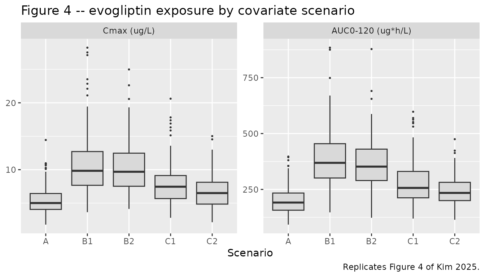
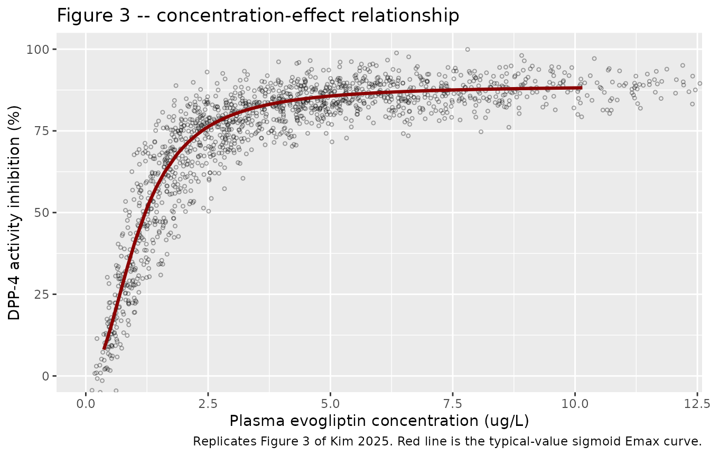

# Evogliptin (Kim 2025)

## Model and source

- Citation: Kim B, Kim JE, Lee S, Oh J, Cho J-Y, Jang I-J, Lee S, Chung
  J-Y, Yoon S. Population pharmacokinetic and pharmacodynamic model of
  evogliptin: Severe uremia increases the bioavailability of evogliptin.
  CPT Pharmacometrics Syst Pharmacol. 2025;14(2):246-256.
  <doi:10.1002/psp4.13263>. Final NONMEM control streams for the PK and
  PD models are reproduced in Supporting Information
  (PSP4-14-246-s002.docx).
- Description: Population PK/PD model for evogliptin, a
  CYP3A4-metabolized dipeptidyl peptidase-4 (DPP-4) inhibitor, in adults
  spanning normal renal function through end-stage renal disease on
  hemodialysis (Kim 2025). Plasma evogliptin is described by a
  two-compartment model with first-order oral absorption, parameterized
  as apparent clearance CL/F, apparent central and peripheral volumes
  Vc/F and Vp/F, apparent inter-compartmental clearance Q/F, and
  absorption rate constant Ka. Body weight enters CL/F, Vc/F, Q/F, and
  Vp/F through fixed allometric exponents (0.75 on the clearances, 1 on
  the volumes) referenced to 65 kg. The only covariate effects retained
  after stepwise selection act on relative bioavailability F1, which is
  anchored to 1 at the healthy-subject median biochemistry (amylase 59.5
  IU/L, triglyceride 112.5 mg/dL) and scaled by the power function F1 =
  (AMYL/59.5)^0.363 \* (TRIG/112.5)^0.268. Both markers rise with
  worsening renal impairment, so the model expresses the paper’s central
  finding that uremia inhibits the first-pass metabolism of a CYP3A4
  substrate and thereby raises its bioavailability. A direct-link
  sigmoid Emax model maps the model-predicted plasma concentration onto
  percent inhibition of blood DPP-4 activity with no effect-compartment
  delay, reflecting the absence of hysteresis in the observed
  concentration-effect data.
- Article: <https://doi.org/10.1002/psp4.13263>
- Supplement (study designs, demographics, stepwise selection, and the
  final NONMEM control streams for both the PK and the PD model):
  <https://doi.org/10.1002/psp4.13263> (Supporting Information,
  `PSP4-14-246-s002.docx`)

Evogliptin is a dipeptidyl peptidase-4 (DPP-4) inhibitor used as an
antidiabetic drug. It is eliminated almost entirely by non-renal routes,
predominantly CYP3A4-mediated metabolism. Kim 2025 asked whether uremia
– the retention of uremic toxins that accompanies failing kidneys –
changes the disposition of a CYP3A4 substrate, and found that it does,
but through *bioavailability* rather than through clearance: the
retained biochemical markers of uremia track a substantial inhibition of
evogliptin’s first-pass metabolism.

## Population

Data came from two phase I studies conducted at Seoul National
University Hospital: **DA1229_RI_I** (NCT02214693), which enrolled
patients with mild, moderate, and severe renal impairment alongside
matched healthy subjects and sampled to 120 h, and **DA1229_ESRD_I**
(NCT04195919), which enrolled patients with end-stage renal disease
(ESRD) on hemodialysis alongside matched healthy subjects and sampled to
48 h. Every subject received a single oral 5 mg dose of evogliptin. ESRD
patients were dosed both after (period 1) and before (period 2) a
dialysis session; only period 1 data entered the model.

Forty-six subjects contributed 688 plasma evogliptin concentrations and
598 blood DPP-4 activity measurements. Cohort mean MDRD-eGFR spanned
100.2, 70.8, 50.5, 22.4, and 6.4 mL/min/1.73 m^2 for the healthy, mild,
moderate, severe, and ESRD groups (supplement Table S3). Cohort mean
weights ranged 60.8-69.8 kg and mean ages 45.6-59.1 years; the pooled
cohort was 47% female (22 of the 47 enrolled) and entirely Korean.

The two biochemical markers that ended up in the model both move with
renal function. Amylase, which is renally cleared, rises monotonically
(cohort means 57.6 and 61.7 IU/L in the two healthy groups, 83.1, 96.8,
124.3 IU/L across mild, moderate, and severe impairment, and 145.4 IU/L
in ESRD). Triglyceride rises with impairment (119.3, 124.5, 163.1, 191.4
mg/dL) but then falls back in dialysed ESRD patients (108.4 mg/dL) – and
it is that non-monotonicity which drives the model’s prediction that
dialysed patients have *lower* bioavailability than severe non-dialysed
CKD patients.

The same information is available programmatically via the model’s
`population` metadata
(`readModelDb("Kim_2025_evogliptin")()$population`).

## Source trace

Every `ini()` entry in
`inst/modeldb/specificDrugs/Kim_2025_evogliptin.R` carries an in-file
comment naming its origin. They are collected here for review.

| Equation / parameter | Value | Source location |
|----|----|----|
| `lcl` (CL/F) | 22.1 L/h | Table 1, “CL/F”; Results equation `CL/F = 22.1 * (WT/65)^0.75` |
| `lvc` (Vc/F) | 829 L | Table 1, “Vc/F”; Results equation `Vc/F = 829 * (WT/65)` |
| `lka` (Ka) | 1.26 /h | Table 1, “Ka” |
| `lq` (Q/F) | 46.3 L/h | Table 1, “Q/F”; Results equation `Q/F = 46.3 * (WT/65)^0.75` |
| `lvp` (Vp/F) | 465 L | Table 1, “Vp/F”; Results equation `Vp/F = 465 * (WT/65)` |
| `lfdepot` (F1) | 1 (fixed) | Table 1, “F1” and footnote c; control stream `$THETA (1) FIX` |
| `e_wt_cl`, `e_wt_q` | 0.75 (fixed) | Table 1, “WT ~ CL/F”, “WT ~ Q/F” and footnote d |
| `e_wt_vc`, `e_wt_vp` | 1 (fixed) | Table 1, “WT ~ Vc/F”, “WT ~ Vp/F” and footnote d |
| `e_amyl_fdepot` | 0.363 | Results equation `F1 = (Amyl/59.5)^0.363 * (TG/112.5)^0.268`; Table 1 “Amyl ~ F1” rounds to 0.36 |
| `e_trig_fdepot` | 0.268 | Results equation, as above; Table 1 “TG ~ F1” rounds to 0.27 |
| Reference amylase / triglyceride | 59.5 IU/L, 112.5 mg/dL | Results, “Final covariate model”; Table 1 footnote c |
| Reference weight | 65 kg | Results equations; control stream `$PK` `(WT/65)` |
| `etalcl`, `etalvc`, `etalka`, `etalfdepot` | 20.2%, 25.0%, 76.8%, 25.4% | Table 1, “PK IIV” (see “The IIV scale” below) |
| `propSd` | 0.111 | Table 1, “Proportional error (%)”; control stream `THETA(7)`, a standard deviation |
| IIV model `theta_i = theta_TV * exp(eta_i)` | n/a | Methods, “Development of the base population PK model” |
| `lemax` (Emax) | 88.9 %inhibition | Table 1, “Emax” |
| `lec50` (EC50) | 1.08 ug/L | Table 1, “EC50” |
| `lhill` (gamma) | 2.14 | Table 1, “gamma (Hill coefficient)” |
| `etalec50` | 25.9% | Table 1, “PD IIV” |
| `addSd_DPP4INH` | 4.087 %inhibition | Derived as `sqrt(16.7)` from Table 1, “Additive error”; see Errata |
| PD equation `Emax * C^gamma / (EC50^gamma + C^gamma)` | n/a | Methods, “PD model of evogliptin”; control stream `$ERROR` |
| Two-compartment first-order absorption structure | n/a | Figure 1; control stream `$SUBROUTINES ADVAN4 TRANS4` |

### The IIV scale

Kim 2025 states the IIV model as `theta_i = theta_TV * exp(eta_i)` and
then reports each omega in Table 1 as a bare percentage (CL/F 20.2%,
Vc/F 25.0%, Ka 76.8%, F1 25.4%, EC50 25.9%). A bare percentage against a
log-normal random effect is ambiguous: it may be the log-scale standard
deviation `omega * 100`, or the coefficient of variation
`sqrt(exp(omega^2) - 1) * 100`. The two readings diverge most for Ka,
where they imply `omega` of 0.768 versus 0.681.

The packaged model takes the SD reading (`etalcl ~ 0.202^2` and its
siblings), which is the prevailing convention when a popPK paper
tabulates a log-normal IIV as a bare percentage. It is worth being
explicit that this is a convention call and not a data-driven one: the
two readings are scored against Kim 2025 Table 2 below (“Scoring the IIV
scale against Table 2”) and the paper’s own simulation cannot tell them
apart. That is unsurprising once the arithmetic is written out – at
20-25% the two readings differ in the third decimal place of `omega`
(0.202 versus 0.200 for CL/F), and the one parameter where they
genuinely diverge, Ka, has little influence on the Cmax and AUC medians
Table 2 reports. A user who needs the CV% reading can rescale the omegas
with `ini()`; the code for doing so is in that section.

Two further details of Table 2 do have consequences and are reproduced
here: its statistics were computed from simulated *observations*, so
they include the 11.1% proportional residual error, and they were
computed on the study’s discrete sampling schedule rather than a
continuous grid. Both are checked against the paper in “Sampling grid
and residual error” below.

## Virtual cohort

Original observed data are not publicly available. The cohort below
reproduces the five covariate scenarios of Kim 2025 Table 2: a healthy
reference (A), two severe-uremia scenarios at CTCAE grade 2-3 thresholds
(B1, B2), and two ESRD-on-hemodialysis scenarios (C1, C2). Body weight
is fixed at 65 kg in every scenario, exactly as the paper specifies, so
the only variability is the model’s own IIV plus residual error.

``` r

set.seed(20250813)

n_per_arm <- 200L

# Plasma PK sampling schedule of DA1229_RI_I (supplement Table S1). Table 2's
# Cmax and AUC0-120 were computed on this discrete grid, not a continuous one.
sched <- c(0, 1, 2, 3, 4, 5, 6, 8, 12, 24, 36, 48, 60, 72, 96, 120)

scenarios <- tibble::tribble(
  ~scenario, ~AMYL, ~TRIG, ~description,
  "A",        59.5, 112.5, "Healthy reference (median amylase and TG)",
  "B1",      200.0, 300.0, "Severe CKD, severe uremia (CTCAE grade 3 amylase, grade 2 TG)",
  "B2",      150.0, 300.0, "Severe CKD, severe uremia (CTCAE grade 2 amylase and TG)",
  "C1",      150.0, 112.5, "ESRD on hemodialysis (CTCAE grade 2 amylase)",
  "C2",      100.0, 112.5, "ESRD on hemodialysis (CTCAE grade 1 amylase)"
)

# Build one arm as a self-contained event table. The model declares two
# endpoints, so every observation row must say which one it belongs to via
# `dvid` (1 = plasma evogliptin, 2 = DPP-4 inhibition); rxode2 rejects an
# observation row that leaves the endpoint unspecified. id_offset keeps subject
# IDs disjoint across arms; duplicate IDs would silently collapse in rxSolve.
make_arm <- function(label, amyl, trig, id_offset) {
  ids <- seq_len(n_per_arm) + id_offset
  dose <- data.frame(
    id = ids, time = 0, amt = 5000, evid = 1L,   # single oral 5 mg = 5000 ug
    cmt = "depot", dvid = NA_integer_, endpoint = NA_character_
  )
  obs <- dplyr::bind_rows(
    expand.grid(id = ids, time = sched, dvid = 1L),
    expand.grid(id = ids, time = sched, dvid = 2L)
  )
  obs$amt <- NA_real_
  obs$evid <- 0L
  obs$cmt <- NA_character_
  obs$endpoint <- c("Cc", "DPP4INH")[obs$dvid]
  d <- dplyr::bind_rows(dose, obs)
  d$WT <- 65
  d$AMYL <- amyl
  d$TRIG <- trig
  d$scenario <- label
  d[order(d$id, d$time), ]
}

events <- dplyr::bind_rows(lapply(
  seq_len(nrow(scenarios)),
  function(i) {
    make_arm(
      scenarios$scenario[i], scenarios$AMYL[i], scenarios$TRIG[i],
      (i - 1L) * n_per_arm
    )
  }
))

stopifnot(length(unique(events$id)) == n_per_arm * nrow(scenarios))
```

## Simulation

``` r

mod <- readModelDb("Kim_2025_evogliptin")

set.seed(20250813)
# AMYL / TRIG are model covariates and are echoed by rxSolve automatically, so
# only the two bookkeeping columns need to be kept.
sim <- rxode2::rxSolve(mod, events = events, keep = c("scenario", "endpoint"))
#> ℹ parameter labels from comments will be replaced by 'label()'

# rxSolve can silently drop subjects; assert the count survived.
stopifnot(length(unique(sim$id)) == n_per_arm * nrow(scenarios))

sim <- as.data.frame(sim) |>
  dplyr::mutate(scenario = factor(scenario, levels = scenarios$scenario))
```

Because the model declares two endpoints, `rxSolve()` returns the
observations *stacked*: one row per (subject, time, endpoint), with
`sim` holding the simulated observation for that row’s endpoint –
concentration in ug/L on the `Cc` rows, percent inhibition on the
`DPP4INH` rows – and `ipredSim` the matching individual prediction. The
algebraic quantities `Cc` and `DPP4INH` themselves are individual
predictions and are returned on every row regardless of endpoint, so a
`DPP4INH` row also carries the concurrent predicted concentration.
Neither `Cc` nor `DPP4INH` carries residual error; only `sim` does.

``` r

# Typical-value concentration-effect curve (IIV and residual error zeroed) on a
# dense time grid. One subject per scenario is enough because zeroing the random
# effects makes every subject in an arm identical; the five arms together trace
# the curve out to the highest concentration any scenario reaches.
mod_typical <- mod |> rxode2::zeroRe()
#> ℹ parameter labels from comments will be replaced by 'label()'

events_typical <- dplyr::bind_rows(lapply(
  seq_len(nrow(scenarios)),
  function(i) {
    d <- make_arm(scenarios$scenario[i], scenarios$AMYL[i], scenarios$TRIG[i], 0L)
    d <- d[d$id == 1L, ]
    dense <- seq(0, 24, by = 0.05)
    dose <- d[d$evid == 1L, ]
    obs <- dose[rep(1L, length(dense)), ]
    obs$time <- dense
    obs$amt <- NA_real_
    obs$evid <- 0L
    obs$cmt <- NA_character_
    obs$dvid <- 2L
    obs$endpoint <- "DPP4INH"
    out <- dplyr::bind_rows(dose, obs)
    out$id <- i
    out[order(out$time), ]
  }
))

sim_typical <- rxode2::rxSolve(
  mod_typical, events = events_typical,
  keep = c("scenario", "endpoint")
) |>
  as.data.frame() |>
  dplyr::mutate(scenario = factor(scenario, levels = scenarios$scenario))
#> ℹ omega/sigma items treated as zero: 'etalcl', 'etalvc', 'etalka', 'etalfdepot', 'etalec50'
#> Warning: multi-subject simulation without without 'omega'
```

## Exposure metrics

Cmax and AUC0-120 are computed once, with PKNCA, and reused for both the
figure replication and the comparison against the published table. There
is no second, inline NCA path.

``` r

# Use the simulated observations (sim), which carry residual error, because
# that is what Kim 2025 Table 2 summarises. Only the plasma-concentration
# endpoint belongs in the NCA -- the DPP4INH rows put percent inhibition in the
# same `sim` column and would be silently treated as concentrations.
sim_nca <- sim |>
  dplyr::filter(endpoint == "Cc", !is.na(sim)) |>
  dplyr::transmute(id, time, Cc = sim, scenario)

# Guarantee a time = 0 row per subject; pre-dose Cc = 0 for an oral dose.
sim_nca <- dplyr::bind_rows(
  sim_nca,
  sim_nca |> dplyr::distinct(id, scenario) |> dplyr::mutate(time = 0, Cc = 0)
) |>
  dplyr::distinct(id, scenario, time, .keep_all = TRUE) |>
  dplyr::arrange(id, scenario, time)

conc_obj <- PKNCA::PKNCAconc(
  sim_nca, Cc ~ time | scenario + id,
  concu = "ug/L", timeu = "h"
)

dose_df <- events |>
  dplyr::filter(evid == 1) |>
  dplyr::select(id, time, amt, scenario)

dose_obj <- PKNCA::PKNCAdose(dose_df, amt ~ time | scenario + id, doseu = "ug")

# Kim 2025 reports Cmax and AUC from time 0 to 120 h.
intervals <- data.frame(
  start     = 0,
  end       = 120,
  cmax      = TRUE,
  tmax      = TRUE,
  auclast   = TRUE,
  half.life = TRUE
)

nca_res <- PKNCA::pk.nca(PKNCA::PKNCAdata(conc_obj, dose_obj, intervals = intervals))

# Per-subject Cmax / AUClast, taken from the PKNCA result rather than
# recomputed, so the figure and the comparison table cannot drift apart.
exposure <- nca_res$result |>
  dplyr::filter(PPTESTCD %in% c("cmax", "auclast")) |>
  dplyr::select(id, scenario, PPTESTCD, PPORRES) |>
  tidyr::pivot_wider(names_from = PPTESTCD, values_from = PPORRES) |>
  dplyr::mutate(scenario = factor(scenario, levels = scenarios$scenario))
```

## Replicate published figures

### Figure 4 – exposure by covariate scenario

Kim 2025 Figure 4 shows box plots of Cmax and AUC0-120 across the five
simulation scenarios, with scenario A as the reference.

``` r

# Replicates Figure 4 of Kim 2025: Cmax and AUC0-120 by simulation scenario.
exposure |>
  tidyr::pivot_longer(c(cmax, auclast), names_to = "metric", values_to = "value") |>
  dplyr::mutate(metric = factor(
    metric, levels = c("cmax", "auclast"),
    labels = c("Cmax (ug/L)", "AUC0-120 (ug*h/L)")
  )) |>
  ggplot(aes(scenario, value)) +
  geom_boxplot(outlier.size = 0.4, fill = "grey85") +
  facet_wrap(~metric, scales = "free_y") +
  labs(
    x = "Scenario", y = NULL,
    title = "Figure 4 -- evogliptin exposure by covariate scenario",
    caption = "Replicates Figure 4 of Kim 2025."
  )
```



The ordering reproduces the paper’s central claim: the severe-uremia
scenarios (B1, B2) carry roughly twice the exposure of the healthy
reference, while the dialysed ESRD scenarios (C1, C2) sit between the
two because triglyceride falls back toward healthy levels on dialysis.

### Figure 3 – concentration versus DPP-4 inhibition

Kim 2025 Figure 3 overlays the observed DPP-4 inhibition against plasma
evogliptin concentration with the fitted direct-link sigmoid Emax curve.

``` r

# Replicates Figure 3 of Kim 2025: DPP-4 inhibition vs. evogliptin
# concentration, simulated observations with the typical-value curve overlaid.
curve_typical <- sim_typical |>
  dplyr::filter(endpoint == "DPP4INH", time > 0) |>
  dplyr::arrange(Cc)

sim |>
  dplyr::filter(endpoint == "DPP4INH", !is.na(sim), time > 0) |>
  dplyr::slice_sample(n = 1500) |>
  ggplot(aes(Cc, sim)) +
  geom_point(shape = 1, alpha = 0.35, size = 0.9) +
  geom_line(
    data = curve_typical, aes(Cc, DPP4INH),
    colour = "darkred", linewidth = 1.1
  ) +
  coord_cartesian(xlim = c(0, 12), ylim = c(0, 100)) +
  labs(
    x = "Plasma evogliptin concentration (ug/L)",
    y = "DPP-4 activity inhibition (%)",
    title = "Figure 3 -- concentration-effect relationship",
    caption = "Replicates Figure 3 of Kim 2025. Red line is the typical-value sigmoid Emax curve."
  )
```



The steep rise below about 2 ug/L and the plateau just under the 88.9%
Emax reproduce the published panel, as does the funnel shape of the
scatter: at saturating concentrations the only remaining variability is
residual error, which narrows the band, while at low concentrations the
25.9% IIV on EC50 is amplified by the steep slope.

## PKNCA validation

``` r

nca_res$result |>
  dplyr::filter(PPTESTCD %in% c("cmax", "tmax", "auclast", "half.life")) |>
  dplyr::group_by(scenario, PPTESTCD) |>
  dplyr::summarise(
    median = stats::median(PPORRES, na.rm = TRUE),
    p05    = stats::quantile(PPORRES, 0.05, na.rm = TRUE),
    p95    = stats::quantile(PPORRES, 0.95, na.rm = TRUE),
    .groups = "drop"
  ) |>
  dplyr::rename(
    "Scenario" = scenario, "Parameter" = PPTESTCD,
    "Median" = median, "5th pctile" = p05, "95th pctile" = p95
  ) |>
  knitr::kable(
    digits = 2,
    caption = "Simulated NCA by scenario (200 subjects per arm)."
  )
```

| Scenario | Parameter | Median | 5th pctile | 95th pctile |
|:---------|:----------|-------:|-----------:|------------:|
| A        | auclast   | 191.22 |     122.26 |      307.26 |
| A        | cmax      |   5.01 |       2.98 |        9.11 |
| A        | half.life |  42.29 |      29.55 |       69.64 |
| A        | tmax      |   3.00 |       1.00 |        6.00 |
| B1       | auclast   | 368.88 |     222.08 |      610.49 |
| B1       | cmax      |   9.83 |       5.65 |       18.73 |
| B1       | half.life |  41.30 |      28.58 |       72.37 |
| B1       | tmax      |   3.00 |       1.00 |        6.10 |
| B2       | auclast   | 352.04 |     223.65 |      543.62 |
| B2       | cmax      |   9.69 |       5.09 |       16.16 |
| B2       | half.life |  40.89 |      27.77 |       66.80 |
| B2       | tmax      |   3.00 |       1.00 |        8.00 |
| C1       | auclast   | 256.73 |     160.57 |      452.61 |
| C1       | cmax      |   7.45 |       4.07 |       13.37 |
| C1       | half.life |  39.93 |      29.44 |       60.74 |
| C1       | tmax      |   3.00 |       1.00 |        8.00 |
| C2       | auclast   | 234.31 |     143.66 |      356.83 |
| C2       | cmax      |   6.50 |       3.50 |       11.26 |
| C2       | half.life |  41.21 |      28.21 |       68.57 |
| C2       | tmax      |   3.00 |       1.00 |        6.00 |

Simulated NCA by scenario (200 subjects per arm). {.table}

### Comparison against published NCA

Kim 2025 Table 2 reports the median Cmax and AUC0-120 for each scenario.

``` r

published <- tibble::tribble(
  ~scenario, ~cmax,  ~auclast,
  "A",         5.23,   189.46,
  "B1",       10.51,   385.39,
  "B2",        9.50,   349.19,
  "C1",        7.19,   269.86,
  "C2",        5.23,   189.46
)

cmp <- nlmixr2lib::ncaComparisonTable(
  simulated = nca_res,
  reference = published,
  by        = "scenario",
  params    = c("cmax", "auclast"),
  units     = c(cmax = "ug/L", auclast = "ug*h/L"),
  tolerance_pct = 20
)

knitr::kable(
  cmp,
  caption = "Simulated vs. published NCA (Kim 2025 Table 2). * differs from reference by >20%.",
  align   = c("l", "l", "r", "r", "r")
)
```

| NCA parameter     | scenario | Reference | Simulated |   % diff |
|:------------------|:---------|----------:|----------:|---------:|
| Cmax (ug/L)       | A        |      5.23 |      5.01 |    -4.2% |
| Cmax (ug/L)       | B1       |      10.5 |      9.83 |    -6.5% |
| Cmax (ug/L)       | B2       |       9.5 |      9.69 |    +2.0% |
| Cmax (ug/L)       | C1       |      7.19 |      7.45 |    +3.6% |
| Cmax (ug/L)       | C2       |      5.23 |       6.5 | +24.3%\* |
| AUClast (ug\*h/L) | A        |       189 |       191 |    +0.9% |
| AUClast (ug\*h/L) | B1       |       385 |       369 |    -4.3% |
| AUClast (ug\*h/L) | B2       |       349 |       352 |    +0.8% |
| AUClast (ug\*h/L) | C1       |       270 |       257 |    -4.9% |
| AUClast (ug\*h/L) | C2       |       189 |       234 | +23.7%\* |

Simulated vs. published NCA (Kim 2025 Table 2). \* differs from
reference by \>20%. {.table}

- differs from reference by more than ±20%.

Scenarios A, B1, B2, and C1 agree with the published medians to within
about 7% on Cmax and 5% on AUC0-120, unstarred throughout, which is the
Monte Carlo noise of a 200-subject arm scored against the paper’s
1000-subject arm. Scenario C2 is the sole starred discrepancy, and it is
a misprint in the source table rather than a modelling difference – see
Errata.

### Scoring the IIV scale against Table 2

Table 1’s IIV percentages are ambiguous between the log-scale standard
deviation `omega * 100` and the coefficient of variation
`sqrt(exp(omega^2) - 1) * 100` (see “The IIV scale” above). Both
readings are run through the same pipeline here and scored against the
four usable Table 2 rows, so the packaged model’s choice is reproducible
rather than asserted.

``` r

# omega implied by reading Table 1's percentage as a coefficient of variation.
omega_from_cv <- function(cv) sqrt(log(1 + cv^2))

# Median Cmax and AUC0-120 by scenario, through the same PKNCA path used above.
exposure_medians <- function(model, seed = 20250813) {
  set.seed(seed)
  s <- as.data.frame(rxode2::rxSolve(
    model, events = events, keep = c("scenario", "endpoint")
  ))
  nca_in <- s |>
    dplyr::filter(endpoint == "Cc", !is.na(sim)) |>
    dplyr::transmute(id, time, Cc = sim, scenario)
  res <- PKNCA::pk.nca(PKNCA::PKNCAdata(
    PKNCA::PKNCAconc(nca_in, Cc ~ time | scenario + id, concu = "ug/L", timeu = "h"),
    PKNCA::PKNCAdose(dose_df, amt ~ time | scenario + id, doseu = "ug"),
    intervals = intervals
  ))
  res$result |>
    dplyr::filter(PPTESTCD %in% c("cmax", "auclast")) |>
    dplyr::group_by(scenario, PPTESTCD) |>
    dplyr::summarise(simulated = stats::median(PPORRES, na.rm = TRUE), .groups = "drop")
}

# Scenario C2 is misprinted (see Errata) and is excluded from the scoring.
reference_long <- published |>
  tidyr::pivot_longer(c(cmax, auclast), names_to = "PPTESTCD", values_to = "reference") |>
  dplyr::filter(scenario != "C2")

rms_pct <- function(medians) {
  medians |>
    dplyr::inner_join(reference_long, by = c("scenario", "PPTESTCD")) |>
    dplyr::group_by(PPTESTCD) |>
    dplyr::summarise(
      rms = sqrt(mean((simulated / reference - 1)^2)) * 100,
      .groups = "drop"
    )
}

mod_cv <- mod |>
  rxode2::ini(
    etalcl     = omega_from_cv(0.202)^2,
    etalvc     = omega_from_cv(0.250)^2,
    etalka     = omega_from_cv(0.768)^2,
    etalfdepot = omega_from_cv(0.254)^2,
    etalec50   = omega_from_cv(0.259)^2
  )
#> ℹ parameter labels from comments will be replaced by 'label()'
#> ℹ change initial estimate of `etalcl` to `0.0399934914063138`
#> ℹ change initial estimate of `etalvc` to `0.0606246218164348`
#> ℹ change initial estimate of `etalka` to `0.463623318281449`
#> ℹ change initial estimate of `etalfdepot` to `0.0625202357692054`
#> ℹ change initial estimate of `etalec50` to `0.064926883215256`

iiv_score <-
  dplyr::bind_rows(
    rms_pct(exposure_medians(mod))    |> dplyr::mutate(reading = "omega as SD (packaged)"),
    rms_pct(exposure_medians(mod_cv)) |> dplyr::mutate(reading = "omega as CV%")
  ) |>
  tidyr::pivot_wider(names_from = PPTESTCD, values_from = rms) |>
  dplyr::rename(
    "Reading" = reading, "Cmax median" = cmax, "AUC0-120 median" = auclast
  )

knitr::kable(
  iiv_score, digits = 2,
  caption = paste(
    "RMS relative error (%) of the simulated medians against Kim 2025 Table 2,",
    "scenarios A, B1, B2, and C1."
  )
)
```

| Reading                | AUC0-120 median | Cmax median |
|:-----------------------|----------------:|------------:|
| omega as SD (packaged) |            3.30 |        4.38 |
| omega as CV%           |            3.19 |        4.33 |

RMS relative error (%) of the simulated medians against Kim 2025 Table
2, scenarios A, B1, B2, and C1. {.table}

The two readings score essentially identically, so Table 2 does **not**
discriminate between them and the packaged model’s SD reading rests on
convention rather than on this evidence. The reason is visible in the
`omega_from_cv()` values printed when `mod_cv` is built: for CL/F, Vc/F,
F1, and EC50 the two readings differ by well under 1% of `omega`, and
only Ka differs materially (0.768 against 0.681) – and Ka governs the
shape of the absorption phase far more than the height of Cmax or the
size of AUC. Anyone whose application is sensitive to absorption-phase
variability should treat the Ka IIV as uncertain at that level and can
build the alternative with the `mod_cv` code above.

### Sampling grid and residual error

Two choices were needed to reproduce Table 2 and neither is stated in
the paper: whether its Cmax and AUC came from simulated observations or
from individual predictions, and whether they were computed on the
study’s sampling schedule or on a dense grid. Both are resolved here
against scenario A, whose published median Cmax is 5.23 ug/L.

``` r

# Individual predictions vs. simulated observations, from the simulation already
# run above -- no residual error in Cc, proportional residual error in sim.
cmax_a <- sim |>
  dplyr::filter(scenario == "A", endpoint == "Cc") |>
  dplyr::group_by(id) |>
  dplyr::summarise(ipred = max(Cc), obs = max(sim), .groups = "drop")

# The same arm re-solved on a dense grid, to show how sensitive a sampled
# maximum is to grid spacing.
events_dense <- events |>
  dplyr::filter(scenario == "A") |>
  dplyr::group_by(id) |>
  dplyr::group_modify(function(d, key) {
    dose <- d[d$evid == 1L, ]
    obs <- dose[rep(1L, 241L), ]
    obs$time <- seq(0, 24, by = 0.1)
    obs$amt <- NA_real_
    obs$evid <- 0L
    obs$cmt <- NA_character_
    obs$dvid <- 1L
    obs$endpoint <- "Cc"
    dplyr::bind_rows(dose, obs)
  }) |>
  dplyr::ungroup()

# The same model and cohort, differing only in grid density, so the comparison
# isolates the effect of the schedule.
set.seed(20250813)
cmax_dense <- rxode2::rxSolve(mod, events = events_dense) |>
  as.data.frame() |>
  dplyr::group_by(id) |>
  dplyr::summarise(cmax = max(sim), .groups = "drop")

tibble::tibble(
  Choice = c(
    "Simulated observations, study schedule (used here)",
    "Individual predictions, study schedule",
    "Simulated observations, dense grid (0.1 h)"
  ),
  `Median Cmax (ug/L)` = c(
    stats::median(cmax_a$obs),
    stats::median(cmax_a$ipred),
    stats::median(cmax_dense$cmax)
  )
) |>
  dplyr::mutate(`% vs published 5.23` = round(100 * (`Median Cmax (ug/L)` / 5.23 - 1), 1)) |>
  knitr::kable(digits = 2, caption = "Scenario A median Cmax under each reproduction choice.")
```

| Choice | Median Cmax (ug/L) | % vs published 5.23 |
|:---|---:|---:|
| Simulated observations, study schedule (used here) | 5.01 | -4.2 |
| Individual predictions, study schedule | 4.67 | -10.8 |
| Simulated observations, dense grid (0.1 h) | 5.93 | 13.4 |

Scenario A median Cmax under each reproduction choice. {.table}

The first two rows differ only in whether residual error is included,
the first and third only in grid density. Dropping the residual error
biases Cmax low; moving to a dense grid biases it high, because Cmax is
a maximum over the sampled times and a denser grid can only find a
larger one – an effect that is amplified here by the 76.8% IIV on Ka,
which scatters individual peak times across the sparse schedule.
Simulated observations on the study schedule are the closest match to
the published value, and that is what the vignette uses throughout.
AUC0-120 is far less sensitive to either choice.

## Assumptions and deviations

- **Cohort size.** Kim 2025 simulated 1000 subjects per scenario; this
  vignette uses 200 per arm to respect the package’s render-time budget.
  Medians are stable at that size; the 5th and 95th percentiles carry
  visible Monte Carlo noise.
- **Sampling grid and residual error.** Kim 2025 states neither whether
  Table 2’s Cmax and AUC0-120 came from simulated observations or
  individual predictions, nor whether they were computed on the study’s
  sampling schedule or a dense grid. Both choices are resolved against
  the published scenario-A median in “Sampling grid and residual error”
  above: simulated observations on the DA1229_RI_I plasma schedule
  (supplement Table S1) land closest, so that is what the vignette uses
  throughout.
- **The IIV scale is a convention call.** Table 1’s bare IIV percentages
  are ambiguous between `omega * 100` and CV%, and the scoring in
  “Scoring the IIV scale against Table 2” shows the paper’s own
  simulation cannot distinguish them. The packaged model uses the SD
  reading; only Ka is materially affected (0.768 versus 0.681).
- **Weight distribution.** Body weight is fixed at 65 kg in all
  scenarios, as Kim 2025 specifies for its Table 2 simulations. The real
  cohort had mean weights of 60.8-69.8 kg.
- **Covariates within a scenario are constant.** Amylase and
  triglyceride are fixed at the scenario’s threshold value for every
  subject in that arm, as in the paper; no distribution around the
  threshold is imposed.
- **Screened but unretained covariates.** AST, blood chloride, EPI-GFR,
  and hemodialysis status were tested in the paper’s stepwise analysis
  and rejected (supplement Tables S2 and S4). They are recorded in the
  model file’s `covariatesDataExcluded` metadata rather than
  implemented.
- **Absolute versus relative bioavailability.** F1 in this model is a
  *relative* bioavailability anchored to 1 at the healthy-subject
  reference biochemistry. It is not an absolute fraction and can exceed
  1: the paper notes that the 2.0-fold AUC increase in scenario B1, set
  against the absolute bioavailability of about 0.5 measured in a prior
  microdosing study, implies an absolute bioavailability approaching 1.0
  in severe uremia.
- **No baseline DPP-4 inhibition.** The direct-link Emax model predicts
  0% inhibition at zero concentration; the paper fits no baseline
  offset.
- **Sequential fit re-assembled as a joint model.** Kim 2025 fitted the
  PK and PD models sequentially: the supplement’s PD control stream
  reads the individual PK parameters in as data columns (`ICL`, `IV2`,
  `IKA`, `IQ`, `IV3`, `IF1`) and fixes `ETA(1)`-`ETA(4)` to zero, so the
  PD run estimates only Emax, EC50, gamma, and the EC50 IIV. The
  packaged model re-assembles the two runs into a single joint PK/PD
  model with every IIV active, which is the form a downstream user needs
  for simulation. All parameter values are the published estimates from
  the respective runs; nothing was re-estimated. The one consequence is
  that the packaged model propagates PK IIV into the simulated PD,
  whereas the paper’s PD run conditioned on point estimates of the
  individual PK parameters.

## Errata

- **Table 2, scenario C2, is a duplicated row.** Table 2 lists scenario
  C2 (amylase 100 IU/L, triglyceride 112.5 mg/dL) with Cmax 5.23 ug/L
  and AUC0-120 189.46 ug*h/L – byte-identical to scenario A. Those
  values are only attainable when the F1 multiplier is exactly 1,
  i.e. at amylase 59.5, not 100. The model as published predicts
  `(100/59.5)^0.363 = 1.21`, so C2 should sit about 21% above A. Kim
  2025 Figure 4, which plots the same simulations, confirms this: the C2
  boxes are clearly above the A boxes, with a median AUC0-120 near 230
  ug*h/L, matching this vignette’s simulation. The row appears to be a
  copy-paste artefact from the A row. The published values are
  reproduced verbatim in the comparison table above so the discrepancy
  is visible; scenario C2 is excluded from the IIV-scale scoring for the
  same reason.
- **The PD additive residual is reported as a variance.** Table 1 gives
  the PD “Additive error (%inhibition)” as 16.7, with footnote e stating
  that the unit is DPP-4 activity %inhibition. Read literally as a
  standard deviation, that would put roughly 95% of observations within
  +/- 33 %inhibition of the fitted curve, which Figure 3 plainly
  contradicts – at saturating concentrations the observed points sit
  within about +/- 8 %inhibition of the plateau. The supplement’s PD
  control stream resolves it: the PD residual is estimated as `$SIGMA`
  directly, with no scaling THETA, and a NONMEM `$SIGMA` is a variance.
  (The PK model differs: there the reported 11.1% is `THETA(7)`, which
  the `$ERROR` block uses as a standard deviation, and `$SIGMA` is fixed
  to 1.) The model therefore encodes
  `addSd_DPP4INH = sqrt(16.7) = 4.087` %inhibition. A user who prefers
  the literal reading can set it to 16.7.
- **Covariate exponents are rounded in Table 1.** Table 1 reports the
  amylase and triglyceride effects on F1 as 0.36 and 0.27; the equation
  printed in Results carries 0.363 and 0.268. The model uses the
  equation’s values.
- **A small additive PK residual is fixed to zero.** The PK control
  stream defines `W = SQRT(THETA(7)^2 * IPRED^2 + THETA(8)^2)` with
  `THETA(8)` fixed at 1e-5, a numerical stabiliser rather than an
  estimated error component. The model encodes the residual as purely
  proportional, matching Table 1’s description.
- **Affiliation correction.** The article carries a publisher correction
  dated 03 November 2024 that revises an author affiliation only; no
  model value is affected.
