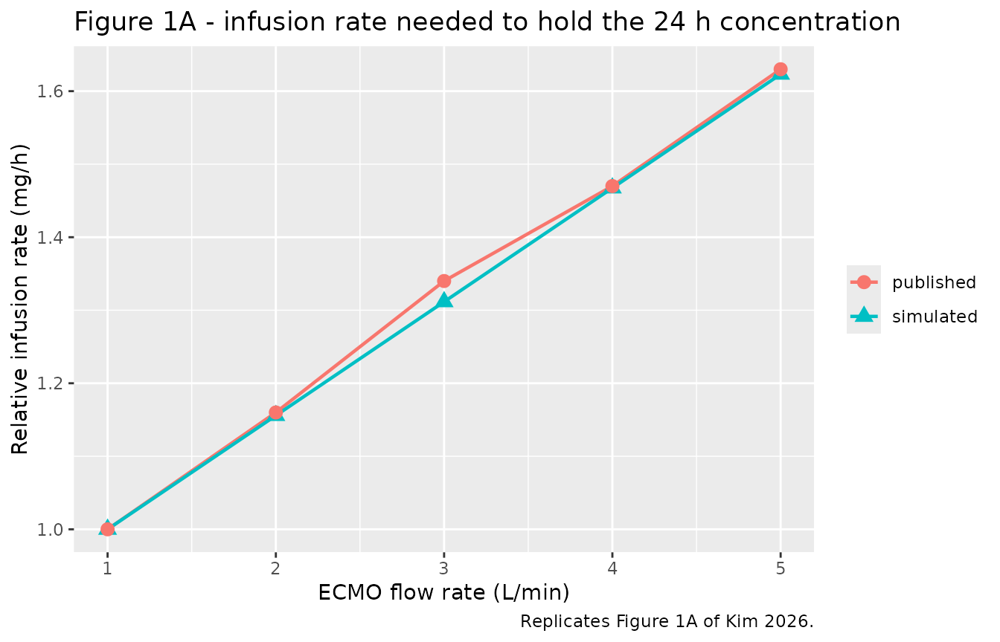
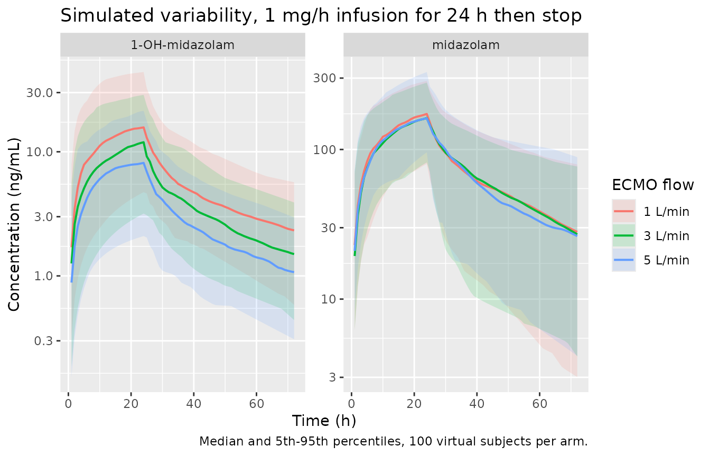
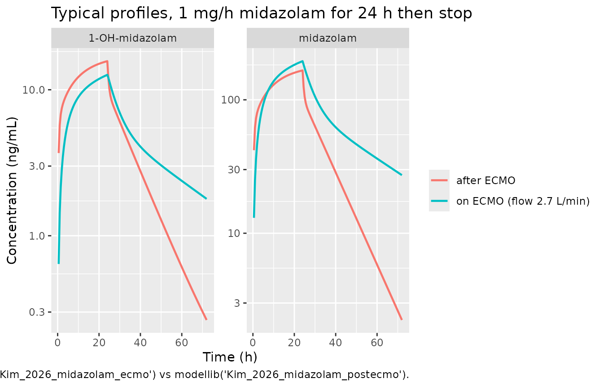

# Midazolam and 1-OH-midazolam during and after VA-ECMO (Kim 2026)

## Model and source

Kim 2026 is a *Research Letter* that nonetheless carries an original
joint parent/metabolite population PK model with a complete parameter
table, so it is extractable. The authors fit **two independent models**
to the same prospective cohort – one during VA-ECMO support and one
after decannulation (Supplementary Methods: “Two independent population
pharmacokinetic models were developed”) – so the paper contributes two
model files and this single vignette.

``` r

mod_ecmo <- readModelDb("Kim_2026_midazolam_ecmo")
mod_post <- readModelDb("Kim_2026_midazolam_postecmo")

ui_ecmo <- rxode2::rxode(mod_ecmo)
#> ℹ parameter labels from comments will be replaced by 'label()'
ui_post <- rxode2::rxode(mod_post)
#> ℹ parameter labels from comments will be replaced by 'label()'
```

- Citation: Kim H, Jin BH, Yang S, Hahn J, Kang S, Kim D, Lee H, Kwack
  H, Chae SU, Bae SK, Wi J, Chang MJ. Effect of extracorporeal membrane
  oxygenation flow rate on midazolam clearance: a population
  pharmacokinetic study. Anesthesiology. 2026;144(3):485-488.
  <doi:10.1097/ALN.0000000000005811>.
- Article: <https://doi.org/10.1097/ALN.0000000000005811>
- Supplemental methods: <https://links.lww.com/ALN/E277>
- Supplemental tables: <https://links.lww.com/ALN/E278>
- Supplemental figures: <https://links.lww.com/ALN/E279>

On-ECMO model description:

> Joint parent-metabolite population PK model for midazolam and its
> primary active metabolite 1-hydroxymidazolam (1-OH-MDZ) in 19 adults
> receiving continuous midazolam sedation DURING venoarterial
> extracorporeal membrane oxygenation (VA-ECMO) support (Kim 2026,
> on-ECMO model). Midazolam: two-compartment disposition whose only
> elimination pathway is metabolic clearance to 1-OH-MDZ (CL_MF).
> 1-OH-MDZ: two-compartment disposition with its own clearance.
> Clearance of 1-OH-MDZ increases with ECMO circuit blood flow rate via
> a median-normalized proportional effect. Parent-to-metabolite transfer
> is encoded 1:1 in midazolam-equivalent mass (the paper reports no
> molar conversion factor). The companion post-ECMO model fit to the
> same cohort after decannulation is
> modellib(‘Kim_2026_midazolam_postecmo’).

Post-ECMO model description:

> Joint parent-metabolite population PK model for midazolam and its
> primary active metabolite 1-hydroxymidazolam (1-OH-MDZ) in 11 adults
> receiving continuous midazolam sedation AFTER venoarterial
> extracorporeal membrane oxygenation (VA-ECMO) was discontinued (Kim
> 2026, post-ECMO model). Structurally identical to the on-ECMO model:
> midazolam two-compartment disposition whose only elimination pathway
> is metabolic clearance to 1-OH-MDZ (CL_MF), feeding a two-compartment
> 1-OH-MDZ disposition. No covariate is retained, because the ECMO
> circuit is no longer present. Parent-to-metabolite transfer is encoded
> 1:1 in midazolam-equivalent mass (the paper reports no molar
> conversion factor). The companion on-ECMO model is
> modellib(‘Kim_2026_midazolam_ecmo’); the two were fit independently.

## Population

Nineteen adults receiving midazolam-based sedation during venoarterial
ECMO in a cardiovascular intensive care unit contributed to the on-ECMO
analysis; eleven of them had post-decannulation sampling and contributed
to the post-ECMO analysis. Baseline characteristics are Supplementary
Table S1: median age 53.5 y (22-87), median weight 70 kg (52.9-92), 5 of
19 female, median VA-ECMO duration 133.7 h (10.6-269). The cohort is
markedly hepatically stressed (median AST 234 U/L, range 3.8-2883),
which matters for a drug cleared by CYP3A4. Indications for VA-ECMO were
ST-elevation myocardial infarction (10), atrial fibrillation (3),
myocarditis (2), cardiac arrest (2), non-ST-elevation myocardial
infarction (1), and pulmonary embolism (1). Patients with severe hepatic
or renal dysfunction, or on strong CYP3A4 inhibitors, were excluded. The
study is ClinicalTrials.gov NCT02581280 (Yonsei University IRB
4-2014-0919).

Midazolam was given as a continuous infusion at a rate chosen by the
treating physician, with supplementary boluses as needed; the study did
not fix a dose.

The same information is available programmatically:

``` r

str(ui_ecmo$population, max.level = 1)
#> List of 14
#>  $ species       : chr "human"
#>  $ n_subjects    : num 19
#>  $ n_studies     : num 1
#>  $ age_range     : chr "22-87 years"
#>  $ age_median    : chr "53.5 years"
#>  $ weight_range  : chr "52.9-92 kg"
#>  $ weight_median : chr "70 kg"
#>  $ sex_female_pct: num 26.3
#>  $ disease_state : chr "Critically ill adults on venoarterial ECMO in a cardiovascular intensive care unit. Indications: ST-elevation m"| __truncated__
#>  $ dose_range    : chr "Continuous IV midazolam infusion, rate set by the treating physician to meet each patient's sedation need, with"| __truncated__
#>  $ regions       : chr "Republic of Korea (Seoul)"
#>  $ ecmo_duration : chr "median 133.7 h (range 10.6-269)"
#>  $ lab_medians   : chr "AST 234 U/L (3.8-2883); ALT 81 U/L (19-1538); serum creatinine 1.2 mg/dL (0.6-4.5)"
#>  $ notes         : chr "Prospective cohort, ClinicalTrials.gov NCT02581280; Yonsei University IRB 4-2014-0919. Baseline demographics ar"| __truncated__
```

## Model structure

Both models share the structure of Supplementary Fig. S1: a
two-compartment midazolam disposition whose **only** elimination pathway
is metabolic clearance to 1-OH-midazolam (`CL_MF`), feeding a
two-compartment 1-OH-midazolam disposition that is cleared by `CL_1-OH`.

    IV infusion --> [central (MDZ)] <--Q_MDZ--> [peripheral1 (MDZ)]
                          |
                          | CL_MF   (the only midazolam elimination)
                          v
                    [central_1ohm] <--Q_1-OH--> [peripheral1_1ohm]
                          |
                          | CL_1-OH
                          v

Because `CL_MF` is the sole parent elimination, every milligram of
midazolam cleared appears as one milligram-equivalent of 1-OH-midazolam.
The paper reports no molar conversion factor, so the transfer is encoded
1:1 in midazolam-equivalent mass – the same convention as
`modellib("Franken_2017_midazolam")`.

ECMO circuit blood flow rate (`Q_ECMO`, L/min) acts **only** on the
metabolite’s clearance. Nothing in the parent’s disposition depends on
flow; this is a structural consequence of Table 1, which reports the
flow coefficient on `CL_1-OH MDZ` alone. It has a strong bearing on the
figure replications below.

``` r

ui_ecmo$state
#> [1] "central"          "peripheral1"      "central_1ohm"     "peripheral1_1ohm"
```

## Source trace

Every `ini()` value carries an in-file comment naming its source
location. The table below collects them for review. All values come from
Table 1 of the main paper, whose two column pairs give the on-ECMO and
post-ECMO estimates.

| Parameter | On-ECMO | Post-ECMO | Source location |
|----|----|----|----|
| `lvc` (Vc,MDZ, L) | 36.7 | 8.25 | Table 1, Fixed effects |
| `lvp` (Vp,MDZ, L) | 57.1 | 37.4 | Table 1, Fixed effects |
| `lq` (Q,MDZ, L/h) | 3.1 | 7.88 | Table 1, Fixed effects |
| `lcl_form_1ohm` (CL_MF, L/h) | 3.26 | 5.44 | Table 1, Fixed effects |
| `lcl_1ohm` (CL_1-OH, L/h) | 49.7 | 56.6 | Table 1, Fixed effects |
| `lvc_1ohm` (Vc,1-OH, L) | 6.42 | 2.71 | Table 1, Fixed effects |
| `lvp_1ohm` (Vp,1-OH, L) | 127 | 98 | Table 1, Fixed effects |
| `lq_1ohm` (Q,1-OH, L/h) | 0.443 | 1.14 | Table 1, Fixed effects |
| `e_q_ecmo_cl_1ohm` | 0.336 | n/a | Table 1, `theta ECMO flow rate on CL1-OH MDZ` |
| centering median for `Q_ECMO` | 2.7 L/min | n/a | **Not published** – back-solved from Fig. 1A (see Errata) |
| covariate functional form | median-normalized proportional | n/a | **Not published** – recovered by fitting Fig. 1A (see Errata) |
| `etalcl_1ohm` | 0.246 | 0.574 | Table 1, Random effects (variance scale) |
| `etalcl_form_1ohm` | 0.497 | 0.732 | Table 1, Random effects |
| `etalvc` | 0.693 | 0 FIX (omitted) | Table 1, Random effects |
| `etalvp` | 0.176 | 1.08 | Table 1, Random effects |
| `etalvc_1ohm` | 0.137 | 0.118 | Table 1, Random effects |
| `propSd` (parent) | sqrt(0.404) | sqrt(0.525) | Table 1, Residual variability |
| `propSd_1ohm` | sqrt(0.362) | sqrt(0.359) | Table 1, Residual variability |
| ODE structure | – | – | Supplementary Fig. S1 |
| proportional error model | – | – | Supplementary Methods, “Population pharmacokinetic model development” |

### Random effects are on the variance scale

Table 1’s footnote says random effects are “presented as estimates with
CV %”, which is ambiguous about whether the tabulated number is a
variance or a standard deviation. It is a **variance**: the
parenthetical is exactly `100 * sqrt(omega^2)` for all nine
random-effect entries across both models.

``` r

omega2 <- c(0.246, 0.497, 0.693, 0.176, 0.137, 0.574, 0.732, 1.08, 0.118)
printed_cv <- c(49.6, 70.5, 83.3, 42.0, 37.0, 75.8, 85.6, 103.9, 34.4)
data.frame(
  omega2 = omega2,
  implied_cv_pct = round(100 * sqrt(omega2), 1),
  printed_cv_pct = printed_cv
)
#>   omega2 implied_cv_pct printed_cv_pct
#> 1  0.246           49.6           49.6
#> 2  0.497           70.5           70.5
#> 3  0.693           83.2           83.3
#> 4  0.176           42.0           42.0
#> 5  0.137           37.0           37.0
#> 6  0.574           75.8           75.8
#> 7  0.732           85.6           85.6
#> 8  1.080          103.9          103.9
#> 9  0.118           34.4           34.4
stopifnot(all(abs(100 * sqrt(omega2) - printed_cv) < 0.06))
```

All nine match to better than 0.06 percentage points, so the tabulated
numbers are used directly as variances.

## Validation strategy

The paper reports **no NCA table** – no Cmax, no AUC, no half-life – so
there is nothing to transcribe for a published-vs-simulated NCA
comparison. Instead this vignette validates against three things that
are model-independent and exactly checkable:

1.  **Closed-form steady-state and AUC identities.** Because `CL_MF` is
    the only parent elimination and the parent-to-metabolite transfer is
    1:1, mass balance forces `AUC_inf(parent) = Dose / CL_MF` and
    `AUC_inf(1-OH) = Dose / CL_1-OH` exactly. These are computed with
    PKNCA below.
2.  **Figure 1A**, which carries exact numeric labels and is the paper’s
    headline quantitative result.
3.  **Figure 1B**, which turns out **not** to be reproducible from Table
    1 – a genuine internal inconsistency in the paper, documented in the
    Errata with the sensitivity analysis that isolates the cause.

## Virtual cohort

Original observed data are not publicly available. All simulations below
use virtual cohorts. Typical-value simulations use
[`rxode2::zeroRe()`](https://nlmixr2.github.io/rxode2/reference/zeroRe.html);
the between-subject-variability cohort uses 100 subjects per ECMO-flow
arm, well under the 200-per-arm cap.

``` r

# Graded observation grid: dense through distribution, sparse in the tail.
obs_grid <- function(tmax = 720) {
  unique(sort(c(
    seq(0, 4, by = 0.05),
    seq(4, 24, by = 0.25),
    seq(24, 240, by = 1),
    seq(240, tmax, by = 4)
  )))
}

# One arm = one ECMO flow rate. `id_offset` keeps IDs disjoint across arms.
make_arm <- function(flow, n = 1L, amt, rate = NULL, times, id_offset = 0L,
                     label = paste0(flow, " L/min")) {
  ids <- id_offset + seq_len(n)
  doses <- tidyr::expand_grid(id = ids, time = 0) |>
    dplyr::mutate(amt = amt, evid = 1L, cmt = "central",
                  rate = if (is.null(rate)) 0 else rate, dvid = 1L)
  obs <- tidyr::expand_grid(id = ids, time = times) |>
    dplyr::mutate(amt = NA_real_, evid = 0L, cmt = "central",
                  rate = 0, dvid = 1L)
  dplyr::bind_rows(doses, obs) |>
    dplyr::mutate(Q_ECMO = flow, arm = label) |>
    dplyr::arrange(id, time, dplyr::desc(evid))
}
```

Observation rows use `cmt = "central"` – the ODE state, never the
algebraic observable name `Cc`. `dvid = 1L` on every observation row
makes rxode2 return both endpoint columns (`Cc` and `Cc_1ohm`).

## Replicate Figure 1A

Figure 1A reports the midazolam infusion rate needed to achieve the same
24-h plasma concentration as a 1 mg/h infusion at 1 L/min, at ECMO flows
of 1-5 L/min. The five plotted points are labelled 1.00, 1.16, 1.34,
1.47, and 1.63.

Because the system is linear in dose, the required infusion-rate ratio
equals the inverse ratio of the 24-h concentration achieved at a fixed 1
mg/h infusion.

``` r

flows <- 1:5

sim_24h <- lapply(seq_along(flows), function(i) {
  ev <- make_arm(
    flow = flows[i], n = 1L,
    amt = 24, rate = 1,                    # 1 mg/h for 24 h
    times = seq(0, 24, by = 0.25),
    id_offset = (i - 1L) * 10L
  )
  s <- rxode2::rxSolve(
    rxode2::zeroRe(ui_ecmo), events = ev,
    keep = c("arm", "Q_ECMO"), useLinCmt = FALSE, returnType = "data.frame"
  )
  s[which.min(abs(s$time - 24)), ]
}) |> dplyr::bind_rows()
#> ℹ omega/sigma items treated as zero: 'etalcl_1ohm', 'etalcl_form_1ohm', 'etalvc', 'etalvp', 'etalvc_1ohm'
#> ℹ omega/sigma items treated as zero: 'etalcl_1ohm', 'etalcl_form_1ohm', 'etalvc', 'etalvp', 'etalvc_1ohm'
#> ℹ omega/sigma items treated as zero: 'etalcl_1ohm', 'etalcl_form_1ohm', 'etalvc', 'etalvp', 'etalvc_1ohm'
#> ℹ omega/sigma items treated as zero: 'etalcl_1ohm', 'etalcl_form_1ohm', 'etalvc', 'etalvp', 'etalvc_1ohm'
#> ℹ omega/sigma items treated as zero: 'etalcl_1ohm', 'etalcl_form_1ohm', 'etalvc', 'etalvp', 'etalvc_1ohm'

fig1a <- sim_24h |>
  dplyr::transmute(
    flow      = Q_ECMO,
    C24_1ohm  = Cc_1ohm,
    C24_parent = Cc,
    simulated = C24_1ohm[1] / C24_1ohm,
    published = c(1.00, 1.16, 1.34, 1.47, 1.63)
  ) |>
  dplyr::mutate(difference = simulated - published)

fig1a |>
  dplyr::mutate(dplyr::across(C24_1ohm:difference, \(x) round(x, 4))) |>
  dplyr::rename(
    "ECMO flow (L/min)"          = flow,
    "24 h 1-OH conc (ng/mL)"     = C24_1ohm,
    "24 h midazolam conc (ng/mL)" = C24_parent,
    "Simulated ratio"            = simulated,
    "Published (Fig. 1A)"        = published,
    "Difference"                 = difference
  ) |>
  knitr::kable(caption = "Replicates Figure 1A of Kim 2026.")
```

| ECMO flow (L/min) | 24 h 1-OH conc (ng/mL) | 24 h midazolam conc (ng/mL) | Simulated ratio | Published (Fig. 1A) | Difference |
|---:|---:|---:|---:|---:|---:|
| 1 | 16.0044 | 194.8854 | 1.0000 | 1.00 | 0.0000 |
| 2 | 13.8470 | 194.8854 | 1.1558 | 1.16 | -0.0042 |
| 3 | 12.2022 | 194.8854 | 1.3116 | 1.34 | -0.0284 |
| 4 | 10.9066 | 194.8854 | 1.4674 | 1.47 | -0.0026 |
| 5 | 9.8598 | 194.8854 | 1.6232 | 1.63 | -0.0068 |

Replicates Figure 1A of Kim 2026. {.table}

``` r


rmse_1a <- sqrt(mean(fig1a$difference^2))
rmse_1a
#> [1] 0.01324667
stopifnot(rmse_1a < 0.02, max(abs(fig1a$difference)) < 0.03)
```

``` r

fig1a |>
  tidyr::pivot_longer(c(simulated, published),
                      names_to = "source", values_to = "ratio") |>
  ggplot(aes(flow, ratio, colour = source, shape = source)) +
  geom_line(linewidth = 0.8) +
  geom_point(size = 3) +
  scale_x_continuous(breaks = 1:5) +
  labs(x = "ECMO flow rate (L/min)",
       y = "Relative infusion rate (mg/h)",
       colour = NULL, shape = NULL,
       title = "Figure 1A - infusion rate needed to hold the 24 h concentration",
       caption = "Replicates Figure 1A of Kim 2026.")
```



The packaged model reproduces all five published labels with an RMSE of
0.0132 and a maximum absolute deviation of 0.0284. This is the
end-to-end confirmation of the reconstructed covariate form and
centering median (see Errata): it runs through the full ODE system
rather than the algebraic ratio that was used to recover them.

Note the fourth column of the table above: the **midazolam**
concentration at 24 h is identical at every flow. Figure 1A’s caption
and the main text both say “midazolam”, but a midazolam-based figure
would be a flat line at 1.00, because no parameter in the parent’s
disposition depends on flow. Figure 1A must therefore be a
1-OH-midazolam result. See the Errata.

## Closed-form identities

Mass balance gives two exact checks. At steady state under a constant
infusion rate `R`, the parent concentration is `R / CL_MF` and – because
every cleared milligram of parent becomes a milligram-equivalent of
metabolite – the metabolite concentration is `R / CL_1-OH`.

``` r

ev_ss <- make_arm(flow = 2.7, n = 1L, amt = 600, rate = 1,
                  times = seq(0, 600, by = 2))
ss <- rxode2::rxSolve(rxode2::zeroRe(ui_ecmo), events = ev_ss,
                      useLinCmt = FALSE, returnType = "data.frame")
#> ℹ omega/sigma items treated as zero: 'etalcl_1ohm', 'etalcl_form_1ohm', 'etalvc', 'etalvp', 'etalvc_1ohm'
ss_end <- ss[ss$time == 598, ]

ss_check <- data.frame(
  analyte   = c("midazolam", "1-OH-midazolam"),
  simulated = c(ss_end$Cc, ss_end$Cc_1ohm),
  closed_form = c(1 / 3.26 * 1000, 1 / 49.7 * 1000)
) |>
  dplyr::mutate(rel_diff_pct = 100 * (simulated / closed_form - 1))

ss_check |>
  dplyr::mutate(dplyr::across(simulated:rel_diff_pct, \(x) round(x, 3))) |>
  dplyr::rename(
    "Analyte"                 = analyte,
    "Simulated Css (ng/mL)"   = simulated,
    "R / CL (ng/mL)"          = closed_form,
    "Relative difference (%)" = rel_diff_pct
  ) |>
  knitr::kable(caption = "Steady-state identity at a 1 mg/h infusion, ECMO flow 2.7 L/min.")
```

| Analyte        | Simulated Css (ng/mL) | R / CL (ng/mL) | Relative difference (%) |
|:---------------|----------------------:|---------------:|------------------------:|
| midazolam      |               306.748 |        306.748 |                   0.000 |
| 1-OH-midazolam |                20.096 |         20.121 |                  -0.125 |

Steady-state identity at a 1 mg/h infusion, ECMO flow 2.7 L/min.
{.table}

``` r


stopifnot(all(abs(ss_check$rel_diff_pct) < 0.2))
```

Both hold to better than 0.2%, confirming the ODE encoding, the 1:1 mass
transfer, and the mg-to-ng/mL scaling.

## PKNCA validation

NCA is run on typical-value profiles after a single 5 mg IV bolus at
each ECMO flow. Under the mass-balance argument above, `AUC_inf` must
equal `Dose / CL_MF` for the parent and `Dose / CL_1-OH` for the
metabolite, so PKNCA output can be compared against an exact reference
rather than a tolerance band.

``` r

dose_mg <- 5
grid <- obs_grid(720)

events_nca <- lapply(seq_along(flows), function(i) {
  make_arm(flow = flows[i], n = 1L, amt = dose_mg, times = grid,
           id_offset = (i - 1L) * 10L)
}) |> dplyr::bind_rows()

stopifnot(!anyDuplicated(events_nca[, c("id", "time", "evid")]))

# All five arms are solved in ONE rxSolve call. Solving them separately and
# binding afterwards would silently lose the `id` column: rxode2 omits `id`
# when a solve contains a single subject, so a per-arm lapply() returns
# frames with no subject identifier for PKNCA to group on.
sim_nca_raw <- rxode2::rxSolve(
  rxode2::zeroRe(ui_ecmo), events = events_nca,
  keep = c("arm", "Q_ECMO"), useLinCmt = FALSE, returnType = "data.frame"
)
#> ℹ omega/sigma items treated as zero: 'etalcl_1ohm', 'etalcl_form_1ohm', 'etalvc', 'etalvp', 'etalvc_1ohm'
#> Warning: multi-subject simulation without without 'omega'

stopifnot("id" %in% names(sim_nca_raw), dplyr::n_distinct(sim_nca_raw$id) == length(flows))
```

``` r

conc_parent <- sim_nca_raw |>
  dplyr::filter(!is.na(Cc)) |>
  dplyr::select(id, time, Cc, arm)

conc_parent <- dplyr::bind_rows(
  conc_parent,
  conc_parent |> dplyr::distinct(id, arm) |> dplyr::mutate(time = 0, Cc = 0)
) |>
  dplyr::distinct(id, arm, time, .keep_all = TRUE) |>
  dplyr::arrange(id, arm, time)

dose_df <- events_nca |>
  dplyr::filter(evid == 1) |>
  dplyr::select(id, time, amt, arm)

intervals <- data.frame(
  start = 0, end = Inf,
  cmax = TRUE, tmax = TRUE, aucinf.obs = TRUE, half.life = TRUE
)

nca_parent <- PKNCA::pk.nca(PKNCA::PKNCAdata(
  PKNCA::PKNCAconc(conc_parent, Cc ~ time | arm + id,
                   concu = "ng/mL", timeu = "h"),
  PKNCA::PKNCAdose(dose_df, amt ~ time | arm + id, doseu = "mg"),
  intervals = intervals
))
```

``` r

conc_metab <- sim_nca_raw |>
  dplyr::filter(!is.na(Cc_1ohm)) |>
  dplyr::select(id, time, Cc = Cc_1ohm, arm)

conc_metab <- dplyr::bind_rows(
  conc_metab,
  conc_metab |> dplyr::distinct(id, arm) |> dplyr::mutate(time = 0, Cc = 0)
) |>
  dplyr::distinct(id, arm, time, .keep_all = TRUE) |>
  dplyr::arrange(id, arm, time)

nca_metab <- PKNCA::pk.nca(PKNCA::PKNCAdata(
  PKNCA::PKNCAconc(conc_metab, Cc ~ time | arm + id,
                   concu = "ng/mL", timeu = "h"),
  PKNCA::PKNCAdose(dose_df, amt ~ time | arm + id, doseu = "mg"),
  intervals = intervals
))
```

### Simulated NCA versus the closed-form reference

The reference column below is **not** a published NCA table – Kim 2026
reports none. It is the exact mass-balance identity `Dose / CL`,
evaluated per arm with the ECMO-flow effect applied to `CL_1-OH`.

``` r

cl_mf   <- 3.26
cl_1ohm <- 49.7 * (1 + 0.336 * (flows - 2.7) / 2.7)

ref_parent <- tibble::tibble(
  arm         = paste0(flows, " L/min"),
  aucinf.obs  = dose_mg / cl_mf * 1000
)
ref_metab <- tibble::tibble(
  arm         = paste0(flows, " L/min"),
  aucinf.obs  = dose_mg / cl_1ohm * 1000
)

cmp_parent <- nlmixr2lib::ncaComparisonTable(
  simulated = nca_parent, reference = ref_parent, by = "arm",
  units = c(aucinf.obs = "ng*h/mL"), tolerance_pct = 1
)
cmp_metab <- nlmixr2lib::ncaComparisonTable(
  simulated = nca_metab, reference = ref_metab, by = "arm",
  units = c(aucinf.obs = "ng*h/mL"), tolerance_pct = 1
)

knitr::kable(
  cmp_parent,
  caption = paste(
    "Midazolam AUC0-inf: PKNCA versus the closed-form Dose / CL_MF.",
    "* differs from reference by >1%."
  ),
  align = c("l", "l", "r", "r", "r")
)
```

| NCA parameter           | arm     | Reference | Simulated | % diff |
|:------------------------|:--------|----------:|----------:|-------:|
| AUC0-∞ (obs) (ng\*h/mL) | 1 L/min |      1530 |      1530 |  +0.0% |
| AUC0-∞ (obs) (ng\*h/mL) | 2 L/min |      1530 |      1530 |  +0.0% |
| AUC0-∞ (obs) (ng\*h/mL) | 3 L/min |      1530 |      1530 |  +0.0% |
| AUC0-∞ (obs) (ng\*h/mL) | 4 L/min |      1530 |      1530 |  +0.0% |
| AUC0-∞ (obs) (ng\*h/mL) | 5 L/min |      1530 |      1530 |  +0.0% |

Midazolam AUC0-inf: PKNCA versus the closed-form Dose / CL_MF. \*
differs from reference by \>1%. {.table}

``` r


knitr::kable(
  cmp_metab,
  caption = paste(
    "1-OH-midazolam AUC0-inf: PKNCA versus the closed-form Dose / CL_1-OH.",
    "* differs from reference by >1%."
  ),
  align = c("l", "l", "r", "r", "r")
)
```

| NCA parameter           | arm     | Reference | Simulated | % diff |
|:------------------------|:--------|----------:|----------:|-------:|
| AUC0-∞ (obs) (ng\*h/mL) | 1 L/min |       128 |       128 |  -0.0% |
| AUC0-∞ (obs) (ng\*h/mL) | 2 L/min |       110 |       110 |  -0.0% |
| AUC0-∞ (obs) (ng\*h/mL) | 3 L/min |        97 |        97 |  -0.0% |
| AUC0-∞ (obs) (ng\*h/mL) | 4 L/min |      86.6 |      86.6 |  -0.0% |
| AUC0-∞ (obs) (ng\*h/mL) | 5 L/min |      78.2 |      78.2 |  -0.0% |

1-OH-midazolam AUC0-inf: PKNCA versus the closed-form Dose / CL_1-OH. \*
differs from reference by \>1%. {.table}

``` r

pct_col <- function(x) {
  nm <- grep("diff", names(x), ignore.case = TRUE, value = TRUE)[1]
  as.numeric(gsub("[^0-9.eE+-]", "", as.character(x[[nm]])))
}
stopifnot(all(abs(pct_col(cmp_parent)) < 1, na.rm = TRUE))
stopifnot(all(abs(pct_col(cmp_metab)) < 1, na.rm = TRUE))
```

Both analytes match their closed-form AUC to within 1% at every flow,
using a tolerance twenty times tighter than the usual 20% NCA band. The
metabolite AUC falls monotonically with ECMO flow, reproducing the
direction of the trend in Supplementary Fig. S7.

``` r

dplyr::bind_rows(
  as.data.frame(nca_parent$result) |> dplyr::mutate(analyte = "midazolam"),
  as.data.frame(nca_metab$result) |> dplyr::mutate(analyte = "1-OH-midazolam")
) |>
  dplyr::filter(PPTESTCD %in% c("cmax", "tmax", "half.life")) |>
  dplyr::select(analyte, arm, PPTESTCD, PPORRES) |>
  tidyr::pivot_wider(names_from = PPTESTCD, values_from = PPORRES) |>
  dplyr::mutate(dplyr::across(where(is.numeric), \(x) round(x, 2))) |>
  dplyr::rename(
    "Analyte"          = analyte,
    "ECMO flow"        = arm,
    "Cmax (ng/mL)"     = cmax,
    "Tmax (h)"         = tmax,
    "t1/2 (h)"         = half.life
  ) |>
  knitr::kable(caption = "Simulated NCA after a single 5 mg IV midazolam bolus.")
```

| Analyte        | ECMO flow | Cmax (ng/mL) | Tmax (h) | t1/2 (h) |
|:---------------|:----------|-------------:|---------:|---------:|
| midazolam      | 1 L/min   |       136.24 |     0.00 |    29.21 |
| midazolam      | 2 L/min   |       136.24 |     0.00 |    29.21 |
| midazolam      | 3 L/min   |       136.24 |     0.00 |    29.21 |
| midazolam      | 4 L/min   |       136.24 |     0.00 |    29.21 |
| midazolam      | 5 L/min   |       136.24 |     0.00 |    29.21 |
| 1-OH-midazolam | 1 L/min   |        10.11 |     0.60 |   197.31 |
| 1-OH-midazolam | 2 L/min   |         8.84 |     0.55 |   197.14 |
| 1-OH-midazolam | 3 L/min   |         7.85 |     0.50 |   196.88 |
| 1-OH-midazolam | 4 L/min   |         7.07 |     0.45 |   196.48 |
| 1-OH-midazolam | 5 L/min   |         6.43 |     0.40 |   196.37 |

Simulated NCA after a single 5 mg IV midazolam bolus. {.table}

## Figure 1B does not reproduce from Table 1

Figure 1B reports the time for plasma concentrations to fall 70% after a
24-h continuous infusion, labelled 20.62, 19.35, 17.45, 16.81, and 15.90
h at flows of 1-5 L/min. The packaged model does not reproduce that
gradient.

``` r

decrement_time <- function(ui, flow, column, frac = 0.30) {
  ev <- make_arm(flow = flow, n = 1L, amt = 24, rate = 1,
                 times = unique(sort(c(seq(0, 24, by = 0.5),
                                       seq(24, 120, by = 0.02)))))
  s <- rxode2::rxSolve(rxode2::zeroRe(ui), events = ev,
                       useLinCmt = FALSE, returnType = "data.frame")
  post <- s[s$time >= 24, ]
  y <- post[[column]]
  post$time[which(y <= frac * y[1])[1]] - 24
}

fig1b <- data.frame(
  flow          = flows,
  sim_1ohm      = vapply(flows, decrement_time, numeric(1),
                         ui = ui_ecmo, column = "Cc_1ohm"),
  sim_midazolam = vapply(flows, decrement_time, numeric(1),
                         ui = ui_ecmo, column = "Cc"),
  published     = c(20.62, 19.35, 17.45, 16.81, 15.90)
)
#> ℹ omega/sigma items treated as zero: 'etalcl_1ohm', 'etalcl_form_1ohm', 'etalvc', 'etalvp', 'etalvc_1ohm'
#> ℹ omega/sigma items treated as zero: 'etalcl_1ohm', 'etalcl_form_1ohm', 'etalvc', 'etalvp', 'etalvc_1ohm'
#> ℹ omega/sigma items treated as zero: 'etalcl_1ohm', 'etalcl_form_1ohm', 'etalvc', 'etalvp', 'etalvc_1ohm'
#> ℹ omega/sigma items treated as zero: 'etalcl_1ohm', 'etalcl_form_1ohm', 'etalvc', 'etalvp', 'etalvc_1ohm'
#> ℹ omega/sigma items treated as zero: 'etalcl_1ohm', 'etalcl_form_1ohm', 'etalvc', 'etalvp', 'etalvc_1ohm'
#> ℹ omega/sigma items treated as zero: 'etalcl_1ohm', 'etalcl_form_1ohm', 'etalvc', 'etalvp', 'etalvc_1ohm'
#> ℹ omega/sigma items treated as zero: 'etalcl_1ohm', 'etalcl_form_1ohm', 'etalvc', 'etalvp', 'etalvc_1ohm'
#> ℹ omega/sigma items treated as zero: 'etalcl_1ohm', 'etalcl_form_1ohm', 'etalvc', 'etalvp', 'etalvc_1ohm'
#> ℹ omega/sigma items treated as zero: 'etalcl_1ohm', 'etalcl_form_1ohm', 'etalvc', 'etalvp', 'etalvc_1ohm'
#> ℹ omega/sigma items treated as zero: 'etalcl_1ohm', 'etalcl_form_1ohm', 'etalvc', 'etalvp', 'etalvc_1ohm'

fig1b |>
  dplyr::mutate(dplyr::across(sim_1ohm:published, \(x) round(x, 2))) |>
  dplyr::rename(
    "ECMO flow (L/min)"        = flow,
    "Simulated, 1-OH (h)"      = sim_1ohm,
    "Simulated, midazolam (h)" = sim_midazolam,
    "Published (Fig. 1B, h)"   = published
  ) |>
  knitr::kable(caption = "Figure 1B of Kim 2026 versus the packaged model.")
```

| ECMO flow (L/min) | Simulated, 1-OH (h) | Simulated, midazolam (h) | Published (Fig. 1B, h) |
|---:|---:|---:|---:|
| 1 | 18.20 | 17.88 | 20.62 |
| 2 | 18.14 | 17.88 | 19.35 |
| 3 | 18.12 | 17.88 | 17.45 |
| 4 | 18.10 | 17.88 | 16.81 |
| 5 | 18.06 | 17.88 | 15.90 |

Figure 1B of Kim 2026 versus the packaged model. {.table}

The simulated 70% decrement time is essentially flat – it moves by 0.14
h across the whole flow range, against a published swing of 4.72 h. The
*level* is right: the published values average 18.03 h and the simulated
1-OH values average 18.12 h. Only the slope is missing.

The cause is structural, not a covariate-encoding error. 1-OH-midazolam
is formation-rate-limited: `CL_MF` is 3.26 L/h against a parent volume
of roughly 94 L, so the metabolite’s post-infusion decline is governed
by the parent’s disposition, which carries no flow dependence at all.
Varying `CL_1-OH` alone over a five-fold range barely moves the
decrement time:

``` r

sens <- vapply(c(25, 49.7, 90, 130), function(cl) {
  ui_alt <- rxode2::ini(rxode2::zeroRe(ui_ecmo), lcl_1ohm = log(cl))
  decrement_time(ui_alt, flow = 2.7, column = "Cc_1ohm")
}, numeric(1))
#> ℹ change initial estimate of `lcl_1ohm` to `3.2188758248682`
#> ℹ omega/sigma items treated as zero: 'etalcl_1ohm', 'etalcl_form_1ohm', 'etalvc', 'etalvp', 'etalvc_1ohm'
#> ℹ change initial estimate of `lcl_1ohm` to `3.90600493310258`
#> ℹ omega/sigma items treated as zero: 'etalcl_1ohm', 'etalcl_form_1ohm', 'etalvc', 'etalvp', 'etalvc_1ohm'
#> ℹ change initial estimate of `lcl_1ohm` to `4.49980967033027`
#> ℹ omega/sigma items treated as zero: 'etalcl_1ohm', 'etalcl_form_1ohm', 'etalvc', 'etalvp', 'etalvc_1ohm'
#> ℹ change initial estimate of `lcl_1ohm` to `4.86753445045558`
#> ℹ omega/sigma items treated as zero: 'etalcl_1ohm', 'etalcl_form_1ohm', 'etalvc', 'etalvp', 'etalvc_1ohm'

data.frame(
  cl_1ohm = c(25, 49.7, 90, 130),
  decrement_h = round(sens, 2)
) |>
  dplyr::rename(
    "CL_1-OH (L/h)"          = cl_1ohm,
    "70% decrement time (h)" = decrement_h
  ) |>
  knitr::kable(caption = "Sensitivity of the 70% decrement time to CL_1-OH alone.")
```

| CL_1-OH (L/h) | 70% decrement time (h) |
|--------------:|-----------------------:|
|          25.0 |                  18.36 |
|          49.7 |                  18.12 |
|          90.0 |                  18.02 |
|         130.0 |                  17.98 |

Sensitivity of the 70% decrement time to CL_1-OH alone. {.table}

``` r


stopifnot(diff(range(sens)) < 0.5)
```

A five-fold change in `CL_1-OH` moves the decrement time by under 0.38
h. No value of the flow coefficient, and no choice among the
exponential, power, or proportional covariate forms, can generate the
published 4.72-h gradient from the Table 1 parameters. The discrepancy
is recorded in the Errata; the model is **not** tuned to match.

## Between-subject variability

Interindividual variability is simulated for three flow arms at 100
subjects each. Each stochastic block is seeded immediately before it
runs, because [`set.seed()`](https://rdrr.io/r/base/Random.html) alone
does not control rxode2’s eta draws across separate solves.

``` r

vpc_flows <- c(1, 3, 5)
n_per_arm <- 100

events_vpc <- lapply(seq_along(vpc_flows), function(i) {
  make_arm(flow = vpc_flows[i], n = n_per_arm, amt = 24, rate = 1,
           times = seq(0, 72, by = 1),
           id_offset = (i - 1L) * n_per_arm)
}) |> dplyr::bind_rows()

stopifnot(!anyDuplicated(events_vpc[, c("id", "time", "evid")]))

set.seed(20260824)
sim_vpc <- rxode2::rxSolve(
  ui_ecmo, events = events_vpc, keep = c("arm", "Q_ECMO"),
  useLinCmt = FALSE, returnType = "data.frame"
)
```

``` r

sim_vpc |>
  dplyr::filter(time > 0) |>
  tidyr::pivot_longer(c(Cc, Cc_1ohm), names_to = "analyte", values_to = "conc") |>
  dplyr::mutate(analyte = ifelse(analyte == "Cc", "midazolam", "1-OH-midazolam")) |>
  dplyr::group_by(analyte, arm, time) |>
  dplyr::summarise(
    Q05 = quantile(conc, 0.05), Q50 = median(conc),
    Q95 = quantile(conc, 0.95), .groups = "drop"
  ) |>
  ggplot(aes(time, Q50, colour = arm, fill = arm)) +
  geom_ribbon(aes(ymin = Q05, ymax = Q95), alpha = 0.15, colour = NA) +
  geom_line(linewidth = 0.7) +
  facet_wrap(~analyte, scales = "free_y") +
  scale_y_log10() +
  labs(x = "Time (h)", y = "Concentration (ng/mL)",
       colour = "ECMO flow", fill = "ECMO flow",
       title = "Simulated variability, 1 mg/h infusion for 24 h then stop",
       caption = "Median and 5th-95th percentiles, 100 virtual subjects per arm.")
```



The flow arms separate for 1-OH-midazolam and are superimposed for
midazolam, which is the structural signature of a covariate acting on
the metabolite’s clearance alone.

## On-ECMO versus post-ECMO

The two models were fit independently, so a direct comparison of their
typical profiles is the natural summary of the paper’s clinical message.
The post-ECMO model has a much smaller central volume (8.25 L vs 36.7 L)
and a faster formation clearance (5.44 L/h vs 3.26 L/h).

``` r

ev_cmp <- make_arm(flow = 2.7, n = 1L, amt = 24, rate = 1,
                   times = seq(0, 72, by = 0.5))

sim_phase <- dplyr::bind_rows(
  rxode2::rxSolve(rxode2::zeroRe(ui_ecmo), events = ev_cmp,
                  useLinCmt = FALSE, returnType = "data.frame") |>
    dplyr::mutate(phase = "on ECMO (flow 2.7 L/min)"),
  rxode2::rxSolve(rxode2::zeroRe(ui_post), events = ev_cmp,
                  useLinCmt = FALSE, returnType = "data.frame") |>
    dplyr::mutate(phase = "after ECMO")
)
#> ℹ omega/sigma items treated as zero: 'etalcl_1ohm', 'etalcl_form_1ohm', 'etalvc', 'etalvp', 'etalvc_1ohm'
#> ℹ omega/sigma items treated as zero: 'etalcl_1ohm', 'etalcl_form_1ohm', 'etalvp', 'etalvc_1ohm'

sim_phase |>
  dplyr::filter(time > 0) |>
  tidyr::pivot_longer(c(Cc, Cc_1ohm), names_to = "analyte", values_to = "conc") |>
  dplyr::mutate(analyte = ifelse(analyte == "Cc", "midazolam", "1-OH-midazolam")) |>
  ggplot(aes(time, conc, colour = phase)) +
  geom_line(linewidth = 0.8) +
  facet_wrap(~analyte, scales = "free_y") +
  scale_y_log10() +
  labs(x = "Time (h)", y = "Concentration (ng/mL)", colour = NULL,
       title = "Typical profiles, 1 mg/h midazolam for 24 h then stop",
       caption = "modellib('Kim_2026_midazolam_ecmo') vs modellib('Kim_2026_midazolam_postecmo').")
```



## Assumptions and deviations

### Errata and reporting gaps in the source

- **The covariate functional form is never stated.** Supplementary
  Methods says continuous covariates were “centered on median values and
  evaluated using exponential, power, and proportional models” but never
  says which form was retained for ECMO flow rate. The
  **median-normalized proportional** form was recovered by fitting the
  paper’s own Figure 1A. Of the candidates, only it fits: RMSE 0.011
  against the five published labels, versus 0.094 for the power form;
  the plain proportional form `1 + theta * (F - Fm)` would require a
  negative median of -2.3 L/min, and the exponential form overshoots
  grossly (predicting 1.40 at 2 L/min against a published 1.16). Two
  independent corroborations: the main text describes the relationship
  as a “linear rise”, which excludes the power and exponential forms,
  and the Methods’ own wording specifies median centering.

- **The centering median is published nowhere.** Supplementary Table S1
  tabulates every other screened covariate – age, weight, sex,
  indication, AST, ALT, serum creatinine, ECMO duration – but omits ECMO
  flow rate. The value **2.7 L/min is figure-derived, not
  paper-reported**: solving for the median at each of the four
  non-trivial Figure 1A points gives 2.66, 2.47, 2.72, and 2.71 L/min.
  This is flagged inline in the model file’s `ini()` comment and in
  `covariateData[[Q_ECMO]]$notes`. It is a plausible adult VA-ECMO flow,
  and the Figure 1A replication above confirms it end-to-end through the
  ODE system, but a reader who obtains the control stream should verify
  it.

- **Figure 1B is not reproducible from Table 1.** See the dedicated
  section above. The published 70%-decrement gradient (20.62 h down to
  15.90 h) cannot be generated by any covariate form acting on
  `CL_1-OH`, because the metabolite is formation-rate-limited and its
  decline tracks the flow-independent parent. The published across-flow
  *mean* (18.03 h) does match the simulated value (18.12 h). The model
  reproduces Table 1 faithfully; the inconsistency is in the source.

- **The paper contradicts itself about which analyte Figures 1A and 1B
  show.** The Figure 1B caption, the Supplementary Fig. S6 caption, and
  the Supplementary Methods all say “midazolam”; the main text Results
  paragraph says “1-hydroxymidazolam”. It must be the metabolite – the
  covariate acts only on `CL_1-OH`, so a midazolam-based version of
  either figure would be flat across flow. The Figure 1A table above
  demonstrates exactly this: simulated midazolam concentration at 24 h
  is identical at all five flows. Supplementary Fig. S8, which plots
  1-OH profiles with the 70% points marked, corroborates the metabolite
  reading.

- **An ETA correlation is reported for an eta that has no reported
  variance.** Table 1 has a row under “ETA correlation” labelled
  `omega^2 CL1-OH MDZ, omega^2 Q1-OH MDZ` with a value of 0.228
  (bootstrap 95% CI 0-0.56, on-ECMO model only). The Random effects
  block above it reports variances for five etas, and **none of them is
  an eta on `Q_1-OH MDZ`**. The correlation therefore names an eta whose
  variance is published nowhere and cannot be built without inventing
  one, so it is **not encoded**. Note also that if the row were instead
  a covariance between the two 1-OH etas that do exist, 0.228 would
  imply a correlation of `0.228 / sqrt(0.246 * 0.137)` = 1.24, which is
  impossible – so under any reading the number is a correlation
  coefficient rather than a covariance. Its bootstrap CI includes zero.
  The row is recorded here verbatim so a reader holding the control
  stream can restore it.

- **Supplementary Fig. S7’s y-axis units appear to be wrong by a factor
  of 1000.** The axis reads “AUC0-48 of 1-OH MDZ (ng*h/mL)” but the
  plotted values (roughly 0.4-0.7 at a 1 mg/h infusion) are consistent
  with mg*h/L, i.e. ug\*h/mL. Only the trend direction from that figure
  is used here.

- **Supplementary Table S2 tabulates a noisy, non-monotonic “time to
  target concentration”** (13-21 h) across the 50 dose-by-flow
  scenarios, which is not consistent with the smooth monotonic curve of
  Figure 1B. Those values come from Monte Carlo simulation with
  between-subject variability (500 replicates of 50 scenarios per
  Supplementary Methods), so they are not directly comparable to a
  typical-value reproduction and are not used as a validation target.

### Encoding decisions

- **Parent-to-metabolite transfer is 1:1 in midazolam-equivalent mass.**
  The paper states no molar conversion factor and reports no fraction
  metabolised, and `CL_MF` is the only parent elimination pathway, so
  all parent mass is transferred. This matches the convention used by
  `modellib("Franken_2017_midazolam")`. A true molar correction (MW
  341.8 / 325.8 = 1.049) would rescale `CL_1-OH` and the 1-OH volumes by
  under 5%, and cannot be applied without knowing whether the assay
  already reported midazolam equivalents.

- **Random effects are read as variances, not standard deviations.**
  Justified in the Source trace section above: the printed parenthetical
  is `100 * sqrt(omega^2)` for all nine entries. Independently, the
  residual RSEs are consistent with a variance scale – the RSE of an
  estimated variance is roughly `sqrt(2/N)`, and the parent’s 13.3%
  implies about 113 observations, plausible for 19 serially sampled
  patients, whereas an SD scale would imply about 28.

- **The post-ECMO `omega^2 Vc,MDZ = 0 FIX` is omitted rather than
  written as `fixed(0)`.** A zero-variance diagonal makes OMEGA singular
  and breaks the Cholesky sampler that `rxSolve()` uses, and a
  zero-variance eta contributes nothing, so the two encodings are
  mathematically identical. Same handling as
  `modellib("Wattanakul_2024_primaquine_motherinfant")`.

- **Concentrations are reported in ng/mL**, matching the assay described
  in Supplementary Methods (LLOQ 25 ng/mL midazolam, 5 ng/mL
  1-OH-midazolam). The ODE states hold mg and the volumes are litres, so
  `model()` scales amount/volume by 1000.

- **Evaluated-but-not-retained covariates** are recorded in each model’s
  `covariatesDataExcluded` metadata rather than `covariateData`, because
  the paper reports no effect estimate for any of them. Nine come from
  the screened-covariate list in Supplementary Methods, “Covariate model
  development” (age, weight, albumin, AST, ALT, serum creatinine, sex,
  concomitant sufentanil, concomitant remifentanil). `ECMO_PUMP_SPEED`
  is listed alongside them with a narrower claim: the supplement
  documents pump speed as *collected* (“Clinical data collection” and
  “ECMO system”) but does not name it among the screened covariates, and
  it does not appear in Table 1. It is worth singling out because Kim
  2026 recorded both pump speed and flow rate and retained only flow
  rate, the exact reverse of `modellib("Yang_2017_remifentanil")`, which
  tested both and retained only pump speed.

- **[`checkModelConventions()`](https://nlmixr2.github.io/nlmixr2lib/reference/checkModelConventions.md)
  emits one known false positive on this model.** It flags
  `e_q_ecmo_cl_1ohm` as “a reversed-order covariate effect
  (`e_<param>_<cov>`)”. The name is in fact the canonical
  `e_<cov>_<param>` order, with covariate `q_ecmo` and parameter
  `cl_1ohm`. The heuristic misfires because it splits on underscores and
  finds that the first token, `q`, is a bare PK parameter name
  (intercompartmental clearance) while a later token, `ecmo`, is a known
  covariate token – a collision that is unavoidable for any covariate
  whose canonical name begins with `Q_`. The parameter is deliberately
  **not** renamed, because any name that dodges the heuristic would no
  longer match the covariate’s canonical spelling. The check reports it
  as a warning, not an error, so it does not block `buildModelDb()`.

- **`Q_ECMO` is a new canonical covariate column**, registered in
  `inst/references/covariate-columns.md` alongside this extraction and
  named into the `Q_` circuit-flow family (with `Q_CVVH`, `Q_TOTAL_LPM`,
  `QBL`) rather than the device-prefixed `ECMO_` family. It is the first
  time the library retains ECMO flow rate as a covariate in a final
  model.

### Simulation assumptions

- No observed data are available, so every figure uses virtual cohorts.
- The paper does not report the observed distribution of ECMO flow
  rates, so the flow arms are the 1-5 L/min integer grid the paper
  itself simulates.
- `Q_ECMO` is treated as constant per subject; it is naturally
  time-varying (flow is titrated during weaning) but the paper does not
  state the time resolution used in the fit.
- Dosing is simulated as a clean 1 mg/h infusion or a single 5 mg bolus.
  Real patients received physician-titrated infusions with supplementary
  boluses.
