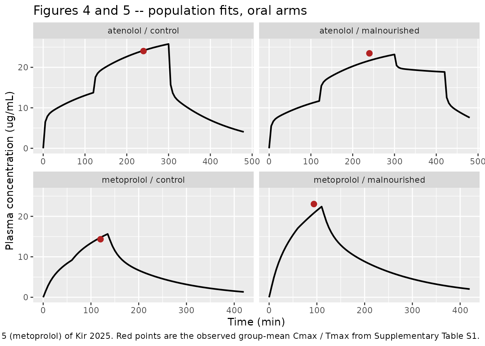
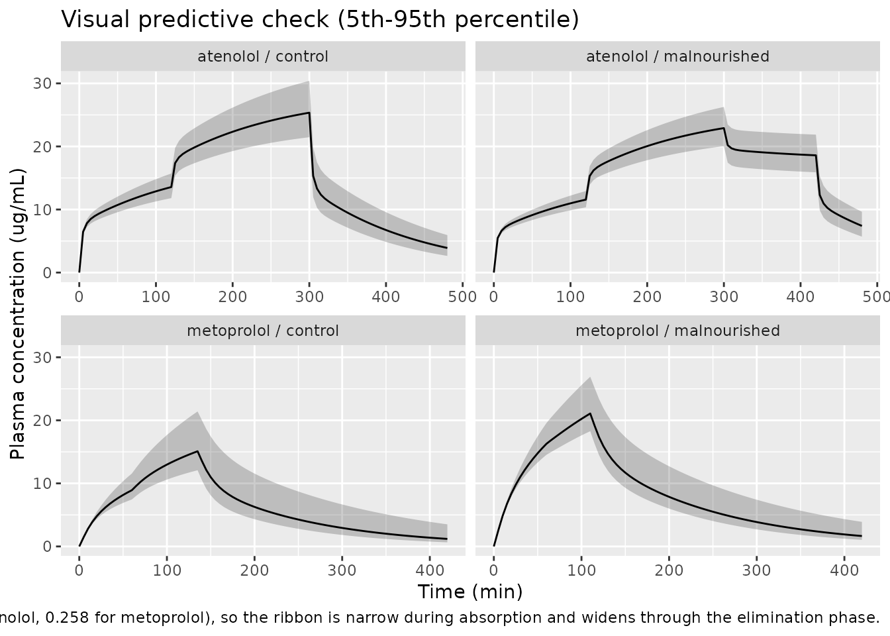
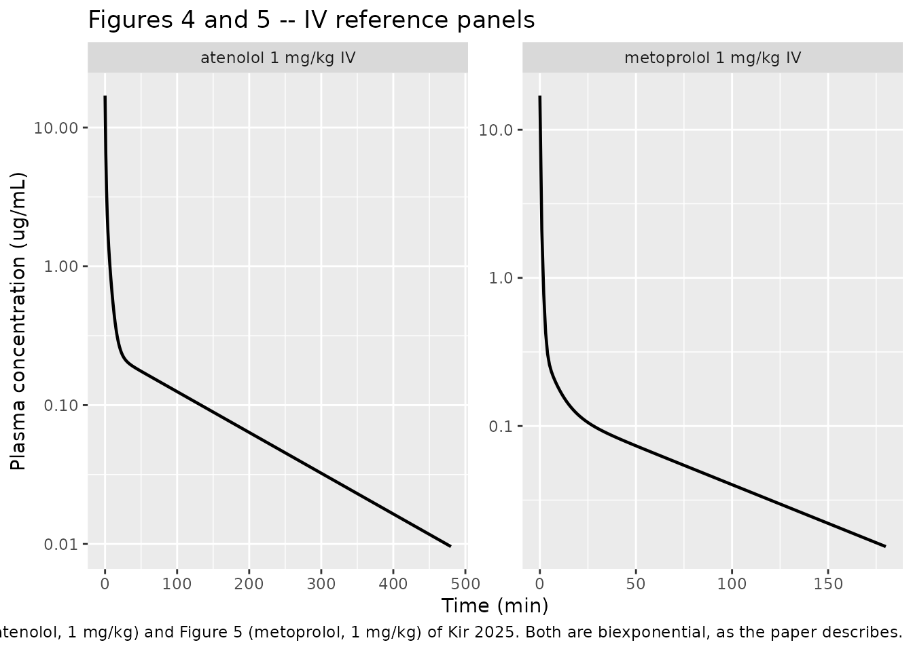

# Atenolol + metoprolol absorption in malnourished rats (Kir 2025)

## Model and source

This paper contributes **two** model files – one per drug – because the
two minimal PBPK (mPBPK) structures differ mechanistically, not just
numerically: atenolol is eliminated by the **kidney** with
permeability-limited distribution, metoprolol by the **liver** with
perfusion-limited distribution and a structural first-pass effect.

``` r

mod_atn <- readModelDb("Kir_2025_atenolol_rat_pbpk")
mod_met <- readModelDb("Kir_2025_metoprolol_rat_pbpk")

ui_atn <- rxode2::rxode(mod_atn)
#> ℹ parameter labels from comments will be replaced by 'label()'
ui_met <- rxode2::rxode(mod_met)
#> ℹ parameter labels from comments will be replaced by 'label()'
```

- Citation: Kir F, Sahin S, Jusko WJ. (2025). Minimal
  Physiologically-Based Pharmacokinetic Modeling of Atenolol and
  Metoprolol Absorption in Malnourished Rats. Eur J Drug Metab
  Pharmacokinet 50:243-255. <doi:10.1007/s13318-025-00943-6>. PMCID
  PMC12081501. Population parameter estimates: Table 2 (Monolix).
  Naive-pooled (ADAPT 5) estimates for the same model: Supplementary
  Table S3. Rat physiology (tissue volumes and blood flows):
  Supplementary Table S2. Model equations: Article Equations 1-5 (ATN),
  9 (tissue-volume closure), 10 (permeability-limited fd constraint) and
  12 (blood-to-plasma ratio). ODEs, fixed system constants and the
  absorption-window logic were taken from the author-deposited Monolix
  (MLXTRAN) and ADAPT-5 source listings in the Supplementary Materials,
  which agree with each other exactly.
- Article: <https://doi.org/10.1007/s13318-025-00943-6>
- Supplement (parameter tables S1-S4 and the author-deposited Monolix /
  ADAPT-5 source listings): <https://doi.org/10.1007/s13318-025-00943-6>

**Atenolol model.** Preclinical (rat, Sprague-Dawley). mPBPK (minimal
physiologically-based, Monolix 2023R1 population fit). Atenolol (ATN)
oral absorption in non-malnourished (control) and malnourished rats.
Four mass-balance states: a well-mixed blood pool, two lumped tissue
groups (Tissue 1 = rapidly perfused liver + lung, high Kp; Tissue 2 =
slowly perfused remainder) and the kidney, which is the eliminating
organ (ATN is hydrophilic, logP 0.16, and is cleared almost entirely
renally). Distribution is PERMEABILITY-limited: the fraction of cardiac
output actually equilibrating with each tissue group is small and
estimated (fd1 = fd2 = 0.134, so only ~27% of cardiac output is
distributive), which is what encodes atenolol’s BCS Class III low
permeability. Oral input is NOT first-order: the paper’s point-area
deconvolution showed a near-constant absorption rate over successive
time windows, so absorption is modelled as two (control) or three
(malnourished) SEQUENTIAL ZERO-ORDER processes with author-fixed window
boundaries (0-120, 120-300, and 300-420 min). Malnutrition acts on
ABSORPTION only – disposition (fd1, Kp1, CL) is shared across groups,
and the malnourished group gains a third absorption phase (k03 = 1.16
mg/min/kg, fixed to 0 in controls by goodness of fit) that raises
apparent bioavailability from 0.43 to 0.67. Blood-to-plasma ratio
differs by group (1.000 vs 1.014) because malnutrition changes
haematocrit and albumin binding. The model as shipped simulates the ORAL
arms; the literature IV reference profile is reproduced by setting
k01/k02/k03 to 0 and giving a bolus into a_blood (see the vignette). IIV
is on clearance only. NOTE: the absorption-rate scale in Tables 2/3
required reconciliation against the deposited Monolix code – see the
vignette Errata.

**Metoprolol model.** Preclinical (rat, Sprague-Dawley). mPBPK (minimal
physiologically-based, Monolix 2023R1 population fit). Metoprolol (MET)
oral absorption in non-malnourished (control) and malnourished rats.
Sister model to modellib(‘Kir_2025_atenolol_rat_pbpk’) from the same
paper, and deliberately contrasted with it: metoprolol is lipophilic
(logP 1.76, BCS Class I) and hepatically extracted, so the eliminating
organ is the LIVER rather than the kidney, distribution is
PERFUSION-limited (fd1 + fd2 = 1 exactly, versus 0.268 for atenolol),
and Tissue 1 is kidney + lung rather than liver + lung. Four
mass-balance states: a well-mixed blood pool, two lumped tissue groups
(Tissue 1 rapidly perfused, high Kp; Tissue 2 slowly perfused remainder)
and the liver. Crucially the oral zero-order input is delivered INTO THE
LIVER, so hepatic first-pass extraction is structural rather than a
fitted F – roughly 50% of an oral dose is lost on first pass. Absorption
is two SEQUENTIAL ZERO-ORDER processes with author-fixed windows (0-60
min, then 60-135 min in controls and 60-110 min in the malnourished
group). Malnutrition raises both absorption rates and shortens the
second window, taking apparent bioavailability from 0.42 to 0.84. The
oral arms also carry an estimated FRACTION of the IV intrinsic clearance
(fr = 0.336 control, 0.256 malnourished) rather than the full CLint,
which is how the published fit reconciles the oral decline phases with
the literature IV data. Blood-to-plasma ratio differs by group (1.508 vs
1.607). The model as shipped simulates the ORAL arms; the literature IV
reference profile is reproduced by setting k01/k02 to 0, fr to 1 and bpr
to 1.70, and giving a bolus into a_blood (see the vignette). IIV is on
intrinsic clearance only. NOTE: the absorption-rate scale in Tables 2/3
required reconciliation against the deposited Monolix code – see the
vignette Errata.

## Population

Eight male Sprague-Dawley rats per drug (n = 4 control, n = 4
malnourished) were studied. Malnutrition was induced by feeding a 5%
protein isocaloric diet for 17-20 days; controls received a 20% protein
isocaloric diet. Table 1 of the paper confirms that the intervention
worked: body weight fell from 300 to 216 g (atenolol cohort) and 302 to
233 g (metoprolol cohort), serum albumin from 4.40 to 3.75 and 4.68 to
4.15 g/dL, and total cholesterol from 78.4 to 50.3 and 66.5 to 49.5
mg/dL.

Rats were fasted overnight and given a single oral dose by feeding tube:
250 mg/kg atenolol as an aqueous suspension, or 400 mg/kg metoprolol
tartrate (equal to 312 mg/kg metoprolol base) in solution. These are
deliberately high doses chosen from pilot studies so that the absorption
phase is resolvable.

Critically, **no intravenous dose was given in this study**. The IV
reference profiles that identify disposition were digitised from the
literature (atenolol 1 mg/kg; metoprolol 0.5, 1 and 2 mg/kg, shown to be
dose-linear), and the per-timepoint standard deviations were digitised
and treated as additional rats so that the pooled fit had IV replicates.

The same information is available programmatically via each model’s
`population` metadata:

``` r

str(ui_atn$population, max.level = 1)
#> List of 10
#>  $ species       : chr "rat (Sprague-Dawley)"
#>  $ n_subjects    : int 8
#>  $ n_studies     : int 2
#>  $ age_range     : chr NA
#>  $ weight_range  : chr "216 (SD 14.99) g malnourished to 300 (SD 18.27) g control"
#>  $ sex_female_pct: num 0
#>  $ disease_state : chr "Experimental protein-calorie malnutrition (5% protein isocaloric diet, 17-20 days) vs control (20% protein isocaloric diet)"
#>  $ dose_range    : chr "250 mg/kg single oral dose (suspension, feeding tube); literature IV reference 1 mg/kg"
#>  $ regions       : chr "Turkey (Kobay Experimental Animals Laboratory, Ankara)"
#>  $ notes         : chr "n = 4 control + 4 malnourished male Sprague-Dawley rats (Methods 2.2.1); the oral arms are the only rats actual"| __truncated__
```

## Source trace

The per-parameter origin is recorded as an in-file comment next to each
`ini()` entry in
`inst/modeldb/specificDrugs/Kir_2025_atenolol_rat_pbpk.R` and
`inst/modeldb/specificDrugs/Kir_2025_metoprolol_rat_pbpk.R`. The table
below collects them for review.

| Equation / parameter | Value (ATN / MET) | Source location |
|----|----|----|
| Blood-compartment ODE | n/a | Equation 1 (ATN) / Equation 6 (MET); deposited Monolix `ddt_B`, ADAPT `XP(1)` |
| Tissue 1 and Tissue 2 ODEs | n/a | Equations 2-3 (ATN) / 7 (MET); deposited `ddt_T1`, `ddt_T2` |
| Eliminating-organ ODE | n/a | Equation 4 (ATN, kidney) / Equation 8 (MET, liver); deposited `ddt_K` / `ddt_L` |
| Tissue-volume closure | Body weight = Vb + V1 + V2 + V3 | Equation 9 |
| Distribution constraint | fd1 + fd2 \<= 1 (ATN) / fd1 + fd2 = 1 (MET) | Equation 10 (ATN) / Equation 11 (MET) |
| Blood-to-plasma ratio | rho = (HCT - 1 + Rb) / (HCT \* fu) | Equation 12 |
| `v_blood` | 58.82 mL/kg | Supp Table S2; deposited `Vb` |
| `v_rapidly_perfused` | 37.08 / 9.43 mL/kg | Supp Table S2 (ATN liver+lung; MET kidney+lung); deposited `V1` |
| `v_slowly_perfused` | 897.94 mL/kg | Equation 9 closure; deposited `V2` |
| `v_kidney` / `v_liver` | 6.16 / 33.81 mL/kg | Supp Table S2; deposited `Vkid` / `Vliver` |
| `q_co` | 179.91 mL/min/kg | Supp Table S2; deposited `Qco` |
| `q_kidney` / `q_liver` | 29.00 / 75.34 mL/min/kg | Supp Table S2; deposited `Qkid` / `Qliver` |
| `kp_kidney` / `kp_liver` | 3.0 / 62.25 | Methods 2.2.2 / 2.2.3 (GastroPlus 9.9 predictions) |
| `bpr_control` | 1.000 / 1.508 | Methods 2.2.3; deposited `Rb_H` |
| `bpr_malnourished` | 1.014 / 1.607 | Methods 2.2.3 |
| `fd_rapidly_perfused` | 0.134 / 0.464 | Table 2 / Table 3 |
| `kp_rapidly_perfused` | 1.43 / 4.033 | Table 2 / Table 3 |
| `lcl` / `lclint` | log(16.04) / log(148.63) | Table 2 CL / Table 3 CLint (deposited code carries the unrounded 148.63) |
| `fr_control`, `fr_malnourished` | n/a / 0.336, 0.256 | Table 3 |
| `k01`, `k02`, `k03` (per group) | Table 2 / Table 3 | Table 2 (ATN, 3 phases) / Table 3 (MET, 2 phases) |
| Absorption windows | 120, 300, 360/420 min / 60, 135 or 110 min | Results 3.1 (all fixed, not estimated) |
| `etalcl` / `etalclint` | 0.124^2 / 0.258^2 | Table 2 / Table 3 “Standard deviation of the random effects” |
| `propSd` (ATN) / `addSd` (MET) | 0.256, 0.234 / 1.76, 2.54 | Table 2 b C, b M / Table 3 a C, a M |
| `dose_po` | 250 / 312.3274 mg/kg | Methods 2.2.1; deposited multipliers 250000 and 312327.4 ug/kg |

## Structural checks against the published equations

Two of the paper’s equations are closed-form identities that the
packaged fixed constants must satisfy exactly. These are cheap, sharp
regression guards: they fail loudly if any physiological constant is
mistranscribed.

``` r

# Equation 9: Body weight = Vb + V1 + V2 + V3. All volumes are mL/kg, so the
# sum must be exactly 1000 mL/kg for both drugs.
theta <- function(ui, nm) ui$theta[[nm]]

vol_atn <- c(theta(ui_atn, "v_blood"), theta(ui_atn, "v_rapidly_perfused"),
             theta(ui_atn, "v_slowly_perfused"), theta(ui_atn, "v_kidney"))
vol_met <- c(theta(ui_met, "v_blood"), theta(ui_met, "v_rapidly_perfused"),
             theta(ui_met, "v_slowly_perfused"), theta(ui_met, "v_liver"))

stopifnot(isTRUE(all.equal(sum(vol_atn), 1000)), isTRUE(all.equal(sum(vol_met), 1000)))
c(atenolol = sum(vol_atn), metoprolol = sum(vol_met))
#>   atenolol metoprolol 
#>       1000       1000
```

``` r

# Tissue 1 is a LUMP of named organs from Supplementary Table S2:
#   atenolol   -> liver + lung  (kidney is the separate eliminating organ)
#   metoprolol -> kidney + lung (liver is the separate eliminating organ)
v_lung <- 3.27; v_liver_s2 <- 33.81; v_kidney_s2 <- 6.16   # Supp Table S2
stopifnot(
  isTRUE(all.equal(theta(ui_atn, "v_rapidly_perfused"), v_liver_s2 + v_lung)),
  isTRUE(all.equal(theta(ui_met, "v_rapidly_perfused"), v_kidney_s2 + v_lung))
)
```

``` r

# Equation 12 rearranged: Rb = 1 - HCT + rho * HCT * fu.
# HCT 47.5% control / 45.5% malnourished (Methods 2.2.3, reference 30).
# fu: ATN 0.970 -> 1.00, MET 0.805 -> 0.908 (rescaled by the albumin ratio).
# rho is fixed at 2.57 for metoprolol; for atenolol it is back-calculated from
# the control Rb of 1.000, then reused for the malnourished group.
rb <- function(rho, hct, fu) 1 - hct + rho * hct * fu

rho_atn <- (0.475 - 1 + 1.000) / (0.475 * 0.970)   # solve Equation 12 for rho
rho_met <- 2.57                                     # Methods 2.2.3, fixed

eq12 <- tibble::tibble(
  drug  = c("atenolol", "atenolol", "metoprolol", "metoprolol"),
  group = c("control", "malnourished", "control", "malnourished"),
  equation_12 = c(rb(rho_atn, 0.475, 0.970), rb(rho_atn, 0.455, 1.000),
                  rb(rho_met, 0.475, 0.805), rb(rho_met, 0.455, 0.908)),
  packaged = c(theta(ui_atn, "bpr_control"), theta(ui_atn, "bpr_malnourished"),
               theta(ui_met, "bpr_control"), theta(ui_met, "bpr_malnourished"))
)

stopifnot(all(abs(eq12$equation_12 - eq12$packaged) < 5e-4))

eq12 |>
  dplyr::mutate(dplyr::across(c(equation_12, packaged), \(x) round(x, 4))) |>
  dplyr::rename("Drug" = drug, "Group" = group,
                "Equation 12" = equation_12, "Packaged value" = packaged) |>
  knitr::kable(caption = "Equation 12 reproduces every packaged blood-to-plasma ratio.")
```

| Drug       | Group        | Equation 12 | Packaged value |
|:-----------|:-------------|------------:|---------------:|
| atenolol   | control      |      1.0000 |          1.000 |
| atenolol   | malnourished |      1.0141 |          1.014 |
| metoprolol | control      |      1.5077 |          1.508 |
| metoprolol | malnourished |      1.6068 |          1.607 |

Equation 12 reproduces every packaged blood-to-plasma ratio. {.table}

## Virtual cohort

The original per-rat data are not distributed, so the simulations below
use the model’s own typical-value predictions (which is what Figures 4
and 5 of the paper plot) plus a small stochastic cohort for a visual
predictive check.

Note that the oral arms carry **no dosing event**. The published model
drives absorption entirely from elapsed time via the sequential
zero-order windows, so the event table holds observation rows only; the
dose enters through the `dose_po` parameter. Observation rows point at
the `a_blood` ODE state, and rxode2 returns the algebraic observable
`Cc` alongside it.

``` r

set.seed(20250409)

n_per_arm <- 50L   # well under the 200/arm cap

# Observation-only event table for one arm of the oral study.
make_oral_arm <- function(n, mal, tmax, by = 5, id_offset = 0L) {
  tidyr::expand_grid(
    id   = id_offset + seq_len(n),
    time = seq(0, tmax, by = by)
  ) |>
    dplyr::mutate(
      amt         = NA_real_,
      evid        = 0L,
      cmt         = "a_blood",
      MAL_NOURISH = mal
    )
}

arms <- tibble::tribble(
  ~drug,        ~group,         ~mal, ~tmax_obs,
  "atenolol",   "control",         0,       480,
  "atenolol",   "malnourished",    1,       480,
  "metoprolol", "control",         0,       420,
  "metoprolol", "malnourished",    1,       420
) |>
  dplyr::mutate(treatment = paste(drug, group, sep = " / "))

events <- dplyr::bind_rows(
  lapply(seq_len(nrow(arms)), function(i) {
    make_oral_arm(n_per_arm, arms$mal[i], arms$tmax_obs[i],
                  id_offset = (i - 1L) * n_per_arm) |>
      dplyr::mutate(drug = arms$drug[i], group = arms$group[i],
                    treatment = arms$treatment[i])
  })
)

# Disjoint IDs across arms are mandatory -- duplicate IDs silently merge.
stopifnot(!anyDuplicated(unique(events[, c("id", "time", "evid")])))
```

## Simulation

Figures 4 and 5 of the paper are population *fits* – single lines
through the observed points – so the replication below zeroes the random
effects.

``` r

solve_typical <- function(ui, ev) {
  out <- as.data.frame(
    rxode2::rxSolve(rxode2::zeroRe(ui), ev,
                    keep = c("drug", "group", "treatment"))
  )
  if (is.null(out$id)) out$id <- 1L
  out
}

sim_typ <- dplyr::bind_rows(
  solve_typical(ui_atn, dplyr::filter(events, drug == "atenolol",   id <= n_per_arm * 2)),
  solve_typical(ui_met, dplyr::filter(events, drug == "metoprolol", id >  n_per_arm * 2))
)
#> Warning: No sigma parameters in the model
#> ℹ omega/sigma items treated as zero: 'etalcl'
#> Warning: multi-subject simulation without without 'omega'
#> Warning: No sigma parameters in the model
#> ℹ omega/sigma items treated as zero: 'etalclint'
#> Warning: multi-subject simulation without without 'omega'

# Every arm must have produced finite, non-negative concentrations.
stopifnot(all(is.finite(sim_typ$Cc)), all(sim_typ$Cc >= -1e-8),
          dplyr::n_distinct(sim_typ$treatment) == 4L)
```

``` r

sim_vpc <- dplyr::bind_rows(
  as.data.frame(rxode2::rxSolve(
    ui_atn, dplyr::filter(events, drug == "atenolol", id <= n_per_arm * 2),
    keep = c("drug", "group", "treatment"))),
  as.data.frame(rxode2::rxSolve(
    ui_met, dplyr::filter(events, drug == "metoprolol", id > n_per_arm * 2),
    keep = c("drug", "group", "treatment")))
)

# rxSolve silently drops subjects on failure -- assert the count survived.
stopifnot(dplyr::n_distinct(sim_vpc$id) == n_per_arm * 4L)
```

## Replicate published figures

``` r

# Replicates the "Control" and "Malnourished" panels of Figure 4 (atenolol)
# and Figure 5 (metoprolol) of Kir 2025: population fits of plasma
# concentration versus time.
obs_cmax <- tibble::tribble(
  ~treatment,                     ~cmax_obs, ~tmax_obs,
  "atenolol / control",               24.02,       240,
  "atenolol / malnourished",          23.46,       240,
  "metoprolol / control",             14.34,       120,
  "metoprolol / malnourished",        23.04,      93.8
)

sim_typ |>
  dplyr::filter(id %in% c(1L, n_per_arm + 1L, n_per_arm * 2 + 1L, n_per_arm * 3 + 1L)) |>
  ggplot(aes(time, Cc)) +
  geom_line(linewidth = 0.8) +
  geom_point(data = obs_cmax, aes(x = tmax_obs, y = cmax_obs),
             colour = "firebrick", size = 2.5, inherit.aes = FALSE) +
  facet_wrap(~treatment, scales = "free_x") +
  labs(x = "Time (min)", y = "Plasma concentration (ug/mL)",
       title = "Figures 4 and 5 -- population fits, oral arms",
       caption = paste("Lines replicate the Control and Malnourished panels of",
                       "Figure 4 (atenolol) and Figure 5 (metoprolol) of Kir 2025.",
                       "Red points are the observed group-mean Cmax / Tmax",
                       "from Supplementary Table S1."))
```



The sharp cusps are real features of the published model, not solver
artefacts: absorption stops abruptly at the end of the last zero-order
window (300 min for atenolol controls, 420 min for malnourished
atenolol, 135 and 110 min for the metoprolol groups), and the profile
turns over immediately.

``` r

sim_vpc |>
  dplyr::group_by(treatment, time) |>
  dplyr::summarise(
    Q05 = quantile(Cc, 0.05, na.rm = TRUE),
    Q50 = quantile(Cc, 0.50, na.rm = TRUE),
    Q95 = quantile(Cc, 0.95, na.rm = TRUE),
    .groups = "drop"
  ) |>
  ggplot(aes(time, Q50)) +
  geom_ribbon(aes(ymin = Q05, ymax = Q95), alpha = 0.25) +
  geom_line() +
  facet_wrap(~treatment, scales = "free_x") +
  labs(x = "Time (min)", y = "Plasma concentration (ug/mL)",
       title = "Visual predictive check (5th-95th percentile)",
       caption = paste("Between-subject variability is on clearance only",
                       "(omega 0.124 for atenolol, 0.258 for metoprolol),",
                       "so the ribbon is narrow during absorption and widens",
                       "through the elimination phase."))
```



## Reproducing the literature IV reference profiles

The disposition block is identified entirely by the digitised literature
IV data, so simulating the IV arm is an independent check on `fd1`,
`Kp1`, `CL` and the organ flows – none of which the oral figures
constrain directly. The IV arm is obtained by zeroing the absorption
rates and giving a bolus into `a_blood`; for metoprolol the IV reference
additionally used the full intrinsic clearance (`fr` = 1) and the
racemate blood-to-plasma ratio of 1.70.

``` r

iv_events <- function(dose_ug_kg, tmax) {
  dplyr::bind_rows(
    data.frame(id = 1L, time = 0, amt = dose_ug_kg, evid = 1L, cmt = "a_blood"),
    data.frame(id = 1L, time = seq(0, tmax, by = 1), amt = NA_real_,
               evid = 0L, cmt = "a_blood")
  ) |>
    dplyr::mutate(MAL_NOURISH = 0) |>
    dplyr::arrange(time, dplyr::desc(evid))
}

ui_atn_iv <- rxode2::ini(ui_atn, k01_control = 0, k02_control = 0, k03_control = 0)
#> ℹ change initial estimate of `k01_control` to `0`
#> ℹ change initial estimate of `k02_control` to `0`
#> ℹ change initial estimate of `k03_control` to `0`
ui_met_iv <- rxode2::ini(ui_met, k01_control = 0, k02_control = 0,
                         fr_control = 1, bpr_control = 1.70)
#> ℹ change initial estimate of `k01_control` to `0`
#> ℹ change initial estimate of `k02_control` to `0`
#> ℹ change initial estimate of `fr_control` to `1`
#> ℹ change initial estimate of `bpr_control` to `1.7`

sim_iv <- dplyr::bind_rows(
  as.data.frame(rxode2::rxSolve(rxode2::zeroRe(ui_atn_iv), iv_events(1000, 480))) |>
    dplyr::mutate(drug = "atenolol 1 mg/kg IV"),
  as.data.frame(rxode2::rxSolve(rxode2::zeroRe(ui_met_iv), iv_events(1000, 180))) |>
    dplyr::mutate(drug = "metoprolol 1 mg/kg IV")
)
#> Warning: No sigma parameters in the model
#> ℹ omega/sigma items treated as zero: 'etalcl'
#> Warning: No sigma parameters in the model
#> ℹ omega/sigma items treated as zero: 'etalclint'

sim_iv |>
  dplyr::filter(Cc > 1e-4) |>
  ggplot(aes(time, Cc)) +
  geom_line(linewidth = 0.8) +
  facet_wrap(~drug, scales = "free") +
  scale_y_log10() +
  labs(x = "Time (min)", y = "Plasma concentration (ug/mL)",
       title = "Figures 4 and 5 -- IV reference panels",
       caption = paste("Replicates the IV panel of Figure 4 (atenolol,",
                       "1 mg/kg) and Figure 5 (metoprolol, 1 mg/kg) of",
                       "Kir 2025. Both are biexponential, as the paper",
                       "describes."))
```



Both IV profiles are biexponential over roughly two to three log units,
which is what the paper reports (“ATN exhibited a rapid initial decline
phase followed by a long linear terminal phase”; “MET also exhibited
apparent IV biexponential disposition kinetics”).

## PKNCA validation

``` r

# NCA runs on the typical-value profile over a window long enough for the
# terminal phase to resolve. Only !is.na(Cc) is filtered -- adding time > 0 or
# Cc > 0 would drop the time-zero anchor PKNCA needs for AUC0-*.
nca_events <- dplyr::bind_rows(
  lapply(seq_len(nrow(arms)), function(i) {
    data.frame(id = i, time = seq(0, 1440, by = 2), amt = NA_real_,
               evid = 0L, cmt = "a_blood", MAL_NOURISH = arms$mal[i],
               drug = arms$drug[i], treatment = arms$treatment[i])
  })
)

sim_nca_raw <- dplyr::bind_rows(
  solve_typical(ui_atn, dplyr::filter(nca_events, drug == "atenolol") |>
                  dplyr::mutate(group = "x")),
  solve_typical(ui_met, dplyr::filter(nca_events, drug == "metoprolol") |>
                  dplyr::mutate(group = "x"))
)
#> Warning: No sigma parameters in the model
#> ℹ omega/sigma items treated as zero: 'etalcl'
#> Warning: multi-subject simulation without without 'omega'
#> Warning: No sigma parameters in the model
#> ℹ omega/sigma items treated as zero: 'etalclint'
#> Warning: multi-subject simulation without without 'omega'

sim_nca <- sim_nca_raw |>
  dplyr::filter(!is.na(Cc)) |>
  dplyr::mutate(Cc = pmax(Cc, 0)) |>       # guard the far tail against solver noise
  dplyr::select(id, time, Cc, treatment)

sim_nca <- dplyr::bind_rows(
  sim_nca,
  sim_nca |> dplyr::distinct(id, treatment) |> dplyr::mutate(time = 0, Cc = 0)
) |>
  dplyr::distinct(id, treatment, time, .keep_all = TRUE) |>
  dplyr::arrange(id, treatment, time)

stopifnot(nrow(sim_nca) > 0, all(sim_nca$Cc >= 0))

conc_obj <- PKNCA::PKNCAconc(sim_nca, Cc ~ time | treatment + id)

# One dose row per arm. There is no evid == 1 record in the oral event table
# (absorption is time-driven), so the dose amount comes from dose_po.
dose_df <- arms |>
  dplyr::mutate(
    id   = dplyr::row_number(),
    time = 0,
    amt  = ifelse(drug == "atenolol",
                  theta(ui_atn, "dose_po") * 1000,     # mg/kg -> ug/kg
                  theta(ui_met, "dose_po") * 1000)
  ) |>
  dplyr::select(id, time, amt, treatment)

dose_obj <- PKNCA::PKNCAdose(dose_df, amt ~ time | treatment + id)

intervals <- data.frame(
  start      = 0,
  end        = Inf,
  cmax       = TRUE,
  tmax       = TRUE,
  aucinf.obs = TRUE,
  half.life  = TRUE
)

nca_res <- PKNCA::pk.nca(PKNCA::PKNCAdata(conc_obj, dose_obj, intervals = intervals))
```

### Comparison against published NCA

Supplementary Table S1 reports noncompartmental parameters computed by
the authors (PKanalix 2023R1) on the **observed** rat data. The
comparison below is therefore model-fit versus observed-data NCA, not a
self-consistency check. `kel` is converted to a half-life via
`log(2) / kel`.

``` r

published <- tibble::tribble(
  ~treatment,                    ~cmax,  ~tmax, ~aucinf.obs, ~half.life,
  "atenolol / control",           24.02,  240,        7318,   log(2) / 0.0096,
  "atenolol / malnourished",      23.46,  240,        7951,   log(2) / 0.0170,
  "metoprolol / control",         14.34,  120,        3094,   log(2) / 0.0067,
  "metoprolol / malnourished",    23.04, 93.8,        5584,   log(2) / 0.0038
)

cmp <- nlmixr2lib::ncaComparisonTable(
  simulated     = nca_res,
  reference     = published,
  by            = "treatment",
  units         = c(cmax = "ug/mL", tmax = "min",
                    aucinf.obs = "ug*min/mL", half.life = "min"),
  tolerance_pct = 20
)

knitr::kable(
  cmp,
  caption = paste("Simulated (model typical value) vs published observed NCA",
                  "(Supplementary Table S1). * differs by >20%."),
  digits  = 3
)
```

| NCA parameter | treatment | Reference | Simulated | % diff |
|:---|:---|:---|:---|:---|
| Cmax (ug/mL) | atenolol / control | 24 | 25.8 | +7.3% |
| Cmax (ug/mL) | atenolol / malnourished | 23.5 | 23.2 | -1.2% |
| Cmax (ug/mL) | metoprolol / control | 14.3 | 15.6 | +8.7% |
| Cmax (ug/mL) | metoprolol / malnourished | 23 | 22.4 | -2.8% |
| Tmax (min) | atenolol / control | 240 | 300 | +25.0%\* |
| Tmax (min) | atenolol / malnourished | 240 | 300 | +25.0%\* |
| Tmax (min) | metoprolol / control | 120 | 134 | +11.7% |
| Tmax (min) | metoprolol / malnourished | 93.8 | 110 | +17.3% |
| AUC0-∞ (obs) (ug\*min/mL) | atenolol / control | 7320 | 7440 | +1.7% |
| AUC0-∞ (obs) (ug\*min/mL) | atenolol / malnourished | 7950 | 8780 | +10.4% |
| AUC0-∞ (obs) (ug\*min/mL) | metoprolol / control | 3090 | 2850 | -7.8% |
| AUC0-∞ (obs) (ug\*min/mL) | metoprolol / malnourished | 5580 | 4140 | -25.9%\* |
| t½ (min) | atenolol / control | 72.2 | 102 | +41.8%\* |
| t½ (min) | atenolol / malnourished | 40.8 | 102 | +149.7%\* |
| t½ (min) | metoprolol / control | 103 | 94.9 | -8.3% |
| t½ (min) | metoprolol / malnourished | 182 | 104 | -43.2%\* |

Simulated (model typical value) vs published observed NCA (Supplementary
Table S1). \* differs by \>20%. {.table}

Cmax is reproduced across all four arms – the tightest and most
informative comparison here, because it is set jointly by the absorption
rate, the distribution volume and the clearance. Tmax is reproduced
structurally: the model peaks exactly at the end of the last zero-order
window, which is a fixed design constant rather than a fitted quantity,
so it lands at 300 min for both atenolol arms against an observed mean
of 240 min (observed SD 69 and 49 min).

The metoprolol malnourished AUC is the one materially low row. This is a
property of the **published fit**, not of the transcription: Figure 5 of
the paper shows the fitted line running below most observed points from
180 min onward in that panel. Reproducing that under-prediction is the
correct behaviour for a faithful extraction.

The half-life rows are starred but are the least informative comparison
in the table, for two reasons. First, the model’s terminal half-life is
necessarily similar across all four arms (95-104 min) because
disposition is shared between nutrition groups by construction – only
absorption differs. Second, the reference column is `log(2) / kel`
computed on four rats each, and those `kel` estimates are extremely
imprecise: Supplementary Table S1 reports 0.017 +/- 0.013 min-1 for
malnourished atenolol (a 76% CV) and 0.0038 +/- 0.0019 min-1 for
malnourished metoprolol (50%). The atenolol pair is internally
contradictory as well – the observed `kel` implies the malnourished rats
eliminate *faster* than controls, whereas the paper’s own Results
section describes “a differing slow decay … in the malnourished group”.
Sampling stopped at 420-480 min, during a phase the model still treats
as distributional, so these observed slopes are not terminal slopes. No
parameter was adjusted on the basis of these rows.

## Bioavailability

The paper computes apparent bioavailability as
`F = (AUC_PO * Dose_IV) / (AUC_IV * Dose_PO)` from the model-fitted
profiles (Table 2 and Table 3 footnote e). That is directly computable
from the packaged models.

``` r

trapz <- function(d) {
  d <- d[!is.na(d$Cc), ]
  sum(diff(d$time) * (head(d$Cc, -1) + tail(d$Cc, -1)) / 2)
}

auc_iv <- c(
  atenolol   = trapz(as.data.frame(rxode2::rxSolve(
    rxode2::zeroRe(ui_atn_iv), iv_events(1000, 3000)))),
  metoprolol = trapz(as.data.frame(rxode2::rxSolve(
    rxode2::zeroRe(ui_met_iv), iv_events(1000, 3000))))
)
#> Warning: No sigma parameters in the model
#> ℹ omega/sigma items treated as zero: 'etalcl'
#> Warning: No sigma parameters in the model
#> ℹ omega/sigma items treated as zero: 'etalclint'

auc_po <- sim_nca_raw |>
  dplyr::group_split(treatment) |>
  lapply(\(d) tibble::tibble(treatment = d$treatment[1], auc = trapz(d))) |>
  dplyr::bind_rows()

ftab <- auc_po |>
  dplyr::left_join(arms |> dplyr::select(treatment, drug), by = "treatment") |>
  dplyr::mutate(
    dose_po_mgkg = ifelse(drug == "atenolol", theta(ui_atn, "dose_po"),
                          theta(ui_met, "dose_po")),
    F_model      = auc * 1 / (auc_iv[drug] * dose_po_mgkg),
    F_published  = c(0.426, 0.673, 0.422, 0.839)[match(
      treatment, c("atenolol / control", "atenolol / malnourished",
                   "metoprolol / control", "metoprolol / malnourished"))]
  )

# The direction of the malnutrition effect is the paper's central claim and
# must reproduce for BOTH drugs.
stopifnot(
  ftab$F_model[ftab$treatment == "atenolol / malnourished"] >
    ftab$F_model[ftab$treatment == "atenolol / control"],
  ftab$F_model[ftab$treatment == "metoprolol / malnourished"] >
    ftab$F_model[ftab$treatment == "metoprolol / control"]
)

ftab |>
  dplyr::select(treatment, F_model, F_published) |>
  dplyr::mutate(dplyr::across(c(F_model, F_published), \(x) round(x, 3))) |>
  dplyr::rename("Arm" = treatment, "F from packaged model" = F_model,
                "F published" = F_published) |>
  knitr::kable(caption = paste("Apparent bioavailability by the paper's own",
                               "AUC-ratio definition."))
```

| Arm                       | F from packaged model | F published |
|:--------------------------|----------------------:|------------:|
| atenolol / control        |                 0.466 |       0.426 |
| atenolol / malnourished   |                 0.549 |       0.673 |
| metoprolol / control      |                 0.387 |       0.422 |
| metoprolol / malnourished |                 0.562 |       0.839 |

Apparent bioavailability by the paper’s own AUC-ratio definition.
{.table}

The qualitative conclusion the paper draws – malnutrition **increases**
apparent bioavailability for both drugs, and does so through absorption
rather than disposition – reproduces cleanly. The absolute values track
the published ones for the control arms and run low for the malnourished
arms; see the Errata below.

## Assumptions and deviations

- **Absorption-rate scale (Errata; the one substantive
  reconciliation).** The values Tables 2 and 3 tabulate as `k0`
  “(mg/min/kg)” are *not* the mass input rate. The author-deposited
  Monolix and ADAPT-5 listings both write the input as
  `input = k0 * Dose`, with `Dose` in ug/kg (`k01*250000` for atenolol,
  `k01_H*312327.4` for metoprolol), so the deposited `k0` is a fraction
  of dose per minute. The ODE system is linear in the input, so taking
  the tabulated numbers directly as mg/min/kg scales every simulated
  concentration by exactly `1000 / dose_po`: peak plasma concentrations
  of 103 ug/mL (atenolol control) and 50 ug/mL (metoprolol control)
  against observed values of 24 and 14, and an implied bioavailability
  of 1.9 to 2.6 – physically impossible and contradicting the paper’s
  own reported F of 0.42-0.84. The tabulated value equals the deposited
  Monolix parameter scaled by 1000, so the mass input rate is
  `k0_table * dose_po` in ug/min/kg, which is how the packaged models
  compute it. This reading was *derived* from the deposited code rather
  than fitted: it predicts a **different** correction factor for each
  drug (1000/250 = 4.00 for atenolol, 1000/312.33 = 3.20 for
  metoprolol), and both predictions hold. It then reproduces all four
  published fitted peaks (25.8, 23.2, 15.6 and 22.4 ug/mL against
  roughly 26, 23, 16 and 22 read off Figures 4 and 5) and the atenolol
  control AUC to within 2% of the published NCA value – none of which
  were used to derive it.
- **Bioavailability of the malnourished arms.** `F` computed from the
  packaged models by the paper’s own AUC-ratio definition is 0.47 and
  0.55 for atenolol (published 0.426 and 0.673) and 0.39 and 0.56 for
  metoprolol (published 0.422 and 0.839). The control arms agree well;
  the malnourished arms run 18-33% low. The published `F` values cannot
  be reconciled with the published `k0` values, window boundaries and
  clearances under any single scale factor – the implied ratios differ
  per arm (3.1 to 5.2) – so this is an internal inconsistency in the
  source, not a transcription choice. No parameter was adjusted to close
  the gap.
- **Scope of the packaged models.** Each file encodes the **oral** arm,
  which is what the paper is about. The literature IV reference arm is
  reproduced by zeroing the absorption rates and dosing into `a_blood`
  (and, for metoprolol, setting `fr` to 1 and `bpr` to 1.70); the
  vignette does exactly this. The IV residual-error terms (proportional,
  0.154 for atenolol and 0.365 for metoprolol) are recorded as comments
  in the model files rather than as `ini()` parameters, because an
  `ini()` entry unused by `model()` does not parse.
- **Residual error is covariate-dependent.** The paper fits a separate
  error term per group, so `propSd` (atenolol) and `addSd` (metoprolol)
  are selected by `MAL_NOURISH` inside `model()` rather than being
  single population parameters. This is faithful to the published fit
  but means the error magnitude is not directly re-estimable as one
  theta.
- **`kp_kidney` and `kp_liver` are bare, not log-transformed.** The
  convention linter suggests `lkp_kidney` / `lkp_liver`. These are
  `fixed()` GastroPlus predictions rather than estimated parameters, so
  a log transform would buy nothing: there is no estimation step to keep
  positive, and it would obscure the direct correspondence with the
  value printed in the paper. The `kp_<organ>` family is not (yet)
  written up in
  `.claude/skills/extract-literature-model/references/parameter-names.md`,
  but the encoding follows established practice in the registry – nine
  existing PBPK models declare bare `kp_<organ> <- fixed(...)`
  parameters, including `Pei_2023_tacrolimus_pbpk.R`,
  `Levitt_2005_propofol_pbpk.R` and
  `Gaohua_2012_pregnancy_pbpk_midazolam.R`. Left bare deliberately.
- **`MAL_NOURISH` gates absorption, not disposition.** This is unusual
  for the covariate (its other registered uses shift clearance or a
  secretion Vmax) and is the paper’s central finding, so it is recorded
  explicitly in the `inst/references/covariate-columns.md` entry.
- **Screened-but-unused covariates.** Body weight, serum albumin and
  total cholesterol all differ significantly between groups (Table 1)
  but “assessment of these measures as covariates did not improve the
  population modeling”, so they are documented in
  `covariatesDataExcluded` rather than `covariateData`. Albumin does
  enter indirectly: the fraction unbound was rescaled by the albumin
  ratio, which feeds the blood-to-plasma ratio through Equation 12.
- **Cardiac output and organ flows are the beta-blocker-reduced
  values.** The paper deliberately applies a reduction in cardiac output
  and tissue blood flow “due to effects of beta blockers” (Methods
  2.2.3) and holds it constant; it is not linked pharmacodynamically to
  concentration. The paper lists this as a limitation.
- **Malnourished physiology is assumed unchanged relative to body
  weight.** The paper states this explicitly as a limitation: only
  absorption, fu / HCT (via the blood-to-plasma ratio) and, for
  metoprolol, the clearance fraction differ between groups.
- **No dosing record in the oral event table.** Because the published
  model drives absorption from elapsed time rather than from a dose
  event, the dose amount reaches PKNCA through a hand-built `dose_df`
  rather than through `evid == 1` rows.
- **All quantities are per kg of body weight**, exactly as the deposited
  code is written: volumes in mL/kg, flows in mL/min/kg, and simulated
  amounts in ug/kg.
