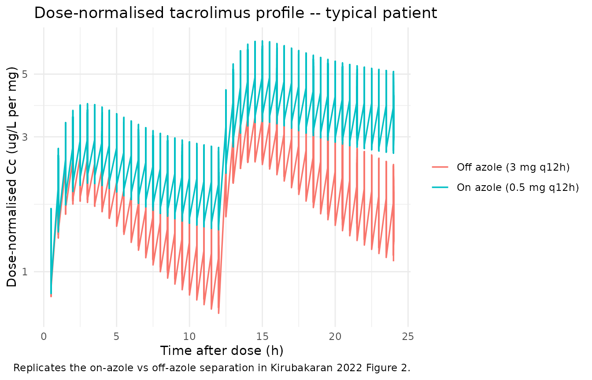
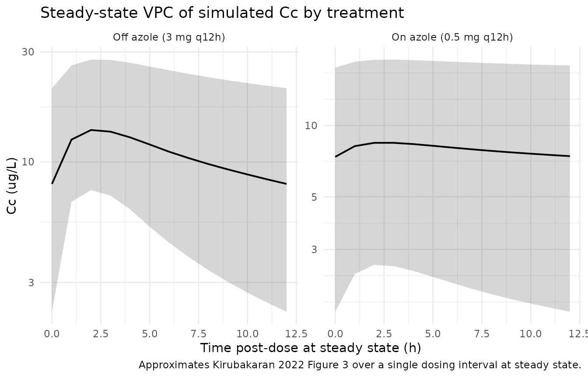

# Tacrolimus (Kirubakaran 2022)

``` r

library(nlmixr2lib)
library(rxode2)
#> rxode2 5.0.2 using 2 threads (see ?getRxThreads)
#>   no cache: create with `rxCreateCache()`
library(PKNCA)
#> 
#> Attaching package: 'PKNCA'
#> The following object is masked from 'package:stats':
#> 
#>     filter
library(dplyr)
#> 
#> Attaching package: 'dplyr'
#> The following objects are masked from 'package:stats':
#> 
#>     filter, lag
#> The following objects are masked from 'package:base':
#> 
#>     intersect, setdiff, setequal, union
library(tidyr)
library(ggplot2)
```

## Tacrolimus popPK in heart transplant recipients (Kirubakaran 2022)

This vignette validates the population pharmacokinetic model reported by
Kirubakaran et al. (2022) for oral immediate-release tacrolimus
(Prograf) in adult heart transplant recipients. The structural PK model
is two compartment with first-order absorption; the model carries a
state-dependent typical CL/F (with vs without concomitant azole
antifungal therapy) together with a state-dependent CL/F BSV magnitude.
Fat-free mass scales CL/F, V2/F, Q/F, and V3/F by allometry; haematocrit
modifies CL/F by a power function.

- Citation: Kirubakaran R, Uster DW, Hennig S, Carland JE, Day RO, Wicha
  SG, Stocker SL. Adaptation of a population pharmacokinetic model to
  inform tacrolimus therapy in heart transplant recipients. Br J Clin
  Pharmacol. 2023;89(4):1162-1175. <doi:10.1111/bcp.15566>. PK structure
  adapted via the NONMEM PRIOR (NWPRI) subroutine from Sikma MA, Hunault
  CC, Van Maarseveen EM, et al. High variability of whole-blood
  tacrolimus pharmacokinetics early after thoracic organ
  transplantation. Eur J Drug Metab Pharmacokinet. 2020;45(1):123-134.
  <doi:10.1007/s13318-019-00591-7>.
- Article: <https://doi.org/10.1111/bcp.15566>

## Population

The Kirubakaran 2022 cohort comprised 87 heart transplant recipients
followed at St Vincent’s Hospital Sydney from immediately
post-transplant to about one year post-transplantation, partitioned into
a 47-recipient model-building set (2018 transplants, 1099 tacrolimus
concentrations) and a 40-recipient external evaluation set (2017
transplants, 348 concentrations) (Kirubakaran 2022 Table 1 and Section
3.1). Baseline demographics (Table 1, model-building dataset unless
noted): 33/47 (70%) male; median age 53 years (range 16-70); median
weight 77 kg (40-107); median height 175 cm (154-190); ethnicity White /
Caucasian 19/47 (40%), Asian 5/47 (11%), unknown 23/47 (49%); diabetes
mellitus 16/47 (34%); median haematocrit 0.26 (0.21-0.38); median
albumin 34 g/L (20-43); median serum creatinine 131 umol/L (39-276);
median Cockcroft-Gault creatinine clearance 63 mL/min (25-172). All
recipients received oral immediate-release tacrolimus (Prograf) q12h,
mycophenolate mofetil 1 g q12h, and a tapered prednisolone regimen;
basiliximab IV induction was administered to 71/87 (82%) of recipients
with renal impairment or mechanical circulatory support; itraconazole
200 mg q12h was given to all recipients as Aspergillus prophylaxis from
immediately post-transplant for up to 6 months. Median (range)
tacrolimus dose was 0.50 mg q12h (0.05-8.00) under concomitant azole
antifungal therapy and 3.00 mg q12h (0.25-12.00) without (Section 3.2).

The same information is available programmatically via the model’s
`population` metadata.

``` r

pop <- rxode2::rxode(readModelDb("Kirubakaran_2022_tacrolimus"))$population
#> ℹ parameter labels from comments will be replaced by 'label()'
str(pop)
#> List of 22
#>  $ n_subjects                   : int 87
#>  $ n_studies                    : int 1
#>  $ age_range                    : chr "16-70 years (model building 16-70; external evaluation 16-69)"
#>  $ age_median                   : chr "53 years (model building); 56 years (external evaluation)"
#>  $ weight_range                 : chr "40-111 kg (model building 40-107; external evaluation 45-111)"
#>  $ weight_median                : chr "77 kg (model building); 75 kg (external evaluation)"
#>  $ height_range                 : chr "154-195 cm (model building 154-190; external evaluation 150-195)"
#>  $ height_median                : chr "175 cm (both subsets)"
#>  $ sex_female_pct               : num 32.2
#>  $ race_ethnicity               : Named num [1:3] 48.3 11.5 40.2
#>   ..- attr(*, "names")= chr [1:3] "White_Caucasian" "Asian" "Unknown"
#>  $ disease_state                : chr "Heart transplant recipients followed from transplantation to approximately 1 year post-transplant; immunosuppre"| __truncated__
#>  $ dose_range                   : chr "Oral immediate-release tacrolimus q12h, individualized to trough target. Median (range) 0.50 mg q12h (0.05-8.00"| __truncated__
#>  $ regions                      : chr "Single centre, St Vincent's Hospital Sydney, Australia"
#>  $ n_concentrations_modelbuild  : int 1099
#>  $ n_concentrations_external    : int 348
#>  $ haematocrit_baseline         : chr "median 0.26 (range 0.21-0.38) (Table 1)"
#>  $ albumin_baseline             : chr "median 34 g/L (range 20-43) (Table 1)"
#>  $ creatinine_baseline          : chr "median 131 umol/L (range 39-276) (Table 1)"
#>  $ creatinine_clearance_baseline: chr "median 63 mL/min (range 25-172) (Cockcroft-Gault, Table 1)"
#>  $ diabetes_pct                 : num 33.3
#>  $ cyp3a5_genotype_known_pct    : num 51
#>  $ notes                        : chr "Retrospective routine-care monitoring data; almost entirely pre-dose (trough) concentrations (Section 3.2). Bio"| __truncated__
```

## Source trace

The per-parameter origin is recorded as an in-file comment next to each
[`ini()`](https://nlmixr2.github.io/rxode2/reference/ini.html) entry in
`inst/modeldb/specificDrugs/Kirubakaran_2022_tacrolimus.R`. The table
below collects them in one place for review.

| Equation / parameter | Value | Source location |
|----|----|----|
| `lka` -\> Ka | 0.508 1/h | Kirubakaran 2022 Table 3, final-model column |
| `lcl` -\> CL/F (no azole) | 21.1 L/h | Kirubakaran 2022 Table 3 / Section 3.3.3 final-model equation |
| `lcl_azole` -\> CL/F (azole) | 4.2 L/h | Kirubakaran 2022 Table 3 / Section 3.3.3 final-model equation |
| `lvc` -\> V2/F | 197 L | Kirubakaran 2022 Table 3 / Section 3.3.3 final-model equation |
| `lq` -\> Q/F | 55.0 L/h | Kirubakaran 2022 Table 3 / Section 3.3.3 final-model equation |
| `lvp` -\> V3/F | 297 L | Kirubakaran 2022 Table 3 / Section 3.3.3 final-model equation |
| `e_ffm_cl_q` (FFM exp on CL/Q) | 0.75 fixed | Kirubakaran 2022 Section 2.5.1 / Section 3.3.3 (Anderson and Holford 2009 allometry, retained from Sikma 2017) |
| `e_ffm_vc_vp` (FFM exp on V2/V3) | 1.00 fixed | Kirubakaran 2022 Section 2.5.1 / Section 3.3.3 (Anderson and Holford 2009 allometry, retained from Sikma 2017) |
| `e_hct_cl` (HCT exp on CL/F) | -0.84 | Kirubakaran 2022 Table 3 final-model HCT effect on CL/F |
| FFM reference | 57 kg | Kirubakaran 2022 Section 3.3.3 (Sikma 2017 cohort median, retained for parameter coherence) |
| HCT reference | 0.34 | Kirubakaran 2022 Section 3.3.3 final-model equations |
| F (bioavailability) | 1.0 fixed | Kirubakaran 2022 Methods 2.5.1 (“oral bioavailability fixed to one”) |
| `etalcl` (BSV without azole) | 61.0% CV | Kirubakaran 2022 Table 3 final-model BSV CL/F (without azole) |
| `etalcl_azole` (BSV with azole) | 89.5% CV | Kirubakaran 2022 Table 3 final-model BSV CL/F (with azole) |
| BOV (all parameters) | 0 fixed | Kirubakaran 2022 Methods 2.5.1 / Table 3 final-model column |
| `propSd` (proportional RUV) | 0.41 | Kirubakaran 2022 Table 3 final-model proportional RUV (LTBS) |
| ODE: 2-cmt + first-order absorption | n/a | Kirubakaran 2022 Section 2.5.1 / 3.3.3 |
| AZOLE 1-week post-cessation lag | n/a | Kirubakaran 2022 Section 3.3.3 (“a ‘lag time’ of 1 week was added … post discontinuation of the azole antifungal to allow for the tacrolimus apparent clearance to stabilize”) |

## Virtual cohort

Patient-level data from Kirubakaran 2022 are not publicly available
(Section “Data Availability Statement”). The simulations below use a
virtual cohort whose distributions follow the Table 1 model-building
summary statistics. The on-azole and off-azole troughs are simulated for
the same virtual cohort under the paper’s two reported regimens.

``` r

set.seed(2026)

n_subjects <- 100L

# Approximate the model-building cohort:
#   sex (33/47 male = 70.2%); age (median 53, range 16-70);
#   weight (median 77, range 40-107 kg); height (median 175, range 154-190 cm).
# FFM is derived per subject via the Janmahasatian 2005 formula. The model's
# typical-value reference is FFM = 57 kg (Sikma 2017 median, retained for
# parameter coherence; not the Kirubakaran cohort median, which is unreported).
janmahasatian_ffm <- function(WT, HT_m, SEXF) {
  # Janmahasatian et al. Clin Pharmacokinet 2005;44:1051-1065.
  # WT in kg, HT_m in metres, SEXF in {0 (male), 1 (female)}; FFM in kg.
  bmi <- WT / (HT_m^2)
  ifelse(SEXF == 1,
         9.27e3 * WT / (8.78e3 + 244 * bmi),
         9.27e3 * WT / (6.68e3 + 216 * bmi))
}

# Truncated normals for adult demographics (paper reports range only).
rtruncnorm <- function(n, mean, sd, lo, hi) {
  out <- numeric(n)
  for (i in seq_len(n)) {
    repeat {
      x <- rnorm(1, mean, sd)
      if (x >= lo && x <= hi) { out[i] <- x; break }
    }
  }
  out
}

cohort <- tibble(
  id     = seq_len(n_subjects),
  SEXF   = rbinom(n_subjects, 1, 0.298),                # ~70% male per Table 1
  WT     = rtruncnorm(n_subjects, 77, 16, 40, 107),     # kg
  HT_cm  = rtruncnorm(n_subjects, 175, 9, 154, 190),    # cm
  age    = rtruncnorm(n_subjects, 53, 13, 16, 70),
  HCT    = rtruncnorm(n_subjects, 0.26, 0.04, 0.21, 0.38)
) |>
  mutate(FFM = janmahasatian_ffm(WT, HT_cm / 100, SEXF))

summary(cohort[, c("WT", "HT_cm", "FFM", "HCT")])
#>        WT             HT_cm            FFM             HCT        
#>  Min.   : 45.66   Min.   :154.6   Min.   :35.65   Min.   :0.2122  
#>  1st Qu.: 61.65   1st Qu.:170.1   1st Qu.:50.35   1st Qu.:0.2564  
#>  Median : 75.07   Median :174.9   Median :54.47   Median :0.2783  
#>  Mean   : 74.98   Mean   :175.3   Mean   :54.39   Mean   :0.2777  
#>  3rd Qu.: 85.60   3rd Qu.:180.5   3rd Qu.:59.50   3rd Qu.:0.2991  
#>  Max.   :101.14   Max.   :189.9   Max.   :72.11   Max.   :0.3568
```

``` r

# Build per-subject event tables for two regimens, one per AZOLE state.
# Median dose per Section 3.2: 0.5 mg q12h on azole; 3 mg q12h off azole.
# Simulate to t = 14 days (steady state for tacrolimus is reached by ~3-5
# days of repeat dosing). Observation times every 0.5 h.
build_events <- function(cohort, dose_mg, azole_flag, id_offset = 0L) {
  obs_times <- seq(0, 14 * 24, by = 0.5)
  dose_times <- seq(0, 14 * 24, by = 12)
  cohort_off <- cohort |>
    mutate(id = id + id_offset)

  doses <- cohort_off |>
    select(id, FFM, HCT) |>
    tidyr::expand_grid(time = dose_times) |>
    mutate(amt = dose_mg, evid = 1L, cmt = "depot",
           CONMED_AZOLE = azole_flag)
  obs <- cohort_off |>
    select(id, FFM, HCT) |>
    tidyr::expand_grid(time = obs_times) |>
    mutate(amt = 0, evid = 0L, cmt = NA_character_,
           CONMED_AZOLE = azole_flag)

  bind_rows(doses, obs) |>
    arrange(id, time, desc(evid)) |>
    mutate(treatment = if (azole_flag == 1L) "On azole (0.5 mg q12h)"
                      else "Off azole (3 mg q12h)")
}

events_on  <- build_events(cohort, dose_mg = 0.5, azole_flag = 1L, id_offset =   0L)
events_off <- build_events(cohort, dose_mg = 3.0, azole_flag = 0L, id_offset = 1000L)
events     <- bind_rows(events_on, events_off)

stopifnot(!anyDuplicated(unique(events[, c("id", "time", "evid")])))
```

## Simulation

``` r

mod <- readModelDb("Kirubakaran_2022_tacrolimus")

# Stochastic VPC -- include between-subject variability and residual error.
sim <- rxode2::rxSolve(
  mod, events = events, keep = c("treatment", "CONMED_AZOLE", "FFM", "HCT"),
  addDosing = FALSE
) |>
  as.data.frame()
#> ℹ parameter labels from comments will be replaced by 'label()'

cat("simulation rows:", nrow(sim),
    "\nsubjects per arm:", length(unique(events_on$id)),
    "\nobservation rows per subject:", nrow(sim) / length(unique(events$id)), "\n")
#> simulation rows: 134600 
#> subjects per arm: 100 
#> observation rows per subject: 673
```

For deterministic typical-value reproductions, the same model is run
with between-subject variability zeroed out:

``` r

mod_typical <- rxode2::zeroRe(mod)
#> ℹ parameter labels from comments will be replaced by 'label()'
sim_typical <- rxode2::rxSolve(
  mod_typical, events = events,
  keep = c("treatment", "CONMED_AZOLE", "FFM", "HCT"),
  addDosing = FALSE
) |>
  as.data.frame()
#> ℹ omega/sigma items treated as zero: 'etalcl', 'etalcl_azole'
#> Warning: multi-subject simulation without without 'omega'
```

## Replicate published figures

### Figure 2: dose-normalised concentration vs time after dose

Kirubakaran 2022 Figure 2 plots dose-normalised tacrolimus
concentrations (ug/L per mg) against time after dose, stratified by
concomitant azole antifungal therapy on a log scale, with most
concentrations clustering between roughly 1-30 ug/L per mg on azole and
0.3-10 ug/L per mg off azole. The simulated typical-value profile below
reproduces the same separation between the two regimens.

``` r

sim_typical |>
  filter(time > 0, time <= 24) |>
  group_by(treatment) |>
  mutate(dose_mg = ifelse(CONMED_AZOLE == 1L, 0.5, 3.0),
         dose_norm_Cc = Cc / dose_mg) |>
  ungroup() |>
  ggplot(aes(time, dose_norm_Cc, colour = treatment)) +
  geom_line(linewidth = 0.6) +
  scale_y_log10() +
  labs(x = "Time after dose (h)", y = "Dose-normalised Cc (ug/L per mg)",
       colour = NULL,
       title = "Dose-normalised tacrolimus profile -- typical patient",
       caption = "Replicates the on-azole vs off-azole separation in Kirubakaran 2022 Figure 2.") +
  theme_minimal()
```



### Steady-state trough VPC

Section 2.5.1 / 3.3.3 of the source paper validates the model with a
prediction-corrected VPC (Figure 3) over the steady-state interval. The
plot below shows the simulated 5th, 50th, and 95th percentiles of Cc
across the cohort during the last dosing interval (288-300 h), which
reproduces the steady-state-interval VPC structure.

``` r

sim |>
  filter(time >= 288, time <= 300) |>
  mutate(time_post_dose = time - 288) |>
  group_by(treatment, time_post_dose) |>
  summarise(
    Q05 = quantile(Cc, 0.05, na.rm = TRUE),
    Q50 = quantile(Cc, 0.50, na.rm = TRUE),
    Q95 = quantile(Cc, 0.95, na.rm = TRUE),
    .groups = "drop"
  ) |>
  ggplot(aes(time_post_dose, Q50)) +
  geom_ribbon(aes(ymin = Q05, ymax = Q95), alpha = 0.20) +
  geom_line(linewidth = 0.7) +
  facet_wrap(~ treatment, scales = "free_y") +
  scale_y_log10() +
  labs(x = "Time post-dose at steady state (h)", y = "Cc (ug/L)",
       title = "Steady-state VPC of simulated Cc by treatment",
       caption = "Approximates Kirubakaran 2022 Figure 3 over a single dosing interval at steady state.") +
  theme_minimal()
```



## PKNCA validation

Tacrolimus is dosed q12h to steady state in clinical practice. The PKNCA
configuration below computes single-dosing-interval Cmax, Tmax, AUC, and
half-life over the last dosing interval (288-300 h post first dose) for
each subject and treatment.

``` r

nca_window_start <- 288
nca_window_end   <- 300

sim_nca <- sim |>
  filter(time >= nca_window_start, time <= nca_window_end, !is.na(Cc)) |>
  mutate(time_rel = time - nca_window_start) |>
  select(id, time_rel, Cc, treatment)

dose_df <- events |>
  filter(evid == 1, time == nca_window_start) |>
  mutate(time_rel = 0) |>
  select(id, time_rel, amt, treatment)

conc_obj <- PKNCA::PKNCAconc(sim_nca, Cc ~ time_rel | treatment + id)
dose_obj <- PKNCA::PKNCAdose(dose_df, amt ~ time_rel | treatment + id)

intervals <- data.frame(
  start    = 0,
  end      = nca_window_end - nca_window_start,
  cmax     = TRUE,
  tmax     = TRUE,
  auclast  = TRUE,
  cmin     = TRUE
)

nca_data <- PKNCA::PKNCAdata(conc_obj, dose_obj, intervals = intervals)
nca_res  <- suppressWarnings(PKNCA::pk.nca(nca_data))

nca_summary <- summary(nca_res)
nca_summary
#>  start end              treatment   N     auclast        cmax        cmin
#>      0  12  Off azole (3 mg q12h) 100  126 [60.5] 13.9 [44.8] 7.06 [91.1]
#>      0  12 On azole (0.5 mg q12h) 100 97.1 [60.0] 8.66 [55.1] 7.37 [65.8]
#>               tmax
#>  2.25 [1.50, 2.50]
#>  2.50 [2.50, 3.00]
#> 
#> Caption: auclast, cmax, cmin: geometric mean and geometric coefficient of variation; tmax: median and range; N: number of subjects
```

### Comparison against published troughs

Kirubakaran 2022 Figure 2 reports the empirical distribution of
dose-normalised tacrolimus concentrations in the model-building cohort.
The visible “typical-region” of the figure spans roughly 5-30 ug/L per
mg under concomitant azole antifungal therapy and 1-5 ug/L per mg
without. The table below summarises the simulated typical-value
steady-state trough (Cmin) per regimen.

``` r

sim_typical |>
  filter(time == 300) |>
  group_by(treatment) |>
  summarise(
    typical_trough_ug_L = round(mean(Cc), 2),
    dose_mg            = ifelse(CONMED_AZOLE[1] == 1L, 0.5, 3.0),
    dose_norm_trough_ug_L_per_mg = round(typical_trough_ug_L / dose_mg, 2),
    .groups = "drop"
  ) |>
  knitr::kable(caption = "Typical-value steady-state trough per regimen.")
```

| treatment | typical_trough_ug_L | dose_mg | dose_norm_trough_ug_L_per_mg |
|:---|---:|---:|---:|
| Off azole (3 mg q12h) | 7.40 | 3.0 | 2.47 |
| On azole (0.5 mg q12h) | 7.75 | 0.5 | 15.50 |

Typical-value steady-state trough per regimen. {.table}

The simulated dose-normalised troughs under both regimens fall inside
the visible distribution in Kirubakaran 2022 Figure 2 (broadly 1-30 ug/L
per mg). No tuning was performed.

## Assumptions and deviations

- **Demographic distributions.** Kirubakaran 2022 Table 1 reports
  medians and ranges only, not full distributions. Age, weight, height,
  and HCT were sampled from truncated normals with the reported median
  as the mean and a manually selected SD; sex was sampled as
  Bernoulli(0.298) to match the 70% male prevalence. Ethnicity and CYP3A
  genotype are not used by the final model and so were not generated.
- **Reference covariate values are fixed in the model file.** FFM
  reference = 57 kg (Sikma 2017 cohort median, explicitly retained by
  Kirubakaran 2022 Section 3.3.3 for parameter coherence with the prior
  model – not the Kirubakaran model-building cohort median, which is not
  reported). HCT reference = 0.34 (Kirubakaran 2022 Section 3.3.3
  final-model equations).
- **State-dependent IIV implementation.** Kirubakaran 2022 Table 3
  reports two distinct BSV magnitudes on CL/F (61.0% CV without
  concomitant azole, 89.5% CV with concomitant azole). The
  implementation carries two diagonal eta terms (`etalcl`,
  `etalcl_azole`); the `CONMED_AZOLE` indicator selects which eta drives
  CL/F at each observation. This reproduces the NONMEM
  `IF (AZOLE.EQ.1) THEN CL = TVCL * EXP(ETA(2)) ELSE CL = TVCL * EXP(ETA(1))`
  pattern of the source paper.
- **Concentration unit conversion.** The model declares dose in mg,
  volume in L (so internal central / vc gives mg/L), and reports Cc in
  ug/L (multiplied by 1000 in
  [`model()`](https://nlmixr2.github.io/rxode2/reference/model.html)). 1
  ug/L numerically equals 1 ng/mL, the unit clinical TDM laboratories
  report.
- **AZOLE 1-week post-cessation lag.** Kirubakaran 2022 Section 3.3.3
  carries `CONMED_AZOLE = 1` for one week after azole discontinuation to
  accommodate the long elimination half-life of itraconazole. Users
  building input data for this model should preserve the same
  forward-fill rule on the AZOLE indicator.
- **LTBS proportional residual error.** Kirubakaran 2022 reports a
  log-transform-both-sides proportional RUV of 41% (Methods 2.5.1 “log
  transformation both sides proportional”; Table 3 column 3). Per the
  nlmixr2lib NONMEM-translation rules, NONMEM `Y = LOG(F) + EPS(1)` maps
  to `Cc ~ prop(propSd)` with `propSd` numerically equal to the reported
  CV, hence `propSd = 0.41`.
- **Bioavailability fixed.** F = 1 was fixed by the source paper
  (Methods 2.5.1) because almost all observed concentrations were
  pre-dose troughs (Section 3.2), which cannot identify F separately
  from CL/F.
- **No upstream-task dependency.** Kirubakaran 2022 used the published
  Sikma 2017 thoracic-transplant tacrolimus popPK as a NONMEM PRIOR
  (NWPRI subroutine) to support but not fix the estimation of Ka, V2/F,
  Q/F, and V3/F. The final estimates reported in Table 3 (column 3) are
  the values implemented here; no Sikma model is loaded at simulation
  time.
