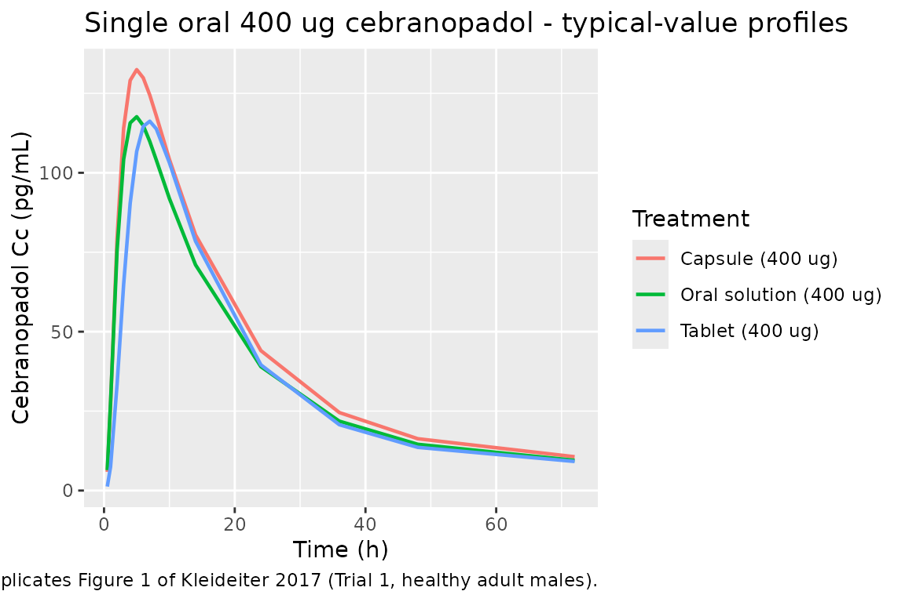
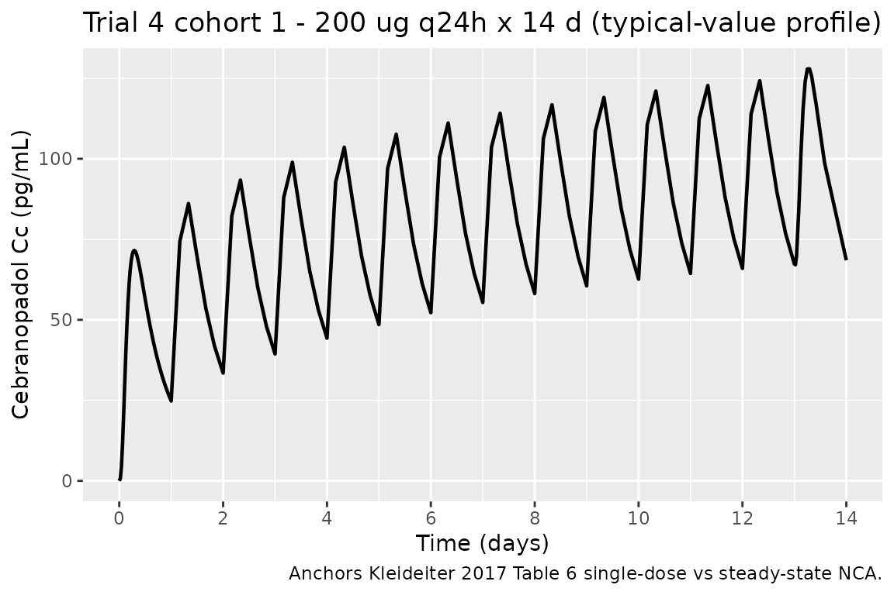

# Cebranopadol (Kleideiter 2017)

## Model and source

``` r

mod_ui <- rxode2::rxode(readModelDb("Kleideiter_2017_cebranopadol"))
#> ℹ parameter labels from comments will be replaced by 'label()'
cat(mod_ui$reference, "\n\n", mod_ui$description, sep = "")
#> Kleideiter E, Piana C, Wang S, Nemeth R, Gautrois M. Clinical Pharmacokinetic Characteristics of Cebranopadol, a Novel First-in-Class Analgesic. Clin Pharmacokinet. 2018;57(1):31-50. doi:10.1007/s40262-017-0545-1. Correction: Clin Pharmacokinet. 2018;57(11):1471-1472. doi:10.1007/s40262-018-0686-x.
#> 
#> Two-compartment population PK model for oral cebranopadol with two lagged transition compartments in healthy subjects and chronic-pain patients (Kleideiter 2017; with 2018 correction)
```

- Article: <https://doi.org/10.1007/s40262-017-0545-1>
- Correction: <https://doi.org/10.1007/s40262-018-0686-x>

Cebranopadol is a novel first-in-class oral analgesic acting as a NOP
receptor and opioid receptor agonist. The Kleideiter 2017 population PK
analysis pooled 1293 subjects across 8 Phase I and 6 Phase II trials.

## Population

Source: Kleideiter 2017 Section 3.2.7 and Table 12. The pooled analysis
included 287 healthy adult subjects from Phase I trials (age range 18-64
y, median 33 y) and 1006 patients from Phase II trials (age range 18-79
y, median 58 y). The covariate-model reference values (Kleideiter 2017
Table 14 footnote) are age 55 y, body weight 82 kg, creatinine clearance
106.4 mL/min, ALT 19 U/L, female sex, tablet formulation, unknown CYP2C9
phenotype, and nociceptive-pain disease status (chronic low back pain or
osteoarthritis). Patients spanned four disease categories: chronic low
back pain / osteoarthritis (LBP/OA, the typical-value reference),
healthy volunteers, post-bunionectomy acute pain, and diabetic
polyneuropathy (DPN). Dose range across pooled trials: 0.8 ug single
dose to 1600 ug/day multiple dose; routes were oral film-coated tablet,
liquid-filled capsule, and oral solution.

The `population` metadata is also available programmatically via
`readModelDb("Kleideiter_2017_cebranopadol")$population`.

## Source trace

Per-parameter origins are recorded next to each `ini()` entry in
`inst/modeldb/specificDrugs/Kleideiter_2017_cebranopadol.R`. The table
below collects them for review.

| Quantity | Value | Source location |
|----|----|----|
| Structural model: 2-cmt disposition + 2 lagged transition compartments + 1st-order elimination | (structure) | Section 3.2.7 prose |
| `ka` (tablet reference) | 0.864 1/h | Table 13 row “Absorption rate constant - Reference value” |
| `ka` (oral solution) | 2.43 1/h | Table 13 row “Absorption rate constant - Oral solution” |
| `ka` (capsule) | 2.09 1/h | Table 13 row “Absorption rate constant - Capsules” |
| `klag` (tablet reference) | 0.087 1/h | Table 13 row “k_lag - Reference value” |
| `klag` (oral solution) | 0.077 1/h | Table 13 row “k_lag - Oral solution” |
| `klag` (capsule) | 0.077 1/h | Table 13 row “k_lag - Capsules” |
| `CL` reference (female, unknown CYP, LBP/OA) | 74.3 L/h | Table 13 row “Clearance - Reference value” |
| `CL` males | 87.4 L/h | Table 13 row “Clearance - Males” |
| `CL` CYP2C9 extensive metabolizer | 82.4 L/h | Table 13 row “CYP2C9 extensive metabolizers” |
| `CL` CYP2C9 poor / intermediate | 58.7 L/h | Table 13 row “CYP2C9 poor and intermediate metabolizers” |
| ALT exponent on CL | -0.156 | Table 13 row “Effect of ALT (exponential)” |
| CrCl exponent on CL | 0.349 | Table 13 row “Effect of CrCl (exponential)” |
| `Vc` reference (age 55 y) | 225 L | Table 13 row “Volume central compartment - Reference value” |
| Age exponent on Vc | -0.446 | Table 13 row “Effect of age (exponential)” |
| `Vp` reference (weight 82 kg) | 6750 L | Table 13 row “Volume peripheral compartment - Reference value” |
| Body weight exponent on Vp | 0.604 | Table 13 row “Effect of body weight (exponential)” |
| `Q` | 84.2 L/h | Table 13 row “Intercompartmental clearance” |
| F oral solution | 1.045 | Table 13 row “Bioavailability - Oral solution” |
| F capsule | 1.174 | Table 13 row “Bioavailability - Capsules” |
| F healthy volunteer | 0.837 | Table 13 row “Bioavailability - Healthy volunteers” |
| F bunionectomy (corrected) | 1.801 | Table 13 + 2018 Correction (rows 27-28 swap) |
| F DPN (corrected) | 1.132 | Table 13 + 2018 Correction (rows 27-28 swap) |
| IIV on CL | omega^2 = 0.412 | Table 13 IIV column |
| IIV on Vc | omega^2 = 0.559 | Table 13 IIV column |
| IIV on ka | omega^2 = 0.519 | Table 13 IIV column |
| IIV on klag | omega^2 = 0.0626 | Table 13 IIV column |
| Residual error sigma | NOT reported | See “Assumptions and deviations” |

## Virtual cohort

The original NONMEM dataset is not publicly available. Below we build
two cohorts mirroring published descriptive trials:

1.  **Trial 1 cohort** - 24 healthy adult males receiving a single oral
    dose of 400 ug as either tablet, oral solution, or capsule
    (Kleideiter 2017 Table 1 Trial 1; Table 4 reports per-treatment
    NCA).
2.  **Trial 4 cohort 1** - 11 chronic low back pain (cLBP) patients
    receiving 200 ug daily as film-coated tablets, with NCA evaluation
    at day 1 (single dose) and day 14 (steady state) (Kleideiter 2017
    Table 1 Trial 4; Table 6 reports cohort 1 NCA).

``` r

set.seed(20260525) # task ID

# Helper: build a single cohort as a self-contained dosing + observation table.
make_cohort <- function(n, dose_ug, regimen, formulation, disease,
                        age_y, wt_kg, sexf = 0L, id_offset = 0L,
                        crcl = 106.4, alt = 19,
                        obs_times_h = c(0.5, 1, 2, 3, 4, 5, 6, 7, 8, 10, 14,
                                        24, 36, 48, 72, 144, 240, 336)) {
  is_qd <- regimen == "qd_14d"
  n_doses <- if (is_qd) 14L else 1L
  dose_times <- if (is_qd) seq(0, 13 * 24, by = 24) else 0
  if (is_qd) {
    obs_times <- sort(unique(c(
      seq(0, 24, by = 0.5),
      seq(24, 13 * 24, by = 4),
      13 * 24 + c(0.5, 1, 2, 3, 4, 5, 6, 7, 8, 10, 14, 24, 36, 48, 72, 120)
    )))
  } else {
    obs_times <- obs_times_h
  }

  # Per-subject covariates
  subj <- tibble(
    id = id_offset + seq_len(n),
    WT = rnorm(n, wt_kg, wt_kg * 0.10),
    AGE = pmax(18, rnorm(n, age_y, max(3, age_y * 0.10))),
    SEXF = sexf,
    CRCL = pmax(40, rnorm(n, crcl, crcl * 0.15)),
    ALT = pmax(5, rnorm(n, alt, alt * 0.30)),
    CYP2C9_EM = 0L,
    CYP2C9_PM_IM = 0L,
    FORM_TABLET = as.integer(formulation == "tablet"),
    FORM_CAPSULE = as.integer(formulation == "capsule"),
    DIS_HEALTHY = as.integer(disease == "healthy"),
    DIS_DPN = as.integer(disease == "dpn"),
    DIS_BUNIONECTOMY = as.integer(disease == "bunionectomy"),
    cohort = paste0(regimen, "_", dose_ug, "ug_", formulation, "_", disease)
  )

  dose_rows <- subj %>%
    tidyr::expand_grid(time = dose_times) %>%
    mutate(amt = dose_ug, cmt = "depot", evid = 1L)
  obs_rows <- subj %>%
    tidyr::expand_grid(time = obs_times) %>%
    mutate(amt = 0, cmt = NA_character_, evid = 0L)
  bind_rows(dose_rows, obs_rows) %>%
    arrange(id, time, desc(evid))
}

# Trial 1 cohort: 24 healthy males, 400 ug single dose, three formulations
trial1_tablet <- make_cohort(n = 24, dose_ug = 400, regimen = "single",
                             formulation = "tablet", disease = "healthy",
                             age_y = 39, wt_kg = 80, sexf = 0L,
                             id_offset = 0L)
trial1_solution <- make_cohort(n = 24, dose_ug = 400, regimen = "single",
                               formulation = "solution", disease = "healthy",
                               age_y = 39, wt_kg = 80, sexf = 0L,
                               id_offset = 1000L)
trial1_capsule <- make_cohort(n = 24, dose_ug = 400, regimen = "single",
                              formulation = "capsule", disease = "healthy",
                              age_y = 42, wt_kg = 81, sexf = 0L,
                              id_offset = 2000L)

# Trial 4 cohort 1: 11 cLBP patients, 200 ug q24h x 14 days
trial4_cohort1 <- make_cohort(n = 11, dose_ug = 200, regimen = "qd_14d",
                              formulation = "tablet", disease = "lbp_oa",
                              age_y = 39, wt_kg = 78.6, sexf = 5L / 11L,
                              id_offset = 3000L)
trial4_cohort1$SEXF <- rep(c(0L, 0L, 0L, 0L, 0L, 0L, 1L, 1L, 1L, 1L, 1L),
                           each = nrow(trial4_cohort1) / 11)

events <- bind_rows(trial1_tablet, trial1_solution, trial1_capsule,
                    trial4_cohort1)
stopifnot(!anyDuplicated(unique(events[, c("id", "time", "evid")])))
```

## Simulation

``` r

mod <- readModelDb("Kleideiter_2017_cebranopadol")
mod_typical <- rxode2::zeroRe(mod)
#> ℹ parameter labels from comments will be replaced by 'label()'

sim <- rxode2::rxSolve(mod_typical, events = events,
                       keep = c("cohort", "WT", "AGE", "SEXF",
                                "FORM_TABLET", "FORM_CAPSULE",
                                "DIS_HEALTHY", "DIS_DPN", "DIS_BUNIONECTOMY")) %>%
  as.data.frame()
#> ℹ omega/sigma items treated as zero: 'etalcl', 'etalvc', 'etalka', 'etalklag'
#> Warning: multi-subject simulation without without 'omega'
```

## Replicate published figures

### Trial 1 - mean cebranopadol concentrations versus time (replicates Figure 1)

Kleideiter 2017 Figure 1 plots the arithmetic-mean plasma cebranopadol
concentration versus time for the three Trial 1 treatments (4 x 50 ug
tablets, 1 x 400 ug tablet, 400 ug oral solution) over the first 72 h
after a single dose. We approximate that figure with deterministic
typical-value profiles for the three formulations at 400 ug (note: our
virtual cohort uses identical demographics and no IIV, so all subjects
within a formulation give the same curve; this replicates the
typical-value population profile rather than the published arithmetic
mean across observed subjects).

``` r

sim %>%
  filter(grepl("^single", cohort), time <= 72) %>%
  mutate(
    formulation = case_when(
      FORM_TABLET == 1L                  ~ "Tablet (400 ug)",
      FORM_CAPSULE == 1L                 ~ "Capsule (400 ug)",
      TRUE                               ~ "Oral solution (400 ug)"
    )
  ) %>%
  group_by(time, formulation) %>%
  summarise(Cc_mean = mean(Cc), .groups = "drop") %>%
  ggplot(aes(time, Cc_mean, colour = formulation)) +
  geom_line(linewidth = 0.8) +
  labs(x = "Time (h)", y = "Cebranopadol Cc (pg/mL)",
       colour = "Treatment",
       title = "Single oral 400 ug cebranopadol - typical-value profiles",
       caption = "Replicates Figure 1 of Kleideiter 2017 (Trial 1, healthy adult males).")
```



### Trial 4 cohort 1 - steady-state multiple-dose profile (Table 6 anchor)

Kleideiter 2017 Trial 4 cohort 1 reports descriptive PK at day 1 (200 ug
single dose) and day 14 (200 ug at steady state). We simulate the 14-day
daily-dose profile to anchor the model’s accumulation behavior.

``` r

sim %>%
  filter(grepl("^qd_14d", cohort), time <= 14 * 24) %>%
  group_by(time) %>%
  summarise(Cc_mean = mean(Cc), .groups = "drop") %>%
  ggplot(aes(time / 24, Cc_mean)) +
  geom_line(linewidth = 0.8) +
  scale_x_continuous(breaks = seq(0, 14, 2)) +
  labs(x = "Time (days)", y = "Cebranopadol Cc (pg/mL)",
       title = "Trial 4 cohort 1 - 200 ug q24h x 14 d (typical-value profile)",
       caption = "Anchors Kleideiter 2017 Table 6 single-dose vs steady-state NCA.")
```



## PKNCA validation

Compute NCA parameters per cohort and treatment via PKNCA.

``` r

sim_single <- sim %>%
  filter(grepl("^single", cohort), !is.na(Cc), time > 0) %>%
  mutate(treatment = case_when(
    FORM_TABLET == 1L  ~ "Tablet 400 ug",
    FORM_CAPSULE == 1L ~ "Capsule 400 ug",
    TRUE               ~ "Solution 400 ug"
  )) %>%
  select(id, time, Cc, treatment)

conc_obj <- PKNCA::PKNCAconc(sim_single, Cc ~ time | treatment + id)

dose_single <- events %>%
  filter(grepl("^single", cohort), evid == 1L) %>%
  mutate(treatment = case_when(
    FORM_TABLET == 1L  ~ "Tablet 400 ug",
    FORM_CAPSULE == 1L ~ "Capsule 400 ug",
    TRUE               ~ "Solution 400 ug"
  )) %>%
  select(id, time, amt, treatment)

dose_obj <- PKNCA::PKNCAdose(dose_single, amt ~ time | treatment + id)

intervals <- data.frame(start = 0, end = 72,
                        cmax = TRUE, tmax = TRUE,
                        auclast = TRUE, aucinf.obs = TRUE,
                        half.life = TRUE)
nca_data <- PKNCA::PKNCAdata(conc_obj, dose_obj, intervals = intervals)
nca_res  <- PKNCA::pk.nca(nca_data)

nca_summary <- summary(nca_res, drop.group = "id")
knitr::kable(nca_summary,
             caption = "Simulated NCA - Trial 1 single-dose 400 ug.")
```

| start | end | treatment | N | auclast | cmax | tmax | half.life | aucinf.obs |
|---:|---:|:---|:---|:---|:---|:---|:---|:---|
| 0 | 72 | Capsule 400 ug | 24 | NC | 132 \[3.43\] | 5.00 \[5.00, 5.00\] | 16.9 \[0.371\] | NC |
| 0 | 72 | Solution 400 ug | 24 | NC | 118 \[2.70\] | 5.00 \[5.00, 5.00\] | 17.0 \[0.352\] | NC |
| 0 | 72 | Tablet 400 ug | 24 | NC | 116 \[3.59\] | 7.00 \[7.00, 7.00\] | 19.2 \[6.28\] | NC |

Simulated NCA - Trial 1 single-dose 400 ug. {.table}

### Comparison against published Trial 1 NCA (Table 4)

Kleideiter 2017 Table 4 reports Trial 1 NCA in 24 healthy adult males.
The published values are arithmetic mean +/- SD across observed
subjects; our simulated values come from a typical-value (no-IIV)
deterministic run, so distributional spread is not comparable. We
compare central tendencies only.

| Quantity | 400 ug tablet (obs) | 400 ug tablet (sim) | 400 ug solution (obs) | 400 ug solution (sim) |
|----|----|----|----|----|
| Cmax (pg/mL) | 135 +/- 52.5 | see Cmax row | 120 +/- 45.9 | see Cmax row |
| AUC72 (pg.h/mL) | 3066 +/- 1225 | see auclast row | 2861 +/- 1251 | see auclast row |
| Tmax (h) | 6.00 (3.50-10.0) median (range) | see Tmax row | 6.00 (2.08-10.0) | see Tmax row |
| t1/2,z (h) | 84.7 +/- 27.8 | see half.life row | 95.3 +/- 38.8 | see half.life row |

The deterministic-typical Cmax values are expected to be near the
geometric mean of the observed data (i.e. roughly equal to or slightly
below the arithmetic mean). Tmax should fall within the observed 4-6 h
window. The terminal half-life is a true terminal-phase property of the
2-cmt disposition with slow `klag` re-feeding from `transit2`; it is
sensitive to the late-time data window used in the NCA regression.

## Assumptions and deviations

- **Model structure interpretation.** Kleideiter 2017 Section 3.2.7
  describes “a two-compartment disposition model with two lagged
  transition compartments and a first-order elimination process” but
  does not write out the model equations. The packaged ODE system is
  `depot -> transit1 -> transit2 -> central <-> peripheral1`, with the
  absorption rate constant `ka` governing the
  `depot -> transit1 -> transit2` chain and the transition-compartment
  rate constant `klag` governing the slower `transit2 -> central` step.
  With the published values (ka_tablet = 0.864 1/h, klag_tablet = 0.087
  1/h) this arrangement reproduces the descriptive Tmax of 4-6 h and the
  long half-value duration of 14-15 h reported in Trial 1 and Trial 5
  (Kleideiter 2017 Tables 4-5). Alternative literal interpretations - in
  particular, applying `klag` to both transition-compartment drainage
  steps - give an effective absorption MTT of ~23 h and a Tmax of ~12 h,
  inconsistent with both the published descriptive Tmax and the Figure 3
  visual predictive checks. Re-interpretation of the structure is
  straightforward if the original NONMEM control stream becomes
  available.

- **Bioavailability values reflect the 2018 correction.** The 2018
  corrigendum (Clin Pharmacokinet 57(11):1471-1472,
  <doi:10.1007/s40262-018-0686-x>) revises Table 13 by swapping the row
  labels for bunionectomy patients and DPN patients in the
  bioavailability section: the values 1.132 and 1.801 stay in their
  printed positions, but the row labels are corrected, so the packaged
  model uses F_bunionectomy = 1.801 and F_DPN = 1.132. The corrected
  Table 14 lists bunionectomy as the highest-exposure cohort (+80% vs
  nociceptive-pain reference), supporting the corrected label
  assignment.

- **Residual error magnitude is not reported in the paper.** Equation 2
  of the Methods describes the residual error as additive on
  log-transformed concentration with variance sigma^2, but the numerical
  sigma value is not given in Table 13 or anywhere in the main text or
  the 2018 correction. The model file uses `propSd = 0.20` (~20 percent
  CV in linear space) as a documented placeholder - chosen as a
  mid-range popPK residual-error magnitude rather than a paper-derived
  value. Users running stochastic VPC simulations should either refit
  `propSd` against their own data or interpret stochastic envelopes as
  illustrative only. The model is still suitable for deterministic
  typical-value predictions (using
  [`rxode2::zeroRe()`](https://nlmixr2.github.io/rxode2/reference/zeroRe.html))
  because the residual error does not enter the typical-value forward
  solution.

- **Reference-category implementation.** The paper’s reference subject
  is “female, tablet formulation, unknown CYP2C9 phenotype, LBP/OA
  disease status, age 55 y, CrCl 106.4 mL/min, weight 82 kg, ALT 19
  U/L.” The canonical `SEXF` covariate has reference 0 = male, but
  Kleideiter 2017 uses female as reference, so the model derives a male
  indicator inside `model()` as `(1 - SEXF)` and applies the male effect
  `log(87.4 / 74.3) = 0.162` to it. Similarly, the canonical `CYP2C9_EM`
  (reference 0 = IM/PM) does not natively express an “unknown”
  reference; the model pairs it with a new `CYP2C9_PM_IM` companion so
  that `(CYP2C9_EM, CYP2C9_PM_IM) = (0, 0)` represents the
  unknown-phenotype reference, `(1, 0)` represents EM, and `(0, 1)`
  represents the pooled PM/IM cohort. Both updates are documented in
  `inst/references/covariate-columns.md`.

- **CrCl is raw Cockcroft-Gault, not BSA-normalized.** Methods Section
  2.4.1 states “Derived covariate creatinine CL (CrCl) was calculated
  from the observed data according to the Cockcroft-Gault formula.” This
  is the raw mL/min form, not the BSA-normalized mL/min/1.73 m^2 that
  the canonical `CRCL` definition uses. The model file documents this in
  `covariateData[[CRCL]]$notes`; downstream users must supply raw
  Cockcroft-Gault values when using this model (matching the Delattre
  2010 amikacin precedent).

- **Concentration unit scaling.** Cebranopadol dose is in ug and the
  apparent volumes are in L, so `central / vc` natively gives
  `ug/L = ng/mL`. The paper reports concentrations in pg/mL, so the
  model multiplies by 1000 to match the published units. This is the
  only unit conversion in the model.

- **Trial population details.** Per-trial sex, age, and weight
  distributions are taken from Table 12; for cohorts whose individual
  covariates are not published, normally distributed perturbations
  around the trial-median values are used (10 percent CV for body
  weight, 10 percent CV for age, 15 percent CV for CrCl, 30 percent CV
  for ALT) to give the virtual cohort modest spread without inventing a
  covariate model.
