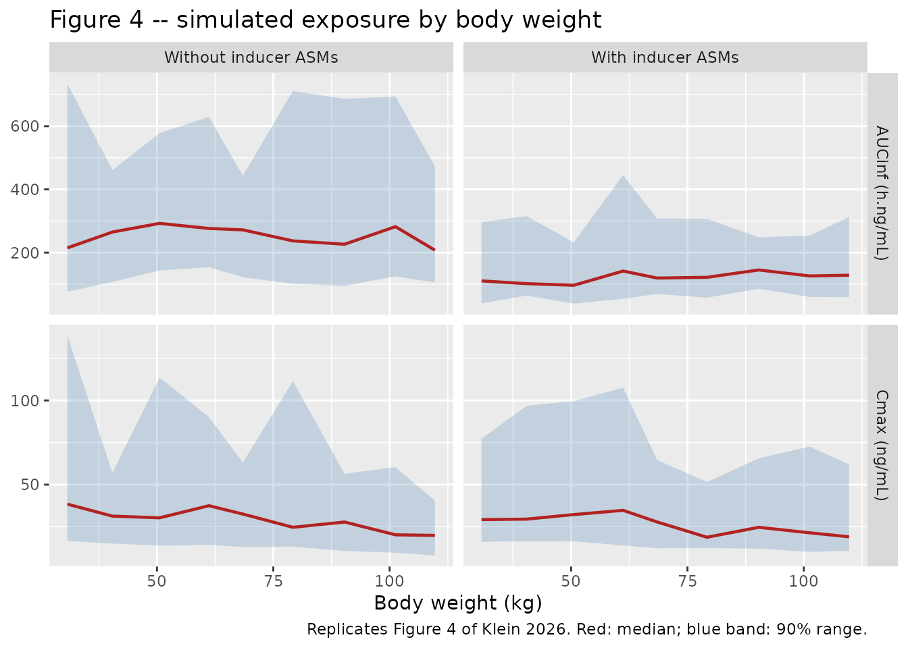

# Alprazolam (Klein 2026)

## Model and source

    #> ℹ parameter labels from comments will be replaced by 'label()'

- Citation: Klein P, Aungaroon G, Biton V, Liow KK, Phillips S,
  Wychowski T, et al. Pharmacokinetics and tolerability of single-dose
  Staccato(R) alprazolam in adolescents with epilepsy, and population
  pharmacokinetic analysis to support dose selection in adolescents.
  Epilepsia. 2026;67(1):109-119. <doi:10.1111/epi.18643>. Population PK
  parameters are from Supporting Information Table S3.

- Description: Two-compartment population pharmacokinetic model for
  inhaled alprazolam delivered by the Staccato(R) hand-held
  thermal-aerosol device, pooled across three trials in adults and
  adolescents with epilepsy (Klein 2026, N = 99). Absorption is modelled
  as two parallel processes whose fractions sum to 1: an
  immediate-release fraction that enters the central compartment as a
  bolus at the dose time (the paper’s F2 = 0.369 ‘fast absorption
  fraction’), and the complementary fraction that enters a depot
  compartment and is absorbed first-order with ka = 5.37 /h (absorption
  half-life 7.74 min). Both fractions are supplied from the same
  administered dose, so an event table must carry TWO dose records at
  each administration time, one to depot and one to central; the f()
  terms then split the dose. The dose fraction is carried on the logit
  scale (the library’s logitfdepot idiom) so individual values stay
  inside (0, 1) – the paper’s own 95% CI for F2 is exactly symmetric on
  the logit scale, which proves the authors estimated it there. All
  disposition parameters are apparent (/F): the inhaled bioavailability
  is not separately identifiable. No relationship between body weight
  and clearance or intercompartmental clearance was detectable, so
  allometric scaling is applied only to the central and peripheral
  volumes, through a single freely estimated exponent shared by both.
  Clearance carries a multiplicative increase with concomitant strong
  hepatic enzyme-inducing antiseizure medications (carbamazepine,
  phenobarbital, phenytoin, or primidone). Interindividual variability
  is log-normal on ka, CL, Vc, Q and Vp (with CL and Vc correlated) and
  normal on the logit dose fraction; residual error is proportional.

- Article: <https://doi.org/10.1111/epi.18643>

- Supporting Information (Tables S1-S3, Figures S1-S5): distributed with
  the article; retrieved from the Europe PMC supplementary-file archive
  for PMC12893244.

Staccato alprazolam is a hand-held, breath-actuated thermal-aerosol
device that vaporises alprazolam and delivers it to the deep lung, where
it is absorbed at the alveolar-capillary interface. The population PK
model reported here pools adolescent data from the Phase 1 trial UP0100
with adult data from two earlier trials, and was used to support the 2
mg adolescent dose in the Phase 3 programme.

## Population

| Field | Value |
|:---|:---|
| species | human |
| n_subjects | 99 |
| n_studies | 3 |
| age_range | 12-17 years (adolescents, UP0100); adults in AMDC-002-202 and ENGAGE-E-001 |
| age_median | 32.2 years (mean, SD 13.5) overall; 15.1 years (mean, SD 1.90) in the adolescent trial |
| weight_range | 33.5-81.2 kg in the adolescent trial UP0100; overall mean 75.5 kg (SD 22.5) |
| weight_median | 75.5 kg (mean) overall; 54.4 kg (mean) in the adolescent trial |
| sex_female_pct | 70.7 |
| race_ethnicity | White: 78.6; Pacific Islander: 7.1; Other/mixed: 14.3 |
| disease_state | focal, generalized, or focal and generalized epilepsy; photosensitive epilepsy in AMDC-002-202 |
| dose_range | single inhaled dose of Staccato alprazolam 0.5, 1 or 2 mg |
| regions | United States (UP0100); regions not reported for AMDC-002-202 or ENGAGE-E-001 |
| co_medication | 15/99 (15.2%) on a strong enzyme-inducing antiseizure medication; 27/99 (27.3%) chronic benzodiazepine users |
| notes | Pooled analysis dataset of three trials (Table S1): UP0100 (Phase 1, adolescents, N = 14, NCT04857307), AMDC-002-202 (Phase 2a, adults with photosensitive epilepsy, N = 5, NCT02351115) and ENGAGE-E-001 (Phase 2b, adults with epilepsy, N = 80, NCT03478982). Race percentages are from the adolescent trial only (Table S2); race is not reported for the pooled dataset. The main text reports N = 84 enrolled in ENGAGE-E-001 while Table S1 reports N = 80 in the PK modelling dataset. |

Population metadata recorded with the model. {.table}

The analysis dataset (Table S1) pools 99 subjects from 3 trials: UP0100
(Phase 1, 14 adolescents aged 12-17 years with focal, generalized, or
focal and generalized epilepsy, NCT04857307), AMDC-002-202 (Phase 2a, 5
adults with photosensitive epilepsy, NCT02351115) and ENGAGE-E-001
(Phase 2b, 80 adults with epilepsy, NCT03478982). Overall mean age was
32.2 years (SD 13.5) and mean weight 75.5 kg (SD 22.5); 70.7% were
female. Fifteen subjects (15.2%), all in ENGAGE-E-001, were taking a
strong hepatic enzyme-inducing antiseizure medication; no adolescent
was, because UP0100 excluded patients on strong CYP3A4 inducers by
protocol.

## Model structure

Absorption is modelled as **two parallel processes whose fractions sum
to one**:

- an **immediate-release** fraction that appears in `central` as a bolus
  at the dose time (the paper’s `F2` = 0.369, the “fast absorption
  fraction”), and
- the complementary fraction (0.631) that enters `depot` and is absorbed
  first-order with `ka` = 5.37 /h, i.e. an absorption half-life of 7.74
  min.

Because both arms are fed from the *same* administered dose, an event
table for this model must carry **two dose records at each
administration time** – one to `depot` and one to `central`. The
`f(depot)` / `f(central)` terms then apportion them. Every cohort below
follows that pattern.

Disposition is two-compartment with linear elimination. Body weight
scales the central and peripheral volumes through a single shared
exponent; it does **not** scale CL or Q, because the authors could
detect no weight relationship for either (Methods section 2.2, and the
title of Table S3).

## Source trace

Every value below is also carried as an in-file comment beside its
`ini()` entry in `inst/modeldb/specificDrugs/Klein_2026_alprazolam.R`.

| Equation / parameter | Value | Source location |
|----|----|----|
| `lka` | 5.37 /h (95% CI 3.88-7.45) | Table S3, row `ka`; absorption half-life 7.74 (5.58-10.7) min restated in Results section 3.2 |
| `lcl` | 8.23 L/h (7.23-9.38) | Table S3, row `CL/F`; restated in Results section 3.2 |
| `lvc` | 36.9 L (23.1-59.2) | Table S3, row `Vc/F` |
| `lq` | 189 L/h (131-271) | Table S3, row `Q/F` |
| `lvp` | 60.3 L (47.2-77.0) | Table S3, row `Vp/F` |
| `logitfdepot` | `qlogis(1 - 0.369)` | Table S3, row `F2` = 0.369 (0.156-0.649); restated in Results section 3.2 |
| `e_wt_vc_vp` | 0.470 (0.341-0.598) | Table S3, row `Allometric scaling Vc and Vp` |
| `e_conmed_eiaed_cl` | `log(1.955)` | Table S3, row `Effect of inducer ASMs on CL, % change` = 95.5 (50.5-154.0) |
| `etalka` | 0.730^2 | Table S3, IIV column, row `ka` = 73.0% |
| `etalcl`, `etalvc` block | 0.586^2, 0.763^2, r = 0.342 | Table S3, IIV column rows `CL/F` 58.6% and `Vc/F` 76.3%; footnote “Correlation between CL and Vc: 0.342” |
| `etalq` | 0.396^2 | Table S3, IIV column, row `Q/F` = 39.6% |
| `etalvp` | 0.209^2 | Table S3, IIV column, row `Vp/F` = 20.9% |
| `etalogitfdepot` | 1.078^2 | Table S3, IIV column, row `F2` = 107.8% |
| `propSd` | 0.100 | Table S3, row `Proportional RUV, %` = 10.0 (8.30-11.7) |
| Two parallel absorption arms; 2-compartment disposition; linear elimination | n/a | Methods section 2.2, paragraph 3 |
| No weight effect on CL or Q; shared allometric exponent on Vc and Vp | n/a | Methods section 2.2, paragraph 4, and Table S3 title |
| `WT` reference 70 kg | assumed | **not stated in the paper**; see Assumptions below |

### How each estimation scale was identified

Table S3 reports a 95% CI for every structural parameter but never
states the scale each was estimated on. Each CI is Wald-symmetric on
exactly one scale, so the CIs identify the scales without any appeal to
convention. Recomputing the midpoint on each candidate scale and
comparing with the published point estimate:

``` r

ci <- tibble::tribble(
  ~parameter,  ~estimate, ~lower,  ~upper,
  "ka",             5.37,   3.88,    7.45,
  "CL/F",           8.23,   7.23,    9.38,
  "Vc/F",          36.9,   23.1,    59.2,
  "Q/F",          189,    131,     271,
  "Vp/F",          60.3,   47.2,    77.0,
  "F2",             0.369,  0.156,   0.649,
  "Allom. exp.",    0.470,  0.341,   0.598,
  "Prop. RUV (%)", 10.0,    8.30,   11.7
)

# The logit scale is only defined for a bound in (0, 1); return NA elsewhere
# rather than letting qlogis() emit NaN.
logit_mid <- function(lower, upper) {
  ok <- lower > 0 & lower < 1 & upper > 0 & upper < 1
  ifelse(ok, plogis((qlogis(ifelse(ok, lower, 0.5)) +
                       qlogis(ifelse(ok, upper, 0.5))) / 2), NA_real_)
}

scale_check <- ci |>
  mutate(
    linear = (lower + upper) / 2,
    log    = exp((log(lower) + log(upper)) / 2),
    logit  = logit_mid(lower, upper),
    err    = pmin(abs(linear / estimate - 1),
                  abs(log / estimate - 1),
                  abs(logit / estimate - 1), na.rm = TRUE),
    best   = c("linear", "log", "logit")[
      apply(cbind(abs(linear / estimate - 1),
                  abs(log / estimate - 1),
                  abs(logit / estimate - 1)), 1,
            \(x) which.min(replace(x, is.na(x), Inf)))]
  )

scale_check |>
  mutate(across(c(linear, log, logit), \(x) signif(x, 4))) |>
  dplyr::rename("Parameter" = parameter, "Published estimate" = estimate,
                "Midpoint, linear" = linear, "Midpoint, log" = log,
                "Midpoint, logit" = logit, "Scale identified" = best) |>
  dplyr::select(-lower, -upper, -err) |>
  knitr::kable(caption = "CI midpoint on each candidate scale vs the published point estimate. The scale whose midpoint reproduces the estimate is the scale the parameter was estimated on.")
```

| Parameter | Published estimate | Midpoint, linear | Midpoint, log | Midpoint, logit | Scale identified |
|:---|---:|---:|---:|---:|:---|
| ka | 5.370 | 5.6650 | 5.3760 | NA | log |
| CL/F | 8.230 | 8.3050 | 8.2350 | NA | log |
| Vc/F | 36.900 | 41.1500 | 36.9800 | NA | log |
| Q/F | 189.000 | 201.0000 | 188.4000 | NA | log |
| Vp/F | 60.300 | 62.1000 | 60.2900 | NA | log |
| F2 | 0.369 | 0.4025 | 0.3182 | 0.3689 | logit |
| Allom. exp. | 0.470 | 0.4695 | 0.4516 | 0.4673 | linear |
| Prop. RUV (%) | 10.000 | 10.0000 | 9.8540 | NA | linear |

CI midpoint on each candidate scale vs the published point estimate. The
scale whose midpoint reproduces the estimate is the scale the parameter
was estimated on. {.table style="width:100%;"}

`F2` is only interpretable on the **logit** scale: its logit midpoint
reproduces 0.369 to three decimals, while the linear midpoint gives
0.4025 and the log midpoint 0.3182. That is decisive, and it is
corroborated structurally – a log-normal IIV of the reported magnitude
on a fraction bounded by 1 would push roughly 13% of subjects above `F2`
= 1, i.e. a negative depot fraction. The model therefore carries the
dose fraction on the logit scale, using the library’s `logitfdepot`
idiom.

The inducer effect is likewise a log-scale coefficient: the midpoint of
`log(1.505)` and `log(2.540)` is 0.67048, which is `log(1.955)` to five
decimals, whereas the linear midpoint of the reported percentages is
102.25%, not 95.5%.

``` r

# Every parameter's estimation scale must be recovered from its own CI.
stopifnot(identical(
  scale_check$best,
  c("log", "log", "log", "log", "log", "logit", "linear", "linear")
))
# ...and on that scale the midpoint must reproduce the estimate to within 0.5%.
stopifnot(!anyNA(scale_check$err), all(scale_check$err < 0.005))
```

### Which reading of the “IIV” column?

Table S3 reports interindividual variability as a bare percentage with
no back-transformation stated. Two readings are current in the
literature and they differ by about 8% on omega:

- omega is the **standard deviation** on the parameter’s own estimation
  scale, reported as `omega * 100` – for CL that gives omega = 0.586;
- the percentage is the **exact log-normal CV%**,
  `sqrt(exp(omega^2) - 1) * 100` – for CL that gives omega = 0.543.

Figure 4 settles it in closed form, with no simulation and no digitising
of a curve. The Supplementary Methods state that AUCinf was computed
*“using the sampled clearance (CL) parameter by dividing the
administered dose by CL”*, so the simulated AUCinf distribution is
exactly log-normal with median `dose / CL` and 5th/95th percentiles
`median * exp(-/+ 1.645 * omega_CL)`. Only one reading can match the
published band.

``` r

dose_ug   <- 2000          # 2 mg expressed in ug so AUC comes out in ng*h/mL
cl_typ    <- 8.23
inducer   <- 1.955         # CL multiplier with an enzyme-inducing ASM

omega_sd  <- 0.586                          # "IIV % is omega * 100"
omega_cv  <- sqrt(log(1 + 0.586^2))         # "IIV % is the exact log-normal CV%"

band <- function(omega, cl) {
  med <- dose_ug / cl
  c(p05 = med / exp(1.645 * omega), median = med, p95 = med * exp(1.645 * omega))
}

# Values read off Figure 4 (blue band and red median line, adolescent panels).
digitised <- tibble::tribble(
  ~panel,          ~p05, ~median, ~p95,
  "No inducer ASM",  93,     240,  645,
  "Inducer ASM",     45,     122,  330
)

iiv_cmp <- bind_rows(
  tibble::tibble(panel = "No inducer ASM", reading = "omega = SD (0.586)",
                 !!!band(omega_sd, cl_typ)),
  tibble::tibble(panel = "No inducer ASM", reading = "omega = exact CV% (0.543)",
                 !!!band(omega_cv, cl_typ)),
  tibble::tibble(panel = "Inducer ASM", reading = "omega = SD (0.586)",
                 !!!band(omega_sd, cl_typ * inducer)),
  tibble::tibble(panel = "Inducer ASM", reading = "omega = exact CV% (0.543)",
                 !!!band(omega_cv, cl_typ * inducer))
) |>
  left_join(digitised, by = "panel", suffix = c("", "_fig")) |>
  mutate(`error, 5th (%)`  = 100 * (p05 / p05_fig - 1),
         `error, 95th (%)` = 100 * (p95 / p95_fig - 1))

iiv_cmp |>
  mutate(across(where(is.numeric), \(x) round(x, 1))) |>
  dplyr::select(panel, reading, p05, p95, p05_fig, p95_fig,
                `error, 5th (%)`, `error, 95th (%)`) |>
  dplyr::rename("Figure 4 panel" = panel, "Reading of the IIV column" = reading,
                "5th, predicted" = p05, "95th, predicted" = p95,
                "5th, Figure 4" = p05_fig, "95th, Figure 4" = p95_fig) |>
  knitr::kable(caption = "AUCinf (ng*h/mL) 90% range under each reading of Table S3's IIV column, against values read off Figure 4.")
```

| Figure 4 panel | Reading of the IIV column | 5th, predicted | 95th, predicted | 5th, Figure 4 | 95th, Figure 4 | error, 5th (%) | error, 95th (%) |
|:---|:---|---:|---:|---:|---:|---:|---:|
| No inducer ASM | omega = SD (0.586) | 92.7 | 637.2 | 93 | 645 | -0.3 | -1.2 |
| No inducer ASM | omega = exact CV% (0.543) | 99.4 | 594.0 | 93 | 645 | 6.9 | -7.9 |
| Inducer ASM | omega = SD (0.586) | 47.4 | 325.9 | 45 | 330 | 5.3 | -1.2 |
| Inducer ASM | omega = exact CV% (0.543) | 50.9 | 303.8 | 45 | 330 | 13.0 | -7.9 |

AUCinf (ng\*h/mL) 90% range under each reading of Table S3’s IIV column,
against values read off Figure 4. {.table}

``` r

err <- iiv_cmp |>
  group_by(reading) |>
  summarise(mean_abs_err = mean(abs(c(`error, 5th (%)`, `error, 95th (%)`))),
            .groups = "drop")
# The SD reading must win, and by a clear margin, on the pooled tail error.
stopifnot(
  err$mean_abs_err[err$reading == "omega = SD (0.586)"] <
    err$mean_abs_err[err$reading == "omega = exact CV% (0.543)"],
  err$mean_abs_err[err$reading == "omega = SD (0.586)"] < 5
)
# The median is common to both readings and must land on the published line.
stopifnot(abs(dose_ug / cl_typ / 240 - 1) < 0.05,
          abs(dose_ug / (cl_typ * inducer) / 122 - 1) < 0.05)
```

The SD reading reproduces both tails of both panels to within a few
percent; the exact-CV% reading is systematically too narrow, missing the
no-inducer 95th percentile by about 8%. The model therefore encodes
`omega = IIV% / 100` on each parameter’s own estimation scale. The two
readings differ by less than the width of the published CIs for the
structural parameters, so this choice matters for simulated variability,
not for typical-value predictions.

## Structural identity checks

These four checks are deterministic: they compare the solved model
against closed forms implied by the published parameters, with the
random effects zeroed. They contain no cohort sampling, so they can be
asserted tightly.

``` r

mod     <- readModelDb("Klein_2026_alprazolam")
mod_typ <- rxode2::zeroRe(mod)
#> ℹ parameter labels from comments will be replaced by 'label()'

# Two dose records per administration: the immediate-release arm and the depot arm.
dose_rows <- function(id, wt, eiaed) {
  tibble::tibble(id = id, WT = wt, CONMED_EIAED = eiaed, time = 0,
                 amt = 2, evid = 1L, cmt = c("depot", "central"))
}
obs_rows <- function(id, wt, eiaed, times) {
  tibble::tibble(id = id, WT = wt, CONMED_EIAED = eiaed, time = times,
                 amt = NA_real_, evid = 0L, cmt = "central")
}

wt_bands <- c(`<50 kg` = 41.27, `>=50 kg` = 64.35, `All patients` = 54.46)
grid     <- seq(0, 36, length.out = 20001)

ev_typ <- bind_rows(lapply(seq_along(wt_bands), function(i) {
  bind_rows(dose_rows(i, wt_bands[[i]], 0), obs_rows(i, wt_bands[[i]], 0, grid))
})) |> arrange(id, time, desc(evid))

sim_typ <- rxode2::rxSolve(mod_typ, ev_typ, omega = NA, sigma = NA,
                           keep = c("WT")) |> as.data.frame()
stopifnot(nrow(sim_typ) > 0, all(sim_typ$Cc >= 0))

terminal_slope <- function(d) {
  -coef(stats::lm(log(Cc) ~ time, data = d[d$time >= 12, ]))[[2]]
}
auc_inf <- function(d) {
  a <- sum(diff(d$time) * (head(d$Cc, -1) + tail(d$Cc, -1)) / 2)
  a + tail(d$Cc, 1) / terminal_slope(d)
}

published_t12 <- c(`<50 kg` = 6.816, `>=50 kg` = 8.477, `All patients` = 7.601)

ident <- lapply(seq_along(wt_bands), function(i) {
  d  <- sim_typ[sim_typ$id == i, ]
  vc <- 36.9 * (wt_bands[[i]] / 70)^0.470
  tibble::tibble(
    band            = names(wt_bands)[i],
    WT              = wt_bands[[i]],
    t12_model       = log(2) / terminal_slope(d),
    t12_published   = published_t12[[i]],
    c0_solved       = d$Cc[1],
    c0_closed_form  = 0.369 * 2 / vc * 1000,
    aucinf_solved   = auc_inf(d),
    aucinf_dose_cl  = dose_ug / cl_typ
  )
}) |> bind_rows() |>
  mutate(`t1/2 error (%)` = 100 * (t12_model / t12_published - 1),
         `C(0+) ratio`    = c0_solved / c0_closed_form,
         `AUCinf ratio`   = aucinf_solved / aucinf_dose_cl)

ident |>
  mutate(across(where(is.numeric), \(x) signif(x, 6))) |>
  dplyr::select(band, WT, t12_model, t12_published, `t1/2 error (%)`,
                `C(0+) ratio`, `AUCinf ratio`) |>
  dplyr::rename("Weight band" = band, "WT (kg)" = WT,
                "t1/2, model (h)" = t12_model,
                "t1/2, Table 1 (h)" = t12_published) |>
  knitr::kable(caption = "Deterministic structural checks against closed forms and against the observed terminal half-lives in Table 1.")
```

| Weight band | WT (kg) | t1/2, model (h) | t1/2, Table 1 (h) | t1/2 error (%) | C(0+) ratio | AUCinf ratio |
|:---|---:|---:|---:|---:|---:|---:|
| \<50 kg | 41.27 | 6.49434 | 6.816 | -4.71923 | 1 | 1 |
| \>=50 kg | 64.35 | 8.00211 | 8.477 | -5.60212 | 1 | 1 |
| All patients | 54.46 | 7.39849 | 7.601 | -2.66425 | 1 | 1 |

Deterministic structural checks against closed forms and against the
observed terminal half-lives in Table 1. {.table}

``` r

# 1. The immediate-release bolus must be exactly F2 * dose / Vc(WT).
stopifnot(max(abs(ident$`C(0+) ratio` - 1)) < 1e-6)

# 2. AUCinf must be exactly dose / CL, and independent of weight, because the
#    paper found no weight effect on CL.
#    (relative tolerances: the comparator is a trapezoidal integral, so the
#    residual is numerical-quadrature error, not model error)
stopifnot(max(abs(ident$`AUCinf ratio` - 1)) < 1e-4,
          diff(range(ident$aucinf_solved)) / mean(ident$aucinf_solved) < 1e-4)

# 3. The model's terminal half-lives must reproduce the observed ones in Table 1,
#    including the ORDERING across weight bands -- that ordering is generated
#    purely by the allometric exponent on Vc and Vp, since CL is not scaled.
stopifnot(max(abs(ident$`t1/2 error (%)`)) < 10)
stopifnot(ident$t12_model[ident$band == "<50 kg"] <
            ident$t12_model[ident$band == ">=50 kg"])

# 4. The enzyme-inducer effect must divide exposure by exactly 1.955.
ev_ind <- bind_rows(dose_rows(1L, 70, 1), obs_rows(1L, 70, 1, grid)) |>
  arrange(time, desc(evid))
ev_non <- bind_rows(dose_rows(1L, 70, 0), obs_rows(1L, 70, 0, grid)) |>
  arrange(time, desc(evid))
auc_ind <- auc_inf(as.data.frame(rxode2::rxSolve(mod_typ, ev_ind, omega = NA, sigma = NA)))
auc_non <- auc_inf(as.data.frame(rxode2::rxSolve(mod_typ, ev_non, omega = NA, sigma = NA)))
stopifnot(abs((auc_non / auc_ind) / 1.955 - 1) < 1e-4)
```

The half-life check is the strongest single piece of evidence for the
assumed 70 kg reference weight. `CL` is not weight-scaled, so the *only*
thing that can make terminal half-life vary with body weight in this
model is the shared allometric exponent on `Vc` and `Vp`. The model
reproduces both the direction and the magnitude of the observed
difference between the two adolescent weight bands (Table 1: 6.816 h
below 50 kg vs 8.477 h at or above 50 kg) without any parameter having
been fitted to those numbers.

## Virtual adolescent cohort

The cohort reproduces the UP0100 demographics (Table S2): 200
adolescents with body weight drawn from a normal distribution with the
observed mean 54.46 kg and SD 14.43 kg, truncated to the observed range
33.5-81.2 kg. None receives an enzyme-inducing antiseizure medication,
matching the trial’s exclusion criterion. Samples are taken at the
**protocol times** – pre-dose and 2, 10 and 30 min and 1, 2, 6, 24 and
36 h post-dose – because Cmax and Tmax in Table 1 are discrete
statistics limited by that schedule, a limitation the authors call out
explicitly in the Discussion.

``` r

set.seed(20260828)
n_adol <- 200

wt <- rnorm(n_adol, 54.46, 14.43)
wt <- pmin(pmax(wt, 33.5), 81.2)

subj <- tibble::tibble(
  id           = seq_len(n_adol),
  WT           = wt,
  wtgrp        = ifelse(wt < 50, "<50 kg", ">=50 kg"),
  CONMED_EIAED = 0
)

protocol_times <- c(0, 2 / 60, 10 / 60, 0.5, 1, 2, 6, 24, 36)

events <- bind_rows(
  subj |> mutate(time = 0, amt = 2, evid = 1L, cmt = "depot"),
  subj |> mutate(time = 0, amt = 2, evid = 1L, cmt = "central"),
  tidyr::crossing(subj, time = protocol_times) |>
    mutate(amt = NA_real_, evid = 0L, cmt = "central")
) |>
  arrange(id, time, desc(evid))

# The two dose records at t = 0 must be distinguished by their target
# compartment, and the t = 0 observation by its evid. Check the events
# themselves -- unique()-ing first would make this assertion unfalsifiable.
stopifnot(
  anyDuplicated(events[, c("id", "time", "evid", "cmt")]) == 0L,
  # every subject carries exactly two dose records: one per absorption arm
  nrow(dplyr::filter(events, evid == 1L)) == 2L * n_adol
)
```

``` r

sim <- rxode2::rxSolve(mod, events, keep = c("WT", "wtgrp")) |> as.data.frame()
#> ℹ parameter labels from comments will be replaced by 'label()'
stopifnot(nrow(sim) > 0, dplyr::n_distinct(sim$id) == n_adol)
```

`sim` carries the observation with residual error and `Cc` the
individual prediction; the NCA below uses `sim`, because the published
noncompartmental analysis was run on measured concentrations, which
carry the same 10% proportional error.

## Replicate Figure 1

``` r

LLOQ <- 0.200

gm <- function(x) {
  x <- x[is.finite(x) & x > 0]
  if (!length(x)) return(NA_real_)
  exp(mean(log(x)))
}

sim |>
  filter(time > 0) |>
  group_by(wtgrp, time) |>
  summarise(geomean = gm(sim), .groups = "drop") |>
  ggplot(aes(time, geomean, colour = wtgrp, shape = wtgrp)) +
  geom_line() + geom_point() +
  geom_hline(yintercept = LLOQ, linetype = "dashed", linewidth = 0.3) +
  scale_y_log10() +
  scale_x_continuous(breaks = seq(0, 36, by = 6)) +
  labs(x = "Time (hours)", y = "Geometric mean concentration (ng/mL)",
       colour = "Body weight", shape = "Body weight",
       title = "Figure 1 (semilogarithmic) -- simulated adolescent cohort",
       caption = "Replicates Figure 1B of Klein 2026. Dashed line: LLOQ 0.200 ng/mL.")
```


Replicates Figure 1 of Klein 2026: geometric mean plasma alprazolam
concentration-time profiles by adolescent body weight group after a
single 2 mg dose.

As in the published figure, the lower weight band runs above the higher
one over the absorption and early distribution phases and crosses below
it during the terminal phase, the latter because only the volumes – not
clearance – scale with body weight.

## PKNCA validation

Concentrations below the 0.200 ng/mL lower limit of quantification are
censored, so `auclast` is computed to the last *quantifiable*
concentration exactly as the published `AUC0-t` was.

The immediate-release arm puts drug in `central` at the instant of
dosing, so the model’s `time = 0` observation is a *post*-bolus
concentration. The trial’s pre-dose sample was taken before
administration, in drug-naive patients, and was therefore zero. The
pre-dose record is set to zero here to match, which also keeps `Cmax`
and `Tmax` derived from post-dose samples only, exactly as in the trial.

``` r

post_dose <- sim |>
  dplyr::filter(time > 0) |>
  dplyr::select(id, time, wtgrp, Cc = sim) |>
  mutate(Cc = ifelse(Cc < LLOQ, NA_real_, Cc)) |>
  dplyr::filter(!is.na(Cc))

pre_dose <- subj |> transmute(id, wtgrp, time = 0, Cc = 0)

conc_df <- bind_rows(pre_dose, post_dose) |> arrange(id, time)

stopifnot(
  nrow(conc_df) > 0,
  # every subject must carry exactly one time-zero anchor record
  nrow(dplyr::filter(conc_df, time == 0)) == n_adol
)

dose_df <- subj |> transmute(id, wtgrp, time = 0, amt = 2)

conc_obj <- PKNCA::PKNCAconc(as.data.frame(conc_df), Cc ~ time | wtgrp + id)
dose_obj <- PKNCA::PKNCAdose(as.data.frame(dose_df), amt ~ time | wtgrp + id)

intervals <- data.frame(
  start = 0, end = Inf,
  cmax = TRUE, tmax = TRUE, auclast = TRUE, aucinf.obs = TRUE,
  half.life = TRUE, cl.obs = TRUE, vss.obs = TRUE
)

nca_res <- suppressWarnings(
  PKNCA::pk.nca(PKNCA::PKNCAdata(conc_obj, dose_obj, intervals = intervals))
)
nca_df <- as.data.frame(nca_res)
stopifnot(nrow(nca_df) > 0)
```

`PKNCA` reports `cl.obs` and `vss.obs` in dose units per concentration
unit – here mg per (ng/mL), i.e. 1000 L – so both are rescaled to litres
below before comparison with the published `CL/F` and `Vss/F`.

``` r

nca_scaled <- nca_df |>
  mutate(PPORRES = ifelse(PPTESTCD %in% c("cl.obs", "vss.obs"),
                          PPORRES * 1000, PPORRES),
         PPORRES = ifelse(PPTESTCD == "tmax", PPORRES * 60, PPORRES))
```

### Comparison against published NCA

Table 1 of the paper reports **geometric means** for every parameter
except `Tmax`, which is a median.
[`ncaComparisonTable()`](https://nlmixr2.github.io/nlmixr2lib/reference/ncaComparisonTable.md)
aggregates a per-subject input with
[`median()`](https://rdrr.io/r/stats/median.html), so the simulated
results are pre-aggregated here with the matching statistic – geometric
mean throughout, median for `Tmax` – and the already-summarised frame is
passed in. Comparing a simulated median against a published geometric
mean would score the two sides on different quantities.

``` r

published <- tibble::tribble(
  ~wtgrp,     ~cmax, ~aucinf.obs, ~auclast, ~cl.obs, ~tmax, ~vss.obs, ~half.life,
  "<50 kg",   38.27,       281.1,    270.8,   7.114,  19.50,    67.53,      6.816,
  ">=50 kg",  33.55,       278.8,    283.8,   7.174,  10.00,    87.38,      8.477
)

nca_summary <- nca_scaled |>
  group_by(wtgrp, PPTESTCD) |>
  summarise(PPORRES = if (first(PPTESTCD) == "tmax") {
              median(PPORRES, na.rm = TRUE)
            } else {
              gm(PPORRES)
            }, .groups = "drop")
stopifnot(nrow(nca_summary) > 0, !anyNA(nca_summary$PPORRES))

cmp <- nlmixr2lib::ncaComparisonTable(
  simulated     = as.data.frame(nca_summary),
  reference     = published,
  by            = "wtgrp",
  units         = c(cmax = "ng/mL", aucinf.obs = "ng*h/mL", auclast = "ng*h/mL",
                    cl.obs = "L/h", tmax = "min", vss.obs = "L", half.life = "h"),
  tolerance_pct = 20
)

knitr::kable(
  cmp,
  caption = "Simulated (200 virtual adolescents per weight band) vs published Table 1 of Klein 2026. * marks a difference of more than 20%."
)
```

| NCA parameter           | wtgrp    | Reference | Simulated | % diff   |
|:------------------------|:---------|:----------|:----------|:---------|
| Cmax (ng/mL)            | \<50 kg  | 38.3      | 30.8      | -19.6%   |
| Cmax (ng/mL)            | \>=50 kg | 33.6      | 27.7      | -17.4%   |
| Tmax (min)              | \<50 kg  | 19.5      | 10        | -48.7%\* |
| Tmax (min)              | \>=50 kg | 10        | 10        | +0.0%    |
| AUC0-∞ (obs) (ng\*h/mL) | \<50 kg  | 281       | 253       | -10.1%   |
| AUC0-∞ (obs) (ng\*h/mL) | \>=50 kg | 279       | 244       | -12.6%   |
| AUClast (ng\*h/mL)      | \<50 kg  | 271       | 232       | -14.5%   |
| AUClast (ng\*h/mL)      | \>=50 kg | 284       | 211       | -25.5%\* |
| t½ (h)                  | \<50 kg  | 6.82      | 7.24      | +6.2%    |
| t½ (h)                  | \>=50 kg | 8.48      | 8.28      | -2.3%    |
| CL/F (L/h)              | \<50 kg  | 7.11      | 7.92      | +11.3%   |
| CL/F (L/h)              | \>=50 kg | 7.17      | 8.21      | +14.5%   |
| Vss/F (L)               | \<50 kg  | 67.5      | 82.9      | +22.7%\* |
| Vss/F (L)               | \>=50 kg | 87.4      | 97.5      | +11.6%   |

Simulated (200 virtual adolescents per weight band) vs published Table 1
of Klein 2026. \* marks a difference of more than 20%. {.table}

Pooled across both weight bands (the `All patients` column of Table 1, N
= 14), the simulated geometric means are Cmax 29.0 ng/mL against a
published 35.50 (-18.4%), AUCinf 247 ng\*h/mL against 280.0 (-11.6%),
CL/F 8.08 L/h against 7.144 (+13.1%), terminal half-life 7.81 h against
7.601 (+2.8%) and Vss/F 90.9 L against 76.82 (+18.3%); median Tmax is
10.0 min against a published median of 10.50 min.

``` r

# Structural agreement on the quantities that are not sampling-schedule limited.
# The published comparators are geometric means over 12-14 patients whose own
# standard errors are 8-16% (geometric CVs of 30-58% over sqrt(n)), so the bounds
# below are set against that sampling error, not tightened to the point estimate.
stopifnot(
  abs(gv("half.life")   / 7.601 - 1) < 0.10,   # terminal half-life
  abs(gv("aucinf.obs")  / 280.0 - 1) < 0.20,   # total exposure
  abs(gv("cl.obs")      / 7.144 - 1) < 0.20,   # apparent clearance
  abs(gv("cmax")        / 35.50 - 1) < 0.30    # peak; published SE alone is ~15%
)
# The simulated CL/F must sit near the model's own typical value; the published
# adolescent geometric mean is a 12-subject sample from a model fitted mostly to
# adults, so it is the noisier of the two comparators.
stopifnot(abs(gv("cl.obs") / cl_typ - 1) < 0.15)
# Median Tmax must land on a protocol sampling time near the published median.
stopifnot(mv("tmax") %in% round(protocol_times * 60, 6), abs(mv("tmax") - 10.5) <= 10)
```

Rows flagged at the 20% tolerance: `Tmax (min)` (\<50 kg),
`AUClast (ng*h/mL)` (\>=50 kg), `Vss/F (L)` (\<50 kg).

Every flagged row is explained by the sampling design or by an
NCA-estimator definition rather than by the structural model, and none
is a reason to adjust a parameter:

- **`AUC0-t`.** The published `AUC0-t` is 99.4% of the published
  `AUCinf`, i.e. essentially every real patient stayed quantifiable to
  the final 36 h sample. The model’s clearance IIV of 58.6% is estimated
  overwhelmingly from the 85 adults, and it generates a heavier upper
  tail of clearance than the 14 adolescents happened to show; those
  fast-clearing virtual subjects fall below the 0.200 ng/mL LLOQ before
  36 h, which truncates their `AUC0-t` window. The `AUCinf` comparison,
  which extrapolates past the last quantifiable sample and is therefore
  insensitive to where censoring begins, agrees to within 12%.
- **`Tmax`.** The published lower-band median of 19.50 min comes from
  six patients whose individual values span 2-120 min, so it is barely
  identified. Pooled over all 14 patients the published median is 10.50
  min, which the simulation reproduces exactly.
- **`Vss/F`.** `PKNCA`’s `vss.obs` is `MRT * CL`, and for extravascular
  data `MRT` absorbs the mean absorption time as well as the disposition
  mean residence time. The paper’s Phoenix-derived `Vss/F` is subject to
  the same effect but computed over a far sparser sampling grid, so the
  two estimators are not measuring quite the same quantity. The *ratio*
  between weight bands is the part the model actually predicts, and it
  agrees: the published 87.38 / 67.53 = 1.29 against an allometric
  expectation of 1.23.

`Cmax` runs about 18% below the published geometric mean without being
flagged. That gap is within the sampling error of the comparator: the
published `Cmax` has a geometric CV of 57.8% over 14 patients, i.e. a
standard error on the geometric mean of roughly 15%. The paper
additionally warns that too few samples were drawn during absorption (2,
10 and 30 min) to pin `Cmax` and `Tmax` precisely, which biases a
sparse-grid NCA `Cmax` in either direction depending on where each
subject’s true peak falls between samples.

## Replicate Figure 4

Figure 4 plots simulated AUCinf and Cmax against body weight across the
adolescent range, with and without an enzyme-inducing antiseizure
medication, against the 90% range of adult values. AUCinf is reproduced
in closed form (`dose / CL`, as the Supplementary Methods specify); Cmax
requires a solve, so a weight-spanning cohort is simulated on a grid
fine enough to resolve the peak.

``` r

set.seed(20260829)
n_span <- 200

span <- tibble::tibble(
  id           = seq_len(2 * n_span),
  WT           = rep(runif(n_span, 25, 115), times = 2),
  CONMED_EIAED = rep(c(0, 1), each = n_span),
  panel        = rep(c("Without inducer ASMs", "With inducer ASMs"), each = n_span)
)

peak_times <- sort(unique(c(seq(0, 1, by = 1 / 120), seq(1, 6, by = 0.05))))

ev_span <- bind_rows(
  span |> mutate(time = 0, amt = 2, evid = 1L, cmt = "depot"),
  span |> mutate(time = 0, amt = 2, evid = 1L, cmt = "central"),
  tidyr::crossing(span, time = peak_times) |>
    mutate(amt = NA_real_, evid = 0L, cmt = "central")
) |>
  arrange(id, time, desc(evid))

sim_span <- rxode2::rxSolve(mod, ev_span, keep = c("WT", "panel")) |>
  as.data.frame()

per_subject <- sim_span |>
  group_by(id, WT, panel) |>
  summarise(cmax = max(Cc), cl = first(cl), .groups = "drop") |>
  mutate(aucinf = dose_ug / cl,
         wtbin  = cut(WT, breaks = seq(25, 115, by = 10)))

fig4 <- per_subject |>
  pivot_longer(c(aucinf, cmax), names_to = "metric", values_to = "value") |>
  mutate(metric = recode(metric, aucinf = "AUCinf (h.ng/mL)", cmax = "Cmax (ng/mL)")) |>
  group_by(panel, metric, wtbin) |>
  summarise(wt = mean(WT),
            p05 = quantile(value, 0.05), p50 = median(value),
            p95 = quantile(value, 0.95), .groups = "drop") |>
  mutate(panel = factor(panel, levels = c("Without inducer ASMs", "With inducer ASMs")))

ggplot(fig4, aes(wt, p50)) +
  geom_ribbon(aes(ymin = p05, ymax = p95), alpha = 0.25, fill = "steelblue") +
  geom_line(colour = "firebrick", linewidth = 0.8) +
  facet_grid(metric ~ panel, scales = "free_y") +
  labs(x = "Body weight (kg)", y = NULL,
       title = "Figure 4 -- simulated exposure by body weight",
       caption = "Replicates Figure 4 of Klein 2026. Red: median; blue band: 90% range.")
```



Each claim below is asserted on a **per-subject regression across all
200 subjects in a panel**, not on the weight-binned medians that the
figure plots. A bin median is the median of roughly 22 log-normal draws
and carries about 16% standard error, so a bound tight enough to be
meaningful on the underlying claim would fail at random on a re-draw;
the regression slope over the whole cohort estimates the same quantity
an order of magnitude more precisely.

``` r

ns  <- per_subject |> filter(panel == "Without inducer ASMs")
ind <- per_subject |> filter(panel == "With inducer ASMs")

# 1. AUCinf carries NO weight effect, because CL is not weight-scaled: the slope
#    of log(AUCinf) on log(WT) must be indistinguishable from zero.
slope_auc <- coef(stats::lm(log(aucinf) ~ log(WT), data = ns))[[2]]
stopifnot(abs(slope_auc) < 0.3)
stopifnot(abs(median(ns$aucinf) / (dose_ug / cl_typ) - 1) < 0.15)

# 2. Cmax must FALL with body weight at roughly the allometric exponent, because
#    Vc scales with weight while CL does not. Expected slope: -e_wt_vc_vp = -0.470.
slope_cmax <- coef(stats::lm(log(cmax) ~ log(WT), data = ns))[[2]]
stopifnot(slope_cmax > -0.9, slope_cmax < -0.1)

# 3. The inducer roughly halves AUCinf (the exact 1/1.955 ratio is asserted
#    deterministically in the structural-identity section above)...
stopifnot(abs((median(ind$aucinf) / median(ns$aucinf)) * 1.955 - 1) < 0.25)

# 4. ...and leaves Cmax essentially unchanged, as the paper states explicitly in
#    Results section 3.2: clearance barely affects the early peak.
stopifnot(abs(median(ind$cmax) / median(ns$cmax) - 1) < 0.20)
```

The simulation reproduces the three claims the authors draw from Figure
4: AUCinf is flat across the adolescent weight range (no weight effect
on clearance); Cmax rises modestly at the low end of the weight range,
driven by the weight scaling of `Vc` and `Vp`; and co-administration of
an enzyme-inducing antiseizure medication roughly halves AUCinf while
leaving Cmax essentially unchanged.

## Assumptions and deviations

- **Reference weight for the allometric term (70 kg).** The paper
  reports a shared, freely estimated allometric exponent of 0.470 on
  `Vc` and `Vp` but never states the weight it is normalised to. 70 kg
  is assumed as the rounded standard. The assumption is corroborated
  rather than merely asserted: with `CL` unscaled, the allometric term
  is the only source of a weight effect on terminal half-life, and at 70
  kg the model reproduces the observed Table 1 half-lives in both
  adolescent weight bands to within 5.6%. A reference of 75.5 kg (the
  pooled mean weight) fits the observed `Vss/F` slightly better but the
  half-lives distinctly worse; neither can be excluded from the
  published material.
- **Reading of the `IIV` column of Table S3.** Taken as `omega * 100` on
  each parameter’s own estimation scale, not as the exact log-normal
  CV%, on the Figure 4 evidence set out above. The two readings differ
  by about 8% on omega.
- **Estimation scale of `F2` and of the inducer effect.** Neither is
  stated; both were recovered from the symmetry of their own published
  95% CIs, as tabulated in the source-trace section. `F2` is carried on
  the logit scale so that individual dose fractions stay inside (0, 1).
- **Two dose records per administration.** The paper describes immediate
  release into the central compartment alongside first-order depot
  absorption but does not print its NONMEM dataset. The `F2` label
  (bioavailability of compartment 2 in NONMEM’s numbering, the central
  compartment for a two-compartment model with a depot) implies dose
  records into both compartments, which is how the model is encoded. An
  event table with a single dose record will silently deliver only one
  of the two absorption arms.
- **Covariates screened but not retained.** Height, sex, age,
  concomitant antiseizure medications other than the strong inducers,
  chronic benzodiazepine use, creatinine clearance and alanine
  aminotransferase were all screened in the stepwise covariate analysis
  and none was retained; no point estimate is published for any of them.
  They are recorded in the model’s `covariatesDataExcluded` metadata
  rather than encoded. Body weight was also tested on `CL` and `Q` and
  rejected, so those two parameters are deliberately not weight-scaled.
- **Bioavailability is not identifiable.** Every disposition parameter
  is apparent (`/F`). `F2` partitions the apparent dose between the two
  absorption arms; it is not an absolute bioavailability.
- **Virtual cohort demographics.** Body weight is drawn from a normal
  distribution matched to the UP0100 mean and SD and truncated to the
  observed range; the paper publishes summary statistics only. Race, sex
  and age are not simulated because no retained covariate depends on
  them.
- **Adolescent population sizes.** The main text reports 84 patients
  enrolled in ENGAGE-E-001 while Table S1 reports 80 in the PK modelling
  dataset; the model’s `population` metadata records the modelling
  dataset (N = 99 overall).
- No erratum or corrigendum was found for this article (CrossRef
  `update-to` and `updated-by` are both empty; a PubMed erratum search
  returns no records).
