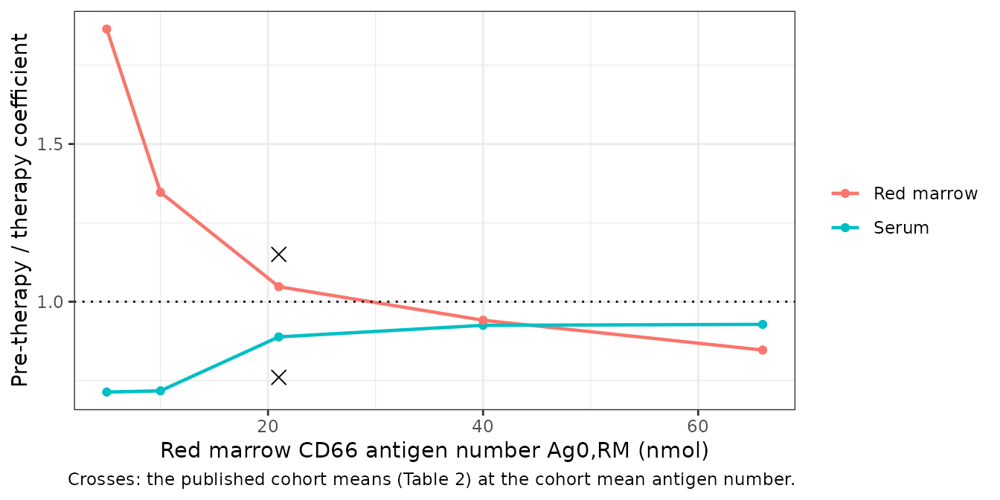

# Anti-CD66 radioimmunotherapy whole-body PBPK (Kletting 2015)

## Model and source

- Citation: Kletting P, Maass C, Reske S, Beer AJ, Glatting G.
  Physiologically Based Pharmacokinetic Modeling Is Essential in
  90Y-Labeled Anti-CD66 Radioimmunotherapy. PLoS One.
  2015;10(5):e0127934. <doi:10.1371/journal.pone.0127934>. Model
  equations, fixed parameters and data-assignment equations are in
  supplement S1 Text (Eqs 1-43, Tables A and B); per-patient
  administered amounts and fitting results are in supplement S1 Table.
- Article: <https://doi.org/10.1371/journal.pone.0127934>
- S1 Text (model equations and parameters):
  <https://doi.org/10.1371/journal.pone.0127934.s004>
- S1 Table (per-patient data and fitting results):
  <https://doi.org/10.1371/journal.pone.0127934.s003>
- ODE states per model: 86

Radioimmunotherapy with the murine anti-CD66 antibody BW 250/183 is used
to intensify conditioning before stem-cell transplantation in acute
leukaemia. The dose the red marrow receives is computed from a
*time-integrated activity coefficient*, the area under the organ’s
time-activity curve divided by the injected activity, and that
coefficient has to be predicted from a small pre-therapeutic tracer
administration of `111In`-labelled antibody before the much larger
therapeutic administration of `90Y`-labelled antibody is given.

Kletting and co-workers show that this prediction fails if the tracer
and the therapy are assumed to behave alike. The number of CD66 antigens
available in the red marrow – about 20 nmol – is the *same order of
magnitude* as the amount of antibody given for therapy – about 9 nmol –
so the therapeutic administration partially saturates the marrow and a
larger fraction of it stays in serum. Assuming equal biodistributions
underestimates the serum coefficient by `(-25 +/- 16)%`. Their refined
PBPK model predicts the difference to `(-3 +/- 20)%`.

Two refinements produce that improvement, and both are in the model
files here. The first is **immunoreactivity**. An antibody arm is
immunoreactive with probability `r_im`, so the injected material splits
into fully (`r_im^2`), half (`2 r_im (1 - r_im)`) and non-immunoreactive
(`(1 - r_im)^2`) species with genuinely different binding: fully
immunoreactive antibody can crosslink two antigens and is bound far more
tightly than half immunoreactive antibody, which can only bind one. The
fitted `r_im` is about `0.80`, not `1`, so roughly a third of the
injected antibody is half immunoreactive and a further 4 % binds nothing
at all. The second is a **constraint on the red marrow antigen number**,
which is the parameter that matters most for dosimetry and is the one
that cannot be measured: it is tied to the fitted liver and spleen
antigen numbers through published granulocyte-pool ratios rather than
estimated freely.

Each of the three immunoreactivity species is carried as a radiolabelled
and an unlabelled copy – six parallel circulations – coupled only by
physical decay, which converts a labelled molecule into an unlabelled
one wherever it happens to be, and competing for one shared antigen
pool. That is what makes the residual antibody from the tracer
administration matter: by the time therapy is given it is mostly
unlabelled, invisible to the camera, and still occupying antigen.

The paper fits **two models** that differ only in how the blood antigen
number is constrained, and averages their predictions with Akaike
weights of `0.51 +/- 0.17` and `0.49 +/- 0.17`. Both are shipped:
`Kletting_2015_antiCD66_pbpk_model1` uses the unweighted
liver-plus-spleen sum (S1 Text Eq 8) and
`Kletting_2015_antiCD66_pbpk_model2` weights each organ by its measured
over calculated volume (S1 Text Eq 9), to compensate for the
hepatomegaly and splenomegaly common in acute leukaemia.

## Population

``` r

str(readModelDb("Kletting_2015_antiCD66_pbpk_model1")()$population)
#> List of 7
#>  $ species      : chr "human"
#>  $ n_subjects   : num 27
#>  $ n_studies    : num 2
#>  $ disease_state: chr "acute leukaemia (21 acute myeloid, 6 acute lymphoblastic); radioimmunotherapy to intensify conditioning before "| __truncated__
#>  $ dose_range   : chr "Pre-therapeutic imaging: 0.5 +/- 0.1 mg anti-CD66 antibody (1 mg = 6.7 nmol; 3.3 +/- 0.6 nmol in S1 Table) carr"| __truncated__
#>  $ regions      : chr "Germany (Ulm University)"
#>  $ notes        : chr "Both study protocols were approved by the Ethics Committee of Ulm University. Age, sex, weight and height distr"| __truncated__
```

Twenty-seven patients with acute leukaemia (21 acute myeloid, 6 acute
lymphoblastic) were studied under two protocols at Ulm University. Each
patient was fitted **individually** – 27 separate SAAM II fits, not a
population model – so Table 1 reports the mean and SD of 27 individual
estimates rather than a typical value and an omega. The model files ship
those means as the typical values and record the SDs in
`population$notes`; they are estimation-error inflated individual
spreads and are deliberately **not** encoded as inter-individual
variability. The paper reports no age, sex, weight or height
distribution, so this vignette uses a 70 kg, 170 cm reference adult.

## Source trace

Every value in either `ini()` block, and every equation in `model()`,
with its location in the source. `S1 Text` is the supplement
(`journal.pone.0127934.s004`).

| Quantity | Source | Value |
|:---|:---|:---|
| Ag0,L, Ag0,S – liver and spleen antigen numbers | Table 1 | 0.31 / 0.22 nmol (model 1); 0.33 / 0.25 (model 2) |
| exL, exS – extravascular delay fractions | Table 1 | 0.235 / 0.107 (model 1); 0.226 / 0.098 (model 2) |
| fRM – fraction of plasma flow to red marrow | Table 1 | 0.67 % (model 1); 0.73 % (model 2) |
| cRM – L2-L4 scaling correction | Table 1 | 1.22 (model 1); 1.20 (model 2) |
| lambda_db – degradation of bound antibody | Table 1 | 6.8e-5 /min (both models) |
| r_im – immunoreactivity probability | Table 1 | 0.801 (model 1); 0.806 (model 2) |
| V – total serum volume | Table 1 | 2.99 L (model 1); 3.00 L (model 2) |
| k_on,mono, k_off | S1 Text Table B | 0.006 L/nmol/min, 0.06 /min (fixed) |
| E – bivalent enhancement factor | S1 Text Table B | 1 672 000 /cm |
| r_cell | S1 Text Table B | 6.0 um |
| N_cells,RM | S1 Text Table B | 188e8 per kg x BW |
| lambda_phy | S1 Text Table B | 1.72e-4 /min (111In); 1.80e-4 /min (90Y) |
| k_in, k_out | S1 Text Table B | 0.0017 /min, 0.005 /min |
| lambda_du, lambda_clex, lambda_cl | S1 Text Table B | 3.9e-4, 3.9e-5, 0.047 /min |
| lambda_Metaex1..4 | S1 Text Table B | 0.39, 0.17, 0.018, 0.013 /min |
| V_RM, V_GI, V_L, V_S as fractions of V | S1 Text Eq 1 | 0.04, 0.076, 0.1, 0.014 |
| F = 1.23 V; F_L, F_S, F_GI fractions | S1 Text Table B | 0.065, 0.03, 0.16 of F |
| intL, intS; V_ROI,L2-L4 | S1 Text Table A and B | 0.04, 0.04; 30 mL |
| K = (170 / height) / 0.06665 | S1 Text Table A | UlmDos scaling factor |
| a, b – radiochemical purities | S1 Text Table B | 0.94 (tracer), 0.96 (therapy) |
| f_l,PT, f_l,T – labelled antibody fractions | S1 Text Table B | 2.3 %, 21 % |
| Free antigen balance | S1 Text Eq 2 | Ag_i = Ag0,i - mono - 2 x bi - ha mono |
| Bivalent enhancement alpha_i | S1 Text Eq 3 | E / (4 pi r_cell^2 N_cells,i) |
| Ag0,RM = 38 Ag0,B | S1 Text Eq 4 | granulocyte pool ratio, ref \[7\] |
| Blood antigen constraint | S1 Text Eqs 5-9 | model 1 Eq 8; model 2 Eq 9 |
| Injected amounts and r_im split | S1 Text Eqs 10-16 | f() in model() |
| Liver / spleen / serum / red marrow readouts | S1 Text Eqs 17-21 | abLiverRoi, abSpleenRoi, Cc, abMarrowRoi |
| Fully immunoreactive ODEs | S1 Text Eqs 22-28 | agbi_fa\_*, agmono_fa\_*, ab_fa\_\* |
| Half immunoreactive ODEs | S1 Text Eqs 29-34 | agmono_ha\_*, ab_ha\_* |
| Non-immunoreactive ODEs | S1 Text Eqs 35-39 | ab_na\_\* |
| Degraded-antibody submodel | S1 Text Eqs 40-43 | ex\_*, metap\_*, metaex1\_*, metaex2\_* |
| Administered antibody amounts | Methods 2.1 and S1 Table | 3.25 nmol tracer, 8.75 nmol therapy (cohort means) |

## Virtual subject and dosing

The paper reports no demographics, so the subject is the 70 kg, 170 cm
reference adult; `WT` enters only the cell numbers behind the bivalent
enhancement factor and `HT` only the L2-L4 readout.

Administered amounts are the S1 Table cohort means: `3.25 nmol` of
antibody for the pre-therapeutic tracer and `8.75 nmol` for therapy
(`1 mg = 6.7 nmol`, so `0.49 mg` and `1.31 mg`, matching the
`0.5 +/- 0.1 mg` and `1.3 +/- 0.5 mg` of Methods 2.1). The radiolabelled
fraction is `a x f_l,PT = 0.94 x 0.023 = 0.0216` for the tracer and
`b x f_l,T = 0.96 x 0.21 = 0.2016` for therapy.

That labelled fraction is checkable against the activities the paper
reports, because one nmol of a nuclide carries a fixed activity
`lambda_phy x N_A`:

``` r

NA_avo <- 6.02214076e23
specAct <- function(lambdaPerMin) lambdaPerMin / 60 * 1e-9 * NA_avo   # Bq per nmol
tibble::tibble(
  Nuclide = c("111In", "90Y"),
  `Labelled antibody (nmol)` = c(3.2517 * 0.0216, 8.7478 * 0.2016),
  `Implied activity (GBq)` = c(3.2517 * 0.0216 * specAct(1.72e-4),
                               8.7478 * 0.2016 * specAct(1.80e-4)) / 1e9,
  `Paper (Methods 2.1)` = c("0.130 +/- 0.016 GBq", "3.2 +/- 0.9 GBq")
) |>
  knitr::kable(digits = 3)
```

| Nuclide | Labelled antibody (nmol) | Implied activity (GBq) | Paper (Methods 2.1) |
|:--------|-------------------------:|-----------------------:|:--------------------|
| 111In   |                    0.070 |                  0.121 | 0.130 +/- 0.016 GBq |
| 90Y     |                    1.764 |                  3.186 | 3.2 +/- 0.9 GBq     |

``` r


# The two labelled fractions are not free: they must reproduce the reported
# activities at carrier-free specific activity. Assert both to 15 %.
stopifnot(
  abs(3.2517 * 0.0216 * specAct(1.72e-4) / 1e9 / 0.130 - 1) < 0.15,
  abs(8.7478 * 0.2016 * specAct(1.80e-4) / 1e9 / 3.2 - 1) < 0.15
)
```

Dosing is six simultaneous bolus records into the six main vascular
compartments, all carrying the same total antibody amount; the model’s
`f()` block applies the labelled fraction and the
`r_im^2 : 2 r_im (1 - r_im) : (1 - r_im)^2` split (S1 Text Eqs 10-16),
so the split lives in the model rather than in the event table.

``` r

doseCmt <- c("ab_fa_plasma_lab", "ab_ha_plasma_lab", "ab_na_plasma_lab",
             "ab_fa_plasma_unlab", "ab_ha_plasma_unlab", "ab_na_plasma_unlab")

#' Solve one administration.
#'
#' @param mod an rxode2 model
#' @param amt total antibody administered (nmol)
#' @param tmax end of the integration window (min)
#' @param inits optional named state vector to start from
solveOne <- function(mod, amt, tmax, inits = NULL) {
  ev <- rxode2::et(amt = amt, cmt = doseCmt[[1]], time = 0)
  for (cc in doseCmt[-1]) ev <- rxode2::et(ev, amt = amt, cmt = cc, time = 0)
  ev <- rxode2::et(ev, sort(unique(c(seq(0, 600, by = 2), seq(600, tmax, by = 20)))))
  dat <- as.data.frame(ev)
  dat$WT <- 70
  dat$HT <- 170
  args <- list(mod, dat, returnType = "data.frame", atol = 1e-10, rtol = 1e-8)
  if (!is.null(inits)) args$inits <- inits
  do.call(rxode2::rxSolve, args)
}

#' Trapezoidal time-integrated activity coefficient, in hours.
tiac <- function(s, col, labelledInjected) {
  y <- s[[col]]
  sum(diff(s$time) * (head(y, -1) + tail(y, -1)) / 2) / labelledInjected / 60
}

abPt <- 3.2517       # S1 Table: mean pre-therapeutic antibody (nmol)
abT <- 8.7478        # S1 Table: mean therapeutic antibody (nmol)
fracPt <- 0.0216     # a * f_l,PT
fracT <- 0.2016      # b * f_l,T
tmaxTiac <- 20000    # Methods 2.3: integration window for the coefficients
```

## Simulation

### Pre-therapeutic tracer administration

``` r

mod1 <- rxode2::rxode2(readModelDb("Kletting_2015_antiCD66_pbpk_model1"))
mod2 <- rxode2::rxode2(readModelDb("Kletting_2015_antiCD66_pbpk_model2"))

pre1 <- solveOne(mod1, abPt, tmaxTiac)
pre2 <- solveOne(mod2, abPt, tmaxTiac)
labPt <- abPt * fracPt
```

Replicates Figure 2 of Kletting 2015: the pre-therapeutic `111In`
time-activity curves for red marrow, liver, spleen and whole body, each
as a percentage of the injected activity.

``` r

organs <- c(abWholeBody = "Whole body", abMarrow = "Red marrow",
            abLiverRoi = "Liver", abSpleenRoi = "Spleen")
pre1 |>
  dplyr::select(time, dplyr::all_of(names(organs))) |>
  tidyr::pivot_longer(-time, names_to = "state", values_to = "nmol") |>
  dplyr::mutate(Organ = factor(organs[state], levels = unname(organs)),
                pct = 100 * nmol / labPt) |>
  dplyr::filter(time > 0, time <= 8640) |>
  ggplot2::ggplot(ggplot2::aes(time / 60, pct, colour = Organ)) +
  ggplot2::geom_line(linewidth = 0.8) +
  ggplot2::scale_y_log10() +
  ggplot2::labs(x = "Time after the pre-therapeutic injection (h)",
                y = "Per cent of injected 111In activity", colour = NULL) +
  ggplot2::theme_bw()
```


Replicates Figure 2A of Kletting 2015 (model 1, typical subject).

### Therapy, with the tracer still on board

The therapeutic injection is given about eight days after the tracer
(the first `90Y` serum sample in S1 Table sits at `11527 min`
post-tracer for patient 1). Two things carry over: the antibody still in
the body, and the saturation it causes. The tracer’s `111In` label is
irrelevant to a `90Y` measurement, so the residual labelled states are
folded into their unlabelled twins – the same antibody, still occupying
antigen, no longer seen by the camera – and the therapy run starts from
that state with `lambda_phy` switched to `90Y`.

``` r

tTherapy <- 192 * 60

therapyFrom <- function(mod) {
  preAtT <- solveOne(mod, abPt, tTherapy)
  init <- unlist(preAtT[nrow(preAtT), mod$state])
  for (nm in grep("_lab$", mod$state, value = TRUE)) {
    unl <- sub("_lab$", "_unlab", nm)
    init[[unl]] <- init[[unl]] + init[[nm]]
    init[[nm]] <- 0
  }
  init
}

modT1 <- rxode2::rxode2(rxode2::ini(readModelDb("Kletting_2015_antiCD66_pbpk_model1"),
                                    lambdaPhy = 1.80e-4, fracLabeled = fracT))
#> ℹ change initial estimate of `lambdaPhy` to `0.00018`
#> ℹ change initial estimate of `fracLabeled` to `0.2016`
modT2 <- rxode2::rxode2(rxode2::ini(readModelDb("Kletting_2015_antiCD66_pbpk_model2"),
                                    lambdaPhy = 1.80e-4, fracLabeled = fracT))
#> ℹ change initial estimate of `lambdaPhy` to `0.00018`
#> ℹ change initial estimate of `fracLabeled` to `0.2016`

init1 <- therapyFrom(mod1)
init2 <- therapyFrom(mod2)
thr1 <- solveOne(modT1, abT, tmaxTiac, inits = init1)
thr2 <- solveOne(modT2, abT, tmaxTiac, inits = init2)
labT <- abT * fracT

residualAb <- sum(init1[grep("^(ab|agmono|agbi)_", names(init1))])
cat("Intact antibody still present when therapy is given: ",
    signif(residualAb, 3), " nmol = ", round(100 * residualAb / abPt, 1),
    " % of the tracer dose\n", sep = "")
#> Intact antibody still present when therapy is given: 1.12 nmol = 34.3 % of the tracer dose
```

``` r

dplyr::bind_rows(
  dplyr::transmute(pre1, time, Administration = "Pre-therapeutic (111In)",
                   pct = 100 * Cc / labPt),
  dplyr::transmute(thr1, time, Administration = "Therapeutic (90Y)",
                   pct = 100 * Cc / labT)
) |>
  dplyr::filter(time > 0, time <= 8640) |>
  ggplot2::ggplot(ggplot2::aes(time / 60, pct, colour = Administration)) +
  ggplot2::geom_line(linewidth = 0.8) +
  ggplot2::scale_y_log10() +
  ggplot2::labs(x = "Time after injection (h)",
                y = "Per cent of injected activity per litre of serum",
                colour = NULL) +
  ggplot2::theme_bw()
```


Replicates Figure 2B of Kletting 2015: serum time-activity curves, each
normalised to its own injected activity.

Normalised to its own injected activity, the therapeutic curve carries
the larger area: the bigger antibody amount saturates the marrow
antigen, so proportionally more of the injected activity stays in serum.
That is the paper’s central mechanism, and it is why the coefficients
cannot simply be carried over.

## Validation

### 1. Mass balance

The only route out of the system is `lambda_cl` from the plasma
degradation product, so total antibody-derived mass must be conserved
exactly.

``` r

massDev <- c(max(abs(pre1$abMassBalance / abPt - 1)),
             max(abs(pre2$abMassBalance / abPt - 1)))
cat("largest relative mass-balance deviation:", signif(max(massDev), 3), "\n")
#> largest relative mass-balance deviation: 2.4e-14
stopifnot(max(massDev) < 1e-8)
```

This is a strong structural check on an 86-state system: every flow
term, every decay coupling and every binding term appears once as a gain
and once as a loss, so a single mis-routed or mis-signed term breaks it.

### 2. The whole-body coefficient cannot exceed the physical mean life

With no excretion at all, the whole-body time-integrated activity
coefficient would equal the mean life of the nuclide, `1 / lambda_phy`.

``` r

meanLife <- 1 / 1.72e-4 / 60
wb <- tiac(pre1, "abWholeBody", labPt)
cat("whole-body coefficient", round(wb, 1), "h against the",
    round(meanLife, 1), "h physical bound\n")
#> whole-body coefficient 73.9 h against the 96.9 h physical bound
stopifnot(wb > 0, wb < meanLife)
```

### 3. Non-compartmental analysis of the serum curve

The serum coefficient the paper reports *is* a dose-normalised AUC, so
PKNCA computes it directly. `Cc` is a concentration of labelled antibody
in nmol/L, and the coefficient is the AUC over the paper’s `0` to
`20 000 min` window divided by the injected labelled amount.

``` r

ncaConc <- dplyr::bind_rows(
  dplyr::transmute(pre1, id = 1L, treatment = "Pre-therapeutic (111In)",
                   time, conc = Cc, dose = labPt),
  dplyr::transmute(thr1, id = 1L, treatment = "Therapeutic (90Y)",
                   time, conc = Cc, dose = labT)
) |>
  dplyr::filter(!is.na(conc))

ncaDose <- ncaConc |>
  dplyr::group_by(id, treatment) |>
  dplyr::summarise(dose = dplyr::first(dose), time = 0, .groups = "drop")

oConc <- PKNCA::PKNCAconc(as.data.frame(ncaConc), conc ~ time | id / treatment,
                          concu = "nmol/L", timeu = "min")
# PKNCAdose groups with `+`, not the nested `/` PKNCAconc accepts.
oDose <- PKNCA::PKNCAdose(as.data.frame(ncaDose), dose ~ time | id + treatment,
                          doseu = "nmol")
intervals <- data.frame(start = 0, end = tmaxTiac,
                        auclast = TRUE, cmax = TRUE, tmax = TRUE, half.life = TRUE)
res <- PKNCA::pk.nca(PKNCA::PKNCAdata(oConc, oDose, intervals = intervals))

ncaTab <- as.data.frame(res) |>
  dplyr::select(treatment, PPTESTCD, PPORRES) |>
  tidyr::pivot_wider(names_from = PPTESTCD, values_from = PPORRES)
ncaTab |>
  dplyr::mutate(`Coefficient a~serum (h/L)` = auclast / c(labPt, labT) / 60) |>
  dplyr::rename("Administration" = treatment, "AUClast (nmol/L*min)" = auclast,
                "Cmax (nmol/L)" = cmax, "Tmax (min)" = tmax,
                "Half-life (min)" = half.life) |>
  knitr::kable(digits = 4)
```

| Administration | AUClast (nmol/L\*min) | Cmax (nmol/L) | Tmax (min) | tlast | lambda.z | r.squared | adj.r.squared | lambda.z.time.first | lambda.z.time.last | lambda.z.n.points | clast.pred | Half-life (min) | span.ratio | Coefficient a~serum (h/L) |
|:---|---:|---:|---:|---:|---:|---:|---:|---:|---:|---:|---:|---:|---:|---:|
| Pre-therapeutic (111In) | 12.8172 | 0.0305 | 0 | 20000 | 3e-04 | 0.9999 | 0.9999 | 3700 | 20000 | 816 | 0e+00 | 2133.412 | 7.6403 | 3.0414 |
| Therapeutic (90Y) | 359.8264 | 0.7660 | 0 | 20000 | 3e-04 | 0.9999 | 0.9999 | 9200 | 20000 | 541 | 1e-04 | 2038.870 | 5.2971 | 3.4006 |

The PKNCA AUC and the trapezoidal integral used for the other organs
must agree, which cross-checks the integration the rest of this vignette
relies on. PKNCA’s default is linear-up / log-down and `tiac()` is a
plain linear trapezoid, so they are not identical, but on this
observation grid they must be within a per cent.

``` r

aucPre <- ncaTab$auclast[ncaTab$treatment == "Pre-therapeutic (111In)"]
cat("PKNCA / trapezoid ratio:",
    signif(aucPre / labPt / 60 / tiac(pre1, "Cc", labPt), 6), "\n")
#> PKNCA / trapezoid ratio: 0.999971
stopifnot(abs(aucPre / labPt / 60 / tiac(pre1, "Cc", labPt) - 1) < 0.01)
```

### 4. Table 2 – the published time-integrated activity coefficients

This is the end-to-end gate. Every organ coefficient in Table 2 has to
fall out of the model at the Table 1 means, and the model-averaged
prediction uses the paper’s Akaike weights of `0.51` and `0.49`.

``` r

w1 <- 0.51; w2 <- 0.49
cols <- c(abMarrow = "Red marrow", abLiverRoi = "Liver", abSpleenRoi = "Spleen",
          Cc = "Serum [h/L]", abWholeBody = "Whole body")

tiacRow <- function(col) {
  c(m1 = tiac(pre1, col, labPt), m2 = tiac(pre2, col, labPt),
    t1 = tiac(thr1, col, labT), t2 = tiac(thr2, col, labT))
}
vals <- vapply(names(cols), tiacRow, numeric(4))

table2 <- tibble::tibble(
  Organ = unname(cols),
  `Pre-therapy, model averaged` = w1 * vals["m1", ] + w2 * vals["m2", ],
  `Paper pre-therapy` = c("42.2 +/- 7.7", "6.6 +/- 2.1", "3.1 +/- 1.3",
                          "3.8 +/- 1.4", "72.4 +/- 3.4"),
  `Therapy, model averaged` = w1 * vals["t1", ] + w2 * vals["t2", ],
  `Paper therapy` = c("37.3 +/- 7.5", "7.0 +/- 2.0", "2.9 +/- 0.9",
                      "4.9 +/- 1.8", "74.2 +/- 3.8")
)
knitr::kable(table2, digits = 2)
```

| Organ | Pre-therapy, model averaged | Paper pre-therapy | Therapy, model averaged | Paper therapy |
|:---|---:|:---|---:|:---|
| Red marrow | 45.25 | 42.2 +/- 7.7 | 43.91 | 37.3 +/- 7.5 |
| Liver | 5.52 | 6.6 +/- 2.1 | 4.97 | 7.0 +/- 2.0 |
| Spleen | 2.58 | 3.1 +/- 1.3 | 2.13 | 2.9 +/- 0.9 |
| Serum \[h/L\] | 2.95 | 3.8 +/- 1.4 | 3.29 | 4.9 +/- 1.8 |
| Whole body | 73.75 | 72.4 +/- 3.4 | 71.92 | 74.2 +/- 3.8 |

``` r

paperPre <- c(42.2, 6.6, 3.1, 3.8, 72.4)
paperPreSd <- c(7.7, 2.1, 1.3, 1.4, 3.4)
modelPre <- table2$`Pre-therapy, model averaged`

# Every organ coefficient must land inside one between-patient SD of the
# published cohort mean. The comparison is a typical-parameter model against a
# mean of per-patient fits, so exact agreement is not expected; one SD is the
# right tolerance and is tight enough that a transcription error in any flow,
# volume, antigen number or binding constant fails it.
zScore <- abs(modelPre - paperPre) / paperPreSd
print(round(setNames(zScore, table2$Organ), 2))
#>  Red marrow       Liver      Spleen Serum [h/L]  Whole body 
#>        0.40        0.51        0.40        0.61        0.40
stopifnot(all(zScore < 1))

# The whole-body coefficient is the best determined of the five (the paper's own
# relative standard error is 1.1 %), so it gets a tighter bound.
stopifnot(abs(modelPre[5] / paperPre[5] - 1) < 0.05)
```

### 5. The mechanism: saturation raises the serum coefficient

The paper’s central quantitative claim is that the serum coefficient is
*higher* during therapy while the red marrow coefficient is *lower*,
because the larger antibody amount saturates the marrow antigen. Table 2
gives pre-therapy over therapy ratios of `0.76` for serum and `1.15` for
red marrow.

``` r

ratio <- tibble::tibble(
  Organ = unname(cols),
  `Model pre / therapy` = (w1 * vals["m1", ] + w2 * vals["m2", ]) /
    (w1 * vals["t1", ] + w2 * vals["t2", ]),
  `Paper (Table 2)` = c(1.15, 0.97, 1.04, 0.76, 0.98)
)
knitr::kable(ratio, digits = 2)
```

| Organ         | Model pre / therapy | Paper (Table 2) |
|:--------------|--------------------:|----------------:|
| Red marrow    |                1.03 |            1.15 |
| Liver         |                1.11 |            0.97 |
| Spleen        |                1.21 |            1.04 |
| Serum \[h/L\] |                0.90 |            0.76 |
| Whole body    |                1.03 |            0.98 |

``` r


# The directions are the claim; assert them rather than the magnitudes, which
# are cohort means dominated by the patients with the least marrow antigen.
serumRatio <- ratio$`Model pre / therapy`[4]
marrowRatio <- ratio$`Model pre / therapy`[1]
stopifnot(serumRatio < 0.95, marrowRatio > 1, marrowRatio > serumRatio)
```

The serum coefficient is higher during therapy and the red marrow
coefficient lower, as the paper reports. Liver and spleen come out
slightly further from unity than Table 2’s `0.97` and `1.04`; the paper
attributes their near-constancy to increased unspecific uptake during
therapy offsetting reduced CD66-specific binding, and that compensation
is only partial at cohort-mean `exL` and `exS`, both of which have a
between-patient SD of roughly 40 % of their own value.

The model at the cohort-mean parameters reproduces the *direction* of
both effects but not their full size: 0.9 against `0.76` for serum. That
is expected. Table 2’s ratios are means over 27 patients, and the paper
says explicitly that the effect is driven by the subset “with a low
number of binding sites compared to the administered number of
antibodies” – S1 Table gives eleven patients with `Ag_RM <= 10 nmol`
against a cohort mean of `21 nmol`. Saturation is strongly non-linear in
the antigen number, so a mean-parameter subject understates a
mean-of-patients ratio. Sweeping the marrow antigen number over the
published per-patient range shows the mechanism directly:

``` r

sweep <- lapply(c(5, 10, 21, 40, 66), function(agRm) {
  # Ag0,RM = 38 * (Ag0,L + Ag0,S) / 0.9, so scale the fitted liver and spleen
  # numbers to hit a target marrow antigen number from S1 Table's range.
  k <- agRm / (38 * (0.31 + 0.22) / 0.9)
  m <- rxode2::rxode2(rxode2::ini(readModelDb("Kletting_2015_antiCD66_pbpk_model1"),
                                  ag0Liver = 0.31 * k, ag0Spleen = 0.22 * k))
  mT <- rxode2::rxode2(rxode2::ini(readModelDb("Kletting_2015_antiCD66_pbpk_model1"),
                                   ag0Liver = 0.31 * k, ag0Spleen = 0.22 * k,
                                   lambdaPhy = 1.80e-4, fracLabeled = fracT))
  pre <- solveOne(m, abPt, tmaxTiac)
  st <- solveOne(m, abPt, tTherapy)
  ini <- unlist(st[nrow(st), m$state])
  for (nm in grep("_lab$", m$state, value = TRUE)) {
    unl <- sub("_lab$", "_unlab", nm)
    ini[[unl]] <- ini[[unl]] + ini[[nm]]
    ini[[nm]] <- 0
  }
  thr <- solveOne(mT, abT, tmaxTiac, inits = ini)
  tibble::tibble(agRm = agRm,
                 serum = tiac(pre, "Cc", labPt) / tiac(thr, "Cc", labT),
                 marrow = tiac(pre, "abMarrow", labPt) / tiac(thr, "abMarrow", labT))
}) |> dplyr::bind_rows()
#> ℹ change initial estimate of `ag0Liver` to `0.0692651439920556`
#> ℹ change initial estimate of `ag0Spleen` to `0.0491559086395233`
#> ℹ change initial estimate of `ag0Liver` to `0.0692651439920556`
#> ℹ change initial estimate of `ag0Spleen` to `0.0491559086395233`
#> ℹ change initial estimate of `lambdaPhy` to `0.00018`
#> ℹ change initial estimate of `fracLabeled` to `0.2016`
#> ℹ change initial estimate of `ag0Liver` to `0.138530287984111`
#> ℹ change initial estimate of `ag0Spleen` to `0.0983118172790467`
#> ℹ change initial estimate of `ag0Liver` to `0.138530287984111`
#> ℹ change initial estimate of `ag0Spleen` to `0.0983118172790467`
#> ℹ change initial estimate of `lambdaPhy` to `0.00018`
#> ℹ change initial estimate of `fracLabeled` to `0.2016`
#> ℹ change initial estimate of `ag0Liver` to `0.290913604766634`
#> ℹ change initial estimate of `ag0Spleen` to `0.206454816285998`
#> ℹ change initial estimate of `ag0Liver` to `0.290913604766634`
#> ℹ change initial estimate of `ag0Spleen` to `0.206454816285998`
#> ℹ change initial estimate of `lambdaPhy` to `0.00018`
#> ℹ change initial estimate of `fracLabeled` to `0.2016`
#> ℹ change initial estimate of `ag0Liver` to `0.554121151936445`
#> ℹ change initial estimate of `ag0Spleen` to `0.393247269116187`
#> ℹ change initial estimate of `ag0Liver` to `0.554121151936445`
#> ℹ change initial estimate of `ag0Spleen` to `0.393247269116187`
#> ℹ change initial estimate of `lambdaPhy` to `0.00018`
#> ℹ change initial estimate of `fracLabeled` to `0.2016`
#> ℹ change initial estimate of `ag0Liver` to `0.914299900695134`
#> ℹ change initial estimate of `ag0Spleen` to `0.648857994041708`
#> ℹ change initial estimate of `ag0Liver` to `0.914299900695134`
#> ℹ change initial estimate of `ag0Spleen` to `0.648857994041708`
#> ℹ change initial estimate of `lambdaPhy` to `0.00018`
#> ℹ change initial estimate of `fracLabeled` to `0.2016`

knitr::kable(dplyr::rename(sweep, "Ag0,RM (nmol)" = agRm,
                           "Serum pre / therapy" = serum,
                           "Red marrow pre / therapy" = marrow), digits = 2)
```

| Ag0,RM (nmol) | Serum pre / therapy | Red marrow pre / therapy |
|--------------:|--------------------:|-------------------------:|
|             5 |                0.71 |                     1.86 |
|            10 |                0.72 |                     1.35 |
|            21 |                0.89 |                     1.05 |
|            40 |                0.93 |                     0.94 |
|            66 |                0.93 |                     0.85 |

``` r


# Saturation must be monotone in the antigen number: the less marrow antigen a
# patient has, the more the therapy administration shifts activity into serum
# and away from the marrow.
stopifnot(all(diff(sweep$serum) > 0), all(diff(sweep$marrow) < 0))
# The published cohort ratios must lie inside the range the per-patient antigen
# numbers generate.
stopifnot(min(sweep$serum) < 0.76, max(sweep$serum) > 0.76,
          min(sweep$marrow) < 1.15, max(sweep$marrow) > 1.15)
```



### 6. Immunoreactivity matters

The paper’s other claim is that assuming `r_im = 1` is untenable.
Setting `r_im = 1` removes the half and non-immunoreactive circulations
entirely and should visibly change the biodistribution.

``` r

modPerfect <- rxode2::rxode2(rxode2::ini(readModelDb("Kletting_2015_antiCD66_pbpk_model1"),
                                         rIm = 1))
#> ℹ change initial estimate of `rIm` to `1`
prePerfect <- solveOne(modPerfect, abPt, tmaxTiac)

tibble::tibble(
  Organ = unname(cols),
  `r_im = 0.801 (fitted)` = vals["m1", ],
  `r_im = 1 (the abandoned assumption)` =
    vapply(names(cols), function(cc) tiac(prePerfect, cc, labPt), 0),
  `Paper pre-therapy` = c("42.2 +/- 7.7", "6.6 +/- 2.1", "3.1 +/- 1.3",
                          "3.8 +/- 1.4", "72.4 +/- 3.4")
) |>
  knitr::kable(digits = 2)
```

| Organ | r_im = 0.801 (fitted) | r_im = 1 (the abandoned assumption) | Paper pre-therapy |
|:---|---:|---:|:---|
| Red marrow | 44.93 | 58.85 | 42.2 +/- 7.7 |
| Liver | 5.63 | 2.81 | 6.6 +/- 2.1 |
| Spleen | 2.61 | 1.53 | 3.1 +/- 1.3 |
| Serum \[h/L\] | 3.04 | 0.73 | 3.8 +/- 1.4 |
| Whole body | 73.87 | 70.52 | 72.4 +/- 3.4 |

``` r


# Perfect immunoreactivity moves more antibody onto antigen and less into serum.
stopifnot(tiac(prePerfect, "Cc", labPt) < tiac(pre1, "Cc", labPt),
          tiac(prePerfect, "abMarrow", labPt) > tiac(pre1, "abMarrow", labPt))

# And it must fail the Table 2 gate that the fitted r_im passes: the serum
# coefficient collapses to a fifth of the published value and the red marrow
# coefficient lands more than two between-patient SDs high.
stopifnot(tiac(prePerfect, "Cc", labPt) < 0.25 * 3.8,
          (tiac(prePerfect, "abMarrow", labPt) - 42.2) / 7.7 > 2)
```

With `r_im = 1` the red marrow coefficient rises to about `59 h` against
the published `42.2 +/- 7.7 h` and the serum coefficient collapses from
`3.0` to `0.7 h/L` against the published `3.8 +/- 1.4`. Both miss badly,
which is the paper’s reason for abandoning the assumption.

## Assumptions and deviations

- **Three printed equations are encoded against their printed form.**
  Each is a transcription slip contradicted by the equation’s own
  labelled twin, by the prose it follows, or by mass balance:
  - **S1 Text Eq 8 and Eq 9** print `Ag0,B = (Ag0,L + Ag0,S) * 0.9`. The
    sentence immediately above states that the liver and spleen cells
    equal *90 % of* the circulating pool, which is division, and Table
    1’s means are a linear map of the fitted pair:
    `Ag0,L 0.31 + Ag0,S 0.22 = 0.53` against the reported `Ag0,B 0.58`.
    Division gives `0.589` and multiplication `0.477`, so the constraint
    is encoded as `/ 0.9`. Printed Eqs 6 and 7 are inverted in the same
    way relative to their own prose.
  - **S1 Text Eq 35**, the unlabelled non-immunoreactive spleen and
    marrow equation, prints a minus on the inflow from the main vascular
    compartment. Its own labelled twin on the next line and Eq 36 both
    print a plus, and a minus would make the compartment a sink; encoded
    positive.
  - **S1 Text Eq 39**, the unlabelled non-immunoreactive vascular
    equation, picks up `k_out * Ab_ha,int` and `lambda_phy * Ab*_ha,P`
    from the half immunoreactive Eq 34. Its labelled twin uses the `na`
    states; encoded as `na`.
- **Eq 29 carries two fully-immunoreactive terms that a half
  immunoreactive antibody cannot have.** As printed it includes
  `- k_on,mono * alpha_i * Ag_i * AgAb_ha,mono` and
  `+ 2 k_off * AgAb_ha,bi`, both crosslinking terms. There is no
  `AgAb_ha,bi` state anywhere in the supplement, Eq 2’s antigen balance
  has no half immunoreactive bivalent term, and the paper defines half
  immunoreactive antibody as having one active arm, so it cannot
  crosslink. Keeping the `alpha` loss would drain bound antibody into a
  compartment that does not exist and break mass balance; both terms are
  dropped. **The printed factor `2` on the half immunoreactive
  association rate is kept as published**, even though the model’s own
  arm-counting bookkeeping (two free arms give `2 k_on,mono` for the
  fully immunoreactive species) would imply `1` for a one-armed
  antibody. It is internally consistent between Eqs 29 and 30, it
  conserves mass, and it is what the authors’ SAAM II implementation
  presumably contained when the shipped parameters were fitted.
- **`alpha_i` needs a unit conversion the supplement does not print.**
  Table B gives `alpha_i` in `1/cm3` and `k_on,mono` in `L/nmol/min`, so
  the product `k_on,mono * alpha_i * Ag_i` is short by a factor of 1000.
  The model applies it explicitly. The reading is confirmed
  independently: computing `k_on,bi * [Ag]_s` from Table B’s `E`,
  `r_cell` and `N_cells,RM` gives the same `35 /min` crosslinking rate
  at the cohort-mean antigen number.
- **The whole-body observable has no printed equation.** S1 Text gives
  data-assignment equations for liver, spleen, serum and red marrow (Eqs
  17-21) but not for the whole-body gamma-camera signal. It is encoded
  as every radiolabelled state that has not yet been excreted, which is
  the only reading consistent with a whole-body count, and it reproduces
  Table 2’s `72.4 h` and stays below the `96.9 h` physical bound.
- **`cleared_lab` and `cleared_unlab` are bookkeeping states, not
  published ones.** They accumulate the `lambda_cl` outflow so that
  total antibody mass is exactly conserved and the mass-balance gate
  above is possible. They enter no other equation.
- **Model 2’s organ-size weights are shipped as parameters fixed at 1.**
  Eq 9 weights each organ’s antigen number by `V_MRI / V_Cal`. Neither
  the per-patient MRI volumes nor the formulae for the calculated
  volumes (refs \[9\] Harris 2010 and \[10\] Johnson 2005) appear in any
  available source, so the ratios themselves are the shipped input
  (`ratioVolLiver`, `ratioVolSpleen`), fixed at `1` = an organ of
  exactly calculated size. At that default Model 2 reduces to Model 1’s
  constraint and differs only through its own column of Table 1
  estimates, which is what this vignette’s model averaging uses. A user
  with measured volumes overrides them with
  [`rxode2::ini()`](https://nlmixr2.github.io/rxode2/reference/ini.html).
- **No inter-individual variability is encoded.** The paper fitted 27
  patients individually; Table 1’s SDs are spreads of individual
  estimates inflated by estimation error, not a fitted omega. They are
  recorded in `population$notes`.
- **The radiolabelled fraction and the physical decay constant are model
  parameters, not covariates.** `fracLabeled` and `lambdaPhy` differ
  between the `111In` tracer and the `90Y` therapy administration and
  are switched with
  [`rxode2::ini()`](https://nlmixr2.github.io/rxode2/reference/ini.html)
  between the two solves above. The shipped values are the tracer’s, the
  data the parameters were fitted to.
- **The residual `111In`-labelled antibody is folded into the unlabelled
  pool at the therapy injection.** It is chemically the same antibody
  and still occupies antigen, but a `90Y` measurement cannot see it.
  Folding costs the small difference between the two decay constants
  (`1.72e-4` against `1.80e-4 /min`, 4.6 %) applied to 7.5 % of a dose
  that is itself a quarter of the therapy dose.
- **Residual antibody at therapy is larger here than the Discussion’s
  rounded figure.** The model leaves 34 % of the tracer’s antibody in
  the body at 192 h against the paper’s “~20 % unlabelled”. The interval
  between the two administrations is not tabulated per patient – 192 h
  is read off patient 1’s first `90Y` serum sample in S1 Table – and a
  longer interval in other patients would lower the figure. The
  radiolabelled residual matches: the model gives 7.5 % of injected
  activity against the paper’s “~8 %”. Nothing was tuned.
- **Demographics are assumed.** The paper reports no age, sex, weight or
  height distribution. `WT = 70 kg` and `HT = 170 cm` are the reference
  adult; `HT = 170` makes the UlmDos factor `K = 1 / 0.06665` exactly.
  `WT` affects only the bivalent enhancement factor through the cell
  numbers and `HT` only the `abMarrowRoi` readout, so neither touches
  the coefficients validated above.
- **Table 2 is reproduced at typical parameters, not patient by
  patient.** The published coefficients are means over 27 individual
  fits; the model here is solved once at the Table 1 means. The two
  agree within one between-patient SD on every organ, but ratios that
  depend non-linearly on the antigen number (Section 5) are understated
  at mean parameters, as the sweep shows.
