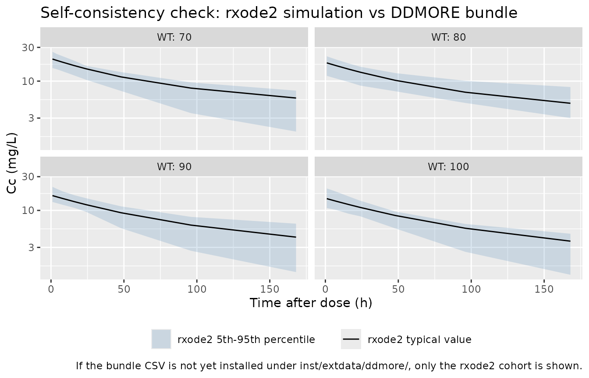

# Kloft_2004_sibrotuzumab

## Model and source

- Citation: Kloft C, Graefe E-U, Tanswell P, Scott AM, Hofheinz R,
  Amelsberg A, Karlsson MO. (2004). Population pharmacokinetics of
  sibrotuzumab, a novel therapeutic monoclonal antibody, in cancer
  patients. Invest New Drugs 22(1):39-52.
  <doi:10.1023/B:DRUG.0000006173.72210.1c>. DDMORE Foundation Model
  Repository: DDMODEL00000195.
- Description: Two-compartment population PK model for sibrotuzumab in
  adults with metastatic FAP-positive cancer (Kloft 2004), with parallel
  linear and Michaelis-Menten elimination from the central compartment
  and a fixed linear body-weight covariate (centered at 75 kg) on linear
  CL, central and peripheral volumes, and Vmax.
- Article: <https://doi.org/10.1023/B:DRUG.0000006173.72210.1c>
- DDMORE Foundation Model Repository entry:
  [DDMODEL00000195](https://repository.ddmore.eu/model/DDMODEL00000195)

This model was extracted from the DDMORE Foundation Model Repository
bundle for `DDMODEL00000195` (scraped to
`dpastoor/ddmore_scraping/195/`). The bundle contains:

- `Executable_sibrotuzumab.mdl` — the human-readable MDL control object
  (PARAMETERS, MODEL_PREDICTION, OBSERVATION blocks).
- `Executable_sibrotuzumab.xml` — PharmML-rendered version of the same
  1550. 
- `Output_simulated_nca_simulation.1.lst` — NMTRAN simulation listing
  produced by the `pharmML2Nmtran` v0.3.0 converter from the MDL (a
  20-replicate `$SIMULATION ... ONLYSIMULATION` over a single 80 mg /
  1-hour IV infusion per subject; **not an estimation run**).
- `Simulated_sibrotuzumab.csv` — the corresponding simulated dataset
  (`ID, TIME, WT, AMT, RATE, DV, MDV`) with 20 subjects and WT in {70,
  80, 90, 100} kg.
- `Model_Accommodations.txt`, `DDMODEL00000195.rdf` — provenance and
  scenario notes.

The `.mdl` PARAMETERS block carries the publication-derived point values
used to drive the simulation; there is no `Output_real_*.lst` estimation
listing in the bundle, so the values cannot be cross-checked against a
re-fitted set of final estimates. The original Kloft 2004 publication is
not on disk in this worktree, so a side-by-side publication-table
comparison is also out of scope here.

## Population

Kloft 2004 reports a population PK analysis of intravenous sibrotuzumab
(BIBH 1, a humanized IgG1 monoclonal antibody against fibroblast
activation protein, FAP) from a Phase I dose-escalation study in adults
with metastatic FAP-positive solid tumors. The DDMORE bundle does
**not** reproduce the published demographic table, so the model’s
`population` metadata fields for `n_subjects`, `n_studies`,
`weight_range`, `age_range`, and `sex_female_pct` are intentionally `NA`
— readers should consult the publication directly for those details.

The bundle ships a 20-subject smoke-test cohort
(`Simulated_sibrotuzumab.csv`) with body weights uniformly drawn from
{70, 80, 90, 100} kg and a single 80 mg / 1-hour IV infusion per subject
sampled at 1, 4, 8, 16, 24, 48, 96, and 168 hours post-dose. That cohort
is a regression-test artifact, not a representative clinical-trial
replication. The validation in this vignette uses an analogous virtual
cohort.

## Source trace

Per-parameter origin (also recorded as in-file comments next to each
[`ini()`](https://nlmixr2.github.io/rxode2/reference/ini.html) entry of
`inst/modeldb/ddmore/Kloft_2004_sibrotuzumab.R`):

| Equation / parameter | Value | Source location |
|----|----|----|
| `lcl` | log(0.0221) | `Executable_sibrotuzumab.mdl` PARAMETERS / STRUCTURAL `POP_CLL` (mirrored as `$THETA(1) 0.0221` in `Output_simulated_*.lst` line 72) |
| `lvc` | log(4.13) | `.mdl` PARAMETERS `POP_V1` |
| `lvp` | log(3.19) | `.mdl` PARAMETERS `POP_V2` |
| `lq` | log(0.0376) | `.mdl` PARAMETERS `POP_Q` |
| `lvmax` | log(0.0338) | `.mdl` PARAMETERS `POP_Vmax` |
| `lkm` | log(8.0) | `.mdl` PARAMETERS `POP_Km` |
| `e_wt_cl` | fixed(0.0182) | `.mdl` PARAMETERS `BETA_CLL_WT` (`fix = true`) |
| `e_wt_vc` | fixed(0.0125) | `.mdl` PARAMETERS `BETA_V1_WT` (`fix = true`) |
| `e_wt_vp` | fixed(0.0105) | `.mdl` PARAMETERS `BETA_V2_WT` (`fix = true`) |
| `e_wt_vmax` | fixed(0.00934) | `.mdl` PARAMETERS `BETA_Vmax_WT` (`fix = true`) |
| `etalcl` | 0.3249 (= 0.57²) | `.mdl` VARIABILITY `PPV_CLL` SD = 0.57 (squared to log-scale variance) |
| `etalvc` | 0.04 (= 0.20²) | `.mdl` VARIABILITY `PPV_V1` SD = 0.20 |
| `etalvp` | 0.04 (= 0.20²) | `.mdl` VARIABILITY `PPV_V2` SD = 0.20 |
| `etalvmax` | fixed(0.0841 = 0.29²) | `.mdl` VARIABILITY `PPV_Vmax` SD = 0.29 (`fix = true`) |
| `addSd` | 0.093 (mg/L) | `.mdl` PARAMETERS `RUV_ADD` |
| `propSd` | 0.0491 (frac) | `.mdl` PARAMETERS `RUV_PROP` |
| `Cc = central / vc` | n/a | `.mdl` MODEL_PREDICTION DEQ block |
| `Cp = peripheral1 / vp` | n/a | `.mdl` MODEL_PREDICTION DEQ block |
| `d/dt(central)` | n/a | `.mdl` MODEL_PREDICTION DEQ: `dAC = Q*(CP-CC) - CLL*CC - Vmax*CC/(Km+CC)` (rendered NMTRAN `Output_simulated_*.lst` \$DES line 58) |
| `d/dt(peripheral1)` | n/a | `.mdl` MODEL_PREDICTION DEQ: `dAP = Q*(CC-CP)` (rendered NMTRAN \$DES line 59) \| \| \`(WT - 75) / 1\` covariate centering \| reference WT = 75 kg \| \`.mdl\` GROUP_VARIABLES block (\`(WT-75)\` literal) \| \| \`Cc ~ add + prop + combined1()\` \| linear-SD combined model \| \`.mdl\` OBSERVATION \`combinedError1(additive=RUV_ADD, proportional=RUV_PROP, eps=EPS_Y, prediction=CC)\` (rendered NMTRAN: \`W = RUV_ADD + RUV_PROP\*IPRED; Y = IPRED + W\*EPS(1)\` with \`\$SIGMA 1.0 FIX\`) |

## Virtual cohort

``` r

set.seed(20260506L)

obs_times <- c(1, 4, 8, 16, 24, 48, 96, 168)
n_per_wt  <- 25L
wt_values <- c(70, 80, 90, 100)
dose_mg   <- 80
infusion_h <- 1

events <- expand.grid(
  WT       = wt_values,
  rep_id   = seq_len(n_per_wt),
  KEEP.OUT.ATTRS = FALSE,
  stringsAsFactors = FALSE
) |>
  mutate(id = seq_len(n())) |>
  rowwise() |>
  do({
    rec <- .
    dose_row <- tibble::tibble(
      id = rec$id, time = 0,
      amt = dose_mg, rate = dose_mg / infusion_h,
      evid = 1L, WT = rec$WT,
      treatment = "80 mg single 1-h IV"
    )
    obs_rows <- tibble::tibble(
      id = rec$id, time = obs_times,
      amt = 0, rate = 0,
      evid = 0L, WT = rec$WT,
      treatment = "80 mg single 1-h IV"
    )
    dplyr::bind_rows(dose_row, obs_rows)
  }) |>
  ungroup() |>
  arrange(id, time, desc(evid))

stopifnot(!anyDuplicated(unique(events[, c("id", "time", "evid")])))
```

## Simulation

``` r

mod <- rxode2::rxode2(readModelDb("Kloft_2004_sibrotuzumab"))

sim <- rxode2::rxSolve(
  mod,
  events = events,
  keep   = c("treatment", "WT")
) |>
  as.data.frame()
```

For the typical-value trajectory used in the figure below, zero out the
random effects so the prediction is deterministic per WT bin:

``` r

mod_typical <- mod |> rxode2::zeroRe()
sim_typical <- rxode2::rxSolve(
  mod_typical,
  events = events,
  keep   = c("treatment", "WT")
) |>
  as.data.frame()
#> ℹ omega/sigma items treated as zero: 'etalcl', 'etalvc', 'etalvp', 'etalvmax'
#> Warning: multi-subject simulation without without 'omega'
```

## Self-consistency vs the bundle’s simulated dataset

Because the original publication is not on disk, the validation here is
the F.2 self-consistency check from the extraction skill: the typical-
value trajectory of this `rxode2`-translated model should match the
shape of the per-subject DV cloud shipped in the bundle’s
`Simulated_sibrotuzumab.csv`. (Per-subject exact matches are not
expected — each NMTRAN simulation subject draws its own ETAs and the
combined-error EPS, which differ from the seeds drawn here.)

``` r

bundle_csv <- system.file(
  "extdata", "ddmore", "DDMODEL00000195_Simulated_sibrotuzumab.csv",
  package = "nlmixr2lib"
)

bundle_obs <- if (nzchar(bundle_csv)) {
  read.csv(bundle_csv) |>
    dplyr::filter(MDV == 0) |>
    dplyr::transmute(id = ID, time = TIME, Cc = DV, WT = WT,
                     source = "DDMORE bundle (NONMEM simulation)")
} else {
  NULL
}

typical_lines <- sim_typical |>
  dplyr::filter(time > 0) |>
  dplyr::distinct(WT, time, Cc) |>
  dplyr::mutate(source = "rxode2 typical value (this model, zero IIV / EPS)")

stoch_quantiles <- sim |>
  dplyr::filter(time > 0) |>
  dplyr::group_by(WT, time) |>
  dplyr::summarise(
    Q05 = stats::quantile(Cc, 0.05, na.rm = TRUE),
    Q50 = stats::quantile(Cc, 0.50, na.rm = TRUE),
    Q95 = stats::quantile(Cc, 0.95, na.rm = TRUE),
    .groups = "drop"
  )

p <- ggplot() +
  geom_ribbon(
    data = stoch_quantiles,
    aes(time, ymin = Q05, ymax = Q95, fill = "rxode2 5th-95th percentile"),
    alpha = 0.20
  ) +
  geom_line(
    data = typical_lines,
    aes(time, Cc, colour = "rxode2 typical value")
  )

if (!is.null(bundle_obs)) {
  p <- p + geom_point(
    data = bundle_obs,
    aes(time, Cc, shape = "DDMORE bundle observation"),
    alpha = 0.7
  )
}

p +
  facet_wrap(~ WT, labeller = label_both) +
  scale_y_log10() +
  scale_colour_manual(values = c("rxode2 typical value" = "black")) +
  scale_fill_manual(values = c("rxode2 5th-95th percentile" = "steelblue")) +
  labs(
    x = "Time after dose (h)",
    y = "Cc (mg/L)",
    colour = NULL, fill = NULL, shape = NULL,
    title = "Self-consistency check: rxode2 simulation vs DDMORE bundle",
    caption = "If the bundle CSV is not yet installed under inst/extdata/ddmore/, only the rxode2 cohort is shown."
  ) +
  theme(legend.position = "bottom")
```



## PKNCA validation

Single 80 mg / 1-hour IV infusion: compute `Cmax`, `Tmax`, `AUCinf`, and
half-life by WT bin.

``` r

sim_nca <- sim |>
  dplyr::filter(!is.na(Cc), time > 0) |>
  dplyr::transmute(id, time, Cc, treatment, WT)

dose_df <- events |>
  dplyr::filter(evid == 1) |>
  dplyr::transmute(id, time, amt, treatment, WT,
                   duration = pmin(amt / rate, amt / 80))

conc_obj <- PKNCA::PKNCAconc(sim_nca, Cc ~ time | treatment + id)
dose_obj <- PKNCA::PKNCAdose(dose_df, amt ~ time | treatment + id,
                             route = "intravascular",
                             duration = "duration")

intervals <- data.frame(
  start      = 0,
  end        = Inf,
  cmax       = TRUE,
  tmax       = TRUE,
  aucinf.obs = TRUE,
  half.life  = TRUE
)

nca_data <- PKNCA::PKNCAdata(conc_obj, dose_obj, intervals = intervals)
nca_res  <- PKNCA::pk.nca(nca_data)
#> Warning: Requesting an AUC range starting (0) before the first measurement (1) is not allowed
#> Requesting an AUC range starting (0) before the first measurement (1) is not allowed
#> Requesting an AUC range starting (0) before the first measurement (1) is not allowed
#> Requesting an AUC range starting (0) before the first measurement (1) is not allowed
#> Requesting an AUC range starting (0) before the first measurement (1) is not allowed
#> Requesting an AUC range starting (0) before the first measurement (1) is not allowed
#> Requesting an AUC range starting (0) before the first measurement (1) is not allowed
#> Requesting an AUC range starting (0) before the first measurement (1) is not allowed
#> Requesting an AUC range starting (0) before the first measurement (1) is not allowed
#> Requesting an AUC range starting (0) before the first measurement (1) is not allowed
#> Requesting an AUC range starting (0) before the first measurement (1) is not allowed
#> Requesting an AUC range starting (0) before the first measurement (1) is not allowed
#> Requesting an AUC range starting (0) before the first measurement (1) is not allowed
#> Requesting an AUC range starting (0) before the first measurement (1) is not allowed
#> Requesting an AUC range starting (0) before the first measurement (1) is not allowed
#> Requesting an AUC range starting (0) before the first measurement (1) is not allowed
#> Requesting an AUC range starting (0) before the first measurement (1) is not allowed
#> Requesting an AUC range starting (0) before the first measurement (1) is not allowed
#> Requesting an AUC range starting (0) before the first measurement (1) is not allowed
#> Requesting an AUC range starting (0) before the first measurement (1) is not allowed
#> Requesting an AUC range starting (0) before the first measurement (1) is not allowed
#> Requesting an AUC range starting (0) before the first measurement (1) is not allowed
#> Requesting an AUC range starting (0) before the first measurement (1) is not allowed
#> Requesting an AUC range starting (0) before the first measurement (1) is not allowed
#> Requesting an AUC range starting (0) before the first measurement (1) is not allowed
#> Requesting an AUC range starting (0) before the first measurement (1) is not allowed
#> Requesting an AUC range starting (0) before the first measurement (1) is not allowed
#> Requesting an AUC range starting (0) before the first measurement (1) is not allowed
#> Requesting an AUC range starting (0) before the first measurement (1) is not allowed
#> Requesting an AUC range starting (0) before the first measurement (1) is not allowed
#> Requesting an AUC range starting (0) before the first measurement (1) is not allowed
#> Requesting an AUC range starting (0) before the first measurement (1) is not allowed
#> Requesting an AUC range starting (0) before the first measurement (1) is not allowed
#> Requesting an AUC range starting (0) before the first measurement (1) is not allowed
#> Requesting an AUC range starting (0) before the first measurement (1) is not allowed
#> Requesting an AUC range starting (0) before the first measurement (1) is not allowed
#> Requesting an AUC range starting (0) before the first measurement (1) is not allowed
#> Requesting an AUC range starting (0) before the first measurement (1) is not allowed
#> Requesting an AUC range starting (0) before the first measurement (1) is not allowed
#> Requesting an AUC range starting (0) before the first measurement (1) is not allowed
#> Requesting an AUC range starting (0) before the first measurement (1) is not allowed
#> Requesting an AUC range starting (0) before the first measurement (1) is not allowed
#> Requesting an AUC range starting (0) before the first measurement (1) is not allowed
#> Requesting an AUC range starting (0) before the first measurement (1) is not allowed
#> Requesting an AUC range starting (0) before the first measurement (1) is not allowed
#> Requesting an AUC range starting (0) before the first measurement (1) is not allowed
#> Requesting an AUC range starting (0) before the first measurement (1) is not allowed
#> Requesting an AUC range starting (0) before the first measurement (1) is not allowed
#> Requesting an AUC range starting (0) before the first measurement (1) is not allowed
#> Requesting an AUC range starting (0) before the first measurement (1) is not allowed
#> Requesting an AUC range starting (0) before the first measurement (1) is not allowed
#> Requesting an AUC range starting (0) before the first measurement (1) is not allowed
#> Requesting an AUC range starting (0) before the first measurement (1) is not allowed
#> Requesting an AUC range starting (0) before the first measurement (1) is not allowed
#> Requesting an AUC range starting (0) before the first measurement (1) is not allowed
#> Requesting an AUC range starting (0) before the first measurement (1) is not allowed
#> Requesting an AUC range starting (0) before the first measurement (1) is not allowed
#> Requesting an AUC range starting (0) before the first measurement (1) is not allowed
#> Requesting an AUC range starting (0) before the first measurement (1) is not allowed
#> Requesting an AUC range starting (0) before the first measurement (1) is not allowed
#> Requesting an AUC range starting (0) before the first measurement (1) is not allowed
#> Requesting an AUC range starting (0) before the first measurement (1) is not allowed
#> Requesting an AUC range starting (0) before the first measurement (1) is not allowed
#> Requesting an AUC range starting (0) before the first measurement (1) is not allowed
#> Requesting an AUC range starting (0) before the first measurement (1) is not allowed
#> Requesting an AUC range starting (0) before the first measurement (1) is not allowed
#> Requesting an AUC range starting (0) before the first measurement (1) is not allowed
#> Requesting an AUC range starting (0) before the first measurement (1) is not allowed
#> Requesting an AUC range starting (0) before the first measurement (1) is not allowed
#> Requesting an AUC range starting (0) before the first measurement (1) is not allowed
#> Requesting an AUC range starting (0) before the first measurement (1) is not allowed
#> Requesting an AUC range starting (0) before the first measurement (1) is not allowed
#> Requesting an AUC range starting (0) before the first measurement (1) is not allowed
#> Requesting an AUC range starting (0) before the first measurement (1) is not allowed
#> Requesting an AUC range starting (0) before the first measurement (1) is not allowed
#> Requesting an AUC range starting (0) before the first measurement (1) is not allowed
#> Requesting an AUC range starting (0) before the first measurement (1) is not allowed
#> Requesting an AUC range starting (0) before the first measurement (1) is not allowed
#> Requesting an AUC range starting (0) before the first measurement (1) is not allowed
#> Requesting an AUC range starting (0) before the first measurement (1) is not allowed
#> Requesting an AUC range starting (0) before the first measurement (1) is not allowed
#> Requesting an AUC range starting (0) before the first measurement (1) is not allowed
#> Requesting an AUC range starting (0) before the first measurement (1) is not allowed
#> Requesting an AUC range starting (0) before the first measurement (1) is not allowed
#> Requesting an AUC range starting (0) before the first measurement (1) is not allowed
#> Requesting an AUC range starting (0) before the first measurement (1) is not allowed
#> Requesting an AUC range starting (0) before the first measurement (1) is not allowed
#> Requesting an AUC range starting (0) before the first measurement (1) is not allowed
#> Requesting an AUC range starting (0) before the first measurement (1) is not allowed
#> Requesting an AUC range starting (0) before the first measurement (1) is not allowed
#> Requesting an AUC range starting (0) before the first measurement (1) is not allowed
#> Requesting an AUC range starting (0) before the first measurement (1) is not allowed
#> Requesting an AUC range starting (0) before the first measurement (1) is not allowed
#> Requesting an AUC range starting (0) before the first measurement (1) is not allowed
#> Requesting an AUC range starting (0) before the first measurement (1) is not allowed
#> Requesting an AUC range starting (0) before the first measurement (1) is not allowed
#> Requesting an AUC range starting (0) before the first measurement (1) is not allowed
#> Requesting an AUC range starting (0) before the first measurement (1) is not allowed
#> Requesting an AUC range starting (0) before the first measurement (1) is not allowed
#> Requesting an AUC range starting (0) before the first measurement (1) is not allowed

nca_res$result |>
  dplyr::filter(PPTESTCD %in% c("cmax", "tmax", "aucinf.obs", "half.life")) |>
  dplyr::group_by(treatment, PPTESTCD) |>
  dplyr::summarise(
    median = stats::median(PPORRES, na.rm = TRUE),
    p05    = stats::quantile(PPORRES, 0.05, na.rm = TRUE),
    p95    = stats::quantile(PPORRES, 0.95, na.rm = TRUE),
    .groups = "drop"
  ) |>
  knitr::kable(
    caption = "Simulated NCA parameters across the virtual cohort (single 80 mg / 1-h IV infusion)."
  )
```

| treatment           | PPTESTCD   |   median |      p05 |       p95 |
|:--------------------|:-----------|---------:|---------:|----------:|
| 80 mg single 1-h IV | aucinf.obs |       NA |       NA |        NA |
| 80 mg single 1-h IV | cmax       | 17.84390 | 11.06654 |  22.54965 |
| 80 mg single 1-h IV | half.life  | 90.54811 | 43.96467 | 163.46668 |
| 80 mg single 1-h IV | tmax       |  1.00000 |  1.00000 |   1.00000 |

Simulated NCA parameters across the virtual cohort (single 80 mg / 1-h
IV infusion). {.table}

## Assumptions and deviations

- **Inter-occasion variability on bioavailability was dropped from the
  encoding.** The original Kloft 2004 publication used IOV on F to
  account for IV dose-level uncertainty between occasions; the DDMORE
  framework available at the time of `DDMODEL00000195`’s submission only
  supported bioavailability via depot compartments or PK macros, neither
  of which fits a 2-compartment model with combined linear and
  Michaelis-Menten elimination dosed IV. The DDMORE encoder therefore
  removed the IOV-on-F term entirely — see `Model_Accommodations.txt`
  and the `model-implementation-source-discrepancies-freetext` field of
  `DDMODEL00000195.rdf`. This vignette and the packaged model both
  inherit that simplification.
- **Source values are publication-derived point estimates, not re-fitted
  final estimates.** The bundle ships only a `$SIMULATION` listing
  (`Output_simulated_nca_simulation.1.lst`); there is no
  `Output_real_*.lst` from a `$ESTIMATION` step. The values used by the
  packaged model are the values declared in
  `Executable_sibrotuzumab.mdl` PARAMETERS / STRUCTURAL and VARIABILITY
  blocks — i.e., the publication’s reported numbers as transcribed into
  the DDMORE encoding, not numbers obtained from a re-fit.
- **The Kloft 2004 publication is not on disk in this worktree.** The
  package metadata (description, units, citation, DOI) reflects the
  publication, but a side-by-side comparison against the published
  parameter table or NCA summary is not part of this vignette. The
  validation here is restricted to the F.2 self-consistency check
  against the bundle’s own simulated dataset.
- **Population demographics are intentionally `NA` in `population`.**
  `n_subjects`, `n_studies`, `weight_range`, `age_range`, and
  `sex_female_pct` are not in the DDMORE bundle and have not been
  back-filled from external sources. Consumers needing those details
  should consult Kloft 2004 directly (DOI in the model’s `reference`).
- **Combined-error parameterisation is `combined1()` (linear SD), not
  the nlmixr2lib default `combined2()` (Pythagorean SD).** The MDL
  source uses the `combinedError1` form
  (`combinedError1(additive=…, proportional=…, eps=…, prediction=…)`);
  the rendered NMTRAN `Output_simulated_*.lst` confirms this with
  `W = RUV_ADD + RUV_PROP*IPRED; Y = IPRED + W*EPS(1)` and
  `$SIGMA 1.0 FIX`. The nlmixr2 syntax
  `Cc ~ add(addSd) + prop(propSd) + combined1()` preserves this
  parameterisation; do not “simplify” to
  `Cc ~ add(addSd) + prop(propSd)` — that defaults to combined2 and
  changes the residual SD function.
- **Reference WT = 75 kg, linear (not allometric) covariate form.** Each
  affected parameter is multiplied by `(1 + e_wt_<param> * (WT - 75))`
  rather than the more common `(WT/75)^e_wt_<param>` allometric form.
  The four `e_wt_<param>` coefficients are declared `fix = true` in the
  `.mdl` PARAMETERS block, so they are fixed at the values reported and
  not estimated.
- **Bundle simulated dataset is a smoke-test cohort.** The 20-subject
  cohort with WT in {70, 80, 90, 100} kg and a single 80 mg / 1-h IV
  infusion is a regression-test artifact, not a recreation of the Kloft
  2004 trial. The virtual cohort built in this vignette mirrors the
  bundle’s covariate structure for the self-consistency overlay and is
  **not** an attempt to reproduce the actual study population.
