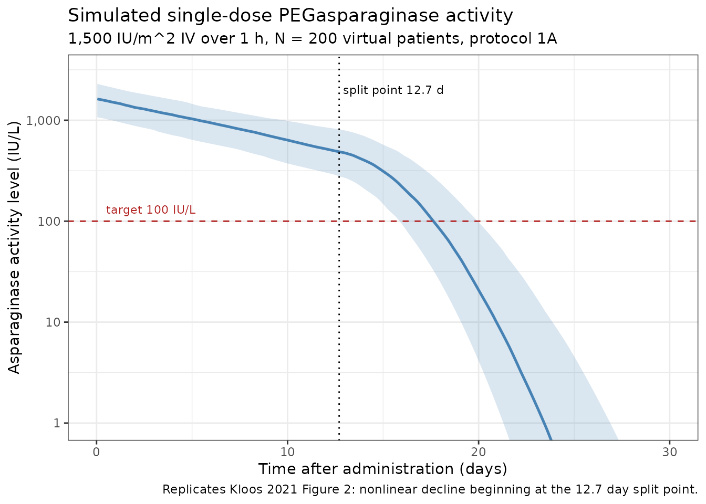
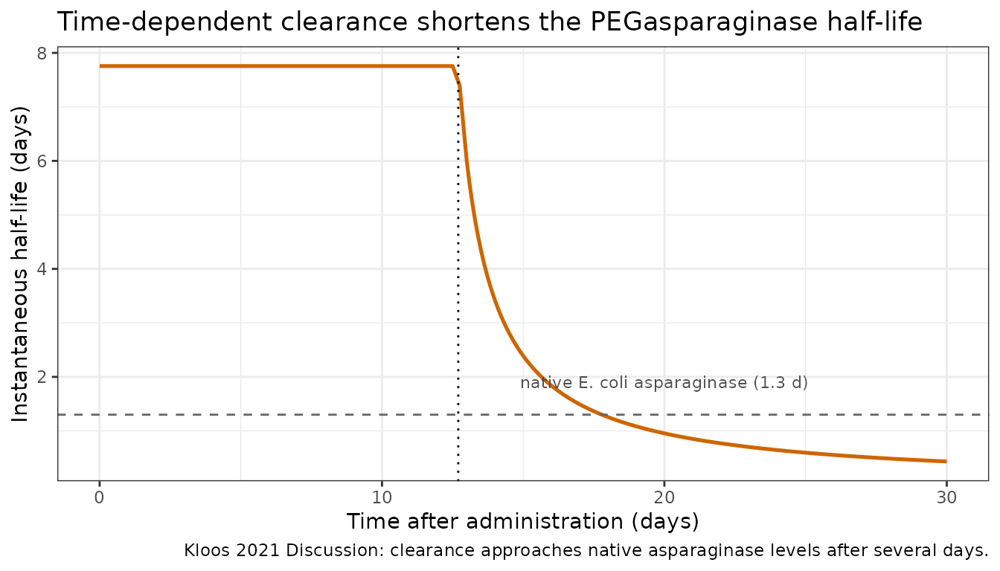
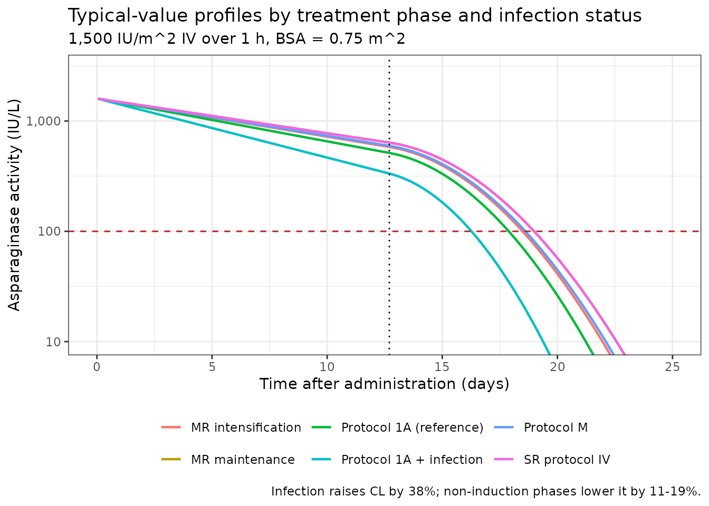

# PEGasparaginase (Kloos 2021)

``` r

library(nlmixr2lib)
library(rxode2)
#> rxode2 5.1.6 using 2 threads (see ?getRxThreads)
#>   no cache: create with `rxCreateCache()`
library(dplyr)
#> 
#> Attaching package: 'dplyr'
#> The following objects are masked from 'package:stats':
#> 
#>     filter, lag
#> The following objects are masked from 'package:base':
#> 
#>     intersect, setdiff, setequal, union
library(tidyr)
library(ggplot2)
library(PKNCA)
#> 
#> Attaching package: 'PKNCA'
#> The following object is masked from 'package:stats':
#> 
#>     filter
```

## PEGasparaginase population PK in pediatric ALL

Simulate intravenous PEGasparaginase (pegaspargase; Oncaspar)
asparaginase activity-time profiles in pediatric acute lymphoblastic
leukemia (ALL) patients using the final population PK model of Kloos et
al. (2021).

The structural model is a one-compartment linear disposition with IV
input (a 1 h infusion into the central compartment) and a **split-point
time-dependent clearance**: clearance is constant for the first 12.7
days after a dose and then rises linearly with time after dose, as the
polyethylene glycol moiety is hydrolyzed from the molecule and the
residual native E. coli asparaginase is cleared much faster. Both
clearance and volume of distribution are normalized to body surface area
(a linear proportionality, not an allometric power). Clearance is 38%
higher during an active infection and 11-19% lower outside induction.

- Article: <https://doi.org/10.3324/haematol.2019.242289>
- Erratum (corrected Table 5):
  <https://doi.org/10.3324/haematol.2023.283685>
- PubMed: <https://pubmed.ncbi.nlm.nih.gov/32327497/>

### Population

The model was developed on 92 index-dataset patients (816 asparaginase
activity samples) with newly diagnosed ALL treated per the Dutch
Childhood Oncology Group (DCOG) ALL-11 protocol at Sophia Children’s
Hospital - Erasmus MC between November 2014 and May 2017, supplemented
with trough samples from the Dutch national therapeutic-drug-monitoring
program. From Kloos 2021 Supplemental Table 2 and Table 1:

- Age median 4.8 years (IQR 3.3-8.2); protocol eligibility 1-18 years
- Weight median 19.2 kg (IQR 14.9-29.3)
- BSA median 0.76 m^2 (IQR 0.65-1.05)
- Sex: 51 male (55%) / 41 female (45%)
- Risk group: standard 13 (14%), medium 76 (83%), high 2 (2%), not
  stratified 1 (1%)
- 19 patients had at least one infection episode

A further 28 patients / 405 samples, obtained by randomly selecting 25%
of the total 120-patient population, formed an independent
external-validation dataset. Race / ethnicity is not reported. The same
metadata is available programmatically via
`readModelDb("Kloos_2021_pegasparaginase")$population`.

All patients received three fixed 1,500 IU/m^2 PEGasparaginase doses
biweekly during induction (protocols 1A and 1B, at days 12, 26 and 40 of
the protocol); subsequent doses were individualized by therapeutic drug
monitoring. Each dose was infused intravenously over 1 hour.
Asparaginase activity was measured by the L-aspartic beta-hydroxamate
(AHA) assay (LLQ 10 IU/L); values below the LLQ were excluded from the
analysis.

### Source trace

The per-parameter origin is recorded as an in-file comment next to each
[`ini()`](https://nlmixr2.github.io/rxode2/reference/ini.html) entry in
`inst/modeldb/specificDrugs/Kloos_2021_pegasparaginase.R`. The table
below collects the mapping in one place for reviewer audit.

| Element | Source location | Value / form |
|----|----|----|
| One-compartment IV model | Kloos 2021 Results, Structural model; Supplement, Supplemental Results | `d/dt(central) = -kel * central`; adding a second compartment did not improve the fit |
| CL typical (per m^2) | Kloos 2021 Table 2, Final model | 0.084 L/day/m^2 (RSE 4.4%; bootstrap 0.084, 95% CI 0.078-0.090) |
| Vd typical (per m^2) | Kloos 2021 Table 2, Final model | 0.94 L/m^2 (RSE 4.5%; bootstrap 0.94, 95% CI 0.87-1.01) |
| Time-dependent CL slope | Kloos 2021 Table 2, Final model (“Slope CL_ind”) | 0.082 L/day/m^2/day (RSE 20.5%; bootstrap 0.080, 95% CI 0.052-0.115) |
| Split point | Kloos 2021 Table 2, Final model | 12.7 days (RSE 0.2%; bootstrap 12.7, 95% CI 11.8-13.1) |
| BSA scaling of CL and Vd | Kloos 2021 Table 2 equations; Supplement, Supplemental Results | `CL = Theta1 * ... * BSA`; `Vd = Theta3 * e^(Theta4 * eta) * BSA` (linear, no exponent) |
| Infection effect on CL | Kloos 2021 Table 2, Final model | `1.38^DIS_INFECT_ACTIVE` (RSE 10.5%; bootstrap 95% CI 1.15-1.67) |
| Treatment phase 1A | Kloos 2021 Table 2, Final model | Reference (all `TRTPH_` indicators 0) |
| Treatment phase 1B | Kloos 2021 Table 2, Final model | `1 (fix)` – pooled with 1A; only two high-risk patients, not estimable |
| Treatment phase M | Kloos 2021 Table 2, Final model | `0.87^TRTPH_M` (RSE 5.2%; bootstrap 95% CI 0.80-0.95) |
| Treatment phase MR intensification | Kloos 2021 Table 2, Final model | `0.89^TRTPH_MR_INTENS` (RSE 5.2%; bootstrap 95% CI 0.82-0.98) |
| Treatment phase MR maintenance | Kloos 2021 Table 2, Final model | `0.81^TRTPH_MR_MAINT` (RSE 3.9%; bootstrap 95% CI 0.75-0.86) |
| Treatment phase SR protocol IV | Kloos 2021 Table 2, Final model | `0.81^TRTPH_SR_IV` (RSE 6.5%; bootstrap 95% CI 0.73-0.90) |
| CL-to-Vd shared eta scaling | Kloos 2021 Table 2 (“Fractional increase IIV-Vd”); Supplement equation for Vd | 1.26 (RSE 10.2%; bootstrap 1.28, 95% CI 0.98-1.51) |
| IIV on CL | Kloos 2021 Table 2, Final model | 19.7% CV -\> `omega^2 = log(1 + 0.197^2) = 0.038077` |
| IOV on CL | Kloos 2021 Table 2, Final model; Supplement, Supplemental Methods | 23.6% CV -\> `pi^2 = log(1 + 0.236^2) = 0.054197`; occasion = administration of a new dose |
| Residual error | Kloos 2021 Table 2, Final model; Supplement, Supplemental Results | Combined: proportional 17.0% + additive 20.2 IU/L |
| Published half-lives (structural model) | Kloos 2021 Results, Structural model | 8.5 days for the first 12.9 days; 4.1 days after 1 further day; 2.7 days after 2 |
| Native-asparaginase convergence | Kloos 2021 Discussion | CL rises to a value comparable to native E. coli asparaginase (half-life 1.3 days) “after several days” |
| Starting-dose guideline | Kloos 2021 Table 4 | Protocol 1A, target trough 100 IU/L: loading 800 IU/m^2, maintenance 600 IU/m^2 |
| Dose-adjustment nomogram | Kloos 2021 Table 5, **as corrected by the 2023 erratum** | See “Errata” below |

### Covariate column naming

| Source column | Canonical column used here | Notes |
|----|----|----|
| `BSA` | `BSA` (m^2) | Mosteller formula. Scales CL and Vd linearly (no exponent). |
| `INFECTION` | `DIS_INFECT_ACTIVE` (binary, time-varying) | New canonical registered in `inst/references/covariate-columns.md`. Kloos 2021 defines an infection as fever \>38 C plus hospital admission or prescription of antibiotics. |
| Treatment phase `1B` | `TRTPH_1B` (binary, time-varying) | New `TRTPH_<phase>` canonical family. Effect fixed to 1 (pooled with the 1A reference). |
| Treatment phase `M` | `TRTPH_M` | New `TRTPH_<phase>` canonical family. |
| Treatment phase `MRG intens.` | `TRTPH_MR_INTENS` | New `TRTPH_<phase>` canonical family. |
| Treatment phase `MRG maint.` | `TRTPH_MR_MAINT` | New `TRTPH_<phase>` canonical family. |
| Treatment phase `SRG protocol IV` | `TRTPH_SR_IV` | New `TRTPH_<phase>` canonical family. |
| occasion (= a new dose) | `OCC` (integer) | Existing canonical; decomposed to `oc1`/`oc2`/`oc3` inside [`model()`](https://nlmixr2.github.io/rxode2/reference/model.html). |

Protocol 1A (induction) is the reference phase and is encoded as all
`TRTPH_` indicators 0.

### The additive-slope reading (structural decision)

Kloos 2021 is internally inconsistent about whether the time-dependent
clearance slope is **additive** or **multiplicative**. This model
implements the additive form. Because that choice changes late-time
behaviour by a factor of 2-3, the evidence is laid out here before any
simulation, and the half-life check below is the validation that
discriminates the two readings.

The two readings, with the same reported numbers:

- **Additive** – `CL = Theta1 + Theta2 * (TAD - split)`, with
  `Theta2 = 0.082 L/day/m^2/day`
- **Multiplicative** – `CL = Theta1 * (1 + Theta2 * (TAD - split))`,
  with `Theta2` now in units of `1/day`

The printed equations in Table 2 and in the Online Supplementary
Appendix give the multiplicative form. Everything else in the paper
gives the additive form: the Table 2 row label states the parameter’s
units as `L/day/m^2/day` (absolute clearance per day, which is
meaningless in the multiplicative form), and the abstract, Results
(Structural model) and Results (Covariate analysis) all phrase it as
clearance “increasing by 0.082 L/day/m^2/day thereafter”.

The decisive evidence is that the paper publishes three half-lives for
its structural model, which only one reading reproduces.

``` r

# Kloos 2021 STRUCTURAL model (Table 2, "Structural model" column):
th1_struct <- 0.075   # L/day/m^2
th2_struct <- 0.079   # L/day/m^2/day
vd_struct  <- 0.92    # L/m^2

days_after_split <- c(0, 1, 2)

halflife_check <- tibble(
  `Days after split point` = days_after_split,
  `Published (Kloos 2021 Results)` = c(8.5, 4.1, 2.7),
  `Additive reading` =
    log(2) * vd_struct / (th1_struct + th2_struct * days_after_split),
  `Multiplicative reading` =
    log(2) * vd_struct / (th1_struct * (1 + th2_struct * days_after_split))
)

knitr::kable(
  halflife_check,
  digits  = 2,
  caption = paste(
    "PEGasparaginase half-life (days) under the two readings of the",
    "time-dependent-clearance slope, versus the values Kloos 2021 publishes",
    "for its own structural model (Results, Structural model)."
  )
)
```

| Days after split point | Published (Kloos 2021 Results) | Additive reading | Multiplicative reading |
|---:|---:|---:|---:|
| 0 | 8.5 | 8.50 | 8.50 |
| 1 | 4.1 | 4.14 | 7.88 |
| 2 | 2.7 | 2.74 | 7.34 |

PEGasparaginase half-life (days) under the two readings of the
time-dependent-clearance slope, versus the values Kloos 2021 publishes
for its own structural model (Results, Structural model). {.table
style="width:100%;"}

The additive reading reproduces all three published half-lives to two
significant figures; the multiplicative reading misses the second and
third by factors of 1.9 and 2.7. A second, independent check points the
same way: Kloos 2021’s Discussion states that clearance rises to a value
comparable to native E. coli asparaginase (half-life 1.3 days) “after
several days”.

``` r

# Final-model parameters (Table 2, "Final model" column).
th1 <- 0.084; th2 <- 0.082; vd <- 0.94
cl_native <- log(2) * vd / 1.3   # CL giving a 1.3 day half-life

tibble(
  Reading = c("Additive", "Multiplicative"),
  `Days after split point to reach a 1.3 day half-life` = c(
    (cl_native - th1) / th2,
    (cl_native / th1 - 1) / th2
  )
) |>
  knitr::kable(
    digits  = 1,
    caption = paste(
      "Time for clearance to reach native-E. coli-asparaginase level",
      "(half-life 1.3 days). Kloos 2021 Discussion says 'after several days'."
    )
  )
```

| Reading        | Days after split point to reach a 1.3 day half-life |
|:---------------|----------------------------------------------------:|
| Additive       |                                                 5.1 |
| Multiplicative |                                                60.6 |

Time for clearance to reach native-E. coli-asparaginase level (half-life
1.3 days). Kloos 2021 Discussion says ‘after several days’. {.table}

The additive reading gives ~5 days (“several days”); the multiplicative
reading gives ~61 days, well beyond the 30-day observation window of
Kloos 2021 Figure 2. This deviation from the two printed equations is
recorded again under “Assumptions and deviations” below.

### Virtual cohort

Kloos 2021 does not publish individual baseline covariates. The cohort
below reproduces the published BSA distribution (Supplemental Table 2:
median 0.76 m^2, IQR 0.65-1.05) with a log-normal whose median and IQR
match, and clips to the 0.52-2.3 m^2 range the authors used for their
own Monte Carlo simulations (Supplement, Supplemental Results,
Simulations).

``` r

set.seed(2021)
n_subj <- 200

# The published BSA distribution is right-skewed (median 0.76, IQR 0.65-1.05),
# more so than any log-normal with the same median can reproduce. Sampling
# from a piecewise-linear inverse CDF through the published quantiles, with
# tails running to the 0.52-2.3 m^2 range the authors used for their own Monte
# Carlo simulations, reproduces the published summary by construction.
bsa_p <- c(0,    0.25, 0.50, 0.75, 1.0)
bsa_q <- c(0.52, 0.65, 0.76, 1.05, 2.3)

pop <- tibble(
  id  = seq_len(n_subj),
  BSA = approx(bsa_p, bsa_q, xout = runif(n_subj))$y
)

tibble(
  Source = c("Kloos 2021 Supplemental Table 2", "Virtual cohort"),
  Median = c(0.76, median(pop$BSA)),
  `Q1`   = c(0.65, quantile(pop$BSA, 0.25)),
  `Q3`   = c(1.05, quantile(pop$BSA, 0.75))
) |>
  knitr::kable(digits = 2, caption = "Body surface area (m^2): published versus virtual cohort.")
```

| Source                          | Median |   Q1 |   Q3 |
|:--------------------------------|-------:|-----:|-----:|
| Kloos 2021 Supplemental Table 2 |   0.76 | 0.65 | 1.05 |
| Virtual cohort                  |   0.75 | 0.64 | 1.01 |

Body surface area (m^2): published versus virtual cohort. {.table}

### Event table

Doses are given in IU (1,500 IU/m^2 multiplied by each subject’s BSA)
and infused over 1 hour. The model’s time unit is **days**, so the
infusion duration is `1/24` day. Observation rows are placed on the
`central` compartment, the ODE state; `Cc` (the asparaginase activity
level) is returned as a column at those rows.

``` r

mod <- readModelDb("Kloos_2021_pegasparaginase")

# Build the random-effect covariance explicitly. rxSolve() reuses the omega of
# a previous solve in the same session unless one is supplied, which silently
# either strips IIV from a population run or injects it into a typical-value
# run. Values are the Kloos 2021 Table 2 final-model variances (see the model
# file): IIV CL 19.7% CV and IOV CL 23.6% CV, each as log(1 + CV^2).
eta_names <- c("etalcl", "etaiov_cl_1", "etaiov_cl_2", "etaiov_cl_3")
om <- diag(c(log(1 + 0.197^2), rep(log(1 + 0.236^2), 3)))
dimnames(om) <- list(eta_names, eta_names)

infusion_dur_d <- 1 / 24
dose_iu_per_m2 <- 1500

# Observation grid: dense early, then daily out to 30 days (matching the
# x-axis of Kloos 2021 Figure 2). A time-zero record is included so PKNCA
# does not extrapolate an AUC start before the first measurement.
obs_times <- sort(unique(c(
  0,
  seq(0,  1, by = 1 / 24),   # infusion and immediate post-infusion
  seq(1, 13, by = 0.25),     # constant-clearance window
  seq(13, 30, by = 0.1)      # induced-clearance window (rapid decline)
)))

# Protocol 1A induction, no infection: the model's reference condition.
covs_1a <- function(d) {
  d |>
    mutate(
      DIS_INFECT_ACTIVE = 0L,
      TRTPH_1B          = 0L,
      TRTPH_M           = 0L,
      TRTPH_MR_INTENS   = 0L,
      TRTPH_MR_MAINT    = 0L,
      TRTPH_SR_IV       = 0L,
      OCC               = 1L
    )
}

doses <- pop |>
  mutate(
    time = 0,
    amt  = dose_iu_per_m2 * BSA,      # IU
    dur  = infusion_dur_d,            # 1 h expressed in days
    evid = 1L,
    cmt  = "central"
  ) |>
  covs_1a() |>
  select(id, time, amt, dur, evid, cmt, BSA,
         DIS_INFECT_ACTIVE, starts_with("TRTPH_"), OCC)

obs <- tidyr::crossing(pop |> select(id, BSA), time = obs_times) |>
  mutate(
    amt  = NA_real_,
    dur  = NA_real_,
    evid = 0L,
    cmt  = "central"
  ) |>
  covs_1a() |>
  select(id, time, amt, dur, evid, cmt, BSA,
         DIS_INFECT_ACTIVE, starts_with("TRTPH_"), OCC)

events <- bind_rows(doses, obs) |>
  arrange(id, time, desc(evid)) |>
  as.data.frame()
```

``` r

# Pass omega explicitly: rxSolve() will otherwise reuse the omega of a
# previous solve in the same session.
sim <- rxode2::rxSolve(
  mod, events,
  omega      = om,
  keep       = c("BSA", "DIS_INFECT_ACTIVE", "OCC"),
  returnType = "data.frame"
)
#> ℹ parameter labels from comments will be replaced by 'label()'
#> Warning: some etas defaulted to non-mu referenced, possible parsing error: etaiov_cl_1, etaiov_cl_2, etaiov_cl_3
#> as a work-around try putting the mu-referenced expression on a simple line

# rxSolve occasionally returns fewer subjects than requested; assert.
stopifnot(
  dplyr::n_distinct(sim$id) == n_subj,
  !anyNA(sim$Cc)
)
```

### Replicating Kloos 2021 Figure 2

Figure 2 of Kloos 2021 plots asparaginase activity against time after
administration on a log scale, and its caption draws attention to the
fact that “the asparaginase activity levels nonlinearly decline after
12.7 days”. The split-point clearance model reproduces exactly that
break.

``` r

sim_summary <- sim |>
  filter(time > 0, Cc > 0) |>
  group_by(time) |>
  summarise(
    median = median(Cc),
    q05    = quantile(Cc, 0.05),
    q95    = quantile(Cc, 0.95),
    .groups = "drop"
  )

ggplot(sim_summary, aes(x = time)) +
  geom_ribbon(aes(ymin = q05, ymax = q95), alpha = 0.20, fill = "steelblue") +
  geom_line(aes(y = median), color = "steelblue", linewidth = 0.9) +
  geom_vline(xintercept = 12.7, linetype = "dotted") +
  geom_hline(yintercept = 100, linetype = "dashed", color = "firebrick") +
  annotate("text", x = 12.9, y = 2000, hjust = 0, size = 3,
           label = "split point 12.7 d") +
  annotate("text", x = 0.5, y = 130, hjust = 0, size = 3, color = "firebrick",
           label = "target 100 IU/L") +
  scale_y_log10(labels = scales::label_comma()) +
  coord_cartesian(xlim = c(0, 30), ylim = c(1, 3000)) +
  labs(
    x        = "Time after administration (days)",
    y        = "Asparaginase activity level (IU/L)",
    title    = "Simulated single-dose PEGasparaginase activity",
    subtitle = sprintf("1,500 IU/m^2 IV over 1 h, N = %d virtual patients, protocol 1A", n_subj),
    caption  = "Replicates Kloos 2021 Figure 2: nonlinear decline beginning at the 12.7 day split point."
  ) +
  theme_bw()
```



### Instantaneous half-life across the dosing interval

The shipped final model’s own instantaneous half-life,
`ln(2) * Vd / CL(t)`, is recovered directly from the solved `cl` and
`vc` columns. It is flat at 7.8 days until the split point and then
collapses.

``` r

# Use a typical-value solve (random effects zeroed) rather than the median of
# the population run: the half-life is a typical-value property, and a median
# over 200 subjects carries a couple of percent of Monte Carlo noise that would
# obscure the comparison against the closed form.
hl <- rxode2::rxSolve(
  rxode2::zeroRe(mod),
  filter(events, id == 1) |> mutate(BSA = median(pop$BSA)),
  omega = NA, returnType = "data.frame"
) |>
  mutate(thalf = log(2) * vc / cl) |>
  select(time, thalf)
#> ℹ parameter labels from comments will be replaced by 'label()'
#> Warning: some etas defaulted to non-mu referenced, possible parsing error: etaiov_cl_1, etaiov_cl_2, etaiov_cl_3
#> as a work-around try putting the mu-referenced expression on a simple line
#> Warning: some etas defaulted to non-mu referenced, possible parsing error: etaiov_cl_1, etaiov_cl_2, etaiov_cl_3
#> as a work-around try putting the mu-referenced expression on a simple line

ggplot(hl, aes(time, thalf)) +
  geom_line(color = "darkorange3", linewidth = 0.9) +
  geom_vline(xintercept = 12.7, linetype = "dotted") +
  geom_hline(yintercept = 1.3, linetype = "dashed", color = "grey40") +
  annotate("text", x = 20, y = 1.9, size = 3, color = "grey30",
           label = "native E. coli asparaginase (1.3 d)") +
  labs(
    x = "Time after administration (days)",
    y = "Instantaneous half-life (days)",
    title = "Time-dependent clearance shortens the PEGasparaginase half-life",
    caption = "Kloos 2021 Discussion: clearance approaches native asparaginase levels after several days."
  ) +
  theme_bw()
```



``` r

pick <- function(tt) hl$thalf[which.min(abs(hl$time - tt))]

tibble(
  `Time after dose (days)` = c(5, 12.5, 13.7, 14.7, 17.7),
  `Typical-value simulated half-life (days)` = vapply(
    c(5, 12.5, 13.7, 14.7, 17.7), pick, numeric(1)
  ),
  `Analytic ln(2) * Vd / CL (days)` = log(2) * 0.94 /
    (0.084 + 0.082 * pmax(0, c(5, 12.5, 13.7, 14.7, 17.7) - 12.7))
) |>
  knitr::kable(
    digits  = 2,
    caption = paste(
      "Final-model instantaneous half-life: typical-value simulation versus",
      "the closed-form value. Agreement confirms the model encodes the",
      "additive slope as intended."
    )
  )
```

| Time after dose (days) | Typical-value simulated half-life (days) | Analytic ln(2) \* Vd / CL (days) |
|---:|---:|---:|
| 5.0 | 7.76 | 7.76 |
| 12.5 | 7.76 | 7.76 |
| 13.7 | 3.93 | 3.93 |
| 14.7 | 2.63 | 2.63 |
| 17.7 | 1.32 | 1.32 |

Final-model instantaneous half-life: typical-value simulation versus the
closed-form value. Agreement confirms the model encodes the additive
slope as intended. {.table}

### Covariate effects on clearance

Typical-value profiles under each treatment phase and with / without an
active infection, for a patient with the cohort-median BSA. Random
effects are zeroed so the curves are the model’s typical values.

``` r

mod_tv <- rxode2::zeroRe(mod)
#> ℹ parameter labels from comments will be replaced by 'label()'
#> Warning: some etas defaulted to non-mu referenced, possible parsing error: etaiov_cl_1, etaiov_cl_2, etaiov_cl_3
#> as a work-around try putting the mu-referenced expression on a simple line
#> Warning: some etas defaulted to non-mu referenced, possible parsing error: etaiov_cl_1, etaiov_cl_2, etaiov_cl_3
#> as a work-around try putting the mu-referenced expression on a simple line

scenario_covs <- tribble(
  ~scenario,                      ~DIS_INFECT_ACTIVE, ~TRTPH_1B, ~TRTPH_M, ~TRTPH_MR_INTENS, ~TRTPH_MR_MAINT, ~TRTPH_SR_IV,
  "Protocol 1A (reference)",                      0L,        0L,       0L,               0L,              0L,           0L,
  "Protocol 1A + infection",                      1L,        0L,       0L,               0L,              0L,           0L,
  "Protocol M",                                   0L,        0L,       1L,               0L,              0L,           0L,
  "MR intensification",                           0L,        0L,       0L,               1L,              0L,           0L,
  "MR maintenance",                               0L,        0L,       0L,               0L,              1L,           0L,
  "SR protocol IV",                               0L,        0L,       0L,               0L,              0L,           1L
)

bsa_med <- median(pop$BSA)

tv_events <- scenario_covs |>
  mutate(id = row_number()) |>
  rowwise() |>
  do({
    row <- .
    d <- tibble(time = 0, amt = dose_iu_per_m2 * bsa_med,
                dur = infusion_dur_d, evid = 1L, cmt = "central")
    o <- tibble(time = obs_times, amt = NA_real_, dur = NA_real_,
                evid = 0L, cmt = "central")
    bind_rows(d, o) |>
      mutate(id = row$id, scenario = row$scenario, BSA = bsa_med,
             DIS_INFECT_ACTIVE = row$DIS_INFECT_ACTIVE,
             TRTPH_1B = row$TRTPH_1B, TRTPH_M = row$TRTPH_M,
             TRTPH_MR_INTENS = row$TRTPH_MR_INTENS,
             TRTPH_MR_MAINT = row$TRTPH_MR_MAINT,
             TRTPH_SR_IV = row$TRTPH_SR_IV, OCC = 1L)
  }) |>
  ungroup() |>
  arrange(id, time, desc(evid)) |>
  as.data.frame()

sim_tv <- rxode2::rxSolve(
  mod_tv, tv_events, omega = NA,
  keep = c("BSA", "DIS_INFECT_ACTIVE"), returnType = "data.frame"
) |>
  left_join(scenario_covs |> mutate(id = row_number()) |> select(id, scenario),
            by = "id")
#> Warning: multi-subject simulation without without 'omega'

ggplot(filter(sim_tv, time > 0, Cc > 0), aes(time, Cc, color = scenario)) +
  geom_line(linewidth = 0.8) +
  geom_vline(xintercept = 12.7, linetype = "dotted") +
  geom_hline(yintercept = 100, linetype = "dashed", color = "firebrick") +
  scale_y_log10(labels = scales::label_comma()) +
  coord_cartesian(xlim = c(0, 25), ylim = c(10, 3000)) +
  labs(
    x = "Time after administration (days)", y = "Asparaginase activity (IU/L)",
    color = NULL,
    title = "Typical-value profiles by treatment phase and infection status",
    subtitle = sprintf("1,500 IU/m^2 IV over 1 h, BSA = %.2f m^2", bsa_med),
    caption = "Infection raises CL by 38%; non-induction phases lower it by 11-19%."
  ) +
  theme_bw() +
  theme(legend.position = "bottom")
```



``` r

trough_at <- function(sc, tt = 14) {
  s <- filter(sim_tv, scenario == sc)
  s$Cc[which.min(abs(s$time - tt))]
}

scenario_covs |>
  transmute(
    Scenario = scenario,
    `CL multiplier (Kloos 2021 Table 2)` = c(1, 1.38, 0.87, 0.89, 0.81, 0.81),
    `Typical 14 day trough (IU/L)` = vapply(scenario, trough_at, numeric(1))
  ) |>
  knitr::kable(
    digits  = 2,
    caption = paste(
      "Typical-value 14 day (biweekly) trough asparaginase activity by",
      "treatment phase and infection status, after a 1,500 IU/m^2 dose."
    )
  )
```

| Scenario | CL multiplier (Kloos 2021 Table 2) | Typical 14 day trough (IU/L) |
|:---|---:|---:|
| Protocol 1A (reference) | 1.00 | 425.04 |
| Protocol 1A + infection | 1.38 | 257.10 |
| Protocol M | 0.87 | 504.80 |
| MR intensification | 0.89 | 491.62 |
| MR maintenance | 0.81 | 546.50 |
| SR protocol IV | 0.81 | 546.50 |

Typical-value 14 day (biweekly) trough asparaginase activity by
treatment phase and infection status, after a 1,500 IU/m^2 dose.
{.table}

Kloos 2021’s Clinical implications advise increasing the dose by 38%
during an infection, if clinically possible; the infection row above
shows the trough reduction that advice compensates for.

### PKNCA validation

Non-compartmental analysis of the single-dose simulation. Two intervals
are used, chosen to respect the split point:

- **0-12.7 days** – the constant-clearance window. Here the profile is a
  clean mono-exponential after the infusion ends, so the NCA terminal
  half-life must reproduce the closed-form `ln(2) * Vd / CL`. This is
  the strict check.
- **0-14 days** – the full biweekly dosing interval, giving `Cmax`,
  `Tmax`, `AUC` and the clinically relevant trough.

Subjects are grouped into BSA bands so per-group results can be
compared. The concentration frame is filtered only on `!is.na(Cc)` so
the time-zero record is retained.

``` r

pop_band <- pop |>
  mutate(
    bsa_band = case_when(
      BSA <  0.65             ~ "Low (<0.65 m^2)",
      BSA >= 0.65 & BSA < 1.05 ~ "Mid (0.65-1.05 m^2)",
      BSA >= 1.05             ~ "High (>=1.05 m^2)"
    ),
    bsa_band = factor(bsa_band, levels = c("Low (<0.65 m^2)",
                                           "Mid (0.65-1.05 m^2)",
                                           "High (>=1.05 m^2)"))
  )

nca_conc <- sim |>
  filter(!is.na(Cc)) |>
  left_join(select(pop_band, id, bsa_band), by = "id") |>
  transmute(id, time, Cc, treatment = bsa_band)

nca_dose <- doses |>
  left_join(select(pop_band, id, bsa_band), by = "id") |>
  transmute(id, time, amt, treatment = bsa_band)

conc_obj <- PKNCA::PKNCAconc(nca_conc, Cc ~ time | treatment + id,
                             concu = "IU/L", timeu = "day")
dose_obj <- PKNCA::PKNCAdose(nca_dose, amt ~ time | treatment + id,
                             doseu = "IU")

intervals <- data.frame(
  start     = c(0,    0),
  end       = c(12.7, 14),
  cmax      = c(TRUE, FALSE),
  tmax      = c(TRUE, FALSE),
  half.life = c(TRUE, FALSE),
  auclast   = c(FALSE, TRUE),
  ctrough   = c(FALSE, TRUE)
)

nca_res <- PKNCA::pk.nca(
  PKNCA::PKNCAdata(conc_obj, dose_obj, intervals = intervals)
)
```

``` r

keep_params <- c("cmax", "tmax", "half.life", "auclast", "ctrough")

nca_tab <- as.data.frame(nca_res) |>
  filter(PPTESTCD %in% keep_params) |>
  group_by(treatment, PPTESTCD) |>
  summarise(median = median(PPORRES, na.rm = TRUE), .groups = "drop")

nca_tab |>
  tidyr::pivot_wider(names_from = PPTESTCD, values_from = median) |>
  dplyr::rename(
    "BSA band"                 = treatment,
    "Cmax (IU/L)"              = cmax,
    "Tmax (days)"              = tmax,
    "t1/2, 0-12.7 d (days)"    = half.life,
    "AUC0-14d (IU*day/L)"      = auclast,
    "Trough at 14 d (IU/L)"    = ctrough
  ) |>
  knitr::kable(
    digits  = 2,
    caption = paste(
      "PKNCA summary (median per BSA band) after a single 1,500 IU/m^2",
      "PEGasparaginase infusion, protocol 1A, no infection."
    )
  )
```

| BSA band | AUC0-14d (IU\*day/L) | Cmax (IU/L) | Trough at 14 d (IU/L) | t1/2, 0-12.7 d (days) | Tmax (days) |
|:---|---:|---:|---:|---:|---:|
| Low (\<0.65 m^2) | 12015.44 | 1561.11 | 379.61 | 7.41 | 0.04 |
| Mid (0.65-1.05 m^2) | 12983.78 | 1657.95 | 401.87 | 7.49 | 0.04 |
| High (\>=1.05 m^2) | 13465.29 | 1700.44 | 446.78 | 7.84 | 0.04 |

PKNCA summary (median per BSA band) after a single 1,500 IU/m^2
PEGasparaginase infusion, protocol 1A, no infection. {.table}

#### Comparison against the model’s closed-form expectations

Kloos 2021 publishes no NCA table, so the reference values below are the
closed-form predictions of the published parameters. `Cmax` is
`dose / Vd = 1500 * BSA / (0.94 * BSA) = 1596 IU/L` (BSA cancels, so it
is the same in every band), and the terminal half-life over the
constant-CL window is `ln(2) * 0.94 / 0.084 = 7.76` days (also
BSA-independent). Agreement across BSA bands is itself a check that the
linear BSA normalization of both CL and Vd is encoded correctly.

``` r

published <- tidyr::crossing(
  treatment = levels(pop_band$bsa_band),
  tibble(
    PPTESTCD = c("cmax", "half.life"),
    PPORRES  = c(dose_iu_per_m2 / 0.94, log(2) * 0.94 / 0.084)
  )
)

cmp <- nlmixr2lib::ncaComparisonTable(
  simulated     = nca_res,
  reference     = published,
  by            = "treatment",
  units         = c(cmax = "IU/L", half.life = "day"),
  tolerance_pct = 20
)

knitr::kable(
  cmp,
  caption = paste(
    "Simulated NCA versus the closed-form prediction from the Kloos 2021",
    "final-model parameters. * marks rows differing by >20%."
  )
)
```

| NCA parameter | treatment           | Reference | Simulated | % diff |
|:--------------|:--------------------|:----------|:----------|:-------|
| Cmax (IU/L)   | High (\>=1.05 m^2)  | 1600      | 1700      | +6.6%  |
| Cmax (IU/L)   | Low (\<0.65 m^2)    | 1600      | 1560      | -2.2%  |
| Cmax (IU/L)   | Mid (0.65-1.05 m^2) | 1600      | 1660      | +3.9%  |
| t½ (day)      | High (\>=1.05 m^2)  | 7.76      | 7.84      | +1.1%  |
| t½ (day)      | Low (\<0.65 m^2)    | 7.76      | 7.41      | -4.5%  |
| t½ (day)      | Mid (0.65-1.05 m^2) | 7.76      | 7.49      | -3.5%  |

Simulated NCA versus the closed-form prediction from the Kloos 2021
final-model parameters. \* marks rows differing by \>20%. {.table}

### Kloos 2021 Table 4 starting-dose guideline

Table 4 recommends, for protocol 1A induction targeting a trough
asparaginase activity of 100 IU/L, a loading dose of 800 IU/m^2 followed
by a biweekly maintenance dose of 600 IU/m^2. The authors derived these
by Monte Carlo simulation of 2,000 virtual patients, choosing the dose
that gives adequate troughs in 95% of patients. The check below repeats
that logic on the virtual cohort.

``` r

make_events <- function(load_iu_m2, maint_iu_m2, n_maint = 3) {
  dose_days <- seq(0, by = 14, length.out = n_maint + 1)
  amt_m2    <- c(load_iu_m2, rep(maint_iu_m2, n_maint))

  d <- tidyr::crossing(pop, tibble(dose_idx = seq_along(dose_days))) |>
    mutate(
      time = dose_days[dose_idx],
      amt  = amt_m2[dose_idx] * BSA,
      dur  = infusion_dur_d,
      evid = 1L,
      cmt  = "central",
      OCC  = pmin(dose_idx, 3L)
    ) |>
    select(-dose_idx)

  # Trough = immediately before each subsequent dose, plus the final trough.
  o <- tidyr::crossing(pop, tibble(time = dose_days + 14 - 1e-4)) |>
    mutate(amt = NA_real_, dur = NA_real_, evid = 0L, cmt = "central",
           OCC = pmin(findInterval(time, dose_days), 3L))

  bind_rows(d, o) |>
    mutate(DIS_INFECT_ACTIVE = 0L, TRTPH_1B = 0L, TRTPH_M = 0L,
           TRTPH_MR_INTENS = 0L, TRTPH_MR_MAINT = 0L, TRTPH_SR_IV = 0L) |>
    arrange(id, time, desc(evid)) |>
    as.data.frame()
}

ev_t4  <- make_events(800, 600)
sim_t4 <- rxode2::rxSolve(mod, ev_t4, omega = om,
                          keep = "BSA", returnType = "data.frame")
stopifnot(dplyr::n_distinct(sim_t4$id) == n_subj)

troughs <- sim_t4 |>
  filter(!is.na(Cc)) |>
  mutate(dose_number = findInterval(time, seq(0, by = 14, length.out = 4)))

troughs |>
  group_by(dose_number) |>
  summarise(
    `Median trough (IU/L)`   = median(Cc),
    `5th percentile (IU/L)`  = quantile(Cc, 0.05),
    `% >= 100 IU/L`          = 100 * mean(Cc >= 100),
    .groups = "drop"
  ) |>
  dplyr::rename("Dose number" = dose_number) |>
  knitr::kable(
    digits  = 1,
    caption = paste(
      "Trough asparaginase activity 14 days after each dose under the",
      "Kloos 2021 Table 4 protocol-1A regimen (800 IU/m^2 loading,",
      "600 IU/m^2 biweekly maintenance), target trough 100 IU/L."
    )
  )
```

| Dose number | Median trough (IU/L) | 5th percentile (IU/L) | % \>= 100 IU/L |
|------------:|---------------------:|----------------------:|---------------:|
|           1 |                216.9 |                 125.2 |           97.5 |
|           2 |                221.8 |                 119.4 |           99.0 |
|           3 |                234.9 |                 119.1 |           97.5 |
|           4 |                238.7 |                 105.8 |           97.0 |

Trough asparaginase activity 14 days after each dose under the Kloos
2021 Table 4 protocol-1A regimen (800 IU/m^2 loading, 600 IU/m^2
biweekly maintenance), target trough 100 IU/L. {.table}

Kloos 2021 chose these doses so that at least 95% of patients achieve
the target; the simulated attainment above should be at or above that
level. The 5th percentile is the quantity the authors’ 95%-attainment
criterion constrains, so it is reported alongside the median.

### Errata

The 2023 erratum (Haematologica 108(9):2558,
[doi:10.3324/haematol.2023.283685](https://doi.org/10.3324/haematol.2023.283685))
corrects two typographical errors in the dose-adjustment nomogram of
Table 5 of the original article:

- Target trough 100-250 IU/L column: the second “Week level” range is
  **100-150 IU/L**, not 100-250 IU/L.
- Target trough 250-400 IU/L column: the third “Week level” range is
  **300-350 IU/L**, not 300-250 IU/L.

Table 5 is a clinical dose-adjustment nomogram, not a source of model
parameters, so neither correction changes any value in
[`ini()`](https://nlmixr2.github.io/rxode2/reference/ini.html). It is
recorded here, and in the model file’s `reference` field, because the
erratum is the task’s nominal lead document and because it demonstrates
that the paper’s tables are not error-free – which is directly relevant
to the additive-versus-multiplicative slope decision discussed above.

## Assumptions and deviations

- **The time-dependent-clearance slope is implemented as ADDITIVE,
  deviating from the two printed equations.** Kloos 2021 Table 2’s
  final-model footer and the Online Supplementary Appendix both print
  the multiplicative form `Cl_ind = 1 + Theta2 * (TAD - split point)`.
  This model implements `CL = Theta1 + Theta2 * (TAD - split point)`
  instead. The evidence is set out in full in “The additive-slope
  reading” above: the parameter’s stated units (`L/day/m^2/day`), three
  separate prose statements, the three published structural-model
  half-lives (reproduced exactly by the additive reading, missed by
  1.9-2.7x by the multiplicative one), and the “several days”
  convergence to native-asparaginase clearance (~5 days additive versus
  ~61 days multiplicative). Equivalently, the additive form is the
  supplement’s own equation with `Theta2` expressed relative to `Theta1`
  – i.e. treating the printed equation as missing a `/ Theta1`. This
  reading was ratified by the operator before drafting.
- **Individual baseline covariates are not published.** The virtual
  cohort’s BSA distribution is a log-normal matched to the published
  median and IQR and clipped to the 0.52-2.3 m^2 range used in the
  authors’ own simulations. Age, weight and sex are not model covariates
  and are not simulated.
- **Inter-occasion variability uses three occasions.** The supplement
  defines an occasion as “administration of a new dose” but does not fix
  a count. Three occasions are instantiated, matching the three fixed
  1,500 IU/m^2 induction doses of protocols 1A and 1B (Supplemental
  Table 1). Records with `OCC` outside 1-3 receive no IOV contribution,
  so longer individualized-dosing simulations should either extend the
  occasion set or accept IIV-only variability beyond the third dose.
- **Protocol 1B is encoded as `fixed(1)`, not dropped.** Kloos 2021
  could not estimate the 1B effect (only two high-risk patients) and
  fixed it to the 1A reference. Keeping the column preserves the
  provenance of that decision; numerically it is identical to omitting
  it.
- **The volume of distribution has no independent eta.** IIV on Vd was
  not estimable because it correlated completely with the CL-Vd
  correlation (Supplement, Supplemental Results). The CL eta is shared
  and scaled by 1.26 per the supplement’s
  `Vd = Theta3 * e^(Theta4 * eta) * BSA`. The main article’s Table 2
  prints this equation without the `BSA` term, which is dimensionally
  impossible for a parameter reported in L/m^2; the supplement settles
  it and is followed here.
- **Doxorubicin and methotrexate are not covariates.** Both were
  significant in the univariate analysis and were evaluated in the
  multivariate analysis on clinical grounds, but neither survived
  backward elimination (Kloos 2021 Results, Covariate analysis). They
  are documented in `covariatesDataExcluded` rather than
  `covariateData`, along with leukocytes, creatinine and
  anti-asparaginase antibodies.
- **Values below the assay LLQ (10 IU/L) were excluded by the authors.**
  The simulations here are not censored at the LLQ, so simulated
  late-time activity levels can fall below values the original analysis
  would have discarded.
- **Time after dose is evaluated inside the ODE, not as a model-block
  local.** rxode2 evaluates the standalone algebraic assignments of
  [`model()`](https://nlmixr2.github.io/rxode2/reference/model.html)
  once per output record and holds them constant across the integration
  interval, so a clearance built from a `tad()` local becomes a step
  function of the observation grid: for a single trough observation 14
  days after an 800 IU/m^2 dose that yields 50 IU/L, versus 227 IU/L on
  a dense grid. The model file therefore writes the time-after-dose term
  inline in the `d/dt(central)` right-hand side as `t - tlast()`, which
  rxode2 evaluates at every solver step, making the solution exact and
  independent of the output grid. The `cl`, `cl_ind` and `kel` solve
  columns are record-level reporting copies and do not feed the ODE.
  Users building their own event tables need no special grid density.
- **The paper reports no NCA parameters.** The PKNCA comparison table
  therefore uses closed-form predictions from the published parameter
  values as its reference, not published NCA results.

## Reference

Kloos RQH, Mathot R, Pieters R, van der Sluis IM. Individualized dosing
guidelines for PEGasparaginase and factors influencing the clearance: a
population pharmacokinetic model. *Haematologica*.
2021;106(5):1254-1261.
[doi:10.3324/haematol.2019.242289](https://doi.org/10.3324/haematol.2019.242289)

Erratum. *Haematologica*. 2023;108(9):2558.
[doi:10.3324/haematol.2023.283685](https://doi.org/10.3324/haematol.2023.283685)
