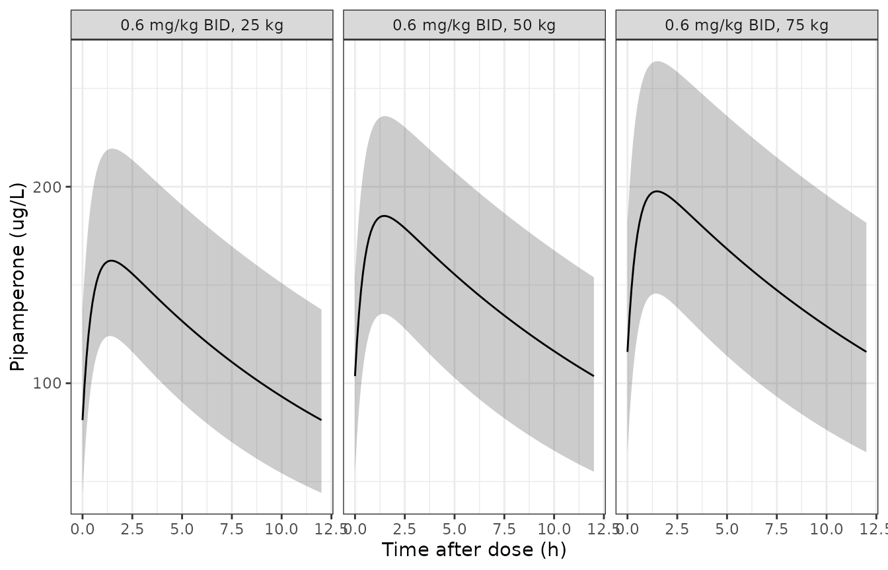

# Pipamperone (Kloosterboer 2020)

## Model and source

- Citation: Kloosterboer SM, Egberts KM, de Winter BCM, van Gelder T,
  Gerlach M, Hillegers MHJ, Dieleman GC, Bahmany S, Reichart CG, van
  Daalen E, Kouijzer MEJ, Dierckx B, Koch BCP (2020). Pipamperone
  population pharmacokinetics related to effectiveness and side effects
  in children and adolescents. Clin Pharmacokinet 59(11):1393-1405.
  <doi:10.1007/s40262-020-00894-y>
- Description: One-compartment population pharmacokinetic model for oral
  pipamperone in children and adolescents (5.6-17.7 years) with
  behavioural problems, pooled from a Dutch prospective observational
  trial and a German therapeutic-drug-monitoring service (Kloosterboer
  2020). First-order absorption with ka fixed at 2 /h; apparent
  clearance and apparent volume scale allometrically with body weight at
  fixed exponents 0.75 and 1 referenced to 70 kg. Inter-patient
  variability on CL/F only. Combined additive + proportional residual
  error with an extra additive error for samples quantified by HPLC-UV,
  and a linear conversion of the plasma prediction onto the
  dried-blood-spot scale for DBS samples.
- Article: <https://doi.org/10.1007/s40262-020-00894-y>
- PubMed Central:
  <https://www.ncbi.nlm.nih.gov/pmc/articles/PMC7658071/>
- Electronic Supplementary Material (external-validation goodness-of-fit
  and NPDE plots only; no control stream):
  <https://static-content.springer.com/esm/art%3A10.1007%2Fs40262-020-00894-y/MediaObjects/40262_2020_894_MOESM1_ESM.pdf>

## Population

Kloosterboer 2020 built the model from 70 pipamperone concentrations in
30 children and adolescents: 8 patients from a Dutch multicentre
observational trial in autism spectrum disorder with comorbid
behavioural problems (SPACe, NTR6050; six samples per patient at random
times on two days, by venepuncture and dried blood spot, analysed by
UHPLC-MS) and 22 patients from the therapeutic-drug-monitoring service
of the University Hospital Wuerzburg (morning trough samples at steady
state, analysed by HPLC-UV). Table 1 gives the model-building group as
70% male, median age 13.0 years (range 5.6-17.7), median body weight
50.4 kg (24.8-100.4), median BMI 20.4 kg/m^2, and a median daily dose of
45 mg (12-400 mg) as tablets or oral solution given once to five times
daily. Diagnoses were autism spectrum disorder (73.3%), ADHD (40%),
mental retardation (30%), schizophrenia-spectrum disorders (6.7%) and
conduct disorder (3.3%); 60% took another antipsychotic concomitantly. A
further 21 German TDM patients (33 concentrations) were used only for
external validation.

The same information is available programmatically:

``` r

str(rxode2::rxode(readModelDb("Kloosterboer_2020_pipamperone"))$population)
#> ℹ parameter labels from comments will be replaced by 'label()'
#> List of 11
#>  $ species       : chr "human"
#>  $ n_subjects    : num 30
#>  $ n_studies     : num 2
#>  $ n_observations: num 70
#>  $ age_range     : chr "5.6-17.7 years (median 13.0)"
#>  $ weight_range  : chr "24.8-100.4 kg (median 50.4)"
#>  $ sex_female_pct: num 30
#>  $ disease_state : chr "Children and adolescents treated with pipamperone for behavioural problems: autism spectrum disorder 73.3%, ADH"| __truncated__
#>  $ dose_range    : chr "Oral tablet or oral solution, 12-400 mg/day (median 45 mg/day), once to five times daily"
#>  $ regions       : chr "Netherlands (SPACe trial, n = 8) and Germany (Wuerzburg TDM service, n = 22)"
#>  $ notes         : chr "Model-building group of Kloosterboer 2020 Table 1. An external validation group of 21 German TDM patients (33 c"| __truncated__
```

## Source trace

| Model element | Value | Source location |
|----|----|----|
| Structure: one compartment, first-order absorption, no lag | – | Section 3.1.1 ‘best described using a one-compartment model’; Section 2.4.1 |
| `lka` (ka) | 2 /h, fixed | Table 2 ‘Ka’ = 2, footnote a ‘Fixed’; Section 2.4.1 ‘fixed at 2/h’ |
| `lcl` (CL/F) | 22.1 L/h per 70 kg | Table 2 ‘CL/F (L/h/70 kg)’ |
| `lvc` (V/F) | 416 L per 70 kg | Table 2 ‘V/F (L/70 kg)’ |
| `e_wt_cl` | 0.75, fixed | Table 2 footnote b; Section 3.1.2 ‘fixed exponents’ |
| `e_wt_vc` | 1, fixed | Table 2 footnote b |
| `etalcl` | 0.041153 (20.5% CV) | Table 2 ‘IPV CL’ = 20.5%; `log(1 + 0.205^2)` |
| `addSd` | 0.21 ug/L | Table 2 ‘Additional error’ |
| `propSd` | 0.39 | Table 2 ‘Proportional error’ |
| `addSd_hplc` | 26.6 ug/L | Table 2 ‘Additional error HPLC-UV’; Section 3.1.3 |
| `cal_slope_dbs` | 0.33 | Table 2 ‘DBS correction: y = ax + b’, a |
| `cal_int_dbs` | 3.90 ug/L | Table 2 ‘DBS correction: y = ax + b’, b |
| Allometric scaling `(WT/70)^0.75` on CL, `(WT/70)^1` on V | – | Section 2.4.1; Table 2 footnote b |
| DBS prediction `a * Cplasma + b` | – | Table 2 (see Assumptions for the Discussion’s form) |
| HPLC-UV extra additive error | – | Section 3.1.1 ‘combined error model with an extra additional error for HPLC-UV concentrations’ |

## Typical-value replication of Figure 4

Section 3.3 prints the population-predicted steady-state trough of a
twice-daily regimen for a 25, 50 and 75 kg patient, once for a fixed 30
mg dose (Figure 4a) and once for 0.6 mg/kg (Figure 4b: 15, 30 and 45
mg). These are typical values, so they are reproduced exactly with the
random effects zeroed.

``` r

mod <- readModelDb("Kloosterboer_2020_pipamperone")

regimens <- tibble::tribble(
  ~treatment,           ~WT, ~dose, ~ctrough_pub,
  "30 mg BID, 25 kg",    25,    30,  163.2,
  "30 mg BID, 50 kg",    50,    30,  103.9,
  "30 mg BID, 75 kg",    75,    30,   79.3,
  "0.6 mg/kg BID, 25 kg", 25,   15,   81.6,
  "0.6 mg/kg BID, 50 kg", 50,   30,  103.9,
  "0.6 mg/kg BID, 75 kg", 75,   45,  119.0
) |>
  dplyr::mutate(id = dplyr::row_number())

obs_times <- sort(unique(c(seq(0, 12, by = 0.1), 12)))

make_events <- function(reg) {
  dose_rows <- reg |>
    dplyr::transmute(
      id, treatment, WT,
      time = 0, amt = dose, evid = 1, cmt = "depot", ss = 1, ii = 12
    )
  obs_rows <- reg |>
    dplyr::select(id, treatment, WT) |>
    tidyr::crossing(time = obs_times) |>
    dplyr::mutate(amt = 0, evid = 0, cmt = "central", ss = 0, ii = 0)
  dplyr::bind_rows(dose_rows, obs_rows) |>
    dplyr::mutate(ASSAY_LCMSMS = 1, SAMPLE_DBS = 0) |>
    dplyr::arrange(id, time, dplyr::desc(evid)) |>
    as.data.frame()
}

ev_typ <- make_events(regimens)
sim_typ <- rxode2::rxSolve(rxode2::zeroRe(mod), events = ev_typ,
                           keep = c("treatment", "WT")) |>
  as.data.frame()
#> ℹ parameter labels from comments will be replaced by 'label()'
#> ℹ omega/sigma items treated as zero: 'etalcl'
#> Warning: multi-subject simulation without without 'omega'
```

``` r

sim_typ |>
  dplyr::mutate(
    panel = ifelse(grepl("^30 mg", treatment), "(a) 30 mg BID", "(b) 0.6 mg/kg BID"),
    weight = paste(WT, "kg")
  ) |>
  ggplot(aes(time, Cc, colour = weight)) +
  geom_line(linewidth = 0.8) +
  facet_wrap(~panel) +
  labs(x = "Time after dose (h)", y = "Pipamperone (ug/L)", colour = "Body weight") +
  theme_bw()
```


Replicates the population-prediction curves of Figure 4 of Kloosterboer
2020: steady-state twice-daily pipamperone, (a) fixed 30 mg, (b) 0.6
mg/kg.

The trough is also available in closed form for a one-compartment model
with first-order absorption at steady state, which checks the ODE
solution independently of rxode2:

``` r

ss_trough <- function(wt, dose, tau = 12) {
  cl <- 22.1 * (wt / 70)^0.75
  v <- 416 * (wt / 70)
  ka <- 2
  k <- cl / v
  1000 * dose * ka / (v * (ka - k)) *
    (exp(-k * tau) / (1 - exp(-k * tau)) - exp(-ka * tau) / (1 - exp(-ka * tau)))
}

trough_chk <- sim_typ |>
  dplyr::filter(time == 12) |>
  dplyr::select(id, treatment, Cc) |>
  dplyr::left_join(regimens, by = c("id", "treatment")) |>
  dplyr::mutate(
    closed_form = ss_trough(WT, dose),
    pct_vs_paper = 100 * (Cc - ctrough_pub) / ctrough_pub
  )

trough_chk |>
  dplyr::select(treatment, Cc, closed_form, ctrough_pub, pct_vs_paper) |>
  dplyr::rename(
    "Regimen" = treatment,
    "rxode2 trough (ug/L)" = Cc,
    "Closed-form trough (ug/L)" = closed_form,
    "Kloosterboer 2020 Section 3.3 (ug/L)" = ctrough_pub,
    "% difference vs paper" = pct_vs_paper
  ) |>
  knitr::kable(digits = 2)
```

| Regimen | rxode2 trough (ug/L) | Closed-form trough (ug/L) | Kloosterboer 2020 Section 3.3 (ug/L) | % difference vs paper |
|:---|---:|---:|---:|---:|
| 30 mg BID, 25 kg | 163.23 | 163.23 | 163.2 | 0.02 |
| 30 mg BID, 50 kg | 103.90 | 103.90 | 103.9 | 0.00 |
| 30 mg BID, 75 kg | 79.33 | 79.33 | 79.3 | 0.03 |
| 0.6 mg/kg BID, 25 kg | 81.61 | 81.61 | 81.6 | 0.02 |
| 0.6 mg/kg BID, 50 kg | 103.90 | 103.90 | 103.9 | 0.00 |
| 0.6 mg/kg BID, 75 kg | 118.99 | 118.99 | 119.0 | -0.01 |

``` r


stopifnot(
  # Same drawn (typical) parameters on both sides: pure numerical error.
  all(abs(trough_chk$Cc - trough_chk$closed_form) / trough_chk$closed_form < 1e-3),
  # The paper prints the troughs to one decimal place.
  all(abs(trough_chk$pct_vs_paper) < 0.1)
)
```

All six published troughs are reproduced to the printed precision, which
confirms CL/F, V/F, the fixed ka, the 70 kg reference and both
allometric exponents together. The typical half-life at 70 kg is 13 h,
matching the “mean elimination half-life (13 h)” of the Discussion.

## PKNCA on the typical-value profiles

``` r

conc_df <- sim_typ |>
  dplyr::filter(!is.na(Cc)) |>
  dplyr::select(id, time, Cc, treatment)

dose_df <- ev_typ |>
  dplyr::filter(evid == 1) |>
  dplyr::select(id, time, amt, treatment)

conc_obj <- PKNCA::PKNCAconc(conc_df, Cc ~ time | treatment + id,
                             concu = "ug/L", timeu = "h")
dose_obj <- PKNCA::PKNCAdose(dose_df, amt ~ time | treatment + id,
                             doseu = "mg")
intervals <- data.frame(start = 0, end = 12, cmax = TRUE, tmax = TRUE,
                        auclast = TRUE, ctrough = TRUE)
nca_res <- PKNCA::pk.nca(PKNCA::PKNCAdata(conc_obj, dose_obj,
                                          intervals = intervals))

simulated_long <- as.data.frame(nca_res$result) |>
  dplyr::select(id, treatment, PPTESTCD, PPORRES)

published <- regimens |>
  dplyr::select(treatment, ctrough = ctrough_pub)

nlmixr2lib::ncaComparisonTable(
  simulated = simulated_long,
  reference = published,
  by = "treatment",
  units = c(cmax = "ug/L", auclast = "ug*h/L", ctrough = "ug/L", tmax = "h"),
  tolerance_pct = 20
) |>
  dplyr::rename("Regimen" = treatment) |>
  knitr::kable(caption = "Typical-value steady-state NCA over one 12 h interval versus the Section 3.3 population-predicted troughs.")
```

| NCA parameter  | Regimen              | Reference | Simulated | % diff |
|:---------------|:---------------------|:----------|:----------|:-------|
| Ctrough (ug/L) | 30 mg BID, 25 kg     | 163       | 163       | +0.0%  |
| Ctrough (ug/L) | 30 mg BID, 50 kg     | 104       | 104       | +0.0%  |
| Ctrough (ug/L) | 30 mg BID, 75 kg     | 79.3      | 79.3      | +0.0%  |
| Ctrough (ug/L) | 0.6 mg/kg BID, 25 kg | 81.6      | 81.6      | +0.0%  |
| Ctrough (ug/L) | 0.6 mg/kg BID, 50 kg | 104       | 104       | +0.0%  |
| Ctrough (ug/L) | 0.6 mg/kg BID, 75 kg | 119       | 119       | -0.0%  |

Typical-value steady-state NCA over one 12 h interval versus the Section
3.3 population-predicted troughs. {.table}

Kloosterboer 2020 reports only the troughs for these regimens; Cmax,
Tmax and AUC are shown for completeness. The 70 kg steady-state AUC over
24 h for a 60 mg daily dose is 2715 ug*h/L, in the range of the median
predicted AUC24h of the responders (3448 ug*h/L) and non-responders
(1811 ug\*h/L) reported in Section 3.2.1 for the observed doses.

## Between-patient variability around the Figure 4 curves

Figure 4 shades a 95% interval from 1000 simulations around each curve.
The sketch below simulates 200 virtual patients per weight on the 0.6
mg/kg regimen with between-patient variability on CL/F only; the
residual error is not added, so these are individual predictions.

``` r

rxode2::rxSetSeed(20200511)
n_per <- 200
reg_iiv <- regimens |>
  dplyr::filter(grepl("^0.6", treatment)) |>
  dplyr::select(treatment, WT, dose) |>
  tidyr::uncount(n_per) |>
  dplyr::mutate(id = dplyr::row_number(), ctrough_pub = NA_real_)

sim_iiv <- rxode2::rxSolve(mod, events = make_events(reg_iiv),
                           keep = c("treatment", "WT")) |>
  as.data.frame()
#> ℹ parameter labels from comments will be replaced by 'label()'

sim_iiv |>
  dplyr::group_by(treatment, time) |>
  dplyr::summarise(
    q025 = quantile(Cc, 0.025), q50 = median(Cc), q975 = quantile(Cc, 0.975),
    .groups = "drop"
  ) |>
  ggplot(aes(time, q50)) +
  geom_ribbon(aes(ymin = q025, ymax = q975), alpha = 0.25) +
  geom_line() +
  facet_wrap(~treatment) +
  labs(x = "Time after dose (h)", y = "Pipamperone (ug/L)") +
  theme_bw()
```



``` r


iiv_trough <- sim_iiv |>
  dplyr::filter(time == 12) |>
  dplyr::group_by(treatment) |>
  dplyr::summarise(
    median = median(Cc), p2.5 = quantile(Cc, 0.025), p97.5 = quantile(Cc, 0.975),
    .groups = "drop"
  )
knitr::kable(iiv_trough, digits = 1)
```

| treatment            | median | p2.5 | p97.5 |
|:---------------------|-------:|-----:|------:|
| 0.6 mg/kg BID, 25 kg |   81.3 | 44.2 | 137.5 |
| 0.6 mg/kg BID, 50 kg |  103.6 | 54.9 | 153.9 |
| 0.6 mg/kg BID, 75 kg |  116.0 | 64.9 | 181.6 |

``` r


typ_06 <- trough_chk |> dplyr::filter(grepl("^0.6", treatment))
chk <- dplyr::left_join(iiv_trough, typ_06, by = "treatment")
stopifnot(
  # Centre only: the median of a 200-patient cohort sits near the typical value.
  all(abs(chk$median - chk$Cc) / chk$Cc < 0.1)
)
```

The published intervals for 0.6 mg/kg (33.6-134.5, 49.0-167.2 and
57.6-186.7 ug/L at 25, 50 and 75 kg) are of similar width to, but
somewhat wider and lower-reaching than, the between-patient spread of
CL/F alone produces here. The paper does not state which variability
components entered its 1000 simulations (residual error at 39%
proportional would widen them far more than observed; parameter
uncertainty would widen them modestly), so the intervals are shown for
orientation and are not used as a gate.

## Dried-blood-spot and HPLC-UV observations

A DBS observation row (`SAMPLE_DBS = 1`) returns the prediction on the
DBS scale, `0.33 * Cplasma + 3.90` ug/L. `ASSAY_LCMSMS = 0` (HPLC-UV)
changes only the residual error.

``` r

ev_dbs <- regimens |>
  dplyr::filter(treatment == "0.6 mg/kg BID, 50 kg") |>
  make_events() |>
  dplyr::filter(evid == 1 | time %in% c(2, 12))
ev_dbs2 <- ev_dbs |> dplyr::mutate(SAMPLE_DBS = ifelse(evid == 0, 1, 0))
cc_plasma <- rxode2::rxSolve(rxode2::zeroRe(mod), events = ev_dbs)$Cc
#> ℹ parameter labels from comments will be replaced by 'label()'
#> ℹ omega/sigma items treated as zero: 'etalcl'
cc_dbs <- rxode2::rxSolve(rxode2::zeroRe(mod), events = ev_dbs2)$Cc
#> ℹ parameter labels from comments will be replaced by 'label()'
#> ℹ omega/sigma items treated as zero: 'etalcl'
data.frame(time = c(2, 12), plasma = cc_plasma, dbs = cc_dbs) |>
  knitr::kable(digits = 2)
```

| time | plasma |   dbs |
|-----:|-------:|------:|
|    2 | 183.28 | 64.38 |
|   12 | 103.90 | 38.19 |

``` r

stopifnot(all(abs(cc_dbs - (0.33 * cc_plasma + 3.90)) < 1e-6))
```

## Assumptions and deviations

- **DBS conversion direction.** Table 2 prints the DBS correction as
  `y = ax + b` with a = 0.33 and b = 3.90 ug/L. The model reads this in
  the natural NONMEM form, `DBS prediction = a * plasma prediction + b`,
  which is the only reading of the table’s equation that is consistent
  with the recovery of pipamperone in DBS being well below 100% (the
  earlier clinical validation divided DBS values by 0.158). The
  Discussion instead writes the conversion to plasma as
  `DBS/0.33 + 3.90`, which is equivalent to
  `DBS = 0.33 * (plasma - 3.90)`. The two readings share the slope and
  differ only in the intercept on the DBS scale (+3.90 versus -1.29
  ug/L); the printed table equation is used. This affects DBS-scale
  predictions only, never the plasma model.
- **HPLC-UV residual error.** The paper describes “an extra additional
  error for HPLC-UV concentrations” without printing the error equation.
  It is added in variance to the common additive error,
  `sqrt(0.21^2 + 26.6^2)`; adding the standard deviations instead would
  give 26.81 rather than 26.60 ug/L, a difference of under 1%.
- **Residual-error form.** The combined error is encoded as nlmixr2’s
  default (variances of the additive and proportional parts summed).
  Table 2 prints both residual terms as standard deviations.
- **IPV on CL/F.** The printed 20.5% is taken as a coefficient of
  variation of a log-normal random effect, `omega^2 = log(1 + 0.205^2)`.
- **ka unit.** Table 2 labels ka as ‘L/h’; the Methods give it as ‘2/h’,
  and 1/h is used.
- **Assay coding.** The Dutch plasma and DBS methods are UHPLC-MS; they
  are coded `ASSAY_LCMSMS = 1`, and the German HPLC-UV method
  `ASSAY_LCMSMS = 0`.
- **Figure 4 intervals.** The 95% intervals of Figure 4 are not
  reproduced (see above); only the typical-value curves and troughs are.
