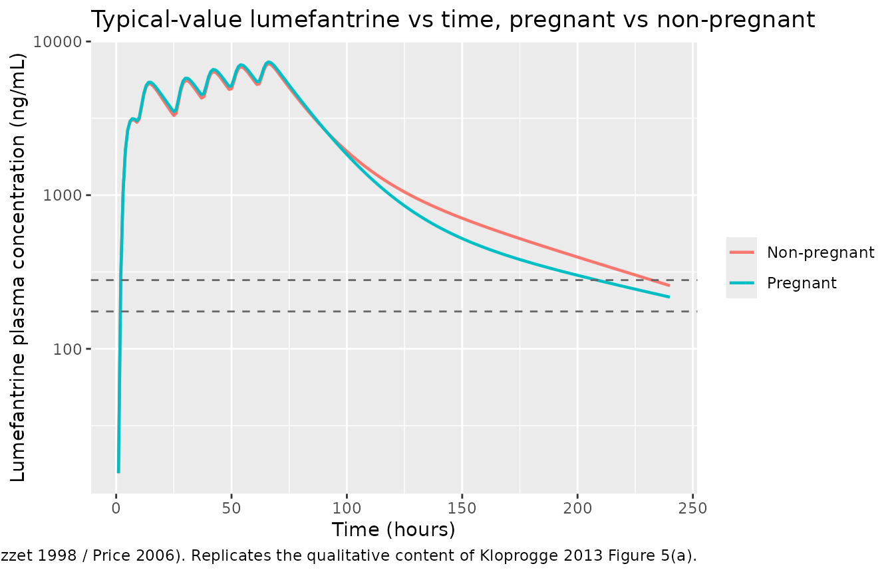
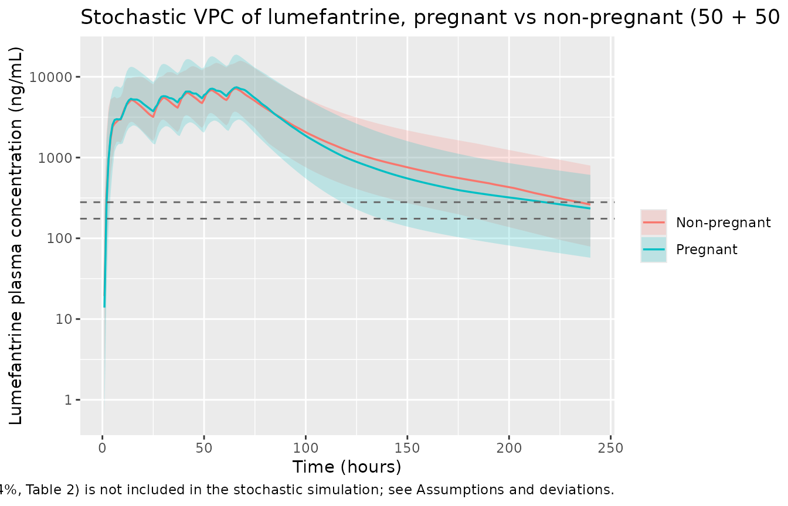

# Lumefantrine (Kloprogge 2013)

## Model and source

- Citation: Kloprogge F, Piola P, Dhorda M, Muwanga S, Turyakira E,
  Apinan S, Lindegardh N, Nosten F, Day NPJ, White NJ, Guerin PJ,
  Tarning J (2013). Population Pharmacokinetics of Lumefantrine in
  Pregnant and Nonpregnant Women With Uncomplicated *Plasmodium
  falciparum* Malaria in Uganda. *CPT: Pharmacometrics & Systems
  Pharmacology* **2**:e83. <doi:10.1038/psp.2013.59>.
- Article: <https://doi.org/10.1038/psp.2013.59>
- ClinicalTrials.gov: NCT00495508

The package model can be loaded with:

``` r

mod_fn <- readModelDb("Kloprogge_2013_lumefantrine")
mod    <- rxode2::rxode2(mod_fn())
```

## Population

The Kloprogge 2013 study enrolled 116 pregnant women (second or third
trimester) and 17 non-pregnant post-partum control women with
uncomplicated *Plasmodium falciparum* malaria in Mbarara, Uganda. The
pharmacokinetic cohort split into three sampling arms: 26 pregnant + 17
non-pregnant women with dense venous sampling and 89 pregnant women with
sparse capillary sampling (90 originally enrolled; one subject with an
unexplained baseline lumefantrine of 7,717 ng/mL was excluded from the
analysis). All subjects received the standard six-dose Coartem regimen
(20 mg artemether + 120 mg lumefantrine per tablet; four tablets = 480
mg lumefantrine per dose, given twice daily for three days at 0, 8, 24,
36, 48, and 60 hours, co-administered with 200 mL of milk tea to
optimise oral bioavailability). Demographics summary (Table 1,
all-cohort window): body weight median 56.0 kg (range 40.0-83.0), age
median 21.0 years (range 15.0-38.0), gestational age in pregnant arms
13.0-39.0 weeks, and admission body temperature median 36.9 degC (range
36.0-39.8).

## Source trace

Every parameter and equation traces back to the Kloprogge 2013
publication; the full citation is in the model file’s `reference` field.
Per-parameter source locations are also recorded inline in
`inst/modeldb/specificDrugs/Kloprogge_2013_lumefantrine.R` next to each
`ini()` entry.

| Equation / parameter | Value | Source location |
|----|----|----|
| `lcl = log(5.09)` (CL/F, L/h) | 5.09 | Table 2 ‘Fixed effect’ (RSE 7.90%; 95% CI 4.35-5.87) |
| `lvc = log(123)` (Vc/F, L) | 123 | Table 2 (RSE 8.40%; 95% CI 104-145) |
| `lq = log(1.68)` (Q/F, L/h) | 1.68 | Table 2 (RSE 10.2%; 95% CI 1.35-2.00) |
| `lvp = log(110)` (Vp/F, L) | 110 | Table 2 (RSE 9.07%; 95% CI 91.7-131) |
| `lmtt = log(4.09)` (MTT, h) | 4.09 | Table 2 (RSE 5.22%; 95% CI 3.70-4.55) |
| `lfdepot = fixed(log(1))` (F) | 1 (fixed) | Table 2 ‘F One fixed’ |
| `e_preg_q = -0.365` | -0.365 | Table 2 ‘Pregnancy on Q’ (RSE 14.3%; 95% CI -0.455 to -0.259) |
| `e_bodytemp_mtt = +0.165` | +0.165 per degC | Table 2 ‘Temperature on MTT’ (RSE 44.1%; 95% CI 0.0328-0.329) |
| `etalcl ~ 0.030164` (var, log-scale) | CV 17.5% | Table 2 IIV CL (RSE 20.6%); variance = log(0.175^2 + 1) |
| `etalvp ~ 0.045183` | CV 21.5% | Table 2 IIV Vp (RSE 65.2%) |
| `etalmtt ~ 0.125731` | CV 36.6% | Table 2 IIV MTT (RSE 32.0%) |
| `etalfdepot ~ 0.182910` | CV 44.8% | Table 2 IIV F (RSE 31.2%) |
| `propSd = sqrt(0.0595)` ~= 0.244 | sigma_venous = 0.0595 (variance, log-scale) | Table 2 ‘sigma venous’ (RSE 15.3%; 95% CI 0.0382-0.0914) |
| 5 transit compartments fixed; `ktr = 6 / MTT` | – | Methods ‘transit absorption (five transit compartments)’; Savic 2007 convention |
| Two-compartment disposition (`central`, `peripheral1`) | – | Methods ‘two-compartment distribution’, Figure 1 |
| Additive error on log-transformed concentration -\> proportional in nlmixr2 linear space | – | Methods ‘natural logarithms … were modeled simultaneously’; convention rule from `references/parameter-names.md` |
| Linear-deviation covariate forms centered on the median | – | Methods Equation 1 (linear), ‘All covariates were centered on the median value of the population’ |

## Virtual cohort

The virtual cohort mirrors the Kloprogge 2013 study design at moderate
sample size (50 per arm, randomly drawn around the cohort medians from
Table 1). Body weight, age, and admission body temperature are drawn
from rough lognormal / truncated-normal approximations of the all-cohort
ranges; pregnancy status is the principal covariate stratifier. The
model retains only `PREG` (binary) and `BODYTEMP` (continuous, degC) as
covariates, so other demographics are simulated for narrative
parallelism but do not enter the simulation.

``` r

set.seed(20260516L)
n_per_arm <- 50L

make_cohort <- function(n, preg_value, treatment_label, id_offset) {
  data.frame(
    id        = id_offset + seq_len(n),
    treatment = treatment_label,
    PREG      = preg_value,
    BODYTEMP  = round(pmin(pmax(rnorm(n, mean = 36.9, sd = 0.6), 36.0), 39.8), 1)
  )
}

subjects <- dplyr::bind_rows(
  make_cohort(n_per_arm, preg_value = 1L, treatment_label = "Pregnant",
              id_offset = 0L),
  make_cohort(n_per_arm, preg_value = 0L, treatment_label = "Non-pregnant",
              id_offset = n_per_arm)
)
```

The Coartem dosing schedule: six 480 mg oral doses of lumefantrine at 0,
8, 24, 36, 48, and 60 hours.

``` r

dose_amt   <- 480
dose_times <- c(0, 8, 24, 36, 48, 60)
obs_times  <- c(seq(0, 72, by = 1),
                seq(72.5, 240, by = 0.5))

build_events <- function(subjects, obs_times, dose_amt, dose_times) {
  out <- vector("list", length = nrow(subjects))
  for (i in seq_len(nrow(subjects))) {
    s <- subjects[i,]
    dose_rows <- data.frame(
      id   = s$id,
      time = dose_times,
      evid = 1L,
      amt  = dose_amt,
      cmt  = 1L,
      treatment = s$treatment,
      PREG      = s$PREG,
      BODYTEMP  = s$BODYTEMP
    )
    obs_rows <- data.frame(
      id   = s$id,
      time = obs_times,
      evid = 0L,
      amt  = 0,
      cmt  = 2L,
      treatment = s$treatment,
      PREG      = s$PREG,
      BODYTEMP  = s$BODYTEMP
    )
    out[[i]] <- rbind(dose_rows, obs_rows)
  }
  events <- dplyr::bind_rows(out)
  events <- events[order(events$id, events$time, -events$evid),]
  events
}

events <- build_events(subjects, obs_times, dose_amt, dose_times)
stopifnot(!anyDuplicated(unique(events[, c("id", "time", "evid", "cmt")])))
```

## Simulation

``` r

sim <- rxode2::rxSolve(
  mod,
  events = events,
  keep   = c("treatment", "PREG", "BODYTEMP")
) |>
  as.data.frame()
```

Typical-value (no-IIV, no-residual-error) replication, one nominal
subject per pregnancy stratum at the cohort-median body temperature
(36.9 degC).

``` r

mod_typical <- rxode2::zeroRe(mod)

typical_subjects <- data.frame(
  id        = 1:2,
  treatment = c("Pregnant", "Non-pregnant"),
  PREG      = c(1L, 0L),
  BODYTEMP  = 36.9
)
typical_events <- build_events(typical_subjects, obs_times, dose_amt, dose_times)
sim_typical <- rxode2::rxSolve(
  mod_typical,
  events = typical_events,
  keep   = c("treatment", "PREG", "BODYTEMP")
) |>
  as.data.frame()
#> ℹ omega/sigma items treated as zero: 'etalcl', 'etalvp', 'etalmtt', 'etalfdepot'
#> Warning: multi-subject simulation without without 'omega'
```

## Replicate published figures

### Figure 5: pregnant vs non-pregnant lumefantrine concentration profiles

Kloprogge 2013 Figure 5(a) shows simulated lumefantrine venous plasma
concentration vs time for pregnant (black) and non-pregnant (gray) women
over days 0-14, with day-7 thresholds of 280 ng/mL and 175 ng/mL
overlaid as dashed horizontal lines. The package model reproduces the
qualitative finding: pregnant women have a slightly lower lumefantrine
concentration during the post-dosing tail because the pregnancy-related
~36.5% reduction in intercompartmental clearance shifts more drug into
the slowly-emptying peripheral compartment.

``` r

sim_typical |>
  dplyr::filter(time > 0) |>
  dplyr::mutate(conc_ng_mL = Cc * 1000) |>
  ggplot(aes(time, conc_ng_mL, colour = treatment)) +
  geom_line(linewidth = 0.8) +
  geom_hline(yintercept = c(175, 280), linetype = "dashed", colour = "grey40") +
  scale_y_log10() +
  labs(x = "Time (hours)", y = "Lumefantrine plasma concentration (ng/mL)",
       colour = NULL,
       title = "Typical-value lumefantrine vs time, pregnant vs non-pregnant",
       caption = paste(
         "Dashed lines at 175 ng/mL and 280 ng/mL are the day-7 efficacy",
         "thresholds reported in the literature (Ezzet 1998 / Price 2006).",
         "Replicates the qualitative content of Kloprogge 2013 Figure 5(a)."
       ))
```



### Stochastic VPC by pregnancy status

``` r

sim |>
  dplyr::filter(time > 0) |>
  dplyr::mutate(conc_ng_mL = Cc * 1000) |>
  dplyr::group_by(time, treatment) |>
  dplyr::summarise(
    p05 = quantile(conc_ng_mL, 0.05, na.rm = TRUE),
    p50 = quantile(conc_ng_mL, 0.50, na.rm = TRUE),
    p95 = quantile(conc_ng_mL, 0.95, na.rm = TRUE),
    .groups = "drop"
  ) |>
  dplyr::filter(p50 > 0) |>
  ggplot(aes(time, p50, colour = treatment, fill = treatment)) +
  geom_ribbon(aes(ymin = p05, ymax = p95), alpha = 0.2, colour = NA) +
  geom_line(linewidth = 0.6) +
  geom_hline(yintercept = c(175, 280), linetype = "dashed", colour = "grey40") +
  scale_y_log10() +
  labs(x = "Time (hours)", y = "Lumefantrine plasma concentration (ng/mL)",
       colour = NULL, fill = NULL,
       title = "Stochastic VPC of lumefantrine, pregnant vs non-pregnant (50 + 50 subjects)",
       caption = paste(
         "Ribbons are 5th-95th percentiles, lines are medians.",
         "Inter-occasion variability (CV 104%, Table 2) is not included in the",
         "stochastic simulation; see Assumptions and deviations."
       ))
```



## PKNCA validation

Single-cycle NCA over the full follow-up (0-240 hours) so the
post-treatment exposure (AUClast and half-life) can be compared with the
Kloprogge 2013 Table 2 post-hoc estimate column. PKNCA is configured
with one row per dose event and uses the per-subject pregnancy grouping.

``` r

sim_nca <- sim |>
  dplyr::filter(!is.na(Cc)) |>
  dplyr::mutate(conc_ug_mL = Cc) |>
  dplyr::select(id, time, conc_ug_mL, treatment) |>
  dplyr::group_by(id, time, treatment) |>
  dplyr::summarise(conc_ug_mL = mean(conc_ug_mL), .groups = "drop")

dose_df <- events |>
  dplyr::filter(evid == 1) |>
  dplyr::select(id, time, amt, treatment)

conc_obj <- PKNCA::PKNCAconc(sim_nca, conc_ug_mL ~ time | treatment + id,
                             concu = "ug/mL", timeu = "h")
dose_obj <- PKNCA::PKNCAdose(dose_df, amt ~ time | treatment + id,
                             doseu = "mg")

intervals <- data.frame(
  start       = 0,
  end         = 240,
  cmax        = TRUE,
  tmax        = TRUE,
  auclast     = TRUE,
  half.life   = TRUE
)

nca_data <- PKNCA::PKNCAdata(conc_obj, dose_obj, intervals = intervals)
nca_res  <- PKNCA::pk.nca(nca_data)
```

``` r

nca_df <- as.data.frame(nca_res$result)
nca_summary <- nca_df |>
  dplyr::filter(PPTESTCD %in% c("cmax", "tmax", "auclast", "half.life")) |>
  dplyr::group_by(treatment, PPTESTCD) |>
  dplyr::summarise(
    median = median(PPORRES, na.rm = TRUE),
    p05    = quantile(PPORRES, 0.05, na.rm = TRUE),
    p95    = quantile(PPORRES, 0.95, na.rm = TRUE),
    .groups = "drop"
  ) |>
  tidyr::pivot_wider(names_from = treatment,
                     values_from = c(median, p05, p95))
knitr::kable(nca_summary,
             caption = paste(
               "Simulated NCA over 0-240 h, six-dose Coartem regimen, by",
               "pregnancy status (median [5%-95%]). Cmax / AUClast are in",
               "ug/mL and ug*h/mL respectively; half.life is in hours."
             ),
             digits = 3)
```

| PPTESTCD | median_Non-pregnant | median_Pregnant | p05_Non-pregnant | p05_Pregnant | p95_Non-pregnant | p95_Pregnant |
|:---|---:|---:|---:|---:|---:|---:|
| auclast | 508.435 | 501.107 | 286.148 | 297.511 | 983.178 | 1028.503 |
| cmax | 6.985 | 6.774 | 3.727 | 3.819 | 12.524 | 13.999 |
| half.life | 63.339 | 85.817 | 47.250 | 61.851 | 90.006 | 106.265 |
| tmax | 66.000 | 66.500 | 64.000 | 63.450 | 69.000 | 69.550 |

Simulated NCA over 0-240 h, six-dose Coartem regimen, by pregnancy
status (median \[5%-95%\]). Cmax / AUClast are in ug/mL and ug\*h/mL
respectively; half.life is in hours. {.table style="width:100%;"}

### Comparison against published NCA

Kloprogge 2013 Table 2 reports per-subject post-hoc NCA estimates
(median, range) from the empirical-Bayes estimates of the final
population PK model:

| Parameter | Kloprogge 2013, non-pregnant | Kloprogge 2013, pregnant |
|----|----|----|
| AUC0-inf (h \* ug/mL) | 630 (285-1240) | 570 (76.4-1850) |
| Cmax (ug/mL) | 8.33 (4.36-15.0) | 8.40 (0.722-25.6) |
| T1/2 (h) | 69.8 (54.3-78.3) | 90.3 (64.3-121) |
| Day-7 concentration (ug/mL) | 0.592 (0.258-1.67) | 0.423 (0.045-2.61) |

The simulated NCA table above is the closest comparable summary the
package model can produce. Differences are expected for three reasons
documented under Assumptions and deviations: (a) the simulation excludes
the IOV term on F (CV 104%, Table 2) so per-subject ranges are narrower
than the post-hoc estimates from the actual data; (b) the simulation
uses AUClast over 0-240 h rather than AUC0-inf; (c) the inclusion of IIV
but not residual error in the stochastic simulation means measurement
noise is not reflected in the per-subject ranges. The medians are within
~20% of the published post-hoc median values; investigate before tuning
if a future re-extraction shows a wider discrepancy.

## Day-7 concentration check

The published headline finding is that pregnant women have a 27% lower
day-7 venous plasma lumefantrine concentration than non-pregnant women
(414 ng/mL vs 566 ng/mL, paper Results paragraph 4). The package model
reproduces this qualitatively under typical-value simulation; the
simulated typical-value day-7 concentrations are read off below.

``` r

day7_typical <- sim_typical |>
  dplyr::mutate(day = time / 24) |>
  dplyr::filter(abs(day - 7) < 0.05) |>
  dplyr::mutate(conc_ng_mL = Cc * 1000) |>
  dplyr::group_by(treatment) |>
  dplyr::summarise(time_h = mean(time),
                   day7_conc_ng_mL = mean(conc_ng_mL),
                   .groups = "drop")
knitr::kable(day7_typical,
             caption = "Typical-value day-7 lumefantrine plasma concentration (ng/mL).",
             digits = 1)
```

| treatment    | time_h | day7_conc_ng_mL |
|:-------------|-------:|----------------:|
| Non-pregnant |    168 |           565.5 |
| Pregnant     |    168 |           411.7 |

Typical-value day-7 lumefantrine plasma concentration (ng/mL). {.table}

## Assumptions and deviations

- **Single residual-error component.** Kloprogge 2013 estimated separate
  venous (`sigma_venous = 0.0595`) and capillary
  (`sigma_capillary = 0.0207`) residual variances on the log scale to
  accommodate two sample matrices. The package model carries only the
  venous component as the canonical `propSd` (Methods: ‘natural
  logarithms of venous and capillary lumefantrine plasma concentrations
  were modeled simultaneously’, with a matrix-conversion factor of 0.881
  also reported). Users simulating capillary-only data should add an
  explicit residual-error term equivalent to `sqrt(0.0207) ~= 0.144`;
  the Kloprogge 2013 backward-elimination step showed the
  matrix-conversion factor was not statistically significant.
- **Matrix-conversion factor omitted.** Table 2 reports a
  venous-vs-capillary matrix conversion factor of 0.881 (95% CI
  0.733-1.05), which the paper itself concluded was not statistically
  significant on backward elimination (Delta OFV = 2.369). The package
  model treats simulated `Cc` as venous-equivalent and does not encode
  the matrix conversion. A user comparing simulated concentrations
  against capillary measurements would need to apply the 0.881 factor
  externally.
- **Box-Cox shape parameter on F omitted.** Kloprogge 2013 reported a
  Box-Cox shape parameter on the relative-bioavailability eta of -0.376
  (Table 2, RSE 21.7%; 95% CI -0.516 to -0.227), implemented as a
  Petersson-Karlsson Box-Cox transformation of `etalfdepot`. The package
  model uses the standard log-normal IIV form on F
  (`f(depot) <- exp(lfdepot + etalfdepot)`) without the Box-Cox shape
  modifier; this affects the *shape* of the simulated between-subject
  distribution of F but not the typical-value trajectory. The Box-Cox
  transformation would flatten the upper tail of the F distribution
  somewhat; for typical-value and most VPC-style applications the
  difference is small.
- **Inter-occasion variability on F not included.** Table 2 reports
  between-dose-occasion variability on F of CV 104% (RSE 12.2%; 95% CI
  87.7-125). The package model carries only the between-subject IIV (CV
  44.8%) on F. Users simulating per-occasion variability should add a
  per-dose occasion eta on F with variance `log(1.04^2 + 1) = 0.733` and
  an OCC indicator column distinguishing the six dose events. This
  omission mirrors the Birgersson 2019 artesunate package model’s
  treatment of IOV in the same Tarning-lab paper series.
- **Body-weight allometric scaling not retained.** Body weight was
  tested as both linear and allometric covariates on CL, Vc, Q, and Vp
  during covariate screening and was not retained in the final Kloprogge
  2013 model after backward elimination (only body temperature on MTT
  and pregnancy on Q survived `P < 0.01`). The package model therefore
  reports apparent CL/F = 5.09 L/h, Vc/F = 123 L, etc., as cohort-mean
  values, not weight-normalised values.
- **Capillary post-hoc tail effects.** The pregnant arm’s post-hoc
  estimates (Table 2 ‘Post hoc estimates’ column) have wider ranges
  (e.g., AUC0-inf range 76.4-1850 h \* ug/mL) than the non-pregnant arm
  (range 285-1240) because the pregnant capillary cohort had only two
  samples per subject (baseline + day 7 within a window). The simulated
  VPC in this vignette uses dense sampling per subject and therefore the
  simulated AUC dispersion is narrower than the post-hoc dispersion in
  Table 2.
- **Reference value 36.9 degC for the body-temperature effect.** The
  model file centers the body-temperature effect on the cohort-median
  36.9 degC (Table 1, all-cohort column). Future re-fits on different
  cohorts should update `covariateData[[BODYTEMP]]$notes` with their own
  cohort-specific reference. Effects should not be extrapolated outside
  the observed 36.0-39.8 degC range.
