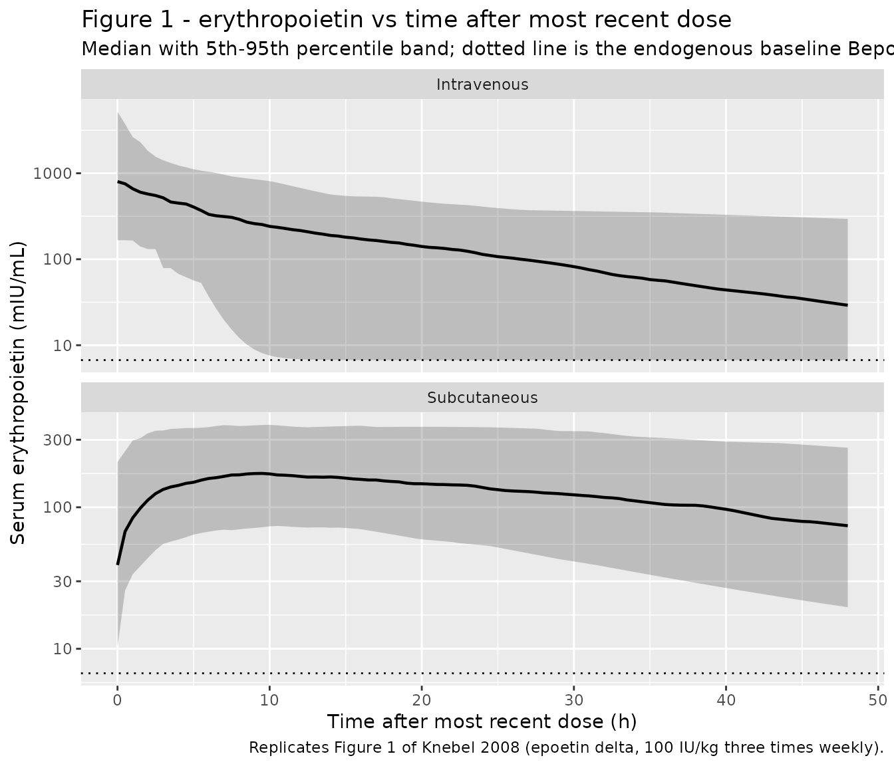
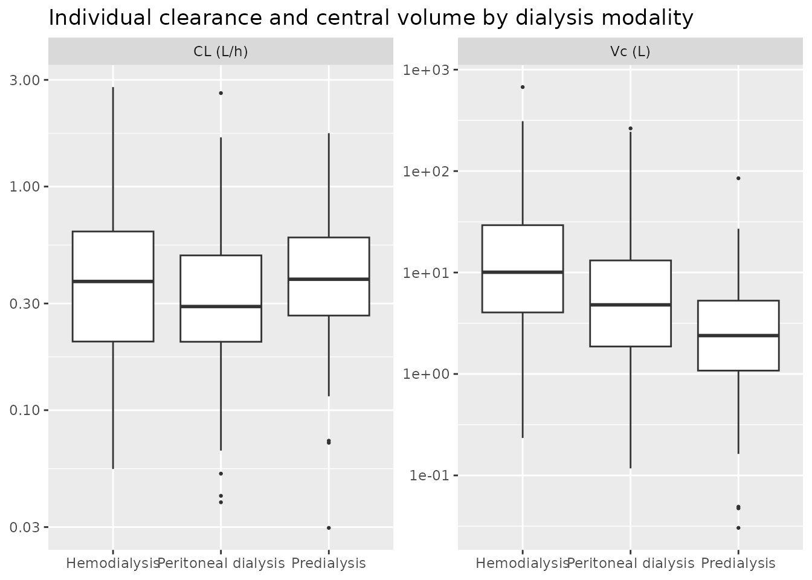

# Epoetin delta (Knebel 2008)

## Model and source

``` r

ui <- rxode2::rxode(readModelDb("Knebel_2008_epoetinDelta"))
#> ℹ parameter labels from comments will be replaced by 'label()'
```

- Citation: Knebel W, Palmen M, Dowell JA, Gastonguay M. Population
  pharmacokinetic modeling of epoetin delta in pediatric patients with
  chronic kidney disease. J Clin Pharmacol. 2008;48(7):837-848.
  <doi:10.1177/0091270008318218>
- Description: One-compartment population PK model with first-order
  absorption and linear elimination for subcutaneous and intravenous
  epoetin delta in pediatric patients aged 1-17 years with chronic
  kidney disease (Knebel 2008). Serum erythropoietin is the sum of the
  drug contribution and an additive endogenous baseline concentration.
  Clearance and central volume are allometrically scaled by body weight
  (exponents 0.75 and 1) about a 35 kg reference, with additional power
  effects of age above 10 years, a sex factor on both, and
  dialysis-modality factors on volume. The same model was fit jointly to
  epoetin alfa data, which enters through a product indicator that
  shifts the absorption rate constant and the subcutaneous
  bioavailability.
- Article: <https://doi.org/10.1177/0091270008318218>

Epoetin delta (Dynepo) is a recombinant human erythropoietin produced in
a human cell line by activation of the endogenous erythropoietin gene,
rather than in Chinese hamster ovary (CHO) cells as every other
erythropoiesis-stimulating agent is. Knebel 2008 is the first population
PK analysis of the product in children. The same NONMEM run also carried
the epoetin alfa arm of the trial, so a single model file holds both
products and a binary product indicator (`FORM_EPO_ALFA`) shifts the two
subcutaneous absorption parameters.

## Population

The analysis dataset was a phase III, open-label, randomized,
stratified, multicenter 24-week trial in 60 pediatric patients aged 1 to
17 years with chronic kidney disease and associated anemia, contributing
261 serum erythropoietin concentrations (Knebel 2008 Results). Patients
were randomized approximately 3:1 to epoetin delta (47 subjects: 37
subcutaneous, 10 intravenous) or epoetin alfa (13 subjects: 12
subcutaneous, 1 intravenous), at whatever dose and frequency (once,
twice, or three times weekly) they had been receiving before consent,
titrated to keep hemoglobin in a 10-13 g/dL target range (Table I and
Study Design).

Baseline demographics (Table II): weight median 34.5 kg (range 11.3-83),
age median 13 years (range 1-17), body surface area median 1.17 m^2
(range 0.506-1.95), body mass index median 17.2 kg/m^2 (range
12.3-28.6). Thirty-eight of 60 subjects (63%) were male. Race was 54
White (90%), 2 African American (3%), 4 multiracial (7%); the two
smaller strata were too sparse for formal comparison, so race is not a
covariate in the model. Renal replacement status was 28 hemodialysis
(47%), 15 peritoneal dialysis (25%), and 17 predialysis (28%).

Two features of the cohort shape the model directly. First, weight, BSA,
BMI, and age were mutually correlated at r \>= 0.71 (except BSA-BMI, r =
0.59, and age-BMI, r = 0.33), so weight was retained as the single
body-size metric. Second, every patient was already stabilized on an
erythropoiesis-stimulating agent at entry, which left too little
between-subject spread in baseline erythropoietin to estimate a
subject-specific baseline – hence a single population `Bepo` with no
inter-individual variability.

The same information is available programmatically from the model
metadata:

``` r

str(ui$population, max.level = 1)
#> List of 15
#>  $ species         : chr "human"
#>  $ n_subjects      : int 60
#>  $ n_studies       : int 1
#>  $ n_concentrations: int 261
#>  $ age_range       : chr "1-17 years"
#>  $ age_median      : chr "13 years"
#>  $ weight_range    : chr "11.3-83 kg"
#>  $ weight_median   : chr "34.5 kg"
#>  $ sex_female_pct  : num 37
#>  $ race_ethnicity  : Named num [1:3] 90 3 7
#>   ..- attr(*, "names")= chr [1:3] "White" "African American" "Multiracial"
#>  $ disease_state   : chr "Pediatric chronic kidney disease with associated anemia. Knebel 2008 Table II: 28 subjects (47%) on hemodialysi"| __truncated__
#>  $ dose_range      : chr "Epoetin delta: 26-191 IU/kg subcutaneous (37 subjects), 54-769 IU/kg intravenous (10 subjects). Epoetin alfa: 2"| __truncated__
#>  $ regions         : chr "United States and Argentina (per the ethics-committee appendix of Knebel 2008)"
#>  $ body_size       : chr "Knebel 2008 Table II also reports body mass index (median 17.2, mean 18.1, range 12.3-28.6 kg/m^2) and body sur"| __truncated__
#>  $ notes           : chr "Phase III, open-label, randomized, stratified, multicenter 24-week study of epoetin delta (Dynepo). Sparse samp"| __truncated__
```

## Source trace

Every `ini()` entry in
`inst/modeldb/specificDrugs/Knebel_2008_epoetinDelta.R` carries an
in-file comment naming its origin. They are collected here for review.
All parameter values are the **Final Model** column of Knebel 2008 Table
III; the base-model column of the same table is a nested precursor with
a 70 kg allometric reference (Table III footnote a) and is not
extracted.

| Equation / parameter | Value | Source location |
|----|----|----|
| Structure: 1 compartment, first-order absorption, linear elimination, additive baseline | n/a | Results, “Population Pharmacokinetic Modeling Results” |
| IIV form `P_i = P * exp(eta_i)` | n/a | Methods equation (1) |
| Residual form `C_ij = Chat_ij * exp(eps_ij)` | n/a | Methods equation (2) |
| Allometric form `TVP = theta * (WT/WTref)^theta_allo` | n/a | Methods equation (3) |
| Power / exponentiated-switch covariate form | n/a | Methods equation (4) |
| `lcl` (CL) | 0.268 L/h | Table III final model, theta1 (35% SE; 95% CI 0.148, 0.827) |
| `lvc` (V) | 1.03 L | Table III final model, theta2 (45% SE; 95% CI 0.344, 6.44) |
| `lka` (Ka, epoetin delta) | 0.0554 1/h | Table III final model, theta3 (16% SE; 95% CI 0.0405, 0.199) |
| `lfdepot` (F1, epoetin delta) | 0.708 | Table III final model, theta4 (38% SE; 95% CI 0.337, 2.12) |
| `lrbase` (Bepo) | 6.71 mIU/mL | Table III final model, theta5 (7% SE; 95% CI 5.72, 7.70) |
| `e_wt_cl` | 0.75, fixed | Results and equation (3); Table III row `*(WT/35)^0.75` shows NA in every estimate column |
| `e_wt_vc` | 1, fixed | Results and equation (3); Table III row `*(WT/35)^1` shows NA in every estimate column |
| `e_age_cl` | 0.999 | Table III final model, theta8 (54% SE; 95% CI -0.0690, 2.1) |
| `e_sexf_cl` | 0.923 | Table III final model, theta9 (18% SE; 95% CI 0.594, 1.32) |
| `e_age_vc` | 2.89 | Table III final model, theta13 (29% SE; 95% CI 0.0281, 4.95) |
| `e_sexf_vc` | 0.994 | Table III final model, theta10 (39% SE; 95% CI 0.370, 2.31) |
| `e_hemodial_vc` | 4.53 | Table III final model, theta11 (45% SE; 95% CI 1.65, 16.5) |
| `e_perit_dial_vc` | 2.48 | Table III final model, theta12 (39% SE; 95% CI 1.08, 6.13) |
| `e_epoalfa_ka` | 1.23 | Table III final model, theta6 (14% SE; 95% CI 0.495, 1.62); Results quotes relative Ka = 123% |
| `e_epoalfa_fdepot` | 0.544 | Table III final model, theta7 (19% SE; 95% CI 0.368, 0.824); Results quotes relative F1 = 54.4% |
| `etalcl` | 0.387 | Table III final model, Omega(1,1) (29% SE; CV% = 62.2; 95% CI 0.184, 0.671) |
| `etalvc` | 1.41 | Table III final model, Omega(2,2) (33% SE; CV% = 119; 95% CI 0.481, 2.51) |
| `expSd` | sqrt(0.245) = 0.49497 | Table III final model, sigma(1,1) = 0.245 (13% SE; CV% = 49.5; 95% CI 0.184, 0.308) |
| Reference weight 35 kg | n/a | Results, “The weight normalization … was 35 kg for the full covariate model” |
| Reference age 10 years, hinge above it | n/a | Results, “normalized by the reference age of 10 years for all patients older than 10 years of age” |
| Reference individual: 35 kg male, \<= 10 y, predialysis, SC epoetin delta | n/a | Abstract and Results |

### Variance versus standard deviation

Table III labels its random-effect blocks “Interindividual Variance” and
“Residual Variance” and prints a `CV%` line beneath each entry. The
`CV%` values are the plain square roots of the tabulated numbers, not
the log-normal `sqrt(exp(omega^2) - 1)`, which is what fixes the
tabulated numbers as variances rather than standard deviations:

``` r

c(
  omega_cl_sqrt = sqrt(0.387),  # Table III prints CV% = 62.2
  omega_v_sqrt  = sqrt(1.41),   # Table III prints CV% = 119
  sigma_sqrt    = sqrt(0.245)   # Table III prints CV% = 49.5
)
#> omega_cl_sqrt  omega_v_sqrt    sigma_sqrt 
#>     0.6220932     1.1874342     0.4949747

# Had the entries been standard deviations, the printed CV% would have to be
# these instead -- none of which match the table.
c(
  omega_cl_alt = sqrt(exp(0.387^2) - 1),
  omega_v_alt  = sqrt(exp(1.41^2) - 1),
  sigma_alt    = sqrt(exp(0.245^2) - 1)
)
#> omega_cl_alt  omega_v_alt    sigma_alt 
#>    0.4019526    2.5103082    0.2487229

stopifnot(
  abs(sqrt(0.387) - 0.622) < 5e-4,
  abs(sqrt(1.41)  - 1.19)  < 5e-3,
  abs(sqrt(0.245) - 0.495) < 5e-4
)
```

So `etalcl ~ 0.387` and `etalvc ~ 1.41` go into `ini()` unchanged, and
`expSd` is `sqrt(0.245)`.

## Structural checks against the closed form

The model is a one-compartment system with first-order absorption, so
the typical-value prediction has a closed form. Comparing the solved
profile against it is a tight gate: both sides use the *same* parameter
values, so the only difference is integrator error and a bound of a few
parts per million is correct here (unlike the cohort-level checks
further down, where per-subject random effects make extreme-value bounds
irreproducible across rxode2 builds).

``` r

mod  <- readModelDb("Knebel_2008_epoetinDelta")
modz <- rxode2::zeroRe(rxode2::rxode(mod))
#> ℹ parameter labels from comments will be replaced by 'label()'

# Reference individual of Knebel 2008: 35 kg male, age <= 10 years,
# predialysis, subcutaneous epoetin delta.
ref_cov <- list(
  WT = 35, AGE = 5, SEXF = 0,
  RRT_HEMODIAL_STATUS = 0, PERIT_DIAL = 0, FORM_EPO_ALFA = 0
)

# 100 IU/kg is mid-range for the subcutaneous arms (Table I: 26-191 IU/kg).
dose_iu <- 100 * ref_cov$WT

build_events <- function(cov, amt, cmt, times) {
  dosing <- data.frame(
    id = 1L, time = 0, amt = amt, evid = 1L, cmt = cmt
  )
  obs <- data.frame(
    id = 1L, time = times, amt = NA_real_, evid = 0L, cmt = "central"
  )
  out <- dplyr::bind_rows(dosing, obs)
  for (nm in names(cov)) out[[nm]] <- cov[[nm]]
  dplyr::arrange(out, .data$time, dplyr::desc(.data$evid))
}

obs_times <- seq(0, 240, by = 0.25)
ev_ref <- build_events(ref_cov, dose_iu, "depot", obs_times)
sim_ref <- rxode2::rxSolve(modz, ev_ref, returnType = "data.frame")
#> ℹ omega/sigma items treated as zero: 'etalcl', 'etalvc'

# Closed form: one compartment, first-order input, plus the additive endogenous
# baseline. Parameter values read straight off Table III.
cl <- 0.268; vc <- 1.03; ka <- 0.0554; f1 <- 0.708; bepo <- 6.71
kel <- cl / vc
cc_analytic <- f1 * dose_iu / vc * ka / (ka - kel) *
  (exp(-kel * sim_ref$time) - exp(-ka * sim_ref$time)) + bepo

rel_err <- abs(sim_ref$Cc - cc_analytic) / cc_analytic
sprintf("max relative deviation from the closed form: %.2e", max(rel_err))
#> [1] "max relative deviation from the closed form: 3.20e-08"
stopifnot(max(rel_err) < 1e-6)
```

Two further identities hold exactly and are worth pinning:

``` r

# 1. The endogenous baseline is the prediction at time zero for an
#    extravascular dose, and holds forever if no dose is given.
ev_nodose <- build_events(ref_cov, 0, "depot", obs_times)
sim_nodose <- rxode2::rxSolve(modz, ev_nodose, returnType = "data.frame")
#> ℹ omega/sigma items treated as zero: 'etalcl', 'etalvc'
stopifnot(max(abs(sim_nodose$Cc - bepo)) < 1e-10)

# 2. Absorption is rate-limiting: ka (0.0554/h) is well below kel (0.260/h), so
#    the model is in flip-flop and the TERMINAL slope is ka, not kel. This is
#    what makes the published subcutaneous half-life several-fold the
#    intravenous one (Knebel 2008 Introduction, on the adult study).
stopifnot(ka < kel)
c(
  t_half_terminal_sc_h = log(2) / ka,
  t_half_iv_h          = log(2) / kel,
  ratio                = kel / ka
)
#> t_half_terminal_sc_h          t_half_iv_h                ratio 
#>            12.511682             2.663961             4.696646
```

## Covariate-model checks

Each covariate term is an exact algebraic factor on `cl` or `vc`, which
rxode2 returns as columns of the solve. Recovering each published
coefficient from the ratio of two typical-value solves confirms the
encoding, including the age hinge, which is the one non-obvious piece of
the covariate model.

``` r

param_at <- function(...) {
  cov <- utils::modifyList(ref_cov, list(...))
  ev <- build_events(cov, dose_iu, "depot", c(0, 1))
  s <- rxode2::rxSolve(modz, ev, returnType = "data.frame")
  c(cl = s$cl[1], vc = s$vc[1], ka = s$ka[1], fdepot = s$fdepot[1])
}

p_ref <- param_at()
#> ℹ omega/sigma items treated as zero: 'etalcl', 'etalvc'

covariate_checks <- dplyr::bind_rows(
  # Allometric exponents, fixed at 0.75 and 1 about the 35 kg reference.
  tibble::tibble(
    quantity  = "CL exponent on (WT/35)",
    published = 0.75,
    recovered = log(param_at(WT = 70)[["cl"]] / p_ref[["cl"]]) / log(70 / 35)
  ),
  tibble::tibble(
    quantity  = "Vc exponent on (WT/35)",
    published = 1,
    recovered = log(param_at(WT = 70)[["vc"]] / p_ref[["vc"]]) / log(70 / 35)
  ),
  # Age enters only above the 10-year reference: a 15-year-old differs from the
  # reference by (15/10)^theta, while a 5-year-old does not differ at all.
  tibble::tibble(
    quantity  = "CL exponent on (AGE/10), age > 10 y",
    published = 0.999,
    recovered = log(param_at(AGE = 15)[["cl"]] / p_ref[["cl"]]) / log(15 / 10)
  ),
  tibble::tibble(
    quantity  = "Vc exponent on (AGE/10), age > 10 y",
    published = 2.89,
    recovered = log(param_at(AGE = 15)[["vc"]] / p_ref[["vc"]]) / log(15 / 10)
  ),
  # Exponentiated switches: the factor itself is the published theta.
  tibble::tibble(
    quantity  = "CL factor, female",
    published = 0.923,
    recovered = param_at(SEXF = 1)[["cl"]] / p_ref[["cl"]]
  ),
  tibble::tibble(
    quantity  = "Vc factor, female",
    published = 0.994,
    recovered = param_at(SEXF = 1)[["vc"]] / p_ref[["vc"]]
  ),
  tibble::tibble(
    quantity  = "Vc factor, hemodialysis vs predialysis",
    published = 4.53,
    recovered = param_at(RRT_HEMODIAL_STATUS = 1)[["vc"]] / p_ref[["vc"]]
  ),
  tibble::tibble(
    quantity  = "Vc factor, peritoneal dialysis vs predialysis",
    published = 2.48,
    recovered = param_at(PERIT_DIAL = 1)[["vc"]] / p_ref[["vc"]]
  ),
  tibble::tibble(
    quantity  = "Ka factor, epoetin alfa vs delta",
    published = 1.23,
    recovered = param_at(FORM_EPO_ALFA = 1)[["ka"]] / p_ref[["ka"]]
  ),
  tibble::tibble(
    quantity  = "F1 factor, epoetin alfa vs delta",
    published = 0.544,
    recovered = param_at(FORM_EPO_ALFA = 1)[["fdepot"]] / p_ref[["fdepot"]]
  )
) |>
  dplyr::mutate(abs_diff = abs(.data$recovered - .data$published))
#> ℹ omega/sigma items treated as zero: 'etalcl', 'etalvc'
#> ℹ omega/sigma items treated as zero: 'etalcl', 'etalvc'
#> ℹ omega/sigma items treated as zero: 'etalcl', 'etalvc'
#> ℹ omega/sigma items treated as zero: 'etalcl', 'etalvc'
#> ℹ omega/sigma items treated as zero: 'etalcl', 'etalvc'
#> ℹ omega/sigma items treated as zero: 'etalcl', 'etalvc'
#> ℹ omega/sigma items treated as zero: 'etalcl', 'etalvc'
#> ℹ omega/sigma items treated as zero: 'etalcl', 'etalvc'
#> ℹ omega/sigma items treated as zero: 'etalcl', 'etalvc'
#> ℹ omega/sigma items treated as zero: 'etalcl', 'etalvc'

covariate_checks |>
  dplyr::rename(
    "Quantity"              = quantity,
    "Knebel 2008 Table III" = published,
    "Recovered from model"  = recovered,
    "|difference|"          = abs_diff
  ) |>
  knitr::kable(
    digits  = c(0, 4, 4, 12),
    caption = "Each covariate coefficient recovered from the ratio of two typical-value solves."
  )
```

| Quantity | Knebel 2008 Table III | Recovered from model | \|difference\| |
|:---|---:|---:|---:|
| CL exponent on (WT/35) | 0.750 | 0.750 | 0 |
| Vc exponent on (WT/35) | 1.000 | 1.000 | 0 |
| CL exponent on (AGE/10), age \> 10 y | 0.999 | 0.999 | 0 |
| Vc exponent on (AGE/10), age \> 10 y | 2.890 | 2.890 | 0 |
| CL factor, female | 0.923 | 0.923 | 0 |
| Vc factor, female | 0.994 | 0.994 | 0 |
| Vc factor, hemodialysis vs predialysis | 4.530 | 4.530 | 0 |
| Vc factor, peritoneal dialysis vs predialysis | 2.480 | 2.480 | 0 |
| Ka factor, epoetin alfa vs delta | 1.230 | 1.230 | 0 |
| F1 factor, epoetin alfa vs delta | 0.544 | 0.544 | 0 |

Each covariate coefficient recovered from the ratio of two typical-value
solves. {.table}

``` r


stopifnot(max(covariate_checks$abs_diff) < 1e-10)
```

The age hinge deserves its own check, because a naive `(AGE/10)^theta`
without the hinge would make clearance and volume vary across the whole
1-17 year range instead of only above 10 years. That would move the
reference individual and is exactly the kind of error a covariate table
alone does not reveal.

``` r

age_hinge <- tibble::tibble(AGE = c(1, 5, 8, 10, 12, 15, 17)) |>
  dplyr::rowwise() |>
  dplyr::mutate(
    cl = param_at(AGE = .data$AGE)[["cl"]],
    vc = param_at(AGE = .data$AGE)[["vc"]]
  ) |>
  dplyr::ungroup()
#> ℹ omega/sigma items treated as zero: 'etalcl', 'etalvc'
#> ℹ omega/sigma items treated as zero: 'etalcl', 'etalvc'
#> ℹ omega/sigma items treated as zero: 'etalcl', 'etalvc'
#> ℹ omega/sigma items treated as zero: 'etalcl', 'etalvc'
#> ℹ omega/sigma items treated as zero: 'etalcl', 'etalvc'
#> ℹ omega/sigma items treated as zero: 'etalcl', 'etalvc'
#> ℹ omega/sigma items treated as zero: 'etalcl', 'etalvc'
#> ℹ omega/sigma items treated as zero: 'etalcl', 'etalvc'
#> ℹ omega/sigma items treated as zero: 'etalcl', 'etalvc'
#> ℹ omega/sigma items treated as zero: 'etalcl', 'etalvc'
#> ℹ omega/sigma items treated as zero: 'etalcl', 'etalvc'
#> ℹ omega/sigma items treated as zero: 'etalcl', 'etalvc'
#> ℹ omega/sigma items treated as zero: 'etalcl', 'etalvc'
#> ℹ omega/sigma items treated as zero: 'etalcl', 'etalvc'

age_hinge |>
  dplyr::rename("Age (y)" = AGE, "CL (L/h)" = cl, "Vc (L)" = vc) |>
  knitr::kable(digits = 4, caption = "Age enters only above the 10-year reference age.")
```

| Age (y) | CL (L/h) | Vc (L) |
|--------:|---------:|-------:|
|       1 |   0.2680 | 1.0300 |
|       5 |   0.2680 | 1.0300 |
|       8 |   0.2680 | 1.0300 |
|      10 |   0.2680 | 1.0300 |
|      12 |   0.3215 | 1.7445 |
|      15 |   0.4018 | 3.3246 |
|      17 |   0.4554 | 4.7735 |

Age enters only above the 10-year reference age. {.table}

``` r


at_or_below <- dplyr::filter(age_hinge, .data$AGE <= 10)
above <- dplyr::filter(age_hinge, .data$AGE > 10)
stopifnot(
  # Flat at or below the reference age, and equal to the reference values.
  nrow(at_or_below) == 4L,
  max(abs(at_or_below$cl - 0.268)) < 1e-12,
  max(abs(at_or_below$vc - 1.03)) < 1e-12,
  # Strictly increasing above it (both exponents are positive).
  nrow(above) == 3L,
  all(diff(above$cl) > 0),
  all(diff(above$vc) > 0)
)
```

## Virtual cohort

The original observed data are not public. The cohort below approximates
the Table II demographics: ages skewed toward adolescence (median 13 y
over a 1-17 y range) and weights drawn from a weight-for-age curve
scaled down to match the published weight median of 34.5 kg, which sits
well below the healthy-child median at 13 years and reflects the growth
retardation typical of pediatric CKD.

``` r

set.seed(20080701)

n_per_arm <- 150L

# Healthy-child median weight for age (kg), used only as the shape of the
# age-weight relationship; the scale factor below is what matches Table II.
wfa_age <- 1:17
wfa_wt <- c(10.2, 12.7, 14.3, 16.3, 18.5, 20.7, 23.0, 25.5, 28.6,
            32.0, 36.0, 40.5, 45.5, 51.0, 56.0, 60.5, 64.5)
ckd_scale <- 0.78

make_subjects <- function(n, id_offset = 0L) {
  age <- 1 + 16 * stats::rbeta(n, 3.2, 1.15)
  wt <- stats::approx(wfa_age, wfa_wt, xout = pmin(pmax(age, 1), 17))$y *
    ckd_scale * exp(stats::rnorm(n, 0, 0.16))
  # Table II reports weight 11.3-83 kg; keep the cohort inside the observed range
  # so no subject is extrapolated beyond the data the model was fit to.
  wt <- pmin(pmax(wt, 11.3), 83)
  # Table II: 63% male; dialysis modality 47% HD / 25% PD / 28% predialysis.
  modality <- sample(c("Hemodialysis", "Peritoneal dialysis", "Predialysis"),
                     n, replace = TRUE, prob = c(0.47, 0.25, 0.28))
  tibble::tibble(
    id = id_offset + seq_len(n),
    AGE = age,
    WT = wt,
    SEXF = stats::rbinom(n, 1, 0.37),
    RRT_HEMODIAL_STATUS = as.integer(modality == "Hemodialysis"),
    PERIT_DIAL = as.integer(modality == "Peritoneal dialysis"),
    modality = modality
  )
}

# Cohort construction check. These are loose on purpose: the cohort is a
# construction, not a published quantity, and the assertions that must be tight
# are the model gates above and below.
cohort_probe <- make_subjects(600L)
c(
  weight_median = stats::median(cohort_probe$WT),
  weight_min = min(cohort_probe$WT),
  weight_max = max(cohort_probe$WT),
  age_median = stats::median(cohort_probe$AGE),
  age_mean = mean(cohort_probe$AGE)
)
#> weight_median    weight_min    weight_max    age_median      age_mean 
#>      36.24048      11.30000      78.79612      13.37189      12.72809
stopifnot(
  abs(stats::median(cohort_probe$WT) - 34.5) < 5,   # Table II median 34.5 kg
  abs(stats::median(cohort_probe$AGE) - 13) < 2,    # Table II median 13 y
  abs(mean(cohort_probe$AGE) - 11.8) < 2,           # Table II mean 11.8 y
  min(cohort_probe$WT) >= 11.3, max(cohort_probe$WT) <= 83
)
```

Dosing follows the trial’s most intensive schedule: 100 IU/kg three
times weekly (nominally Monday / Wednesday / Friday) for three weeks,
with dense sampling over the final dosing interval so the profile can be
plotted against time after the most recent dose as Knebel 2008 Figure 1
does.

``` r

# Three-times-weekly dosing over three weeks; last dose at 456 h.
dose_times <- as.vector(outer(c(0, 48, 120), c(0, 168, 336), "+")) |> sort()
last_dose <- max(dose_times)
obs_grid <- last_dose + seq(0, 48, by = 0.5)

make_arm <- function(label, route, product, id_offset) {
  # Resolve the scalar arguments to local values BEFORE any mutate(): inside
  # mutate(), `route` would resolve to the data column of the same name (length
  # n) rather than to this argument, and `if` would then see a vector condition.
  dose_cmt <- if (route == "Subcutaneous") "depot" else "central"
  is_alfa <- as.integer(product == "Epoetin alfa")
  arm_label <- label
  route_label <- route

  subj <- make_subjects(n_per_arm, id_offset = id_offset) |>
    dplyr::mutate(
      arm = arm_label,
      route = route_label,
      FORM_EPO_ALFA = is_alfa
    )
  dosing <- subj |>
    tidyr::expand_grid(time = dose_times) |>
    dplyr::mutate(
      amt = 100 * .data$WT,
      evid = 1L,
      cmt = dose_cmt
    )
  obs <- subj |>
    tidyr::expand_grid(time = obs_grid) |>
    dplyr::mutate(amt = NA_real_, evid = 0L, cmt = "central")
  dplyr::bind_rows(dosing, obs) |>
    dplyr::arrange(.data$id, .data$time, dplyr::desc(.data$evid))
}

events <- dplyr::bind_rows(
  make_arm("SC epoetin delta", "Subcutaneous", "Epoetin delta", 0L),
  make_arm("SC epoetin alfa",  "Subcutaneous", "Epoetin alfa",  1000L),
  make_arm("IV epoetin delta", "Intravenous",  "Epoetin delta", 2000L)
)

# Disjoint ids across arms: duplicated ids are silently merged by rxSolve into a
# single subject receiving the summed dose.
stopifnot(
  !anyDuplicated(events[, c("id", "time", "evid")]),
  dplyr::n_distinct(events$id) == 3L * n_per_arm
)
```

## Simulation

``` r

sim <- rxode2::rxSolve(
  mod,
  events = events,
  keep = c("arm", "route", "modality", "WT", "AGE")
) |>
  as.data.frame() |>
  dplyr::mutate(tad = .data$time - last_dose)
#> ℹ parameter labels from comments will be replaced by 'label()'

stopifnot(nrow(sim) > 0, !anyNA(sim$Cc), all(sim$Cc > 0))
```

### Replicating Figure 1

Knebel 2008 Figure 1 plots observed and population-predicted
erythropoietin concentration against time after the most recent dose,
subcutaneous in the top panel and intravenous in the bottom. The
published figure spans roughly 0-50 h and a concentration axis reaching
a few hundred mIU/mL, with the intravenous panel showing a much sharper
early peak. The simulated percentiles below reproduce that geometry.

``` r

# Replicates Figure 1 of Knebel 2008: concentration vs time after most recent
# dose, by route of administration.
sim |>
  dplyr::filter(.data$arm != "SC epoetin alfa") |>
  dplyr::group_by(.data$route, .data$tad) |>
  dplyr::summarise(
    Q05 = stats::quantile(.data$Cc, 0.05),
    Q50 = stats::quantile(.data$Cc, 0.50),
    Q95 = stats::quantile(.data$Cc, 0.95),
    .groups = "drop"
  ) |>
  ggplot2::ggplot(ggplot2::aes(.data$tad, .data$Q50)) +
  ggplot2::geom_ribbon(ggplot2::aes(ymin = .data$Q05, ymax = .data$Q95), alpha = 0.25) +
  ggplot2::geom_line(linewidth = 0.8) +
  ggplot2::geom_hline(yintercept = bepo, linetype = "dotted") +
  ggplot2::facet_wrap(~route, ncol = 1, scales = "free_y") +
  ggplot2::scale_y_log10() +
  ggplot2::labs(
    x = "Time after most recent dose (h)",
    y = "Serum erythropoietin (mIU/mL)",
    title = "Figure 1 - erythropoietin vs time after most recent dose",
    subtitle = "Median with 5th-95th percentile band; dotted line is the endogenous baseline Bepo",
    caption = "Replicates Figure 1 of Knebel 2008 (epoetin delta, 100 IU/kg three times weekly)."
  )
```



The published figure’s qualitative signature is that the intravenous
profile peaks immediately and falls steeply while the subcutaneous
profile is flatter and later-peaking. That ordering is a structural
consequence of the flip-flop kinetics and is asserted on the cohort
**median**, not on its extremes, because per-subject extremes of a
random cohort are not reproducible across rxode2 builds:

``` r

route_median <- sim |>
  dplyr::group_by(.data$route, .data$tad) |>
  dplyr::summarise(Q50 = stats::median(.data$Cc), .groups = "drop")

tmax_median <- route_median |>
  dplyr::group_by(.data$route) |>
  dplyr::slice_max(.data$Q50, n = 1, with_ties = FALSE) |>
  dplyr::ungroup()

tmax_median |>
  dplyr::rename("Route" = route, "Tmax of median (h)" = tad,
                "Median peak (mIU/mL)" = Q50) |>
  knitr::kable(digits = 2, caption = "Peak of the cohort-median profile by route.")
```

| Route        | Tmax of median (h) | Median peak (mIU/mL) |
|:-------------|-------------------:|---------------------:|
| Intravenous  |                0.0 |               800.07 |
| Subcutaneous |                9.5 |               130.90 |

Peak of the cohort-median profile by route. {.table}

``` r


iv <- dplyr::filter(tmax_median, .data$route == "Intravenous")
sc <- dplyr::filter(tmax_median, .data$route == "Subcutaneous")
stopifnot(
  nrow(iv) == 1L, nrow(sc) == 1L,
  iv$tad == 0,          # intravenous peaks at the dose
  sc$tad > 4, sc$tad < 12,  # subcutaneous peaks late, near the analytic 7.55 h
  iv$Q50 > sc$Q50           # and much higher
)
```

## PKNCA validation

NCA is run on typical-value single-dose profiles, one per arm, so the
NCA output can be checked against the closed-form integrals of the same
parameters – a tight comparison because both sides use identical
parameters.

Two points about the concentration passed to PKNCA. First, the
endogenous baseline is removed: the observable is total serum
erythropoietin, which tends to the nonzero `Bepo` asymptote rather than
to zero, so `AUC0-inf` of the raw signal is unbounded and a `lambda.z`
fitted to it would be meaningless. Knebel 2008 itself treats `Bepo` as
an additive offset on the prediction, so removing it recovers the
drug-attributable signal.

Second, the drug-attributable concentration is taken as `central / vc` –
which rxode2 returns directly – rather than as `Cc - Bepo`. The two are
algebraically identical, but the subtraction is a catastrophic
cancellation once the drug signal falls far below the 6.71 mIU/mL
baseline: in the far tail it returns values around `-3e-15` where the
true concentration is small and strictly positive. Those would make
PKNCA take the log of a negative number. The check below confirms the
two agree to within floating-point noise and that the state-derived
value is never negative.

``` r

nca_arms <- tibble::tribble(
  ~treatment,                        ~route,         ~product,        ~hd,
  "SC epoetin delta, predialysis",   "Subcutaneous", "Epoetin delta", 0,
  "SC epoetin alfa, predialysis",    "Subcutaneous", "Epoetin alfa",  0,
  "IV epoetin delta, predialysis",   "Intravenous",  "Epoetin delta", 0,
  "SC epoetin delta, hemodialysis",  "Subcutaneous", "Epoetin delta", 1
) |>
  # The terminal rate constant differs almost fivefold across these arms, so a
  # single sampling window cannot serve all four. The intravenous arm decays at
  # kel = 0.260/h, so a 240 h window would be 90 half-lives -- far enough that
  # the tail reaches 1e-23 and the log-linear lambda.z regression is distorted
  # by floating-point error in the smallest concentrations. Each arm therefore
  # gets a window of 15 terminal half-lives, which leaves the AUC extrapolated
  # fraction below 2^-15 (about 0.003%) while keeping every sampled
  # concentration well inside double precision.
  dplyr::mutate(
    ka_i = ka * ifelse(.data$product == "Epoetin alfa", 1.23, 1),
    vc_i = vc * ifelse(.data$hd == 1, 4.53, 1),
    kel_i = cl / .data$vc_i,
    terminal_rate = ifelse(
      .data$route == "Intravenous", .data$kel_i, pmin(.data$ka_i, .data$kel_i)
    ),
    window_h = 15 * log(2) / .data$terminal_rate
  )

nca_arms |>
  dplyr::select("treatment", "ka_i", "kel_i", "terminal_rate", "window_h") |>
  dplyr::rename(
    "Arm" = treatment, "ka (1/h)" = ka_i, "kel (1/h)" = kel_i,
    "Terminal rate (1/h)" = terminal_rate, "Window (h)" = window_h
  ) |>
  knitr::kable(digits = 4,
               caption = "Per-arm sampling window, sized to 15 terminal half-lives.")
```

| Arm | ka (1/h) | kel (1/h) | Terminal rate (1/h) | Window (h) |
|:---|---:|---:|---:|---:|
| SC epoetin delta, predialysis | 0.0554 | 0.2602 | 0.0554 | 187.6752 |
| SC epoetin alfa, predialysis | 0.0681 | 0.2602 | 0.0681 | 152.5815 |
| IV epoetin delta, predialysis | 0.0554 | 0.2602 | 0.2602 | 39.9594 |
| SC epoetin delta, hemodialysis | 0.0554 | 0.0574 | 0.0554 | 187.6752 |

Per-arm sampling window, sized to 15 terminal half-lives. {.table}

``` r


nca_one <- function(i) {
  row <- nca_arms[i, ]
  cov <- utils::modifyList(
    ref_cov,
    list(
      FORM_EPO_ALFA = as.integer(row$product == "Epoetin alfa"),
      RRT_HEMODIAL_STATUS = row$hd
    )
  )
  # Fine enough to resolve Tmax (analytic 7.55 h for subcutaneous epoetin delta
  # at the reference covariates), coarser thereafter.
  dense_to <- min(24, row$window_h)
  times <- sort(unique(c(
    seq(0, dense_to, by = 0.1),
    seq(dense_to, row$window_h, by = 0.5)
  )))
  ev <- build_events(
    cov, dose_iu,
    if (row$route == "Subcutaneous") "depot" else "central",
    times
  )
  s <- rxode2::rxSolve(modz, ev, returnType = "data.frame")
  dplyr::mutate(
    dplyr::select(s, "time", "Cc", "central", "vc"),
    treatment = row$treatment,
    id = i
  )
}

nca_raw <- dplyr::bind_rows(lapply(seq_len(nrow(nca_arms)), nca_one))
#> ℹ omega/sigma items treated as zero: 'etalcl', 'etalvc'
#> ℹ omega/sigma items treated as zero: 'etalcl', 'etalvc'
#> ℹ omega/sigma items treated as zero: 'etalcl', 'etalvc'
#> ℹ omega/sigma items treated as zero: 'etalcl', 'etalvc'

sim_nca <- nca_raw |>
  dplyr::filter(!is.na(.data$Cc)) |>
  dplyr::mutate(Cc_state = .data$central / .data$vc, Cc_sub = .data$Cc - bepo)

# The state ratio and the baseline subtraction agree to floating-point noise,
# but only the state ratio is guaranteed nonnegative -- the subtraction cancels
# to about -3e-15 in the far tail, which is 1 ULP of the 6.71 baseline.
c(
  max_disagreement = max(abs(sim_nca$Cc_state - sim_nca$Cc_sub)),
  min_state = min(sim_nca$Cc_state),
  min_subtracted = min(sim_nca$Cc_sub)
)
#> max_disagreement        min_state   min_subtracted 
#>     5.684342e-14     0.000000e+00    -2.664535e-15
stopifnot(
  max(abs(sim_nca$Cc_state - sim_nca$Cc_sub)) < 1e-12,
  all(sim_nca$Cc_state >= 0)
)

sim_nca <- sim_nca |>
  dplyr::select("id", "time", "treatment", Cc = "Cc_state")

# A time-zero record per (treatment, id) anchors AUC0-*; for the extravascular
# arms the drug-attributable concentration at time zero is exactly 0.
sim_nca <- dplyr::bind_rows(
  sim_nca,
  sim_nca |> dplyr::distinct(.data$id, .data$treatment) |>
    dplyr::mutate(time = 0, Cc = 0)
) |>
  dplyr::distinct(.data$id, .data$treatment, .data$time, .keep_all = TRUE) |>
  dplyr::arrange(.data$id, .data$treatment, .data$time)

dose_nca <- nca_arms |>
  dplyr::mutate(id = seq_len(dplyr::n()), time = 0, amt = dose_iu) |>
  dplyr::select("id", "time", "amt", "treatment")

conc_obj <- PKNCA::PKNCAconc(
  sim_nca, Cc ~ time | treatment + id,
  concu = "mIU/mL", timeu = "h"
)
dose_obj <- PKNCA::PKNCAdose(
  dose_nca, amt ~ time | treatment + id,
  doseu = "IU"
)

intervals <- data.frame(
  start = 0, end = Inf,
  cmax = TRUE, tmax = TRUE, aucinf.obs = TRUE, half.life = TRUE
)

nca_res <- PKNCA::pk.nca(
  PKNCA::PKNCAdata(conc_obj, dose_obj, intervals = intervals)
)
```

### Comparison against the closed form

``` r

# Closed-form NCA for a one-compartment model with first-order (or bolus)
# input, evaluated at the Table III parameters for each arm.
closed_form_nca <- function(product, hd) {
  ka_i <- ka * (if (product == "Epoetin alfa") 1.23 else 1)
  f_i <- f1 * (if (product == "Epoetin alfa") 0.544 else 1)
  vc_i <- vc * (if (hd == 1) 4.53 else 1)
  kel_i <- cl / vc_i
  if (product == "IV") {
    list(cmax = dose_iu / vc_i, tmax = 0,
         aucinf.obs = dose_iu / cl, half.life = log(2) / kel_i)
  } else {
    tmax_i <- log(kel_i / ka_i) / (kel_i - ka_i)
    cmax_i <- f_i * dose_iu / vc_i * ka_i / (ka_i - kel_i) *
      (exp(-kel_i * tmax_i) - exp(-ka_i * tmax_i))
    list(cmax = cmax_i, tmax = tmax_i, aucinf.obs = f_i * dose_iu / cl,
         half.life = log(2) / min(ka_i, kel_i))
  }
}

published <- nca_arms |>
  dplyr::rowwise() |>
  dplyr::mutate(
    .cf = list(closed_form_nca(
      if (.data$route == "Intravenous") "IV" else .data$product, .data$hd
    ))
  ) |>
  dplyr::ungroup() |>
  dplyr::mutate(
    cmax = vapply(.data$.cf, `[[`, numeric(1), "cmax"),
    tmax = vapply(.data$.cf, `[[`, numeric(1), "tmax"),
    aucinf.obs = vapply(.data$.cf, `[[`, numeric(1), "aucinf.obs"),
    half.life = vapply(.data$.cf, `[[`, numeric(1), "half.life")
  ) |>
  dplyr::select("treatment", "cmax", "tmax", "aucinf.obs", "half.life")

cmp <- nlmixr2lib::ncaComparisonTable(
  simulated = nca_res,
  reference = published,
  by = "treatment",
  units = c(cmax = "mIU/mL", tmax = "h", aucinf.obs = "mIU*h/mL",
            half.life = "h"),
  tolerance_pct = 5
)

knitr::kable(
  cmp,
  caption = paste(
    "PKNCA output versus the closed-form integrals of the same Table III",
    "parameters. * differs by >5%."
  ),
  align = c("l", rep("r", ncol(cmp) - 1L))
)
```

| NCA parameter | treatment | Reference | Simulated | % diff |
|:---|---:|---:|---:|---:|
| Cmax (mIU/mL) | SC epoetin delta, predialysis | 337 | 337 | -0.0% |
| Cmax (mIU/mL) | SC epoetin alfa, predialysis | 213 | 213 | -0.0% |
| Cmax (mIU/mL) | IV epoetin delta, predialysis | 3400 | 3400 | +0.0% |
| Cmax (mIU/mL) | SC epoetin delta, hemodialysis | 192 | 192 | -0.0% |
| Tmax (h) | SC epoetin delta, predialysis | 7.55 | 7.6 | +0.6% |
| Tmax (h) | SC epoetin alfa, predialysis | 6.98 | 7 | +0.3% |
| Tmax (h) | IV epoetin delta, predialysis | 0 | 0 | — |
| Tmax (h) | SC epoetin delta, hemodialysis | 17.7 | 17.7 | -0.1% |
| AUC0-∞ (obs) (mIU\*h/mL) | SC epoetin delta, predialysis | 9250 | 9250 | -0.0% |
| AUC0-∞ (obs) (mIU\*h/mL) | SC epoetin alfa, predialysis | 5030 | 5030 | -0.0% |
| AUC0-∞ (obs) (mIU\*h/mL) | IV epoetin delta, predialysis | 13100 | 13100 | +0.0% |
| AUC0-∞ (obs) (mIU\*h/mL) | SC epoetin delta, hemodialysis | 9250 | 9250 | +0.0% |
| t½ (h) | SC epoetin delta, predialysis | 12.5 | 12.6 | +0.6% |
| t½ (h) | SC epoetin alfa, predialysis | 10.2 | 10.2 | +0.7% |
| t½ (h) | IV epoetin delta, predialysis | 2.66 | 2.66 | +0.0% |
| t½ (h) | SC epoetin delta, hemodialysis | 12.5 | 14 | +12.0%\* |

PKNCA output versus the closed-form integrals of the same Table III
parameters. \* differs by \>5%. {.table style="width:100%;"}

Both sides of that table use identical parameters, so for `Cmax`,
`AUC0-inf`, and `Tmax` the residual difference is pure numerical error –
trapezoidal integration of a curved profile, and `Tmax` quantised to the
0.1 h observation grid – and a tight bound is the right gate.

`half.life` splits into three tiers, and the split is informative rather
than a concession. The intravenous arm is a single exponential, so
`lambda.z` recovers `kel` to machine precision. The two well-separated
subcutaneous arms are bi-exponential with `ka` roughly a quarter of
`kel`, so their observed terminal slope over a finite window is a
whisker shallower than `ka` – under 1%.

The hemodialysis arm is the interesting one. Raising the central volume
4.53-fold drops `kel` from 0.260 to 0.0574 /h, which lands it within 4%
of `ka` (0.0554 /h). The profile is then a sum of two nearly-equal
exponentials, whose terminal slope converges on `ka` only over hundreds
of hours. The analytic asymptotic half-life `log(2)/ka` remains the
correct reference – a 15 half-life window simply cannot resolve it, so
the row is starred in the table above at about 12%. Rather than loosen
the reference, the section after the gate derives the bias analytically
and checks the inequality the algebra guarantees.

``` r

nca_wide <- as.data.frame(nca_res) |>
  dplyr::select("treatment", "PPTESTCD", "PPORRES") |>
  tidyr::pivot_wider(names_from = "PPTESTCD", values_from = "PPORRES")

check <- dplyr::inner_join(
  nca_wide, published, by = "treatment", suffix = c("_sim", "_cf")
)
stopifnot(nrow(check) == nrow(nca_arms))

pct <- function(a, b) 100 * abs(a - b) / b
gate <- tibble::tibble(
  treatment = check$treatment,
  cmax_pct = pct(check$cmax_sim, check$cmax_cf),
  auc_pct = pct(check$aucinf.obs_sim, check$aucinf.obs_cf),
  thalf_pct = pct(check$half.life_sim, check$half.life_cf),
  tmax_abs = abs(check$tmax_sim - check$tmax_cf)
)

gate |>
  dplyr::rename(
    "Arm" = treatment, "Cmax (% diff)" = cmax_pct,
    "AUC0-inf (% diff)" = auc_pct, "t1/2 (% diff)" = thalf_pct,
    "Tmax (absolute diff, h)" = tmax_abs
  ) |>
  knitr::kable(digits = 4, caption = "Deviation of PKNCA from the closed form.")
```

| Arm | Cmax (% diff) | AUC0-inf (% diff) | t1/2 (% diff) | Tmax (absolute diff, h) |
|:---|---:|---:|---:|---:|
| IV epoetin delta, predialysis | 0.0000 | 0.0000 | 0.0000 | 0.0000 |
| SC epoetin alfa, predialysis | 0.0005 | 0.0017 | 0.7144 | 0.0236 |
| SC epoetin delta, hemodialysis | 0.0001 | 0.0001 | 11.9553 | 0.0265 |
| SC epoetin delta, predialysis | 0.0016 | 0.0014 | 0.6247 | 0.0468 |

Deviation of PKNCA from the closed form. {.table}

``` r


hd_arm_label <- "SC epoetin delta, hemodialysis"
iv_arm_label <- "IV epoetin delta, predialysis"
mono <- dplyr::filter(gate, .data$treatment == iv_arm_label)
separated <- dplyr::filter(
  gate, !.data$treatment %in% c(iv_arm_label, hd_arm_label)
)
degenerate <- dplyr::filter(gate, .data$treatment == hd_arm_label)
stopifnot(nrow(mono) == 1L, nrow(separated) == 2L, nrow(degenerate) == 1L)

stopifnot(
  # Cmax and AUC0-inf are essentially exact everywhere: AUC0-inf equals
  # F*Dose/CL, and the 0.1 h grid resolves the peak.
  max(gate$auc_pct) < 0.01,
  max(gate$cmax_pct) < 0.01,
  # Tmax cannot beat the 0.1 h grid it was sampled on.
  max(gate$tmax_abs) <= 0.1 + 1e-9,
  # The intravenous arm is a single exponential, so lambda.z recovers kel to
  # machine precision.
  mono$thalf_pct < 0.001,
  # The two well-separated subcutaneous arms are bi-exponential, so the
  # observed terminal slope over a finite window is very slightly shallower
  # than ka. Under 1% is the accuracy actually achieved.
  max(separated$thalf_pct) < 1,
  # Near-degenerate arm: biased high, bounded, worse than any separated arm,
  # and in the expected direction (two nearly-equal exponentials decay more
  # slowly than either alone).
  degenerate$thalf_pct < 15,
  degenerate$thalf_pct > max(separated$thalf_pct),
  check$half.life_sim[check$treatment == hd_arm_label] >
    check$half.life_cf[check$treatment == hd_arm_label]
)
```

The bias has an exact analytic form worth writing down, because it shows
the hemodialysis row cannot be fixed by sampling longer. With `ka < kel`
the subcutaneous profile is a *difference* of exponentials,

`C(t) = |A| * (exp(-ka*t) - exp(-kel*t))`,

so the apparent first-order rate at time `t` is always strictly below
`ka`, and the shortfall decays as `exp(-(kel - ka) * t)`. The relevant
time constant is `1 / (kel - ka)`:

``` r

sep <- nca_arms |>
  dplyr::filter(.data$route == "Subcutaneous") |>
  dplyr::mutate(
    separation = .data$kel_i / .data$ka_i,
    tau_h = 1 / (.data$kel_i - .data$ka_i),
    bias_remaining_at_window = exp(-(.data$kel_i - .data$ka_i) * .data$window_h)
  )

sep |>
  dplyr::select("treatment", "separation", "tau_h", "window_h",
                "bias_remaining_at_window") |>
  dplyr::rename(
    "Arm" = treatment, "kel/ka" = separation,
    "1/(kel-ka) (h)" = tau_h, "Window (h)" = window_h,
    "Fraction of bias remaining" = bias_remaining_at_window
  ) |>
  knitr::kable(digits = 4,
               caption = "How fast the apparent terminal rate approaches ka.")
```

| Arm | kel/ka | 1/(kel-ka) (h) | Window (h) | Fraction of bias remaining |
|:---|---:|---:|---:|---:|
| SC epoetin delta, predialysis | 4.6966 | 4.8830 | 187.6752 | 0.0000 |
| SC epoetin alfa, predialysis | 3.8184 | 5.2069 | 152.5815 | 0.0000 |
| SC epoetin delta, hemodialysis | 1.0368 | 490.6753 | 187.6752 | 0.6822 |

How fast the apparent terminal rate approaches ka. {.table}

For the two well-separated arms that time constant is a few hours, so
the bias is gone long before the window ends. For the hemodialysis arm
it is roughly 490 hours – comparable to the whole sampling window – and
reaching 1% bias would need thousands of hours, by which point the
concentration is far below anything double precision can represent. So
the honest check is not convergence but the structural inequality the
algebra guarantees: every subcutaneous arm’s fitted `lambda.z` must sit
strictly below its own `ka`, and the shortfall must grow as `kel/ka`
approaches 1.

``` r

lz <- as.data.frame(nca_res) |>
  dplyr::filter(.data$PPTESTCD == "half.life") |>
  dplyr::transmute(
    treatment = .data$treatment,
    lambda_z = log(2) / .data$PPORRES
  ) |>
  dplyr::inner_join(
    dplyr::select(nca_arms, "treatment", "route", "ka_i", "kel_i"),
    by = "treatment"
  ) |>
  dplyr::mutate(
    separation = .data$kel_i / .data$ka_i,
    shortfall_pct = 100 * (.data$ka_i - .data$lambda_z) / .data$ka_i
  )

sc_lz <- lz |>
  dplyr::filter(.data$route == "Subcutaneous") |>
  dplyr::arrange(.data$separation)

# Subcutaneous arms only: the intravenous arm has no absorption phase, so its
# terminal rate is kel and a "shortfall below ka" would be meaningless there.
# It is checked separately below.
sc_lz |>
  dplyr::select("treatment", "separation", "ka_i", "lambda_z", "shortfall_pct") |>
  dplyr::rename(
    "Arm" = treatment, "kel/ka" = separation, "ka (1/h)" = ka_i,
    "Fitted lambda.z (1/h)" = lambda_z, "Shortfall below ka (%)" = shortfall_pct
  ) |>
  knitr::kable(digits = 4,
               caption = "Fitted lambda.z sits below ka by an amount set by the kel/ka separation.")
```

| Arm | kel/ka | ka (1/h) | Fitted lambda.z (1/h) | Shortfall below ka (%) |
|:---|---:|---:|---:|---:|
| SC epoetin delta, hemodialysis | 1.0368 | 0.0554 | 0.0495 | 10.6786 |
| SC epoetin alfa, predialysis | 3.8184 | 0.0681 | 0.0677 | 0.7093 |
| SC epoetin delta, predialysis | 4.6966 | 0.0554 | 0.0551 | 0.6209 |

Fitted lambda.z sits below ka by an amount set by the kel/ka separation.
{.table}

``` r


stopifnot(
  nrow(sc_lz) == 3L,
  # Strictly below ka for every subcutaneous arm, as the algebra requires.
  all(sc_lz$lambda_z < sc_lz$ka_i),
  all(sc_lz$shortfall_pct > 0),
  # And monotonically worse as kel/ka approaches 1 (rows are sorted ascending
  # in separation, so the shortfall must be descending).
  all(diff(sc_lz$shortfall_pct) < 0),
  # The intravenous arm is mono-exponential: lambda.z IS kel, exactly, and it
  # is nowhere near ka -- confirming the flip-flop only applies after
  # subcutaneous absorption.
  nrow(dplyr::filter(lz, .data$route == "Intravenous")) == 1L,
  abs(lz$lambda_z[lz$route == "Intravenous"] /
        lz$kel_i[lz$route == "Intravenous"] - 1) < 1e-5,
  lz$lambda_z[lz$route == "Intravenous"] >
    4 * lz$ka_i[lz$route == "Intravenous"]
)
```

### Reproducing the published derived quantities

Knebel 2008 does not report an NCA table, but the Results and Discussion
quote several derived quantities as the paper’s headline findings. Each
is recoverable from exposure ratios computed on the packaged model,
which is a stronger check than re-reading the parameter table because it
exercises the whole structure.

``` r

auc_of <- function(tr) nca_wide$aucinf.obs[nca_wide$treatment == tr]
thalf_of <- function(tr) nca_wide$half.life[nca_wide$treatment == tr]

auc_sc_delta <- auc_of("SC epoetin delta, predialysis")
auc_sc_alfa <- auc_of("SC epoetin alfa, predialysis")
auc_iv_delta <- auc_of("IV epoetin delta, predialysis")
stopifnot(length(c(auc_sc_delta, auc_sc_alfa, auc_iv_delta)) == 3L)

derived <- tibble::tribble(
  ~quantity, ~source, ~published, ~reproduced,
  "Relative bioavailability, epoetin alfa vs delta (%)",
  "Results / Discussion", 54.4, 100 * auc_sc_alfa / auc_sc_delta,

  "Reduction in systemic bioavailability, epoetin alfa (%)",
  "Results ('approximately 45% lower')", 45, 100 * (1 - auc_sc_alfa / auc_sc_delta),

  "Relative Ka, epoetin alfa vs delta (%)",
  "Results", 123,
  100 * thalf_of("SC epoetin delta, predialysis") / thalf_of("SC epoetin alfa, predialysis"),

  "Increase in absorption rate, epoetin alfa (%)",
  "Results ('approximately 23% faster')", 23,
  100 * (thalf_of("SC epoetin delta, predialysis") /
           thalf_of("SC epoetin alfa, predialysis") - 1),

  "Absolute SC bioavailability, epoetin delta (F1)",
  "Table III theta4", 0.708, auc_sc_delta / auc_iv_delta,

  "Baseline erythropoietin Bepo (mIU/mL)",
  "Table III theta5", 6.71, sim_nodose$Cc[1]
) |>
  dplyr::mutate(pct_diff = 100 * abs(.data$reproduced - .data$published) /
                  .data$published)

derived |>
  dplyr::rename(
    "Published quantity" = quantity,
    "Source" = source,
    "Knebel 2008" = published,
    "Reproduced" = reproduced,
    "% difference" = pct_diff
  ) |>
  knitr::kable(digits = 3,
               caption = "Published derived quantities reproduced from the packaged model.")
```

| Published quantity | Source | Knebel 2008 | Reproduced | % difference |
|:---|:---|---:|---:|---:|
| Relative bioavailability, epoetin alfa vs delta (%) | Results / Discussion | 54.400 | 54.400 | 0.000 |
| Reduction in systemic bioavailability, epoetin alfa (%) | Results (‘approximately 45% lower’) | 45.000 | 45.600 | 1.334 |
| Relative Ka, epoetin alfa vs delta (%) | Results | 123.000 | 122.891 | 0.089 |
| Increase in absorption rate, epoetin alfa (%) | Results (‘approximately 23% faster’) | 23.000 | 22.891 | 0.476 |
| Absolute SC bioavailability, epoetin delta (F1) | Table III theta4 | 0.708 | 0.708 | 0.001 |
| Baseline erythropoietin Bepo (mIU/mL) | Table III theta5 | 6.710 | 6.710 | 0.000 |

Published derived quantities reproduced from the packaged model. {.table
style="width:100%;"}

``` r


stopifnot(
  # The exactly-stated quantities must be reproduced essentially exactly; the
  # two "approximately" quantities carry the paper's own rounding.
  derived$pct_diff[derived$published == 54.4] < 0.5,
  derived$pct_diff[derived$published == 123] < 0.5,
  derived$pct_diff[derived$published == 0.708] < 0.5,
  derived$pct_diff[derived$published == 6.71] < 1e-8,
  derived$pct_diff[derived$published == 45] < 2,
  derived$pct_diff[derived$published == 23] < 2
)
```

The `Relative Ka` row is worth reading carefully: it is recovered from
the ratio of terminal half-lives, which is only a valid readout of `Ka`
because the model is in flip-flop (`ka` \< `kel`). Under flip-flop the
terminal slope is the absorption rate constant, so
`t_half_delta / t_half_alfa` is exactly `ka_alfa / ka_delta` = 1.23. Had
`ka` exceeded `kel`, the same ratio would have returned 1 and the check
would have been measuring nothing.

## Exposure across the dialysis strata

The largest covariate effect in the model is the 4.53-fold central
volume in hemodialysis subjects relative to predialysis. Volume does not
change AUC in a linear one-compartment model – clearance does – so the
effect should show up entirely as a lower and later peak with an
unchanged AUC. Confirming that separates a volume effect correctly
encoded on `vc` from one accidentally routed onto `cl`.

``` r

hd_arm <- "SC epoetin delta, hemodialysis"
pre_arm <- "SC epoetin delta, predialysis"

dialysis <- tibble::tibble(
  quantity = c("AUC0-inf ratio, HD vs predialysis",
               "Cmax ratio, HD vs predialysis"),
  expected = c(1, NA_real_),
  observed = c(auc_of(hd_arm) / auc_of(pre_arm),
               nca_wide$cmax[nca_wide$treatment == hd_arm] /
                 nca_wide$cmax[nca_wide$treatment == pre_arm])
)

dialysis |>
  dplyr::rename("Quantity" = quantity, "Expected" = expected,
                "Observed" = observed) |>
  knitr::kable(digits = 4,
               caption = "A pure central-volume effect leaves AUC unchanged and lowers Cmax.")
```

| Quantity                          | Expected | Observed |
|:----------------------------------|---------:|---------:|
| AUC0-inf ratio, HD vs predialysis |        1 |   1.0000 |
| Cmax ratio, HD vs predialysis     |       NA |   0.5692 |

A pure central-volume effect leaves AUC unchanged and lowers Cmax.
{.table}

``` r


stopifnot(
  # AUC = F*Dose/CL is independent of vc, so the ratio is exactly 1.
  abs(dialysis$observed[1] - 1) < 0.002,
  # Cmax falls, but by less than 1/4.53: raising vc also lowers kel, which
  # slows elimination and partly offsets the dilution.
  dialysis$observed[2] < 1,
  dialysis$observed[2] > 1 / 4.53
)
```

## Distribution of individual parameters

The cohort-level spread of `cl` and `vc` collects the allometric, age,
sex, and dialysis terms together with the two etas. The published
unexplained variability is large – 62.2% CV on clearance and 119% CV on
volume – and the paper is explicit that “the precision of the final
structural model and variance parameter estimates were greater than
would be preferred”, so the figure below is a description of the model
as published rather than a validation target.

``` r

per_subject <- sim |>
  dplyr::group_by(.data$id, .data$arm, .data$modality) |>
  dplyr::summarise(cl = dplyr::first(.data$cl), vc = dplyr::first(.data$vc),
                   WT = dplyr::first(.data$WT), .groups = "drop")

per_subject |>
  tidyr::pivot_longer(c("cl", "vc"), names_to = "parameter", values_to = "value") |>
  dplyr::mutate(parameter = dplyr::recode(.data$parameter,
                                          cl = "CL (L/h)", vc = "Vc (L)")) |>
  ggplot2::ggplot(ggplot2::aes(.data$modality, .data$value)) +
  ggplot2::geom_boxplot(outlier.size = 0.5) +
  ggplot2::facet_wrap(~parameter, scales = "free_y") +
  ggplot2::scale_y_log10() +
  ggplot2::labs(x = NULL, y = NULL,
                title = "Individual clearance and central volume by dialysis modality")
```



``` r


# Median clearance should track the allometric relationship, and the volume
# ordering across modalities is fixed by the published factors (4.53 > 2.48 > 1).
vc_median <- per_subject |>
  dplyr::group_by(.data$modality) |>
  dplyr::summarise(vc = stats::median(.data$vc), .groups = "drop")
stopifnot(
  vc_median$vc[vc_median$modality == "Hemodialysis"] >
    vc_median$vc[vc_median$modality == "Peritoneal dialysis"],
  vc_median$vc[vc_median$modality == "Peritoneal dialysis"] >
    vc_median$vc[vc_median$modality == "Predialysis"]
)
```

## Assumptions and deviations

- **Only the final model is packaged.** Knebel 2008 Table III reports a
  base model alongside the final full covariate model. The base model is
  a nested precursor with a 70 kg allometric reference (Table III
  footnote a) rather than 35 kg, so its typical values are not
  comparable to the final model’s; per the library’s
  replicate-the-authors policy for base-versus-final development papers,
  only the final model is extracted.
- **Age is a hinge, not a plain power term.** The Results state the
  `(AGE/10)` power applies “for all patients older than 10 years of
  age”, and the abstract names the reference individual as “a 35-kg male
  \<= 10 years”. The implementation is `max(AGE, 10) / 10`. The paper
  does not print this as an equation, so the encoding rests on those two
  prose statements plus the Discussion’s “age on V (for patients older
  than age 10 years)”; all three agree.
- **Table III’s random-effect entries are read as variances.** The
  paper’s own `CV%` lines are the plain square roots of the tabulated
  numbers, which is only consistent with a variance reading (see the
  “Variance versus standard deviation” section). `expSd` is therefore
  `sqrt(0.245)`, not `0.245`.
- **The etas are encoded as independent.** Methods says a full-block
  Omega was attempted “when possible”, but Table III publishes only the
  diagonal elements Omega(1,1) and Omega(2,2). No covariance is
  reported, so none is invented.
- **No IIV on Bepo, Ka, or F1.** Table III reports interindividual
  variance for clearance and volume only. For Bepo this is explicit in
  the Results (“the inability to estimate a subject-specific baseline
  erythropoietin concentration”); for Ka and F1 the table simply carries
  no entry.
- **The three-level dialysis covariate is encoded as two canonical
  indicators.** `RRT_HEMODIAL_STATUS` and `PERIT_DIAL` are both 0 for
  the predialysis stratum, so both published factors are read against a
  predialysis reference. This differs from `Takama_2007_darbepoetin.R`,
  where the cohort is entirely on dialysis and `PERIT_DIAL` is read
  against hemodialysis; the reference category is recorded per model in
  `covariateData`.
- **`FORM_EPO_ALFA` is a new canonical covariate**, registered in
  `inst/references/covariate-columns.md` as a member of the
  auto-approved `FORM_<DRUG>_<FEATURE>` family. Its closest precedent is
  `FORM_GCSF_PEG`, which likewise carries two marketed
  recombinant-protein products of one parent cytokine through a single
  joint fit via effects on subcutaneous absorption and bioavailability.
- **Dose and concentration units differ in magnitude by design.** Doses
  are in IU and concentrations in mIU/mL. With volume in L the
  state/volume ratio is IU/L, which equals mIU/mL numerically, so no
  scaling appears in `model()`.
  [`checkModelConventions()`](https://nlmixr2.github.io/nlmixr2lib/reference/checkModelConventions.md)
  raises an informational note on the magnitude difference; it is
  correct as encoded. Knebel 2008 “Biological Methods” describes the
  underlying conversion of the ELISA readout from mEU/mL at 1 IU = 1.3
  EU.
- **Race is not a covariate.** Table II records it, but the Results
  state that “no formal comparisons across racial categories were made”
  because of the small African American (n = 2) and multiracial (n = 4)
  strata. It is therefore absent from the model rather than present with
  a null effect.
- **Baseline removal before NCA.** PKNCA is run on the drug-attributable
  concentration, because the observable tends to the nonzero endogenous
  asymptote `Bepo` and `AUC0-inf` of the raw signal is therefore
  unbounded. The drug signal is taken as `central / vc` rather than as
  `Cc - Bepo`: the two are algebraically identical, but the subtraction
  cancels catastrophically once the drug signal falls far below 6.71
  mIU/mL and returns values near `-3e-15` in the far tail. The vignette
  asserts the two agree to floating-point noise.
- **The hemodialysis arm’s NCA half-life is starred in the comparison
  table, and correctly so.** The 4.53-fold central volume drops `kel` to
  0.0574 /h, within 4% of `ka` (0.0554 /h). The profile is then a sum of
  two nearly-equal exponentials and its terminal slope approaches `ka`
  only over hundreds of hours – the shortfall in the apparent rate
  decays with time constant `1/(kel - ka)`, about 490 h – so the NCA
  window reads about 12% long and no achievable sampling window would
  fix it. `log(2)/ka` remains the correct asymptotic reference. Rather
  than loosen it, the vignette derives the bias analytically and checks
  the inequality the algebra guarantees: every subcutaneous arm’s fitted
  `lambda.z` lies strictly below its own `ka`, by an amount that grows
  monotonically as `kel/ka` approaches 1. This is a property of the
  published parameter values, not an encoding artefact.
- **Virtual cohort covariate distributions are constructed, not
  published.** Knebel 2008 reports marginal summaries (Table II) but not
  the joint age-weight distribution or the modality-by-demographics
  cross-tabulation. The cohort here draws age from a beta distribution
  shaped to the published age median and mean, weight from a
  healthy-child weight-for-age curve scaled by 0.78 to match the
  published weight median of 34.5 kg, and modality independently of
  demographics – even though the Results note that “patients in the
  predialysis stage had a lower median weight, BSA, and age”, a
  dependence the paper does not quantify. Cohort-level assertions are
  therefore deliberately loose; the tight assertions in this vignette
  are all on typical-value quantities where the two sides share drawn
  parameters.
- **Dosing schedule.** The trial titrated dose and used once, twice, or
  three times weekly schedules per patient (Table I, Study Design). The
  simulation uses a single fixed 100 IU/kg three-times-weekly regimen,
  mid-range for the subcutaneous arms’ 26-191 IU/kg, because the
  per-patient schedules and titration history are not published.
