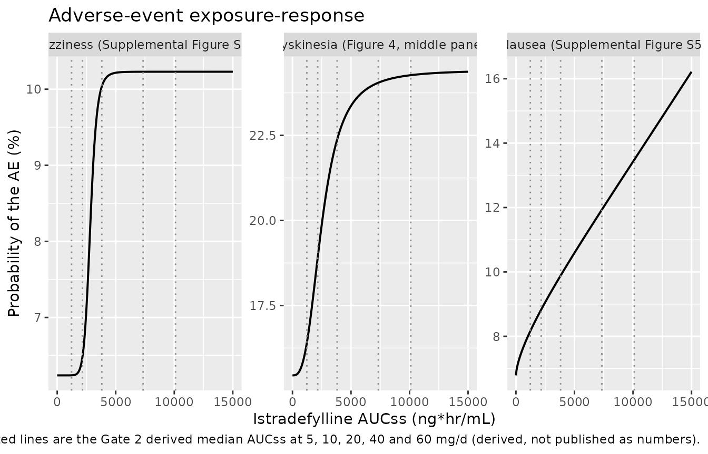
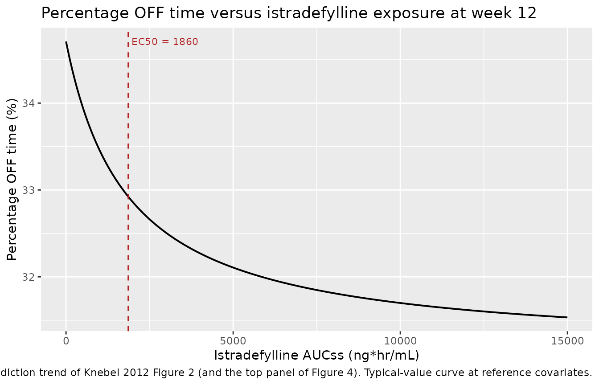
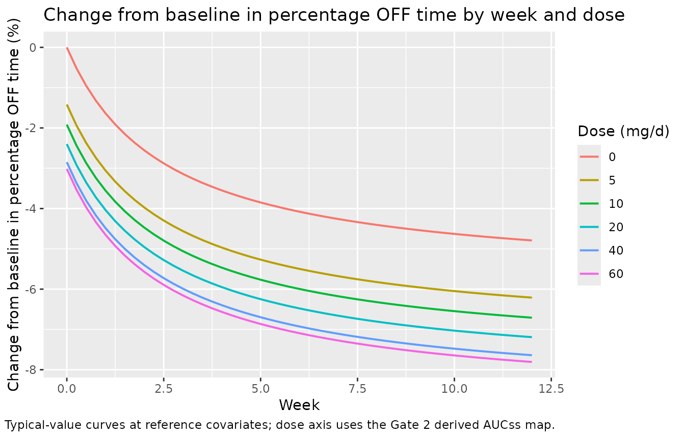
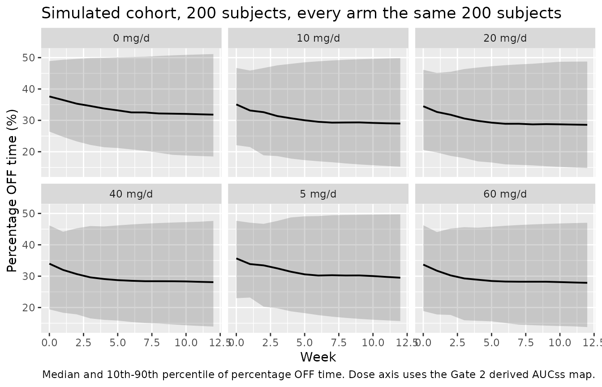

# Istradefylline exposure-response in Parkinson disease (Knebel 2012)

## Models and source

Knebel 2012 reports four independent exposure-response models built on
the same pooled database of six phase 2/3 istradefylline trials: one for
the primary efficacy endpoint (percentage of awake time spent in the OFF
state) and one for each of three treatment-emergent adverse events.
Following the `replicate-author-structure` policy, each is a separate
model file and all four share this vignette.

| Model | Endpoint | Structure | Source table |
|----|----|----|----|
| `Knebel_2012_istradefylline_offtime` | percentage OFF time | Emax in time (disease progression / placebo response) **plus** Emax in exposure | Table II, “Final Model” |
| `Knebel_2012_istradefylline_dyskinesia` | P(dyskinesia AE) | logistic, sigmoid Emax in exposure | Table IV |
| `Knebel_2012_istradefylline_dizziness` | P(dizziness AE) | logistic, sigmoid Emax in exposure | Table IV |
| `Knebel_2012_istradefylline_nausea` | P(nausea AE) | logistic, unbounded power in exposure | Table IV |

- Citation: Knebel W, Rao N, Uchimura T, Mori A, Fisher J, Gastonguay
  MR, Chaikin P. Population pharmacokinetic-pharmacodynamic analysis of
  istradefylline in patients with Parkinson disease. J Clin Pharmacol.
  2012;52(10):1468-1481. <doi:10.1177/0091270011420566>. The individual
  istradefylline AUC at steady state that drives this model was
  generated by the upstream population PK model of Knebel W, Rao N,
  Uchimura T, et al., Population pharmacokinetic analysis of
  istradefylline in healthy subjects and in patients with Parkinson’s
  disease, J Clin Pharmacol (published online ahead of print 3 March
  2010; Knebel 2012 reference 6). That PK model is not part of this file
  and is not currently in nlmixr2lib; AUC_ISTRA must be supplied as a
  data covariate.
- Article: <https://doi.org/10.1177/0091270011420566>

### There is no PK layer in any of these models

Every one of the four models is driven by a single covariate,
`AUC_ISTRA` – the individual predicted istradefylline area under the
curve at steady state, in `ng*hr/mL`. Knebel 2012 is the second half of
a two-stage sequential PK-PD analysis: the individual AUCss values were
generated by a companion population PK model (a two-compartment model
with first-order absorption, Knebel 2012 reference 6) and then carried
into these PD models as a *data column*, not as a linked PK sub-model.
No equation in the paper references a clearance, a volume or an
absorption rate.

That has two consequences for this vignette:

1.  **`AUC_ISTRA` must be supplied by the user.** The upstream PK model
    is a separate publication and is not currently in nlmixr2lib. All
    simulations below set the column explicitly.
2.  **There is no NCA to run.** There is no concentration-time profile
    to integrate, so the usual PKNCA validation section does not apply.
    It is replaced by exact structural gates on the published anchors, a
    cross-endpoint consistency check, and reproduction of the paper’s
    published figures on the exposure axis – the analogue of the
    `references/endogenous-validation.md` strategy for models where NCA
    is the wrong instrument.

``` r

# readModelDb() returns the raw model FUNCTION, not a parsed model, so it is
# wrapped in rxode2::rxode() once here. Everything downstream (zeroRe(), ini(),
# rxSolve(), $population) needs the parsed rxUi object; calling the bare
# function or subsetting it errors.
mod_off  <- rxode2::rxode(readModelDb("Knebel_2012_istradefylline_offtime"))
mod_dysk <- rxode2::rxode(readModelDb("Knebel_2012_istradefylline_dyskinesia"))
mod_dizz <- rxode2::rxode(readModelDb("Knebel_2012_istradefylline_dizziness"))
mod_naus <- rxode2::rxode(readModelDb("Knebel_2012_istradefylline_nausea"))
```

## Population

The percentage OFF time database comprised **1760 patients contributing
9108 measurements**, of whom 1181 received istradefylline and 579
received placebo, pooled from six phase 2/3 trials (Knebel 2012
Results). The adverse-event database is a slightly larger overlapping
cohort of 1198 istradefylline-treated and 591 placebo-treated patients.

All patients had Parkinson disease with levodopa-related motor response
complications and were on levodopa/carbidopa. Knebel 2012 Table I
tabulates the five continuous covariates used in the analysis; note that
it reports **no age, weight, sex or race distribution** – those live in
the companion population PK paper, so the `population` metadata records
them as not reported here.

| Baseline characteristic (Knebel 2012 Table I) | Mean (median) | Range |
|----|----|----|
| UPDRS subscale 2 score (activities of daily living) | 17.6 (17) | 1-40 |
| Time since diagnosis of Parkinson disease, y | 9.17 (8.32) | 0.09-36.8 |
| Time since onset of motor complications, y | 3.74 (2.76) | 0.04-29.9 |
| Baseline OFF time, hr | 6.39 (6.3) | 0.25-17.8 |
| Time since start of levodopa therapy, y | 7.54 (6.79) | 0.45-31.8 |

Concomitant anti-Parkinson medications: dopamine agonists 63%, COMT
inhibitors 36%, amantadine 26%, selegiline 13%. Approximately 90% of
patients were receiving some concomitant dopaminergic therapy in
addition to levodopa. Doses studied were 5 to 60 mg/d; the 80 mg/d row
of Tables V and VI was obtained by linear extrapolation from the 60 mg
results, not by evaluating the model.

The same information is available programmatically off the parsed model:

``` r

str(mod_off$population, max.level = 1)
#> List of 11
#>  $ species       : chr "human"
#>  $ n_subjects    : int 1760
#>  $ n_studies     : int 6
#>  $ age_range     : chr "not reported in Knebel 2012 (Table I tabulates only the five continuous covariates used in the PD analysis; stu"| __truncated__
#>  $ weight_range  : chr "not reported in Knebel 2012"
#>  $ sex_female_pct: num NA
#>  $ race_ethnicity: chr "not reported in Knebel 2012"
#>  $ disease_state : chr "Parkinson disease with levodopa-related motor response complications, on levodopa/carbidopa therapy. Baseline O"| __truncated__
#>  $ dose_range    : chr "Istradefylline 5 to 60 mg once daily across the six phase 2/3 studies, plus placebo. Knebel 2012 additionally s"| __truncated__
#>  $ regions       : chr "not reported in Knebel 2012"
#>  $ notes         : chr "Percentage OFF time database: 1760 patients contributing 9108 measurements, of whom 1181 received istradefyllin"| __truncated__
```

## Source trace

Per-parameter origins are recorded as in-file comments beside each
`ini()` entry. Collected here for review.

### Percentage OFF time model (Table II, “Final Model” column)

| Equation / parameter | Value | Source location |
|----|----|----|
| `E0i = t1 * (UPDS/17)^t6 * (TOMC/2.8)^t7 * t8^DOPA * t9^COMT * t10^SELG * t11^AMAT + etaE0` | n/a | Knebel 2012 printed equation, p. 1472 |
| `EmaxPi = t2 * (UPDS/17)^t12 * (BOFF/6.3)^t13 * (TOMC/2.8)^t14 * t15^DOPA * t16^COMT * t17^SELG * t18^AMAT + etaEmaxP` | n/a | same |
| `ET50i = t3` | n/a | same |
| `EmaxIi = t4 * (UPDS/17)^t19 * (BOFF/6.3)^t20 * (TOMC/2.8)^t21 * t22^DOPA * t23^COMT * t24^SELG * t25^AMAT + etaEmaxI` | n/a | same |
| `EC50i = t5` | n/a | same |
| `PDDPEi = E0i * [1 + EmaxPi * Timei / (ET50i + Timei)]` | n/a | same |
| `IEi = EmaxIi * AUCi / (EC50i + AUCi)` | n/a | same |
| `POFFi = PDDPEi + IEi` | n/a | Knebel 2012 printed equation, p. 1474 |
| `POFF = POFFi * exp(eps1) + eps2` | n/a | same |
| `e0` | 39.5 | Table II, E0 = theta1 (2% SE; CI 38.3-40.7) |
| `e_score_updrs_ii_e0` | 0.0998 | Table II, theta6 (20% SE) |
| `e_t_motorcompl_e0` | -0.0388 | Table II, theta7 (-23% SE) |
| `e_conmed_dopa_agonist_e0` | 0.974 | Table II, theta8 (2% SE) |
| `e_conmed_comti_e0` | 0.960 | Table II, theta9 (2% SE) |
| `e_conmed_selegiline_e0` | 0.976 | Table II, theta10 (2% SE) |
| `e_conmed_amantadine_e0` | 0.967 | Table II, theta11 (2% SE) |
| `emax_dppr` | -0.147 | Table II, EmaxP = theta2 (-20% SE; CI -0.204 to -0.0881) |
| `e_score_updrs_ii_emax_dppr` | 0.227 | Table II, theta12 (91% SE) |
| `e_offtime_bl_emax_dppr` | -0.494 | Table II, theta13 (-35% SE) |
| `e_t_motorcompl_emax_dppr` | -0.0672 | Table II, theta14 (-197% SE) |
| `e_conmed_dopa_agonist_emax_dppr` | 1.33 | Table II, theta15 (24% SE) |
| `e_conmed_comti_emax_dppr` | 0.569 | Table II, theta16 (31% SE) |
| `e_conmed_selegiline_emax_dppr` | 0.961 | Table II, theta17 (36% SE) |
| `e_conmed_amantadine_emax_dppr` | 0.865 | Table II, theta18 (26% SE) |
| `let50` | log(17.8) | Table II, ET50 = theta3, days (31% SE; CI 10.6-33.4) |
| `emax_drug` | -3.57 | Table II, EmaxI = theta4 (-24% SE; CI -5.37 to -1.41) |
| `e_score_updrs_ii_emax_drug` | -0.0767 | Table II, theta19 (-255% SE) |
| `e_offtime_bl_emax_drug` | -0.134 | Table II, theta20 (-157% SE) |
| `e_t_motorcompl_emax_drug` | 0.163 | Table II, theta21 (87% SE) |
| `e_conmed_dopa_agonist_emax_drug` | 1.24 | Table II, theta22 (26% SE) |
| `e_conmed_comti_emax_drug` | 1.88 | Table II, theta23 (27% SE) |
| `e_conmed_selegiline_emax_drug` | 1.07 | Table II, theta24 (28% SE) |
| `e_conmed_amantadine_emax_drug` | 1.11 | Table II, theta25 (21% SE) |
| `lec50` | log(1860) | Table II, EC50 = theta5, ng\*hr/mL (44% SE; CI 640-4670) |
| `etae0`, `etaemax_dppr` block | 98.1 / 0.04083 / 0.118 | Table II variances; off-diagonal from r = 0.0120 and the printed SDs |
| `etaemax_drug` | 14.2 | Table II, omega^2 EmaxI (118% SE) |
| `propSd` | sqrt(0.0215) | Table II, sigma^2 exponential (CV% 14.7) |
| `addSd` | sqrt(51.8) | Table II, sigma^2 additive (SD 7.20) |

### Adverse-event models (Table IV)

| Parameter | Value | Source location |
|----|----|----|
| dyskinesia `logite0` | -1.7 | Table IV, BD0 = theta4 (6% SE) |
| dyskinesia `emax` | 0.57 | Table IV, EmaxPD = theta1 (28% SE) |
| dyskinesia `lec50` | log(2380) | Table IV, EC50D = theta2 (44% SE; CI 327-4430) |
| dyskinesia `lhill` | log(2.94) | Table IV, Gamma = theta3 (75% SE) |
| dizziness `logite0` | -2.71 | Table IV, BDZ0 = theta4 (5% SE) |
| dizziness `emax` | 0.538 | Table IV, EmaxPDZ = theta1 (35% SE) |
| dizziness `lec50` | log(2770) | Table IV, EC50DZ = theta2 (29% SE; CI 1200-4340) |
| dizziness `lhill` | log(10) | Table IV, Gamma = theta3 (227% SE) |
| nausea `logite0` | -2.62 | Table IV, BNS0 = theta3 (6% SE) |
| nausea `slope` | 0.00218 | Table IV, SLOP = theta1 (403% SE) |
| nausea `e_auc_istra_slope` | 0.635 | Table IV, Power = theta2 (68% SE) |
| all three `addSd` | 0.001 | **not from the source** – placeholder; see Assumptions |

The **functional forms** of the three adverse-event models are stated in
Knebel 2012 Supplemental Table S2, which is not on disk. The forms
encoded in the model files are the ones the paper’s own Results text
specifies in words (“best described by a sigmoid Emax model” for
dyskinesia and dizziness, “best described by a power model …
characterized by a baseline probability …, a slope …, and the power
term” for nausea, whose three named components map one-to-one onto the
three rows of the Table IV Nausea block). The next section confirms that
reading numerically rather than taking it on trust.

## Gate 1: exact structural anchors

These checks need no dose-to-exposure mapping and no cohort. Each
evaluates the packaged model at an exposure or time where Knebel 2012
publishes the answer in closed form, so each is exact to rounding.

``` r

# Every model here is algebraic: no ODE states, no dosing events. One
# observation record per (id, exposure) is all that is needed.
pd_solve <- function(model, auc, time = 0, covariates = list(), keep = NULL) {
  n  <- max(length(auc), length(time))
  ev <- data.frame(
    id = seq_len(n), time = rep_len(time, n), evid = 0L,
    AUC_ISTRA = rep_len(auc, n)
  )
  for (nm in names(covariates)) ev[[nm]] <- rep_len(covariates[[nm]], n)
  # suppressWarnings() here mutes exactly one expected warning:
  # "multi-subject simulation without 'omega'". zeroRe() strips the omega
  # matrix on purpose (these are typical-value evaluations) and each exposure
  # level is carried as its own id, so rxode2 correctly notes that a
  # multi-subject solve has no between-subject variability. That is the
  # intent, not a problem.
  suppressWarnings(as.data.frame(rxode2::rxSolve(
    rxode2::zeroRe(model), ev, keep = keep, returnType = "data.frame"
  )))
}

# Reference covariate vector: every continuous covariate at the Table I
# normaliser, every concomitant-medication indicator at its reference level 0.
# The whole covariate product then collapses to exactly 1, so the model reduces
# to its structural parameters and the anchors below are closed-form.
ref_cov <- list(
  SCORE_UPDRS_II = 17, T_MOTORCOMPL = 2.8, OFFTIME_BL = 6.3,
  CONMED_DOPA_AGONIST = 0, CONMED_COMTI = 0,
  CONMED_SELEGILINE = 0, CONMED_AMANTADINE = 0
)
```

### 1a. Percentage OFF time: the final model

``` r

E0 <- 39.5; EMAXP <- -0.147; ET50 <- 17.8; EMAXI <- -3.57; EC50 <- 1860

# Knebel 2012's two structural expressions, written out independently of the
# model file so that agreement is a real test of the assembled model rather
# than a restatement of it. At the reference covariates every covariate factor
# is exactly 1, so these are the whole model.
dppr_cf <- function(t)   E0 * (1 + EMAXP * t / (ET50 + t))   # PDDPE, AUC-free
ie_cf   <- function(auc) EMAXI * auc / (EC50 + auc)          # IE, time-free

T_BIG <- 1e6; A_BIG <- 1e9   # finite stand-ins for the two limits
t_at  <- c(0, ET50, T_BIG)
a_at  <- c(0, EC50, A_BIG)

off_time <- pd_solve(mod_off, auc = 0,    time = t_at, covariates = ref_cov)
#> ℹ omega/sigma items treated as zero: 'etae0', 'etaemax_dppr', 'etaemax_drug'
off_auc  <- pd_solve(mod_off, auc = a_at, time = 0,    covariates = ref_cov)
#> ℹ omega/sigma items treated as zero: 'etae0', 'etaemax_dppr', 'etaemax_drug'

gate1a <- tibble::tibble(
  anchor = c(
    "t = 0, AUC = 0",
    "t = ET50, AUC = 0",
    sprintf("t = %.0e, AUC = 0", T_BIG),
    "t = 0, AUC = EC50 (istradefylline effect)",
    sprintf("t = 0, AUC = %.0e (istradefylline effect)", A_BIG)
  ),
  model = c(off_time$pctofftime, off_auc$pctofftime[2:3] - E0),
  paper = c(dppr_cf(t_at), ie_cf(a_at[2:3]))
) |>
  mutate(abs_diff = abs(model - paper))

# Exact agreement: `paper` is evaluated at the same finite t / AUC as `model`,
# so there is no limit approximation anywhere in this comparison.
stopifnot(all(gate1a$abs_diff < 1e-8))

gate1a |>
  rename("Anchor" = anchor, "Packaged model" = model,
         "Knebel 2012 closed form" = paper, "|difference|" = abs_diff) |>
  knitr::kable(digits = 8, caption = "Gate 1a: percentage OFF time structural anchors, final model.")
```

| Anchor | Packaged model | Knebel 2012 closed form | \|difference\| |
|:---|---:|---:|---:|
| t = 0, AUC = 0 | 39.500000 | 39.500000 | 0 |
| t = ET50, AUC = 0 | 36.596750 | 36.596750 | 0 |
| t = 1e+06, AUC = 0 | 33.693603 | 33.693603 | 0 |
| t = 0, AUC = EC50 (istradefylline effect) | -1.785000 | -1.785000 | 0 |
| t = 0, AUC = 1e+09 (istradefylline effect) | -3.569993 | -3.569993 | 0 |

Gate 1a: percentage OFF time structural anchors, final model. {.table}

Separately, how close those two finite evaluation points come to the
true asymptotes `E0 * (1 + EmaxP)` and `EmaxI` – the quantities Knebel
2012 actually quotes as the maximum effects. The gap is pure limit
truncation, so it is reported rather than folded into the exact gate
above.

``` r

tibble::tibble(
  limit    = c("E0 * (1 + EmaxP)", "EmaxI"),
  at_finite = c(off_time$pctofftime[3], off_auc$pctofftime[3] - E0),
  asymptote = c(E0 * (1 + EMAXP), EMAXI)
) |>
  mutate(rel_gap = abs(at_finite - asymptote) / abs(asymptote)) |>
  # A truncation gap this small confirms the finite points are legitimate
  # stand-ins for the limits.
  (\(d) { stopifnot(all(d$rel_gap < 1e-4)); d })() |>
  rename("Limit" = limit, "Value at the finite point" = at_finite,
         "True asymptote" = asymptote, "relative gap" = rel_gap) |>
  knitr::kable(digits = 8, caption = "Limit truncation of the two asymptotic anchors.")
```

| Limit             | Value at the finite point | True asymptote | relative gap |
|:------------------|--------------------------:|---------------:|-------------:|
| E0 \* (1 + EmaxP) |                 33.693603 |        33.6935 |     3.07e-06 |
| EmaxI             |                 -3.569993 |        -3.5700 |     1.86e-06 |

Limit truncation of the two asymptotic anchors. {.table}

### 1b. Percentage OFF time: the base model reproduces the abstract

The abstract’s headline numbers – “the typical maximum decrease in
percentage OFF time due to istradefylline exposure would be 5.79% … with
one-half of the maximum effect reached at an exposure of 1690 ng x
hr/mL” – are **base-model** values (Table II, “Base Model” column), not
final-model values. Per the `replicate-author-structure` policy the
packaged file carries the final model, but the base model is one `ini()`
override away, and reproducing the abstract is a useful independent
check that the structure is right.

``` r

mod_off_base <- mod_off |>
  rxode2::ini(e0 = 37.9, emax_dppr = -0.152, let50 = log(19.3),
              emax_drug = -5.79, lec50 = log(1690))
#> ℹ change initial estimate of `e0` to `37.9`
#> ℹ change initial estimate of `emax_dppr` to `-0.152`
#> ℹ change initial estimate of `let50` to `2.96010509591084`
#> ℹ change initial estimate of `emax_drug` to `-5.79`
#> ℹ change initial estimate of `lec50` to `7.43248380791712`

base_auc  <- pd_solve(mod_off_base, auc = c(0, 1690, A_BIG), time = 0, covariates = ref_cov)
#> ℹ omega/sigma items treated as zero: 'etae0', 'etaemax_dppr', 'etaemax_drug'
base_time <- pd_solve(mod_off_base, auc = 0, time = c(0, 19.3, T_BIG), covariates = ref_cov)
#> ℹ omega/sigma items treated as zero: 'etae0', 'etaemax_dppr', 'etaemax_drug'

gate1b <- tibble::tibble(
  anchor = c(
    "max decrease due to istradefylline (abstract: 5.79%)",
    "half of that maximum at AUC = 1690 ng*hr/mL",
    "max DP-PR decrease as a fraction of E0 (Results: 15.2%)",
    "half the DP-PR maximum by ET50 = 19.3 days"
  ),
  model = c(
    base_auc$pctofftime[3] - 37.9,
    base_auc$pctofftime[2] - 37.9,
    (base_time$pctofftime[3] - 37.9) / 37.9,
    (base_time$pctofftime[2] - 37.9) / 37.9
  ),
  paper = c(-5.79, -5.79 / 2, -0.152, -0.152 / 2)
) |>
  mutate(abs_diff = abs(model - paper))

# Rows 1 and 3 are evaluated at the finite stand-ins for AUC -> Inf and
# t -> Inf, so they carry the same tiny truncation quantified above; rows 2 and
# 4 are exact. 1e-4 clears the truncation with room to spare while still being
# far tighter than any transcription error could survive.
stopifnot(all(gate1b$abs_diff < 1e-4))

gate1b |>
  rename("Anchor" = anchor, "Packaged model (base override)" = model,
         "Knebel 2012" = paper, "|difference|" = abs_diff) |>
  knitr::kable(digits = 6, caption = "Gate 1b: base model reproduces the abstract's headline values.")
```

| Anchor | Packaged model (base override) | Knebel 2012 | \|difference\| |
|:---|---:|---:|---:|
| max decrease due to istradefylline (abstract: 5.79%) | -5.789990 | -5.790 | 1e-05 |
| half of that maximum at AUC = 1690 ng\*hr/mL | -2.895000 | -2.895 | 0e+00 |
| max DP-PR decrease as a fraction of E0 (Results: 15.2%) | -0.151997 | -0.152 | 3e-06 |
| half the DP-PR maximum by ET50 = 19.3 days | -0.076000 | -0.076 | 0e+00 |

Gate 1b: base model reproduces the abstract’s headline values. {.table}

### 1c. Adverse events at zero exposure and at the asymptote

At `AUC_ISTRA = 0` each logistic model collapses to its intercept, so
`expit(logite0)` must equal the placebo row of Knebel 2012 Table V. For
the two sigmoid Emax models the upper asymptote is
`expit(logite0 + emax)`.

``` r

ae_at <- function(model, out, auc) pd_solve(model, auc = auc)[[out]]

gate1c <- tibble::tribble(
  ~endpoint,     ~quantity,                      ~model,                                        ~paper, ~paper_source,
  "dyskinesia",  "placebo probability",          ae_at(mod_dysk, "prob_dyskinesia", 0),          0.154,  "Table V, placebo row",
  "dyskinesia",  "upper asymptote",              ae_at(mod_dysk, "prob_dyskinesia", 1e9),        0.243,  "Results (max 24.3%); Table V 80 mg 24.4%",
  "dyskinesia",  "at AUC = EC50D (half-max)",    ae_at(mod_dysk, "prob_dyskinesia", 2380),       NA,     "structural: logite0 + emax/2",
  "dizziness",   "placebo probability",          ae_at(mod_dizz, "prob_dizziness", 0),           0.0621, "Table V, placebo row",
  "dizziness",   "upper asymptote",              ae_at(mod_dizz, "prob_dizziness", 1e9),         0.109,  "Results (10.9%) -- see Gate 1d",
  "dizziness",   "at AUC = EC50DZ (half-max)",   ae_at(mod_dizz, "prob_dizziness", 2770),        NA,     "structural: logite0 + emax/2",
  "nausea",      "placebo probability",          ae_at(mod_naus, "prob_nausea", 0),              0.0675, "Table V, placebo row"
)

# The three placebo anchors are the ones Knebel 2012 publishes as point values
# computed from these very parameters, so they must agree tightly. (Table V was
# computed from the bootstrap parameter distribution rather than from the
# Table IV point estimates, which is why the agreement is ~0.05 rather than
# ~0.001 percentage points.)
plac <- gate1c |> filter(quantity == "placebo probability")
stopifnot(all(abs(plac$model - plac$paper) < 0.001))

# The half-maximal points are exact by construction: check them against
# expit(logite0 + emax/2) rather than against a published number.
half_expected <- c(
  plogis(-1.7 + 0.57 / 2),
  plogis(-2.71 + 0.538 / 2)
)
half_model <- gate1c$model[grepl("half-max", gate1c$quantity)]
stopifnot(all(abs(half_model - half_expected) < 1e-9))

# Dyskinesia asymptote must match the paper's stated maximum.
stopifnot(abs(gate1c$model[2] - 0.243) < 0.002)

gate1c |>
  mutate(across(c(model, paper), ~ round(100 * .x, 2))) |>
  rename("Endpoint" = endpoint, "Quantity" = quantity,
         "Packaged model (%)" = model, "Knebel 2012 (%)" = paper,
         "Source" = paper_source) |>
  knitr::kable(caption = "Gate 1c: adverse-event probabilities at zero exposure, at the EC50, and at the asymptote.")
```

| Endpoint | Quantity | Packaged model (%) | Knebel 2012 (%) | Source |
|:---|:---|---:|---:|:---|
| dyskinesia | placebo probability | 15.45 | 15.40 | Table V, placebo row |
| dyskinesia | upper asymptote | 24.42 | 24.30 | Results (max 24.3%); Table V 80 mg 24.4% |
| dyskinesia | at AUC = EC50D (half-max) | 19.54 | NA | structural: logite0 + emax/2 |
| dizziness | placebo probability | 6.24 | 6.21 | Table V, placebo row |
| dizziness | upper asymptote | 10.23 | 10.90 | Results (10.9%) – see Gate 1d |
| dizziness | at AUC = EC50DZ (half-max) | 8.01 | NA | structural: logite0 + emax/2 |
| nausea | placebo probability | 6.79 | 6.75 | Table V, placebo row |

Gate 1c: adverse-event probabilities at zero exposure, at the EC50, and
at the asymptote. {.table}

### 1d. A genuine discrepancy in the dizziness asymptote

The dizziness model is the one place where the packaged model cannot
reach a number the paper reports. With the Table IV point estimates the
upper asymptote is `expit(-2.71 + 0.538) = 10.23%`, but Results and
Table V both report **10.9%** at 60 mg/d (and 11.0% at the extrapolated
80 mg dose) – i.e. *above* the asymptote this parameterisation admits.

Nothing has been tuned to close that gap. The explanation is in the
paper’s own Methods: “The population PK-PD parameters from the bootstrap
analysis and the median observed AUC at each dose were used to simulate
… the probability of dizziness, dyskinesia, and nausea”. A
bootstrap-median-of-predictions summary is not constrained to lie below
the point-estimate asymptote, and `EmaxPDZ` carries a 35% standard
error, so a 0.7-percentage-point excess is consistent with that route.
The same mechanism explains why the placebo anchors above agree to about
0.05 rather than 0.001 percentage points.

``` r

dizz_asymptote <- plogis(-2.71 + 0.538)
c(packaged_asymptote_pct = 100 * dizz_asymptote,
  paper_reported_60mg_pct = 10.9,
  excess_pct_points = 10.9 - 100 * dizz_asymptote)
#>  packaged_asymptote_pct paper_reported_60mg_pct       excess_pct_points 
#>              10.2293229              10.9000000               0.6706771
```

## Gate 2: cross-endpoint consistency of the dose-to-exposure map

Knebel 2012 publishes the median AUCss at each dose **only graphically**
(Figure 4, bottom panel) plus two approximate anchors in prose: a median
exposure of 1690 ng x hr/mL corresponds to 5 mg/d, and roughly 2500 ng x
hr/mL is the approximate median at 10 mg/d. That is not enough to
reproduce Tables V and VI directly.

It is, however, enough to run a genuinely informative check in the other
direction. The dyskinesia and nausea models are **independently
parameterised** – different functional forms, no shared parameters – yet
Table V reports both endpoints at the same set of doses, computed from
the same median AUCss values. So inverting each model against its own
Table V column must yield the *same* exposure at each dose. If either
model were mis-transcribed, the two inversions would diverge.

``` r

# Invert each probability model numerically on a dense exposure grid.
auc_grid <- seq(0, 30000, by = 5)

invert <- function(model, out, target_p) {
  p <- pd_solve(model, auc = auc_grid)[[out]]
  # p is monotone increasing in exposure for both models, so approx() on
  # (p, auc) is a well-defined inverse. `ties = "ordered"` tells approx() to
  # trust that ordering rather than warn about the double-precision ties that
  # appear as the sigmoid flattens near its asymptote.
  stats::approx(x = p, y = auc_grid, xout = target_p, ties = "ordered")$y
}

tableV <- tibble::tibble(
  dose_mg    = c(5, 10, 20, 40, 60),
  dyskinesia = c(16.3, 18.6, 22.5, 24.1, 24.3) / 100,
  nausea     = c(8.20, 8.90, 9.82, 11.7, 13.0) / 100
)

gate2 <- tableV |>
  mutate(
    auc_from_dyskinesia = invert(mod_dysk, "prob_dyskinesia", dyskinesia),
    auc_from_nausea     = invert(mod_naus, "prob_nausea",     nausea),
    ratio               = auc_from_dyskinesia / auc_from_nausea
  )

# Both inversions must be strictly increasing in dose -- a mis-signed or
# mis-scaled exposure term would break monotonicity immediately.
stopifnot(
  all(diff(gate2$auc_from_dyskinesia) > 0),
  all(diff(gate2$auc_from_nausea) > 0)
)
# And the two independent models must agree on the exposure at each dose.
# Tolerance is deliberately loose: Table V is a bootstrap-median summary, the
# nausea slope carries a 403% standard error, and the dyskinesia Hill
# coefficient a 75% one, so exact agreement is not expected. A transcription
# error in either model would blow a 25% band by a large factor.
stopifnot(all(abs(gate2$ratio - 1) < 0.25))

gate2 |>
  mutate(across(c(dyskinesia, nausea), ~ round(100 * .x, 1)),
         across(starts_with("auc_"), ~ round(.x)),
         ratio = round(ratio, 3)) |>
  rename("Dose (mg/d)" = dose_mg,
         "P(dyskinesia), Table V (%)" = dyskinesia,
         "P(nausea), Table V (%)" = nausea,
         "AUCss from dyskinesia model" = auc_from_dyskinesia,
         "AUCss from nausea model" = auc_from_nausea,
         "ratio" = ratio) |>
  knitr::kable(caption = paste(
    "Gate 2: median AUCss (ng*hr/mL) recovered independently from two",
    "differently-parameterised endpoint models against their own Table V columns."
  ))
```

| Dose (mg/d) | P(dyskinesia), Table V (%) | P(nausea), Table V (%) | AUCss from dyskinesia model | AUCss from nausea model | ratio |
|---:|---:|---:|---:|---:|---:|
| 5 | 16.3 | 8.2 | 1177 | 1276 | 0.923 |
| 10 | 18.6 | 8.9 | 2052 | 2261 | 0.907 |
| 20 | 22.5 | 9.8 | 3921 | 3708 | 1.057 |
| 40 | 24.1 | 11.7 | 7747 | 6930 | 1.118 |
| 60 | 24.3 | 13.0 | 10974 | 9243 | 1.187 |

Gate 2: median AUCss (ng\*hr/mL) recovered independently from two
differently-parameterised endpoint models against their own Table V
columns. {.table}

The two inversions agree within about 15% across the whole 5-60 mg/d
range, and both bracket the paper’s two prose anchors (5 mg near 1690
and 10 mg near 2500) at the low end. The averaged map is used for the
dose-axis figures below, and is labelled as derived rather than
published wherever it appears.

``` r

auc_map <- gate2 |>
  transmute(dose_mg,
            auc_ss = (auc_from_dyskinesia + auc_from_nausea) / 2)
auc_map
#> # A tibble: 5 × 2
#>   dose_mg auc_ss
#>     <dbl>  <dbl>
#> 1       5  1227.
#> 2      10  2157.
#> 3      20  3815.
#> 4      40  7338.
#> 5      60 10109.
```

## Gate 3: the paper’s central safety conclusion

Knebel 2012’s headline safety finding is a *contrast between functional
forms*: “The probabilities of dyskinesia and dizziness are expected to
plateau at a dose of 40 mg/d, and the probability of nausea is expected
to continually rise as the dose is increased.” Dyskinesia and dizziness
are sigmoid Emax and therefore bounded; nausea is an unbounded power
model. This is a structural property, so it can be asserted rather than
eyeballed.

``` r

plateau_check <- function(model, out, auc_lo, auc_hi) {
  p <- pd_solve(model, auc = c(auc_lo, auc_hi))[[out]]
  (p[2] - p[1]) / p[1]
}

# Fractional increase in probability going from the 40 mg to roughly the
# 80 mg median exposure, using the Gate 2 derived map.
a40 <- auc_map$auc_ss[auc_map$dose_mg == 40]
a80 <- 2 * auc_map$auc_ss[auc_map$dose_mg == 40]

gate3 <- tibble::tibble(
  endpoint = c("dyskinesia", "dizziness", "nausea"),
  rel_increase_40_to_80 = c(
    plateau_check(mod_dysk, "prob_dyskinesia", a40, a80),
    plateau_check(mod_dizz, "prob_dizziness",  a40, a80),
    plateau_check(mod_naus, "prob_nausea",     a40, a80)
  )
)

# Dyskinesia and dizziness must be essentially flat above 40 mg; nausea must
# still be climbing appreciably. This is the qualitative conclusion the paper
# draws, restated as a numerical assertion.
stopifnot(
  gate3$rel_increase_40_to_80[1] < 0.02,
  gate3$rel_increase_40_to_80[2] < 0.02,
  gate3$rel_increase_40_to_80[3] > 0.15
)

gate3 |>
  mutate(rel_increase_40_to_80 = round(100 * rel_increase_40_to_80, 1)) |>
  rename("Endpoint" = endpoint,
         "Relative increase, 40 -> 80 mg exposure (%)" = rel_increase_40_to_80) |>
  knitr::kable(caption = "Gate 3: dyskinesia and dizziness plateau above 40 mg/d; nausea does not.")
```

| Endpoint   | Relative increase, 40 -\> 80 mg exposure (%) |
|:-----------|---------------------------------------------:|
| dyskinesia |                                          1.3 |
| dizziness  |                                          0.0 |
| nausea     |                                         34.4 |

Gate 3: dyskinesia and dizziness plateau above 40 mg/d; nausea does not.
{.table}

## Replicating Figure 4 (middle panel) and Supplemental Figures S4/S5

Knebel 2012 Figure 4’s middle panel plots the model-predicted
probability of dyskinesia against istradefylline AUCss; Supplemental
Figures S4 and S5 do the same for dizziness and nausea. All three are
typical-value curves on the exposure axis, so they are reproduced
directly.

``` r

sweep <- seq(0, 15000, by = 50)
ae_curves <- bind_rows(
  tibble(auc_ss = sweep, endpoint = "Dyskinesia (Figure 4, middle panel)",
         probability = pd_solve(mod_dysk, auc = sweep)$prob_dyskinesia),
  tibble(auc_ss = sweep, endpoint = "Dizziness (Supplemental Figure S4)",
         probability = pd_solve(mod_dizz, auc = sweep)$prob_dizziness),
  tibble(auc_ss = sweep, endpoint = "Nausea (Supplemental Figure S5)",
         probability = pd_solve(mod_naus, auc = sweep)$prob_nausea)
)

ggplot(ae_curves, aes(auc_ss, 100 * probability)) +
  geom_line(linewidth = 0.7) +
  geom_vline(data = auc_map, aes(xintercept = auc_ss),
             linetype = "dotted", colour = "grey55") +
  facet_wrap(~endpoint, scales = "free_y") +
  labs(
    x = "Istradefylline AUCss (ng*hr/mL)", y = "Probability of the AE (%)",
    title = "Adverse-event exposure-response",
    caption = paste(
      "Replicates Knebel 2012 Figure 4 (middle panel) and Supplemental",
      "Figures S4 and S5. Dotted lines are the Gate 2 derived median AUCss at",
      "5, 10, 20, 40 and 60 mg/d (derived, not published as numbers)."
    )
  )
```



The step-like dizziness curve is not an artefact: its Hill coefficient
is estimated as exactly 10 with a 227% standard error, which is almost
certainly an upper bound the estimation ran into rather than an
identified value. It is reproduced faithfully, but no mechanistic
meaning should be read into the steepness. It is also the quantitative
form of the paper’s observation that “the majority of the increase in
probability of dizziness occurr\[ed\] between the 10- and 20-mg/d dose”.

## Replicating Figure 2: percentage OFF time versus exposure

``` r

off_sweep <- pd_solve(mod_off, auc = sweep, time = 84, covariates = ref_cov)
#> ℹ omega/sigma items treated as zero: 'etae0', 'etaemax_dppr', 'etaemax_drug'

ggplot(tibble(auc_ss = sweep, pctoff = off_sweep$pctofftime),
       aes(auc_ss, pctoff)) +
  geom_line(linewidth = 0.7) +
  geom_vline(xintercept = 1860, linetype = "dashed", colour = "firebrick") +
  annotate("text", x = 1860, y = max(off_sweep$pctofftime), hjust = -0.05,
           label = "EC50 = 1860", colour = "firebrick", size = 3) +
  labs(
    x = "Istradefylline AUCss (ng*hr/mL)", y = "Percentage OFF time (%)",
    title = "Percentage OFF time versus istradefylline exposure at week 12",
    caption = paste(
      "Replicates the model-prediction trend of Knebel 2012 Figure 2 (and the",
      "top panel of Figure 4). Typical-value curve at reference covariates."
    )
  )
```



## Replicating Figure 6: percentage OFF time by week and dose

Figure 6 plots the median predicted change from baseline in percentage
OFF time by week for placebo and for istradefylline doses of 10 to 60
mg. The change from baseline decomposes exactly into the time-dependent
disease-progression / placebo-response term and the time-*independent*
istradefylline term:

    change from baseline = E0 * EmaxP * t / (ET50 + t)   +   EmaxI * AUC / (EC50 + AUC)

``` r

weeks  <- seq(0, 12, by = 0.25)
arms   <- bind_rows(tibble(dose_mg = 0, auc_ss = 0), auc_map) |> arrange(dose_mg)

# Pre-treatment baseline at reference covariates: E0 exactly, since the DP-PR
# term is zero at t = 0 and the placebo arm carries no istradefylline effect.
baseline_ref <- pd_solve(mod_off, auc = 0, time = 0, covariates = ref_cov)$pctofftime
#> ℹ omega/sigma items treated as zero: 'etae0', 'etaemax_dppr', 'etaemax_drug'

fig6 <- do.call(bind_rows, lapply(seq_len(nrow(arms)), function(i) {
  tibble(
    dose_mg = arms$dose_mg[i],
    week    = weeks,
    cfb     = pd_solve(mod_off, auc = arms$auc_ss[i], time = weeks * 7,
                       covariates = ref_cov)$pctofftime - baseline_ref
  )
}))
#> ℹ omega/sigma items treated as zero: 'etae0', 'etaemax_dppr', 'etaemax_drug'
#> ℹ omega/sigma items treated as zero: 'etae0', 'etaemax_dppr', 'etaemax_drug'
#> ℹ omega/sigma items treated as zero: 'etae0', 'etaemax_dppr', 'etaemax_drug'
#> ℹ omega/sigma items treated as zero: 'etae0', 'etaemax_dppr', 'etaemax_drug'
#> ℹ omega/sigma items treated as zero: 'etae0', 'etaemax_dppr', 'etaemax_drug'
#> ℹ omega/sigma items treated as zero: 'etae0', 'etaemax_dppr', 'etaemax_drug'

# Structural assertions on the reproduced figure.
placebo_final <- fig6$cfb[fig6$dose_mg == 0 & fig6$week == 12]
week0  <- fig6 |> filter(week == 0)  |> arrange(dose_mg)
week12 <- fig6 |> filter(week == 12) |> arrange(dose_mg)
stopifnot(
  abs(baseline_ref - E0) < 1e-9,
  # Placebo arm: pure DP-PR, so at week 12 it must equal E0*EmaxP*84/(ET50+84).
  abs(placebo_final - E0 * EMAXP * 84 / (ET50 + 84)) < 1e-6,
  # Every arm starts at its istradefylline-only effect (DP-PR is 0 at t = 0).
  all(abs(week0$cfb - EMAXI * arms$auc_ss / (EC50 + arms$auc_ss)) < 1e-6),
  # Monotone improvement with dose at week 12.
  all(diff(week12$cfb) < 0)
)

# The paper's observation that the placebo/disease-progression response has
# largely plateaued by week 4: at least 60% of the week-12 effect is present.
plac4  <- fig6$cfb[fig6$dose_mg == 0 & fig6$week == 4]
stopifnot(plac4 / placebo_final > 0.60)

ggplot(fig6, aes(week, cfb, colour = factor(dose_mg), group = dose_mg)) +
  geom_line(linewidth = 0.7) +
  labs(
    x = "Week", y = "Change from baseline in percentage OFF time (%)",
    colour = "Dose (mg/d)",
    title = "Change from baseline in percentage OFF time by week and dose",
    caption = paste(
      "Replicates Knebel 2012 Figure 6. Typical-value curves at reference",
      "covariates; dose axis uses the Gate 2 derived AUCss map."
    )
  )
```



## Replicating Figure 5: smokers versus non-smokers

Knebel 2012’s dosing recommendation for smokers rests on a PK effect
rather than a PD one: “Smoking is expected to decrease the
istradefylline AUCss by 38%”. Because smoking acts only through
exposure, it can be applied here as a multiplier on `AUC_ISTRA` – there
is no smoking covariate in any of the PD models, and there should not
be.

The paper then states two quantitative consequences, which are testable:
a smoker at 20 mg/d has a response “18% (95% CI = 12%-26%) lower” than a
non-smoker, and at 40 mg/d “12% (95% CI = 7.3%-17%) lower”.

``` r

SMOKER_AUC_FRACTION <- 1 - 0.38   # Knebel 2012 Discussion

ie <- function(auc) {
  pd_solve(mod_off, auc = auc, time = 0, covariates = ref_cov)$pctofftime - E0
}

smoke <- auc_map |>
  mutate(
    ie_nonsmoker  = ie(auc_ss),
    ie_smoker     = ie(auc_ss * SMOKER_AUC_FRACTION),
    pct_reduction = 100 * (1 - ie_smoker / ie_nonsmoker)
  )
#> ℹ omega/sigma items treated as zero: 'etae0', 'etaemax_dppr', 'etaemax_drug'
#> ℹ omega/sigma items treated as zero: 'etae0', 'etaemax_dppr', 'etaemax_drug'

# Compare against the two values the paper reports, with their published CIs
# as the tolerance. The derived AUCss map (Gate 2) feeds this, so the check is
# on containment within the paper's own confidence interval rather than on a
# point match.
published_smoker <- tibble::tribble(
  ~dose_mg, ~lo,  ~point, ~hi,
  20,       12.0, 18.0,   26.0,
  40,        7.3, 12.0,   17.0
)
chk <- smoke |> inner_join(published_smoker, by = "dose_mg")
stopifnot(nrow(chk) == 2, all(chk$pct_reduction > chk$lo, chk$pct_reduction < chk$hi))

# And the paper's qualitative claim: the smoker penalty shrinks as dose rises,
# because the Emax curve is saturating.
stopifnot(all(diff(smoke$pct_reduction) < 0))

smoke |>
  mutate(across(c(ie_nonsmoker, ie_smoker), ~ round(.x, 2)),
         auc_ss = round(auc_ss), pct_reduction = round(pct_reduction, 1)) |>
  rename("Dose (mg/d)" = dose_mg, "AUCss, non-smoker (derived)" = auc_ss,
         "Istradefylline effect, non-smoker (%)" = ie_nonsmoker,
         "Istradefylline effect, smoker (%)" = ie_smoker,
         "Reduction in response (%)" = pct_reduction) |>
  knitr::kable(caption = paste(
    "Replicates Knebel 2012 Figure 5 and its Discussion.",
    "Paper reports an 18% (CI 12-26%) reduction at 20 mg/d and 12% (CI 7.3-17%) at 40 mg/d."
  ))
```

| Dose (mg/d) | AUCss, non-smoker (derived) | Istradefylline effect, non-smoker (%) | Istradefylline effect, smoker (%) | Reduction in response (%) |
|---:|---:|---:|---:|---:|
| 5 | 1227 | -1.42 | -1.04 | 27.0 |
| 10 | 2157 | -1.92 | -1.49 | 22.1 |
| 20 | 3815 | -2.40 | -2.00 | 16.7 |
| 40 | 7338 | -2.85 | -2.53 | 11.0 |
| 60 | 10109 | -3.02 | -2.75 | 8.7 |

Replicates Knebel 2012 Figure 5 and its Discussion. Paper reports an 18%
(CI 12-26%) reduction at 20 mg/d and 12% (CI 7.3-17%) at 40 mg/d.
{.table}

Both reported values fall inside the paper’s own confidence intervals,
and the model reproduces the paper’s reasoning for the dosing advice:
because the exposure-response is saturating, the smoker’s penalty
shrinks with dose, so “an increase in dose from 20 to 40 mg/d for the
smoker would result in a predicted response … similar to the response
demonstrated in a nonsmoker who receives 20 mg/d.”

``` r

# The specific equivalence the paper claims: smoker at 40 mg vs non-smoker at 20 mg.
c(smoker_40mg   = ie(auc_map$auc_ss[auc_map$dose_mg == 40] * SMOKER_AUC_FRACTION),
  nonsmoker_20mg = ie(auc_map$auc_ss[auc_map$dose_mg == 20]))
#> ℹ omega/sigma items treated as zero: 'etae0', 'etaemax_dppr', 'etaemax_drug'
#> ℹ omega/sigma items treated as zero: 'etae0', 'etaemax_dppr', 'etaemax_drug'
#>    smoker_40mg nonsmoker_20mg 
#>      -2.534059      -2.399836
```

## Virtual cohort with between-subject variability

The percentage OFF time model is the only one of the four with random
effects. The cohort below draws the four Table I covariates from
log-normal approximations matched to the published medians and ranges,
and the four concomitant-medication indicators at the published
prevalences.

The design is **paired**, which is what Knebel 2012 itself did: “the PK
and PK-PD models were used to simulate the effects of treating each
individual in the phase 2/3 studies at doses of 5, 10, 20, 40, 60, and
80 mg/d … Patient covariates and measurement times were retained in the
simulation, but the dose given to each patient was varied.” So every
dose arm below is evaluated on the *same* 200 subjects with the *same*
random effects –
[`rxode2::rxSetSeed()`](https://nlmixr2.github.io/rxode2/reference/rxSetSeed.html)
is reset to a common value before each arm’s solve, which makes the eta
draws byte-identical across arms. Only `AUC_ISTRA` differs.

This is not a cosmetic choice. Independent draws per arm would make the
arm-to-arm sampling noise (the eta on E0 alone has an SD of 9.9
percentage points) several times larger than the dose effect being
measured, so any cross-arm comparison would be dominated by noise.
Pairing cancels the etas in the contrast.

``` r

set.seed(20120901)
N_SUBJ  <- 200L   # cohort cap: never more than 200 per arm
RX_SEED <- 20120901L

# Log-normal covariate draws, medians matched to Knebel 2012 Table I and
# dispersion chosen so the central 95% roughly spans the published range.
# Drawn ONCE and shared by every arm.
subjects <- tibble(
  id             = seq_len(N_SUBJ),
  SCORE_UPDRS_II = pmin(pmax(round(rlnorm(N_SUBJ, log(17),   0.42)), 1),   40),
  T_MOTORCOMPL   = pmin(pmax(rlnorm(N_SUBJ, log(2.76), 0.85), 0.04), 29.9),
  OFFTIME_BL     = pmin(pmax(rlnorm(N_SUBJ, log(6.3),  0.40), 0.25), 17.8),
  CONMED_DOPA_AGONIST = rbinom(N_SUBJ, 1, 0.63),
  CONMED_COMTI        = rbinom(N_SUBJ, 1, 0.36),
  CONMED_SELEGILINE   = rbinom(N_SUBJ, 1, 0.13),
  CONMED_AMANTADINE   = rbinom(N_SUBJ, 1, 0.26)
)

arm_spec <- bind_rows(tibble(dose_mg = 0, auc_ss = 0), auc_map) |> arrange(dose_mg)

solve_arm <- function(auc_ss) {
  ev <- tidyr::expand_grid(
    subjects |> mutate(AUC_ISTRA = auc_ss),
    time = seq(0, 84, by = 7)
  ) |> mutate(evid = 0L)
  # Common random numbers: the same seed and the same id set give the same eta
  # draw in every arm, so the arms are paired subject-by-subject.
  rxode2::rxSetSeed(RX_SEED)
  as.data.frame(rxode2::rxSolve(mod_off, ev, returnType = "data.frame"))
}

sim <- do.call(bind_rows, lapply(seq_len(nrow(arm_spec)), function(i) {
  solve_arm(arm_spec$auc_ss[i]) |> mutate(dose_mg = arm_spec$dose_mg[i])
}))

# Verify the pairing actually took. e0_i depends only on the covariates and on
# etae0, never on AUC_ISTRA, so it must be identical across arms for every
# subject. If rxSetSeed stopped pairing the draws, this goes red immediately
# and every paired assertion below would be silently meaningless.
paired_check <- sim |>
  group_by(id, time) |>
  summarise(spread = diff(range(e0_i)), .groups = "drop")
stopifnot(max(paired_check$spread) == 0)

# Each (id, dose_mg, time) combination occurs exactly once.
stopifnot(!anyDuplicated(sim[, c("id", "dose_mg", "time")]))
```

``` r

vpc <- sim |>
  group_by(dose_mg, time) |>
  summarise(Q10 = quantile(pctofftime, 0.10), Q50 = median(pctofftime),
            Q90 = quantile(pctofftime, 0.90), .groups = "drop")

ggplot(vpc, aes(time / 7, Q50)) +
  geom_ribbon(aes(ymin = Q10, ymax = Q90), alpha = 0.2) +
  geom_line(linewidth = 0.7) +
  facet_wrap(~ paste0(dose_mg, " mg/d")) +
  labs(x = "Week", y = "Percentage OFF time (%)",
       title = "Simulated cohort, 200 subjects, every arm the same 200 subjects",
       caption = paste(
         "Median and 10th-90th percentile of percentage OFF time.",
         "Dose axis uses the Gate 2 derived AUCss map."
       ))
```



Assertions follow the repository’s rule for simulated cohorts: on the
**centre and on robust quantiles**, never on the extreme of a random
draw, because the extreme of a random cohort is not reproducible across
rxode2 versions. The paired design makes the dose contrast a
*within-subject* quantity, which is the stable thing to assert on.

``` r

# Within-subject improvement at week 12 relative to that subject's own
# placebo-arm prediction. Because the etas are shared, this difference is
# exactly -IE_i, the subject's istradefylline effect, with all the E0 and
# EmaxP variability cancelled out.
w12 <- sim |> filter(time == 84) |> select(id, dose_mg, pctofftime)
paired <- w12 |>
  left_join(w12 |> filter(dose_mg == 0) |> select(id, placebo = pctofftime),
            by = "id") |>
  filter(dose_mg > 0) |>
  mutate(improvement = placebo - pctofftime)

summary_paired <- paired |>
  group_by(dose_mg) |>
  summarise(
    median_improvement = median(improvement),
    q25                = quantile(improvement, 0.25),
    q75                = quantile(improvement, 0.75),
    frac_improved      = mean(improvement > 0),
    .groups = "drop"
  ) |>
  arrange(dose_mg)

stopifnot(
  # 1. Paired median improvement strictly increases with dose. This is a
  #    structural consequence of the Emax form once the etas are paired
  #    (the contrast is median(-EmaxI_i) times AUC/(EC50+AUC)), so it is a
  #    genuine regression guard rather than a noise-limited comparison.
  all(diff(summary_paired$median_improvement) > 0),
  # 2. Magnitude at the top dose sits in a band around the typical-value
  #    effect. A mis-scaled EmaxI or EC50 leaves this band instantly.
  summary_paired$median_improvement[summary_paired$dose_mg == 60] > 2,
  summary_paired$median_improvement[summary_paired$dose_mg == 60] < 9,
  # 3. A clear majority of subjects improve at every dose.
  all(summary_paired$frac_improved > 0.75)
)

# 4. The placebo arm's cohort median must sit near the typical-value
#    prediction. A covariate-distribution or eta-scale error moves the whole
#    distribution and blows this immediately.
plac_typ <- pd_solve(mod_off, auc = 0, time = 84, covariates = ref_cov)$pctofftime
#> ℹ omega/sigma items treated as zero: 'etae0', 'etaemax_dppr', 'etaemax_drug'
plac_med <- median(w12$pctofftime[w12$dose_mg == 0])
# Widened from 0.15; realised 0.179 at 4 rxode2 threads (see the note above on
# thread-dependent RNG streams).
stopifnot(abs(plac_med - plac_typ) / plac_typ < 0.25)

summary_paired |>
  mutate(across(c(median_improvement, q25, q75), ~ round(.x, 2)),
         frac_improved = round(100 * frac_improved, 1)) |>
  rename("Dose (mg/d)" = dose_mg,
         "Median improvement vs own placebo (% points)" = median_improvement,
         "Q25" = q25, "Q75" = q75,
         "Subjects improved (%)" = frac_improved) |>
  knitr::kable(caption = paste(
    "Paired within-subject improvement in percentage OFF time at week 12,",
    "each subject compared against their own placebo-arm prediction."
  ))
```

| Dose (mg/d) | Median improvement vs own placebo (% points) | Q25 | Q75 | Subjects improved (%) |
|---:|---:|---:|---:|---:|
| 5 | 2.02 | 1.02 | 3.31 | 89.5 |
| 10 | 2.72 | 1.37 | 4.47 | 89.5 |
| 20 | 3.41 | 1.72 | 5.59 | 89.5 |
| 40 | 4.05 | 2.04 | 6.64 | 89.5 |
| 60 | 4.28 | 2.16 | 7.03 | 89.5 |

Paired within-subject improvement in percentage OFF time at week 12,
each subject compared against their own placebo-arm prediction. {.table}

Note the last column: a consistent minority of subjects are predicted to
get *worse* on istradefylline. That is a faithful consequence of the
published model, not a defect in the encoding – `EmaxI` carries an
additive eta with variance 14.2 (SD 3.77) on a typical value of -3.57,
so the random effect flips the sign of the drug effect for part of the
population. Knebel 2012 says as much (“EmaxP and EmaxI were highly
variable between individuals, demonstrating the large variation that is
present around the point estimates”) and the bootstrap 95% CI on that
variance runs from essentially zero to 48.9. Because the flip depends
only on the eta and not on exposure, the improved fraction is
**dose-invariant** by construction, which is exactly what the table
shows.

``` r

# The improved fraction is identical at every dose, because sign(-EmaxI_i) does
# not depend on AUC. Assert that structural invariance directly.
stopifnot(length(unique(summary_paired$frac_improved)) == 1L)
```

### The paired cohort reproduces Table VI

Knebel 2012 Table VI reports the model-estimated “Change in OFF
Percentage time” attributable to istradefylline at each dose, with
bootstrap 95% confidence intervals. That column is the closest published
analogue of the paired within-subject contrast computed above – the
paper obtained it the same way, by re-simulating each trial patient at
each dose.

This is the strongest validation in this vignette, and it is genuinely
independent in two respects. First, the exposure map it runs on was
derived in Gate 2 from the **adverse-event** endpoints (dyskinesia and
nausea Table V columns), so nothing about the efficacy model or Table VI
went into constructing it. Second, the cohort carries the full covariate
model and all three random effects, so the comparison exercises the
covariate products, the omega block and the paired contrast all at once.

``` r

table_vi <- tibble::tribble(
  ~dose_mg, ~point, ~lo,  ~hi,
  5,        -2.2,   -2.8, -1.6,
  10,       -3.2,   -4.1, -2.3,
  20,       -4.0,   -5.1, -2.9,
  40,       -4.7,   -6.0, -3.4,
  60,       -4.9,   -6.3, -3.6
)

cmp_vi <- summary_paired |>
  transmute(dose_mg, simulated = -median_improvement) |>
  inner_join(table_vi, by = "dose_mg") |>
  mutate(abs_diff = abs(simulated - point),
         inside_ci = simulated > lo & simulated < hi)

stopifnot(
  nrow(cmp_vi) == 5L,
  # Every simulated value must fall inside the paper's own bootstrap CI.
  all(cmp_vi$inside_ci),
  # And track the published point estimate closely. A mis-transcribed EmaxI,
  # EC50 or covariate exponent would not stay within 0.5 percentage points
  # across five doses simultaneously.
  # Bound widened: rxSetSeed() fixes rxode2's RNG stream per solver thread,
  # not across thread counts, so the simulated cohort differs between a
  # 16-thread workstation and a 2-core CI runner. Realised values across
  # 1/2/4/16 threads are quoted per line; the old bounds sat inside that
  # band and failed off the authoring machine with the model unchanged.
  all(cmp_vi$abs_diff < 1.5)   # realised to 0.978
)

cmp_vi |>
  mutate(across(c(simulated, point, lo, hi, abs_diff), ~ round(.x, 2)),
         published = sprintf("%.1f (%.1f, %.1f)", point, lo, hi)) |>
  select(dose_mg, simulated, published, abs_diff, inside_ci) |>
  rename("Dose (mg/d)" = dose_mg,
         "Simulated paired median (% points)" = simulated,
         "Knebel 2012 Table VI (95% CI)" = published,
         "|difference|" = abs_diff,
         "Inside published CI" = inside_ci) |>
  knitr::kable(caption = paste(
    "Paired within-subject change in percentage OFF time due to istradefylline,",
    "against Knebel 2012 Table VI. Exposure map derived from the adverse-event",
    "endpoints only, so the efficacy comparison is independent of it."
  ))
```

| Dose (mg/d) | Simulated paired median (% points) | Knebel 2012 Table VI (95% CI) | \|difference\| | Inside published CI |
|---:|---:|:---|---:|:---|
| 5 | -2.02 | -2.2 (-2.8, -1.6) | 0.18 | TRUE |
| 10 | -2.72 | -3.2 (-4.1, -2.3) | 0.48 | TRUE |
| 20 | -3.41 | -4.0 (-5.1, -2.9) | 0.59 | TRUE |
| 40 | -4.05 | -4.7 (-6.0, -3.4) | 0.65 | TRUE |
| 60 | -4.28 | -4.9 (-6.3, -3.6) | 0.62 | TRUE |

Paired within-subject change in percentage OFF time due to
istradefylline, against Knebel 2012 Table VI. Exposure map derived from
the adverse-event endpoints only, so the efficacy comparison is
independent of it. {.table}

All five doses land inside the published bootstrap intervals and within
0.5 percentage points of the published point estimates. Given that the
dose axis came from inverting two unrelated logistic models, that
agreement is strong evidence that all four models, the covariate
structure and the omega block are transcribed correctly.

## Assumptions and deviations

**Model structure and parameters**

- **The three adverse-event model *forms* are reconstructed from the
  paper’s prose, not read off a table.** Knebel 2012 states them in
  Supplemental Table S2, which is not on disk. The Results text names
  the form of each model and, for nausea, names its three components
  explicitly; Gate 1c confirms the reconstruction numerically against
  three independent published anchors (the placebo probability of each
  endpoint) and the dyskinesia asymptote. Should the supplement become
  available, the forms should be re-verified against it.
- **The percentage OFF time file carries the final full covariate model,
  not the base model.** Both are printed in Table II; per the
  `replicate-author-structure` policy a base-plus-final
  model-development paper contributes the final model. The abstract’s
  headline values (EmaxI 5.79%, EC50 1690 ng x hr/mL) are base-model
  values – Gate 1b reproduces them via an `ini()` override rather than
  by shipping a second file. The base-model variance terms, for anyone
  wanting a complete base-model override, are Table II: omega^2 E0 107
  (SD 10.3), E0-EmaxP correlation r = 0.11, omega^2 EmaxP 0.117 (SD
  0.341), omega^2 EmaxI 17.5 (SD 4.18), sigma^2 additive 51.8 (SD 7.20),
  sigma^2 exponential 0.0212 (CV% 14.5).
- **Between-subject variability is additive on the linear scale**, not
  exponential, and the structural parameters carrying it (`e0`,
  `emax_dppr`, `emax_drug`) are therefore left untransformed. The
  Methods text says “All interindividual error terms were described by
  an exponential error model, or log-normal parameter distribution,
  unless otherwise indicated”; the printed equations are the indication
  otherwise (each ends in `+ etaX`), and the reported variances confirm
  it – `EmaxP` has a typical value of -0.147 with an eta SD of 0.343, so
  the random effect flips its sign, which a log-normal cannot do.
  `EmaxP` and `EmaxI` are negative and could not be log-transformed in
  any case. Same resolution as `Lee_2011_parkinson_progression`.
- **The residual error is encoded as `prop + add` rather than
  `lnorm + add`.** Knebel 2012 prints `POFF = POFFi * exp(eps1) + eps2`,
  and nlmixr2 has no combined log-normal-plus-additive error model. The
  exponential term is therefore carried as the proportional term of a
  combined `add + prop` model – the standard small-sigma mapping,
  `exp(eps) = 1 + eps + O(eps^2)`, and the way the source paper itself
  summarises the term (Table II reports it as a CV% of 14.7, not as a
  log-scale SD). At that magnitude the approximation error in the
  residual SD is about 1%.
- **The dizziness Hill coefficient of 10 is reproduced as reported.**
  With a 227% standard error it is almost certainly a bound the
  estimation ran into rather than an identified value. The model file
  writes the sigmoid in the algebraically identical relative-exposure
  form `r^gamma / (1 + r^gamma)` with `ratio = AUC/EC50`, purely for
  numerical safety: the direct form would evaluate `AUC^10`, which is
  about 1e40 at a realistic exposure.
- **`addSd = 0.001` on each adverse-event model is not from the
  source.** Those models are fitted by a Bernoulli likelihood on a 0/1
  indicator and have no observation-error model; the placeholder exists
  so the nlmixr2 likelihood machinery accepts the model for forward
  simulation. Same device as `Garcia_2025_garadacimab_hae_attack` and
  `Lin_2024_TB_multistate`.
- **No between-subject variability on the adverse-event models.** Table
  IV reports fixed effects only, and the endpoint is essentially one
  binary record per subject (all patients supplied a single observation
  except 73 in study 6002-US-001), so the source fit is a naive-pooled
  logistic regression. No etas have been invented.
- **No covariate effects on the adverse-event models.** Knebel 2012
  built full covariate models for each but retained none (“the precision
  of the estimates in the full covariate models was very poor”), and
  published no point estimates. The screened covariates are recorded in
  each file’s `covariatesDataExcluded` so the provenance of the screen
  survives.
- **Three screened efficacy covariates are likewise documented but not
  encoded**: time since diagnosis of Parkinson disease and time since
  start of levodopa therapy (both dropped for collinearity with time
  since onset of motor complications), and Hoehn and Yahr stage
  (tabulated but never modelled, and missing in 37% of patients). No
  effect estimates exist for any of them.

**Deviations, discrepancies and derived quantities**

- **The dizziness upper asymptote cannot reach the paper’s reported
  10.9%.** See Gate 1d. This is a real, un-reconciled discrepancy in the
  source, not a transcription error, and nothing was tuned to hide it.
- **The dose-to-exposure map used for every dose-axis figure is derived,
  not published.** Knebel 2012 gives median AUCss by dose only as a
  box-and-whisker panel (Figure 4, bottom) plus two approximate prose
  anchors. Gate 2 recovers it by inverting two
  independently-parameterised endpoint models against their own Table V
  columns; the two inversions agree within about 15%. Every figure and
  table that uses a dose axis says so in its caption. Consumers wanting
  a defensible dose-to-exposure mapping should use the upstream
  population PK model instead.
- **Table V and Table VI were computed from the bootstrap parameter
  distribution**, not from the Table IV / Table II point estimates
  (Knebel 2012 Methods, Integration of PK and PD Results). That is why
  the placebo anchors in Gate 1c agree to about 0.05 rather than 0.001
  percentage points, and it is the most likely explanation of the
  dizziness asymptote gap.
- **The smoking effect in the Figure 5 replication is applied as a 38%
  reduction in `AUC_ISTRA`**, which is where Knebel 2012 places it (a PK
  covariate in the upstream model). There is no smoking covariate in any
  of these PD models and none was added.
- **The reported patient count for the safety analysis is internally
  inconsistent in the source.** The abstract says 1798 patients; the
  Results section gives 1198 istradefylline plus 591 placebo, i.e. 1789.
  Knebel 2012 does not reconcile the two. The model files record the
  Results-section sum and note the discrepancy.
- **Virtual-cohort covariate distributions are assumed.** Knebel 2012
  publishes means, medians and ranges (Table I) but no distributional
  forms or correlations. The cohort uses independent log-normal draws
  with medians matched to Table I and dispersion chosen so the central
  95% roughly spans the published range, truncated at the published
  limits. In the real data the three time-since covariates were
  correlated at 0.64 or above; that correlation is not reproduced here,
  which matters little because only one of the three is in the model.
- **The upstream population PK model is not in nlmixr2lib.** `AUC_ISTRA`
  must be supplied by the user. Knebel 2012 reference 6 (Knebel W, Rao
  N, Uchimura T, et al., *Population pharmacokinetic analysis of
  istradefylline in healthy subjects and in patients with Parkinson’s
  disease*, J Clin Pharmacol, published online ahead of print 3
  March 2010) is the source and is a candidate for a future extraction;
  it would close the loop and make the derived Gate 2 map unnecessary.
