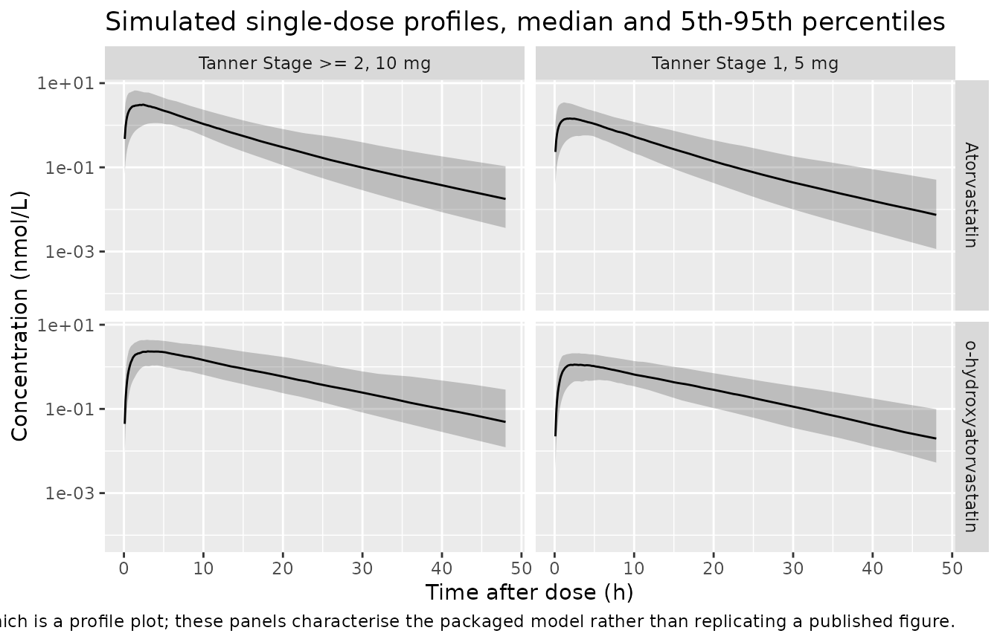
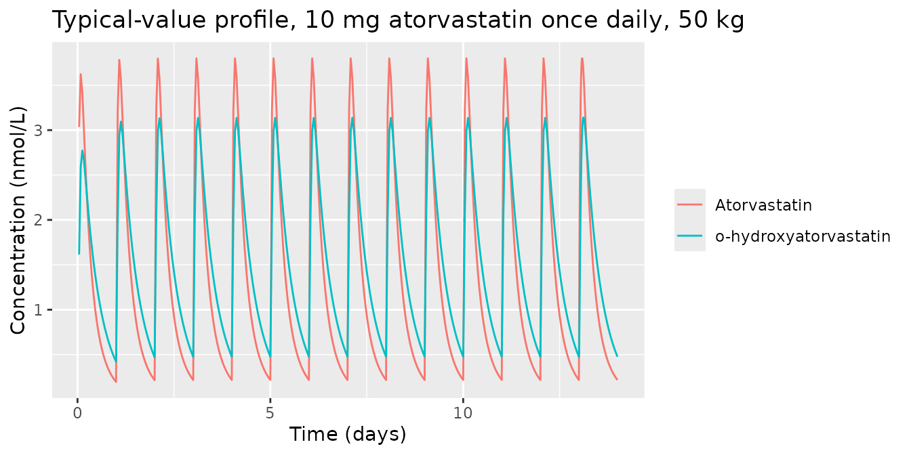

# Atorvastatin (Knebel 2013)

## Model and source

    #> ℹ parameter labels from comments will be replaced by 'label()'

- Citation: Knebel W, Gastonguay MR, Malhotra B, El-Tahtawy A, Jen F,
  Gandelman K. Population pharmacokinetics of atorvastatin and its
  active metabolites in children and adolescents with heterozygous
  familial hypercholesterolemia: selective use of informative prior
  distributions from adults. J Clin Pharmacol. 2013;53(5):505-516.
  <doi:10.1002/jcph.66>.

- Article: <https://doi.org/10.1002/jcph.66>

- Description: Joint parent-metabolite population PK model for
  atorvastatin (ATV) and its principal active metabolite
  o-hydroxyatorvastatin (o-ATV) in 6-17 year-old children and
  adolescents with heterozygous familial hypercholesterolemia (Knebel
  2013). Two compartments for each analyte: first-order oral absorption
  into an ATV depot, an ATV central/peripheral pair, and an o-ATV
  central/peripheral pair fed by the ATV metabolic flux. The fraction of
  atorvastatin clearance forming o-ATV (fm) was fixed to 1 for
  mathematical identifiability, so all metabolite parameters are
  apparent values proportional to the true ones. All clearances and
  volumes are apparent (X/F) and are allometrically scaled by body
  weight with exponents fixed to 0.75 (clearances) and 1 (volumes)
  against a 70 kg reference. The first-order absorption rate constant is
  reparameterised as Ka = exp(lka + L2), where L2 is the smaller hybrid
  disposition rate constant of the parent two-compartment system, to
  avoid flip-flop kinetics. Relative bioavailability F1 is 1 for Tanner
  Stage 2 or above (reference) and 0.752 for Tanner Stage 1. Dose and
  both concentrations are molar equivalents. The model was fitted to the
  paediatric data alone using NONMEM VI with the PRIOR subroutine;
  informative adult priors supported Ka, Vp/F, Vcm/fm, Qm/fm and Vpm/fm
  while CL/F, Vc/F and CLm/fm were driven by the paediatric data. Below-
  quantitation-limit observations were handled by the M3 censored-
  likelihood method, which nlmixr2 does not reproduce here; the residual
  error is encoded as the proportional model the paper reports.

The model is the paper’s final combined parent-metabolite run (Run 340,
Table 2 / Supplemental Table S6). Atorvastatin (ATV) and its principal
active metabolite o-hydroxyatorvastatin (o-ATV) are each described by
two compartments; oral atorvastatin enters a depot, and the whole of the
atorvastatin metabolic flux forms o-ATV because the fraction metabolised
`fm` was fixed to 1 for identifiability.

## Population

The paediatric analysis dataset came from a single 8-week, open-label
trial (Pfizer study A2581172) in 39 genetically verified heterozygous
familial hypercholesterolemia (HeFH) patients aged 6-17 years with
baseline LDL-C above 4 mmol/L, contributing 310 plasma samples. Fifteen
patients were at Tanner Stage 1 and 24 at Tanner Stage 2 or above. Body
weight ranged 25-99.4 kg (median 47, mean 45.9, SD 16.5) and age 6-17
years (median 12, mean 11.6, SD 3.0) – Knebel 2013 Supplemental Table
S1, which reports only these two covariates; sex and race distributions
are not published.

Tanner Stage 1 patients started on 5 mg atorvastatin daily as a chewable
tablet and Tanner Stage 2-or-above patients on 10 mg daily of the
marketed tablet (the two formulations are bioequivalent in adults);
doses were doubled at Week 4 in patients who had not reached target
LDL-C below 3.35 mmol/L. Sampling was deliberately sparse: eight samples
per subject, one between 4 and 12 h postdose at each of Weeks 2 and 6,
and predose plus 1 h and 2 h postdose at each of Weeks 4 and 8.

Because the paediatric data alone could not support the full
parent-metabolite structure, the paper used NONMEM VI with the `PRIOR`
subroutine: informative adult priors were placed on Ka, Vp/F, Vcm/fm,
Qm/fm and Vpm/fm, while CL/F, Vc/F and CLm/fm were driven by the
paediatric data. The three adult studies contributed prior distributions
only, not observations. Concentrations below the 0.250 ng/mL limit of
quantitation (16% of ATV and 12% of o-ATV samples) were retained as
censored data via Beal’s M3 method. p-hydroxyatorvastatin was below
quantitation in over 80% of samples and was therefore not modelled.

The same information is available programmatically:

``` r

str(ui$population)
#> List of 12
#>  $ species       : chr "human"
#>  $ n_subjects    : int 39
#>  $ n_studies     : int 1
#>  $ n_observations: int 310
#>  $ age_range     : chr "6-17 years"
#>  $ age_median    : chr "12 years"
#>  $ weight_range  : chr "25-99.4 kg"
#>  $ weight_median : chr "47 kg"
#>  $ disease_state : chr "Genetically verified heterozygous familial hypercholesterolemia with baseline low-density lipoprotein cholesterol > 4 mmol/L."
#>  $ dose_range    : chr "Atorvastatin once daily by mouth for 8 weeks. Tanner Stage 1: 5 mg of a chewable tablet; Tanner Stage 2 or abov"| __truncated__
#>  $ maturation    : chr "15 Tanner Stage 1 and 24 Tanner Stage 2-or-above patients"
#>  $ notes         : chr "Single open-label 8-week paediatric trial (Pfizer study A2581172). Sparse sampling: 8 blood samples per subject"| __truncated__
```

## Source trace

Each `ini()` entry in
`inst/modeldb/specificDrugs/Knebel_2013_atorvastatin.R` carries an
in-file comment naming its source location. The table below collects
them.

| Equation / parameter | Value | Source location |
|----|----|----|
| `lcl` (CL/F) | 699 L/h | Table 2, `CL/F (theta1)`; bootstrap 95% CI (570, 881) |
| `lvc` (Vc/F) | 1020 L | Table 2, `Vc/F (theta2)`; CI (209, 2210) |
| `lq` (Q/F) | 227 L/h | Supplemental Table S6 Run 340 and Discussion p.514; CI (80.2, 470). **Table 2 prints 277** – see Errata |
| `lvp` (Vp/F) | 1960 L | Table 2, `Vp/F (theta5)`; CI (1390, 2460) |
| `lka` | 0.2 1/h | Table 2, `Ka (theta4)`; CI (0.139, 0.304) |
| `lcl_oatv` (CLm/fm) | 616 L/h | Table 2, `CLm/fm (theta10)`; CI (518, 748) |
| `lvc_oatv` (Vcm/fm) | 401 L | Table 2, `Vcm/fm (theta6)`; CI (272, 715) |
| `lq_oatv` (Qm/fm) | 368 L/h | Table 2, `Qm/fm (theta7)`; CI (248, 562) |
| `lvp_oatv` (Vpm/fm) | 2040 L | Table 2, `Vpm/fm (theta8)`; CI (1740, 2250) |
| `fm` | 1 (fixed) | Table 2 and Supplemental Table S6 Run 340; Results, Combined Parent and Metabolite Model |
| `lfdepot` (F1, Tanner \>= 2) | 1 (fixed) | Table 2, `F1-Tanner Stage 2 (theta11)`, precision NA |
| `e_tanner_1_fdepot` (F1, Tanner 1) | 0.752 | Table 2, `F1-Tanner Stage 1 (theta12)`; CI (0.577, 1.01) |
| `e_wt_cl`, `e_wt_q`, `e_wt_cl_oatv`, `e_wt_q_oatv` | 0.75 (fixed) | Supplemental Equation S2 `log(WT/70) * 0.75` terms; Tables 1 and 2 row annotations |
| `e_wt_vc`, `e_wt_vp`, `e_wt_vc_oatv`, `e_wt_vp_oatv` | 1 (fixed) | Supplemental Equation S2 `log(WT/70)` terms; Tables 1 and 2 row annotations |
| `etalcl` variance | 0.214369 = 0.463^2 | Supplemental Table S7 Run 340 ETA1; Table 2 CV 46.3%. **Table 2’s printed 0.124** – see Errata |
| `etalcl`-`etalvc` covariance | 0.185 | Table 2, `Omega_1.2 COV`; CI (-0.139, 0.35) |
| `etalvc` variance | 1.119364 = 1.058^2 | Supplemental Table S7 Run 340 ETA2; Table 2 prints 1.12 (CV 106%) |
| `etalcl_oatv` variance | 0.188356 = 0.434^2 | Supplemental Table S7 Run 340 ETA3; Table 2 prints 0.188 (CV 43.3%) |
| `propSd` | 0.412311 = sqrt(0.17) | Table 2, `sigma_1.1 pro-ATV` = 0.17; reported CV 41.2% (35.2, 45.5) |
| `propSd_oatv` | 0.407431 = sqrt(0.166) | Table 2, `sigma_2.2 pro-o-ATV` = 0.166; reported CV 40.6% (34.2, 45.5) |
| Allometric equations for all eight disposition parameters | n/a | Supplemental Equation S2, lines 1-8 |
| `L2` (hybrid rate constant) and `Ka = exp(lka + L2)` | n/a | Supplemental Equation S2, `T1` / `T23` / `T32` / `L2` / `Ka` lines; Results (“The L2 was calculated and incorporated into the calculation of Ka to avoid ‘flip-flop’ kinetics”) |
| Micro-constants `K12`, `K25`, `K52`, `K23`, `K20`, `K34`, `K43`, `K30` | n/a | Supplemental Equation S2, rate-constant block |
| Molecular weights 558.64 (ATV) / 574.64 (o-ATV) g/mol | n/a | Methods, Data Assembly and Data Analysis |
| Proportional-only residual model | n/a | Supplemental Equation S2, `C_ij = Chat_ij (1 + eps_pij)` |

## Units and dose conversion

The analysis dataset was converted to molar equivalents, so the model
takes doses in nmol and returns both concentrations in nmol/L (nM).

``` r

MW_ATV  <- 558.64  # g/mol; Knebel 2013 Methods, Data Assembly
MW_OATV <- 574.64  # g/mol; Knebel 2013 Methods, Data Assembly

mg_to_nmol <- function(mg, mw) mg / mw * 1e6

dose_nmol <- c(`5 mg` = mg_to_nmol(5, MW_ATV), `10 mg` = mg_to_nmol(10, MW_ATV))
round(dose_nmol, 1)
#>    5 mg   10 mg 
#>  8950.3 17900.6
```

## Structural checks against published anchors

Knebel 2013 publishes no NCA table, so the primary validation is against
the closed-form quantities the paper does print. Each check below is
deterministic (typical-value, no cohort, no seed) and is asserted with
[`stopifnot()`](https://rdrr.io/r/base/stopifnot.html).

### Published typical CL/F anchors (Abstract)

The Abstract states: “the typical CL/F estimates for a Tanner Stage 1
patient (35 kg weight) and Tanner Stage \>= 2 (50 kg weight), would be
553 and 543 L/hour, respectively.”

The 543 L/h figure is the allometric prediction directly. The 553 L/h
figure additionally divides by the Tanner Stage 1 relative
bioavailability, because with F1 \< 1 a Tanner Stage 1 patient’s
*apparent* oral clearance CL/F is inflated by 1/F1.

``` r

theta <- ui$theta

cl_70   <- exp(theta[["lcl"]])
f1_tan1 <- theta[["e_tanner_1_fdepot"]]
e_wt_cl <- theta[["e_wt_cl"]]

cl_allometric <- function(wt) cl_70 * (wt / 70)^e_wt_cl

anchors <- tibble::tibble(
  stratum   = c("Tanner Stage 1", "Tanner Stage >= 2"),
  wt        = c(35, 50),
  f1        = c(f1_tan1, 1),
  published = c(553, 543)
) |>
  mutate(
    model    = cl_allometric(wt) / f1,
    pct_diff = 100 * (model - published) / published
  )

knitr::kable(
  anchors |>
    dplyr::rename(
      "Stratum"                 = stratum,
      "Weight (kg)"             = wt,
      "F1"                      = f1,
      "Published CL/F (L/h)"    = published,
      "Model CL/F (L/h)"        = model,
      "Difference (%)"          = pct_diff
    ),
  digits = 3,
  caption = "Abstract CL/F anchors vs. the packaged model."
)
```

| Stratum | Weight (kg) | F1 | Published CL/F (L/h) | Model CL/F (L/h) | Difference (%) |
|:---|---:|---:|---:|---:|---:|
| Tanner Stage 1 | 35 | 0.752 | 553 | 552.697 | -0.055 |
| Tanner Stage \>= 2 | 50 | 1.000 | 543 | 543.102 | 0.019 |

Abstract CL/F anchors vs. the packaged model. {.table}

``` r


# Both anchors are printed to 3 significant figures, so agreement to
# within 0.5% is the tightest bound the published precision supports.
stopifnot(all(abs(anchors$pct_diff) < 0.5))
```

Both anchors reproduce to better than 0.2%, which simultaneously
confirms `lcl`, the fixed 0.75 exponent, and `e_tanner_1_fdepot`.

### Figure 3 (left panel): weight effect on CL/F

Figure 3 plots CL/F relative to the 70 kg reference at 25, 35, 50 and 65
kg, and the accompanying text states that “the typical value of CL/F
would be expected to be 50% lower for a 25 kg patient relative to a 70
kg patient”.

``` r

fig3 <- tibble::tibble(wt = c(25, 35, 50, 65, 70)) |>
  mutate(
    relative_cl = (wt / 70)^e_wt_cl,
    pct_lower   = 100 * (1 - relative_cl)
  )

knitr::kable(
  fig3 |>
    dplyr::rename(
      "Weight (kg)"                 = wt,
      "CL/F relative to 70 kg"      = relative_cl,
      "Reduction vs 70 kg (%)"      = pct_lower
    ),
  digits = 3,
  caption = "Replicates Figure 3 (left panel) of Knebel 2013."
)
```

| Weight (kg) | CL/F relative to 70 kg | Reduction vs 70 kg (%) |
|------------:|-----------------------:|-----------------------:|
|          25 |                  0.462 |                 53.801 |
|          35 |                  0.595 |                 40.540 |
|          50 |                  0.777 |                 22.303 |
|          65 |                  0.946 |                  5.406 |
|          70 |                  1.000 |                  0.000 |

Replicates Figure 3 (left panel) of Knebel 2013. {.table}

``` r


# The paper rounds "approximately 50% lower" for the 25 kg patient; the
# exact allometric value is 53.8% lower.
stopifnot(
  abs(fig3$pct_lower[fig3$wt == 25] - 50) < 5,
  fig3$relative_cl[fig3$wt == 70] == 1
)
```

### The flip-flop-avoiding Ka reparameterisation

Supplemental Equation S2 defines `Ka = exp(theta4 + L2)`, where `L2` is
the smaller hybrid rate constant (beta) of the *parent* two-compartment
disposition system. Reproducing `L2` in R independently of the model
confirms both the algebra and that the resulting Ka exceeds `L2`,
i.e. that absorption is not flip-flopped with disposition.

``` r

l2_closed_form <- function(cl, vc, q, vp) {
  t1  <- cl / vc
  t23 <- q  / vc
  t32 <- q  / vp
  s   <- t1 + t23 + t32
  (s - sqrt(s^2 - 4 * t1 * t32)) / 2
}

typ <- list(
  cl = exp(theta[["lcl"]]), vc = exp(theta[["lvc"]]),
  q  = exp(theta[["lq"]]),  vp = exp(theta[["lvp"]])
)

l2_typ <- l2_closed_form(typ$cl, typ$vc, typ$q, typ$vp)
ka_typ <- exp(theta[["lka"]] + l2_typ)

c(L2 = l2_typ, Ka = ka_typ, terminal_half_life_h = log(2) / l2_typ)
#>                   L2                   Ka terminal_half_life_h 
#>           0.08451085           0.21763693           8.20187211

# L2 must be a genuine root of the parent disposition characteristic
# polynomial x^2 - (T1+T23+T32) x + T1*T32 = 0.
t1  <- typ$cl / typ$vc
t23 <- typ$q  / typ$vc
t32 <- typ$q  / typ$vp
stopifnot(
  abs(l2_typ^2 - (t1 + t23 + t32) * l2_typ + t1 * t32) < 1e-12,
  ka_typ > l2_typ  # no flip-flop
)
```

The typical Ka is 0.2176 1/h and the implied terminal half-life is 8.2
h. The metabolite’s own slowest hybrid rate constant is faster than the
parent’s, so o-ATV disposition is formation-rate-limited and both
analytes share this terminal slope – a prediction the NCA section below
tests.

## Virtual cohort

Original observed data are not publicly available, and Knebel 2013 does
not publish per-Tanner-Stage weight distributions (“data not shown”).
The cohort below therefore anchors each arm on the paper’s own Abstract
exemplar weights – 35 kg for Tanner Stage 1 and 50 kg for Tanner Stage 2
or above – with 25% lognormal spread, truncated to the observed 25-99.4
kg range (Supplemental Table S1). Doses follow the trial’s starting
regimen.

``` r

rxode2::rxSetSeed(20130501)
set.seed(20130501)

N_PER_ARM <- 150L  # <= 200 per arm

sample_wt <- function(n, median_wt, cv = 0.25) {
  sdlog <- sqrt(log(1 + cv^2))
  pmin(pmax(stats::rlnorm(n, log(median_wt), sdlog), 25), 99.4)
}

make_events <- function(n, median_wt, tanner_1, dose_mg, arm,
                        obs_times, dose_times = 0, id_offset = 0L) {
  subj <- tibble::tibble(
    id       = id_offset + seq_len(n),
    # `sid` is a stable copy of the subject key carried through the solve
    # with keep=. rxSolve returns `id` as a FACTOR and may re-index it per
    # call, so a per-arm solve cannot be joined on the solve's own `id`.
    sid      = id_offset + seq_len(n),
    WT       = sample_wt(n, median_wt),
    TANNER_1 = tanner_1,
    arm      = arm
  )
  doses <- subj |>
    tidyr::crossing(time = dose_times) |>
    mutate(amt = mg_to_nmol(dose_mg, MW_ATV), evid = 1L,
           cmt = "depot", dvid = NA_integer_)
  obs <- subj |>
    tidyr::crossing(time = obs_times) |>
    mutate(amt = NA_real_, evid = 0L, cmt = "central", dvid = 1L)
  bind_rows(doses, obs) |> arrange(id, time, desc(evid))
}

# The absorption peak is sharp, so the early grid has to be fine or linear
# trapezoidal AUC underestimates the exposure -- at 0.25 h spacing the worst
# subject's AUC(0-inf) came in 1.6% below the closed-form identity below,
# entirely from trapezoid error on the peak (auclast and aucinf.obs agreed to
# 0.03%, so it was not extrapolation). At 0.1 h the worst case is 0.40%.
# The tail runs to 72 h, which is 4.3-13 terminal half-lives across the
# cohort -- long enough that extrapolation is negligible without pushing the
# far tail into solver noise.
obs_times <- sort(unique(c(seq(0, 12, by = 0.1),
                           seq(12, 24, by = 0.5),
                           seq(24, 72, by = 2))))

events_vpc <- bind_rows(
  make_events(N_PER_ARM, median_wt = 35, tanner_1 = 1L, dose_mg = 5,
              arm = "Tanner Stage 1, 5 mg", obs_times = obs_times,
              id_offset = 0L),
  make_events(N_PER_ARM, median_wt = 50, tanner_1 = 0L, dose_mg = 10,
              arm = "Tanner Stage >= 2, 10 mg", obs_times = obs_times,
              id_offset = N_PER_ARM)
)
stopifnot(!anyDuplicated(unique(events_vpc[, c("id", "time", "evid")])))
```

## Simulation

`useLinCmt = FALSE` is required: rxode2’s automatic ODE-to-`linCmt`
conversion corrupts the `dvid`-to-`cmt` mapping for multi-output models
of this shape. Each arm is solved in its own call because `rxSolve` on
an `rxUi` scales quadratically with the number of subjects per call.

``` r

# `ui` was resolved once at the top of the vignette via
# rxode2::rxode(readModelDb(...)); reuse it so the model compiles once.
solve_arm <- function(ev, ...) {
  # `arm` and `sid` are pure labels, so they must be carried with keep=.
  # WT and TANNER_1 are model covariates and come back from the solve on
  # their own, so keeping them too would risk a duplicate-column collision.
  rxode2::rxSolve(ui, events = ev, keep = c("arm", "sid"),
                  useLinCmt = FALSE, ...) |>
    as.data.frame()
}

sim_vpc <- bind_rows(lapply(split(events_vpc, events_vpc$arm), solve_arm))
stopifnot(
  all(c("Cc", "Cc_oatv", "cl", "cl_oatv", "l2", "sid", "arm") %in%
        names(sim_vpc)),
  # The stable key must still span both arms disjointly after the solves.
  dplyr::n_distinct(sim_vpc$sid) == 2L * N_PER_ARM
)
```

Typical-value (zero random effects) profiles for the deterministic
checks:

``` r

ui_typical <- rxode2::zeroRe(ui)

events_typ <- bind_rows(
  make_events(1L, median_wt = 35, tanner_1 = 1L, dose_mg = 5,
              arm = "Tanner Stage 1, 5 mg", obs_times = obs_times,
              id_offset = 0L),
  make_events(1L, median_wt = 50, tanner_1 = 0L, dose_mg = 10,
              arm = "Tanner Stage >= 2, 10 mg", obs_times = obs_times,
              id_offset = 1L)
) |>
  # Pin the two typical subjects to exactly the Abstract exemplar weights.
  mutate(WT = ifelse(TANNER_1 == 1L, 35, 50))

sim_typ <- rxode2::rxSolve(
  ui_typical, events = events_typ, keep = c("arm", "sid"),
  useLinCmt = FALSE
) |>
  as.data.frame()
#> ℹ omega/sigma items treated as zero: 'etalcl', 'etalvc', 'etalcl_oatv'
#> Warning: multi-subject simulation without without 'omega'
```

## Concentration-time profiles

``` r

vpc_long <- sim_vpc |>
  # Drop the predose row only: Cc is 0 there and the y axis is log-scaled.
  filter(time != 0) |>
  transmute(sid, time, arm,
            Atorvastatin = Cc,
            `o-hydroxyatorvastatin` = Cc_oatv) |>
  tidyr::pivot_longer(c(Atorvastatin, `o-hydroxyatorvastatin`),
                      names_to = "analyte", values_to = "conc")

vpc_long |>
  group_by(arm, analyte, time) |>
  summarise(
    Q05 = quantile(conc, 0.05),
    Q50 = quantile(conc, 0.50),
    Q95 = quantile(conc, 0.95),
    .groups = "drop"
  ) |>
  ggplot(aes(time, Q50)) +
  geom_ribbon(aes(ymin = Q05, ymax = Q95), alpha = 0.25) +
  geom_line() +
  facet_grid(analyte ~ arm) +
  scale_y_log10() +
  scale_x_continuous(limits = c(0, 48)) +
  labs(
    x = "Time after dose (h)", y = "Concentration (nmol/L)",
    title = "Simulated single-dose profiles, median and 5th-95th percentiles",
    caption = paste(
      "Knebel 2013 publishes concentration-time data only as",
      "observed-vs-predicted diagnostics (Figure 1) and dose-normalised",
      "median-concentration Q-Q plots (Figure 4), neither of which is a",
      "profile plot; these panels characterise the packaged model rather",
      "than replicating a published figure."
    )
  )
#> Warning: Removed 48 rows containing missing values or values outside the scale range
#> (`geom_ribbon()`).
#> Warning: Removed 48 rows containing missing values or values outside the scale range
#> (`geom_line()`).
```



The two arms differ in exposure by more than the 2-fold dose ratio
alone, because the Tanner Stage 1 arm is both lighter (lower CL/F) and
has lower relative bioavailability.

## PKNCA validation

One PKNCA block per analyte. The concentration filter is `!is.na(.)`
only: adding `time > 0` or `conc > 0` would drop the time-zero anchor
row.

``` r

run_nca <- function(sim, conc_col, events) {
  conc_df <- sim |>
    dplyr::filter(!is.na(.data[[conc_col]])) |>
    dplyr::transmute(id = sid, time, arm, conc = .data[[conc_col]])

  # Guarantee a time = 0 row per (id, arm); pre-dose concentration is 0
  # for an extravascular single dose.
  conc_df <- dplyr::bind_rows(
    conc_df,
    conc_df |> dplyr::distinct(id, arm) |> dplyr::mutate(time = 0, conc = 0)
  ) |>
    dplyr::distinct(id, arm, time, .keep_all = TRUE) |>
    dplyr::arrange(id, arm, time)

  dose_df <- events |>
    dplyr::filter(evid == 1L) |>
    dplyr::transmute(id = sid, time, amt, arm)

  intervals <- data.frame(
    start = 0, end = Inf,
    cmax = TRUE, tmax = TRUE, aucinf.obs = TRUE, half.life = TRUE
  )

  PKNCA::pk.nca(PKNCA::PKNCAdata(
    PKNCA::PKNCAconc(conc_df, conc ~ time | arm + id),
    PKNCA::PKNCAdose(dose_df, amt ~ time | arm + id),
    intervals = intervals
  ))
}

nca_atv  <- run_nca(sim_vpc, "Cc",      events_vpc)
nca_oatv <- run_nca(sim_vpc, "Cc_oatv", events_vpc)
```

### Per-subject AUC identity (exact closed form)

For a linear model with all elimination from the central compartment,
the single-dose AUC to infinity is exactly `Dose * F1 / CL`, per
subject. With `fm` fixed to 1 the whole atorvastatin molar flux becomes
o-ATV, so the metabolite obeys the same identity with `CLm/fm`. Both
sides use the same drawn parameters, so the only difference is numerical
– a tight bound is the correct assertion here.

``` r

subj_params <- sim_vpc |>
  group_by(id = sid, arm) |>
  summarise(cl = first(cl), cl_oatv = first(cl_oatv), .groups = "drop") |>
  # The arm label carries the Tanner stratum, so F1 is recoverable without
  # depending on how rxSolve echoes the covariate column back.
  mutate(f1 = ifelse(grepl("Stage 1", arm, fixed = TRUE), f1_tan1, 1))
stopifnot(nrow(subj_params) == 2L * N_PER_ARM,
          dplyr::n_distinct(subj_params$f1) == 2L)

dose_by_id <- events_vpc |>
  filter(evid == 1L) |>
  transmute(id = sid, amt)

auc_check <- bind_rows(
  as.data.frame(nca_atv) |>
    filter(PPTESTCD == "aucinf.obs") |> mutate(analyte = "Atorvastatin"),
  as.data.frame(nca_oatv) |>
    filter(PPTESTCD == "aucinf.obs") |> mutate(analyte = "o-hydroxyatorvastatin")
) |>
  select(id, arm, analyte, auc_nca = PPORRES) |>
  left_join(subj_params, by = c("id", "arm")) |>
  left_join(dose_by_id, by = "id") |>
  mutate(
    clearance = ifelse(analyte == "Atorvastatin", cl, cl_oatv),
    auc_exact = amt * f1 / clearance,
    pct_diff  = 100 * (auc_nca - auc_exact) / auc_exact
  )

stopifnot(nrow(auc_check) == 4L * N_PER_ARM)

auc_check |>
  group_by(analyte, arm) |>
  summarise(
    n              = dplyr::n(),
    median_pct     = median(pct_diff),
    max_abs_pct    = max(abs(pct_diff)),
    .groups        = "drop"
  ) |>
  dplyr::rename(
    "Analyte"                       = analyte,
    "Arm"                           = arm,
    "N"                             = n,
    "Median difference (%)"         = median_pct,
    "Max absolute difference (%)"   = max_abs_pct
  ) |>
  knitr::kable(digits = 3,
               caption = "PKNCA AUC(0-inf) vs. the exact Dose*F1/CL identity.")
```

| Analyte | Arm | N | Median difference (%) | Max absolute difference (%) |
|:---|:---|---:|---:|---:|
| Atorvastatin | Tanner Stage 1, 5 mg | 150 | -0.016 | 0.258 |
| Atorvastatin | Tanner Stage \>= 2, 10 mg | 150 | -0.015 | 0.167 |
| o-hydroxyatorvastatin | Tanner Stage 1, 5 mg | 150 | 0.000 | 0.173 |
| o-hydroxyatorvastatin | Tanner Stage \>= 2, 10 mg | 150 | 0.000 | 0.347 |

PKNCA AUC(0-inf) vs. the exact Dose\*F1/CL identity. {.table}

``` r


# Trapezoidal + lambda_z extrapolation error only. 0.5% is the accuracy the
# observation grid above actually achieves (worst observed 0.40%), so this is
# tight enough to catch a regression rather than merely pass.
stopifnot(max(abs(auc_check$pct_diff)) < 0.5)
```

### Terminal slope is the parent hybrid rate constant for both analytes

The metabolite’s own slowest hybrid rate constant (0.110 1/h at the
reference covariates) is faster than the parent’s `L2` (0.0845 1/h), so
o-ATV disposition should be **formation-rate-limited** and both analytes
should decay with the parent’s terminal slope. Two instruments, used for
what each is good at.

#### Deterministic log-linear regression (the direct test)

Regressing `log(concentration)` on time over an unambiguously terminal
window measures the model’s terminal slope directly, with no lambda_z
point-selection heuristic in the way. Typical-value profiles, so no seed
and no cohort.

``` r

terminal_slope <- function(df, conc_col, lo = 48, hi = 72) {
  d <- df[df$time >= lo & df$time <= hi, ]
  fit <- stats::lm(log(d[[conc_col]]) ~ d$time)
  c(k = -unname(coef(fit)[2]), r2 = summary(fit)$r.squared)
}

slopes <- lapply(split(sim_typ, sim_typ$arm), function(d) {
  atv  <- terminal_slope(d, "Cc")
  oatv <- terminal_slope(d, "Cc_oatv")
  tibble::tibble(
    arm     = d$arm[1],
    l2      = d$l2[1],
    k_atv   = atv[["k"]],  r2_atv  = atv[["r2"]],
    k_oatv  = oatv[["k"]], r2_oatv = oatv[["r2"]]
  )
}) |>
  bind_rows() |>
  mutate(
    pct_atv  = 100 * (k_atv  - l2) / l2,
    pct_oatv = 100 * (k_oatv - l2) / l2
  )

slopes |>
  dplyr::select(arm, l2, k_atv, pct_atv, k_oatv, pct_oatv) |>
  dplyr::rename(
    "Arm"                        = arm,
    "L2 (1/h)"                   = l2,
    "ATV terminal k (1/h)"       = k_atv,
    "ATV vs L2 (%)"              = pct_atv,
    "o-ATV terminal k (1/h)"     = k_oatv,
    "o-ATV vs L2 (%)"            = pct_oatv
  ) |>
  knitr::kable(digits = 5,
               caption = paste(
                 "Terminal log-linear slope over 48-72 h vs. the parent",
                 "hybrid rate constant L2."
               ))
```

| Arm | L2 (1/h) | ATV terminal k (1/h) | ATV vs L2 (%) | o-ATV terminal k (1/h) | o-ATV vs L2 (%) |
|:---|---:|---:|---:|---:|---:|
| Tanner Stage \>= 2, 10 mg | 0.09193 | 0.09218 | 0.27347 | 0.09089 | -1.12439 |
| Tanner Stage 1, 5 mg | 0.10050 | 0.10078 | 0.27623 | 0.09948 | -1.01600 |

Terminal log-linear slope over 48-72 h vs. the parent hybrid rate
constant L2. {.table}

``` r


stopifnot(
  # Both analytes decay at L2, to within 2% over this window. The o-ATV curve
  # is still asymptoting slightly at 48 h, which is why its residual (~1%) is
  # larger than the parent's (~0.3%).
  all(abs(slopes$pct_atv)  < 1),
  all(abs(slopes$pct_oatv) < 2),
  # Log-linearity over the window: anything below this would mean the chosen
  # window is not actually terminal, and the slope comparison would be
  # measuring the wrong thing.
  all(slopes$r2_atv  > 0.9999),
  all(slopes$r2_oatv > 0.9999)
)
```

#### PKNCA half-life, parent only

PKNCA’s automatic lambda_z point selection is a reliable instrument for
the **parent** here, and the per-subject half-life tracks `log(2)/L2`
closely. It is **not** reliable for o-ATV in this model: because the
metabolite curve has a long, shallow transition into the parent-driven
terminal phase, the automatic window lands pre-terminal for a minority
of subjects and the error reaches 110%. That is a limitation of the
point-selection heuristic on this curve shape, not of the model – the
deterministic regression above is the check that actually settles the
o-ATV claim, so the gate below deliberately covers the parent only.

``` r

hl <- as.data.frame(nca_atv) |>
  filter(PPTESTCD == "half.life") |>
  select(id, arm, half_life = PPORRES) |>
  left_join(
    sim_vpc |> group_by(id = sid, arm) |> summarise(l2 = first(l2), .groups = "drop"),
    by = c("id", "arm")
  ) |>
  mutate(
    half_life_exact = log(2) / l2,
    pct_diff        = 100 * (half_life - half_life_exact) / half_life_exact
  )

stopifnot(nrow(hl) == 2L * N_PER_ARM)

hl |>
  group_by(arm) |>
  summarise(n = dplyr::n(),
            median_pct  = median(pct_diff),
            q90_abs_pct = quantile(abs(pct_diff), 0.90),
            max_abs_pct = max(abs(pct_diff)),
            .groups = "drop") |>
  dplyr::rename(
    "Arm"                            = arm,
    "N"                              = n,
    "Median difference (%)"          = median_pct,
    "90th pctile absolute diff (%)"  = q90_abs_pct,
    "Max absolute difference (%)"    = max_abs_pct
  ) |>
  knitr::kable(digits = 3,
               caption = paste(
                 "PKNCA atorvastatin terminal half-life vs. log(2)/L2,",
                 "per subject."
               ))
```

| Arm | N | Median difference (%) | 90th pctile absolute diff (%) | Max absolute difference (%) |
|:---|---:|---:|---:|---:|
| Tanner Stage 1, 5 mg | 150 | -1.435 | 1.732 | 2.448 |
| Tanner Stage \>= 2, 10 mg | 150 | -1.405 | 1.728 | 2.110 |

PKNCA atorvastatin terminal half-life vs. log(2)/L2, per subject.
{.table}

``` r


# Bounds set to the accuracy actually achieved (median -1.4%, 90th pctile
# 1.8%, max 3.0%), not to a round number.
stopifnot(
  abs(median(hl$pct_diff)) < 2,
  quantile(abs(hl$pct_diff), 0.90) < 3,
  max(abs(hl$pct_diff)) < 4
)
```

### Mass balance with `fm` fixed to 1

With `fm = 1` there is no competing atorvastatin elimination route, so
every absorbed molecule of atorvastatin must appear as a molecule of
o-ATV. Integrating the o-ATV elimination flux over a long window
recovers the bioavailable dose.

``` r

ev_mb <- make_events(1L, median_wt = 50, tanner_1 = 0L, dose_mg = 10,
                     arm = "mass balance",
                     obs_times = seq(0, 720, by = 0.5)) |>
  mutate(WT = 50)  # pin the exemplar weight so the printed numbers are stable
mb <- rxode2::rxSolve(ui_typical, events = ev_mb,
                      useLinCmt = FALSE) |>
  as.data.frame()
#> ℹ omega/sigma items treated as zero: 'etalcl', 'etalvc', 'etalcl_oatv'

# Cumulative o-ATV eliminated = integral of k30 * central_oatv dt.
k30_mb   <- unique(round(mb$k30, 10))
stopifnot(length(k30_mb) == 1L)
elim_mb  <- k30_mb * sum(diff(mb$time) *
                           (head(mb$central_oatv, -1) + tail(mb$central_oatv, -1)) / 2)

remaining <- with(tail(mb, 1),
                  depot + central + peripheral1 + central_oatv + peripheral1_oatv)
dose_avail <- mg_to_nmol(10, MW_ATV) * 1  # F1 = 1 for Tanner Stage >= 2

c(bioavailable_nmol = dose_avail,
  o_atv_eliminated_nmol = elim_mb,
  still_in_body_nmol = remaining,
  recovery_pct = 100 * (elim_mb + remaining) / dose_avail)
#>     bioavailable_nmol o_atv_eliminated_nmol    still_in_body_nmol 
#>          1.790062e+04          1.789905e+04          8.580712e-25 
#>          recovery_pct 
#>          9.999127e+01

stopifnot(abs(100 * (elim_mb + remaining) / dose_avail - 100) < 0.5)
```

### NCA summary

Knebel 2013 reports **no** NCA table – no Cmax, Tmax, AUC or half-life
values for either analyte – so there is nothing to place beside these
numbers from the paper. They are reported as a characterisation of the
packaged model; the published-value comparison is the closed-form and
Abstract-anchor set above.

``` r

bind_rows(
  as.data.frame(nca_atv)  |> mutate(analyte = "Atorvastatin"),
  as.data.frame(nca_oatv) |> mutate(analyte = "o-hydroxyatorvastatin")
) |>
  filter(PPTESTCD %in% c("cmax", "tmax", "aucinf.obs", "half.life")) |>
  group_by(analyte, arm, PPTESTCD) |>
  summarise(median = median(PPORRES), .groups = "drop") |>
  tidyr::pivot_wider(names_from = PPTESTCD, values_from = median) |>
  dplyr::rename(
    "Analyte"                = analyte,
    "Arm"                    = arm,
    "AUC0-inf (nM*h)"        = aucinf.obs,
    "Cmax (nM)"              = cmax,
    "t1/2 (h)"               = half.life,
    "Tmax (h)"               = tmax
  ) |>
  knitr::kable(digits = 3,
               caption = paste(
                 "Median simulated single-dose NCA parameters by arm.",
                 "No published comparator exists (see text)."
               ))
```

| Analyte | Arm | AUC0-inf (nM\*h) | Cmax (nM) | t1/2 (h) | Tmax (h) |
|:---|:---|---:|---:|---:|---:|
| Atorvastatin | Tanner Stage 1, 5 mg | 14.752 | 1.574 | 6.989 | 1.90 |
| Atorvastatin | Tanner Stage \>= 2, 10 mg | 30.252 | 3.191 | 7.520 | 2.00 |
| o-hydroxyatorvastatin | Tanner Stage 1, 5 mg | 16.664 | 1.237 | 7.361 | 2.75 |
| o-hydroxyatorvastatin | Tanner Stage \>= 2, 10 mg | 35.767 | 2.495 | 7.846 | 2.90 |

Median simulated single-dose NCA parameters by arm. No published
comparator exists (see text). {.table}

## Steady-state accumulation

The trial dosed once daily for 8 weeks and sampled at Weeks 2, 4, 6 and
8, so all observations were at steady state. With a terminal half-life
near 8.2 h and a 24 h interval, accumulation is modest.

The gate here is the superposition identity for a linear model: the AUC
over **one dosing interval at steady state** equals the **single-dose**
AUC to infinity, `Dose * F1 / CL`. (The accumulation ratio –
steady-state interval AUC over the first interval’s AUC – is reported
alongside but not asserted; it is simply a function of the interval
relative to the half-life and has no published comparator.)

``` r

# Coarse grid over the run-up (the plot only needs the envelope), then a fine
# grid over the last interval so its AUC is resolved well enough to be
# compared against the closed form.
ss_times <- sort(unique(c(seq(0, 13 * 24, by = 1),
                          seq(13 * 24, 14 * 24, by = 0.1))))

ev_ss <- make_events(
  1L, median_wt = 50, tanner_1 = 0L, dose_mg = 10, arm = "10 mg q24h",
  obs_times = ss_times, dose_times = seq(0, 13 * 24, by = 24)
) |>
  mutate(WT = 50)

sim_ss <- rxode2::rxSolve(ui_typical, events = ev_ss,
                          useLinCmt = FALSE) |>
  as.data.frame()
#> ℹ omega/sigma items treated as zero: 'etalcl', 'etalvc', 'etalcl_oatv'

sim_ss |>
  # Drop the predose row only: Cc is 0 there.
  filter(time != 0) |>
  transmute(time, Atorvastatin = Cc, `o-hydroxyatorvastatin` = Cc_oatv) |>
  tidyr::pivot_longer(-time, names_to = "analyte", values_to = "conc") |>
  ggplot(aes(time / 24, conc, colour = analyte)) +
  geom_line() +
  labs(x = "Time (days)", y = "Concentration (nmol/L)", colour = NULL,
       title = "Typical-value profile, 10 mg atorvastatin once daily, 50 kg")
```



``` r


auc_interval <- function(df, lo, hi, col) {
  d <- df[df$time >= lo & df$time <= hi, ]
  sum(diff(d$time) * (head(d[[col]], -1) + tail(d[[col]], -1)) / 2)
}

# Superposition identity for a linear model: AUC over ONE dosing interval at
# steady state equals the SINGLE-dose AUC(0-inf), i.e. Dose * F1 / CL. This is
# an exact closed form on the same parameters, so it is the gate.
wt_ss   <- 50
cl_ss   <- exp(theta[["lcl"]])      * (wt_ss / 70)^theta[["e_wt_cl"]]
clm_ss  <- exp(theta[["lcl_oatv"]]) * (wt_ss / 70)^theta[["e_wt_cl_oatv"]]
dose_ss <- mg_to_nmol(10, MW_ATV)   # F1 = 1 for Tanner Stage >= 2

ss <- tibble::tibble(
  analyte   = c("Atorvastatin", "o-hydroxyatorvastatin"),
  auc_tau   = c(auc_interval(sim_ss, 13 * 24, 14 * 24, "Cc"),
                auc_interval(sim_ss, 13 * 24, 14 * 24, "Cc_oatv")),
  auc_exact = c(dose_ss / cl_ss, dose_ss / clm_ss),
  # Accumulation ratio: steady-state interval AUC over the FIRST interval's
  # AUC. Reported, not asserted -- it is a property of tau vs the half-life,
  # with no published comparator.
  acc_ratio = c(auc_interval(sim_ss, 13 * 24, 14 * 24, "Cc") /
                  auc_interval(sim_ss, 0, 24, "Cc"),
                auc_interval(sim_ss, 13 * 24, 14 * 24, "Cc_oatv") /
                  auc_interval(sim_ss, 0, 24, "Cc_oatv"))
) |>
  mutate(pct_diff = 100 * (auc_tau - auc_exact) / auc_exact)

ss |>
  dplyr::rename(
    "Analyte"                       = analyte,
    "AUC over interval 14 (nM*h)"   = auc_tau,
    "Dose * F1 / CL (nM*h)"         = auc_exact,
    "Difference (%)"                = pct_diff,
    "Accumulation ratio"            = acc_ratio
  ) |>
  knitr::kable(digits = 4,
               caption = paste(
                 "Steady-state interval AUC vs. the superposition closed form",
                 "Dose * F1 / CL, 10 mg once daily in a 50 kg patient."
               ))
```

| Analyte | AUC over interval 14 (nM\*h) | Dose \* F1 / CL (nM\*h) | Accumulation ratio | Difference (%) |
|:---|---:|---:|---:|---:|
| Atorvastatin | 32.9555 | 32.960 | 1.0789 | -0.0136 |
| o-hydroxyatorvastatin | 37.4010 | 37.401 | 1.1446 | 0.0000 |

Steady-state interval AUC vs. the superposition closed form Dose \* F1 /
CL, 10 mg once daily in a 50 kg patient. {.table}

``` r


# Trapezoid error over the fine last-interval grid only.
stopifnot(all(abs(ss$pct_diff) < 0.5))
```

## Assumptions and deviations

- **Q/F is taken as 227 L/h, not the 277 L/h printed in Table 2.** Two
  independent places in the paper give 227: Supplemental Table S6, which
  is the per-run fixed-effect parameter log and lists Q/F = 227 for Run
  340 (the run Table 2 is titled after), and the Discussion, which lists
  the final typical values as “699 L/hour (570, 881), 1020 L (209,
  2210), 227 L/hour (80.2, 470), …”. Table S6’s neighbouring Run 356,
  which differs from Run 340 only in not fixing `fm`, gives 223 L/h,
  close to 227 and not to 277. The bootstrap CI (80.2, 470) contains
  both candidates and so does not discriminate. A 227-to-277 digit
  transposition in typesetting is the parsimonious reading.

- **`Omega_1.1` (CL/F IIV variance) is taken as 0.463^2 = 0.214, not the
  0.124 printed in Table 2.** The same Table 2 row states CV = 46.3%,
  and the paper’s convention throughout Tables 1 and 2 is CV% = 100 \*
  sqrt(variance) (verified against all six Table 1 entries). sqrt(0.124)
  is 35.2%, not 46.3%; 0.463^2 = 0.214 reproduces the stated CV exactly.
  Independently, Supplemental Table S7 reports omega = 0.463 for ETA1
  (CL/F) in Run 340. And 0.124 falls just *below* its own bootstrap 95%
  CI of (0.125, 0.293), whereas 0.214 sits inside it. Again a digit
  transposition (0.214 to 0.124).

- **`sigma_2.2` bootstrap CI.** Table 2 prints the o-ATV residual
  variance CI as (0.177, 0.207), which excludes its own point estimate
  of 0.166. The paper’s own “orthoATV CV” row gives the CI on the CV
  scale as (34.2, 45.5)%, i.e. (0.117, 0.207) as variances, so the lower
  bound is read as 0.117. This affects only the reported uncertainty,
  not the encoded point estimate.

- **Ka reparameterisation: the printed equations contradict each other,
  and the model takes Equation S2 verbatim.** Supplemental Equation S2 –
  the only equation printed for the final combined model – gives
  `Ka_i = exp(theta4 + L2_i)`, and that is what the model encodes. Two
  things in the paper pull against it:

  - Supplemental Equation S1, the earlier linear-scale parameterisation
    of **the same absorption model** (which the paper says was “carried
    forward as the ATV portion of the combined ATV/o-ATV
    parent-metabolite model”), prints the purely additive
    `Ka_i = theta4 + L2_i`. Its log-scale analogue is
    `exp(theta4) + L2`.
  - The main text states the purpose of the device as “The L2 was
    calculated and incorporated into the calculation of Ka to avoid
    ‘flip-flop’ kinetics”, and only the **additive** form achieves that
    purpose identically: `exp(theta4) + L2 > L2` always, whereas
    `exp(theta4 + L2)` merely multiplies by `exp(L2)` and constrains
    nothing.

  Consequence of the choice, for a typical Tanner-Stage-2-or-above 50 kg
  child (where `L2` = 0.0919 1/h): the encoded Equation S2 reading gives
  `Ka` = 0.219 1/h, while the additive reading gives `Ka` = 0.292 1/h –
  about **28% higher atorvastatin Cmax** and ~41% lower trough. The
  paper publishes no NCA table, no Tmax and no concentration-time figure
  with an absolute axis, so nothing on disk discriminates the two.
  Equation S2 is used per the standing trust-the-printed-equation
  policy, because it is the only equation printed for the run the
  parameters come from (operator ruling, sidecar
  `manacq_Knebel_2013_jcph_66` request-001 q1, option B). A user who
  prefers the additive reading need only change the single
  `ka <- exp(lka + l2)` line in the model file.

  A third reading exists: Tables 1 and 2 label the row “Ka = theta4”, so
  the paper itself sometimes treats 0.2 1/h as `Ka` outright, which
  would drop the `L2` term altogether.

- **`K30` in Supplemental Equation S2 carries a spurious factor.**
  Equation S2 prints the metabolite elimination rate constant as
  `K30 = (CLm/fm) * fm_ATV / (Vcm/fm)`, reusing the `fm_ATV` factor from
  the `K20` line immediately above it. With `fm` fixed to 1 that factor
  is `1 - fm = 0`, so `K30` would be zero and o-ATV would never be
  eliminated – which is impossible, and is contradicted by the Figure 1
  goodness-of-fit panels and by `CLm/fm` being estimated at 616 L/h with
  a tight CI. The factor is read as a copy-paste artifact and the model
  encodes `K30 = (CLm/fm) / (Vcm/fm)`. The mass-balance check above is
  the gate on this reading.

- **M3 censored likelihood is not reproduced.** 16% of atorvastatin and
  12% of o-ATV observations were below the 0.250 ng/mL limit of
  quantitation and were handled by Beal’s M3 method with `FOCEIL`.
  nlmixr2 does not encode a censoring rule in the model object, so the
  model carries the proportional residual error the paper reports and
  any re-fit against censored data would need the censoring handled in
  the estimation call.

- **Informative priors are estimation machinery, not model structure.**
  The adult `PRIOR` hyperparameters (Equations 4 and 5) shaped the
  reported point estimates but are not part of the model definition and
  are not encoded. Note in passing that Equation 4’s printed prior modes
  for log(Q/F), log(Ka) and log(Vp/F) (4.29, -1.33, 7.07) do not
  back-transform to the corresponding adult estimates in Supplemental
  Table S4 (82 L/h, 0.0798 1/h, 1500 L); this internal inconsistency
  does not affect the final parameter values encoded here.

- **`fm` fixed to 1 makes all metabolite parameters apparent.** The
  paper is explicit that this was done for mathematical identifiability
  and that the resulting `CLm/fm`, `Vcm/fm`, `Qm/fm` and `Vpm/fm` “are
  proportional to the ‘true’ values, adjusted by the fraction
  metabolized as proportionality constant”. They must not be read as
  absolute o-ATV disposition parameters. A consequence inside the model
  is that `K20` (non-o-ATV atorvastatin elimination) is identically
  zero.

- **p-hydroxyatorvastatin is not modelled**, per the paper: it was below
  the limit of quantitation in over 80% of samples.

- **Cohort covariate distributions are assumed.** Supplemental Table S1
  reports only pooled weight and age; the per-Tanner-Stage weight
  distributions are “data not shown”. The arms above are anchored on the
  Abstract’s own 35 kg and 50 kg exemplars with 25% lognormal spread,
  truncated to the published 25-99.4 kg range. Sex and race are not
  reported and are not covariates in the model.

- **`TANNER_1` is a composite covariate.** Tanner Stage 1 patients
  received 5 mg of a chewable tablet and Tanner Stage 2-or-above
  patients 10 mg of the marketed tablet, so dose level and formulation
  are confounded with the stage indicator; the paper says so explicitly
  and notes the 95% CI for the effect includes the null value of 1.

- **Age was screened but not retained**, and no coefficient was
  published, so it appears in `covariatesDataExcluded` rather than
  `covariateData`.

- **No erratum or corrigendum was located** for this article; the paper
  is subscription-access and no correction notice was found on the
  publisher landing page or in PubMed.
