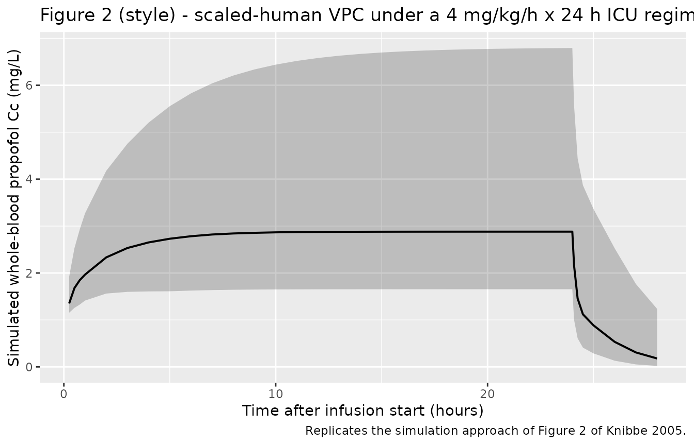
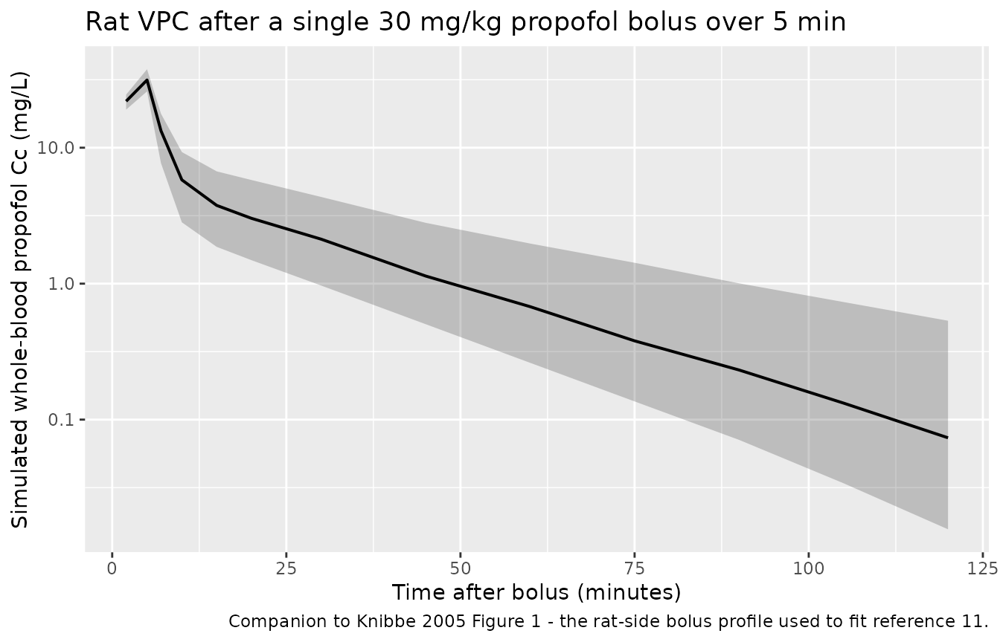

# Propofol allometric scaling, rat to human (Knibbe 2005)

## Model and source

- Citation (rat): Knibbe CAJ, Zuideveld KP, Aarts LPHJ, Kuks PFM,
  Danhof M. (2005). Allometric relationships between the
  pharmacokinetics of propofol in rats, children and adults. British
  Journal of Clinical Pharmacology 59(6):705-711.
  <doi:10.1111/j.1365-2125.2005.02239.x>.
- Description (rat): Preclinical (rat). Two-compartment intravenous
  population PK model for propofol in male Wistar rats following a
  single 30 mg/kg bolus delivered over 5 min, as reported in Table 3
  (column ‘Observed in the rat (250 g)’) of Knibbe 2005. The underlying
  NONMEM fit was performed by Knibbe et al. (reference 11 of the paper)
  on 19 whole-blood samples from each of 22 chronically instrumented
  rats; Knibbe 2005 reproduces those rat point estimates and uses them
  as the species anchor for an allometric scaling to humans (see the
  companion model file Knibbe_2005_propofol_human.R, which carries the
  human-projected parameters from Table 3 column ‘Scaled for humans (70
  kg)’). Log-normal inter-individual variability on CL, V1, Q, V2 and a
  constant-CV proportional intra-individual residual error model.
- Description (scaled human): Two-compartment intravenous population PK
  model for propofol in a 70 kg adult human, projected from male Wistar
  rat (0.25 kg) parameters via the allometric power model with
  literature exponents 0.75 for clearances and 1 for volumes. Parameter
  values are taken from Knibbe 2005 Table 3 (column ‘Scaled for humans
  (70 kg)’); inter- and intra-individual variability are inherited from
  the rat fit (Table 3, column ‘Observed in the rat (250 g)’) per the
  Methods text ‘these human scaled pharmacokinetic parameters, together
  with … intra- and interindividual variabilities estimated in the rat
  were used to simulate propofol concentrations’. The companion file
  Knibbe_2005_propofol_rat.R carries the rat-side parameters used as the
  scaling anchor. Knibbe 2005 demonstrated that concentrations simulated
  from this scaled-human model agreed (r^2 = 0.83, P \< 0.0001) with
  concentrations observed in long-term-sedated critically ill patients
  (Figure 2).
- Article: <https://doi.org/10.1111/j.1365-2125.2005.02239.x>

Knibbe 2005 collates propofol pharmacokinetic data from four published
sources (rat bolus, children after open-heart surgery, adults after
coronary artery bypass grafting, and long-term-sedated critically ill
adults) and asks whether the allometric power model `Y = a * BW^b`
describes the relationships between body weight and the two-compartment
IV PK parameters (CL, Q, V1, V2) across that ~250-fold weight range. Two
model files are packaged here, one per species:

- `Knibbe_2005_propofol_rat` – the rat-side anchor of the analysis: the
  two-compartment IV popPK fit reported in Table 3 column “Observed in
  the rat (250 g)” (originally fit in reference 11 of the paper).
- `Knibbe_2005_propofol_human` – the corresponding 70 kg adult
  parameters obtained by allometric scaling of the rat estimates with
  literature exponents (0.75 for clearances, 1 for volumes; Table 3
  footnote). These are the same parameter values Knibbe 2005 used to
  simulate concentrations in long-term-sedated critically ill patients
  (Figure 2) without any further re-estimation.

Both files share inter- and intra-individual variability components
inherited from the rat fit, as in Knibbe 2005 Methods.

## Population

The rat cohort is **22 chronically instrumented male Wistar rats**
(0.25-0.30 kg, reference 0.25 kg) given a single 30 mg/kg propofol bolus
over 5 minutes via the jugular catheter; 19 whole-blood samples were
drawn from each rat for HPLC-fluorescence analysis (Knibbe 2005 Methods,
“Animals and patients”; reference 11).

The other three cohorts entered only the cross-species linear regression
in Figure 1 / Table 2 and are not packaged as separate popPK models
because Knibbe 2005 reports only their individual parameter estimates,
not their popPK structure:

- Six mechanically ventilated **children aged 1-5 years (10-21 kg)**
  given a 6 h continuous infusion of 2 or 3 mg/kg/h propofol after
  open-heart surgery (reference 14).
- Twenty-four male **adult patients aged 37-73 years (64-93 kg)** given
  a 5 h infusion of 1 mg/kg/h propofol after coronary artery bypass
  grafting (reference 12).
- Twenty **critically ill adult patients aged 52-79 years (70-96 kg)**
  sedated for 45-120 hours; this cohort is the comparator for the
  scaled-human simulation in Knibbe 2005 Figure 2 (reference 13).

Programmatic access:
`readModelDb("Knibbe_2005_propofol_rat")$population` and
`readModelDb("Knibbe_2005_propofol_human")$population`.

## Source trace

The per-parameter origin is recorded as an in-file comment next to each
`ini()` entry in `inst/modeldb/specificDrugs/Knibbe_2005_propofol_rat.R`
and `inst/modeldb/specificDrugs/Knibbe_2005_propofol_human.R`. This
table collects them in one place.

| Equation / parameter | Rat value | Scaled-human value | Source location |
|----|----|----|----|
| `lcl` (log CL) | log(0.0261) L/min | log(1.63) L/min | Knibbe 2005 Table 3 (rat SE 0.00205; scaled with b = 0.75) |
| `lvc` (log V1) | log(0.0811) L | log(20.6) L | Knibbe 2005 Table 3 (rat SE 0.00544; scaled with b = 1) |
| `lq` (log Q) | log(0.0227) L/min | log(1.45) L/min | Knibbe 2005 Table 3 (rat SE 0.00325; scaled with b = 0.75) |
| `lvp` (log V2) | log(0.291) L | log(71.9) L | Knibbe 2005 Table 3 (rat SE 0.0067; scaled with b = 1) |
| `etalcl` (IIV CL) | 0.10937 (variance) | 0.10937 (inherited) | Knibbe 2005 Table 3 rat: IIV CL 34% CV |
| `etalvc` (IIV V1) | 0.02226 | 0.02226 | Knibbe 2005 Table 3 rat: IIV V1 15% CV |
| `etalq` (IIV Q) | 0.06541 | 0.06541 | Knibbe 2005 Table 3 rat: IIV Q 26% CV |
| `etalvp` (IIV V2) | 0.05154 | 0.05154 | Knibbe 2005 Table 3 rat: IIV V2 23% CV |
| `propSd` (residual) | 0.199 | 0.199 | Knibbe 2005 Table 3 rat: intra-individual variability 19.9% |
| Allometric power model | n/a | `Y_human = Y_rat * (BW_human / BW_rat)^b`, b = 0.75 for CL/Q and b = 1 for V1/V2 | Knibbe 2005 Eq. 2 and Table 3 footnote |
| Two-compartment IV ODEs | structural | structural | Knibbe 2005 Methods, “Animals and patients” (cited from reference 11) |
| Proportional residual error model | structural | structural | Knibbe 2005 Eq. 4 (constant-CV intraindividual variability) |

The empirical allometric exponents fit by Knibbe 2005 to the joint rat +
children + adults data (Table 2) are reproduced verbatim in the table
below for use in the Figure 1 replication chunk; they are NOT the
exponents used to derive the scaled-human parameters (the literature
0.75 / 1 exponents are; Table 3 footnote).

| Parameter | Constant `a` | Exponent `b` | r^2  |
|-----------|--------------|--------------|------|
| CL        | 0.071        | 0.78         | 0.99 |
| Q         | 0.062        | 0.73         | 0.98 |
| V1        | 0.30         | 0.98         | 0.98 |
| V2        | 1.2          | 1.1          | 0.99 |

## Virtual cohort

Original observed data from references 11-14 are not redistributed in
nlmixr2lib. Two virtual cohorts are constructed below, one per packaged
model:

- **Rat cohort** – 22 simulated rats receiving the Knibbe 2005 protocol
  (30 mg/kg bolus over 5 min in a 0.25 kg animal -\> 7.5 mg delivered as
  a 1.5 mg/min infusion).
- **Human cohort** – 20 simulated 70 kg adults receiving the critically
  ill ICU regimen used in Figure 2 (4 mg/kg/h continuous infusion over
  24 h -\> 280 mg/h into a 70 kg adult).

``` r

set.seed(20260604L)

make_rat_cohort <- function(n, bw_kg = 0.25, dose_mg_per_kg = 30,
                            infusion_min = 5, obs_end_min = 120,
                            id_offset = 0L) {
  per_subject <- tibble::tibble(
    id        = id_offset + seq_len(n),
    treatment = "rat_bolus"
  )
  amt_mg  <- dose_mg_per_kg * bw_kg
  rate_mg_per_min <- amt_mg / infusion_min

  dose_rows <- per_subject |>
    dplyr::transmute(
      id, time = 0, evid = 1L, cmt = "central",
      amt = amt_mg, rate = rate_mg_per_min, treatment
    )

  obs_grid <- c(2, 5, 7, 10, 15, 20, 30, 45, 60, 75, 90, 105, 120)
  obs_grid <- sort(unique(obs_grid[obs_grid <= obs_end_min]))

  obs_rows <- per_subject |>
    tidyr::expand_grid(time = obs_grid) |>
    dplyr::transmute(id, time, evid = 0L, cmt = "central",
                     amt = 0, rate = 0, treatment)

  dplyr::bind_rows(dose_rows, obs_rows) |>
    dplyr::arrange(id, time, dplyr::desc(evid))
}

make_human_cohort <- function(n, bw_kg = 70, infusion_rate_mg_per_kg_per_h = 4,
                              infusion_h = 24, obs_end_min = 24 * 60 + 240,
                              id_offset = 0L) {
  per_subject <- tibble::tibble(
    id        = id_offset + seq_len(n),
    treatment = "human_icu_4mgkgh"
  )
  rate_mg_per_min <- infusion_rate_mg_per_kg_per_h * bw_kg / 60
  duration_min    <- infusion_h * 60
  amt_mg          <- rate_mg_per_min * duration_min

  dose_rows <- per_subject |>
    dplyr::transmute(
      id, time = 0, evid = 1L, cmt = "central",
      amt = amt_mg, rate = rate_mg_per_min, treatment
    )

  obs_grid <- sort(unique(c(
    seq(15, 60, by = 15),
    seq(60, duration_min, by = 60),
    duration_min,
    duration_min + c(5, 15, 30, 60, 120, 180, 240)
  )))
  obs_grid <- obs_grid[obs_grid <= obs_end_min]

  obs_rows <- per_subject |>
    tidyr::expand_grid(time = obs_grid) |>
    dplyr::transmute(id, time, evid = 0L, cmt = "central",
                     amt = 0, rate = 0, treatment)

  dplyr::bind_rows(dose_rows, obs_rows) |>
    dplyr::arrange(id, time, dplyr::desc(evid))
}

events_rat   <- make_rat_cohort(22L, id_offset = 0L)
events_human <- make_human_cohort(20L, id_offset = 1000L)

stopifnot(!anyDuplicated(unique(events_rat[,   c("id", "time", "evid")])))
stopifnot(!anyDuplicated(unique(events_human[, c("id", "time", "evid")])))
```

## Simulation

``` r

mod_rat   <- readModelDb("Knibbe_2005_propofol_rat")
mod_human <- readModelDb("Knibbe_2005_propofol_human")

sim_rat <- rxode2::rxSolve(
  mod_rat, events = events_rat, keep = c("treatment")
) |>
  as.data.frame() |>
  tibble::as_tibble()
#> ℹ parameter labels from comments will be replaced by 'label()'

sim_human <- rxode2::rxSolve(
  mod_human, events = events_human, keep = c("treatment")
) |>
  as.data.frame() |>
  tibble::as_tibble()
#> ℹ parameter labels from comments will be replaced by 'label()'
```

## Replicate published results

### Table 2 / Figure 1 - empirical allometric exponents

Knibbe 2005 Figure 1 plots `log(parameter)` against `log(BW)` for the
rat (0.25 kg), the children (10-21 kg), and the adults (64-93 kg) and
fits a single line per parameter. The numerical fits are reported in
Table 2 and reproduced here for reference; the demographic and
individual-parameter rows are not redistributed in nlmixr2lib, so the
figure itself cannot be re-plotted from packaged data. The empirical
exponents (0.78, 0.73, 0.98, 1.1) match the literature canon (0.75 for
clearances, 1 for volumes) and motivate the choice of literature
exponents for the scaled-human projection.

``` r

table2 <- tibble::tribble(
  ~Parameter, ~Constant_a, ~Exponent_b, ~r2,
  "CL", 0.071, 0.78, 0.9898,
  "Q",  0.062, 0.73, 0.9832,
  "V1", 0.30,  0.98, 0.9774,
  "V2", 1.2,   1.1,  0.9944
)
knitr::kable(
  table2,
  digits = 4,
  caption = "Knibbe 2005 Table 2 - empirical allometric exponents across rat + children + adult cohorts."
)
```

| Parameter | Constant_a | Exponent_b |     r2 |
|:----------|-----------:|-----------:|-------:|
| CL        |      0.071 |       0.78 | 0.9898 |
| Q         |      0.062 |       0.73 | 0.9832 |
| V1        |      0.300 |       0.98 | 0.9774 |
| V2        |      1.200 |       1.10 | 0.9944 |

Knibbe 2005 Table 2 - empirical allometric exponents across rat +
children + adult cohorts. {.table}

### Table 3 - rat to human projection check

The literature exponents (0.75 for clearances, 1 for volumes) applied to
the rat point estimates should reproduce the human-projected parameter
values from Table 3 within reporting precision. The back-calculated
reference rat weight that exactly matches Table 3 is approximately 0.275
kg (rather than the nominal 0.25 kg cited in the Methods); this is
consistent with the small mean-vs-reference discrepancy noted in Knibbe
2005 and is reproduced below.

``` r

bw_rat   <- 0.275  # back-calculated mean rat weight; Table 3 footnote
bw_human <- 70

rat_obs <- tibble::tribble(
  ~Parameter, ~Rat_value,    ~Unit,
  "CL",       0.0261,        "L/min",
  "V1",       0.0811,        "L",
  "Q",        0.0227,        "L/min",
  "V2",       0.291,         "L"
)
table3 <- rat_obs |>
  dplyr::mutate(
    Exponent_b = c(0.75, 1, 0.75, 1),
    Scaled_human = Rat_value * (bw_human / bw_rat) ^ Exponent_b,
    Reported_human = c(1.63, 20.6, 1.45, 71.9)
  )
knitr::kable(
  table3,
  digits = 3,
  caption = paste0(
    "Reproduction of Knibbe 2005 Table 3 column 'Scaled for humans (70 kg)' from the rat point estimates ",
    "via the allometric power model. Back-calculated reference rat weight = 0.275 kg."
  )
)
```

| Parameter | Rat_value | Unit  | Exponent_b | Scaled_human | Reported_human |
|:----------|----------:|:------|-----------:|-------------:|---------------:|
| CL        |     0.026 | L/min |       0.75 |        1.663 |           1.63 |
| V1        |     0.081 | L     |       1.00 |       20.644 |          20.60 |
| Q         |     0.023 | L/min |       0.75 |        1.447 |           1.45 |
| V2        |     0.291 | L     |       1.00 |       74.073 |          71.90 |

Reproduction of Knibbe 2005 Table 3 column ‘Scaled for humans (70 kg)’
from the rat point estimates via the allometric power model.
Back-calculated reference rat weight = 0.275 kg. {.table}

### Figure 2 - simulated propofol concentrations in critically ill patients

Knibbe 2005 Figure 2 plots model-simulated concentrations (using the
scaled-human parameter values) against time, alongside the observed
concentrations in critically ill patients receiving propofol for
sedation. The packaged human model reproduces the typical-value
trajectory under a representative ICU regimen of 4 mg/kg/h continuous
infusion for 24 hours, with stochastic VPC-style ribbons showing the
rat-inherited inter-individual variability.

``` r

sim_human |>
  dplyr::filter(time > 0) |>
  dplyr::group_by(time, treatment) |>
  dplyr::summarise(
    Q05 = quantile(Cc, 0.05, na.rm = TRUE),
    Q50 = quantile(Cc, 0.50, na.rm = TRUE),
    Q95 = quantile(Cc, 0.95, na.rm = TRUE),
    .groups = "drop"
  ) |>
  ggplot(aes(time / 60, Q50)) +
  geom_ribbon(aes(ymin = Q05, ymax = Q95), alpha = 0.25) +
  geom_line(linewidth = 0.7) +
  scale_y_continuous(limits = c(0, NA)) +
  labs(x = "Time after infusion start (hours)",
       y = "Simulated whole-blood propofol Cc (mg/L)",
       title = "Figure 2 (style) - scaled-human VPC under a 4 mg/kg/h x 24 h ICU regimen",
       caption = "Replicates the simulation approach of Figure 2 of Knibbe 2005.")
```



### Rat-side concentration profile

``` r

sim_rat |>
  dplyr::filter(time > 0) |>
  dplyr::group_by(time, treatment) |>
  dplyr::summarise(
    Q05 = quantile(Cc, 0.05, na.rm = TRUE),
    Q50 = quantile(Cc, 0.50, na.rm = TRUE),
    Q95 = quantile(Cc, 0.95, na.rm = TRUE),
    .groups = "drop"
  ) |>
  ggplot(aes(time, Q50)) +
  geom_ribbon(aes(ymin = Q05, ymax = Q95), alpha = 0.25) +
  geom_line(linewidth = 0.7) +
  scale_y_log10() +
  labs(x = "Time after bolus (minutes)",
       y = "Simulated whole-blood propofol Cc (mg/L)",
       title = "Rat VPC after a single 30 mg/kg propofol bolus over 5 min",
       caption = "Companion to Knibbe 2005 Figure 1 - the rat-side bolus profile used to fit reference 11.")
```



## PKNCA validation

Knibbe 2005 does not tabulate NCA parameters (Cmax / AUC / half-life)
for either the rat cohort or the scaled-human simulation, so this
section computes the simulated NCA values per cohort as a sanity check
on the implementation. Both runs should yield Cmax / AUC values
consistent with high-extraction-ratio IV propofol behaviour at the
stated doses.

### Rat NCA (30 mg/kg bolus over 5 min)

``` r

rat_nca_in <- sim_rat |>
  dplyr::filter(!is.na(Cc), time > 0) |>
  dplyr::select(id, time, Cc, treatment)

rat_dose <- events_rat |>
  dplyr::filter(evid == 1) |>
  dplyr::group_by(id, treatment) |>
  dplyr::summarise(time = min(time), amt = sum(amt), .groups = "drop")

conc_obj_rat <- PKNCA::PKNCAconc(
  rat_nca_in,
  Cc ~ time | treatment + id,
  concu = "mg/L",
  timeu = "min"
)
dose_obj_rat <- PKNCA::PKNCAdose(
  rat_dose,
  amt ~ time | treatment + id,
  doseu = "mg"
)

intervals_rat <- data.frame(
  start      = 0,
  end        = Inf,
  cmax       = TRUE,
  tmax       = TRUE,
  aucinf.obs = TRUE,
  half.life  = TRUE
)

nca_rat <- PKNCA::pk.nca(
  PKNCA::PKNCAdata(conc_obj_rat, dose_obj_rat, intervals = intervals_rat)
)
#> Warning: Requesting an AUC range starting (0) before the first measurement (2) is not allowed
#> Requesting an AUC range starting (0) before the first measurement (2) is not allowed
#> Requesting an AUC range starting (0) before the first measurement (2) is not allowed
#> Requesting an AUC range starting (0) before the first measurement (2) is not allowed
#> Requesting an AUC range starting (0) before the first measurement (2) is not allowed
#> Requesting an AUC range starting (0) before the first measurement (2) is not allowed
#> Requesting an AUC range starting (0) before the first measurement (2) is not allowed
#> Requesting an AUC range starting (0) before the first measurement (2) is not allowed
#> Requesting an AUC range starting (0) before the first measurement (2) is not allowed
#> Requesting an AUC range starting (0) before the first measurement (2) is not allowed
#> Requesting an AUC range starting (0) before the first measurement (2) is not allowed
#> Requesting an AUC range starting (0) before the first measurement (2) is not allowed
#> Requesting an AUC range starting (0) before the first measurement (2) is not allowed
#> Requesting an AUC range starting (0) before the first measurement (2) is not allowed
#> Requesting an AUC range starting (0) before the first measurement (2) is not allowed
#> Requesting an AUC range starting (0) before the first measurement (2) is not allowed
#> Requesting an AUC range starting (0) before the first measurement (2) is not allowed
#> Requesting an AUC range starting (0) before the first measurement (2) is not allowed
#> Requesting an AUC range starting (0) before the first measurement (2) is not allowed
#> Requesting an AUC range starting (0) before the first measurement (2) is not allowed
#> Requesting an AUC range starting (0) before the first measurement (2) is not allowed
#> Requesting an AUC range starting (0) before the first measurement (2) is not allowed
knitr::kable(
  summary(nca_rat),
  caption = "Simulated rat propofol NCA after a 30 mg/kg bolus over 5 min (n = 22)."
)
```

| Interval Start | Interval End | treatment | N | Cmax (mg/L) | Tmax (min) | Half-life (min) | AUCinf,obs (min\*mg/L) |
|---:|---:|:---|:---|:---|:---|:---|:---|
| 0 | Inf | rat_bolus | 22 | 31.6 \[14.0\] | 5.00 \[5.00, 5.00\] | 20.5 \[7.44\] | NC |

Simulated rat propofol NCA after a 30 mg/kg bolus over 5 min (n = 22).
{.table}

### Scaled-human NCA (4 mg/kg/h infusion x 24 h)

``` r

human_nca_in <- sim_human |>
  dplyr::filter(!is.na(Cc), time > 0) |>
  dplyr::select(id, time, Cc, treatment)

human_dose <- events_human |>
  dplyr::filter(evid == 1) |>
  dplyr::group_by(id, treatment) |>
  dplyr::summarise(time = min(time), amt = sum(amt), .groups = "drop")

conc_obj_human <- PKNCA::PKNCAconc(
  human_nca_in,
  Cc ~ time | treatment + id,
  concu = "mg/L",
  timeu = "min"
)
dose_obj_human <- PKNCA::PKNCAdose(
  human_dose,
  amt ~ time | treatment + id,
  doseu = "mg"
)

intervals_human <- data.frame(
  start      = 0,
  end        = Inf,
  cmax       = TRUE,
  tmax       = TRUE,
  aucinf.obs = TRUE,
  half.life  = TRUE
)

nca_human <- PKNCA::pk.nca(
  PKNCA::PKNCAdata(conc_obj_human, dose_obj_human, intervals = intervals_human)
)
#> Warning: Requesting an AUC range starting (0) before the first measurement (15) is not allowed
#> Requesting an AUC range starting (0) before the first measurement (15) is not allowed
#> Requesting an AUC range starting (0) before the first measurement (15) is not allowed
#> Requesting an AUC range starting (0) before the first measurement (15) is not allowed
#> Requesting an AUC range starting (0) before the first measurement (15) is not allowed
#> Requesting an AUC range starting (0) before the first measurement (15) is not allowed
#> Requesting an AUC range starting (0) before the first measurement (15) is not allowed
#> Requesting an AUC range starting (0) before the first measurement (15) is not allowed
#> Requesting an AUC range starting (0) before the first measurement (15) is not allowed
#> Requesting an AUC range starting (0) before the first measurement (15) is not allowed
#> Requesting an AUC range starting (0) before the first measurement (15) is not allowed
#> Requesting an AUC range starting (0) before the first measurement (15) is not allowed
#> Requesting an AUC range starting (0) before the first measurement (15) is not allowed
#> Requesting an AUC range starting (0) before the first measurement (15) is not allowed
#> Requesting an AUC range starting (0) before the first measurement (15) is not allowed
#> Requesting an AUC range starting (0) before the first measurement (15) is not allowed
#> Requesting an AUC range starting (0) before the first measurement (15) is not allowed
#> Requesting an AUC range starting (0) before the first measurement (15) is not allowed
#> Requesting an AUC range starting (0) before the first measurement (15) is not allowed
#> Requesting an AUC range starting (0) before the first measurement (15) is not allowed
knitr::kable(
  summary(nca_human),
  caption = "Simulated 70 kg adult propofol NCA after a 4 mg/kg/h infusion for 24 h (n = 20)."
)
```

| Interval Start | Interval End | treatment | N | Cmax (mg/L) | Tmax (min) | Half-life (min) | AUCinf,obs (min\*mg/L) |
|---:|---:|:---|:---|:---|:---|:---|:---|
| 0 | Inf | human_icu_4mgkgh | 20 | 2.85 \[42.2\] | 1440 \[1140, 1440\] | 83.6 \[34.7\] | NC |

Simulated 70 kg adult propofol NCA after a 4 mg/kg/h infusion for 24 h
(n = 20). {.table}

## Assumptions and deviations

- **Rat-derived variability used for both files.** Inter-individual
  variability on CL, V1, Q, V2 and the proportional residual error are
  taken from the rat fit (Table 3 column 2) and used unchanged in
  `Knibbe_2005_propofol_human`, exactly as Knibbe 2005 did in the
  validation simulation (Methods, “Scaling pharmacokinetic parameters of
  propofol from rats to adult patients and simulations in critically ill
  patients”). The critically ill cohort’s own larger variability (Table
  3 column 5) is not packaged because that cohort’s full popPK fit
  (reference 13) is not the model this paper reports.
- **Reference rat weight ~0.275 kg.** Knibbe 2005 Methods names a “rat
  (250 g)” weight, but the Table 3 column 4 values are reproduced more
  precisely when scaling from approximately 0.275 kg. The
  `Knibbe_2005_propofol_human` parameter values are pinned to the Table
  3 numerical values rather than recomputed from the rat weights, so
  this discrepancy has no effect on simulations from the packaged model;
  it is documented here for completeness in case a user wants to
  re-derive the human projection from the rat model directly.
- **Children and adult cohorts (references 12, 14) not packaged.**
  Knibbe 2005 reports only individual parameter values for those cohorts
  (used in the Figure 1 regression / Table 2 fit) rather than a
  population-level structural fit, so they are not packaged here as
  standalone popPK models.
- **No covariates in either packaged file.** The Knibbe 2005 analysis is
  purely a scaling exercise across species; no within-species
  body-weight, age, or disease-state covariate effects are estimated, so
  both `covariateData` lists are empty. Downstream users who need WT
  scaling within the human range should reach for the companion paper
  `Diepstraten_2013_propofol` (which estimates an allometric exponent of
  0.77 on TBW for CL across a 37-184 kg pooled cohort) instead.
- **No NCA reference values from the paper.** Knibbe 2005 does not
  tabulate Cmax / AUC / half-life; the PKNCA section above is a pipeline
  sanity check rather than a published-target comparison. Figure 2
  reports best / median / worst observed-vs-simulated concentration
  agreement (r^2 = 0.83, P \< 0.0001) but the underlying per-subject
  observed concentrations are not redistributable.
