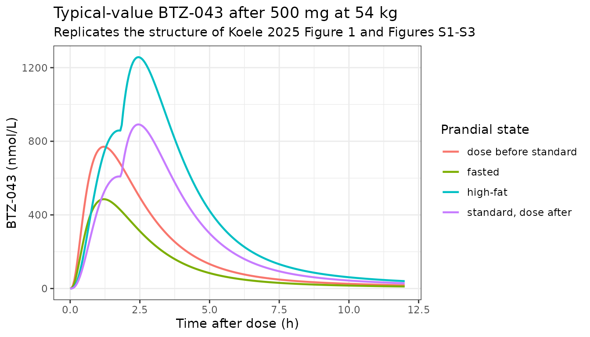
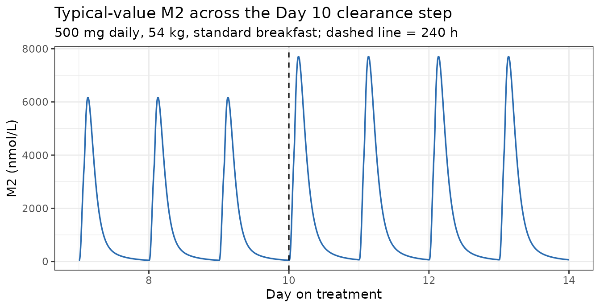
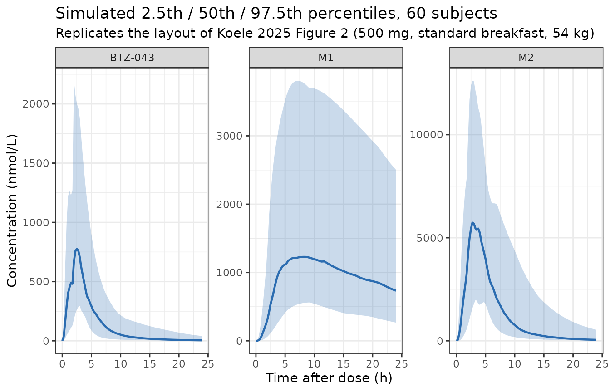
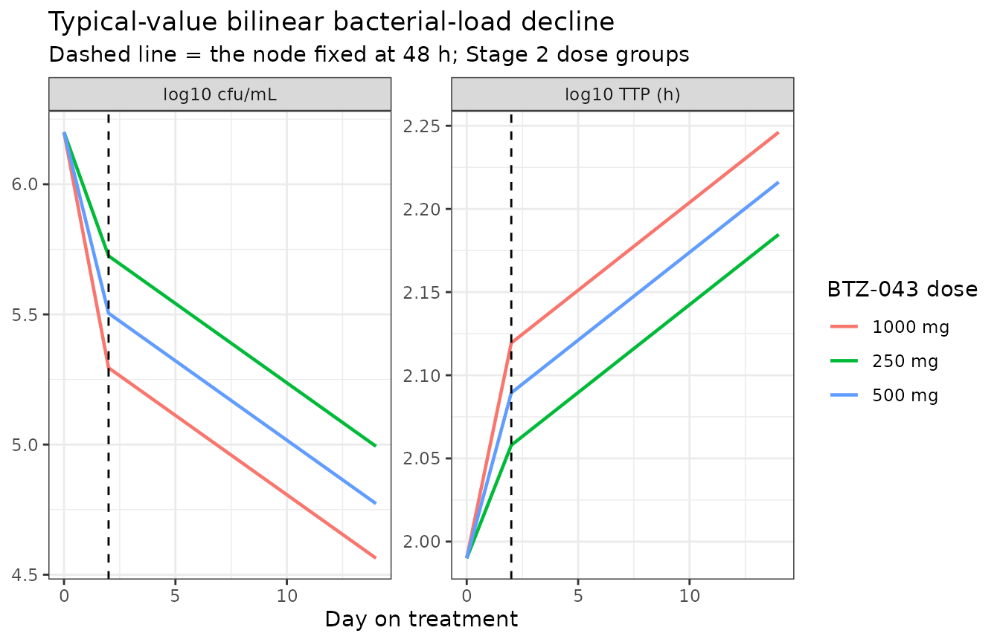
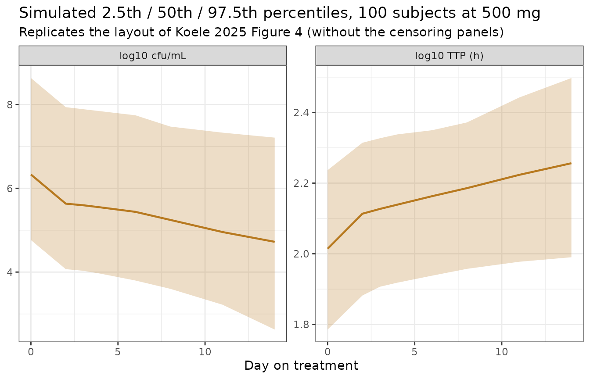

# BTZ-043 population PK and bacterial-load exposure-response (Koele 2025)

## Model and source

Koele 2025 contributed two models to nlmixr2lib, matching the two NONMEM
runs the paper reports:

- `Koele_2025_btz043` – the joint BTZ-043 / M1 / M2 population PK model.

- `Koele_2025_btz043_bacterialload` – the bilinear cfu +
  time-to-positivity exposure-response model, driven by the individual
  BTZ-043total AUC(0-24) that the PK model produces.

- Citation: Koele S. E., Heinrich N., De Jager V. R., Dreisbach J.,
  Phillips P. P. J., Gross-Demel P., Dawson R., Narunsky K., Wildner L.
  M., Mchugh T. D., Te Brake L. H. M., Diacon A. H., Aarnoutse R. E.,
  Hoelscher M., Svensson E. M. (2025). Population pharmacokinetics and
  exposure-response relationship of the antituberculosis drug BTZ-043.
  Journal of Antimicrobial Chemotherapy 80(5):1319-1327.
  <doi:10.1093/jac/dkaf076>. Structural equations and random-effect
  variances transcribed from the final NONMEM control stream in the
  Supplementary data (‘Pharmacokinetic model code’); typical values and
  residual errors from Table 2.

- Article: <https://doi.org/10.1093/jac/dkaf076>

BTZ-043 is a first-in-class benzothiazinone inhibitor of DprE1, an
enzyme of the mycobacterial cell-wall synthesis pathway. The paper
analyses the sequential Phase 1b/2a trial NCT04044001, in which
participants with drug-susceptible pulmonary tuberculosis received
BTZ-043 monotherapy at 250 to 1750 mg once daily for 14 days.

Both models were transcribed from the final NONMEM control streams
printed in the paper’s Supplementary data, with typical values taken
from Table 2 (PK) and Table 3 (PD). Where the control stream and the
tables disagree, the resolution is recorded in the Errata section below.

``` r

mod_pk <- readModelDb("Koele_2025_btz043")
mod_pd <- readModelDb("Koele_2025_btz043_bacterialload")
ui_pk  <- rxode2::rxode(mod_pk)
#> ℹ parameter labels from comments will be replaced by 'label()'
#> Warning: some etas defaulted to non-mu referenced, possible parsing error: etaiov_fdepot_1, etaiov_fdepot_2, etaiov_fdepot_3, etaiov_mtt_1, etaiov_ka_1, etaiov_mtt_2, etaiov_ka_2, etaiov_mtt_3, etaiov_ka_3
#> as a work-around try putting the mu-referenced expression on a simple line
ui_pd  <- rxode2::rxode(mod_pd)
#> ℹ parameter labels from comments will be replaced by 'label()'

# Molecular weight of BTZ-043, from the control stream comment on F1.
MW_BTZ043 <- 431.39
# 1 mg of BTZ-043 is this many nmol.
NMOL_PER_MG <- 1e6 / MW_BTZ043
# 1 nmol/L of BTZ-043 is this many ng/mL.
NGML_PER_NM <- MW_BTZ043 / 1000

c(nmol_per_mg = NMOL_PER_MG, ngmL_per_nM = NGML_PER_NM)
#> nmol_per_mg ngmL_per_nM 
#>  2318.08804     0.43139
```

## Population

The analysis population is the 68 participants of NCT04044001 who
received BTZ-043 and contributed data: 24 from Stage 1 (Phase 1b dose
escalation, three participants per dose cohort and six in the highest)
and 44 from Stage 2 (Phase 2a, randomised 3:3:3:2 to 250, 500 or 1000 mg
BTZ-043 daily or to the Rifafour e-275 control regimen). One Stage 2
participant in the 500 mg group withdrew before any study procedure and
contributed no data.

``` r

pop <- ui_pk$population
tibble::tibble(
  Field = names(pop),
  Value = vapply(pop, function(x) paste(paste0(
    ifelse(nzchar(names(x) %||% ""), paste0(names(x), ": "), ""), x),
    collapse = "; "), character(1))
) |>
  knitr::kable()
```

| Field | Value |
|:---|:---|
| species | human |
| n_subjects | 68 |
| n_studies | 1 |
| age_range | 18-57 years |
| age_median | 27 years |
| weight_range | 42-81 kg |
| weight_median | 54 kg |
| height_range | 1.5-1.9 m |
| height_median | 1.7 m |
| sex_female_pct | 16.2 |
| race_ethnicity | Black: 64.7; Cape-coloured: 33.8; White: 1.5 |
| hiv_status | HIV-1 negative, 68/68 (100%) |
| disease_state | Adults aged 18-64 years with drug-susceptible pulmonary tuberculosis enrolled in the sequential Phase 1b/2a dose-escalation and dose-expansion trial NCT04044001 (Stage 1 Phase 1b dose escalation, Stage 2 Phase 2a randomized dose expansion). |
| dose_range | Oral BTZ-043 250-1750 mg once daily for 14 days. Stage 1 escalated through 250, 500, 750, 1000, 1250, 1500 and 1750 mg with three participants per cohort and six in the highest; Stage 2 randomized 54 participants to 250, 500 or 1000 mg daily or to the Rifafour e-275 control regimen in a 3:3:3:2 ratio. |
| prandial_state | Stage 1: fasted on Days 1-12 and with a high-fat breakfast on Day 14. Stage 2: BTZ-043 taken either prior to, or 30 min after, the start of intake of a standard breakfast. Occasion counts in Koele 2025 Table 1: fasted 24, high-fat 19, standard together with dose 24, standard 30 min prior to dose 20. |
| regions | South Africa (TASK, Cape Town; University of Cape Town Lung Institute) |
| notes | Baseline demographics from Koele 2025 Table 1, ‘Combined Stage 1 + 2’ column. Twenty-four Stage 1 and 44 Stage 2 participants were analysed; one Stage 2 participant in the 500 mg group withdrew before any study procedure and contributed no data. The PK dataset held 1808 BTZ-043, 1808 M1 and 1793 M2 observations, of which 600 (33%), 159 (8.8%) and 146 (8.1%) respectively were below the 20 ng/mL limit of quantification. BLQ observations were EXCLUDED from the final analysis: models using the NONMEM M3 method were highly unstable and, when the final model was re-estimated with M3, it significantly underestimated the central tendency of the BTZ-043 and M2 elimination phases (Koele 2025 Results, ‘PK model’). |

All participants were HIV-1 negative. Median age was 27 years (range 18
to 57), median weight 54 kg (range 42 to 81) and 84% were male; 65%
self-identified as Black, 34% as Cape-coloured and 1% as White (Koele
2025 Table 1, combined Stage 1 + 2 column). Note that the median weight
of 54 kg sits well below the 70 kg allometric reference, so a typical
participant in this trial has apparent clearances about 18% lower than
the tabulated 70 kg values.

Prandial state differed by stage and is a per-dose-record covariate
rather than a subject characteristic. Stage 1 dosed fasted on Days 1 to
12 and with a high-fat breakfast on Day 14. Stage 2 dosed either
immediately prior to, or 30 minutes after the start of, a standard
breakfast; the latter is the model’s reference state.

## Source trace

Every `ini()` value in both model files carries an in-file comment
naming its source location. The table below is the consolidated audit
trail.

| Quantity | Value | Source |
|:---|:---|:---|
| Structural PK: CL/F, V/F, ka, MTT, Q/F, Vp/F | 404 L/h, 764 L, 1.69 /h, 0.340 h, 68.0 L/h, 382 L | Table 2 ‘Structural parameters’; \$THETA 1-4, 24, 25 |
| M1 disposition: CL_M1, V_M1 | 36.0 L/h, 894 L | Table 2; \$THETA 13, 14 |
| M2 disposition: CL_M2, V_M2, Q_M2, Vp_M2 | 45.8 L/h, 19.0 L, 64.2 L/h, 26.8 L | Table 2; \$THETA 16, 17, 19, 20 |
| Parallel-absorption fraction, lag time | 0.644, 1.83 h | Table 2; \$THETA 6, 7 |
| Allometric exponents | 0.75 CL, 1 V (fixed) | Methods ‘PK model development’; \$PK AlloCL / AlloV |
| F effects: dose \>1250 mg, high fat, no food, dose before food | 0.710, 1.41, 0.458, 0.727 | Table 2 ‘Covariates’; \$THETA 8-11 |
| MTT effect when no food is present | 0.360 | Table 2 ‘Dose prior to standard food/no food on MTT (%)’; \$THETA 5 |
| M1 fm effect when no food is present | 1.39 divisor | Table 2 ‘Administration with food on FM1 (%)’; \$THETA 23 under IF(WITHFOOD.EQ.0) |
| Cape-coloured on CL/F | 0.762 | Table 2; \$THETA 22 |
| M2 clearance step after Day 10 | 0.734 from 240 h | Table 2, Results; $`THETA 21 under IF(DAY.GT.10)                                    |
|PK IIV and IOV variances                                      |see model file                                    |`$OMEGA blocks; each reproduces the Table 2 CV% via CV = sqrt(exp(w2) - 1) |
| PK residual errors | 50.5, 33.8, 29.0 CV% | Table 2 ‘Residual error’ |
| PD baselines, Emax slopes, second slopes | 6.20, 1.99, 0.0270, 0.00386, 0.00254, 0.000440 | Table 3; \$THETA 1-6 |
| PD node, EC50 | 48 h FIX, 16900 ng/mL\*h | Table 3; $`THETA 7 FIX, 8                                                           |
|PD IIV blocks and correlations                                |see model file                                    |`$OMEGA BLOCK(3) and BLOCK(2); reproduce the Table 3 CV% and correlations |
| PD residual errors | 0.558, 0.0624 log10 | Table 3 ‘Residual error’ (published averages of the \$SIGMA BLOCK(4) replicate SDs) |

## Simulation helpers

Observation rows carry `cmt = "Cc"`. That is the ENDPOINT name, and for
a model with three declared endpoints it is the only form rxode2
accepts: `cmt = "central"` (an ODE state) and `dvid`-only rows both fail
with `'dvid'->'cmt' ... on a undefined compartment`. Because `Cc` is a
declared endpoint (`Cc ~ prop(propSd)`), rxode2 already owns a
compartment slot for it, so nothing is injected and no ODE state is
renumbered – which the guard chunk below proves rather than asserts in
prose. `useLinCmt = FALSE` is set on every solve so that rxode2’s
automatic ODE-to-linCmt conversion cannot silently replace the
transcribed ODE system.

``` r

# Trapezoidal AUC over an ordered time / concentration pair.
trap_auc <- function(time, conc) {
  sum(diff(time) * (utils::head(conc, -1) + utils::tail(conc, -1)) / 2)
}

# Prandial states of the trial, as the two registered indicators that span
# them (see the FED / FASTED_STRICT covariate notes in the model file).
PRANDIAL <- tibble::tribble(
  ~arm,                  ~FED, ~FED_HIGHFAT, ~FASTED_STRICT,
  "standard, dose after",  1,            0,              0,
  "high-fat",              1,            1,              0,
  "dose before standard",  0,            0,              0,
  "fasted",                0,            0,              1
)

# Build an event table: n_dose daily doses of `dose` mg into BOTH absorption
# depots, plus an observation grid. The dose must be written to depot1 and
# depot2 separately; f() then splits it between the transit chain and the
# lag-time secondary route.
btz_events <- function(dose, obs_times, n_dose = 1, ii = 24, id = 1L) {
  dosing <- tidyr::expand_grid(
    id = id, cmt = c("depot1", "depot2")
  ) |>
    dplyr::mutate(
      time = 0, amt = dose, evid = 1L, ii = ii,
      addl = as.integer(n_dose - 1L)
    )
  obs <- tidyr::expand_grid(id = id, time = obs_times) |>
    dplyr::mutate(
      cmt = "Cc", amt = NA_real_, evid = 0L, ii = 0, addl = 0L
    )
  dplyr::bind_rows(dosing, obs) |>
    dplyr::arrange(id, time, dplyr::desc(evid))
}

# Attach the covariate columns a solve needs.
with_covs <- function(ev, WT = 70, arm = "standard, dose after",
                      DOSE_HIGH = 0, RACE_COLOURED = 0, OCC = 1) {
  p <- PRANDIAL[match(arm, PRANDIAL$arm), ]
  stopifnot(nrow(p) == 1L, !is.na(p$FED))
  ev |>
    dplyr::mutate(
      WT = WT, FED = p$FED, FED_HIGHFAT = p$FED_HIGHFAT,
      FASTED_STRICT = p$FASTED_STRICT,
      DOSE_HIGH = DOSE_HIGH, RACE_COLOURED = RACE_COLOURED, OCC = OCC
    )
}

solve_pk <- function(ev, typical = TRUE, ...) {
  m <- if (typical) rxode2::zeroRe(mod_pk) else mod_pk
  rxode2::rxSolve(m, ev, returnType = "data.frame", useLinCmt = FALSE, ...)
}
```

## Structural verification: solve against closed form

The single most informative check on a transcribed multi-compartment
model is whether the solved system reproduces the closed forms the
parameters imply. With every fraction metabolised fixed to 1, the model
routes the FULL parent elimination flux into both metabolite
compartments, so all three analytes have the same closed-form AUC(0-inf)
shape, `dose / CL`, with the dose expressed in nmol. This is a
deterministic identity: a tight tolerance is correct here and would
catch a mis-transcribed clearance, a lost allometric term, or an
accidental linCmt substitution of the transcribed ODEs.

``` r

obs_grid <- seq(0, 96, by = 0.02)
ev_cf <- btz_events(dose = 500, obs_times = obs_grid) |> with_covs(WT = 70)
sim_cf <- solve_pk(ev_cf) |> dplyr::filter(!is.na(Cc))
#> ℹ parameter labels from comments will be replaced by 'label()'
#> Warning: some etas defaulted to non-mu referenced, possible parsing error: etaiov_fdepot_1, etaiov_fdepot_2, etaiov_fdepot_3, etaiov_mtt_1, etaiov_ka_1, etaiov_mtt_2, etaiov_ka_2, etaiov_mtt_3, etaiov_ka_3
#> as a work-around try putting the mu-referenced expression on a simple line
#> Warning: some etas defaulted to non-mu referenced, possible parsing error: etaiov_fdepot_1, etaiov_fdepot_2, etaiov_fdepot_3, etaiov_mtt_1, etaiov_ka_1, etaiov_mtt_2, etaiov_ka_2, etaiov_mtt_3, etaiov_ka_3
#> as a work-around try putting the mu-referenced expression on a simple line
#> ℹ omega/sigma items treated as zero: 'etalcl', 'etalvc', 'etalfdepot', 'etalcl_m1', 'etalvc_m1', 'etalcl_m2', 'etalvc_m2', 'etaiov_fdepot_1', 'etaiov_fdepot_2', 'etaiov_fdepot_3', 'etaiov_mtt_1', 'etaiov_ka_1', 'etaiov_mtt_2', 'etaiov_ka_2', 'etaiov_mtt_3', 'etaiov_ka_3'

dose_nmol <- 500 * NMOL_PER_MG
cf <- tibble::tibble(
  Analyte = c("BTZ-043", "M1", "M2"),
  `CL (L/h)` = c(404, 36.0, 45.8),
  `AUC simulated (nmol*h/L)` = c(
    trap_auc(sim_cf$time, sim_cf$Cc),
    trap_auc(sim_cf$time, sim_cf$Cc_m1),
    trap_auc(sim_cf$time, sim_cf$Cc_m2)
  )
) |>
  dplyr::mutate(
    `AUC closed form (nmol*h/L)` = dose_nmol / `CL (L/h)`,
    Ratio = `AUC simulated (nmol*h/L)` / `AUC closed form (nmol*h/L)`
  )
knitr::kable(cf, digits = c(0, 1, 1, 1, 5))
```

| Analyte | CL (L/h) | AUC simulated (nmol\*h/L) | AUC closed form (nmol\*h/L) | Ratio |
|:---|---:|---:|---:|---:|
| BTZ-043 | 404.0 | 2868.9 | 2868.9 | 1.00000 |
| M1 | 36.0 | 31370.1 | 32195.7 | 0.97436 |
| M2 | 45.8 | 25306.6 | 25306.6 | 1.00000 |

BTZ-043 and M2 are complete within the 96 h window and match their
closed forms exactly. M1 is the slowest analyte (`V_M1 / CL_M1` = 24.8
h, so a 17.2 h terminal half-life) and about 2% of its AUC still lies
beyond 96 h, which is the whole of its shortfall.

``` r

stopifnot(
  # Deterministic identity, not a cohort statistic: BTZ-043 and M2 are
  # numerically complete in the window, so the tolerance is solver accuracy.
  abs(cf$Ratio[cf$Analyte == "BTZ-043"] - 1) < 1e-3,
  abs(cf$Ratio[cf$Analyte == "M2"] - 1) < 1e-3,
  # M1 is truncated by design; exp(-96 / 24.83) = 2.1% remains uncollected.
  cf$Ratio[cf$Analyte == "M1"] > 0.96,
  cf$Ratio[cf$Analyte == "M1"] < 1.00
)
```

### Guard: no compartment renumbering

`cmt = "Cc"` on the observation rows is flagged by the repository’s
static vignette lint as the slot-renumbering anti-pattern. That advice
is right for a BARE algebraic observable; it is a false positive for a
declared endpoint. The guard below turns the concern into a test that
would go red if renumbering ever did occur.

``` r

stopifnot(
  # every ODE state still resolves to a column
  all(ui_pk$state %in% names(sim_cf)),
  # every endpoint plus the derived total is returned
  all(c("Cc", "Cc_m1", "Cc_m2", "Cc_total") %in% names(sim_cf)),
  # The transit-chain depot receives exactly f(depot1) = 0.644 * 500 mg
  # converted to nmol, at t = 0.
  abs(sim_cf$depot1[1] - 0.644 * 500 * NMOL_PER_MG) < 1e-6,
  # depot2 is still EMPTY at t = 0 -- its dose is held by the 1.83 h lag --
  # and receives the complementary 0.356 fraction once the lag expires. The
  # observed peak sits on the first grid point at or after 1.83 h, by which
  # time ka has already removed exp(-1.69 * 0.01) = 1.7% of it, so the ratio
  # is just below 1 rather than equal to it.
  sim_cf$depot2[1] == 0,
  all(sim_cf$depot2[sim_cf$time < 1.83] == 0),
  max(sim_cf$depot2) / (0.356 * 500 * NMOL_PER_MG) > 0.97,
  max(sim_cf$depot2) / (0.356 * 500 * NMOL_PER_MG) <= 1,
  # and the derived total is exactly parent + M2
  max(abs(sim_cf$Cc_total - (sim_cf$Cc + sim_cf$Cc_m2))) < 1e-9
)
```

## Absorption: the double peak and the food-dependent secondary route

Koele 2025 Results: “A double-peak phenomenon was observed for BTZ-043,
M1 and M2 individual concentration-time profiles. A first-order
secondary delayed absorption into the BTZ-043 central compartment was
identified when the drug was taken together with food, using a lag-time
model.” The secondary route carries 1 - 0.644 = 35.6% of the
bioavailable dose after a 1.83 h lag, and is switched off entirely when
the dose is not taken with food.

``` r

prof <- lapply(PRANDIAL$arm, function(a) {
  ev <- btz_events(500, seq(0, 12, by = 0.05)) |> with_covs(WT = 54, arm = a)
  solve_pk(ev) |>
    dplyr::filter(!is.na(Cc)) |>
    dplyr::transmute(time, Cc, arm = a)
}) |> dplyr::bind_rows()
#> ℹ parameter labels from comments will be replaced by 'label()'
#> Warning: some etas defaulted to non-mu referenced, possible parsing error: etaiov_fdepot_1, etaiov_fdepot_2, etaiov_fdepot_3, etaiov_mtt_1, etaiov_ka_1, etaiov_mtt_2, etaiov_ka_2, etaiov_mtt_3, etaiov_ka_3
#> as a work-around try putting the mu-referenced expression on a simple line
#> Warning: some etas defaulted to non-mu referenced, possible parsing error: etaiov_fdepot_1, etaiov_fdepot_2, etaiov_fdepot_3, etaiov_mtt_1, etaiov_ka_1, etaiov_mtt_2, etaiov_ka_2, etaiov_mtt_3, etaiov_ka_3
#> as a work-around try putting the mu-referenced expression on a simple line
#> ℹ omega/sigma items treated as zero: 'etalcl', 'etalvc', 'etalfdepot', 'etalcl_m1', 'etalvc_m1', 'etalcl_m2', 'etalvc_m2', 'etaiov_fdepot_1', 'etaiov_fdepot_2', 'etaiov_fdepot_3', 'etaiov_mtt_1', 'etaiov_ka_1', 'etaiov_mtt_2', 'etaiov_ka_2', 'etaiov_mtt_3', 'etaiov_ka_3'
#> ℹ parameter labels from comments will be replaced by 'label()'
#> Warning: some etas defaulted to non-mu referenced, possible parsing error: etaiov_fdepot_1, etaiov_fdepot_2, etaiov_fdepot_3, etaiov_mtt_1, etaiov_ka_1, etaiov_mtt_2, etaiov_ka_2, etaiov_mtt_3, etaiov_ka_3
#> as a work-around try putting the mu-referenced expression on a simple line
#> Warning: some etas defaulted to non-mu referenced, possible parsing error: etaiov_fdepot_1, etaiov_fdepot_2, etaiov_fdepot_3, etaiov_mtt_1, etaiov_ka_1, etaiov_mtt_2, etaiov_ka_2, etaiov_mtt_3, etaiov_ka_3
#> as a work-around try putting the mu-referenced expression on a simple line
#> ℹ omega/sigma items treated as zero: 'etalcl', 'etalvc', 'etalfdepot', 'etalcl_m1', 'etalvc_m1', 'etalcl_m2', 'etalvc_m2', 'etaiov_fdepot_1', 'etaiov_fdepot_2', 'etaiov_fdepot_3', 'etaiov_mtt_1', 'etaiov_ka_1', 'etaiov_mtt_2', 'etaiov_ka_2', 'etaiov_mtt_3', 'etaiov_ka_3'
#> ℹ parameter labels from comments will be replaced by 'label()'
#> Warning: some etas defaulted to non-mu referenced, possible parsing error: etaiov_fdepot_1, etaiov_fdepot_2, etaiov_fdepot_3, etaiov_mtt_1, etaiov_ka_1, etaiov_mtt_2, etaiov_ka_2, etaiov_mtt_3, etaiov_ka_3
#> as a work-around try putting the mu-referenced expression on a simple line
#> Warning: some etas defaulted to non-mu referenced, possible parsing error: etaiov_fdepot_1, etaiov_fdepot_2, etaiov_fdepot_3, etaiov_mtt_1, etaiov_ka_1, etaiov_mtt_2, etaiov_ka_2, etaiov_mtt_3, etaiov_ka_3
#> as a work-around try putting the mu-referenced expression on a simple line
#> ℹ omega/sigma items treated as zero: 'etalcl', 'etalvc', 'etalfdepot', 'etalcl_m1', 'etalvc_m1', 'etalcl_m2', 'etalvc_m2', 'etaiov_fdepot_1', 'etaiov_fdepot_2', 'etaiov_fdepot_3', 'etaiov_mtt_1', 'etaiov_ka_1', 'etaiov_mtt_2', 'etaiov_ka_2', 'etaiov_mtt_3', 'etaiov_ka_3'
#> ℹ parameter labels from comments will be replaced by 'label()'
#> Warning: some etas defaulted to non-mu referenced, possible parsing error: etaiov_fdepot_1, etaiov_fdepot_2, etaiov_fdepot_3, etaiov_mtt_1, etaiov_ka_1, etaiov_mtt_2, etaiov_ka_2, etaiov_mtt_3, etaiov_ka_3
#> as a work-around try putting the mu-referenced expression on a simple line
#> Warning: some etas defaulted to non-mu referenced, possible parsing error: etaiov_fdepot_1, etaiov_fdepot_2, etaiov_fdepot_3, etaiov_mtt_1, etaiov_ka_1, etaiov_mtt_2, etaiov_ka_2, etaiov_mtt_3, etaiov_ka_3
#> as a work-around try putting the mu-referenced expression on a simple line
#> ℹ omega/sigma items treated as zero: 'etalcl', 'etalvc', 'etalfdepot', 'etalcl_m1', 'etalvc_m1', 'etalcl_m2', 'etalvc_m2', 'etaiov_fdepot_1', 'etaiov_fdepot_2', 'etaiov_fdepot_3', 'etaiov_mtt_1', 'etaiov_ka_1', 'etaiov_mtt_2', 'etaiov_ka_2', 'etaiov_mtt_3', 'etaiov_ka_3'

ggplot(prof, aes(time, Cc, colour = arm)) +
  geom_line(linewidth = 0.8) +
  labs(
    x = "Time after dose (h)", y = "BTZ-043 (nmol/L)", colour = "Prandial state",
    title = "Typical-value BTZ-043 after 500 mg at 54 kg",
    subtitle = "Replicates the structure of Koele 2025 Figure 1 and Figures S1-S3"
  ) +
  theme_bw()
```



The two fed arms show the characteristic shoulder at about 2 to 3 h
produced by the delayed parallel route; the two arms with no food at the
moment of dosing rise and fall as a single peak, and peak earlier
because the mean transit time is 0.360 times the fed value.

``` r

peak_time <- prof |>
  dplyr::group_by(arm) |>
  dplyr::summarise(tmax = time[which.max(Cc)], .groups = "drop")
knitr::kable(peak_time, digits = 2)
```

| arm                  | tmax |
|:---------------------|-----:|
| dose before standard | 1.20 |
| fasted               | 1.20 |
| high-fat             | 2.45 |
| standard, dose after | 2.45 |

``` r


fed_arms <- c("standard, dose after", "high-fat")
stopifnot(
  # Deterministic typical-value profiles, so exact ordering is safe here:
  # the fed arms peak on the delayed route, the unfed arms on the transit
  # chain with a 2.8-fold shorter mean transit time.
  all(peak_time$tmax[peak_time$arm %in% fed_arms] > 1.83),
  all(peak_time$tmax[!peak_time$arm %in% fed_arms] < 1.83)
)
```

## Prandial-state and dose effects on exposure

Because bioavailability enters only through `f()`, and none of the
prandial covariates touches a clearance, every published F multiplier
must reappear EXACTLY as a ratio of parent AUC(0-inf). The M1 ratios
additionally carry the 1.39 divisor on apparent M1 clearance, which is
the effect the paper describes as a change in the relative fraction
metabolised to M1.

``` r

auc_arm <- function(arm, WT = 54, dose = 500, DOSE_HIGH = 0,
                    RACE_COLOURED = 0) {
  ev <- btz_events(dose, seq(0, 120, by = 0.02)) |>
    with_covs(WT = WT, arm = arm, DOSE_HIGH = DOSE_HIGH,
              RACE_COLOURED = RACE_COLOURED)
  s <- solve_pk(ev) |> dplyr::filter(!is.na(Cc))
  c(
    parent = trap_auc(s$time, s$Cc),
    m1     = trap_auc(s$time, s$Cc_m1),
    m2     = trap_auc(s$time, s$Cc_m2)
  )
}

ref <- auc_arm("standard, dose after")
#> ℹ parameter labels from comments will be replaced by 'label()'
#> Warning: some etas defaulted to non-mu referenced, possible parsing error: etaiov_fdepot_1, etaiov_fdepot_2, etaiov_fdepot_3, etaiov_mtt_1, etaiov_ka_1, etaiov_mtt_2, etaiov_ka_2, etaiov_mtt_3, etaiov_ka_3
#> as a work-around try putting the mu-referenced expression on a simple line
#> Warning: some etas defaulted to non-mu referenced, possible parsing error: etaiov_fdepot_1, etaiov_fdepot_2, etaiov_fdepot_3, etaiov_mtt_1, etaiov_ka_1, etaiov_mtt_2, etaiov_ka_2, etaiov_mtt_3, etaiov_ka_3
#> as a work-around try putting the mu-referenced expression on a simple line
#> ℹ omega/sigma items treated as zero: 'etalcl', 'etalvc', 'etalfdepot', 'etalcl_m1', 'etalvc_m1', 'etalcl_m2', 'etalvc_m2', 'etaiov_fdepot_1', 'etaiov_fdepot_2', 'etaiov_fdepot_3', 'etaiov_mtt_1', 'etaiov_ka_1', 'etaiov_mtt_2', 'etaiov_ka_2', 'etaiov_mtt_3', 'etaiov_ka_3'
food_tab <- lapply(PRANDIAL$arm, function(a) {
  v <- auc_arm(a)
  tibble::tibble(
    arm = a,
    `BTZ-043 ratio` = unname(v["parent"] / ref["parent"]),
    `M1 ratio`      = unname(v["m1"] / ref["m1"]),
    `M2 ratio`      = unname(v["m2"] / ref["m2"])
  )
}) |>
  dplyr::bind_rows() |>
  dplyr::mutate(
    `Published F factor` = c(1, 1.41, 0.727, 0.458),
    `Published F x fm_M1` = `Published F factor` * c(1, 1, 1.39, 1.39)
  )
#> ℹ parameter labels from comments will be replaced by 'label()'
#> Warning: some etas defaulted to non-mu referenced, possible parsing error: etaiov_fdepot_1, etaiov_fdepot_2, etaiov_fdepot_3, etaiov_mtt_1, etaiov_ka_1, etaiov_mtt_2, etaiov_ka_2, etaiov_mtt_3, etaiov_ka_3
#> as a work-around try putting the mu-referenced expression on a simple line
#> Warning: some etas defaulted to non-mu referenced, possible parsing error: etaiov_fdepot_1, etaiov_fdepot_2, etaiov_fdepot_3, etaiov_mtt_1, etaiov_ka_1, etaiov_mtt_2, etaiov_ka_2, etaiov_mtt_3, etaiov_ka_3
#> as a work-around try putting the mu-referenced expression on a simple line
#> ℹ omega/sigma items treated as zero: 'etalcl', 'etalvc', 'etalfdepot', 'etalcl_m1', 'etalvc_m1', 'etalcl_m2', 'etalvc_m2', 'etaiov_fdepot_1', 'etaiov_fdepot_2', 'etaiov_fdepot_3', 'etaiov_mtt_1', 'etaiov_ka_1', 'etaiov_mtt_2', 'etaiov_ka_2', 'etaiov_mtt_3', 'etaiov_ka_3'
#> ℹ parameter labels from comments will be replaced by 'label()'
#> Warning: some etas defaulted to non-mu referenced, possible parsing error: etaiov_fdepot_1, etaiov_fdepot_2, etaiov_fdepot_3, etaiov_mtt_1, etaiov_ka_1, etaiov_mtt_2, etaiov_ka_2, etaiov_mtt_3, etaiov_ka_3
#> as a work-around try putting the mu-referenced expression on a simple line
#> Warning: some etas defaulted to non-mu referenced, possible parsing error: etaiov_fdepot_1, etaiov_fdepot_2, etaiov_fdepot_3, etaiov_mtt_1, etaiov_ka_1, etaiov_mtt_2, etaiov_ka_2, etaiov_mtt_3, etaiov_ka_3
#> as a work-around try putting the mu-referenced expression on a simple line
#> ℹ omega/sigma items treated as zero: 'etalcl', 'etalvc', 'etalfdepot', 'etalcl_m1', 'etalvc_m1', 'etalcl_m2', 'etalvc_m2', 'etaiov_fdepot_1', 'etaiov_fdepot_2', 'etaiov_fdepot_3', 'etaiov_mtt_1', 'etaiov_ka_1', 'etaiov_mtt_2', 'etaiov_ka_2', 'etaiov_mtt_3', 'etaiov_ka_3'
#> ℹ parameter labels from comments will be replaced by 'label()'
#> Warning: some etas defaulted to non-mu referenced, possible parsing error: etaiov_fdepot_1, etaiov_fdepot_2, etaiov_fdepot_3, etaiov_mtt_1, etaiov_ka_1, etaiov_mtt_2, etaiov_ka_2, etaiov_mtt_3, etaiov_ka_3
#> as a work-around try putting the mu-referenced expression on a simple line
#> Warning: some etas defaulted to non-mu referenced, possible parsing error: etaiov_fdepot_1, etaiov_fdepot_2, etaiov_fdepot_3, etaiov_mtt_1, etaiov_ka_1, etaiov_mtt_2, etaiov_ka_2, etaiov_mtt_3, etaiov_ka_3
#> as a work-around try putting the mu-referenced expression on a simple line
#> ℹ omega/sigma items treated as zero: 'etalcl', 'etalvc', 'etalfdepot', 'etalcl_m1', 'etalvc_m1', 'etalcl_m2', 'etalvc_m2', 'etaiov_fdepot_1', 'etaiov_fdepot_2', 'etaiov_fdepot_3', 'etaiov_mtt_1', 'etaiov_ka_1', 'etaiov_mtt_2', 'etaiov_ka_2', 'etaiov_mtt_3', 'etaiov_ka_3'
#> ℹ parameter labels from comments will be replaced by 'label()'
#> Warning: some etas defaulted to non-mu referenced, possible parsing error: etaiov_fdepot_1, etaiov_fdepot_2, etaiov_fdepot_3, etaiov_mtt_1, etaiov_ka_1, etaiov_mtt_2, etaiov_ka_2, etaiov_mtt_3, etaiov_ka_3
#> as a work-around try putting the mu-referenced expression on a simple line
#> Warning: some etas defaulted to non-mu referenced, possible parsing error: etaiov_fdepot_1, etaiov_fdepot_2, etaiov_fdepot_3, etaiov_mtt_1, etaiov_ka_1, etaiov_mtt_2, etaiov_ka_2, etaiov_mtt_3, etaiov_ka_3
#> as a work-around try putting the mu-referenced expression on a simple line
#> ℹ omega/sigma items treated as zero: 'etalcl', 'etalvc', 'etalfdepot', 'etalcl_m1', 'etalvc_m1', 'etalcl_m2', 'etalvc_m2', 'etaiov_fdepot_1', 'etaiov_fdepot_2', 'etaiov_fdepot_3', 'etaiov_mtt_1', 'etaiov_ka_1', 'etaiov_mtt_2', 'etaiov_ka_2', 'etaiov_mtt_3', 'etaiov_ka_3'
knitr::kable(food_tab, digits = 4)
```

| arm | BTZ-043 ratio | M1 ratio | M2 ratio | Published F factor | Published F x fm_M1 |
|:---|---:|---:|---:|---:|---:|
| standard, dose after | 1.000 | 1.0000 | 1.000 | 1.000 | 1.0000 |
| high-fat | 1.410 | 1.4100 | 1.410 | 1.410 | 1.4100 |
| dose before standard | 0.727 | 1.0108 | 0.727 | 0.727 | 1.0105 |
| fasted | 0.458 | 0.6368 | 0.458 | 0.458 | 0.6366 |

``` r

stopifnot(
  # Deterministic identities: AUC = F * dose / CL and no prandial covariate
  # touches CL, so the parent ratios must equal the published F factors.
  max(abs(food_tab$`BTZ-043 ratio` - food_tab$`Published F factor`)) < 1e-3,
  max(abs(food_tab$`M2 ratio`      - food_tab$`Published F factor`)) < 1e-3,
  # M1 additionally carries the 1.39 divisor on its apparent clearance. The
  # tolerance is looser only because M1 is the truncated analyte.
  max(abs(food_tab$`M1 ratio` - food_tab$`Published F x fm_M1`)) < 0.02
)
```

The M1 column is the one place where the paper’s prose and its own
control stream point in opposite directions, and it is worth reading the
numbers rather than the sentence: in the model AS FITTED, M1 exposure is
39% HIGHER in the arms with no food present at dosing. See the Errata
section.

Two further deterministic effects reproduce exactly.

``` r

extra <- tibble::tibble(
  Effect = c("Dose > 1250 mg on F", "Cape-coloured on CL/F"),
  Simulated = c(
    unname(auc_arm("fasted", dose = 1500, DOSE_HIGH = 1)["parent"] /
             (1.5 * auc_arm("fasted", dose = 1000)["parent"])),
    unname(auc_arm("standard, dose after", RACE_COLOURED = 1)["parent"] /
             ref["parent"])
  ),
  Published = c(0.710, 1 / 0.762)
)
#> ℹ parameter labels from comments will be replaced by 'label()'
#> Warning: some etas defaulted to non-mu referenced, possible parsing error: etaiov_fdepot_1, etaiov_fdepot_2, etaiov_fdepot_3, etaiov_mtt_1, etaiov_ka_1, etaiov_mtt_2, etaiov_ka_2, etaiov_mtt_3, etaiov_ka_3
#> as a work-around try putting the mu-referenced expression on a simple line
#> Warning: some etas defaulted to non-mu referenced, possible parsing error: etaiov_fdepot_1, etaiov_fdepot_2, etaiov_fdepot_3, etaiov_mtt_1, etaiov_ka_1, etaiov_mtt_2, etaiov_ka_2, etaiov_mtt_3, etaiov_ka_3
#> as a work-around try putting the mu-referenced expression on a simple line
#> ℹ omega/sigma items treated as zero: 'etalcl', 'etalvc', 'etalfdepot', 'etalcl_m1', 'etalvc_m1', 'etalcl_m2', 'etalvc_m2', 'etaiov_fdepot_1', 'etaiov_fdepot_2', 'etaiov_fdepot_3', 'etaiov_mtt_1', 'etaiov_ka_1', 'etaiov_mtt_2', 'etaiov_ka_2', 'etaiov_mtt_3', 'etaiov_ka_3'
#> ℹ parameter labels from comments will be replaced by 'label()'
#> Warning: some etas defaulted to non-mu referenced, possible parsing error: etaiov_fdepot_1, etaiov_fdepot_2, etaiov_fdepot_3, etaiov_mtt_1, etaiov_ka_1, etaiov_mtt_2, etaiov_ka_2, etaiov_mtt_3, etaiov_ka_3
#> as a work-around try putting the mu-referenced expression on a simple line
#> Warning: some etas defaulted to non-mu referenced, possible parsing error: etaiov_fdepot_1, etaiov_fdepot_2, etaiov_fdepot_3, etaiov_mtt_1, etaiov_ka_1, etaiov_mtt_2, etaiov_ka_2, etaiov_mtt_3, etaiov_ka_3
#> as a work-around try putting the mu-referenced expression on a simple line
#> ℹ omega/sigma items treated as zero: 'etalcl', 'etalvc', 'etalfdepot', 'etalcl_m1', 'etalvc_m1', 'etalcl_m2', 'etalvc_m2', 'etaiov_fdepot_1', 'etaiov_fdepot_2', 'etaiov_fdepot_3', 'etaiov_mtt_1', 'etaiov_ka_1', 'etaiov_mtt_2', 'etaiov_ka_2', 'etaiov_mtt_3', 'etaiov_ka_3'
#> ℹ parameter labels from comments will be replaced by 'label()'
#> Warning: some etas defaulted to non-mu referenced, possible parsing error: etaiov_fdepot_1, etaiov_fdepot_2, etaiov_fdepot_3, etaiov_mtt_1, etaiov_ka_1, etaiov_mtt_2, etaiov_ka_2, etaiov_mtt_3, etaiov_ka_3
#> as a work-around try putting the mu-referenced expression on a simple line
#> Warning: some etas defaulted to non-mu referenced, possible parsing error: etaiov_fdepot_1, etaiov_fdepot_2, etaiov_fdepot_3, etaiov_mtt_1, etaiov_ka_1, etaiov_mtt_2, etaiov_ka_2, etaiov_mtt_3, etaiov_ka_3
#> as a work-around try putting the mu-referenced expression on a simple line
#> ℹ omega/sigma items treated as zero: 'etalcl', 'etalvc', 'etalfdepot', 'etalcl_m1', 'etalvc_m1', 'etalcl_m2', 'etalvc_m2', 'etaiov_fdepot_1', 'etaiov_fdepot_2', 'etaiov_fdepot_3', 'etaiov_mtt_1', 'etaiov_ka_1', 'etaiov_mtt_2', 'etaiov_ka_2', 'etaiov_mtt_3', 'etaiov_ka_3'
knitr::kable(extra, digits = 4)
```

| Effect                | Simulated | Published |
|:----------------------|----------:|----------:|
| Dose \> 1250 mg on F  |    0.7100 |    0.7100 |
| Cape-coloured on CL/F |    1.3123 |    1.3123 |

``` r

stopifnot(max(abs(extra$Simulated - extra$Published)) < 1e-3)
```

## The M2 clearance step after 10 days on treatment

Koele 2025 Results: “The clearance of M2 decreased by 27% (95% CI:
24%-29%) after 10 days on BTZ-043 treatment. The effect was implemented
as a dichotomous step after 10 days”. Simulating 14 daily doses and
comparing the M2 AUC over the Day 9 interval with the Day 14 interval
recovers the step.

``` r

ev_ss <- btz_events(500, seq(0, 336, by = 0.05), n_dose = 14) |>
  with_covs(WT = 54)
sim_ss <- solve_pk(ev_ss) |> dplyr::filter(!is.na(Cc))
#> ℹ parameter labels from comments will be replaced by 'label()'
#> Warning: some etas defaulted to non-mu referenced, possible parsing error: etaiov_fdepot_1, etaiov_fdepot_2, etaiov_fdepot_3, etaiov_mtt_1, etaiov_ka_1, etaiov_mtt_2, etaiov_ka_2, etaiov_mtt_3, etaiov_ka_3
#> as a work-around try putting the mu-referenced expression on a simple line
#> Warning: some etas defaulted to non-mu referenced, possible parsing error: etaiov_fdepot_1, etaiov_fdepot_2, etaiov_fdepot_3, etaiov_mtt_1, etaiov_ka_1, etaiov_mtt_2, etaiov_ka_2, etaiov_mtt_3, etaiov_ka_3
#> as a work-around try putting the mu-referenced expression on a simple line
#> ℹ omega/sigma items treated as zero: 'etalcl', 'etalvc', 'etalfdepot', 'etalcl_m1', 'etalvc_m1', 'etalcl_m2', 'etalvc_m2', 'etaiov_fdepot_1', 'etaiov_fdepot_2', 'etaiov_fdepot_3', 'etaiov_mtt_1', 'etaiov_ka_1', 'etaiov_mtt_2', 'etaiov_ka_2', 'etaiov_mtt_3', 'etaiov_ka_3'

interval_auc <- function(s, from, to, col) {
  w <- s[s$time >= from & s$time <= to, ]
  trap_auc(w$time, w[[col]])
}
m2_day9  <- interval_auc(sim_ss, 192, 216, "Cc_m2")
m2_day14 <- interval_auc(sim_ss, 312, 336, "Cc_m2")
p_day9   <- interval_auc(sim_ss, 192, 216, "Cc")
p_day14  <- interval_auc(sim_ss, 312, 336, "Cc")

tibble::tibble(
  Analyte = c("M2", "BTZ-043"),
  `AUC(0-24) Day 9` = c(m2_day9, p_day9),
  `AUC(0-24) Day 14` = c(m2_day14, p_day14),
  `Day 14 / Day 9` = c(m2_day14 / m2_day9, p_day14 / p_day9),
  Expected = c(1 / 0.734, 1)
) |>
  knitr::kable(digits = 4)
```

| Analyte | AUC(0-24) Day 9 | AUC(0-24) Day 14 | Day 14 / Day 9 | Expected |
|:--------|----------------:|-----------------:|---------------:|---------:|
| M2      |       30744.151 |        41885.768 |         1.3624 |   1.3624 |
| BTZ-043 |        3485.463 |         3485.463 |         1.0000 |   1.0000 |

``` r


stopifnot(
  # Deterministic typical-value steady state. M2 exposure rises by the
  # reciprocal of the published 73.4% factor; the parent is untouched.
  abs(m2_day14 / m2_day9 - 1 / 0.734) < 0.01,
  abs(p_day14 / p_day9 - 1) < 1e-3
)
```

``` r

sim_ss |>
  dplyr::filter(time >= 168) |>
  ggplot(aes(time / 24, Cc_m2)) +
  geom_line(linewidth = 0.6, colour = "#2b6cb0") +
  geom_vline(xintercept = 10, linetype = 2) +
  labs(
    x = "Day on treatment", y = "M2 (nmol/L)",
    title = "Typical-value M2 across the Day 10 clearance step",
    subtitle = "500 mg daily, 54 kg, standard breakfast; dashed line = 240 h"
  ) +
  theme_bw()
```



## Virtual cohort and PKNCA

Koele 2025 publishes no NCA table, so there is nothing to compare a
non-compartmental analysis against externally. PKNCA is used here for
the check that is available and is worth more anyway: an independent
implementation of AUC and Cmax run over a simulated cohort, with the
typical-value AUC(0-inf) compared against `F * dose / CL`.

``` r

rxode2::rxSetSeed(20250908)
n_per_arm <- 60L
arms <- c("standard, dose after", "high-fat", "fasted")

cohort_ev <- lapply(seq_along(arms), function(k) {
  ids <- seq_len(n_per_arm) + (k - 1L) * n_per_arm
  btz_events(500, sort(unique(c(
    0, seq(0.25, 12, by = 0.25), seq(13, 24, by = 1)
  ))), id = ids) |>
    with_covs(WT = 54, arm = arms[k]) |>
    dplyr::mutate(arm = arms[k])
}) |> dplyr::bind_rows()

sim_cohort <- rxode2::rxSolve(
  mod_pk, cohort_ev, returnType = "data.frame", useLinCmt = FALSE,
  keep = c("arm", "WT")
) |>
  dplyr::filter(!is.na(Cc))
#> ℹ parameter labels from comments will be replaced by 'label()'
#> Warning: some etas defaulted to non-mu referenced, possible parsing error: etaiov_fdepot_1, etaiov_fdepot_2, etaiov_fdepot_3, etaiov_mtt_1, etaiov_ka_1, etaiov_mtt_2, etaiov_ka_2, etaiov_mtt_3, etaiov_ka_3
#> as a work-around try putting the mu-referenced expression on a simple line
if (is.null(sim_cohort$id)) sim_cohort$id <- 1L
nrow(sim_cohort)
#> [1] 10980
```

``` r

vpc_dat <- sim_cohort |>
  dplyr::filter(arm == "standard, dose after") |>
  dplyr::select(id, time, `BTZ-043` = Cc, M1 = Cc_m1, M2 = Cc_m2) |>
  tidyr::pivot_longer(c(`BTZ-043`, M1, M2),
                      names_to = "analyte", values_to = "conc") |>
  dplyr::group_by(analyte, time) |>
  dplyr::summarise(
    lo  = quantile(conc, 0.025),
    mid = quantile(conc, 0.5),
    hi  = quantile(conc, 0.975),
    .groups = "drop"
  )

ggplot(vpc_dat, aes(time, mid)) +
  geom_ribbon(aes(ymin = lo, ymax = hi), alpha = 0.25, fill = "#2b6cb0") +
  geom_line(linewidth = 0.8, colour = "#2b6cb0") +
  facet_wrap(~analyte, scales = "free_y") +
  labs(
    x = "Time after dose (h)", y = "Concentration (nmol/L)",
    title = "Simulated 2.5th / 50th / 97.5th percentiles, 60 subjects",
    subtitle = "Replicates the layout of Koele 2025 Figure 2 (500 mg, standard breakfast, 54 kg)"
  ) +
  theme_bw()
```



``` r

conc_dat <- sim_cohort |>
  dplyr::filter(!is.na(Cc)) |>
  dplyr::transmute(id = as.integer(id), time, conc = Cc, treatment = arm)
stopifnot(nrow(conc_dat) > 0, all(conc_dat$conc >= 0))

dose_dat <- conc_dat |>
  dplyr::distinct(id, treatment) |>
  dplyr::mutate(time = 0, dose = 500)

o_conc <- PKNCA::PKNCAconc(conc_dat, conc ~ time | treatment + id)
o_dose <- PKNCA::PKNCAdose(dose_dat, dose ~ time | treatment + id)
o_data <- PKNCA::PKNCAdata(
  o_conc, o_dose,
  intervals = data.frame(
    start = 0, end = 24,
    cmax = TRUE, tmax = TRUE, auclast = TRUE, half.life = TRUE
  )
)
res <- suppressWarnings(PKNCA::pk.nca(o_data))
nca <- as.data.frame(res)

nca_summary <- nca |>
  dplyr::filter(PPTESTCD %in% c("cmax", "tmax", "auclast", "half.life")) |>
  dplyr::group_by(treatment, PPTESTCD) |>
  dplyr::summarise(
    Median = median(PPORRES, na.rm = TRUE),
    `P5` = quantile(PPORRES, 0.05, na.rm = TRUE),
    `P95` = quantile(PPORRES, 0.95, na.rm = TRUE),
    .groups = "drop"
  ) |>
  dplyr::rename("Prandial state" = treatment, "NCA parameter" = PPTESTCD)
knitr::kable(nca_summary, digits = 2)
```

| Prandial state       | NCA parameter |  Median |      P5 |     P95 |
|:---------------------|:--------------|--------:|--------:|--------:|
| fasted               | auclast       | 1521.44 |  811.42 | 2575.60 |
| fasted               | cmax          |  438.87 |  228.04 | 1031.99 |
| fasted               | half.life     |    4.33 |    4.04 |    4.99 |
| fasted               | tmax          |    1.25 |    0.50 |    2.75 |
| high-fat             | auclast       | 4427.54 | 2696.38 | 9016.42 |
| high-fat             | cmax          | 1032.81 |  457.69 | 2073.63 |
| high-fat             | half.life     |    4.33 |    3.81 |    4.89 |
| high-fat             | tmax          |    2.50 |    2.25 |    3.25 |
| standard, dose after | auclast       | 3435.66 | 1925.15 | 7487.71 |
| standard, dose after | cmax          |  800.20 |  360.39 | 1992.69 |
| standard, dose after | half.life     |    4.40 |    3.96 |    5.13 |
| standard, dose after | tmax          |    2.50 |    2.24 |    3.75 |

The cohort medians order as the model requires, with the high-fat arm
above the standard-breakfast reference and the fasted arm below it.

``` r

med_auc <- nca_summary |>
  dplyr::filter(`NCA parameter` == "auclast") |>
  dplyr::select(`Prandial state`, Median) |>
  tibble::deframe()
stopifnot(all(arms %in% names(med_auc)))

ratio_hf <- unname(med_auc["high-fat"] / med_auc["standard, dose after"])
ratio_fa <- unname(med_auc["fasted"] / med_auc["standard, dose after"])
c(high_fat = ratio_hf, fasted = ratio_fa)
#>  high_fat    fasted 
#> 1.2887025 0.4428388

stopifnot(
  # These are COHORT medians, not the deterministic ratios checked earlier,
  # so the bounds admit the sampling noise of a 60-subject arm while still
  # going red on a mis-transcribed F factor (which would move them by tens
  # of percent). Published factors are 1.41 and 0.458.
  ratio_hf > 1.15, ratio_hf < 1.75,
  ratio_fa > 0.33, ratio_fa < 0.62
)
```

A separate deterministic check ties PKNCA’s own integration back to the
closed form, on the typical-value profile over a window long enough for
BTZ-043 to be numerically complete.

``` r

ev_tv <- btz_events(500, sort(unique(c(
  seq(0, 12, by = 0.05), seq(12.5, 72, by = 0.5)
)))) |> with_covs(WT = 70)
sim_tv <- solve_pk(ev_tv) |> dplyr::filter(!is.na(Cc))
#> ℹ parameter labels from comments will be replaced by 'label()'
#> Warning: some etas defaulted to non-mu referenced, possible parsing error: etaiov_fdepot_1, etaiov_fdepot_2, etaiov_fdepot_3, etaiov_mtt_1, etaiov_ka_1, etaiov_mtt_2, etaiov_ka_2, etaiov_mtt_3, etaiov_ka_3
#> as a work-around try putting the mu-referenced expression on a simple line
#> Warning: some etas defaulted to non-mu referenced, possible parsing error: etaiov_fdepot_1, etaiov_fdepot_2, etaiov_fdepot_3, etaiov_mtt_1, etaiov_ka_1, etaiov_mtt_2, etaiov_ka_2, etaiov_mtt_3, etaiov_ka_3
#> as a work-around try putting the mu-referenced expression on a simple line
#> ℹ omega/sigma items treated as zero: 'etalcl', 'etalvc', 'etalfdepot', 'etalcl_m1', 'etalvc_m1', 'etalcl_m2', 'etalvc_m2', 'etaiov_fdepot_1', 'etaiov_fdepot_2', 'etaiov_fdepot_3', 'etaiov_mtt_1', 'etaiov_ka_1', 'etaiov_mtt_2', 'etaiov_ka_2', 'etaiov_mtt_3', 'etaiov_ka_3'

tv_conc <- data.frame(id = 1L, treatment = "typical",
                      time = sim_tv$time, conc = sim_tv$Cc)
tv_dose <- data.frame(id = 1L, treatment = "typical", time = 0, dose = 500)
tv_res <- suppressWarnings(PKNCA::pk.nca(PKNCA::PKNCAdata(
  PKNCA::PKNCAconc(tv_conc, conc ~ time | treatment + id),
  PKNCA::PKNCAdose(tv_dose, dose ~ time | treatment + id),
  intervals = data.frame(start = 0, end = Inf, aucinf.obs = TRUE, cmax = TRUE)
)))
tv_nca <- as.data.frame(tv_res)
aucinf <- tv_nca$PPORRES[tv_nca$PPTESTCD == "aucinf.obs"]
stopifnot(length(aucinf) == 1L, !is.na(aucinf))

tibble::tibble(
  Quantity = "BTZ-043 AUC(0-inf), 500 mg, 70 kg, standard breakfast",
  `PKNCA (nmol*h/L)` = aucinf,
  `Closed form dose/CL (nmol*h/L)` = dose_nmol / 404,
  Ratio = aucinf / (dose_nmol / 404)
) |>
  knitr::kable(digits = c(0, 1, 1, 4))
```

| Quantity | PKNCA (nmol\*h/L) | Closed form dose/CL (nmol\*h/L) | Ratio |
|:---|---:|---:|---:|
| BTZ-043 AUC(0-inf), 500 mg, 70 kg, standard breakfast | 2869 | 2868.9 | 1 |

``` r


stopifnot(
  # Deterministic: PKNCA log-linear extrapolation of a typical-value profile
  # against the model's own closed form. Tolerance is the trapezoidal error
  # of the 0.05 h / 0.5 h grid.
  abs(aucinf / (dose_nmol / 404) - 1) < 0.01
)
```

## Exposure-response: linking the two models

The PD model is driven by `AUC_BTZ043TOT`, the individual BTZ-043total
(BTZ-043 + M2) AUC over the 24 h dosing interval expressed in ng/mL\*h.
The PK model works in nmol/L, so the link between the two models is one
multiplication by `MW / 1000`. The paper computed the metric on Day 12
(Stage 1) or Day 14 (Stage 2); Day 14 is used here, which is on the far
side of the M2 clearance step.

``` r

btz_total_auc <- function(dose, WT = 54, arm = "standard, dose after",
                          DOSE_HIGH = 0) {
  ev <- btz_events(dose, seq(312, 336, by = 0.02), n_dose = 14) |>
    with_covs(WT = WT, arm = arm, DOSE_HIGH = DOSE_HIGH, OCC = 3)
  s <- solve_pk(ev) |> dplyr::filter(!is.na(Cc))
  trap_auc(s$time, s$Cc_total) * NGML_PER_NM
}

EC50 <- exp(ui_pd$theta[["lec50"]])
auc500 <- btz_total_auc(500)
#> ℹ parameter labels from comments will be replaced by 'label()'
#> Warning: some etas defaulted to non-mu referenced, possible parsing error: etaiov_fdepot_1, etaiov_fdepot_2, etaiov_fdepot_3, etaiov_mtt_1, etaiov_ka_1, etaiov_mtt_2, etaiov_ka_2, etaiov_mtt_3, etaiov_ka_3
#> as a work-around try putting the mu-referenced expression on a simple line
#> Warning: some etas defaulted to non-mu referenced, possible parsing error: etaiov_fdepot_1, etaiov_fdepot_2, etaiov_fdepot_3, etaiov_mtt_1, etaiov_ka_1, etaiov_mtt_2, etaiov_ka_2, etaiov_mtt_3, etaiov_ka_3
#> as a work-around try putting the mu-referenced expression on a simple line
#> ℹ omega/sigma items treated as zero: 'etalcl', 'etalvc', 'etalfdepot', 'etalcl_m1', 'etalvc_m1', 'etalcl_m2', 'etalvc_m2', 'etaiov_fdepot_1', 'etaiov_fdepot_2', 'etaiov_fdepot_3', 'etaiov_mtt_1', 'etaiov_ka_1', 'etaiov_mtt_2', 'etaiov_ka_2', 'etaiov_mtt_3', 'etaiov_ka_3'
tibble::tibble(
  Quantity = c("Simulated BTZ-043total AUC(0-24), Day 14, 500 mg, standard breakfast, 54 kg",
               "Published EC50"),
  `ng/mL*h` = c(auc500, EC50)
) |>
  knitr::kable(digits = 0)
```

| Quantity | ng/mL\*h |
|:---|---:|
| Simulated BTZ-043total AUC(0-24), Day 14, 500 mg, standard breakfast, 54 kg | 19573 |
| Published EC50 | 16900 |

Koele 2025 Results state the estimated EC50 is “similar to the exposure
obtained after a 500 mg BTZ-043 dose following a standard breakfast”,
and the Discussion repeats it as support for the 500 mg arm of the
DECISION trial. The reconstruction puts that exposure at 1.9573^{4}
ng/mL*h against a published EC50 of 1.69^{4} ng/mL*h – the same quantity
to within about 16%, which is what a qualitative “similar to” supports
given that the paper’s metric is a post-hoc individual estimate averaged
over a cohort whose weights and prandial states varied.

``` r

stopifnot(
  # A qualitative claim ("similar to"), reconstructed deterministically. The
  # gate is a factor of two either way: it goes red on a wrong molar-to-mass
  # conversion (a 431-fold error), a wrong analyte (parent alone is 13-fold
  # below the total), or a wrong dosing day, but does not pretend the paper
  # stated a number it did not.
  auc500 / EC50 > 0.5, auc500 / EC50 < 2
)
```

### The published dose-response claims

The abstract’s headline finding is that “Participants in the highest
dose group in Stage 2 (1000 mg) had a 2-fold faster decrease in
mycobacterial load during the initial 2 days compared with participants
in the lowest dose group (250 mg)”. The Discussion adds that “The
bacterial load decreased 5-6-fold faster in the first 2 days on
treatment compared with Days 2-14”. Both are consequences of the Emax
first-phase slope and the exposure-independent second-phase slope, so
both can be reconstructed deterministically from the two packaged models
chained together.

``` r

stage2_doses <- c(250, 500, 1000)
auc_by_dose <- vapply(stage2_doses, btz_total_auc, numeric(1))
#> ℹ parameter labels from comments will be replaced by 'label()'
#> Warning: some etas defaulted to non-mu referenced, possible parsing error: etaiov_fdepot_1, etaiov_fdepot_2, etaiov_fdepot_3, etaiov_mtt_1, etaiov_ka_1, etaiov_mtt_2, etaiov_ka_2, etaiov_mtt_3, etaiov_ka_3
#> as a work-around try putting the mu-referenced expression on a simple line
#> Warning: some etas defaulted to non-mu referenced, possible parsing error: etaiov_fdepot_1, etaiov_fdepot_2, etaiov_fdepot_3, etaiov_mtt_1, etaiov_ka_1, etaiov_mtt_2, etaiov_ka_2, etaiov_mtt_3, etaiov_ka_3
#> as a work-around try putting the mu-referenced expression on a simple line
#> ℹ omega/sigma items treated as zero: 'etalcl', 'etalvc', 'etalfdepot', 'etalcl_m1', 'etalvc_m1', 'etalcl_m2', 'etalvc_m2', 'etaiov_fdepot_1', 'etaiov_fdepot_2', 'etaiov_fdepot_3', 'etaiov_mtt_1', 'etaiov_ka_1', 'etaiov_mtt_2', 'etaiov_ka_2', 'etaiov_mtt_3', 'etaiov_ka_3'
#> ℹ parameter labels from comments will be replaced by 'label()'
#> Warning: some etas defaulted to non-mu referenced, possible parsing error: etaiov_fdepot_1, etaiov_fdepot_2, etaiov_fdepot_3, etaiov_mtt_1, etaiov_ka_1, etaiov_mtt_2, etaiov_ka_2, etaiov_mtt_3, etaiov_ka_3
#> as a work-around try putting the mu-referenced expression on a simple line
#> Warning: some etas defaulted to non-mu referenced, possible parsing error: etaiov_fdepot_1, etaiov_fdepot_2, etaiov_fdepot_3, etaiov_mtt_1, etaiov_ka_1, etaiov_mtt_2, etaiov_ka_2, etaiov_mtt_3, etaiov_ka_3
#> as a work-around try putting the mu-referenced expression on a simple line
#> ℹ omega/sigma items treated as zero: 'etalcl', 'etalvc', 'etalfdepot', 'etalcl_m1', 'etalvc_m1', 'etalcl_m2', 'etalvc_m2', 'etaiov_fdepot_1', 'etaiov_fdepot_2', 'etaiov_fdepot_3', 'etaiov_mtt_1', 'etaiov_ka_1', 'etaiov_mtt_2', 'etaiov_ka_2', 'etaiov_mtt_3', 'etaiov_ka_3'
#> ℹ parameter labels from comments will be replaced by 'label()'
#> Warning: some etas defaulted to non-mu referenced, possible parsing error: etaiov_fdepot_1, etaiov_fdepot_2, etaiov_fdepot_3, etaiov_mtt_1, etaiov_ka_1, etaiov_mtt_2, etaiov_ka_2, etaiov_mtt_3, etaiov_ka_3
#> as a work-around try putting the mu-referenced expression on a simple line
#> Warning: some etas defaulted to non-mu referenced, possible parsing error: etaiov_fdepot_1, etaiov_fdepot_2, etaiov_fdepot_3, etaiov_mtt_1, etaiov_ka_1, etaiov_mtt_2, etaiov_ka_2, etaiov_mtt_3, etaiov_ka_3
#> as a work-around try putting the mu-referenced expression on a simple line
#> ℹ omega/sigma items treated as zero: 'etalcl', 'etalvc', 'etalfdepot', 'etalcl_m1', 'etalvc_m1', 'etalcl_m2', 'etalvc_m2', 'etaiov_fdepot_1', 'etaiov_fdepot_2', 'etaiov_fdepot_3', 'etaiov_mtt_1', 'etaiov_ka_1', 'etaiov_mtt_2', 'etaiov_ka_2', 'etaiov_mtt_3', 'etaiov_ka_3'

emax_cfu   <- exp(ui_pd$theta[["lemax_cfu"]])
slope2_cfu <- exp(ui_pd$theta[["lslope2_cfu"]])
slope1_cfu <- emax_cfu * auc_by_dose / (EC50 + auc_by_dose)

dr <- tibble::tibble(
  `Dose (mg)` = stage2_doses,
  `BTZ-043total AUC(0-24) (ng/mL*h)` = auc_by_dose,
  `Slope 1 cfu (log10/h)` = slope1_cfu,
  `Slope 1 / slope 2` = slope1_cfu / slope2_cfu
)
knitr::kable(dr, digits = c(0, 0, 5, 2))
```

| Dose (mg) | BTZ-043total AUC(0-24) (ng/mL\*h) | Slope 1 cfu (log10/h) | Slope 1 / slope 2 |
|---:|---:|---:|---:|
| 250 | 9786 | 0.00990 | 3.90 |
| 500 | 19573 | 0.01449 | 5.70 |
| 1000 | 39145 | 0.01886 | 7.42 |

``` r


ratio_1000_250 <- slope1_cfu[stage2_doses == 1000] /
  slope1_cfu[stage2_doses == 250]
c(`slope1 1000mg / slope1 250mg` = ratio_1000_250)
#> slope1 1000mg / slope1 250mg 
#>                     1.904625
```

``` r

stopifnot(
  # "2-fold faster" (abstract and Discussion). Deterministic given the two
  # models, so the band is narrow; it goes red if the EC50, either Emax or
  # the molar-to-mass conversion is mis-transcribed.
  ratio_1000_250 > 1.7, ratio_1000_250 < 2.3,
  # "5-6-fold faster in the first 2 days" (Discussion). The paper's figure is
  # a cohort average over the three Stage 2 dose groups, so the check is that
  # the reconstructed per-dose range brackets it rather than that any single
  # dose hits it.
  min(dr$`Slope 1 / slope 2`) < 5, max(dr$`Slope 1 / slope 2`) > 6
)
```

## Bacterial-load trajectories

The PD model has no ODE states and no dosing events: it is a bilinear
regression on time since the start of treatment, with a shared node
fixed at 48 h. Both endpoints are on the log10 scale, cfu falling and
TTP rising.

``` r

pd_events <- function(auc, times, id = 1L) {
  tidyr::expand_grid(id = id, time = times) |>
    dplyr::mutate(evid = 0L, AUC_BTZ043TOT = auc)
}

pd_times <- sort(unique(c(seq(0, 336, by = 2), 48)))
pd_typ <- lapply(seq_along(stage2_doses), function(k) {
  s <- rxode2::rxSolve(
    rxode2::zeroRe(mod_pd), pd_events(auc_by_dose[k], pd_times),
    returnType = "data.frame"
  )
  dplyr::transmute(s, time, log_cfu, log_ttp,
                   dose = paste0(stage2_doses[k], " mg"))
}) |> dplyr::bind_rows()
#> ℹ parameter labels from comments will be replaced by 'label()'
#> ℹ omega/sigma items treated as zero: 'etale0_cfu', 'etale0_ttp', 'etalemax_ttp', 'etalslope2_cfu', 'etalslope2_ttp'
#> ℹ parameter labels from comments will be replaced by 'label()'
#> ℹ omega/sigma items treated as zero: 'etale0_cfu', 'etale0_ttp', 'etalemax_ttp', 'etalslope2_cfu', 'etalslope2_ttp'
#> ℹ parameter labels from comments will be replaced by 'label()'
#> ℹ omega/sigma items treated as zero: 'etale0_cfu', 'etale0_ttp', 'etalemax_ttp', 'etalslope2_cfu', 'etalslope2_ttp'

pd_typ |>
  tidyr::pivot_longer(c(log_cfu, log_ttp), names_to = "endpoint",
                      values_to = "value") |>
  dplyr::mutate(endpoint = dplyr::recode(
    endpoint,
    log_cfu = "log10 cfu/mL", log_ttp = "log10 TTP (h)"
  )) |>
  ggplot(aes(time / 24, value, colour = dose)) +
  geom_line(linewidth = 0.8) +
  geom_vline(xintercept = 2, linetype = 2) +
  facet_wrap(~endpoint, scales = "free_y") +
  labs(
    x = "Day on treatment", y = NULL, colour = "BTZ-043 dose",
    title = "Typical-value bilinear bacterial-load decline",
    subtitle = "Dashed line = the node fixed at 48 h; Stage 2 dose groups"
  ) +
  theme_bw()
```



``` r

base_row <- pd_typ |> dplyr::filter(time == 0, dose == "500 mg")
node_row <- pd_typ |> dplyr::filter(time == 48, dose == "500 mg")
stopifnot(nrow(base_row) == 1L, nrow(node_row) == 1L)

# Baselines at t = 0 must be the published typical values exactly.
stopifnot(
  abs(base_row$log_cfu - 6.20) < 1e-8,
  abs(base_row$log_ttp - 1.99) < 1e-8
)

# The bilinear form must be continuous at the node: the value there equals
# baseline minus (or plus) slope1 * 48 with no second-phase contribution.
auc500_lo <- auc_by_dose[stage2_doses == 500]
s1_cfu <- emax_cfu * auc500_lo / (EC50 + auc500_lo)
s1_ttp <- exp(ui_pd$theta[["lemax_ttp"]]) * auc500_lo / (EC50 + auc500_lo)
stopifnot(
  abs(node_row$log_cfu - (6.20 - s1_cfu * 48)) < 1e-8,
  abs(node_row$log_ttp - (1.99 + s1_ttp * 48)) < 1e-8
)

# And the second phase must be shallower than the first for cfu.
late <- pd_typ |> dplyr::filter(dose == "500 mg", time %in% c(48, 336))
stopifnot(diff(range(late$log_cfu)) / (336 - 48) < s1_cfu)
```

``` r

rxode2::rxSetSeed(20250908)
n_pd <- 100L
pd_obs_times <- c(0, 48, 72, 96, 144, 192, 264, 336)

pd_cohort_ev <- pd_events(auc_by_dose[stage2_doses == 500],
                          pd_obs_times, id = seq_len(n_pd))
pd_cohort <- rxode2::rxSolve(mod_pd, pd_cohort_ev,
                             returnType = "data.frame")
#> ℹ parameter labels from comments will be replaced by 'label()'
if (is.null(pd_cohort$id)) pd_cohort$id <- 1L

pd_cohort |>
  dplyr::select(id, time, `log10 cfu/mL` = log_cfu,
                `log10 TTP (h)` = log_ttp) |>
  tidyr::pivot_longer(c(`log10 cfu/mL`, `log10 TTP (h)`),
                      names_to = "endpoint", values_to = "value") |>
  dplyr::group_by(endpoint, time) |>
  dplyr::summarise(
    lo = quantile(value, 0.025), mid = quantile(value, 0.5),
    hi = quantile(value, 0.975), .groups = "drop"
  ) |>
  ggplot(aes(time / 24, mid)) +
  geom_ribbon(aes(ymin = lo, ymax = hi), alpha = 0.25, fill = "#b7791f") +
  geom_line(linewidth = 0.8, colour = "#b7791f") +
  facet_wrap(~endpoint, scales = "free_y") +
  labs(
    x = "Day on treatment", y = NULL,
    title = "Simulated 2.5th / 50th / 97.5th percentiles, 100 subjects at 500 mg",
    subtitle = "Replicates the layout of Koele 2025 Figure 4 (without the censoring panels)"
  ) +
  theme_bw()
```



``` r

bl <- pd_cohort |> dplyr::filter(time == 0)
end <- pd_cohort |> dplyr::filter(time == 336)
stopifnot(nrow(bl) == n_pd, nrow(end) == n_pd)

# Cohort statistics, so these are magnitude and trend checks, not exact
# values. Published baseline CVs are 15.2% (cfu) and 5.14% (TTP); the bands
# below sit well outside a 100-subject sampling spread but still go red on a
# variance transcribed on the wrong scale (a variance-vs-SD confusion would
# move them several-fold).
cv <- function(x) sd(x) / mean(x)
c(cv_cfu = cv(bl$log_cfu), cv_ttp = cv(bl$log_ttp))
#>     cv_cfu     cv_ttp 
#> 0.15318889 0.05416901
stopifnot(
  cv(bl$log_cfu) > 0.08, cv(bl$log_cfu) < 0.25,
  cv(bl$log_ttp) > 0.02, cv(bl$log_ttp) < 0.10,
  # Trend over 14 days: cfu falls, TTP rises, in the cohort median.
  median(end$log_cfu) < median(bl$log_cfu),
  median(end$log_ttp) > median(bl$log_ttp)
)
```

## Assumptions and deviations

- **Two dose records per administration.** The parallel-absorption
  structure needs the dose written to `depot1` and `depot2` at each
  dosing time; `f()` then splits it. This mirrors the source dataset,
  whose `DOSEX` column flags the second dose record for the parallel
  route. A simulation that doses only `depot1` silently drops 35.6% of
  the fed bioavailable dose.

- **Molar bookkeeping.** Amounts are nmol and concentrations nmol/L,
  following the source analysis (“Concentration data were transformed to
  molar units to preserve mass balance”). The mg-to-nmol conversion sits
  inside `f()`, so `units$dosing` is `"mg"` while `units$concentration`
  is `"nmol/L"`; the convention checker emits an informational note
  about this by design.

- **Fractions metabolised fixed to 1.** The full parent elimination flux
  feeds BOTH metabolite compartments, so metabolite mass balance is
  relative, not absolute, and every clearance and volume is an apparent
  value. This is the authors’ choice, not a transcription artefact;
  changing it would invalidate every published estimate.

- **The M2 clearance step is derived from time, not from a data
  column.** The source dataset carries a `DAY` item and switches under
  `IF(DAY.GT.10)`. With Day 1 spanning 0 to 24 h this is `t >= 240 h`,
  which is how the model derives it, so no extra column is needed. A
  simulation whose event table does not start at the beginning of
  treatment will place the step incorrectly.

- **Prandial state is encoded as two registered indicators, not one
  four-level factor.** `FED` marks food already present at dosing and
  `FASTED_STRICT` marks a dose with no food on either side;
  `FED_HIGHFAT` refines the fed level. The fourth state – dose taken
  immediately before a standard breakfast – is the complement
  `(1 - FED) * (1 - FASTED_STRICT)`, derived inside `model()`. This
  reproduces the control stream’s `FOOD` codes exactly.

- **Between-occasion variability is retained.** Relative bioavailability
  carries IIV plus IOV; mean transit time and ka carry IOV ONLY, as a
  correlated pair. Simulations in this vignette set `OCC = 1`
  throughout, i.e. a single occasion, which is what the covariate
  documentation recommends when the occasion structure of the source
  trial is not being reproduced.

- **Not encoded: censoring.** The PD model’s M3 partial likelihood, its
  LLOQ of 1 cfu/mL and ULOQ of `log10(25 * 24)` for TTP, and the
  baseline probability of a negative culture (0.9% for cfu, 0% for TTP)
  have no idiomatic nlmixr2lib encoding and are omitted. The packaged
  model predicts the uncensored trajectory; the censoring panels of
  Koele 2025 Figure 4 are therefore not reproduced.

- **Not encoded: replicate-level and cross-endpoint residual
  correlation.** The PD `$SIGMA BLOCK(4)` resolves four replicate-level
  SDs with a full correlation matrix (see Errata). The packaged model
  uses the published per-endpoint averages with independent residuals.

- **Not encoded: the BLQ handling of the PK dataset.** The published PK
  model excluded the 600 (33%) BTZ-043, 159 (8.8%) M1 and 146 (8.1%) M2
  observations below the 20 ng/mL limit of quantification, because the
  M3 re-estimation was unstable. Simulations from the packaged model
  produce concentrations throughout the elimination phase that the
  source analysis never fitted; the paper is explicit that the BTZ-043
  late-elimination phase is the part the model describes least well.

- **No published NCA table.** Koele 2025 reports no Cmax / Tmax / AUC /
  half-life summary, so the PKNCA section compares against the model’s
  own closed forms rather than against published non-compartmental
  values.

- **`cmt = "Cc"` on observation rows.** Required, not optional: with
  three declared endpoints rxode2 rejects an ODE-state `cmt` and rejects
  `dvid`-only rows. The repository’s static vignette lint flags this
  form; the guard chunk above demonstrates that no compartment is
  renumbered.

## Errata and source conflicts

Three places where the paper is internally inconsistent. In each case
the resolution is recorded here and in the model file comments.

**1. The mean-transit-time sentence is inverted relative to the paper’s
own table and control stream.** Koele 2025 Results says “The mean
transit time decreased by 64% (95% CI: 53%-72%) when taken together with
any kind of food.” The corresponding Table 2 row is labelled “Dose prior
to standard food/no food on MTT (%) 36.0 (27.6-46.8)”, and the control
stream applies the factor under `IF(WITHFOOD.EQ.0)MTTeff = THETA(5)`.
Table and code agree with each other and with the physiology (food
delays gastric emptying, so MTT is LONGER with food); the prose sentence
has the direction backwards. The model follows the table and the code:
MTT is 0.340 h with food and 0.340 \* 0.360 = 0.122 h without.

**2. The M1 fraction-metabolised effect is applied to the no-food arm in
the control stream, while the Table 2 row label and the prose attribute
it to the fed arm.** The control stream reads
`FM1FOOD = 1; IF(WITHFOOD.EQ.0)FM1FOOD = THETA(23)`, then
`CLM1 = TVCLM1/FM1FOOD` and `VM1 = TVVM1/FM1FOOD`, so M1 exposure is
1.39-fold HIGHER when no food is present at dosing. Table 2 labels the
row “Administration with food on FM1 (%) 141 \[sic 139\]” and the
Results say the fraction metabolised to M1 “increased by 39% … when
BTZ-043 was administered together with food”. The model follows the
executable control stream, for three reasons: it is the artefact that
produced the published numbers; the immediately preceding MTT effect
uses the identical `IF(WITHFOOD.EQ.0)` gate and there the table label
agrees with the code, so the labelling convention in that block of Table
2 is “the arm the theta applies to”; and the same paragraph of the
Results contains the demonstrably inverted MTT sentence. A user who
needs the opposite direction can flip it by changing the exponent on
`e_fed_fm_m1` in `model()` from `(1 - FED)` to `FED`; the absolute M1
concentrations move by a factor of 1.39 in the fed arms.

**3. Table 3 prints an impossible variability for the first TTP slope.**
The row reads “Emax slope 1 TTP … 75.9 (35.4-67.1)”: the point estimate
lies outside its own confidence interval, and 75.9 is exactly the value
printed one row below for the second cfu slope. The control stream’s
`$OMEGA BLOCK(3)` third diagonal is 0.217, which gives CV =
sqrt(exp(0.217) - 1) = 49.2% – inside the printed 35.4 to 67.1 interval.
The model uses 0.217 and treats 75.9 as a copy-paste error.

Two smaller discrepancies, resolved in favour of the published tables
because the supplementary `$THETA` blocks are initial estimates:

- The PK control stream’s residual-error initials (0.477, 0.329, 0.285)
  differ from the Table 2 finals (0.505, 0.338, 0.290). Every other PK
  `$THETA` and every `$OMEGA` in that control stream equals the
  published final estimate exactly, which is what makes the three
  residual entries identifiable as stale initials. Table 2 is used.
- The PD control stream rounds two slopes (0.0039 and 0.0004) relative
  to the Table 3 finals (0.00386 and 0.000440). Table 3 is used.

Finally, the supplementary `$PRED` block omits `EXP(ETA(3))` from
`BETA1BTZTTP`, even though `ETA(3)` is declared in `$OMEGA BLOCK(3)`
with a non-zero variance and two estimated correlations, Table 3 reports
its variability, and the Results state that IIV was identified on the
first TTP slope. The packaged model applies it; the omission is a
transcription slip.

For completeness, the full PD residual covariance the packaged model
simplifies:

|           | cfu rep 1 | cfu rep 2 | TTP rep 1 | TTP rep 2 |
|:----------|----------:|----------:|----------:|----------:|
| cfu rep 1 |    0.2990 |    0.2780 |   -0.0180 |   -0.0175 |
| cfu rep 2 |    0.2780 |    0.3220 |   -0.0194 |   -0.0189 |
| TTP rep 1 |   -0.0180 |   -0.0194 |    0.0043 |    0.0033 |
| TTP rep 2 |   -0.0175 |   -0.0189 |    0.0033 |    0.0035 |

Supplementary \$SIGMA BLOCK(4) (variances on the diagonal) {.table}

| Endpoint | Mean replicate SD | Table 3 value |
|:---------|------------------:|--------------:|
| cfu      |            0.5571 |        0.5580 |
| TTP      |            0.0624 |        0.0624 |

## Session information

``` r

sessionInfo()
#> R version 4.6.1 (2026-06-24)
#> Platform: x86_64-pc-linux-gnu
#> Running under: Ubuntu 24.04.5 LTS
#> 
#> Matrix products: default
#> BLAS:   /usr/lib/x86_64-linux-gnu/openblas-pthread/libblas.so.3 
#> LAPACK: /usr/lib/x86_64-linux-gnu/openblas-pthread/libopenblasp-r0.3.26.so;  LAPACK version 3.12.0
#> 
#> locale:
#>  [1] LC_CTYPE=C.UTF-8       LC_NUMERIC=C           LC_TIME=C.UTF-8       
#>  [4] LC_COLLATE=C.UTF-8     LC_MONETARY=C.UTF-8    LC_MESSAGES=C.UTF-8   
#>  [7] LC_PAPER=C.UTF-8       LC_NAME=C              LC_ADDRESS=C          
#> [10] LC_TELEPHONE=C         LC_MEASUREMENT=C.UTF-8 LC_IDENTIFICATION=C   
#> 
#> time zone: UTC
#> tzcode source: system (glibc)
#> 
#> attached base packages:
#> [1] stats     graphics  grDevices utils     datasets  methods   base     
#> 
#> other attached packages:
#> [1] ggplot2_4.0.3         tibble_3.3.1          tidyr_1.3.2          
#> [4] dplyr_1.2.1           rxode2_5.1.6          PKNCA_0.12.1         
#> [7] nlmixr2lib_0.3.2.9000
#> 
#> loaded via a namespace (and not attached):
#>  [1] gtable_0.3.6        xfun_0.60           bslib_0.12.0       
#>  [4] lattice_0.22-9      vctrs_0.7.3         tools_4.6.1        
#>  [7] generics_0.1.4      parallel_4.6.1      symengine_0.2.13   
#> [10] pkgconfig_2.0.3     data.table_1.18.6.1 checkmate_2.3.4    
#> [13] RColorBrewer_1.1-3  S7_0.2.2            desc_1.4.3         
#> [16] RcppParallel_6.2.1  lifecycle_1.0.5     compiler_4.6.1     
#> [19] farver_2.1.2        textshaping_1.0.5   fontawesome_0.5.3  
#> [22] htmltools_0.5.9     sys_3.4.3           sass_0.4.10        
#> [25] yaml_2.3.12         pillar_1.11.1       pkgdown_2.2.1      
#> [28] crayon_1.5.3        jquerylib_0.1.4     whisker_0.4.1      
#> [31] openssl_2.4.2       cachem_1.1.0        nlme_3.1-169       
#> [34] tidyselect_1.2.1    digest_0.6.39       lotri_1.0.4        
#> [37] purrr_1.2.2         labeling_0.4.3      rxode2ll_2.0.17    
#> [40] fastmap_1.2.0       grid_4.6.1          cli_3.6.6          
#> [43] dparser_1.3.1-13    magrittr_2.0.5      withr_3.0.3        
#> [46] scales_1.4.0        backports_1.5.1     rmarkdown_2.32     
#> [49] otel_0.2.0          askpass_1.2.1       ragg_1.5.2         
#> [52] memoise_2.0.1       evaluate_1.0.5      knitr_1.52         
#> [55] rex_1.2.2           PreciseSums_0.7     rlang_1.3.0        
#> [58] downlit_0.4.5       Rcpp_1.1.2          glue_1.8.1         
#> [61] xml2_1.6.0          jsonlite_2.0.0      R6_2.6.1           
#> [64] systemfonts_1.3.2   fs_2.1.0
```
